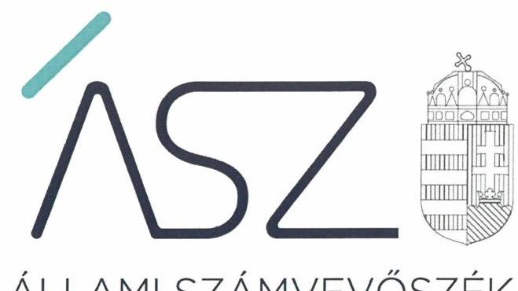
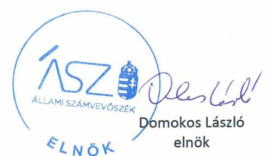

ÁLLAMI SZÁMVEVŐSZÉK

# JELENTÉS 

## Központi költségvetési szervek ellenőrzése

Kiskunfélegyházi Mezőgazdasági és Élelmiszeripari Szakgimnázium, Szakközépiskola és Kollégium

2020.

20052
www.asz.hu

---

ÁLLAMI SZÁMVEVŐSZÉK

# JELENTÉS 

## Központi költségvetési szervek ellenőrzése

Kiskunfélegyházi Mezőgazdasági és Élelmiszeripari Szakgimnázium, Szakközépiskola és Kollégium
2020. 04. hó 21. nap

20052
www.asz.hu

---

# AZ ELLENŐRZÉST FELÜGYELTE: 

KLINGA LÁSZLÓ felügyeleti vezető

## AZ ELLENŐRZÉST VEZETTE ÉS A VÉGREHAJTÁSÁÉRT FELELŐS:

DÉZSINÉ KIS HAJNALKA ellenőrzésvezető

A PROGRAM ÖSSZEÁLLÍTÁSÁÉRT FELELŐS:
TÓTPÁL SZABOLCS osztályvezető

IKTATÓSZÁM: EL-2541-001/2020.
TÉMASZÁM: 2450
ELLENŐRZÉS-AZONOSÍTÓ SZÁM: V079161
Jelentéseink az Országgyűlés számítógépes hálózatán és az interneten a www.asz.hu címen is olvashatóak.

---

# TARTALOMJEGYZÉK 

■ ÖSSZEGZÉS ..... 5
■ AZ ELLENŐRZÉS CÉLJA ..... 6
■ AZ ELLENŐRZÉS TERÜLETE ..... 7
■ AZ ELLENŐRZÉS HÁTTERE, INDOKOLTSÁGA ..... 8
■ A JELENTÉS LÉNYEGES KÉRDÉSKÖREI ..... 9
■ AZ ELLENŐRZÉS HATÓKÖRE ÉS MÓDSZEREI ..... 10
■ MEGÁLLAPÍTÁSOK ..... 12
■ JAVASLATOK ..... 15
■ MELLÉKLETEK ..... 17
I. sz. melléklet: Értelmező szótár ..... 17
■ FÜGGELÉK: ÉSZREVÉTELEK ..... 19
■ RÖVIDÍTÉSEK JEGYZÉKE ..... 21

---

.

---

# ÖSSZEGZÉS 

A Kiskunfélegyházi Mezőgazdasági és Élelmiszeripari Szakgimnázium, Szakközépiskola és Kollégium belső kontrollrendszere, pénzügyi és vagyongazdálkodása nem volt szabályszerű. Nem volt biztosított a nemzeti vagyonnal való átlátható, elszámoltatható és felelős gazdálkodás. Az Intézmény nem volt védett a korrupcióval szemben.

## Az ellenőrzés társadalmi indokoltsága

Magyarország versenyképességének és a magyar gazdaság fejlődésének alapvető feltétele a magyar munkavállalók megfelelő szakmai képzettsége és felkészültsége, amelyben a szakképzési rendszernek döntő szerepe van. A mezőgazdaság vonatkozásában is kiemelten fontos ez, hiszen a magyar mezőgazdaság piaci versenyképességét és eredményességét nagymértékben befolyásolja az agrárszférában dolgozók képzettsége, felkészültsége. A szakképzés legjelentősebb színterei a szakképző iskolák. Az eredményes és célszerű szakképzés alapja és alapvető feltétele a szakképző intézmények közpénzekkel és a közvagyonnal való törvényes, átlátható és a korrupcióval szembeni védelmet biztosító működése és gazdálkodása. Ezért ezen szervezetekkel szemben is alapvető társadalmi igény, hogy a rájuk bízott közpénzekkel, közvagyonnal szabályosan gazdálkodjanak. Emellett a szakképzésben részt vevő pedagógusok, tanulók és a szülők jogos elvárása, hogy a szakképző iskolák működése átlátható és elszámoltatható legyen. Mindezen igényekkel összhangban, a közpénzügyek átláthatóságának előmozdítása, a közvagyon védelme érdekében került sor az agrár-szakképző iskolák belső kontrollrendszerének és gazdálkodásának ellenőrzésére.

## Főbb megállapítások, következtetések, javaslatok

A Kiskunfélegyházi Mezőgazdasági és Élelmiszeripari Szakgimnázium, Szakközépiskola és Kollégium belső kontrollrendszerének kialakítása és működtetése nem volt szabályszerű, ezáltal az Intézmény nem biztosította a szabályszerű közpénzfelhasználás feltételeit.

A Kiskunfélegyházi Mezőgazdasági és Élelmiszeripari Szakgimnázium, Szakközépiskola és Kollégium pénzügyi és vagyongazdálkodása nem felelt meg a jogszabályi előírásoknak, mert nem gondoskodott a költségvetési beszámolót alátámasztó részletező nyilvántartásokról és a költségvetési beszámoló mérleg tételeinek leltárral való alátámasztásáról, ezért az Intézmény 2016-2017. évi költségvetési beszámolói nem mutatnak megbízható, valós képet az Intézmény pénzügyi, vagyoni helyzetéről.

A Kiskunfélegyházi Mezőgazdasági és Élelmiszeripari Szakgimnázium, Szakközépiskola és Kollégium a korrupciós kockázatok kezelésére nem építette ki az integritást támogató és erősítő kontrollokat, kockázatelemzést nem végeztek.

Az Állami Számvevőszék a jelentésben foglalt megállapítások alapján a Kiskunfélegyházi Mezőgazdasági és Élelmiszeripari Szakgimnázium, Szakközépiskola és Kollégium igazgatója részére 14 javaslatot fogalmazott meg.

---

# AZ ELLENŐRZÉS CÉLJA 

AZ ELLENŐRZÉS CÉLJA annak megállapítása volt, hogy a központi költségvetési szervre vonatkozó irányító szervi feladatellátás a jogszabályi előírások betartásával történt-e; a központi költségvetési szerv belső kontrollrendszerének kialakítása és működtetése szabályszerű volt-e, biztosította-e az átlátható, szabályszerű, gazdaságos, hatékony és eredményes gazdálkodás feltételeit. Kiépítették és erősítették-e a korrupciós kockázatok kezelését szolgáló integritás kontrollokat; az intézményt érintő átszervezések lebonyolítása szabályszerűen történt-e; megteremtették-e a teljesítményellenőrzés feltételeit. Továbbá annak megállapítása, hogy a szervezet gazdálkodása során elszámoltatható és megfelel-e annak az Alaptörvényben meghatározott alapvetésnek, hogy Magyarország a kiegyensúlyozott, átlátható és fenntartható költségvetési gazdálkodás elvét érvényesíti. Érvényesül-e a nemzeti vagyon kezelésének és védelmének célja, azaz a szervezet vagyona a közérdeket szolgálja, a közös szükségletek kielégítése és a természeti erőforrások megóvása, valamint a jövő nemzedékek szükségleteinek figyelembevétele mellett.

---

# AZ ELLENŐRZÉS TERÜLETE 

## Kiskunfélegyházi Mezőgazdasági és Élelmiszeripari Szakgimnázium, Szakközépiskola és Kollégium

A Kiskunfélegyházi Mezőgazdasági és Élelmiszeripari Szakgimnázium, Szakközépiskola és Kollégium köznevelési intézmény. Az Intézmény ${ }^{1}$ tevékenysége szakgimnáziumi, szakközépiskolai nevelés-oktatás és kollégiumi ellátás, valamint felnőttoktatás.

Az Intézmény irányító szerve² és fenntartója a Minisztérium ${ }^{3}$. Az Igazgató ${ }^{4}$ személye az ellenőrzés időszakában nem változott.

Az Intézmény gazdasági szervezettel nem rendelkezett, a gazdasági szervezeti feladatokat az FM ASZK ${ }^{5}$ látta el az ellenőrzött időszakban.

Az Intézmény átlagos statisztikai állományi létszáma 77 fő, tanulói létszáma 515 fő volt a 2017. évben.

---

# AZ ELLENŐRZÉS HÁTTERE, INDOKOLTSÁGA 

Az ÁSZ ${ }^{6}$ ellenőrzi a költségvetési szervek gazdálkodását, működését, hogy megállapításaival támogassa az ellenőrzött szervezetek szabályszerű gazdálkodását, javaslataival elősegítse az Alaptörvényben ${ }^{7}$ megfogalmazott alapvetések érvényesülését a mindennapi életben a szervezetek szintjén.

Az egyes ellenőrzések megállapításaival és egy időszak ellenőrzési eredményeinek elemzésével az ÁSZ ráirányíthatja a jogalkotók figyelmét a központi alrendszerben vagy annak egy ágazatában esetlegesen felmerülő pénzügyi, szabályozási feszültségekre.

Az elvégzett ellenőrzések során az ÁSZ „jó gyakorlatokat" is azonosíthat, melyeket tanácsadó funkciója keretében szélesebb körben is megismertethet az érintettekkel, ezáltal is hozzájárulva a költségvetési rendszer szabályozott, átlátható, kiegyensúlyozott és fenntartható működéséhez.

Az ellenőrzés a szervezet kockázatértékelése alapján, az egyedi és lényeges jellemzők figyelembevételével, az ellenőrzésre kiválasztott modullal történik.

Az integritás- és belső kontroll modul a központi költségvetési szerv működésének irányítottságát, korrupció elleni védettségét értékeli.

A belső kontrollrendszer kialakítása és működtetése nélkül nem valósítható meg a közpénzek, a közvagyon átlátható, szabályos, gazdaságos, hatékony és eredményes felhasználása. A belső kontrollrendszer azt a célt szolgálja, hogy a költségvetési szervek működésük és gazdálkodásuk során a tevékenységeket szabályszerűen hajtsák végre, teljesítsék elszámolási kötelezettségeiket és megvédjék az erőforrásokat a veszteségektől, a károktól és a nem rendeltetésszerű használattól.

Az államháztartás központi alrendszerébe tartozó szervezet vagyona a nemzeti vagyon része, és az Alaptörvény is rögzíti, hogy a vagyonnal való gazdálkodás célja a közérdek szolgálata.

---

# A JELENTÉS LÉNYEGES KÉRDÉSKÖREI 

1. Az irányító szerv ellenőrzött költségvetési szervre vonatkozó feladatellátása szabályszerű volt-e?
2. A belső kontrollrendszer kialakítása és működtetése szabályszerűen történt-e?
3. A költségvetési szervnél alakítottak-e ki a teljesítmény mérésére alkalmas követelményeket?
4. A költségvetési szerv pénzügyi gazdálkodása szabályszerű volt-e?
5. A költségvetési szerv vagyongazdálkodása szabályszerű volt-e?

---

# AZ ELLENŐRZÉS HATÓKÖRE ÉS MÓDSZEREI 

## Az ellenőrzés típusa

Megfelelőségi ellenőrzés.

## Az ellenőrzött időszak

A belső kontroll rendszer kialakítása és működtetése, a vagyongazdálkodás, továbbá az integritás kontrollok kiépítettsége tekintetében a 2016. és a 2017. év.

Az irányító szervi feladatellátás és a pénzügyi gazdálkodás tekintetében a 2016. év. A teljesítmény ellenőrzés feltételei tekintetében a 2017. év.

## Az ellenőrzés tárgya

Az ellenőrzött szervezetre vonatkozó irányító szervi feladatok ellátása. Az Intézmény belső kontroll rendszerének kialakítása és működtetése. Az Intézmény pénzügyi és vagyongazdálkodása, átalakításának vagy átszervezésének lebonyolítása. Az Intézménynél az integritáskontrollok kiépítettsége, az integritás szemlélet érvényesülése, a teljesítményellenőrzés feltételei.

## Az ellenőrzött szervezet

Kiskunfélegyházi Mezőgazdasági és Élelmiszeripari Szakgimnázium, Szakközépiskola és Kollégium és irányítószerve az Agrárminisztérium, valamint a gazdasági szervezeti feladatokat ellátó FM Kelet-magyarországi Agrár-szakképző Központ, Mezőgazdasági Szakképző Iskola és Kollégium.

## Az ellenőrzés jogalapja

Az ellenőrzés jogszabályi alapját az ÁSZ tv. ${ }^{8}$ 1. § (3) bekezdés, 5. § (2)-(3) és (6) bekezdései, (4) bekezdés a) pontja, valamint Áht. 61. § (2) bekezdésének előírásai képezik.

## Az ellenőrzés módszerei

Az ÁSZ az ellenőrzést az ellenőrzési program szempontjai, az ellenőrzött időszakban hatályos jogszabályok, az ellenőrzés szakmai szabályai, a jelen ellenőrzésre irányadó ÁSZ módszertanok figyelembevételével hajtotta végre.

---

Az ellenőrzési kérdések megválaszolásához szükséges bizonyítékok megszerzése az ellenőrzött által rendelkezésre bocsátott dokumentumokra, adatokra alapozva megfigyelés, szemle (szemrevételezés), mintavételezés, valamint elemző eljárás útján történik. Az ellenőrzési bizonyítékként felhasználható adatforrások közé tartoznak az ellenőrzési program részletes szempontjainál felsorolt adatforrások, valamint minden egyéb - az ellenőrzés folyamán feltárt, az ellenőrzés szempontjából információt tartalmazó - dokumentum.

Az ellenőrzés lefolytatásához az ellenőrzött szervezet tanúsítványok kitöltésével, valamint az ÁSZ által kért dokumentumok megküldésével szolgáltat adatokat, amelyek valódiságát és teljes körűségét az ellenőrzött szervezet vezetője által tett teljességi és hitelességi nyilatkozat igazolja. A rendelkezésre bocsátott adatok, információk kontrollja az ellenőrzés keretében történt.

A központi költségvetési szerv belső kontrollrendszere egyes pilléreinek kialakítására és működtetésére vonatkozó értékelés:
$\longrightarrow$ „szabályszerű", amennyiben az értékelt területen az elért „igen" válaszok százalékban kifejezett, egész számra kerekített aránya legalább 85 %,
$\longrightarrow$ „nem szabályszerű", ha nem éri el a 85%-ot.
A kontrollrendszer egésze esetében a „szabályszerű" értékelésnek a százalékos értéken felül további feltétele, hogy egyik kontrollterület sem kaphat „nem szabályszerű" értékelést.

A kiadások ellenőrzésére a 2017. év vonatkozásában került sor. A kiadások (külső személyi juttatások, felhalmozási kiadások, dologi kiadások) esetében az ellenőrzés azokra a legnagyobb értékű tételekre - a lényeges sokaságra - terjedt ki, melyek összértéke eléri a teljes sokaság összértékének 50%-át.

A 2017. évi kiadások elszámolásának szabályszerűségét a lényeges sokaságból véletlen mintavételi eljárással kiválasztott tételek alapján ellenőriztük.

A 2017. évi beruházások, felújítások végrehajtásának, valamint a feladatellátást szolgáló állami vagyontárgyak év végi értékelésének szabályszerűségének esetében tételes ellenőrzésre került sor.

A mintavétellel ellenőrzött területek esetében minden egyes tétel vonatkozásában az elszámolás szabályszerűségére vonatkozó kérdéseket tettünk fel. Szabályszerűnek értékeltünk egy ellenőrzött területet, amennyiben 95%-os bizonyossággal az ellenőrzött sokaságban az átlagos hibaarány legfeljebb 10%, nem szabályszerűnek, amennyiben 10%-nál magasabb arányt képviselt.

Az ellenőrzés ideje alatt az ellenőrzött szervezettel történő kapcsolattartást az ÁSZ SZMSZ-ének vonatkozó előírásai alapján biztosította az ÁSZ.

---

# 1. Az irányító szerv ellenőrzött költségvetési szervre vonatkozó feladatellátása szabályszerű volt-e? 

Összegző megállapítás Az Irányító szerv Intézményre vonatkozó feladatellátása a 2016. évben szabályszerű volt.

Az Irányító szerv az Áht. ${ }^{9}$-ban foglalt jogkörében eljárva kiadmányozta az Intézmény alapító okiratának módosítását a szakképzés rendszerét érintő szabályozási környezet változása miatt.

Az Irányító szerv az Áht. és az Áhsz. ${ }^{10}$ előírása alapján jóváhagyta az Intézmény elemi költségvetését és éves költségvetési beszámolóját, beszámoltatta az Intézményt az éves szakmai feladatellátásról.

## 2. A belső kontrollrendszer kialakítása és működtetése szabályszerűen történt-e?

## Összegző megállapítás

Az Intézmény belső kontroll rendszerének kialakítása és működtetése nem volt szabályszerű a 2016-2017. években.

A KONTROLLKÖRNYEZET kialakítása nem volt szabályszerű a 2016-2017. években. Az Intézmény az Ávr. ${ }^{11}$ 13. § (2) bekezdés b) pontjában foglaltak ellenére nem szabályozta a beszerzések lebonyolításával kapcsolatos eljárásrendet. Az Intézmény számlarendje az Áhsz. 51. § (3) bekezdésének előírása ellenére nem szabályozta a részletező nyilvántartások vezetési módját és azoknak a kapcsolódó könyvviteli és nyilvántartási számlákkal való egyeztetését, annak dokumentálását. Az Intézmény nem határozta meg az etikai elvárásokat a szervezet minden szintjén a Bkr. ${ }^{12}$ 6. § (1) bekezdés c) pontja ellenére, valamint nem rendelkezett közalkalmazotti szabályzattal a Kjt. ${ }^{13}$ 17. § (1) bekezdésében foglaltak ellenére.

INTEGRÁLT KOCKÁZATKEZELÉSI RENDSZERT az Intézmény nem alakított ki a 2016-2017. években. Az Intézmény 2016. szeptember 30.-ig a Bkr. 3.§ b) pontjában foglaltak ellenére nem alakított ki kockázatkezelési rendszert, valamint 2016. október 1-től a Bkr. 6. § (4) bekezdésében foglaltak ellenére nem szabályozta az
 integrált kockázatkezelés eljárásrendjét.

A kontrolltevékenységek kialakítása a 2016-2017. években, valamint a kontrolltevékenységek gyakorlása a 2017. évben nem volt szabályszerű.

Az Intézmény a 2016-2017. években az Ávr. 60.§ (3) bekezdésében foglaltak ellenére nem vezetett naprakész nyilvántartást a gazdálkodási jogkörgyakorlásra jogosult személyek aláírás-mintájáról.

---

Az Intézmény a 2017. évben a kiadási előirányzatok felhasználását nem támasztotta alá írásbeli kötelezettségvállalással az Áht. 37. § (1) bekezdése ellenére, valamint nem támasztotta alá teljesítés igazolással a kiadások kifizetését az Áht. 38. § (1) bekezdése ellenére. Az Intézmény a 2017. évben a Számv.tv. ${ }^{14} 165$. § (2) bekezdése ellenére bizonylat nélkül jegyzett be adatokat a könyvviteli nyilvántartásába.

# AZ INFORMÁCIÓS ÉS KOMMUNIKÁCIÓS RENDSZER kialakítása és működtetése nem volt szabályszerű a 2016-2017. években. 

Az Intézmény nem rendelkezett az Info tv. ${ }^{15} 24$. § (3) bekezdése ellenére adatvédelmi és adatkezelési szabályzattal.

Nyomon követési rendszert az Intézmény a 2016-2017. években, a Bkr. 10. §-ában előírtak ellenére nem alakított ki, amely biztosítja a szervezet tevékenységének, a célok megvalósításának nyomon követését. A nyomon követési rendszer az operatív tevékenységek keretében megvalósuló folyamatos és eseti nyomon követésből, valamint az operatív tevékenységektől függetlenül működő belső ellenőrzésből állhat.

Az Intézmény Igazgatója a 2016-2017. években eleget tett a Bkr. 11. § (1) bekezdésében előírt nyilatkozattételi kötelezettségének a belső kontrollrendszer minőségének értékelésére vonatkozóan. A nyilatkozat tartalmát az ellenőrzés nem igazolta.

## AZ INTEGRITÁS KONTROLLOK KIÉPÍTÉSE ÉS

MŰKÖDTETÉSE nem volt megfelelő a 2016-2017. években. Az Intézmény nem végzett kockázatelemzést, nem építette ki és nem működtette a kötelezően és a nem kötelezően előírt integritást támogató, erősítő kontrolljait.

## 3. A költségvetési szervnél alakítottak-e ki a teljesítmény mérésére alkalmas követelményeket?

Összegző megállapítás Az Intézmény nem alakította ki a teljesítmény mérésére alkalmas követelményeket a 2017. évben.

Az Intézmény nem képzett a szervezeti célok eléréséhez szükséges feladatok és folyamatok mérésére szolgáló indikátorokat, mérőszámokat, feladat és teljesítménymutatókat, így nem biztosították a teljesítménymérés feltételeit.

---

# 4. A költségvetési szerv pénzügyi gazdálkodása szabályszerű volt-e? 

Összegző megállapítás Az Intézmény pénzügyi gazdálkodása a 2016. évben nem volt szabályszerű.

A KIADÁSOK ÉS A BEVÉTELEK ELSZÁMOLÁSA
nem volt szabályszerű a 2016. évben, mert az Intézmény az Áhsz. 5. § (1) bekezdésében foglaltak ellenére nem rendelkezett költségvetési beszámolóját alátámasztó, részletező nyilvántartással a külső személyi juttatások és a dologi kiadások, valamint a vagyontárgyak bérbeadásából származó bevételek esetében.

A KÖTELEZETTSÉGVÁLLALÁSOK NYILVÁNTARTÁSA a 2016. évben nem volt szabályszerű, mert az Intézmény az Áhsz. 39.§ (3) bekezdésében foglaltak ellenére nem gondoskodott a kötelezettségvállalások jogszabálynak megfelelő nyilvántartásáról, a nyilvántartás az Áhsz. 14. melléklet II. 4.
$\longrightarrow$ a) pontja ellenére nem tartalmazta a pénzügyi ellenjegyzésre vonatkozó adatokat,
$\longrightarrow$ e) pontja ellenére nem tartalmazta a pénzügyi teljesítési határidőket.

## 5. A költségvetési szerv vagyongazdálkodása szabályszerű volt-e?

## Összegző megállapítás Az Intézmény vagyongazdálkodása nem volt szabályszerű a 2016-2017. években.

Az Intézmény a 2016-2017. években az Áhsz. 5. § (1) bekezdése és az Áhsz. 22.§ (1-2) bekezdéseiben, valamint a Számv.tv. 69.§ (1) bekezdésében foglaltak ellenére nem támasztotta alá költségvetési beszámolója mérleg tételeit leltárral.

---

# JAVASLATOK 

Az ÁSZ tv. 33. § (1) bekezdésében foglaltak értelmében az ellenőrzött szervezet vezetője köteles a jelentésben foglalt megállapításokhoz kapcsolódó intézkedési tervet összeállítani és azt a jelentés kézhezvételétől számított 30 napon belül az ÁSZ részére megküldeni. Amennyiben az ellenőrzött szervezet vezetője nem küldi meg határidőben az intézkedési tervet, vagy továbbra sem elfogadható intézkedési tervet küld, az Állami Számvevőszék elnöke az ÁSZ tv. 33. § (3) bekezdése a) és b) pontjaiban foglaltakat érvényesítheti.

## a Kiskunfélegyházi Mezőgazdasági és Élelmiszeripari Szakgimnázium, Szakközépiskola és Kollégium igazgatójának

1. Intézkedjen az Ávr. előírásainak megfelelően a beszerzések lebonyolításával kapcsolatos eljárásrend belső szabályzatban történő rendezéséről.
(2. sz. megállapítás 1. bekezdés 2. mondata alapján)
2. Intézkedjen az Áhsz. előírásainak megfelelően a részletező nyilvántartások vezetési módjának és azoknak a kapcsolódó könyvviteli és nyilvántartási számlákkal való egyeztetésének, annak dokumentálásának számlarendben történő szabályozásáról.
(2. sz. megállapítás 1. bekezdés 3. mondata alapján)
3. Intézkedjen a Bkr. előírásainak megfelelően olyan kontrollkörnyezet kialakításáról, amelyben meghatározottak az etikai elvárások a szervezet minden szintjén.
(2. sz. megállapítás 1. bekezdés 4. mondat 1. tagmondata alapján)
4. Intézkedjen a Kjt. előírásainak megfelelő közalkalmazotti szabályzat elkészítéséről.
(2. sz. megállapítás 1. bekezdés 4. mondat 2. tagmondata alapján)
5. Intézkedjen a Bkr. előírásainak megfelelő integrált kockázatkezelés eljárásrendjének kialakításáról.
(2. sz. megállapítás 2. bekezdés 2. mondata alapján)

---

6. Intézkedjen a gazdálkodási jogkörök gyakorlására jogosult személyek aláírás-mintáját tartalmazó nyilvántartás Ávr. szerinti, naprakész vezetéséről.
(2. sz. megállapítás 4. bekezdése alapján)
7. Intézkedjen arról, hogy kötelezettségvállalásra az Áht. előírásainak megfelelően kerüljön sor.
(2. sz. megállapítás 5. bekezdés 1. mondat 1. tagmondata alapján)
8. Intézkedjen annak érdekében, hogy a kiadási előirányzat terhére történő kifizetés elrendelésére az Áht. előírásainak megfelelően, a teljesítés igazolását követően kerüljön sor.
(2. sz. megállapítás 5. bekezdés 1. mondat 2. tagmondata alapján)
9. Intézkedjen, hogy a Számv. tv. előírásainak megfelelően a könyvviteli nyilvántartásokba csak szabályszerűen kiállított bizonylat alapján jegyezzenek be adatokat.
(2. sz. megállapítás 5. bekezdés 2. mondata alapján)
10. Intézkedjen az Info tv. előírásainak megfelelően az adatvédelmi és adatbiztonsági szabályzat megalkotásáról.
(2. sz. megállapítás 7. bekezdése alapján)
11. Intézkedjen a szervezet tevékenységének, a célok megvalósításának nyomon követését biztosító rendszer Bkr. szerinti kialakításáról.
(2. sz. megállapítás 8. bekezdése alapján)
12. Gondoskodjon az Áhsz. előírásainak megfelelően a beszámoló folyamatosan vezetett részletező nyilvántartással történő alátámasztásáról.
(4. sz. megállapítás 1. bekezdése alapján)
13. Intézkedjen, hogy a kötelezettségvállalásokról vezetett nyilvántartás megfeleljen az Áhsz. előírásainak.
(4. sz. megállapítás 2. bekezdése alapján)
14. Intézkedjen a jogszabályi előírásoknak megfelelően a költségvetési beszámoló mérleg tételeinek leltárral történő alátámasztásáról.
(5. sz. megállapítás 1. bekezdése alapján)

---

# MELLÉKLETEK 

- I. SZ. MELLÉKLET: ÉRTELMEZŐ SZÓTÁR
állami vagyon
állami vagyonnak minősül:
a) az állam tulajdonában lévő dolog, valamint a dolog módjára hasznosítható természeti erő,
b) az a) pont hatálya alá nem tartozó mindazon vagyon, amely vonatkozásában törvény az állam kizárólagos tulajdonjogát nevesíti,
c) az állam tulajdonában lévő tagsági jogviszonyt megtestesítő értékpapír, illetve az államot megillető egyéb társasági részesedés,
d) az államot megillető olyan immateriális, vagyoni értékkel rendelkező jogosultság, amelyet jogszabály vagyoni értékű jogként nevesít,
e) az állam tulajdonában lévő pénzügyi eszközök. (Forrás: Vtv. ${ }^{16}$ 1. § (2) bekezdése)
állami vagyon kezelője /vagyonkezelő
átalakítás
belső ellenőrzés
belső kontrollrendszer
belső kontrollrendszer területei
fenntartó
hasznosítás
információs és kommunikációs rendszer

Az állami vagyont az MNV Zrt. ${ }^{17}$ - maga kezeli, vagy szerződés - így különösen bérlet, haszonbérlet, megbízás - alapján központi költségvetési szervnek, természetes vagy jogi személynek, vagy jogi személyiséggel nem rendelkező gazdálkodó szervezetnek hasznosításra átengedi." Az állami vagyonra vonatkozóan az MNV Zrt. kizárólag az Nvtv-ben meghatározott személyekkel köthet vagyonkezelési szerződést. (Forrás: Vtv. 27. § (1) bekezdése, hatályos 2012. január 1-jétől)
A költségvetési szerv általános jogutódlással történő megszüntetése átalakítással történhet. Átalakítás az egyesítés, a szétválás, vagy ha az alapító szerv a költségvetési szervet megszünteti, és az átalakítás során a megszüntetett költségvetési szerv jogutódjaként új költségvetési szervet alapít. (Áht. 11. § (2) bekezdés)
Független, tárgyilagos bizonyosságot adó és tanácsadó tevékenység, amelynek célja, hogy az ellenőrzött szervezet működését fejlessze és eredményességét növelje, az ellenőrzött szervezet céljai elérése érdekében rendszerszemléletű megközelítéssel és módszeresen értékeli, illetve fejleszti az ellenőrzött szervezet irányítási és belső kontrollrendszerének hatékonyságát. (Forrás: Bkr. 2. § b) pontja)
A belső kontrollrendszer a kockázatok kezelése és tárgyilagos bizonyosság megszerzése érdekében kialakított folyamatrendszer, amely azt a célt szolgálja, hogy a működés és gazdálkodás során a tevékenységeket szabályszerűen, gazdaságosan, hatékonyan, eredményesen hajtsák végre, az elszámolási kötelezettségeket teljesítsék, megvédjék az erőforrásokat a veszteségektől, károktól és nem rendeltetésszerű használattól. (Forrás: Áht. 69. § (1) bekezdése)
A kontrollkörnyezet, az integrált kockázatkezelési rendszer, a kontrolltevékenységek, az információs és kommunikációs rendszer, valamint a nyomon követési (monitoring) rendszer. (Forrás: Bkr. 3. §-a)
Az a természetes vagy jogi személy, aki vagy amely a köznevelési feladat ellátására való jogosultságot megszerezte vagy azzal rendelkezik, és a köznevelési intézmény működéséhez szükséges feltételekről gondoskodik. (Forrás: Köznev. tv. ${ }^{18}$ 4. § 9. pont)
A nemzeti vagyon birtoklásának, használatának, hasznok szedése jogának bármely a tulajdonjog átruházását nem eredményező - jogcímen történő átengedése, ide nem értve a vagyonkezelésbe adást, valamint a haszonélvezeti jog alapítását. (Forrás: Nvtv. 3. § (1) bekezdés 4. pontja)
A költségvetési szerv vezetője által kialakított és működtetett olyan rendszer, mely biztosítja, hogy a megfelelő információk a megfelelő időben eljutnak az illetékes szervezethez, szervezeti egységhez, illetve személyhez. (Forrás: Bkr. 9. § (1) bekezdés)

---

integritás
irányító szerv/felügyeleti szerv
kockázat
integrált kockázatkezelési rendszer
kontrollkörnyezet
kontrolltevékenységek
közfeladat
nyomon követési rendszer (monitoring)
vagyongazdálkodás

Az integritás - egyik gyakran használt jelentése szerint - az elvek, értékek, cselekvések, módszerek, intézkedések konzisztenciáját jelenti, vagyis olyan magatartásmódot, amely meghatározott értékeknek megfelel. Integritás-irányítási rendszer bevezetése a szervezetben a szervezethez rendelt közfeladatok integritás szempontú ellátását, az érték alapú működéssel (integritással) összefüggő szervezeti követelmények következetes érvényesítését jelenti. (Forrás: Nemzetgazdasági Minisztérium: Államháztartási Belső Kontroll Standardok és Gyakorlati Útmutató 1.6. Etikai értékek és integritás 46. oldal, 2017. szeptember)
A költségvetési szerv tekintetében az Áht.-ban meghatározott irányítási hatáskört gyakorló szerv. (Forrás: Áht. 1. § 9. pontja)
A kockázat annak a valószínűségét jelenti, hogy egy vagy több esemény vagy intézkedés nem kívánt módon befolyásolja a rendszer működését, céljainak megvalósulását. (Forrás: Javaslatok a korrupciós kockázatok kezelésére - Kockázatkezelési és ellenőrzési módszertan 35. oldal, ÁSZ)
Olyan folyamatalapú kockázatkezelési rendszer, amely a szervezet minden tevékenységére kiterjed, egységes módszertan és eljárások alkalmazásával, a szervezet célkitűzéseinek és értékeinek figyelembevételével biztosítja a szervezet kockázatainak teljes körű azonosítását, azok meghatározott kritériumok szerinti értékelését, valamint a kockázatok kezelésére vonatkozó intézkedési terv elkészítését és az abban foglaltak nyomon követését. (Forrás: Bkr. 2. § m) pontja, 2016. október 1-jétől)
A költségvetési szerv vezetője által kialakított olyan elvek, eljárások, belső szabályzatok összessége, amelyben világos a szervezeti struktúra, a folyamatok átláthatók, egyértelműek a felelősségi, hatásköri viszonyok és feladatok, meghatározottak, ismertek és elfogadottak az etikai elvárások a szervezet minden szintjén, átlátható a humánerőforrás-kezelés, biztosított a szervezeti célok és értékek irányában való elkötelezettség fejlesztése és elősegítése. (Forrás: Bkr. 6. § (1) bekezdés)
A költségvetési szerv vezetője által a szervezeten belül kialakított (kontroll) tevékenységek, melyek biztosítják a kockázatok kezelését, hozzájárulnak a szervezet céljainak eléréséhez és erősítik a szervezet integritását. (Forrás: Bkr. 8. § (1) bekezdés)
Jogszabályban meghatározott állami vagy önkormányzati feladat, amit az arra kötelezett közérdekből, a jogszabályban meghatározott követelményeknek és feltételeknek megfelelve végez, ideértve a lakosság közszolgáltatásokkal való ellátását, továbbá az állam nemzetközi szerződésekben vállalt kötelezettségeiből adódó közérdekű feladatokat, valamint e feladatok ellátásakor szükséges infrastruktúra biztosítását is. (Forrás: Nvtv. 3. § (1) bekezdés 7. pontja)
A költségvetési szerv vezetője köteles kialakítani a szervezet tevékenységének a célok megvalósításának nyomon követését biztosító rendszert, amely az operatív tevékenységek keretében megvalósuló folyamatos és eseti nyomon követésből, valamint az operatív tevékenységektől függetlenül működő belső ellenőrzésből áll. (Forrás: Bkr. 10. §)

A nemzeti vagyongazdálkodás
 feladata a nemzeti vagyon rendeltetésének megfelelő, az állam, az önkormányzat mindenkori teherbíró képességéhez igazodó, elsődlegesen a közfeladatok ellátásához és a mindenkori társadalmi szükségletek kielégítéséhez szükséges, egységes elveken alapuló, átlátható, hatékony és költségtakarékos működtetése, értékének megőrzése, állagának védelme, értéknövelő használata, hasznosítása, gyarapítása, továbbá az állam vagy a helyi önkormányzat feladatának ellátása szempontjából feleslegessé váló vagyontárgyak elidegenítése. (Forrás: Nvtv. 7. § (2) bekezdése)

---

# FÜGGELÉK: ÉSZREVÉTELEK 

A jelentéstervezetet a Számvevőszék 15 napos észrevételezésre megküldte az ellenőrzött szervezetek vezetőinek az ÁSZ tv. 29. § (1) bekezdése előírásának megfelelően.

A Kiskunfélegyházi Mezőgazdasági és Élelmiszeripari Szakgimnázium, Szakközépiskola és Kollégium igazgatója, a gazdálkodási feladatokat ellátó AM Kelet-magyarországi Agrárszakképző Központ, Mezőgazdasági Szakgimnázium, Szakközépiskola és Kollégium főigazgatója, valamint az agrárminiszter a jelentéstervezet megállapításaira nem tettek észrevételt.

[^0]
[^0]:    * 29. § (1) Az Állami Számvevőszék az ellenőrzési megállapításait megküldi az ellenőrzött szervezet vezetőjének vagy az általa megbízott személynek, és annak, akinek személyes felelősségét állapította meg.
    (2) Az ellenőrzött szervezet vezetője és a felelősként megjelölt személy az ellenőrzés megállapításaira tizenöt napon belül írásban észrevételt tehet.
    (3) Az Állami Számvevőszék az észrevételre a beérkezésétől számított harminc napon belül írásban válaszol. A figyelembe nem vett észrevételeket köteles a jelentésben feltüntetni, és megindokolni, hogy azokat miért nem fogadta el.

---

.

---

# RÖVIDÍTÉSEK JEGYZÉKE 

${ }^{1}$ Intézmény
${ }^{2}$ Irányító szerv
${ }^{3}$ Minisztérium
${ }^{4}$ Igazgató
${ }^{5}$ FM-ASZK
${ }^{6}$ ÁSZ
${ }^{7}$ Alaptörvény
${ }^{8}$ ÁSZ tv.
${ }^{9}$ Áht.
${ }^{10}$ Áhsz.
${ }^{11}$ Ávr.
${ }^{12}$ Bkr.
${ }^{13}$ Kjt.
${ }^{14}$ Számv.tv.
${ }^{15}$ Info tv.
${ }^{16} \mathrm{Vtv}$.
${ }^{17}$ MNV Zrt.
${ }^{18}$ Köznev. tv.

Kiskunfélegyházi Mezőgazdasági és Élelmiszeripari Szakgimnázium, Szakközépiskola és Kollégium
Földművelésügyi Minisztérium/Agrárminisztérium
Földművelésügyi Minisztérium, 2018. május 18-tól Agrárminisztérium.
Kiskunfélegyházi Mezőgazdasági és Élelmiszeripari Szakgimnázium, Szakközépiskola és Kollégium igazgatója
FM Kelet-magyarországi Agrár-szakképző Központ, Mezőgazdasági Szakképző Iskola és Kollégium
Állami Számvevőszék
Magyarország Alaptörvénye (2011. április 25.)
az Állami Számvevőszékről szóló 2011. évi LXVI. törvény
az államháztartásról szóló 2011. évi CXCV. törvény
az államháztartás számviteléről szóló 4/2013. (I. 11.) Korm. rendelet
az államháztartási törvény végrehajtásáról szóló 368/2011 (XII.31.) Korm. rendelet
a költségvetési szervek belső kontrollrendszeréről és belső ellenőrzésről szóló 370/2011. (XII. 31.) Korm. rendelet
a közalkalmazottak jogállásáról szóló 1992. évi XXXIII. törvény
a számvitelről szóló 2000. évi C. törvény
az információs önrendelkezési jogról és az információszabadságról szóló 2011. évi CXII. törvény
2007. évi CVI. törvény az állami vagyonról (hatályos: 2007. szeptember 25-től) Magyar Nemzeti Vagyonkezelő Zrt.
2011. évi CXC. törvény a nemzeti köznevelésről
(hatályos: 2012. szeptember 1-jétől)

---

# ÁSZ 

ÁLLAMI SZÁMVEVŐSZÉK
1052 Budapest, Apáczai Cs. J. u. 10. I 1364 Budapest 4. Pf. 54 TEL: +36 14849100
email: szamvevoszek@asz.hu
web: www.asz.hu | www.aszhirportal.hu

