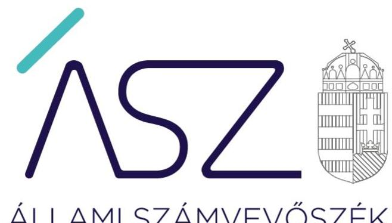
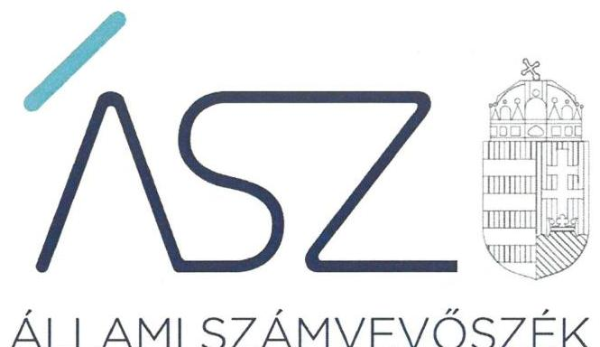
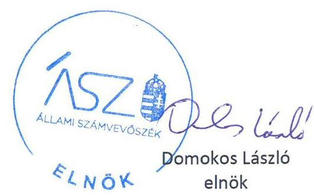
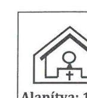
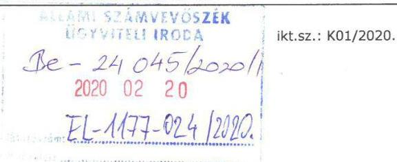
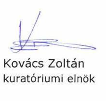
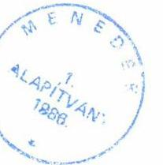
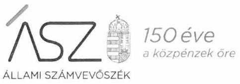
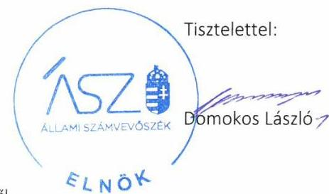

ÁLLAMI SZÁMVEVŐSZÉK

# JELENTÉS 

## Nem állami humánszolgáltatók ellenőrzése

A humánszolgáltatást nyújtó államháztartáson kívüli szociális intézmények, szolgáltatók fenntartói központi költségvetésből kapott támogatásai felhasználásának ellenőrzése Menedék Alapítvány

2020
20053
www.asz.hu

---

ÁLLAMI SZÁMVEVŐSZÉK

# JELENTÉS 

## Nem állami humánszolgáltatók ellenőrzése

A humánszolgáltatást nyújtó államháztartáson kívüli szociális intézmények, szolgáltatók fenntartói központi költségvetésből kapott támogatásai felhasználásának ellenőrzése Menedék Alapítvány
2020. 03. 26.

20053
www.asz.hu

---

# AZ ELLENŐRZÉST FELÜGYELTE: 

KLINGA LÁSZLÓ felügyeleti vezető

## AZ ELLENŐRZÉST VEZETTE ÉS A VÉGREHAJTÁSÁÉRT FELELŐS:

DR. GÁL NÓRA ellenőrzésvezető

A PROGRAM ÖSSZEÁLLÍTÁSÁÉRT FELELŐS:
TÓTPÁL SZABOLCS osztályvezető

IKTATÓSZÁM: EL-2540-001/2020
TÉMASZÁM: 2491
ELLENŐRZÉS-AZONOSÍTÓ SZÁM: V083537
Jelentéseink az Országgyűlés számítógépes hálózatán és az interneten a www.asz.hu címen is olvashatóak.

---

# TARTALOMJEGYZÉK 

■ ÖSSZEGZÉS ..... 5
■ AZ ELLENŐRZÉS CÉLJA ..... 6
■ AZ ELLENŐRZÉS TERÜLETE ..... 7
■ AZ ELLENŐRZÉS HÁTTERE, INDOKOLTSÁGA ..... 8
■ A JELENTÉS LÉNYEGES KÉRDÉSKÖRE ..... 9
■ AZ ELLENŐRZÉS HATÓKÖRE ÉS MÓDSZEREI ..... 10
■ MEGÁLLAPÍTÁSOK ..... 12
■ KÖVETKEZTETÉSEK ..... 13
■ MELLÉKLETEK ..... 15
I. sz. melléklet: Értelmező szótár ..... 15
■ FÜGGELÉKEK ..... 17
I. sz. függelék a jelentéshez ..... 17
II. sz. függelék: Észrevételek ..... 18
■ RÖVIDÍTÉSEK JEGYZÉKE ..... 25

---

.

---

# ÖSSZEGZÉS 

A Menedék Alapítvány szociális feladatokat ellátó intézményei működtetéséhez igénybe vett közpénzekkel való gazdálkodása nem volt elszámoltatható és átlátható.

## Az ellenőrzés társadalmi indokoltsága

Az Állami Számvevőszék stratégiájában célul tűzte ki, hogy az államháztartáson kívülre nyújtott költségvetési támogatások ellenőrzésével hozzájáruljon ahhoz, hogy a közpénzeket az államháztartáson kívüli szervezetek is átlátható módon használják fel a közfeladatok szerződésben vállalt ellátása érdekében. Fontos a közvélemény biztosítása arról, hogy a közpénz államháztartáson kívüli felhasználása ezen a területen sem marad ellenőrizetlenül. Az ellenőrzés eredményeképpen a nyilvánosság és a szolgáltatást igénybe vevők megfelelő tájékoztatást kaphatnak az államháztartáson kívüli közfeladatot ellátó működéséről.

## Főbb megállapítások, következtetések

A Menedék Alapítvány a jogszabályi előírások ellenére 2015-2017. években nem rendelkezett számviteli politikával és az annak keretében elkészítendő szabályzatokkal, ezáltal nem alakította ki a szabályszerű működés és gazdálkodás kereteit. A szabályozás hiánya miatt a számviteli elszámolások szabályszerűsége, illetve a közpénzekkel való rendeltetésszerű és felelős gazdálkodás nem volt biztosított. A Menedék Alapítvány a beszámolási kötelezettségének nem tett eleget.

---

# AZ ELLENŐRZÉS CÉLJA

**AZ ELLENŐRZÉS CÉLJA** annak értékelése, hogy a nem állami, nem önkormányzati szociális intézmények fenntartói központi költségvetésből kapott támogatásainak felhasználása szabályszerű volt-e, a támogatások igénylése, évközi módosítása és év végi elszámolása megfelel-e a jogszabályi előírásoknak.

---

# **AZ ELLENŐRZÉS TERÜLETE**

## **Menedék Alapítvány**

A Menedék Alapítványt 1990-ben magánszemélyek alapították, az alapítók az alapítói jogok gyakorlására a Menedék Egyesületet jelölték ki 2006. évtől kezdődően. A Menedék Alapítvány közhasznúsági jogállását 1998. évben szerezte meg, székhelye az ellenőrzött időszakban Budapest volt. A Fenntartó3 létrehozásának célja a veszélyeztetett helyzetű fiatalok reszocializálása, rehabilitálása, az átmeneti otthonok létrehozása és működtetése, a rászorulók ideiglenes elhelyezése, munkába állítása, fegyelmezett életvitel kialakítása, illetve az önálló életvitelhez szükséges körülmények megteremtésének elősegítése volt.

A Fenntartó céljai megvalósítása érdekében létrehozta a Menedékváros Hajléktalanok Átmeneti Otthonát, a Menedékváros Népkonyhát, a Menedékváros Családok Átmeneti Otthonát, a Menedék Fiúotthont, valamint a Menedék Mamásotthont.

A Fenntartó vagyonának kezeléséről, az alapítványi vagyon felhasználásáról a hat tagú kuratórium döntött, a működés és gazdálkodás ellenőrzése a három tagú felügyelőbizottság feladata volt.

A Fenntartó a központi költségvetésből feladatainak ellátására 2015. évben 91,8 millió Ft, 2016. évben 95,8 millió Ft és 2017. évben 86,8 millió Ft normatív központi költségvetési támogatásban részesült.

---

# AZ ELLENŐRZÉS HÁTTERE, INDOKOLTSÁGA 

A szociális feladatokat ellátó nem állami intézményfenntartók részére közfeladataik ellátására évente jelentős összegű pénzügyi támogatást biztosítottak a mindenkori költségvetési törvények² a bennük megfogalmazott feltételek mellett. A költségvetési törvények a szociális ágazat feladatai ellátására 273 Mrd Ft állami támogatás előirányzatot biztosítottak a 2015-2017. években. Módosították a szociális igazgatásról és szociális ellátásokról szóló 1993. évi III. törvényt, amely - többek között - 2012. január 1-jei hatállyal megfogalmazta a finanszírozási rendszerbe történő befogadással összefüggő szabályokat.

Az ÁSZ³ stratégiájában hangsúlyos szerepet szánt annak, hogy szilárd szakmai alapokon álló, értékteremtő ellenőrzéseivel előmozdítsa a közpénzügyek átláthatóságát, rendezettségét, és javaslataival a közpénzek és a közvagyon szabályos, gazdaságos, hatékony és eredményes felhasználását segítse. Az államháztartáson kívülre nyújtott költségvetési támogatások ellenőrzésével az ÁSZ hozzájárul ahhoz, hogy a közpénzeket a nem állami humán fenntartók átlátható módon használják fel a közfeladatok ellátására kötött szerződésekben vállalt kötelezettségének teljesítése érdekében. Az ellenőrzés javaslataival hozzájárulhat az említett rendszerek szabályszerű támogatás felhasználásához, javíthatja a társadalmi-gazdasági döntések megalapozottságát, amely a „jól irányított állam" működéséhez járul hozzá.

Az ellenőrzés keretében egyedi kockázatelemzés alapján kiválasztott fenntartóknál és intézményeiknél értékeljük az államháztartáson kívüli szociális tevékenységhez kapcsolódó támogatások felhasználásának megfelelőségét.

---

# A JELENTÉS LÉNYEGES KÉRDÉSKÖRE 

- A Fenntartó szabályszerű működési és gazdálkodási környezet kialakításával megteremtette-e a költségvetési támogatások átlátható, elszámoltatható igénybevételének, felhasználásának feltételeit?

---

# AZ ELLENŐRZÉS HATÓKÖRE ÉS MÓDSZEREI 

## Az ellenőrzés típusa

Megfelelőségi ellenőrzés.

## Az ellenőrzött időszak

A 2015. január 1-je és 2017. december 31-e közötti időszak

## Az ellenőrzés tárgya

Az ellenőrzés a szociális humánszolgáltatási közfeladatokat ellátó államháztartáson kívüli fenntartók, humánszolgáltatási közfeladatai ellátásához a költségvetési törvényekben biztosított központi költségvetési támogatások igénylése, évközi módosítása és év végi elszámolása fenntartói feladatainak ellátása, illetve e központi költségvetésből kapott támogatásaik humánszolgáltatási közfeladatokra való fenntartó általi felhasználása szabályszerűségének értékelésére terjed ki.

## Az ellenőrzött szervezet

Menedék Alapítvány

## Az ellenőrzés jogalapja

Az ellenőrzés jogszabályi alapját az ÁSZ tv. ${ }^{4} 1 . \S$ (3) bekezdése, 5. § (3) bekezdésében foglalt előírások adják.

## Az ellenőrzés módszerei

Az ellenőrzést az ellenőrzési program szempontjai, kérdései, az ellenőrzött időszakban hatályos jogszabályok alapján, a nemzetközi standardokat irányadónak tekintve, az ellenőrzés szakmai szabályok és módszertanok figyelembe vételével végezte az ÁSZ.

Az ellenőrzés ideje alatt az ellenőrzött szervezettel történő kapcsolattartást az ÁSZ SZMSZ5-ének vonatkozó előírásai alapján biztosította az ÁSZ.

Az ellenőrzési kérdések megválaszolásához szükséges bizonyítékok megszerzése az ellenőrzött által rendelkezésre bocsátott dokumentumokra, adatokra alapozva történt. Az ellenőrzési bizonyítékként felhasználható adatforrások közé tartoztak egyrészt az ellenőrzési program részletes szempontjainál felsorolt adatforrások, másrészt minden - az ellenőrzés folyamán feltárt - az ellenőrzés szempontjából információt tartalmazó dokumentum.

Az ellenőrzés lefolytatásához az ellenőrzött szervezet az ÁSZ által kért dokumentumok elektronikus úton való megküldésével szolgáltatott adatokat, információkat.

Amennyiben a Fenntartó működését és gazdálkodását alapvetően meghatározó dokumentum hiánya miatt, valamely lényeges kérdéskörre vonatkozóan az ÁSZ megállapítást tett, további ellenőrzési tevékenységek az adott kérdéskörre és az azzal szorosan logikai kapcsolatban lévő kérdéskörökre vonatkozóan - ráépülő jelleggel - nem kerültek végrehajtásra.

---

# MEGÁLLAPÍTÁSOK 

## A Fenntartó szabályszerű működési és gazdálkodási környezet kialakításával megteremtette-e a költségvetési támogatások átlátható, elszámoltatható igénybevételének, felhasználásának feltételeit?

Összegző megállapítás

A költségvetési támogatások átlátható, elszámoltatható igénybevételének és felhasználásának feltételeit a Fenntartó nem teremtette meg, így a gazdálkodása nem volt szabályszerű.

A Fenntartó működésének szabályozottsága, ennek keretében a Fenntartó gazdálkodására vonatkozó belső szabályozás nem felelt meg a jogszabályi előírásoknak, mivel a 2015-2017. években nem rendelkezett a Számv. tv. ${ }^{6} 14 . \S$ (3) bekezdésében előírt számviteli politikával, a Számv. tv. 14. § (5) bekezdés a)-b) és d) pontjaiban előírt eszközök és a források leltárkészítési és leltározási szabályzatával, az eszközök és a források értékelési szabályzatával, valamint pénzkezelési szabályzattal.

A Fenntartó a közfeladatot ellátó intézményei működtetéséhez felhasznált közpénzekre vonatkozó gazdálkodásával a nyilvánosság előtt nem számolt el. A jogszabályokban előírt beszámolási kötelezettségének a Számv. tv 4. § (1) bekezdésében, Civilszr ${ }_{1}{ }^{7} 6 . \S$ (1) bekezdésében és Civilszr ${ }_{2}{ }^{8} 7 . \S$ (1) bekezdésében foglaltak ellenére nem tett eleget, ezzel nem biztosította a közpénzek törvényes felhasználásának ellenőrizhetőségét, és az Alaptörvényben előírt átláthatóság elvének érvényesülését.

---

# KÖVETKEZTETÉSEK 

Az ÁSZ tv. 32. § (1) bekezdésében foglaltak értelmében az ÁSZ jelentés tartalmazza a feltárt tényeket, az ezeken alapuló megállapításokat, következtetéseket, amelyeknek a 24. § (1) d) pontja szerint okszerűnek és megalapozottnak kell lenniük.

A Menedék Alapítvány, mint szociális intézményfenntartó azzal, hogy nem rendelkezett számviteli politikával és annak keretében elkészítendő szabályzatokkal, a szabályszerű működés és gazdálkodás keretrendszerét nem alakította ki. A jogszabályban előírt beszámolási kötelezettségnek nem tett eleget, így nem biztosította az Alaptörvényben előírt átláthatóság elvének érvényesítését.

Mindezek alapján a Menedék Alapítványnál a költségvetési támogatások kezelése és felhasználása nem volt ellenőrizhető, így a gazdálkodás nem volt elszámoltatható.

---

.

---

# MELLÉKLETEK 

- I. SZ. MELLÉKLET: ÉRTELMEZŐ SZÓTÁR
költségvetési támogatás
közfeladat
szociális intézmény
nem állami, nem önkormányzati (államháztartáson kívüli) intézmény fenntartó
a társadalombiztosítás pénzügyi alapjai kivételével az államháztartás központi alrendszeréből ellenérték nélkül, pénzben nyújtott támogatások (Áht. 1. § 14. pont)
A költségvetési törvényekben (2013. évi CCXXX. törvény 33-34. §, 2014. évi C. törvény 42-43. §, 2015. évi C. törvény 40-41. §) megállapított támogatás. Például a 2015. évi C. törvény 40-41. § szerint többek között: Az Országgyűlés a szociális, gyermekjóléti, gyermekvédelmi közfeladatot ellátó intézményt, szolgáltatást fenntartó egyházi jogi személy, civil szervezet, közalapítvány, országos nemzetiségi önkormányzat, települési vagy területi nemzetiségi önkormányzat, gazdasági társaság, és a humánszolgáltatást alaptevékenységként végző, az Szja tv. hatálya alá tartozó egyéni vállalkozó (a továbbiakban együtt: nem állami szociális fenntartó) részére támogatást állapít meg a következők szerint: a támogatás a nem állami szociális fenntartót a települési önkormányzatok 2. melléklet III. pont 3. alpont c)-k) pontjában és III. pont 5. alpont a) pontjában meghatározott támogatásaival azonos jogcímeken, összegben és feltételek mellett illeti meg.
„Közfeladat a jogszabályokban meghatározott állami vagy önkormányzati feladat. ...A közfeladatok ellátásában államháztartáson kívüli szervezet jogszabályban meghatározott rendben közreműködhet." A közfeladatot meghatározó jogszabályban meg kell határozni a közfeladat ellátásának módját és egyidejűleg rendezni kell annak az ellátásához szükséges fedezet biztosításáról. (Az államháztartásról szóló CXCV. törvény 3/A. § (1)-(3) bekezdés)
A szociális igazgatásról szóló 1993. évi III. törvényben meghatározott nappali, illetve bentlakásos ellátást vagy támogatott lakhatást nyújtó szervezet. (Szoc.tv. 4. § (1) bekezdés h) pont)
A szociális, gyermekjóléti és gyermekvédelmi közfeladatokat/humánszolgáltatásokat ellátó intézményt fenntartó egyházi jogi személy, társadalmi szervezet, alapítvány, közalapítvány, civil szervezet, országos nemzetiségi önkormányzat, nonprofit gazdasági társaság, gazdasági társaság és a humánszolgáltatást alaptevékenységként végző, Szja tv. hatálya alá tartozó egyéni vállalkozó. (2013. évi Kvtv. 35. § (1), (3) bekezdés, 2014. évi Kvtv. 33. §, 34. § (1), (4) bekezdés, 2015. évi Kvtv. 42. §, 43. § (1), (4) bekezdés, 2016. évi Kvtv. 40. §, 41. § (1), (4) bekezdés, 2017. évi Kvtv. 41. § (1), (4))

---

.

---

# FÜGGELÉKEK 

- I. SZ. FÜGGELÉK A JELENTÉSHEZ

Az Állami Számvevőszék az ellenőrzés során feltárt tényekhez kapcsolódó további körülmények tisztázására eszközrendszerrel nem rendelkezik. Amennyiben az ellenőrzésen túlmutatóan indokoltnak látszik az ellenőrzés során feltárt körülmények további vizsgálata, az Állami Számvevőszék törvényi felhatalmazás alapján az ellenőrzés által feltárt körülményeket továbbítja a hatáskörrel rendelkező szervnek a szükséges intézkedések megtétele, eljárások lefolytatása érdekében.
A Fenntartó a 2015-2017. évekre vonatkozóan nem rendelkezett a Számv. tv 14. § (3) és 14. § (5) bekezdés a)-b) és d) pontjaiban előírt számviteli

 politikával és az annak keretében elkészítendő, az eszközök és a források leltárkészítési és leltározási szabályzatával, az eszközök és a források értékelési szabályzatával, valamint pénzkezelési szabályzattal.
A Fenntartó beszámolókészítési kötelezettségének a Számv. tv. 4. § (1) bekezdésében előírtak ellenére nem tett eleget a 2015-2017. évekre vonatkozóan.
A könyvvezetés alapvető kereteit biztosító számviteli szabályzatok és az éves számviteli beszámolók hiánya miatt a Fenntartó vagyonáról, annak összetételéről (eszközeiről és forrásairól), pénzügyi helyzetéről és tevékenysége eredményéről nem adott megbízható és valós összképet. Ezen hiányosságok miatt nem igazolt, hogy a költségvetési támogatások igénybevétele jogszerűen történt, továbbá az sem, hogy a Fenntartó a költségvetési támogatásokat a szociális intézményei működtetésére fordította. Ezáltal nem zárható ki, hogy a költségvetésből származó pénzeszközöket a jóváhagyott céltól eltérően használták fel.
A szociális közfeladatok ellátása érdekében a Fenntartó 2015. évben 91,8 millió Ft, 2016. évben 95,8 millió Ft, 2017. évben 86,8 millió Ft összegű támogatást kapott a költségvetésből.

Az eset összes körülményeinek feltárására az Magyar Államkincstár rendelkezik hatáskörrel.

---

A jelentéstervezetet a Számvevőszék 15 napos észrevételezésre megküldte az ellenőrzött szervezetek vezetőinek az ÁSZ tv. 29. § (1) bekezdése előírásának megfelelően.

A Menedék Alapítvány kuratóriumi elnöke a jelentéstervezet megállapításaira írásban észrevételt tett.
Az ÁSZ tv. 29. § (3) bekezdésével összhangban az ÁSZ a Függelékben feltünteti az ellenőrzés megállapításaival kapcsolatban tett, figyelembe nem vett észrevételeket, és megindokolja, hogy azokat miért nem fogadta el.

[^0]
[^0]:    * 29. § (1) Az Állami Számvevőszék az ellenőrzési megállapításait megküldi az ellenőrzött szervezet vezetőjének vagy az általa megbízott személynek, és annak, akinek személyes felelősségét állapította meg.
    (2) Az ellenőrzött szervezet vezetője és a felelősként megjelölt személy az ellenőrzés megállapításaira tizenöt napon belül írásban észrevételt tehet.
    (3) Az Állami Számvevőszék az észrevételre a beérkezésétől számított harminc napon belül írásban válaszol. A figyelembe nem vett észrevételeket köteles a jelentésben feltüntetni, és megindokolni, hogy azokat miért nem fogadta el.

---

# MENEDÉK ALAPÍTVÁNY 

KÖZHASZNÚ SZERVEZET
Székhely: 1221 Budapest Leányka u. 34. III/21. Adószám: 19004909-2-43
Telefon: (1) 789-0048 E-mail: msdz@menedekalapitvany.hu
Honlap: www.menedekalapitvany.hu
A kuratórium elnöke: Kovács Zoltán

## Állami Számvevőszék elnöke részére

Tisztelt Elnök úr!
EL-1177-022/2020. iktatószámú levelük mellékleteként készült jelentéstervezetben kérjük, hogy a megállapításokat az alábbiakban részletezettek szerint módosítani, illetve pontosítani szíveskedjenek, mert valótlan tartalma miatt nem elfogadható.

A vizsgálat során bekért és részünkről beküldött dokumentumok alapján az ÁSZ tévesen tette azt a megállapítást, hogy a Fenntartó a 2015-2017. években nem rendelkezett a Számv. tv. 14. § (3) bekezdésben előírt számviteli politikával és a 14. § (5) a)-b) és d) pontjában előírt eszközök és a források leltárkészítési és leltározási szabályzatával és az eszközök és a források értékelési szabályzatával, valamint pénzkezelési szabályzattal.

Ezzel szemben a számviteli politika a hatósági és államkincstári ellenőrzéseken is kötelezően bemutatandó dokumentum, melyet az ellenőrök helyszíni vizsgálataik során minden alkalommal megtekintettek. 2017. évi számviteli politikánkat Önöknek is megküldtük, valamint a szintén megküldött államkincstári helyszíni ellenőrzési jegyzőkönyvekben is szerepel, hogy „a Fenntartó a támogatás felhasználását, továbbá az engedélyesek a támogatás és a térítési díj felhasználását a számviteli rendjében feladatonkénti bontásban elkülönítetten kezelik".

Számviteli rendünk számviteli politikánkra épül. Bár az államkincstári jegyzőkönyvek külön nem emelik ki a számviteli politika meglétét, a Nemzeti Rehabilitációs és Szociális Hivatal Szociális Hatósági Főosztályának 2016. évi helyszíni ellenőrzési jegyzőkönyveiben a szabályzatok között egyértelműen szerepel a számviteli szabályzat (politika) megléte.

Az ÁSZ másik megállapítása sem a valóságot állapítja meg, amikor azt írja, hogy a Fenntartó a nyilvánosság előtt nem számolt el. A megállapításban idézett jogszabályoknak megfelelően a Fenntartó a Számv. 4. § (1) és a Civilszr. 6. § (1) bekezdése szerint a működéséről, vagyoni, pénzügyi és jövedelmi helyzetéről az üzleti év könyveinek zárását követően, e törvényben meghatározott könyvvezetéssel alátámasztott beszámolót készített (magyar nyelven). A beszámolókat a jogszabályban előírt módon az Országos Bírósági Hivatalnak közzétételre megküldtük, valamint a szélesebb körű nyilvánosság biztosítása, az ellenőrizhetőség és az átláthatóság érdekében a Menedék Alapítvány honlapján is rendszeresen közzétettük. A dokumentumok megtalálhatók mind a www.birosag.hu, mind a www.menedekalapitvany.hu weboldalon.

A Menedék Alapítvány munkája több mint 30 éves múltra tekint vissza. Szervezetünk akkor jött létre, amikor a valós társadalmi szociális és erkölcsi szükségletet csak az egyházakban élő keresztény emberek látták és merték felvállalni. Ekkor még nem létezett szociális háló, vagy alapítványi törvény, polgári szolgálat, de állami támogatási rendszer sem. Mindezek létrehozásában - keresztény elkötelezettségünk ellenére - igénybe vettek bennünket, és (ellentételezés nélkül) készséggel álltunk szolgálatára a minisztériumoknak, az egyetemi oktatóknak mind a rendszerváltás előtt, és utána. Közreműködéseink, úttörő munkánk ezen törekvések támogatásában fellelhetőek azok számára, akiket ez érdekel.

---

A későbbi állami támogatás lehetőséget teremtett intézmények fenntartására, fizetett munkatársak bevonására, szélesebb rászorulói kör megsegítésére. Azonban a normatív támogatás összege több mint 10 év után idén, 2020-ban változott újra pozitív irányba, 2006-tól először csökkent, majd stagnált, miközben az árak emelkedtek és a jogszabályi előírások is egyre többet követeltek a fenntartóktól (pl. minimálbér-/garantált bérminimum emelés, megszabott elvárások az intézmények állapotát és felszereltségét tekintve, a közétkeztetésre vonatkozó igen szigorú szabályok bevezetése). Beküldött beszámolóink eredménykimutatásából egyértelműen látható, hogy a központi költségvetési támogatás kifejezetten takarékos gazdálkodás mellett már 2015-ben sem fedezte teljes mértékben az intézmények alapvető működtetését. Mindezek ellenére az Alapítvány felelős vezetése akkor is az egyes szolgálatok folytatása mellett döntött, amikor a kapott adományok bevonásával sem volt biztos fedezet a működésre, mert láttuk, az általunk végzett munkára egyre inkább szükség van a krízishelyzetben lévő emberek, családok növekvő száma miatt.

Szervezetünk neve ma nem azt sugallja a közbeszédben, amit a bibliai menedék jelent - mint névválasztásunk alapja: „Jó az Úr, Menedék a nyomorúság idején, gondja van a hozzá folyamodókra" (Náhum 1:7). Több „menedék" nevű szervezet is létrejött azóta, és össze is kevertek néha velük, fájdalmunkra. A Bíróságot és az Ügyészséget is kértük, hogy ne tegye lehetővé hasonló szervezetek azonos megnevezését, sikertelenül.

Az évek során a különböző hatósági ellenőrzések kevés kivétellel megfelelést dokumentáltak, a feltárt hibákat, hiányosságokat pedig határidőre pótoltuk, javítottuk. Elmarasztaló megállapítások, ha születtek is, helyszíni látogatást, a valóság személyes és teljes megismerését követően helyreigazítással végződtek.

Számunkra az állami támogatások felhasználása során is mindig elsődleges volt a számon kérhetőség, az átláthatóság, a szabályosság, a felelős pénzkezelés, hiszen a szolgálatok elsődleges finanszírozási forrása a normatív támogatás volt. A Magyar Államkincstárral a támogatásigénylések, elszámolások és az ellenőrzések során is mindig jó volt az együttműködés, soha nem merült fel részükről az elszámoltathatatlanság vélelme.

A vizsgálatra bekért dokumentumok alapján elkészült igen rövid és tényszerűtlen megállapításaik mellett sérelmezzük, hogy egyetlen mondatban sem kerül megemlítésre, hogy Alapítványunk működése során az ellenőrzött években számszerűen hány magyar állampolgárságú hajléktalan ember és gyermekes család számára nyújtottak intézményeink otthont, ellátást, védelmet és segítséget abban, hogy a gondoskodásból kikerülve talpra tudjanak állni. A felsorolt állami támogatások összegének felhasználása ennek alapján átlátható és értelmezhető. Közhasznúsági beszámolóink adatai alapján tájékoztatjuk Önöket, hogy a vizsgált években kiutalt normatíva az alábbiak szerint került felhasználásra:

Éves szinten a

- 2015-ben kapott 91,8 millió forint támogatásból a családok átmeneti otthonaiban 216 fő (29 055 gondozási napon), a hajléktalanok átmeneti otthonaiban 123 fő (21 201 gondozási napon), a népkonyhán pedig 31668 fő részesült ellátásban,
- a 2016-ban kapott 95,8 millió forint támogatásból a családok átmeneti otthonaiban 217 fő (29 683 gondozási napon), a hajléktalanok átmeneti otthonaiban 127 fő (20 851 gondozási napon), a népkonyhán pedig 31902 fő részesült ellátásban,
- a 2017-ben kapott 86,8 millió forint támogatásból pedig a családok átmeneti otthonaiban 215 fő (29 200 gondozási napon), a hajléktalanok átmeneti otthonaiban 126 fő (21 484 gondozási napon), a népkonyhán pedig 32127 fő részesült ellátásban.

---

Fentiekkel is érvelve nem tudjuk elfogadni a vizsgálatuk megállapításait, mert nem valós információkra épülnek, a meglévő iratokat, dokumentumokat, ellenőrzési jegyzőkönyveket nem veszik figyelembe, ezért kérjük az összegző megállapítások módosítását.

Budapest, 2020. február 14.

Tisztelettel várva válaszát,

Kovács Zoltán
kuratóriumi elnök

---

Ikt. szám: EL-1177-025/2020.
Kovács Zoltán úr
kuratóriumi elnök
Menedék Alapítvány

# Budapest 

Tisztelt Elnök Úr!

A „Nem állami humánszolgáltatók ellenőrzése - A humánszolgáltatást nyújtó államháztartáson kívüli szociális intézmények, szolgáltatók fenntartói központi költségvetésből kapott támogatásai felhasználásának ellenőrzése - Menedék Alapítvány" címmel készített számvevőszéki jelentéstervezetre tett, K01/2020. iktatószámú levelében megküldött észrevételeit köszönettel megkaptam.

Az Állami Számvevőszék észrevételekre vonatkozó álláspontjáról a felügyeleti vezető által készített részletes tájékoztatást csatoltan megküldöm.

Tájékoztatom Elnök urat, hogy a számvevőszéki jelentésben - az Állami Számvevőszékről szóló 2011. évi LXVI. törvény 29. § (3) bekezdése alapján - a figyelembe nem vett észrevételeket szerepeltetjük az elutasítás indokának feltüntetésével.
Budapest, 2020. 6.3 hónap 7.6 nap

Melléklet: Tájékoztatás az észrevételek kezeléséről

---

# Tájékoztatás   az észrevételek kezeléséről 

A „Nem állami humánszolgáltatók ellenőrzése - A humánszolgáltatást nyújtó államháztartáson kívüli szociális intézmények, szolgáltatók fenntartói központi költségvetésből kapott támogatásai felhasználásának ellenőrzése - Menedék Alapítvány" című jelentéstervezetre (továbbiakban: jelentéstervezet) a Menedék Alapítvány (továbbiakban: Fenntartó) kuratóriumi elnökének K01/2020. iktatószámú levelében megküldött észrevételeit áttekintettem. Az észrevételek kezeléséről az alábbi tájékoztatást adom.

## 1. A jelentéstervezet megállapításának 1. bekezdésével kapcsolatos észrevétel:

Kuratóriumi elnök úr észrevételében leírta, hogy a Fenntartó a 2015-2017. években rendelkezett a Számv. tv.-ben előírt számviteli politikával, eszközök és források leltárkészítési és leltározási szabályzatával, eszközök és források értékelési szabályzatával, valamint pénzkezelési szabályzattal, amelyeket az ellenőrzés során az ÁSZ részére megküldtek. Észrevételében jelezte, hogy több hatósági és államkincstári helyszíni ellenőrzés alkalmával a szabályzatokat az ellenőrök megtekintették, azokra vonatkozó negatív megállapítást nem tettek.
Az észrevételt nem fogadjuk el. A Fenntartó az adatszolgáltatásra rendelkezésre álló időben a 2015. és 2016. év tekintetében nem töltött fel dokumentumot. A 2017. évre feltöltött dokumentumról - Számviteli politika és mellékletei - nem állapítható meg a hatályosság időpontja, így azt az ÁSZ ellenőrzési bizonyítékként nem vette figyelembe. Az észrevétel alapján a jelentéstervezet módosítása nem indokolt.

## 2. A jelentéstervezet megállapításának 2. bekezdésével kapcsolatos észrevétel:

Kuratóriumi elnök úr észrevételében leírta, hogy a Fenntartó minden évben a törvényben meghatározott könyvvezetéssel alátámasztott beszámolót készített, a beszámolókat az Országos Bírósági Hivatal, valamint a saját honlapján rendszeresen közzétette, azok megtalálhatók a hivatkozott honlapokon.
Az észrevételt nem fogadjuk el. Az ÁSZ az ellenőrzései során az adatbekérési időszak alatt benyújtott, hiteles (aláírást tartalmazó) dokumentumok alapján teszi meg a megállapításait. Az EL-1177-001/2018. iktatószámú adatbekérő levelünk 2. számú mellékletében kértük az abban felsorolt - az ellenőrzött időszakban hatályos, illetve az ellenőrzött időszakra vonatkozó - aláírt és hiteles dokumentumokat az ÁSZ adatszolgáltatási rendszerébe feltölteni. A Fenntartó által az ellenőrzés rendelkezésére bocsátott dokumentumokból megállapítható, hogy azok az ellenőrzött időszakra vonatkozóan nem feleltek meg a tartalmi feltételeknek, azokat a szervezet vezetője nem írta alá.
 Az észrevétel alapján a jelentéstervezet módosítása nem indokolt.

## 3. Egyéb, megállapításhoz nem kapcsolódó észrevétel:

Kuratóriumi elnök úr észrevételében leírta, hogy több hatósági, illetve egyéb szervezet által lefolytatott ellenőrzés során nem történt megállapítás a szabályzatok, elszámolások, beszámolók

---

hiányára vonatkozóan. Leírta továbbá, hogy a Menedék Alapítvány fennállása óta milyen szociális munkát végzett.

Elnök tájékoztatását köszönjük, az észrevételében leírtak a jelentéstervezet megállapításaihoz nem kapcsolódnak. Az észrevétel alapján a jelentéstervezet módosítása nem indokolt.

Budapest, 2020. 03. hó 16. nap

Klinga Jászlo
felügyeleti vezető

---

# RÖVIDÍTÉSEK JEGYZÉKE 

${ }^{1}$ Fenntartó
${ }^{2}$ költségvetési törvények
${ }^{3}$ ÁSZ
${ }^{4}$ ÁSZ tv.
${ }^{5}$ ÁSZ SZMSZ
${ }^{6}$ Számv. tv.
${ }^{7}$ Civilszr ${ }_{1}$
${ }^{8}$ Civilszr ${ }_{2}$

Menedék Alapítvány
Magyarország 2015. évi központi költségvetéséről szóló 2014. évi C. törvény (hatályos: 2015. január 1-jétől 2018. december 31-éig)
Magyarország 2016. évi központi költségvetéséről szóló 2015. évi C. törvény (hatályos: 2015. július 4-étől)
Magyarország 2017. évi központi költségvetéséről szóló 2016. évi XC. törvény (hatályos: 2016. november 1-jétől)
Állami Számvevőszék
Az Állami Számvevőszékről szóló 2011. évi LXVI. törvény
Állami Számvevőszék Szervezeti és Működési Szabályzata
A számvitelről szóló 2000. évi C. törvény (hatályos: 2001. január 1-jétől)
Az egyes egyéb szervezetek beszámoló készítési és könyvvezetési
kötelezettségének sajátosságairól szóló 224/2000.(XII.19.) Korm. rendelet (hatályos: 2016. december 31-ig)
a számviteli törvény szerinti egyes egyéb szervezetek beszámoló készítési és könyvvezetési kötelezettségének sajátosságairól szóló 479/2016.(XII.28.) Korm. rendelet (hatályos: 2017. január 1-jétől)

---

# ASZ 

ÁLLAMI SZÁMVEVŐSZÉK
1052 Budapest, Apáczai Cs. J. u. 10. I 1364 Budapest 4. Pf. 54 TEL: +36 14849100
email: szamvevoszek@asz.hu
web: www.asz.hu | www.aszhirportal.hu
