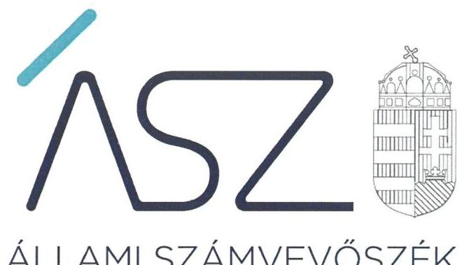
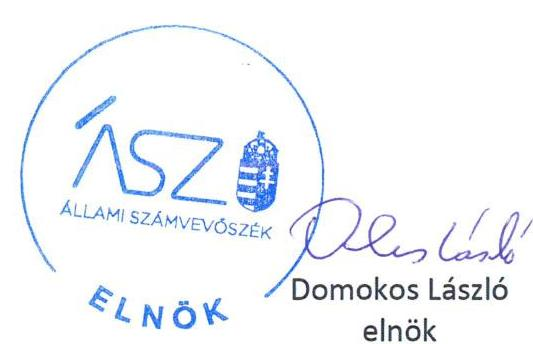
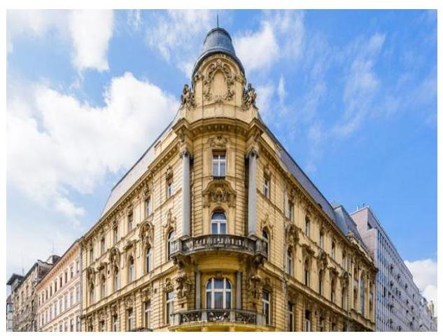
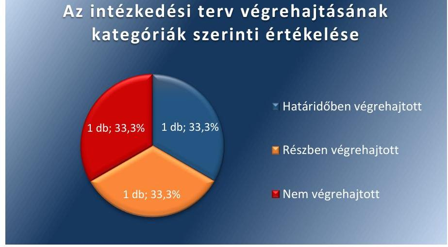
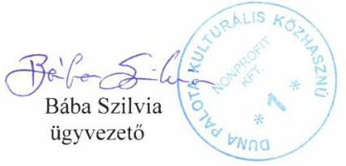
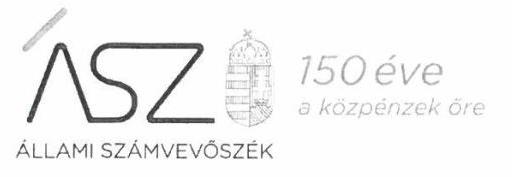
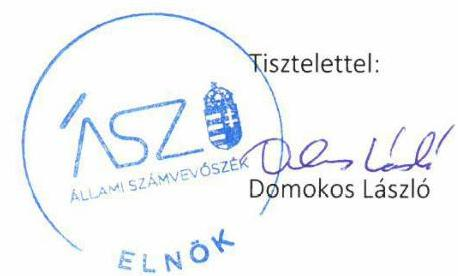
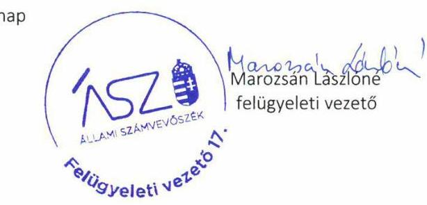

ÁLLAMI SZÁMVEVŐSZÉK

# JELENTÉS 

## Utóellenőrzések

Az állami tulajdonban lévő gazdálkodó szervezetek vagyonmegőrzési és gazdálkodási tevékenységének utóellenőrzése - Duna Palota Kulturális Közhasznú Nonprofit Korlátolt Felelősségű Társaság

2020
20054
www.asz.hu

---

ÁLLAMI SZÁMVEVŐSZÉK

# JELENTÉS 

## Utóellenőrzések

Az állami tulajdonban lévő gazdálkodó szervezetek vagyonmegőrzési és gazdálkodási tevékenységének utóellenőrzése - Duna Palota Kulturális Közhasznú Nonprofit Korlátolt Felelősségű Társaság

2020. 03. hó 31. nap

20054
www.asz.hu

---

# AZ ELLENŐRZÉST FELÜGYELTE: 

MAROZSÁN LÁSZLÓNÉ felügyeleti vezető

## AZ ELLENŐRZÉST VEZETTE ÉS A VÉGREHAJTÁSÁÉRT FELELŐS:

DR. NAGY JUDIT ellenőrzésvezető

TESKI NORBERT ellenőrzésvezető

A PROGRAM ÖSSZEÁLLÍTÁSÁÉRT FELELŐS:
TÓTPÁL SZABOLCS osztályvezető

## A TÉMÁHOZ KAPCSOLÓDÓ KORÁBBI SZÁMVEVŐSZÉKI JELENTÉSEK:

- címe: Duna Palota Kulturális Kiemelkedően Közhasznú Nonprofit Kft. - Az állami tulajdonban (résztulajdonban) lévő gazdálkodó szervezetek vagyonmegőrzési és gazdálkodási tevékenységének ellenőrzése
- sorszáma: 16162

IKTATÓSZÁM: EL-2542-001/2020.
TÉMASZÁM: 2460
ELLENŐRZÉS-AZONOSÍTÓ SZÁM: V080469

---

# TARTALOMJEGYZÉK 

■ ÖSSZEGZÉS ..... 5
■ AZ ELLENŐRZÉS CÉLJA ..... 6
■ AZ ELLENŐRZÉS TERÜLETE ..... 7
■ AZ ELLENŐRZÉS HÁTTERE, INDOKOLTSÁGA ..... 8
■ A JELENTÉS LÉNYEGES KÉRDÉSKÖRE ..... 9
■ AZ ELLENŐRZÉS HATÓKÖRE ÉS MÓDSZEREI ..... 10
■ MEGÁLLAPÍTÁSOK ..... 12
■ MELLÉKLETEK ..... 13
I. sz. melléklet: Duna Palota Kulturális Közhasznú Nonprofit Korlátolt Felelősségű Társaság intézkedési terve végrehajtásának értékelése ..... 13
■ FÜGGELÉK: ÉSZREVÉTELEK ..... 15
■ RÖVIDÍTÉSEK JEGYZÉKE ..... 21

---

.

---

# ÖSSZEGZÉS 

Az Állami Számvevőszék az utóellenőrzés során megállapította, hogy a Duna Palota Kulturális Közhasznú Nonprofit Korlátolt Felelősségű Társaság szabályozottsága az intézkedési tervében meghatározott feladatok végrehajtása következtében javult, azonban a belső kontroll területe továbbra is kockázatot hordoz.

## Az ellenőrzés társadalmi indokoltsága

Az Állami Számvevőszék stratégiájában célul tűzte ki a számvevőszéki munka hasznosulásának javítását. Ezzel összhangban ellenőrzi, hogy az ellenőrzött szervezetek megvalósították-e a korábbi ellenőrzései által feltárt hibák, hiányosságok és szabálytalanságok megszüntetése céljából elkészített intézkedési tervekben foglaltakat. A rendszeres utóellenőrzések hozzájárulnak a szükséges intézkedések tényleges végrehajtáshoz, ezáltal a közpénzügyek rendezettségének javulásához.

## Főbb megállapítások, következtetések

A Duna Palota Kulturális Közhasznú Nonprofit Korlátolt Felelősségű Társaság az Állami Számvevőszék intézkedést igénylő megállapításai alapján készített intézkedési tervében három feladatot határozott meg, amelyekből egyet határidőben teljesített, egy feladat részben teljesült, egy feladat teljesítése nem történt meg.

A szabályozottság javítása érdekében tett intézkedések követeztében a fennálló kockázatok mérséklődtek. A Duna Palota Kulturális Közhasznú Nonprofit Korlátolt Felelősségű Társaság ügyvezetője az intézkedési tervnek megfelelően gondoskodott a pénzkezelési szabályzat módosításáról, az adatvédelmi és adatbiztonsági szabályzat elkészítéséről, azonban a közérdekű adatok megismerésére irányuló igények teljesítése rendjének szabályozása nem a jogszabályi előírásoknak megfelelően történt meg.

A belső kontroll területén továbbra is kockázatot hordoz, hogy a Duna Palota Kulturális Közhasznú Nonprofit Korlátolt Felelősségű Társaság nem gondoskodott a belső ellenőrzés kialakításáról.

---

# AZ ELLENŐRZÉS CÉLJA 

Az ellenőrzés célja annak értékelése volt, hogy a számvevőszéki jelentés ${ }^{1}$-ben foglalt intézkedést igénylő megállapításokkal összhangban készített intézkedési terv²-ben meghatározott feladatokat az ellenőrzött szervezet vég-rehajtotta-e.

---

# AZ ELLENŐRZÉS TERÜLETE 

## Duna Palota Kulturális Közhasznú Nonprofit Korlátolt Felelősségú Társaság

A Duna Palota Kulturális Közhasznú Nonprofit Korlátolt Felelősségú Társaság a Magyar Állam 100\%-os tulajdonában áll, székhelye Budapesten található. A Társaság ${ }^{3}$ az ellenőrzött időszakban a kormányzati szektorba sorolt egyéb szervezetek közé tartozott.

A Társaság közhasznú feladatai között fő tevékenységi köre az előadó-művészet volt. Közhasznú tevékenységként oktatási, ismeretterjesztési, valamint kulturális tevékenységet látott el.

Az ügyvezető ${ }^{4}$ személye az utóellenőrzéssel érintett időszakban nem változott.

Az ÁSZ ${ }^{5}$ a 2016. évben ellenőrizte a Társaság vagyonmegőrzési és gazdálkodási tevékenységét, a 2011. január 1. és 2014. december 31. közötti időszakra vonatkozóan, melynek tapasztalatairól 2016. október 4-én hozta nyilvánosságra a 16162 számú számvevőszéki jelentést. Az ellenőrzés célja többek között annak értékelése volt, hogy a Társaság által ellátott feladatok bevételei, ráfordításai elszámolásának, és vagyongazdálkodási tevékenységének szabályozása megfelelt-e a jogszabályi és a tulajdonosi előírásoknak és azok végrehajtása szabályszerű volt-e; biztosítva volt-e a közfeladatok átláthatósága és elszámoltathatósága érdekében a közszolgáltatás dijának megalapozottsága szabályszerű önköltségszámítással; a vagyonváltozást eredményező döntések esetében szabályszerűen járt-e el; épített-e ki és működtetett-e információs rendszert a szabályszerű vagyongazdálkodás érdekében.

Az utóellenőrzés a számvevőszéki jelentésben megfogalmazott intézkedést igénylő megállapításokra készített intézkedési tervben foglalt feladatok végrehajtásának ellenőrzésére, értékelésére irányult.

---

# AZ ELLENŐRZÉS HÁTTERE, INDOKOLTSÁGA 

Az ÁSZ tv. ${ }^{6}$ 33. § (1) bekezdése értelmében a számvevőszéki jelentések intézkedést igénylő megállapításaihoz és javaslataihoz kapcsolódóan az ellenőrzött szervezetek vezetője intézkedési tervet köteles összeállítani, és az Állami Számvevőszék részére megküldeni.

Az ÁSZ által befogadott intézkedési tervben foglaltak megvalósítását - az ÁSZ tv. 33. § (7) bekezdésében foglaltak alapján - az Állami Számvevőszék utóellenőrzés keretében ellenőrizheti. Az utóellenőrzések keretében - az intézkedések értékelése során - az Állami Számvevőszék figyelembe veszi az ellenőrzött szervezetek működési feltételeiben, valamint a jogszabályi előírásokban bekövetkezett változásokat.

Az utóellenőrzés során az ÁSZ értékeli, hogy az érintett számvevőszéki jelentésben foglalt megállapításokkal és javaslatokkal összhangban, az ellenőrzött szervezet által készített intézkedési tervben meghatározott feladatokat a feladatra kijelöltek végrehajtották-e.

Az intézkedések végrehajtásával az adott terület szabályszerű múködése vonatkozásában a kockázatok csökkenhetnek, azonban hosszabb távon az intézkedési tervben foglaltak végrehajtásával önmagában nem szűnnek meg, csak akkor, ha beépülnek az ellenőrzött szervezet működésébe, azokat folyamatosan karbantartják, figyelembe véve, illetve kezelve a változásokat. Emellett az intézkedések végrehajtásáig újabb kockázatok merülhetnek fel a szabályszerű működés vonatkozásában, amelyek kezelése szintén kiemelten fontos az ellenőrzött szervezet számára.

Az ellenőrzött szervezet vezetője által készített intézkedési tervekben foglalt feladatok hiányos, illetve késedelmes végrehajtása, vagy annak elmaradása a szabályszerűség és a felelős vezetői magatartás vonatkozásában kockázatot hordoz, ami azt mutatja, hogy az ellenőrzések során feltárt hibák, hiányosságok és szabálytalanságok kezelése nem kapott kellő hangsúlyt. Az utóellenőrzés során is fennálló szabálytalanságok esetén a közpénz, közvagyon veszélyeztetettségi kockázat valószínűsített hatásának értékelése további intézkedéseket vonhat maga után.

Az ellenőrzött szervezet szintjén az utóellenőrzés feltárja, hogy a szervezet az intézkedések végrehajtásával hasznosította-e a korábbi ellenőrzési jelentésben a hiányosságok megszüntetése, illetve a kockázatok kezelése érdekében megfogalmazott javaslatokat, illetve az intézkedések végrehajtása elmaradásának következtében továbbra is fennálló szabálytalanság esetén értékeli a közpénzek, közvagyon veszélyeztetettségét.

Az ÁSZ szintjén az utóellenőrzés visszacsatolást ad az ellenőrzési jelentések hasznosulásáról, az intézkedések elmaradásának, vagy részleges megvalósulásának a közpénzek, közvagyon veszélyeztetettségére gyakorolt valószínűsített hatásának értékelése, további intézkedéseket vonhat maga után.

---

# A JELENTÉS LÉNYEGES KÉRDÉSKÖRE 

Az ellenőrzött szervezet az intézkedési tervben foglaltakat az elöirt határidőben végrehajtotta-e?

---

# AZ ELLENŐRZÉS HATÓKÖRE ÉS MÓDSZEREI 

## Az ellenőrzés típusa

Megfelelőségi ellenőrzés.

## Az ellenőrzött időszak

Az utóellenőrzés alapját képező számvevőszéki jelentés közzétételének napjától az ellenőrzésről szóló kiértesítő levél keltének napjáig, azaz 2016. október 4-étől 2019. augusztus 30 -áig tartó időszak.

## Az ellenőrzés tárgya

A számvevőszéki jelentésben foglalt megállapításokkal és javaslatokkal összhangban a Társaság által készített intézkedési tervben foglaltak végrehajtásának ellenőrzése.

## Az ellenőrzött szervezet

Duna Palota Kulturális Közhasznú Nonprofit Korlátolt Felelősségű Társaság

## Az ellenőrzés jogalapja

Az ellenőrzés jogszabályi alapját az ÁSZ tv. 33. § (7) bekezdésének előírásai képezték.

## Az ellenőrzés módszerei

Az ellenőrzés lefolytatása az ellenőrzött időszakban hatályos jogszabályok, az ellenőrzés szakmai szabályai, a jelen ellenőrzésre irányadó ÁSZ módszertanok, az ellenőrzési programban foglalt értékelési szempontok szerint történt.

Az ellenőrzés ideje alatt az ellenőrzött szervezettel történő kapcsolattartást az ÁSZ az ÁSZ SZMSZ ${ }^{7}$-ének vonatkozó előírásai alapján biztosította.

Az utóellenőrzés megállapításait az ÁSZ rendelkezésére álló, valamint az ÁSZ adatbekérése szerint az ellenőrzött szervezet által rendelkezésre bocsátott dokumentumok alapozták meg.

Az ellenőrzési kérdések megválaszolásához szükséges bizonyítékok megszerzése az ellenőrzött által rendelkezésre bocsátott dokumentu-

---

mokra, adatokra alapozva megfigyelés, szemle (szemrevételezés), kérdésfelvetés (információkérés), valamint elemző eljárás alkalmazásával történt. Az ellenőrzési bizonyítékként felhasználható adatforrások közé tartoztak egyrészt az ellenőrzési program részletes szempontjainál felsorolt adatforrások, másrészt minden - az ellenőrzés folyamán feltárt, az ellenőrzés szempontjából információt tartalmazó - dokumentum.

Az intézkedési tervben előírt feladatokat azok végrehajthatósága, illetve végrehajtása szempontjából az alábbiak szerint értékelte az ÁSZ:
— „határidőben végrehajtott" a feladat, ha a teljesítés dokumentáltan, az intézkedési tervben előírt határidőben és tartalommal megtörtént;
— „határidőn túl végrehajtott" a feladat, ha annak teljesítése az intézkedési tervben meghatározott módon, de az előírt határidőn túl történt meg;
— „részben végrehajtott" a feladat, ha végrehajtása teljes körűen az intézkedési tervben előírt módon nem történt meg;
— „nem végrehajtott" a feladat, ha a végrehajtás nem történt meg, dokumentumokkal nem igazolt annak teljesítése;
— „okafogyottá vált" a feladat, ha végrehajtására - meghatározott esemény bekövetkezése, továbbá külső körülmény, a működést érintő feltétel változása miatt - már nincs szükség, illetve lehetőség, és egyértelműen megállapítható, hogy az intézkedést szükségessé tevő körülmény a jövőben nem fordulhat elő;
— „nem időszerü" az a feladat, amelynek ellenőrzési időszakon belüli végrehajtására azért nem került (kerülhetett) sor, mert az intézkedés alapjául szolgáló esemény nem következett be, de annak jövőbeni előfordulása lehetséges, a végrehajtása nem volt esedékes, vagy a végrehajtás határideje még nem járt le.
Az ellenőrzés lefolytatásához az ellenőrzött szervezet a tanúsítványok elektronikus kitöltésével, valamint az ÁSZ által kért dokumentumok elektronikus megküldésével szolgáltatott adatokat, amelyek valódiságát és teljes körűségét az ellenőrzött szervezet vezetője által tett teljességi és hitelességi nyilatkozat igazolta. Az így rendelkezésre bocsátott adatok, információk kontrollja az ellenőrzés keretében megtörtént.

---

# MEGÁLLAPÍTÁSOK 

## Az ellenőrzött szervezet az intézkedési tervben foglaltakat az előírt határidőben végrehajtotta-e?

Összegző megállapítás

A Társaság az intézkedési tervben meghatározott három feladat közül egyet határidőben teljesített, egy feladat részben teljesült, egy feladat végrehajtása nem történt meg.

Az ÁSZ 16162 számú jelentésében tett intézkedést igénylő megállapításokra, a hiányosságok és szabálytalanságok megszüntetésére a Társaság ügyvezetője által készített intézkedési tervben meghatározott három feladatot, a végrehajtás határidejét, a felelősöket és a feladatok végrehajtásának értékelését az I. sz. melléklet mutatja be.

Az intézkedési tervben rögzített feladatok végrehajtásának értékelési kategóriák szerinti megoszlását az 1. ábra mutatja be.

1. ábra

## Az intézkedési terv végrehajtásának kategóriák szerinti értékelése

A SZABÁLYOZOTTSÁG javítása érdekében tett intézkedések követeztében a fennálló kockázatok mérséklődtek. A Társaság a Számv. tv. ${ }^{8}$ előírásainak megfelelően módosította a Pénz-és értékkezelési szabályzatot ${ }^{9}$ (1), valamint az Info tv. ${ }^{10}$ előírásainak megfelelően elkészítette az Informatikai és adatvédelmi szabályzatot ${ }^{11}$ (2). A Társaság Közérdekú adatok megismerésére irányuló igények teljesítésének rendjéről készített szabály-zata ${ }^{12}$ az Info tv. 30. § (6) bekezdésével ellentétben nem tartalmazta a közérdekú adatok megismerésére irányuló igények teljesítésének rendjét (2).

A BELSŐ KONTROLLOK területén továbbra is kockázatot hordoz a belső ellenőrzés múködtetésének hiánya, mert az ügyvezető nem gondoskodott a belső ellenőrzés kialakításáról (3).

---

# MELLÉKLETEK

- I. SZ. MELLÉKLET: DUNA PALOTA KULTURÁLIS KÖZHASZNÚ NONPROFIT KORLÁTOLT FELELŐSSÉGŰ TÁRSASÁG INTÉZKEDÉSI TERVE VÉGREHAJTÁSÁNAK ÉRTÉKELÉSE

|  5 | Az intézkedési tervben rögzített feladat | Az intézkedési tervben meghatározott határidő | Az intézkedési tervben meghatározott felelős | A feladat végrehajtása  |
| --- | --- | --- | --- | --- |
|  1. | Intézkedem a pénzkezelési szabályzat módosítására úgy, hogy a szabályzat tartalmazza az idegen pénzeszközök vonatkozásában valamennyi, a jogszabályban előírt tartalmi elemet.
(1. sz. intézkedés) | 2016. december 15. | ügyvezető igazgató | Az ügyvezető gondoskodott a Pénz- és értékkezelési szabályzat módosításáról, a 2016. november 1-jén hatályba lépett Pénz- és értékkezelési szabályzat az idegen pénzeszközök vonatkozásában tartalmazta a Számv. tv.-ben foglalt előírásokat.  |
|  2. | Intézkedem a közérdekú adatok megismerésére irányuló igények teljesítésének rendjéről szóló szabályzat, valamint az adatvédelmi és adatbiztonsági szabályzat elkészítésére a jogszabályi előírásoknak megfelelően.
(2. sz. intézkedés) | 2017. január 31. | ügyvezető igazgató | Részben végrehajtott feladatok
Végrehajtott feladatrész:
Az ügyvezető gondoskodott az Info tv. előírásainak megfelelően az Informatikai és adatvédelmi szabályzat elkészítéséről, amelyet 2016. december 1-jén hatályba helyezett.
Az ügyvezető elkészítette és 2017. január 1-jén hatályba helyezte a „Közérdekú adatok megismerésére irányuló igények teljesítésének rendjéről szóló szabályzat"-ot
Nem végrehajtott feladatrész:
A „Közérdekú adatok megismerésére irányuló igények teljesítésének rendjéről szóló szabályzat" tartalmát tekintve nem felelt meg az Info tv. 30. § (6) bekezdésének, mert nem tartalmazta a közérdekú adatok megismerésére irányuló igények teljesítésének az Info tv. 28-31. §-aiban meghatározottakon alapuló - rendjét.  |
|  3. | A Duna Palota NKFt. 2016. február 1-e óta megbízási szerződéssel alkalmaz belső ellenőrt tanácsadási feladatokkal. A megbízási szerződést 2016. november 1-vel módosítom belső ellenőrzési feladatok ellátására a jogszabályi előírásoknak megfelelően.
(3. sz. intézkedés) | 2016. november 1. | ügyvezető igazgató | Az ügyvezető nem igazolta, hogy gondoskodott a belső ellenőrzési feladatok ellátására vonatkozóan a belső ellenőrrel kötött megbízási szerződés módosításáról, mert a belső ellenőrzési feladatok ellátására vonatkozó megbízási szerződés-módosítást a megbízott belső ellenőr nem írta alá.  |

Forrás: ÁSZ által készített táblázat

---

.

---

# FÜGGELÉK: ÉSZREVÉTELEK 

A jelentéstervezetet a Számvevőszék 15 napos észrevételezésre megküldte az ellenőrzött szervezet vezetőjének az ÁSZ tv. 29. §* (1) bekezdése előírásának megfelelően.

A Duna Palota Kulturális Közhasznú Nonprofit Kft. ügyvezetője a jelentéstervezet megállapításaira írásban észrevételt tett.
Az ÁSZ tv. 29. § (3) bekezdésével összhangban az ÁSZ a Függelékben feltünteti az ellenőrzés megállapításaival kapcsolatban tett, figyelembe nem vett észrevételeket, és megindokolja, hogy azokat miért nem fogadta el.

[^0]
[^0]:    * 29. § (1) Az Állami Számvevőszék az ellenőrzési megállapításait megküldi az ellenőrzött szervezet vezetőjének vagy az általa megbízott személynek, és annak, akinek személyes felelősségét állapította meg.
    (2) Az ellenőrzött szervezet vezetője és a felelősként megjelölt személy az ellenőrzés megállapításaira tizenöt napon belül írásban észrevételt tehet.
    (3) Az Állami Számvevőszék az észrevételre a beérkezésétől számított harminc napon belül írásban válaszol. A figyelembe nem vett észrevételeket köteles a jelentésben feltüntetni, és megindokolni, hogy azokat miért nem fogadta el.

---

# Állami Számvevőszék   Domokos László Elnök Úr   Marozsán Lászlóné Felügyeleti Vezető Asszony részére 

Budapest 4.
Pf. 54
1364
Hivatkozási szám: EL-1535-011/2019.; EL-1535-013/2020.

## Tisztelt Elnök Úr! Tisztelt Felügyeleti Vezetö́ Asszony!

„Utóellenőrzések - Az állami tulajdonban lévő gazdálkodó szervezetek vagyonmegőrzési és gazdálkodási tevékenységének utóellenőrzése keretében a Duna Palota Kulturális Közhasznú Nonprofit Kft." címmel készített számvevőszéki jelentéstervezetet áttanulmányoztuk. Megköszönjük az ellenőrök áldozatos munkáját.

A jelentéstervezet megállapításaira az alábbiakban kívánunk észrevételt tenni:
„...a közérdekủ adatok megismerésére irányuló igények teljesítésének rendjének szabályozása nem a jogszabályi előírásoknak megfelelően történt meg."
A szabályzat valóban nem tartalmazza az egyedi igények kezelésének rendjét. A szabályzatot javítottuk, melyet jelen levelünkhöz mellékelünk.
„A belső kontroll területén továbbra is kockázatot hordoz, hogy a Duna Palota Kulturális Közhasznú Nonprofit Korlátolt Felelősségủ Társaság nem gondoskodott a belső ellenőrzés kialakításáról (5. oldal) ...a belső ellenőrzés hiánya, mert az ügyvezető nem gondoskodott a belső ellenőrzés kialakításáról (12. oldal) ...Mellékletek 3.... a megbízási szerződés módosítást a megbízott belső ellenőr nem írta alá (13. oldal)"
Véleményünk szerint a két megállapítás ellentmond egymásnak. Tévedésből olyan munkapéldány került beszkennelésre és feltöltésre, amelyet valóban nem írt alá a belső ellenőr. Ugyanakkor élő szerződése és éves belső ellenőrzési terv alapján ellátta, ellátja a feladatát. Jelen levelünkhöz csatoljuk a belső ellenőr által is aláírt megbízási szerződés módosítás másolatát. Kérjük ennek figyelembe vételét, továbbá a megállapítás pontosítását.

Budapest, 2020. február 10.
Tisztelettel:

Duna Palota Nonprofit Kft.

---

Ikt. szám: EL-1535-015/2020.
Bába Szilvia úrhölgy
ügyvezető
Duna Palota Kulturális Közhasznú Nonprofit Kft.

# Budapest 

Tisztelt Ügyvezető Úrhölgy!

Az „Utóellenőrzések - Az állami tulajdonban lévő gazdálkodó szervezetek vagyonmegőrzési és gazdálkodási tevékenységének utóellenőrzése - Duna Palota Kulturális Közhasznú Nonprofit Korlátolt Felelősségű Társaság" címmel készített számvevőszéki jelentéstervezetre tett, 2020. február 10-én kelt levelében megküldött észrevételeit köszönettel megkaptam.

Az Állami Számvevőszék észrevételekre vonatkozó álláspontjáról a felügyeleti vezető által készített részletes tájékoztatást csatoltan megküldöm.

Tájékoztatom Ügyvezető úrhölgyet, hogy a számvevőszéki jelentésben - az Állami Számvevőszékről szóló 2011. évi LXVI. törvény 29. § (3) bekezdése alapján - a figyelembe nem vett észrevételeket szerepeltetjük az elutasítás indokának feltüntetésével.

Budapest, 2020. 02. hónap 27. nap

Melléklet: Tájékoztatás az észrevételek kezeléséről

---

# Tájékoztatás   az észrevételek kezeléséről 

Az „Utóellenőrzések - Az állami tulajdonban lévő gazdálkodó szervezetek vagyonmegőrzési és gazdálkodási tevékenységének utóellenőrzése - Duna Palota Kulturális Közhasznú Nonprofit Korlátolt Felelősségű Társaság" című jelentéstervezetre (továbbiakban: jelentéstervezet) a Duna Palota Kulturális Közhasznú Nonprofit Korlátolt Felelősségű Társaság (továbbiakban: Társaság) ügyvezetőjének 2020. február 10-én kelt levelében megküldött észrevételeit áttekintettem. Az észrevételek kezeléséről az alábbi tájékoztatást adom.

## 1. A jelentéstervezet I. melléklet 2. pontjával - Részben végrehajtott feladat - kapcsolatos észrevétel:

Ügyvezető úrhölgy észrevételében az Állami Számvevőszék (továbbiakban: ÁSZ) megállapítását nem vitatja, elismerte, hogy az ellenőrzésnek átadott Közérdekú adatok megismerésére irányuló igények teljesítésének rendjéről szóló szabályzat valóban nem tartalmazta az egyedi igények kezelésének rendjét. A javított, 2020. február 10-étől hatályos szabályzatot észrevételéhez mellékelten megküldte.
Ügyvezető úrhölgy észrevétele megerősíti a jelentéstervezetben tett megállapítást, miszerint az intézkedési tervben foglalt 2017. január 31. határidővel, a hivatkozott tárgyú jogszabályoknak tartalmilag megfelelő szabályzat megalkotása nem történt meg. Tájékoztatását az ellenőrzést követően megtett intézkedéseiről - miszerint 2020. február 10-étől hatályba léptették a módosított szabályzatot - köszönjük, az intézkedési terv végrehajtásának értékelését az nem befolyásolja. Az ÁSZ ellenőrzése során az adatszolgáltatásra nyitva álló törvényben előírt határidőben teljesített adatszolgáltatás alapján teszi meg a megállapításait, az ellenőrzött időszakot követően készített dokumentumot az ÁSZ nem értékeli. A fentiek alapján a jelentéstervezet jelen pontban érintett részének megállapítása helytálló, módosítása nem indokolt.

## 2. A jelentéstervezet I. melléklet 3. pontjával - Nem végrehajtott feladat - kapcsolatos észrevétel:

Ügyvezető úrhölgy észrevétele szerint a jelentéstervezet 12. oldalán tett megállapítás (,... a Társaság nem gondoskodott a belső ellenőrzés kialakításáról."), valamint a 13. oldalon a melléklet 3. sorában tett megállapítás (,... a megbizási szerződés módosítását a megbízott belső ellenőr nem írta alá.") ellentmond egymásnak. Elismerte továbbá, hogy az ellenőrzés részére tévedésből olyan belső ellenőri megbízási szerződést küldtek, amelyet a belső ellenőr nem írt alá, azonban élő szerződés és éves belső ellenőrzési terv alapján ellátta és ellátja a feladatait. Az észrevételhez mellékelte a módosított szerződés aláírt példányát.
Az ÁSZ az észrevételt nem fogadja el. Ügyvezető úrhölgy észrevételében jelzett ellentmondás az adatszolgáltatás során beküldött dokumentumok alapján nem áll fenn. Az intézkedési tervben foglaltak szerint a Társaság korábban megbízott belső ellenőrt, de nem belső ellenőrzési feladatokkal, hanem tanácsadási feladatokkal, mely szerződés módosítására vonatkozott az

---

ügyvezetői intézkedési terv érintett pontja. Az intézkedési tervben foglaltak szerint a szerződésmódosítás a jogszabályi előírásoknak megfelelően a belső ellenőri feladatok ellátására irányul.

Az utóellenőrzés során az ÁSZ részére átadott szerződés nem tartalmazta a megbízott aláírását. A megbízott által alá nem írt szerződés nem igazolja, hogy a Társaság eleget tett az intézkedési tervében vállalt feladatnak, azaz gondoskodott volna a belső ellenőrzési feladatok ellátására vonatkozóan az érintett megbízási szerződés módosításáról és ez alapján a belső ellenőrzés kialakításáról, működtetéséről. Az adatszolgáltatás során a Társaság ügyvezetője nyilatkozott arról, hogy az ÁSZ részére átadott dokumentumok, adatok megbízhatóak, és a bekért adatokra, dokumentumokra vonatkozóan teljes körű információt tartalmaznak. Az ÁSZ az ellenőrzése során az adatszolgáltatásra nyitva álló törvényben előírt határidőben teljesített adatszolgáltatás alapján teszi meg a megállapításait. Az ÁSZ az utólag rendelkezésre bocsátott dokumentumokat nem értékeli. A fentiek alapján a jelentéstervezet jelen pontban érintett részének megállapítása helytálló, módosítása nem indokolt.

Budapest, 2020.

---

.

---

# RÖVIDÍTÉSEK JEGYZÉKE 

${ }^{1}$ számvevőszéki jelentés
${ }^{2}$ intézkedési terv
${ }^{3}$ Társaság
${ }^{4}$ ügyvezető
${ }^{5}$ ÁSZ
${ }^{6}$ ÁSZ tv.
${ }^{7}$ ÁSZ SZMSZ
${ }^{8}$ Számv. tv.
${ }^{9}$ Pénz- és értékkezelési szabályzat
${ }^{10}$ Info tv.
${ }^{11}$ Informatikai és adatvédelmi szabályzat
${ }^{12}$ Közérdekú adatok megismerésére irányuló igények teljesítésnek rendje

Jelentés - Duna Palota Kulturális Kiemelkedően Közhasznú Nonprofit Kft. - Az állami tulajdonban (résztulajdonban) lévő gazdálkodó szervezetek vagyonmegőrzési és gazdálkodási tevékenységének ellenőrzése; 2016. október 4.; 16162

A Duna Palota Kulturális Közhasznú Nonprofit Korlátolt Felelősségű Társaság 2016. november 3-án kelt intézkedési terve

Duna Palota Kulturális Közhasznú Nonprofit Korlátolt Felelősségű Társaság (2016. március 16-áig Duna Palota Kulturális Kiemelkedően Közhasznú Nonprofit Korlátolt Felelősségű Társaság)
Duna Palota Kulturális Közhasznú Nonprofit Korlátolt Felelősségű Társaság ügyvezetője
Állami Számvevőszék
az Állami Számvevőszékről szóló 2011. évi LXVI. törvény (hatályos: 2011. július 1-jétől)
az Állami Számvevőszék Szervezeti és Működési Szabályzata
2000. évi C. törvény a számvitelről (hatályos: 2001. január 1-jétől)

Duna Palota Kulturális Közhasznú Nonprofit Kft. 650-09/6/1/2016 számú Pénzés Értékkezelési Szabályzata (hatályos: 2016. november 1-jétől)
az információs önrendelkezési jogról és az információszabadságról szóló 2011. évi CXII. törvény (hatályos: 2011. július 27-étől)
Duna Palota Kulturális Közhasznú Nonprofit Kft. Informatikai és adatvédelmi szabályzata (hatályos: 2016. december 1-jétől)
Duna Palota Kulturális Közhasznú Nonprofit Kft. Közérdekú adatok megismerésére irányuló igények teljesítésének rendjéről szóló szabályzat (hatályos: 2017. január 1-jétől)

---

# ASZ 

ALLAMI SZAMVEVOSZEK
1052 Budapest, Apáczai Cs. J. u. 10. I 1364 Budapest 4. Pf. 54 TEL: +36 14849100
email: szamvevoszek@asz.hu
web: www.asz.hu | www.aszhirportal.hu