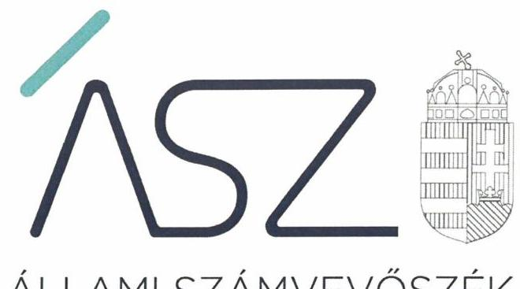
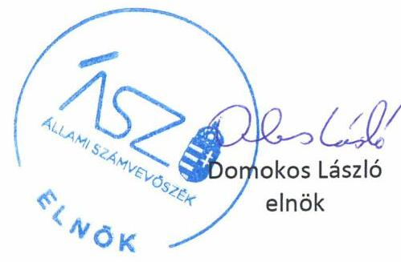
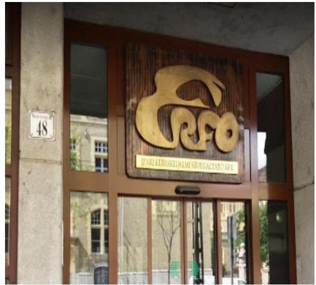
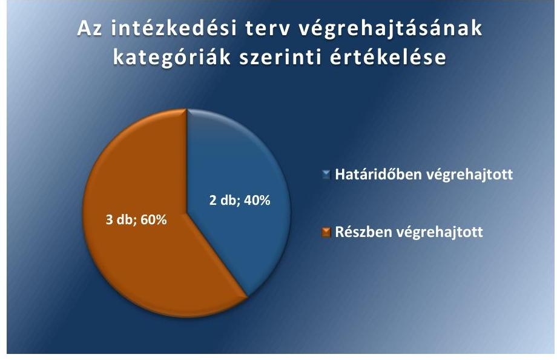

ÁLLAMI SZÁMVEVŐSZÉK

# JELENTÉS 

## Utóellenőrzések

Az állami tulajdonban lévő gazdálkodó szervezetek vagyonmegőrzési és gazdálkodási tevékenységének utóellenőrzése - ERFO Rehabilitációs Foglalkoztató Közhasznú Nonprofit Korlátolt Felelősségű Társaság

2020
20055
www.asz.hu

---

ÁLLAMI SZÁMVEVŐSZÉK

# JELENTÉS 

## Utóellenőrzések

Az állami tulajdonban lévő gazdálkodó szervezetek vagyonmegőrzési és gazdálkodási tevékenységének utóellenőrzése - ERFO Rehabilitációs Foglalkoztató Közhasznú Nonprofit Korlátolt Felelősségű Társaság
2020. 4. hó 16. nap

20055
www.asz.hu

---

# AZ ELLENŐRZÉST FELÜGYELTE: 

MAROZSÁN LÁSZLÓNÉ felügyeleti vezető

## AZ ELLENŐRZÉST VEZETTE ÉS A VÉGREHAJTÁSÁÉRT FELELŐS:

DR. NAGY JUDIT ellenőrzésvezető

TESKI NORBERT ellenőrzésvezető

A PROGRAM ÖSSZEÁLLITÁSÁÉRT FELELŐS:
TÓTPÁL SZABOLCS osztályvezető

A TÉMÁHOZ KAPCSOLÓDÓ KORÁBBI SZÁMVEVŐSZÉKI JELENTÉSEK:

- címe: ERFO Közhasznú Nonprofit Kft. - Az állami tulajdonban (résztulajdonban) lévő gazdálkodó szervezetek vagyonmegőrzési és gazdálkodási tevékenységének ellenőrzése
- sorszáma: 16101

IKTATÓSZÁM: EL-2545-001/2020.
TÉMASZÁM: 2460
ELLENŐRZÉS-AZONOSÍTÓ SZÁM: V080468

---

# TARTALOMJEGYZÉK 

■ ÖSSZEGZÉS ..... 5
■ AZ ELLENŐRZÉS CÉLJA ..... 6
■ AZ ELLENŐRZÉS TERÜLETE ..... 7
■ AZ ELLENŐRZÉS HÁTTERE, INDOKOLTSÁGA ..... 8
■ A JELENTÉS LÉNYEGES KÉRDÉSKÖRE ..... 9
■ AZ ELLENŐRZÉS HATÓKÖRE ÉS MÓDSZEREI ..... 10
■ MEGÁLLAPÍTÁSOK ..... 12
■ MELLÉKLETEK ..... 13
I. sz. melléklet: ERFO Rehabilitációs Foglalkoztató Közhasznú Nonprofit Korlátolt
Felelősségű Társaság intézkedési terve végrehajtásának értékelése ..... 13
■ FÜGGELÉK: ÉSZREVÉTELEK ..... 15
■ RÖVIDÍTÉSEK JEGYZÉKE ..... 17

---

.

---

# ÖSSZEGZÉS 

Az Állami Számvevőszék az utóellenőrzés során megállapította, hogy az ERFO Rehabilitációs Foglalkoztató Közhasznú Nonprofit Korlátolt Felelősségű Társaság szabályozottsága az intézkedési tervében vállalt végrehajtott és részben végrehajtott feladatok következtében javult, azonban müködésének átláthatósága továbbra is kockázatot hordoz a közzétételi kötelezettsége hiányos teljesitése miatt.

## Az ellenőrzés társadalmi indokoltsága

Az Állami Számvevőszék stratégiájában célul tűzte ki a számvevőszéki munka hasznosulásának javítását. Ezzel összhangban ellenőrzi, hogy az ellenőrzött szervezetek megvalósították-e a korábbi ellenőrzései által feltárt hibák, hiányosságok és szabálytalanságok megszüntetése céljából elkészített intézkedési tervekben foglaltakat. A rendszeres utóellenőrzések hozzájárulnak a szükséges intézkedések tényleges végrehajtáshoz, ezáltal a közpénzügyek rendezettségének javulásához.

## Főbb megállapítások, következtetések

Az ERFO Rehabilitációs Foglalkoztató Közhasznú Nonprofit Korlátolt Felelősségű Társaság az Állami Számvevőszék intézkedést igénylő megállapításai alapján készített intézkedési tervében öt feladatot határozott meg, amelyekből kettőt határidőben teljesített, három feladat részben teljesült.

A szabályozottság javítása érdekében tett intézkedések követeztében a fennálló kockázatok mérséklődtek. Az ERFO Rehabilitációs Foglalkoztató Közhasznú Nonprofit Korlátolt Felelősségű Társaság az intézkedési tervében meghatározott szabályzatok kiadásáról gondoskodott, azonban nem intézkedett a Szervezeti és Müködési Szabályzat tulajdonosi joggyakorló általi jóváhagyásáról.

Integritási kockázatot jelent, hogy az ERFO Rehabilitációs Foglalkoztató Közhasznú Nonprofit Korlátolt Felelősségű Társaság a kötelezően közzétett adatok naprakészségét nem biztosította.

---

# AZ ELLENŐRZÉS CÉLJA 

Az ellenőrzés célja annak értékelése volt, hogy a számvevőszéki jelentésben ${ }^{1}$ foglalt intézkedést igénylő megállapításokkal összhangban készített intézkedési tervben² meghatározott feladatokat az ellenőrzött szervezet vég-rehajtotta-e.

---

# **AZ ELLENŐRZÉS TERÜLETE**

## **ERFO Rehabilitációs Foglalkoztató Közhasznú Nonprofit Korlátolt Felelősségű Társaság**

Az ERFO Közhasznú Nonprofit Korlátolt Felelősségű Társaság, a Magyar Állam 100%-os tulajdonában áll, székhelye Budapesten található. A Társaság2 az ellenőrzött időszakban a kormányzati szektorba sorolt egyéb szervezetek közé tartozott.

A Társaság megváltozott munkaképességű, illetve fogyatékos személyek foglalkoztatását végi. A rehabilitációs foglalkoztatás során üzemi körülmények között könnyűipari termékelőállítás történik.

Az ügyvezető4 személye az ellenőrzött időszakban egy alkalommal változott.

Az ÁSZ5 a Társaság vagyonmegőrzési és gazdálkodási tevékenységének ellenőrzését a 2011. január 1. – 2014. december 31. közötti időszakra vonatkozóan végezte el, melynek tapasztalatairól 2016. július 13-án hozta nyilvánosságra a 16101. számú számvevőszéki jelentést. Az ellenőrzés célja többek között annak értékelése volt, hogy a Társaság által ellátott feladatok bevételei, ráfordításai elszámolásának, és vagyongazdálkodási tevékenységének szabályozása megfelel-e a jogszabályi és a tulajdonosi előírásoknak és azok végrehajtása szabályszerű volt-e; biztosítva volt-e a közfeladatok átláthatósága és elszámoltathatósága érdekében a közszolgáltatás díjának megalapozottsága szabályszerű önköltségszámítással; a vagyonváltozást eredményező döntések esetében szabályszerűen járt-e el; épített-e ki és működtetett-e információs rendszert a szabályszerű vagyongazdálkodás érdekében.

Az utóellenőrzés a számvevőszéki jelentésben foglalt intézkedést igénylő megállapításokkal összhangban készített intézkedési tervben meghatározott feladatok végrehajtásának ellenőrzésére, értékelésére irányult.

---

# AZ ELLENŐRZÉS HÁTTERE, INDOKOLTSÁGA 

Az ÁSZ tv. ${ }^{6}$ 33. § (1) bekezdése értelmében a számvevőszéki jelentések intézkedést igénylő megállapításaihoz és javaslataihoz kapcsolódóan az ellenőrzött szervezetek vezetője intézkedési tervet köteles összeállítani, és az Állami Számvevőszék részére megküldeni.

Az ÁSZ által befogadott intézkedési tervben foglaltak megvalósítását - az ÁSZ tv. 33. § (7) bekezdésében foglaltak alapján - az Állami Számvevőszék utóellenőrzés keretében ellenőrizheti. Az utóellenőrzések keretében - az intézkedések értékelése során - az Állami Számvevőszék figyelembe veszi az ellenőrzött szervezetek működési feltételeiben, valamint a jogszabályi előírásokban bekövetkezett változásokat.

Az utóellenőrzés során az ÁSZ értékeli, hogy az érintett számvevőszéki jelentésben foglalt megállapításokkal és javaslatokkal összhangban, az ellenőrzött szervezet által készített intézkedési tervben meghatározott feladatokat a feladatra kijelöltek végrehajtották-e.

Az intézkedések végrehajtásával az adott terület szabályszerű múködése vonatkozásában a kockázatok csökkenhetnek, azonban hosszabb távon az intézkedési tervben foglaltak végrehajtásával önmagában nem szűnnek meg, csak akkor, ha beépülnek az ellenőrzött szervezet múködésébe, azokat folyamatosan karbantartják, figyelembe véve, illetve kezelve a változásokat. Emellett az intézkedések végrehajtásáig újabb kockázatok merülhetnek fel a szabályszerű működés vonatkozásában, amelyek kezelése szintén kiemelten fontos az ellenőrzött szervezet számára.

Az ellenőrzött szervezet vezetője által készített intézkedési tervekben foglalt feladatok hiányos, illetve késedelmes végrehajtása, vagy annak elmaradása a szabályszerűség és a felelős vezetői magatartás vonatkozásában kockázatot hordoz, ami azt mutatja, hogy az ellenőrzések során feltárt hibák, hiányosságok és szabálytalanságok kezelése nem kapott kellő hangsúlyt. Az utóellenőrzés során is fennálló szabálytalanságok esetén a közpénz, közvagyon veszélyeztetettségi kockázat valószínűsített hatásának értékelése további intézkedéseket vonhat maga után.

Az ellenőrzött szervezet szintjén az utóellenőrzés feltárja, hogy a szervezet az intézkedések végrehajtásával hasznosította-e a korábbi ellenőrzési jelentésben a hiányosságok megszüntetése, illetve a kockázatok kezelése érdekében megfogalmazott javaslatokat, illetve az intézkedések végrehajtása elmaradásának következtében továbbra is fennálló szabálytalanság esetén értékeli a közpénzek, közvagyon veszélyeztetettségét.

Az ÁSZ szintjén az utóellenőrzés visszacsatolást ad az ellenőrzési jelentések hasznosulásáról, az intézkedések elmaradásának, vagy részleges megvalósulásának a közpénzek, közvagyon veszélyeztetettségére gyakorolt valószínűsített hatásának értékelése további intézkedéseket vonhat maga után.

---

# A JELENTÉS LÉNYEGES KÉRDÉSKÖRE 

Az ellenőrzött szervezet az intézkedési tervben foglaltakat az elöirt határidőben végrehajtotta-e?

---

# AZ ELLENŐRZÉS HATÓKÖRE ÉS MÓDSZEREI 

## Az ellenőrzés típusa

Megfelelőségi ellenőrzés.

## Az ellenőrzött időszak

Az utóellenőrzés alapját képező számvevőszéki jelentés közzétételének napjától az ellenőrzésről szóló kiértesítő levél keltének napjáig, azaz 2016. július 13-tól 2019. augusztus 30-ig tartó időszak.

## Az ellenőrzés tárgya

A számvevőszéki jelentésben foglalt megállapításokkal és javaslatokkal összhangban a Társaság által készített intézkedési tervben foglaltak végrehajtásának ellenőrzése.

## Az ellenőrzött szervezet

ERFO Rehabilitációs Foglalkoztató Közhasznú Nonprofit Korlátolt Felelősségű Társaság

## Az ellenőrzés jogalapja

Az ellenőrzés jogszabályi alapját az ÁSZ tv. 33. § (7) bekezdésének előírásai képezték.

## Az ellenőrzés módszerei

Az ellenőrzés lefolytatása az ellenőrzött időszakban hatályos jogszabályok, az ellenőrzés szakmai szabályai, a jelen ellenőrzésre irányadó ÁSZ módszertanok, az ellenőrzési programban foglalt értékelési szempontok szerint történt.

Az ellenőrzés ideje alatt az ellenőrzött szervezettel történő kapcsolattartást az ÁSZ az ÁSZ SZMSZ ${ }^{7}$-ének vonatkozó előírásai alapján biztosította.

Az utóellenőrzés megállapításait az ÁSZ rendelkezésére álló, valamint az ÁSZ adatbekérése szerint az ellenőrzött szervezet által rendelkezésre bocsátott dokumentumok alapozták meg.

---

Az ellenőrzési kérdések megválaszolásához szükséges bizonyítékok megszerzése az ellenőrzött által rendelkezésre bocsátott dokumentumokra, adatokra alapozva megfigyelés, szemle (szemrevételezés), kérdésfelvetés (információkérés), valamint elemző eljárás alkalmazásával történt. Az ellenőrzési bizonyítékként felhasználható adatforrások közé tartoztak egyrészt az ellenőrzési program részletes szempontjainál felsorolt adatforrások, másrészt minden - az ellenőrzés folyamán feltárt, az ellenőrzés szempontjából információt tartalmazó - dokumentum.

Az intézkedési tervben előírt feladatokat azok végrehajthatósága, illetve végrehajtása szempontjából az alábbiak szerint értékelte az ÁSZ:
„határidőben végrehajtott" a feladat, ha a teljesítés dokumentáltan, az intézkedési tervben előírt határidőben és tartalommal megtörtént;
„határidőn túl végrehajtott" a feladat, ha annak teljesítése az intézkedési tervben meghatározott módon, de az előírt határidőn túl történt meg;
„részben végrehajtott" a feladat, ha végrehajtása teljes körűen az intézkedési tervben előírt módon nem történt meg;
„nem végrehajtott" a feladat, ha a végrehajtás nem történt meg, dokumentumokkal nem igazolt annak teljesítése;
„okafogyottá vált" a feladat, ha végrehajtására - meghatározott esemény bekövetkezése, továbbá külső körülmény, a működést érintő feltétel változása miatt - már nincs szükség, illetve lehetőség, és egyértelműen megállapítható, hogy az intézkedést szükségessé tevő körülmény a jövőben nem fordulhat elő;
„nem időszerü" az a feladat, amelynek ellenőrzési időszakon belüli végrehajtására azért nem került (kerülhetett) sor, mert az intézkedés alapjául szolgáló esemény nem következett be, de annak jövőbeni előfordulása lehetséges, a végrehajtása nem volt esedékes, vagy a végrehajtás határideje még nem járt le.
Az ellenőrzés lefolytatásához az ellenőrzött szervezet a tanúsítványok elektronikus kitöltésével, valamint az ÁSZ által kért dokumentumok elektronikus megküldésével szolgáltatott adatokat, amelyek valódiságát és teljes körűségét az ellenőrzött szervezet vezetője által tett teljességi és hitelességi nyilatkozat igazolta. Az így rendelkezésre bocsátott adatok, információk kontrollja az ellenőrzés keretében megtörtént.

---

# MEGÁLLAPÍTÁSOK 

## Az ellenőrzött szervezet az intézkedési tervben foglaltakat az előírt határidőben végrehajtotta-e?

Összegző megállapítás

A Társaság az intézkedési tervben meghatározott öt feladat közül kettőt határidőben teljesített, három feladat részben teljesült.

Az ÁSZ 16101. számú jelentésében tett intézkedést igénylő megállapításokra, a hiányosságok és szabálytalanságok megszüntetésére a Társaság ügyvezetője által készített intézkedési tervben meghatározott négy intézkedéshez kapcsolódó öt feladatot, a végrehajtás határidejét, a felelősöket és a feladatok végrehajtásának értékelését az I. sz. melléklet mutatja be.

Az intézkedési tervben rögzített feladatok végrehajtásának értékelési kategóriák szerinti megoszlását az 1. ábra mutatja be.

1. ábra

A SZABÁLYOZOTTSÁG javítása érdekében tett intézkedések követeztében a fennálló kockázatok mérséklődtek. A Társaság a Számv. tv. ${ }^{8}$ előírásainak megfelelően kiegészítette a Számlarendet ${ }^{9}$ és elkészítette a Bizonylati rendet ${ }^{10}$ (1). Az Info tv. ${ }^{11}$ előírásainak megfelelően elkészítette a Közérdekú adatok megismerésére irányuló igények tejesítése rendjét rögzítő szabályzatot ${ }^{12}$, valamint aktualizálta az Informatikai Biztonsági Szabályzatot ${ }^{13}$ (2). A Társaság nem intézkedett a Szervezeti és Múködési Szabályzat tulajdonosi joggyakorló általi jóváhagyásáról (4).

INTEGRITÁSI kockázatot jelent, hogy a Társaság nem tett eleget az Info tv. 37. § (1) bekezdésében, valamint a Taktv. ${ }^{14}$ 2. § (2) bekezdésében előírtak szerinti közzétételi kötelezettségének (5).

---

# MELLÉKLETEK

I. SZ. MELLÉKLET: ERFO REHABILITÁCIÓS FOGLALKOZTATÓ KÖZHASZNÚ NONPROFIT KORLÁTOLT FELELŐSSÉGŰ TÁRSASÁG INTÉZKEDÉSI TERVE VÉGREHAITÁSÁNAK ÉRTÉKELÉSE

|  5 | Az intézkedési tervben rögzített feladat | Az intézkedési tervben meghatározott határidő | Az intézkedési tervben meghatározott felelős | A feladat végrehajtásának értékelése  |
| --- | --- | --- | --- | --- |
|  1. | Az ERFO Közhasznú Nonprofit Kft. felülvizsgálta a fent hivatkozott ÁSZ jkv. szerinti szabályzatait, amely alapján megtörtént a Számlarend kiegészítése, az azt alátámasztó bizonylati rend elkészült. (1. a sz. intézkedés) | Végrehajtva | Gazdasági Igazgató | Az ügyvezető gondoskodott a Számlarend kiegészítéséről, és az azt alátámasztó bizonylati rend elkészítéséről. 2016. június 1-jén hatályba helyezte a Számv. tv. előírásainak megfelelő Számlarendet, valamint a Bizonylati rendet.  |
|  2. | Az ERFO Közhasznú Nonprofit Kft. elkészítette a közérdekú adatok megismerésére irányuló igények teljesítésének rendjét rögzítő szabályzatát, továbbá a jogszabályi előírásnak megfelelően aktualizálta az Informatikai Biztonsági szabályzatát.
(3. sz. intézkedés) | Végrehajtva | Informatikai és Igazgatási Vezető | Az ügyvezető gondoskodott a Közérdekú adatok megismerésére irányuló igények tejesítése rendjét rögzítő szabályzat elkészítéséről, amelyet 2016. augusztus 8-án hatályba helyezett. Az ügyvezető 2016. augusztus 8-án hatályba helyezte az Info. tv. előírásainak megfelelően aktualizált Informatikai Biztonsági Szabályzatot.  |
|  3. | A selejtezési szabályzat aktualizálása megtörtént. (1. b sz. intézkedés) |  |  |   |
|  4. | Az ERFO Közhasznú Nonprofit Kft. felülvizsgálja a Szervezeti és Müködési Szabályzatát, amely alapján a szervezeti változtatásoknak megfelelő, szükséges módosításokat átvezeti az SZMSZ-en az Alapító Okirat előírásának megfelelően, intézkedik az SZMSZ tulajdonosi joggyakorló általi jóváhagyásáról.
(2. sz. intézkedés) | 2016. december 31. | Jogi Igazgató, Ügyvezető | Végrehajtott feladatrész:
Az ügyvezető 2015. szeptember 1-jén hatályba helyezte a Társaság Selejtezési szabályzatát.
Nem végrehajtott feladatrész:
Az ügyvezető nem igazolta a Selejtezési szabályzat tartalmi aktualizálásának megtörténtét.
Határidőn túl végrehajtott feladatrész:
Az ügyvezető gondoskodott a szervezeti változások Szervezeti és Müködési Szabályzatban történő átvezetéséről. A módosított Szervezeti és Müködési Szabályzatot 2017. február 1-jén helyezte hatályba.
Nem végrehajtott feladatrész:
Az ügyvezető nem intézkedett a Szervezeti és Müködési Szabályzat tulajdonosi joggyakorló általi jóváhagyásról.  |

---

|  Az intézkedési tervben rögzített feladat | Az intézkedési tervben meghatározott határidő | Az intézkedési tervben meghatározott feladat | A feladat végrehajtásának értékelése  |
| --- | --- | --- | --- |
|  5. Az ERFO Közhasznú Nonprofit Kft. felülvizsgálta a társaság által közzéteendő adatok elektronikus közzétételi kötelezettségének teljesítését, amely alapján a szükséges intézkedések megtétele megtörtént. A közzététel a www.erfo.hu honlapon a közérdekú adatok címszó alatt megtekinthető.
(4. sz. intézkedés) | Végrehajtva (aktualizálás a jogszabályi előírások szerinti határidőben) | Informatikai és Igazgatási Vezető | Végrehajtott feladatrész:
A Társaság az Info tv. előírásainak megfelelően közzétette Szervezeti és Működési Szabályzatát, valamint a közfeladatot ellátó szervnél végzett alaptevékenységgel kapcsolatos vizsgálatok, ellenőrzések nyilvános megállapításait.
A Társaság a Taktv. előírásainak megfelelően honlapján közzétette a felügyelőbizottság, a vezető tisztségviselők, a vezető állású munkavállalók adatait.
Nem végrehajtott feladatrész:
A Társaság az Info tv.37. § (1) bekezdésével, valamint az 1. sz. melléklet III. rész 2 pontjával ellentétben a 2018. IV. negyedévtől 2019. II. negyedév végéig terjedő időszakra vonatkozóan nem frissítette negyedévente a foglalkoztatottak létszámára és személyi juttatásaira vonatkozó összesített adatokat.
A Társaság a Taktv. 2. § (2) bekezdésében foglaltakkal ellentétben 2018. december 1jét követően nem frissítette az együttes cégjegyzésre, vagy bankszámla feletti együttes rendelkezésre jogosult munkavállalók adatait.  |

Forrás: ÁSZ által készített táblázat

---

# FÜGGELÉK: ÉSZREVÉTELEK 

A jelentéstervezetet a Számvevőszék 15 napos észrevételezésre megküldte az ellenőrzött szervezet vezetőjének az ÁSZ tv. 29. §* (1) bekezdése előírásának megfelelően.

Az ERFO Rehabilitációs Foglalkoztató Közhasznú Nonprofit Korlátolt Felelősségű Társaság a jelentéstervezet megállapításaira nem tett észrevételt.

[^0]
[^0]:    * 29. § (1) Az Állami Számvevőszék az ellenőrzési megállapításait megküldi az ellenőrzött szervezet vezetőjének vagy az általa megbízott személynek, és annak, akinek személyes felelősségét állapította meg.
    (2) Az ellenőrzött szervezet vezetője és a felelősként megjelölt személy az ellenőrzés megállapításaira tizenöt napon belül írásban észrevételt tehet.
    (3) Az Állami Számvevőszék az észrevételre a beérkezésétől számított harminc napon belül írásban válaszol. A figyelembe nem vett észrevételeket köteles a jelentésben feltüntetni, és megindokolni, hogy azokat miért nem fogadta el.

---

.

---

# RÖVIDÍTÉSEK JEGYZÉKE 

${ }^{1}$ számvevőszéki jelentés
${ }^{2}$ intézkedési terv
${ }^{3}$ Társaság
${ }^{4}$ ügyvezető
${ }^{5}$ ÁSZ
${ }^{6}$ ÁSZ tv.
${ }^{7}$ ÁSZ SZMSZ
${ }^{8}$ Számv. tv.
${ }^{9}$ Számlarend
${ }^{10}$ Bizonylati rend
${ }^{11}$ Info tv.
${ }^{12}$ Közérdekú adatok megismerésére irányuló igények teljesítésének rendje
${ }^{13}$ Informatikai Biztonsági Szabályzat
${ }^{14}$ Taktv.

Jelentés - Az állami tulajdonban (résztulajdonban) lévő gazdálkodó szervezetek vagyonmegőrzési és gazdálkodási tevékenységének ellenőrzése - ERFO Közhasznú Nonprofit Kft. 2016. július 13. 16101
Az ERFO Rehabilitációs Foglalkoztató Közhasznú Nonprofit Korlátolt Felelősségű Társaság 2016. augusztus 10-én kelt intézkedési terve
ERFO Rehabilitációs Foglalkoztató Közhasznú Nonprofit Korlátolt Felelősségű Társaság
ERFO Rehabilitációs Foglalkoztató Közhasznú Nonprofit Korlátolt Felelősségű Társaság ügyvezetője
Állami Számvevőszék
Az Állami Számvevőszékről szóló 2011. évi LXVI. törvény (hatályos: 2011. július 1-től)
Az Állami Számvevőszék Szervezeti és Működési Szabályzata
A számvitelről szóló 2000. évi C. törvény (hatályos: 2001. január 1-től)
ERFO Szabályzat - Számlarend (hatályos: 2016. június 1-től)
ERFO Szabályzat - Bizonylati rend (hatályos: 2016. június 1-től)
Az információs önrendelkezési jogról és az információszabadságról szóló 2011. évi CXII. törvény (hatályos: 2011. július 27-től)
ERFO Rehabilitációs Foglalkoztató Közhasznú Nonprofit Korlátolt Felelősségű Társaság közérdekú adatok megismerésére irányuló igények teljesítésének rendjét rögzítő szabályzata (hatályos: 2016. augusztus 8-tól)
ERFO Rehabilitációs Foglalkoztató Közhasznú Nonprofit Korlátolt Felelősségű Társaság Informatikai Biztonsági Szabályzat (hatályos: 2016. augusztus 8-tól) A köztulajdonban álló gazdasági társaságok takarékosabb müködéséről szóló 2009. évi CXXII. törvény (hatályos: 2009. december 4-től)

---

# ASZ 

ALLAMI SZAMVEVOSZEK
1052 Budapest, Apáczai Cs. J. u. 10. I 1364 Budapest 4. Pf. 54 TEL: +36 14849100
email: szamvevoszek@asz.hu
web: www.asz.hu | www.aszhirportal.hu