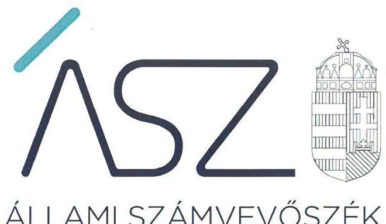
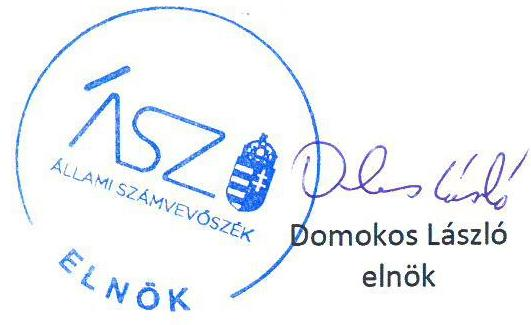
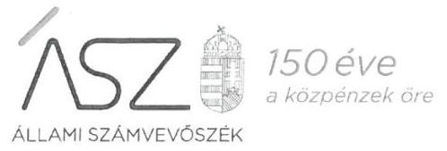
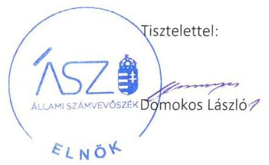

ÁLLAMI SZÁMVEVŐSZÉK

# JELENTÉS 

## Nem állami humánszolgáltatók ellenőrzése

A humánszolgáltatást nyújtó államháztartáson kívüli szociális intézmények, szolgáltatók fenntartói központi költségvetésből kapott támogatásai felhasználásának ellenőrzése -Geronto-Med Szociális, Egészségügyi és Rehabilitációs Közhasznú Nonprofit Korlátolt

Felelősségű Társaság

2020. 

20056
www.asz.hu

---

ÁLLAMI SZÁMVEVŐSZÉK

# JELENTÉS

## Nem állami humánszolgáltatók ellenőrzése

A humánszolgáltatást nyújtó államháztartáson kívüli szociális intézmények, szolgáltatók fenntartói központi költségvetésből kapott támogatásai felhasználásának ellenőrzése – Geronto-Med Szociális, Egészségügyi és Rehabilitációs Közhasznú Nonprofit Korlátolt Felelősségű Társaság

2020. 04. hó 07. nap

20056
www.asz.hu

---

# AZ ELLENŐRZÉST FELÜGYELTE: 

KLINGA LÁSZLÓ felügyeleti vezető

## AZ ELLENŐRZÉST VEZETTE ÉS A VÉGREHAJTÁSÁÉRT FELELŐS:

DR. GÁL NÓRA ellenőrzésvezető

## A PROGRAM ÖSSZEÁLLÍTÁSÁÉRT FELELŐS:

TÓTPÁL SZABOLCS osztályvezető

IKTATÓSZÁM: EL-2548-001/2020.
TÉMASZÁM: 2491
ELLENŐRZÉS-AZONOSÍTÓ SZÁM: V083578
Jelentéseink az Országgyúlés számítógépes hálózatán és az interneten a www.asz.hu címen is olvashatóak.

---

# TARTALOMJEGYZÉK 

■ ÖSSZEGZÉS ..... 5
■ AZ ELLENŐRZÉS CÉLJA ..... 6
■ AZ ELLENŐRZÉS TERÜLETE ..... 7
■ AZ ELLENŐRZÉS HÁTTERE, INDOKOLTSÁGA ..... 8
■ A JELENTÉS LÉNYEGES KÉRDÉSKÖRE ..... 9
■ AZ ELLENŐRZÉS HATÓKÖRE ÉS MÓDSZEREI ..... 10
■ MEGÁLLAPÍTÁSOK ..... 12
■ KÖVETKEZTETÉSEK ..... 13
■ MELLÉKLETEK ..... 15
I. sz. melléklet: Értelmező szótár ..... 15
■ FÜGGELÉKEK ..... 17
I. sz. függelék a jelentéshez ..... 17
II. sz. függelék: Észrevételek ..... 18
■ RÖVIDÍTÉSEK JEGYZÉKE ..... 25

---

.

---

# ÖSSZEGZÉS 

A Geronto-Med Szociális, Egészségügyi és Rehabilitációs Közhasznú Nonprofit Korlátolt Felelősségű Társaság szociális feladatokat ellátó intézménye működtetéséhez igénybe vett közpénzekkel való gazdálkodása nem volt elszámoltatható és átlátható.

## Az ellenőrzés társadalmi indokoltsága

Az Állami Számvevőszék stratégiájában célul tűzte ki, hogy az államháztartáson kívülre nyújtott költségvetési támogatások ellenőrzésével hozzájárul ahhoz, hogy a közpénzeket az államháztartáson kívüli szervezetek is átlátható módon használják fel a közfeladatok szerződésben vállalt ellátása érdekében. Fontos a közvélemény biztosítása arról, hogy a közpénz államháztartáson kívüli felhasználása ezen a területen sem marad ellenőrizetlenül. Az ellenőrzés eredményeképpen a nyilvánosság és a szolgáltatást igénybe vevők megfelelő tájékoztatást kaphatnak az államháztartáson kívüli közfeladatot ellátó működéséről.

## Főbb megállapítások, következtetések

A Geronto-Med Szociális, Egészségügyi és Rehabilitációs Közhasznú Nonprofit Korlátolt Felelősségű Társaság a jogszabályi előírások ellenére a 2015-2017. években nem rendelkezett számviteli politikával és annak keretében elkészítendő számviteli szabályzatokkal. A számviteli szabályzatok hiányában nem alakította ki a költségvetési támogatások igénylésének, felhasználásának a feltételeit, így a számviteli elszámolások szabályszerűsége, illetve a közpénzekkel való rendeltetésszerű és felelős gazdálkodás nem volt biztosított.

A Geronto-Med Szociális, Egészségügyi és Rehabilitációs Közhasznú Nonprofit Korlátolt Felelősségű Társaság az éves beszámoló készítési kötelezettségének 2015-2017. években nem tett eleget. A költségvetési támogatások felhasználására vonatkozó adatok nyilvánosságát nem biztosította.

---

# AZ ELLENŐRZÉS CÉLJA

**AZ ELLENŐRZÉS CÉLJA** annak értékelése, hogy a nem állami, nem önkormányzati szociális intézmények fenntartói központi költségvetésből kapott támogatásainak felhasználása szabályszerű volt-e, a támogatások igénylése, évközi módosítása és év végi elszámolása megfelel-e a jogszabályi előírásoknak.

---

# AZ ELLENŐRZÉS TERÜLETE 

## Geronto-Med Szociális, Egészségügyi és Rehabilitációs Közhasznú Nonprofit Korlátolt Felelősségű Társaság

A GERONTO-MED SZOCIÁLIS, EGÉSZSÉGÜGYI ÉS REHABILITÁCIÓS KÖZHASZNÚ NONPROFIT KORLÁTOLT FELELŐSSÉGŰ TÁRSASÁGOT egy magánszemély alapította 2009. június 2-án, ceglédi székhellyel. Az alapítás célja a Szoctv. ${ }^{1}$ előírásai szerinti, a személyes gondoskodás keretébe tartozó szakosított ellátás, gondozás nyújtása, valamint az önmaguk ellátására nem vagy csak folyamatos segítséggel képes személyek ápolása, gondozása volt.

A Fenntartó ${ }^{2}$ a szociális feladatai megvalósítása érdekében létrehozta a ceglédi székhelyű, 84 férőhelyes Geronto-Med Idősek Otthonát. Az Intézmény ${ }^{3}$ főtevékenysége idősek, fogyatékosok bentlakásos ellátása volt.

A Fenntartó az ellenőrzött időszakban közhasznúsági fokozattal rendelkezett. A Fenntartó képviselőjének személye az ellenőrzött időszakban nem változott. A Fenntartó működésének és gazdálkodásának ellenőrzését három tagú felügyelőbizottság, valamint állandó könyvvizsgáló látta el.

---

# AZ ELLENŐRZÉS HÁTTERE, INDOKOLTSÁGA 

A szociális feladatokat ellátó nem állami intézményfenntartók részére közfeladataik ellátására évente jelentős összegű pénzügyi támogatást biztosítottak a mindenkori költségvetési törvények a bennük megfogalmazott feltételek mellett. A felhasználható állami támogatások a Kvtv. ${ }^{4}$-ekben a 2015-2017. években a szociális ágazatra vonatkozóan 273 Mrd Ft előirányzatot határoztak meg. Módosították a szociális igazgatásról és szociális ellátásokról szóló 1993. évi III. törvényt, amely - többek között - 2012. január 1-jei hatállyal megfogalmazta a finanszírozási rendszerbe történő befogadással összefüggő szabályokat.

Az ÁSZ ${ }^{5}$ stratégiájában foglaltak alapján is indokolt az ellenőrzés, amely a társadalom számára jelzi, hogy a közpénz államháztartáson kívüli felhasználása sem maradhat ellenőrizetlenül. Az államháztartáson kívülre nyújtott költségvetési támogatások ellenőrzésével az ÁSZ hozzájárul ahhoz, hogy a közpénzeket a nem állami humán fenntartók átlátható módon használják fel a közfeladatok ellátására kötött szerződésekben vállalt kötelezettségek teljesítése érdekében. Az ellenőrzés javaslataival hozzájárulhat az említett rendszerek szabályszerű támogatás felhasználásához, javíthatja a társadalmi-gazdasági döntések megalapozottságát, amely a „jó kormányzás" feltétele.

---

# A JELENTÉS LÉNYEGES KÉRDÉSKÖRE 

A szociális humánszolgáltató közfeladatot ellátó fenntartó megteremtette-e a költségvetési támogatások átlátható, elszámoltatható igénybevételének, felhasználásának feltételeit, az átvállalt szociális humánszolgáltatási közfeladathoz biztosított költségvetési támogatásokat szabályszerűen fordította-e a humánszolgáltató intézményei működtetésére, a közpénzekre vonatkozó gazdálkodásával a nyilvánosság előtt elszámolt-e?

---

# AZ ELLENŐRZÉS HATÓKÖRE ÉS MÓDSZEREI 

## Az ellenőrzés típusa

Megfelelőségi ellenőrzés.

## Az ellenőrzött időszak

A 2015. január 1-je és 2017. december 31-e közötti időszak.

## Az ellenőrzés tárgya

Az ellenőrzés a szociális humánszolgáltatási közfeladatokat ellátó államháztartáson kívüli fenntartó humánszolgáltatási közfeladatai ellátásához a költségvetési törvényekben biztosított központi költségvetési támogatások igénylése, évközi módosítása és év végi elszámolása fenntartói feladatainak ellátása, illetve e központi költségvetésből kapott támogatásának humánszolgáltatási közfeladatokra való fenntartó általi felhasználása szabályszerűségének értékelésére terjedt ki.

## Az ellenőrzött szervezet

A Geronto-Med Szociális, Egészségügyi és Rehabilitációs Közhasznú Nonprofit Korlátolt Felelősségű Társaság

## Az ellenőrzés jogalapja

Az ellenőrzés jogszabályi alapját az ÁSZ tv. ${ }^{6} 1 . \S$ (3) bekezdésében. és 5. § (3) bekezdésében foglalt előírások adják.

## Az ellenőrzés módszerei

Az ellenőrzés az ellenőrzési program szempontjai, kérdései, az ellenőrzött időszakban hatályos jogszabályok, a nemzetközi standardokat irányadónak tekintve, az ellenőrzés szakmai szabályok és módszertanok figyelembe vételével történt. A közpénzekkel való felelős gazdálkodás segítésére irányuló javaslatok kidolgozásakor a hatályos jogszabályok voltak az irányadóak.

Az ellenőrzés ideje alatt az ellenőrzött szervezettel történő kapcsolattartás az ÁSZ SZMSZ²-ének vonatkozó előírásai alapján került biztosításra.

---

Az ellenőrzési kérdések megválaszolásához szükséges bizonyítékok megszerzése az ellenőrzött által rendelkezésre bocsátott dokumentumokra, adatokra alapozva történt.

Az ellenőrzési bizonyítékként felhasználható adatforrások közé tartoztak egyrészt az ellenőrzési program részletes szempontjainál felsorolt adatforrások, másrészt minden - az ellenőrzés folyamán feltárt, az ellenőrzés szempontjából információt tartalmazó - dokumentum.

Az ellenőrzés lefolytatásához az ellenőrzött szervezet a kitöltött tanúsítványok, valamint az ÁSZ által kért dokumentumok elektronikus úton való megküldésével szolgáltatott adatokat, információkat. Az így rendelkezésre bocsátott adatok, információk és a tanúsítványok adatai valódiságának kontrollja az ellenőrzés keretében megtörtént.

Az egységes értelmezést támogatta a program mellékletét képező fogalomtár és rövidítésjegyzék.

Az ellenőrzést alapvetően a szociális humánszolgáltatások esetében a központi költségvetési támogatások igénylésével, módosításával, felhasználásával, elszámolásával kapcsolatos feladatokat ellátó fenntartónál végezte az ÁSZ.

A szociális humánszolgáltatások központi költségvetési támogatásai igénylésére, módosítására, elszámolására, államháztartáson kívüli fenntartó jogszabályokban előírt feladatai betartására, továbbá a központi költségvetési támogatások szabályszerű kezelésére, nyilvántartására irányult az ellenőrzés a fenntartónál, az ott rendelkezésre álló határozatok, nyilvántartások, beszámolók és egyéb dokumentumok alapján. Az ellenőrzés nem terjedt ki a szociális humánszolgáltatások központi költségvetési támogatásai igénylése, módosítása, elszámolása valódiságának, megalapozottságának, helyességének - sem a fenntartónál, sem a székhely intézménynél való - értékelésére. Továbbá nem terjedt ki az ellenőrzés e források, intézmények általi szabályszerű felhasználásának értékelésére.

Amennyiben a fenntartó működését és gazdálkodását alapvetően meghatározó dokumentum hiánya miatt, valamely lényeges kérdéskörre vonatkozóan az ÁSZ megállapítást tett, további ellenőrzési tevékenységek az adott kérdéskörrel és az azzal szoros logikai kapcsolatban lévő kérdéskörökkel összefüggésben - ráépülő jelleggel - nem kerültek végrehajtásra.

---

# MEGÁLLAPÍTÁSOK 

## A szociális humánszolgáltató közfeladatot ellátó fenntartó megteremtette-e a költségvetési támogatások átlátható, elszámoltatható igénybevételének, felhasználásának feltételeit, az átvállalt szociális humánszolgáltatási közfeladathoz biztosított költségvetési támogatásokat szabályszerűen fordította-e a humánszolgáltató intézményei működtetésére, a közpénzekre vonatkozó gazdálkodásával a nyilvánosság előtt elszámolt-e?

Összegző megállapítás

A költségvetési támogatások átlátható, elszámoltatható igénybevételének és felhasználásának feltételeit a Fenntartó nem teremtette meg, így a gazdálkodása nem volt szabályszerű. A közpénzekre vonatkozó gazdálkodásával a nyilvánosság előtt nem számolt el.

A szociális humánszolgáltató közfeladatot ellátó Fenntartó működésének szabályozottsága, ennek keretében a Fenntartó gazdálkodására vonatkozó belső szabályozás nem felelt meg az előírásoknak, mivel a Fenntartó nem rendelkezett a Számv. tv. ${ }^{8} 14 . \S$ (3) bekezdésében előírt számviteli politikával, és az annak keretében elkészítendő, a Számv. tv. 14. § (5) bekezdés a), b), és d) pontjában előírt szabályzatok egyikével sem. Ennek hiányában nem igazolt, hogy a Fenntartó a költségvetési támogatást a humánszolgáltató intézménye működtetésére használta fel.

A Fenntartó a közpénzekre vonatkozó gazdálkodásával a nyilvánosság előtt nem számolt el. A jogszabályokban előírt beszámolási kötelezettségének a Számv. tv. 4. § (1) bekezdésében foglaltak ellenére nem tett eleget, ezzel nem biztosította a közpénzek törvényes felhasználásának ellenőrizhetőségét.

---

# KÖVETKEZTETÉSEK 

Az ÁSZ tv. 32. § (1) bekezdésében foglaltak értelmében az ÁSZ jelentés tartalmazza a feltárt tényeket, az ezeken alapuló megállapításokat, következtetéseket, amelyeknek a 24. § (1) d) pontja szerint okszerűnek és megalapozottnak kell lenniük.
„A Geronto-Med Szociális, Egészségügyi és Rehabilitációs Közhasznú Nonprofit Kft, mint szociális intézményfenntartó azzal, hogy nem rendelkezett számviteli politikával és annak keretében elkészítendő szabályzatokkal, a szabályszerű működés és gazdálkodás keretrendszerét nem alakította ki. A jogszabályban előírt beszámolási kötelezettségnek nem tett eleget, így nem biztosította az Alaptörvényben előírt átláthatóság elvének érvényesítését.

Mindezek alapján a Geronto-Med Szociális, Egészségügyi és Rehabilitációs Közhasznú Nonprofit Kft.-nél a költségvetési támogatások kezelése és felhasználása nem volt elszámoltatható."

---

.

---

# MELLÉKLETEK 

- I. SZ. MELLÉKLET: ÉRTELMEZŐ SZÓTÁR
humánszolgáltatás
költségvetési támogatás
nem állami, nem önkormányzati (államháztartáson kívüli) intézmény fenntartó
székhely intézmény
közfeladat
szociális intézmény

Külön törvényben meghatározott szociális, gyermekjóléti, gyermekvédelmi, közoktatási, felsőoktatási, kulturális közfeladatok (2014. évi Kvtv. 34. § (1), (4) bekezdés, 1. számú melléklet XX/20/2. alcím, 19. alcím, 2015. évi Kvtv. 43. § (1), (4) bekezdés, 1. számú melléklet XX/20/2/3. jogcím csoport, 19. alcím, 2016. évi Kvtv. 41. § (1), (4) bekezdés, 1. számú melléklet XX/20/2/3. jogcím csoport, 19. alcím).
a társadalombiztosítás pénzügyi alapjai kivételével az államháztartás központi alrendszeréből ellenérték nélkül, pénzben nyújtott támogatások (Áht. ${ }^{9}$ 1. § 14. pont)
a költségvetési törvényekben (2013. évi CCXXX. törvény 33-34. §, 2014. évi C. törvény 42-43. §, 2015. évi C. törvény 40-41. §) megállapított támogatás. Például a 2015. évi C. törvény 40-41. § szerint többek között: Az Országgyűlés a szociális, gyermekjóléti, gyermekvédelmi közfeladatot ellátó intézményt, szolgáltatást fenntartó egyházi jogi személy, civil szervezet, közalapítvány, országos nemzetiségi önkormányzat, települési vagy területi nemzetiségi önkormányzat, gazdasági társaság, és a humánszolgáltatást alaptevékenységként végző, az Szja tv. hatálya alá tartozó egyéni vállalkozó (a továbbiakban együtt: nem állami szociális fenntartó) részére támogatást állapít meg a következők szerint: a támogatás a nem állami szociális fenntartót a települési önkormányzatok 2. melléklet III. pont 3. alpont c)-k) pontjában és III. pont 5. alpont a) pontjában

 meghatározott támogatásaival azonos jogcímeken, összegben és feltételek mellett illeti meg.
A szociális, gyermekjóléti és gyermekvédelmi közfeladatokat/humánszolgáltatásokat ellátó intézményt fenntartó egyházi jogi személy, társadalmi szervezet, alapítvány, közalapítvány, civil szervezet, országos nemzetiségi önkormányzat, nonprofit gazdasági társaság, gazdasági társaság és a humánszolgáltatást alaptevékenységként végző, Szja tv. hatálya alá tartozó egyéni vállalkozó. (2013. évi Kvtv. 35. § (1), (3) bekezdés, 2014. évi Kvtv. 33. §, 34. § (1), (4) bekezdés, 2015. évi Kvtv. 42. §, 43. § (1), (4) bekezdés, 2016. évi Kvtv. 40. §, 41. § (1), (4) bekezdés, 2017. évi Kvtv. 41. § (1), (4))
a szolgáltató székhelye, azaz a szolgáltató központi ügyintézésének helye, függetlenül attól, hogy használják-e szolgáltatás nyújtására (Sznyvhr. ${ }^{10} 1 . \S$ k) pont) (hatályos: 2013. december 1-től)
„Közfeladat a jogszabályokban meghatározott állami vagy önkormányzati feladat. ... A közfeladatok ellátásában államháztartáson kívüli szervezet jogszabályban meghatározott rendben közreműködhet." A közfeladatok meghatározó jogszabályban meg kell határozni a közfeladat ellátásának módját és egyidejűleg rendezni kell annak az ellátásához szükséges pénzügyi fedezet biztosításáról. (Az államháztartásról szóló 2011. évi CXCV. törvény 3/A. § (1)-(3) bekezdés)
A szociális igazgatásról szóló 1993. évi III. törvényben meghatározott nappali, illetve bentlakásos ellátást, vagy támogatott lakhatást nyújtó szervezet. (Szoc.tv. 4. § (1) bekezdés (h) pont)

---

.

---

# FÜGGELÉKEK 

- I. SZ. FÜGGELÉK A JELENTÉSHEZ

Az Állami Számvevőszék az ellenőrzések során feltárt tényekhez kapcsolódó további körülmények tisztázására eszközrendszerrel nem rendelkezik. Amennyiben az ellenőrzésen túlmutatóan indokoltnak látszik az ellenőrzés során feltárt körülmények további vizsgálata, az Állami Számvevőszék törvényi felhatalmazás alapján az ellenőrzés által feltárt körülményeket továbbítja a hatáskörrel rendelkező szervnek a szükséges intézkedések megtétele, eljárások lefolytatása érdekében.

1. A Fenntartó a 2015-2017. években a Számv. tv. 14. § (3) bekezdésében előírtak ellenére nem alakította ki a számviteli politikáját, és a Számv. tv. 14.§ (5) bekezdés a), b), d) pontjaiban foglaltak ellenére nem készítette el az eszközök és a források leltárkészítési és leltározási szabályzatát, az eszközök és a források értékelési szabályzatát, valamint a pénzkezelési szabályzatot.
2. A Fenntartó a Számv. tv. 4. § (1) bekezdésében foglaltak ellenére a 2015-2017. években éves beszámoló készítési kötelezettségének nem tett eleget.
A könyvvezetés alapvető kereteit biztosító számviteli szabályzatok és az éves számviteli beszámolók hiánya miatt a Fenntartó vagyonáról, annak összetételéről (eszközeiről és forrásairól), pénzügyi helyzetéről és tevékenysége eredményéről nem adott megbízható és valós összképet. Ezen hiányosságok miatt nem igazolt, hogy a költségvetési támogatások igénybevétele jogszerűen történt, továbbá az sem, hogy a Fenntartó a költségvetési támogatásokat a szociális intézmény működtetésére fordította. Ezáltal nem zárható ki, hogy a költségvetésből származó pénzeszközöket a jóváhagyott céltól eltérően használták fel.
A szociális közfeladatok ellátása érdekében a Fenntartó 2015. évben 62,0 millió Ft, 2016. évben 64,3 millió Ft, 2017. évben 73,3 millió Ft összegű támogatást kapott a költségvetésből.
Az eset összes körülményeinek feltárására a Magyar Államkincstár rendelkezik hatáskörrel.

---

A jelentéstervezetet a Számvevőszék 15 napos észrevételezésre megküldte az ellenőrzött szervezet vezetőjének az ÁSZ tv. 29. § (1) bekezdése előírásának megfelelően.

A Geronto-Med Szociális, Egészségügyi és Rehabilitációs Közhasznú Nonprofit Korlátolt Felelősségű Társaság ügyvezetője a jelentéstervezet megállapításaira írásban észrevételt tett.

Az ÁSZ tv. 29. § (3) bekezdésével összhangban az ÁSZ a Függelékben feltünteti az ellenőrzés megállapításaival kapcsolatban tett, figyelembe nem vett észrevételeket, és megindokolja, hogy azokat miért nem fogadta el.

[^0]
[^0]:    * 29. § (1) Az Állami Számvevőszék az ellenőrzési megállapításait megküldi az ellenőrzött szervezet vezetőjének vagy az általa megbízott személynek, és annak, akinek személyes felelősségét állapította meg.
    (2) Az ellenőrzött szervezet vezetője és a felelősként megjelölt személy az ellenőrzés megállapításaira tizenöt napon belül írásban észrevételt tehet.
    (3) Az Állami Számvevőszék az észrevételre a beérkezésétől számított harminc napon belül írásban válaszol. A figyelembe nem vett észrevételeket köteles a jelentésben feltüntetni, és megindokolni, hogy azokat miért nem fogadta el.

---

# Geronto-Med Szociális, Egészségügyi és Rehabilitációs Közhasznú   Nonprofit Korlátolt Felelősségű Társaság   székhely : 2700 Cegléd, Törteli út 12 . 

ÁLLAMI SZÁMVEVŐSZÉK 1052 Budapest, Apáczai Csere János utca 10. Domokos László Elnök Úr részére

Tárgy: Észrevétel a EL-1388-023/2020. iktatószámú jelentéstervezetre

## Tisztelt Domokos László Elnök Úr!

Dr. Joó Judit, a Geronto-Med Szociális, Egészségügyi és Rehabilitációs Közhasznú Nonprofit Korlátolt Felelősségű Társaság (székhely: 2700 Cegléd, Törteli út 12.; Cg. 13-09-129315, Adószám:21837177-1-13,) ügyvezetője az EL-1388-023/2020. iktatási számú, 2020. 02. 14-én kelt, általunk 2020.02.22-én átvett az Állami Számvevőszék társaságunk - a Geronto-Med Szociális, Egészségügyi és Rehabilitációs Közhasznú Nonprofit Korlátolt Felelősségű Társaság, mint a Geronto-Med Idősek Otthona szociális humánszolgáltató fenntartója - központi költségvetésből kapott támogatás felhasználásának ellenőrzése során készült jelentéstervezetében megállapított hiányosságokkal kapcsolatban az alábbi észrevételeket kívánom tenni a törvényes határidőn belül:

A '90-es évek elején aktív belgyógyászati osztályon belgyógyász-gasztroenterológus szakorvosként naponta szembesültem a kórházban fekvő, önmaguk ellátására nem vagy csak folyamatos segítséggel képes idős emberek kilátástalan helyzetével.
Társadalmi felelősségvállalás vezérelt abban, hogy 1995. augusztus 25-én egyéni vállalkozóként létrehozzam a Geronto-Med Idősek Otthonát 32 férőhellyel.
A felelősségteljes gazdálkodás eredményeként intézményünk férőhelyszáma fokozatosan bővült. Jelenleg 86 férőhelyen biztosítjuk - főtevékenységként - idősek, fogyatékosok bentlakásos ellátását normatív állami támogatás segítségével.
A jogszabályi változásoknak megfelelően, többszöri átalakulás után 2009-ben jogutódként jött létre a Geronto-Med Szociális, Egészségügyi és Rehabilitációs Közhasznú Nonprofit Korlátolt Felelősségű Társaság.
Az elmúlt 25 évben ezernél több kliensnek biztosítottunk szakmailag magas színvonalú ellátást az általunk üzemeltetett idősek otthonában. Jelenleg már szakápolási engedéllyel is rendelkezik az intézmény.

2012. január 1-jei hatállyal - az 1993. évi III. törvény módosítása következtében - szociális közfeladatot ellátó nem állami intézményfenntartóként a finanszírozási rendszerbe befogadást nyertünk.

Tekintettel arra, hogy az ellenőrzés során kért dokumentumok elektronikus feltöltése során a Teljességi nyilatkozatot a rendszer csak a kért összes dokumentum csatolása után engedte elkészíteni, így mi annak tudatában voltunk, hogy az Önök által kért valamennyi beleértve a 2015-2016-2017. évekre vonatkozó hatályos Számviteli politikát - azon belül az

---

eszközök és források leltárkészítési és leltározási szabályzatát, az eszközök és források értékelési szabályzatát is - és a pénzkezelési szabályzatot is csatoltuk.

Társaságunk minden üzleti évre határidőben elkészítette a Számviteli törvény szabályainak megfelelő egyszerűsített éves beszámolóját, melyet minden évben könyvvizsgálóval ellenőriztetett. A vizsgált évekre közhasznúsági jelentést is készítettünk.

Az ellenőrzött évekre vonatkozó beszámolókat a könyvvizsgálói jelentéssel és közhasznú jelentéssel együtt szintén feltöltöttük az Önök részére a többi, kért dokumentummal együtt.

A „Teljességi és Hitelességi nyilatkozat a bekért adatokra vonatkozóan" elnevezésű dokumentumot 2018. december 21-én postán megküldtük az Önök részére, melyet jelen észrevételemhez is mellékelek.

Az egyszerűsített éves beszámolók részünkről az Igazságügyi Minisztérium Céginformációs és az Elektronikus Cégeljárásban Közreműködő Szolgálat részére minden évben határidőben feltöltésre kerültek.

Tekintettel arra, hogy Társaságunk eleget tett az Önök által vitatott jogszabályi kötelezettségének, így nem látjuk megalapozottnak azt a megállapításukat, hogy társaságunk „A közpénzekre vonatkozó gazdálkodásával a nyilvánosság előtt nem számolt el."

Társaságunkat az illetékes Hatóságok évek óta rendszeresen ellenőrzik, többek között a Pest Megyei Kormányhivatal és a Magyar Államkincstár is. Jelentősebb hiányosságokat a gazdálkodásunkkal kapcsolatosan egyik évben sem állapítottak meg. Kötelezettségvállalás pénzügyi fedezet nélkül részünkről az elmúlt években nem történt.

Álláspontunk szerint Társaságunk a jogszabályi előírásoknak megfelelő dokumentumokkal rendelkezett, beszámolási kötelezettségének eleget tett, a költségvetési támogatások felhasználására vonatkozó adatok nyilvánosságát biztosította, a költségvetési támogatások igénybevétele részünkről jogszerűen történt, a Fenntartó a költségvetési támogatásokat a szociális intézmény működtetésére fordította.

Az Önök által kilátásba helyezett költségvetési támogatások megvonása intézményünk működését lehetetlenné tenné. A bentlakó idős, magatehetetlen, sok esetben demens ellátottak nem rendelkeznek annyi jövedelemmel, amennyiből az ellátásuk megoldható. Állami támogatás nélkül a bent lakó, jelenleg 86 idős, magatehetetlen ember ellátása, valamint az őket gondozó, jelenleg 32 fő munkavállaló munkahelye is veszélybe kerülne.

Kérem Önt, hogy az észrevételemben foglaltakat elfogadni, méltányos döntését meghozni szíveskedjen.

Cegléd, 2020. március 2.

Tisztelettel :

Dr. Joó Judit
ügyvezető

GERONTO-MED
NONPROFIT KFT.
2700 Cegléd, Törteli út 12.
Adószám: 21537177-1-13
Bsz.: 11742025-20054874

20

---

Ikt. szám: EL-1388-028/2020.

Dr. Joó Judit úrhölgy
ügyvezető
Geronto-Med Szociális, Egészségügyi és Rehabilitációs Közhasznú
Nonprofit Korlátolt Felelősségű Társaság

# Cegléd 

Tisztelt Ügyvezető Úrhölgy!

A „Nem állami humánszolgáltatók ellenőrzése - A humánszolgáltatást nyújtó államháztartáson kívüli szociális intézmények, szolgáltatók fenntartói központi költségvetésből kapott támogatásai felhasználásának ellenőrzése - Geronto-Med Szociális, Egészségügyi és Rehabilitációs Közhasznú Nonprofit Korlátolt Felelősségű Társaság" címmel készített számvevőszéki jelentéstervezetre tett, 2020. március 2-i keltezésű levelében megküldött észrevételeit köszönettel megkaptam.

Az Állami Számvevőszék észrevételekre vonatkozó álláspontjáról a felügyeleti vezető által készített részletes tájékoztatást csatoltan megküldöm.

Tájékoztatom Ügyvezető úrhölgyet, hogy a számvevőszéki jelentésben - az Állami Számvevőszékről szóló 2011. évi LXVI. törvény 29. § (3) bekezdése alapján - a figyelembe nem vett észrevételeket szerepeltetjük az elutasítás indokának feltüntetésével.
Budapest, 2020. 23 hónap 10 nap

Melléklet: Tájékoztatás az észrevételek kezeléséről

---

# Tájékoztatás 

az észrevételek kezeléséről
A „Nem állami humánszolgáltatók ellenőrzése - A humánszolgáltatást nyújtó államháztartáson kívüli szociális intézmények, szolgáltatók fenntartói központi költségvetésből kapott támogatásai felhasználásának ellenőrzése - Geronto-Med Szociális, Egészségügyi és Rehabilitációs Közhasznú Nonprofit Korlátolt Felelősségű Társaság" címú jelentéstervezetre (továbbiakban: jelentéstervezet) a Geronto-Med Szociális, Egészségügyi és Rehabilitációs Közhasznú Nonprofit Korlátolt Felelősségű Társaság (továbbiakban: Fenntartó) 2020. március 2-i keltezésű levelében megküldött észrevételeit áttekintettem. Az észrevételek kezeléséről az alábbi tájékoztatást adom.

1. A jelentéstervezet megállapításának 1. bekezdés 1. mondatával, valamint a 2. bekezdés 2. mondatával kapcsolatos észrevételek:
Ügyvezető úrhölgy észrevételében leírta, hogy az ellenőrzés során kért dokumentumok elektronikus feltöltése során a Teljességi nyilatkozatot a rendszer csak a kért összes dokumentum csatolása után engedte elkészíteni, így a Fenntartó annak tudatában volt, hogy a kért valamennyi a 2015-2017. évekre vonatkozó hatályos Számviteli politikát, az eszközök és források leltárkészítési és leltározási szabályzatát, valamint az eszközök és források értékelési szabályzatát és a pénzkezelési szabályzatot is csatolta. Ügyvezető úrhölgy észrevételében leírta továbbá, hogy társaságuk minden üzleti évre elkészítette a törvényi előírásnak megfelelő egyszerűsített éves beszámolóját, melyet minden évben könyvvizsgálóval ellenőriztetett, valamint a vizsgált évekre közhasznúsági jelentést is készítettek.
Az észrevételt nem fogadjuk el. Az Állami Számvevőszék (továbbiakban: ÁSZ) az ellenőrzései során az adatbekérési időszak alatt benyújtott, hiteles (aláírást tartalmazó) dokumentumok alapján teszi meg a megállapításait. Az EL-1388-001/2018. iktatószámú adatbekérő levelünk 2. számú mellékletében kértük az abban felsorolt - az ellenőrzött időszakban hatályos, illetve az ellenőrzött időszakra vonatkozó - aláírt és hiteles dokumentumokat az ÁSZ adatszolgáltatási rendszerébe feltölteni. A Fenntartó által az ellenőrzés rendelkezésére bocsátott „Számviteli politika 2015.doc", „Számviteli politika 2016.doc", „pénzkezelési szabályzat 2015.doc.", „Pénzkezelési szabályzat 2016.doc" fájlokból megállapítható, hogy azok az ellenőrzött időszakra vonatkozóan nem feleltek meg a tartalmi feltételeknek, mivel azokat a szervezet vezetője nem írta alá. Továbbá a 2015-2017. évekről készített, és az ÁSZ részére beküldött mérleg, eredmény kimutatás, kiegészítő melléklet és közhasznúsági jelentések sem tartalmazzák a szervezet vezetőjének aláírását, így azok sem felelnek meg a tartalmi feltételeknek.
A Fenntartó az adatszolgáltatásra rendelkezésre
 álló időben az ellenőrzött időszakra vonatkozó hatályos, a Számvitelről szóló 2000. évi C. tv. 14. § (5) bekezdés a) és b) pontjai előírásai szerinti eszközök és források leltárkészítési és leltározási szabályzatát, valamint az eszközök és források értékelési szabályzatát sem töltötte fel az ÁSZ adatbekérési rendszerébe.

---

Az észrevétel alapján a jelentéstervezet módosítása nem indokolt.

Budapest, 2020. 03. hó 45. nap

Klinga László felügyeleti vezető

---

.

---

# RÖVIDÍTÉSEK JEGYZÉKE 

${ }^{1}$ Szoctv.
${ }^{2}$ Fenntartó
${ }^{3}$ Intézmény
${ }^{4}$ Kvtv.-ek
${ }^{5}$ ÁSZ
${ }^{6}$ ÁSZ tv.
${ }^{7}$ SZMSZ
${ }^{8}$ Számv.tv.
${ }^{9}$ Áht.
${ }^{10}$ Sznyvhr.
a szociális igazgatásról és szociális ellátásokról szóló 1993. évi III. törvény Geronto-Med Szociális, Egészségügyi és Rehabilitációs Közhasznú Nonprofit Korlátolt Felelősségű Társaság
Geronto-Med Idősek Otthona
2014. évi C. törvény Magyarország 2015. évi központi költségvetéséről 2015. évi C. törvény Magyarország 2016. évi központi költségvetéséről 2016. évi XC. törvény Magyarország 2017. évi központi költségvetéséről Állami Számvevőszék
2011. évi LXVI. törvény az Állami Számvevőszékről

Szervezeti és Működési Szabályzat
a számvitelről szóló 2000. évi C. törvény
2011. évi CXCV. törvény az államháztartásról

369/2013. (X. 24.) Korm. rendelet a szociális, gyermekjóléti és gyermekvédelmi szolgáltatók, intézmények és hálózatok hatósági nyilvántartásáról és ellenőrzéséről

---

# ÁSZ 

ÁLLAMI SZÁMVEVŐSZÉK
1052 Budapest, Apáczai Cs. J. u. 10. I 1364 Budapest 4. Pf. 54 TEL: +36 14849100
email: szamvevoszek@asz.hu
web: www.asz.hu | www.aszhirportal.hu
