ÁLLAMI SZÁMVEVŐSZÉK

# JELENTÉS

A többségi állami és önkormányzati tulajdonú gazdasági társaságok integritásának ellenőrzése

2020.

20057
www.asz.hu

---

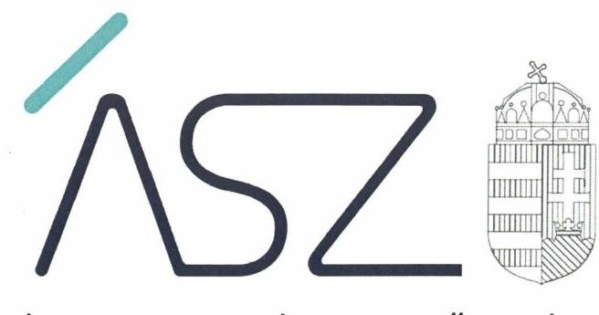

ÁLLAMI SZÁMVEVŐSZÉK

# JELENTÉS 

A többségi állami és önkormányzati tulajdonú gazdasági társaságok integritásának ellenőrzése
2020. 04. hó 14 nap

20057
www.asz.hu
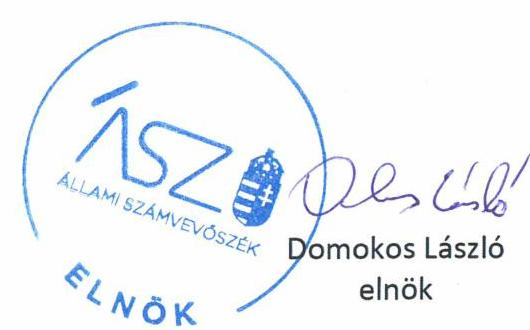

---

# AZ ELLENŐRZÉST FELÜGYELTE: 

DR. PULAY GYULA ZOLTÁN felügyeleti vezető

## AZ ELLENŐRZÉST VEZETTE ÉS A VÉGREHAJTÁSÁÉRT FELELŐS:

TESKI NORBERT ellenőrzésvezető

## A PROGRAM ÖSSZEÁLLÍTÁSÁÉRT FELELŐS:

SALAMON ILDIKÓ tervezési vezető

IKTATÓSZÁM: EL-2549-001/2020.
TÉMASZÁM: 2101
ELLENŐRZÉS-AZONOSÍTÓ SZÁM: V085402

---

# TARTALOMJEGYZÉK 

■ ÖSSZEGZÉS ..... 5
■ AZ ELLENŐRZÉS CÉLJA ..... 6
■ AZ ELLENŐRZÉS TERÜLETE ..... 7
■ AZ ELLENŐRZÉS HÁTTERE, INDOKOLTSÁGA ..... 9
■ A JELENTÉS LÉNYEGES KÉRDÉSKÖRE ..... 10
■ AZ ELLENŐRZÉS HATÓKÖRE ÉS MÓDSZEREI ..... 11
■ MEGÁLLAPÍTÁSOK ..... 14
■ JAVASLATOK ..... 17
■ MELLÉKLETEK ..... 23
I. sz. melléklet: Értelmező szótár ..... 23
■ FÜGGELÉK: ÉSZREVÉTELEK ..... 25
■ RÖVIDÍTÉSEK JEGYZÉKE ..... 57

---

.

---

# ÖSSZEGZÉS 

Az ellenőrzött 19 gazdasági társaság - kettő kivételével - nem biztositotta az integritástudatos müködést. 17 gazdasági társaság integritás kontrolljainak kialakítása és müködtetése nem volt megfelelő, ezáltal feladatellátásuk során nem érvényesült az integritás szemlélet, nem voltak védettek a korrupcióval szemben.

## Az ellenőrzés társadalmi indokoltsága

A többségi állami és önkormányzati tulajdonú gazdasági társaságok vagyona a nemzeti vagyon részét képezi, így gazdálkodásuk eredményessége jelentős mértékben befolyásolja a nemzeti vagyon értékét, az ország gazdasági teljesítményét, továbbá - a kormányzati szektorba sorolt társaságok esetén - hatással van az államadósságra is. Ezért az állami és önkormányzati tulajdonú gazdasági társaságokkal szemben alapvető társadalmi igény, hogy müködésük, gazdálkodásuk szabályszerű, az általuk kezelt közpénzek felhasználása átlátható és elszámoltatható legyen. Az Állami Számvevőszék a közvagyon, a közpénzek szabályos, átlátható és elszámoltatható felhasználásának elősegítése érdekében, stratégiájával összhangban végzi az államháztartáson kívül működő szervezetek ellenőrzését. Az Állami Számvevőszék stratégiájában megfogalmazottak szerint támogatja az integritás alapú, átlátható és elszámoltatható közpénzfelhasználás megteremtését. Mindezekre tekintettel, az állami és önkormányzati tulajdonú gazdasági társaságok esetében a közpénzügyek átláthatóságának előmozdítása, a közvagyon védelme érdekében került sor a gazdasági társaságok integritásának ellenőrzésére.

## Főbb megállapítások, következtetések, javaslatok

Tizenkilenc ellenőrzött gazdasági társaságból tíz gazdasági társaság a működésének alapvető szabályozási feltételeit nem biztosította, mert nem rendelkezett a Számv. tv. ${ }^{1}$ előírásainak megfelelő szabályzatokkal, így az integritási kontrollok kiépítettsége és múködése nem volt megfelelő, ezáltal hiányoztak az átlátható, elszámoltatható múködés alapvető feltételei.

Hét gazdasági társaság nem biztosította az elvárt alapvető integritás kontrollok kiépítését. E súlyos hiányosságok következtében a gazdasági társaságok esetében nem érvényesült az integritás szemlélet, ezáltal nem voltak védettek a korrupcióval szemben.

Két gazdasági társaság biztosította a jogszabályokban előírt integritás kontrollok kiépítését, valamint gondoskodott az integritás elvek érvényesítése érdekében további integritás kontrollok kiépítéséről és müködtetéséről.

Az Állami Számvevőszék a jelentésben foglalt megállapítások alapján a gazdasági társaságok vezetői részére 25 javaslatot fogalmazott meg.

---

# AZ ELLENŐRZÉS CÉLJA 

AZ ELLENŐRZÉS CÉLJA annak értékelése, hogy az ellenőrzött többségi állami és önkormányzati tulajdonú gazdasági társaságok a feladatellátásuk kapcsán meghatározták-e a szervezeti kultúra egységét biztosító értékeket, elveket, célkitűzéseket, illetve felmérték-e a működésük során jelentkező, ezen célok teljesülését érintő integritási kockázatokat. Kidolgoztak-e és működtetek-e integritásirányítási/integritás-kockázatkezelési rendszert, ezen belül kiépítettek-e az integritási kockázatokat mérséklő integritáskontrollokat, és e kontrolleszközök kiterjedtek-e a kockázatos folyamatokra, területekre.

---

# AZ ELLENŐRZÉS TERÜLETE 

## A többségi állami és önkormányzati tulajdonú gazdasági társaságok integritásának ellenőrzése

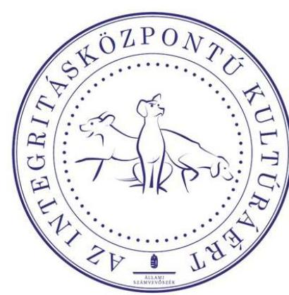

Az ÁSZ ${ }^{2}$ a gazdasági társaságok integritási helyzetére vonatkozó elemzései szerint a szervezetek üzemmérete és integritási szintje között összefüggés figyelhető meg. A mérlegfőöszszeg és a szervezeti tagoltság növekedésével az integritási kockázat emelkedik, ugyanakkor a nagyobb szervezeteknél a kialakított kontrollok szintje magasabb az átlagnál. A kisebb üzemméretű társaságoknál a kontrollok kiépítésének hiánya miatt fokozott korrupciós kockázat jelentkezik. Ezért az integritási helyzet értékelését egyedi homogén csoportba sorolt többségi állami és többségi önkormányzati tulajdonban lévő gazdasági társaságokra kiterjedően végzi az ÁSZ.

Az ellenőrzés az integritás alapú, átlátható és elszámoltatható közpénzfelhasználás elősegítése érdekében, 19 olyan többségi állami tulajdonban lévő gazdasági társaság integritási helyzetét értékelte, amelyeket az ÁSZ még nem ellenőrzött.

Az ellenőrzés nyolc integritást erősítő kontrollterület alapján értékelte, hogy a gazdasági társaságok megfelelően kiépítették és működtették-e integritás kontrolljaikat. Az integritás kontrollok kiépítettsége szintjének értékelése szabályszerűségi és helyénvalósági kritériumok alapján történt.

Minden ellenőrzött gazdasági társaság esetében szabályszerűségi kritérium volt a Számv. tv.-ben, valamint a Taktv. ${ }^{3}$-ben előírt szabályzatok megléte. Amennyiben az ellenőrzött szervezetek valamelyike nem rendelkezett a Számv. tv. előírásainak megfelelő szabályzatokkal, az esetben a további integritás kontrollok értékelése nem történt meg.

Az erre vonatkozó információkat az 1. táblázat mutatja be.

---

1. táblázat

A GAZDASÁGI TÁRSASÁGOK SZÁMV. TV.-BEN ELŐÍRT SZABÁLYZATAI A 2018. ÉVRE VONATKOZÓAN

| Sorszám | Megnevezés | Nem rendelkezett a Számv. tv. előírásainak megfelelő szabályzatokkal | Rendelkezett a Számv. tv. előírásainak megfelelő szabályzatokkal |
| :--: | :--: | :--: | :--: |
| 1. | IBSEN Nkft. ${ }^{4}$ | $x$ |  |
| 2. | DUNA PASSAGE Kft. ${ }^{5}$ | $x$ |  |
| 3. | EXPO Park Kft. ${ }^{6}$ | $x$ |  |
| 4. | NEG Zrt. ${ }^{7}$ | $x$ |  |
| 5. | Skanzenért Nkft. ${ }^{8}$ | $x$ |  |
| 6. | Gönc és Térsége Egéségéért Nkft. ${ }^{9}$ | $x$ |  |
| 7. | HKGYK Nkft. ${ }^{10}$ | $x$ |  |
| 8. | Nemzeti Egészségmegörző Nkft. ${ }^{11}$ | $x$ |  |
| 9. | TRANSHUMAN Kft. ${ }^{12}$ | $x$ |  |
| 10. | Agrármarketing Centrum Nkft. ${ }^{13}$ | $x$ |  |
| 11. | Comitatus Kft. ${ }^{14}$ |  | $x$ |
| 12. | Kun Hulladék Kft. ${ }^{15}$ |  | $x$ |
| 13. | Nemzeti Konténerterminál Kft. ${ }^{16}$ |  | $x$ |
| 14. | Nemzeti MAL-A Zrt. ${ }^{17}$ |  | $x$ |
| 15. | NIPÚF Zrt. ${ }^{18}$ |  | $x$ |
| 16. | PÉCSI TUDÁSKÖZPONT Kft. ${ }^{19}$ |  | $x$ |
| 17. | EH Ügyelet Kft. ${ }^{20}$ |  | $x$ |
| 18. | KlinKoord Kft. ${ }^{21}$ |  | $x$ |
| 19. | Herman Ottó Intézet Nkft ${ }^{22}$. |  | $x$ |

Egyes kontrollok meglétét az ellenőrzés szabályszerűségi kritériumként alkalmazta azokban az esetekben, amikor a kontroll kiépítését jogszabály kötelezően előírta. E tekintetben különbségek voltak az ellenőrzött társaságok között, hogy a Kbt. ${ }^{23}$, az Info tv. ${ }^{24}$, illetve a Bkr. ${ }^{25}$ hatálya alatt álltake. Erre vonatkozó információkat a 2. táblázat foglalja össze.
2. táblázat

A GAZDASÁGI TÁRSASÁGOK SZERVEZETI INFORMÁCIÓI A 2018. ÉVRE VONATKOZÓAN*

| Sorszám | Megnevezés | A Kbt. hatálya alá tartozott | Az Info tv. hatálya alá tartozott | A Bkr. hatálya alá tartozott |
| :--: | :--: | :--: | :--: | :--: |
| 1. | Comitatus Kft. |  |  | $x$ |
| 2. | Kun Hulladék Kft. |  | $x$ |  |
| 3. | Nemzeti Konténerterminál Kft. | $x$ | $x$ |  |
| 4. | Nemzeti MAL-A Zrt. |  |  |  |
| 5. | NIPÚF Zrt. | $x$ | $x$ | $x$ |
| 6. | PÉCSI TUDÁSKÖZPONT Kft. | $x$ | $x$ |  |
| 7. | EH Ügyelet Kft. | $x$ | $x$ | $x$ |
| 8. | KlinKoord Kft. | $x$ |  |  |
| 9. | Herman Ottó Intézet Nkft. | $x$ | $x$ | $x$ |

Az X-el jelölt cellák esetében szabályszerűségi kritérium alapján történt az ellenőrzés.
Forrás: ÁSZ

Jogszabály által kötelezően nem előírt kontrollok esetében az ÁSZ az Alaptörvényben ${ }^{26}$ és az Nvt ${ }^{27}$-ben megfogalmazott integritás elvek (törvényesség, célszerűség, eredményesség, átláthatóság, közélet tisztaságának elve, elszámoltathatóság) érvényesítése érdekében a kontrollok meglétét helyénvalósági kritériumként fogalmazta meg, és azokat a honlapján nyilvánosságra hozta.

---

# AZ ELLENŐRZÉS HÁTTERE, INDOKOLTSÁGA 

Az Alaptörvény értékeket, alapelveket fogalmaz meg, amelyek szerint az állam és a helyi önkormányzatok tulajdonában álló szervezetek a törvényben meghatározott módon, önállóan és felelősen gazdálkodnak a törvényesség, célszerűség és az eredményesség követelményei szerint. A közpénzekkel gazdálkodó minden szervezet köteles a nyilvánosság előtt elszámolni e forrásból megvalósuló gazdálkodásával. A közpénzeket és a nemzeti vagyont az átláthatóság és a közélet tisztaságának elve szerint kell kezelni.

Az ÁSZ ${ }^{28}$ a 2016-2017. évben a köztulajdonú gazdasági társaságok körében is végzett integritás felmérést, amelynek eredményei azt mutatták, hogy nagyon jelentősek a különbségek az egyes gazdasági társaságok között az integritási kontrollok kiépítettségének tekintetében, és e különbségek jelentős részben a társaságok menedzsmentjének az eltérő hozzáállására vezethető vissza.

Az ÁSZ csoportosan végrehajtott, kockázatokat jelző ellenőrzése hozzájárul, hogy a köztulajdonú gazdasági társaságok integritásirányítási/integ-ritás-kockázatkezelési rendszer keretében alkalmazott integritási kontrolljai kiépítettsége és működtetése javuljon, ezáltal integritási veszélyeztetettségük csökkenjen. Az ellenőrzés rámutathat az állami tulajdonú gazdasági társaságok gazdálkodási tevékenységével kapcsolatos jó integritási gyakorlatokra és szabálytalanságokra is, továbbá felhívhatja a figyelmet a jogszabályi követelmények teljesítéséhez szükséges feltételek hiányosságaira.

---

# A JELENTÉS LÉNYEGES KÉRDÉSKÖRE 

- Megfelelő-e a gazdasági társaságoknál az integritási kontrollok kiépítettsége és müködése?

---

# AZ ELLENŐRZÉS HATÓKÖRE ÉS MÓDSZEREI 

## Az ellenőrzés típusa

Megfelelőségi ellenőrzés.

## Az ellenőrzött időszak

A 2018. év

## Az ellenőrzés tárgya

A többségi állami tulajdonban/ a többségi önkormányzati tulajdonban lévő gazdasági társaságok gazdálkodása során az integritás kontrollok kiépítettsége, múködése, valamint a szervezeti elvekkel, értékekkel összefüggő integritás kontrollok kiépítettsége és múködése.

## Az ellenőrzött szervezet

- Békés Megyei IBSEN Oktatási, Művészeti és Közművelődési Nonprofit Korlátolt Felelősségű Társaság
- Comitatus Üzletviteli és Tanácsadó Korlátolt Felelősségű Társaság
- DUNA PASSAGE Ingatlanfejlesztő, Kereskedelmi és Szolgáltató Korlátolt Felelősségű Társaság
- EXPO Park Ingatlanfejlesztő, Kereskedelmi és Szolgáltató Korlátolt Felelősségű Társaság
- Kun Hulladék Korlátolt Felelősségű Társaság
- NEG Nemzeti Energiagazdálkodási Zártkörűen Múködő Részvénytársaság
- Nemzeti Konténerterminál Hálózat Fejlesztő és Üzemeltető Korlátolt Felelősségű Társaság
- Nemzeti MAL-A Alumíniumtermelő Zártkörűen Múködő Részvénytársaság
- NIPÜF Nemzeti Ipari Park Üzemeltető és Fejlesztő Zártkörűen Múködő Részvénytársaság
- PÉCSI TUDÁSKÖZPONT Korlátolt Felelősségű Társaság
- Skanzenért Nonprofit Korlátolt Felelősségű Társaság
- EH Ügyelet Egészségügyi Szolgáltató Nonprofit Korlátolt Felelősségű Társaság
- Gönc és Térsége Egészségéért Egészségügyi Szolgáltató Közhasznú Nonprofit Korlátolt Felelősségű Társaság

---

- HKGYK Közép- és Kelet-Európai Hagyományos Kínai Gyógyászati, Oktató- és Kutatóközpont Nonprofit Korlátolt Felelősségű Társaság
- KlinKoord Klinikai Kutatási Koordinációs Központ Korlátolt Felelősségű Társaság
- Nemzeti Egészségmegőrző Központ Nonprofit Korlátolt Felelősségű Társaság
- TRANSHUMAN Fuvarozó és Egészségügyi Szociális Szolgáltató Korlátolt Felelősségű Társaság
- Agrármarketing Centrum Nonprofit Korlátolt Felelősségű Társaság
- Herman Ottó Intézet Nonprofit Korlátolt Felelősségű Társaság

# Az ellenőrzés jogalapja 

Az ellenrőzés jogszabályi alapját az ÁSZ tv. ${ }^{29} 1$. § (3) bekezdése képezi.

## Az ellenőrzés módszerei

Az ellenőrzés lefolytatása az ellenőrzési program szempontjai, az ellenőrzött időszakban hatályos jogszabályok, a jelen ellenőrzésre irányadó ÁSZ módszertan figyelembe vételével és a nemzetközi standardokat irányadónak tekintve történt. Az ellenőrzési helyszínek kiválasztására kockázat alapon került sor.

Az ellenőrzés ideje alatt az ellenőrzött szervezetekkel történő kapcsolattartást az ÁSZ SZMSZ ${ }^{30}$-ének vonatkozó előírásai alapján biztosította az ÁSZ.

Az ellenőrzési kérdések megválaszolásához szükséges bizonyítékok megszerzése a következő ellenőrzési eljárások alkalmazásával történt: megfigyelés, összehasonlítás, elemző eljárás. Az ellenőrzési bizonyítékként felhasználható adatforrások közé tartoztak az ellenőrzési programban felsorolt adatforrások, továbbá minden - az ellenőrzés folyamán - feltárt, az ellenőrzés szempontjából információkat tartalmazó dokumentum.

Az ellenőrzés lefolytatása a kérdésekre adott válaszok kiértékelésével, valamint a megjelölt adatforrások, a csatolt tanúsítványok felhasználásával, továbbá az adott időszakban hatályos jogszabályok, valamint az ÁSZ által közzétett helyénvalósági kritériumok alapján történt.

Az ÁSZ a gazdasági társaságok integritás kontrolljai jogszabályi előírások szerinti kialakításának és működtetésének szabályszerűségét, illetve helyénvalósági kritériumoknak való megfelelőséget az erre irányuló ellenőrzési alkérdésekre adott válaszok alapján értékelte.

Az ellenőrzés során a gazdasági társaságok integritás kontrolljainak kialakítása és működtetésének értékelése érdekében három csoportban történt az alkérdések meghatározása:

- Minden gazdasági társaság vonatkozásában szabályszerűségi alkérdés volt a Számv. tv.-ben, valamint a Taktv.-ben előírt szabályzatok megléte;
- egyes gazdasági társaságok vonatkozásában szabályszerűségi, egyes gazdasági társaságok vonatkozásában helyénvalósági alkérdés volt

---

az integritás erősítése szempontjából alapvető szabályzatok megléte, a kockázatkezelési rendszer, valamint a belső ellenőrzés múködtetése;
minden gazdasági társaság vonatkozásában helyénvalósági alkérdés volt a partnerek átláthatóságának és összeférhetetlenségének szerződéskötést megelőző vizsgálatának, valamint a munkatársak gazdasági és egyéb érdekeltségeiről szóló nyilatkozat előírásának szabályozása.
Amennyiben a gazdasági társaság múködését és gazdálkodását alapvetően meghatározó dokumentum hiánya miatt, valamely lényeges kérdéskörre vonatkozóan az ÁSZ megállapítást tett, további ellenőrzési tevékenységek az adott kérdéskörrel és az azzal szoros logikai kapcsolatban lévő kérdéskörökkel - ráépülő jelleggel - nem kerültek végrehajtásra.

---

# Megfelelő-e a gazdasági társaságoknál az integritási kontrollok kiépítettsége és múködése? 

Összegző megállapítás

A gazdasági társaságok - kettő kivételével - nem megfelelően építették ki és múködtették az ellenőrzött integritás kontrollokat, tíz gazdasági társaság nem biztosította szabályszerű múködésének alapvető feltételeit.

Tíz gazdasági társaság nem rendelkezett a Számv. tv. előírásainak megfelelő szabályzatokkal, ezáltal nem biztosította a szabályszerű múködés alapvető feltételeit.

Az IBSEN Nkft. nem rendelkezett a Számv. tv 14. § (3) bekezdésében és az (5) bekezdés a), b), d) pontjában meghatározott számviteli politikával és annak keretében elkészítendő szabályzatokkal, valamint a 161. § (1) bekezdésében előírt számlarenddel.

A DUNA PASSAGE Kft. nem rendelkezett a Számv. tv. 14. § (3) bekezdésében előírt számviteli politikával.

Az EXPO Park Kft. nem rendelkezett a Számv. tv. 14. § (8) bekezdésének megfelelő pénzkezelési szabályzattal.

A NEG Zrt. 2018. január 15-éig nem rendelkezett a Számv. tv. 14. § (3) bekezdésében előírt számviteli politikával, valamint a 14. § (5) bekezdés b) pontjában előírt eszközök és források értékelési szabályzatával, valamint 2018. november 2 -áig a 14. § (5) bekezdés d) pontjában előírt pénzkezelési szabályzattal.

A Skanzenért Nkft. 2018. március 1-jéig nem rendelkezett a Számv. tv. 14. § (3) bekezdésében és az (5) bekezdés a), b), d) pontjában meghatározott számviteli politikával és annak keretében elkészítendő szabályzatokkal, valamint a 161. § (1) bekezdésében előírt számlarenddel.

A Gönc és Térsége Egészségéért Nkft. nem rendelkezett a Számv. tv. 161. § (1) bekezdésében előírt számlarenddel.

A HKGYK Nkft. nem rendelkezett a Számv. tv. 14. § (3) bekezdésében előírt számviteli politikával, 14. § (5) bekezdés a) és d) pontjaiban előírt eszközök és források leltárkészítési szabályzatával és pénzkezelési szabályzattal, valamint a 161. § (1) bekezdésében előírt számlarenddel.

A Nemzeti Egészségmegőrző Központ Nkft. nem rendelkezett a Számv. tv. 14. § (5) bekezdés a) b) és d) pontjaiban előírt eszközök és források leltárkészítési szabályzatával, eszközök és források értékelési szabályzatával és pénzkezelési szabályzattal.

A TRANSHUMAN Kft. nem rendelkezett a Számv. tv. 161. § (1) bekezdésében előírt számlarenddel.

---

Az Agrármarketing Centrum Nkft. nem rendelkezett a Számv. tv. 14. § (3) bekezdésében előírt számviteli politikával, a 14. § (5) bekezdés d) pontjában előírt pénzkezelési szabályzattal, valamint a 161. § (1) bekezdésében előírt számlarenddel.

A Számv. tv. előírásainak megfelelő szabályzatok hiányában az integritási kontrollok kiépítettsége és múködése nem volt megfelelő, ezáltal nem volt biztosított az átlátható és elszámoltatható múködés.

# 1.2. számú megállapítás 

Öt gazdasági társaság nem biztosította a jogszabályokban előírt integritás kontrollok kiépítését, ezáltal múködésükben nem érvényesült az integritás szemlélet, a gazdasági társaságok nem voltak védettek a korrupcióval szemben.

A Comitatus Kft. a Taktv. 5. § (3) bekezdésében előírtak ellenére nem rendelkezett a vezető tisztségviselők, felügyelőbizottsági tagok, valamint az Mt. ${ }^{31}$ 208. §-ának hatálya alá eső munkavállalók javadalmazása, valamint a jogviszony megszűnése esetére biztosított juttatások módjának, mértékének elveiről, annak rendszeréről szóló szabályzattal. A Bkr. 6. § (1) bekezdés c) pontjában előírtak ellenére nem fogalmazott meg etikai követelményeket. A Bkr. 7. § (1) bekezdésében előírtak ellenére nem múködtetett integrált kockázatkezelési rendszert. A Bkr. 22. § (1) bekezdés a) és b) pontjaiban előírtak ellenére nem rendelkezett belső ellenőrzési kézikönyvvel és belső ellenőrzési tervvel.

A Nemzeti Konténerterminál Kft. 2018. január 1 - 2018. július 25. között az Info. tv. 24. § (3) bekezdésében, valamint 2018. július 26. - 2018. december 31. között a 25/A. § (3) bekezdésében előírtak ellenére nem rendelkezett adatvédelmi szabályzattal.

A PÉCSI TUDÁSKÖZPONT Kft. a Taktv. 5. § (3) bekezdésében előírtak ellenére a nem rendelkezett a vezető tisztségviselők, felügyelőbizottsági tagok, valamint az Mt. 208. §-ának hatálya alá eső munkavállalók javadalmazása, valamint a jogviszony megszűnése esetére biztosított juttatások módjának, mértékének elveiről, annak rendszeréről szóló szabályzattal. A Kbt. 27. § (1) bekezdésében előírtak ellenére nem határozta meg a közbeszerzési eljárásai előkészítésének, lefolytatásának, belső ellenőrzésének felelősségi rendjét. 2018. január 1 - 2018. július 25. között az Info. tv. 24. § (3) bekezdésében, valamint 2018. július 26. - 2018. december 31. között a 25/A. § (3) bekezdésében előírtak ellenére nem rendelkezett adatvédelmi szabályzattal.

Az EH Ügyelet Kft. a Kbt. 27. § (1) bekezdésében előírtak ellenére nem határozta meg a közbeszerzési eljárásai előkészítésének, lefolytatásának, belső ellenőrzésének felelősségi rendjét. A Bkr. 6. § (1) bekezdés c) pontjában előírtak ellenére nem fogalmazott meg etikai követelményeket, továbbá a 7. § (1) bekezdésében előírtak ellenére nem múködtetett integrált kockázatkezelési rendszert.

A Klinkoord Kft. a Kbt. 27. § (1) bekezdésében előírtak ellenére nem határozta meg a közbeszerzési eljárásai előkészítésének, lefolytatásának, belső ellenőrzésének felelősségi rendjét.

---

1.3. számú megállapítás

Két gazdasági társaság biztosította a jogszabályokban előírt integritás kontrollok kiépítését. További helyénvalósági kritériumként elvárt kontrollokkal nem rendelkeztek.

A Nemzeti MAL-A Zrt. rendelkezett a Taktv. előírásainak megfelelő szabályzattal. A Kun Hulladék Kft. rendelkezett a Taktv. és az Info tv. előírásainak megfelelő szabályzatokkal.

A két gazdasági társaság az integritás elvek érvényesítése érdekében nem határozott meg beszerzési eljárásokkal kapcsolatos szabályozást, nem mérte fel a tevékenységében rejlő és szervezeti célokkal összefüggő kockázatokat, nem múködtetett belső ellenőrzést, nem határozott meg etikai alapelveket, nem készítette el az ajándékok elfogadására vonatkozó szabályozást, továbbá nem szabályozta a partnerek átláthatóságának és összeférhetetlenségének szerződéskötést megelőző vizsgálatát.
1.4. számú megállapítás

Két gazdasági társaság biztosította a jogszabályokban előírt integritás kontrollok kiépítését, valamint gondoskodott az integritás elvek érvényesítése érdekében további integritás kontrollok kiépítéséről és múködtetéséről.

A NIPÜF Zrt. és a Herman Ottó Intézet Nkft. rendelkezett a Taktv. a Kbt. valamint az Info tv. által előírt szabályzatokkal. A Herman Ottó Intézet Nkft. 2018. július 1-jétől múködtetett a Bkr. előírásainak megfelelő belső ellenőrzést, valamint 2018 szeptemberétől múködtetett a Bkr. előírásainak megfelelő integrált kockázatkezelési rendszert.

A NIPÜF Zrt. elkészítette az ajándékok elfogadására vonatkozó szabályozást, szabályozta a partnerek átláthatóságának és összeférhetetlenségének szerződéskötést megelőző vizsgálatát, azonban nem hozott létre munkáltatói visszaélés-bejelentési rendszert, valamint nem rendelkezett a munkatársak gazdasági és egyéb érdekeltségeiről szóló nyilatkozat előírását alátámasztó belső szabályozással.

A Herman Ottó Intézet Nkft. az ajándékok elfogadására, a partnerek átláthatóságának és összeférhetetlenségének szerződéskötést megelőző vizsgálatára, a munkáltatói visszaélés-bejelentési rendszerre, valamint a munkatársak gazdasági és egyéb érdekeltségeiről szóló nyilatkozataira vonatkozó szabályozást a 2018. szeptember 14-étől érvényes etikai kódexben ${ }^{32}$ határozta meg.

---

# JAVASLATOK 

Az ÁSZ tv. 33. § (1) bekezdésében foglaltak értelmében az ellenőrzött szervezet vezetője köteles a jelentésben foglalt megállapításokhoz kapcsolódó intézkedési tervet összeállítani és azt a jelentés kézhezvételétől számított 30 napon belül az ÁSZ részére megküldeni. Amennyiben az ellenőrzött szervezet vezetője nem küldi meg határidőben az intézkedési tervet, vagy továbbra sem elfogadható intézkedési tervet küld, az Állami Számvevőszék elnöke az ÁSZ tv. 33. § (3) bekezdése a) és b) pontjaiban foglaltakat érvényesítheti.

## Békés Megyei IBSEN Oktatási, Művészeti és Közművelődési Nonprofit Kft. „felszámolás alatt" felszámolójának

1. Intézkedjen a Számv. tv. 14. § (3) bekezdésében és az 5. bekezdés a), b), d) pontjában meghatározott számviteli politika és annak keretében elkészítendő szabályzatok, valamint a 161. § (1) bekezdésében előírt számlarend megalkotásáról.
(1.1. sz. megállapítás 1. bekezdése alapján)

## DUNA PASSAGE Ingatlanfejlesztő, Kereskedelmi és Szolgáltató Kft. ügyvezetőjének

1. Intézkedjen a Számv. tv. 14. § (3) bekezdésében előírt számviteli politika megalkotásáról.
(1.1. sz. megállapítás 2. bekezdése alapján)

## EXPO Park Ingatlanfejlesztő, Kereskedelmi és Szolgáltató Kft. ügyvezetőjének

1. Intézkedjen a Számv. tv. 14. § (8) bekezdésének megfelelő pénzkezelési szabályzat megalkotásáról.
(1.1. sz. megállapítás 3. bekezdése alapján)

---

# Gönc és Térsége Egészségéért Egészségügyi Szolgáltató Közhasznú Nonprofit Kft. ügyvezetőjének 

1. Intézkedjen a Számv. tv. 161. § (1) bekezdésében elöirt számlarend megalkotásáról.
(1.1. sz. megállapítás 6. bekezdése alapján)

## HKGYK Közép- és Kelet-Európai Hagyományos Kínai Gyógyászati, Oktató- és Kutatóközpont Nonprofit Kft. ügyvezetőjének

1. Intézkedjen a Számv. tv. 14. § (3) bekezdésében elöirt számviteli politika megalkotásáról.
(1.1. sz. megállapítás 7. bekezdése alapján)
2. Intézkedjen a Számv. tv. 14. § (5) bekezdés (a) pontjában elöirt eszközök és források leltárkészittési szabályzatának megalkotásáról.
(1.1. sz. megállapítás 7. bekezdése alapján)
3. Intézkedjen a Számv. tv. 14. § (5) bekezdés d) pontjában elöirt pénzkezelési szabályzat megalkotásáról.
(1.1. sz. megállapítás 7. bekezdése alapján)
4. Intézkedjen a Számv. tv. 161. § (1) bekezdésében elöirt számlarend megalkotásáról.
(1.1. sz. megállapítás 7. bekezdése alapján)

## Nemzeti Egészségmegőrző Központ Nonprofit Kft. ügyvezetőjének

1. Intézkedjen a Számv. tv. 14. § (5) bekezdés a) pontjában elöirt eszközök és források leltárkészittési szabályzatának megalkotásáról.
(1.1. sz. megállapítás 8. bekezdése alapján)

---

2. Intézkedjen a Számv. tv. 14. § (5) bekezdés b) pontjában előirt eszközök és források értékelési szabályzatának megalkotásáról.
(1.1. sz. megállapítás 8. bekezdése alapján)
3. Intézkedjen a Számv. tv. 14. § (5) bekezdés d) pontjában előirt pénzkezelési szabályzat megalkotásáról.
(1.1. sz. megállapítás 8. bekezdése alapján)

# TRANSHUMAN Fuvarozó és Egészségügyi Szociális Szolgáltató Kft. ügyvezetőjének 

1. Intézkedjen a Számv. tv. 161. § (1) bekezdésében elöirt számlarend megalkotásáról.
(1.1. sz. megállapítás 9. bekezdése alapján)

## Agrármarketing Centrum Nonprofit Kft. ügyvezetőjének

1. Intézkedjen a Számv. tv. 14. § (3) bekezdésében elöirt számviteli politika megalkotásáról.
(1.1. sz. megállapítás 10. bekezdése alapján)
2. Intézkedjen a Számv. tv. 14. § (5) bekezdés d) pontjában elöirt pénzkezelési szabályzat megalkotásáról.
(1.1. sz. megállapítás 10. bekezdése alapján)
3. Intézkedjen a Számv. tv. 161. § (1) bekezdésében elöirt számlarend megalkotásáról.
(1.1. sz. megállapítás 10. bekezdése alapján)

---

# HSSC Szolgáltató Központ Kft., mint a Comitatus Üzletviteli és Tanácsadó Kft. ügyvezetőjének képviseletére jogosult személynek 

1. Kezdeményezze a tulajdonosi jogok gyakorlójánál a Taktv. 5. § (3) bekezdésében elöirt javadalmazási szabályzat megalkotását.
(1.2. sz. megállapítás 1. bekezdése alapján)
2. Intézkedjen a Bkr. 7. § (1) bekezdésében elöirt integrált kockázatkezelési rendszer müködtetéséről.
(1.2. sz. megállapítás 1. bekezdése alapján)

## Nemzeti Konténerterminál Hálózat Fejlesztő és Üzemeltető Kft. ügyvezetőjének

1. Intézkedjen az Info. tv. 25/A. § (3) bekezdése szerinti adatvédelmi szabályzat megalkotásáról.
(1.2. sz. megállapítás 2. bekezdése alapján)

## Pécsi Tudásközpont Kft. ügyvezetőjének

1. Kezdeményezze a tulajdonosi jogok gyakorlójánál a Taktv. 5. § (3) bekezdésében elöirt javadalmazási szabályzat megalkotását.
(1.2. sz. megállapítás 3. bekezdése alapján)
2. Intézkedjen a Kbt. 27. § (1) bekezdésében elöirtak szerint a közbeszerzési eljárások rendjének szabályozásáról.
(1.2. sz. megállapítás 3. bekezdése alapján)
3. Intézkedjen az Info. tv. 25/A. § (3) bekezdése szerinti adatvédelmi szabályzat megalkotásáról.
(1.2. sz. megállapítás 3. bekezdése alapján)

---

# EH Ügyelet Egészségügyi Szolgáltató Nonprofit Kft. ügyvezetőjének 

1. Intézkedjen a Kbt. 27. § (1) bekezdésében elöirtak szerint a közbeszerzési eljárások rendjének szabályozásáról.
(1.2. sz. megállapítás 4. bekezdése alapján)
2. Intézkedjen a Bkr. 7. § (1) bekezdésében elöirt integrált kockázatkezelési rendszer müködtetéséről.
(1.2. sz. megállapítás 4. bekezdése alapján)

## KlinKoord Klinikai Kutatási Koordinációs Központ Kft. ügyvezetőjének

1. Intézkedjen a Kbt. 27. § (1) bekezdésében elöirtak szerint a közbeszerzési eljárások rendjének szabályozásáról.
(1.2. sz. megállapítás 5. bekezdése alapján)

## Nemzeti MAL-A Alumíniumtermelő Zrt. vezérigazgatójának

1. Intézkedjen a társaság integritássértések elleni védelmének erősitéséről:
a) a társaság tevékenységében rejlő és a szervezeti célok teljesitését veszélyeztető kockázatok felmérésével és értékelésével;
b) belső ellenőrzés létrehozásával;
c) az társaság müködése során érvényesitendő etikai elvek meghatározásával;
d) az ajándékok elfogadására vonatkozó szabályozással;
e) annak szabályozásával, hogy a szerződések megkötése előtt vizsgálják a szerződő fél átláthatóságát és összeférhetetlenségét.
(1.3. sz. megállapítás 2. bekezdése alapján)

---

.

---

# MELLÉKLETEK 

- I. SZ. MELLÉKLET: ÉRTELMEZŐ SZÓTÁR

ÁSZ Integritás Projekt
belső ellenőrzés
gazdasági társaság
integritás
integrált kockázatkezelési rendszer
kontrollkörnyezet

Az ÁSZ 2009-ben indította el a „Korrupciós kockázatok feltérképezése - Integritás alapú közigazgatási kultúra terjesztése" című, európai uniós forrásból megvalósított kiemelt projektjét (Integritás Projekt). Az Integritás Projekt célja, hogy felmérje a közszféra intézményei korrupciós kockázatoknak való kitettségét, illetőleg az azok mérséklésére hivatott kontrollok szintjét. Az ÁSZ a projekt révén az integritás szemlélet minél szélesebb körrel történő megismertetését, gyakorlatba ültetését kívánja elérni. Az integritás követelményeinek megfelelő szervezeti működést előnyben részesítő közigazgatási kultúra elterjesztését és a korrupció elleni fellépést az ÁSZ önmagára nézve is stratégiai jelentőségű célként fogalmazta meg. A projekt a felmérésben résztvevő intézmények számára helyzetükről egyfajta „tükörképet" mutat be, ami alapot teremt a jövőbeni pozitív irányú elmozduláshoz.
(Forrás: a http://integritas.asz.hu honlapon közzétett, a 2013. évi Integritás felmérés eredményeiről készült összefoglaló tanulmány)
Független, tárgyilagos bizonyosságot adó és tanácsadó tevékenység, amelynek célja, hogy az ellenőrzött szervezet működését fejlessze és eredményességét növelje, az ellenőrzött szervezet céljai elérése érdekében rendszerszemléletű megközelítéssel és módszeresen értékeli, illetve fejleszti az ellenőrzött szervezet irányítási és belső kontrollrendszerének hatékonyságát.
(Forrás: Bkr. 2. § b) pont)
A gazdasági társaságok üzletszerű közös gazdasági tevékenység folytatására, a tagok vagyoni hozzájárulásával létrehozott, jogi személyiséggel rendelkező vállalkozások, amelyekben a tagok a nyereségből közösen részesednek, és a veszteséget közösen viselik.
(Forrás: Ptk. 3:88. § (1) bekezdés)
Az integritás az elvek, értékek, cselekvések, módszerek, intézkedések konzisztenciáját jelenti, vagyis olyan magatartásmódot, amely meghatározott értékeknek megfelel.
(Forrás: Nemzetgazdasági Minisztérium: Magyarországi államháztartási belső kontroll standardok Útmutató 1.6.1. pontja, 2012. december)
Olyan folyamatalapú kockázatkezelési rendszer, amely a szervezet minden tevékenységére kiterjed, egységes módszertan és eljárások alkalmazásával, a szervezet célkitűzéseinek és értékeinek figyelembevételével biztosítja a szervezet kockázatainak teljes körű azonosítását, azok meghatározott kritériumok szerinti értékelését, valamint a kockázatok kezelésére vonatkozó intézkedési terv elkészítését és az abban foglaltak nyomon követését.
(Forrás: Bkr. 2. § m) pont, 2016. október 1-jétől)
A vezető tisztségviselő vagy a vezető tisztségviselőkből álló testület vezetője által kialakított olyan elvek, eljárások, belső szabályzatok összessége, amelyben világos a szervezeti struktúra, a folyamatok átláthatók, egyértelműek a felelősségi, hatásköri viszonyok és feladatok, meghatározottak, ismertek és elfogadottak az etikai elvárások a szervezet minden szintjén, átlátható a humáne-óforrás-kezelés, biztosított a szervezeti célok és értékek irányában való elkötelezettség fejlesztése és elősegítése.
(Forrás: Bkr. 6. § (1) bekezdés)

---

kontrolltevékenységek

A vezető tisztségviselő vagy a vezető tisztségviselőkből álló testület vezetője által a szervezeten belül kialakított (kontroll) tevékenységek, melyek biztosítják a kockázatok kezelését, hozzájárulnak a szervezet céljainak eléréséhez és erősítik a szervezet integritását.
(Forrás: Bkr. 8. § (1) bekezdés)
a szervezet tevékenységének, a célok megvalósításának nyomon követését biztosító rendszer

A vezető tisztségviselő vagy a vezető tisztségviselőkből álló testület vezetője köteles kialakítani a szervezet tevékenységének, a célok megvalósításának nyomon követését biztosító rendszert, mely az operatív tevékenységek keretében megvalósuló folyamatos és eseti nyomon követésből, valamint az operatív tevékenységektől függetlenül múködő belső ellenőrzésből áll.
(Forrás: Bkr. 10. §)

---

# FÜGGELÉK: ÉSZREVÉTELEK 

A jelentéstervezetet a Számvevőszék 15 napos észrevételezésre megküldte az ellenőrzött szervezetek vezetőinek az ÁSZ tv. 29. §* (1) bekezdése előírásának megfelelően.

Az észrevételezésre megküldött jelentéstervezet megállapításaira az Agrármarketing Centrum Nonprofit Korlátolt Felelősségü Társaság ügyvezetője, a Nemzeti Konténerterminál Hálózat Fejlesztő és Üzemeltető Korlátolt Felelősségü Társaság ügyvezetője, a Gönc és Térsége Egészségéért Egészségügyi Szolgáltató Közhasznú Nonprofit Korlátolt Felelősségü Társaság ügyvezetője, a NEG Nemzeti Energiagazdálkodási Zártkörüen Müködő Részvénytársaság vezérigazgatója, a DUNA PASSAGE Ingatlanfejlesztő, Kereskedelmi és Szolgáltató Korlátolt Felelősségü Társaság ügyvezetője, a HKGYK Közép- és Kelet-Európai Hagyományos Kínai Gyógyászati, Oktatóés Kutatóközpont Nonprofit Korlátolt Felelősségü Társaság ügyvezetője, a HSSC Szolgáltató Központ Kft., mint a Comitatus Üzletviteli és Tanácsadó Kft. ügyvezetőjének képviseletére jogosult személy, a PÉCSI TUDÁSKÖZPONT Korlátolt Felelősségü Társaság ügyvezetője valamint az EXPO PARK Ingatlanfejlesztő, Kereskedelmi és Szolgáltató Korlátolt Felelősségü Társaság ügyvezetője írásban észrevételt tett.
Az ÁSZ tv. 29. § (3) bekezdésével összhangban az ÁSZ a Függelékben feltünteti az ellenőrzés megállapításaival kapcsolatban tett, figyelembe nem vett észrevételeket, és megindokolja, hogy azokat miért nem fogadta el.

[^0]
[^0]:    * 29. § (1) Az Állami Számvevőszék az ellenőrzési megállapításait megküldi az ellenőrzött szervezet vezetőjének vagy az általa megbízott személynek, és annak, akinek személyes felelősségét állapította meg.
    (2) Az ellenőrzött szervezet vezetője és a felelősként megjelölt személy az ellenőrzés megállapításaira tizenöt napon belül írásban észrevételt tehet.
    (3) Az Állami Számvevőszék az észrevételre a beérkezésétől számított harminc napon belül írásban válaszol. A figyelembe nem vett észrevételeket köteles a jelentésben feltüntetni, és megindokolni, hogy azokat miért nem fogadta el.

---

Domokos László úr
elnök
részére

Állami Számvevőszék
Budapest

Tárgy:

Tisztelt Elnök Úr!

Iktsz: ÁLT/416-3/2019/AMC
Ügyintéző: Pásztorné Barcsi Zsuzsanna
Elérhetőség: pasztorne@amc.hu

ÁLLAMI SZÁMVEVŐSZÉK
25-24823/2020/
Érkezeti: 2020 FERR 24
Iktatószár-EL-1694-041/2020
Mellékje:

Társaságom köszönettel megkapta a 2020. február 18. napján kelt Jelentéstervezetet, amely a T. Számvevőszék „A többségi állami és önkormányzati tulajdonú gazdasági társaságok integritásának ellenőrzése" kapcsán folytatott ellenőrzése eredményeképpen született.

A Jelentéstervezet az Agrármarketing Centrum Nonprofit Kft. vonatkozásában a 12. oldalon az 1.1. számú megállapításában rögzíti, hogy a Társaság nem rendelkezett a vizsgált időszakban a számvitelről szóló 2000. évi C. szerinti három szabályzattal, azaz nem állt rendelkezésre számviteli politika, pénzkezelési szabályzat és számlarend.

Társaságom az ellenőrzés során a T. Számvevőszék rendelkezésére bocsátotta valamennyi vonatkozó szabályzatát, azonban sajnálatos emberi tévedés miatt azoknak nem az aláírt változatát csatoltuk fel. Egyúttal szeretnénk tájékoztatni a T. Számvevőszéket, hogy a szóban forgó három szabályzat 2017-ben a Társaság akkori ügyvezetője által aláírásra került és azok a mai napig hatályban vannak.

Kérem T. Elnök Urat, hogy egyedi mérlegelési jogkörében eljárva a jelen levelemhez mellékelt, aláírt szabályzatokat vegye figyelembe a Jelentéstervezet véglegesítésekor.

Budapest, 2020. február 20.

Tisztelettel,
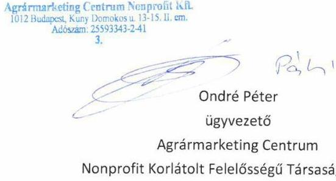

1012 Budapest, Kuny Domokos utca 13-15. II. emelet. I Levélcím: 1253 Budapest, Pf.: 66. I Telefon: 06-1 4508800 I e-mail: amc@amc.hu | www.amc.hu

---

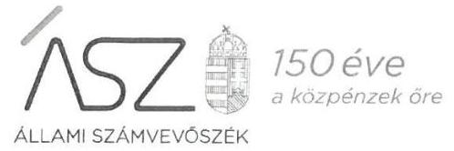

Ikt. szám: EL-1677-045/2020

Ondré Péter úr
ügyvezető
Agrármarketing Centrum Nonprofit
Korlátolt Felelősségű Társaság
Budapest

Tisztelt Ügyvezető Úr!
"A többségi állami és önkormányzati tulajdonú gazdasági társaságok integritásának ellenőrzése" címmel készített számvevőszéki jelentéstervezetre az ÁLT/416-3/2019/AMC ikt.sz. levélben megküldött észrevételét megkaptam.

Az Állami Számvevőszék észrevételekre vonatkozó álláspontjáról a felügyeleti vezető által készített részletes tájékoztatást csatoltan megküldöm.

Tájékoztatom Ügyvezető urat, hogy a számvevőszéki jelentésben - az Állami Számvevőszékről szóló 2011. évi LXVI. törvény 29. § (3) bekezdése alapján - a figyelembe nem vett észrevételeket szerepeltetjük az elutasítás indokának feltüntetésével.
Budapest, 2020. 23 hónap 18 nap
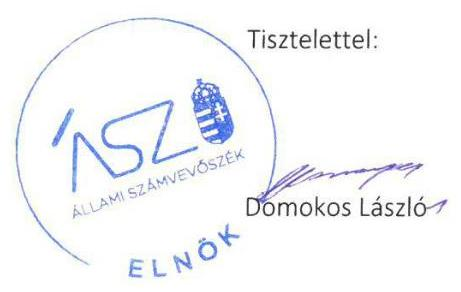

Melléklet: Tájékoztatás az észrevételek kezeléséről

---

# Tájékoztatás az észrevételek kezeléséről 

„A többségi állami és önkormányzati tulajdonú gazdasági társaságok integritásának ellenőrzése" című jelentéstervezetre (továbbiakban: jelentéstervezet) a 2020. február 20-án kelt levelében megküldött észrevételeit áttekintettem. Az észrevételek kezeléséről az alábbi tájékoztatást adom.

Ügyvezető úr észrevételében jelezte, hogy az ellenőrzés rendelkezésére bocsátotta az Agrármarketing Centrum Nonprofit Korlátolt Felelősségű Társaság (továbbiakban: társaság) számviteli politikáját, pénzkezelési szabályzatát és számlarendjét, azonban sajnálatos módon nem azok aláírt változatát. Észrevétele szerint 2017-ben mindhárom szabályzat a társaság akkori ügyvezetője által aláírásra került, amelyeket észrevételéhez mellékletként csatolt.

A számvitelről szóló 2000. évi C. törvény (Számv. tv.) 14. § (12) bekezdése értelmében a számviteli politika elkészítéséért, módosításáért a gazdálkodó képviseletére jogosult személy felelős. A 161. § (4) bekezdés kimondja, hogy a számlarend összeállításáért, annak folyamatos karbantartásáért, a naprakész könyvvezetés helyességéért a gazdálkodó képviseletére jogosult személy a felelős. Az észrevételben is hivatkozott, az adatszolgáltatás során az Állami Számvevőszék (továbbiakban: ÁSZ) a rendelkezésére bocsátott számviteli politika, az annak keretében elkészítendő pénzkezelési szabályzat és a számlarend nem tartalmazzák a gazdálkodó képviseletére jogosult személy aláírását, így azok ellenőrzési bizonyítékként nem értékelhetők. Megbízhatónak tekinti az ÁSZ az ellenőrzés szempontjából azon bizonyítékot, amely kétséget kizáróan bizonyítja a benne foglaltakat. Észrevételében Ügyvezető úr elismerte a szabályzatok tekintetében az aláírások hiányát.

Az ÁSZ az ellenőrzési megállapításait az ellenőrzött időszakban hatályos jogszabályok és az ellenőrzött szervezet közreműködési kötelezettsége keretében, az ellenőrzött szervezet által rendelkezésre bocsátott, Teljességi és hitelességi nyilatkozattal alátámasztott dokumentumokra alapozva fogalmazta meg. Ügyvezető úr által aláírt Teljességi és hitelességi nyilatkozatban foglaltak szerint az átadott dokumentumok, adatok megbízhatóak, az ÁSZ által bekért adatokra, dokumentumokra vonatkozóan teljes körű információt tartalmaznak. Ügyvezető úr az átadott dokumentumok, adatok hitelességéért, valódiságáért, hiánytalanságáért teljes felelősséget vállalt. Az ÁSZ megállapításainak megfogalmazásánál az adatszolgáltatáson kívül, így a 15 napos észrevételezés keretében megküldött dokumentumokat nem veszi figyelembe.

Budapest, 2020. 03 hónap 45 . nap
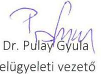
felügyeleti vezető

---

NEMZETI
KONTÉNERTERMINÁL
HÁLÓZAT

Állami Számvevőszék
Budapest 4.
Pf. 54
1364

Tárgy: Észrevétel jelentéstervezet - A többségi állami és önkormányzati tulajdonú gazdasági társaságok integritásának ellenőrzése témában
EL-1677-00022/2020

Tisztelt Számvevőszék! Tisztelt Domokos László Elnök Úr!
2020. február 19. napján érkezett Társaságunkat érintő jelentéstervezet megállapításai kapcsán az alábbi észrevételeket teszem:

A Nemzeti Konténerterminál Hálózat Fejlesztő és Üzemeltető Kft. nevében tájékoztatom Önt, hogy társaságunk 2018. június 01. napi hatállyal rendelkezik a jelentéstervezetben hivatkozott előírásoknak megfelelő Belső Adatvédelmi Szabályzattal (melyet a társaság belsőellenőrzése 2019. szeptember 26. napján záruló ellenőrzése folyamán megfelelőnek minősített).
2019. augusztus 16. napján kelt az elektronikus adatszolgáltatási kötelezettségről szóló tájékoztató levelének 2. sz. mellékleti dokumentumjegyzéke adatvédelmi szabályzat feltöltését kérte. Értelmezésünk szerint, ez a személyes adatvédelem müködését rögzítő szabályzat vizsgálatára irányult, melynek feltöltését több alkalommal kíséreltük meg elektronikus adatszolgáltatási rendszerükbe sikertelenül. Erről tájékoztatva Önöket és további technikai segítséget kérve önöktől a szamvevoszek@asz.hu email címre küldtünk levelet. Erre érdemi választ nem érkezett. Több alkalommal, több elektronikai formátumban is próbáltuk a rendszerbe hiányzó hatályos szabályzatot feltölteni sikertelenül.

Most megküldött jelentéstervezet azonban az Info. tv. 25/A bekezdése szerinti adatvédelmi

Nemzeti Konténerterminál Hálózat Fejlesztő és Üzemeltető Kft.
1024 Budapest, Römer Flóris u. 8. $\cdot$ tel.: 006-1-6333-322
email: info@kontenerterminal.hu
www.kontenerterminal.hu

---

szabályzat hiányát jelöli meg. Tájékoztatom, hogy Társaságunk 2018. május 24. napi hatállyal rendelkezik Informatikai Rendszer Használati Szabályzattal.

Kérném tájékoztatását, hogy a jelenleg Önök rendszeréből hiányzó (nagy méretű) szabályzatainkat milyen úton tudjuk ellenőrzés céljából az Önök rendelkezésére bocsátani.

Budapest, 2020. február 20.

Válaszát várva Tisztelettel:

Baumann Csilla
ügyvezető
Nemzeti Konténerterminál Hálózat Fejlesztő és Üzemeltető Kft.

---

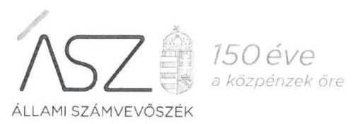

ELNÖK

Ikt. szám: EL-1677-036/2020

Baumann Csilla úrhölgy
ügyvezető
Nemzeti Konténerterminál Hálózat
Fejlesztő és Üzemeltető Korlátolt Felelősségű Társaság

# Budapest 

Tisztelt Ügyvezető Úrhölgy!
„A többségi állami és önkormányzati tulajdonú gazdasági társaságok integritásának ellenőrzése" címmel készített számvevőszéki jelentéstervezetre a 2020. február 20-án kelt észrevételét megkaptam.

Az Állami Számvevőszék észrevételekre vonatkozó álláspontjáról a felügyeleti vezető által készített részletes tájékoztatást csatoltan megküldöm.

Tájékoztatom Ügyvezető úrhölgyet, hogy a számvevőszéki jelentésben - az Állami Számvevőszékről szóló 2011. évi LXVI. törvény 29. § (3) bekezdése alapján - a figyelembe nem vett észrevételeket szerepeltetjük az elutasítás indokának feltüntetésével.
Budapest, 2020. o) hónap 48 nap

Melléklet: Tájékoztatás az észrevételek kezeléséről
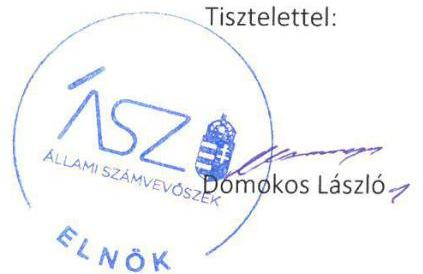

---

# Tájékoztatás az észrevételek kezeléséről 

„A többségi állami és önkormányzati tulajdonú gazdasági társaságok integritásának ellenőrzése" című jelentéstervezetre (továbbiakban: jelentéstervezet) a 2020. február 20-án kelt levelében megküldött észrevételeit áttekintettem. Az észrevételek kezeléséről az alábbi tájékoztatást adom.

Ügyvezető úrhölgy észrevételében jelezte, hogy a Nemzeti Konténerterminál Hálózat Fejlesztő és Üzemeltető Kft. (továbbiakban: Társaság) rendelkezik 2018. június 1-jétől hatályos Belső Adatvédelmi Szabályzattal. Ügyvezető úrhölgy tájékoztatott, hogy a szabályzat feltöltését az adatszolgáltatás során több alkalommal megkísérelték, azonban technikai probléma miatt a feltöltés sikertelen volt.

Az észrevételhez kapcsolódó értékelés:
A Társaság az adatszolgáltatás során a 2018. június 1-jétől hatályos Belső Adatvédelmi Szabályzat című dokumentumot sikeresen feltöltötte az adatszolgáltatási felületre. Tekintettel arra, hogy a dokumentum a kiadmányozásra jogosult aláírását nem tartalmazta, az ellenőrzés megállapította, hogy a Társaság 2018. január 1 - 2018. július 25. között az Info. tv. 24. § (3) bekezdésében, valamint 2018. július 26. - 2018. december 31. között a 25/A. § (3) bekezdésében előírtak ellenére nem rendelkezett adatvédelmi szabályzattal.
Az előbbiekre tekintettel az észrevételt nem fogadjuk el, a jelentéstervezet jelen pontban érintett részének módosítása nem indokolt.

Budapest, 2020. ๑๑ hónap 18 nap

Dr. Pulay Gyula
felügyeleti vezető

---

Domokos László
elnök

Állami Számvevőszék
1364 Budapest 4. Pf. 54

Tisztelt Elnök Úr!

Köszönettel megkaptuk a 2020. február 18-án küldött, EL-1677-022/2020 iktatószámú „A többségi állami és önkormányzati tulajdonú gazdasági társaságok integritásának ellenőrzése" című számvevőszéki jelentésterveztüket, melyre az alábbi észrevételt tesszük.

Az ÁSZ a Jelentéstervezetben megállapításként tette, hogy „A Gönc és Térsége Egészségéért Nkft. nem rendelkezett a Számv. tv. 161. § (1) bekezdésében előírt számlarenddel.

A Számv. tv. előírásainak megfelelő szabályzatok hiányában az integritási kontroll kiépítettsége és müködése nem volt megfelelő, ezáltal nem volt biztosított az átlátható és elszámoltatható müködés."

Tájékoztatom T. Elnök Urat, hogy Gönc és Térsége Egészségéért Nkft. (továbbiakban: Társaság) rendelkezik a fent említett számlarenddel, azonban ez sajnálatos módon nem került az ÁSZ adatszolgáltatási felületére feltöltésre. Ugyanakkor megjegyezzük, hogy a Társaság számviteli politikája (amely szabályzat határidőben feltöltésre került az ÁSZ adatszolgáltatási felületére) tartalmazza a számlarend alapvető kereteit és irányait, ezért a belső kontroll kiépítettsége és működtetése biztosított.

Társaságunk fokozott figyelmet fordít a Számv. tv. előírásainak megfelelésére, valamint az átlátható és elszámoltatható működés fenntartására.

Fentiekre hivatkozva kérem, a Jelentéstervezet módosítását végrehajtani szíveskedjenek.
Szíves együttműködését köszönöm.

Budapest, 2020. február 26.
Tisztelettel:

Gönc és Térsége Egészségéért
Közhasznú Nonprofit Kft.
Cégjegyzékszám: Cg. 05-09-016252
Adószám: 14459050-2-05
dr. Bándi Imre
ügyvezető
Gönc és Térsége Egészségéért Nkft.

---

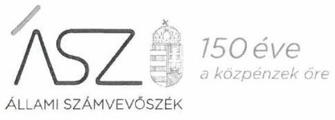

Ikt. szám: EL-1689-021/2020.
dr. Bándi Imre úr
ügyvezető
Gönc és Térsége Egészségéért Közhasznú Nonprofit Kft.

# Miskolc 

Tisztelt Ügyvezető Úr!
"A többségi állami és önkormányzati tulajdonú gazdasági társaságok integritásának ellenőrzése" címmel készített számvevőszéki jelentéstervezetre a 2020. február 26-án kelt észrevételét megkaptam.

Az Állami Számvevőszék észrevételekre vonatkozó álláspontjáról a felügyeleti vezető által készített részletes tájékoztatást csatoltan megküldöm.

Tájékoztatom Ügyvezető urat, hogy a számvevőszéki jelentésben - az Állami Számvevőszékről szóló 2011. évi LXVI. törvény 29. § (3) bekezdése alapján - a figyelembe nem vett észrevételeket szerepeltetjük az elutasítás indokának feltüntetésével.
Budapest, 2020. 0 j hónap 25 nap

Melléklet: Tájékoztatás az észrevételek kezeléséről
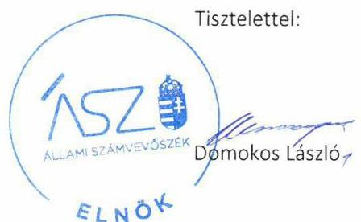

---

# Tájékoztatás az észrevételek kezeléséről 

„A többségi állami és önkormányzati tulajdonú gazdasági társaságok integritásának ellenőrzése" című jelentéstervezetre (továbbiakban: jelentéstervezet) a 2020. február 26-án kelt levelében megküldött észrevételét áttekintettem. Az észrevétel kezeléséről az alábbi tájékoztatást adom.

Ügyvezető úr észrevételében jelezte, hogy a Gönc és Térsége Egészségéért Közhasznú Nonprofit Kft. (továbbiakban: Társaság) rendelkezik számlarenddel, azonban azt sajnálatos módon nem töltötték fel az adatszolgáltatás során az Állami Számvevőszék (ÁSZ) részére. A feltöltött számviteli politika tartalmazza a számlarend alapvető kereteit és irányait, így a belső kontroll kiépítettsége és működtetése biztosított. A Társaság fokozott figyelmet fordít a számviteli törvény előírásainak való megfelelésre, az átlátható és elszámoltatható működés fenntartására.
Az észrevételhez kapcsolódó értékelés:
Ügyvezető úr észrevételében elismerte, hogy a Társaság a számlarendet nem bocsátotta az ellenőrzés rendelkezésére. A Társaság az adatszolgáltatás során a jelzett számviteli politikát feltöltötte az adatszolgáltatási felületre. Ügyvezető úr észrevételében hivatkozott, a számviteli politika számlarendre vonatkozó tartalma részben a számvitelről szóló 2000. évi C. törvény 161. §ában előírt követelményeket ismétlik meg. A számviteli politika jelzett része nem tekinthető számlarendnek, nem teljesíti a jogszabályi előírásban foglalt tartalmi követelményeket.
Az előbbiekre tekintettel az észrevételt nem fogadjuk el, a jelentéstervezet jelen pontban érintett részének módosítása nem indokolt.

Budapest, 2020. 03 hónap 25 nap

Dr. Pulay Gyula
felügyeleti vezető

---

# NEG 

NEG Nemzeti Energiagazdalkodási Zrt. Székhely: 1126 Budapest, Tartsay Vilmos u. 10. Központi telefonszám: +36 209964444 Email: info@negzrt.hu Web: www.negzrt.hu

## Állami Számvevőszék

Budapest
Apáczai Csere János utca 10.
1052
Tárgy: Észrevétel „A többségi állami és önkormányzati tulajdonú gazdasági társaságok integritásának ellenőrzése" címú számvevőszéki jelentéstervezetre

Tisztelt Állami Számvevőszék!
Alulírott Donázy István, mint a NEG Zrt. (1126 Budapest, Tartsay Vilmos utca 10.) vezérigazgatója az EL-1677-022/2020. iktatószámú levélben megküldött jelentéstervezetre az alábbi észrevételt teszem:

A jelentéstervezet 1.1. számú megállapítása, miszerint a Társaság nem rendelkezett 2018. január 15. napjáig a Számv. tv. 14. § (3) bekezdésében előírt számviteli politikával, és a 14. § (5) bekezdés b) pontjában előírt eszközök és források értékelési szabályzatával, valamint 2018. november 02. napjáig a 14. § (5) bekezdés d) pontja szerint előírt pénzkezelési szabályzattal pontatlan, mert a Társaság, mint pénzintézet által alapított cég, a kezdetektől rendelkezett mind számviteli politikával, azon belül eszközök és források értékelési szabályzatával, valamint pénzkezelési szabályzattal is, azonban a feltöltése azért nem történt meg a rendszerbe, mert a Társaság csak az aktuális szabályzatokat töltötte fel. Mellékletként csatolom a korábbi számviteli politikát, valamint a pénzkezelési szabályzatot is.

A fentiekre tekintettel kérjük az 1.1. számú megállapítás törlését.
Szíves együttmúködésüket ezúton is küszönjük.

Budapest, 2020. március 02.

---

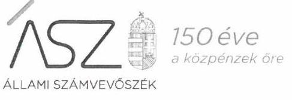

Ikt. szám: EL-1677-039/2020

Donázy István úr
vezérigazgató
NEG Nemzeti Energiagazdálkodási Zrt.
Budapest

Tisztelt Vezérigazgató Úr!
„A többségi állami és önkormányzati tulajdonú gazdasági társaságok integritásának ellenőrzése" címmel készített számvevőszéki jelentéstervezetre a 2020. március 2-án kelt levélben megküldött észrevételét megkaptam.

Az Állami Számvevőszék észrevételekre vonatkozó álláspontjáról a felügyeleti vezető által készített részletes tájékoztatást csatoltan megküldöm.

Tájékoztatom Vezérigazgató urat, hogy a számvevőszéki jelentésben - az Állami Számvevőszékről szóló 2011. évi LXVI. törvény 29. § (3) bekezdése alapján - a figyelembe nem vett észrevételeket szerepeltetjük az elutasítás indokának feltüntetésével.
Budapest, 2020. OY hónap 21 nap

Melléklet: Tájékoztatás az észrevételek kezeléséről
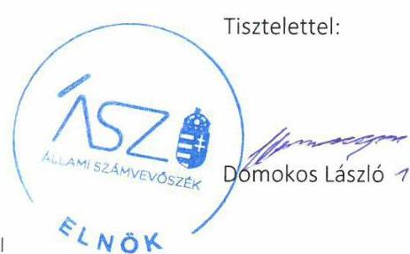

---

# Tájékoztatás az észrevételek kezeléséről 

„A többségi állami és önkormányzati tulajdonú gazdasági társaságok integritásának ellenőrzése" című jelentéstervezetre (továbbiakban: jelentéstervezet) a 2020. március 2-án kelt levelében megküldött észrevételeit áttekintettem. Az észrevételek kezeléséről az alábbi tájékoztatást adom.
Vezérigazgató úr a jelentéstervezet 1.1. számú megállapítás 1. bekezdésére tett észrevételében jelezte, hogy a NEG Nemzeti Energiagazdálkodási Zrt. (továbbiakban: társaság) rendelkezett számviteli politikával, az annak keretében elkészítendő eszközök és források értékelési szabályzatával, valamint pénzkezelési szabályzattal. A szabályzatok feltöltése az Állami Számvevőszék (továbbiakban: ÁSZ) Elektronikus Adatszolgáltatási Rendszerébe azonban azért nem történt meg, mert a társaság csak az aktuális (hatályos) szabályzatokat töltötte fel.
A számvitelről szóló 2000. évi C. törvény 14. § (12) bekezdése értelmében a számviteli politika elkészítéséért, módosításáért a gazdálkodó képviseletére jogosult személy felelős. Az észrevételben is hivatkozott, az adatszolgáltatás során az ÁSZ rendelkezésére bocsátott számviteli politika és az abban megtalálható eszközök és források értékelési szabályzata 2018. január 15-étől, a pénzkezelési szabályzat 2018. november 2-ától hatályos. Az ellenőrzési dokumentumok között megtalálható szabályzatok tehát a 2018. január 1-től 2018. december 31-ig terjedő ellenőrzött időszakot nem fedik le. Észrevételében Vezérigazgató úr elismerte, hogy az adatszolgáltatás során csak az aktuális (hatályos) szabályzatok kerültek feltöltésre az ÁSZ Elektronikus Adatszolgáltatási Rendszerébe. Ez nem felelt meg az Állami Számvevőszék adatbekérő levelében foglaltaknak, amely a teljes 2018. évre vonatkozóan kérte a számviteli politika és több szabályzat, köztük a pénzkezelési szabályzat megküldését.
Az előzőekre tekintettel az észrevételben foglaltak megerősítik az ellenőrzés megállapításait, ezért a jelentéstervezet módosítása nem indokolt.
Az ÁSZ az ellenőrzési megállapításait az ellenőrzött időszakban hatályos jogszabályok és az ellenőrzött szervezet közreműködési kötelezettsége keretében, az ellenőrzött szervezet által rendelkezésre bocsátott, Teljességi és hitelességi nyilatkozattal alátámasztott dokumentumokra alapozva fogalmazta meg. Vezérigazgató úr által aláírt Teljességi és hitelességi nyilatkozatban foglaltak szerint az átadott dokumentumok, adatok megbízhatóak, az ÁSZ által bekért adatokra, dokumentumokra vonatkozóan teljes körű információt tartalmaznak. Vezérigazgató úr az átadott dokumentumok, adatok hitelességéért, valódiságáért, hiánytalanságáért teljes felelősséget vállalt. Így a 15 napos észrevételezés keretében megküldött adatok az észrevételre adott válasznál nem kerültek figyelembevételre.
Budapest, 2020. Ok hónap Ol nap

Dr. Pulay Gyula
felügyeleti vezető

---

# DUNA PASSAGE KFT. 

1027. BUDAPEST, BEM JÓZSEF UTCA 9.

## Állami Számvevőszék

1052 Budapest, Apáczai Cs. J. u. 10.

Dr. Pulay Gyula Zoltán úr
felügyeleti vezető

Tárgy: Tájékoztatás az EL-1677-022/2020. iktatószámú jelentéstervezetben tett megállapításra

Tisztelt Dr. Pulay Gyula Zoltán úr!
Köszönettel megkaptuk a tárgyban jelzett iktatószámú jelentéstervezetet, melyre az alábbi észrevételt kívánjuk tenni.

A jelentéstervezetben tett megállapítás szerint a DUNA PASSAGE Ingatlanfejlesztő, Kereskedelmi és Szolgáltató Korlátolt Felelősségü Társaság „v.a" nem rendelkezett a Számv. tv. 14. § (3) bekezdésében előírt számviteli politikával, lgy a Számv. tv. előírásainak megfelelő szabályzatok hiányában az integritási kontrollok kiépítettsége és müködése nem volt megfelelő, ezáltal nem volt biztosított az átlátható és elszámoltatható müködés.

Ezúton tájékoztatjuk Önöket, hogy a Társaságnál rendelkezésre áll Számviteli politika, mely dokumentum egy adminisztrációs hiba folytán nem került feltöltésre, de jelen levélhez csatoljuk.

Budapest, 2020. március 2.

Tisztelettel:
dr. Kővári-Gráner Csilla
ügyvezető
DUNA PASSAGE Ingatlanfejlesztő, Kereskedelmi és Szolgáltató Kft. „v.a"

---

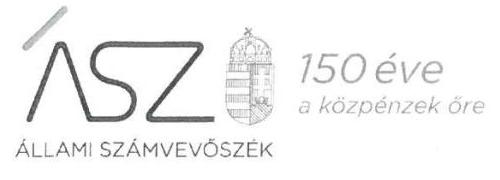

Ikt. szám: EL-1677-041/2020

Dr. Kővári-Gráner Csilla úrhölgy
ügyvezető
DUNA PASSAGE Ingatlanfejlesztő, Kereskedelmi és Szolgáltató
Korlátolt Felelősségű Társaság „v.a"

# Budapest 

Tisztelt Ügyvezető Úrhölgy!
„A többségi állami és önkormányzati tulajdonú gazdasági társaságok integritásának ellenőrzése" címmel készített számvevőszéki jelentéstervezetre a 2020. március 2-án kelt észrevételét megkaptam.

Az Állami Számvevőszék észrevételekre vonatkozó álláspontjáról a felügyeleti vezető által készített részletes tájékoztatást csatoltan megküldöm.

Tájékoztatom Ügyvezető úrhölgyet, hogy a számvevőszéki jelentésben - az Állami Számvevőszékről szóló 2011. évi LXVI. törvény 29. § (3) bekezdése alapján - a figyelembe nem vett észrevételeket szerepeltetjük az elutasítás indokának feltüntetésével.
Budapest, 2020. 03 hónap 20 nap
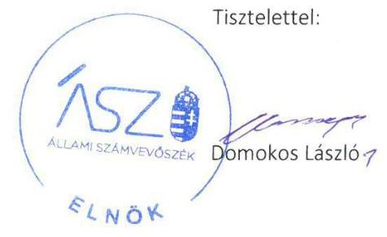

Melléklet: Tájékoztatás az észrevételek kezeléséről

---

# Tájékoztatás az észrevételek kezeléséről 

„A többségi állami és önkormányzati tulajdonú gazdasági társaságok integritásának ellenőrzése" című jelentéstervezetre (továbbiakban: jelentéstervezet) a 2020. március 2-án kelt levelében megküldött észrevételeit áttekintettem. Az észrevételek kezeléséről az alábbi tájékoztatást adom.

Ügyvezető úrhölgy észrevételében jelezte, hogy a DUNA PASSAGE Ingatlanfejlesztő, Kereskedelmi és Szolgáltató Korlátolt Felelősségű Társaság „v.a" (továbbiakban: Társaság) rendelkezik Számviteli politikával, a szabályzat azonban az adatszolgáltatás során adminisztrációs probléma miatt nem került feltöltésre.
Az ÁSZ az ellenőrzési megállapításait az adatszolgáltatás során a részére törvényi határidőben rendelkezésre bocsátott dokumentumokra alapozva fogalmazza meg. A teljességi és hitelességi nyilatkozatuk szerint az ÁSZ részére átadott dokumentumok, adatok megbízhatóak, és a bekért adatokra, dokumentumokra vonatkozóan teljes körű információt tartalmaznak. A teljességi és hitelességi nyilatkozat alapján a Társaság az adatszolgáltatás során Számviteli politikát nem bocsátott az ellenőrzés rendelkezésére. Ennek tényét az észrevételben foglaltak is megerősítik. Az észrevételéhez mellékletként csatolt dokumentumot az ÁSZ nem értékeli.
A Számviteli politika hiányában a jelentéstervezet integritási kontrollok kiépítettségével és működésével kapcsolatban megfogalmazott megállapítása helytálló.
Az előbbiekre tekintettel az észrevételt nem fogadjuk el, a jelentéstervezet módosítása nem indokolt.

Budapest, 2020. 03. hónap 20. nap

Dr. Pulay Gyula
felügyeleti vezető

---

# Állami Számvevőszék 

1052 Budapest, Apáczai Csere János utca 10.

Tárgy: válasz az EL-1677-022/2020 iktatószámú levélre, észrevétel az EL-1690-011/2020 iktatószámú jelentés tervezetre

## Tisztelt Cím!

Köszönettel vettük az EL-1690-011/2020 iktatószámú jelentés tervezet megküldését, köszönjük az ellenőrzés teljesítéséhez nyújtott segítségüket!

A levelükben foglalt felhívásra hivatkozva a jelentés tervezettel kapcsolatban az alábbi észrevételt szeretnénk tenni.

A jelentéstervezet 1.1 számú megállapítása szerint a HKGYK Nkft. nem rendelkezett a Számv.tv.14.§ (3) bekezdésében előírt számviteli politikával,14.§ (5) bekezdés a) és d) pontjaiban előírt eszközök és források leltárkészítési szabályzatával és pénzkezelési szabályzattal, valamit a 161.§ (1) bekezdésében előírt számlarenddel.

A HKGYK Nkft. az ellenőrzés során határidőben feltöltötte az Állami Számvevőszék Elektronikus Adatbekérési Rendszerébe az alábbi fájlokat:
„3_Eszkoz_forras_ertekelesi_szabalyzat_HKGYK_alairt.pdf"
„2_Leltár_és_selejtezési_szabályzat_HKGYK_alairt.pdf"
„4_Penzkezelesi_szabalyzat_HKGYK_alairt.pdf"
„1_Szamviteli politika_es_szamlarend_HKGYK.pdf"

A fájlok feltöltését követően generált „Teljességi és hitelességi nyilatkozat" tartalmazza az ellenőrzés során bekért és az Állami Számvevőszék Elektronikus Adatbekérési Rendszerébe feltöltött dokumentumokat tartalmazó fenti fájlok címét abban a táblázatban, amelyet az ABR automatikusan, a fájlok sikeres megküldését követően hoz létre.

Ezt a generált, az adatszolgáltatásról szóló Teljességi és hitelességi nyilatkozatot szintén feltöltöttük, valamint azt eredeti, lepecsételt, aláírt formában, tértivevényes levélben, postai úton megküldtük az Állami Számvevőszék részére

A fájlok feltöltésének / megküldésének sikerességéről „sikeres adatfeltöltés", valamint „Tájékoztatás adatszolgáltatás véglegesítéséről" visszaigazoló e-mail-eket kaptunk minden egyes feltöltött fájlra vonatkozóan, beleértve a Teljességi és hitelességi nyilatkozatot is (a „sikeres adatfeltöltés", illetve „Tájékoztatás adatszolgáltatás véglegesítéséről" című visszaigazoló e-mail-eket, valamint a postai úton megküldött Teljességi és hitelességi nyilatkozat másolatait jelen levelünkhöz csatoljuk).

---

A HKGYK Nkft. az ellenőrzés idején rendelkezett a fentiekben megjelölt dokumentumokkal, azokat az ellenőrzés során benyújtotta, ezért a leírtak alapján tisztelettel kérjük a jelentés tervezet szíves felülvizsgálatát, az ellenőrzés során megküldött dokumentumok elfogadását.

Bármilyen további információra lenne szükségük, illetve a továbbiakban is készséggel állunk rendelkezésükre!

Segítségüket elöre is nagyon köszönjük!
Budapest, 2020. február 28.
Tisztelettel és üdvözlettel:

HKGYK Nonprofit Kft.
1125 Budapest, Diós árok 3.
adószám: 14161964-1-43
dr. Szentpétery Olivér
ügyvezető igazgató
HKGYK Nonprofit Kft.
Mobil: +36 308343245

---

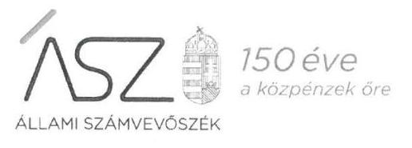

Ikt. szám: EL-1690-013/2020.

Dr. Szentpétery Olivér Tibor úr
ügyvezető
HKGYK Közép- és Kelet-Európai Hagyományos Kínai Gyógyászati, Oktató- és
Kutatóközpont Nonprofit Korlátolt Felelősségű Társaság

# Budapest 

Tisztelt Ügyvezető Úr!
„A többségi állami és önkormányzati tulajdonú gazdasági társaságok integritásának ellenőrzése" címmel készített számvevőszéki jelentéstervezetre a 2020. február 28-án kelt észrevételét megkaptam.

Az Állami Számvevőszék észrevételekre vonatkozó álláspontjáról a felügyeleti vezető által készített részletes tájékoztatást csatoltan megküldöm.

Tájékoztatom Ügyvezető urat, hogy a számvevőszéki jelentésben - az Állami Számvevőszékről szóló 2011. évi LXVI. törvény 29. § (3) bekezdése alapján - a figyelembe nem vett észrevételeket szerepeltetjük az elutasítás indokának feltüntetésével.

Budapest, 2020. 0 hónap 25 nap

Melléklet: Tájékoztatás az észrevételek kezeléséről
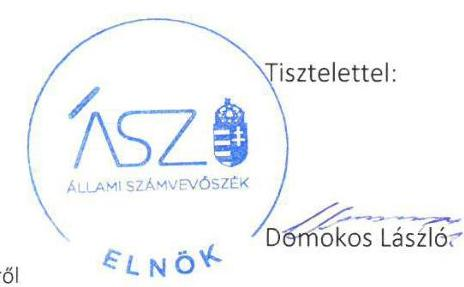

---

# Tájékoztatás az észrevételek kezeléséről 

„A többségi állami és önkormányzati tulajdonú gazdasági társaságok integritásának ellenőrzése" című jelentéstervezetre (továbbiakban: jelentéstervezet) a 2020. február 28-án kelt levelében megküldött észrevételeit áttekintettem. Az észrevételek kezeléséről az alábbi tájékoztatást adom.

Ügyvezető úr észrevételében jelezte, hogy a HKGYK Közép- és Kelet-Európai Hagyományos Kínai Gyógyászati, Oktató- és Kutatóközpont Nonprofit Korlátolt Felelősségű Társaság (továbbiakban: Társaság) rendelkezet számviteli politikával, eszközök és források leltárkészítési szabályzatával és pénzkezelési szabályzattal, valamint számlarenddel, amelyeket az ellenőrzés során határidőben feltöltöttek az Állami Számvevőszék (továbbiakban: ÁSZ) elektronikus adatbekérési rendszerébe.

A jelentéstervezet 1.1. számú megállapítása szerint a Társaság nem rendelkezett a számvitelről szóló 2000. C. torvény (továbbiakban: Számv. tv.) 14. § (3) bekezdésében előírt számviteli politikával, 14. § (5) bekezdés a) és d) pontjaiban előírt eszközök és források leltárkészítési szabályzatával és pénzkezelési szabályzattal, valamint a 161. § (1) bekezdésében előírt számlarenddel. A jelentéstervezet megállapításához Ügyvezető úr részére négy javaslat került megfogalmazásra a rögzített szabálytalanságok megszüntetése céljából.
Az ÁSZ EL-1690-001/2019. iktatószámú, 2019. augusztus 1-én kelt levelének 2. számú melléklete szerint bekérte 2018. évre vonatkozóan a Társaság számviteli politikáját, eszközök és források leltárkészítési szabályzatát, eszközök és források értékelési szabályzatát, a pénzkezelési szabályzatát és a számlarendjét. Ügyvezető úr 2019. augusztus 9-én kelt nyilatkozatának mellékletében szereplő dokumentumokat az észrevételében leírtak szerint feltöltötte az ÁSZ elektronikus adatbekérési rendszerébe.
Ügyvezető úr észrevételében hivatkozott és a jelentéstervezet megállapításával érintett szabályzatok vizsgálata során megállapítottam, hogy az adatbekérés során az ÁSZ rendelkezésére bocsátott leltározási és selejtezési szabályzat, valamint pénzkezelési szabályzat kiadmányozásának, illetve hatályba lépésének dátuma nem szerepel a dokumentumokon, továbbá a Társaság számviteli politikája és számlarendjén nem szerepel a kiadmányozó aláírása.
Az ÁSZ az ellenőrzési megállapításait az adatszolgáltatás során a részére törvényi határidőben rendelkezésre bocsátott dokumentumokra alapozva fogalmazza meg. Ügyvezető úr 2019. augusztus 9-én kelt nyilatkozata szerint az ÁSZ részére átadott dokumentumok, adatok megbízhatóak, és a bekért adatokra, dokumentumokra vonatkozóan teljes körű információt tartalmaznak.
A leltározási és selejtezési szabályzat, valamint pénzkezelési szabályzat kiadmányozási, illetve hatályba lépési dátuma feltüntetésének elmaradása miatt nem állapítható meg, hogy azok az ellenőrzött időszakra (2018-ra) vonatkoznak. Az ellenőrzött időszakra vonatkozó leltározási és selejtezési szabályzat, valamint pénzkezelési szabályzat hiányában, továbbá a számviteli politika és számlarend kiadmányozásának elmaradása miatt a jelentéstervezetnek a Társaság számviteli politikájának, eszközök és források leltárkészítési szabályzatának, pénzkezelési szabályzatának, valamint számlarendjének hiányára vonatkozó megállapítása helytálló.

---

Az előbbiekre tekintettel az észrevételt nem fogadjuk el, a jelentéstervezet jelen pontban érintett részének módosítása nem indokolt.

Budapest, 2020. 05. hónap 25. nap

Dr. Pulay Gyula
felügyeleti vezető

---

Állami Számvevőszék
1052 Budapest, Apáczai Csere János utca 10.
Domokos László Elnök úr részére

Tárgy: Észrevétel

Tisztelt Elnök Úr!
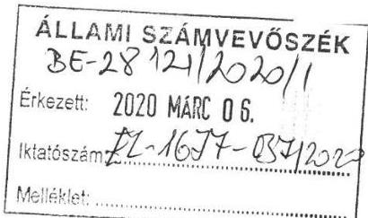

Az EL-1677-022/2020 iktatószámon, 2020. február 18 -án kelt levele mellékleteként megküldött „A többségi állami és önkormányzati tulajdonú gazdasági társaságok integritásának ellenőrzése" című számvevőszéki jelentéstervezet 14. oldalán a Comitatus Üzletviteli és Tanácsadó Kft. ügyvezetőjének tett javaslatokra az alábbi észrevételeket teszem:
„1. Kezdeményezze a tulajdonosi jogok gyakorlójánál a Taktv. 5. § (3) bekezdésében elöirt javadalmazási szabályzat megalkotását."

A Comitatus Üzletviteli és Tanácsadó Kft. Taktv. 5. § (3) bekezdésében előírt javadalmazási szabályzata elkészítésre került. Nevezett szabályzat a Cégbíróságon 2020. január 17-én letétbe helyezésre került. Fent leírtak alapján kérem, hogy jelen megállapítást a jelentéstervezetből törölni szíveskedjék.
„2. Intézkedjen a Bkr. 7. § (1) bekezdésben elöirt integrált kockázatkezelési rendszer müködtetéséröl."
Annak okán, hogy a Comitatus Üzletviteli és Tanácsadó Kft. bevételszerző tevékenységet nem folytat, a Társaság müködését támogatási szerződés alapján finanszírozza, kiadásait és ráfordításait ezen támogatásból fedezi, alkalmazottakkal nem rendelkezik így a Társaság tevékenységében és gazdálkodásában rejlő integritási kockázat nem merül fel. Továbbá a Comitatus Üzletviteli és Tanácsadó Kft. 2020. január 1-től nem tartozik a 370/2011. (XII.31.) Korm. rendelet, valamint a 339/2019. (XII.23.) Korm. rendelet hatálya alá sem. Fent leírtak miatt kérem, hogy a javaslatban megfogalmazott integrált kockázatkezelési rendszer müködtetésétől, annak irrelevanciája miatt eltekinteni szíveskedjék.

Budapest, 2020. február 28.
Tisztelettel:

Kastély László
Ügyvezető Igazgató
(HSSC Kft., mint vezető tisztségviselő képviseletében)

---

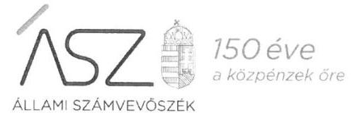

Ikt. szám: EL-1677-042/2020.

# Kastély László Úr 

HSSC Szolgáltató Központ Kft., mint a Comitatus Üzletviteli és Tanácsadó Kft. ügyvezetőjének képviseletére jogosult személy

## Budapest

Tisztelt Ügyvezető Képviseletére Jogosult Úr!
„A többségi állami és önkormányzati tulajdonú gazdasági társaságok integritásának ellenőrzése" című számvevőszéki jelentéstervezethez kapcsolódó, 2020. február 28-án kelt levelét köszönettel megkaptam.
Az Állami Számvevőszék észrevételekre vonatkozó álláspontjáról a felügyeleti vezető által készített részletes tájékoztatást csatoltan megküldöm.
Tájékoztatom, hogy a számvevőszéki jelentésben - az Állami Számvevőszékről szóló 2011. évi LXVI. törvény 29. § (3) bekezdése alapján - a figyelembe nem vett észrevételeket szerepeltetjük az elutasítás indokának feltüntetésével.

Budapest, 2020. 63 hónap 24 nap

Melléklet: Tájékoztatás az észrevételek kezeléséről
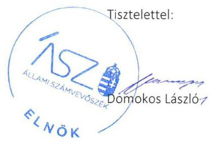

---

# Tájékoztatás az észrevételek kezeléséről 

„A többségi állami és önkormányzati tulajdonú gazdasági társaságok integritásának ellenőrzése" című jelentéstervezetre (továbbiakban: jelentéstervezet) a 2020. február 28-án kelt levelében megküldött észrevételeit áttekintettem. Az észrevételek kezeléséről az alábbi tájékoztatást adom.

1. Az 1.2. számú megállapítás 1. mondatára és a kapcsolódó 1. számú javaslatra vonatkozó észrevétel:

Az ügyvezető képviseletére jogosultként észrevételében jelezte, hogy a Comitatus Kft. a köztulajdonban álló gazdasági társaságok takarékosabb működéséről szóló 2009. évi CXXII. törvényben előírt javadalmazási szabályzatát elkészítették, azt a Cégbíróságon 2020. január 17-én letétbe helyezték. Fentiek alapján kérte a megállapítás törlését a jelentéstervezetből.
Köszönjük tájékoztatását a szabályzat elkészítéséről, azonban az észrevételében jelzett, az ellenőrzött időszak után elkészített szabályzat a jelentéstervezetben tett megállapítást nem befolyásolja. Az előbbiekre tekintettel az észrevételt nem fogadjuk el, a jelentéstervezet jelen pontban érintett részének módosítása nem indokolt.

## 2. Az 1.2. számú megállapítás 2. mondatára és a kapcsolódó 2. számú javaslatra vonatkozó észrevétel:

Az ügyvezető képviseletére jogosultként észrevételében jelezte, hogy a Comitatus Kft. bevételt szerző tevékenységet nem folytat, működését támogatási szerződés alapján finanszírozza, alkalmazottakkal nem rendelkezik, így tevékenységében és gazdálkodásában rejlő integritási kockázat nem merül fel. Továbbá a Comitatus Kft. 2020. január 1-jétől nem tartozik a költségvetési szervek belső kontrollrendszeréről és belső ellenőrzéséről szóló 370/2011. (XII. 31.) Korm. rendelet, valamint a köztulajdonban álló gazdasági társaságok belső kontrollrendszeréről szóló 339/2019. (XII. 23.) Korm. rendelet hatálya alá. Fentiek alapján kérte az integrált kockázatkezelési rendszer működtetésére tett javaslat törlését a jelentéstervezetből.

Az ügyvezető képviseletére jogosultként az ellenőrzés során rendelkezésre bocsátott, 2019. augusztus 27-én aláírt „Dokumentumok jegyzéke" alátámasztja a jelentéstervezet megállapításait. Az észrevételében jelzett, az ellenőrzött időszakon kívüli, 2020-ra vonatkozó tájékoztatása a jelentéstervezetben tett megállapítást nem befolyásolja. A végleges, kiadmányozott jelentésre készítendő intézkedési tervben indokolt majd a Comitatus Kft. adott jogállásához igazodóan a javaslatokra vonatkozó feladatokat meghatározni. Az előbbiekre tekintettel az észrevételt nem fogadjuk el, a jelentéstervezet jelen pontban érintett részének módosítása nem indokolt.
Budapest, 2020. 03 hónap 20. nap
Dr. Pulay Gyula
felügyeleti vezető

---

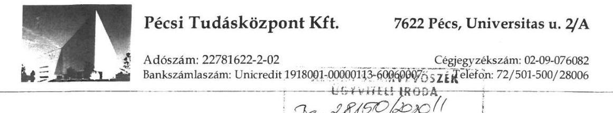

Állami Számvevőszék
Budapest Apáczai Csere János u. 10, 1052

Tárgy: „A többségi állami és önkormányzati tulajdonú gazdasági társaságok integritásának ellenőrzése" című számvevőszéki jelentéstervezetre történő észrevétel.

# Domokos László Elnök Úr részére 

## Tisztelt Elnök Úr!

A PÉCSI TUDÁSKÖZPONT Kft. (7622 Pécs, Universitas u. 2/A) részére 2020. február 18-i keltezéssel, EL-1677-022/2020. iktatószámú jelentéstervezetükre az alábbi észrevételt teszem:

A jelentéstervezet 13. oldalán az a megállapítás szerepel, hogy a PÉCSI TUDÁSKÖZPONT Kft. nem rendelkezett javadalmazási szabályzattal, közbeszerzési szabályzattal és adatvédelmi szabályzattal.

Az adatbekérésekre adandó válaszok megadása minden esetben az ügyvezető feladata és hatásköre, a fenti szabályzatok bekérésére vonatkozó levél átvételekor a Társaság ügyvezetője azonban szabadságon volt. A határidő utolsó napján a kért iratanyag összeállítása megtörtént, azonban informatikai problémák miatt a dokumentumok feltöltése az Elektronikus Adatszolgáltatási Rendszerbe elmaradt. A határidő lejártát követő napon a reggeli órákban ismételten megkíséreltük feltölteni a dokumentumokat, azonban figyelemmel arra, hogy a határidő már lejárt, a feltöltési lehetőség már nem állt nyitva a Társaság előtt.

A határidő mulasztást követően írásban kértük, hogy szíveskedjenek lehetőséget biztosítani arra, hogy az összeállított dokumentumokat az Elektronikus Adatszolgáltatási Rendszerbe póthatáridőn belül feltölthessük, erre azonban lehetőséget nem kaptunk.

Tájékoztatom Tisztelt Elnök Urat, hogy a PÉCSI TUDÁSKÖZPONT Kft. a vizsgált időszakra vonatkozóan mindhárom - a jelentéstervezetben hiányként megjelölt - szabályzattal rendelkezett, azok másolatát jelen levelemhez mellékelem.
A közbeszerzési szabályzatra vonatkozóan tájékoztatom Tisztelt Elnök Urat, hogy a Kft. közbeszerzést kizárólag két szolgáltatás (ör- és portaszolgálat, valamint a takarítás) igénybevételére ír ki esetenként, mindkét szolgáltatás esetében nyílt közbeszerzési eljárás lebonyolításával; ezekben az esetekben eseti közbeszerzési szabályzatok kerülnek elfogadásra.

Pécs, 2020. március 02.
Tisztelettel:
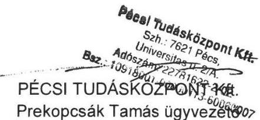

---

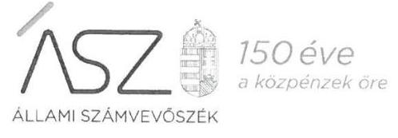

ELNÖK

Ikt. szám: EL-1677-043/2020

Prekopcsák Tamás úr
ügyvezető
Pécsi Tudásközpont Kft.

# Pécs 

Tisztelt Ügyvezető Úr!
"A többségi állami és önkormányzati tulajdonú gazdasági társaságok integritásának ellenőrzése" címmel készített számvevőszéki jelentéstervezetre a 2020. március 2-án kelt észrevételét megkaptam.

Az Állami Számvevőszék észrevételekre vonatkozó álláspontjáról a felügyeleti vezető által készített részletes tájékoztatást csatoltan megküldöm.

Tájékoztatom Ügyvezető urat, hogy a számvevőszéki jelentésben - az Állami Számvevőszékről szóló 2011. évi LXVI. törvény 29. § (3) bekezdése alapján - a figyelembe nem vett észrevételeket szerepeltetjük az elutasítás indokának feltüntetésével.

Budapest, 2020. hónap nap
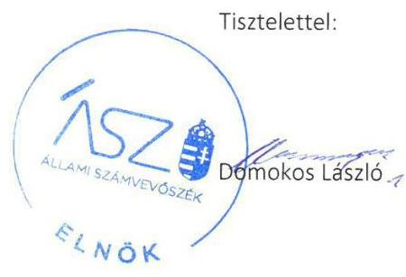

Melléklet: Tájékoztatás az észrevételek kezeléséről

---

Melléklet
az EL-1677-043/2020. ikt.sz. levélhez

# Tájékoztatás az észrevételek kezeléséről 

„A többségi állami és önkormányzati tulajdonú gazdasági társaságok integritásának ellenőrzése" című jelentéstervezetre (továbbiakban: jelentéstervezet) a 2020. március 2-án kelt levelében megküldött észrevételeit áttekintettem. Az észrevételek kezeléséről az alábbi tájékoztatást adom.

Ügyvezető úr észrevételében jelezte, hogy a Pécsi Tudásközpont Kft. rendelkezik javadalmazási, közbeszerzési valamint adatvédelmi szabályzatokkal, azok másolatait az észrevételhez mellékelten megküldte. Az adatbekérés alapján az iratanyagot összeállították, a hivatkozott szabályzatokat az adatbekérésre rendelkezésre álló idő alatt a Társaság ügyvezetőjének szabadsága miatt nem tudták feltölteni, póthatáridőt a feltöltésre kérésük ellenére nem kaptak.

Az ÁSZ az ellenőrzési megállapításait az adatszolgáltatás során a részére törvényi határidőben rendelkezésre bocsátott dokumentumokra alapozva fogalmazza meg. A teljességi és hitelességi nyilatkozatuk szerint az ÁSZ részére átadott dokumentumok, adatok megbízhatóak, és a bekért adatokra, dokumentumokra vonatkozóan teljes körű információt tartalmaznak. A teljességi és hitelességi nyilatkozat alapján a Társaság az adatszolgáltatás során a javadalmazási, a közbeszerzési, valamint az adatvédelmi szabályzatát nem bocsátotta az ellenőrzés rendelkezésére. Ennek tényét az észrevételben foglaltak is megerősítik. Ügyvezető úr észrevételéhez mellékletként csatolt dokumentumot az ÁSZ nem értékeli.

A szabályzatok hiányában a jelentéstervezet integritási kontrollok kiépítettségével és működésével kapcsolatban megfogalmazott megállapítása helytálló.

Az előbbiekre tekintettel az észrevételt nem fogadjuk el, a jelentéstervezet jelen pontban érintett részének módosítása nem indokolt.

Budapest, 2020. 03 hónap 25 nap

Dr. Pulay Gyula
felügyeleti vezető

---

# EXPO Park Kft. 

1101 Budapest, Albertirsai út 10 .

Adószám: 13424309-2-42
Telefon: 06/1-263-6062
E-mail: info@expopark.hu

Iktatószám: 43 -3 /2020
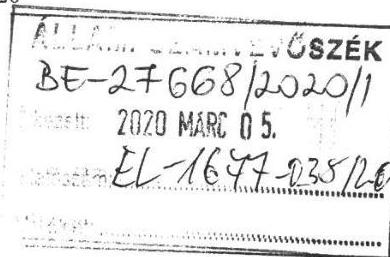

Domokos László
Elnök Úr részére
Állami Számvevőszék
Budapest
Apáczai Csere János u. 10.
1052
Tárgy: A többségi állami és önkormányzati tulajdonú gazdasági társaságok integritásának ellenőrzése tárgyú jelentéstervezet véleményezése

## Tisztelt Elnök Úr!

2020. február 18. napján kelt EL-1677-022/2020 iktatószámú levele mellékleteként megküldte az Expo Park Kft. részére „A többségi állami és önkormányzati tulajdonú gazdasági társaságok integritásának ellenörzése" tárgyú jelentéstervezetet véleményezésre.

A jelentés tervezetben megállapításra került, hogy a vizsgált időszakban az Expo Park Kft. nem rendelkezett a számvitelről szóló 2000. évi C. törvény (továbbiakban: Számviteli törvény) 14. § (5) bek. szerinti pénzkezelési szabályzattal, ezért az Expo Park Kft. alapvető müködése nem szabályozott, így az integritási kontroll kiépítettsége és müködése társaságunk esetében nem ellenőrizhető, ezáltal nem biztosított az Expo Park Kft. átlátható és elszámoltatható müködése.

A tárgyi jelentés tervezet kapcsán az alábbi észrevételt teszem.
Az ellenőrzés során az Expo Park Kft. a mellékeltek szerinti teljességi nyilatkozatot, és szabályzatokat küldte meg az ÁSZ részére. A megküldött dokumentumokból látható, hogy társaságunk (Fonciere Polygone Kft., mint névváltoztatás elötti elnevezése az Expo Park Kft.-nek) 2005. február 22. napja óta rendelkezik a jogszabályi előírások szerinti, és annak megfelelő pénzkezelési szabályzattal. A társaság pénzkezelési szabályzata egyebekben a vizsgálati időszakban, 2018. október 29. napján került aktualizálásra, módosításra.

Fentiek alapján látható, hogy társaságunk 2005. február 22. napja óta folyamatosan rendelkezik pénzkezelési szabályzattal, így a Számviteli törvény 14. § (5) bek.-ben foglalt kötelezettségének az Expo Park Kft. eleget tett, a jogszabályi előírásoknak a vizsgált időszakban megfelelt.

Fentiek alapján kérem, hogy a jelentéstervezetből a tárgyi megállapítást törölni szíveskedjenek.
További kérdés esetén készséggel állunk rendelkezésre.
Budapest, 2020. február 24.
Tisztelettel:

EXPO PARK Kft.
1101 Bp , Albertirsai út 10.
Adószám: 13424309-2-42
EXPO PARK Kft.
képviseletében:
Denhoffer Balázs
ügyvezető

Mellékletek:

1. Teljességi nyilatkozat
2. Pénzkezelési szabályzat (kelt 2005. február 22.)
3. Pénzkezelési szabályzat (kelt 2018. október 29.)
4. Expo Park Kft. cégmásolata

---

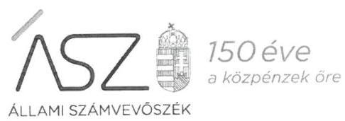

Ikt. szám: EL-1677-044/2020

Denhoffer Balázs úr
ügyvezető
EXPO Park Kft.

# Budapest 

Tisztelt Ügyvezető Úr!
„A többségi állami és önkormányzati tulajdonú gazdasági társaságok integritásának ellenőrzése" címmel készített számvevőszéki jelentéstervezetre a 2020. február 24-én kelt észrevételét megkaptam.

Az Állami Számvevőszék észrevételekre vonatkozó álláspontjáról a felügyeleti vezető által készített részletes tájékoztatást csatoltan megküldöm.

Tájékoztatom Ügyvezető urat, hogy a számvevőszéki jelentésben - az Állami Számvevőszékről szóló 2011. évi LXVI. törvény 29. § (3) bekezdése alapján - a figyelembe nem vett észrevételeket szerepeltetjük az elutasítás indokának feltüntetésével.

Budapest, 2020. 07 hónap 02 nap
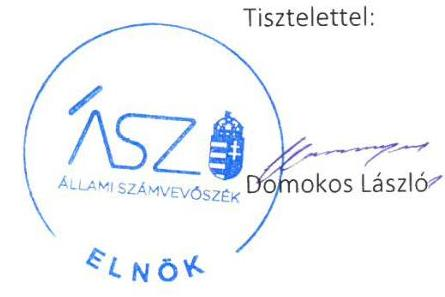

Melléklet: Tájékoztatás az észrevételek kezeléséről

---

# Tájékoztatás az észrevételek kezeléséről 

„A többségi állami és önkormányzati tulajdonú gazdasági társaságok integritásának ellenőrzése" című jelentéstervezetre (továbbiakban: jelentéstervezet) a 2020. február 24-én kelt levelében megküldött észrevételeit áttekintettem. Az észrevételek kezeléséről az alábbi tájékoztatást adom.

Ügyvezető úr észrevételében jelezte, hogy az EXPO Park Kft. (továbbiakban: Társaság) a mellékelt teljességi nyilatkozat szerint a pénzkezelési szabályzatot (a Társaság névváltozás előtti szabályzatát is) megküldte az ÁSZ részére. A Társaság 2005. február 22-e óta folyamatosan rendelkezik pénzkezelési szabályzattal, a számviteli törvényben foglalt előírásoknak a vizsgált időszakban megfelelt. Az észrevételhez mellékelte a hivatkozott szabályzatokat, valamint a névváltozást tartalmazó cégmásolatot, amelyek alapján kérte a jelentéstervezet megállapítását törölni.
Az ÁSZ az ellenőrzési megállapításait az adatszolgáltatás során a részére törvényi határidőben rendelkezésre bocsátott dokumentumokra alapozva fogalmazza meg. A teljességi és hitelességi nyilatkozatuk szerint az ÁSZ részére átadott dokumentumok, adatok megbízhatóak, és a bekért adatokra, dokumentumokra vonatkozóan teljes körű információt tartalmaznak. A teljességi és hitelességi nyilatkozat alapján a Társaság az adatszolgáltatás során a pénzkezelési szabályzatait átadta az ellenőrzés rendelkezésére. A beküldött dokumentumok felülvizsgálata során megállapítottuk, hogy a Társaság valóban rendelkezett az ellenőrzött időszakban hatályos pénzkezelési szabályzattal, de ezen pénzkezelési szabályzat a számvitelről szóló 2000. évi C. törvény 14. § (8) bekezdésben előírtak ellenére nem rendelkezett a készpénzállományt érintően a napi készpénz záró állomány maximális mértékéről.
A szabályzat tartalmi hiányossága miatt a jelentéstervezet integritási kontrollok kiépítettségével és múködésével kapcsolatban megfogalmazott megállapítása helytálló.
Az előbbiekre tekintettel az észrevételt részben fogadjuk el, és ennek megfelelően pontosítjuk a jelentéstervezet kapcsolódó megállapításának és javaslatának megfogalmazását.

Budapest, 2020. D. L. hónap (Y.). nap

Dr. Pulay Gyula
felügyeleti vezető

---

.

---

# RÖVIDÍTÉSEK JEGYZÉKE 

${ }^{1}$ Számv. tv.
${ }^{2}$ ÁSZ
${ }^{3}$ Taktv.
${ }^{4}$ IBSEN NKft.
${ }^{5}$ DUNA PASSAGE Kft.
${ }^{6}$ EXPO Park Kft
${ }^{7}$ NEG Zrt.
${ }^{8}$ Skanzenért Kft.
${ }^{9}$ Gönc és Térsége Egészségéért NKft.
${ }^{10}$ HKGYK NKft.
${ }^{11}$ Nemzeti Egészségmegörző NKft.
${ }^{12}$ TRANSHUMAN Kft.
${ }^{13}$ Agrármarketing Centrum NKft.
${ }^{14}$ Comitatus Kft.
${ }^{15}$ Kun Hulladék Kft.
${ }^{16}$ Nemzeti Konténerterminál Kft.
${ }^{17}$ Nemzeti MAL-A Zrt.
${ }^{18}$ NIPÜF Zrt
${ }^{19}$ PÉCSI TUDÁSKÖZPONT Kft.
${ }^{20}$ EH Ügyelet NKft.
${ }^{21}$ KlinKoord Kft.
${ }^{22}$ Herman Ottó Intézet NKft.
${ }^{23} \mathrm{Kbt}$.
${ }^{24}$ Info. tv.
${ }^{25}$ Bkr.
${ }^{26}$ Alaptörvény
${ }^{27}$ Nvt.
${ }^{28}$ ÁSZ
${ }^{29}$ ÁSZ tv.
${ }^{30}$ ÁSZ SZMSZ
${ }^{31} \mathrm{Mt}$.
${ }^{32}$ etikai kódex
2000. évi C. törvény a számvitelről

Állami Számvevőszék
2009. évi CXXII. törvény a köztulajdonban álló gazdasági társaságok takarékosabb müködéséről
Békés Megyei IBSEN Oktatási, Művészeti és Közművelődési Nonprofit Korlátolt Felelősségű Társaság
DUNA PASSAGE Ingatlanfejlesztő, Kereskedelmi és Szolgáltató Korlátolt Felelősségű Társaság
EXPO Park Ingatlanfejlesztő, Kereskedelmi és Szolgáltató Korlátolt Felelősségű Társaság
NEG Nemzeti Energia gazdálkodási Zártkörűen Müködő Részvénytársaság
Skanzenért Nonprofit Korlátolt Felelősségű Társaság
Gönc és Térsége Egészségéért Egészségügyi Szolgáltató Közhasznú Nonprofit Korlátolt Felelősségű Társaság
HKGYK Közép- és Kelet-Európai Hagyományos Kínai Gyógyászati, Oktató- és Kutatóközpont Nonprofit Korlátolt Felelősségű Társaság
Nemzeti Egészségmegőrző Központ Nonprofit Korlátolt Felelősségű Társaság
TRANSHUMAN Fuvarozó és Egészségügyi Szociális Szolgáltató Korlátolt Felelősségű Társaság
Agrármarketing Centrum Nonprofit Korlátolt Felelősségű Társaság
Comitatus Üzletviteli és Tanácsadó Korlátolt Felelősségű Társaság
Kun Hulladék Korlátolt Felelősségű Társaság
Nemzeti Konténerterminál Hálózat Fejlesztő és Üzemeltető Korlátolt Felelősségű Társaság
Nemzeti Mal-A Alumíniumtermelő Zártkörűen Müködő Részvénytársaság
NIPÜF Nemzeti Ipari Park Üzemeltető és Fejlesztő Zártkörűen Müködő Részvénytársaság
PÉCSI TUDÁSKÖZPONT Korlátolt Felelősségű Társaság
EH Ügyelet Egészségügyi Szolgáltató Nonprofit Korlátolt Felelősségű Társaság
KlinKoord Klinikai Kutatási Koordinációs Központ Korlátolt Felelősségű Társaság
Herman Ottó Intézet Nonprofit Korlátolt Felelősségű Társaság
2015. évi CXLIII. törvény - a közbeszerzésekről
2011. évi CXII. törvény az információs önrendelkezési jogról és az információszabadságról
370/2011. (XII. 31.) Korm. rendelet a költségvetési szervek belső kontrollrendszeréről és belső ellenőrzéséről
Magyarország Alaptörvénye (2011. április 25.)
2011. évi CXCVI. törvény a nemzeti vagyonról

Állami Számvevőszék
2011. évi LXVI. törvény az Állami Számvevőszékről

Az Állami Számvevőszék Szervezeti és Müködési Szabályzata
2012. évi I. törvény a munkatörvénykönyvéről

A Herman Ottó Intézet Nonprofit Korlátolt Felelősségű Társaság Etikai Kódexe

---

# ASZ 

ALLAMI SZAMVEVOSZEK
1052 Budapest, Apáczai Cs. J. u. 10. I 1364 Budapest 4. Pf. 54 TEL: +36 14849100
email: szamvevoszek@asz.hu
web: www.asz.hu | www.aszhirportal.hu