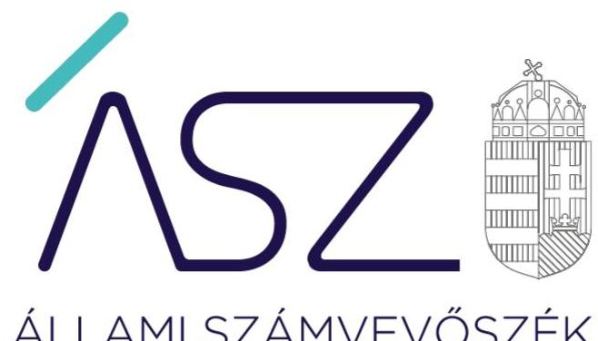
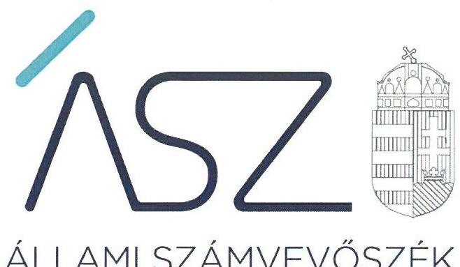
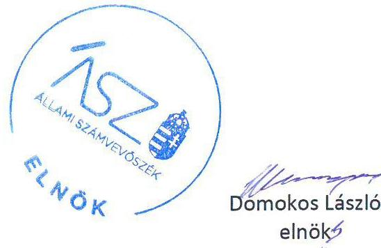
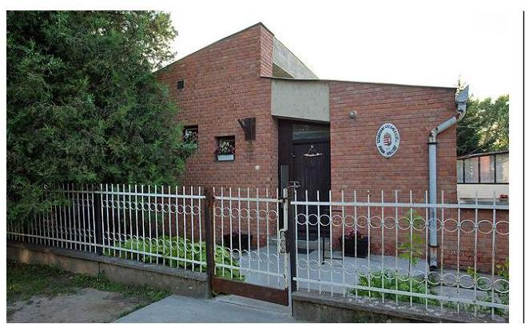

ÁLLAMI SZÁMVEVŐSZÉK

# JELENTÉS 

## Nem állami humánszolgáltatók ellenőrzése

A humánszolgáltatást nyújtó államháztartáson kívüli szociális intézmények, szolgáltatók fenntartói központi költségvetésből kapott támogatásai felhasználásának ellenőrzése Szivárvány Gyermekkert Szociális, Oktatási és Szolgáltató Nonprofit Kft.

2020
20058
www.asz.hu

---

ÁLLAMI SZÁMVEVŐSZÉK

# JELENTÉS 

## Nem állami humánszolgáltatók ellenőrzése

A humánszolgáltatást nyújtó államháztartáson kívüli szociális intézmények, szolgáltatók fenntartói központi költségvetésből kapott támogatásai felhasználásának ellenőrzése Szivárvány Gyermekkert Szociális, Oktatási és Szolgáltató Nonprofit Kft.

2020. 

20058
www.asz.hu

---

# AZ ELLENŐRZÉST FELÜGYELTE: 

KLINGA LÁSZLÓ felügyeleti vezető

## AZ ELLENŐRZÉST VEZETTE ÉS A VÉGREHAJTÁSÁÉRT FELELŐS:

DR. GÁL NÓRA ellenőrzésvezető

A PROGRAM ÖSSZEÁLLÍTÁSÁÉRT FELELŐS:
TÓTPÁL SZABOLCS osztályvezető

IKTATÓSZÁM: EL-2547-001/2020.
TÉMASZÁM: 2491
ELLENŐRZÉS-AZONOSÍTÓ SZÁM: V083599
Jelentéseink az Országgyúlés számítógépes hálózatán és az interneten a www.asz.hu címen is olvashatóak.

---

# TARTALOMJEGYZÉK 

■ ÖSSZEGZÉS ..... 5
■ AZ ELLENŐRZÉS CÉLJA ..... 6
■ AZ ELLENŐRZÉS TERÜLETE ..... 7
■ AZ ELLENŐRZÉS HÁTTERE, INDOKOLTSÁGA ..... 8
■ A JELENTÉS LÉNYEGES KÉRDÉSKÖRE ..... 9
■ AZ ELLENŐRZÉS HATÓKÖRE ÉS MÓDSZEREI ..... 10
■ MEGÁLLAPÍTÁSOK ..... 12
■ KÖVETKEZTETÉSEK ..... 13
■ MELLÉKLETEK ..... 15
I. sz. melléklet: Értelmező szótár ..... 15
■ FÜGGELÉKEK ..... 17
I. sz. függelék a jelentéshez ..... 17
II. sz. függelék: Észrevételek ..... 18
■ RÖVIDÍTÉSEK JEGYZÉKE ..... 21

---

.

---

# ÖSSZEGZÉS 

A Szivárvány Gyermekkert Szociális, Oktatási és Szolgáltató Nonprofit Korlátolt Felelősségű Társaság szociális feladatokat ellátó intézményei müködtetéséhez igénybe vett közpénzekkel való gazdálkodása nem volt elszámoltatható és átlátható.

## Az ellenőrzés társadalmi indokoltsága

Az Állami Számvevőszék stratégiájában célul tűzte ki, hogy az államháztartáson kívülre nyújtott költségvetési támogatások ellenőrzésével hozzájáruljon ahhoz, hogy a közpénzeket az államháztartáson kívüli szervezetek is átlátható módon használják fel a közfeladatok szerződésben vállalt ellátása érdekében. Fontos a közvélemény biztosítása arról, hogy a közpénz államháztartáson kívüli felhasználása ezen a területen sem marad ellenőrizetlenül. Az ellenőrzés eredményeképpen a nyilvánosság és a szolgáltatást igénybe vevők megfelelő tájékoztatást kaphatnak az államháztartáson kívüli közfeladatot ellátó múködéséről.

## Főbb megállapítások, következtetések

A Szivárvány Gyermekkert Szociális, Oktatási és Szolgáltató Nonprofit Korlátolt Felelősségű Társaság a jogszabályi előírások ellenére 2015-2017. években nem rendelkezett számviteli politikával és az annak keretében elkészítendő számviteli szabályzatotokkal, ezáltal nem alakította ki a szabályszerű múködés és gazdálkodás kereteit. A szabályozás hiánya miatt a számviteli elszámolások szabályszerűsége, illetve a közpénzekkel való rendeltetésszerű és felelős gazdálkodás nem volt biztosított.

A Szivárvány Gyermekkert Szociális, Oktatási és Szolgáltató Nonprofit Korlátolt Felelősségű Társaság a beszámolási kötelezettségének nem tett eleget.

---

# AZ ELLENŐRZÉS CÉLJA

**AZ ELLENŐRZÉS CÉLJA** annak értékelése, hogy a nem állami, nem önkormányzati szociális intézmények fenntartói központi költségvetésből kapott támogatásainak felhasználása szabályszerű volt-e, a támogatások igénylése, évközi módosítása és év végi elszámolása megfelel-e a jogszabályi előírásoknak.

---

# AZ ELLENŐRZÉS TERÜLETE 

## Szivárvány Gyermekkert Szociális, Oktatási és Szolgáltató Nonprofit Korlátolt Felelősségű Társaság

A Szivárvány Gyermekkert Szociális, Oktatási és Szolgáltató Nonprofit Korlátolt Felelősségű Társaságot magánszemély alapította, mely nonprofit jelleggel 2014. május 7. napja óta múködött.

A gyomaendrődi székhellyel múködő Fenntartó ${ }^{1}$ célja a bölcsődei és óvodai gyermek intézmények fenntartása és múködtetése volt, tevékenységi körébe tartozott az óvodai ellátáshoz, neveléshez és a szociális, gyermekjóléti szolgáltatásokhoz és ellátásokhoz kapcsolódóan a gyermekek napközbeni ellátása.

A Fenntartó céljai megvalósítása érdekében a Vásártéri Lakótelepi Bölcsőde és a Mezőtúr Városi Bölcsőde intézményeket tartotta fenn és múködtette.

A Fenntartónál a taggyűlés jogainak gyakorlása az alapítót illette, az ügyvezetés ellenőrzése a három tagú felügyelő bizottság feladata volt.

A Fenntartó a központi költségvetésből 2015. évben 89,4 millió Ft, 2016. évben 90,5 millió Ft és 2017. évben 101,9 millió Ft normatív központi költségvetési támogatásban részesült.

---

# AZ ELLENŐRZÉS HÁTTERE, INDOKOLTSÁGA 

A szociális feladatokat ellátó nem állami intézményfenntartók részére közfeladataik ellátására évente jelentős összegű pénzügyi támogatást biztosítottak a mindenkori költségvetési törvények² a bennük megfogalmazott feltételek mellett. A költségvetési törvények a szociális ágazat feladatai ellátására 273 Mrd Ft állami támogatás előirányzatot biztosítottak a 20152017. években. Módosították a szociális igazgatásról és szociális ellátásokról szóló 1993. évi III. törvényt, amely - többek között - 2012. január 1-jei hatállyal megfogalmazta a finanszírozási rendszerbe történő befogadással összefüggő szabályokat.

Az ÁSZ³ stratégiájában hangsúlyos szerepet szánt annak, hogy szilárd szakmai alapokon álló, értékteremtő ellenőrzéseivel előmozdítsa a közpénzügyek átláthatóságát, rendezettségét, és javaslataival a közpénzek és a közvagyon szabályos, gazdaságos, hatékony és eredményes felhasználását segítse. Az államháztartáson kívülre nyújtott költségvetési támogatások ellenőrzésével az ÁSZ hozzájárul ahhoz, hogy a közpénzeket a nem állami humán fenntartók átlátható módon használják fel a közfeladatok ellátására kötött szerződésekben vállalt kötelezettségének teljesítése érdekében. Az ellenőrzés javaslataival hozzájárulhat az említett rendszerek szabályszerű támogatás felhasználásához, javíthatja a társadalmi-gazdasági döntések megalapozottságát, amely a „jól irányított állam" múködéséhez járul hozzá.

Az ellenőrzés keretében egyedi kockázatelemzés alapján kiválasztott fenntartóknál és intézményeiknél értékeljük az államháztartáson kívüli szociális tevékenységhez kapcsolódó támogatások felhasználásának megfelelőségét.

---

# A JELENTÉS LÉNYEGES KÉRDÉSKÖRE 

- A Fenntartó szabályszerű müködési és gazdálkodási környezet kialakításával megteremtette-e a költségvetési támogatások átlátható, elszámoltatható igénybevételének, felhasználásának feltételeit?

---

# AZ ELLENŐRZÉS HATÓKÖRE ÉS MÓDSZEREI 

## Az ellenőrzés típusa

Megfelelőségi ellenőrzés.

## Az ellenőrzött időszak

A 2015. január 1-je és 2017. december 31-e közötti időszak.

## Az ellenőrzés tárgya

Az ellenőrzés a szociális humánszolgáltatási közfeladatokat ellátó államháztartáson kívüli fenntartók, humánszolgáltatási közfeladatai ellátásához a költségvetési törvényekben biztosított központi költségvetési támogatások igénylése, évközi módosítása és év végi elszámolása fenntartói feladatainak ellátása, illetve e központi költségvetésből kapott támogatásaik humánszolgáltatási közfeladatokra való fenntartó általi felhasználása szabályszerűségének értékelésére terjed ki.

## Az ellenőrzött szervezet

Szivárvány Gyermekkert Szociális, Oktatási és Szolgáltató Nonprofit Korlátolt Felelősségű Társaság

## Az ellenőrzés jogalapja

Az ellenőrzés jogszabályi alapját az ÁSZ tv. ${ }^{4} 1 . \S$ (3) bekezdése, 5. § (3) bekezdésében foglalt előírások adják.

## Az ellenőrzés módszerei

Az ellenőrzést az ellenőrzési program szempontjai, kérdései, az ellenőrzött időszakban hatályos jogszabályok alapján, a nemzetközi standardokat irányadónak tekintve, az ellenőrzés szakmai szabályok és módszertanok figyelembe vételével végezte az ÁSZ.

Az ellenőrzés ideje alatt az ellenőrzött szervezettel történő kapcsolattartást az ÁSZ SZMSZ5-ének vonatkozó előírásai alapján biztosította az ÁSZ.

Az ellenőrzési kérdések megválaszolásához szükséges bizonyítékok megszerzése az ellenőrzött által rendelkezésre bocsátott dokumentu-

---

mokra, adatokra alapozva történt. Az ellenőrzési bizonyítékként felhasználható adatforrások közé tartoztak egyrészt az ellenőrzési program részletes szempontjainál felsorolt adatforrások, másrészt minden - az ellenőrzés folyamán feltárt - az ellenőrzés szempontjából információt tartalmazó dokumentum.

Az ellenőrzés lefolytatásához az ellenőrzött szervezet az ÁSZ által kért dokumentumok elektronikus úton való megküldésével szolgáltatott adatokat, információkat.

Amennyiben a Fenntartó múködését és gazdálkodását alapvetően meghatározó dokumentum hiánya miatt, valamely lényeges kérdéskörre vonatkozóan az ÁSZ megállapítást tett, további ellenőrzési tevékenységek az adott kérdéskörre és az azzal szorosan logikai kapcsolatban lévő kérdéskörökre vonatkozóan - ráépülő jelleggel - nem kerültek végrehajtásra.

---

# MEGÁLLAPÍTÁSOK 

## A Fenntartó szabályszerű múködési és gazdálkodási környezet kialakításával megteremtette-e a költségvetési támogatások átlátható, elszámoltatható igénybevételének, felhasználásának feltételeit?

Összegző megállapítás

A költségvetési támogatások átlátható, elszámoltatható igénybevételének és felhasználásának feltételeit a Fenntartó nem teremtette meg, így a gazdálkodása nem volt szabályszerű.

A Fenntartó múködésének szabályozottsága, ennek keretében a Fenntartó gazdálkodására vonatkozó belső szabályozás nem felelt meg a jogszabályi előírásoknak, mivel a 2015-2017. években nem rendelkezett a Számv. tv. ${ }^{9} 14 . \S$ (3) bekezdésében előírt számviteli politikával, a Számv. tv. 14. § (5) bekezdés a)-b) és d) pontjaiban előírt eszközök és a források leltárkészítési és leltározási szabályzatával, az eszközök és a források értékelési szabályzatával, valamint pénzkezelési szabályzattal.

A Fenntartó a közfeladatot ellátó intézményei múködtetéséhez felhasznált közpénzekre vonatkozó gazdálkodásával a nyilvánosság előtt nem számolt el. A jogszabályokban előírt beszámolási kötelezettségének a Számv. tv 4. § (1) bekezdésében foglaltak ellenére nem tett eleget, ezzel nem biztosította a közpénzek törvényes felhasználásának ellenőrizhetőségét, és az Alaptörvényben előírt átláthatóság elvének érvényesülését.

---

# KÖVETKEZTETÉSEK 

Az ÁSZ tv. 32. § (1) bekezdésében foglaltak értelmében az ÁSZ jelentés tartalmazza a feltárt tényeket, az ezeken alapuló megállapításokat, következtetéseket, amelyeknek a 24. § (1) d) pontja szerint okszerünek és megalapozottnak kell lenniük.

A Szivárvány Gyermekkert Szociális, Oktatási és Szolgáltató Nonprofit Kft., mint szociális intézményfenntartó azzal, hogy nem rendelkezett számviteli politikával és annak keretében elkészítendő szabályzatokkal, a szabályszerű múködés és gazdálkodás keretrendszerét nem alakította ki. A jogszabályban előírt beszámolási kötelezettségnek nem tett eleget, így nem biztosította az Alaptörvényben előírt átláthatóság elvének érvényesítését.
Mindezek alapján a Szivárvány Gyermekkert Szociális, Oktatási és Szolgáltató Nonprofit Kft.-nél a költségvetési támogatások kezelése és felhasználása nem volt ellenőrizhető, így a gazdálkodás nem volt elszámoltatható.

---

.

---

# MELLÉKLETEK 

- I. SZ. MELLÉKLET: ÉRTELMEZŐ SZÓTÁR
költségvetési támogatás
közfeladat
szociális intézmény
nem állami, nem önkormányzati (államháztartáson kívüli) intézmény fenntartó
a társadalombiztosítás pénzügyi alapjai kivételével az államháztartás központi alrendszeréből ellenérték nélkül, pénzben nyújtott támogatások (Áht. 1. § 14. pont) A költségvetési törvényekben (2013. évi CCXXX. törvény 33-34. §, 2014. évi C. törvény 42-43. §, 2015. évi C. törvény 40-41. §) megállapított támogatás. Például a 2015. évi C. törvény 40-41. § szerint többek között: Az Országgyúlés a szociális, gyermekjóléti, gyermekvédelmi közfeladatot ellátó intézményt, szolgáltatást fenntartó egyházi jogi személy, civil szervezet, közalapítvány, országos nemzetiségi önkormányzat, települési vagy területi nemzetiségi önkormányzat, gazdasági társaság, és a humánszolgáltatást alaptevékenységként végző, az Szja tv. hatálya alá tartozó egyéni vállalkozó (a továbbiakban együtt: nem állami szociális fenntartó) részére támogatást állapít meg a következők szerint: a támogatás a nem állami szociális fenntartót a települési önkormányzatok 2. melléklet III. pont 3. alpont c)-k) pontjában és III. pont 5. alpont a) pontjában meghatározott támogatásaival azonos jogcímeken, összegben és feltételek mellett illeti meg.
„Közfeladat a jogszabályokban meghatározott állami vagy önkormányzati feladat. ...A közfeladatok ellátásában államháztartáson kívüli szervezet jogszabályban meghatározott rendben közremüködhet." A közfeladatot meghatározó jogszabályban meg kell határozni a közfeladat ellátásának módját és egyidejűleg rendezni kell annak az ellátásához szükséges fedezet biztosításáról. (Az államháztartásról szóló CXCV. törvény 3/A. § (1)-(3) bekezdés)
A szociális igazgatásról szóló 1993. évi III. törvényben meghatározott nappali, illetve bentlakásos ellátást vagy támogatott lakhatást nyújtó szervezet. (Szoc.tv. 4. § (1) bekezdés h) pont)

A szociális, gyermekjóléti és gyermekvédelmi közfeladatokat/humánszolgáltatásokat ellátó intézményt fenntartó egyházi jogi személy, társadalmi szervezet, alapítvány, közalapítvány, civil szervezet, országos nemzetiségi önkormányzat, nonprofit gazdasági társaság, gazdasági társaság és a humánszolgáltatást alaptevékenységként végző, Szja tv. hatálya alá tartozó egyéni vállalkozó. (2013. évi Kvtv. 35. § (1), (3) bekezdés, 2014. évi Kvtv. 33. §, 34. § (1), (4) bekezdés, 2015. évi Kvtv. 42. §, 43. § (1), (4) bekezdés, 2016. évi Kvtv. 40. §, 41. § (1), (4) bekezdés, 2017. évi Kvtv. 41. § (1), (4))

---

.

---

# FÜGGELÉKEK 

- I. SZ. FÜGGELÉK A JELENTÉSHEZ

Az Állami Számvevőszék az ellenőrzés során feltárt tényekhez kapcsolódó további körülmények tisztázására eszközrendszerrel nem rendelkezik. Amennyiben az ellenőrzésen túlmutatóan indokoltnak látszik az ellenőrzés során feltárt körülmények további vizsgálata, az Állami Számvevőszék törvényi felhatalmazás alapján az ellenőrzés által feltárt körülményeket továbbítja a hatáskörrel rendelkező szervnek a szükséges intézkedések megtétele, eljárások lefolytatása érdekében.
I. A Fenntartó a 2015-2017. évekre vonatkozóan nem rendelkezett a Számv. tv 14. § (3) és 14. § (5) bekezdés a)-b) és d) pontjaiban előirt számviteli politikával és az annak keretében elkészítendő, az eszközök és a források leltárkészítési és leltározási szabályzatával, az eszközök és a források értékelési szabályzatával, valamint pénzkezelési szabályzattal.
A Fenntartó beszámoló készítési kötelezettségének a Számv. tv. 4. § (1) bekezdésében előirtak ellenre nem tett eleget a 2015-2017. évekre vonatkozóan.
A könyvvezetés alapvető kereteit biztositó számviteli szabályzatok és az éves számviteli beszámolók hiánya miatt a Fenntartó vagyonáról, annak összetételéről (eszközeiről és forrásairól), pénzügyi helyzetéről és tevékenysége eredményéről nem adott megbízható és valós összképet. Ezen hiányosságok miatt nem igazolt, hogy a költségvetési támogatások igénybevétele jogszerüen történt, továbbá az sem, hogy a Fenntartó a költségvetési támogatásokat a szociális intézményei müködtetésére fordította. Ezáltal nem zárható ki, hogy a költségvetésből származó pénzeszközöket a jóváhagyott céltól eltérően használták fel.
A szociális közfeladatok ellátása érdekében a Fenntartó 2015. évben 89,4 millió Ft, 2016. évben 90,5 millió Ft, 2017. évben 101,9 millió Ft összegű támogatást kapott a költségvetésből.

Az eset összes körülményeinek feltárására az Magyar Államkincstár rendelkezik hatáskörrel.

---

A jelentéstervezetet a Számvevőszék 15 napos észrevételezésre megküldte az ellenőrzött szervezet vezetőjének az ÁSZ tv. 29. §* (1) bekezdése előírásának megfelelően.

A Szivárvány Gyermekkert Szociális, Oktatási és Szolgáltató Nonprofit Kft. ügyvezetője a jelentéstervezet megállapításaira írásban észrevételt tett.
Az ÁSZ tv. 29. § (3) bekezdésével összhangban az ÁSZ a Függelékben feltünteti az ellenőrzés megállapításaival kapcsolatban tett, figyelembe nem vett észrevételeket, és megindokolja, hogy azokat miért nem fogadta el.

Az ÁSZ az ellenőrzési megállapításait az ellenőrzési adatszolgáltatás során a részére törvényi határidőben rendelkezésre bocsátott hiteles dokumentumokra alapozva fogalmazza meg.

# 1. A számviteli politikával kapcsolatban tett észrevételt nem fogadtuk el. 

Az ügyvezető észrevételében jelezte, hogy az ellenőrzött időszakban a Fenntartó rendelkezett a Számv. tv. 14. § (3) bekezdésében előírt számviteli politikával, amely az első adatbekéréskor becsatolásra került. Észrevétele szerint az aláírás nélkül becsatolt dokumentum II. pontja szerint „A számviteli politika aláírás nélkül is érvényes és hatályos". Az aláírt példány a Fenntartó székhelyén fellelhető és észrevételéhez is csatolta.

Az ÁSZ az EL-1419-001/2018. iktatószámú adatbekérő levélben a Fenntartónak a 2015-2017. időszakban hatályban lévő - hangsúlyozottan aláírt és hiteles - számviteli politikáját kérte. Az ügyvezető által az észrevételben is elismert módon csak egy 2013. március 14-i keltezéssel ellátott, de aláírást nem tartalmazó dokumentum került átadásra. A Számv. tv. 14. § (12) bekezdésében foglaltak értelmében a számviteli politika elkészítéséért, módosításáért a gazdálkodó képviseletére jogosult személy felelős. Aláírás hiányában a benyújtott dokumentum nem tekinthető hiteles dokumentumnak, amelyre tekintettel a jelentéstervezet módosítása nem indokolt.

[^0]
[^0]:    * 29. § (1) Az Állami Számvevőszék az ellenőrzési megállapításait megküldi az ellenőrzött szervezet vezetőjének vagy az általa megbízott személynek, és annak, akinek személyes felelősségét állapította meg.
    (2) Az ellenőrzött szervezet vezetője és a felelősként megjelölt személy az ellenőrzés megállapításaira tizenöt napon belül írásban észrevételt tehet.
    (3) Az Állami Számvevőszék az észrevételre a beérkezésétől számított harminc napon belül írásban válaszol. A figyelembe nem vett észrevételeket köteles a jelentésben feltüntetni, és megindokolni, hogy azokat miért nem fogadta el.

---

# 2. A beszámolási kötelezettség teljesítésével kapcsolatban tett észrevételt nem fogadtuk el. 

Az ügyvezető észrevételében jelezte, hogy a Fenntartó rendelkezett és rendelkezik a törvényes képviselő által aláírt és bélyegzővel ellátott beszámolókkal a vizsgált évekre vonatkozóan, továbbá a 2015-2017. évi egyszerűsített éves beszámolói a törvényes határidőn belül közzétételre kerültek, illetve elektronikus úton letétbe helyezésük megtörtént.

Az ÁSZ az EL-1419-001/2018. iktatószámú adatbekérő levélben a Társaság 2015-2017. évi - aláírt és hiteles számviteli beszámolóit kérte. A Számv. tv. 20. § (6) bekezdésében foglaltak értelmében mérleget, eredménykimutatást és kiegészítő mellékletet a hely és a kelet feltüntetésével a vállalkozó képviseletére jogosult személy köteles aláírni. Az ellenőrzés részére kizárólag aláírást nem tartalmazó dokumentumok kerültek átadásra. Aláírás hiányában a benyújtott dokumentumok nem tekinthetőek hiteles dokumentumnak. Az előzőekre tekintettel az észrevételt nem fogadjuk el, a jelentéstervezet módosítása nem indokolt.

---

.

---

# RÖVIDÍTÉSEK JEGYZÉKE 

${ }^{1}$ Fenntartó
${ }^{2}$ költségvetési törvények
${ }^{3}$ ÁSZ
${ }^{4}$ ÁSZ tv.
${ }^{5}$ ÁSZ SZMSZ
${ }^{6}$ Számv. tv.

Szivárvány Gyermekkert Szociális, Oktatási és Szolgáltató Nonprofit Kft. Magyarország 2015. évi központi költségvetéséről szóló 2014. évi C. törvény (hatályos: 2015. január 1-jétől 2018. december 31-éig) Magyarország 2016. évi központi költségvetéséről szóló 2015. évi C. törvény (hatályos: 2015. július 4-étől)

Magyarország 2017. évi központi költségvetéséről szóló 2016. évi XC. törvény (hatályos: 2016. november 1-jétől)

Állami Számvevőszék
Az Állami Számvevőszékről szóló 2011. évi LXVI. törvény
Állami Számvevőszék Szervezeti és Müködési Szabályzata
A számvitelről szóló 2000. évi C. törvény (hatályos: 2001. január 1-jétől)

---

# ASZ 

ALLAMI SZAMVEVOSZEK
1052 Budapest, Apáczai Cs. J. u. 10. I 1364 Budapest 4. Pf. 54 TEL: +36 14849100
email: szamvevoszek@asz.hu
web: www.asz.hu | www.aszhirportal.hu