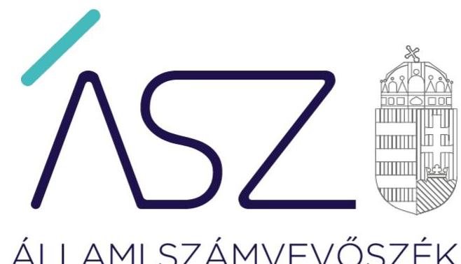
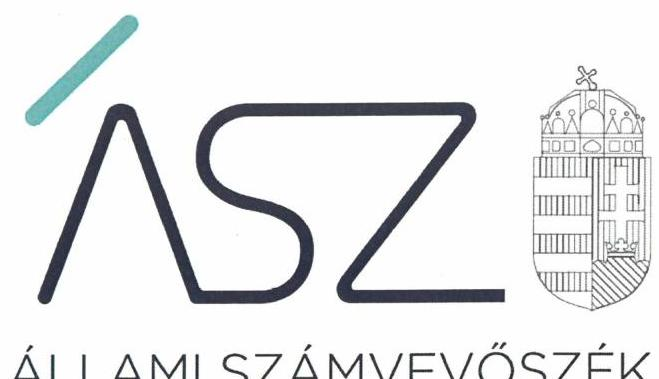
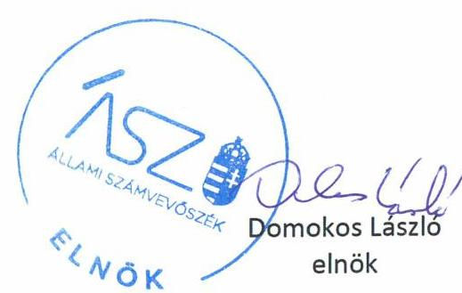

ÁLLAMI SZÁMVEVŐSZÉK

# JELENTÉS 

## Az állami résztulajdonú gazdasági társaságok ellenőrzése

FILANTROP Környezetvédelmi és Fűtéstechnikai Nonprofit Korlátolt Felelősségű Társaság
2020.

20059
www.asz.hu

---

ÁLLAMI SZÁMVEVŐSZÉK

# JELENTÉS 

## Az állami résztulajdonú gazdasági társaságok ellenőrzése

FILANTROP Környezetvédelmi és Fűtéstechnikai Nonprofit Korlátolt Felelősségű Társaság
2020. 04. hó 15. nap

20059
www.asz.hu

---

# AZ ELLENŐRZÉST FELÜGYELTE: 

KLINGA LÁSZLÓ felügyeleti vezető
DR. NAGY IMRE felügyeleti vezető
HOLMAN MAGDOLNA felügyeleti vezető

AZ ELLENŐRZÉST VEZETTE ÉS A VÉGREHAJTÁSÁÉRT FELELŐS:
KISTÓTH KRISZTINA ellenőrzésvezető
GÁL MAGDOLNA ellenőrzésvezető
DR. NAGY IMRE ellenőrzésvezető

A PROGRAM ÖSSZEÁLLÍTÁSÁÉRT FELELŐS:
FEKETE-NAGY ANDRÁS projektvezető

Jelentéseink az Országgyűlés számítógépes hálózatán és az interneten a www.asz.hu címen is olvashatóak.

IKTATÓSZÁM: EL-2550-001/2020.
TÉMASZÁM: 2480
ELLENŐRZÉS-AZONOSÍTÓ SZÁM: V082416

---

# TARTALOMJEGYZÉK 

■ ÖSSZEGZÉS ..... 5
■ AZ ELLENŐRZÉS CÉLJA ..... 6
■ AZ ELLENŐRZÉS TERÜLETE ..... 7
■ AZ ELLENŐRZÉS HÁTTERE, INDOKOLTSÁGA ..... 8
■ A JELENTÉS LÉNYEGES KÉRDÉSKÖREI ..... 9
■ AZ ELLENŐRZÉS HATÓKÖRE ÉS MÓDSZEREI ..... 10
■ MEGÁLLAPÍTÁSOK ..... 12
■ JAVASLATOK ..... 14
■ MELLÉKLETEK ..... 15
I. sz. melléklet: Értelmező szótár ..... 15
■ FÜGGELÉK: ÉSZREVÉTELEK ..... 17
■ RÖVIDÍTÉSEK JEGYZÉKE ..... 21

---

.

---

# ÖSSZEGZÉS 

A FILANTROP Környezetvédelmi és Fűtéstechnikai Nonprofit Korlátolt Felelősségű Társaság kialakította a szabályszerű működés feltételeit. A pénzügyi-számviteli feladatok ellátása 2018-ra szabályszerűvé vált. Vagyongazdálkodási tevékenysége nem biztosította a vagyonnal való felelős, elszámoltatható gazdálkodást.

## Az ellenőrzés társadalmi indokoltsága

Az Alaptörvény 38. cikke alapján az állam tulajdona a nemzeti vagyon része. A nemzeti vagyon megőrzésének, védelmének és a nemzeti vagyonnal való felelős gazdálkodásnak a követelményeit sarkalatos törvény határozza meg. Az állami tulajdonú gazdasági társaságok ellenőrzése kiemelten fontos a nemzeti vagyon megőrzése, megóvása érdekében.

Az ellenőrzés rámutat az állami tulajdonú közszolgáltatást végző gazdasági társaságok gazdálkodási tevékenységével, valamint az államháztartásból származó források felhasználásával kapcsolatos jó gyakorlatokra és szabálytalanságokra. Felhívja a figyelmet a jogszabályi követelmények teljesítéséhez szükséges feltételek hiányosságaira, hozzájárul az államháztartáson kívüli, de (közvetlenül vagy közvetve) állami vagyont használó gazdálkodó szervezetek tevékenységének átláthatóságához. Az Állami Számvevőszék ellenőrzése eredményeképpen javaslataival, megállapításaival hozzájárul a közvagyonnal való gazdálkodás átláthatóságának, elszámoltathatóságának javításához.

## Főbb megállapítások, következtetések, javaslatok

A FILANTROP Környezetvédelmi és Fűtéstechnikai Nonprofit Korlátolt Felelősségű Társaság szabályozottsága összhangban volt a jogszabályi előírásokkal.

A Társaság pénzügyi gazdálkodása 2015-ben és 2017-ben az értékcsökkenés elszámolásában feltárt szabálytalanságok miatt nem volt szabályszerű. A Társaság pénzügyi gazdálkodása 2018-ra szabályszerű lett.

A Társaság az éves beszámolók mérlegtételeit a jogszabályi előírások ellenére nem támasztotta alá leltárral, a mennyiségi felvétellel történő - 3 évenkénti - leltározási kötelezettségét nem teljesítette. A Társaság úgy tett eleget a 2015-2018. évi beszámoló közzétételi kötelezettségének, hogy a beszámoló nem felelt meg a Számv. tv. ${ }^{1}$ előírásainak, így a gazdálkodásának, vagyongazdálkodásának az elszámoltathatóságát, átláthatóságát nem biztosította.

Az Állami Számvevőszék a jelentésben foglalt megállapítások alapján a FILANTROP Környezetvédelmi és Fűtéstechnikai Nonprofit Korlátolt Felelősségű Társaság ügyvezetőjének négy javaslatot fogalmazott meg.

---

# AZ ELLENŐRZÉS CÉLJA 

Az ellenőrzés célja annak értékelése, hogy a gazdasági társaság szabályozottsága, gazdálkodása és vagyongazdálkodási tevékenysége megfelelt-e a jogszabályi és a tulajdonosi előírásoknak; biztosítva volt-e a közfeladatok átláthatósága és elszámoltathatósága érdekében a közszolgáltatás díjának megalapozottsága szabályszerű önköltségszámítással. A vagyonváltozást eredményező döntések esetében a gazdasági társaság szabályszerűen járt-e el.

---

# **AZ ELLENŐRZÉS TERÜLETE**

## **FILANTROP Környezetvédelmi és Fűtéstechnikai Nonprofit Korlátolt Felelősségű Társaság**

A FILANTROP Környezetvédelmi és Fűtéstechnikai Nonprofit Korlátolt Felelősségű Társaságot 1995. január 1-ével alapították, 2009. január 1-től nonprofit korlátolt felelősségű társaságként működött. Közhasznúsági besorolással nem rendelkezett. Az ellenőrzött időszakban a Magyar Állam tulajdoni részaránya 80,43%, a fennmaradó 19,57% részarányú tulajdonrész 44 települési önkormányzat tulajdona volt. A Társaságban2 a Magyar Államot megillető tulajdonosi jogokat az MNV Zrt. gyakorolta.

A Társaság fő tevékenysége egyéb épület-, ipari takarítás volt. 2016. október 31-ig közfeladatot látott el, kéményseprő-ipari közszolgáltatást végzett, tevékenysége Bács-Kiskun megye 83 településére és Jász-Nagykun-Szolnok megye teljes területére terjedt ki. Egyéb tevékenysége ingatlan bérbeadás, szellőzőrendszerek tisztítása, környezetvédelmi szolgáltatás és értékesítés volt.

A Kéményseprő-ipari törvény33 alapján a Társaság kéményseprő-ipari közszolgáltató feladatát a lakossági szektorban a Belügyminisztérium Országos Katasztrófavédelmi Főigazgatóság Gazdasági Ellátó Központ vette át 2016. november 1-től. Ezt követően a Társaság kizárólag jogi személyiségű szervezet részére végzett szolgáltatást, 2017. év végén Bács-Kiskun megye, Jász-Nagykun-Szolnok megye, Pest megye, Tolna megye, Csongrád megye és Békés megye területén. A tevékenységi kör változása miatt a Társaság állományi létszáma a 2015. év végi 118 főről 2018 év végére 26 főre csökkent.

A Társaság legfőbb szerve a taggyűlés volt, a Társaságnál három fős Felügyelő Bizottság működött. A Társaság ügyvezetője személyében az ellenőrzött időszakban nem történt változás. A Társaság a Számv. tv. alapján könyvvizsgálatra volt kötelezett, az önköltségszámítás rendjére vonatkozó belső szabályzat készítésére nem volt kötelezett.

A Társaság az ellenőrzött időszakban nem minősült kormányzati szektorba sorolt gazdálkodó szervezetnek, nem végzett vagyonkezelést, továbbá tulajdonosi részesedéssel más gazdasági társaságban nem rendelkezett.

---

# AZ ELLENŐRZÉS HÁTTERE, INDOKOLTSÁGA 

Az állami tulajdonú gazdasági társaságokra vonatkozó előírások betartásának ellenőrzése kiemelten fontos a vagyon megőrzése, megóvása érdekében. Az állami tulajdonú gazdasági társaságok esetében alapvető követelmény, hogy gazdálkodásuk, működésük szabályszerű, az általuk szolgáltatott adatok minél megbízhatóbbak legyenek. Gazdálkodásuk jellemzően a közérdeklődés és a média figyelmének középpontjában áll, amihez hozzájárul a gazdálkodásuk körébe tartozó - közvetlen vagy közvetett állami tulajdonú, tehát végső soron a nemzeti vagyon részét képező - vagyon nagysága, illetve az általuk ellátott közszolgáltatások/közfeladatok minősége és hatékonysága. A rendszeres elszámoltatás feltételeinek kialakítása az ellenőrzése során nagy hangsúlyt kap.

---

# A JELENTÉS LÉNYEGES KÉRDÉSKÖREI 

1. A társaság működésének szabályozottsága megfelelt-e az előírásoknak?
2. A társaságnál a pénzügyi-számviteli és adatszolgáltatási feladatok ellátása szabályszerű volt-e?
3. A társaság vagyongazdálkodása szabályszerű volt-e?

---

# AZ ELLENŐRZÉS HATÓKÖRE ÉS MÓDSZEREI 

## Az ellenőrzés típusa

Megfelelőségi ellenőrzés.

## Az ellenőrzött időszak

Az ellenőrzött időszak 2015-2018. évek.

## Az ellenőrzés tárgya

Állami résztulajdonban lévő gazdasági társaság gazdálkodása, kiemelten vagyongazdálkodási tevékenysége.

## Az ellenőrzött szervezet

FILANTROP Környezetvédelmi és Fűtéstechnikai Nonprofit Korlátolt Felelősségű Társaság

## Az ellenőrzés jogalapja

Az ellenőrzés jogalapját az ÁSZ tv. ${ }^{4}$ 1. § (3) bekezdése és 5. § (3)-(5) bekezdése képezte.

## Az ellenőrzés módszerei

Az ellenőrzést a nemzetközi standardokat irányadónak tekintve az ellenőrzési program ellenőrzési kérdései, az ellenőrzött időszakban hatályos jogszabályok, az ellenőrzés szakmai szabályok és módszertanok figyelembe vételével végezte az ÁSZ.

Az ellenőrzés ideje alatt az ellenőrzött szervezettel történő kapcsolattartást az ÁSZ Szervezeti és Működési Szabályzatának vonatkozó előírásai alapján biztosította az ÁSZ.

Az ellenőrzési kérdések megválaszolásához szükséges bizonyítékok megszerzése a következő ellenőrzési eljárások alkalmazásával történt: megfigyelés, kérdésfeltevés (információkérés), összehasonlítás, valamint elemző eljárás. Az ellenőrzési bizonyítékként felhasználható adatforrások közé tartoztak az ellenőrzési programban felsorolt adatforrások.

---

Az ÁSZ az ellenőrzést a kérdésekre adott válaszok kiértékelésével, valamint a megjelölt adatforrások, a csatolt tanúsítványok felhasználásával, továbbá az adott időszakban hatályos jogszabályok figyelembe vételével folytatta le.

A teljes ellenőrzött időszakra vonatkozóan került ellenőrzésre a gazdasági társaság tervezési, beszámolási, közzétételi, adatszolgáltatási kötelezettségének szabályszerűsége. A 2015., 2017. és 2018. évekre vonatkozóan a gazdasági társaság működésének szabályozottságát, pénzügyiszámviteli feladatellátását, illetve vagyongazdálkodásának szabályszerűségét ellenőrizte az ÁSZ.

Az állami résztulajdonú gazdasági társaság feladatellátásának értékelése az adott területen „szabályszerű"/"jogszabályi előírásoknak megfelelő", amennyiben az értékelt területen az „igen" válaszok százalékban kifejezett, egy tizedes számra kerekített aránya, meghaladta a 90%-ot. Amennyiben ez az arány nem haladta meg a 90%-ot az értékelés „nem szabályszerű"/"jogszabályi előírásoknak nem megfelelő".

A 2015., 2017. és 2018. évi bevételek és a ráfordítások elszámolásának szabályszerűsége, valamint az értékcsökkenési leírás és a vagyonnyilvántartás szabályszerűsége esetében az ellenőrzés azokra a legnagyobb értékű tételekre - a lényeges sokaságra - terjedt ki, melyek összértéke eléri a teljes sokaság összértékének 50%-át. Az értékcsökkenési leírás és a vagyonnyilvántartás szabályszerűsége esetében a lényeges sokaság tételes ellenőrzésére került sor. Az ÁSZ a bevételek és a ráfordítások elszámolásának szabályszerűségét a lényeges sokaságból véletlen mintavételi eljárással kiválasztott tételek alapján ellenőrizte. A 2015., 2017. és 2018. évi személyi jellegű kifizetések esetében a vezető tisztségviselő részére történő kifizetések elszámolásának szabályszerűségét tételesen ellenőrizte az ÁSZ.

A mintavétellel ellenőrzött területek esetében minden egyes tétel vonatkozásában a szabályszerűségre vonatkozó kérdéseket tett fel az ÁSZ. „Szabályszerű" értékelést kapott egy ellenőrzött terület, amennyiben 95%os bizonyossággal az ellenőrzött sokaságban az átlagos hibaarány legfeljebb 10%, "nem szabályszerű" értékelést, amennyiben 10%-nál magasabb arányt képviselt. Abban az esetben, ha az ellenőrzött sokaság tekintetében a 10%-os hibaarányhoz való viszony megítélésének megbízhatósága nem érte el a 95%-ot, annak elérése érdekében az értékelés további szempontokkal egészült ki, és az ÁSZ figyelembe vette a feltárt hibák értékét.

---

# MEGÁLLAPÍTÁSOK 

## 1. A társaság működésének szabályozottsága megfelelt-e az előírásoknak?

Összegző megállapítás A Társaság működésének szabályozottsága szabályszerű volt.
A TÁRSASÁGI SZERZŐDÉS ${ }_{1-5}{ }^{5}$-ben és a társasági SZMSZ ${ }_{1-2}{ }^{7}$ -ben rögzítették a Társaság működésének kereteit, irányításának és gazdálkodásának főbb szabályait.

SZÁMVITELI POLITIKA ${ }_{1-2}{ }^{8}$-val rendelkezett a Társaság. A számviteli politika keretében a Társaság elkészítette a Leltárkészítési és leltározási szabályzat ${ }_{1-2}{ }^{9}$-ot, az Értékelési szabályzat ${ }_{1-2}{ }^{10}$-ot, és a Pénzkezelési szabályzat ${ }_{1-2}{ }^{11}$-ot. A Társaság kiadta a Számlarend ${ }_{1-2}{ }^{12}$-et és a számlarendben foglaltakat alátámasztó Bizonylati rend ${ }_{1-2}{ }^{13}$-et. A szabályzatok megfeleltek a Számv.tv. előírásainak.

A JAVADALMAZÁSI SZABÁLYZAT ${ }_{1-2}$-ot ${ }^{14}$ a taggyűlés megalkotta. A Társaság ügyvezetője a Taktv. ${ }^{15}$ 5. § (3) bekezdés előírása, továbbá a Javadalmazási szabályzat ${ }_{1}$ rendelkezése és a taggyűlési határozat ${ }^{16}$ ellenére a Javadalmazási szabályzat ${ }_{1-2}$-t a cégiratok közé nem helyezte letétbe.

## 2. A társaságnál a pénzügyi-számviteli és adatszolgáltatási feladatok ellátása szabályszerű volt-e?

Összegző megállapítás A Társaságnál a pénzügyi-számviteli feladatok ellátása 2015-ben és 2017-ben nem volt szabályszerű, 2018-ban szabályszerű volt.

A SZEMÉLYI JELLEGŰ RÁFORDÍTÁSOK elszámolása 2015. és 2017. évben szabályszerű volt. A személyi jellegű ráfordítások elszámolása 2018. évben nem volt szabályszerű, mert a Társaság a munkabér adóelőlegének számítását, továbbá egyes juttatások jogszerű elszámolását a Számv. tv. 165. § (2) bekezdésében foglaltak ellenére bizonylattal nem támasztotta alá.

AZ ÉRTÉKCSÖKKENÉS elszámolása 2015. és 2017. évben nem volt szabályszerű. A Társaság a tárgyi eszközök Számv. tv. 47. § (1) bekezdése szerinti bekerülési értékét a Számv. tv. 165. § (2) bekezdésében foglaltak ellenére bizonylattal nem támasztotta alá. Továbbá a Számv. tv. 52. § (2) bekezdésében előírtak ellenére a tárgyi eszközök üzembe helyezését a Társaság hitelt érdemlően nem dokumentálta. Az értékcsökkenés 2018. évi elszámolása szabályszerű volt.

---

# A BEVÉTELEK ÉS AZ ANYAGJELLEGŰ, EGYÉB ÉS PÉNZÜGYI MŰVELETEK RÁFORDÍTÁSAINAK elszámolása szabályszerű volt. 

A 2015. évben a Társaság nyilvántartási (könyvvezetési) rendszerében a Kéményseprő-ipari tv. ${ }^{17}$ és Közszolgáltatási szerződésének ${ }^{18}$ előírása szerint a közszolgáltatás bevételeit és ráfordításait a többi szolgáltatásától szabályszerűen elkülönítve mutatta ki.

A TERVEZÉSI kötelezettségét a Társaság szabályszerűen teljesítette. Az éves üzleti terveket ${ }^{19}$ a Társaság 2015-2018. évekre a tulajdonosi joggyakorló ${ }^{20}$ által előírt irányelvek szerint elkészítette.

## 3. A társaság vagyongazdálkodása szabályszerű volt-e?

## Összegző megállapítás

A Társaság vagyongazdálkodása nem volt szabályszerű.

A
 VAGYON NYILVÁNTARTÁSA nem volt szabályszerű, mert a Társaság a 2015-2018. években a Számv. tv. 69. § (1) bekezdésében foglaltak ellenére az éves beszámoló mérleg tételeinek alátámasztásához nem állított össze leltárt, amely tételesen, ellenőrizhető módon tartalmazza a mérleg fordulónapján meglévő eszközöket és forrásokat mennyiségben és értékben.

A Számv. tv. 69. § (3) bekezdés előírásai ellenére 2015-2017. években a Társaság a leltárba bekerülő adatok valódiságáról leltározással nem győződött meg, a folyamatosan mennyiségben nyilvántartott eszközök mennyiségi felvétellel történő leltározását a Számv. tv.-ben meghatározott időszakonként, háromévente mennyiségi felvétellel nem végezte el.

A Társaság a 2018. évi éves beszámoló mérlegében a Számv. tv. 16. § (3) bekezdésében foglaltak ellenére a gazdasági eseményeket nem a tényleges gazdasági tartalmuknak megfelelően mutatta be, mivel a „rövid lejáratú kötelezettségek kapcsolt vállalkozással szemben" mérlegtétel kilépett dolgozókkal szembeni követeléseket és téves banki jóváírásokat tartalmaz.

A Társaság úgy tett eleget a 2015-2018. évi beszámoló közzétételi kötelezettségének, hogy a beszámoló nem felelt meg a Számv. tv. 20. § (1), valamint a 69. § (1), (3) bekezdés előírásainak.

A leltár hiánya ellenére a könyvvizsgáló a 2015-2018. években hitelesítő záradékkal látta el az éves beszámolót.

A VAGYONGAZDÁLKODÁS feltételeit a Társaság kialakította, a kapcsolatos feladat- és hatásköröket, felelősségi viszonyokat a Társasági Szerződés ${ }_{1-5}$ tartalmazta. A tulajdonosi joggyakorló előírása szerint a Társaság 2016. november 1-én megalkotta az ingatlan és ingó vagyontárgy gazdálkodási és hasznosítási szabályzatot ${ }^{21}$.

---

# JAVASLATOK 

Az ÁSZ tv. 33. § (1) bekezdésében foglaltak értelmében az ellenőrzött szervezet vezetője köteles a jelentésben foglalt megállapításokhoz kapcsolódó intézkedési tervet összeállítani és azt a jelentés kézhezvételétől számított 30 napon belül az ÁSZ részére megküldeni. Amennyiben az ellenőrzött szervezet vezetője nem küldi meg határidőben az intézkedési tervet, vagy továbbra sem elfogadható intézkedési tervet küld, az Állami Számvevőszék elnöke az ÁSZ tv. 33. § (3) bekezdése a) és b) pontjaiban foglaltakat érvényesítheti.

## FILANTROP Környezetvédelmi és Fűtéstechnikai Nonprofit Korlátolt Felelősségű Társaság ügyvezetőjének

1. Intézkedjen a személyi jellegű ráfordítások könyvviteli nyilvántartásba való rögzítése során annak Számv. tv-ben előírt bizonylattal való alátámasztásáról.
(2. sz. megállapítás 1. bekezdés 2. mondata alapján)
2. Gondoskodjon a Számv. tv. előírása alapján leltár összeállításáról az éves beszámoló mérlegtételei értékének alátámasztásához.
(3. sz. megállapítás 1. bekezdése alapján)
3. Intézkedjen a Számv. tv. mennyiségi felvétellel történő leltározásra vonatkozó előírásainak betartására.
(3. sz. megállapítás 2. bekezdése alapján)
4. Gondoskodjon a javadalmazási szabályzat Taktv-ben előírtak szerinti letétbe helyezéséről.
(1. sz. megállapítás 3. bekezdése alapján)

---

# MELLÉKLETEK 

- I. SZ. MELLÉKLET: ÉRTELMEZŐ SZÓTÁR
állami vagyon
a) Az állam tulajdonában lévő dolog, valamint a dolog módjára hasznosítható természeti erő,
b) az a) pont hatálya alá nem tartozó mindazon vagyon, amely vonatkozásában törvény az állam kizárólagos tulajdonjogát nevesíti,
c) az állam tulajdonában lévő tagsági jogviszonyt megtestesítő értékpapír, illetve az államot megillető egyéb társasági részesedés,
d) az államot megillető olyan immateriális, vagyoni értékkel rendelkező jogosultság, amelyet jogszabály vagyoni értékű jogként nevesít.
e) az állam tulajdonában lévő pénzügyi eszközök

Forrás: Vtv. ${ }^{22}$ 1. § (2) bekezdése
gazdasági társaság
A gazdasági társaságok üzletszerű közös gazdasági tevékenység folytatására, a tagok vagyoni hozzájárulásával létrehozott, jogi személyiséggel rendelkező vállalkozások, amelyekben a tagok a nyereségből közösen részesednek, és a veszteséget közösen viselik.
Forrás: Ptk. ${ }^{23}$ 3:88. § (1) bekezdése
kormányzati szektorba sorolt egyéb szervezet
Az a szervezet, amely az Áht. alapján nem része az államháztartásnak, azonban az Európai Közösséget létrehozó szerződéshez csatolt, a túlzott hiány esetén követendő eljárásról szóló jegyzőkönyv alkalmazásáról szóló 2009. május 25-i 479/2009/EK rendelet szerint a kormányzati szektorba tartozik.
nonprofit gazdasági társaság az a gazdasági társaság minősül nonprofit gazdasági társaságnak és cégnevében az a gazdasági társaság tüntetheti fel a nonprofit jelleget, amelynek létesítő okirata tartalmazza, hogy a gazdasági társaság tevékenységéből származó nyereség a tagok között nem osztható fel, hanem az a gazdasági társaság vagyonát gyarapítja.
Forrás: A 2006. évi V. tv. ${ }^{24}$ 9/F. § (2) bekezdés

---

.

---

# FÜGGELÉK: ÉSZREVÉTELEK 

A jelentéstervezetet a Számvevőszék 15 napos észrevételezésre megküldte az ellenőrzött szervezet vezetőjének az ÁSZ tv. 29. § (1) bekezdése előírásának megfelelően.

A FILANTROP Környezetvédelmi és Fűtéstechnikai Nonprofit Korlátolt Felelősségű Társaság ügyvezetője a jelentéstervezet megállapításaira írásban észrevételt tett.
Az ÁSZ tv. 29. § (3) bekezdésével összhangban az ÁSZ a Függelékben feltünteti az ellenőrzés megállapításaival kapcsolatban tett, figyelembe nem vett észrevételeket, és megindokolja, hogy azokat miért nem fogadta el.

Az ÁSZ az ellenőrzési megállapításait az ellenőrzött időszakban hatályos jogszabályok és az ellenőrzött szervezet közreműködési kötelezettsége keretében, az ellenőrzött szervezet által rendelkezésre bocsátott, Teljességi és hitelességi nyilatkozattal alátámasztott dokumentumokra alapozva fogalmazta meg. A Társaság ügyvezetője által aláírt Teljességi és hitelességi nyilatkozatokban foglaltak szerint az átadott dokumentumok, adatok megbízhatóak, az ÁSZ által bekért adatokra, dokumentumokra vonatkozóan teljes körű információt tartalmaznak. Az ügyvezető az átadott dokumentumok, adatok hitelességéért, valódiságáért, hiánytalanságáért teljes felelősséget vállalt. Így az adatszolgáltatáson kívül, a 15 napos észrevételezés keretében megküldött adatokat az ÁSZ a megállapításainak megfogalmazásánál nem veszi figyelembe.

1) A jelentéstervezet Főbb megállapítások, következtetések, javaslatok rész 2. bekezdéséhez, és a 2. sz. megállapítás 2. bekezdés 1-3. mondataihoz, valamint a 3. sz. megállapítás 5. bekezdésére vonatkozó észrevétel:

Az ügyvezető az észrevételében, az értékcsökkenés elszámolásával kapcsolatosan feltárt hiba vonatkozásában jelezte, hogy a tárgyi eszközök bekerülési értékét és az illeték megfizetését is a Számv. tv. 47. § (1) bekezdése alapján vették figyelembe. A tárgyi eszközök értékcsökkenésének elszámolását célszoftver végzi. A tárgyi eszközök üzembe helyezésének dokumentálását hitelt érdemlő bizonylatok alapján tették.

## El nem fogadott észrevétel indoklása:

A 2015. és a 2017. év tekintetében a Társaság - a Teljességi és hitelességi nyilatkozattal alátámasztott adatszolgáltatása alapján - nem rendelkezett olyan dokumentumokkal, amelyek a tárgyi eszközöknek a Számv. tv. 47. § (1) bekezdése szerinti - bekerülési értékét és a - Számv. tv. 52. § (2) bekezdésében meghatározott - üzembe helyezését a Számv. tv. 165. § (2) bekezdésében előírtak szerinti bizonylatokkal alátámasztotta volna. Az ellenőrzött tételek esetében a bekerülési érték megállapítása nem a Számv. tv. előírásai szerint történt, mert az eszköz állományba vételi értéke bizonylattal nem volt alátámasztott, illetve a tárgyi eszközök állományba vételekor a Számv. tv. 165.§ (1) bekezdésében foglaltak ellenére azt állományba vételt bizonylattal nem támasztották alá. A tárgyi eszközök esetében a bekerülési érték nem szabályszerű megállapítása, valamint az állományba vétel bizonylatokkal történő alátámasztása

[^0]
[^0]:    * 29. § (1) Az Állami Számvevőszék az ellenőrzési megállapításait megküldi az ellenőrzött szervezet vezetőjének vagy az általa megbízott személynek, és annak, akinek személyes felelősségét állapította meg.
    (2) Az ellenőrzött szervezet vezetője és a felelősként megjelölt személy az ellenőrzés megállapításaira tizenöt napon belül írásban észrevételt tehet.
    (3) Az Állami Számvevőszék az észrevételre a beérkezésétől számított harminc napon belül írásban válaszol. A figyelembe nem vett észrevételeket köteles a jelentésben feltüntetni, és megindokolni, hogy azokat miért nem fogadta el.

---

következtében az értékcsökkenés elszámolása nem volt szabályszerű, ezért a jelentéstervezet módosítása nem indokolt.
2) A jelentéstervezet Főbb megállapítások, következtetések, javaslatok rész 3. bekezdéséhez, és a 3. sz. megállapítás 1-2. és 4. bekezdéseire tett észrevétel:
Az ügyvezető észrevételében jelezte, hogy a társaság leltározási szabályzata a jogszabályi feltételeknél szigorúbb, kétévenkénti mennyiségi felvétellel történő leltározást ír elő, amely a 2016. és 2018. években megvalósult. Az észrevétel szerint a teljes körű leltár tételesen ellenőrizhető módon megvalósult, a társaság éves beszámolóját könyvvizsgáló ellenőrizte, továbbá a beszámolót a taggyűlés valamint a tulajdonos MNV Zrt. is jóváhagyta, a vagyongazdálkodást átláthatónak minősítették. Az ügyvezető álláspontja szerint az ÁSZ az adatbekérés során a csak a leltározási ütemtervet, illetve a leltározási utasítást kérte megküldeni, „a teljes leltár dokumentumait" nem. Az észrevétel szerint a 2015. évben a megtörtént a készletek és a pénztár mennyiségi felvétele, és egyeztetéssel a tárgyi eszközök, a követelések, a pénzforgalmi számlák és a kötelezettségek leltározása, a 2016. évben mennyiségi felvétellel a tárgyi eszközök, készletek, pénztár leltározása, a 2017. évben pedig a készletek és a pénztár mennyiségi felvétellel történő leltározása, a tárgyi eszközök, követelések, bankszámlák és kötelezettségek analitikával történő egyeztetése.

# El nem fogadott észrevétel indoklása: 

Az ÁSZ a társaság vagyongazdálkodásának szabályszerűségét a 2015-2017. évekre vonatkozóan a 2018. június 29-én kelt EL-0821-008/2018. ikt.sz. adatbekérő levél 2. sz. melléklet (Dokumentumok jegyzéke) 1.3.22. 2. pontjában, a 2018. évre vonatkozóan a 2019. szeptember 19-én kelt EL-2007-005/2019. ikt.sz. adatbekérő levél 2. sz. melléklet (Dokumentumok jegyzéke) 26.3. pontjához - „éves beszámolót alátámasztó leltárak, mérlegsorokat alátámasztó leltárösszesítők" - benyújtott dokumentumok és a Társaság Teljességi és hitelességi nyilatkozata alapján értékelte.
A 2018. július 11-én kelt Teljességi és hitelességi nyilatkozat 22.2. pontjában, valamint a 2019. október 7-én kelt Teljességi és hitelességi nyilatkozat 26.3. pontjában megnevezett dokumentumok nem feleltek meg a Számv. tv. 69. § (1) pontjában előírtaknak, mert nem tartalmaztak olyan leltárt, amely tételesen, ellenőrizhető módon tartalmazza a vállalkozónak a mérleg fordulónapján meglévő eszközeit és forrásait mennyiségben és értékben.
Az „ADATSZOLGÁLTATÁS MÉRLEGMELLÉKLETEK - 2016.12.31" elnevezéssel megküldött file tartalma szerint az üzleti év fordulónapja 2016.12.31., azonban adatai több esetben nem támasztják alá a 2016. évi beszámolóban szerepelő adatokat, mert azok a 2017. évi beszámoló adatait tartalmazzák, miközben a keltezés időpontjának 2017. január hónap van feltüntetve. A „BESSZÁMOLÓ ALÁTÁMASZTÓ LELTÁROZÁSI ZÁRÓ JEGYZŐKÖNYV" elnevezésű file adattartalma szerint „a 2017. évi beszámolót alátámasztó egyeztetési leltározási ütemtervben meghatározott eszközök és források leltározása" történt meg, és a 2017. 12.31. fordulónapú leltározás megtörténtét igazolja. A tárgyi eszközök leltározása 2015-ben és 2017-ben egyeztetéssel történt a jegyzőkönyvek alapján.
Az ellenőrzés rendelkezésére bocsátott dokumentumok a Számv. tv. szerinti háromévenkénti mennyiségi felvétellel történő leltározás elvégzését nem igazolják, ezért a jelentéstervezetben a Számv. tv. szerinti mennyiségi felvétellel történő leltározásra vonatkozó megállapítás továbbra is helytálló.
3) A jelentéstervezet 1. sz. megállapítás 3. bekezdés 2. mondatához tett észrevétel:

Az ügyvezető észrevételében a jelentéstervezetben szereplő megállapítást részben elfogadja, ugyanakkor jelezte, hogy a javadalmazási szabályzat letétbe helyezése 2018. július 12. napján megtörtént, amelyről az ÁSZ-t tájékoztatta.

## El nem fogadott észrevétel indoklása:

Az ellenőrzési megállapítást alátámasztó dokumentumok alapján a Társaság a 2012. december 18-tól, valamint a 2016. május 10-től hatályos javadalmazási szabályzatokat a cégiratok közé nem helyezte letétbe. Az észrevételben hivatkozott, 2018. július 12. napján történt letétbe helyezést igazoló dokumentumok nem szerepeltek az ellenőrzési megállapítást alátámasztó dokumentumok között. A Javadalmazási szabályzatnak a Taktv. 5. § (3) bekezdés előírása, továbbá a Javadalmazási szabályzat rendelkezése és a taggyűlési határozat által előírtak szerinti letétbe helyezése a társaság részéről - a Teljességi és hitelességi nyilatkozatban foglalt nyilatkozata alapján - nem történt meg.

---

4) A jelentéstervezet 2. sz. megállapítás 1. bekezdés 2. mondatához tett észrevétel:

Az ügyvezető észrevételében
 jelezte, hogy az ellenőrzésre kiválasztott munkavállaló tekintetében „vélelmezhetően” az év elején esedékes adókedvezmények igénybevételével kapcsolatos nyilatkozat nem került csatolásra. A hiányzó dokumentumot az ügyvezető észrevételéhez mellékletként csatolta.

# El nem fogadott észrevétel indoklása: 

A 2019. október 30-án kelt Teljességi és hitességi nyilatkozat 2/d. pont SZ1 sorában szereplő dokumentum nem tartalmazta a családi kedvezmény érvényesítéséhez szükséges feltételek teljesülését alátámasztó bizonylatokat, továbbá a béren kívüli juttatásként elszámolt, iskolarendszerű képzés átvállalt költsége jogcímen kifizetésre került összeg alátámasztására vonatkozó bizonylatokat. Az ügyvezető észrevételében is megerősítette az adatszolgáltatás hiányát, ezért a jelentéstervezet módosítása nem indokolt.
5) A jelentéstervezet 3. sz. megállapítás 3. bekezdéséhez tett észrevétel:

Az ügyvezető észrevételében a társaságnál lefolytatott korábbi ellenőrzésekről és a társaság bemutatásáról adott tájékoztatást, valamint a társaság szabályozottságára vonatkozó szabályszerű megállapításával való egyetértését fejezte ki. A jelentéstervezet megállapításainak módosítása nem indokolt.

---

.

---

# RÖVIDÍTÉSEK JEGYZÉKE 

${ }^{1}$ Számv. tv.
${ }^{2}$ Társaság
${ }^{3}$ Kéményseprő-ipari törvény
${ }^{4}$ ÁSZ tv.
${ }^{5}$ ÁSZ
${ }^{6}$ Társasági Szerződés ${ }_{1-5}$
${ }^{7}$ SZMSZ ${ }_{1-2}$
${ }^{8}$ Számviteli Politika ${ }_{1-2}$
${ }^{9}$ Leltárkészítési és leltározási szabályzat ${ }_{1-2}$
${ }^{10}$ Értékelési szabályzat ${ }_{1-2}$
${ }^{11}$ Pénzkezelési szabályzat ${ }_{1-2}$
${ }^{12}$ Számlarend ${ }_{1-2}$

2000. évi C törvény a számvitelről

FILANTROP Környezetvédelmi és Fűtéstechnikai Nonprofit Korlátolt Felelősségű Társaság
A kéményseprő-ipari tevékenységről szóló 2015. évi CCXI. törvény, hatályos 2016. július 1-től
2011. évi LXVI. törvény az Állami Számvevőszékről, hatályos 2011. július 1-től Állami Számvevőszék
FILANTROP Környezetvédelmi és Fűtéstechnikai Nonprofit Korlátolt Felelősségű Társaság Társasági Szerződése egységes szerkezetben, hatályos 2013. május 29-től,
FILANTROP Környezetvédelmi és Fűtéstechnikai Nonprofit Korlátolt Felelősségű Társaság Társasági Szerződése egységes szerkezetben, hatályos 2015. június 1-től,
FILANTROP Környezetvédelmi és Fűtéstechnikai Nonprofit Korlátolt Felelősségű Társaság Társasági Szerződése egységes szerkezetben, hatályos 2015. július 3-tól, FILANTROP Környezetvédelmi és Fűtéstechnikai Nonprofit Korlátolt Felelősségű Társaság Társasági Szerződése egységes szerkezetben, hatályos 2017. február 20-tól,
FILANTROP Környezetvédelmi és Fűtéstechnikai Nonprofit Korlátolt Felelősségű Társaság Társasági Szerződése egységes szerkezetben, hatályos 2017. május 22-től
FILANTROP Környezetvédelmi és Fűtéstechnikai Nonprofit Kft. Szervezeti és Működési Szabályzat, hatályos 2012. december 18-tól
FILANTROP Környezetvédelmi és Fűtéstechnikai Nonprofit Korlátolt Felelősségű Társaság Szervezeti és Működési Szabályzata, hatályos 2017. január 1-től
FILANTROP Környezetvédelmi és Fűtéstechnikai Nonprofit Kft. Számviteli Politika, hatályos 2012. január 1-től; többször módosított 2013. január 1., 2014. január 1., Számviteli Politika, hatályos 2017. január 1-től
FILANTROP Környezetvédelmi és Fűtéstechnikai Nonprofit Kft. Leltárkészítési és leltározási szabályzat, hatályos 2012. január 1-től,
FILANTROP Környezetvédelmi és Fűtéstechnikai Nonprofit Korlátolt Felelősségű Társaság Leltárkészítési és leltározási szabályzata hatályos 2017. január 1-től
FILANTROP Környezetvédelmi és Fűtéstechnikai Nonprofit Kft. Értékelési szabályzat, hatályos 2012. január 1-től,
FILANTROP Környezetvédelmi és Fűtéstechnikai Nonprofit Korlátolt Felelősségű Társaság Értékelési szabályzat hatályos 2017. január 1-től
FILANTROP Környezetvédelmi és Fűtéstechnikai Nonprofit Kft. Pénzkezelési szabályzat, hatályos 2012. január 1-től
FILANTROP Környezetvédelmi és Fűtéstechnikai Nonprofit Korlátolt Felelősségű Társaság Pénzkezelési szabályzata hatályos 2017. január 1-től
FILANTROP Környezetvédelmi és Fűtéstechnikai Nonprofit Kft. Számlarend, hatályos 2012. január 1-től,
FILANTROP Környezetvédelmi és Fűtéstechnikai Nonprofit Korlátolt Felelősségű Társaság Számlarend hatályos 2017. január 1-től

---

${ }^{13}$ Bizonylati rend ${ }_{1-2}$
${ }^{14}$ Javadalmazási szabályzat ${ }_{1-2}$
${ }^{15}$ Taktv.
${ }^{16}$ Javadalmazási szabályzatot ${ }_{2}$ jóváhagyó taggyúlési határozat
${ }^{17}$ Kéményseprő-ipari tv.
${ }^{18}$ Közszolgáltatási szerződés
${ }^{19}$ üzleti tervek
${ }^{20}$ tulajdonosi joggyakorló
${ }^{21}$ Ingatlan és ingó vagyontárgy gazdálkodási és hasznosítási szabályzat
${ }^{22}$ Vtv.
${ }^{23}$ Ptk.
${ }^{24}$ 2006. évi V. tv.

FILANTROP Környezetvédelmi és Fűtéstechnikai Nonprofit Kft. Bizonylati rend hatályos 2012. január 1-től;
FILANTROP Környezetvédelmi és Fűtéstechnikai Nonprofit Korlátolt Felelősségű Társaság Bizonylatkezelési szabályzata, hatályos 2017. január 1-től
FILANTROP Környezetvédelmi és Fűtéstechnikai Nonprofit Kft. Javadalmazási szabályzat, hatályos 2012. december 18-tól,
FILANTROP Környezetvédelmi és Fűtéstechnikai Nonprofit Kft.
4/TGY/2016.05.10. számú Határozat, Melléklete Javadalmazási Szabályzat, hatályos 2016. május 10-től
2009. évi CXXII. törvény - a köztulajdonban álló gazdasági társaságok takarékosabb működéséről
4/TGY/2016.05.10. számú taggyúlési határozat

A kéményseprő-ipari közszolgáltatásról szóló 2012. évi XC. törvény, hatálytalan 2016. július 1-től

Kecskemét Megyei Jogú Város Önkormányzata és FILANTROP Környezetvédelmi és Fűtéstechnikai Nonprofit Korlátolt Felelősségű Társaság, mint kéményseprőipari közszolgáltató között 2014. december 23-án határozott időre megkötött Közszolgáltatási szerződés, hatályos 2015. január 1-től 2019. december 31-ig
FILANTROP Környezetvédelmi és Fűtéstechnikai Nonprofit Kft. Üzleti terv 2015. évre, Kelt 2015.02.27.;
FILANTROP Környezetvédelmi és Fűtéstechnikai Nonprofit Kft. Üzleti terv 2016. évre, Kelt 2016.02.05.;
FILANTROP Környezetvédelmi és Fűtéstechnikai Nonprofit Kft. Üzleti terv 2017. évre, Kelt 2016.12.21.
Magyar Nemzeti Vagyonkezelő Zártkörűen Működő Részvénytársaság
FILANTROP Környezetvédelmi és Fűtéstechnikai Nonprofit Korlátolt Felelősségű Társaság Ingatlan és ingó vagyontárgy gazdálkodási és hasznosítási szabályzata, hatályos 2016. november 1-től
2007. évi CVI. törvény az állami vagyonról
2013. évi V. törvény a Polgári Törvénykönyvről, hatályos 2014. március 15-től
2006. évi V. törvény a cégnyilvánosságról, a bírósági cégeljárásról és a végelszámolásról

---

# ÁSZ 

ÁLLAMI SZÁMVEVŐSZÉK
1052 Budapest, Apáczai Cs. J. u. 10. I 1364 Budapest 4. Pf. 54 TEL: +36 14849100
email: szamvevoszek@asz.hu
web: www.asz.hu | www.aszhirportal.hu

