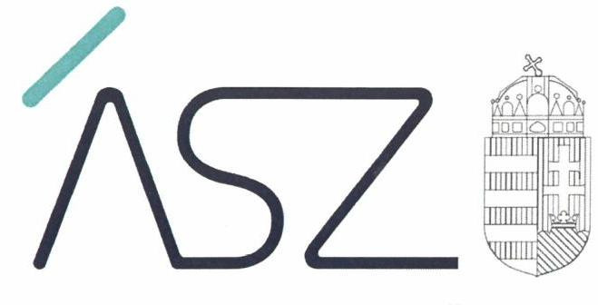
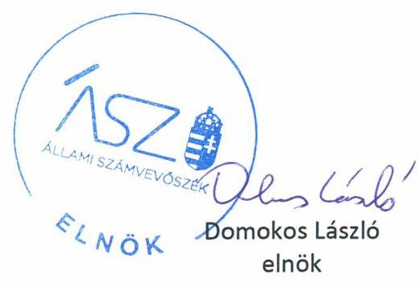
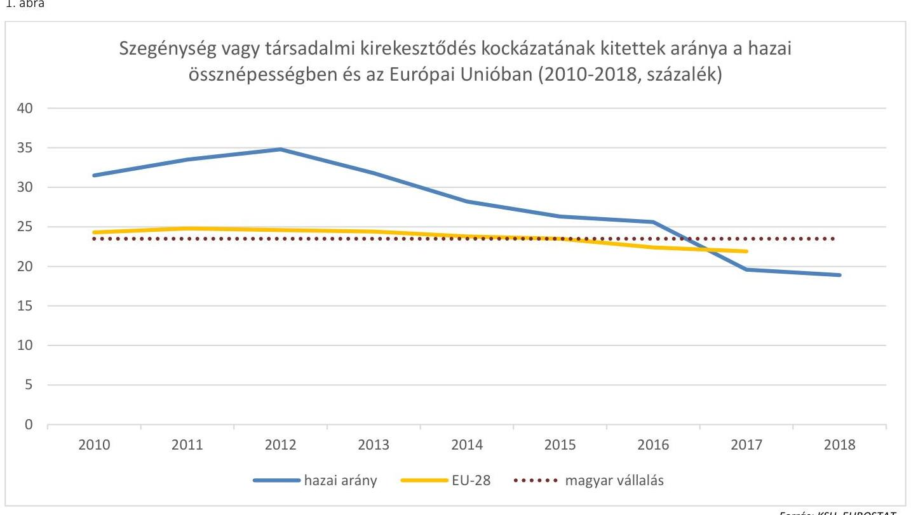
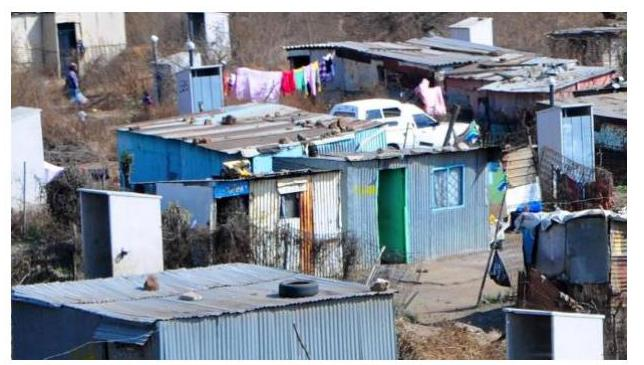
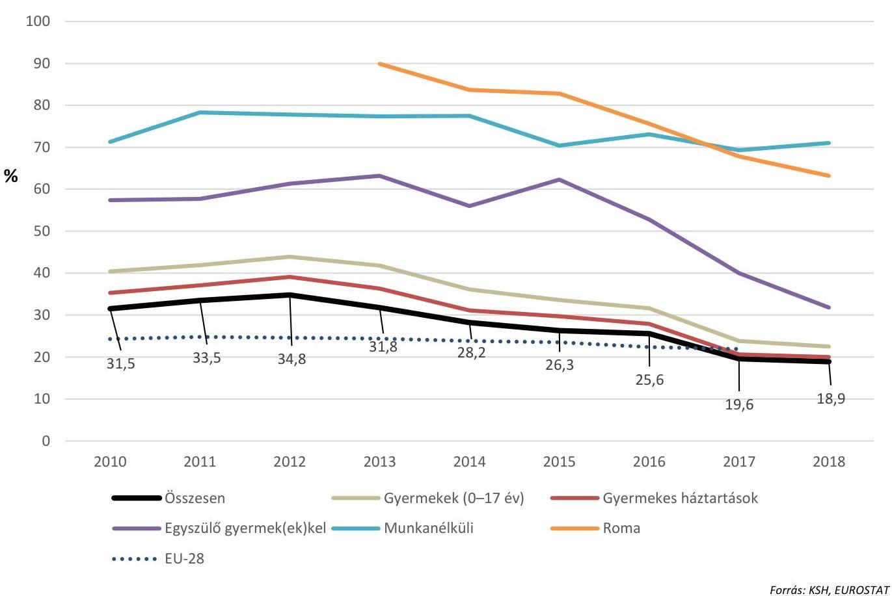
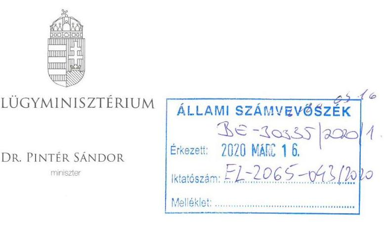
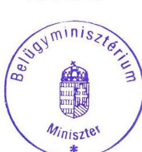
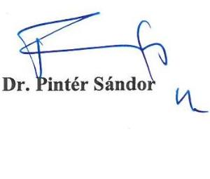
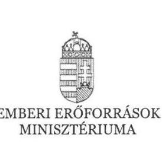
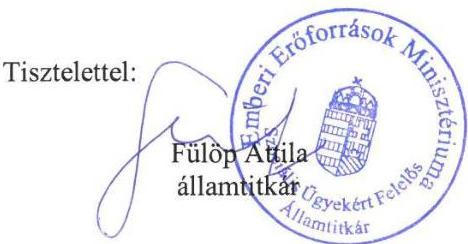

ÁLLAMI SZÁMVEVŐSZÉK

# JELENTÉS 

A szegénységi küszöb alatt élők felemelésére tett intézkedések ellenőrzése

2020.
20060
www.asz.hu

---

ÁLLAMI SZÁMVEVŐSZÉK

# JELENTÉS 

A szegénységi küszöb alatt élők felemelésére tett intézkedések ellenőrzése

2020. 06. hó 26. nap

20060
www.asz.hu

---

# AZ ELLENŐRZÉST FELÜGYELTE: 

MAKKAI MÁRIA felügyeleti vezető

## AZ ELLENŐRZÉST VEZETTE ÉS A VÉGREHAJTÁSÁÉRT FELELŐS:

JANIK JÓZSEF ellenőrzésvezető

## A PROGRAM ÖSSZEÁLLÍTÁSÁÉRT FELELŐS:

BERTALAN RUDOLF GYULA osztályvezető

IKTATÓSZÁM: EL-2557-001/2020
TÉMASZÁM: 2500
ELLENŐRZÉS-AZONOSÍTÓ SZÁM: V0844

Jelentéseink az Országgyúlés számítógépes hálózatán és az interneten a www.asz.hu címen is olvashatóak.

---

# TARTALOMJEGYZÉK 

■ ÖSSZEGZÉS ..... 5
■ AZ ELLENŐRZÉS CÉLJA ..... 7
■ AZ ELLENŐRZÉS TERÜLETE ..... 8
■ AZ ELLENŐRZÉS HÁTTERE, INDOKOLTSÁGA ..... 10
■ A JELENTÉS LÉNYEGES KÉRDÉSKÖREI ..... 11
■ AZ ELLENŐRZÉS HATÓKÖRE ÉS MÓDSZEREI ..... 12
■ MEGÁLLAPÍTÁSOK ..... 14
■ MELLÉKLETEK ..... 21
I. sz. melléklet: Értelmező szótár ..... 21
■ FÜGGELÉK: ÉSZREVÉTELEK ..... 23
■ RÖVIDÍTÉSEK JEGYZÉKE ..... 27

---

.

---

# ÖSSZEGZÉS 

A szegénységi küszöb alatt élők felemeléséhez kapcsolódó célok elérését a stratégiák célkitüzései és a megtett intézkedések biztositották. A stratégiák végrehajtása eredményes volt, a 2020-ra meghatározott nemzeti célkitüzések a kitüzött céldátumot megelőzően teljesültek.

## Az ellenőrzés társadalmi indokoltsága

A 2008-as gazdasági válság erőteljesen felszínre hozta a szegénység társadalmi szintű problémáját. Magyarországon 2010-ben a lakosság egyharmada, megközelítőleg 3 millió ember élt a szegénységi küszöb alatt. A szegénységgel összefüggő nehézségek, a rossz élet- és lakáskörülmények, az egészségügyi problémák, az alacsony iskolázottság, a munkanélküliség jelentős negatív hatással van a társadalom egészének működésére és fejlődésére. A szegénység jelenléte közvetlenül, szerteágazó módon érzékelhető a mindennapokban, a társadalom közérzetét is befolyásolja.

Az egymást követő kormányok jelentős erőforrásokat fordítottak a szegénység és társadalmi kirekesztettség csökkentésére, újratermelődésének visszaszorítására. A szegénység eredményes leküzdése nemcsak hazai, hanem nemzetközi szinten is kiemelt fontosságú stratégiai cél. Az Európai Unió 2010-ben elfogadott, a válság negatív hatásainak leküzdését szolgáló Európa 2020 Stratégiájában fontos szerepet kapott a jövedelmi szegénységben és társadalmi kirekesztettségben élők számának, arányának csökkentése. A szegénység felszámolása első helyen szerepel az ENSZ Közgyűlés által 2015-ben elfogadott fenntarthatósági célkitűzések között is.

Az ellenőrzés képet ad a szegénység mérséklését célzó stratégiák, illetve az azokhoz kapcsolódó intézkedések eredményességéről, a célok megvalósításához rendelt társadalmi erőforrások hasznosulásáról.

## Főbb megállapítások, következtetések

A magyar kormány az Európa 2020 Stratégia szegénység csökkentésére vonatkozó célkitűzéseihez kapcsolódóan 2011-ben megalkotta a nemzeti szintű stratégiát és az annak megvalósítását szolgáló intézkedési tervet. A stratégiai célokat a szegénység csökkentésével kapcsolatban meghatározták, definiálták a használt fogalmakat, és megtörtént a 2020-ra elérendő fő célok számszaki meghatározása. A stratégiai célok megvalósítása érdekében hároméves intézkedési terveket készítettek. A tervezett intézkedések végrehajtására meghatározták a felelősöket, kialakították a szervezeti kereteket, a végrehajtásban résztvevők közötti koordináció, az együttműködés szabályainak rendszerét, valamint meghatározták a koordinációt végző szervezetet.

A szegénység leküzdésére irányuló stratégiai célok teljesítése előrehaladásának, és a megvalósításukat szolgáló intézkedések végrehajtásának nyomon követésére, értékelésére indikátorokat határoztak meg, és kialakították az adatgyűjtés, nyomon követés rendszerét.

A szegénységi küszöb alatt élők felemelése érdekében kidolgozott stratégiák megvalósítása eredményes volt, mivel a stratégiai dokumentumokban 2020-ra rögzített célértékek a kitűzött céldátum előtt teljesültek. 2008 és 2017 között Magyarországon 908 ezer fővel csökkent a szegénységben élők száma, amely csökkenés jelentősen meghaladta a 2020-ra vonatkozó nemzeti vállalásban szereplő 450 ezer főt. 2018-ban a teljes népesség 18,9\%-át, 1 millió 813 ezer főt érintett a szegénység vagy társadalmi kirekesztődés kockázata, ami a 2008. évi értékhez képest az Európa 2020 Stratégia célkitűzéseivel összhangban vállalt 5 százalékpont helyett 9,4 százalékpontos csökkenést jelentett.

A szegénység leküzdésére irányuló stratégia eredményes végrehajtását tükröző adatokat az 1. ábra mutatja be.

---

Fonrás: KSH, EUROSTAT
Az Állami Számvevőszék egy időszakot értékelt, azonban ez a téma nem lezárható. A szegénység csökkentése érdekében megtett intézkedések eredményeinek megőrzése mellett továbbra is működtetni kell a kialakított, a szegénység elleni küzdelmet eredményesen szolgáló társadalmi felzárkóztatási mechanizmust, figyelemmel az aktuális kihívásokra és azok cselekvési tervekben való megjelenítésére.

---

# AZ ELLENŐRZÉS CÉLJA 

Az ellenőrzés célja annak értékelése volt, hogy a szegénységi küszöb alatt élők felemeléséhez kapcsolódó cél elérését a stratégiák célkitűzései és a tervezett intézkedések biztosították-e. Az intézkedések végrehajtása, valamint a kialakított szabályozási és szervezeti keretrendszer hozzá-járult-e a stratégiákban kitűzött célok teljesítéséhez. A monitoring és beszámolási rendszer biztosította-e a stratégiák megvalósulásának folyamatos nyomon követését, az információk teljes körű, naprakész rendelkezésre állását.

---

# AZ ELLENŐRZÉS TERÜLETE 

## A társadalmi felzárkózási politika

Magyarország kormánya az Európa 2020 Stratégia céljaihoz kapcsolódva 2010-ben a szegénységben vagy társadalmi kirekesztettségben élő népesség arányának 5 százalékponttal történő csökkentését tűzte ki célul 2020-ig. Ez a célkitűzés a hazai felzárkózási politika céljai között kiemelt helyen szerepelt.

A felzárkózási politika deklarált célja, hogy csökkenjen a szegénységben vagy társadalmi kirekesztettségben élők aránya, csökkenjen a hátrányos helyzetű gyermekek társadalmi lemaradása, gyengüljenek a szegénység átörökítésének tendenciái, csökkenjenek a roma és nem roma népesség közötti társadalmi különbségek, javuljon a roma nők helyzete.

A kormány szegénység elleni küzdelmét 2010 elejétől a Szociális és Munkaügyi Minisztérium, az új kormány megalakulása után, 2010. május 25-től a Közigazgatási és Igazságügyi Minisztérium, majd 2012. május 14-től az Emberi Erőforrások Minisztériuma koordinálta. A koordinációs feladatok 2019. május 1-ével a Belügyminisztérium hatáskörébe kerültek át. A stratégia kialakítása, végrehajtásának koordinációja, monitorozása, felülvizsgálata a felelős minisztérium szervezeti keretein belül a Társadalmi Felzárkózásért Felelős Államtitkárság felelősségi körébe tartozott.

A szegénység vagy társadalmi kirekesztődés kockázatának kitett népesség aránya (AROPE - At Risk of Poverty or Social Exclusion) elnevezésű öszszetett indikátor a jövedelmen túl a szegénység egyéb megnyilvánulási formáit is számba veszi, így az anyagi nélkülözést, valamint a munkaerőpiaci kirekesztődést is. Ezek alapján az összetett szegénységi mutató három részindikátort foglal magában: a relatív jövedelmi szegénységi arányt, a súlyos anyagi deprivációban érintettek arányát, valamint a nagyon alacsony munkaintenzitású háztartásban élők aránya (munkaszegénység).
$\longrightarrow$ Relatív jövedelmi szegénységben élő személyek azok, akik a medián ekvivalens jövedelem 60\%-ánál kevesebb (relatív szegénységi küszöb alatti) jövedelemmel rendelkező háztartásokban élnek.
$\longrightarrow$ Anyagi deprivációban (nélkülözésben) élnek azok, akikre az alábbi kilenc jellemző közül legalább három vonatkozik:

1) hiteltörlesztéssel vagy lakással kapcsolatos fizetési hátralék,
2) lakás megfelelő fűtésének hiánya,
3) váratlan kiadások fedezetének hiánya,
4) kétnaponta hús, hal, vagy azzal egyenértékű tápanyag fogyasztásának hiánya,
5) évi egyhetes, nem otthon töltött üdülés hiánya,
6) anyagi okból nem rendelkezik személygépkocsival,
7) anyagi okból nem rendelkezik mosógéppel,
8) anyagi okból nem rendelkezik színes televízióval,
9) anyagi okból nem rendelkezik telefonnal.

---

Súlyos anyagi deprivációban azok a személyek élnek, akikre a fenti jellemzők közül legalább négy vonatkozik; az ő életkörülményeiket az erőforrások hiánya súlyosan korlátozza.

- A nagyon alacsony munkaintenzitású háztartásban élők azok a személyek, akik olyan háztartásban élnek, amelynek munkaképes korú (18 és 59 év közötti) tagjai a megelőző évben teljes munkapotenciáljuk kevesebb, mint 20\%-át töltötték munkával.
A szegénység vagy társadalmi kirekesztődés kockázatának kitettek azok a személyek, akik a fenti három kategória bármelyikében érintettek. Minden személyt egyszer vesznek számításba, akkor is, ha több részmutatóban érintettek.

A szegénységre vagy társadalmi kirekesztődésre vonatkozó mutatókat minden tagország nemzeti statisztikai hivatala a háztartások jövedelmeire és életkörülményeire vonatkozó egységes EU-SILC ${ }^{1}$ felmérésből állítja elő. Ennek keretében a magyar mutatókat a Központi Statisztikai Hivatal állítja elő, és továbbítja az EUROSTAT² felé. Az adatok forrása a $\mathrm{KSH}^{3}$ Háztartási költségvetési és életkörülmény tárgyú adatfelvétele (az évente ismétlődő adatfelvétel során mintegy 10000 háztartást keresnek fel a kérdezőbiztosok, egy háztartás négy egymást követő évben vesz részt az adatfelvételben). Az Európai Unió minden tagállama számára kötelező a felmérés elvégzése.

---

# AZ ELLENŐRZÉS HÁTTERE, INDOKOLTSÁGA 

A 2008-as gazdasági válság az Európai Unió valamennyi tagállamában éreztette hatását. A negatív folyamatok megállítása, illetve megfordítása érdekében az Európa Tanács 2010-ben elfogadta az Európa 2020 Stratégiát. Ennek célja, hogy a válság hatására bekövetkező gazdasági és szociális visszaesést követően magas foglalkoztatottság és termelékenység, erős társadalmi kohézió megteremtésével biztosítsa az Európai Unió gazdaságának fenntarthatóságát. A stratégia három egymást kölcsönösen erősítő prioritáson alapult. Ezek az intelligens növekedés (tudáson és innováción alapuló gazdaság), a fenntartható növekedés (erőforrás-hatékony, környezetbarát és versenyképes gazdaság), és az inkluzív növekedés (magas foglalkoztatás, valamint szociális és területi kohézió jellemezte gazdaság) feltételeinek megteremtése. A stratégia egymáshoz kapcsolódó, kiemelt számszerű célokat fogalmazott meg, amelyek között szerepel a jövedelmi szegénységben és társadalmi kirekesztettségben élők számának uniós szinten 20 millió fővel történő csökkentése 2020-ig. Annak érdekében, hogy valamennyi tagállam saját helyzetéhez adaptálja az Európa 2020 Stratégiát, a tagállamok az uniós célkitűzéseket nemzeti célkitűzésekre bontották le.

Az ellenőrzés rávilágíthat arra, hogy a szegénység mérséklését célzó stratégiák, illetve az azokhoz kapcsolódó intézkedések a szegénységben vagy társadalmi kirekesztettségben élő népesség arányát, és az ahhoz kapcsolódó tényezőket milyen irányba befolyásolják, és rámutathat azokra a hiányosságokra, gyengeségekre, amelyek kezelésével, változtatásával a célok eredményesebben valósíthatók meg.

A szegénység felszámolása első helyen szerepel az ENSZ Közgyűlés által 2015-ben elfogadott fenntarthatósági célkitűzések, a Fenntartható Fejlődési Keretrendszer 2030 - AGENDA 2030 céljai között, melyek teljesülését a legfőbb ellenőrző intézmények nemzetközi szakmai szervezete, az INTOSAI is prioritásnak tekinti.

Az ÁSZ ${ }^{4}$ a szegénység mérséklésére irányuló intézkedésekre vonatkozó, a területet átfogó ellenőrzést még nem végzett.

---

# A JELENTÉS LÉNYEGES KÉRDÉSKÖREI 

1. A szegénység csökkentésére irányuló célok megvalósítása érdekében megtörtént-e a stratégiák, az intézkedési tervek és az egyéb kapcsolódó dokumentumok kidolgozása?
2. Megtörtént-e a szegénység csökkentésére irányuló célok, az alkalmazott fogalmak, mérőszámok meghatározása?
3. Kialakitották-e és müködtették-e a megvalósulás nyomon követési rendszerét?
4. Eredményes volt-e a szegénységi küszöb alatt élők felemelésére tett intézkedések végrehajtása?

---

# AZ ELLENŐRZÉS HATÓKÖRE ÉS MÓDSZEREI 

## Az ellenőrzés típusa

Megfelelőségi és teljesítmény-ellenőrzés.

## Az ellenőrzött időszak

A 2010-2018. évek.

## Az ellenőrzés tárgya

A szegénységi küszöb alatt élők felemeléséhez kapcsolódó cél elérését szolgáló stratégiák célkitűzéseinek és a tervezett intézkedéseknek az értékelése. A kialakított monitoring és beszámolási rendszer értékelése a stratégiák megvalósulásának nyomon követése és az információk rendelkezésre állása, megbízhatósága szempontjából.

## Az ellenőrzött szervezet

Emberi Erőforrások Minisztériuma, Belügyminisztérium

## Az ellenőrzés jogalapja

Az ellenőrzési jogszabályi alapját az Állami Számvevőszékről (ÁSZ tv.) szóló 2011. évi LXVI. törvény 1. § (3) bekezdése képezte.

## Az ellenőrzés módszerei

Az ellenőrzés végrehajtására a program szempontjai szerint, az ellenőrzött időszakban hatályos jogszabályok, a jelen ellenőrzésre irányadó ÁSZ módszertanok figyelembe vételével és a nemzetközi standardokat irányadónak tekintve került sor.

Az ellenőrzés ideje alatt az ellenőrzött szervezetekkel a kapcsolattartás az ÁSZ SZMSZ-ének ${ }^{6}$ vonatkozó előírásai alapján történt.

Az ellenőrzés lefolytatásához az ellenőrzöttek tanúsítványok kitöltésével, hitelesítésével és azok, valamint az ÁSZ által kért dokumentumok megküldésével szolgáltattak adatokat.

Az ellenőrzési kérdések megválaszolásához szükséges bizonyítékok megszerzése az ellenőrzött által rendelkezésre bocsátott dokumentu-

---

mokra, adatokra alapozva megfigyelés, szemle (szemrevételezés), kérdésfeltevés (információkérés), valamint elemző eljárás útján történt. Az ellenőrzést a kérdésekre adott válaszok kiértékelésével, valamint a megjelölt adatforrások, a kitöltött tanúsítványok felhasználásával folytatta le az ÁSZ.

Az ellenőrzési bizonyítékként felhasználható adatforrások közé tartoztak egyrészt az ellenőrzési program részletes szempontjainál felsorolt adatforrások, másrészt minden egyéb - az ellenőrzés folyamán feltárt, az ellenőrzés szempontjából információt tartalmazó - dokumentum.

A teljesítmény-ellenőrzés keretében az eredményességi szempontok alapján történt annak megítélése, hogy az elfogadott stratégiák/ tervek célkitűzései, illetve a tervezett intézkedések a kormány által vállalt célok megvalósításának irányában hatottak-e. Eredményesnek értékelte az ÁSZ, ha a stratégiák a vállalt célokkal összhangban és megalapozottan kerültek meghatározásra, ha a tervezett intézkedések a meghatározott célokkal összhangban voltak, illetve alkalmasak voltak a célkitűzések elérésére, hozzájárultak a célok megvalósulásához. Az intézkedések végrehajtása hatását olyan intézkedések ellenőrzésén keresztül értékelte az ÁSZ, amelyek célja gyakorlati segítségnyújtás volt és végrehajtásuk 2018. december 31-ig befejeződött.

---

# 1. A szegénység csökkentésére irányuló célok megvalósítása érdekében megtörtént-e a stratégiák, az intézkedési tervek és az egyéb kapcsolódó dokumentumok kidolgozása?

|  Összegző megállapítás | A szegénység csökkentésére irányuló célok megvalósítása érdekében a stratégiák és az intézkedési tervek kidolgozása megtörtént.  |
| --- | --- |
|  1.1. számú megállapítás | A kormány 2011-ben elfogadta a szegénység csökkentésére irányuló célok megvalósítását szolgáló stratégiát, amelyet 2014-ben felülvizsgált. A stratégia célkitűzései összhangban álltak az Európa 2020 Stratégia szegénység leküzdésére irányuló céljaival.  |

Az Európa 2020 Stratégiához kapcsolódó célok megvalósítása érdekében nemzeti programok, stratégiák készültek, amelyeket a kormány határozatokban fogadott el a kormányzati stratégiai irányításról szóló 38/2012. (III. 12.) Korm. rendeletben foglaltaknak megfelelően.

A szegénység leküzdésére irányuló uniós célokhoz kapcsolódó hazai célkitűzés a szegénységben vagy társadalmi kirekesztettségben élő népesség arányának 5 százalékpontos csökkentése volt 2020-ig. Ezt a célt elsőként a kormány által 2010-ben, a 2008-ra vonatkozó statisztikai adatok bázisán elfogadott, előzetes Nemzeti Intézkedési Terv ${ }^{6}$ rögzítette, az Európa 2020 Stratégia célkitűzéseivel összhangban. A 2011-ben elfogadott Nemzeti Reform Program ${ }^{7}$ a kitűzött cél elérése érdekében a gyermekes családok szegénységi rátájának, a súlyos anyagi nélkülözésben élők számának, valamint az alacsony munkaintenzitású háztartásban élők számának a 20-20 százalékos csökkentését irányozta elő a 2020-ig terjedő időszakra. Ezek összesített hatása (az átfedések KSH módszertan szerinti kiszűrésével) a három indikátorral lefedett népesség számának mintegy 450 ezer fővel, a teljes hazai népességen belül 23,5\%-ra való csökkentését jelentette 2020-ra.

A szegénység csökkentéséhez kapcsolódó nemzeti vállalásokat az 1. táblázat mutatja be.

1. táblázat

|  A SZEGÉNYSÉG CSÖKKENTÉSI CÉLHOZ KAPCSOLÓDÓ HAZAI VÁLLALÁSOK |  |  |   |
| --- | --- | --- | --- |
|   | 2008. | Vállalás 2020-ra | Csökkentés 2020-ig  |
|  Szegénységben élő gyermekes háztartások aránya | $\begin{aligned} & 16 \% \ & (872 \text { ezer fő) } \ & (225 \text { ezer háztartás) } \end{aligned}$ | $\begin{aligned} & 12,8 \% \ & (698 \text { ezer fő) } \ & (180 \text { ezer háztartás) } \end{aligned}$ | 174 ezer fő
(45 ezer háztartás)  |
|  Súlyos anyagi nélkülözésben (deprivációban) élők aránya | $\begin{aligned} & 17,9 \% \ & (1771 \text { ezer fő) } \end{aligned}$ | $\begin{aligned} & 14,3 \% \ & (1417 \text { ezer fő) } \end{aligned}$ | 354 ezer fő  |
|  Alacsony munkaintenzitású háztartásban élők aránya | $\begin{aligned} & 10,3 \% \ & (1018 \text { ezer fő) } \end{aligned}$ | $\begin{aligned} & 8,2 \% \ & (814 \text { ezer fő) } \end{aligned}$ | 204 ezer fő  |

---

A célkitűzések megvalósítása érdekében a kormány 2011-ben elfogadta a Nemzeti Társadalmi Felzárkózási Stratégiát ${ }^{8}$. Az NTFS-t ${ }^{9}$ a kapcsolódó intézkedési tervben foglaltaknak megfelelően, 2014-ben felülvizsgálták és a visszamérések eredményei alapján korrigálták. A stratégia új megnevezése Magyar Nemzeti Társadalmi Felzárkózási Stratégia ${ }^{10}$ lett.

Az NTFS, illetve MNTFS ${ }^{11}$ célrendszerének legfelső szintjén az Európa 2020 Stratégia szegénység elleni küzdelemhez kapcsolódó átfogó hazai célok álltak, amelyek megvalósítása érdekében az átfogó célok elérését elősegítő, alábontott részcélok meghatározására is sor került. A célhierarchiáról a 2. ábra ad áttekintést.
2. ábra

# AZ MNTFS CÉLHIERARCHIÁJA (ÁTFOGÓ CÉLOK ÉS RÉSZCÉLOK) 

1. A szegénységben és társadalmi kirekesztettségben élők arányának csökkentése, különös tekintettel a roma népességre
1.1. A romák, mélyszegénységben élők munkaerő-piaci integrációjának elősegítése, illetve foglalkoztatottsági szintjük emelése
1.2. A gyermekszegénységet, mélyszegénységet és a roma népességet célzó szakpolitikák, beavatkozások tervezését, nyomon követését, értékelését szolgáló adminisztrációs és statisztikai adatforrások, információs rendszerek fejlesztése
2.1. A gyermekek szegénységének csökkentése
2.2. A roma és mélyszegénységben élő gyermekek oktatáshoz való hozzáférésének javítása
2.3. Az iskolai lemorzsolódás csökkentése
3.1. A lakhatási körülmények, a lakhatás biztonságának javítása, lakhatási lehetőségek bővítése (bérlakás)
3.2. A települési és térségi szegregáció csökkentése
3.3. A romák, mélyszegénységben élők és gyermekek egészségi állapotának javítása, a születéskor várható élettartam növelése, valamint az egészségügyi ellátórendszerhez való hozzáférésük javítása
3.4. A társadalmi együttélés alapját jelentő bizalom erősítése, a romákkal szembeni diszkrimináció csökkentése
3.5. Az érintettek bevonása a programok tervezésébe, végrehajtásába, értékelésébe

---

### 1.2. számú megállapítás

A stratégiai célok megvalósítására a kormány hároméves intézkedési terveket fogadott el, amelyek intézkedései összhangban voltak a stratégiák célkitűzéseivel.

Az NTFS, illetve MNTFS stratégiai céljainak megvalósítása érdekében hároméves intézkedési terveket fogadott el a kormány:
$\longrightarrow$ a 2012-2014. évekre vonatkozóan a Nemzeti Társadalmi Felzárkózási Stratégiáról, valamint végrehajtásának a 2012-2014. évekre szóló kormányzati intézkedési tervéről szóló 1430/2011. (XII. 13.) Korm. határozattal;
$\longrightarrow$ a 2015-2017. évekre vonatkozóan a Magyar nemzeti társadalmi felzárkózási stratégia II. végrehajtásának a 2015-2017. évekre szóló kormányzati intézkedési tervéről szóló 1672/2015. (IX. 22.) Korm. határozattal;
$\longrightarrow$ az ezt követő évek tekintetében, a 2020-ig terjedő időszakra vonatkozó intézkedési terv elfogadására 2019-ben került sor.
Az intézkedési tervekben szereplő intézkedések összhangban voltak a stratégiák célkitűzéseivel.

A tervezett intézkedések végrehajtására a felelősöket meghatározták. Kialakították a szervezeti kereteket, a végrehajtásban résztvevők közötti koordináció, és az együttműködés szabályainak rendszerét. A társadalmi felzárkózási feladatok tekintetében a társadalmi felzárkózásért felelős államtitkár, illetve helyettes államtitkár gyakorolt szakmai irányítást. A felelős államtitkárság a Közigazgatási és Igazságügyi Minisztérium, majd 2012. szeptember 8-tól a Nemzeti Erőforrás Minisztérium / Emberi Erőforrások Minisztériuma keretei között működött. A társadalmi felzárkózás területének szakmai irányítása 2019. május 1-jétől a Belügyminisztériumhoz került. Az MNTFS megvalósításának nyomon követésében kiemelt szerepet kaptak a kormányzati egyeztetés intézményei, a Társadalmi Felzárkózási és Cigányügyi Tárcaközi Bizottság, a „Legyen jobb a gyermekeknek" Nemzeti Stratégia Értékelő Bizottsága, a Cigányügyi Egyeztető Tanács, valamint a Roma Koordinációs Tanács is.

A Társadalmi Felzárkózási és Cigányügyi Tárcaközi Bizottság figyelemmel kísérte a felzárkózási stratégia és az intézkedési terv végrehajtását. Nyomon követési feladatai teljesítése érdekében, a monitoring és felülvizsgálat szakmai támogatására szakpolitikai és monitoring munkacsoportot hozott létre és működtetett.

# 2. Megtörtént-e a szegénység csökkentésére irányuló célok, az alkalmazott fogalmak, mérőszámok meghatározása? 

## Összegző megállapítás

A szegénység csökkentésére irányuló fő célokat, az alkalmazott fogalmakat, mérőszámokat rögzítették, a három fő mutató esetében a célértékeket meghatározták.

Az intézkedések, beavatkozások eredményességének mérésére szolgáló indikátorrendszer kialakítása, a fogalmak és a mutatók tartalmi meghatározása megtörtént. A három fő mutató (a szegénységben élők aránya, a súlyos anyagi nélkülözésben élők aránya és az alacsony munkaintenzitású

---

háztartásban élők aránya) definíciója megegyezett az EUROSTAT által használt meghatározással. Az intézkedések megvalósításának nyomon követésé érdekében meghatározták a mutatók célértékeit.

Az indikátorrendszer második szintjén, a részcélokhoz az NTFS 38, az MNTFS elfogadásakor 103 indikátort tartalmazott. Az MNTSF indikátorrendszere 2016-ban felülvizsgálatra került, ennek eredményeként 102 indikátor rögzítése történt meg.

Az NTFS és az MNTFS dokumentumok részletesen leírták a szegénység elleni küzdelem legmagasabb, európai uniós szintű stratégiában használt fogalmait, meghatározták a stratégiai célokat, azok statisztikai leírásával együtt. Az indikátorrendszer összeállítása során figyelembe vették a korábbi indikátorrendszereket, javaslatokat (pl. a „Legyen jobb a gyermekeknek!" Nemzeti Stratégia Értékelő Bizottság Indikátor Munkacsoportjának javaslatait), a témában készült tanulmányokat, elemzéseket, az Európai Unió indikátorrendszerének tapasztalatait, az OECD, az UNICEF kapcsolódó dokumentumait. Az indikátorok kialakításakor fontos szempont volt a nemzetközi összehasonlíthatóság biztosítása is. A rendszerben egyaránt szerepeltek input (erőfeszítésekhez kapcsolódó), output (intézményi) és outcome (társadalmi) indikátorok.

A legrészletesebb, az egyes konkrét intézkedések megvalósulásának nyomon követésére szolgáló harmadik szinten a végrehajtásért felelős szervezetek összesen 510 indikátort határoztak meg.

# 3. Kialakították-e és múködtették-e a megvalósulás nyomon követési rendszerét? 

Összegző megállapítás

A stratégiai célok megvalósítására és az intézkedések végrehajtására vonatkozóan a nyomon követés rendszerét kialakították és múködtették, a rendszer fejlesztéséről, felülvizsgálatáról gondoskodtak.

### 3.1. számú megállapítás

A célkitűzések, indikátorok nyomon követése és értékelése érdekében a nyomon követési rendszert kialakították, és gondoskodtak fejlesztéséről, felülvizsgálatáról.

A tervezett intézkedések előrehaladásának, megvalósulásának értékelésére egységes, átfogó indikátor- és nyomon követési rendszert határoztak meg.

A felzárkózási stratégiához kapcsolódó monitoring- és értékelési rendszer két részből áll. Az egyik célja a társadalmi felzárkózási célok monitorozása, értékelése a stratégiai szintű indikátorok alapján, a másiké az intézkedések előrehaladásának értékelése (program monitoring).

Az intézkedési terv monitoringjával kapcsolatos feladatok, felelősök meghatározása az intézkedési tervekben megtörtént. Az intézkedések előrehaladásának, megvalósulásának értékelése érdekében rögzítették a koordináció kulcsterületeit. Ezek az MNTFS nyomon követési rendszerének működtetését és karbantartását, a statisztikai adatgyűjtések és döntéstámogató megoldások fejlesztését, a közfoglalkoztatás nyomon követését és a helyi esélyegyenlőségi programok (a mélyszegénységben élők és a

---

# 3.2. számú megállapítás 

A nyomon követés rendszerét múködtették.
A kormány részére 2013-tól minden évben nyomon követési jelentések készültek az NTFS/MNTFS intézkedési terveiben szereplő intézkedések monitorozására.

Ezen túlmenően, a szegénység elleni stratégiák végrehajtási tapasztalatairól, a releváns társadalmi folyamatokról három hosszabb időszakot lefedő, áttekintő monitoring jelentés készült (2014-ben, 2017-ben, illetve 2018-ban). Ezek célja az volt, hogy vizsgálják az intézkedések előrehaladását, elemezzék a társadalmi folyamatok alakulását a stratégia elfogadása óta eltelt időszakban, segítsék a jövőbeni intézkedési tervek elkészítését, javaslatokat fogalmazzanak meg további fejlesztésekhez, korrekcióhoz.

Az indikátorok mindenkori értékének kiszámítása, a rendszer feltöltése nagyrészt a KSH adataival történt. Az intézkedések eredményességének méréséhez szükséges adatok a Szociális Ágazati Információs Rendszer részeként kialakított Területi Információs Rendszerben (TEIR) kerültek feltöltésre.

### 3.3. számú megállapítás

Az adatok, információk megbízhatósága biztosított volt.
Az adatok meghatározásánál elsődleges szempont volt a mérhetőség biztosítása. Az MNTFS keretében az intézkedések megvalósulásához kapcsolódó 510 indikátor biztosította a végrehajtás mérhetőségét.

Az MNTFS indikátor rendszerének adatfelelősei a hivatalos statisztikai szolgálathoz tartozó intézmények (KSH, uniós támogatásokat kezelő szervezetek, minisztériumok, önkormányzatok) voltak. A statisztikáról szóló törvények előírásai alapján az adatok megbízhatóságának biztosítása az adott intézmény vezetőjének felelősségi és hatáskörében történik.

A KSH az általa gyújtött adatok esetében a belső validálást az alkalmazott módszertanok szerint, az adatok „négy szem elvü" ellenőrzésével biztosította. Ezen túlmenően, az Európa 2020 Stratégia mutatóihoz a KSH által szolgáltatott adatokat független szervezetként az EUROSTAT is validálta.

## 4. Eredményes volt-e a szegénységi küszöb alatt élők felemelésére tett intézkedések végrehajtása?

Összegző megállapítás

## 4.1. számú megállapítás

A szegénységi küszöb alatt élők felemelése érdekében tett intézkedések végrehajtása eredményes volt, a célértékek a kitüzött határidő előtt két évvel, már 2018-ra teljesültek.

A szegénységi küszöb alatt élők felemelését szolgáló stratégiák végrehajtásának eredményességét rendszeresen értékelték.

A kormány számára készített éves nyomon követési jelentések bemutatták a stratégiai célok megvalósítása érdekében megtett intézkedéseket, és azok eredményeit.

---

Az intézkedések megvalósításához felhasznált források nagyságáról az MNTFS első öt évét átfogó, 2017-ben elkészült monitoring jelentés adott képet. Ennek alapján a 2012-2014-es intézkedési tervhez 915 milliárd forintot lehetett hozzákapcsolni, a 2015-2017-es intézkedési tervhez pedig 2000 milliárd forintot. A foglalkoztatással összefüggő feladatokhoz kapcsolható források aránya mindkét tervben magas ( $68 \%$ és $75 \%$ ), ezt követi a gyermekjólét területe ( $15 \%$ és $8 \%$ ).

A szegénység elleni stratégiák végrehajtási tapasztalatairól készített áttekintő monitoring jelentések eredményeit a kormány számára benyújtott éves nyomon követési jelentésekben hasznosították.

# 4.2. számú megállapítás 

A szegénységi küszöb alatt élők felemelése érdekében tett intézkedésekre vonatkozó, a stratégiai dokumentumokban szereplő célértékek 2018-ra teljesültek.

A KSH adatai alapján a szegénységi ráta 2013-tól folyamatosan csökkent 2018-ig. 2008 és 2017 között Magyarországon 908 ezer fővel csökkent a szegénységben élők száma, amely csökkenés jelentősen meghaladja a hazai - 2020-ra vonatkozó - vállalásban szereplő 450 ezer főt. 2018-ban a teljes népesség 18,9\%-át, 1 millió 813 ezer főt érintett a szegénység vagy társadalmi kirekesztődés kockázata, ami a 2008. évi értékhez képest 9,4 százalékpontos csökkenést jelent. Az összesített szegénységi mutatón belül a népesség 12,4\%-a élt a szegénységi küszöb alatt (vagyis relatív jövedelmi szegénységben), a súlyos anyagi depriváció a népesség 8,7\%-át érintette, illetve a teljes népesség 3,7\%-a élt nagyon alacsony munkaintenzitású háztartásban. Ezzel 2018-ra mind az összesített szegénységi mutatót, mind pedig a három rész-indikátort illetően is teljesültek az Európa 2020 Stratégia kapcsán megfogalmazott nemzeti célkitűzések.

Az összesített szegénységi mutató, valamint a három részindikátor célértékeinek teljesülése kapcsán az MNTFS nyomon követési jelentések nem azonosítottak kockázatokat.

A szegénység vagy társadalmi kirekesztődés kockázatának kitett népesség arányának alakulásában 2015-től kezdődően minden érintett társadalmi csoportban trendszerű csökkenés következett be. A stratégia végrehajtásának teljes időszakát lefedő adatokat a 3. ábra mutatja be.

---

3. ábra

A szegénység vagy társadalmi kirekesztődés kockázatának kitettek arányának alakulása a kiemelten figyelt hazai népességcsoportokban 2010-2018 között

---

# MELLÉKLETEK 

- I. SZ. MELLÉKLET: ÉRTELMEZŐ SZÓTÁR
indikátor
medián ekvivalens jövedelem
mélyszegénység

OECD 2 fogyasztási egység
súlyosan hátrányos helyzetű lakosság
szegregált lakókörnyezet
olyan paraméter vagy érték, amely rámutat, információt, leírást nyújt valamilyen kapcsolódó jelenség, környezet vagy terület helyzetéről (forrás: Statisztikai Szemle, 2007. augusztus)
a teljes népesség OECD 2 fogyasztási egységre jutó jövedelem alapján történő sorba rendezése után a sor közepén lévő jövedelem jelenti a mediánt, vagyis hozzá képest pontosan ugyanannyinak van kevesebb, illetve több jövedelme. (forrás: KSH)
azokban a háztartásokban élők tartoznak ebbe a csoportba, akik egyaránt érintettek a munkaszegénység, a relatív jövedelmi szegénység és a súlyos anyagi depriváció által (forrás: KSH)
az első felnőtt 1 egységet, minden további felnőtt 0,5 egységet, a 14 év alattiak pedig 0,3 egységet képviselnek (forrás: KSH)
a 18. életévet betöltött, de a 62. életévet be nem töltött lakosságon belül azon személyek összessége, akik legfeljebb az iskola 8. évfolyamán folytatott tanulmányaikat fejezték be sikeresen, és a foglalkoztatás elősegítéséről és a munkanélküliek ellátásáról szóló 1991. évi IV. törvény 58. §-a (5) bekezdésének e) pontja szerinti kereső tevékenységet nem folytatnak (forrás: 13/2009. (V. 29.) SZMM-ÖM együttes rendelet a szegregált lakókörnyezet felszámolása céljából helyi önkormányzat részére 2009. évben nyújtott támogatásról)
az a legalább egy háztömbből álló településrész, ahol a súlyosan hátrányos helyzetű lakosságnak a településrész teljes lakosságához viszonyított aránya legalább 50\% (forrás: 13/2009. (V. 29.) SZMM-ÖM együttes rendelet a szegregált lakókörnyezet felszámolása céljából helyi önkormányzat részére 2009. évben nyújtott támogatásról)

---

.

---

# FÜGGELÉK: ÉSZREVÉTELEK 

A jelentéstervezetet a Számvevőszék 15 napos észrevételezésre megküldte az ellenőrzött szervezetek vezetőinek az ÁSZ tv. 29. §* (1) bekezdése előírásának megfelelően.

A Belügyminisztérium és az Emberi Erőforrások Minisztériuma nemleges észrevételt tett, amelyet a függelék alább tartalmaz.

[^0]
[^0]:    * 29. § (1) Az Állami Számvevőszék az ellenőrzési megállapításait megküldi az ellenőrzött szervezet vezetőjének vagy az általa megbízott személynek, és annak, akinek személyes felelősségét állapította meg.
    (2) Az ellenőrzött szervezet vezetője és a felelősként megjelölt személy az ellenőrzés megállapításaira tizenöt napon belül írásban észrevételt tehet.
    (3) Az Állami Számvevőszék az észrevételre a beérkezésétől számított harminc napon belül írásban válaszol. A figyelembe nem vett észrevételeket köteles a jelentésben feltüntetni, és megindokolni, hogy azokat miért nem fogadta el.

---

Domokos László úrnak
elnök
Állami Számvevőszék
1364 Budapest 4. Pf. 54.

Tisztelt Elnök Úr!

A megküldött EL-2065-004/2019 számú, „A szegénységi küszöb alatt élők felemelésére tett intézkedések ellenőrzése" címmel készített számvevőszéki jelentéstervezet kapcsán tájékoztatom, hogy a megküldött dokumentumhoz nem kívánunk észrevételt tenni.

Munkájukat köszönve jelzem, hogy a jelentésben foglalt megállapítások hasznos támpontul szolgálnak kollégáinknak a következő tíz évre szóló felzárkózási stratégia kialakításához, a szegénység csökkentését, a szegénységben élők, köztük a romák életkörülményeinek javítását célzó, több ágazatot érintő, átfogó intézkedési terv kialakításához.

Budapest, 2020. március 16.

Üdvözlettel:

---

# Iktatószám:II/2285-1/2020/SZOCFEJL 

Hiv. szám: EL-2065-039/2020
Melléklet: -
Tárgy: Válasz „A szegénységi küszöb alatt élők felemelésére tett intézkedések ellenőrzése" című ÁSZ jelentéstervezetre

## Domokos László Elnök Úr részére

Állami Számvevőszék
Budapest 4.
Pf. 54
1364

Tisztelt Elnök Úr!

Megkaptuk „A szegénységi küszöb alatt élők felemelésére tett intézkedések ellenőrzése" címmel készített EL-2065-039/2020 ikt. számú számvevőszéki jelentéstervezetet, melyet kollégáim áttekintettek.

A jelentéstervezet megállapítja, hogy „A szegénységi küszöb alatt élők felemeléséhez kapcsolódó célok elérését a stratégiák célkitűzései és a megtett intézkedések biztosították.", illetve felhívja a figyelmet a feladat folyamatosságára, és az új kihívásokra való felkészülésre, mellyel ágazatunk is egyetért.

A jelentéstervezethez észrevételt nem teszünk, köszönjük Elnök Úr és munkatársai pontos munkáját.
Budapest, 2020. 05.17.

Cím: 1054 Budapest, Akadémia utca 3., Tel: + 361795 1200, Fax: + 3617950022
E-mail: info@emmi.gov.hu

---

.

---

# RÖVIDÍTÉSEK JEGYZÉKE 

${ }^{1}$ EU-SILC
${ }^{2}$ EUROSTAT
${ }^{3} \mathrm{KSH}$
${ }^{4}$ ÁSZ
${ }^{5}$ ÁSZ SZMSZ
${ }^{6}$ Nemzeti Intézkedési Terv
${ }^{7}$ Nemzeti Reform Program
${ }^{8}$ Nemzeti Társadalmi Felzárkózási Stratégia
${ }^{9}$ NTFS
${ }^{10}$ Magyar Nemzeti Társadalmi Felzárkózási Stratégia
${ }^{11}$ MNTFS

European Union statistics on income and living conditions: az Európai Unió háztartási költségvetési és életkörülmény felmérése
az Európai Bizottság főigazgatósága, amelynek feladata statisztikai információk biztosítása az Európai Unió intézményei részére, valamint a statisztikai módszerek harmonizációja a tagállamok között
Központi Statisztikai Hivatal
Állami Számvevőszék
az Állami Számvevőszék Szervezeti és Működési Szabályzata
az Európa 2020 Stratégia végrehajtását megalapozó előzetes Nemzeti Intézkedési Terv elfogadásáról és a végleges Nemzeti Intézkedési Terv előkészítésével összefüggő további feladatokról szóló 1250/2010. (XI. 19.) Korm. határozat
Magyarország Nemzeti Reform Programjának elfogadásáról és a végrehajtásával összefüggő további feladatokról szóló 1114/2011. (IV. 28.) Korm. határozat
a Nemzeti Társadalmi Felzárkózási Stratégiáról, valamint végrehajtásának a 20122014. évekre szóló kormányzati intézkedési tervéről szóló 1430/2011. (XII. 13.) Korm. határozat
Nemzeti Társadalmi Felzárkózási Stratégia
a Magyar nemzeti társadalmi felzárkózási stratégia II., Az egész életen át tartó tanulás szakpolitikájának keretstratégiája, a Köznevelés-fejlesztési stratégia, továbbá a Végzettség nélküli iskolaelhagyás elleni középtávú stratégia elfogadásáról szóló 1603/2014. (XI. 4.) Korm. határozat
Magyar Nemzeti Társadalmi Felzárkózási Stratégia

---

# ASZ 

ALLAMI SZAMVEVOSZEK
1052 Budapest, Apáczai Cs. J. u. 10. I 1364 Budapest 4. Pf. 54 TEL: +36 14849100
email: szamvevoszek@asz.hu
web: www.asz.hu | www.aszhirportal.hu