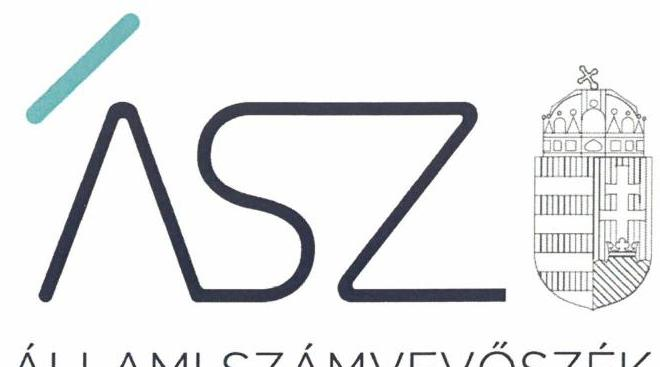
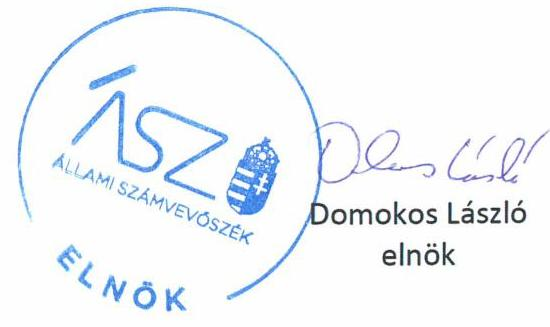
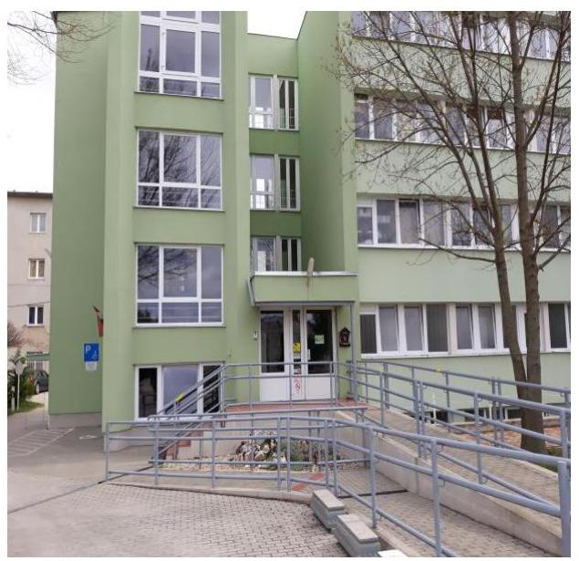

ÁLLAMI SZÁMVEVŐSZÉK

# JELENTÉS 

## Nem állami humánszolgáltatók ellenőrzése

A szociális humánszolgáltatást nyújtó intézmények, szolgáltatók államháztartáson kívüli fenntartói központi költségvetésből kapott támogatásai felhasználásának ellenőrzése PANNON MENTŐ Nonprofit Közhasznú Kft.

2020
20061
www.asz.hu

---

ÁLLAMI SZÁMVEVŐSZÉK

# JELENTÉS 

## Nem állami humánszolgáltatók ellenőrzése

A szociális humánszolgáltatást nyújtó intézmények, szolgáltatók államháztartáson kívüli fenntartói központi költségvetésből kapott támogatásai felhasználásának ellenőrzése PANNON MENTŐ Nonprofit Közhasznú Kft.
2020. 04. 30.

20061
www.asz.hu

---

# AZ ELLENŐRZÉST FELÜGYELTE: 

MAROZSÁN LÁSZLÓNÉ felügyeleti vezető

## AZ ELLENŐRZÉST VEZETTE ÉS A VÉGREHAJTÁSÁÉRT FELELŐS:

KUSZINGER ANDREA ellenőrzésvezető

## A PROGRAM ÖSSZEÁLLÍTÁSÁÉRT FELELŐS:

FEKETE-NAGY ANDRÁS ellenőrzési program készítéséért felelős vezető

TÓTPÁL SZABOLCS osztályvezető

IKTATÓSZÁM: EL-2558-001/2020.
TÉMASZÁM: 2491
ELLENŐRZÉS-AZONOSÍTÓ SZÁM: V083538, V0867069

---

# TARTALOMJEGYZÉK 

■ ÖSSZEGZÉS ..... 5
■ AZ ELLENŐRZÉS CÉLJA ..... 6
■ AZ ELLENŐRZÉS TERÜLETE ..... 7
■ AZ ELLENŐRZÉS HÁTTERE, INDOKOLTSÁGA ..... 8
■ A JELENTÉS LÉNYEGES KÉRDÉSKÖREI ..... 9
■ AZ ELLENŐRZÉS HATÓKÖRE ÉS MÓDSZEREI ..... 10
■ MEGÁLLAPÍTÁSOK ..... 12
■ MELLÉKLETEK ..... 13
I. sz. melléklet: Értelmező szótár ..... 13
■ FÜGGELÉK: ÉSZREVÉTELEK ..... 15
■ RÖVIDÍTÉSEK JEGYZÉKE ..... 17

---

.

---

# ÖSSZEGZÉS 

A kaposvári székhelyű PANNON MENTŐ Nonprofit Közhasznú Kft. szociális humánszolgáltatási közfeladat ellátására a 2015-2018. években kapott költségvetési támogatásokkal való gazdálkodása elszámoltatható és átlátható volt, a támogatásokat szabályszerűen az intézmény működtetésére fordította.

## Az ellenőrzés társadalmi indokoltsága

A szociális gondoskodást igénylők védelme, illetve a köznevelési feladatok ellátása az Alaptörvényben meghatározott, a társadalom szempontjából fontos tevékenységek. Jogszabályok teszik lehetővé, hogy államháztartáson kívüli szervezetek - így például az egyházi fenntartók, alapítványok, gazdasági társaságok, egyesületek - által fenntartott intézmények is végezzenek köznevelési, szociális és gyermekvédelmi feladatokat. Mindehhez a központi költségvetés évente jelentős összegű támogatással járul hozzá. Az államháztartáson kívüli, humánszolgáltatást végző intézmények az igényelt közpénzekből társadalmilag hasznos, közösségteremtő, közérdekű, illetve közhasznú tevékenységet végeznek, illetve közfeladatokat látnak el.

Az intézményfenntartók ellenőrzésével az Állami Számvevőszék hozzájárul ahhoz, hogy ezen közpénzeket az államháztartáson kívüli szervezetek is ellenőrizhető, átlátható és elszámoltatható módon használják fel a közfeladatok ellátása során. Az ellenőrzések célja továbbá, hogy a nyilvánosság és az igénybevevők megfelelő tájékoztatást kapjanak az államháztartáson kívüli közfeladatot ellátók működéséről.

Az ÁSZ ellenőrzései arra adnak választ, hogy az intézményfenntartók arra használták-e fel a közpénzeket, amire igényelték.

A szabályszerű gazdálkodás elengedhetetlen a közfeladat ellátás szakmai céljainak megvalósításához, valamint a társadalmi közbizalom fenntartásához.

## Főbb megállapítások, következtetések

A PANNON MENTŐ Nonprofit Közhasznú Kft. a szociális humánszolgáltatási közfeladatok ellátásának működési - és gazdálkodási környezetét kialakította, amellyel megteremtette a költségvetési támogatások szabályszerű felhasználásának feltételeit.

A PANNON MENTŐ Nonprofit Közhasznú Kft. a szociális humánszolgáltatási közfeladataihoz rendelt költségvetési támogatásokat szabályszerűen kezelte, elkülönítetten tartotta nyilván és a jogszabályi előírások szerint intézménye működtetésére fordította. A költségvetési támogatások felhasználásával a nyilvánosság előtt elszámolt.

---

# AZ ELLENŐRZÉS CÉLJA

**AZ ELLENŐRZÉS CÉLJA** annak értékelése, hogy a nem állami, nem önkormányzati szociális intézmények fenntartói központi költségvetésből kapott támogatásainak felhasználása szabályszerű volt-e.

---

# **AZ ELLENŐRZÉS TERÜLETE**

## **PANNON MENTŐ Nonprofit Közhasznú Kft.**

A kaposvári székhelyű PANNON MENTŐ Nonprofit Közhasznú Korlátolt Felelősségű Társaság 3 M Ft törzstőkével 2008. májusában alakult a PANNON MENTŐ Betegszállító és Egészségügyi Szolgáltató Közhasznú Társaság jogutódjaként. A Fenntartó2 képviseletére két fő, önálló képviseleti joggal rendelkező ügyvezető volt jogosult. A Fenntartónál 3 tagból álló Felügyelő Bizottság2 működött.

A Fenntartó közhasznú besorolással rendelkező nonprofit szervezetként látta el feladatát az ellenőrzött időszakban.

A Fenntartó feladatai ellátására önállóan gazdálkodó, önálló költségvetéssel rendelkező intézményt nem hozott létre, a szociális intézmény a Fenntartótól nem különült el, önálló szervezettel, vagyonnal nem rendelkezett. A Fenntartó főtevékenysége idősek bentlakásos ellátása, melyet szociális intézmény3 működtetésével biztosított. A Fenntartó a szociális intézmény által ellátott feladatokra vonatkozóan 150 férőhellyel működött és országos ellátási területtel rendelkezett.

A Fenntartó egyszerűsített éves beszámolójában foglaltak szerint a szociális intézmény fenntartásához a 2015. évben 85,4 M Ft, a 2016. évben 81,8 M Ft, a 2017. évben 110,7 M Ft és a 2018. évben 112,3 M Ft költségvetési támogatásban részesült.

---

# AZ ELLENŐRZÉS HÁTTERE, INDOKOLTSÁGA 

A szociális feladatokat ellátó nem állami intézményfenntartók részére közfeladataik ellátására 2015-2018. években jelentős összegű pénzügyi támogatást biztosítottak a mindenkori költségvetési törvények a bennük megfogalmazott feltételek mellett. A felhasználható állami támogatások jogszabály szerinti előirányzata a 2015-2018. években összesen 360 Mrd Ft volt.

Az ÁSZ ${ }^{4}$ a stratégiájában célul tűzte ki, hogy az államháztartáson kívülre nyújtott költségvetési támogatások ellenőrzésével hozzájárul ahhoz, hogy a közpénzeket az államháztartáson kívüli szervezetek is átlátható módon használják fel a közfeladatok szerződésben vállalt ellátása érdekében. Az ÁSZ a stratégiájában foglaltak alapján is indokolt az ellenőrzés, amely a társadalom számára jelzi, hogy a közpénz államháztartáson kívüli felhasználása sem maradhat ellenőrizetlenül. Az államháztartáson kívülre nyújtott költségvetési támogatások ellenőrzésével az ÁSZ hozzájárul ahhoz, hogy a közpénzeket a nem állami fenntartók átlátható módon használják fel a közfeladatok ellátására kötött szerződésekben vállalt kötelezettségek teljesítése érdekében. Az ÁSZ az ellenőrzés javaslataival hozzájárulhat az említett rendszerek szabályszerű támogatás-felhasználásához, javíthatja a társadalmi-gazdasági döntések megalapozottságát, amely a „jól irányított állam működésének" feltétele.

---

# A JELENTÉS LÉNYEGES KÉRDÉSKÖREI 

1. A szociális humánszolgáltató közfeladatot ellátó államháztartáson kívüli fenntartó szabályszerű működési - és gazdálkodási környezet kialakításával megteremtette-e a költségvetési támogatások átlátható, elszámoltatható igénybevételének, felhasználásának feltételeit?
2. Az államháztartáson kívüli fenntartó az átvállalt szociális humánszolgáltatási közfeladathoz biztosított költségvetési támogatásokat szabályszerűen fordította-e a humánszolgáltató intézménye működtetésére? Az intézménye működtetéséhez felhasznált közpénzekre vonatkozó gazdálkodásával a nyilvánosság előtt el-számolt-e?

---

# AZ ELLENŐRZÉS HATÓKÖRE ÉS MÓDSZEREI 

## Az ellenőrzés típusa

Megfelelőségi ellenőrzés.

## Az ellenőrzött időszak

A 2015. január 1-je és 2018. december 31-e közötti időszak. A helyszíni szemle tekintetében 2018. január 1-jétől az utolsó helyszíni szemle időpontjáig 2019. március 27-ig tartó időszak.

## Az ellenőrzés tárgya

Az ellenőrzés a szociális humánszolgáltatási közfeladatokat ellátó államháztartáson kívüli fenntartók humánszolgáltatási közfeladatai ellátásához a központi költségvetésből kapott támogatásaik humánszolgáltatási közfeladatokra való fenntartó általi felhasználása szabályszerűségének értékelésére terjedt ki.

## Az ellenőrzött szervezet

PANNON MENTŐ Nonprofit Közhasznú Kft.

## Az ellenőrzés jogalapja

Az ellenőrzés jogszabályi alapját az ÁSZ tv. 5. § (3) bekezdése, valamint az 5. § (3) bekezdésben foglalt előírások adták.

## Az ellenőrzés módszerei

Az ÁSZ az ellenőrzést az ellenőrzési program szempontjai, kérdései, az ellenőrzött időszakban hatályos jogszabályok, a nemzetközi standardokat irányadónak tekintve, az ellenőrzés szakmai szabályok és módszertanok figyelembe vételével végezte.

Az ellenőrzés ideje alatt az ellenőrzött szervezettel történő kapcsolattartást az ÁSZ SZMSZ6-ének vonatkozó előírása biztosította.

Az ellenőrzési kérdések megválaszolásához szükséges bizonyítékok megszerzése az ellenőrzött által rendelkezésre bocsátott dokumentumokra, adatokra alapozva megfigyelés, szemle (szemrevételezés), kérdésfeltevés (információkérés), valamint elemző eljárással történt.

---

Az ellenőrzési bizonyítékként felhasználható adatforrások közé tartoztak egyrészt az ellenőrzési program részletes szempontjainál felsorolt adatforrások, másrészt minden - az ellenőrzés folyamán feltárt, az ellenőrzés szempontjából információt tartalmazó - dokumentum.

Az ellenőrzés lefolytatásához az ellenőrzött szervezet a kitöltött tanúsítványok, valamint az ÁSZ által kért dokumentumok elektronikus úton való megküldésével szolgáltatott adatokat, információkat. Az így rendelkezésre bocsátott adatok, információk és a tanúsítványok adatai valódiságának kontrollja az ellenőrzés keretében történt.

Az egységes értelmezést támogatta a jelentés mellékletét képező fogalomtár és rövidítésjegyzék.

Az ÁSZ az ellenőrzést alapvetően a szociális humánszolgáltatások esetében a központi költségvetési támogatások igénylésével, módosításával, felhasználásával, elszámolásával kapcsolatos feladatokat ellátó államháztartáson kívüli fenntartóknál/szervezeteinél végezte.

A szociális humánszolgáltatások központi költségvetési támogatásaival kapcsolatos, államháztartáson kívüli fenntartó jogszabályokban előírt feladatai betartása, továbbá a központi költségvetési támogatások szabályszerű nyilvántartása került ellenőrzésre a fenntartónál rendelkezésre álló nyilvántartások, beszámolók és egyéb dokumentumok alapján. Az ellenőrzés nem terjedt ki a szociális humánszolgáltatások központi költségvetési támogatásai igénylése, módosítása, elszámolása valódiságának, megalapozottságának, helyességének - sem a fenntartónál, sem a székhely intézményeinél való - értékelésére (mivel ennek felülvizsgálata, ellenőrzése a finanszírozó jogszabályban előírt feladata, határozatai kiadása előtt). Továbbá nem terjedt ki az ellenőrzés e források, intézmények általi szabályszerű felhasználásának értékelésére.

---

# MEGÁLLAPÍTÁSOK 

## 1. A szociális humánszolgáltató közfeladatot ellátó államháztartáson kívüli fenntartó szabályszerű működési - és gazdálkodási környezet kialakításával megteremtette-e a költségvetési támogatások átlátható, elszámoltatható igénybevételének, felhasználásának feltételeit?

Összegző megállapítás

A Fenntartó a 2015-2018. években a szociális humánszolgáltatási közfeladat szabályszerű működési- és gazdálkodási környezetének kialakításával megteremtette a költségvetési támogatások szabályszerű felhasználásának feltételeit.

A Fenntartó szervezeti és működési kereteit kialakította az Alapítói okiratban7 és az SZMSZ-ben8. A Fenntartó a 2015-2018. években a Számv. tv.9-ben foglaltak szerint rendelkezett Számviteli politikával10, Leltározási szabályzattal11, Értékelési szabályzattal12, Pénz- és értékkezelési szabályzattal13, valamint Számlarenddel14. A Fenntartó gondoskodott a szociális intézmény működési kereteinek a kialakításáról.
2. Az államháztartáson kívüli fenntartó az átvállalt szociális humánszolgáltatási közfeladathoz biztosított költségvetési támogatásokat szabályszerűen fordította-e a humánszolgáltató intézménye működtetésére? Az intézménye működtetéséhez felhasznált közpénzekre vonatkozó gazdálkodásával a nyilvánosság előtt elszámolt-e?

Összegző megállapítás

A Fenntartó a 2015-2018. években a szociális humánszolgáltatási közfeladathoz biztosított költségvetési támogatásokat szociális intézménye működtetésére fordította. A Fenntartó a közpénzekre vonatkozó gazdálkodásával a nyilvánosság előtt elszámolt.

A Fenntartó a Számv. tv. előírásai szerint az intézménye működtetésére kapott központi költségvetési támogatásokat nyilvántartásaiban elkülönítetten mutatta ki.

A Fenntartó az Átr.15 előírásai szerint a támogatások felhasználását számviteli rendjében feladatonkénti bontásban, elkülönítetten kezelte. A Fenntartó a szociális feladatellátásra kapott támogatást a közfeladat céljával összhangban használta fel.

A Fenntartó a Számv. tv. előírásai szerint a 2015-2018. években beszámoló-készítési kötelezettségének eleget tett, az egyszerűsített éves beszámolókat a Számv. tv. szerinti határidőben közzétette és letétbe helyezte.

---

# MELLÉKLETEK 

- I. SZ. MELLÉKLET: ÉRTELMEZŐ SZÓTÁR
befogadás
ellátási terület
feladatfinanszírozás
humánszolgáltatás
költségvetési támogatás
nem állami, nem önkormányzati (államháztartáson kívüli) intézmény fenntartó
székhely intézmény
telephely

A Szoctv. illetve a Gyvt. szerinti, a szociális szolgáltatások és a gyermekjóléti szolgáltató tevékenységek területi lefedettségét figyelembe vevő finanszírozási rendszerbe történő befogadás.
Az a terület, ahonnan az engedélyes gyermekeket, illetve más ellátottakat fogad.
A közfeladat államháztartáson kívüli szervezet által történő ellátásához közvetlenül kapcsolódó, arányos működési költségeket finanszírozó költségvetési támogatás.
Külön törvényben meghatározott szociális, gyermekjóléti, gyermekvédelmi, közoktatási, felsőoktatási, kulturális közfeladatok (2014. évi Kvtv. 34. § (1), (4) bekezdés, 1. számú melléklet XX/20/2. alcím, 19. alcím, 2015. évi Kvtv.16 43. § (1), (4) bekezdés, 1. számú melléklet XX/20/2/3. jogcím csoport, 19. alcím, 2016. évi Kvtv. 41. § (1), (4) bekezdés, 1. számú melléklet XX/20/2/3. jogcím csoport, 19. alcím).
a társadalombiztosítás pénzügyi alapjai kivételével az államháztartás központi alrendszeréből ellenérték nélkül, pénzben nyújtott támogatások (Áht.17 1. § 14. pont) A költségvetési törvényekben (2013. évi CCXXX. törvény 33-34. §, 2014. évi C. törvény 42-43. §, 2015. évi C. törvény 40-41. §) megállapított támogatás. Például a 2015. évi C. törvény 40-41. § szerint többek között: Az Országgyűlés a szociális, gyermekjóléti, gyermekvédelmi közfeladatot ellátó intézményt, szolgáltatást fenntartó egyházi jogi személy, civil szervezet, közalapítvány, országos nemzetiségi önkormányzat, települési vagy területi nemzetiségi önkormányzat, gazdasági társaság, és a humánszolgáltatást alaptevékenységként végző, az Szja tv. hatálya alá tartozó egyéni vállalkozó (a továbbiakban együtt: nem állami szociális fenntartó) részére támogatást
 állapít meg a következők szerint: a támogatás a nem állami szociális fenntartót a települési önkormányzatok 2. melléklet III. pont 3. alpont c)-k) pontjában és III. pont 5. alpont a) pontjában meghatározott támogatásaival azonos jogcímeken, összegben és feltételek mellett illeti meg.
A szociális, gyermekjóléti és gyermekvédelmi közfeladatokat/humánszolgáltatásokat ellátó intézményt fenntartó egyházi jogi személy, társadalmi szervezet, alapítvány, közalapítvány, civil szervezet, országos nemzetiségi önkormányzat, nonprofit gazdasági társaság, gazdasági társaság és a humánszolgáltatást alaptevékenységként végző, Szja tv. hatálya alá tartozó egyéni vállalkozó. (2015. évi Kvtv. 42. §, 43. § (1), (4) bekezdés, 2016. évi Kvtv. ${ }^{18} 40 . \S, 41 . \S$ (1), (4) bekezdés, 2017. évi Kvtv. ${ }^{19} 41$. § (1), (4), 2018. évi Kvtv. ${ }^{20} 41 . \S$ (1), (4-5)),
a szolgáltató székhelye, azaz a szolgáltató központi ügyintézésének helye, függetlenül attól, hogy használják-e szolgáltatás nyújtására (Sznyvhr. 1.§ k) pont) (hatályos: 2013. december 1-től)
a szolgáltató székhelyétől különböző, szolgáltató/intézmény használatában álló hely, a szociális humánszolgáltatáshoz használt, bejegyzett hely. (Sznyvhr. 1.§ l) pont) (hatályos: 2015. január 1-től)

---

.

---

# FÜGGELÉK: ÉSZREVÉTELEK 

A jelentéstervezetet a Számvevőszék 15 napos észrevételezésre megküldte az ellenőrzött szervezet vezetőinek az ÁSZ tv. 29. § (1) bekezdése előírásának megfelelően.

A PANNON MENTŐ Nonprofit Közhasznú Kft. ügyvezetői a jelentéstervezet megállapításaira nem tettek észrevételt.

[^0]
[^0]:    * 29. § (1) Az Állami Számvevőszék az ellenőrzési megállapításait megküldi az ellenőrzött szervezet vezetőjének vagy az általa megbízott személynek, és annak, akinek személyes felelősségét állapította meg.
    (2) Az ellenőrzött szervezet vezetője és a felelősként megjelölt személy az ellenőrzés megállapításaira tizenöt napon belül írásban észrevételt tehet.
    (3) Az Állami Számvevőszék az észrevételre a beérkezésétől számított harminc napon belül írásban válaszol. A figyelembe nem vett észrevételeket köteles a jelentésben feltüntetni, és megindokolni, hogy azokat miért nem fogadta el.

---

.

---

# RÖVIDÍTÉSEK JEGYZÉKE 

${ }^{1}$ Fenntartó
${ }^{2}$ Felügyelő Bizottság
${ }^{3}$ intézmény
${ }^{4}$ ÁSZ
${ }^{5}$ ÁSZ tv.
${ }^{6}$ ÁSZ SZMSZ
${ }^{7}$ Alapító okirat
${ }^{8}$ SZMSZ
${ }^{9}$ Számv. tv.
${ }^{10}$ Számviteli politika
${ }^{11}$ Leltározási szabályzat
${ }^{12}$ Értékelési szabályzat
${ }^{13}$ Pénz -és értékkezelési szabályzat
${ }^{14}$ Számlarend
${ }^{15} \mathrm{Atr}$.
${ }^{16}$ 2015. évi Kvtv.
${ }^{17}$ Áht.
${ }^{18}$ 2016. évi Kvtv.
${ }^{19}$ 2017. évi Kvtv.
${ }^{20}$ 2018. évi Kvtv.

PANNON MENTŐ Nonprofit Közhasznú Kft.
PANNON MENTŐ Nonprofit Közhasznú Kft. Felügyelő Bizottsága
PANNON MENTŐ Idősek Otthona (7400 Kaposvár, Füredi út 53.)
Állami Számvevőszék
2011. évi LXVI. törvény az Állami Számvevőszékről

Az Állami Számvevőszék elnökének 3/2019. (XII. 23.) ÁSZ utasítása az Állami Számvevőszék Szervezeti és Működési Szabályzatáról (hatályos 2020. január 1-jétől),
Alapító okirat1: PANNON MENTŐ Nonprofit Közhasznú Kft. egységes szerkezetbe foglalt alapító okirata (hatályos: 2018. március 27-től 2018. június 14-ig)
Alapító okirat2: PANNON MENTŐ Nonprofit Közhasznú Kft. egységes szerkezetbe foglalt alapító okirata (hatályos: 2018. június 15-től)
SZMSZ1: PANNON MENTŐ Nonprofit Közhasznú Kft. szervezeti és működési szabályzata (hatályos: 2017. január 1-jétől 2018. november 4-ig)
SZMSZ2: PANNON MENTŐ Nonprofit Közhasznú Kft. szervezeti és működési szabályzata (hatályos: 2018. november 5-től)
2000. évi C. törvény a számvitelről (hatályos: 2001. január 1-jétől)

Számviteli Politika1: PANNON MENTŐ Nonprofit Közhasznú Kft. Számviteli Politikája (hatályos: 2015. január 1-jétől 2018. február 28-ig)
Számviteli politika2: PANNON MENTŐ Nonprofit Közhasznú Kft. Számviteli Politikája (hatályos: 2018. március 1-jétől)
PANNON MENTŐ Nonprofit Közhasznú Kft. Leltározási szabályzata (hatályos: 2013. január 1-jétől)

PANNON MENTŐ Nonprofit Közhasznú Kft. Értékelési szabályzata (hatályos: 2014. január 1-jétől)
PANNON MENTŐ Nonprofit Közhasznú Kft. Pénz-és értékkezelési szabályzata (hatályos: 2014. január 1-jétől)
Számlarend:: PANNON MENTŐ Nonprofit Közhasznú Kft. Számlarendje (hatályos: 2015. január 1-től 2018. február 28-ig)

Számlarend:: PANNON MENTŐ Nonprofit Közhasznú Kft. Számlarendje (hatályos: 2018. március 1-jétől)
489/2013. (XII.18.) Korm. rendelet az egyházi és nem állami fenntartású szociális, gyermekjóléti és gyermekvédelmi szolgáltatók, intézmények és hálózatok állami támogatásáról (hatályos: 2014. január 1-jétől)
2014. évi C. törvény Magyarország 2015. évi központi költségvetéséről (hatályos: 2015. január 1-jétől)
2011. évi CXCV. törvény az államháztartásról (hatályos: 2012. január 1-jétől)
2015. évi C. törvény Magyarország 2016. évi központi költségvetéséről (hatályos: 2015. július 4-től)
2016. évi XC. törvény Magyarország 2017. évi központi költségvetéséről (hatályos: 2016. november 1-jétől)
2017. évi C. törvény Magyarország 2018. évi központi költségvetéséről (hatályos: 2017. november 1-jétől)

---

# ÁSZ 

ÁLLAMI SZÁMVEVŐSZÉK
1052 Budapest, Apáczai Cs. J. u. 10. I 1364 Budapest 4. Pf. 54 TEL: +36 14849100
email: szamvevoszek@asz.hu
web: www.asz.hu | www.aszhirportal.hu

