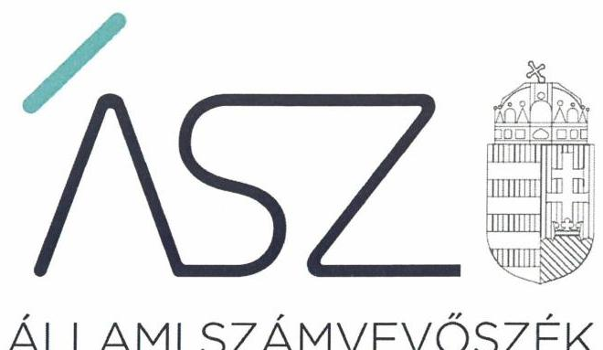
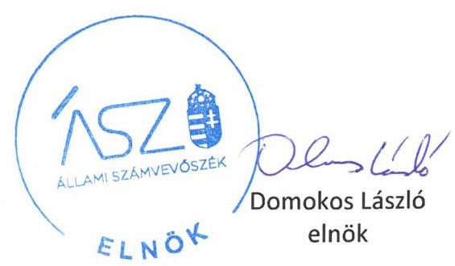

ÁLLAMI SZÁMVEVŐSZÉK

# JELENTÉS 

## Nem állami humánszolgáltatók ellenőrzése

A köznevelési és szociális humánszolgáltatást nyújtó intézmények, szolgáltatók államháztartáson kívüli fenntartói központi költségvetésből kapott támogatásai felhasználásának ellenőrzése -
Kolping Oktatási és Szociális Intézményfenntartó Szervezet
2020.

20062
www.asz.hu

---

ÁLLAMI SZÁMVEVŐSZÉK

# JELENTÉS 

## Nem állami humánszolgáltatók ellenőrzése

A köznevelési és szociális humánszolgáltatást nyújtó intézmények, szolgáltatók államháztartáson kívüli fenntartói központi költségvetésből kapott támogatásai felhasználásának ellenőrzése -
Kolping Oktatási és Szociális Intézményfenntartó Szervezet
2020. 04. hó 30 nap

20062
www.asz.hu

---

# AZ ELLENŐRZÉST FELÜGYELTE: 

KAKAS SÁNDOR felügyeleti vezető
TÓTH MARIANNA felügyeleti vezető

AZ ELLENŐRZÉST VEZETTE ÉS A VÉGREHAJTÁSÁÉRT FELELŐS:
VERTKOVCZI MÁRIA ellenőrzésvezető

A PROGRAM ÖSSZEÁLLÍTÁSÁÉRT FELELŐS:
FEKETE-NAGY ANDRÁS GÁBOR ellenőrzési program készítéséért felelős vezető

TÓTPÁL SZABOLCS osztályvezető

Jelentéseink az Országgyúlés számítógépes hálózatán és az interneten a www.asz.hu címen is olvashatóak.

IKTATÓSZÁM: EL-2560-001/2020.
TÉMASZÁM: 2491
ELLENŐRZÉS-AZONOSÍTÓ SZÁM: V083560, V0867076

---

# TARTALOMJEGYZÉK 

■ ÖSSZEGZÉS ..... 5
■ AZ ELLENŐRZÉS CÉLJA ..... 6
■ AZ ELLENŐRZÉS TERÜLETE ..... 7
■ AZ ELLENŐRZÉS HÁTTERE, INDOKOLTSÁGA ..... 8
■ A JELENTÉS LÉNYEGES KÉRDÉSKÖREI ..... 9
■ AZ ELLENŐRZÉS HATÓKÖRE ÉS MÓDSZEREI ..... 10
■ MEGÁLLAPÍTÁSOK ..... 12
■ MELLÉKLETEK ..... 15
I. sz. melléklet: Értelmező szótár ..... 15
■ FÜGGELÉK: ÉSZREVÉTELEK ..... 17
■ RÖVIDÍTÉSEK JEGYZÉKE ..... 19

---

.

---

# ÖSSZEGZÉS 

A Kolping Oktatási és Szociális Intézményfenntartó Szervezet humánszolgáltatás közfeladatokat ellátó intézményei müködtetéséhez felhasznált közpénzekre vonatkozó gazdálkodása elszámoltatható és átlátható volt.

## Az ellenőrzés társadalmi indokoltsága

A szociális gondoskodást igénylők védelme, illetve a köznevelési feladatok ellátása az Alaptörvényben meghatározott, a társadalom szempontjából fontos tevékenységek. Jogszabályok teszik lehetővé, hogy államháztartáson kívüli szervezetek - így például az egyházi fenntartók, alapítványok, gazdasági társaságok, egyesületek - által fenntartott intézmények is végezzenek köznevelési, szociális és gyermekvédelmi feladatokat. Mindehhez a központi költségvetés évente jelentős összegű támogatással járul hozzá. Az államháztartáson kívüli, humánszolgáltatást végző intézmények az igényelt közpénzekből társadalmilag hasznos, közösségteremtő, közérdekű, illetve közhasznú tevékenységet végeznek, illetve közfeladatokat látnak el.

Az intézményfenntartók ellenőrzésével az Állami Számvevőszék hozzájárul ahhoz, hogy ezen közpénzeket az államháztartáson kívüli szervezetek is ellenőrizhető, átlátható és elszámoltatható módon használják fel a közfeladatok ellátása során. Az ellenőrzések célja továbbá, hogy a nyilvánosság és az igénybevevők megfelelő tájékoztatást kapjanak az államháztartáson kívüli közfeladatot ellátók múködéséről.

Az ÁSZ ellenőrzései arra adnak választ, hogy az intézményfenntartók arra használták-e fel a közpénzeket, amire igényelték.

A szabályszerű gazdálkodás elengedhetetlen a közfeladat ellátás szakmai céljainak megvalósításához, valamint a társadalmi közbizalom fenntartásához.

## Főbb megállapítások, következtetések

A Kolping Oktatási és Szociális Intézményfenntartó Szervezet a 2015-2018. években a jogszabályokban előírt szabályozási környezetét kialakította, ezáltal biztosította a szabályszerű múködésének és gazdálkodásának feltételeit.

A 2015-2018. években a szociális, a 2018. évben a köznevelési humánszolgáltatási közfeladatot ellátó intézményei múködtetéséhez kapott költségvetési támogatásokat szabályszerűen, elkülönítve tartotta nyilván, ezáltal gondoskodott a támogatások elszámoltathatóságáról. A költségvetési támogatásokat a jogszabályokban foglaltakkal összhangban átadta az intézményei részére, ezzel biztosította a múködésük pénzügyi feltételeit. A Fenntartó gondoskodott a humánszolgáltatási közfeladatot végző intézményei szabályszerű gazdálkodásáról, múködéséről, ezzel biztosította a költségvetési támogatások szabályszerű és átlátható elszámolását.

---

# AZ ELLENŐRZÉS CÉLJA

**AZ ELLENŐRZÉS CÉLJA** annak értékelése volt, hogy a nem állami, nem önkormányzati köznevelési és szociális intézmények fenntartói központi költségvetésből kapott támogatásainak felhasználása szabályszerű volt-e.

---

# **Kolping Oktatási és Szociális Intézményfenntartó Szervezet**

A Kolping Oktatási és Szociális Intézményfenntartó Szervezetet 2007. évben alapította a Magyar Katolikus Püspöki Konferencia azzal a céllal, hogy oktatási és szociális intézményekkel kapcsolatos fenntartói jogokat gyakoroljon.

A Fenntartó1 belső egyházi jogi személy, amelyre a katolikus egyházjog hivatalos egyházi társulásokra vonatkozó előírásai érvényesek. A Magyar Katolikus Püspöki Kar nevezi ki a Fenntartó vezetőjét (igazgató) és felügyeli a tevékenységét. Az ellenőrzött időszakban a Fenntartó igazgatójának a személye a 2016. április 12-étől változott.

A Fenntartónak 2018. év elején 22 db szociális humánszolgáltatási közfeladatot végző, önálló jogi személy székhely intézménye2 volt. Az intézmények a 2015-2018. években Magyarország több megyéjében nyújtottak szociális és gyermekjóléti alapszolgáltatásokat, szociális és gyermekvédelmi személyes gondozást és szakosított ellátást. Ezen belül szociális étkeztetéssel, támogató szolgáltatásokkal, házi segítségnyújtással, jelzőrendszeres házi segítségnyújtással, falugondnoki és tanyagondnoki szolgáltatással, időskorúak nappali intézményének működtetésével, demens, fogyatékos személyek, pszichiátriai és szenvedélybetegek nappali ellátásával, gyermekek napközbeni ellátásával, bentlakásos intézményi ellátással kapcsolatos közfeladatokat láttak el.

A 2018. évben a Fenntartó 14 db önálló jogi személy intézménye3 és azoknak további 25 tagintézménye, illetve telephelye végzett köznevelési tevékenységet. A köznevelési humánszolgáltatási tevékenységen belül gimnáziumot, szakgimnáziumot, szakközépiskolát, szakiskolát, alapfokú művészeti iskolát, általános iskolát, kollégiumot, óvodát, és köznevelési célú sportiskolát is működtetett a Fenntartó.

A Fenntartó szociális alapszolgáltatási feladatokra, szociális szakosított ellátásra és gyermekjóléti alapellátásokra Magyarország éves költségvetéséből támogatási határozatok és finanszírozási szerződések alapján 2015. évben 967 millió Ft, a 2016. évben 1097 millió Ft, a 2017. évben 1368 millió Ft 2018. évben 1673 millió Ft összegű támogatást, a köznevelési feladatokra a 2018. évben 1643 millió Ft összegű támogatást kapott.

---

# AZ ELLENŐRZÉS HÁTTERE, INDOKOLTSÁGA 

A köznevelési és szociális feladatokat ellátó nem állami intézményfenntartók részére közfeladataik ellátására évente jelentős összegű pénzügyi támogatást biztosítottak a mindenkori költségvetési törvények a bennük megfogalmazott feltételek mellett. A felhasználható állami támogatások a Kvtv.1-4-ben ${ }^{4}$ a 2015-2018. években a szociális ágazatra vonatkozóan 360 Mrd Ft, 2018. évben a köznevelési ágazatra 203 Mrd Ft előirányzatot határoztak meg.

Mindkét területen új feladatfinanszírozási forma (átlagbéralapú támogatás) jelent meg, amely az államháztartáson kívüli intézményfenntartókra is vonatkozik. Az ellenőrzés a finanszírozási rendszerben 2011-2015 között bekövetkezett változásokra, azok közfeladat ellátásra gyakorolt hatására fókuszál a költségvetési támogatásokat felhasználó államháztartáson kívüli szervezetek körében. Az ellenőrzések indokoltságát az is alátámasztja, hogy az ÁSZ számos szervezetet még nem ellenőrzött ezen a területen.

Az ÁSZ ${ }^{5}$ stratégiájában foglaltak alapján is indokolt az ellenőrzés, amely a társadalom számára jelzi, hogy a közpénz államháztartáson kívüli felhasználása sem maradhat ellenőrizetlenül. Az államháztartáson kívülre nyújtott költségvetési támogatások ellenőrzésével az ÁSZ hozzájárul ahhoz, hogy a közpénzeket a nem állami humán fenntartók átlátható módon használják fel a közfeladatok ellátására kötött szerződésekben vállalt kötelezettségek teljesítése érdekében. Az ellenőrzés javaslataival hozzájárulhat az említett rendszerek szabályszerű támogatás felhasználásához, javíthatja a társa-dalmi-gazdasági döntések megalapozottságát, amely a „jól irányított állam" múködéséhez járul hozzá.

A holisztikus megközelítés jegyében az ellenőrzés keretében egyedi kockázatelemzés alapján kiválasztott fenntartóknál és intézményeiknél értékeli az ÁSZ az államháztartáson kívüli szociális tevékenységhez kapcsolódó támogatások felhasználásának megfelelőségét.

---

# A JELENTÉS LÉNYEGES KÉRDÉSKÖREI 

1. A humánszolgáltató közfeladatot ellátó fenntartó szabályszerű müködési- és gazdálkodási környezet kialakításával megterem-tette-e a költségvetési támogatások átlátható, elszámoltatható igénybevételének, felhasználásának feltételeit?
2. Az államháztartáson kívüli fenntartó az átvállalt humánszolgáltatási közfeladathoz biztositott költségvetési támogatásokat szabályszerűen fordította-e a humánszolgáltató intézményei müködtetésére, a közpénzekkel való gazdálkodásával elszámolt-e?

---

# AZ ELLENŐRZÉS HATÓKÖRE ÉS MÓDSZEREI 

## Az ellenőrzés típusa

Megfelelőségi ellenőrzés.

## Az ellenőrzött időszak

A szociális humánszolgáltatási közfeladatok tekintetében 2015. január 1-je és 2018. december 31-e közötti időszak A helyszíni szemle tekintetében 2018. január 1-jétől az utolsó helyszíni szemle időpontjáig, 2019. augusztus 8 -áig tartó időszak. A köznevelési humánszolgáltatási közfeladatok tekintetében 2018. január 1-je és 2018. december 31-e közötti időszak.

## Az ellenőrzés tárgya

Az ellenőrzés a köznevelési és szociális humánszolgáltatási közfeladatokat ellátó államháztartáson kívüli fenntartók humánszolgáltatási közfeladatai ellátásához a központi költségvetésből kapott támogatásaik humánszolgáltatási közfeladatokra való fenntartó általi felhasználása szabályszerűségének értékelésére terjedt ki.

## Az ellenőrzött szervezet

- Kolping Oktatási és Szociális Intézményfenntartó Szervezet

## Az ellenőrzés jogalapja

Az ellenőrzés jogszabályi alapját az ÁSZ tv. 1. § (3) bekezdése, 5. § (3) bekezdés, valamint az 5. § (11) bekezdés c) pontjában foglalt előírások adják.

## Az ellenőrzés módszerei

Az ellenőrzést az ellenőrzési program szempontjai, kérdései, az ellenőrzött időszakban hatályos jogszabályok, a nemzetközi standardokat irányadónak tekintve, az ellenőrzés szakmai szabályok és módszertanok figyelembe vételével végezte az ÁSZ.

Az ellenőrzés ideje alatt az ellenőrzött szervezettel történő kapcsolattartást az ÁSZ SZMSZ ${ }^{\circledR}$-ének vonatkozó előírásai alapján biztosította az ÁSZ.

---

Az ellenőrzési kérdések megválaszolásához szükséges bizonyítékok megszerzése az ellenőrzött által rendelkezésre bocsátott dokumentumokra, adatokra alapozva megfigyelés, szemle (szemrevételezés), kérdésfeltevés (információkérés), valamint elemző eljárással történt.

Az ellenőrzési bizonyítékként felhasználható adatforrások közé tartoztak egyrészt az ellenőrzési program részletes szempontjainál felsorolt adatforrások, másrészt minden - az ellenőrzés folyamán feltárt, az ellenőrzés szempontjából információt tartalmazó - dokumentum.

Az ellenőrzés lefolytatásához az ellenőrzött szervezet a kitöltött tanúsítványok, valamint az ÁSZ által kért dokumentumok elektronikus úton való megküldésével szolgáltatott adatokat, információkat. Az így rendelkezésre bocsátott adatok, információk és a tanúsítványok adatai valódiságának kontrollja az ellenőrzés keretében történt.

Az egységes értelmezést támogatja a program mellékletét képező fogalomtár és rövidítésjegyzék.

Az ÁSZ az ellenőrzést a szociális humánszolgáltatások esetében a központi költségvetési támogatások igénylésével, módosításával, felhasználásával, elszámolásával kapcsolatos feladatokat ellátó államháztartáson kívüli fenntartóknál/szervezeteinél végezte. Az ÁSZ a fenntartott intézményeknél helyszíni szemle keretében győződött meg a tényleges feladatellátásról (verifikáció).

A humánszolgáltatások központi költségvetési támogatásai igénylésével, módosításával, elszámolásával kapcsolatos, államháztartáson kívüli fenntartó jogszabályokban előírt feladatai betartását, továbbá a központi költségvetési támogatások szabályszerű kezelését, nyilvántartását ellenőrizte az ÁSZ a fenntartónál, az ott rendelkezésre álló határozatok, nyilvántartások, beszámolók és egyéb dokumentumok alapján. Az ellenőrzés nem terjedt ki a humánszolgáltatások központi költségvetési támogatásai igénylése, módosítása, elszámolása valódiságának, megalapozottságának, helyességének - sem a fenntartónál, sem a székhely intézményeinél való értékelésére (mivel ennek felülvizsgálata, ellenőrzése a finanszírozó jogszabályban előírt feladata, határozatai kiadása előtt). Továbbá nem terjedt ki az ellenőrzés e források, intézmények általi szabályszerű felhasználásának értékelésére.

---

# MEGÁLLAPÍTÁSOK 

## 1. A humánszolgáltató közfeladatot ellátó fenntartó szabályszerű múködési- és gazdálkodási környezet kialakításával megterem-tette-e a költségvetési támogatások átlátható, elszámoltatható igénybevételének, felhasználásának feltételeit?

Összegző megállapítás A Fenntartó a múködési- és gazdálkodási környezetét szabályszerűen kialakította.

A jogszabályban előírtak szerint a Fenntartó rendelkezett Alapító Okirattal ${ }^{7}$. A Fenntartó az előírtak alapján rendelkezett a szervezet felépítését, múködésének rendjét, a felelősségi hatásköröket tartalmazó SZMSZ ${ }_{1-2}$-el ${ }^{8}$.

A Fenntartó a Számviteli politikáját ${ }_{1-3}{ }^{9}$ és annak keretében az Eszközök és források leltárkészítési és leltározási szabályzatát ${ }_{1-3}{ }^{10}$, Pénzkezelési szabályzatát ${ }_{1-3}{ }^{11}$, Eszközök és források értékelési szabályzatát ${ }_{1-3}{ }^{12}$, továbbá Számlarendjét ${ }_{1-2}{ }^{13}$ a jogszabályban előírtak szerint elkészítette.

A Fenntartó a 2015-2018. évekre vonatkozóan a költségvetési támogatások és azok célszerinti felhasználásának elkülönített nyilvántartási szabályait, továbbá az egyházi kiegészítő támogatás elkülönített nyilvántartására vonatkozó szabályokat meghatározta, a kapcsolódó nyilvántartásokat a jogszabályokban foglalt előírásokkal összhangban kialakította.

A Fenntartó a 2018. évre vonatkozóan az előírásokkal összhangban kialakította a köznevelési feladatokra kapott támogatások elkülönítésének és cél szerinti felhasználás nyilvántartásának szabályait.

A költségvetési támogatások igénylési, módosítási és elszámolási feladatait a Fenntartó 2015-2017. években a MÁK ${ }^{14}$ felé szabályszerűen látta el.

## 2. Az államháztartáson kívüli fenntartó az átvállalt humánszolgáltatási közfeladathoz biztosított költségvetési támogatásokat szabályszerűen fordította-e a humánszolgáltató intézményei múködtetésére, a közpénzekkel való gazdálkodásával elszá-molt-e?

Összegző megállapítás A Fenntartó az átvállalt humánszolgáltatási közfeladathoz biztosított költségvetési támogatásokat szabályszerűen fordította az intézményei múködtetésére, a közpénzekre vonatkozó gazdálkodásával elszámolt.

A Fenntartó a humánszolgáltatási közfeladatokat ellátó intézményei tekintetében gondoskodott az előírtak szerinti alapító okiratokról.

---

A 2015-2018. években a szociális feladatokat ellátó intézmények rendelkeztek működési engedéllyel. A Fenntartó az előírtakkal összhangban gondoskodott az intézmények alapfeladatait és működési kereteit magában foglaló szabályzatok elkészítéséről, a szabályszerű működés feltételeinek biztosításáról.

A 2018. évben a köznevelési feladatokat ellátó intézmények rendelkeztek működési engedéllyel. A jogszabályban foglaltak alapján a Fenntartó gondoskodott a köznevelési intézmények működési kereteit magában foglaló szabályzatok elkészítéséről.

A Fenntartó az előírtakkal összhangban költségvetési támogatás átadási kötelezettségének eleget tett, mivel a költségvetési támogatásokat teljes összegben és határidőben az intézményei részére átadta, ezáltal biztosította múködésük pénzügyi feltételeit.

A Fenntartó a 2015-2018. években a szociális humánszolgáltatási közfeladathoz biztosított költségvetési támogatásokat a jogszabályokban foglaltak alapján támogatásonként, feladatonként és feladat-ellátási helyenként elkülönítetten, napra készen tartotta nyilván.

A köznevelési közfeladatra kapott támogatásokat a 2018. évben a jogszabályokban foglaltak alapján a Fenntartó alapfeladatonként, feladat-ellátási helyenként elkülönítetten, napra készen tartotta nyilván, biztosította, hogy azok milyen célra lettek felhasználva.

A Fenntartó gondoskodott a köznevelési és szociális feladatokat ellátó intézményei szabályszerű könyvvezetési és beszámoló-készítési kötelezettségéről. A Fenntartó az előírtak szerint végzett ellenőrzésekkel kapcsolatos intézkedési feladatait ellátta.

---

.

---

# MELLÉKLETEK 

- I. SZ. MELLÉKLET: ÉRTELMEZŐ SZÓTÁR
bevett egyház
egyházi fenntartó
humánszolgáltatás
költségvetési támogatás
köznevelési közfeladat
Az Ehtv. 6. § (1-2) bekezdései szerint az Országgyűlés által elismert egyház bevett egyház. Vallási közösség az Országgyűlés által elismert egyház és a vallási tevékenységet végző szervezet lehet. A vallási közösség elsődlegesen vallási tevékenység céljából jön létre és működik. Az Ehtv. 7. §-a szerint a vallási közösség az egyház megjelölést elnevezésében és tevékenységére való utalás során önmeghatározása céljából - a saját hitelvei szerinti tartalommal - használhatja.
Az Ehtv. 33. §-a alapján az Ehtv. mellékletében felsorolt egyházak és az általuk meghatározott, az egyház belső egyházi szabálya szerint jogi személyiséggel rendelkező szervezetek - a nyilvántartásba vételük dátumától függetlenül - 2012. január 1-jétől minősülnek egyházi fenntartóknak. Az Ehtv. 14. §-ában meghatározott eljárás folyamán az Országgyűlés által egyháznak elismert szervezet a törvénynek az egyház bejegyzésére vonatkozó módosítása hatálybalépésének napjától minősül egyháznak (Ehtv. 15. §). A 2010. évi CXL. törvény* 5. Cikk Pénzügyi támogató intézkedések 1. pontja alapján 2011. január 1-jétől jogosult a Magyar Máltai Szeretetszolgálat Egyesület az egyházi kiegészítő támogatásra.
Külön törvényben meghatározott szociális, gyermekjóléti, gyermekvédelmi, közoktatási, felsőoktatási, kulturális közfeladatok (2015. évi Kvtv. 43. § (1), (4) bekezdés, 1. számú melléklet XX/20/2/3. jogcím csoport, 19. alcím, 2016. évi Kvtv. 41. § (1), (4) bekezdés, 1. számú melléklet XX/20/2/3. jogcím csoport, 19. alcím, 2017. évi Kvtv. 41. § (1), (4) bekezdés, 1. számú melléklet XX/20/2/3. jogcím csoport, 19. alcím)
A társadalombiztosítás pénzügyi alapjai kivételével az államháztartás központi alrendszeréből ellenérték nélkül, pénzben nyújtott támogatások (Áht. ${ }^{15} 1 . \S 14$. pont).
A költségvetési törvényekben (2013. évi CCXXX. törvény 33-34. §, 2014. évi C. törvény 42-43. §, 2015. évi C. törvény 40-41. §) megállapított támogatás. Például a 2015. évi C. törvény 40-41. § szerint többek között: Az Országgyűlés a szociális, gyermekjóléti, gyermekvédelmi közfeladatot ellátó intézményt, szolgáltatást fenntartó egyházi jogi személy, civil szervezet, közalapítvány, országos nemzetiségi önkormányzat, települési vagy területi nemzetiségi önkormányzat, gazdasági társaság, és a humánszolgáltatást alaptevékenységként végző, az Szja tv. hatálya alá tartozó egyéni vállalkozó (a továbbiakban együtt: nem állami szociális fenntartó) részére támogatást állapít meg a következők szerint: a támogatás a nem állami szociális fenntartót a települési önkormányzatok 2. melléklet III. pont 3. alpont c)-k) pontjában és III. pont 5. alpont a) pontjában meghatározott támogatásaival azonos jogcímeken, összegben és feltételek mellett illeti meg.
A köznevelési intézmény alapító okiratában foglalt feladat: óvodai nevelés, nemzetiséghez tartozók óvodai nevelése, általános iskolai nevelés-oktatás, nemzetiséghez tartozók általános iskolai nevelése-oktatása, kollégiumi ellátás, nemzetiségi kollégiumi ellátás, gimnáziumi nevelés-oktatás, szakközépiskolai nevelés-oktatás, szakiskolai nevelés-oktatás, nemzetiség gimnáziumi nevelés-oktatása, nemzetiség szakközépiskolai nevelés-oktatása, nemzetiség szakiskolai nevelés-oktatása, köznevelési Hidprogramok keretében folyó nevelés-oktatás, felnőttoktatás, alapfokú művészetoktatás, fejlesztő nevelés, fejlesztő nevelés-oktatás, pedagógiai szakszolgálati feladat, a többi gyermekkel, tanulóval együtt nevelhető, oktatható sajátos nevelési igényű gyermekek, tanulók óvodai nevelése

[^0]
[^0]:    * a Magyar Köztársaság Kormánya és a Szuverén Jeruzsálemi, Rodoszi és Máltai Szent János Katonai és Ispotályos Rend közötti Együttműködési Megállapodás kihirdetéséről szóló 2010. évi CXL. törvény

---

# Mellékletek 

és iskolai nevelése-oktatása, azoknak a sajátos nevelési igényű gyermekeknek, tanulóknak az óvodai, iskolai, kollégiumi ellátása, akik a többi gyermekkel, tanulóval nem foglalkoztathatók együtt, a gyermekgyógyüdülőkben, egészségügyi intézményekben, rehabilitációs intézményekben tartós gyógykezelés alatt álló gyermekek tankötelezettségének teljesítéséhez szükséges oktatás, pedagógiai-szakmai szolgáltatás.
köznevelési intézmény
nem állami, nem önkormányzati (államháztartáson kívüli) intézmény fenntartó
székhely intézmény
telephely
A nevelési- oktatási intézmény, pedagógiai szakszolgálati intézmény, pedagógiai-szakmai szolgáltatást nyújtó intézmény.
A szociális, gyermekjóléti és gyermekvédelmi közfeladatokat /humánszolgáltatásokat ellátó intézményt fenntartó egyházi jogi személy, társadalmi szervezet, alapítvány, közalapítvány, civil szervezet, országos nemzetiségi önkormányzat, nonprofit gazdasági társaság, gazdasági társaság és a humánszolgáltatást alaptevékenységként végző, Szja tv. hatálya alá tartozó egyéni vállalkozó. (2013. évi Kvtv. 35. § (1), (3) bekezdés, 2014. évi Kvtv. 33. §, 34. § (1), (4) bekezdés, 2015. évi Kvtv. 42. §, 43. § (1), (4) bekezdés, 2016. évi Kvtv. 40. §, 41. § (1), (4) bekezdés, 2017. évi Kvtv. 41. § (1), (4))
a szolgáltató székhelye, azaz a szolgáltató központi ügyintézésének helye, függetlenül attól, hogy használják-e szolgáltatás nyújtására (Sznyvhr. 1.§ k) pont) (hatályos: 2013. december 1-től)
a szolgáltató székhelyétől különböző, szolgáltató/intézmény használatában álló hely, a szociális humánszolgáltatáshoz használt, bejegyzett hely. (Sznyvhr. 1.§ I) pont) (hatályos: 2015. január 1-től)

---

# FÜGGELÉK: ÉSZREVÉTELEK 

A jelentéstervezetet a Számvevőszék 15 napos észrevételezésre megküldte az ellenőrzött szervezet vezetőjének az ÁSZ tv. 29. §* (1) bekezdése előírásának megfelelően.

A Kolping Oktatási és Szociális Intézményfenntartó Szervezet igazgatója a jelentéstervezet megállapításaira nem tett észrevételt.

[^0]
[^0]:    * 29. § (1) Az Állami Számvevőszék az ellenőrzési megállapításait megküldi az ellenőrzött szervezet vezetőjének vagy az általa megbízott személynek, és annak, akinek személyes felelősségét állapította meg.
    (2) Az ellenőrzött szervezet vezetője és a felelősként megjelölt személy az ellenőrzés megállapításaira tizenöt napon belül írásban észrevételt tehet.
    (3) Az Állami Számvevőszék az észrevételre a beérkezésétől számított harminc napon belül írásban válaszol. A figyelembe nem vett észrevételeket köteles a jelentésben feltüntetni, és megindokolni, hogy azokat miért nem fogadta el.

---

.

---

# RÖVIDÍTÉSEK JEGYZÉKE 

${ }^{1}$ Fenntartó
${ }^{2}$ Szociális székhely intézmény1-22

Kolping Oktatási és Szociális Intézményfenntartó Szervezet
intézmény1 Kolping Támogató Szolgálat - Bp.-Óbuda
Intézmény2: Kolping Támogató Szolgálat - Érsekvadkert
Intézmény3 Kolping Támogató Szolgálat - Gyula
Intézmény4 Kolping Támogató Szolgálat - Kaposvár
Intézmény5 Kolping Támogató Szolgálat - Keszthely
Intézmény6 Kolping Támogató Szolgálat - Letenye
Intézmény7 Kolping Támogató Szolgálat - Pécs
Intézmény8 Kolping Támogató Szolgálat - Sárvár
Intézmény9 Kolping Támogató Szolgálat - Siklós
Intézmény10 Kolping Támogató Szolgálat - Szekszárd
Intézmény11 Kolping Támogató Szolgálat - Szigetvár
Intézmény12 Kolping Támogató Szolgálat - Vecsés
Intézmény13 Kolping Támogató Szolgálat - Zalaegerszeg
Intézmény14 Kolping Támogató Szolgálat - Zalaszentgrót
Intézmény15 Kolping Házi Segítségnyújtó Szolgálat - Hosszúpályi
Intézmény16 Kolping Támogató és Foglalkoztatási Központ - Lenti (FONI)
Intézmény17 Kolping Otthon - Túrje
Intézmény18 Kolping Idősek Ápoló-Gondozó Otthona - Letenye
Intézmény19 Kolping Gondozási Központ - Lenti és kistérsége
Intézmény20 Kolping Alapszolgáltatási Központ és Támogató Szolgálat Felsőbácskai Kisrégió

Intézmény21 Vakok Batthyány László Római Katolikus Gyermekotthona, Óvoda, Általános Iskola

Intézmény22 KOSZISZ Timaffy Endre Általános Iskola, Tündérkert Óvoda és Bölcsőde
intézmény1 Chiovini Ferenc Kolping Katolikus Általános Iskola és AMI intézmény2 Budapesti Kolping Katolikus Általános Iskola, Gimnázium és Sportgimnázium
intézmény3 Kolping Nagyváthy János Gimnázium, szakkigmnázium és Szakközépiskola
intézmény4 Esztergomi Kolping katolikus Középiskola
intézmény5 Gyöngyösi Kolping Katolikus Szakközépiskola és Kollégium intézmény6 Nagykőrösi Kolping katolikus Általános Iskola

---

|  | intézmény7   Iskola | Pétfürdői Kolping Katolikus Szakközépiskola, Szakiskola, Általános |
| :--: | :--: | :--: |
|  | intézménys | Koszisz Királyfalvi Miklós Katolikus Általános Iskola és Óvoda |
|  | intézmény9 | Szászbereki Kolping Katolikus Általános Iskola |
|  | intézmény10 | Koszisz Szent István Gimnázium és Szakgimnázium |
|  | intézmény11 | Nagybajomi Kolping Katolikus Szakközépiskola és Kollégium |
|  | intézmény12 | Szekszárdi Kolping Katolikus Szakképző Iskola, Gimnázium és Alapfokú Művészeti Iskola |
|  | intézmény13 | Vakok Batthyány László Római Katolikus Gyermekotthona, Óvoda, Általános Iskola |
|  | intézmény14 | Timaffy Endre Általános Iskola, Tündérkert Óvoda és Bölcsőde |
| ${ }^{4} \mathrm{Kvtv}_{1-4}$ |  | 12014. évi C. törvény. Magyarország 2015. évi központi költségvetéséről (hatályos: 2015. január 1-jétől) |
|  |  | 2 2015. évi C. törvény Magyarország 2016. évi központi költségvetéséről (hatályos: 2016. január 1-jétől) |
|  |  | 3 2016. évi XC. törvény Magyarország 2017. évi központi költségvetéséről (hatályos: 2017. január 1-jétől) |
|  |  | 4 2017. évi C. törvény Magyarország 2018. évi központi költségvetéséről (hatályos: 2018. január 1-jétől) |
| ${ }^{5}$ ÁSZ |  | Állami Számvevőszék |
| ${ }^{6}$ ÁSZ SZMSZ |  | Állami Számvevőszék Szervezeti és Múködési Szabályzata |
| ${ }^{7}$ Alapító Okirat |  | A Kolping Oktatási és Szociális Intézményfenntartó alapító okirata (hatályos: 2007. május 3-ától) |
| ${ }^{8} \mathrm{SZMSZ}_{1-2}$ |  | 1 Kolping Oktatási és Szociális Intézményfenntartó szervezeti és múködési szabályzata (hatályos: 2007. október 9-étől 2016. június 19-éig) |
|  |  | 2 Kolping Oktatási és Szociális Intézményfenntartó szervezeti és múködési szabályzata (hatályos: 2016. június 20-ától) |
| ${ }^{9}$ Számviteli politika 1-3 |  | 1 Kolping Oktatási és Szociális Intézményfenntartó számviteli politikája (hatályos: 2014. január 1-jétől 2015. december 31-éig) |
|  |  | 2 Kolping Oktatási és Szociális Intézményfenntartó számviteli politikája (hatályos: 2016. január 1-jétől 2017. december 31-éig) |
|  |  | 3 Kolping Oktatási és Szociális Intézményfenntartó számviteli politikája (hatályos: 2018. január 1-jétől) |
| ${ }^{11}$ Pénzkezelési szabályzat ${ }_{1-3}$ |  | 1 Kolping Oktatási és Szociális Intézményfenntartó leltárkészítési és leltározási szabályzata (hatályos: 2014. január 1-jétől 2016. december 31-éig) |
|  |  | 2 Kolping Oktatási és Szociális Intézményfenntartó leltárkészítési és leltározási szabályzata (hatályos: 2016. január 1-jétől2017. december 31-éig) |
|  |  | 3 Kolping Oktatási és Szociális Intézményfenntartó leltárkészítési és leltározási szabályzata (hatályos: 2018. január 1-jétől) |
| ${ }^{11}$ Kolping Oktatási és Szociális Intézményfenntartó pénzkezelési szabályzata (hatályos: 2014. január 1-jétől 2015. december 31-éig) |  |  |
|  |  | 2 Kolping Oktatási és Szociális Intézményfenntartó pénzkezelési szabályzata (hatályos: 016. január 1-jétől 2017. december 31-éig) |
|  |  | 3 Kolping Oktatási és Szociális Intézményfenntartó pénzkezelési szabályzata (hatályos: 018. január 1-jétől) |

---

${ }^{12}$ Eszközök és források értékelési szabályzata ${ }_{1-3}$

[^0]${ }^{13}$ Számlarend $1-2$
${ }^{14}$ MÁK
${ }^{15}$ Áht.

1 Kolping Oktatási és Szociális Intézményfenntartó eszközök és források értékelési szabályzata (hatályos: 2014. január 1-jétől 2015. december 31-éig)
2 Kolping Oktatási és Szociális Intézményfenntartó eszközök és források értékelési szabályzata (hatályos: 2016. január 1-jétől 2017. december 31-éig)
3 Kolping Oktatási és Szociális Intézményfenntartó eszközök és források értékelési szabályzata (hatályos: 2018. január 1-jétől)
1 Kolping Oktatási és Szociális Intézményfenntartó számlarendje (hatályos: 2014. január 1-jétől 2017. december 31-éig)
2 Kolping Oktatási és Szociális Intézményfenntartó számviteli politikája, számlarendje (hatályos: 2018. január 1-jétől)
Magyar Államkincstár
2011. évi CXCV. törvény az államháztartásról (hatályos: 2011. december 31-étől)

[^0]:    ${ }^{13}$ Számlarend $1-2$

---

# ASZ 

ALLAMI SZAMVEVOSZEK
1052 Budapest, Apáczai Cs. J. u. 10. I 1364 Budapest 4. Pf. 54 TEL: +36 14849100
email: szamvevoszek@asz.hu
web: www.asz.hu | www.aszhirportal.hu