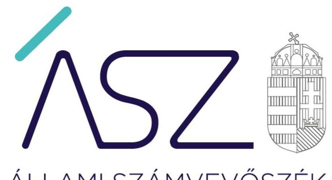
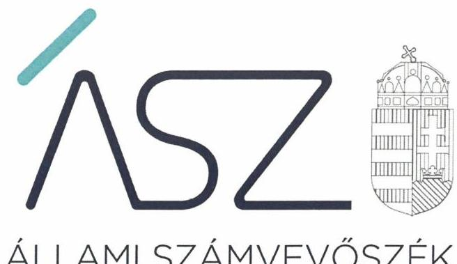

ÁLLAMI SZÁMVEVŐSZÉK

# JELENTÉS 

## Nem állami humánszolgáltatók ellenőrzése

A szociális humánszolgáltatást nyújtó intézmények, szolgáltatók államháztartáson kívüli fenntartói központi költségvetésből kapott támogatásai felhasználásának ellenőrzése Baptista Tevékeny Szeretet Misszió
2020.

20063
www.asz.hu

---

ÁLLAMI SZÁMVEVŐSZÉK

# JELENTÉS 

## Nem állami humánszolgáltatók ellenőrzése

A szociális humánszolgáltatást nyújtó intézmények, szolgáltatók államháztartáson kívüli fenntartói központi költségvetésből kapott támogatásai felhasználásának ellenőrzése Baptista Tevékeny Szeretet Misszió
2020. 06. hó 12. nap

20063
www.asz.hu

---

# AZ ELLENŐRZÉST FELÜGYELTE: 

KLINGA LÁSZLÓ felügyeleti vezető

## AZ ELLENŐRZÉST VEZETTE ÉS A VÉGREHAJTÁSÁÉRT FELELŐS:

DÉZSINÉ KIS HAJNALKA ellenőrzésvezető

## A PROGRAM ÖSSZEÁLLÍTÁSÁÉRT FELELŐS:

FEKETE-NAGY ANDRÁS GÁBOR ellenőrzési program készítéséért felelős vezető

TÓTPÁL SZABOLCS osztályvezető

IKTATÓSZÁM: EL-2564-001/2020.

## Jelentéseink az Országgyúlés számítógépes hálózatán és az interneten a www.asz.hu címen is olvashatóak.

TÉMASZÁM: 2491
ELLENŐRZÉS-AZONOSÍTÓ SZÁM: V083559, V0867084

---

# TARTALOMJEGYZÉK 

■ ÖSSZEGZÉS ..... 5
■ AZ ELLENŐRZÉS CÉLJA ..... 6
■ AZ ELLENŐRZÉS TERÜLETE ..... 7
■ AZ ELLENŐRZÉS HÁTTERE, INDOKOLTSÁGA ..... 8
■ A JELENTÉS LÉNYEGES KÉRDÉSKÖREI ..... 9
■ AZ ELLENŐRZÉS HATÓKÖRE ÉS MÓDSZEREI ..... 10
■ MEGÁLLAPÍTÁSOK ..... 12
■ MELLÉKLETEK ..... 15
I. sz. melléklet: Értelmező szótár ..... 15
■ FÜGGELÉK: ÉSZREVÉTELEK ..... 17
■ RÖVIDÍTÉSEK JEGYZÉKE ..... 19

---

.

---

# ÖSSZEGZÉS 

A debreceni székhelyű Baptista Tevékeny Szeretet Misszió szociális humánszolgáltatási közfeladat ellátására kapott költségvetési támogatásokkal való gazdálkodása elszámoltatható és átlátható volt, a támogatásokat szabályszerűen az intézményei működtetésére fordította.

## Az ellenőrzés társadalmi indokoltsága

A szociális gondoskodást igénylők védelme, illetve a köznevelési feladatok ellátása az Alaptörvényben meghatározott, a társadalom szempontjából fontos tevékenységek. Jogszabályok teszik lehetővé, hogy államháztartáson kívüli szervezetek - így például az egyházi fenntartók, alapítványok, gazdasági társaságok, egyesületek - által fenntartott intézmények is végezzenek köznevelési, szociális és gyermekvédelmi feladatokat. Mindehhez a központi költségvetés évente jelentős összegű támogatással járul hozzá. Az államháztartáson kívüli, humánszolgáltatást végző intézmények az igényelt közpénzekből társadalmilag hasznos, közösségteremtő, közérdekű, illetve közhasznú tevékenységet végeznek, illetve közfeladatokat látnak el.

Az intézményfenntartók ellenőrzésével az Állami Számvevőszék hozzájárul ahhoz, hogy ezen közpénzeket az államháztartáson kívüli szervezetek is ellenőrizhető, átlátható és elszámoltatható módon használják fel a közfeladatok ellátása során. Az ellenőrzések célja továbbá, hogy a nyilvánosság és az igénybevevők megfelelő tájékoztatást kapjanak az államháztartáson kívüli közfeladatot ellátók működéséről.

Az ÁSZ ellenőrzései arra adnak választ, hogy az intézményfenntartók arra használták-e fel a közpénzeket, amire igényelték.

A szabályszerű gazdálkodás elengedhetetlen a közfeladat ellátás szakmai céljainak megvalósításához, valamint a társadalmi közbizalom fenntartásához.

## Főbb megállapítások, következtetések

A Baptista Tevékeny Szeretet Misszió a 2015-2018. években szabályszerű működési- és gazdálkodási környezet kialakításával megteremtette a költségvetési támogatások átlátható, elszámoltatható igénybevételének, felhasználásának feltételeit.

A Baptista Tevékeny Szeretet Misszió a 2015-2018. években az átvállalt szociális humánszolgáltatási közfeladathoz biztosított költségvetési támogatásokat szabályszerűen fordította a humánszolgáltató intézményei működtetésére.

A Baptista Tevékeny Szeretet Misszió a 2015-2018. években a szociális humánszolgáltató intézményei működtetéséhez felhasznált közpénzekre vonatkozó gazdálkodásával elszámolt.

---

# AZ ELLENŐRZÉS CÉLJA

**AZ ELLENŐRZÉS CÉLJA** annak értékelése, hogy a nem állami, nem önkormányzati szociális intézmények fenntartói központi költségvetésből kapott támogatásainak felhasználása szabályszerű volt-e.

---

# AZ ELLENŐRZÉS TERÜLETE 

## Baptista Tevékeny Szeretet Misszió

A Magyarországi Baptista Egyház Országos Tanácsa 2011. május 30-án - debreceni székhellyel - létrehozta a Baptista Tevékeny Szeretet Misszió elnevezésű belső egyházi jogi személyt szociális feladatok ellátására.

A BTESZ ${ }^{1}$ az ellenőrzött időszakban 20 szociális humánszolgáltató intézmény² fenntartásával vett részt a közfeladat ellátásban. A szociális humánszolgáltató intézmények önálló jogi személyiséggel nem rendelkeztek, a gazdasági feladatokat a BTESZ látta el.

A BTESZ fenntartásában lévő intézmények szociális étkeztetést, házi segítségnyújtást, demens, fogyatékos személyek pszichiátriai nappali ellátását, szenvedélybetegek nappali ellátását, gyermekek napközbeni ellátását, gyermekeknek otthont nyújtó ellátást, valamint szenvedélybetegeknek támogatott lakhatást biztosítottak.

A 2015-2017. évi egyszerűsített éves beszámolók adatai alapján a BTESZ a szociális humánszolgáltatási feladatok ellátására a 2015. évben 1225,0 M Ft, a 2016. évben 1358,8 M Ft, a 2017. évben 1428,0 M Ft, a 2018. évben 1982 M Ft összegű támogatásban részesült. A Fenntartó az ellenőrzött időszakban könyvvizsgálatra nem volt kötelezett.

---

# AZ ELLENŐRZÉS HÁTTERE, INDOKOLTSÁGA 

A szociális feladatokat ellátó nem állami intézményfenntartók részére közfeladataik ellátására évente jelentős összegű pénzügyi támogatást biztosítottak a mindenkori költségvetési törvények a bennük megfogalmazott feltételek mellett. A felhasználható állami támogatások a Kvtv. ${ }^{3}$-ben a 2015-2018. években a szociális ágazatra vonatkozóan 360 Mrd Ft előirányzatot határoztak meg. 2013. évben jelentős változások következtek be a normatív finanszírozás rendszerében. Új feladatfinanszírozási forma (átlagbéralapú támogatás) jelent meg, amely az államháztartáson kívüli intézményfenntartókra is vonatkozik. Az ellenőrzés a finanszírozási rendszerben 2011-2015 között bekövetkezett változásokra, azok közfeladat ellátásra gyakorolt hatására fókuszál a költségvetési támogatásokat felhasználó államháztartáson kívüli szervezetek körében. Az ellenőrzések indokoltságát az is alátámasztja, hogy az ÁSZ ${ }^{4}$ számos szervezetet még nem ellenőrzött ezen a területen.

Az ÁSZ stratégiájában foglaltak alapján is indokolt az ellenőrzés, amely a társadalom számára jelzi, hogy a közpénz államháztartáson kívüli felhasználása sem maradhat ellenőrizetlenül. Az államháztartáson kívülre nyújtott költségvetési támogatások ellenőrzésével az ÁSZ hozzájárul ahhoz, hogy a közpénzeket a nem állami humán fenntartók átlátható módon használják fel a közfeladatok ellátására kötött szerződésekben vállalt kötelezettségek teljesítése érdekében. Az ellenőrzés javaslataival hozzájárulhat az említett rendszerek szabályszerű támogatás felhasználásához, javíthatja a társadalmi-gazdasági döntések megalapozottságát, amely a „jól irányított állam működésének" feltétele.

A holisztikus megközelítés jegyében az ellenőrzés keretében egyedi kockázatelemzés alapján kiválasztott fenntartóknál és intézményeiknél értékeljük az államháztartáson kívüli szociális tevékenységhez kapcsolódó támogatások felhasználásának megfelelőségét.

---

# A JELENTÉS LÉNYEGES KÉRDÉSKÖREI 

1. A szociális humánszolgáltató közfeladatot ellátó államháztartáson kívüli fenntartó szabályszerű működési- és gazdálkodási környezet kialakításával megteremtette-e a költségvetési támogatások átlátható, elszámoltatható igénybevételének, felhasználásának feltételeit?
2. Az államháztartáson kívüli fenntartó az átvállalt szociális humánszolgáltatási közfeladathoz biztosított költségvetési támogatásokat szabályszerűen fordította-e a humánszolgáltató intézményei működtetésére?
3. Az államháztartáson kívüli fenntartó a szociális humánszolgáltató intézményei működtetéséhez felhasznált közpénzekre vonatkozó gazdálkodásával elszámolt-e, ennek érdekében ellenőrzési, értékelési és a külső ellenőrzésekkel kapcsolatos intézkedési feladatait szabályszerűen látta-e el?

---

# AZ ELLENŐRZÉS HATÓKÖRE ÉS MÓDSZEREI 

## Az ellenőrzés típusa

Megfelelőségi ellenőrzés.

## Az ellenőrzött időszak

A 2015. január 1-je és 2018. december 31-e közötti időszak.

## Az ellenőrzés tárgya

Az ellenőrzés a szociális humánszolgáltatási közfeladatokat ellátó államháztartáson kívüli fenntartók humánszolgáltatási közfeladatai ellátásához a központi költségvetésből kapott támogatásaik humánszolgáltatási közfeladatokra való fenntartó általi felhasználása szabályszerűségének értékelésére terjedt ki.

## Az ellenőrzött szervezet

Baptista Tevékeny Szeretet Misszió.

## Az ellenőrzés jogalapja

Az ellenőrzés jogszabályi alapját az ÁSZ tv. ${ }^{5}$ 1. § (3) bekezdése, 5. § (3) bekezdés, valamint az 5. § (11) bekezdés c) pontjában foglalt előírások adják.

## Az ellenőrzés módszerei

Az ellenőrzést az ellenőrzési program szempontjai, kérdései, az ellenőrzött időszakban hatályos jogszabályok, a nemzetközi standardokat irányadónak tekintve, az ellenőrzés szakmai szabályok és módszertanok figyelembe vételével végezte az ÁSZ. A közpénzekkel való felelős gazdálkodás segítésére irányuló javaslatok kidolgozásakor a hatályos jogszabályok voltak az irányadóak.

Az ellenőrzés ideje alatt az ellenőrzött szervezettel történő kapcsolattartást az ÁSZ SZMSZ5-ének vonatkozó előírásai alapján biztosította az ÁSZ.

Az ellenőrzési kérdések megválaszolásához szükséges bizonyítékok megszerzése az ellenőrzött által rendelkezésre bocsátott

---

dokumentumokra, adatokra alapozva megfigyelés, szemle (szemrevételezés), kérdésfeltevés (információkérés), mintavétel, valamint elemző eljárással történt.

Az ellenőrzési bizonyítékként felhasználható adatforrások közé tartoznak egyrészt a szakmai program részletes szempontjainál felsorolt adatforrások, másrészt minden - az ellenőrzés folyamán feltárt, az ellenőrzés szempontjából információt tartalmazó - dokumentum.

Az ellenőrzés lefolytatásához az ellenőrzött szervezet a kitöltött tanúsítványok, valamint az ÁSZ által kért dokumentumok elektronikus úton való megküldésével szolgáltatott adatokat, információkat. Az így rendelkezésre bocsátott adatok, információk és a tanúsítványok adatai valódiságának kontrollja az ellenőrzés keretében történt.

Az egységes értelmezést támogatja a program mellékletét képező fogalomtár és rövidítésjegyzék.

Az ellenőrzést alapvetően a szociális humánszolgáltatások esetében a központi költségvetési támogatások igénylésével, módosításával, felhasználásával, elszámolásával kapcsolatos feladatokat ellátó államháztartáson kívüli fenntartóknál/szervezeteinél végezzük.

A szociális humánszolgáltatások központi költségvetési támogatásaival kapcsolatos, államháztartáson kívüli fenntartó jogszabályokban előírt feladatai betartását, továbbá a központi költségvetési támogatások szabályszerű nyilvántartását ellenőrizte az ÁSZ a fenntartónál rendelkezésre álló nyilvántartások, beszámolók és egyéb dokumentumok alapján. Az ellenőrzés nem terjedt ki a szociális humánszolgáltatások központi költségvetési támogatásai igénylése, módosítása, elszámolása valódiságának, megalapozottságának, helyességének - sem a fenntartónál, sem a székhely intézményeinél való - értékelésére (mivel ennek felülvizsgálata, ellenőrzése a finanszírozó jogszabályban előírt feladata, határozatai kiadása előtt). Továbbá nem terjedt ki az ellenőrzés e források szabályszerű felhasználásának értékelésére.

---

# MEGÁLLAPÍTÁSOK 

## 1. A szociális humánszolgáltató közfeladatot ellátó államháztartáson kívüli fenntartó szabályszerű működési- és gazdálkodási környezet kialakításával megteremtette-e a költségvetési támogatások átlátható, elszámoltatható igénybevételének, felhasználásának feltételeit?

Összegző megállapítás

A Fenntartó ${ }^{7}$ a 2015-2018. években szabályszerű működési- és gazdálkodási környezet kialakításával megteremtette a költségvetési támogatások átlátható, elszámoltatható igénybevételének, felhasználásának feltételeit.

A Fenntartó a szociális humánszolgáltatási közfeladat ellátásának megszervezését és belső szabályozottságának kialakítását a jogszabályi előírások betartásával végezte.

A Fenntartó rendelkezett a törvényi előírásoknak megfelelő hatályos alapítói okirattal és szervezeti és működési szabályzattal, továbbá számviteli politikával és ennek keretében elkészítendő szabályzatokkal: az eszközök és források leltárkészítési és leltározási szabályzatával, az eszközök és források értékelési szabályzatával, valamint pénzkezelési szabályzattal.

A Fenntartó a jogszabály szerint maga gondoskodott intézményei szervezeti és működési szabályzatának, szakmai programjának valamint házirendjének elkészítéséről.

A Fenntartó a törvényi előírásnak megfelelően számviteli politikájában és számlarendjében kialakította a közfeladatokra kapott költségvetési támogatások és ezek felhasználásának feladatonkénti elkülönített nyilvántartásának kereteit.

---

# 2. Az államháztartáson kívüli fenntartó az átvállalt szociális humánszolgáltatási közfeladathoz biztosított költségvetési támogatásokat szabályszerűen fordította-e a humánszolgáltató intézményei működtetésére? 

Összegző megállapítás A Fenntartó a 2015-2018. években az átvállalt szociális humánszolgáltatási közfeladathoz biztosított költségvetési támogatásokat szabályszerűen fordította a humánszolgáltató intézményei működtetésére.

A jóváhagyott költségvetési támogatások határidőben a Fenntartó rendelkezésére álltak. A Fenntartó a jogszabályban foglaltaknak megfelelően feladatonként elkülönítetve tartotta nyilván a kapott támogatásokat és ezek felhasználását. A Fenntartó a közfeladatra kapott költségvetési támogatások teljes összegét a humánszolgáltatást végző intézmények működtetésére fordította.

## 3. Az államháztartáson kívüli fenntartó a szociális humánszolgáltató intézményei működtetéséhez felhasznált közpénzekre vonatkozó gazdálkodásával elszámolt-e, ennek érdekében ellenőrzési, értékelési és a külső ellenőrzésekkel kapcsolatos intézkedési feladatait szabályszerűen látta-e el?

Összegző megállapítás A Fenntartó a 2015-2018. években a szociális humánszolgáltató intézményei működtetéséhez felhasznált közpénzekre vonatkozó gazdálkodásával elszámolt.

A Fenntartó az intézmények működésének törvényességét, szabályszerűségét, szakmai munkájának eredményességét, a szakmai program végrehajtását belső ellenőrzés keretében ellenőrizte.

A Fenntartó elkészítette a törvényi előírásoknak megfelelően a 2015-2018. évekre vonatkozóan egyszerűsített éves beszámolóját, valamint adatvédelmi és adatbiztonsági szabályzatát.

A Fenntartó a Magyar Államkincstár és az intézmények székhely szerint illetékes kormányhivatala, valamint az egyéb hatóságok által lefolytatott ellenőrzésekhez kapcsolódó intézkedési kötelezettségeinek eleget tett.

---

.

---

# MELLÉKLETEK 

- I. SZ. MELLÉKLET: ÉRTELMEZŐ SZÓTÁR
bevett egyház
egyházi fenntartó
humánszolgáltatás
költségvetési támogatás
székhely intézmény

Az Ehtv. ${ }^{8}$ 6. § (1-2) bekezdései szerint az Országgyűlés által elismert egyház bevett egyház. Vallási közösség az Országgyűlés által elismert egyház és a vallási tevékenységet végző szervezet lehet. A vallási közösség elsődlegesen vallási tevékenység céljából jön létre és működik. Az Ehtv. 7. §-a szerint a vallási közösség az egyház megjelölést elnevezésében és tevékenységére
 való utalás során önmeghatározása céljából - a saját hitelvei szerinti tartalommal - használhatja.
Az Ehtv. 33. §-a alapján az Ehtv. mellékletében felsorolt egyházak és az általuk meghatározott, az egyház belső egyházi szabálya szerint jogi személyiséggel rendelkező szervezetek - a nyilvántartásba vételük dátumától függetlenül - 2012. január 1-jétől minősülnek egyházi fenntartóknak. Az Ehtv. 14. §-ában meghatározott eljárás folyamán az Országgyűlés által egyháznak elismert szervezet a törvénynek az egyház bejegyzésére vonatkozó módosítása hatálybalépésének napjától minősül egyháznak (Ehtv. 15. §). A 2010. évi CXL. törvény* 5. Cikk Pénzügyi támogató intézkedések 1. pontja alapján 2011. január 1-jétől jogosult a Magyar Máltai Szeretetszolgálat Egyesület az egyházi kiegészítő támogatásra.
Külön törvényben meghatározott szociális, gyermekjóléti, gyermekvédelmi, közoktatási, felsőoktatási, kulturális közfeladatok (2015. évi Kvtv. 43. § (1), (4) bekezdés, 1. számú melléklet XX/20/2/3. jogcím csoport, 19. alcím, 2016. évi Kvtv. 41. § (1), (4) bekezdés, 1. számú melléklet XX/20/2/3. jogcím csoport, 19. alcím, 2017. évi Kvtv. 41. § (1), (4) bekezdés, 1. számú melléklet XX/20/2/3. jogcím csoport, 19. alcím)
a társadalombiztosítás pénzügyi alapjai kivételével az államháztartás központi alrendszeréből ellenérték nélkül, pénzben nyújtott támogatások, ide nem értve
f) a szociális igazgatásról és szociális ellátásokról szóló törvény, valamint a gyermekek védelméről és a gyámügyi igazgatásról szóló törvény szerinti pénzbeli és természetbeni szociális és gyermekvédelmi ellátásokat (Áht. ${ }^{9}$ 1. § 14. pont)
A költségvetési törvényben (2016. évi XC. törvény 40. §) megállapított támogatás többek között: Átlagbéralapú támogatást állapít meg a nevelési-oktatási, valamint pedagógiai szakszolgálati intézményt fenntartó nemzetiségi önkormányzat, az egyházi és magán köznevelési intézmény fenntartója részére az általuk fenntartott nevelési-oktatási intézményben, továbbá pedagógiai szakszolgálati intézményben pedagógus és - a (3) bekezdés kivételével - a nevelő-oktató munkát közvetlenül segítő munkakörben foglalkoztatottak után a 7. melléklet I. pontjában meghatározott jogosultak után, az őket ott megillető mértékek szerint. Működési támogatást állapít meg a nemzetiségi önkormányzat vagy az egyházi jogi személy által fenntartott nevelési-oktatási intézményekben ellátott, továbbá a pedagógiai szakszolgálati intézményekben gyógypedagógiai tanácsadásban, korai fejlesztésben, oktatásban és gondozásban, valamint a fejlesztő nevelésben részt vevő gyermekekre, tanulókra tekintettel a nemzetiségi önkormányzat és a bevett egyház részére a 7. melléklet II. pontja szerint. a szolgáltató székhelye, azaz a szolgáltató központi ügyintézésének helye, függetlenül attól, hogy használják-e szolgáltatás nyújtására (Sznyvhr. ${ }^{10} 1 . \S$ k) pont) (hatályos: 2013. december 1-től)

[^0]
[^0]:    * a Magyar Köztársaság Kormánya és a Szuverén Jeruzsálemi, Rodoszi és Máltai Szent János Katonai és Ispotályos Rend közötti Együttműködési Megállapodás kihirdetéséről szóló 2010. évi CXL. törvény

---

telephely
nem állami, nem önkormányzati (államháztartáson kívüli) intézmény fenntartó
vallási tevékenység
vallási tevékenységet végző szervezet
a szolgáltató székhelyétől különböző, szolgáltató/intézmény használatában álló hely, a szociális humánszolgáltatáshoz használt, bejegyzett hely. (Sznyvhr. 1.§ I) pont) (hatályos: 2015. január 1-től)

A humánszolgáltatásokat ellátó intézményt fenntartó egyházi jogi személy, társadalmi szervezet, alapítvány, közalapítvány, civil szervezet, országos nemzetiségi önkormányzat, nonprofit gazdasági társaság, gazdasági társaság és a humánszolgáltatást alaptevékenységként végző, Szja tv. hatálya alá tartozó egyéni vállalkozó.
(2015. évi Kvtv. 43. § (1) bekezdés, 2016. évi Kvtv. 41. § (1), bekezdés, 2017. évi Kvtv. 41. § (1) bekezdés)
Az Ehtv. 6. § (3) bekezdés szerint a vallási tevékenység olyan világnézethez kapcsolódó tevékenység, amely természetfelettire irányul, rendszerbe foglalt hitelvekkel rendelkezik, tanai a valóság egészére irányulnak, valamint sajátos magatartáskövetelményekkel az emberi személyiség egészét átfogja. Az Ehtv. 6. § (4) bekezdés (e, f, j, o) pontjai szerint önmagában nem tekinthető vallási tevékenységnek a nevelési, az oktatási, a család-, gyermek- és ifjúságvédelmi és a szociális tevékenység.
Az Ehtv. 9/A. § (1) bekezdései szerint a vallási tevékenységet végző szervezet olyan egyesület, amelynek tagjai azonos hitelveket valló természetes személyek, és amelynek alapszabályában meghatározott célja vallási tevékenység végzése.

---

# FÜGGELÉK: ÉSZREVÉTELEK 

A jelentéstervezetet a Számvevőszék 15 napos észrevételezésre megküldte az ellenőrzött szervezet vezetőjének az ÁSZ tv. 29. §* (1) bekezdése előírásának megfelelően.

A Baptista Tevékeny Szeretet Misszió elnöke a jelentéstervezet megállapításaira nem tett észrevételt.

[^0]
[^0]:    * 29. § (1) Az Állami Számvevőszék az ellenőrzési megállapításait megküldi az ellenőrzött szervezet vezetőjének vagy az általa megbízott személynek, és annak, akinek személyes felelősségét állapította meg.
    (2) Az ellenőrzött szervezet vezetője és a felelősként megjelölt személy az ellenőrzés megállapításaira tizenöt napon belül írásban észrevételt tehet.
    (3) Az Állami Számvevőszék az észrevételre a beérkezésétől számított harminc napon belül írásban válaszol. A figyelembe nem vett észrevételeket köteles a jelentésben feltüntetni, és megindokolni, hogy azokat miért nem fogadta el.

---

.

---

# RÖVIDÍTÉSEK JEGYZÉKE 

${ }^{1}$ BTESZ
${ }^{2}$ A fenntartó intézményei
${ }^{3}$ Kvtv.-ek
${ }^{4}$ ÁSZ
${ }^{5}$ ÁSZ tv.
${ }^{6}$ ÁSZ SZMSZ
${ }^{7}$ Fenntartó
${ }^{8}$ Ehtv.
${ }^{9}$ Áht.
${ }^{10}$ Sznyvhr.

Baptista Tevékeny Szeretet Misszió
Szociális Szolgáltató Központ Debrecen, Debreceni Étkeztetési Központ, Új Esély Háza (Debrecen), Szenvedélybetegek Balmazújvárosi Nappali Intézménye, Boldog Gyermekkor Nevelőszülői Hálózat (Debrecen), Szociális Integrált Intézmény (Derecske), Tevékeny Gondozási Szolgálat (Hajdúböszörmény), Tevékeny Gondozási Szolgálat (Szolnok), Szolgáltató Központ (Szolnok), Szociális Szolgáltató Intézmény (Püspökladány), Szociális Szolgáltató Központ (Vásárosnamény), Házi Segítségnyújtás (Zalaegerszeg), Hajdúnánási Szenvedélybetegek Nappali Intézménye, Gyulai Szociális Szolgáltató Központ Alapszolgáltatási Telephely, Új esély Háza (Miskolc), Boldog Gyermekkor Nevelőszülői Hálózat (Miskolc), Szenvedélybetegek Nappali Intézménye (Nyíregyháza), Gyulai Szociális Szolgáltató Központ, Felhőcske családi bölcsőde I-II. (Szada).
2014. évi C. törvény Magyarország 2015. évi központi költségvetéséről,
2015. évi C. törvény Magyarország 2016. évi központi költségvetéséről,
2016. évi CX. törvény Magyarország 2017. évi központi költségvetéséről,
2017. évi C. törvény Magyarország 2018. évi központi költségvetéséről

Állami Számvevőszék
2011. évi LXVI. törvény az Állami Számvevőszékről

Állami Számvevőszék Szervezeti és Működési Szabályzata
Baptista Tevékeny Szeretet Misszió
2011. évi CCVI. törvény a lelkiismereti és vallásszabadság jogáról, valamint az egyházak, vallásfelekezetek és vallási közösségek jogállásáról (hatályos 2012. január 1-jétől)
2011. évi CXCV. törvény az államháztartásról

369/2013. (X. 24.) Korm. rendelet a szociális, gyermekjóléti és gyermekvédelmi szolgáltatók, intézmények és hálózatok hatósági nyilvántartásáról és ellenőrzéséről (hatályos 2013. december 1-jétől)

---

# ASZ 

ÁLLAMI SZÁMVEVŐSZÉK
1052 Budapest, Apáczai Cs. J. u. 10. I 1364 Budapest 4. Pf. 54 TEL: +36 14849100
email: szamvevoszek@asz.hu
web: www.asz.hu | www.aszhirportal.hu

