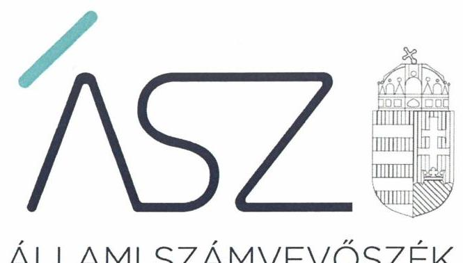
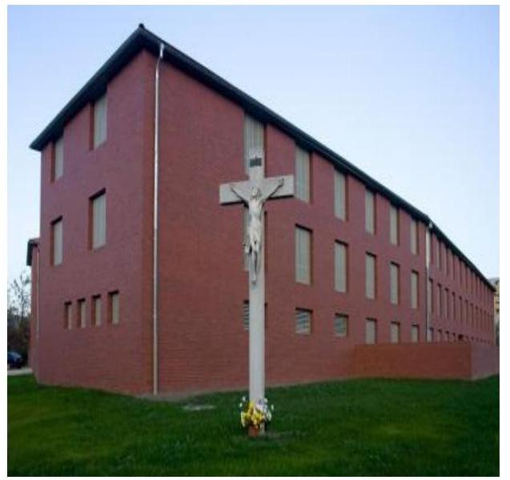

ÁLLAMI SZÁMVEVŐSZÉK

# JELENTÉS 

## Nem állami humánszolgáltatók ellenőrzése

A szociális humánszolgáltatást nyújtó intézmények, szolgáltatók államháztartáson kívüli fenntartói központi költségvetésből kapott támogatásai felhasználásának ellenőrzése Csillaghegyi Evangélikus Egyházközség
2020.

20064
www.asz.hu

---

ÁLLAMI SZÁMVEVŐSZÉK

# JELENTÉS 

## Nem állami humánszolgáltatók ellenőrzése

A szociális humánszolgáltatást nyújtó intézmények, szolgáltatók államháztartáson kívüli fenntartói központi költségvetésből kapott támogatásai felhasználásának ellenőrzése Csillaghegyi Evangélikus Egyházközség
2020. 05. hó 12. nap

20064
www.asz.hu

---

# AZ ELLENŐRZÉST FELÜGYELTE: 

KAKAS SÁNDOR felügyeleti vezető

## AZ ELLENŐRZÉST VEZETTE ÉS A VÉGREHAJTÁSÁÉRT FELELŐS:

LACZI HEDVIG ANNA ellenőrzésvezető

## A PROGRAM ÖSSZEÁLLÍTÁSÁÉRT FELELŐS:

FEKETE-NAGY ANDRÁS ellenőrzési program készítéséért felelős vezető

TÓTPÁL SZABOLCS osztályvezető

IKTATÓSZÁM: EL-2563-001/2020.
TÉMASZÁM: 2491
ELLENŐRZÉS-AZONOSÍTÓ SZÁM: V083569, V0867097

---

# TARTALOMJEGYZÉK 

- ÖSSZEGZÉS ..... 5
- AZ ELLENŐRZÉS CÉLJA ..... 6
- AZ ELLENŐRZÉS TERÜLETE ..... 7
- AZ ELLENŐRZÉS HÁTTERE, INDOKOLTSÁGA ..... 8
- A JELENTÉS LÉNYEGES KÉRDÉSKÖREI ..... 9
- AZ ELLENŐRZÉS HATÓKÖRE ÉS MÓDSZEREI ..... 10
- MEGÁLLAPÍTÁSOK ..... 12
- MELLÉKLETEK ..... 15
I. sz. melléklet: Értelmező szótár ..... 15
- FÜGGELÉK: ÉSZREVÉTELEK ..... 17
- RÖVIDÍTÉSEK JEGYZÉKE ..... 19

---

.

---

# ÖSSZEGZÉS 

A budapesti székhelyű Csillaghegyi Evangélikus Egyházközség szociális humánszolgáltatási közfeladat ellátásra kapott költségvetési támogatásokkal való gazdálkodása elszámoltatható és átlátható volt, a támogatásokat szabályszerűen az intézményei működtetésére fordította.

## Az ellenőrzés társadalmi indokoltsága

A szociális gondoskodást igénylők védelme, illetve a köznevelési feladatok ellátása az Alaptörvényben meghatározott, a társadalom szempontjából fontos tevékenységek. Jogszabályok teszik lehetővé, hogy államháztartáson kívüli szervezetek - így például az egyházi fenntartók, alapítványok, gazdasági társaságok, egyesületek - által fenntartott intézmények is végezzenek köznevelési, szociális és gyermekvédelmi feladatokat. Mindehhez a központi költségvetés évente jelentős összegű támogatással járul hozzá. Az államháztartáson kívüli, humánszolgáltatást végző intézmények az igényelt közpénzekből társadalmilag hasznos, közösségteremtő, közérdekű, illetve közhasznú tevékenységet végeznek, illetve közfeladatokat látnak el.

Az intézményfenntartók ellenőrzésével az Állami Számvevőszék hozzájárul ahhoz, hogy ezen közpénzeket az államháztartáson kívüli szervezetek is ellenőrizhető, átlátható és elszámoltatható módon használják fel a közfeladatok ellátása során. Az ellenőrzések célja továbbá, hogy a nyilvánosság és az igénybevevők megfelelő tájékoztatást kapjanak az államháztartáson kívüli közfeladatot ellátók működéséről.

Az ÁSZ ellenőrzései arra adnak választ, hogy az intézményfenntartók arra használták-e fel a közpénzeket, amire igényelték.

A szabályszerű gazdálkodás elengedhetetlen a közfeladat ellátás szakmai céljainak megvalósításához, valamint a társadalmi közbizalom fenntartásához.

## Főbb megállapítások, következtetések

A Csillaghegyi Evangélikus Egyházközség a szociális humánszolgáltatási közfeladatok ellátásának szervezeti feltételeit megteremtette és a gazdálkodási kereteket kialakította, amellyel biztosította a költségvetési támogatások igénybevételének, felhasználásának átláthatóságát és elszámoltathatóságát.

A Csillaghegyi Evangélikus Egyházközség a szociális humánszolgáltatási közfeladataihoz rendelt költségvetési támogatásokat szabályszerűen kezelte, elkülönítetten tartotta nyilván és a jogszabályi előírásoknak megfelelően az intézményei működtetésére fordította.

---

# AZ ELLENŐRZÉS CÉLJA

**AZ ELLENŐRZÉS CÉLJA** annak értékelése volt, hogy a nem állami, nem önkormányzati szociális intézmények fenntartói központi költségvetésből kapott támogatásainak felhasználása szabályszerű volt-e.

---

# **AZ ELLENŐRZÉS TERÜLETE**

## **Csillaghegyi Evangélikus Egyházközség**

A budapesti székhelyű Csillaghegyi Evangélikus Egyházközség a Magyarországi Evangélikus Egyház keretén belül működő, az Ehtv.1 szerinti belső egyházi jogi személy, amelyet 1928-ban alapítottak. Az Ehtv. felhatalmazása alapján a MEE2 2005. évi IV. törvénye3 rögzíti, hogy a Csillaghegyi Evangélikus Egyházközség önálló döntéshozó és képviseleti testületekkel, önálló gazdálkodással rendelkezik, megilleti az önkormányzás joga, ügyeit önállóan intézi, tisztségviselőit maga választja, és intézményeket hozhat létre.

A Csillaghegyi Evangélikus Egyházközség általános hatáskörű képviseleti szerve a Presbitérium4, amely a közgyűlés által megválasztott tagokból áll. A Csillaghegyi Evangélikus Egyházközség képviseleti és egyben végrehajtó szerve az Igazgatótanács5, amelynek a parókus lelkész és a felügyelő a tagja. A Csillaghegyi Evangélikus Egyházközség pénzügyi-gazdasági ellenőrzéséért az egyházközségi számvevőszék felelős.

A Csillaghegyi Evangélikus Egyházközség egy szociális intézmény6 és egy gyermekvédelmi intézmény7 tekintetében lát el fenntartói feladatokat A SION Nevelőszülői Hálózatot 2007. január 15-én hozta létre belső egyházi jogi személyként, amelynek célja az állami gyermekvédelmi gondoskodásban lévő gyermekek családi nevelésének biztosítása. A SION Nevelőszülői Hálózat működtetésében közreműködik az *Alapítvány az Örökbefogadó- és Nevelőszülőkért* szervezet is. 2008. július 6-án került sor a fenntartó részéről a Gaudiopolis Békásmegyeri Evangélikus Szeretetház létrehozására belső egyházi jogi személyként, amely intézmény célja az önmaguk ellátására nem képes, de rendszeres fekvőbeteg-ellátást nem igénylő időskorú személyek ellátása.

A Csillaghegyi Evangélikus Egyházközség intézményeit az Sznyvhr.8-ben foglaltak szerint a Kormányhivatal9 nyilvántartásba vette, valamint az intézmények az SzCsM10 rendeletben meghatározott működési engedéllyel rendelkeztek.

A Csillaghegyi Evangélikus Egyházközség összes bevétele a 2015. évben 248,9 M Ft, 2016. évben 273,9 MFt, 2017. évben 305,7 M Ft, 2018. évben 339,5 M Ft volt.

A humánszolgáltatási közfeladatra kapott támogatások összege 2015. évben 208,3 M Ft, a 2016. évben 232,9 M Ft, a 2017. évben 258,1 M Ft, a 2018. évben 288,8 M Ft volt.

---

# **AZ ELLENŐRZÉS HÁTTERE, INDOKOLTSÁGA**

A szociális feladatokat ellátó nem állami intézményfenntartók részére közfeladataik ellátására évente jelentős összegű pénzügyi támogatást biztosítottak a mindenkori költségvetési törvények a bennük megfogalmazott feltételek mellett. A felhasználható állami támogatások a Kvtv.14-ben a 2015–2018. években a szociális ágazatra vonatkozóan 360 Mrd Ft előirányzatot határoztak meg.

Az ÁSZ a stratégiájában célul tűzte ki, hogy az államháztartáson kívülre nyújtott költségvetési támogatások ellenőrzésével hozzájárul ahhoz, hogy a közpénzeket az államháztartáson kívüli szervezetek is átlátható módon használják fel a közfeladatok szerződésben vállalt ellátása érdekében. Az ÁSZ a stratégiájában foglaltak alapján is indokolt az ellenőrzés, amely a társadalom számára jelzi, hogy a közpénz államháztartáson kívüli felhasználása sem maradhat ellenőrizetlenül. Az államháztartáson kívülre nyújtott költségvetési támogatások ellenőrzésével az ÁSZ hozzájárul ahhoz, hogy a közpénzeket a nem állami fenntartók átlátható módon használják fel a közfeladatok ellátására kötött szerződésekben vállalt kötelezettségek teljesítése érdekében. Az ÁSZ az ellenőrzés javaslataival hozzájárulhat az említett rendszerek szabályszerű támogatás-felhasználásához, javíthatja a társadalmi-gazdasági döntések megalapozottságát, amely a *„jól irányított állam működésének”* feltétele.

---

# A JELENTÉS LÉNYEGES KÉRDÉSKÖREI 

1. A szociális humánszolgáltató közfeladatot ellátó államháztartáson kívüli fenntartó szabályszerű működési - és gazdálkodási környezet kialakításával megteremtette-e a költségvetési támogatások átlátható, elszámoltatható igénybevételének, felhasználásának feltételeit?
2. Az államháztartáson kívüli fenntartó az átvállalt szociális humánszolgáltatási közfeladathoz biztosított költségvetési támogatásokat szabályszerűen fordította-e a humánszolgáltató intézménye működtetésére?
3. Az államháztartáson kívüli fenntartó a szociális humánszolgáltató intézményei működtetéséhez felhasznált közpénzekre vonatkozóan gazdálkodásával a nyilvánosság előtt elszámolt-e, ennek érdekében ellenőrzési feladatait szabályszerűen látta-e el?

---

# AZ ELLENŐRZÉS HATÓKÖRE ÉS MÓDSZEREI 

## Az ellenőrzés típusa

Megfelelőségi ellenőrzés.

## Az ellenőrzött időszak

A 2015. január 1-je és 2018. december 31-e közötti időszak. A helyszíni szemle tekintetében 2018. január 1-jétől az utolsó helyszíni szemle időpontjáig 2019. október 8-áig tartó időszak.

## Az ellenőrzés tárgya

Az ellenőrzés a szociális humánszolgáltatási közfeladatokat ellátó államháztartáson kívüli fenntartók humánszolgáltatási közfeladatai ellátásához a központi költségvetésből kapott támogatásaik humánszolgáltatási közfeladatokra való fenntartó általi felhasználása szabályszerűségének értékelésére terjedt ki.

## Az ellenőrzött szervezet

Csillaghegyi Evangélikus Egyházközség

## Az ellenőrzés jogalapja

Az ellenőrzés jogszabályi alapját az ÁSZ tv ${ }^{13}$. 1. § (3) bekezdése, 5. § (3) bekezdésben valamint az 5. § (11) c) pontjában foglalt előírások adták.

## Az ellenőrzés módszerei

Az ÁSZ az ellenőrzést az ellenőrzési program szempontjai, kérdései, az ellenőrzött időszakban hatályos jogszabályok, a nemzetközi standardokat irányadónak tekintve, az ellenőrzés szakmai szabályok és módszertanok figyelembe vételével végezte. A közpénzekkel való felelős gazdálkodás segítésére irányuló javaslatok kidolgozásakor a hatályos jogszabályok voltak az irányadóak.

Az ellenőrzés ideje alatt az ellenőrzött szervezettel történő kapcsolattartást az ÁSZ SZMSZ ${ }^{14}$-ének vonatkozó előírása biztosította.

---

Az ellenőrzési kérdések megválaszolásához szükséges bizonyítékok megszerzése az ellenőrzött által rendelkezésre bocsátott dokumentumokra, adatokra alapozva megfigyelés, szemle (szemrevételezés), kérdésfeltevés (információkérés), valamint elemző eljárással történt.

Az ellenőrzési bizonyítékként felhasználható adatforrások közé tartoztak egyrészt az ellenőrzési program részletes szempontjainál felsorolt adatforrások, másrészt minden - az ellenőrzés folyamán feltárt, az ellenőrzés szempontjából információt tartalmazó - dokumentum.

Az ellenőrzés lefolytatásához az ellenőrzött szervezet a kitöltött tanúsítványok, valamint az ÁSZ által kért dokumentumok elektronikus úton való megküldésével szolgáltatott adatokat, információkat. Az így rendelkezésre bocsátott adatok, információk és a tanúsítványok adatai valódiságának kontrollja az ellenőrzés keretében történt.

Az egységes értelmezést támogatta a jelentés mellékletét képező fogalomtár és rövidítésjegyzék.

Az ÁSZ az ellenőrzést alapvetően a szociális humánszolgáltatások esetében a központi költségvetési támogatások igénylésével, módosításával, felhasználásával, elszámolásával kapcsolatos feladatokat ellátó államháztartáson kívüli fenntartóknál/szervezeteinél végezte.

A szociális humánszolgáltatások központi költségvetési támogatásaival kapcsolatos, államháztartáson kívüli fenntartó jogszabályokban előírt feladatai betartása, továbbá a központi költségvetési támogatások szabályszerű nyilvántartása került ellenőrzésre a fenntartónál rendelkezésre álló nyilvántartások, beszámolók és egyéb dokumentumok alapján. Az ellenőrzés nem terjedt ki a szociális humánszolgáltatások központi költségvetési támogatásai igénylése, módosítása, elszámolása valódiságának, megalapozottságának, helyességének - sem a fenntartónál, sem a székhely intézményeinél való - értékelésére (mivel ennek felülvizsgálata, ellenőrzése a finanszírozó jogszabályban előírt feladata, határozatai kiadása előtt). Továbbá nem terjedt ki az ellenőrzés e források, intézmények általi szabályszerű felhasználásának értékelésére.

---

# MEGÁLLAPÍTÁSOK 

## 1. A szociális humánszolgáltató közfeladatot ellátó államháztartáson kívüli fenntartó szabályszerű működési - és gazdálkodási környezet kialakításával megteremtette-e a költségvetési támogatások átlátható, elszámoltatható igénybevételének, felhasználásának feltételeit?

Összegző megállapítás

A Fenntartó 2015-2018. években a szabályszerű működési és gazdálkodási környezet kialakításával megteremtette a költségvetési támogatások átlátható, elszámoltatható igénybevételének, felhasználásának feltételeit.

A Fenntartó ${ }^{15}$ szociális humánszolgáltatási közfeladat ellátásának szervezeti kereti, irányítási rendszere, működése, illetve gazdálkodása a Szoc. tv. ${ }^{16}$ és a Gyvt. ${ }^{17}$ előírásai szerint történt.

A Fenntartó a Szoc. tv. előírásaival összhangban gondoskodott az intézményei SZMSZ-ének ${ }^{18}$ elkészítéséről, illetve a Gyvtv. előírásaival összhangban az intézményi SZMSZ jóváhagyásáról, amelyekben meghatározta az intézmények feladatait és működési kereteit.

A Fenntartó a Számv. tv. ${ }^{19}$-ben foglaltak szerint rendelkezett számviteli politikával ${ }_{1,2}{ }^{20}$-vel és az annak keretében elkészítendő számviteli szabályzatokkal, valamint a Számv. tv. szerinti számlarenddel ${ }_{1,2}{ }^{21}$ is.

A Fenntartó az Eszámv. ${ }^{22}$ előírásával összhangban, a számviteli politikában és vezetői utasításban ${ }^{23}$ meghatározta a szociális humánszolgáltató feladatot ellátó intézményei beszámoló készítési kötelezettségét, valamint a költségvetési támogatások elszámolását megalapozó nyilvántartások vezetését.

Az Atr. ${ }^{24}$ előírásai alapján a Fenntartó a számlarendjében rögzítettek szerint rendelkezett a közfeladatokhoz rendelt központi költségvetési támogatások kezelésére vonatkozóan feladatonkénti nyilvántartással.

---

# 2. Az államháztartáson kívüli fenntartó az átvállalt szociális humánszolgáltatási közfeladathoz biztosított költségvetési támogatásokat szabályszerűen fordította-e a humánszolgáltató intézménye működtetésére? 

Összegző megállapítás A Fenntartó 2015-2018. években a szociális közfeladat ellátásához biztosított költségvetési támogatásokat az intézményei működtetésére fordította.

A Fenntartó a közfeladatot ellátó intézményei alapító okiratait ${ }^{25}$ az SzCsM rendelet és az Ehtv. előírásával összhangban kiadta.

A Fenntartó az Eszámv. előírásai szerint az intézményei működtetésére kapott központi költségvetési támogatásokat elkülönítetten mutatta ki.

A Fenntartó a szociális humánszolgáltatási közfeladathoz rendelt költségvetési támogatások felhasználását - intézményeknek történő átadását - feladatonként elkülönített és naprakész nyilvántartással támasztotta alá. A költségvetési támogatásokat - a Kvtv. előírásainak megfelelően - az intézményei részére átadta.

## 3. Az államháztartáson kívüli fenntartó a szociális humánszolgáltató intézményei működtetéséhez felhasznált közpénzekre vonatkozóan gazdálkodásával a nyilvánosság előtt elszámolt-e, ennek érdekében ellenőrzési feladatait szabályszerűen látta-e el?

Összegző megállapítás A Fenntartó 2015-2018. években az
 intézményei működtetéséhez felhasznált közpénzekre vonatkozó gazdálkodásával a nyilvánosság előtt elszámolt, ellenőrzési kötelezettségeinek eleget tett.

A Fenntartó az intézményei gazdálkodásának törvényessége feletti kontrollt, a Szoc.tv.-ben és a Gyvtv.-ben megfelelően biztosította, a működésük törvényességét vizsgáló ellenőrzési feladatait az Igazgatótanács és a Presbitérium közreműködésével látta el.

A Fenntartó a 2015-2018. évekre vonatkozó beszámolási kötelezettségét egyszerűsített éves beszámoló készítésével az Eszámv. előírásainak megfelelően teljesítette, könyvvezetési kötelezettségét a Számv. tv. és az Eszámv. előírásai szerint kettős könyvvitel alkalmazásával teljesítette.

---

.

---

# MELLÉKLETEK 

- I. SZ. MELLÉKLET: ÉRTELMEZŐ SZÓTÁR
befogadás
ellátási terület
feladatfinanszírozás
humánszolgáltatás
költségvetési támogatás
nem állami, nem önkormányzati (államháztartáson kívüli) intézmény fenntartó
székhely intézmény
telephely

A Szoctv. illetve a Gyvt. szerinti, a szociális szolgáltatások és a gyermekjóléti szolgáltató tevékenységek területi lefedettségét figyelembe vevő finanszírozási rendszerbe történő befogadás.
Az a terület, ahonnan az engedélyes gyermekeket, illetve más ellátottakat fogad. A közfeladat államháztartáson kívüli szervezet által történő ellátásához közvetlenül kapcsolódó, arányos működési költségeket finanszírozó költségvetési támogatás.
Külön törvényben meghatározott szociális, gyermekjóléti, gyermekvédelmi, közoktatási, felsőoktatási, kulturális közfeladatok (2014. évi Kvtv. 34. § (1), (4) bekezdés, 1. számú melléklet XX/20/2. alcím, 19. alcím, 2015. évi Kvtv. ${ }^{26} 43 . \S$ (1), (4) bekezdés, 1. számú melléklet XX/20/2/3. jogcím csoport, 19. alcím, 2016. évi Kvtv. 41. § (1), (4) bekezdés, 1. számú melléklet XX/20/2/3. jogcím csoport, 19. alcím, 2017. évi Kvtv. 43. § (1), (4) bekezdés, 1. számú melléklet XX/20/2/3. jogcím csoport, 19. alcím, 2018. évi Kvtv. 43. § (1), (4) bekezdés, 1. számú melléklet XX/20/2/3. jogcím csoport, 19. alcím,).
a társadalombiztosítás pénzügyi alapjai kivételével az államháztartás központi alrendszeréből ellenérték nélkül, pénzben nyújtott támogatások (Áht. ${ }^{27}$ 1. § 14. pont). A költségvetési törvényekben (2013. évi CCXXX. törvény 33-34. §, 2014. évi C. törvény 42-43. §, 2015. évi C. törvény 40-41. §, 2016. évi Kvtv. 40-41. §, 2017. évi Kvtv. 40-41. §, 2018. évi Kvtv. 40-41. §,) megállapított támogatás. Például a 2015. évi C. törvény 40-41. § szerint többek között: Az Országgyűlés a szociális, gyermekjóléti, gyermekvédelmi közfeladatot ellátó intézményt, szolgáltatást fenntartó egyházi jogi személy, civil szervezet, közalapítvány, országos nemzetiségi önkormányzat, települési vagy területi nemzetiségi önkormányzat, gazdasági társaság, és a humánszolgáltatást alaptevékenységként végző, az Szja tv. hatálya alá tartozó egyéni vállalkozó (a továbbiakban együtt: nem állami szociális fenntartó) részére támogatást állapít meg a következők szerint: a támogatás a nem állami szociális fenntartót a települési önkormányzatok 2. melléklet III. pont 3. alpont c)-k) pontjában és III. pont 5. alpont a) pontjában meghatározott támogatásaival azonos jogcímeken, összegben és feltételek mellett illeti meg.
A szociális, gyermekjóléti és gyermekvédelmi közfeladatokat/humánszolgáltatásokat ellátó intézményt fenntartó egyházi jogi személy, társadalmi szervezet, alapítvány, közalapítvány, civil szervezet, országos nemzetiségi önkormányzat, nonprofit gazdasági társaság, gazdasági társaság és a humánszolgáltatást alaptevékenységként végző, Szja tv. hatálya alá tartozó egyéni vállalkozó. (2015. évi Kvtv. 42. §, 43. § (1), (4) bekezdés, 2016. évi Kvtv. ${ }^{28} 40 . \S, 41 . \S$ (1), (4) bekezdés, 2017. évi Kvtv. ${ }^{29}$ 41. § (1), (4), 2018. évi Kvtv. ${ }^{30} 41 . \S$ (1), (4-5))
a szolgáltató székhelye, azaz a szolgáltató központi ügyintézésének helye, függetlenül attól, hogy használják-e szolgáltatás nyújtására (Sznyvhr. 1.§ k) pont) (hatályos: 2013. december 1-től)
a szolgáltató székhelyétől különböző, szolgáltató/intézmény használatában álló hely, a szociális humánszolgáltatáshoz használt, bejegyzett hely. (Sznyvhr. 1.§ l) pont) (hatályos: 2015. január 1-től)

---

.

---

# FÜGGELÉK: ÉSZREVÉTELEK 

A jelentéstervezetet a Számvevőszék 15 napos észrevételezésre megküldte az ellenőrzött szervezet vezetőjének az ÁSZ tv. 29. § (1) bekezdése előírásának megfelelően.

A jelentéstervezetre a Csillaghegyi Evangélikus Egyházközség nem tett észrevételt.

[^0]
[^0]:    * 29. § (1) Az Állami Számvevőszék az ellenőrzési megállapításait megküldi az ellenőrzött szervezet vezetőjének vagy az általa megbízott személynek, és annak, akinek személyes felelősségét állapította meg.
    (2) Az ellenőrzött szervezet vezetője és a felelősként megjelölt személy az ellenőrzés megállapításaira tizenöt napon belül írásban észrevételt tehet.
    (3) Az Állami Számvevőszék az észrevételre a beérkezésétől számított harminc napon belül írásban válaszol. A figyelembe nem vett észrevételeket köteles a jelentésben feltüntetni, és megindokolni, hogy azokat miért nem fogadta el.

---

.

---

# RÖVIDÍTÉSEK JEGYZÉKE 

${ }^{1}$ Ehtv.
${ }^{2}$ MEE
${ }^{3}$ 2005. évi IV. törvény
${ }^{4}$ Presbitérium
${ }^{5}$ Igazgatótanács
${ }^{6}$ szociális intézmény
${ }^{7}$ gyermekvédelmi intézmény
${ }^{8}$ Sznyvhr.
${ }^{9}$ Kormányhivatal
${ }^{10} \mathrm{SzCsM}$ rendelet
${ }^{11} \mathrm{Kvtv}_{1-4}$
${ }^{12}$ ÁSZ
${ }^{13}$ ÁSZ tv.
${ }^{14}$ ÁSZ SZMSZ
${ }^{15}$ Fenntartó
${ }^{16}$ Szoc. tv.
${ }^{17}$ Gyvtv.
${ }^{18}$ Gaudiopolis intézmény SZMSZ ${ }_{1}$

Gaudiopolis intézmény SZMSZ ${ }_{2}$

SION intézmény SZMSZ
${ }^{19}$ Számv. tv.
${ }^{20}$ Számviteli politika ${ }_{1}$

Számviteli politika ${ }_{2}$
2011. évi CCVI. törvény a lelkiismereti és vallásszabadság jogáról, valamint az egyházak, vallásfelekezetek és vallási közösségek jogállásáról (hatályos 2012. január 1-jétől)
Magyarországi Evangélikus Egyház
2005. évi IV. törvény az egyház szervezetéről és igazgatásáról

Csillaghegyi Evangélikus Egyházközség általános hatáskörű testülete
Csillaghegyi Evangélikus Egyházközség parókus lelkésze és felügyelője
Gaudiopolis Szeretetház (1038, Budapest, Mező u. 12.)
SION Nevelőszülő Hálózat (2234 Maglód Ady Endre u. 4., 2740 Abony, Kálvin János u. 3., 1086. Budapest, Karácsony Sándor u. 31-33.)
369/2013. (X. 24.) Korm. rendelet a szociális, gyermekjóléti és gyermekvédelmi szolgáltatók, intézmények és hálózatok hatósági nyilvántartásáról és ellenőrzéséről (hatályos: 2013. december 1-től)
Budapest Főváros Kormányhivatala Szociális és Gyámhivatal
1/2000. (I. 7.) SzCsM rendelet a személyes gondoskodást nyújtó szociális intézmények szakmai feladatairól és működésük feltételeiről
${ }^{11}$ 2014. évi C. törvény Magyarország 2015. évi központi költségvetéséről (hatályos: 2015. január 1-jétől)
${ }^{26}$ 2015. évi C. törvény Magyarország 2016. évi központi költségvetéséről (hatályos: 2016. január 1-jétől)
${ }^{28}$ 2016. évi XC. törvény Magyarország 2017. évi központi költségvetéséről (hatályos: 2017. január 1-jétől)
${ }^{29}$ 2017. évi C. törvény Magyarország 2018. évi központi költségvetéséről (hatályos: 2018. január 1-jétől)
Állami Számvevőszék
2011. évi LXVI. törvény az Állami Számvevőszékről

Az Állami Számvevőszék elnökének 3/2019. (XII. 23.) ÁSZ utasítása az Állami Számvevőszék Szervezeti és Működési Szabályzatáról (hatályos: 2020. január 1-jétől),
Csillaghegyi Evangélikus Egyházközség
1993. évi III. törvény a szociális igazgatásról és szociális ellátásokról
1997. évi XXXI. törvény a gyermekek védelméről és a gyámügyi igazgatásról

Gaudiopolis Békásmegyeri Evangélikus Szeretetház Szervezeti és Működési Szabályzata (hatályos: 2015. november 14-éig)
Gaudiopolis Békásmegyeri Evangélikus Szeretetház Szervezeti és Működési Szabályzata (hatályos: 2015. november 15-étől)
Csillaghegyi Evangélikus Egyházközség SION Nevelőszülői Hálózata Szervezeti és Működési Szabályzata (hatályos: 2014. szeptember 5-étől)
2000. évi C. törvény a számvitelről

Csillaghegyi Evangélikus Egyházközség számviteli politikája (hatályos: 2015. december 31-éig)
Csillaghegyi Evangélikus Egyházközség számviteli politikája (hatályos: 2016. január 1-jétől)

---

${ }^{21}$ Számlarend:

Számlarend:
${ }^{22}$ Eszámv.
${ }^{23}$ vezetői utasítás
${ }^{24}$ Atr.
${ }^{25}$ SION intézmény alapító okirata

Gaudiopolis intézmény alapító okirata
${ }^{26}$ 2015. évi Kvtv.
${ }^{27}$ Áht.
${ }^{28}$ 2016. évi Kvtv.
${ }^{29}$ 2017. évi Kvtv.
${ }^{30}$ 2018. évi Kvtv.

Csillaghegyi Evangélikus Egyházközség számlarendje (hatályos: 2015. december 31-éig)
Csillaghegyi Evangélikus Egyházközség számlarendje (hatályos: 2016. január 1-jétől)
296/2013. (VII. 29.) számú Kormányrendelet az egyházi jogi személyek beszámolókészítési és könyvvezetési kötelezettségének sajátosságairól
Pénzügyi vezetői utasítás a költségvetési támogatások igénylését/elszámolását megalapozó nyilvántartások vezetéséről (hatályos: 2014. március 1-jétől)
489/2013. (XII. 18.) Korm. rendelet az egyházi és nem állami fenntartású szociális, gyermekjóléti és gyermekvédelmi szolgáltatók, intézmények és hálózatok állami támogatásáról
Csillaghegyi Evangélikus Egyházközség SION Nevelőszülői Hálózata alapító okirata,
(hatályos: 2014. szeptember 5-étől, egységes szerkezetben 2018. január 18-ától)
Gaudiopolis Békásmegyeri Evangélikus Szeretetház alapító okirata (hatályos: 2014. november 26-ától)
2014. évi C. törvény Magyarország 2015. évi központi költségvetéséről
2011. évi CXCV. törvény az államháztartásról
2015. évi C. törvény Magyarország 2016. évi központi költségvetéséről
2016. évi XC. törvény Magyarország 2017. évi központi költségvetéséről
2017. évi C. törvény Magyarország 2018. évi központi költségvetéséről

---

# ASZ 

ÁLLAMI SZÁMVEVŐSZÉK
1052 Budapest, Apáczai Cs. J. u. 10. I 1364 Budapest 4. Pf. 54 TEL: +36 14849100
email: szamvevoszek@asz.hu
web: www.asz.hu | www.aszhirportal.hu

