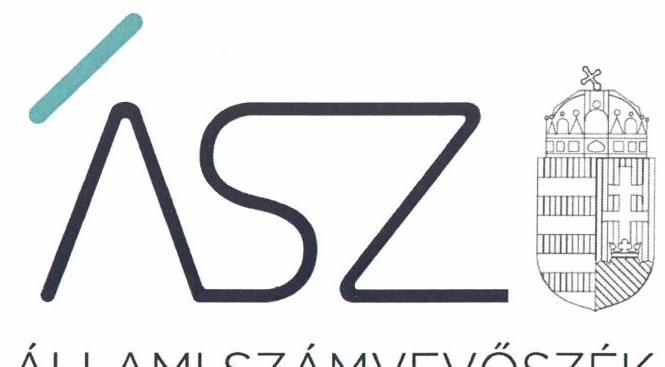
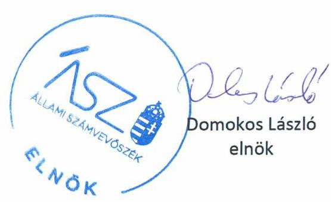

ÁLLAMI SZÁMVEVŐSZÉK

# JELENTÉS 

## Nem állami humánszolgáltatók ellenőrzése

A szociális humánszolgáltatást nyújtó intézmények, szolgáltatók államháztartáson kívüli fenntartói központi költségvetésből kapott támogatásai felhasználásának ellenőrzése -

HAJDÚ GONDOSKODÓ Szervező, Ellátó Nonprofit Korlátolt Felelősségű Társaság
2020.

20065
www.asz.hu

---

ÁLLAMI SZÁMVEVŐSZÉK

# JELENTÉS 

## Nem állami humánszolgáltatók ellenőrzése

A szociális humánszolgáltatást nyújtó intézmények, szolgáltatók államháztartáson kívüli fenntartói központi költségvetésből kapott támogatásai felhasználásának ellenőrzése -

HAJDÚ GONDOSKODÓ Szervező, Ellátó Nonprofit Korlátolt Felelősségű Társaság
2020. 04. hó 30. nap

20065
www.asz.hu

---

# AZ ELLENŐRZÉST FELÜGYELTE: 

KLINGA LÁSZLÓ felügyeleti vezető

## AZ ELLENŐRZÉST VEZETTE ÉS A VÉGREHAJTÁSÁÉRT FELELŐS:

KUSZINGER ANDREA ellenőrzésvezető
DR. TÓTH LILI ellenőrzésvezető

A PROGRAM ÖSSZEÁLLÍTÁSÁÉRT FELELŐS:
FEKETE-NAGY ANDRÁS GÁBOR ellenőrzési programért felelős vezető

TÓTPÁL SZABOLCS osztályvezető

Jelentéseink az Országgyúlés számítógépes hálózatán és az interneten a www.asz.hu címen is olvashatóak.

IKTATÓSZÁM: EL-2568-001/2020.
TÉMASZÁM: 2491
ELLENŐRZÉS-AZONOSÍTÓ SZÁM: V083585, V0867105

---

# TARTALOMJEGYZÉK 

■ ÖSSZEGZÉS ..... 5
■ AZ ELLENŐRZÉS CÉLJA ..... 6
■ AZ ELLENŐRZÉS TERÜLETE ..... 7
■ AZ ELLENŐRZÉS HÁTTERE, INDOKOLTSÁGA ..... 8
■ A JELENTÉS LÉNYEGES KÉRDÉSKÖREI ..... 9
■ AZ ELLENŐRZÉS HATÓKÖRE ÉS MÓDSZEREI ..... 10
■ MEGÁLLAPÍTÁSOK ..... 12
■ MELLÉKLETEK ..... 15
I. sz. melléklet: Értelmező szótár ..... 15
■ FÜGGELÉK: ÉSZREVÉTELEK ..... 17
■ RÖVIDÍTÉSEK JEGYZÉKE ..... 19

---

.

---

# ÖSSZEGZÉS 

A hajdúhadházi székhelyű HAJDÚ GONDOSKODÓ Szervező, Ellátó Nonprofit Korlátolt Felelősségű Társaság szociális humánszolgáltatási közfeladat ellátásra kapott költségvetési támogatásokkal való gazdálkodása elszámoltatható és átlátható volt, a támogatásokat szabályszerűen az intézménye müködtetésére fordította.

## Az ellenőrzés társadalmi indokoltsága

A szociális gondoskodást igénylők védelme, illetve a köznevelési feladatok ellátása az Alaptörvényben meghatározott, a társadalom szempontjából fontos tevékenységek. Jogszabályok teszik lehetővé, hogy államháztartáson kívüli szervezetek - így például az egyházi fenntartók, alapítványok, gazdasági társaságok, egyesületek - által fenntartott intézmények is végezzenek köznevelési, szociális és gyermekvédelmi feladatokat. Mindehhez a központi költségvetés évente jelentős összegű támogatással járul hozzá. Az államháztartáson kívüli, humánszolgáltatást végző intézmények az igényelt közpénzekből társadalmilag hasznos, közösségteremtő, közérdekű, illetve közhasznú tevékenységet végeznek, illetve közfeladatokat látnak el.

Az intézményfenntartók ellenőrzésével az Állami Számvevőszék hozzájárul ahhoz, hogy ezen közpénzeket az államháztartáson kívüli szervezetek is ellenőrizhető, átlátható és elszámoltatható módon használják fel a közfeladatok ellátása során. Az ellenőrzések célja továbbá, hogy a nyilvánosság és az igénybevevők megfelelő tájékoztatást kapjanak az államháztartáson kívüli közfeladatot ellátók müködéséről.

Az ÁSZ ellenőrzései arra is választ adnak, hogy az intézményfenntartók arra használták-e fel a közpénzeket, amire igényelték.

A szabályszerű gazdálkodás elengedhetetlen a közfeladat ellátás szakmai céljainak megvalósításához, valamint a társadalmi közbizalom fenntartásához.

## Főbb megállapítások, következtetések

A HAJDÚ GONDOSKODÓ Szervező, Ellátó Nonprofit Korlátolt Felelősségű Társaság kialakította a szociális humánszolgáltatási közfeladata ellátásának szabályszerű kereteit a 2015-2018. években.

A HAJDÚ GONDOSKODÓ Szervező, Ellátó Nonprofit Korlátolt Felelősségű Társaság a kapott költségvetési támogatásokat szabályszerűen fordította humánszolgáltató intézménye működtetésére, biztosította a költségvetési támogatások elszámoltathatóságát a 2015-2018. években.

---

# AZ ELLENŐRZÉS CÉLJA

**AZ ELLENŐRZÉS CÉLJA** annak értékelése volt, hogy a nem állami, nem önkormányzati szociális intézmények fenntartói központi költségvetésből kapott támogatásainak felhasználása szabályszerű volt-e.

---

# **AZ ELLENŐRZÉS TERÜLETE**

## **HAJDÚ GONDOSKODÓ Szervező, Ellátó Nonprofit Korlátolt Felelősségű Társaság, mint intézményfenntartó**

A hajdúhadházi székhelyű HAJDÚ GONDOSKODÓ Szervező, Ellátó Nonprofit Korlátolt Felelősségű Társaság 2009. augusztus 25-én átalakulás útján jött létre a HAJDÚ GONDOSKODÓ Szervező, Ellátó Közhasznú Társaságból. A hajdúhadházi székhelyű közhasznú Társaságot szociális közfeladat ellátása érdekében két magánszemély alapította.

A Társaság fenntartásában egy szolgáltató volt, az önálló jogi személyiséggel nem rendelkező Hajdú Gondoskodó Szociális Szolgáltató Központ. A szolgáltató hajdúhadházi székhelyén fogyatékos személyek és pszichiátriai betegek nappali ellátását, pszichiátriai betegek részére nyújtott közösségi alapellátást és utcai szociális munkát végeztek, a szintén hajdúhadházi telephelyén szenvedélybetegek nappali ellátását, közösségi alapellátását biztosították a Hajdúhadház Város Önkormányzatával kötött feladat-ellátási szerződések alapján.

A Társaság kiemelten közhasznú jogállású szervezet volt az ellenőrzött időszakban, amely vállalkozási tevékenységet is végzett.

A Fenntartó1 képviseletét az ügyvezető látta el, akinek a személyében nem történt változás az ellenőrzött időszakban. A Társaság legfőbb szerve a taggyűlés volt. A Fenntartó működésének és gazdálkodásának ellenőrzésére három tagból álló felügyelőbizottságot hoztak létre.

A Társaságot a 2015-2018. években ágazati pótlék, a szociális ellátáshoz kapcsolódó támogatás, valamint kiegészítő pótlék illette meg. A feladat-ellátáshoz kapott költségvetési támogatások összege a 2015. évben 64,9 M Ft, a 2016. évben 68,1 M Ft, a 2017. évben 70,7 M Ft, a 2018. évben 74,6 M Ft volt.

---

# AZ ELLENŐRZÉS HÁTTERE, INDOKOLTSÁGA 

A szociális feladatokat ellátó nem állami intézményfenntartók részére közfeladataik ellátására évente jelentős összegű pénzügyi támogatást biztosítottak a mindenkori költségvetési törvények a bennük megfogalmazott feltételek mellett. A felhasználható állami támogatások a Kvtv. ${ }^{2}$-ben a 2015-2018. években a szociális ágazatra vonatkozóan 360 Mrd Ft előirányzatot határoztak meg. 2013. évben jelentős változások következtek be a normatív finanszírozás rendszerében. Új feladatfinanszírozási forma (átlagbéralapú támogatás) jelent meg, amely az államháztartáson kívüli intézményfenntartókra is vonatkozik. Az ellenőrzés a finanszírozási rendszerben 2011-2015 között bekövetkezett változásokra, azok közfeladat ellátásra gyakorolt hatására fókuszál a költségvetési támogatásokat felhasználó államháztartáson kívüli szervezetek körében. Az ellenőrzések indokoltságát az is alátámasztja, hogy az ÁSZ ${ }^{3}$ számos szervezetet még nem ellenőrzött ezen a területen.

Az ÁSZ stratégiájában foglaltak alapján is indokolt az ellenőrzés, amely a társadalom számára jelzi, hogy a közpénz államháztartáson kívüli felhasználása sem maradhat ellenőrizetlenül. Az államháztartáson kívülre nyújtott költségvetési támogatások ellenőrzésével az ÁSZ hozzájárul ahhoz, hogy a közpénzeket a nem állami humán fenntartók átlátható módon használják fel a közfeladatok ellátására kötött szerződésekben vállalt kötelezettségek teljesítése érdekében. Az ellenőrzés javaslataival hozzájárulhat az említett rendszerek szabályszerű támogatás felhasználásához, javíthatja a társadalmi-gazdasági döntések megalapozottságát, amely a „jól irányított állam müködésének" feltétele.

A holisztikus megközelítés jegyében az ellenőrzés keretében egyedi kockázatelemzés alapján kiválasztott fenntartóknál és intézményeiknél értékeljük az államháztartáson kívüli szociális tevékenységhez kapcsolódó támogatások felhasználásának megfelelőségét

---

# A JELENTÉS LÉNYEGES KÉRDÉSKÖREI 

1. A szociális humánszolgáltató közfeladatot ellátó államháztartáson kívüli fenntartó szabályszerű müködési- és gazdálkodási környezet kialakításával megteremtette-e a költségvetési támogatások átlátható, elszámoltatható igénybevételének, felhasználásának feltételeit?
2. Az államháztartáson kívüli fenntartó az átvállalt szociális humánszolgáltatási közfeladathoz biztositott költségvetési támogatásokat szabályszerűen fordította-e a humánszolgáltató intézménye müködtetésére?
3. Az államháztartáson kívüli fenntartó a szociális humánszolgáltató intézménye müködtetéséhez felhasznált közpénzekre vonatkozó gazdálkodásával a nyilvánosság előtt elszámolt-e, ennek érdekében ellenőrzési, értékelési és a külső ellenőrzésekkel kapcsolatos intézkedési feladatait szabályszerűen látta-e el?

---

# AZ ELLENŐRZÉS HATÓKÖRE ÉS MÓDSZEREI 

## Az ellenőrzés típusa

Megfelelőségi ellenőrzés.

## Az ellenőrzött időszak

A 2015. január 1. és 2018. december 31-e közötti időszak.

## Az ellenőrzés tárgya

Az ellenőrzés a szociális humánszolgáltatási közfeladatokat ellátó Fenntartó humánszolgáltatási közfeladatai ellátásához a költségvetési törvényekben biztosított központi költségvetési támogatások igénylése, évközi módosítása és év végi elszámolása fenntartói feladatellátása, illetve e központi költségvetésből kapott támogatásaik humánszolgáltatási közfeladatokra való fenntartó általi felhasználása szabályszerűségének értékelésére terjedt ki.

## Az ellenőrzött szervezet

HAJDÚ GONDOSKODÓ Szervező, Ellátó Nonprofit Korlátolt Felelősségű Társaság.

## Az ellenőrzés jogalapja

Az ellenőrzés jogszabályi alapját az ÁSZ tv. ${ }^{4}$ 1. § (3) bekezdése, 5. § (3) bekezdésében foglalt előírások adták.

## Az ellenőrzés módszerei

Az ellenőrzést az ellenőrzési program szempontjai, kérdései, az ellenőrzött időszakban hatályos jogszabályok, a nemzetközi standardokat irányadónak tekintve, az ellenőrzés szakmai szabályok és módszertanok figyelembe vételével végezte az ÁSZ. A közpénzekkel való felelős gazdálkodás segítésére irányuló javaslatok kidolgozásakor a hatályos jogszabályok az irányadóak.

Az ellenőrzés ideje alatt az ellenőrzött szervezettel történő kapcsolattartást az ÁSZ SZMSZ-ének vonatkozó előírásai alapján biztosította az ÁSZ.

---

Az ellenőrzési kérdések megválaszolásához szükséges bizonyítékok megszerzése az ellenőrzött által rendelkezésre bocsátott dokumentumokra, adatokra alapozva elemző eljárással történt.

Az ellenőrzési bizonyítékként felhasználható adatforrások közé tartoznak egyrészt a szakmai program részletes szempontjainál felsorolt adatforrások, másrészt minden - az ellenőrzés folyamán feltárt, az ellenőrzés szempontjából információt tartalmazó - dokumentum.

Az ellenőrzés lefolytatásához az ellenőrzött szervezet a kitöltött tanúsítványok, valamint az ÁSZ által kért dokumentumok elektronikus úton való megküldésével szolgáltat adatokat, információkat. Az így rendelkezésre bocsátott adatok, információk és a tanúsítványok adatai valódiságának kontrollja az ellenőrzés keretében történik.

A szociális humánszolgáltatások központi költségvetési támogatásaival kapcsolatos, államháztartáson kívüli fenntartó jogszabályokban előírt feladatai betartását, továbbá a központi költségvetési támogatások szabályszerű nyilvántartását ellenőrizte az ÁSZ a fenntartónál rendelkezésre álló nyilvántartások, beszámolók és egyéb dokumentumok alapján. Az ellenőrzés nem terjed ki a szociális humánszolgáltatások központi költségvetési támogatásai igénylése, módosítása, elszámolása valódiságának, megalapozottságának, helyességének - sem a fenntartónál, sem a székhely intézményeinél való - értékelésére. Továbbá nem terjed ki az ellenőrzés e források szabályszerű felhasználásának értékelésére.

---

# MEGÁLLAPÍTÁSOK 

## 1. A szociális humánszolgáltató közfeladatot ellátó államháztartáson kívüli fenntartó szabályszerű müködési- és gazdálkodási környezet kialakításával megteremtette-e a költségvetési támogatások átlátható, elszámoltatható igénybevételének, felhasználásának feltételeit?

Összegző megállapítás A müködési- és gazdálkodási környezet kialakítása a 20152018. években szabályszerű volt.

A FENNTARTÓ rendelkezett Társasági szerződéssel és szervezeti és müködési szabályzattal, továbbá gondoskodott intézménye ${ }^{5}$ szervezeti és müködési szabályzatának, szakmai programjának és házirendjének elkészítéséről is.

A Fenntartó rendelkezett a jogszabályi előírások szerinti Számviteli politikával és az annak keretében kötelezően elkészítendő szabályzatokkal. A Fenntartó a kapott támogatások elkülönített számviteli nyilvántartási kötelezettsége biztosítása érdekében kialakította a Költségvetési támogatás kezelésének belső szabályzatát.

FENNTARTÓ A KÖLTSÉGVETÉSI TÁMOGATÁSOK igénylési, módosítási és elszámolási feladatait szabályszerűen látta el.

## 2. Az államháztartáson kívüli fenntartó az átvállalt szociális humánszolgáltatási közfeladathoz biztosított költségvetési támogatásokat szabályszerűen fordította-e a humánszolgáltató intézménye müködtetésére?

Összegző megállapítás A Fenntartó a költségvetési támogatásokat szabályszerűen fordította humánszolgáltató Intézménye müködtetésére.

A FENNTARTÓ a 2015 - 2018. években - a jogszabályi előírásokkal összhangban - a költségvetési támogatások felhasználását, az Intézmény gazdálkodását, továbbá a támogatás és a térítési díj felhasználását a számviteli rendjében feladatonkénti bontásban, elkülönítetten kezelte.

A Fenntartó az Intézménye vonatkozásában meghatározta a kérhető térítési és gondozási díj megállapításának szabályait, a szociális alapon adható kedvezmények feltételeit a jogszabályi előírások szerint.

---

# 3. Az államháztartáson kívüli fenntartó a szociális humánszolgáltató intézménye múködtetéséhez felhasznált közpénzekre vonatkozó gazdálkodásával a nyilvánosság előtt elszámolt-e, ennek érdekében ellenőrzési, értékelési és a külső ellenőrzésekkel kapcsolatos intézkedési feladatait szabályszerűen látta-e el? 

Összegző megállapítás A Fenntartó a szociális humánszolgáltató intézménye múködtetéséhez felhasznált közpénzekre vonatkozó gazdálkodásával a nyilvánosság előtt elszámolt a 2015-2018. években.

A Fenntartó a jogszabályi előírások szerinti egyszerűsített éves beszámolót készített, amelyet honlapján évente közzétett.

---

.

---

# MELLÉKLETEK 

- I. SZ. MELLÉKLET: ÉRTELMEZŐ SZÓTÁR
humánszolgáltatás
költségvetési támogatás
nem állami, nem önkormányzati (államháztartáson kívüli) intézmény fenntartó

Külön törvényben meghatározott szociális, gyermekjóléti, gyermekvédelmi, közoktatási, felsőoktatási, kulturális közfeladatok (2014. évi Kvtv. 34. § (1), (4) bekezdés, 1. számú melléklet XX/20/2. alcím, 19. alcím, 2015. évi Kvtv. 43. § (1), (4) bekezdés, 1. számú melléklet XX/20/2/3. jogcím csoport, 19. alcím, 2016. évi Kvtv. 41. § (1), (4) bekezdés, 1. számú melléklet XX/20/2/3. jogcím csoport, 19. alcím), 2017. évi Kvtv. 43. § (1), (4) bekezdés, 1. számú melléklet XX/20/2/3. jogcímcsoport, 19. alcím, 2018 évi Kvtv. 43. § (1), (4) bekezdés, 1. számú melléklet XX/20/2/3. jogcímcsoport, 19. alcím.
A társadalombiztosítás pénzügyi alapjai kivételével az államháztartás központi alrendszeréből ellenérték nélkül, pénzben nyújtott támogatások (Áht. ${ }^{6}$ 1. § 14. pont)

A költségvetési törvényekben (2013. évi CCXXX. törvény 33-34. §, 2014. évi C. törvény 42-43. §, 2015. évi C. törvény 40-41. §, 2016. évi Kvtv. 40-41.§, 2017. évi Kvtv. 40-41. §, 2018. évi Kvtv. 40-41. §.) megállapított támogatás. A 2015. évi C. törvény 40-41. § szerint többek között: Az Országgyűlés a köznevelési feladat ellátására átlagbéralapú támogatást állapít meg. A nevelési-oktatási, valamint pedagógiai szakszolgálati intézményt fenntartó nemzetiségi önkormányzat, az egyházi és magán köznevelési intézmény fenntartója részére az általuk fenntartott nevelési-oktatási intézményben, továbbá pedagógiai szakszolgálati intézményben pedagógus és - a b) pont kivételével - nevelőoktató munkát közvetlenül segítő munkakörben foglalkoztatottak után a 7. melléklet I. pontja, valamint az óvoda, egységes óvoda-bölcsőde esetében a 2. melléklet II. pont 1. alpontja szerint és az 5. alpontjában meghatározott jogosultak után, az őket ott megillető mértékek szerint.
Az Országgyűlés a szociális, gyermekjóléti, gyermekvédelmi közfeladatot ellátó intézményt, szolgáltatást fenntartó egyházi jogi személy, civil szervezet, közalapítvány, országos nemzetiségi önkormányzat, települési vagy területi nemzetiségi önkormányzat, gazdasági társaság, és a humánszolgáltatást alaptevékenységként végző, az Szja tv. hatálya alá tartozó egyéni vállalkozó (a továbbiakban együtt: nem állami szociális fenntartó) részére támogatást állapít meg a következők szerint: a támogatás a nem állami szociális fenntartót a települési önkormányzatok 2. melléklet III. pont 3. alpont c)-k) pontjában és III. pont 5. alpont a) pontjában meghatározott támogatásaival azonos jogcímeken, összegben és feltételek mellett illeti meg.
A köznevelési és szociális, gyermekjóléti és gyermekvédelmi közfeladatokat/humánszolgáltatásokat ellátó intézményt fenntartó egyházi jogi személy, társadalmi szervezet, alapítvány, közalapítvány, civil szervezet, országos nemzetiségi önkormányzat, nonprofit gazdasági társaság, gazdasági társaság és a humánszolgáltatást alaptevékenységként végző, Szja tv. hatálya alá tartozó egyéni vállalkozó. (2013. évi Kvtv. 35. § (1), (3) bekezdés, 2014. évi Kvtv. 33. §, 34. § (1), (4) bekezdés, 2015. évi Kvtv. 42. §, 43. § (1), (4) bekezdés, 2016. évi Kvtv. 40. §, 41. § (1), (4) bekezdés, 2016. évi Kvtv. 40.§, 41.§ (1), (4) bekezdés, 2017. évi Kvtv. 40.§, 41.§ (1), (4) bekezdés, 2018. évi Kvtv. 40. § 41.§ (1), (4) bekezdés).

---

.

---

# FÜGGELÉK: ÉSZREVÉTELEK 

A jelentéstervezetet a Számvevőszék 15 napos észrevételezésre megküldte az ellenőrzött szervezet vezetőjének az ÁSZ tv. 29. §* (1) bekezdése előírásának megfelelően.

A HAJDÚ GONDOSKODÓ Szervező, Ellátó Nonprofit Korlátolt Felelősségű Társaság ügyvezetője a jelentéstervezet megállapításaira nem tett észrevételt.

[^0]
[^0]:    * 29. § (1) Az Állami Számvevőszék az ellenőrzési megállapításait megküldi az ellenőrzött szervezet vezetőjének vagy az általa megbízott személynek, és annak, akinek személyes felelősségét állapította meg.
    (2) Az ellenőrzött szervezet vezetője és a felelősként megjelölt személy az ellenőrzés megállapításaira tizenöt napon belül írásban észrevételt tehet.
    (3) Az Állami Számvevőszék az észrevételre a beérkezésétől számított harminc napon belül írásban válaszol. A figyelembe nem vett észrevételeket köteles a jelentésben feltüntetni, és megindokolni, hogy azokat miért nem fogadta el.

---

.

---

# RÖVIDÍTÉSEK JEGYZÉKE 

${ }^{1}$ Fenntartó
${ }^{2}$ Kvtv.-ek
${ }^{3}$ ÁSZ
${ }^{4}$ ÁSZ tv.
${ }^{5}$ Intézmény
${ }^{6}$ Áht.

HAJDÚ GONDOSKODÓ Szervező, Ellátó Nonprofit Korlátolt Felelősségű Társaság 2014. évi C. törvény - Magyarország 2015. évi központi költségvetéséről, 2015. évi C. törvény - Magyarország 2016. évi központi költségvetéséről, 2016. évi CX. törvény - Magyarország 2017. évi központi költségvetéséről, 2017. évi C. törvény - Magyarország 2018. évi központi költségvetéséről Állami Számvevőszék
2011. évi LXVI. törvény az Állami Számvevőszékről

Hajdú Gondoskodó Szociális Szolgáltató Központ
2011. évi CXCV. törvény az államháztartásról

---

# ASZ 

ALLAMI SZAMVEVOSZEK
1052 Budapest, Apáczai Cs. J. u. 10. I 1364 Budapest 4. Pf. 54 TEL: +36 14849100
email: szamvevoszek@asz.hu
web: www.asz.hu | www.aszhirportal.hu