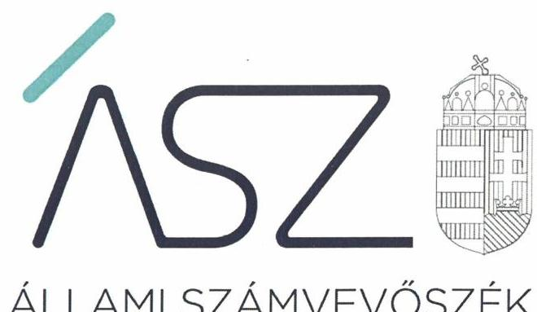
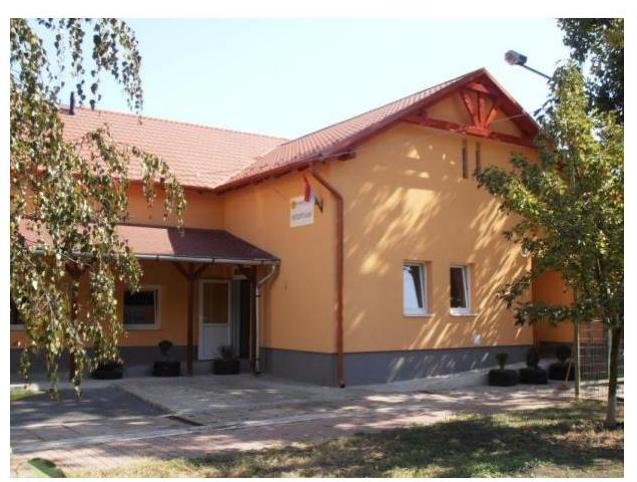

ÁLLAMI SZÁMVEVŐSZÉK

# JELENTÉS 

## Nem állami humánszolgáltatók ellenőrzése

A szociális humánszolgáltatást nyújtó intézmények, szolgáltatók államháztartáson kívüli fenntartói központi költségvetésből kapott támogatásai felhasználásának ellenőrzése "Napfényt az életnek" Alapítvány

2020
20066
www.asz.hu

---

ÁLLAMI SZÁMVEVŐSZÉK

# JELENTÉS 

## Nem állami humánszolgáltatók ellenőrzése

A szociális humánszolgáltatást nyújtó intézmények, szolgáltatók államháztartáson kívüli fenntartói központi költségvetésből kapott támogatásai felhasználásának ellenőrzése "Napfényt az életnek" Alapítvány
2020. 04. hó 30 nap

20066
www.asz.hu

---

# AZ ELLENŐRZÉST FELÜGYELTE: 

KLINGA LÁSZLÓ felügyeleti vezető

## AZ ELLENŐRZÉST VEZETTE ÉS A VÉGREHAJTÁSÁÉRT FELELŐS:

DÉZSINÉ KIS HAJNALKA ellenőrzésvezető

## A PROGRAM ÖSSZEÁLLÍTÁSÁÉRT FELELŐS:

FEKETE-NAGY ANDRÁS GÁBOR ellenőrzési programért felelős vezető

TÓTPÁL SZABOLCS osztályvezető

IKTATÓSZÁM: EL-2569-001/2020.
Jelentéseink az Országgyúlés számítógépes hálózatán és az interneten a www.asz.hu címen is olvashatóak.

TÉMASZÁM: 2491
ELLENŐRZÉS-AZONOSÍTÓ SZÁM: V083553, V0867083

---

# TARTALOMJEGYZÉK 

■ ÖSSZEGZÉS ..... 5
■ AZ ELLENŐRZÉS CÉLJA ..... 6
■ AZ ELLENŐRZÉS TERÜLETE ..... 7
■ AZ ELLENŐRZÉS HÁTTERE, INDOKOLTSÁGA ..... 8
■ A JELENTÉS LÉNYEGES KÉRDÉSKÖREI ..... 9
■ AZ ELLENŐRZÉS HATÓKÖRE ÉS MÓDSZEREI ..... 10
■ MEGÁLLAPÍTÁSOK ..... 12
■ MELLÉKLETEK ..... 15
I. sz. melléklet: Értelmező szótár ..... 15
■ FÜGGELÉK: ÉSZREVÉTELEK ..... 17
■ RÖVIDÍTÉSEK JEGYZÉKE ..... 19

---

.

---

# ÖSSZEGZÉS 

A miskolci székhelyű „Napfényt az életnek" Alapítvány szociális humánszolgáltatási közfeladat ellátására kapott költségvetési támogatásokkal való gazdálkodása elszámoltatható és átlátható volt, a támogatásokat szabályszerűen az intézménye müködtetésére fordította.

## Az ellenőrzés társadalmi indokoltsága

A szociális gondoskodást igénylők védelme, illetve a köznevelési feladatok ellátása az Alaptörvényben meghatározott, a társadalom szempontjából fontos tevékenységek. Jogszabályok teszik lehetővé, hogy államháztartáson kívüli szervezetek - így például az egyházi fenntartók, alapítványok, gazdasági társaságok, egyesületek - által fenntartott intézmények is végezzenek köznevelési, szociális és gyermekvédelmi feladatokat. Mindehhez a központi költségvetés évente jelentős összegű támogatással járul hozzá. Az államháztartáson kívüli, humánszolgáltatást végző intézmények az igényelt közpénzekből társadalmilag hasznos, közösségteremtő, közérdekű, illetve közhasznú tevékenységet végeznek, illetve közfeladatokat látnak el.

Az intézményfenntartók ellenőrzésével az Állami Számvevőszék hozzájárul ahhoz, hogy ezen közpénzeket az államháztartáson kívüli szervezetek is ellenőrizhető, átlátható és elszámoltatható módon használják fel a közfeladatok ellátása során. Az ellenőrzések célja továbbá, hogy a nyilvánosság és az igénybevevők megfelelő tájékoztatást kapjanak az államháztartáson kívüli közfeladatot ellátók múködéséről.

Az ÁSZ ellenőrzései arra adnak választ, hogy az intézményfenntartók arra használták-e fel a közpénzeket, amire igényelték.

A szabályszerű gazdálkodás elengedhetetlen a közfeladat ellátás szakmai céljainak megvalósításához, valamint a társadalmi közbizalom fenntartásához.

## Főbb megállapítások, következtetések

A „Napfényt az életnek" Alapítvány a 2015-2018. években szabályszerű működési- és gazdálkodási környezet kialakításával megteremtette a költségvetési támogatások átlátható, elszámoltatható igénybevételének, felhasználásának feltételeit.

A „Napfényt az életnek" Alapítvány a 2015-2018. években az átvállalt szociális humánszolgáltatási közfeladathoz biztosított költségvetési támogatásokat szabályszerűen fordította a humánszolgáltató intézménye müködtetésére.

A „Napfényt az életnek" Alapítvány a 2015-2018. években a szociális humánszolgáltató intézménye múködtetéséhez felhasznált közpénzekre vonatkozó gazdálkodásával elszámolt, közzétételi kötelezettségét teljesítette és a külső ellenőrzésekkel kapcsolatos intézkedési feladatait szabályszerűen ellátta.

---

# AZ ELLENŐRZÉS CÉLJA

**AZ ELLENŐRZÉS CÉLJA** annak értékelése volt, hogy a nem állami, nem önkormányzati szociális intézmények fenntartói központi költségvetésből kapott támogatásainak felhasználása szabályszerű volt-e.

---

# AZ ELLENŐRZÉS TERÜLETE 

## „Napfényt az életnek" Alapítvány

A „Napfényt az életnek" Alapítványt 1994-ben 4 magánszemély, a Magyar Vöröskereszt BAZ ${ }^{1}$ megyei szervezete, és 2 gazdasági társaság alapította azzal a céllal, hogy az időskorúak magánjellegú szociális célú, differenciált igényekhez alkalmazkodó ellátását biztosítsa. A BAZ megyei bíróság 1994. június 29-én vette nyilvántartásba az Alapítványt².

Az Alapítvány 2007-ben Ellátási szerződést kötött Miskolc Megyei Jogú Város Önkormányzatával az Önkormányzat által rendelkezésre bocsátott ingatlanban személyes gondoskodást nyújtó szociális feladatok ellátására. Ennek keretében vállalta átmeneti szállás, rehabilitációs intézmény, nappali melegedő, egészségügyi centrum, és utcai gondozószolgálat müködtetését.

A szociálisan rászorultak részére nyújtott személyes gondoskodást az Alapítvány önálló jogi személyiséggel nem rendelkező Intézménye, a Hajléktalanok, Szegények Egészségügyi és Mentálhigiéniás Háza látta el.

A 2015-2018. évi egyszerúsített éves beszámolók adatai alapján az Alapítvány a szociális humánszolgáltatási feladatok ellátására a 2015. évben 192,4 M Ft, a 2016. évben 208,6 M Ft, a 2017. évben 225,6 M Ft, a 2018. évben 234,2 M Ft összegű költségvetési támogatásban részesült. Az Alapítvány az ellenőrzött időszakban könyvvizsgálatra nem volt kötelezett.

---

# AZ ELLENŐRZÉS HÁTTERE, INDOKOLTSÁGA 

A szociális feladatokat ellátó nem állami intézményfenntartók részére közfeladataik ellátására évente jelentős összegű pénzügyi támogatást biztosítottak a mindenkori költségvetési törvények a bennük megfogalmazott feltételek mellett. A felhasználható állami támogatások a Kvtv. ${ }^{3}$-ben a 2015-2018. években a szociális ágazatra vonatkozóan 360 Mrd Ft előirányzatot határoztak meg. 2013. évben jelentős változások következtek be a normatív finanszírozás rendszerében. Új feladatfinanszírozási forma (átlagbéralapú támogatás) jelent meg, amely az államháztartáson kívüli intézményfenntartókra is vonatkozik. Az ellenőrzés a finanszírozási rendszerben 2011-2015 között bekövetkezett változásokra, azok közfeladat ellátásra gyakorolt hatására fókuszál a költségvetési támogatásokat felhasználó államháztartáson kívüli szervezetek körében. Az ellenőrzések indokoltságát az is alátámasztja, hogy az ÁSZ ${ }^{4}$ számos szervezetet még nem ellenőrzött ezen a területen.

Az ÁSZ stratégiájában foglaltak alapján is indokolt az ellenőrzés, amely a társadalom számára jelzi, hogy a közpénz államháztartáson kívüli felhasználása sem maradhat ellenőrizetlenül. Az államháztartáson kívülre nyújtott költségvetési támogatások ellenőrzésével az ÁSZ hozzájárul ahhoz, hogy a közpénzeket a nem állami humán fenntartók átlátható módon használják fel a közfeladatok ellátására kötött szerződésekben vállalt kötelezettségek teljesítése érdekében. Az ellenőrzés javaslataival hozzájárulhat az említett rendszerek szabályszerű támogatás felhasználásához, javíthatja a társadalmi-gazdasági döntések megalapozottságát, amely a „jól irányított állam müködésének" feltétele.

A holisztikus megközelítés jegyében az ellenőrzés keretében egyedi kockázatelemzés alapján kiválasztott fenntartóknál és intézményeiknél értékeljük az államháztartáson kívüli szociális tevékenységhez kapcsolódó támogatások felhasználásának megfelelőségét.

---

# A JELENTÉS LÉNYEGES KÉRDÉSKÖREI 

1. A szociális humánszolgáltató közfeladatot ellátó államháztartáson kívüli fenntartó szabályszerű müködési- és gazdálkodási környezet kialakításával megteremtette-e a költségvetési támogatások átlátható, elszámoltatható igénybevételének, felhasználásának feltételeit?
2. Az államháztartáson kívüli fenntartó az átvállalt szociális humánszolgáltatási közfeladathoz biztositott költségvetési támogatásokat szabályszerűen fordította-e a humánszolgáltató intézménye müködtetésére?
3. Az államháztartáson kívüli fenntartó a szociális humánszolgáltató intézménye müködtetéséhez felhasznált közpénzekre vonatkozó gazdálkodásával a nyilvánosság előtt elszámolt-e, ennek érdekében ellenőrzési, értékelési és a külső ellenőrzésekkel kapcsolatos intézkedési feladatait szabályszerűen látta-e el?

---

# AZ ELLENŐRZÉS HATÓKÖRE ÉS MÓDSZEREI 

## Az ellenőrzés típusa

Megfelelőségi ellenőrzés.

## Az ellenőrzött időszak

A 2015. január 1-je és 2018. december 31-e közötti időszak.

## Az ellenőrzés tárgya

Az ellenőrzés a szociális humánszolgáltatási közfeladatokat ellátó államháztartáson kívüli fenntartók humánszolgáltatási közfeladatai ellátásához a központi költségvetésből kapott támogatásaik humánszolgáltatási közfeladatokra való fenntartó általi felhasználása szabályszerűségének értékelésére terjed ki.

## Az ellenőrzött szervezet

„Napfényt az életnek" Alapítvány

## Az ellenőrzés jogalapja

Az ellenőrzés jogszabályi alapját az ÁSZ tv. ${ }^{5}$ 1. § (3) bekezdésében és az 5. § (3) bekezdésében foglalt előírások adják.

## Az ellenőrzés módszerei

Az ellenőrzést az ellenőrzési program szempontjai, kérdései, az ellenőrzött időszakban hatályos jogszabályok, a nemzetközi standardokat irányadónak tekintve, az ellenőrzés szakmai szabályok és módszertanok figyelembe vételével végezte az ÁSZ. A közpénzekkel való felelős gazdálkodás segítésére irányuló javaslatok kidolgozásakor a hatályos jogszabályok voltak az irányadóak.

Az ellenőrzés ideje alatt az ellenőrzött szervezettel történő kapcsolattartást az ÁSZ SZMSZ6-ének vonatkozó előírásai alapján biztosította az ÁSZ.

Az ellenőrzési kérdések megválaszolásához szükséges bizonyítékok megszerzése az ellenőrzött által rendelkezésre bocsátott dokumentumokra, adatokra alapozva megfigyelés, szemle

---

(szemrevételezés), kérdésfeltevés (információkérés), valamint elemző eljárással történt.

Az ellenőrzési bizonyítékként felhasználható adatforrások közé tartoznak egyrészt a szakmai program részletes szempontjainál felsorolt adatforrások, másrészt minden - az ellenőrzés folyamán feltárt, az ellenőrzés szempontjából információt tartalmazó - dokumentum.

Az ellenőrzés lefolytatásához az ellenőrzött szervezet a kitöltött tanúsítványok, valamint az ÁSZ által kért dokumentumok elektronikus úton való megküldésével szolgáltatott adatokat, információkat. Az így rendelkezésre bocsátott adatok, információk és a tanúsítványok adatai valódiságának kontrollja az ellenőrzés keretében történt.

Az egységes értelmezést támogatja a program mellékletét képező fogalomtár és rövidítésjegyzék.

Az ellenőrzést alapvetően a szociális humánszolgáltatások esetében a központi költségvetési támogatások igénylésével, módosításával, felhasználásával, elszámolásával kapcsolatos feladatokat ellátó államháztartáson kívüli fenntartóknál végeztük.

A szociális humánszolgáltatások központi költségvetési támogatásaival kapcsolatos, államháztartáson kívüli fenntartó jogszabályokban előírt feladatai betartását, továbbá a központi költségvetési támogatások szabályszerű nyilvántartását ellenőrizte az ÁSZ a fenntartónál rendelkezésre álló nyilvántartások, beszámolók és egyéb dokumentumok alapján. Az ellenőrzés nem terjedt ki a szociális humánszolgáltatások központi költségvetési támogatásai igénylése, módosítása, elszámolása valódiságának, megalapozottságának, helyességének - sem a fenntartónál, sem a székhely intézményeinél való - értékelésére (mivel ennek felülvizsgálata, ellenőrzése a finanszírozó jogszabályban előírt feladata, határozatai kiadása előtt). Továbbá nem terjedt ki az ellenőrzés e források szabályszerű felhasználásának értékelésére.

---

# MEGÁLLAPÍTÁSOK 

## 1. A szociális humánszolgáltató közfeladatot ellátó államháztartáson kívüli fenntartó szabályszerű müködési- és gazdálkodási környezet kialakításával megteremtette-e a költségvetési támogatások átlátható, elszámoltatható igénybevételének, felhasználásának feltételeit?

Összegző megállapítás

A Fenntartó ${ }^{7}$ a 2015-2018. években szabályszerű müködési- és gazdálkodási környezet kialakításával megteremtette a költségvetési támogatások átlátható, elszámoltatható igénybevételének, felhasználásának feltételeit.

A Fenntartó a szociális humánszolgáltatási közfeladat ellátásának megszervezését és belső szabályozottságának kialakítását a jogszabályi előírások betartásával végezte.

A Fenntartó rendelkezett a törvényi előírásoknak megfelelő hatályos alapítói okirattal és szervezeti és müködési szabályzattal, továbbá számviteli politikával és ennek keretében elkészítendő szabályzatokkal: az eszközök és források leltárkészítési és leltározási szabályzatával, az eszközök és források értékelési szabályzatával, valamint pénzkezelési szabályzattal.

A Fenntartó a jogszabály szerint maga gondoskodott intézménye szervezeti és müködési szabályzatának, szakmai programjának valamint házirendjének elkészítéséről.

A Fenntartó a törvényi előírásnak megfelelően belső szabályzatában kialakította a közfeladatokra kapott költségvetési támogatások és ezek felhasználásának feladatonkénti elkülönített nyilvántartásának kereteit.

## 2. Az államháztartáson kívüli fenntartó az átvállalt szociális humánszolgáltatási közfeladathoz biztosított költségvetési támogatásokat szabályszerűen fordította-e a humánszolgáltató intézménye müködtetésére?

Összegző megállapítás

A Fenntartó a 2015-2018. években. az átvállalt szociális humánszolgáltatási közfeladathoz biztosított költségvetési támogatásokat szabályszerűen fordította a humánszolgáltató intézménye müködtetésére.

A Fenntartó a jogszabályban foglaltaknak megfelelően feladatonként elkülönítetve tartotta nyilván a kapott támogatásokat és ezek

---

felhasználását. A Fenntartó a közfeladatra kapott költségvetési támogatások teljes összegét a humánszolgáltatást végző intézmények működtetésére fordította.

# 3. Az államháztartáson kívüli fenntartó a szociális humánszolgáltató intézménye működtetéséhez felhasznált közpénzekre vonatkozó gazdálkodásával a nyilvánosság előtt elszámolt-e, ennek érdekében ellenőrzési, értékelési és a külső ellenőrzésekkel kapcsolatos intézkedési feladatait szabályszerűen látta-e el? 

Összegző megállapítás A Fenntartó a 2015-2018. években a szociális humánszolgáltató intézménye múködtetéséhez felhasznált közpénzekre vonatkozó gazdálkodásával elszámolt.

Az Intézmény feladatellátását és a költségvetési támogatások felhasználását az Alapítvány ügyvezető szerve, a Kuratórium és a felügyelő szerve, a Felügyelő Bizottság ellenőrizte.

A Fenntartó elkészítette és közzétette a törvényi előírásoknak megfelelően a 2015-2018. évekre vonatkozóan egyszerűsített éves beszámolóját, valamint adatvédelmi és adatbiztonsági szabályzatát.

A Fenntartó a Magyar Államkincstár és az intézmények székhely szerint illetékes kormányhivatala, valamint az egyéb hatóságok által lefolytatott ellenőrzésekhez kapcsolódó intézkedési kötelezettségeinek eleget tett.

---

.

---

# MELLÉKLETEK 

■ I. SZ. MELLÉKLET: ÉRTELMEZŐ SZÓTÁR
humánszolgáltatás
külön törvényben meghatározott szociális, gyermekjóléti, gyermekvédelmi, közoktatási, felsőoktatási, kulturális közfeladatok (2015. évi Kvtv. 43. § (1), (4) bekezdés, 1. számú melléklet XX/20/2/3. jogcím csoport, 19. alcím, 2016. évi Kvtv. 41. § (1), (4) bekezdés, 1. számú melléklet XX/20/2/3. jogcím csoport, 19. alcím, 2017. évi Kvtv. 41. § (1), (4) bekezdés, 1. számú melléklet XX/20/2/3. jogcím csoport, 19. alcím)
költségvetési támogatás
A társadalombiztosítás pénzügyi alapjai kivételével az államháztartás központi alrendszeréből ellenérték nélkül, pénzben nyújtott támogatások, ide nem értve
f) a szociális igazgatásról és szociális ellátásokról szóló törvény, valamint a gyermekek védelméről és a gyámügyi igazgatásról szóló törvény szerinti pénzbeli és természetbeni szociális és gyermekvédelmi ellátásokat (Áht. ${ }^{8}$ 1. § 14. pont)
A költségvetési törvényben (2016. évi XC. törvény 40. §) megállapított támogatás többek között: Átlagbéralapú támogatást állapít meg a nevelési-oktatási, valamint pedagógiai szakszolgálati intézményt fenntartó nemzetiségi önkormányzat, az egyházi és magán köznevelési intézmény fenntartója részére az általuk fenntartott nevelési-oktatási intézményben, továbbá pedagógiai szakszolgálati intézményben pedagógus és - a (3) bekezdés kivételével - a nevelő-oktató munkát közvetlenül segítő munkakörben foglalkoztatottak után a 7. melléklet I. pontjában meghatározott jogosultak után, az őket ott megillető mértékek szerint. Múködési támogatást állapít meg a nemzetiségi önkormányzat vagy az egyházi jogi személy által fenntartott nevelési-oktatási intézményekben ellátott, továbbá a pedagógiai szakszolgálati intézményekben gyógypedagógiai tanácsadásban, korai fejlesztésben, oktatásban és gondozásban, valamint a fejlesztő nevelésben részt vevő gyermekekre, tanulókra tekintettel a nemzetiségi önkormányzat és a bevett egyház részére a 7. melléklet II. pontja szerint.
székhely intézmény
A szolgáltató székhelye, azaz a szolgáltató központi ügyintézésének helye, függetlenül attól, hogy használják-e szolgáltatás nyújtására (Sznyvhr. ${ }^{9}$ 1.§ k) pont) (hatályos: 2013. december 1-től)
telephely
A szolgáltató székhelyétől különböző, szolgáltató/intézmény használatában álló hely, a szociális humánszolgáltatáshoz használt, bejegyzett hely. (Sznyvhr. 1.§ I) pont) (hatályos: 2015. január 1-től)
nem állami, nem A humánszolgáltatásokat ellátó intézményt fenntartó egyházi jogi személy, társadalmi önkormányzati szervezet, alapítvány, közalapítvány, civil szervezet, országos nemzetiségi önkormányzat, (államháztartáson kívüli) nonprofit gazdasági társaság, gazdasági társaság és a humánszolgáltatást intézmény fenntartó alaptevékenységként végző, Szja tv. hatálya alá tartozó egyéni vállalkozó.
(2015. évi Kvtv. 43. § (1) bekezdés, 2016. évi Kvtv. 41. § (1), bekezdés, 2017. évi Kvtv. 41. § (1) bekezdés)

---

.

---

# FÜGGELÉK: ÉSZREVÉTELEK 

A jelentéstervezetet a Számvevőszék 15 napos észrevételezésre megküldte az ellenőrzött szervezet vezetőjének az ÁSZ tv. 29. §* (1) bekezdése előírásának megfelelően.

A „Napfényt az életnek" Alapítvány elnöke a jelentéstervezet megállapításaira nem tett észrevételt.

[^0]
[^0]:    * 29. § (1) Az Állami Számvevőszék az ellenőrzési megállapításait megküldi az ellenőrzött szervezet vezetőjének vagy az általa megbízott személynek, és annak, akinek személyes felelősségét állapította meg.
    (2) Az ellenőrzött szervezet vezetője és a felelősként megjelölt személy az ellenőrzés megállapításaira tizenöt napon belül írásban észrevételt tehet.
    (3) Az Állami Számvevőszék az észrevételre a beérkezésétől számított harminc napon belül írásban válaszol. A figyelembe nem vett észrevételeket köteles a jelentésben feltüntetni, és megindokolni, hogy azokat miért nem fogadta el.

---

.

---

# RÖVIDÍTÉSEK JEGYZÉKE 

${ }^{1}$ BAZ
${ }^{2}$ Alapítvány
${ }^{3}$ Kvtv.-ek
${ }^{4}$ ÁSZ
${ }^{5}$ ÁSZ tv.
${ }^{6}$ ÁSZ SZMSZ
${ }^{7}$ Fenntartó
${ }^{8}$ Áht.
${ }^{9}$ Sznyvhr.

Borsod-Abaúj-Zemplén
„Napfényt az életnek" Alapítvány
2014. évi C. törvény Magyarország 2015. évi központi költségvetéséről, 2015. évi C. törvény Magyarország 2016. évi központi költségvetéséről, 2016. évi CX. törvény Magyarország 2017. évi központi költségvetéséről, 2017. évi C. törvény Magyarország 2018. évi központi költségvetéséről Állami Számvevőszék
2011. évi LXVI. törvény az Állami Számvevőszékről

Állami Számvevőszék Szervezeti és Müködési Szabályzata
„Napfényt az életnek" Alapítvány
2011. évi CXCV. törvény az államháztartásról

369/2013. (X. 24.) Korm. rendelet a szociális, gyermekjóléti és gyermekvédelmi szolgáltatók, intézmények és hálózatok hatósági nyilvántartásáról és ellenőrzéséről (hatályos 2013. december 1-jétől)

---

# ASZ 

ALLAMI SZAMVEVOSZEK
1052 Budapest, Apáczai Cs. J. u. 10. I 1364 Budapest 4. Pf. 54 TEL: +36 14849100
email: szamvevoszek@asz.hu
web: www.asz.hu | www.aszhirportal.hu