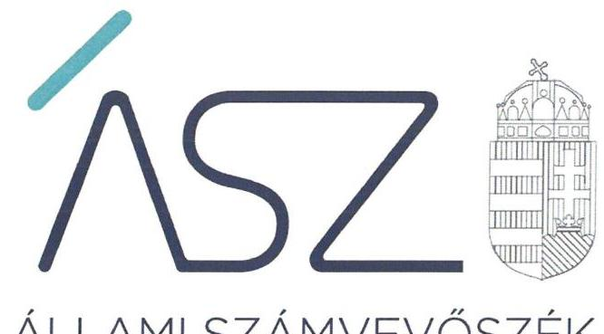
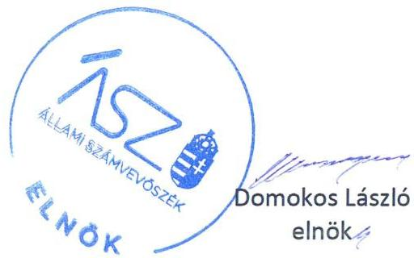

ÁLLAMI SZÁMVEVŐSZÉK

# JELENTÉS 

## Nem állami humánszolgáltatók ellenőrzése

A szociális humánszolgáltatást nyújtó intézmények, szolgáltatók államháztartáson kívüli fenntartói központi költségvetésből kapott támogatásai felhasználásának ellenőrzése Otthon Gondoz-Lak Szociális Közhasznú Egyesület
2020.

20067
www.asz.hu

---

ÁLLAMI SZÁMVEVŐSZÉK

# JELENTÉS

## Nem állami humánszolgáltatók ellenőrzése

A szociális humánszolgáltatást nyújtó intézmények, szolgáltatók államháztartáson kívüli fenntartói központi költségvetésből kapott támogatásai felhasználásának ellenőrzése – Otthon Gondoz-Lak Szociális Közhasznú Egyesület

2020. 04. hó 30. nap

20067
www.asz.hu

---

# AZ ELLENŐRZÉST FELÜGYELTE: 

MAROZSÁN LÁSZLÓNÉ felügyeleti vezető

## AZ ELLENŐRZÉST VEZETTE ÉS A VÉGREHAJTÁSÁÉRT FELELŐS:

KUSZINGER ANDREA ellenőrzésvezető

## A PROGRAM ÖSSZEÁLLÍTÁSÁÉRT FELELŐS:

FEKETE-NAGY ANDRÁS ellenőrzési program készítéséért felelős vezető

TÓTPÁL SZABOLCS osztályvezető

## IKTATÓSZÁM: EL-2561-001/2020

Jelentéseink az Országgyúlés számítógépes hálózatán és az interneten a www.asz.hu címen is olvashatóak.

TÉMASZÁM: 2491
ELLENŐRZÉS-AZONOSÍTÓ SZÁM: V083539, V0867072

---

# TARTALOMJEGYZÉK 

- ÖSSZEGZÉS ..... 5
- AZ ELLENŐRZÉS CÉLJA ..... 6
- AZ ELLENŐRZÉS TERÜLETE ..... 7
- AZ ELLENŐRZÉS HÁTTERE, INDOKOLTSÁGA ..... 8
- A JELENTÉS LÉNYEGES KÉRDÉSKÖREI ..... 9
- AZ ELLENŐRZÉS HATÓKÖRE ÉS MÓDSZEREI ..... 10
- MEGÁLLAPÍTÁSOK ..... 12
- MELLÉKLETEK ..... 15
I. sz. melléklet: Értelmező szótár ..... 15
- FÜGGELÉK: ÉSZREVÉTELEK ..... 17
- RÖVIDÍTÉSEK JEGYZÉKE ..... 19

---

.

---

# ÖSSZEGZÉS 

A békéscsabai székhelyű Otthon Gondoz-Lak Szociális Közhasznú Egyesület szociális humánszolgáltatási közfeladat ellátására a 2015-2018. években kapott központi költségvetési támogatásokkal való gazdálkodása elszámoltatható és átlátható volt, a támogatásokat szabályszerűen a szociális szolgáltató müködtetésére fordította.

## Az ellenőrzés társadalmi indokoltsága

A szociális gondoskodást igénylők védelme, illetve a köznevelési feladatok ellátása az Alaptörvényben meghatározott, a társadalom szempontjából fontos tevékenységek. Jogszabályok teszik lehetővé, hogy államháztartáson kívüli szervezetek - így például az egyházi fenntartók, alapítványok, gazdasági társaságok, egyesületek - által fenntartott intézmények is végezzenek köznevelési, szociális és gyermekvédelmi feladatokat. Mindehhez a központi költségvetés évente jelentős összegű támogatással járul hozzá. Az államháztartáson kívüli, humánszolgáltatást végző intézmények az igényelt közpénzekből társadalmilag hasznos, közösségteremtő, közérdekű, illetve közhasznú tevékenységet végeznek, illetve közfeladatokat látnak el.

Az intézményfenntartók ellenőrzésével az Állami Számvevőszék hozzájárul ahhoz, hogy ezen közpénzeket az államháztartáson kívüli szervezetek is ellenőrizhető, átlátható és elszámoltatható módon használják fel a közfeladatok ellátása során. Az ellenőrzések célja továbbá, hogy a nyilvánosság és az igénybevevők megfelelő tájékoztatást kapjanak az államháztartáson kívüli közfeladatot ellátók múködéséről.

Az ÁSZ ellenőrzései arra adnak választ, hogy az intézményfenntartók arra használták-e fel a közpénzeket, amire igényelték.

A szabályszerű gazdálkodás elengedhetetlen a közfeladat ellátás szakmai céljainak megvalósításához, valamint a társadalmi közbizalom fenntartásához.

## Főbb megállapítások, következtetések

Az Otthon Gondoz-Lak Szociális Közhasznú Egyesület kialakította a szociális humánszolgáltatási közfeladatok ellátásának múködési - és gazdálkodási környezetét, amellyel megteremtette a költségvetési támogatások szabályszerű felhasználásának feltételeit.

Az Otthon Gondoz-Lak Szociális Közhasznú Egyesület a szociális humánszolgáltatási közfeladataihoz rendelt költségvetési támogatásokat szabályszerűen kezelte, elkülönítetten tartotta nyilván és a jogszabályi előírások szerint a szociális szolgáltató múködtetésére fordította. A költségvetési támogatások felhasználásának nyilvánosságát a 2016. év kivételével biztosította.

---

# AZ ELLENŐRZÉS CÉLJA

**AZ ELLENŐRZÉS CÉLJA** annak értékelése volt, hogy a nem állami, nem önkormányzati szociális intézmények fenntartói központi költségvetésből kapott támogatásainak felhasználása szabályszerű volt-e.

---

# AZ ELLENŐRZÉS TERÜLETE 

## Otthon Gondoz-Lak Szociális Közhasznú Egyesület

A békéscsabai székhelyű Otthon Gondoz-Lak Szociális Közhasznú Egyesületet 2011-ben alapították. A Fenntartó ${ }^{1}$ célja létesítő dokumentuma szerint társadalmi szervezetként az otthonukban maradó, idős korukban segítségre szoruló emberek házi gondozása, az idősek közösségének szervezése, a családok támogatása, társadalmi integrációjuk segítsége. A Fenntartó közhasznú besorolással rendelkező egyesületként látta el feladatait.

A Fenntartó legfőbb testületi szerve a Közgyűlés², amelyben a Fenntartó tagjai vesznek részt. A Fenntartó általános képviseletét az Elnök ${ }^{3}$ látja el.

A Fenntartó feladatai ellátására önállóan gazdálkodó, önálló költségvetéssel rendelkező intézményt nem hozott lére, a fenntartott szociális szolgáltató ${ }^{4}$ a Fenntartótól nem különült el, önálló szervezettel, vagyonnal nem rendelkezett.

A Fenntartó az ellenőrzött időszakban vállalkozási tevékenységet is végzett.

A Fenntartó egyszerűsített éves beszámolójában foglaltak szerint a szociális szolgáltató fenntartásához a 2015. évben 92,2 M Ft, a 2016. évben 100,2 M Ft, a 2017. évben 74,9 M Ft és a 2018. évben 91,2 M Ft költségvetési támogatásban részesült.

---

# AZ ELLENŐRZÉS HÁTTERE, INDOKOLTSÁGA 

A szociális feladatokat ellátó nem állami intézményfenntartók részére közfeladataik ellátására 2015-2018. években jelentős összegű pénzügyi támogatást biztosítottak a mindenkori költségvetési törvények a bennük megfogalmazott feltételek mellett. A felhasználható állami támogatások jogszabály szerinti előirányzata a 2015-2018. években összesen 360 Mrd Ft volt.

Az ÁSZ ${ }^{5}$ a stratégiájában célul tűzte ki, hogy az államháztartáson kívülre nyújtott költségvetési támogatások ellenőrzésével hozzájárul ahhoz, hogy a közpénzeket az államháztartáson kívüli szervezetek is átlátható módon használják fel a közfeladatok szerződésben vállalt ellátása érdekében. Az ÁSZ a stratégiájában foglaltak alapján is indokolt az ellenőrzés, amely a társadalom számára jelzi, hogy a közpénz államháztartáson kívüli felhasználása sem maradhat ellenőrizetlenül. Az államháztartáson kívülre nyújtott költségvetési támogatások ellenőrzésével az ÁSZ hozzájárul ahhoz, hogy a közpénzeket a nem állami fenntartók átlátható módon használják fel a közfeladatok ellátására kötött szerződésekben vállalt kötelezettségek teljesítése érdekében. Az ÁSZ az ellenőrzés javaslataival hozzájárulhat az említett rendszerek szabályszerű támogatás-felhasználásához, javíthatja a társa-dalmi-gazdasági döntések megalapozottságát, amely a „jól irányított állam müködésének" feltétele.

---

# A JELENTÉS LÉNYEGES KÉRDÉSKÖREI 

1.     - A szociális humánszolgáltató közfeladatot ellátó államháztartáson kívüli fenntartó szabályszerű müködési - és gazdálkodási környezet kialakításával megteremtette-e a költségvetési támogatások átlátható, elszámoltatható igénybevételének, felhasználásának feltételeit? A költségvetési támogatásokat szabályszerűen fordította-e a szociális szolgáltató müködtetésére?
2.     - Az államháztartáson kívüli fenntartó a szociális szolgáltató müködtetéséhez felhasznált közpénzekre vonatkozó gazdálkodásával a nyilvánosság előtt elszámolt-e?

---

# AZ ELLENŐRZÉS HATÓKÖRE ÉS MÓDSZEREI 

## Az ellenőrzés típusa

Megfelelőségi ellenőrzés.

## Az ellenőrzött időszak

A 2015. január 1-je és 2018. december 31-e közötti időszak. A helyszíni szemle tekintetében 2018. január 1-jétől az utolsó helyszíni szemle időpontjáig 2019. április 30-ig tartó időszak.

## Az ellenőrzés tárgya

Az ellenőrzés a szociális humánszolgáltatási közfeladatokat ellátó államháztartáson kívüli fenntartók, humánszolgáltatási közfeladatai ellátásához a központi költségvetésből kapott támogatásaik humánszolgáltatási közfeladatokra való fenntartó általi felhasználása szabályszerűségének értékelésére terjedt ki.

## Az ellenőrzött szervezet

Otthon Gondoz-Lak Szociális Közhasznú Egyesület

## Az ellenőrzés jogalapja

Az ellenőrzés jogszabályi alapját az ÁSZ tv6. 1. § (3) bekezdése, valamint az 5. § (3) bekezdésben foglalt előírások adták.

## Az ellenőrzés módszerei

Az ÁSZ az ellenőrzést az ellenőrzési program szempontjai, kérdései, az ellenőrzött időszakban hatályos jogszabályok, a nemzetközi standardokat irányadónak tekintve, az ellenőrzés szakmai szabályok és módszertanok figyelembe vételével végezte.

Az ellenőrzés ideje alatt az ellenőrzött szervezettel történő kapcsolattartást az ÁSZ SZMSZ ${ }^{7}$-ének vonatkozó előírása biztosította.

Az ellenőrzési kérdések megválaszolásához szükséges bizonyítékok megszerzése az ellenőrzött által rendelkezésre bocsátott dokumentumokra, adatokra alapozva megfigyelés, szemle (szemrevételezés), kérdésfeltevés (információkérés), valamint elemző eljárással történt.

---

Az ellenőrzési bizonyítékként felhasználható adatforrások közé tartoztak egyrészt az ellenőrzési program részletes szempontjainál felsorolt adatforrások, másrészt minden - az ellenőrzés folyamán feltárt, az ellenőrzés szempontjából információt tartalmazó - dokumentum.

Az ellenőrzés lefolytatásához az ellenőrzött szervezet a kitöltött tanúsítványok, valamint az ÁSZ által kért dokumentumok elektronikus úton való megküldésével szolgáltatott adatokat, információkat. Az így rendelkezésre bocsátott adatok, információk és a tanúsítványok adatai valódiságának kontrollja az ellenőrzés keretében történt.

Az egységes értelmezést támogatta a jelentés mellékletét képező fogalomtár és rövidítésjegyzék.

Az ÁSZ az ellenőrzést alapvetően a szociális humánszolgáltatások esetében a központi költségvetési támogatások igénylésével, módosításával, felhasználásával, elszámolásával kapcsolatos feladatokat ellátó államháztartáson kívüli fenntartóknál végezte.

A szociális humánszolgáltatások központi költségvetési támogatásaival kapcsolatos, államháztartáson kívüli fenntartó jogszabályokban előírt feladatai betartása, továbbá a központi költségvetési támogatások szabályszerű nyilvántartása került ellenőrzésre a fenntartónál rendelkezésre álló nyilvántartások, beszámolók és egyéb dokumentumok alapján. Az ellenőrzés nem terjedt ki a szociális humánszolgáltatások központi költségvetési támogatásai igénylése, módosítása, elszámolása valódiságának, megalapozottságának, helyességének - sem a fenntartónál, sem a székhely intézményeinél való - értékelésére (mivel ennek felülvizsgálata, ellenőrzése a finanszírozó jogszabályban előírt feladata, határozatai kiadása előtt). Továbbá nem terjedt ki az ellenőrzés e források, intézmények általi szabályszerű felhasználásának értékelésére.

---

# MEGÁLLAPÍTÁSOK 

## 1. A szociális humánszolgáltató közfeladatot ellátó államháztartáson kívüli fenntartó szabályszerű múködési - és gazdálkodási környezet kialakításával megteremtette-e a költségvetési támogatások átlátható, elszámoltatható igénybevételének, felhasználásának feltételeit? A költségvetési támogatásokat szabályszerűen fordította-e a szociális szolgáltató müködtetésére?

Összegző megállapítás

A Fenntartó a 2015-2018. években a szociális humánszolgáltatási közfeladat szabályszerű múködési- és gazdálkodási környezetének kialakításával megteremtette a költségvetési támogatások szabályszerű felhasználásának, elszámolásának a feltételeit. A közfeladathoz biztosított költségvetési támogatásokat a szociális szolgáltató müködtetésére fordította.

A Fenntartó a 2015-2018. években szervezeti és működési kereteit Alapszabályban ${ }^{8}$ és SZMSZ-ben ${ }^{9}$ szabályozta.

A Fenntartó a Szoc. tv. ${ }^{10}$ előírásai szerint gondoskodott a szociális szolgáltató Szakmai programjainak ${ }^{11}$ az elkészítéséről.

A Fenntartó a 2015-2018. években a Számv. tv. ${ }^{12}$-ben foglaltak szerint rendelkezett Számviteli politikával ${ }^{13}$, Leltározási szabályzattal ${ }^{14}$, Értékelési szabályzattal ${ }^{15}$, Pénzkezelési szabályzattal ${ }^{16}$, valamint Számlarenddel ${ }^{17}$.

A Fenntartó a jogszabályi előírások szerint a szociális szolgáltató müködtetésére kapott központi költségvetési támogatásokat nyilvántartásában elkülönítetten mutatta ki. A Fenntartó az Atr. ${ }^{18}$ előírásai szerint a támogatások felhasználását számviteli rendjében feladatonkénti bontásban, elkülönítetten kezelte. A Fenntartó a szociális feladatellátásra kapott támogatást a közfeladat céljával összhangban a szociális szolgáltató müködtetéséhez használta fel.

## 2. Az államháztartáson kívüli fenntartó a szociális szolgáltató müködtetéséhez felhasznált közpénzekre vonatkozó gazdálkodásával a nyilvánosság előtt elszámolt-e?

Összegző megállapítás

A Fenntartó a 2015., a 2017. és a 2018. évekre vonatkozóan a szociális szolgáltató müködtetéséhez felhasznált közpénzekre vonatkozó gazdálkodásával a nyilvánosság előtt elszámolt. A Fenntartó a 2016. évre vonatkozóan gazdálkodásával a nyilvánosság előtt nem számolt el.

Fenntartó a 2015., 2017. és 2018. években a Civil tv. ${ }^{19}$-ben és a Számv. tv.ben foglaltak szerint beszámoló készítési kötelezettségének eleget tett, a

---

beszámolókat a jogszabályi előírások szerint közétette. Azonban a Fenntartó a 2016. évre vonatkozó beszámoló készítési kötelezettségének nem a jogszabályi előírások szerint tett eleget, tekintettel arra, hogy a 2016. évi beszámolót az előírt határidőn túl készítette el.

---

.

---

# MELLÉKLETEK 

- I. SZ. MELLÉKLET: ÉRTELMEZŐ SZÓTÁR
civil szervezet
ellátási terület
feladatfinanszírozás
humánszolgáltatás
költségvetési támogatás
nem állami, nem önkormányzati (államháztartáson kívüli) intézmény fenntartó
székhely intézmény
telephely

A Civil tv. 2. § 6. pontja szerint civil szervezet a civil társaság, a Magyarországon nyilvántartásba vett egyesület (a párt, a szakszervezet és a kölcsönös biztosító egyesület kivételével), a közalapítvány és a pártalapítvány kivételével az alapítvány.
Az a terület, ahonnan az engedélyes gyermekeket, illetve más ellátottakat fogad.
A közfeladat államháztartáson kívüli szervezet által történő ellátásához közvetlenül kapcsolódó, arányos müködési költségeket finanszírozó költségvetési támogatás.
Külön törvényben meghatározott szociális, gyermekjóléti, gyermekvédelmi, közoktatási, felsőoktatási, kulturális közfeladatok (2014. évi Kvtv. 34. § (1), (4) bekezdés, 1. számú melléklet XX/20/2. alcím, 19. alcím, 2015. évi Kvtv. ${ }^{20}$ 43. § (1), (4) bekezdés, 1. számú melléklet XX/20/2/3. jogcím csoport, 19. alcím, 2016. évi Kvtv. 41. § (1), (4) bekezdés, 1. számú melléklet XX/20/2/3. jogcím csoport, 19. alcím), .2017. évi Kvtv. 43. § (1), (4) bekezdés, 1. számú melléklet XX/20/2/3. jogcímcsoport, 19. alcím, 2018 évi Kvtv. 43. § (1), (4) bekezdés, 1. számú melléklet XX/20/2/3. jogcímcsoport, 19. alcím).
a társadalombiztosítás pénzügyi alapjai kivételével az államháztartás központi alrendszeréből ellenérték nélkül, pénzben nyújtott támogatások (Áht. ${ }^{21}$ 1. § 14. pont) A költségvetési törvényekben (2013. évi CCXXX. törvény 33-34. §, 2014. évi C. törvény 42-43. §, 2015. évi C. törvény 40-41. §, 2016. évi Kvtv. 40-41.§, 2017. évi Kvtv. 40-41. §, 2018. évi Kvtv. 40-41. §.) megállapított támogatás. Például a 2015. évi C. törvény 40-41. § szerint többek között: Az Országgyűlés a szociális, gyermekjóléti, gyermekvédelmi közfeladatot ellátó intézményt, szolgáltatást fenntartó egyházi jogi személy, civil szervezet, közalapítvány, országos nemzetiségi önkormányzat, települési vagy területi nemzetiségi önkormányzat, gazdasági társaság, és a humánszolgáltatást alaptevékenységként végző, az Szja tv. hatálya alá tartozó egyéni vállalkozó (a továbbiakban együtt: nem állami szociális fenntartó) részére támogatást állapít meg a következők szerint: a támogatás a nem állami szociális fenntartót a települési önkormányzatok 2. melléklet III. pont 3. alpont c)-k) pontjában és III. pont 5. alpont a) pontjában meghatározott támogatásaival azonos jogcímeken, összegben és feltételek mellett illeti meg.
A szociális, gyermekjóléti és gyermekvédelmi közfeladatokat/humánszolgáltatásokat ellátó intézményt fenntartó egyházi jogi személy, társadalmi szervezet, alapítvány, közalapítvány, civil szervezet, országos nemzetiségi önkormányzat, nonprofit gazdasági társaság, gazdasági társaság és a humánszolgáltatást alaptevékenységként végző, Szja tv. hatálya alá tartozó egyéni vállalkozó. (2015. évi Kvtv. 42. §, 43. § (1), (4) bekezdés, 2016. évi Kvtv. ${ }^{22}$ 40. §, 41. § (1), (4) bekezdés, 2017. évi Kvtv. ${ }^{23} 41$. § (1), (4), 2018. évi Kvtv ${ }^{24}$. 41.§ (1), (4-5)),
a szolgáltató székhelye, azaz a szolgáltató központi ügyintézésének helye, függetlenül attól, hogy használják-e szolgáltatás nyújtására (Sznyvhr ${ }^{25}$. 1.§ k) pont) (hatályos: 2013. december 1-től)
a szolgáltató székhelyétől különböző, szolgáltató/intézmény használatában álló hely, a szociális humánszolgáltatáshoz használt, bejegyzett hely. (Sznyvhr. 1.§ I) pont) (hatályos: 2015. január 1-től)

---

.

---

# FÜGGELÉK: ÉSZREVÉTELEK 

A jelentéstervezetet a Számvevőszék 15 napos észrevételezésre megküldte az ellenőrzött szervezet vezetőjének az ÁSZ tv. 29. §* (1) bekezdése előírásának megfelelően.

Az Otthon Gondoz-Lak Szociális Közhasznú Egyesület elnöke a jelentéstervezet megállapításaira nem tett észrevételt.

[^0]
[^0]:    * 29. § (1) Az Állami Számvevőszék az ellenőrzési megállapításait megküldi az ellenőrzött szervezet vezetőjének vagy az általa megbízott személynek, és annak, akinek személyes felelősségét állapította meg.
    (2) Az ellenőrzött szervezet vezetője és a felelősként megjelölt személy az ellenőrzés megállapításaira tizenöt napon belül írásban észrevételt tehet.
    (3) Az Állami Számvevőszék az észrevételre a beérkezésétől számított harminc napon belül írásban válaszol. A figyelembe nem vett észrevételeket köteles a jelentésben feltüntetni, és megindokolni, hogy azokat miért nem fogadta el.

---

.

---

# RÖVIDÍTÉSEK JEGYZÉKE 

${ }^{1}$ Fenntartó
${ }^{2}$ Közgyűlés
${ }^{3}$ Elnök
${ }^{4}$ szolgáltató
${ }^{5}$ ÁSZ
${ }^{6}$ ÁSZ tv.
${ }^{7}$ ÁSZ SZMSZ
${ }^{8}$ Alapszabály
${ }^{9}$ SZMSZ
${ }^{10}$ Szoc. tv.
${ }^{11}$ Szakmai program
${ }^{12}$ Számv. tv.
${ }^{13}$ Számviteli politika
${ }^{14}$ Leltározási szabályzat
${ }^{15}$ Értékelési szabályzat
${ }^{16}$ Pénzkezelési szabályzat
${ }^{17}$ Számlarend

Otthon Gondoz-Lak Szociális Közhasznú Egyesület
Otthon Gondoz-Lak Szociális Közhasznú Egyesület Közgyűlése
Otthon Gondoz-Lak Szociális Közhasznú Egyesület Elnöke
Otthon Gondoz-Lak Szociális Közhasznú Egyesület (5600 Békéscsaba, Szigligeti út. 6.)
Állami Számvevőszék
2011. évi LXVI. törvény az Állami Számvevőszékről

Az Állami Számvevőszék elnökének 3/2019. (XII. 23.) ÁSZ utasítása az Állami Számvevőszék Szervezeti és Működési Szabályzatáról (hatályos 2020. január 1-jétől),
Alapszabály:: Otthon Gondoz-Lak Szociális Közhasznú Egyesület (hatályos: 2014. szeptember 8-tól)
Alapszabály:: Otthon Gondoz-Lak Szociális Közhasznú Egyesület (hatályos: 2018. június 26-tól)
SZMSZ:: Otthon Gondoz-Lak Szociális Közhasznú Egyesület Szervezeti és Működési Szabályzata (hatályos: 2014. május 20-tól)
SZMSZ:: Otthon Gondoz-Lak Szociális Közhasznú Egyesület Szervezeti és Működési Szabályzata (hatályos: 2017. február 20-tól)
SZMSZ:: Otthon Gondoz-Lak Szociális Közhasznú Egyesület Szervezeti és Működési Szabályzata (hatályos: 2017. szeptember 22-től)
SZMSZ:: Otthon Gondoz-Lak Szociális Közhasznú Egyesület Szervezeti és Működési Szabályzata (hatályos: 2017. december 29-től)
1993. évi III. törvény a szociális igazgatásról és szociális ellátásokról (hatályos: 1993. február 26-tól)

Szakmai program: Húzi segítségnyújtás Szakmai program (hatályos: 2014. március 31-től 2017. december 31-ig)
Szakmai program:: Húzi segítségnyújtás Szakmai program (hatályos: 2018. január 1-től)
Szakmai program:: Szociális étkeztetés Szakmai program (hatályos: 2011. augusztus 15-től 2015. december 31-ig)
Szakmai program:: Szociális étkeztetés Szakmai program (hatályos: 2016. január 1-jétől 2018. május 7-ig)
Szakmai program:: Szociális étkeztetés Szakmai program (hatályos: 2018. május 8-tól)
2000. évi C. törvény a számvitelről (hatályos: 2001. január 1-jétől)

Számviteli Politika: Otthon Gondoz-Lak Szociális Közhasznú Egyesület Számviteli Politikája (hatályos: 2012. január 1-jétől)
Otthon Gondoz-Lak Szociális Közhasznú Egyesület Leltározási szabályzata (hatályos: 2012. január 1-jétől)
Otthon Gondoz-Lak Szociális Közhasznú Egyesület Értékelési szabályzata (hatályos: 2012. január 1-jétől)

Otthon Gondoz-Lak Szociális Közhasznú Egyesület Pénzkezelési szabályzata (hatályos: 2012. január 1-jétől)
Számlarend: Otthon Gondoz-Lak Szociális Közhasznú Egyesület Számlarendje (hatályos: 2012. január 1-jétől)

---

${ }^{18}$ Atr.
${ }^{19}$ Civil tv.
${ }^{20} 2015$. évi Kvtv.
${ }^{21}$ Áht.
${ }^{22} 2016$. évi Kvtv.
${ }^{23} 2017$. évi Kvtv.
${ }^{24} 2018$. évi Kvtv.
${ }^{25}$ Sznyvhr.

489/2013. (XII.18.) Korm. rendelet az egyházi és nem állami fenntartású szociális, gyermekjóléti és gyermekvédelmi szolgáltatók, intézmények és hálózatok állami támogatásáról (hatályos: 2014. január 1-jétől)
2011. évi CLXXV. törvény az egyesülési jogról, a közhasznú jogállásról, valamint a civil szervezetek múködéséről és támogatásáról (hatályos: 2012. január 1-jétől)
2014. évi C. törvény Magyarország 2015. évi központi költségvetéséről (hatályos: 2015. január 1-jétől)
2011. évi CXCV. törvény az államháztartásról (hatályos: 2012. január 1-jétől)
2015. évi C. törvény Magyarország 2016. évi központi költségvetéséről (hatályos: 2015. július 4-től)
2016. évi XC. törvény Magyarország 2017. évi központi költségvetéséről (hatályos: 2016. november 1-jétől)
2017. évi C. törvény Magyarország 2018. évi központi költségvetéséről (hatályos: 2017. november 1-jétől)
369/2013. (X. 24.) Korm. rendelet a szociális, gyermekjóléti és gyermekvédelmi szolgáltatók, intézmények és hálózatok hatósági nyilvántartásáról és ellenőrzéséről (hatályos: 2013. december 1-jétől)

---

# ASZ 

ALLAMI SZAMVEVOSZEK
1052 Budapest, Apáczai Cs. J. u. 10. I 1364 Budapest 4. Pf. 54 TEL: +36 14849100
email: szamvevoszek@asz.hu
web: www.asz.hu | www.aszhirportal.hu