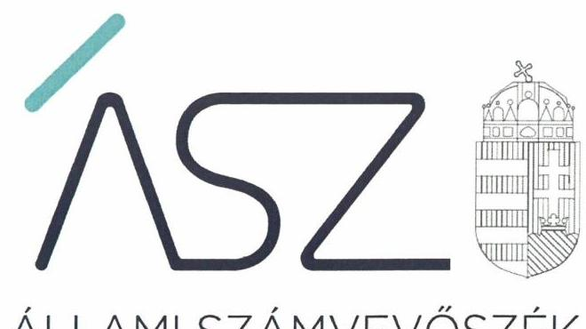
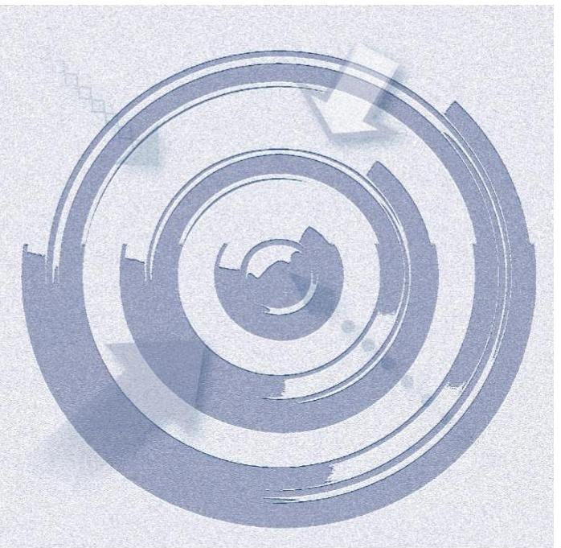

ÁLLAMI SZÁMVEVŐSZÉK

# JELENTÉS 

## Nem állami humánszolgáltatók ellenőrzése

A szociális humánszolgáltatást nyújtó intézmények, szolgáltatók államháztartáson kívüli fenntartói központi költségvetésből kapott támogatásai felhasználásának ellenőrzése Üdvhadsereg Szabadegyház Magyarország

2020
20068
www.asz.hu

---

ÁLLAMI SZÁMVEVŐSZÉK

# JELENTÉS 

## Nem állami humánszolgáltatók ellenőrzése

A szociális humánszolgáltatást nyújtó intézmények, szolgáltatók államháztartáson kívüli fenntartói központi költségvetésből kapott támogatásai felhasználásának ellenőrzése Údvhadsereg Szabadegyház Magyarország
2020. 05. hó 12. nap

20068
www.asz.hu

---

# AZ ELLENŐRZÉST FELÜGYELTE: 

KAKAS SÁNDOR felügyeleti vezető
TÓTH MARIANNA felügyeleti vezető

AZ ELLENŐRZÉST VEZETTE ÉS A VÉGREHAJTÁSÁÉRT FELELŐS:
VERTKOVCZI MÁRIA ellenőrzésvezető

A PROGRAM ÖSSZEÁLLÍTÁSÁÉRT FELELŐS:
FEKETE-NAGY ANDRÁS GÁBOR ellenőrzési programért felelős vezető

TÓTPÁL SZABOLCS osztályvezető

Jelentéseink az Országgyúlés számítógépes hálózatán és az interneten a www.asz.hu címen is olvashatóak.

IKTATÓSZÁM: EL-2614-001/2020.
TÉMASZÁM: 2491
ELLENŐRZÉS-AZONOSÍTÓ SZÁM: V083564, V0867101

---

# TARTALOMJEGYZÉK 

■ ÖSSZEGZÉS ..... 5
■ AZ ELLENŐRZÉS CÉLJA ..... 6
■ AZ ELLENŐRZÉS TERÜLETE ..... 7
■ AZ ELLENŐRZÉS HÁTTERE, INDOKOLTSÁGA ..... 8
■ A JELENTÉS LÉNYEGES KÉRDÉSKÖREI ..... 9
■ AZ ELLENŐRZÉS HATÓKÖRE ÉS MÓDSZEREI ..... 10
■ MEGÁLLAPÍTÁSOK ..... 12
■ JAVASLATOK ..... 14
■ MELLÉKLETEK ..... 15
I. sz. melléklet: Értelmező szótár ..... 15
■ FÜGGELÉK: ÉSZREVÉTELEK ..... 17
■ RÖVIDÍTÉSEK JEGYZÉKE ..... 19

---

.

---

# ÖSSZEGZÉS 

A budapesti székhelyú Üdvhadsereg Szabadegyház Magyarország szociális humánszolgáltatási közfeladat ellátására kapott költségvetési támogatásokkal való gazdálkodása elszámoltatható és átlátható volt, a támogatásokat szabályszerűen az intézményei müködtetésére fordította.

## Az ellenőrzés társadalmi indokoltsága

A szociális gondoskodást igénylők védelme, illetve a köznevelési feladatok ellátása az Alaptörvényben meghatározott, a társadalom szempontjából fontos tevékenységek. Jogszabályok teszik lehetővé, hogy államháztartáson kívüli szervezetek - így például az egyházi fenntartók, alapítványok, gazdasági társaságok, egyesületek - által fenntartott intézmények is végezzenek köznevelési, szociális és gyermekvédelmi feladatokat. Mindehhez a központi költségvetés évente jelentős összegű támogatással járul hozzá. Az államháztartáson kívüli, humánszolgáltatást végző intézmények az igényelt közpénzekből társadalmilag hasznos, közösségteremtő, közérdekű, illetve közhasznú tevékenységet végeznek, illetve közfeladatokat látnak el.

Az intézményfenntartók ellenőrzésével az Állami Számvevőszék hozzájárul ahhoz, hogy ezen közpénzeket az államháztartáson kívüli szervezetek is ellenőrizhető, átlátható és elszámoltatható módon használják fel a közfeladatok ellátása során. Az ellenőrzések célja továbbá, hogy a nyilvánosság és az igénybevevők megfelelő tájékoztatást kapjanak az államháztartáson kívüli közfeladatot ellátók múködéséről.

Az ÁSZ ellenőrzései arra adnak választ, hogy az intézményfenntartók arra használták-e fel a közpénzeket, amire igényelték.

A szabályszerű gazdálkodás elengedhetetlen a közfeladat ellátás szakmai céljainak megvalósításához, valamint a társadalmi közbizalom fenntartásához.

## Főbb megállapítások, következtetések, javaslatok

Az Üdvhadsereg Szabadegyház Magyarország a 2015-2018. években a jogszabályokban előírt szabályozási környezetét kialakította, ezáltal biztosította a szabályszerű múködésének és gazdálkodásának feltételeit.

Az Üdvhadsereg Szabadegyház Magyarország humánszolgáltatási közfeladatot ellátó intézményei múködtetéséhez biztosította a szabályszerű múködési és pénzügyi feltételeket, a kapott költségvetési támogatásokat és azok felhasználását elkülönítve tartotta nyilván, ezzel biztosította a gazdálkodásuk átláthatóságát. Gondoskodott a szociális humánszolgáltatási közfeladatot végző intézményei szabályszerű, elszámoltatható gazdálkodásáról, múködéséről.

Az Állami Számvevőszék az Üdvhadsereg Szabadegyház Magyarország vezetőjének egy javaslatot fogalmazott meg. A javaslatot megalapozó megállapításra az érintettnek 30 napon belül intézkedési tervet kell készítenie.

---

# AZ ELLENŐRZÉS CÉLJA

**AZ ELLENŐRZÉS CÉLJA** annak értékelése volt, hogy a nem állami, nem önkormányzati szociális intézmények fenntartói központi költségvetésből kapott támogatásainak felhasználása szabályszerű volt-e.

---

# **AZ ELLENŐRZÉS TERÜLETE**

## **Üdvhadsereg Szabadegyház Magyarország**

Az Üdvhadsereg Szabadegyház Magyarország az Üdvhadsereg világszerte tevékenykedő szervezetének része, amelynek központja Londonban található. A budapesti székhelyű Fenntartót1 2006. évben alapították. A Fenntartó, mint bevett egyház 2012. évben került nyilvántartásba. Tevékenysége során különös figyelmet fordít a legszegényebbekre, a gyermekekre és a nehéz körülmények áldozataira.

A Fenntartó 2018. év végén nyolc humánszolgáltatási szociális közfeladatokat ellátó Székhely intézményt2 tartott fenn az ország több megyéjében. Az Intézmények nem voltak önálló jogi személyek. Az ellátott közfeladatok keretében szociális étkeztetést, nappali intézményes szolgáltatást, átmeneti szállást, gyermekek napközbeni és családok átmeneti otthonában átmeneti ellátást, hajléktalan személyek átmeneti szállását, rehabilitációs intézményi ellátást, nappali melegedőt és étkeztetést, önálló családi napközit és családi bölcsődei szolgáltatást nyújtott a rászorulóknak.

A magyarországi szervezet vezetője felelős a képviseletért, a felügyeletért, az irányításért és vezetésért. Az ellenőrzött időszakban a vezető személye egy alkalommal 2015. július 1-jével változott. Könyvvizsgálatra nem volt kötelezett, azonban az éves beszámolókat megbízott könyvvizsgáló minősítette.

A Fenntartó szociális humánszolgáltatásra Magyarország éves költségvetéséből a 2015. évben 374 millió Ft, a 2016. évben 405 millió Ft, a 2017. évben 414 millió Ft, a 2018. évben 431 millió Ft összegű támogatást kapott.

---

# AZ ELLENŐRZÉS HÁTTERE, INDOKOLTSÁGA 

A szociális feladatokat ellátó nem állami intézményfenntartók részére közfeladataik ellátására évente jelentős összegű pénzügyi támogatást biztosítottak a mindenkori költségvetési törvények a bennük megfogalmazott feltételek mellett. A felhasználható állami támogatások a Kvtv.1-4-ben ${ }^{3}$ a 2015-2018. években a szociális ágazatra vonatkozóan 360 Mrd Ft előirányzatot határoztak meg.

A köznevelési és szociális területen új feladatfinanszírozási forma (átlagbéralapú támogatás) jelent meg, amely az államháztartáson kívüli intézményfenntartókra is vonatkozik. Az ellenőrzés a finanszírozási rendszerben 2011-2015 között bekövetkezett változásokra, azok közfeladat ellátásra gyakorolt hatására fókuszál a költségvetési támogatásokat felhasználó államháztartáson kívüli szervezetek körében. Az ellenőrzések indokoltságát az is alátámasztja, hogy az ÁSZ számos szervezetet még nem ellenőrzött ezen a területen.

Az ÁSZ ${ }^{4}$ stratégiájában foglaltak alapján is indokolt az ellenőrzés, amely a társadalom számára jelzi, hogy a közpénz államháztartáson kívüli felhasználása sem maradhat ellenőrizetlenül. Az államháztartáson kívülre nyújtott költségvetési támogatások ellenőrzésével az ÁSZ hozzájárul ahhoz, hogy a közpénzeket a nem állami humán fenntartók átlátható módon használják fel a közfeladatok ellátására kötött szerződésekben vállalt kötelezettségek teljesítése érdekében. Az ellenőrzés javaslataival hozzájárulhat az említett rendszerek szabályszerű támogatás felhasználásához, javíthatja a társa-dalmi-gazdasági döntések megalapozottságát, amely a „jól irányított állam" múködéséhez járul hozzá.

A holisztikus megközelítés jegyében az ellenőrzés keretében egyedi kockázatelemzés alapján kiválasztott fenntartóknál és intézményeiknél értékeli az ÁSZ az államháztartáson kívüli szociális tevékenységhez kapcsolódó támogatások felhasználásának megfelelőségét.

---

# A JELENTÉS LÉNYEGES KÉRDÉSKÖREI 

1. A szociális humánszolgáltató közfeladatot ellátó fenntartó szabályszerű müködési- és gazdálkodási környezet kialakításával megteremtette-e a költségvetési támogatások átlátható, elszámoltatható igénybevételének, felhasználásának feltételeit?
2. Az államháztartáson kívüli fenntartó az átvállalt szociális humánszolgáltatási közfeladathoz biztositott költségvetési támogatásokat szabályszerűen fordította-e a humánszolgáltató intézményei müködtetésére, a közpénzekkel való gazdálkodásával elszámolt-e?

---

# AZ ELLENŐRZÉS HATÓKÖRE ÉS MÓDSZEREI 

## Az ellenőrzés típusa

Megfelelőségi ellenőrzés.

## Az ellenőrzött időszak

A 2015. január 1-je és 2018. december 31-e közötti időszak A helyszíni szemle tekintetében 2018. január 1-jétől az utolsó helyszíni szemle időpontjáig, 2019. szeptember 17-éig tartó időszak.

## Az ellenőrzés tárgya

Az ellenőrzés a szociális humánszolgáltatási közfeladatokat ellátó államháztartáson kívüli fenntartók humánszolgáltatási közfeladatai ellátásához a központi költségvetésből kapott támogatásaik humánszolgáltatási közfeladatokra való fenntartó általi felhasználása szabályszerűségének értékelésére terjedt ki.

## Az ellenőrzött szervezet

- Üdvhadsereg Szabadegyház Magyarország

## Az ellenőrzés jogalapja

Az ellenőrzés jogszabályi alapját az ÁSZ tv. 1. § (3) bekezdése, 5. § (3) bekezdés, valamint az 5. § (11) bekezdés c) pontjában foglalt előírások adják.

## Az ellenőrzés módszerei

Az ellenőrzést az ellenőrzési program szempontjai, kérdései, az ellenőrzött időszakban hatályos jogszabályok, a nemzetközi standardokat irányadónak tekintve, az ellenőrzés szakmai szabályok és módszertanok figyelembe vételével végezte az ÁSZ. A közpénzekkel való felelős gazdálkodás segítésére irányuló javaslatok kidolgozásakor a hatályos jogszabályok voltak irányadóak.

Az ellenőrzés ideje alatt az ellenőrzött szervezettel történő kapcsolattartást az ÁSZ SZMSZ5-ének vonatkozó előírásai alapján biztosította az ÁSZ.

---

Az ellenőrzési kérdések megválaszolásához szükséges bizonyítékok megszerzése az ellenőrzött által rendelkezésre bocsátott dokumentumokra, adatokra alapozva megfigyelés, szemle (szemrevételezés), kérdésfeltevés (információkérés), valamint elemző eljárással történt.

Az ellenőrzési bizonyítékként felhasználható adatforrások közé tartoztak egyrészt az ellenőrzési program részletes szempontjainál felsorolt adatforrások, másrészt minden - az ellenőrzés folyamán feltárt, az ellenőrzés szempontjából információt tartalmazó - dokumentum.

Az ellenőrzés lefolytatásához az ellenőrzött szervezet a kitöltött tanúsítványok, valamint az ÁSZ által kért dokumentumok elektronikus úton való megküldésével szolgáltatott adatokat, információkat. Az így rendelkezésre bocsátott adatok, információk és a tanúsítványok adatai valódiságának kontrollja az ellenőrzés keretében történt.

Az egységes értelmezést támogatja a program mellékletét képező fogalomtár és rövidítésjegyzék.

Az ÁSZ az ellenőrzést a szociális humánszolgáltatások esetében a központi költségvetési támogatások igénylésével, módosításával, felhasználásával, elszámolásával kapcsolatos feladatokat ellátó államháztartáson kívüli fenntartóknál/szervezeteinél végezte. Az ÁSZ a fenntartott intézményeknél helyszíni szemle keretében győződött meg a tényleges feladatellátásról (verifikáció).

Az szociális humánszolgáltatások központi költségvetési támogatásai igénylésével, módosításával, elszámolásával kapcsolatos, államháztartáson kívüli fenntartó jogszabályokban előírt feladatai betartását, továbbá a központi költségvetési támogatások szabályszerű kezelését, nyilvántartását ellenőrizte az ÁSZ a fenntartónál, az ott rendelkezésre álló határozatok, nyilvántartások, beszámolók és egyéb dokumentumok alapján. Az ellenőrzés nem terjedt ki a szociális humánszolgáltatások központi költségvetési támogatásai igénylése, módosítása, elszámolása valódiságának, megalapozottságának, helyességének - sem a fenntartónál, sem a székhely intézményeinél való - értékelésére (mivel ennek felülvizsgálata, ellenőrzése a finanszírozó jogszabályban előírt feladata, határozatai kiadása előtt). Továbbá nem terjedt ki az ellenőrzés e források, intézmények általi szabályszerű felhasználásának értékelésére.

---

# MEGÁLLAPÍTÁSOK 

## 1. A szociális humánszolgáltató közfeladatot ellátó fenntartó szabályszerű múködési- és gazdálkodási környezet kialakításával megteremtette-e a költségvetési támogatások átlátható, elszámoltatható igénybevételének, felhasználásának feltételeit?

Összegző megállapítás A Fenntartó a múködési és gazdálkodási környezetét szabályszerűen kialakította.

A Fenntartó a jogszabályokban előírtakkal összhangban rendelkezett Alapító Okirattal ${ }_{1-2}{ }^{6}$.

A Fenntartó elkészítette a Számviteli politikáját ${ }^{7}$ és annak keretében az eszközök és források leltárkészítési és leltározási, pénzkezelési és az eszközök és források értékelési szabályozását.

A Fenntartó a könyvvezetésre, bizonylatolásra vonatkozó részletes belső szabályait a beszámoló adatainak közvetlen alátámasztására alkalmas módon kialakította, ugyanakkor a 2015-2018. években nem rendelkezett a Számv. tv. ${ }^{8}$ 161. § (2) bekezdése szerinti számlarenddel.

A Fenntartó a számviteli rendszerében a költségvetési támogatások és azok cél szerinti felhasználásának elkülönített nyilvántartását az előírtak alapján kialakította.

A 2015-2017. években a költségvetési támogatások igénylési, módosítási és elszámolási feladatait a Fenntartó MÁK ${ }^{9}$ felé, az előírtakkal összhangban szabályszerűen látta el.

## 2. Az államháztartáson kívüli fenntartó az átvállalt szociális humánszolgáltatási közfeladathoz biztosított költségvetési támogatásokat szabályszerűen fordította-e a humánszolgáltató intézményei múködtetésére, a közpénzekkel való gazdálkodásával elszámolt-e?

Összegző megállapítás A Fenntartó az átvállalt szociális humánszolgáltatási közfeladathoz biztosított költségvetési támogatásokat szabályszerűen fordította az intézményei múködtetésére, a közpénzekre vonatkozó gazdálkodásával elszámolt.

A Fenntartó a szociális közfeladatokat ellátó intézményei alapfeladatait, múködési kereteit meghatározta.

A Fenntartó a szociális humánszolgáltatást végző intézményei működésének pénzügyi feltételeit biztosította. A Fenntartó a humánszolgáltatási

---

közfeladathoz biztosított költségvetési támogatásokat a jogszabályokban foglaltak alapján a saját gazdálkodásától elkülönítetten, - egy feladat-ellátási helyet kivéve - alapfeladatonként és az egyes szolgáltatók gazdálkodását egymástól elkülönítetten tartotta nyilván.

A Fenntartó a jogszabállyal összhangban készítette el számviteli éves beszámolóit.

---

# JAVASLATOK 

Az ÁSZ tv. 33. § (1) bekezdésében foglaltak értelmében az ellenőrzött szervezet vezetője köteles a jelentésben foglalt megállapításokhoz kapcsolódó intézkedési tervet összeállítani és azt a jelentés kézhezvételétől számított 30 napon belül az ÁSZ részére megküldeni. Amennyiben az ellenőrzött szervezet vezetője nem küldi meg határidőben az intézkedési tervet, vagy továbbra sem elfogadható intézkedési tervet küld, az Állami Számvevőszék elnöke az ÁSZ tv. 33. § (3) bekezdése a) és b) pontjaiban foglaltakat érvényesítheti.

## az Üdvhadsereg Szabadegyház Magyarország vezetőjének

1. Gondoskodjon a jogszabály szerinti számlarend elkészitéséről.
(1. megállapítás 3. bekezdés 1. mondat 2. tagmondata alapján)

---

# MELLÉKLETEK 

## I. SZ. MELLÉKLET: ÉRTELMEZŐ SZÓTÁR

bevett egyház
egyházi fenntartó
költségvetési támogatás
nem állami, nem önkormányzati (államháztartáson kívüli) intézmény fenntartó
székhely intézmény
telephely

Az Ehtv. 6. § (1-2) bekezdései szerint az Országgyűlés által elismert egyház bevett egyház. Vallási közösség az Országgyűlés által elismert egyház és a vallási tevékenységet végző szervezet lehet. A vallási közösség elsődlegesen vallási tevékenység céljából jön létre és működik. Az Ehtv. 7. §-a szerint a vallási közösség az egyház megjelölést elnevezésében és tevékenységére való utalás során önmeghatározása céljából - a saját hitelvei szerinti tartalommal - használhatja.
Az Ehtv. 33. §-a alapján az Ehtv. mellékletében felsorolt egyházak és az általuk meghatározott, az egyház belső egyházi szabálya szerint jogi személyiséggel rendelkező szervezetek - a nyilvántartásba vételük dátumától függetlenül - 2012. január 1-jétől minősülnek egyházi fenntartóknak. Az Ehtv. 14. §-ában meghatározott eljárás folyamán az Országgyűlés által egyháznak elismert szervezet a törvénynek az egyház bejegyzésére vonatkozó módosítása hatálybalépésének napjától minősül egyháznak (Ehtv. 15. §). A 2010. évi CXL. törvény* 5. Cikk Pénzügyi támogató intézkedések 1. pontja alapján 2011. január 1-jétől jogosult a Magyar Máltai Szeretetszolgálat Egyesület az egyházi kiegészítő támogatásra.
A társadalombiztosítás pénzügyi alapjai kivételével az államháztartás központi alrendszeréből ellenérték nélkül, pénzben nyújtott támogatások (Áht. ${ }^{10}$ 1. § 14. pont).
A költségvetési törvényekben (2013. évi CCXXX. törvény 33-34. §, 2014. évi C. törvény 42-43. §, 2015. évi C. törvény 40-41. §) megállapított támogatás. Például a 2015. évi C. törvény 40-41. § szerint többek között: Az Országgyűlés a szociális, gyermekjóléti, gyermekvédelmi közfeladatot ellátó intézményt, szolgáltatást fenntartó egyházi jogi személy, civil szervezet, közalapítvány, országos nemzetiségi önkormányzat, települési vagy területi nemzetiségi önkormányzat, gazdasági társaság, és a humánszolgáltatást alaptevékenységként végző, az Szja tv. hatálya alá tartozó egyéni vállalkozó (a továbbiakban együtt: nem állami szociális fenntartó) részére támogatást állapít meg a következők szerint: a támogatás a nem állami szociális fenntartót a települési önkormányzatok 2. melléklet III. pont 3. alpont c)-k) pontjában és III. pont 5. alpont a) pontjában meghatározott támogatásaival azonos jogcímeken, összegben és feltételek mellett illeti meg.
A szociális, gyermekjóléti és gyermekvédelmi közfeladatokat /humánszolgáltatásokat ellátó intézményt fenntartó egyházi jogi személy, társadalmi szervezet, alapítvány, közalapítvány, civil szervezet, országos nemzetiségi önkormányzat, nonprofit gazdasági társaság, gazdasági társaság és a humánszolgáltatást alaptevékenységként végző, Szja tv. hatálya alá tartozó egyéni vállalkozó. (2013. évi Kvtv. 35. § (1), (3) bekezdés, 2014. évi Kvtv. 33. §, 34. § (1), (4) bekezdés, 2015. évi Kvtv. 42. §, 43. § (1), (4) bekezdés, 2016. évi Kvtv. 40. §, 41. § (1), (4) bekezdés, 2017. évi Kvtv. 41. § (1), (4))
a szolgáltató székhelye, azaz a szolgáltató központi ügyintézésének helye, függetlenül attól, hogy használják-e szolgáltatás nyújtására (Sznyvhr. 1.§ k) pont) (hatályos: 2013. december 1-től)
a szolgáltató székhelyétől különböző, szolgáltató/intézmény használatában álló hely, a szociális humánszolgáltatáshoz használt, bejegyzett hely. (Sznyvhr. 1.§ I) pont) (hatályos: 2015. január 1-től)

[^0]
[^0]:    * a Magyar Köztársaság Kormánya és a Szuverén Jeruzsálemi, Rodoszi és Máltai Szent János Katonai és Ispotályos Rend közötti Együttműködési Megállapodás kihirdetéséről szóló 2010. évi CXL. törvény

---

.

---

# FÜGGELÉK: ÉSZREVÉTELEK 

A jelentéstervezetet a Számvevőszék 15 napos észrevételezésre megküldte az ellenőrzött szervezet vezetőjének az ÁSZ tv. 29. § ${ }^{+}$(1) bekezdése előírásának megfelelően.

A jelentéstervezet megállapításaira az Üdvhadsereg Szabadegyház Magyarország vezetője nem tett észrevételt.

[^0]
[^0]:    ${ }^{+} 29. \S$ (1) Az Állami Számvevőszék az ellenőrzési megállapításait megküldi az ellenőrzött szervezet vezetőjének vagy az általa megbízott személynek, és annak, akinek személyes felelősségét állapította meg.
    (2) Az ellenőrzött szervezet vezetője és a felelősként megjelölt személy az ellenőrzés megállapításaira tizenöt napon belül írásban észrevételt tehet.
    (3) Az Állami Számvevőszék az észrevételre a beérkezésétől számított harminc napon belül írásban válaszol. A figyelembe nem vett észrevételeket köteles a jelentésben feltüntetni, és megindokolni, hogy azokat miért nem fogadta el.

---

.

---

# RÖVIDÍTÉSEK JEGYZÉKE 

${ }^{1}$ Fenntartó
${ }^{2}$ Székhely intézmények ${ }_{1-8}$
${ }^{3} \mathrm{Kvtv}_{1-4}$
${ }^{4}$ ÁSZ
${ }^{5}$ ÁSZ SZMSZ
${ }^{6}$ Alapító Okirat ${ }_{1-2}$
${ }^{7}$ Számviteli politika
${ }^{8}$ Számv. tv.
${ }^{9}$ MÁK
${ }^{10}$ Áht.

Üdvhadsereg Szabadegyház Magyarország
Intézmény1 Üdvhadsereg „Fény Háza" Családok Átmeneti Otthona
Intézmény ${ }_{2}$ Üdvhadsereg „Új Kezdet Háza" Női Hajléktalan Szálló
Intézmény3 Üdvhadsereg Válaszút Háza
Intézmény4 Üdvhadsereg Reménység Centrum
Intézmény5 Üdvhadsereg Reménység Centrum „izgő-mozgó" Családi Napközi
Intézmény6 Üdvhadsereg Reménység Centrum „Tarka-barka" Családi Napközi
Intézmény7 Üdvhadsereg Új Reménység Háza
Intézmény8 Üdvhadsereg Debreceni Szociális Konyha
12014. évi C. törvény Magyarország 2015. évi központi költségvetéséről (hatályos: 2015. január 1-jétől)
2 2015. évi C. törvény Magyarország 2016. évi központi költségvetéséről (hatályos: 2016. január 1-jétől)
3 2016. évi XC. törvény Magyarország 2017. évi központi költségvetéséről (hatályos: 2017. január 1-jétől)
4 2017. évi C. törvény Magyarország 2018. évi központi költségvetéséről (hatályos: 2018. január 1-jétől)
Állami Számvevőszék
Állami Számvevőszék Szervezeti és Müködési Szabályzata
1 az Üdvhadsereg Magyarországi Szervezetének módosításokkal egységes szerkezetben készített Alapító okirata (hatályos: 2006. szeptember 20-ától)
2 az Üdvhadsereg Magyarországi Szervezetének módosításokkal egységes szerkezetben készített Alapító okirata (hatályos: 2018. november 2-ától) az Üdvhadsereg Szabadegyház Magyarország Pénzkezelési szabályzata (hatályos: 2010. január 1-jétől)
az Üdvhadsereg Szabadegyház Magyarország Eszközök és a források leltár készítési és leltározási szabályzata (hatályos: 2010. január 1-jétől)
az Üdvhadsereg Szabadegyház Magyarország számviteli politikája és az eszközök és források értékelési szabályzata (hatályos: 2010. január 1-jétől)
2000. évi C. törvény a számvitelről (hatályos: 2001. január 1-jétől)

Magyar Államkincstár
2011. évi CXCV. törvény az államháztartásról (hatályos: 2011. december 31-étől)

---

# ASZ 

ALLAMI SZAMVEVOSZEK
1052 Budapest, Apáczai Cs. J. u. 10. I 1364 Budapest 4. Pf. 54 TEL: +36 14849100
email: szamvevoszek@asz.hu
web: www.asz.hu | www.aszhirportal.hu