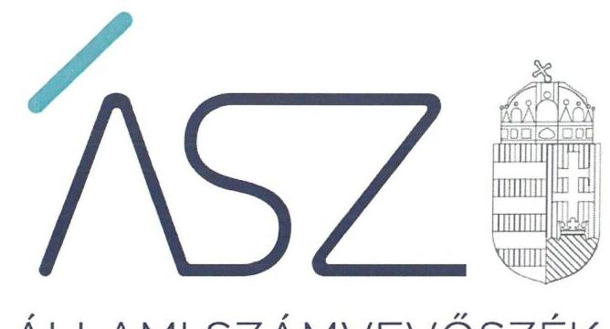
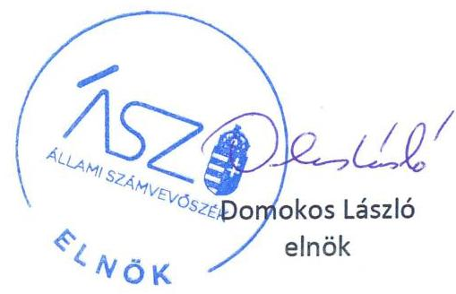

ÁLLAMI SZÁMVEVŐSZÉK

# JELENTÉS 

## Nem állami humánszolgáltatók ellenőrzése

A szociális humánszolgáltatást nyújtó intézmények, szolgáltatók államháztartáson kívüli fenntartói központi költségvetésből kapott támogatásainak felhasználásának ellenőrzése -

VIS VITALIS Gondozó Otthon Közhasznú Nonprofit Korlátolt Felelősségű Társaság
2020.

20069
www.asz.hu

---

ÁLLAMI SZÁMVEVŐSZÉK

# JELENTÉS

## Nem állami humánszolgáltatók ellenőrzése

A szociális humánszolgáltatást nyújtó intézmények, szolgáltatók államháztartáson kívüli fenntartói központi költségvetésből kapott támogatásainak felhasználásának ellenőrzése – VIS VITALIS Gondozó Otthon Közhasznú Nonprofit Korlátolt Felelősségű Társaság

2020. 04. hó 30. nap

20069
www.asz.hu

---

# AZ ELLENŐRZÉST FELÜGYELTE: 

MAROZSÁN LÁSZLÓNÉ felügyeleti vezető

## AZ ELLENŐRZÉST VEZETTE ÉS A VÉGREHAJTÁSÁÉRT FELELŐS:

SIPOSNÉ DÓCZI KLÁRA IBOLYA ellenőrzésvezető

## A PROGRAM ÖSSZEÁLLÍTÁSÁÉRT FELELŐS:

FEKETE-NAGY ANDRÁS ellenőrzési program készítéséért felelős vezető

TÓTPÁL SZABOLCS osztályvezető

## IKTATÓSZÁM: EL-2562-001/2020

Jelentéseink az Országgyűlés számítógépes hálózatán és az interneten a www.asz.hu címen is olvashatóak.

TÉMASZÁM: 2491
ELLENŐRZÉS-AZONOSÍTÓ SZÁM: V083575, V0867128

---

# TARTALOMJEGYZÉK 

■ ÖSSZEGZÉS ..... 5
■ AZ ELLENŐRZÉS CÉLJA ..... 6
■ AZ ELLENŐRZÉS TERÜLETE ..... 7
■ AZ ELLENŐRZÉS HÁTTERE, INDOKOLTSÁGA ..... 8
■ A JELENTÉS LÉNYEGES KÉRDÉSKÖREI ..... 9
■ AZ ELLENŐRZÉS HATÓKÖRE ÉS MÓDSZEREI ..... 10
■ MEGÁLLAPÍTÁSOK ..... 12
■ MELLÉKLETEK ..... 13
I. sz. melléklet: Értelmező szótár ..... 13
■ FÜGGELÉK: ÉSZREVÉTELEK ..... 15
■ RÖVIDÍTÉSEK JEGYZÉKE ..... 17

---

.

---

# ÖSSZEGZÉS 

A dányi székhelyű VIS VITALIS Gondozó Otthon Közhasznú Nonprofit Korlátolt Felelősségű Társaság szociális humánszolgáltatási közfeladat ellátására a 2015-2018. évben kapott költségvetési támogatásokkal való gazdálkodása elszámoltatható és átlátható volt, a támogatásokat szabályszerűen az intézmény működtetésére fordította.

## Az ellenőrzés társadalmi indokoltsága

A szociális gondoskodást igénylők védelme, illetve a köznevelési feladatok ellátása az Alaptörvényben meghatározott, a társadalom szempontjából fontos tevékenységek. Jogszabályok teszik lehetővé, hogy államháztartáson kívüli szervezetek - így például az egyházi fenntartók, alapítványok, gazdasági társaságok, egyesületek - által fenntartott intézmények is végezzenek köznevelési, szociális és gyermekvédelmi feladatokat. Mindehhez a központi költségvetés évente jelentős összegű támogatással járul hozzá. Az államháztartáson kívüli, humánszolgáltatást végző intézmények az igényelt közpénzekből társadalmilag hasznos, közösségteremtő, közérdekű, illetve közhasznú tevékenységet végeznek, illetve közfeladatokat látnak el.

Az intézményfenntartók ellenőrzésével az Állami Számvevőszék hozzájárul ahhoz, hogy ezen közpénzeket az államháztartáson kívüli szervezetek is ellenőrizhető, átlátható és elszámoltatható módon használják fel a közfeladatok ellátása során. Az ellenőrzések célja továbbá, hogy a nyilvánosság és az igénybevevők megfelelő tájékoztatást kapjanak az államháztartáson kívüli közfeladatot ellátók működéséről.

Az ÁSZ ellenőrzései arra adnak választ, hogy az intézményfenntartók arra használták-e fel a közpénzeket, amire igényelték.
A szabályszerű gazdálkodás elengedhetetlen a közfeladat ellátás szakmai céljainak megvalósításához, valamint a társadalmi közbizalom fenntartásához.

## Főbb megállapítások, következtetések

A VIS VITALIS Gondozó Otthon Közhasznú Nonprofit Korlátolt Felelősségű Társaság mint szociális humánszolgáltató közfeladatot ellátó intézmény fenntartója kialakította a szabályszerű működés és gazdálkodás feltételeit.

A VIS VITALIS Gondozó Otthon Közhasznú Nonprofit Korlátolt Felelősségű Társaság biztosította az átvállalt szociális közfeladathoz kapott költségvetési támogatások elszámolásának, nyilvántartásának szabályszerűségét. Kialakította a támogatások felhasználásának elkülönített nyilvántartási rendszerét, nyilvántartásait szabályszerűen vezette, ezáltal igazolta, hogy a támogatásokat intézménye működtetésére fordította.

Az ellenőrzött időszakban a törvényi előírásoknak megfelelően eleget tett beszámoló készítési és közzétételi kötelezettségének, az intézménye működtetéséhez felhasznált közpénzekre vonatkozó gazdálkodásával a nyilvánosság előtt elszámolt.

---

# AZ ELLENŐRZÉS CÉLJA

**AZ ELLENŐRZÉS CÉLJA** annak értékelése volt, hogy a nem állami, nem önkormányzati szociális intézmények fenntartói központi költségvetésből kapott támogatásainak felhasználása szabályszerű volt-e.

---

# AZ ELLENŐRZÉS TERÜLETE

## VIS VITALIS Gondozó Otthon Közhasznú Nonprofit Korlátolt Felelősségű Társaság mint intézményfenntartó

A dányi székhelyű VIS VITALIS Gondozó Otthon Közhasznú Nonprofit Korlátolt Felelősségű Társaság a 2003-ban magánszemélyek által alapított jogelőd közhasznú társaságból 2009. június 19-i átalakulással jött létre.

A Társaság1 közhasznú tevékenysége az idősek bentlakásos ellátása volt, melyben Fenntartó2-ként vett részt. Közhasznú tevékenységére, közfeladat ellátására vonatkozóan 2018. október 02-án Dány Község Önkormányzatával kötött közfeladat ellátási szerződést. A Fenntartó közfeladatait nem önálló jogi személy Intézményén3 keresztül látta el. Az Intézmény összesen 88 fő idős ellátottnak biztosított otthont, átlagos szintű ellátást és demens betegek ellátását. A Fenntartó a 2015-2018. közötti időszakban feladatai ellátásához 272 M Ft költségvetési támogatást kapott.

---

# AZ ELLENŐRZÉS HÁTTERE, INDOKOLTSÁGA 

A szociális feladatokat ellátó nem állami intézményfenntartók részére közfeladataik ellátására évente jelentős összegű pénzügyi támogatást biztosítottak a mindenkori költségvetési törvények a bennük megfogalmazott feltételek mellett. A felhasználható állami támogatások a Költségvetési törvényekben ${ }^{4}$ a 2015-2018. években a szociális ágazatra vonatkozóan 360 milliárd forint előirányzatot határoztak meg.

Az ÁSZ ${ }^{5}$ a stratégiájában célul tűzte ki, hogy az államháztartáson kívülre nyújtott költségvetési támogatások ellenőrzésével hozzájárul ahhoz, hogy a közpénzeket az államháztartáson kívüli szervezetek is átlátható módon használják fel a közfeladatok szerződésben vállalt ellátása érdekében. Az ÁSZ stratégiájában foglaltak alapján is indokolt az ellenőrzés, amely a társadalom számára jelzi, hogy a közpénz államháztartáson kívüli felhasználása sem maradhat ellenőrizetlenül. Az államháztartáson kívülre nyújtott költségvetési támogatások ellenőrzésével az ÁSZ hozzájárul ahhoz, hogy a közpénzeket a nem állami humán fenntartók átlátható módon használják fel a közfeladatok ellátására kötött szerződésekben vállalt kötelezettségek teljesítése érdekében. Az ellenőrzés javaslataival hozzájárulhat az említett rendszerek szabályszerű támogatás felhasználásához, javíthatja a társadalmi-gazdasági döntések megalapozottságát, amely a „jól irányított állam működésének" feltétele.

---

# A JELENTÉS LÉNYEGES KÉRDÉSKÖREI 

1. A Fenntartó szabályszerű működési - és gazdálkodási környezet kialakításával megteremtette-e a költségvetési támogatások átlátható, elszámoltatható igénybevételének, felhasználásának feltételeit?
2. A Fenntartó az átvállalt szociális humánszolgáltatási közfeladathoz biztosított költségvetési támogatásokat szabályszerűen fordította-e a humánszolgáltató intézményei működtetésére, a működtetéséhez felhasznált közpénzekre vonatkozó gazdálkodásával a nyilvánosság előtt elszámolt-e?

---

# AZ ELLENŐRZÉS HATÓKÖRE ÉS MÓDSZEREI 

## Az ellenőrzés típusa

Megfelelőségi ellenőrzés.

## Az ellenőrzött időszak

A 2015. január 1-je és 2018. december 31-e közötti időszak.

## Az ellenőrzés tárgya

Az ellenőrzés a szociális humánszolgáltatási közfeladatokat ellátó államháztartáson kívüli fenntartók humánszolgáltatási közfeladatai ellátásához a központi költségvetésből kapott támogatásaik humánszolgáltatási közfeladatokra való fenntartó általi felhasználása szabályszerűségének értékelésére terjedt ki.

## Az ellenőrzött szervezet

VIS VITALIS Gondozó Otthon Nonprofit Közhasznú Korlátolt Felelősségű Társaság mint intézményfenntartó.

## Az ellenőrzés jogalapja

Az ellenőrzés jogszabályi alapját az ÁSZ tv. ${ }^{6}$ 1. § (3) bekezdésben foglalt előírások adták.

## Az ellenőrzés módszerei

Az ellenőrzést az ellenőrzési program szempontjai, kérdései, az ellenőrzött időszakban hatályos jogszabályok, a nemzetközi standardokat irányadónak tekintve, az ellenőrzés szakmai szabályok és módszertanok figyelembe vételével végezte az ÁSZ.

Az ellenőrzés ideje alatt az ellenőrzött szervezettel történő kapcsolattartást az ÁSZ SZMSZ ${ }^{7}$-ének vonatkozó előírásai alapján biztosította az ÁSZ.

Az ellenőrzési kérdések megválaszolásához szükséges bizonyítékok megszerzése az ellenőrzött által rendelkezésre bocsátott dokumentumokra, adatokra alapozva elemző eljárással történt.

Az ellenőrzési bizonyítékként felhasználható adatforrások közé tartoztak egyrészt az ellenőrzési program részletes szempontjainál felsorolt

---

adatforrások, másrészt minden - az ellenőrzés folyamán feltárt, az ellenőrzés szempontjából információt tartalmazó - dokumentum.

Az ellenőrzés lefolytatásához az ellenőrzött szervezet a kitöltött tanúsítványok, valamint az ÁSZ által kért dokumentumok elektronikus úton való megküldésével szolgáltatott adatokat, információkat. Az így rendelkezésre bocsátott adatok, információk és a tanúsítványok adatai valódiságának kontrollja az ellenőrzés keretében történt.

A szociális humánszolgáltatások központi költségvetési támogatásaival kapcsolatos, államháztartáson kívüli fenntartó jogszabályokban előírt feladatai betartását, továbbá a központi költségvetési támogatások szabályszerű nyilvántartását ellenőrizte az ÁSZ a Fenntartónál rendelkezésre álló nyilvántartások, beszámolók és egyéb dokumentumok alapján. Az ellenőrzés nem terjedt ki a szociális humánszolgáltatások központi költségvetési támogatásai igénylése, módosítása, elszámolása valódiságának, megalapozottságának, helyességének értékelésére (mivel ennek felülvizsgálata, ellenőrzése a finanszírozó jogszabályban előírt feladata, határozatai kiadása előtt). Továbbá nem terjedt ki az ellenőrzés e források szabályszerű felhasználásának értékelésére.

---

# MEGÁLLAPÍTÁSOK 

## 1. A Fenntartó szabályszerű működési - és gazdálkodási környezet kialakításával megteremtette-e a költségvetési támogatások átlátható, elszámoltatható igénybevételének, felhasználásának feltételeit?

Összegző megállapítás

A Fenntartó a költségvetési támogatások jogszabályi előírásoknak megfelelő igénybevételéhez és felhasználásához szabályszerű működési- és gazdálkodási környezetet alakított ki.

A Fenntartó a Számv tv. ${ }^{8}$ előírásai szerint rendelkezett Számviteli politikával ${ }^{9}$, valamint az annak keretében elkészítendő Értékelési ${ }^{10}$, Leltározási ${ }^{11}$ és Pénzkezelési ${ }^{12}$ szabályzatokkal továbbá Számlarenddel ${ }^{13}$.

A Fenntartó biztosította az intézménye szervezeti kereteit és működtetésének feltételeit. A Fenntartó a Szoc. tv. ${ }^{14}$ előírásaival összhangban Szervezeti és működési szabályzatban ${ }^{15}$ határozta meg a humánszolgáltatást végző intézménye alapfeladatait és működése kereteit. A fenntartó gondoskodott arról, hogy az intézmény a Szoc. tv. előírásainak megfelelően rendelkezzen Szakmai programmal ${ }^{16}$ és az 1/2000. SzCsM ${ }^{17}$ rendeletben meghatározott szabályzatokkal.

## 2. A Fenntartó az átvállalt szociális humánszolgáltatási közfeladathoz biztosított költségvetési támogatásokat szabályszerűen fordította-e a humánszolgáltató intézményei működtetésére, a működtetéséhez felhasznált közpénzekre vonatkozó gazdálkodásával a nyilvánosság előtt elszámolt-e?

Összegző megállapítás

A Fenntartó igazolta, hogy az átvállalt humánszolgáltatási közfeladathoz biztosított költségvetési támogatásokat a humánszolgáltató intézménye működtetésére fordította. A Fenntartó a felhasznált közpénzekre vonatkozó gazdálkodásával a nyilvánosság előtt elszámolt.

A Fenntartó az ellenőrzött időszakban a szociális feladathoz biztosított költségvetési támogatásokat és azok felhasználását szabályszerűen, az Atr. ${ }^{18}$ és a Számv. tv. előírásainak megfelelően, számviteli rendjében feladatonkénti bontásban, elkülönítetten kezelte, ezáltal igazolta, hogy a támogatásokat az intézménye működtetésére fordította.

A Fenntartó a Számv. tv. és a Civil tv. ${ }^{19}$ előírásainak megfelelően eleget tett beszámoló készítési és közzétételi kötelezettségének, a felhasznált közpénzekkel való gazdálkodásáról a nyilvánosságot tájékoztatta.

---

# MELLÉKLETEK 

- I. SZ. MELLÉKLET: ÉRTELMEZŐ SZÓTÁR
civil szervezet
ellátási terület
feladatfinanszírozás
humánszolgáltatás
költségvetési támogatás
nem állami, nem önkormányzati (államháztartáson kívüli) intézmény fenntartó
székhely intézmény
telephely

A Civil tv. 2. § 6. pontja szerint civil szervezet a civil társaság, a Magyarországon nyilvántartásba vett egyesület (a párt, a szakszervezet és a kölcsönös biztosító egyesület kivételével), a közalapítvány és a pártalapítvány kivételével az alapítvány.
Az a terület, ahonnan az engedélyes ellátottakat fogad.
A közfeladat államháztartáson kívüli szervezet által történő ellátásához közvetlenül kapcsolódó, arányos működési költségeket finanszírozó költségvetési támogatás.
Külön törvényben meghatározott szociális, gyermekjóléti, gyermekvédelmi, közoktatási, felsőoktatási, kulturális közfeladatok (2014. évi Kvtv. 34. § (1), (4) bekezdés, 1. számú melléklet XX/20/2. alcím, 19. alcím, 2015. évi Kvtv. 43. § (1), (4) bekezdés, 1. számú melléklet XX/20/2/3. jogcím csoport, 19. alcím, 2016. évi Kvtv. 41. § (1), (4) bekezdés, 1. számú melléklet XX/20/2/3. jogcím csoport, 19. alcím).
a társadalombiztosítás pénzügyi alapjai kivételével az államháztartás központi alrendszeréből ellenérték nélkül, pénzben nyújtott támogatások (Áht. 1. § 14. pont)
a költségvetési törvényekben (2013. évi CCXXX. törvény 33-34. §, 2014. évi C. törvény 42-43. §, 2015. évi C. törvény 40-41. §) megállapított támogatás. Például a 2015. évi C. törvény 40-41. § szerint többek között: Az Országgyűlés a szociális, gyermekjóléti, gyermekvédelmi közfeladatot ellátó intézményt, szolgáltatást fenntartó egyházi jogi személy, civil szervezet, közalapítvány, országos nemzetiségi önkormányzat, települési vagy területi nemzetiségi önkormányzat, gazdasági társaság, és a humánszolgáltatást alaptevékenységként végző, az Szja tv. hatálya alá tartozó egyéni vállalkozó (a továbbiakban együtt: nem állami szociális fenntartó) részére támogatást állapít meg a következők szerint: a támogatás a nem állami szociális fenntartót a települési önkormányzatok 2. melléklet III. pont 3. alpont c)-k) pontjában és III. pont 5. alpont a) pontjában meghatározott támogatásaival azonos jogcímeken, összegben és feltételek mellett illeti meg.
A szociális,
 gyermekjóléti és gyermekvédelmi közfeladatokat/humánszolgáltatásokat ellátó intézményt fenntartó egyházi jogi személy, társadalmi szervezet, alapítvány, közalapítvány, civil szervezet, országos nemzetiségi önkormányzat, nonprofit gazdasági társaság, gazdasági társaság és a humánszolgáltatást alaptevékenységként végző, Szja tv. hatálya alá tartozó egyéni vállalkozó. (2013. évi Kvtv. 35. § (1), (3) bekezdés, 2014. évi Kvtv. 33. §, 34. § (1), (4) bekezdés, 2015. évi Kvtv. 42. §, 43. § (1), (4) bekezdés, 2016. évi Kvtv. 40. §, 41. § (1), (4) bekezdés, 2017. évi Kvtv. 41. § (1), (4))
a szolgáltató székhelye, azaz a szolgáltató központi ügyintézésének helye, függetlenül attól, hogy használják-e szolgáltatás nyújtására (Sznyvhr. 1.§ k) pont) (hatályos: 2013. december 1-től)
a szolgáltató székhelyétől különböző, szolgáltató/intézmény használatában álló hely, a szociális humánszolgáltatáshoz használt, bejegyzett hely. (Sznyvhr. 1.§ l) pont) (hatályos: 2015. január 1-től)

---

.

---

# FÜGGELÉK: ÉSZREVÉTELEK 

A jelentéstervezetet a Számvevőszék 15 napos észrevételezésre megküldte az ellenőrzött szervezet vezetőinek az ÁSZ tv. 29. § (1) bekezdése előírásának megfelelően.

A VIS VITALIS Gondozó Otthon Közhasznú Nonprofit Korlátolt Felelősségű Társaság ügyvezetői a jelentéstervezet megállapításaira nem tettek észrevételt.

[^0]
[^0]:    * 29. § (1) Az Állami Számvevőszék az ellenőrzési megállapításait megküldi az ellenőrzött szervezet vezetőjének vagy az általa megbízott személynek, és annak, akinek személyes felelősségét állapította meg.
    (2) Az ellenőrzött szervezet vezetője és a felelősként megjelölt személy az ellenőrzés megállapításaira tizenöt napon belül írásban észrevételt tehet.
    (3) Az Állami Számvevőszék az észrevételre a beérkezésétől számított harminc napon belül írásban válaszol. A figyelembe nem vett észrevételeket köteles a jelentésben feltüntetni, és megindokolni, hogy azokat miért nem fogadta el.

---

.

---

# RÖVIDÍTÉSEK JEGYZÉKE 

${ }^{1}$ Társaság
${ }^{2}$ Fenntartó
${ }^{3}$ Intézmény
${ }^{4}$ Költségvetési törvények
${ }^{5}$ ÁSZ
${ }^{6}$ ÁSZ tv.
${ }^{7}$ ÁSZ SZMSZ
${ }^{8}$ Számv. tv.
${ }^{9}$ Számviteli politika
${ }^{10}$ Értékelési szabályzat
${ }^{11}$ Leltározási szabályzat
${ }^{12}$ Pénzkezelési szabályzat
${ }^{13}$ Számlarend
${ }^{14}$ Szoc. tv.
${ }^{15}$ Szervezeti és működési szabályzat
${ }^{16}$ Szakmai program
${ }^{17} 1 / 2000$. SzCSM rendelet
${ }^{18} \mathrm{Atr}$.
${ }^{19}$ Civil tv.

VIS VITALIS Gondozó Otthon Közhasznú Nonprofit Korlátolt Felelősségű Társaság
VIS VITALIS Gondozó Otthon Közhasznú Nonprofit Korlátolt Felelősségű Társaság
VIS VITALIS Gondozó Otthon
2014. évi C. törvény Magyarország 2015. évi központi költségvetéséről, 2015. évi C. törvény Magyarország 2016. évi központi költségvetéséről, 2016. évi XC. törvény Magyarország 2017. évi központi költségvetéséről 2017. évi C. törvény Magyarország 2018. évi központi költségvetéséről Állami Számvevőszék
2011. évi LXVI. törvény az Állami Számvevőszékről (hatályos: 2011. július 1-től) az Állami Számvevőszék Szervezeti és Működési Szabályzata 2000. évi C. törvény a számvitelről (hatályos 2001. január 1-től)
VIS VITALIS Gondozó Otthon Közhasznú Nonprofit Korlátolt Felelősségű Társaság Számviteli politikája (hatályos 2015. január 1-től)
VIS VITALIS Gondozó Otthon Közhasznú Nonprofit Korlátolt Felelősségű Társaság Értékelési szabályzata (hatályos: 2015.01.01-től)
VIS VITALIS Gondozó Otthon Közhasznú Nonprofit Korlátolt Felelősségű Társaság Leltározási szabályzata (hatályos: 2015.01.01-től)
VIS VITALIS Gondozó Otthon Közhasznú Nonprofit Korlátolt Felelősségű Társaság Pénzkezelési szabályzata (hatályos: 2015.01.01-től)
VIS VITALIS Gondozó Otthon Közhasznú Nonprofit Korlátolt Felelősségű Társaság Számlarendje (hatályos: 2015.01.01-től)
1993. évi III. törvény a szociális igazgatásról és szociális ellátásokról (hatályos 1993. február 26-tól)

VIS VITALIS Gondozó Otthon Közhasznú Nonprofit Korlátolt Felelősségű Társaság Szervezeti és Működési szabályzata; (Hatályos 2015. január 21-étől) VIS VITALIS Gondozó Otthon Közhasznú Nonprofit Korlátolt Felelősségű Társaság Szervezeti és Működési szabályzata; (Hatályos 2017. január 21-étől) Nonprofit Korlátolt Felelősségű Társaság
VIS VITALIS Gondozó Otthon Közhasznú Nonprofit Korlátolt Felelősségű Társaság Intézményének Szakmai programja (Hatályos: 2015. január 22-étől)
1/2000. (I. 7.) SzCsM rendelet a személyes gondoskodást nyújtó szociális intézmények szakmai feladatairól és működésük feltételeiről
489/2013. (XII. 18.) Korm. rendelet az egyházi és nem állami fenntartású szociális, gyermekjóléti és gyermekvédelmi szolgáltatók, intézmények és hálózatok állami támogatásáról
2011. évi CLXXV. törvény az egyesülési jogról, a közhasznú jogállásról, valamint a civil szervezetek működéséről és támogatásáról (hatályos 2011. december 22-től)

---

# ÁSZ 

ÁLLAMI SZÁMVEVŐSZÉK
1052 Budapest, Apáczai Cs. J. u. 10. I 1364 Budapest 4. Pf. 54 TEL: +36 14849100
email: szamvevoszek@asz.hu
web: www.asz.hu | www.aszhirportal.hu
