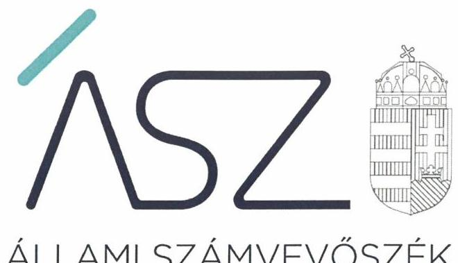
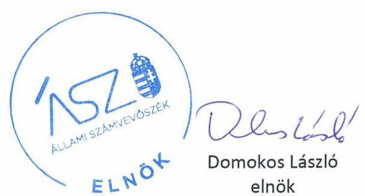

ÁLLAMI SZÁMVEVŐSZÉK

# JELENTÉS 

## Központi költségvetési szervek ellenőrzése

Széchenyi Zsigmond Mezőgazdasági Szakgimnázium, Szakközépiskola és Kollégium
2020.

20070
www.asz.hu

---

ÁLLAMI SZÁMVEVŐSZÉK

# JELENTÉS 

## Központi költségvetési szervek ellenőrzése

Széchenyi Zsigmond Mezőgazdasági Szakgimnázium, Szakközépiskola és Kollégium
2020. 05. hó 14. nap

20070
www.asz.hu

---

# AZ ELLENŐRZÉST FELÜGYELTE: 

KAKAS SÁNDOR felügyeleti vezető

## AZ ELLENŐRZÉST VEZETTE ÉS A VÉGREHAJTÁSÁÉRT FELELŐS:

DÉZSINÉ KIS HAJNALKA ellenőrzésvezető

## A PROGRAM ÖSSZEÁLLÍTÁSÁÉRT FELELŐS:

TÓTPÁL SZABOLCS osztályvezető

IKTATÓSZÁM: EL-2572-001/2020.
TÉMASZÁM: 2450
ELLENŐRZÉS-AZONOSÍTÓ SZÁM: V079171
Jelentéseink az Országgyúlés számítógépes hálózatán és az interneten a www.asz.hu címen is olvashatóak.

---

# TARTALOMJEGYZÉK 

■ ÖSSZEGZÉS ..... 5
■ AZ ELLENŐRZÉS CÉLJA ..... 6
■ AZ ELLENŐRZÉS TERÜLETE ..... 7
■ AZ ELLENŐRZÉS HÁTTERE, INDOKOLTSÁGA ..... 8
■ A JELENTÉS LÉNYEGES KÉRDÉSKÖREI ..... 9
■ AZ ELLENŐRZÉS HATÓKÖRE ÉS MÓDSZEREI ..... 10
■ MEGÁLLAPÍTÁSOK ..... 12
■ JAVASLATOK ..... 15
■ MELLÉKLETEK ..... 17
I. sz. melléklet: Értelmező szótár ..... 17
■ FÜGGELÉK: ÉSZREVÉTELEK ..... 19
■ RÖVIDÍTÉSEK JEGYZÉKE ..... 21

---

.

---

# ÖSSZEGZÉS 

A Széchenyi Zsigmond Mezőgazdasági Szakgimnázium, Szakközépiskola és Kollégium belső kontrollrendszere, pénzügyi és vagyongazdálkodása nem biztositotta a közpénzek szabályos felhasználását, a nemzeti vagyonnal való átlátható és elszámoltatható gazdálkodást, nem érvényesült a felelős gazdálkodás. Az Intézmény nem volt védett a korrupcióval szemben.

## Az ellenőrzés társadalmi indokoltsága

Magyarország versenyképességének és a magyar gazdaság fejlődésének alapvető feltétele a magyar munkavállalók megfelelő szakmai képzettsége és felkészültsége, amelyben a szakképzési rendszernek döntő szerepe van. A mezőgazdaság vonatkozásában is kiemelten fontos ez, hiszen a magyar mezőgazdaság piaci versenyképességét és eredményességét nagymértékben befolyásolja az agrárszférában dolgozók képzettsége, felkészültsége. A szakképzés legjelentősebb színterei a szakképző iskolák. Az eredményes és célszerű szakképzés alapja és alapvető feltétele a szakképző intézmények közpénzekkel és a közvagyonnal való törvényes, átlátható és a korrupcióval szembeni védelmet biztosító múködése és gazdálkodása. Ezért ezen szervezetekkel szemben is alapvető társadalmi igény, hogy a rájuk bízott közpénzekkel, közvagyonnal szabályosan gazdálkodjanak. Emellett a szakképzésben részt vevő pedagógusok, tanulók és a szülők jogos elvárása, hogy a szakképző iskolák múködése átlátható és elszámoltatható legyen. Mindezen igényekkel összhangban, a közpénzügyek átláthatóságának előmozdítása, a közvagyon védelme érdekében került sor az agrár-szakképző iskolák belső kontrollrendszerének és gazdálkodásának ellenőrzésére.

## Főbb megállapítások, következtetések, javaslatok

A Széchenyi Zsigmond Mezőgazdasági Szakgimnázium, Szakközépiskola és Kollégium belső kontrollrendszerének kialakítása és múködtetése nem volt szabályszerű a 2016-2017. években a kontrollkörnyezet kialakításának hiányosságai, a szabálytalan gazdálkodási jogkörgyakorlás, valamint az integrált kockázatkezelési és a nyomon követési rendszer hiánya miatt. Nem biztosította a szabályszerű közpénzfelhasználás feltételeit.

A Széchenyi Zsigmond Mezőgazdasági Szakgimnázium, Szakközépiskola és Kollégium pénzügyi gazdálkodása nem volt szabályszerű a 2016. évben, mert a kötelezettségvállalások nyilvántartása nem felelt meg a jogszabályi előírásoknak.

A Széchenyi Zsigmond Mezőgazdasági Szakgimnázium, Szakközépiskola és Kollégium vagyongazdálkodása nem volt szabályszerű a 2016-2017. években, mert a költségvetési beszámolók mérleg tételei leltárral nem voltak alátámasztottak, ezáltal az Intézmény költségvetési beszámolója nem mutat megbízható, valós képet vagyoni helyzetéről.

A Széchenyi Zsigmond Mezőgazdasági Szakgimnázium, Szakközépiskola és Kollégiumnál az integritás kontrollok kiépítése és múködtetése nem volt megfelelő a 2016-2017. években, mert nem végzett kockázatelemzést, és nem múködtetett integritást erősítő kötelezően és nem kötelezően előírt kontrollokat.

Az Állami Számvevőszék a jelentésben foglalt megállapítások alapján a Széchenyi Zsigmond Mezőgazdasági Szakgimnázium, Szakközépiskola és Kollégium igazgatója részére 9 javaslatot fogalmazott meg.

---

# AZ ELLENŐRZÉS CÉLJA 

AZ ELLENŐRZÉS CÉLJA annak megállapítása volt, hogy a központi költségvetési szervre vonatkozó irányító szervi feladatellátás a jogszabályi előírások betartásával történt-e; a központi költségvetési szerv belső kontrollrendszerének kialakítása és működtetése szabályszerű volt-e, biztosította-e az átlátható, szabályszerű, gazdaságos, hatékony és eredményes gazdálkodás feltételeit. Kiépítették és erősítették-e a korrupciós kockázatok kezelését szolgáló integritás kontrollokat; az intézményt érintő átszervezések lebonyolítása szabályszerűen törtét-e; megteremtették-e a teljesítményellenőrzés feltételeit. Továbbá annak megállapítása, hogy a szervezet gazdálkodása során elszámoltatható és megfelel-e annak az Alaptörvényben meghatározott alapvetésnek, hogy Magyarország a kiegyensúlyozott, átlátható és fenntartható költségvetési gazdálkodás elvét érvényesíti. Érvényesül-e a nemzeti vagyon kezelésének és védelmének célja, azaz a szervezet vagyona a közérdeket szolgálja, a közös szükségletek kielégítése és a természeti erőforrások megóvása, valamint a jövő nemzedékek szükségleteinek figyelembevétele mellett.

---

# **AZ ELLENŐRZÉS TERÜLETE**

## **Széchenyi Zsigmond Mezőgazdasági Szakgimnázium, Szakközépiskola és Kollégium**

A Somogyzsitfán található Széchenyi Zsigmond Mezőgazdasági Szakgimnázium, Szakközépiskola és Kollégium köznevelési intézmény. Az Intézmény1 tevékenysége szakgimnáziumi, szakközépiskolai nevelés-oktatás és kollégiumi ellátás, valamint felnőttoktatás.

A képzések mezőgazdasági, erdészeti és vadgazdálkodási területen folynak.

Az Intézmény alapítója és irányító szerve a Földművelésügyi Minisztérium, jelenleg Agrárminisztérium. Az Igazgató2 személye az ellenőrzés időszakában nem változott.

Az Intézmény saját gazdasági szervezete útján látta el a gazdálkodásával kapcsolatos feladatokat.

Az Intézmény költségvetési bevétele 2016-ban 593,8 millió Ft, 2017-ben 606,1 millió Ft volt, költségvetési kiadása 2016-ban 598,48 millió Ft, 2017-ben 600,1 millió Ft volt. Az átlagos statisztikai állományi létszám 101 fő volt a 2017. évben.

---

# AZ ELLENŐRZÉS HÁTTERE, INDOKOLTSÁGA 

Az ÁSZ ${ }^{3}$ ellenőrzi a költségvetési szervek gazdálkodását, működését, hogy megállapításaival támogassa az ellenőrzött szervezetek szabályszerű gazdálkodását, javaslataival elősegítse az Alaptörvényben ${ }^{4}$ megfogalmazott alapvetések érvényesülését a mindennapi életben a szervezetek szintjén.

Az egyes ellenőrzések megállapításaival és egy időszak ellenőrzési eredményeinek elemzésével az ÁSZ ráirányíthatja a jogalkotók figyelmét a központi alrendszerben vagy annak egy ágazatában esetlegesen felmerülő pénzügyi, szabályozási feszültségekre.

Az elvégzett ellenőrzések során az ÁSZ „jó gyakorlatokat" is azonosíthat, melyeket tanácsadó funkciója keretében szélesebb körben is megismertethet az érintettekkel, ezáltal is hozzájárulva a költségvetési rendszer szabályozott, átlátható, kiegyensúlyozott és fenntartható működéséhez.

Az ellenőrzés a szervezet kockázatértékelése alapján, az egyedi és lényeges jellemzők figyelembevételével, az ellenőrzésre kiválasztott modullal történik.

Az integritás- és belső kontroll modul a központi költségvetési szerv működésének irányítottságát, korrupció elleni védettségét értékeli.

A belső kontrollrendszer kialakítása és működtetése nélkül nem valósítható meg a közpénzek, a közvagyon átlátható, szabályos, gazdaságos, hatékony és eredményes felhasználása. A belső kontrollrendszer azt a célt szolgálja, hogy a költségvetési szervek működésük és gazdálkodásuk során a tevékenységeket szabályszerűen hajtsák végre, teljesítsék elszámolási kötelezettségeiket és megvédjék az erőforrásokat a veszteségektől, a károktól és a nem rendeltetésszerű használattól.

Az államháztartás központi alrendszerébe tartozó szervezet vagyona a nemzeti vagyon része, és az Alaptörvény is rögzíti, hogy a vagyonnal való gazdálkodás célja a közérdek szolgálata.

---

# A JELENTÉS LÉNYEGES KÉRDÉSKÖREI 

1. Az irányító szerv ellenőrzött költségvetési szervre vonatkozó feladatellátása szabályszerű volt-e?
2. A belső kontrollrendszer kialakítása és müködtetése szabályszerűen történt-e?
3. A költségvetési szerv pénzügyi gazdálkodása szabályszerű volt-e?
4. A költségvetési szerv vagyongazdálkodása szabályszerű volt-e?
5. A költségvetési szervnél alakítottak-e ki a teljesítmény mérésére alkalmas követelményeket?

---

# AZ ELLENŐRZÉS HATÓKÖRE ÉS MÓDSZEREI 

## Az ellenőrzés típusa

Megfelelőségi ellenőrzés.

## Az ellenőrzött időszak

A belső kontroll rendszer kialakítása és működtetése, a vagyongazdálkodás, továbbá az integritás kontrollok kiépítettsége tekintetében a 2016. és a 2017. év.

Az irányító szervi feladatellátás és a pénzügyi gazdálkodás tekintetében a 2016. év. A teljesítmény ellenőrzés feltételei tekintetében a 2017. év.

## Az ellenőrzés tárgya

Az ellenőrzött szervezetre vonatkozó irányító szervi feladatok ellátása. Az intézmény belső kontroll rendszerének kialakítása és múködtetése. Az intézmény pénzügyi és vagyongazdálkodása, átalakításának vagy átszervezésének lebonyolítása. Az intézménynél az integritáskontrollok kiépítettsége, az integritás szemlélet érvényesülése, a teljesítményellenőrzés feltételei.

## Az ellenőrzött szervezet

Széchenyi Zsigmond Mezőgazdasági Szakgimnázium, Szakközépiskola és Kollégium és irányítószerve az Agrárminisztérium.

## Az ellenőrzés jogalapja

Az ellenőrzés jogszabályi alapját az ÁSZ tv . 1. § (3) bekezdés, 5. § (2)-(3) és (6) bekezdései, (4) bekezdés a), pontja, valamint Áht. 61. § (2) bekezdésének előírásai képezik.

## Az ellenőrzés módszerei

Az ÁSZ az ellenőrzést az ellenőrzési program szempontjai, az ellenőrzött időszakban hatályos jogszabályok, az ellenőrzés szakmai szabályai, a jelen ellenőrzésre irányadó ÁSZ módszertanok figyelembevételével hajtotta végre.

---

Az ellenőrzési kérdések megválaszolásához szükséges bizonyítékok megszerzése az ellenőrzött által rendelkezésre bocsátott dokumentumokra, adatokra alapozva megfigyelés, szemle (szemrevételezés), mintavételezés, valamint elemző eljárás útján történt. Az ellenőrzési bizonyítékként felhasználható adatforrások közé tartoztak az ellenőrzési program részletes szempontjainál felsorolt adatforrások, valamint minden egyéb az ellenőrzés folyamán feltárt, az ellenőrzés szempontjából információt tartalmazó - dokumentum.

Az ellenőrzés lefolytatásához az ellenőrzött szervezet tanúsítványok kitöltésével, valamint az ÁSZ által kért dokumentumok megküldésével szolgáltatott adatokat, amelyek valódiságát és teljes körűségét az ellenőrzött szervezet vezetője által tett teljességi és hitelességi nyilatkozat igazolta. A rendelkezésre bocsátott adatok, információk kontrollja az ellenőrzés keretében történt.

A központi költségvetési szerv belső kontrollrendszere egyes pilléreinek kialakítására és működtetésére vonatkozó értékelés:
$\longrightarrow$ „szabályszerű", amennyiben az értékelt területen az elért „igen" válaszok százalékban kifejezett, egész számra kerekített aránya legalább $85 \%$,
$\longrightarrow$ „nem szabályszerű", ha nem éri el a 85\%-ot.
A kontrollrendszer egésze esetében a „szabályszerű" értékelésnek a százalékos értéken felül további feltétele, hogy egyik kontrollterület sem kaphat „nem szabályszerű" értékelést.

A kiadások ellenőrzésére a 2016-2017 év vonatkozásában került sor. A kiadások (külső személyi juttatások, felhalmozási kiadások, dologi kiadások) esetében az ellenőrzés azokra a legnagyobb értékű tételekre - a lényeges sokaságra - terjedt ki, melyek összértéke eléri a teljes sokaság összértékének 50\%-át.

A 2017. évi kiadások esetében a lényeges sokaság tételes ellenőrizésére került sor.

A 2016. évi kiadások elszámolásának szabályszerűséget a lényeges sokaságból véletlen mintavételi eljárással kiválasztott tételek alapján ellenőrizte az ÁSZ.

A 2017. évi beruházások, felújítások végrehajtásának, valamint a feladatellátást szolgáló állami vagyontárgyak év végi értékelésének szabályszerűségének esetében tételes ellenőrzésre került sor.

A 2017. évi feladatellátást szolgáló állami vagyontárgyak használatának szabályszerűségét a teljes sokaságból véletlen mintavétellel kiválasztott tételek alapján ellenőrizte az ÁSZ.

A mintavétellel ellenőrzött területek esetében minden egyes tétel vonatkozásában a használat és az elszámolás szabályszerűségére vonatkozó kérdéseket tettünk fel. Szabályszerűnek értékeltünk egy ellenőrzött területet, amennyiben 95\%-os bizonyossággal az ellenőrzött sokaságban az átlagos hibaarány legfeljebb 10\%, nem szabályszerűnek, amennyiben 10\%nál magasabb arányt képviselt.

Az ellenőrzés ideje alatt az ellenőrzött szervezettel történő kapcsolattartást az ÁSZ SZMSZ-ének vonatkozó előírásai alapján biztosította az ÁSZ.

---

# 1. Az irányító szerv ellenőrzött költségvetési szervre vonatkozó feladatellátása szabályszerű volt-e? 

Összegző megállapítás Az Irányító szerv ${ }^{5}$ Intézményre vonatkozó feladatellátása a 2016. évben szabályszerű volt.

Az Irányító szerv az Áht. ${ }^{6}$-ban foglalt jogkörében eljárva kiadmányozta az Intézmény alapító okiratának módosítását a szakképzés rendszerét érintő szabályozási környezet változása miatt.

Az Irányító szerv az Áht. és az Áhsz. ${ }^{7}$ előírása alapján jóváhagyta az Intézmény elemi költségvetését és éves költségvetési beszámolóját, beszámoltatta az Intézményt az éves szakmai feladatellátásról.

## 2. A belső kontrollrendszer kialakítása és múködtetése szabályszerűen történt-e?

## Összegző megállapítás

Az Intézmény belső kontroll rendszerének kialakítása és múködtetése nem volt szabályszerű a 2016-2017. években.

A KONTROLLKÖRNYEZET kialakítása nem volt szabályszerű a 2016-2017. években. Az Intézmény Igazgatója a Bkr. ${ }^{8}$ 6. § (1) bekezdése c) pontjában foglaltak ellenére nem határozta meg az etikai elvárásokat a szervezet minden szintjén, továbbá a Bkr. 6. § (4) bekezdésében előírtak ellenére nem szabályozta az integritást sértő események kezelésének eljárásrendjét, valamint belső szabályzatban nem rendezte az Ávr. ${ }^{9}$ 13. § (2) bekezdés f) pontjában foglaltak ellenére a gépjárművek igénybevételének és használatának rendjét és az Ávr. 13. § (2) bekezdés és a g) pontjában foglaltak ellenére a telefonok használatát. Az Intézmény nem készítette el számlarendjét a Számv. tv. ${ }^{10}$ 161. § (1) bekezdésében előírtak ellenére.

KOCKÁZATKEZELÉSI RENDSZERT a Bkr. 3. § b) pontjában foglaltak ellenére az Intézmény Igazgatója nem alakított ki 2016.09.30ig, továbbá a Bkr. 6. § (4) bekezdésében előírtak ellenére nem szabályozta az integrált kockázatkezelés eljárásrendjét 2016.10.01-től, nem alakított ki integrált kockázatkezelési rendszert.

A KONTROLLTEVÉKENYSÉGEK keretein belül a gazdálkodási jogkörök gyakorlása a 2016-2017. években nem volt szabályszerű. Az Intézmény az Áht. 37. § (1) bekezdésében foglaltak ellenére a kiadási előirányzatok felhasználását nem támasztotta alá írásbeli kötelezettségvállalással, valamint az Áht. 38. § (1) bekezdés előírása ellenére teljesítés igazolás nélkül fizetett ki kiadásokat.

---

AZ INFORMÁCIÓS ÉS KOMMUNIKÁCIÓS RENDSZER kialakítása és múködtetése nem volt szabályszerű a 2016-2017. években. Az Intézmény az Info tv. ${ }^{11} 30$. § (6) bekezdésében előírtak ellenére nem szabályozta a közérdekú adatok megismerésére irányuló igények teljesítésének rendjét, valamint az Info tv. 24. (3) bekezdésében foglaltak ellenére nem készített adatvédelmi és adatbiztonsági szabályzatot.

NYOMON KÖVETÉSI RENDSZERT az Intézmény Igazgatója a Bkr. 10. §-ában előírtak ellenére nem alakított ki a 2016-2017. években.

Az Intézmény Igazgatója a 2016-2017. években eleget tett a Bkr. 11. § (1) bekezdésében előírt nyilatkozattételi kötelezettségének a belső kontrollrendszer minőségének értékelésére vonatkozóan. A nyilatkozat tartalmát az ÁSZ jelen ellenőrzése nem igazolta.

# AZ INTEGRITÁS KONTROLLOK KIÉPÍTÉSE ÉS 

MÚKÖDTETÉSE nem volt megfelelő a 2016-2017. években. Az Intézmény nem végzett kockázatelemzést, és nem múködtetett integritást erősítő kötelezően és nem kötelezően előírt kontrollokat.

## 3. A költségvetési szerv pénzügyi gazdálkodása szabályszerű volt-e?

Összegző megállapítás Az Intézmény pénzügyi gazdálkodása a 2016. évben nem volt szabályszerű.

A KÖTELEZETTSÉGVÁLLALÁSOK NYILVÁNTARTÁSA a 2016. évben nem volt szabályszerű, mert az Intézmény az Áhsz. 39.§ (3) bekezdésében foglaltak ellenére nem gondoskodott a kötelezettségvállalások jogszabálynak megfelelő nyilvántartásáról, a nyilvántartás az Áhsz. 14. melléklet II. 4.
a) pontja ellenére nem tartalmazta a pénzügyi ellenjegyzésre vonatkozó adatokat, és a kötelezettségvállalást tanúsító dokumentum keltét,
e) pontja ellenére a pénzügyi teljesítési határidőket,
g) pontja ellenére a pénzügyi teljesítések dátumát.

## 4. A költségvetési szerv vagyongazdálkodása szabályszerű volt-e?

## Összegző megállapítás Az Intézmény vagyongazdálkodása nem volt szabályszerű a 2016-2017. években.

Az Intézmény a 2016-2017. években az Áhsz. 5. § (1) bekezdés és az Áhsz. 22. § (1)-(2) bekezdésében, valamint a Számv. tv. 69. § (1) bekezdésében foglaltak ellenére nem támasztotta alá költségvetési beszámolója mérleg tételeit leltárral.

---

# 5. A költségvetési szervnél alakítottak-e ki a teljesítmény mérésére alkalmas követelményeket? 

Összegző megállapítás Az Intézmény nem alakította ki a teljesítmény mérésére alkalmas követelményeket a 2017. évben.

Az Intézmény nem képzett a szervezeti célok eléréséhez szükséges feladatok és folyamatok mérésére szolgáló indikátorokat, mérőszámokat, feladat és teljesítménymutatókat, így nem biztosították a teljesítménymérés feltételeit.

---

# JAVASLATOK 

Az ÁSZ tv. 33. § (1) bekezdésében foglaltak értelmében az ellenőrzött szervezet vezetője köteles a jelentésben foglalt megállapításokhoz kapcsolódó intézkedési tervet összeállítani és azt a jelentés kézhezvételétől számított 30 napon belül az ÁSZ részére megküldeni. Amennyiben az ellenőrzött szervezet vezetője nem küldi meg határidőben az intézkedési tervet, vagy továbbra sem elfogadható intézkedési tervet küld, az Állami Számvevőszék elnöke az ÁSZ tv. 33. § (3) bekezdése a) és b) pontjaiban foglaltakat érvényesítheti.

## Széchenyi Zsigmond Mezőgazdasági Szakgimnázium, Szakközépiskola és Kollégium igazgatójának

1. Gondoskodjon az etikai elvárások meghatározásáról a szervezet minden szintjén a jogszabályi előírásnak megfelelően.
(2. megállapítás 1. bekezdés 2. mondat 1. tagmondata alapján)
2. Gondoskodjon a szervezeti integritást sértő események kezelésének eljárásrendje szabályozásáról a jogszabályi előirás szerint.
(2. megállapítás 1. bekezdés 2. mondat 2. tagmondata alapján)
3. Gondoskodjon az Intézmény számlarendjének elkészitéséről a jogszabályi előirás szerint.
(2. megállapítás 1. bekezdés 3. mondata alapján)
4. Gondoskodjon az integrált kockázatkezelési rendszer kialakításáról a jogszabályi előirás szerint.
(2. megállapítás 2. bekezdése alapján)
5. Gondoskodjon arról, hogy a kötelezettségvállalásokra a jogszabályi előírásoknak megfelelően kerüljön sor.
(2. megállapítás 3. bekezdés 2. mondat 1. tagmondata alapján)
6. Gondoskodjon a teljesítésigazolások elvégzéséről jogszabályi előirás szerint.
(2. megállapítás 3. bekezdés 2. mondat 2. tagmondata alapján)

---

7. Gondoskodjon a szervezet tevékenységének, a célok megvalósitásának nyomon követését biztositó rendszer kialakításáról a jogszabályi elöírás szerint.
(2. megállapítás 5. bekezdés 1. mondata alapján)
8. Intézkedjen a kötelezettségvállalások részletező nyilvántartásának jogszabályi elöírásoknak megfelelő vezetéséről.
(3. megállapítás 1. bekezdése alapján)
9. Intézkedjen a jogszabályi elöírásoknak megfelelően a mérleg tételeit alátámasztó leltár elkészitéséről, amely tételesen, ellenőrizhető módon tartalmazza a mérleg fordulónapján meglévő eszközöket és forrásokat mennyiségben és értékben.
(4. megállapítás 1. bekezdése alapján)

---

# MELLÉKLETEK 

- I. SZ. MELLÉKLET: ÉRTELMEZŐ SZÓTÁR
állami vagyon
állami vagyonnak minősül:
a) az állam tulajdonában lévő dolog, valamint a dolog módjára hasznosítható természeti erő,
b) az a) pont hatálya alá nem tartozó mindazon vagyon, amely vonatkozásában törvény az állam kizárólagos tulajdonjogát nevesíti,
c) az állam tulajdonában lévő tagsági jogviszonyt megtestesítő értékpapír, illetve az államot megillető egyéb társasági részesedés,
d) az államot megillető olyan immateriális, vagyoni értékkel rendelkező jogosultság, amelyet jogszabály vagyoni értékű jogként nevesít.
e) az állam tulajdonában lévő pénzügyi eszközök
(Forrás: Vtv. ${ }^{12}$ 1. § (2) bekezdése)
állami vagyon kezelője /vagyonkezelő
ázalakítás
belső ellenőrzés
belső kontrollrendszer
belső kontrollrendszer területei
fenntartó
hasznosítás
információs és kommunikációs rendszer

Az állami tulajdonában álló vagyon tekintetében - a nemzeti vagyonról szóló törvényben vagyonkezelőként meghatározott azon személy, amellyel az állami vagyon vagyonkezelésére a Magyar Nemzeti Vagyonkezelő Zrt. valamint annak jogelődje, vagy az állami tulajdonosi joggyakorlója vagyonkezelési szerződést kötött, továbbá akit törvény vagyonkezelőnek kijelölt. (Forrás: Vtvr. 1. § (7) bekezdés b) pontja)
A költségvetési szerv általános jogutódlással történő megszüntetése átalakítással történhet. Átalakítás az egyesítés, a szétválás, vagy ha az alapító szerv a költségvetési szervet megszünteti, és az átalakítás során a megszüntetett költségvetési szerv jogutódjaként új költségvetési szervet alapít. (Forrás Áht. 11.§(2) bekezdés)
Független, tárgyilagos bizonyosságot adó és tanácsadó tevékenység, amelynek célja, hogy az ellenőrzött szervezet működését fejlessze és eredményességét növelje, az ellenőrzött szervezet céljai elérése érdekében rendszerszemléletű megközelítéssel és módszeresen értékeli, illetve fejleszti az ellenőrzött szervezet irányítási és belső kontrollrendszerének hatékonyságát. (Forrás: Bkr. 2. § b) pontja)
A belső kontrollrendszer a kockázatok kezelése és tárgyilagos bizonyosság megszerzése érdekében kialakított folyamatrendszer, amely azt a célt szolgálja, hogy a müködés és gazdálkodás során a tevékenységeket szabályszerűen, gazdaságosan, hatékonyan, eredményesen hajtsák végre, az elszámolási kötelezettségeket teljesítsék, megvédjék az erőforrásokat a veszteségektől, károktól és nem rendeltetésszerű használattól. (Forrás: Áht. 69. § (1) bekezdése)
A kontrollkörnyezet, az integrált kockázatkezelési rendszer, a kontrolltevékenységek, az információs és kommunikációs rendszer, valamint a nyomon követési (monitoring) rendszer. (Forrás: Bkr. 3. §-a)
Az a természetes vagy jogi személy, aki vagy amely a köznevelési feladat ellátására való jogosultságot megszerezte vagy azzal rendelkezik, és a köznevelési intézmény müködéséhez szükséges feltételekről gondoskodik. (Forrás: Köznev. tv. ${ }^{13}$ 4. § 9. pont) A nemzeti vagyon birtoklásának, használatának, hasznok szedése jogának bármely a tulajdonjog átruházását nem eredményező - jogcímen történő átengedése, ide nem értve a vagyonkezelésbe adást, valamint a haszonélvezeti jog alapítását. (Forrás: Nvtv. ${ }^{14}$ 3. § (1) bekezdés 4. pontja)
A költségvetési szerv vezetője által kialakított és működtetett olyan rendszer, mely biztosítja, hogy a megfelelő információk a megfelelő időben eljutnak az illetékes szervezethez, szervezeti egységhez, illetve személyhez. (Forrás: Bkr. 9. § (1) bekezdés)

---

integritás
irányító szerv/felügyeleti szerv
kockázat
integrált kockázatkezelési rendszer
kontrollkörnyezet
kontrolltevékenységek
nyomon követési rendszer (monitoring)
vagyongazdálkodás

Az integritás - egyik gyakran használt jelentése szerint - az elvek, értékek, cselekvések, módszerek, intézkedések konzisztenciáját jelenti, vagyis olyan magatartásmódot, amely meghatározott értékeknek megfelel. Integritás-irányítási rendszer bevezetése a szervezetben a szervezethez rendelt közfeladatok integritás szempontú ellátását, az érték alapú múködéssel (integritással) összefüggő szervezeti követelmények következetes érvényesítését jelenti. (Forrás: Nemzetgazdasági Minisztérium: Államháztartási Belső Kontroll Standardok és Gyakorlati Útmutató 1.6. Etikai értékek és integritás 46. oldal, 2017. szeptember)
A költségvetési szerv tekintetében az Áht.-ban meghatározott irányítási hatáskört gyakorló szerv. (Forrás: Áht. 1. § 9. pontja)
A kockázat annak a valószínűségét jelenti, hogy egy vagy több esemény vagy intézkedés nem kívánt módon befolyásolja a rendszer múködését, céljainak megvalósulását. (Forrás: Javaslatok a korrupciós kockázatok kezelésére - Kockázatkezelési és ellenőrzési módszertan 35. oldal, ÁSZ)
Olyan folyamatalapú kockázatkezelési rendszer, amely a szervezet minden tevékenységére kiterjed, egységes módszertan és eljárások alkalmazásával, a szervezet célkitűzéseinek és értékeinek figyelembevételével biztosítja a szervezet kockázatainak teljes körű azonosítását, azok meghatározott kritériumok szerinti értékelését, valamint a kockázatok kezelésére vonatkozó intézkedési terv elkészítését és az abban foglaltak nyomon követését. (Forrás: Bkr. 2. § m) pontja, 2016. október 1-jétől)
A költségvetési szerv vezetője által kialakított olyan elvek, eljárások, belső szabályzatok összessége, amelyben világos a szervezeti struktúra, a folyamatok átláthatók, egyértelmúek a felelősségi, hatásköri viszonyok és feladatok, meghatározottak, ismertek és elfogadottak az etikai elvárások a szervezet minden szintjén, átlátható a humán-erőforrás-kezelés, biztosított a szervezeti célok és értékek irányában való elkötelezettség fejlesztése és elősegítése. (Forrás: Bkr. 6. § (1) bekezdés)
A költségvetési szerv vezetője által a szervezeten belül kialakított (kontroll) tevékenységek, melyek biztosítják a kockázatok kezelését, hozzájárulnak a szervezet céljainak eléréséhez és erősítik a szervezet integritását. (Forrás: Bkr. 8. § (1) bekezdés)
A költségvetési szerv vezetője köteles kialakítani a szervezet tevékenységének a célok megvalósításának nyomon követését biztosító rendszert, amely az operatív tevékenységek keretében megvalósuló folyamatos és eseti nyomon követésből, valamint az operatív tevékenységektől függetlenül múködő belső ellenőrzésből áll. (Forrás: Bkr. 10. §)

A nemzeti vagyongazdálkodás feladata a nemzeti vagyon rendeltetésének megfelelő, az állam, az önkormányzat mindenkori teherbíró képességéhez igazodó, elsődlegesen a közfeladatok ellátásához és a mindenkori társadalmi szükségletek kielégítéséhez szükséges, egységes elveken alapuló, átlátható, hatékony és költségtakarékos múködtetése, értékének megőrzése, állagának védelme, értéknövelő használata, hasznosítása, gyarapítása, továbbá az állam vagy a helyi önkormányzat feladatának ellátása szempontjából feleslegessé váló vagyontárgyak elidegenítése. (Forrás: Nvtv. 7. § (2) bekezdése)

---

# FÜGGELÉK: ÉSZREVÉTELEK 

A jelentéstervezetet a Számvevőszék 15 napos észrevételezésre megküldte az ellenőrzött szervezetek vezetőinek az ÁSZ tv. 29. §* (1) bekezdése előírásának megfelelően.

Az ellenőrzött szervezetek vezetői a jelentéstervezet megállapításaira nem tettek észrevételt.

[^0]
[^0]:    * 29. § (1) Az Állami Számvevőszék az ellenőrzési megállapításait megküldi az ellenőrzött szervezet vezetőjének vagy az általa megbízott személynek, és annak, akinek személyes felelősségét állapította meg.
    (2) Az ellenőrzött szervezet vezetője és a felelősként megjelölt személy az ellenőrzés megállapításaira tizenöt napon belül írásban észrevételt tehet.
    (3) Az Állami Számvevőszék az észrevételre a beérkezésétől számított harminc napon belül írásban válaszol. A figyelembe nem vett észrevételeket köteles a jelentésben feltüntetni, és megindokolni, hogy azokat miért nem fogadta el.

---

.

---

# RÖVIDÍTÉSEK JEGYZÉKE 

${ }^{1}$ Intézmény
${ }^{2}$ Igazgató
${ }^{3}$ ÁSZ
${ }^{4}$ Alaptörvény
${ }^{5}$ Irányító szerv
${ }^{6}$ Áht.
${ }^{7}$ Áhsz.
${ }^{8}$ Bkr.
${ }^{9}$ Ávr.
${ }^{10}$ Számv.tv.
${ }^{11}$ Info tv.
${ }^{12}$ Vtv.
${ }^{13}$ Köznev. tv.
${ }^{14}$ Nvtv.

Széchenyi Zsigmond Mezőgazdasági Szakgimnázium, Szakközépiskola és Kollégium
Széchenyi Zsigmond Mezőgazdasági Szakgimnázium, Szakközépiskola és Kollégium igazgatója
Állami Számvevőszék
Magyarország Alaptörvénye (2011. április 25.)
Földművelésügyi Minisztérium/Agrárminisztérium
az államháztartásról szóló 2011. évi CXCV. törvény
az államháztartás számviteléről szóló 4/2013. (I. 11.) Korm. rendelet
a költségvetési szervek belső kontrollrendszeréről és belső ellenőrzésről szóló 370/2011. (XII. 31.) Korm. rendelet
az államháztartási törvény végrehajtásáról szóló 368/2011 (XII.31.) Korm. rendelet
a számvitelről szóló 2000.évi C. törvény
az információs önrendelkezési jogról és az információszabadságról szóló 2011. évi CXII. törvény
az állami vagyonról szóló 2007. évi CVI. törvény (hatályos: 2007. szeptember 25-től)
a nemzeti köznevelésről szóló 2011. évi CXC. törvény (hatályos: 2012. szeptember 1-jétől)
a nemzeti vagyonról szóló 2011. évi CXCVI. törvény

---

# ASZ 

ALLAMI SZAMVEVOSZEK
1052 Budapest, Apáczai Cs. J. u. 10. I 1364 Budapest 4. Pf. 54 TEL: +36 14849100
email: szamvevoszek@asz.hu
web: www.asz.hu | www.aszhirportal.hu