ÁLLAMI SZÁMVEVŐSZÉK

# JELENTÉS 

Községi, nagyközségi önkormányzatok integritásának ellenőrzése
$\qquad$
2020.

20071
www.asz.hu

---

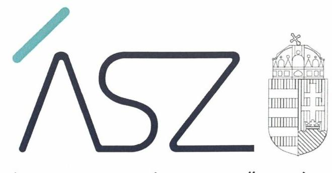

ÁLLAMI SZÁMVEVŐSZÉK

# JELENTÉS 

Községi, nagyközségi önkormányzatok integritásának ellenőrzése
2020. 05. hó 01 nap

20071
www.asz.hu
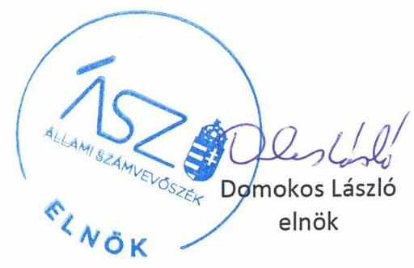

---

# AZ ELLENŐRZÉST FELÜGYELTE: 

SALAMON ILDIKÓ felügyeleti vezető
DR. NÉMETH ERZSÉBET felügyeleti vezető

AZ ELLENŐRZÉST VEZETTE ÉS A VÉGREHAJTÁSÁÉRT FELELŐS:
MARTUS BETTINA ellenőrzésvezető
JAKOVÁC KATALIN ellenőrzésvezető

A PROGRAM ÖSSZEÁLLÍTÁSÁÉRT FELELŐS:
TÓTPÁL SZABOLCS osztályvezető

Jelentéseink az Országgyúlés számítógépes hálózatán és az interneten a www.asz.hu címen is olvashatóak.

IKTATÓSZÁM: EL-2570-001/2020.
TÉMASZÁM: 20
ELLENŐRZÉS-AZONOSÍTÓ SZÁM: V0829

---

# TARTALOMJEGYZÉK 

■ ÖSSZEGZÉS ..... 5
■ AZ ELLENŐRZÉS CÉLJA ..... 7
■ AZ ELLENŐRZÉS TERÜLETE ..... 8
■ AZ ELLENŐRZÉS HÁTTERE, INDOKOLTSÁGA ..... 10
■ A JELENTÉS LÉNYEGES KÉRDÉSKÖREI ..... 11
■ AZ ELLENŐRZÉS HATÓKÖRE ÉS MÓDSZEREI ..... 12
■ AZ ELLENŐRZÖTT ÖNKORMÁNYZATOK ÉRTÉKELÉSE ..... 15
■ JAVASLATOK ..... 21
■ MELLÉKLETEK ..... 23
I. sz. melléklet: Az ellenőrzött önkormányzatok eredményei és kockázati besorolása ..... 23
II. sz. melléklet: Intézkedést igénylő megállapítások és az érintett önkormányzatok ..... 24
III. sz. melléklet: Ajánlások és Útmutatók ..... 26
■ FÜGGELÉKEK ..... 27
I. sz. függelék a jelentéshez ..... 27
II. sz. függelék: Észrevételek ..... 28
■ RÖVIDÍTÉSEK JEGYZÉKE ..... 61

---

.

---

# ÖSSZEGZÉS 

Magyarországon az önálló hivatallal rendelkező nagyközségi önkormányzatok nem alakították ki az integritás lényeges elemeit. Kockázatcsökkentő lépések szükségesek az átlátható és értékelvü müködés és gazdálkodás megteremtése érdekében.

## Az ellenőrzés társadalmi indokoltsága

Az Állami Számvevőszék az Országgyűlés 35/2009. (V. 12.) számú határozatába foglalt felkérésére kiemelt feladatként foglalkozik a közszféra integritási helyzetének erősítésével. Az ÁSZ Integritás felmérései az önkormányzatokat az átlagosnál kockázatosabb intézménycsoportként azonosították. A kisebb méretű települési önkormányzatok különösen veszélyeztetettek, mert kontrollkörnyezetük, integritási infrastruktúrájuk kevésbé kiépített. Ez indokolta, hogy az ÁSZ ellenőrzés keretében is átfogóan értékelje a terület integritási kockázatait, informálja a szakmai irányítót az önkormányzatok integritásának területeiről, valamint részletes képet adjon az esetleges beavatkozási pontok meghatározásához. Az integritási rendszerkockázatokat jelző, új módszertan alapján végzett ellenőrzés azt értékelte, hogy a szervezetek a feladatellátásuk során jelentkező integritási kockázatokat megfelelően felmérték-e, a kockázatokat mérséklő integritáskontrollokat kiépítették-e, és a kontrolleszközök kiterjednek-e a kockázatos folyamatokra, területekre. Az ellenőrzés az integritás hat kulcsterületét értékeli, mindegyik esetben olyan eszközöket vizsgál meg, amelyek közvetlen és érdemi kapcsolatban vannak a szervezeti integritással.

## Főbb megállapítások, következtetések, javaslatok

A magyar közigazgatási rendszer által megkülönböztetett nagyközségi önkormányzatok 2018-ban a települések négy százalékát tették ki, e településeken él a lakosság közel öt százaléka. Lakosságszámuk 1117-10418 fő között szóródott, átlagosan 3600 fő volt.

A 127 nagyközség közül 78 önálló hivatalt tartott fenn. Az önálló hivatallal rendelkezőket reprezentáló 30 nagyközségi önkormányzat adatai szerint az általuk fenntartott hivatalokban - 6 fő és 33 fő közötti szórással - átlagosan 15 köztisztviselő látta el a feladatokat.

Alapvető társadalmi elvárás, hogy a szervezet működésében érvényesüljenek az integritás alapú hivatali elvek az állampolgárok részére nyújtott szolgáltatások során. Vagyis minden állampolgár azonos elvek alapján, azonos elbírálás szerint kapja a hivatal által nyújtott közigazgatási szolgáltatásokat, és ennek érvényesülése az érintettek elégedettségi szintjében is jelentkezzen. Az integritás alapú hivatali múködés megléte vagy hiánya alapvetően befolyásolhatja az állampolgárok közigazgatásba vetett bizalmát: fennállása láthatóan erősíti annak bizonyítékát, hogy más ügyfelekkel azonos szolgáltatásban részesül, hiánya pedig nemcsak gyengíti ezt, hanem a bizalom elvesztéshez is vezethet.

Ennek ellenére az önálló hivatallal rendelkező nagyközségi önkormányzatoknál (a továbbiakban: önkormányzatok) a tevékenységek összességére kiterjedő integritás-szemlélet nem volt jellemző. Az integritás elvű hivatali múködés erősítése érdekében kockázatcsökkentő lépések szükségesek az etikai alapelvek meghatározása, az integritáskockázatok kezelése és nyomon követése, a vagyonnyilatkozat-tétel, az összeférhetetlenséghez és kapcsolattartáshoz kapcsolódó integritáskontrollok, valamint a bejelentőket megillető védelemre vonatkozó tájékoztatás kialakítása terén.

Az integritás elvű hivatali múködés alapfeltételeként az önkormányzatok az integritáskockázataikat azonosították, többségüknél ugyanakkor a feladatellátásból fakadó integritási kockázatok tudatos (szabályzatokba épített) kezelése nem történt meg.

A korrupció-megelőzés szempontjából kulcsfontosságú, hogy az etikai környezettel kapcsolatos szabályozásokat az önkormányzatok megalkossák, meghatározzák a köztisztviselőkkel szembeni etikai elvárásokat. Kockázatot jelentett, hogy az önkormányzatok többsége nem rendelkezett olyan - a külső befolyásolás lehetőségét érdemben csök-

---

kentő - alapvető integritáseszközökkel, mint az ajándékozási szabályzat vagy a külső összeférhetetlenségre és kapcsolattartásra vonatkozó szabályzatok. Az etikai normák, az ajándék elfogadása, az összeférhetetlenség, a kapcsolattartás szabályainak megalkotása és tudatosítása nemcsak az érintett köztisztviselők viselkedését, hanem az állampolgárok köztisztviselőkkel szembeni megítélését is befolyásolja, az elvárt viselkedés köz számára történő tudatosításával a bizalom erősítésének az alapja.

A vagyongyarapodás átláthatóságának alapvető feltétele, hogy az érintettek meghatározott időszakonként számot adjanak vagyongyarapodásukról, és vagyonnyilatkozatukat az erre kötelezettek nyilvántartásba vegyék. Az ellenőrzés feltárta, hogy a megelőző kontrollok csak minden második önkormányzatnál teljesültek. Ennek hiánya - amely a jogszerűtlen vagyongyarapodás kockázatát jelenti -, hatással van az állampolgárok érintettekkel szembeni megítélésére is.

Az integritást sértő esetek feltárását segíthetik elő az állampolgároktól érkező közérdekű bejelentések. Az ellenőrzés rámutat, hogy bár az önkormányzatok a bejelentések megtételére szolgáló elérhetőségek közzétételéről gondoskodtak, a bejelentők védelmére vonatkozóan nem adtak megfelelő tájékoztatást, valamint nem tekintették át a bejelentések tapasztalatait. A bejelentők védelmére vonatkozó tájékoztatás alapvető bizalmi garanciája a bejelentési rendszer múködésének.

Az önkormányzatok harmadánál a szervezeti integritás és az elszámoltathatóság alapvető követelményei nem teljesültek, a vizsgált integritáskontrollok összességében nem biztosították az önkormányzatok védelmét a külső befolyásolás, a csalás és korrupció kockázataival szemben. Ezen önkormányzatoknál a legtöbb integritáskontroll fejlesztést igényel.

Az ellenőrzés a rendszerkockázatok feltárása mellett az egyes önkormányzatok tekintetében is képet ad arról, hogy azok mely területeken múködtettek megfelelő integritáskontrollokat, illetve hol van még tere a fejlődésnek.

Az ellenőrzött szervezetek értékelése során ugyanakkor bebizonyosodott, hogy van olyan önálló polgármesteri hivatallal rendelkező nagyközségi önkormányzat (Alsónémedi), amely múködésének és feladatellátásának integritását biztosította, ezzel pedig követendő példaként szolgál az önkormányzatoknak.

Az Állami Számvevőszék a hivatalok által nyújtott szolgáltatások terén a bizalom erősítését szolgáló integritás kontrollok kiépítése érdekében öt területen fogalmazott meg javaslatokat 22 önkormányzat részére.

---

# AZ ELLENŐRZÉS CÉLJA 

Az ellenőrzés célja annak értékelése, hogy az ellenőrzött szervezetek a feladatellátásuk nyomán jelentkező integritási kockázatokat megfelelően felmérték-e, a kockázatokat mérséklő integritáskontrollokat kiépítették-e, és a kontrolleszközök kiterjednek-e a kockázatos folyamatokra.

---

# Az ELLENŐRZÉS TERÜLETE 

## Önálló hivatallal rendelkező nagyközségi önkormányzatok

A magyarországi közigazgatási rendszer megkülönbözteti a község és a nagyközség fogalmát. Az Mötv. ${ }^{1}$ alapján nagyközségi címet használhatják azon községi önkormányzatok, amelyek a törvény hatálybalépésekor (2012. január 1.) nagyközségi címmel rendelkeztek, továbbá, amelyek területén legalább háromezer lakos él.

Magyarországon 2018-ban 127 nagyközség volt (ezek közül 78 rendelkezett önálló hivatallal), amelyek a települések négy százalékát teszik ki. Legnagyobb számban az észak-alföldi régióban található ilyen jogállású település (30). A lakosság 4,7 százaléka élt nagyközségben, átlagos lakosságszámuk 3600 fő volt, a legkisebb nagyközségben 1117 fő, a legnagyobban 10418 fő élt*.

## AZ ÖNKORMÁNYZATI FELADATELLÁTÁS INTEGRITÁSI KOCKÁZATAI:

Az ellenőrzésben a nagyközségi önkormányzatok integritása alatt a képviselő-testület és annak szervei (ezen belül a polgármester, a képviselőtestület bizottságai, a polgármesteri hivatal, a jegyző) szabályszerű, a részükre vagy általuk meghatározott célkitűzéseknek, értékeknek, elveknek megfelelő működését, az érték alapú müködéssel összefüggő szervezeti követelmények következetes érvényesítését, a korrupcióval szembeni ellenállóképességét értjük.

Az ÁSZ² korábbi ellenőrzési és elemzési tapasztalatai alapján az alábbi integritási kockázatnak kitett feladatok, hatáskörök jelentkeznek: ${ }^{3}$ :

- A községek, nagyközségek a többi önkormányzathoz hasonlóan kötelező és önként vállalt feladatokat látnak el (pl. lakás és helyiséggazdálkodás, óvodai ellátás, szociális és gyermekjóléti szolgáltatások, hulladékgazdálkodás, víziközmű szolgáltatás). Integritási kockázat forrása, ha az önkormányzatok az általuk nyújtott közszolgáltatás díját is maguk határozzák meg.
- Kockázatot hordoz, ha az önkormányzatok hatósági jogalkalmazása során (engedélyezés, hatósági ellenőrzések, bírságolás), a mérlegelésen alapuló jogkör és a méltányosság gyakorlásában rejlő integritási kockázatokat nem ellensúlyozzák kontrollok

[^0]
[^0]:    * Magyarország közigazgatási helynévkönyve, 2018. január 1. (Központi Statisztikai Hivatal), http://www.ksh.hu/docs/hun/hnk/hnk_2018.pdf
    ${ }^{3}$ Elemzés a közszféra integritás helyzetéről intézménycsoportonként, 2016., illetve Elemzés a közszféra integritás helyzetéről, 2017. (https://asz.hu/storage/files/files/Publikaciok/Elemzesek_tanulmanyok/2017/kih _elemzes_20170518.pdf?ctid=1126,https://asz.hu/storage/files/files/Publikaciok /Elemzesek_tanulmanyok/2017/int_koz2017.pdf?ctid=1126)

---

(pl. összeférhetetlenségi szabályzat, vagyonnyilatkozat, kapcsolattartási szabály, panasz és bejelentés kezelő rendszer).

- Kockázatot jelent, ha az önkormányzat a magánszektorral kialakított gazdasági kapcsolatok, a beszerzések és közbeszerzések területén nem rendelkezik a külső gazdasági szereplő befolyásolását mérsékelni képes kontrollokkal (pl. összeférhetetlenségi szabályzat, vagyonnyilatkozat, nyilatkozat gazdasági érdekeltségről, ajándékok elfogadásáról szóló szabályzat).
- A Kbt. ${ }^{3}$ hatálya alá nem tartozó beszerzéseknél kockázatot hordozhat a korlátozott verseny, a transzparencia alacsonyabb szintje. A közbeszerzési értékehatárt el nem érő beszerzések esetén a beszerző érdekeit védi például a több ajánlat bekérésének biztosítása.

# AZ ELLENÖRZÖTT ÖNKORMÁNYZATOK (MINTA) ADATAINAK BEMUTATÁSA: 

Jelen ellenőrzés harminc, véletlen mintavétellel kiválasztott, önálló hivatallal rendelkező nagyközségi önkormányzatra (továbbiakban: ellenőrzött önkormányzatok) terjed ki, amely az önálló hivatallal rendelkező nagyközségek $38 \%$-át jelenti.

Az ellenőrzött önkormányzatok jellemző adatait az 1. táblázat, az önkormányzatok területi elhelyezkedését az 1. ábra mutatja.

1. táblázat

## AZ ELLENŐRZÖTT ÖNKORMÁNYZATOK JELLEMZŐ ADATAI

| Megnevezés | minimum érték | maximum érték | átlag |
| :--: | :--: | :--: | :--: |
| Állandó lakosok száma (2017. december 31.), fő | 2211 | 9838 | 4565 |
| Képviselő-testület tagjainak száma (2017. december 31.), fő | 7 | 9 | 8 |
| Állandó bizottságok száma, darab | 1 | 15 | 3 |
| A bizottságok nem önkormányzati képviselő tagjainak száma (2017. december 31.), fő | 0 | 10 | 5 |
| Köztisztviselők száma (2017. december 31.), fő | 6 | 33 | 15 |
| Az önkormányzatok összevont költségvetési beszámoló szerint teljesített évi költségvetési bevételei (2017), ezer Ft | 292483 | 5295707 | 1278854 |
| Az önkormányzatok összevont költségvetési beszámoló szerint teljesített évi költségvetési kiadásai (2017), ezer Ft | 251933 | 3002542 | 963570 |
| A könyvviteli mérleg szerinti vagyon (2017), ezer Ft | 572668 | 15781929 | 4291818 |

Forrás: Ellenőrzött önkormányzatok tanúsitványai

---

# AZ ELLENŐRZÉS HÁTTERE, INDOKOLTSÁGA 

A jól kiépített szervezeti integritás képes a korrupció eshetőségét kizárni és biztosítani a szervezeti célok elérését. A hazai önkormányzatok sokféle közfeladatot látnak el, ezek mindegyikét fenyegeti a köz érdekét szolgáló döntési folyamatok külső befolyásolásának kockázata. Az önkormányzatok esetében integritási kockázatokat hordoz minden olyan terület és folyamat, amelyben a közérdek érvényesülését, a szervezet céljainak megvalósulását magánérdekek akadályozhatják. Ilyen veszély jelentkezik a döntési eljárásokban, a köz- és a magánszektor közötti érinkezés felületein: a közhatalmi tevékenység gyakorlása esetében, a közszolgáltatások nyújtása, valamint a beszerzések során.

Az Állami Számvevőszék eddig nyolc alkalommal végzett felmérést a közszféra integritási helyzetéről, melyek eredményeit elemzésekben összegezte. Az integritás felmérések is rámutattak arra, hogy az önkormányzati rendszer megújítása az önkormányzatok integritáskockázatai tekintetében jelentős változást eredményezett. 2012 januárjától hatályba lépett az Mötv., amely az önkormányzatok által nyújtott közszolgáltatások csökkenését, a kötelező feladatok hangsúlyainak változását, új önkormányzati hivatalrendszer kialakítását, új társulási rendszer bevezetését hozta magával. Így a jogszabályi változások következtében, egyes területeken a helyi önkormányzatok integritáskockázatai is csökkentek. Az integritás felmérés eredményei ugyanakkor arra is rámutattak, hogy más tevékenységeik körében az önkormányzatok továbbra is jelentős integritási kockázatokkal néznek szembe, valamint kontrollszintjük is elmarad a közszféra többi intézményétől. A kisebb méretű települési önkormányzatok különösen veszélyeztetettek, mert kontrollkörnyezetük, integritási infrastruktúrájuk kevésbé kiépített. A látható kockázatok mellett ugyanakkor ma már az integritási eszközöket részleteiben is bemutató kézikönyvek, útmutatók támpontot tudnak adni az önkormányzatok számára integritásirányítási rendszerük kialakításához. Ennek eredményeképpen ma már számos integritási eszköz alkalmazásának feltételei az önkormányzatoknál is adottak.

Minderre tekintettel indokolt és egyben lehetséges, hogy az ÁSZ ellenőrzés keretében is átfogóan értékelje ezen terület integritási rendszerkockázatait, informálja a jogalkotót az önkormányzatok integritásának megfelelően működő területeiről, valamint részletes képet adjon az esetleges beavatkozási pontok meghatározásához. Ennek érdekében az ellenőrzés az integritás hat kulcsterületét értékeli, mindegyik esetben olyan eszközöket vizsgál meg, amelyek közvetlen és érdemi kapcsolatban vannak a szervezeti integritással.

---

# A JELENTÉS LÉNYEGES KÉRDÉSKÖREI 

1. Az önkormányzatok megfelelően kezelték integritási kockázataikat?
2. Az önkormányzatok kialakították etikai rendszerüket?
3. Az önkormányzatok megfelelően kezelték az összeférhetetlenség és a külső kapcsolattartás kockázatait?
4. Szabályos volt a vagyonnyilatkozatok kezelése az önkormányzatoknál?
5. Müködőképes az önkormányzatok panasz- és közérdekü bejelentés kezelő rendszere?
6. Az önkormányzatok rendelkeztek a beszerzések integritási kockázatait mérséklő kontrollal?

---

# AZ ELLENŐRZÉS HATÓKÖRE ÉS MÓDSZEREI 

## Az ellenőrzés típusa

Megfelelőségi ellenőrzés.

## Az ellenőrzött időszak

2017. év, illetve az önkormányzat panasz- és közérdekű bejelentés kezelő rendszerének értékelése tekintetében az ellenőrzés megkezdéséig, azaz a 2019. május 29. napjáig tartó időszak.

## Az ellenőrzés tárgya

Az ellenőrzött önkormányzatok integritási kontrolljainak kiépítettsége, a kontroll eszközök kiterjedése a kockázatos folyamatokra, területekre.

## Az ellenőrzött szervezetek

Harminc, véletlenszerűen kiválasztott, önálló hivatallal rendelkező, nagyközségi önkormányzat (I. sz. melléklet szerint). Ellenőrzött szervezet a helyi önkormányzat, mint önálló költségvetési beszámoló készítésére kötelezett, valamint a gazdálkodási feladatait ellátó önkormányzati hivatal.
A mintavétel módszere miatt az ellenőrzött szervezetek eredményei kivetíthetőek és ezáltal értékelhetőek az összes önálló hivatallal rendelkező nagyközségi önkormányzatra.

## Az ellenőrzés jogalapja

Az ÁSZ törvény ${ }^{4}$ 1. § (3) bekezdésének megfelelően az ÁSZ általános hatáskörrel végzi a közpénzekkel és az állami és önkormányzati vagyonnal való felelős gazdálkodás ellenőrzését. Az ÁSZ törvény 5. § (6) bekezdése alapján ellenőrzése során értékeli a belső kontrollrendszer múködését.

## Az ellenőrzés módszerei

Az ellenőrzés a nemzetközi standardokat irányadónak tekintve az ellenőrzési program szempontjai, kérdései, az ellenőrzött időszakban hatályos jogszabályok, az ellenőrzés szakmai szabályok és módszertanok figyelembevételével folyt le. Az ellenőrzés ideje alatt az ellenőrzött szervezettel történő kapcsolattartást az ÁSZ SZMSZ5-ének vonatkozó előírásai alapján biz-

---

tosítottuk. Az ellenőrzési bizonyítékok megválaszolásához szükséges bizonyítékok megszerzése az ellenőrzöttek által rendelkezésre bocsátott dokumentumokra, adatokra, valamint az általuk közzétett honlapon fellelhető információkra alapozva megfigyelés, szemle (szemrevételezés) kérdésfeltevés (információkérés), valamint elemző eljárással történt. Az ellenőrzési bizonyítékként felhasználható adatforrások közé az ellenőrzési program részletes szempontjainál felsorolt adatforrások tartoznak. Az ellenőrzés lefolytatásához az önkormányzat az ÁSZ által kért dokumentumok elektronikus megküldésével szolgáltatott adatokat. A rendelkezésre bocsátott adatok, információk kontrollja az ellenőrzés keretében történt.

Az önkormányzat integritás kontrolljai jogszabályi előírások szerinti kialakításának és működtetésének szabályszerűségét, illetve a helyénvalósági kérdések tekintetében felállított helyénvalósági kritériumoknak való megfelelőséget az erre irányuló ellenőrzési kérdésekre adott válaszokat értékelő pontrendszer alapján az ellenőrzött időszakra vonatkozóan értékeltük. Helyénvalósági kritériumok alapján azokat az ellenőrzési kérdéseket értékeltük, amelyek esetében nem áll rendelkezésre jogszabályi előírás, ugyanakkor a megfelelő integritás kontrollok kialakítása érdekében szükséges a kérdés önkormányzat általi kezelése. A meghatározott helyénvalósági kritériumokat „jó gyakorlatok" beazonosításával alapoztuk meg (ezek nemzetközi és hazai sztenderdekben, útmutatókban található iránymutatások, követelmények, meghatározások). Az ellenőrzés helyénvalósági kritériumai a https://asz.hu/ellenorzotteknek oldalon ismerhetők meg.

Az ÁSZ az integritási kontrollok kiépítettségét, a kontroll eszközök kockázatos folyamatokra, területekre irányuló kiterjedését a polgármesteri hivatallal rendelkező nagyközségi önkormányzatokból egyszerű véletlen mintavétellel kiválasztott önkormányzatok esetében ellenőrizte. Az önkormányzat integritás kontrolljai jogszabályi előírások szerinti kialakításának és működtetésének szabályszerűségét, illetve a helyénvalósági kérdések tekintetében felállított helyénvalósági kritériumoknak való megfelelőséget az erre irányuló ellenőrzési kérdésekre adott válaszok alapján értékelte az ÁSZ. Az ellenőrzöttek fókuszkérdésenként 10-10 pontot érhettek el, összesen 60 pontot. Az önkormányzatok kockázati besorolását az ellenőrzöttek teljesítményének pontrendszerben történő összesítése alapján végeztük el az alábbiak szerint.
$\longrightarrow$ alacsony kockázatúak a megszerezhető pontok legalább 80\%-át elért önkormányzatok;
$\longrightarrow$ közepes kockázatúak a megszerezhető pontok 40-79\%-át elért önkormányzatok;
$\longrightarrow$ magas kockázatúak a megszerezhető pontok kevesebb, mint 40\%-át elért önkormányzatok.
Az ellenőrzött önkormányzatok százalékos eredmények átlagát 95\%-os megbízhatósági szint mellett kivetítettük, így az önálló a polgármesteri hivatallal rendelkező nagyközségi önkormányzatok összességét értékelni tudjuk.

A mintavétel alapján kapott eredmények minősítését az egyes önkormányzatok kockázati besorolásánál alkalmazott határértékek alapján végeztük el az alapsokaságra. Abban az esetben, ha az ellenőrzött sokaság tekintetében a határértékekhez való viszony 95\%-os megbízhatóság mellett nem volt egyértelmű, azt a minősítési kategóriát alkalmaztunk, amely

---

nagyobb valószínűséggel tartalmazza a teljes nagyközségi önkormányzati körre vonatkozó valódi százalékos értéket.

---

# AZ ELLENŐRZÖTT ÖNKORMÁNYZATOK ÉRTÉKELÉSE 

Az ellenőrzött önkormányzatok vizsgált integritáskontrolljai nem voltak megfelelőek a külső összeférhetetlenség, az ügyfelekkel, panaszosokkal, érdekérvényesítőkkel történő kapcsolattartás területén, valamint az integritási kockázatok kezelése vonatkozásában; az ellenőrzés ezeken a területeken magas kockázatot tárt fel. Közepes kockázat mutatkozott, azaz szintén nem megfelelő a kontrollok kialakítása az etikai rendszer kialakítása, a panasz- és közérdekű bejelentés kezelő rendszer működtetése, a vagyonnyilatkozatok kezelése területén, míg a beszerzésekhez kapcsolódó integritáskontrollok megfelelőek voltak (az eredményeket a 2. ábra mutatja).
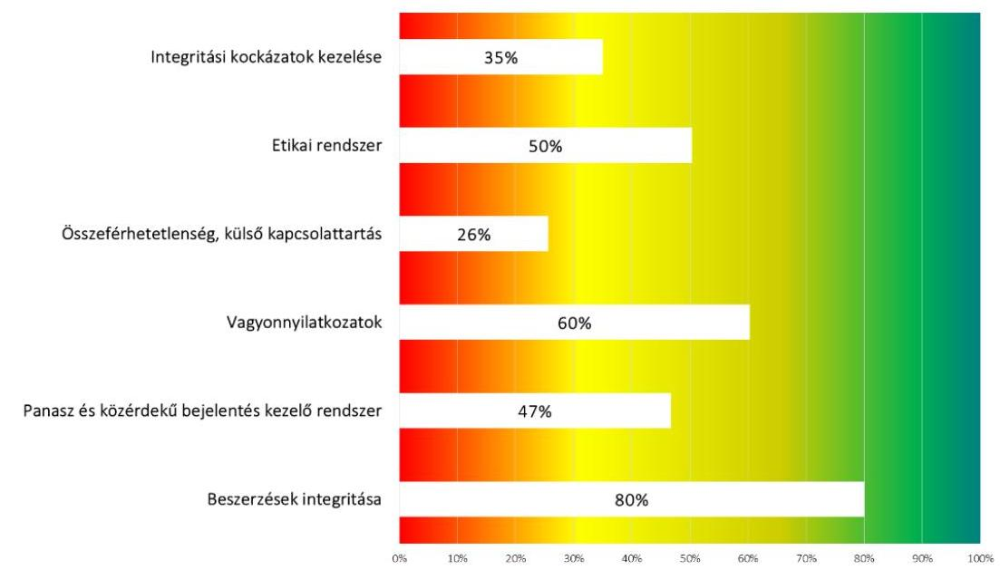
2. ábra Az ellenőrzött önkormányzatok által elért pontok átlaga az elérhető pontok arányában, fókuszterületenként. Az eredmények alapján történt a nagyközségi önkormányzatok integritáskontrolljainak területenkénti besorolása: a vörös sávba eső területek magas kockázatot, a sárga sávba esők közepes kockázatot, a zöld sávba eső területek alacsony kockázatot jeleznek.

Az ellenőrzött önkormányzatokat az összesített eredmény alapján, a módszereknél ismertetett kategorizálás szerint kockázati csoportokba soroltuk. Az ellenőrzött önkormányzatok 3,3\%-a (egy db) tartozik az alacsony kockázatú, $66,7 \%$-a ( 20 db ) a közepes kockázatú, $30,0 \%$-a ( 9 db ) a magas kockázatú kategóriába. Ez utóbbi ellenőrzött önkormányzatoknál az integritás több területe is fejlesztést igényel. A magas kockázatú önkormányzatok nagy aránya rámutat arra, hogy az integritás szemlélet az önkormányzatok kontrollkörnyezetének kialakítása során még nem érvényesül megfelelően. A kockázati besorolás szerinti megoszlást a jobb oldali ábra mutatja (az egyes ellenőrzött önkormányzatok kockázati besorolását az I. számú melléklet tartalmazza).
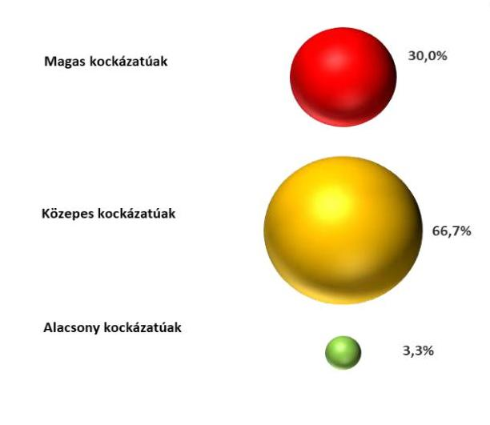
3. ábra Az ellenőrzött önkormányzatok kockázati megoszlása

---

A továbbiakban a fókuszterületenkénti értékeléseket, következtetéseket mutatjuk be az ellenőrzött önkormányzatok vonatkozásában. Ezt támogatja az alábbi, az egyes fókuszterületek értékelését részletező teljesítmény-diagram, amely az elérhető maximumértékekhez viszonyítva ábrázolja az elért eredményeket ellenőrzési kérdésenként.
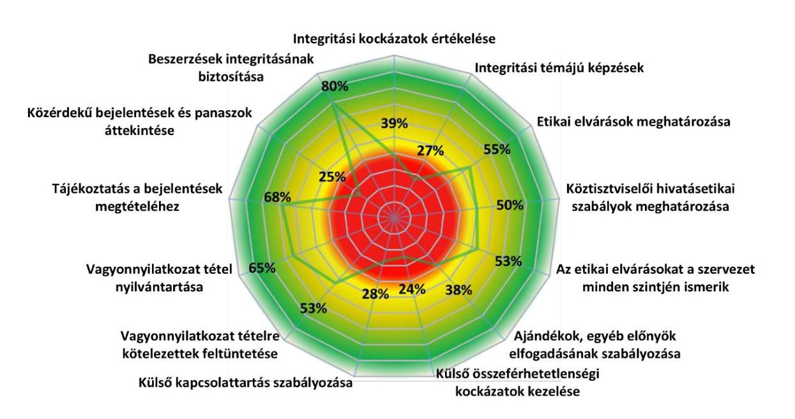
4. ábra Az ellenőrzött önkormányzatok által elért pontok átlaga ellenőrzési kérdésenként, az elérhető pontok arányában. Az eredmények alapján történt a nagyközségi önkormányzatok integritáskontrolljainak alterületenkénti besorolása: a vörös sávba eső területek magas kockázatot, a sárga sávba esők közepes kockázatot, a zöld sávba eső területek alacsony kockázatot jeleznek.

---

# 1. Az önkormányzatok megfelelően kezelték integritási kockázataikat? 

Az önkormányzatok integritási kockázataikat azonosították, ugyanakkor azok kezelése nem volt megfelelő, az ellenőrzés a területen magas kockázatot tárt fel. Elmaradt a konkrét integritási és korrupciós kockázatok tudatosítása, valamint kezelése, a kezeléshez szükséges intézkedések meghatározása. Az önkormányzatok legfeljebb 39 százaléka gondoskodott arról, hogy dolgozói részt vegyenek integritási témájú képzésen.

Az integritási kockázatok felmérése az integrált kockázatkezelési folyamat keretében valósul meg. Az ellenőrzött önkormányzatok 70 százaléka azonosított integritási, korrupciós kockázatokat, azonban ezen önkormányzatok 57 százaléka a beazonosított kockázatokat, azok kezelését nem vizsgálta felül. Az integritáskockázatok nyomon követése, értékelése, a tapasztalatok összegzése és visszacsatolása nem történt meg. A kockázatok tudatosítása nélkül ugyanakkor a kockázatokat mérsékelni képes mechanizmusokat sem lehet célzottan kialakítani.

Az integritási kockázatok kezelése területén a szemléletformálás egyik fontos eszköze az önkormányzati dolgozók integritási képzése. Magas kockázatot hordoz, hogy az önkormányzatok nem fordítanak elég figyelmet az integritás, korrupció megelőzés, etikus magatartás, etikai dilemmák tárgyú képzések lebonyolítására, mivel az ellenőrzött önkormányzatok csupán 10 százaléka biztosított érzékenyítő, szemléletformáló képzésen való részvételt dolgozói részére, vagy írta elő az ilyen témájú képzéseken való részvételt a munkatársak számára.

Az itt megjelenő magas kockázatot kontrollok kialakításával mérsékelni kell, mivel az integritás kockázatok beazonosítása és kezelése, valamint a dolgozók integritás témájú képzésen való részvétele elősegíti a korrupciós veszélyeket magában foglaló helyzetek felismerését.

## 2. Az önkormányzatok kialakították etikai rendszerüket?

Az etikai rendszer kialakítása vonatkozásában az ellenőrzés közepes kockázatot tárt fel. Az önkormányzatok legfeljebb 64 százaléka határozta meg az etikai elvárásokat az integritási kockázatnak leginkább kitett köztisztviselők vonatkozásában. Az ajándékok, egyéb előnyök elfogadását az önkormányzatok legfeljebb 52 százaléka szabályozta, amely magas kockázatot hordoz.

Az ellenőrzött önkormányzatok 55 százaléka fogalmazott meg etikai elvárásokat és 53 százaléka gondoskodott a Bkr. ${ }^{6}$ 6. § (1) bekezdés c) pontja értelmében arról, hogy ezen etikai elvárások a szervezet minden szintjén ismertek legyenek. Az etikai elvárások etikai szabályzatban vagy etikai kódexben jelentek meg.

Az ellenőrzött önkormányzatok 38 százaléka szabályozta az ajándékok, egyéb előnyök elfogadását; a kérdést szabályozó önkormányzatok leginkább etikai kódexükben tértek ki az ajándékok elfogadására, illetve annak tiltására. Az ellenőrzött önkormányzatok 62 százaléka nem adott iránymu-

---

tatást arra vonatkozóan, hogy a munkavállalók tevékenységével összefüggésben felkínált, kapott ajándékok, utazások, egyéb előnyök esetén milyen magatartást tanúsítson, valamint 60 százalékuk nem határozta meg az elfogadható ajándék, egyéb előny felső értékét, amely magas kockázatot jelentett.

Az etikai elvárások megfogalmazása alapvető fontossággal bír az értékelvű működés szempontjából. Az ajándékok, egyéb előnyök elfogadásának szabályainak lefektetése világos útmutatást ad a dolgozók számára a befolyástól való mentesség megőrzéséhez.

# 3. Az önkormányzatok megfelelően kezelték az összeférhetetlenség és a külső kapcsolattartás kockázatait? 

Az önkormányzatok nem kezelték megfelelően az összeférhetetlenség és a külső kapcsolattartás kockázatait, a területet magas kockázat jellemzi. Az önkormányzatok szabályozásai nem biztosították teljes körűen a döntéshozatalban érintettek összeférhetetlenségét, valamint nem rendelkeztek az ügyfelekkel és érdekérvényesítőkkel való kapcsolattartásról.

Az ellenőrzött önkormányzatok alig 37 százaléka rendelkezik olyan eljárásrenddel, amely rendelkezik a köztisztviselőkre, önkormányzati képviselökre vagy testületi bizottság nem képviselő tagjára vonatkozó összeférhetetlenségi okok feltárásáról, illetve az azzal kapcsolatos nyilatkozatok megtételéről. Az összeférhetetlenséget eredményező esetekre, az elfogulatlanság feltételeire, összeférhetetlen helyzetekre, azok jelentésére, az okok megszüntetésére az etikai kódex vagy egyéb, etikai elveket, magatartási szabályokat is rögzítő belső szabály (pl. közszolgálati szabályzat) tért ki általános jelleggel. Az ellenőrzés megállapította, hogy az önkormányzatok nem rendelkeztek olyan összeférhetetlenségi szabályozással, amely képes biztosítani, hogy az önkormányzatnál olyan személy ne vehessen részt döntés előkészítésében és meghozatalában, vagy olyan tevékenység ellenőrzésében, amelyben az ügyfél, vagy a kedvezményezett az ő hozzátartozója (17\%), vele közös gazdasági érdekeltséggel rendelkező személy (13\%) vagy korábbi munkáltatója (7\%).

Az ellenőrzött önkormányzatok 43 százaléka a panaszok, közérdekű bejelentések kezelésére vonatkozó eljárásrend részeként a panaszosokkal való kapcsolattartást is szabályozták. Az ellenőrzött önkormányzatok 20 százaléka rendelkezett olyan belső szabályozással, amely az önkormányzat dolgozójának iránymutatást adna arról, hogyan járjon el, ha munkájával összefüggésben ügyféllel kommunikációt folytat. Az érdekérvényesítőkkel való kapcsolattartást csak egyetlen önkormányzat szabályozta.

A jogtalan előnyökhöz való hozzájutás magas kockázata miatt az összeférhetetlenség egyértelmű meghatározása és a kapcsolódó eljárásrendek kialakítása szükséges.

---

# 4. Szabályos volt a vagyonnyilatkozatok kezelése az önkormányzatoknál? 

A vagyonnyilatkozatok kezelésével kapcsolatosan közepes kockázatot tárt fel az ellenőrzés. Az önkormányzatok legalább 31 százalékánál nem volt szabályos a vagyonnyilatkozatok kezelése.

Az ellenőrzött önkormányzatok 43 százaléka tüntette fel - a Vnytv. ${ }^{7}$ előírásainak megfelelően - a hivatal szervezeti és múködési szabályzatában a vagyonnyilatkozat-tételi kötelezettséget és a vagyonnyilatkozat tételre kötelezett személyek körét.

Az ellenőrzött önkormányzatok 50 százaléka tartotta nyilván a vagyon-nyilatkozat-tételre kötelezett személyek nyilatkozatait a hivatal vonatkozásában.

35 százalék esetében az ellenőrzött önkormányzat hivatala a Vnytv. 11. § (4) bekezdésében előírtak ellenére nem biztosította a vagyonnyilat-kozat-tételre kötelezettség érvényesülését a vagyonnyilatkozatainak nyilvántartásba vételével.

A vagyonnyilatkozatra tételre kötelezettek körének meghatározása hiánya, a vagyonnyilatkozat-tételi kötelezettség érvényesítésének és a vagyonnyilatkozat nyilvántartásának hiánya a jogtalan vagyongyarapodás kockázatát növeli.

## 5. Müködőképes az önkormányzatok panasz- és közérdekú bejelentés kezelő rendszere?

Az önkormányzatok panasz- és közérdekú bejelentés kezelő rendszere vonatkozásában az ellenőrzés közepes kockázatot tárt fel. Bár az önkormányzati honlapok tájékoztatást adtak a bejelentések megtételére szolgáló elérhetőségekről, azt nem tüntették fel, hogy kifejezetten mely elérhetőség szolgál panasz és bejelentés kezelésére, és nem nyújtottak tájékoztatást a bejelentőt megillető törvényi védelemről. Az önkormányzatok legfeljebb 35 százaléka alakította ki a beérkezett bejelentések és panaszok tapasztalatait áttekintő rendszerét.

Az ellenőrzött önkormányzatok honlapjai megfelelő tájékoztatást nyújtottak az állampolgároknak az önkormányzat elérhetőségeiről, a honlapokon email-cím, telefonos elérhetőség és ügyfélfogadási idő megtalálható volt. Ugyanakkor az önkormányzatok a honlapjaikon arról nem nyújtottak tájékoztatást, hogy ezeken az elérhetőségeken kifejezetten panasz- és közérdekú bejelentések is tehetők. Az ellenőrzött önkormányzatok mintegy 80 százalékának honlapján nem lelhető fel a bejelentő védelmére vonatkozó tájékoztatás.

Az ellenőrzött önkormányzatok nagy többsége rendelkezett olyan belső szabályozással, amely a közérdekú bejelentések fogadására, kezelésére, nyilvántartására vonatkozó eljárásokat tartalmazza. Bár a bejelentések és panaszok tapasztalatainak rendszeres áttekintését az önkormányzatok

---

43 százaléka előírta szabályzatban, azt az önkormányzatok csupán 13 százaléka végezte el.

A területen elért közepes kockázat azt jelzi, hogy az állampolgárok tájékoztatására szolgáló honlapokat a panaszok és közérdekű bejelentések rendszerének vonatkozásában átláthatóbbá kell tenni. A panaszok és közérdekű bejelentések következetes kivizsgálása és azok eredményéről az ügyfelek tájékoztatása nélkülözhetetlen a társadalmi bizalom erősítéséhez.

# 6. Az önkormányzatok rendelkeztek a beszerzések integritási kockázatait mérséklő kontrollal? 

## Az önkormányzatok rendelkeztek a beszerzések integritási kockázatait mérséklő kontrollokkal, a terület közepes kockázatú.

Az ellenőrzött önkormányzatok 80 százaléka rögzítette a beszerzési szabályzatban, hogy a közbeszerzési értékhatárt el nem érő beszerzések esetén három ajánlatot kell bekérni, illetve 53 százaléka biztosította, hogy a közbeszerzési eljárások előkészítésében és lefolytatásában a Kbt. 25. § szerinti összeférhetetlen személy ne vegyen részt.

---

# JAVASLATOK 

Az ÁSZ tv. 33. § (1) bekezdésében foglaltak értelmében az ellenőrzött szervezet vezetője köteles a jelentésben foglalt megállapításokhoz kapcsolódó intézkedési tervet összeállítani és azt a jelentés kézhezvételétől számított 30 napon belül az ÁSZ részére megküldeni. Amennyiben az ellenőrzött szervezet vezetője nem küldi meg határidőben az intézkedési tervet, vagy továbbra sem elfogadható intézkedési tervet küld, az Állami Számvevőszék elnöke az ÁSZ tv. 33. § (3) bekezdése a) és b) pontjaiban foglaltakat érvényesítheti.

Nagyközségi Önkormányzat jegyzőjének: Ásotthalom, Bag, Bugyi, Egyek, Fadd, Földes, Gávavencsellő, Mezőfalva, Nagyszénás, Seregélyes, Szentmártonkáta, Taktaharkány, Tápiószentmárton, Tárnok

1. Határozza meg a jogszabályi elöírásoknak megfelelően az etikai elvárásokat a szervezet minden szintjén.
(II. sz. melléklet 1. sorszámú megállapítás alapján)

## Nagyközségi Önkormányzat jegyzőjének: Algyő, Bag, Decs, Fadd, Felsőpakony, Földes, Hosszúpályi, Mezőfalva, Nagyszénás, Tárnok, Valkó

1. Intézkedjen, hogy a hivatal szervezeti és müködési szabályzata a Vnytv. előírásának megfelelően tartalmazza vagyonnyilatkozat-tételi kötelezettséget.
(II. sz. melléklet 2. sorszámú megállapítás alapján)

## Nagyközségi Önkormányzat jegyzőjének: Bag, Gávavencsellő, Hosszúpályi, Leányfalu, Seregélyes, Szentmártonkáta, Tápiószentmárton, Zsombó

1. Gondoskodjon a Vnytv. előírásának megfelelően a vagyonnyilatkozatok nyilvántartásba vételéről.
(II. sz. melléklet 4. sorszámú megállapítás alapján)

---

# Bugyi Nagyközség Önkormányzata jegyzőjének 

1. Gondoskodjon az Áht. előírásának megfelelően a hivatal szervezeti és müködési szabályzatának elkészitéséről.
(II. sz. melléklet 5. sorszámú megállapítás alapján)

## Nagyközségi Önkormányzat polgármesterének: Ásotthalom, Bag, Decs, Földes, Gávavencsellő, Leányfalu, Nagykovácsi, Taktaharkány, Tápiószentmárton, Tárnok, Zsombó

1. Intézkedjen a Mötv. előírásának megfelelően a vagyonnyilatkozatok nyilvántartásba vételére.
(II. sz. melléklet 3. sorszámú megállapítás alapján)

---

# MELLÉKLETEK 

## I. SZ. MELLÉKLET: AZ ELLENŐRZÖTT ÖNKORMÁNYZATOK EREDMÉNYEI ÉS KOCKÁZATI BESOROLÁSA

A táblázat az ellenőrzött nagyközségi önkormányzatok eredményét és kockázati besorolását tünteti fel. A kockázati besorolás az ellenőrzöttek teljesítményének pontrendszerben történő összesítése alapján történt meg az alábbiak szerint:

- alacsony kockázatúak a megszerezhető pontok legalább 80\%-át elért önkormányzatok (zöld jelölés);
- közepes kockázatúak a megszerezhető pontok 40-79\%-át elért önkormányzatok (sárga jelölés);
- magas kockázatúak a megszerezhető pontok kevesebb, mint 40\%-át elért önkormányzatok (piros jelölés).

| Alsónémedi | 80\% |  | Az önkormányzat integritáskontrolljai megfelelőek (alacsony kockázat). |
| :--: | :--: | :--: | :--: |
| Tiszalúc | 74\% |  | Az önkormányzat integritáskontrolljai fejlesztendők (közepes kockázat). |
| Előszállás | 69\% |  |  |
| Felsőpakony | 69\% |  |  |
| Seregélyes | 67\% |  |  |
| Lajoskomárom | 67\% |  |  |
| Algyő | 63\% |  |  |
| Inárcs | 59\% |  |  |
| Pétfürdő | 59\% |  |  |
| Decs | 57\% |  |  |
| Nagykovácsi | 56\% |  |  |
| Zsombó | 54\% |  |  |
| Bagamér | 52\% |  |  |
| Tárnok | 50\% |  |  |
| Valkó | 50\% |  |  |
| Kállósemjén | 46\% |  |  |
| Bugyi | 44\% |  |  |
| Egyek | 44\% |  |  |
| Hosszúpályi | 43\% |  |  |
| Tápiószentmárton | 41\% |  |  |
| Leányfalu | 41\% |  |  |
| Fadd | 33\% |  | Az önkormányzat integritáskontrolljai nem megfelelőek (magas kockázat), a legtöbb integritáskontroll fejlesztést igényel. |
| Ásotthalom | 33\% |  |  |
| Földes | 31\% |  |  |
| Nagyszénás | 30\% |  |  |
| Mezöfalva | 26\% |  |  |
| Szentmártonkáta | 26\% |  |  |
| Bag | 11\% |  |  |
| Gávavencsellő | 9\% |  |  |
| Taktaharkány | 6\% |  |  |

---

# II. SZ. MELLÉKLET: INTÉZKEDÉST IGÉNYLŐ MEGÁLLAPÍTÁSOK ÉS AZ ÉRINTETT ÖNKORMÁNYZATOK

Az ellenőrzés során tett, intézkedést igénylő megállapításokat az alábbi táblázat összegzi. Az egyes megállapítások mellett azon önkormányzatok megnevezése szerepel, amelyekre az adott megállapítás vonatkozik.

|  sorszám | Intézkedést igénylő megállapítás | Érintett önálló polgármesteri hivatallal rendelkező nagyközségi önkormányzatok  |
| --- | --- | --- |
|  1. | A Jegyző a Bkr. 6. § (1) bekezdés c) pontjában foglaltak ellenére nem alakított ki olyan kontrollkörnyezetet, amelyben meghatározottak, ismertek és elfogadottak az etikai elvárások a szervezet minden szintjén. | Ásotthalom
Bag
Bugyi
Egyek
Fadd
Földes
Gávavencsellő
Mezőfalva
Nagyszénás
Seregélyes
Szentmártonkáta
Taktaharkány
Tápiószentmárton
Tárnok  |
|  2. | Az önkormányzat hivatala a Vnytv. 4. § a) pontjában foglaltak ellenére nem tüntette fel a vagyonnyilatkozat-tételi kötelezettséget a szervezeti és müködési szabályzatban. | Algyő
Bag
Decs
Fadd
Felsőpakony
Földes
Hosszúpályi
Mezőfalva
Nagyszénás
Tárnok
Valkó  |

---

|  sorszám | Intézkedést igénylő megállapítás | Érintett önálló polgármesteri hivatalnál rendelkező nagyköszégi önkormányzatok  |
| --- | --- | --- |
|  3. | Az önkormányzat az Mótv. 39. § (3) bekezdésében foglaltak ellenére nem gondoskodott a vagyonnyilatkozatok nyilvántartásba vételéről. | Asotthalom
Bag
Decs
Földes
Gávavencsellő
Leányfalu
Nagykovácsi
Taktaharkány
Tápiószentmárton
Tárnok
Zsombó  |
|  4. | Az önkormányzat hivatala a Vnytv. 11. § (4) bekezdésében előírtak ellenére nem gondoskodott a vagyonnyilatkozatok nyilvántartásba vételéről. | Bag
Gávavencsellő
Hosszúpályi
Leányfalu
Seregélyes
Szentmártonkáta
Tápiószentmárton
Zsombó  |
|  5. | A 2017. évben az önkormányzat hivatala nem biztosította a vagyonnyilatkozat-tétel törvényes rendjének alapvető feltételét, mert nem rendelkezett az Áht. ${ }^{8}$ 9. § b) pontjában és a 10. § (5) bekezdésében foglaltaknak megfelelő szervezeti és müködési szabályzattal. | Bugyi
Taktaharkány  |

---

1. Államháztartási Belső Kontroll Standardok és Gyakorlati Útmutató, 2017, Nemzetgazdasági Minisztérium, https://allamhaztartas.kormany.hu/download/d/48/e1000/\%C3\%81BKSGYU k\%C3\%B6zz\%C3\%A9t\%C3\%A 9telre 20170918.pdf
2. Integráns önkormányzat - Módszertani útmutató önkormányzatoknak, 2018, Belügyminisztérium, http://korrupciomegalozes.kormany.hu/download/4/73/32000/6290KorrupciomenteshivatalutmutatoBM $\%$ C3\%96H\%C3\%81T0524.pdf
3. Ajánlás a korrupció ellenes küzdelem érdekében az integritásirányitási rendszert önkéntes döntésük alapján kialakítani szándékozó költségvetési szervek számára, Belügyminisztérium és Nemzetgazdasági Minisztérium, http://korrupciomegalozes.kormany.hu/download/2/65/22000/Aj\%C3\%A1nl\%C3\%A1s.pdf
4. Módszertani útmutató az államigazgatási szervek korrupció-megelőzési helyzetének felméréséhez, korrupció ellenes kontrolljai kiépitéséhez és érvényesitésük ellenőrzéséhez, 2015, Állami Számvevőszék és Belügyminisztérium, http://korrupciomegalozes.kormany.hu/download/2/cf/a1000/M\%C3\%B3dszertani\%20\%C3\%BAtmutat\%C 3\%83.pdf
5. Módszertani útmutató az érdekérvényesítőkkel való kapcsolattartás szabályainak alkalmazásához, 2016. június, Belügyminisztérium, korrupciomegalozes.kormany.hu/download/9/7f/a1000/let\%C3\%B6lt\%C3\%A9s_1.zip

---

# FÜGGELÉKEK 

- I. SZ. FÜGGELÉK A JELENTÉSHEZ

Az Állami Számvevőszék az ellenőrzések során feltárt tényekhez kapcsolódó további körülmények tisztázására eszközrendszerrel nem rendelkezik. Amennyiben az ellenőrzésen túlmutatóan indokoltnak látszik az ellenőrzés során feltárt körülmények további vizsgálata, az Állami Számvevőszék törvényi felhatalmazás alapján az ellenőrzés által feltárt körülményeket továbbítja a hatáskörrel rendelkező szervnek a szükséges intézkedések megtétele, eljárások lefolytatása érdekében.
Borsod-Abaúj Zemplén megye - Taktaharkány Nagyközség Önkormányzata,
Csongrád megye - Ásotthalom Nagyközségi Önkormányzat, Zsombó Nagyközség Önkormányzata,
Hajdú-Bihar megye - Földes Nagyközség Önkormányzata,
Pest megye - Bag Nagyközség Önkormányzata, Leányfalu Nagyközség Önkormányzata, Nagykovácsi Nagyközség Önkormányzata, Tápiószentmárton Nagyközség Önkormányzata, Tárnok Nagyközség Önkormányzata,
Szabolcs-Szatmár-Bereg megye - Gávavencsellő Nagyközség Önkormányzata,
Tolna megye - Decs Nagyközség Önkormányzata
a Mötv. 39. § (3) bekezdésében foglaltak ellenére nem gondoskodott az önkormányzati képviselők vagyonnyilatkozatainak nyilvántartásba vételéről.
Ezáltal felmerül annak gyanúja, hogy a képviselők vagyonnyilatkozat-tételi kötelezettsége sem teljesült maradéktalanul. Tekintettel arra, hogy a vagyonnyilatkozat tételének elmulasztása esetén - annak benyújtásáig - az önkormányzati képviselő e tisztségéből fakadó jogait nem gyakorolhatja, a testület törvényes müködésének jogalapja kérdésessé válik.

Az eset konkrét körülményeinek feltárására a kormányhivatal rendelkezik hatáskörrel.

---

A jelentéstervezetet a Számvevőszék 15 napos észrevételezésre megküldte az ellenőrzött szervezetek vezetőinek az ÁSZ tv. 29. §7 (1) bekezdése előirásának megfelelően.

Az ÁSZ tv.-ben meghatározott határidőn belül a Tápiószentmártoni Polgármesteri Hivatal jegyzője, Földes Nagyközség polgármestere, Taktaharkány Nagyközség polgármestere, a Gávavencsellői Közös Önkormányzati Hivatal jegyzője, Nagykovácsi Nagyközség polgármestere és jegyzője, valamint Bugyi Nagyközség Polgármesteri Hivatal jegyzője tett észrevételt.
Leányfalu Nagyközség Önkormányzat polgármestere és jegyzője a törvényi határidőn túl küldte meg észrevételét, amelyet az ÁSZ tv. 29. § (2) bekezdése előírására tekintettel az ÁSZ a jelentés véglegezése során nem vett figyelembe.
A többi ellenőrzött szervezettől a jelentéstervezetre nem érkezett észrevétel.

[^0]
[^0]:    ${ }^{8}$ 29. § (1) Az Állami Számvevőszék az ellenőrzési megállapításait megküldi az ellenőrzött szervezet vezetőjének vagy az általa megbízott személynek, és annak, akinek személyes felelősségét állapította meg.
    (2) Az ellenőrzött szervezet vezetője és a felelősként megjelölt személy az ellenőrzés megállapításaira tizenöt napon belül írásban észrevételt tehet.
    (3) Az Állami Számvevőszék az észrevételre a beérkezésétől számított harminc napon belül írásban válaszol. A figyelembe nem vett észrevételeket köteles a jelentésben feltüntetni, és megindokolni, hogy azokat miért nem fogadta el.

---

# 201 

## Tápiószentmártoni Polgármesteri Hivatal

2711. Tápiószentmárton, Kossuth L. út 3.

E-mail: hivatal@tapioszentmarton.hu
Web: www.tapioszentmarton.hu
Telefon/fax: +3629/423-001;

Szám: TSZ/2317-3/2020.
Tárgy: Észrevétel jelentéstervezetre

Állami Számvevőszék
Budapest 4.
Pf.: 54.
1364

Tisztelt Domokos László Elnök Úr!

Hivatkozási szám: EL-1441-022/2020.
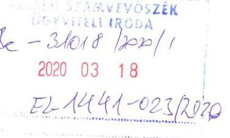

Tisztelt Domokos László Elnök Úr!

Köszönettel fogadtuk „Községi, nagyközségi önkormányzatok integritás ellenőrzése" címú számvevőszéki jelentéstervezet kivonatát. Természetesen azon leszünk, hogy a leírt intézkedéseket minél előbb meg tudjuk tenni.
Az I. sz. függelékben foglalt megállapításukra az alábbi észrevételt kívánjuk tenni: A képviselők a vagyonnyilatkozat tételi kötelezettségüknek mindig maradéktalanul eleget tettek, ebből kifolyólag a képviselő-testület törvényes működésének jogalapja sem vált és jelenleg sem válhat kérdésessé.
Kérem észrevételem figyelembevételét a végleges jelentés elkészítésekor.

Tisztelettel:
dr. Bóta Mihály
jegyzó

Tápiószentmárton, 2020. március 13.

---

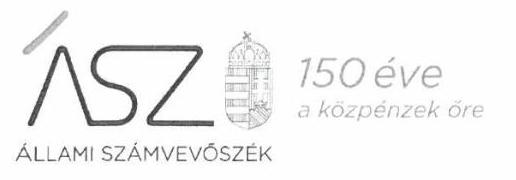

# 150 éve a közpénzek öre 

ÁLLAMI SZÁMVEVŐSZEK

Ikt. szám: EL-1441-024/2020

Dr. Bóta Mihály úr
jegyző
Tápiószentmártoni Polgármesteri Hivatal

## Tápiószentmárton

Tisztelt Jegyző Úr!

A „Községi, nagyközségi önkormányzatok integritásának ellenőrzése" címmel készített számvevőszéki jelentéstervezetre a 2020. március 13-án kelt észrevételét megkaptam.

Az Állami Számvevőszék észrevételekre vonatkozó álláspontjáról a felügyeleti vezető által készített részletes tájékoztatást csatoltan megküldöm.

Tájékoztatom Jegyző urat, hogy a számvevőszéki jelentésben - az Állami Számvevőszékről szóló 2011. évi LXVI. törvény 29. § (3) bekezdése alapján - a figyelembe nem vett észrevételeket szerepeltetjük az elutasítás indokának feltüntetésével.

Budapest, 2020. ơ hónap 15 nap
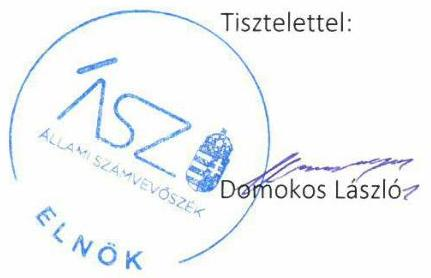

Melléklet: Tájékoztatás az észrevételek kezeléséről

---

# Tájékoztatás az észrevételek kezeléséről 

A „Községi, nagyközségi önkormányzatok integritásának ellenőrzése" című jelentéstervezetre (továbbiakban: jelentéstervezet) a 2020. március 13-án kelt levelében megküldött észrevételeit áttekintettem. Az észrevételek kezeléséről az alábbi tájékoztatást adom.

## 1. A Vagyonnyilatkozatokkal kapcsolatosan tett észrevétel (jelentéstervezet 1. számú függelék)

Jegyző úr észrevételében jelezte, hogy nem ért egyet a jelentéstervezet I. sz. függelékében foglalt megállapítással, mivel a képviselők vagyonnyilatkozat tételi kötelezettségüknek mindig maradéktalanul eleget tettek, ebből kifolyólag a képviselő-testület törvényes működésének jogalapja sem vált és jelenleg sem válhat kérdésessé.
A Magyarország helyi önkormányzatairól szóló 2011. évi CLXXXIX. törvény (továbbiakban: Mötv.) 39. § (1)-(2) bekezdése kimondja, hogy az önkormányzati képviselő vagyonnyilatkozatot köteles tenni. A Mótv. 39. § (3) bekezdése értelmében a vagyonnyilatkozatot a szervezeti és müködési szabályzatban erre kijelölt bizottság (a továbbiakban: vagyonnyilatkozat-vizsgáló bizottság) tartja nyilván és ellenőrzi.
A fenti jogszabályi előírásokkal összhangban Tápiószentmárton Nagyközség Önkormányzatának szervezeti és működési szabályzata (továbbiakban: önkormányzati SZMSZ) 46. § (3) bekezdése, 48. § (1) bekezdés a) pontja és 5. melléklete szabályozta az önkormányzati képviselők vagyonnyilatkozat tételi kötelezettségét. Az önkormányzati SZMSZ 5. melléklet III. fejezetének 3. pontja kimondja, hogy a vagyonnyilatkozatokról és az ellenőrzési eljárásról nyilvántartást kell vezetni.
Az ÁSZ az EL-1441-004/2018. és EL-1441-005/2018. iktatószámú adatbekérő levekben kérte 2017. év tekintetében a Vagyonnyilatkozatokra vonatkozó nyilvántartás átadását. A 2019. január 15-én kelt teljességi és hitelességi nyilatkozattal alátámasztott módon Vagyonnyilatkozatokra vonatkozó nyilvántartások átadására nem került sor. Tekintettel arra, hogy az önkormányzati SZMSZ egyértelmú előírásai ellenére a 2017. évi vagyonnyilatkozatokról nyilvántartást nem adtak át, nem igazolt a vagyonnyilatkozat-tételi kötelezettség teljesítése sem.
Az ÁSZ az ellenőrzési megállapításait az adatszolgáltatás során a részére törvényi határidőben rendelkezésre bocsátott dokumentumokra alapozva fogalmazza meg. A teljességi és hitelességi nyilatkozatuk szerint az ÁSZ részére átadott dokumentumok, adatok megbízhatóak, és a bekért adatokra, dokumentumokra vonatkozóan teljes körű információt tartalmaznak.
A fentiekre tekintettel az észrevételt nem fogadjuk el, az ellenőrzési megállapítás módosítása nem indokolt.

Budapest, 2020. 04. hónap 15. nap
Salamon Ildikó 0. 6.
felügyeleti vezető

---

# FÖLDES NAGYKÖZSÉG POLGÁRMESTERE 

$\boxtimes 4177$ FÖLDES, Karácsony Sándor tér 5. (54) $531-000 ; 531-001$ E-mail: foldes.ph@gmail.com

Iktatószám: F/1649-3/2020.
Ügyintéző: Dr. Polgárné dr. Katona Gabriella
Tárgy: észrevétel
Hiv.szám: EL-1433-022/2020.
Állami Számvevőszék elnöke részére
Budapest
Pf. 54 .
1364

## Tisztelt Elnök Úr!

Földes Nagyközség Önkormányzatának „Községi, nagyközségi önkormányzatok integritásának ellenörzése" címủ számvevőszéki jelentéstervezet kivonatát áttekintettem, az 1-6. pontban megfogalmazott megállapítások egy-egy pontjával kapcsolatos észrevételeim a következök:

1. „1. Az önkormányzat azonosított integritási kockázatokat, azonban nem határozott meg integritási, illetve korrupciós kockázatai kezeléséhez szükséges intézkedéseket, valamint nem intézkedett integritási témájú képzés szervezéséről" megállapításhoz kapcsolódóan tájékoztatom, hogy:

- két vezető köztisztviselő (Diószeginé Kovács Éva és Dr. Polgárné dr. Katona Gabriella) 2017-ben részt vett integritási témájú képzésben.
A képzés kötelezö volt számukra a költségvetési szervnél belső ellenőrzési tevékenységet végzők nyilvántartásáról és kötelező szakmai továbbképzéséről, valamint a költségvetési szervek vezetőinek és gazdasági vezetőinek belső kontrollrendszer témájú továbbképzéséről szóló 8/2011. (VIII. 3.) NGM rendelet alapján.
A képzésen való részvételt és az azt követő vizsgát igazoló oklevél becsatolásra került az ellenőrzés során.

2. „4. Az önkormányzat hivatala a Vnytv. 4.§ a) pontjában foglaltak ellenére nem tüntette fel a vagyonnyilatkozat-tételi kötelezettséget a szervezeti és müködési szabályzatban. Az önkormányzat az Mötv. 39.§ (3) bekezdésében foglaltak ellenére nem gondoskodott a vagyonnyilatkozatok nyilvántartásba vételéről."
2/a.)
A vagyonnyilatkozat-tételi kötelezettséget a Közszolgálati szabályzat III. fejezet 4. pontja tartalmazza. A köztisztviselők a Vnyt-ben, valamint a közszolgálati szabályzatban foglaltak szerint tesznek eleget a vagyonnyilatkozat-tételi kötelezettségüknek.
A Polgármesteri Hivatal SzMSz-e - valóban - nem tartalmazza a vagyonnyilatkozattételi kötelezettségre vonatkozó előírásokat. A helyi szabályzatokat módosítani fogjuk, a Közszolgálati szabályzatból töröljük, a Polgármesteri Hivatal SzMSz- t pedig kiegészítjük a szabályozással.

## 2/b.)

A Mötv. 39.§ -ban foglalt önkormányzati képviselői vagyonnyilatkozatokat a Pénzügyi, Településfejlesztési és Ügyrendi Bizottság kezeli és tartja nyilván. Önkormányzatunk

---

képviselői a Mötv. rendelkezései alapján minden évben határidőre eleget tesznek vagyonnyilatkozattételi kötelezettségüknek, melynek meglétét a Megyei Kormányhivatalnak minden évben jelentenünk (is) kell.
A képviselők 2017 évben is eleget tettek vagyonnyilatkozat-tételi kötelezettségüknek, Amennyiben az ezt tartalmazó nyilvántartást nem csatoltuk az ellenőrzött dokumentumok közé, az csupán azért lehetett, mert levelükből nem derült ki számunkra, hogy az ellenőrzés az önkormányzati képviselökre is kiterjed, hiszen az a képviselő, aki nem adja le határidőre vagyonnyilatkozatát, képviselői jogait nem gyakorolhatja.
Mivel ez mindig, minden esetben határidőre megtörténik, így meglátásom szerint a képviselő-testület törvényes müködésének jogalapja ebben a vonatkozásban nem kérdéses.

Kérem tájékoztatásom szíves tudomásul vételét.

Földes, 2020. március 11.

Tisztelettel:
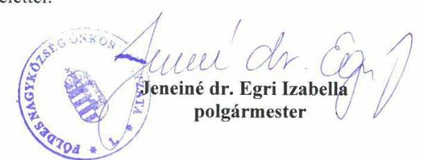

---

# 150 éve   a közpénzek öre 

ÁLLAMI SZÁMVEVŐSZÉK

Ikt. szám: EL-1433-027/2020

Jeneiné dr. Egri Izabella úrhölgy
polgármester
Földes Nagyközség Önkormányzata
Földes

Tisztelt Polgármester Úrhölgy!

A „Községi, nagyközségi önkormányzatok integritásának ellenőrzése" címmel készített számvevőszéki jelentéstervezetre a F/1649-3/2020. ikt.sz. levélben megküldött észrevételét megkaptam.

Az Állami Számvevőszék észrevételekre vonatkozó álláspontjáról a felügyeleti vezető által készített részletes tájékoztatást csatoltan megküldöm.

Tájékoztatom Polgármester úrhölgyet, hogy a számvevőszéki jelentésben - az Állami Számvevőszékről szóló 2011. évi LXVI. törvény 29. § (3) bekezdése alapján - a figyelembe nem vett észrevételeket szerepeltetjük az elutasítás indokának feltüntetésével.
Budapest, 2020. 84 hónap 17 nap

Melléklet: Tájékoztatás az észrevételek kezeléséről
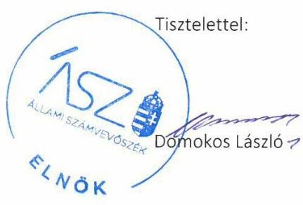

---

# Tájékoztatás az észrevételek kezeléséről 

A „Községi, nagyközségi önkormányzatok integritásának ellenőrzése" című jelentéstervezetre (továbbiakban: jelentéstervezet) a 2020. március 11-én kelt levelében megküldött észrevételeit áttekintettem. Az észrevételek kezeléséről az alábbi tájékoztatást adom.
Az Állami Számvevőszék (továbbiakban: ÁSZ) az ellenőrzési megállapításait az ellenőrzött időszakban hatályos jogszabályok és az ellenőrzött szervezet közreműködési kötelezettsége keretében, az ellenőrzött szervezet által rendelkezésre bocsátott, Teljességi és hitelességi nyilatkozattal alátámasztott dokumentumokra alapozva fogalmazta meg. Polgármester úrhölgy által aláírt Teljességi és hitelességi nyilatkozatokban foglaltak szerint az átadott dokumentumok, adatok megbízhatóak, az ÁSZ által bekért adatokra, dokumentumokra vonatkozóan teljes körű információt tartalmaznak. Polgármester úrhölgy az átadott dokumentumok, adatok hitelességéért, valódiságáért, hiánytalanságáért teljes felelősséget vállalt.

1. Az integritás témájú képzéssel kapcsolatos észrevételt nem fogadtuk el.

Polgármester úrhölgy észrevételében jelezte, hogy az Önkormányzatnál két vezető köztisztviselő a 2017. évben részt vett integritási témájú képzésben, kötelező szakmai képzés keretében, az erről szóló dokumentumokat az adatszolgáltatás során csatolták.

Az észrevételben hivatkozott, a 2019. január 15-én kelt teljességi és hitelességi nyilatkozat 12-13. pontjaiban felsorolt dokumentumok az észrevételben megnevezett köztisztviselőknek a 2017. évben a Nemzeti adó- és Vámhivatal Képzési, Egészségügyi és Kulturális Intézete által szervezett hatósági jellegű képzése követelményeinek teljesítését igazolják. Az Önkormányzat nem bocsátott az ellenőrzés rendelkezésére olyan dokumentumokat, amelyek integritás témájú képzéssel kapcsolatosak, a képzések szervezésére vonatkozó belső szabályozóeszközöket, és/vagy képzések megtartását, az integritás témájú képzésen történő részvételt igazolták volna. Az előzőekre tekintettel az ellenőrzési megállapítás módosítása nem indokolt.
2. A vagyonnyilatkozatok kezelésével, nyilvántartásával kapcsolatos észrevételt nem fogadtuk el.

Polgármester úrhölgy észrevételében elismerte, hogy a hivatal szervezeti és működési szabályzata valóban nem tartalmazza a vagyonnyilatkozat-tételi kötelezettségre vonatkozó előírásokat, ezért az erre vonatkozó ellenőrzési megállapítás módosítása nem indokolt.

Az észrevétel szerint a Magyarország helyi önkormányzatairól szóló 2011. évi CLXXXIX. törvény szerinti vagyonnyilatkozatokat a Pénzügyi, Településfejlesztési és Ügyrendi Bizottság kezeli és tartja nyilván, az Önkormányzat képviselői minden évben határidőben eleget tesznek vagyonnyilatkozat tételi kötelezettségüknek.

A 2019. január 4-én kelt EL-1433-003/2018. ikt.sz. adatbekérő levél 2. sz. mellékletében („Dokumentumjegyzék") az ÁSZ az ellenőrzött időszakot lefedően, egyrészt a helyi önkormányzatra, másrészt annak gazdálkodási feladatait ellátó önkormányzati hivatalra kérte

---

megküldeni a dokumentumokat, köztük a 7. pontban felsorolt vagyonnyilatkozatokra vonatkozó nyilvántartást. A 2019. január 15-én kelt teljességi és hitelességi nyilatkozat 14. pontjában felsorolt „7. Vagyonnyilatkozatokra vonatkozó nyilvántartás 2017..pdf" nevű fájl csak a polgármesteri hivatal alkalmazottainak vonatkozásában tartalmazta a vagyonnyilatkozat tételi kötelezettség teljesítésnek nyilvántartását. Észrevételében Polgármester úrhölgy elismerte, hogy az önkormányzati képviselők vagyonnyilatkozataira vonatkozó nyilvántartást az ellenőrzött dokumentumok közé nem csatolták, amelyre tekintettel az ellenőrzési megállapítás módosítása nem indokolt.

Budapest, 2020. Ck hónap 17. nap

Salamon Ildikó s K.
felügyeleti vezető

---

# 835 

## TAKTAHARKÁNY NAGYKÖZSÉG ÖNKORMÁNYZATA

3922 Taktaharkány, Gépállomás u. 4.
Telefon: (47) 378-001
E-mail: polgarmester@taktaharkany.hu
$7 U 03 / 2500$

Ikt.sz.: HIV/47-4/2020
Tárgy: észrevétel
Hiv.sz.: EL-1391-2/2020

Állami Számvevőszék
Domokos László elnök úr
Budapest
Apáczai Csere János u. 10.
1052
ÁLLAMI SZÁMVEVÖSZÉK
BE-32898/2020/1
Érkezett: 2020 MÁRE 24
Iktatószám: EL-1391-023/2020
Melléklet:
Salaszer 1.
Tisztelt Elnök Úr!

A fenti hivatkozási számú Községi, nagyközségi önkormányzatok integritásának ellenőrzése címú ellenőrzésével kapcsolatban az alábbi észrevételt kívánom tenni.

A jelentéstervezetben megfogalmazásra került, hogy a 2017. évben az Önkormányzat nem biztosította a vagyonnyilatkozat-tétel törvényes rendjének alapvető feltételeit, mert nem rendelkezett megfelelő Szervezeti és Müködési Szabályzattal, illetve az Önkormányzat nem gondoskodott a vagyonnyilatkozatok nyilvántartásba vételéről. Ezen állításokat elfogadni nem tudjuk, hiszen Taktaharkány Nagyközség Önkormányzata rendelkezett érvényes Szervezeti és Müködési Szabályzattal, melyet a Nemzeti Jogtárban meg lehet tekinteni, a vizsgált évben a 15/2015. (V. 19.) önkormányzati rendelet volt hatályban, melynek 14. § (5) bekezdés b) pontja rendelkezik a vagyonnyilatkozat nyilvántartásba vételéről. Továbbá a képviselők a jogszabályi előírásoknak megfelelően a vagyonnyilatkozatokat minden év január 31-ig leadták, és azok nyilvántartásba vételre kerültek, melyet a vagyonnyilatkozatokat vizsgáló Pénzügyi Bizottság a jogszabályi előírásoknak megfelelően ellenőrzött.

Az ellenőrzés kifogásolta továbbá, hogy az Önkormányzat nem írta elő a közbeszerzési értékhatár alatti beszerzések esetén legalább három ajánlat bekérését. A fent említett állítások nem fedik a valóságot, hiszen Taktaharkány Nagyközség Önkormányzata rendelkezik Beszerzési szabályzattal, mely 2016. szeptember 16-tól hatályos, mely tartalmazza a közbeszerzési értékhatárt el nem érő beszerzések eljárás rendjét.

Kérem az ellenőrzési jelentést ennek alapján módosítani szíveskedjenek.

Taktaharkány, 2020. március 17.
Tisztelettel:
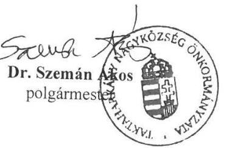

---

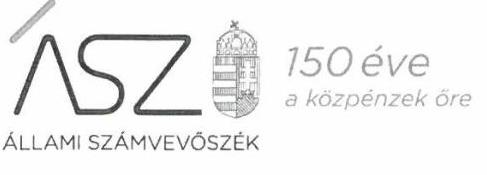

ELNÖK

Ikt. szám: EL-1391-024/2020

Dr. Szemán Ákos úr
polgármester
Taktaharkány Nagyközség Önkormányzata
Taktaharkány

Tisztelt Polgármester Úr!

A „Községi, nagyközségi önkormányzatok integritásának ellenőrzése" címmel készített számvevőszéki jelentéstervezetre a HIV/47-4/2020. ikt.sz. levélben megküldött észrevételét megkaptam.

Az Állami Számvevőszék észrevételekre vonatkozó álláspontjáról a felügyeleti vezető által készített részletes tájékoztatást csatoltan megküldöm.

Tájékoztatom Polgármester urat, hogy a számvevőszéki jelentésben - az Állami Számvevőszékről szóló 2011. évi LXVI. törvény 29. § (3) bekezdése alapján - a figyelembe nem vett észrevételeket szerepeltetjük az elutasítás indokának feltüntetésével.
Budapest, 2020. 64 hónap 7 nap

Melléklet: Tájékoztatás az észrevételek kezeléséről
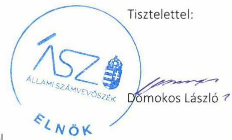

---

# Tájékoztatás az észrevételek kezeléséről 

A „Községi, nagyközségi önkormányzatok integritásának ellenőrzése" című jelentéstervezetre (továbbiakban: jelentéstervezet) a 2020. március 17-én kelt levelében megküldött észrevételeit áttekintettem. Az észrevételek kezeléséről az alábbi tájékoztatást adom.
Az Állami Számvevőszék (továbbiakban: ÁSZ) az ellenőrzési megállapításait az ellenőrzött időszakban hatályos jogszabályok és az ellenőrzött szervezet közreműködési kötelezettsége keretében, az ellenőrzött szervezet által rendelkezésre bocsátott, Teljességi és hitelességi nyilatkozattal alátámasztott dokumentumokra alapozva fogalmazza meg, vonja le a következtetéseket.

Taktaharkány Nagyközség Önkormányzata (továbbiakban: Önkormányzat) adatszolgáltatást a rendelkezésre álló törvényes határidőben nem teljesített. Polgármester úr által aláírt 2019. január 18-án kelt Teljességi és hitelességi nyilatkozata szerint az ÁSZ által kért dokumentumok nem kerültek átadásra.

1. A vagyonnyilatkozatok nyilvántartásának rendjével kapcsolatos észrevételt nem fogadtuk el.

Polgármester úr észrevételében jelezte, hogy az Önkormányzat rendelkezett a 15/2015. (V. 9.) sz. önkormányzati rendeletben szabályozott Szervezeti és Működési szabályzattal (továbbiakban: SZMSZ), amely a Nemzeti Jogtárban megtekinthető. Az észrevétel szerint a hivatkozott szabályzat 14. § (5) bekezdés b) pontja rendelkezik a vagyonnyilatkozat nyilvántartásba vételéről.

Az ÁSZ a 2018. december 14-én kelt EL-1391-001/2018. ikt.sz. adatbekérő levél 3. sz. mellékletében (Dokumentumok jegyzéke) a 2017. január 1. és 2017. december 31. között hatályos önkormányzati SZMSZ-ről szóló önkormányzati rendelet, valamint a hivatali SZMSZ-t és az elfogadásáról szóló képviselőtestületi határozatot kérte rendelkezése bocsátani hiteles (a kiadmányozás rendjének megfelelő) formában. Az adatszolgáltatás a rendelkezésre álló törvényes határidőben nem történt meg, Polgármester úr által aláírt 2019. január 18-án kelt Teljességi és hitelességi nyilatkozata szerint a kért dokumentumok nem kerültek átadásra. A helyszíni adatbetekintésről 2019. január 18-án készült jegyzőkönyv szerint az ellenőrzött szervezet részéről nem érkezett írásbeli jelzés az ÁSZ Elektronikus Adatszolgáltató Rendszerébe (ABR) való feltöltéssel kapcsolatos problémáról. Az előzőek alapján az Önkormányzat dokumentumokkal nem igazolta, hogy a vagyonnyilatkozatok nyilvántartásba vétele jogszabályban előírt rendjének alapvető feltételeit biztosította, ezért a megállapítás módosítása nem indokolt. Az önkormányzati képviselők vagyonnyilatkozatainak - észrevételben hivatkozott - nyilvántartásba vételét az Önkormányzat dokumentumokkal nem támasztotta alá.

Megjegyezni kívánom, hogy az észrevételben hivatkozott és a nyilvánosan elérhető Nemzeti Jogszabálytár Önkormányzati Rendelettárában megtalálható dokumentum Taktaharkány Nagyközség Képviselő-testületének 15/2015. (V. 19.) rendelete Taktaharkány Nagyközség

---

Önkormányzata Szervezeti és Müködési Szabályzatáról (hatályos 2017. július 12-től) nem tartalmazza az észrevételben hivatkozott 14. §-t, mert a 13. §-t a 16. § követi, továbbá a hivatkozott dokumentum nem tartalmaz rendelkezést a vagyonnyilatkozat-tételi kötelezettségre vonatkozóan.
2. A beszerzési szabályzattal kapcsolatban tett észrevételt nem fogadtuk el.

Polgármester úr észrevételében jelezte, hogy Taktaharkány Nagyközség Önkormányzata rendelkezik beszerzési szabályzattal, amely 2016. szeptember 16-tól hatályos és tartalmazza a közbeszerzési értékhatárt el nem érő beszerzések eljárásrendjét.

Az ÁSZ megállapította, hogy az Önkormányzat polgármesteri hivatala a 2017. évben nem rendelkezett az Áht. 9. § b) pontjában és a 10. § (5) bekezdésében foglaltaknak megfelelő SZMSZszel, következésképpen az Önkormányzat a 2017. évben nem gondoskodott a polgármesteri hivatal szervezetének, feladatai ellátása részletes belső rendjének és módjának megállapításáról.

SZMSZ hiányában nem szabályozott a szervezeti felépítés és a müködés rendje, a szervezeti egységek - ezen belül a gazdasági szervezet - feladatai, továbbá a szervezeti és müködési szabályzatban nevesített munkakörökhöz tartozó feladat- és hatáskörök, a hatáskörök gyakorlásának módja, valamint az ezekhez kapcsolódó felelősségi szabályok sem.

SZMSZ hiányában a jegyző nem alakította ki a szervezeti struktúra, a folyamatok, a felelősségi, hatásköri viszonyok és feladatok - így a beszerzések - szabályszerű ellátásának alapvető feltételeit sem. Az előzőekre tekintettel a jelentéstervezet módosítása nem indokolt.

Budapest, 2020. D. hónap 17. nap

Salamon Ildikó
felügyeleti vezető st
Pany 2
A leadmang tutstes

---

Gávavencsellői Közös Önkormányzati Hivatal Jegyzőjétől

Cím: 4471 Gávavencsellő, Petőfi u. 1.
TELEFON: 42-572-500
E-MAIL: jegyzo@gavavencsello.hu

Szám: GV/ 2702/2020.

Állami Számvevőszék
Domokos László elnök úr részére Budapest
Apáczai Csere János utca 10 1052

ÁLLAMI SZÁMVEVÖSZÉK
245-32 837/2020/1
Gíkszett: 2020 MAIE 24
http://szam: 21-1430-02112020
M. 1052

# Tisztelt Elnök Úr! 

Az Állami Számvevőszék által EL-1430-020/2020. számú levél mellékleteként eljuttatott Gávavencsellő Nagyközség Önkormányzat községi, nagyközségi önkormányzatok integritásának ellenőrzése jelentéstervezethez az alábbi észrevételt teszem:

1. Az Állami Számvevőszék nem vette figyelembe az általa leírtak szerint, hogy 2018. évben az előzőleg legáló polgármester június 15 -én lemondott, vele együtt a Hivatal Vagyongazdálkodási Csoportvezetője jogviszonya is megszűntetésre került, rendőrségi eljárások vannak jelenleg folyamatban. A korábbi időszakban rendelkezésre álló iratanyagokat töltöttük fel az ÁSZ vizsgálat során, valamint jegyzői nyilatkozatokat arra vonatkozóan, hogy az irattárból a kért iratok nem találhatóak elő.
2. A vizsgált időszakban volt közbeszerzési szabályzat, vélhetően azt be is tartották, de nem tudok nyilatkozni, mivel 2018. január 10-től vagyok itt jogviszonyban. Az iratkezelést nullára értékelem.
3. A vagyonnyilatkozattételi kötelezettségének a Hivatali dolgozók nem tettek eleget. Az önkormányzati képviselők esetében a vagyonnyilatkozattétel évente a törvény által előírt határidőben megtörténtek, csak erről nem vezettek nyilvántartást.
4. A 2018. év második félévétől kezdődően új szabályzatrendet alakítottunk ki. Elkészítettük valamennyi kötelező szabályzatot, melyek aktualizálására most azért kerül sor, mivel 2020. január elsejétől közös hivatalt hoztunk létre egy szomszédos településsel.
5. Társulást hoztunk létre a szociális ellátórendszer hatékonyabb működtetésére.
6. Az Önkormányzat, és a Polgármesteri Hivatal, 2020. január elsejétől Közös Önkormányzati Hivatal Szervezeti és Működési Szabályzatát felülvizsgáltuk,

---

abban tételesen kialakításra került a vagyonnyilatkozattételi kötelezettség teljesítésére, a vagyonnyilatkozatok kezelésére vonatkozó szabályrend, nyomtatványrend a vagyonnyilatkozatok kezelésére, mely szabályokat folyamatosan be is tartunk. Ugyanez vonatkozik a településen megválasztott nemzetiségi önkormányzatokra.
7. Elkészült a Hivatal etikai kódexe, melyet a hivatal dolgozói valamennyien megismertek. A Hivatali dolgozók apparátusi értekezletén folyamatos információáramlás biztosított, az ügyintézők tisztában vannak az éppen aktuális helyzettel, folyamatokkal.
8. Ugyanez a színvonal érvényesül az önkormányzat fenntartásában lévő intézmények esetében is.
9. A honlapunk megújítása jelenleg folyamatban van, az informatikai biztonságunkról már gondoskodtunk zárt rendszer kialakításával.
10.Az önkormányzati választások idején és előtte is a közérdekű adatszolgáltatási kötelezettségünknek eleget tettünk.
11.Szabályzatunk a közérdekű bejelentésekre panaszkezelésre valóban nem volt. Az éven elkészítettük. Gávavencsellő kistelepülés, itt a panasz, bejelentés, szinte azon nyomban kivizsgálásra kerül, orvosoljuk a kialakuló helyzeteket, reagálunk a település lakosságának minden rezdülésére.

Fenti indokok miatt döntöttem úgy, hogy a leminősítésünk mellett észrevételt teszek.
Kérem tájékoztatásom elfogadását.

Gávavencsellő, 2020. március 18.

Tisztelettel:
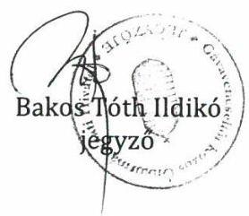

---

# 150 éve a közpénzek öre 

Ikt. szám: EL-1430-022/2020

Bakos Tóth Ildikó úrhölgy
jegyzó
Gávavencsellői Közös Önkormányzati Hivatal
Gávavencsellő

Tisztelt Jegyző Úrhölgy!

A „Községi, nagyközségi önkormányzatok integritásának ellenőrzése" címmel készített számvevőszéki jelentéstervezetre a GV/2702/2020. ikt.sz. levélben megküldött észrevételeit megkaptam.

Az Állami Számvevőszék észrevételekre vonatkozó álláspontjáról a felügyeleti vezető által készített részletes tájékoztatást csatoltan megküldöm.

Tájékoztatom Jegyző úrhölgyet, hogy a számvevőszéki jelentésben - az Állami Számvevőszékről szóló 2011. évi LXVI. törvény 29. § (3) bekezdése alapján - a figyelembe nem vett észrevételeket szerepeltetjük az elutasítás indokának feltüntetésével.
Budapest, 2020. hónap nap
Tisztelettel:
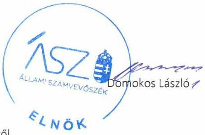

Melléklet: Tájékoztatás az észrevételek kezeléséről

---

# Tájékoztatás az észrevételek kezeléséről 

A „Községi, nagyközségi önkormányzatok integritásának ellenőrzése" című jelentéstervezetre (továbbiakban: jelentéstervezet) a 2020. március 18-án kelt levelében megküldött észrevételeit áttekintettem. Az észrevételek kezeléséről az alábbi tájékoztatást adom.

Az Állami Számvevőszék (továbbiakban: ÁSZ) az ellenőrzési megállapításait az ellenőrzött időszakban hatályos jogszabályok és az ellenőrzött szervezet közreműködési kötelezettsége keretében, az ellenőrzött szervezet által rendelkezésre bocsátott, Teljességi és hitelességi nyilatkozattal alátámasztott dokumentumokra alapozva fogalmazza meg, vonja le a következtetéseket. Gávavencsellő Nagyközség Önkormányzata (továbbiakban: Önkormányzat) polgármestere és jegyzője által aláírt Teljességi és hitelességi nyilatkozatokban foglaltak szerint az átadott dokumentumok, adatok megbízhatóak, az ÁSZ által bekért adatokra, dokumentumokra vonatkozóan teljes körű információt tartalmaznak. A polgármester és a jegyző az átadott dokumentumok, adatok hitelességéért, valódiságáért, hiánytalanságáért teljes felelősséget vállalt.

Jegyző úrhölgy az észrevételének 1. pontjában a 2018. évi személyi változásokról (polgármester és a Vagyongazdálkodási Csoport vezetője) adott tájékoztatást, továbbá arról, hogy az ÁSZ részére megküldött jegyzői nyilatkozatok csatolásra kerültek arra vonatkozóan, hogy az irattárban a kért iratok nem találhatók meg. Jegyző úrhölgy az észrevételének 4. pontjában a 2018. évtől kezdődően kialakított új szabályozási környezetről és a 2020. január 1-jétől létrehozott közös hivatalról, 5. pontjában pedig a szociális ellátórendszer hatékonyabb működtetésére létrehozott társulásról adott tájékoztatást.

Jegyző úrhölgy észrevételének 1. és 4-5. pontjaiban az ellenőrzés megállapításait nem vitatta, ezért az azokban foglaltakat tájékoztatásként kezeltük, amelyek alapján az ellenőrzési megállapítások módosítása nem indokolt.

## 1. A közbeszerzési szabályzattal kapcsolatban tett észrevételt nem fogadtuk el.

Jegyző úrhölgy észrevételében jelezte, hogy az Önkormányzat az ellenőrzött időszakban rendelkezett közbeszerzési szabályzattal, és vélhetően be is tartották, de az iratkezelési hiányosságok miatt érdemben nyilatkozni nem tud.

Az ellenőrzés megállapította, hogy „az önkormányzat nem írta elő a közbeszerzési értékhatár alatti beszerzések esetén legalább három ajánlat bekérését.". Az ellenőrzési dokumentumok között megtalálható, a 2019. január 14-én kelt Teljességi és hitelességi nyilatkozat 11. pontjában szereplő „DOC melleklet 11_20190110163815.PDF" megnevezésű fájl a jegyző 2019. január 10-én kelt nyilatkozatát tartalmazza arra vonatkozóan, hogy a 2017. január 1. és 2017. december 31. közötti időszakra a közbeszerzési értékhatár alatti beszerzésekre vonatkozó szabályzat eljárásrend nem áll rendelkezésre. A Teljességi és hitelességi nyilatkozat 10. pontjában szereplő „DOC melleklet 10_20190110163643.PDF" megnevezésű dokumentumban található, 2017. május 3-ától hatályos Közbeszerzési szabályzat a közbeszerzési értékhatár alatti beszerzésekre vonatkozóan nem tartalmazott rendelkezést. Az előzőekre tekintettel a megállapítás módosítása nem indokolt.

---

# 2. A vagyonnyilatkozatok nyilvántartásával kapcsolatban tett észrevételt nem fogadtuk el. 

Jegyző úrhölgy észrevételének 3. pontjában foglaltak szerint a polgármesteri hivatal dolgozói a vagyonnyilatkozat-tételi kötelezettségüknek nem tettek eleget, az önkormányzati képviselők pedig évente eleget tettek vagyonnyilatkozat-tételi kötelezettségüknek, azonban a nyilvántartásba vétel nem történt meg. Az észrevétel 6. pontjában jelezte továbbá, hogy a 2020. január 1-jétől létrehozott közös hivatal SZMSZ-ének felülvizsgálata és aktualizálása megtörtént, tételesen kialakításra került a vagyonnyilatkozat tételi kötelezettség teljesítésére, a vagyonnyilatkozatok kezelésére vonatkozó szabályozás.

Az ellenőrzés megállapította, hogy az Önkormányzat a Magyarország helyi önkormányzatairól szóló 2011. évi CLXXXIX. törvény (Mötv.) 39. § (3) bekezdésében foglaltak ellenére nem gondoskodott a vagyonnyilatkozatok nyilvántartásba vételéről, valamint hogy az önkormányzat hivatala az egyes vagyonnyilatkozat-tételi kötelezettségekről szóló 2007. évi CLII. törvény (Vnytv.) 11. § (4) bekezdésében előírtak ellenére nem gondoskodott a vagyonnyilatkozatok nyilvántartásba vételéről. Az ellenőrzési dokumentumok között megtalálható, a 2019. január 14-én kelt Teljességi és hitelességi nyilatkozat 7. pontjában szereplő „DOC melleklet 7_20190110163438.PDF" megnevezésű fájl a jegyző 2019. január 10én kelt nyilatkozatát tartalmazza arra vonatkozóan, hogy a 2017. január 1. és 2017. december 31. közötti időszakban az Önkormányzat és a Polgármesteri Hivatal esetében a vagyonnyilatkozat tételre kötelezettekről nyilvántartást nem vezettek. A jegyzői nyilatkozat és az észrevételében foglaltak az ellenőrzött időszakra vonatkozó ellenőrzési megállapítást megerősítik, ezért a megállapítás módosítása nem indokolt.

## 3. Az etikai elvárások meghatározásával kapcsolatban tett észrevételt nem fogadtuk el.

Jegyző úrhölgy az észrevétel 7. és 8. pontjában a Polgármesteri Hivatal elkészült etikai kódexéről adott tájékoztatást, továbbá jelezte, hogy a hivatali dolgozók apparátusi értekezletén folyamatos az információáramlás, az önkormányzat által fenntartott intézmények vonatkozásában is.

Az ellenőrzési dokumentumok között megtalálható, a 2019. január 14-én kelt Teljességi és hitelességi nyilatkozat 4. pontjában szereplő „DOC melleklet 3_20190110163404.PDF" megnevezésű fájl a jegyző 2019. január 10-én kelt nyilatkozatát tartalmazza arra vonatkozóan, hogy a 2017. január 1. és 2017. december 31. közötti időszakra vonatkozóan etikai kódex, etikai elvárásokat, követelményeket, magatartási szabályokat tartalmazó dokumentumok nem állnak rendelkezésre. A jegyzői nyilatkozat és az észrevételében foglaltak az ellenőrzési megállapítást megerősítik, ezért a megállapítás módosítása nem indokolt.
4. A közérdekú bejelentésekkel és panaszokkal kapcsolatban tett észrevételt nem fogadtuk el.

Jegyző úrhölgy az észrevétel 9. pontjában az Önkormányzat honlapjának folyamatban lévő megújításáról és az informatikai biztonság zárt rendszerrel való kialakításáról adott tájékoztatást. Az észrevétel 10-11. pontjában jelezte, hogy a közérdekú adatszolgáltatási kötelezettségüknek eleget tesznek, azonban a közérdekú bejelentésekre és panaszkezelésre vonatkozó szabályzat nem volt.

Az ellenőrzési dokumentumok között megtalálható, a 2019. január 14-én kelt Teljességi és hitelességi nyilatkozat 8. pontjában szereplő „DOC melleklet 8_20190110163500.PDF" megnevezésű fájl nem az EL-1430-003/2018. ikt.sz. adatbekérő levél 8. pontjában kért, a közérdekú bejelentések és panaszok kezelésére vonatkozó szabályzatot, hanem „A közérdekü adatok megismerésére irányuló kérelmek intézésének és a kötelezően közzéteendő adatok nyilvánosságra hozatalának szabályzatát" tartalmazta. A 2019. január 14-én kelt Teljességi és hitelességi nyilatkozat 9. pontjában szereplő „DOC melleklet

---

9_20190110163625.PDF" megnevezésű fájl a jegyző 2019. január 10-én kelt nyilatkozatát tartalmazza arra vonatkozóan, hogy a 2017. január 1. és 2017. december 31. közötti időszakra a közérdekű bejelentések és panaszok tapasztalatainak áttekintését igazoló dokumentumok nem állnak rendelkezésre. Az Önkormányzat dokumentumokkal nem igazolta, hogy a beérkezett közérdekű bejelentések és panaszok tapasztalatait áttekintő rendszerét kialakította. A jegyzői nyilatkozat és az észrevételében foglaltak az ellenőrzési megállapítást megerősítik, ezért a megállapítás módosítása nem indokolt.

Köszönettel vettük Jegyző úrhölgy tájékoztatását arra vonatkozóan, hogy az ellenőrzött időszakban fennállt hiányosságok felszámolása részben megtörtént, illetve folyamatban van, amelyek továbbviteléhez ellenőrzési megállapításaink is segítséget nyújtanak.

Budapest, 2020. 04. hónap 13. nap

Salamon Ildikó
felügyeleti vezető sk.
A kiadmány hiteles.

---

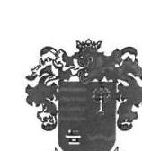

# NAGYKOVÁCSI POLGÁRMESTERI HIVATAL 

2094 Nagykovácsi, Kossuth Lajos u. 61.
06-26-555-009/106 Fax: 06-26-389-724
E-mail: titkarsag@nagykovacsi.hu

Ügyiratszám: 1/10918-2/2020.
Telefonszám: 06-26-555-009/106
E-mail: titkarsag@nagykovacsi.hu

## Domokos László

## Elnök úrnak

## Állami Számvevőszék

1364 Budapest 4
Pf. 54.

Tárgy: Községi, nagyközségi
önkormányzatok integritásának ellenőrzése
Hiv. szám:
EL-1377-014/2020, EL-1377-015/2020
ALLAMI SZAMVEVOSZEK
$\frac{1}{2} 5-302381202011$
Erkazett: 2020 MARE 23.
tatalosza: 21-1377-016/2020
Mezaklet:

## Tisztelt Elnök Úr!

Köszönettel vettük a fenti számokon megküldött jelentés-tervezetet, amelyre az alábbi együttes észrevételt tesszük:

1. ponthoz: 2019-ben a Polgármesteri Hivatal 22 köztisztviselője végzett el a korrupció-megelőzés témakörét érintő közszolgálati továbbképzést.
2. ponthoz: Az Önkormányzat rendelkezik Közbeszerzési Szabályzattal, amelyet évente felülvizsgálunk. A 2017-ben hatályos szabályzat vonatkozó rendelkezései az alábbiak:
„2.2.6. Az Önkormányzat köteles minden szükséges intézkedést megtenni annak érdekében, hogy elkerülje az összeférhetetlenséget és a verseny tisztaságának sérelmét eredményező helyzetek kialakulását. Összeférhetetlen és nem vehet részt az eljárás előkészitésében és lefolytatásában az Önkormányzat nevében olyan személy vagy szervezet, amely funkcióinak pártatlan és tárgyilagos gyakorlására bármely okból, így különösen gazdasági vagy más érdek vagy az eljárásban részt vevő gazdasági szereplővel fennálló más közös érdek miatt nem képes. Összeférhetetlen és nem vehet részt az eljárásban ajánlattevőként, részvételre jelentkezőként, alvállalkozóként vagy az alkalmasság igazolásában részt vevő szervezetként az a gazdasági szereplő, akivel szemben a Kbt. 25. § (3) és (4) bekezdése szerinti körülmények fennállnak. Az eljárásba bevont személy vagy szervezet jelen Szabályzat 1. számú melléklete szerint összeférhetetlenségi és titoktartási nyilatkozatot köteles tenni."

## 1. számú melléklet

ÖSSZEFÉRHETETLENSÉGIÉS TITOKTARTÁSI NYILATKOZAT
KÖZBESZERZÉSI BÍRÁLÓ BIZOTTSÁG ELNÖKE ÉS TAGJAI,
ILLETVE ÉGYÉB ELJÁRÁSBA BEVONT SZEMÉLYEK RÉSZÉRE

Név:
Szervezeti egység:
Beosztás:
Nagykovácsi Nagyközség Önkormányzata által „.................................." megnevezéssel folytatandó közbeszerzési eljárás előkészitésében, az eljárás más szakaszában, illetve az ajánlatok (részvételi jelentkezések) értékelésében (elbírálásában) mint résztvevő személy kijelentem, hogy a közbeszerzésekről szóló 2015. évi CXLIII. törvény 25. §-ában foglalt összeférhetetlenségi okok hatálya alatt nem állok, vagyis így különösen nem áll fenn olyan gazdasági érdek vagy az eljárásban

---

részt vevő gazdasági szereplővel fennálló más közös érdek, amely miatt a funkcióimnak pártatlan és tárgyilagos gyakorlására nem lennék képes.

Az eljárás során tudomásomra jutott információkat, adatokat és tényeket sem az eljárás befejezése elött, sem azt követően jogosulatlan személy tudomására nem hozom, az információkkal, adatokkal és tényekkel a gazdasági szereplőket nem befolyásolom.

Kötelezem magam arra, hogy ha az összeférhetetlenségi ok az eljárás alatt következik be, arról haladéktalanul értesítem a döntéshozó Képviselő-testületet és megbízómat.

Nagykovácsi, $\qquad$
4. ponthoz: A Képviselő-testület Szervezeti és Müködési Szabályzata az Úgyrendi Bizottságot bízta meg a képviselői vagyonnyilatkozatokkal kapcsolatos nyilvántartási és ellenőrzési feladatokkal. A Bizottság 2015 óta a mellékelt formában tartja nyilván a vagyonnyilatkozatokat, amiket a jegyző öriz a nyilvántartással együtt.
5. ponthoz: Az Önkormányzat honlapján 2018. május 28-a óta megtalálható a Polgármesteri Hivatal adatvédelmi és adatbiztonsági szabályzata, amely részletezi az ügyfél adatainak védelmét is.

Kérjük szíveskedjen megfontolni a leírtak figyelembe vételét a jelentés végleges szövegének kialakításakor.

Nagykovácsi, 2020. március 18.

Tisztelettel:
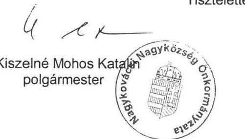
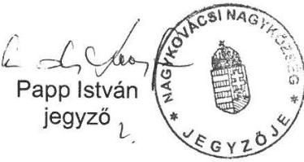

---

Ikt. szám: EL-1377-018/2020.

Kiszelné Mohos Katalin úrhölgy
polgármester
Nagykovácsi Nagyközség Önkormányzata

# Nagykovácsi 

Tisztelt Polgármester Úrhölgy!

A „Községi, nagyközségi önkormányzatok integritásának ellenőrzése" címmel készített számvevőszéki jelentéstervezetre a 2020. március 18-án kelt, az 1/10918-2/2020. iktatószámú levélben megküldött észrevételeit megkaptam.

Az Állami Számvevőszék észrevételekre vonatkozó álláspontjáról a felügyeleti vezető által készített részletes tájékoztatást csatoltan megküldöm.

Tájékoztatom Polgármester úrhölgyet, hogy a számvevőszéki jelentésben - az Állami Számvevőszékről szóló 2011. évi LXVI. törvény 29. § (3) bekezdése alapján - a figyelembe nem vett észrevételeket szerepeltetjük az elutasítás indokának feltüntetésével.

Budapest, 2020. 04 hónap 17 nap
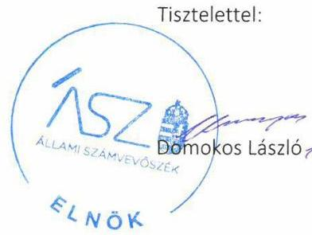

Melléklet: Tájékoztatás az észrevételek kezeléséről

---

# Tájékoztatás az észrevételek kezeléséről 

A „Községi, nagyközségi önkormányzatok integritásának ellenőrzése" című jelentéstervezetre (továbbiakban: jelentéstervezet) a 2020. március 18-án kelt levelében megküldött észrevételeit áttekintettem. Az észrevételek kezeléséről az alábbi tájékoztatást adom.

## 1. Az 1. ponthoz kapcsolódó észrevétel

Polgármester úrhölgy észrevételében jelezte, hogy a Polgármesteri Hivatal 22 köztisztviselője elvégezte a korrupció-megelőzés témakörét érintő közszolgálati továbbképzést.
Az ÁSZ az ellenőrzési megállapításait az adatszolgáltatás során a részére törvényi határidőben rendelkezésre bocsátott dokumentumokra alapozva fogalmazza meg. A teljességi és hitelességi nyilatkozatuk szerint az ÁSZ részére átadott dokumentumok, adatok megbízhatóak, és a bekért adatokra, dokumentumokra vonatkozóan teljes körű információt tartalmaznak. A teljességi és hitelességi nyilatkozatuk alapján az ÁSZ EL-1377-006/2019. iktatószámú adatbekérő levél 2. pontjában szereplő „Integritás témájú képzéssel kapcsolatos dokumentumok: képzések szervezésére vonatkozó belső szabályozóeszközök, képzések megtartását igazoló dokumentumok" témakörben bekérendő dokumentumokra vonatkozóan a „2. nyilatkozat 2. ponthoz.pdf" file nevű dokumentumot bocsátották az ellenőrzés rendelkezésére. Az előbb hivatkozott nyilatkozatban Polgármester úrhölgy azt rögzítette, hogy Nagykovácsi Nagyközség Önkormányzata nem rendelkezik integritás témájú képzéssel kapcsolatos dokumentumokkal. Az előbbiekre tekintettel az észrevételt nem fogadjuk el, az ellenőrzési megállapítás módosítása nem indokolt.

## 2. A 3. ponthoz kapcsolódó észrevétel

Polgármester úrhölgy észrevételében jelezte, hogy az Önkormányzat rendelkezik Közbeszerzési Szabályzattal, amelyet évente felülvizsgálnak. A 2017-ben hatályos szabályzat összeférhetetlenségre vonatkozó rendelkezéseiről az észrevételben tájékoztatást adott.
A teljességi és hitelességi nyilatkozatuk alapján az ÁSZ EL-1377-006/2019. iktatószámú adatbekérő levél 5. pontjában szereplő „Összeférhetetlenség feltárásáról, nyilatkozat megtételének eljárásrendjéről szóló dokumentumok." témakörben bekérendő dokumentumokra vonatkozóan az „5. közszolgálati szabályzat.pdf" file nevű dokumentumot bocsátották az ellenőrzés rendelkezésére. A hivatkozott file név a Közszolgálati szabályzatról szóló 1/2015. (VII.31.) Jegyzői Utasítás című dokumentumot tartalmazza, amelynek hatálya kizárólag Nagykovácsi Polgármesteri Hivatal köztisztviselőire terjed ki, továbbá nem rendelkezik az önkormányzati képviselőkre vagy testületi bizottság nem képviselő tagjára vonatkozó összeférhetetlenségi okok feltárásáról, illetve az azzal kapcsolatos nyilatkozatok megtételéről.
Az ellenőrzés rendelkezésére bocsátott 2017. március 1-jétől hatályos Nagykovácsi Nagyközség Önkormányzatának Közbeszerzési Szabályzata című dokumentum 3. pontjának 3.3 alpontja szerint „A Szabályzat tárgyi hatálya a Kbt. 8. § (1) bekezdésében meghatározott közbeszerzésekre terjed ki." A Közbeszerzési Szabályzat észrevételben hivatkozott II. fejezet 2. pontjának 2.2.6. alpontja rendelkezik összeférhetetlenségi szabályokról, az azonban a szabályzat tárgyi hatályát figyelembe véve kizárólag a Kbt. 8. § (1) bekezdésében meghatározott közbeszerzésekkel összefüggésben

---

alkalmazandó a szabályzat 1. számú mellékletében szereplő nyilatkozathoz hasonlóan. A szabályzat nem tartalmaz arra vonatkozó eljárásrendet, amely az Önkormányzat tekintetében összeférhetetlenségi okok feltárására irányulna.
A fentiekre tekintettel az észrevételt nem fogadjuk el, az ellenőrzési megállapítás módosítása nem indokolt.

# 3. A 4. ponthoz, valamint a jelentéstervezet II. számú melléklet táblázatának 3. sorszámú megállapítását és a kapcsolódó javaslatot érintő észrevétel 

Polgármester úrhölgy észrevételében jelezte, hogy a Szervezeti és Müködési Szabályzat az Úgyrendi Bizottságot bízta meg a vagyonnyilatkozatokkal kapcsolatos nyilvántartási és ellenőrzési feladatokkal. A Bizottság 2015 óta nyilvántartja a vagyonnyilatkozatokat, amelyeket a jegyző őriz a nyilvántartással együtt. Nagykovácsi Nagyközség Önkormányzat tekintetében a 2020. január hónapra vonatkozó vagyonnyilatkozatok nyilvántartását az észrevétel mellékleteként megküldte.
Az ÁSZ az ellenőrzési megállapításait az adatszolgáltatás során a részére törvényi határidőben rendelkezésre bocsátott dokumentumokra alapozva fogalmazza meg. A teljességi és hitelességi nyilatkozatuk szerint az ÁSZ részére átadott dokumentumok, adatok megbízhatóak, és a bekért adatokra, dokumentumokra vonatkozóan teljes körű információt tartalmaznak. A teljességi és hitelességi nyilatkozatuk alapján kizárólag Nagykovácsi Polgármesteri Hivatalra vonatkozóan bocsátottak az ellenőrzés rendelkezésére vagyonnyilatkozatok nyilvántartásba vételét igazoló dokumentumokat, Nagykovácsi Nagyközség Önkormányzatára (polgármester, önkormányzati képviselők) vonatkozóan nem.
Az ÁSZ az ellenőrzés során kizárólag az adatszolgáltatásra rendelkezésre álló - az Állami Számvevőszékről szóló 2011. évi LXVI. törvény 28. § (2) bekezdés szerinti - határidőn belül beérkezett dokumentumokat veszi figyelembe, a határidőn túl megküldött, észrevételhez mellékelt dokumentumot nem értékeli.
A fentiekre tekintettel az észrevételt nem fogadjuk el, a jelentéstervezet jelen pontban érintett részének módosítása nem indokolt.

## 4. Az 5. ponthoz kapcsolódó észrevétel

Polgármester úrhölgy észrevételében jelezte, hogy az Önkormányzat honlapján 2018. május 28-a óta megtalálható a Polgármesteri Hivatal adatvédelmi és adatbiztonsági szabályzata, amely részletezi az ügyfél adatainak védelmét is.
Az ellenőrzési megállapítás szerint Nagykovácsi Nagyközség Önkormányzata honlapján nem lelhető fel a bejelentő személyes adatainak védelmére vonatkozó tájékoztatás. Nagykovácsi Nagyközség Önkormányzata honlapján letölthető 2018. május 28-től hatályos Adatvédelmi és adatbiztonsági szabályzata a panasz- és közérdekű bejelentések kezeléséről a bejelentő védelmét érintően nem rendelkezik. Az előbbiekre tekintettel az észrevételt nem fogadjuk el, a jelentéstervezet jelen pontban érintett részének módosítása nem indokolt.

Budapest, 2020. 04. hónap 13. nap
Salamon Ildikó a. C.
felügyeleti vezető

---

# A52 150 éve a közpénzek öre 

ÁLLAMI SZÁMVEVŐSZÉK

Ikt. szám: EL-1377-017/2020.

Papp István úr
jegyző
Nagykovácsi Polgármesteri Hivatal

## Nagykovácsi

Tisztelt Jegyző Úr!

A „Községi, nagyközségi önkormányzatok integritásának ellenőrzése" címmel készített számvevőszéki jelentéstervezetre a 2020. március 18-án kelt, az 1/10918-2/2020. iktatószámú levélben megküldött észrevételeit megkaptam.

Az Állami Számvevőszék észrevételekre vonatkozó álláspontjáról a felügyeleti vezető által készített részletes tájékoztatást csatoltan megküldöm.

Tájékoztatom Jegyző urat, hogy a számvevőszéki jelentésben - az Állami Számvevőszékről szóló 2011. évi LXVI. törvény 29. § (3) bekezdése alapján - a figyelembe nem vett észrevételeket szerepeltetjük az elutasítás indokának feltüntetésével.

Budapest, 2020. ơ hónap 17 nap
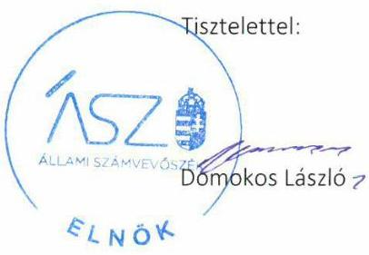

Melléklet: Tájékoztatás az észrevételek kezeléséről

---

# Tájékoztatás az észrevételek kezeléséről 

A „Községi, nagyközségi önkormányzatok integritásának ellenőrzése" című jelentéstervezetre (továbbiakban: jelentéstervezet) a 2020. március 18-án kelt levelében megküldött észrevételeit áttekintettem. Az észrevételek kezeléséről az alábbi tájékoztatást adom.

## 1. Az 1. ponthoz kapcsolódó észrevétel

Jegyző úr észrevételében jelezte, hogy a Polgármesteri Hivatal 22 köztisztviselője elvégezte a korrupció-megelőzés témakörét érintő közszolgálati továbbképzést.
Az ÁSZ az ellenőrzési megállapításait az adatszolgáltatás során a részére törvényi határidőben rendelkezésre bocsátott dokumentumokra alapozva fogalmazza meg. A teljességi és hitelességi nyilatkozatuk szerint az ÁSZ részére átadott dokumentumok, adatok megbízhatóak, és a bekért adatokra, dokumentumokra vonatkozóan teljes körű információt tartalmaznak. A teljességi és hitelességi nyilatkozatuk alapján az ÁSZ EL-1377-006/2019. iktatószámú adatbekérő levél 2. pontjában szereplő „Integritás témájú képzéssel kapcsolatos dokumentumok: képzések szervezésére vonatkozó belső szabályozóeszközök, képzések megtartását igazoló dokumentumok" témakörben bekérendő dokumentumokra vonatkozóan a „2. nyilatkozat 2. ponthoz.pdf" file nevű dokumentumot bocsátották az ellenőrzés rendelkezésére. Az előbb hivatkozott nyilatkozatban Nagykovácsi Nagyközség Önkormányzata polgármestere azt rögzítette, hogy Nagykovácsi Nagyközség Önkormányzata nem rendelkezik integritás témájú képzéssel kapcsolatos dokumentumokkal. Az előbbiekre tekintettel az észrevételt nem fogadjuk el, az ellenőrzési megállapítás módosítása nem indokolt.

## 2. A 3. ponthoz kapcsolódó észrevétel

Jegyző úr észrevételében jelezte, hogy az Önkormányzat rendelkezik Közbeszerzési Szabályzattal, amelyet évente felülvizsgálnak. A 2017-ben hatályos szabályzat összeférhetetlenségre vonatkozó rendelkezéseiről az észrevételben tájékoztatást adott.
A teljességi és hitelességi nyilatkozatuk alapján az ÁSZ EL-1377-006/2019. iktatószámú adatbekérő levél 5. pontjában szereplő „Összeférhetetlenség feltárásáról, nyilatkozat megtételének eljárásrendjéről szóló dokumentumok." témakörben bekérendő dokumentumokra vonatkozóan az „5. közszolgálati szabályzat.pdf" file nevű dokumentumot bocsátották az ellenőrzés rendelkezésére. A hivatkozott file név a Közszolgálati szabályzatról szóló 1/2015. (VII. 31.) Jegyzői Utasítás című dokumentumot tartalmazza, amelynek hatálya kizárólag Nagykovácsi Polgármesteri Hivatal köztisztviselőire terjed ki, továbbá nem rendelkezik az önkormányzati képviselőkre vagy testületi bizottság nem képviselő tagjára vonatkozó összeférhetetlenségi okok feltárásáról, illetve az azzal kapcsolatos nyilatkozatok megtételéről.
Az ellenőrzés rendelkezésére bocsátott 2017. március 1-jétől hatályos Nagykovácsi Nagyközség Önkormányzatának Közbeszerzési Szabályzata című dokumentum 3. pontjának 3.3 alpontja szerint „A Szabályzat tárgyi hatálya a Kbt. 8. § (1) bekezdésében meghatározott közbeszerzésekre terjed ki." A Közbeszerzési Szabályzat észrevételben hivatkozott II. fejezet 2. pontjának 2.2.6. alpontja rendelkezik összeférhetetlenségi szabályokról, az azonban a szabályzat tárgyi hatályát figyelembe

---

véve kizárólag a Kbt. 8. § (1) bekezdésében meghatározott közbeszerzésekkel összefüggésben alkalmazandó a szabályzat 1. számú mellékletében szereplő nyilatkozathoz hasonlóan. A szabályzat nem tartalmaz arra vonatkozó eljárásrendet, amely az Önkormányzat tekintetében összeférhetetlenségi okok feltárására irányulna.
A fentiekre tekintettel az észrevételt nem fogadjuk el, az ellenőrzési megállapítás módosítása nem indokolt.
3. A 4. ponthoz, valamint a jelentéstervezet II. számú melléklet táblázatának 3. sorszámú megállapítását és a kapcsolódó javaslatot érintő észrevétel
Jegyző úr észrevételében jelezte, hogy a Szervezeti és Működési Szabályzat az Ügyrendi Bizottságot bízta meg a vagyonnyilatkozatokkal kapcsolatos nyilvántartási és ellenőrzési feladatokkal. A Bizottság 2015 óta nyilvántartja a vagyonnyilatkozatokat, amelyeket a jegyző őriz a nyilvántartással együtt. Nagykovácsi Nagyközség Önkormányzat tekintetében a 2020. január hónapra vonatkozó vagyonnyilatkozatok nyilvántartását az észrevétel mellékleteként megküldte.
Az ÁSZ az ellenőrzési megállapításait az adatszolgáltatás során a részére törvényi határidőben rendelkezésre bocsátott dokumentumokra alapozva fogalmazza meg. A teljességi és hitelességi nyilatkozatuk szerint az ÁSZ részére átadott dokumentumok, adatok megbízhatóak, és a bekért adatokra, dokumentumokra vonatkozóan teljes körű információt tartalmaznak. A teljességi és hitelességi nyilatkozatuk alapján kizárólag Nagykovácsi Polgármesteri Hivatalra vonatkozóan bocsátottak az ellenőrzés rendelkezésére vagyonnyilatkozatok nyilvántartásba vételét igazoló dokumentumokat, Nagykovácsi Nagyközség Önkormányzatára (polgármester, önkormányzati képviselők) vonatkozóan nem.
Az ÁSZ az ellenőrzés során kizárólag az adatszolgáltatásra rendelkezésre álló - az Állami Számvevőszékről szóló 2011. évi LXVI. törvény 28. § (2) bekezdés szerinti - határidőn belül beérkezett dokumentumokat veszi figyelembe, a határidőn túl megküldött, észrevételhez mellékelt dokumentumot nem értékeli.
A fentiekre tekintettel az észrevételt nem fogadjuk el, a jelentéstervezet jelen pontban érintett részének módosítása nem indokolt.

# 4. Az 5. ponthoz kapcsolódó észrevétel 

Jegyző úr észrevételében jelezte, hogy az Önkormányzat honlapján 2018. május 28-a óta megtalálható a Polgármesteri Hivatal adatvédelmi és adatbiztonsági szabályzata, amely részletezi az ügyfél adatainak védelmét is.
Az ellenőrzési megállapítás szerint Nagykovácsi Nagyközség Önkormányzata honlapján nem lelhető fel a bejelentő személyes adatainak védelmére vonatkozó tájékoztatás. Nagykovácsi Nagyközség Önkormányzata honlapján letölthető 2018. május 28-től hatályos Adatvédelmi és adatbiztonsági szabályzata a panasz- és közérdekű bejelentések kezeléséről a bejelentő védelmét érintően nem rendelkezik. Az előbbiekre tekintettel az észrevételt nem fogadjuk el, a jelentéstervezet jelen pontban érintett részének módosítása nem indokolt.

Budapest, 2020. 04. hónap ( 5. nap
Salamon Ildikó 5.5 .
felügyeleti vezető

---

# Bugyi Nagyközség Polgármesteri Hivatal   Jegyzöje   2347 Bugyi, Beleznay tér 1.   Tel.: 29-547-500, Fax: 29-348-464   e-mail: hivatal@bugyi.hu; Internet: www.bugyi.hu   Ügyfélfogadás: Hétfö: $8^{00}-12^{00}$; Szerda: $8^{00}-12^{00} ; 13^{00}-15^{00}$; Péntek: $8^{00}-12^{00}$ 

Szám: 2019-2/2020
Tárgy: Észrevétel „Községi, nagyközségi önkormányzatok integritásának ellenőrzése" számvevőszéki jelentéstervezethez
Hiv.sz: EL-1429-020/2020

## ÁLLAMI SZÁMVEVŐSZÉK

## Domonkos László Elnök Úr részére

## Budapest 4.

Pf:54.

ÁLLAMI SZÁMVEVŐSZÉK
BE-34183/2016/1
Érészett: 2020 MAK 2.6.
hizítézé: $E L-1429-22 / 2020$
Melléklet:

## Tisztelt Elnök Úr!

Hivatkozással az EL-1429-020/2020 iktatószámú „Községi, nagyközségi önkormányzatok integritásának ellenőrzése" számvevőszéki ellenőrzés keretében megküldött jelentéstervezetre, valamint az Állami Számvevőszék ellenőrzési megállapításait írásban ismertető EL-1429-19/2020 iktatószámú jegyzőkönyv II. számú Intézkedés igénylő „Megállapítások és az érintett önkormányzatok" című mellékletben Bugyi településre tett intézkedést igénylő megállapításokra a rendelkezésre álló határidőn belül az alábbi észrevételt teszem:
I. Megállapítás: A Jegyző a Bkr. 6.§. (1) bekezdés c) pontjában foglaltak ellenére nem alakított olyan kontrollkörnyezetet, amelyben meghatározottak, ismertek és elfogadottak az etikai elvárások a szervezet minden szintjén.

Bugyi Nagyközségi Polgármesteri Hivatal Jegyzője 1/2014(VI.30) számú Közszolgálati Szabályzata a Polgármesteri Hivatal köztisztviselői számára kötelezően előírja, melyet az Állami Számvevőszék elektronikus felületére feltöltöttem, a S0829 számú Teljességi és hitelességi nyilatkozat dokumentum 1. sorszám 1.) pontja és a 2. sorszám alatt „közszolgálati szabályzat.pdf" dokumentumként található meg. A hivatkozott dokumentum

- IX fejezet KÖZTISZTVISELŐVEL SZEMBEN TÁMASZTOTT HIVATÁSETIKAI ALAPELVEKRŐL ÉS AZ ETIKAI ELJÁRÁS SZABÁLYAINAK MEGHATÁROZÁSÁRÓL című fejezete 79. pontja Általános magatartási normákat, 80. pontja a Vezetővel szemben támasztott további etikai alapelvek, 81. pontja A hivatásetikai eljárás szabályait, 80. Vezetővel szemben támasztott további etikai alapelveket
- X. Fejezet AJÁNDÉK ELFOGADÁS-ának szabályait tartalmazza.

---

A Közszolgálati szabályzat hatályáról szóló I. /1 pontja szerint a „Közszolgálati Szabályzat hatálya kiterjed Bugyi Nagyközség Polgármesteri Hivatalánál foglalkoztatott köztisztviselökre, ügykezelökre és munkaviszonyban álló munkavállalókra."

A Közszolgálati Szabályzatban foglalt szabályokat a Polgármesteri Hivatal vezetőivel megismertettem és kötelezően előírtam számukra, hogy a szervezeti egységek dolgozóival ismertessék meg.
2. Megállapítás: A 2017 évben az önkormányzat hivatala nem biztositotta a vagyonnyilatkozat-tétel törvényes rendjének alapvető feltételeit, mert nem rendelkezett az Áht.9.§. b) pontjában és a 10.§.(5) bekezdésében foglaltaknak megfelelő szervezti és müködési szabályzattal.

Tájékoztatom, hogy Bugyi Nagyközség Önkormányzatának Képviselő-testülete 126/2016(0915) számú határozatával elfogadta Bugyi Nagyközségi Polgármesteri Hivatal Szervezeti és Müködési Szabályzatát. Az elfogadott szabályzatot Állami Számvevőszék elektronikus felületére feltöltöttem, mely az S0829 számú „Teljességi és hitelességi nyilatkozat Bekért adatokról szóló dokumentum" 2 pontja alatt „HIVATALI SZMSZ.pdf" dokumentumként található meg. Álláspontom szerint a Polgármesteri Hivatal SZMSZ-ét az Áht. 9.§.b) pontja alapján Bugyi Nagyközség Önkormányzat Képviselő-testülete hagyta jóvá, valamint az Áht 10.§. (5) bekezdésében előírtakat tartalmazza.

A Hivatal SZMSZ-ének 26.pontja „Vagyonnyilatkozat-tételi kötelezettség teljesítése" címet viseli, mely egyrészt előírja a vagyonnyilatkozat-tételi kötelezettséget, annak teljesítését és hivatkozva annak 2. számú mellékletére, mely előírja mely munkakör a vagyonnyilatkozattételre kötelezett és mely időközönként kell eleget tenni. S0829 számú Teljességi és hitelességi nyilatkozat dokumentum 1. sorszám 1.) pontja és a 2. sorszám alatt „,közszolgálati szabályzat.pdf" dokumentum III. fejezetének 28)-38) pontjai „Vagyonnyilatkozatok kezelése", „, A Vagyongyarapodási vizsgálatot megelőző meghallgatás szabályit" tartalmazza, melyet szintén a Polgármesteri Hivatal vezetőivel megismertettem és kötelezően előírtam számukra, hogy a szervezeti egységek dolgozóival ismertessék meg.

Kérem a Tisztelt Elnök Urat, hogy a végleges jelentést az általam tett észrevételeket figyelembevéve készítse el és hagyja jóvá.

Tisztelettel:
2020. március 19.
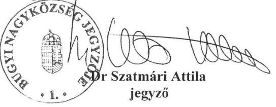

---

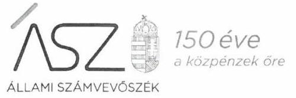

ELNÖK

Ikt. szám: EL-1429-023/2020.

Dr. Szatmári Attila úr
jegyző

Bugyi Nagyközségi Polgármesteri Hivatal

# Bugyi 

Tisztelt Jegyző Úr!
„Községi, nagyközségi önkormányzatok integritásának ellenőrzése" címmel készített számvevőszéki jelentéstervezetre a 2020. március 19-én kelt, 2019-2/2020. iktatószámú levélben megküldött észrevételeit megkaptam.

Az Állami Számvevőszék észrevételekre vonatkozó álláspontjáról a felügyeleti vezető által készített részletes tájékoztatást csatoltan megküldöm.

Tájékoztatom Jegyző urat, hogy a számvevőszéki jelentésben - az Állami Számvevőszékről szóló 2011. évi LXVI. törvény 29. § (3) bekezdése alapján - a figyelembe nem vett észrevételeket szerepeltetjük az elutasítás indokának feltüntetésével.

Budapest, 2020. hónap nap

Melléklet: Tájékoztatás az észrevételek kezeléséről
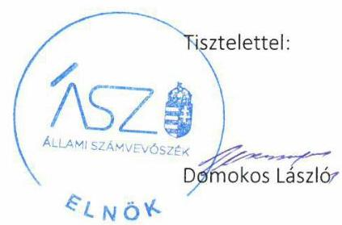

---

# Tájékoztatás az észrevételek kezeléséről 

„Községi, nagyközségi önkormányzatok integritásának ellenőrzése - Önálló hivatallal rendelkező, 30 nagyközségi önkormányzat" című jelentéstervezetre (továbbiakban: jelentéstervezet) a 2020. március 19-én kelt, 2019-2/2020. iktatószámú levelében megküldött észrevételeit áttekintettem. Az észrevételek kezeléséről az alábbi tájékoztatást adom.
I.

A jelentéstervezet II. sz. melléklet 1. pontjában szereplő megállapításra és az erre vonatkozó, Jegyzó úrnak címzett javaslatra tett észrevételével kapcsolatban

Jegyző úr észrevételében jelezte, hogy Bugyi Nagyközségi Önkormányzat Polgármesteri Hivatalának (továbbiakban: Hivatal) 1/2014. (VI. 30.) számú Közszolgálati Szabályzatát az Állami Számvevőszék (továbbiakban: ÁSZ) elektronikus adatbekérési rendszerébe határidőben feltöltötte. Az adatszolgáltatáshoz elkészített teljességi és hitelességi nyilatkozatban a dokumentum 1. sorszám 1.) pontja és a 2. sorszám alatt „közszolgálati szabályzat.pdf" elnevezéssel található meg. A Közszolgálati Szabályzat tartalmazza a jelentéstervezet megállapításában hiányosságként rögzített etikai elvárásokat. A Közszolgálati Szabályzat hatálya Jegyző úr észrevétele szerint kiterjed a Hivatal által foglalkoztatott köztisztviselőkre, ügykezelőkre és munkaviszonyban álló munkavállalókra, annak tartalmát a Hivatal vezetőivel megismertette és kötelezően előírta számukra, hogy a szervezeti egységek dolgozóival ismertessék meg.

A jelentéstervezet II. sz. melléklet 1. pontjában szereplő megállapítás szerint a Jegyző úr a költségvetési szervek belső kontrollrendszeréről és belső ellenőrzéséről szóló 370/2011. (XII. 31.) Korm. rendelet (továbbiakban: Bkr.) 6. § (1) bekezdés c) pontjában foglaltak ellenére nem alakított ki olyan kontrollkörnyezetet, amelyben meghatározottak, ismertek és elfogadottak az etikai elvárások a szervezet minden szintjén. A jelentéstervezet megállapításához Jegyző úr részére egy javaslat került megfogalmazásra a rögzített szabálytalanság megszüntetése céljából.
Az ÁSZ az EL-1429-004/2018. iktatószámú, 2019. január 4-én kelt levelének 2. számú melléklete 3. pontjában kérte 2017. évre vonatkozóan a Hivatal etikai kódexét; etikai elvárásokat, követelményeket, magatartási szabályokat tartalmazó dokumentumokat. Jegyző úr 2019. január 16-án kelt nyilatkozatának mellékletében szereplő dokumentumokat az észrevételében leírtak szerint feltöltötte az ÁSZ elektronikus adatbekérési rendszerébe.
Jegyző úr észrevételében hivatkozott és az ellenőrzési megállapítással érintett Közszolgálati Szabályzat tekintetében az ellenőrzés megállapította, hogy annak kiadmányozása nem történt meg, nem szerepel rajta a kiadmányozásra jogosult aláírása és bélyegzője.
Az ÁSZ az ellenőrzési megállapításait az adatszolgáltatás során a részére törvényi határidőben rendelkezésre bocsátott dokumentumokra alapozva fogalmazza meg. Jegyző úr 2019. január 16án kelt nyilatkozata szerint az ÁSZ részére átadott dokumentumok, adatok megbízhatóak, és a bekért adatokra, dokumentumokra vonatkozóan teljes körű információt tartalmaznak.

---

tekintettel az észrevételt nem fogadjuk el, a jelentéstervezet jelen pontban érintett részének módosítása nem indokolt.

Budapest, 2020. 04. hónap 15. nap

Salamon Ildikó a ki.
Felügyeleti vezető

---

.

---

# RÖVIDÍTÉSEK JEGYZÉKE 

${ }^{1}$ Mötv.
${ }^{2}$ ÁSZ
${ }^{3} \mathrm{Kbt}$.
${ }^{4}$ ÁSZ törvény
${ }^{5}$ ÁSZ SZMSZ
${ }^{6}$ Bkr.
${ }^{7}$ Vnytv.
${ }^{8}$ Áht.

Magyarország helyi önkormányzatairól szóló 2011. évi CLXXXIX. törvény Állami Számvevőszék
a közbeszerzésekről szóló 2015. évi CXLIII. törvény
az Állami Számvevőszékről szóló 2011. évi LXVI. törvény
az Állami Számvevőszék szervezeti és működési szabályzata
a költségvetési szervek belső kontrollrendszeréről és belső ellenőrzéséről szóló 370/2011. (XII. 31.) Korm. rendelet
az egyes vagyonnyilatkozat-tételi kötelezettségekről szóló 2007. évi CLII. törvény az államháztartásról szóló 2011. évi CXCV. törvény

---

# ASZ 

ALLAMI SZAMVEVOSZEK
1052 Budapest, Apáczai Cs. J. u. 10. I 1364 Budapest 4. Pf. 54 TEL: +36 14849100
email: szamvevoszek@asz.hu
web: www.asz.hu | www.aszhirportal.hu