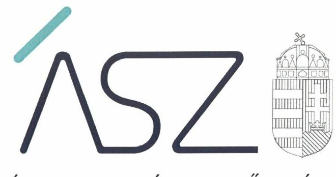
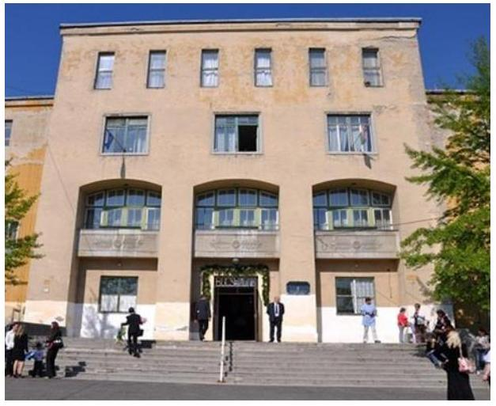

ÁLLAMI SZÁMVEVŐSZÉK

# JELENTÉS 

## Központi költségvetési szervek ellenőrzése

Debreczeni Márton Mezőgazdasági és Élelmiszeripari Szakgimnázium és Szakközépiskola
2020.

20072
www.asz.hu

---

ÁLLAMI SZÁMVEVŐSZÉK

# JELENTÉS 

## Központi költségvetési szervek ellenőrzése

Debreczeni Márton Mezőgazdasági és Élelmiszeripari Szakgimnázium és Szakközépiskola
2020. 05. hó 14 nap

20072
www.asz.hu

---

# AZ ELLENŐRZÉST FELÜGYELTE: 

KLINGA LÁSZLÓ felügyeleti vezető

## AZ ELLENŐRZÉST VEZETTE ÉS A VÉGREHAJTÁSÁÉRT FELELŐS:

GÖRGÉNYI GÁBOR ellenőrzésvezető

## A PROGRAM ÖSSZEÁLLÍTÁSÁÉRT FELELŐS:

TÓTPÁL SZABOLCS osztályvezető

IKTATÓSZÁM: EL-2573-001/2020.
TÉMASZÁM: 2450
ELLENŐRZÉS-AZONOSÍTÓ SZÁM: V079150

Jelentéseink az Országgyúlés számítógépes hálózatán és az interneten a www.asz.hu címen is olvashatóak.

---

# TARTALOMJEGYZÉK 

■ ÖSSZEGZÉS ..... 5
■ AZ ELLENŐRZÉS CÉLJA ..... 6
■ AZ ELLENŐRZÉS TERÜLETE ..... 7
■ AZ ELLENŐRZÉS HÁTTERE, INDOKOLTSÁGA ..... 8
■ A JELENTÉS LÉNYEGES KÉRDÉSKÖREI ..... 9
■ AZ ELLENŐRZÉS HATÓKÖRE ÉS MÓDSZEREI ..... 10
■ MEGÁLLAPÍTÁSOK ..... 12
■ JAVASLATOK ..... 16
■ MELLÉKLETEK ..... 19
I. sz. melléklet: Értelmező szótár ..... 19
■ FÜGGELÉK: ÉSZREVÉTELEK ..... 23
■ RÖVIDÍTÉSEK JEGYZÉKE ..... 25

---

.

---

# ÖSSZEGZÉS 

A miskolci székhelyű Debreczeni Márton Mezőgazdasági és Élelmiszeripari Szakgimnázium és Szakközépiskola belső kontrollrendszerének kialakítása és müködtetése, valamint a pénzügyi és vagyongazdálkodása nem volt szabályszerű, ezáltal a 2016-2017. években nem volt biztositott a felelős gazdálkodás, az átlátható és elszámoltatható közpénzfelhasználás és a vagyon értékének megőrzése. Az integritási kontrollok kiépítettsége nem támogatta a korrupciós és müködési kockázatok elleni védelmet.

## Az ellenőrzés társadalmi indokoltsága

Magyarország versenyképességének és a magyar gazdaság fejlődésének alapvető feltétele a magyar munkavállalók megfelelő szakmai képzettsége és felkészültsége, amelyben a szakképzési rendszernek döntő szerepe van. A mezőgazdaság vonatkozásában is kiemelten fontos ez, hiszen a magyar mezőgazdaság piaci versenyképességét és eredményességét nagymértékben befolyásolja az agrárszférában dolgozók képzettsége, felkészültsége. A szakképzés legjelentősebb színterei a szakképző iskolák. Az eredményes és célszerű szakképzés alapja és alapvető feltétele a szakképző intézmények közpénzekkel és a közvagyonnal való törvényes, átlátható és a korrupcióval szembeni védelmet biztosító múködése és gazdálkodása. Ezért ezen szervezetekkel szemben is alapvető társadalmi igény, hogy a rájuk bízott közpénzekkel, közvagyonnal szabályosan gazdálkodjanak. Emellett a szakképzésben részt vevő pedagógusok, tanulók és a szülők jogos elvárása, hogy a szakképző iskolák múködése átlátható és elszámoltatható legyen. Mindezen igényekkel összhangban, a közpénzügyek átláthatóságának előmozdítása, a közvagyon védelme érdekében került sor az agrárszakképző iskolák belső kontrollrendszerének és gazdálkodásának ellenőrzésére.

## Főbb megállapítások, következtetések, javaslatok

A Földművelésügyi Minisztérium az irányító szervi feladatait szabályszerűen látta el.
A Debreczeni Márton Mezőgazdasági és Élelmiszeripari Szakgimnázium és Szakközépiskola belső kontrollrendszerének kialakítása és múködtetése nem volt szabályszerű. Nem gondoskodtak a szabályszerű kontrollkörnyezet kialakításáról, ezáltal nem teremtették meg a szabályszerű közpénzfelhasználás feltételeit. A gazdálkodási jogkörök gyakorlására jogosult személyekről és aláírás-mintájukról nem vezettek naprakész nyilvántartást. A kiadási és bevételi előirányzatok teljesítésére kiható gazdasági eseményekről nem vezettek részletező nyilvántartást. Az intézmény nem rendelkezett a 2017. évre vonatkozó aláírt költségvetési beszámolóval.

A pénzügyi gazdálkodás és a vagyongazdálkodás nem volt szabályszerű, mert a Debreczeni Márton Mezőgazdasági és Élelmiszeripari Szakgimnázium és Szakközépiskolánál 2016-ban nem vezettek a kötelezettségvállalásokról és más fizetési kötelezettségekről az államháztartás számviteléről szóló kormányrendeletben előírt tartalmú nyilvántartást, illetve a 2016-2017. években a mérleg tételeinek alátámasztásához nem állítottak össze leltárt. A kiadási és bevételi előirányzatok teljesítésére kiható gazdasági eseményeket tartalmazó részletező nyilvántartások, továbbá leltárak hiánya miatt nem igazolható a 2016. évi költségvetési beszámoló, valamint a 2017. évi beszámoló adatok valódisága.

Az integritás kontrollrendszer kiépítettségének és múködésének szintje a 2017. évben nem volt megfelelő.
Az Állami Számvevőszék a Debreczeni Márton Mezőgazdasági és Élelmiszeripari Szakgimnázium és Szakközépiskola igazgatójának 17 javaslatot fogalmazott meg.

---

# AZ ELLENŐRZÉS CÉLJA 

AZ ELLENŐRZÉS CÉLJA annak megítélése volt, hogy az ellenőrzött intézményre vonatkozó irányító szervi feladatellátás a jogszabályi előírások betartásával történt-e; az intézménynél a belső kontrollrendszer kialakítása és múködtetése szabályszerű volt-e, biztosította-e az átlátható, szabályszerű, gazdaságos, hatékony és eredményes gazdálkodás feltételeit; az intézmény pénzügyi és vagyongazdálkodása megfelelt-e a jogszabályi előírásoknak és belső szabályzatainak. Az ellenőrzés keretében az ÁSZ ${ }^{1}$ értékelte az intézmény korrupciós kockázatainak kezelését szolgáló integritás kontrollok kiépítettségét és az integritás szemlélet érvényesülését. Az ÁSZ értékelte, hogy az intézménynél megteremtették-e a teljesítményellenőrzés feltételeit. Értékelte továbbá, hogy érvényesült-e a nemzeti vagyon kezelésének és védelmének célja, azaz a szervezet vagyona a közérdeket szolgálta, a közös szükségletek kielégítése és a természeti erőforrások megóvása, valamint a jövő nemzedékek szükségleteinek figyelembevétele mellett.

---

# **AZ ELLENŐRZÉS TERÜLETE**

## **Debreczeni Márton Mezőgazdasági és Élelmiszeripari Szakgimnázium és Szakközépiskola**

A miskolci székhelyű Debreczeni Márton Mezőgazdasági és Élelmiszeripari Szakgimnázium és Szakközépiskola alaptevékenysége szerint szakgimnáziumi és szakközépiskolai neveléstoktatást, valamint felnőttképzést végzett mezőgazdasági és élelmiszeripari szakmacsoport szerinti képzések keretében.

Az irányító szervi feladatokat az ellenőrzött időszakban az intézmény2, mint köznevelési intézmény fenntartója3 a Földművelésügyi Minisztérium látta el.

Az intézmény nem rendelkezett gazdasági szervezettel. A fenntartó által kijelölt gazdasági szervezet4 az ellenőrzött időszakban nem változott.

Az intézmény feladatellátását nemzeti tulajdonú ingatlanok biztosították, amely az iskola, a műhely és gazdasági épületekből, továbbá mezőgazdasági földterületekből, növény- és üvegházakból álltak.

Az intézmény munkavállalóinak átlagos statisztikai állományi létszáma 2016-ról 2017-re 53 főről 61 főre emelkedett volt. A munkáltatói jogokat az igazgató5 gyakorolta, személye az ellenőrzött időszakban nem változott.

---

# AZ ELLENŐRZÉS HÁTTERE, INDOKOLTSÁGA 

Az államháztartás központi alrendszerébe tartozó szervezet vagyona a nemzeti vagyon része és az Alaptörvény ${ }^{6}$ is rögzíti, hogy a vagyonnal való gazdálkodás célja a közérdek szolgálata. Az ÁSZ ellenőrzi az éves költségvetési törvény végrehajtását, az ellenőrzés során feltárt kockázatok és a terület folyamatos kockázatelemzésével beazonosított kockázatok kezelése érdekében ráépülő ellenőrzésekkel ellenőrzi a költségvetési szervek gazdálkodását, múködését, hogy az ellenőrzések megállapításaival támogassa az ellenőrzött szervezetek szabályszerű gazdálkodását, javaslataival elősegítse az Alaptörvényben megfogalmazott alapvetések érvényesülését a mindennapi életben a szervezetek szintjén. A központi költségvetés rendszerében zajló folyamatok holisztikus elemzései, a kockázatok folyamatos figyelemmel kísérésének módszerével, az így kiválasztott szervezetek célzott, hatékony ellenőrzéseivel az ÁSZ betölti a legfőbb gazdasági ellenőrző szerv küldetését.

A belső kontrollrendszer kialakítása és múködtetése nélkül nem valósítható meg a közpénzek, a közvagyon átlátható, szabályos, gazdaságos, hatékony és eredményes felhasználása. A belső kontrollrendszer azt a célt szolgálja, hogy a költségvetési szervek múködésük és gazdálkodásuk során a tevékenységeket szabályszerűen hajtsák végre, teljesítsék elszámolási kötelezettségeiket és megvédjék az erőforrásokat a veszteségektől, a károktól és a nem rendeltetésszerű használattól. A belső kontrollrendszer magában foglalja mindazon elveket, eljárásokat és belső szabályzatokat, melyek biztosítják, hogy a költségvetési szerv valamennyi tevékenysége és célja összhangban legyen a szabályszerűséggel, szabályozottsággal, valamint a gazdaságosság, hatékonyság és eredményesség követelményeivel, az eszközökkel és forrásokkal való gazdálkodásban ne kerüljön sor pazarlásra, visszaélésre, rendeltetésellenes felhasználásra. Megfelelő, pontos és naprakész információk álljanak rendelkezésre a költségvetési szerv múködésével kapcsolatosan, és a belső kontrollrendszer harmonizációjára, öszszehangolására vonatkozó jogszabályok végrehajtásra kerüljenek. Az integritás kontrollok kiépítése, erősítése a szervezet korrupciós kockázatainak kezelését szolgálja. A teljesítménykövetelmények meghatározása és múködtetése megalapozhatja az intézménynél a teljesítményellenőrzés lefolytatását.

Az egyes ellenőrzések megállapításaival és egy időszak ellenőrzési eredményeinek elemzésével az ÁSZ ráirányíthatja a jogalkotók figyelmét a központi alrendszerben vagy annak egy ágazatában esetlegesen felmerülő pénzügyi, szabályozási feszültségekre. Az elvégzett ellenőrzések során az ÁSZ „jó gyakorlatokat" is azonosíthat, melyeket tanácsadó funkciója keretében szélesebb körben is megismertethet az érintettekkel, ezáltal is hozzájárulva a költségvetési rendszer szabályozott, átlátható, kiegyensúlyozott és fenntartható múködéséhez.

Az ellenőrzés a szervezet kockázatértékelése alapján, az egyedi és lényeges jellemzők figyelembevételével történt.

---

# A JELENTÉS LÉNYEGES KÉRDÉSKÖREI 

1. A fenntartó irányító szervi feladatellátása szabályszerű volt-e?
2. Az intézmény belső kontrollrendszerének kialakítása és müködtetése biztositotta-e a közpénzekkel és a nemzeti vagyonnal történő szabályszerű gazdálkodást?
3. Az intézmény pénzügyi és vagyongazdálkodása szabályszerű volt-e?

---

# AZ ELLENŐRZÉS HATÓKÖRE ÉS MÓDSZEREI 

## Az ellenőrzés típusa

Megfelelőségi ellenőrzés.

## Az ellenőrzött időszak

Az irányító szervi feladatellátás és az intézmény pénzügyi gazdálkodása esetében a 2016. év, az intézmény belső kontrollrendszere, valamint a vagyongazdálkodás tekintetében a 2016-2017. évek és az éves költségvetési beszámoló jóváhagyásáig tartó időszak (2018. június 30.), továbbá az integritás kontrollok, valamint a teljesítmény ellenőrzés feltételei vonatkozásában a 2017. év.

## Az ellenőrzés tárgya

Az intézményre vonatkozó irányító szervi feladatok ellátása. Az intézmény belső kontrollrendszerének kialakítása és múködtetése. Az intézmény pénzügyi és vagyongazdálkodása. Az intézménynél az integritás kontrollok kiépítettsége, az integritás szemlélet érvényesülése, valamint a teljesítményellenőrzés feltételeinek rendelkezésre állása.

## Az ellenőrzött szervezet

Debreczeni Márton Mezőgazdasági és Élelmiszeripari Szakgimnázium és Szakközépiskola, a gazdálkodási feladatokat ellátó Vay Ádám Gimnázium, Mezőgazdasági Szakképző Iskola és Kollégium, valamint az irányító szervi feladatokat ellátó Agrárminisztérium (az ellenőrzött időszakban: Földművelésügyi Minisztérium).

## Az ellenőrzés jogalapja

Az ellenőrzés jogszabályi alapját az ÁSZ tv. ${ }^{7}$ 1. § (3) bekezdés, 5. § (2)-(3) bekezdései, a (4) bekezdés a) pontja és a (6) bekezdés, valamint az Áht. ${ }^{8}$ 61. § (2) bekezdésének előírásai képezték.

## Az ellenőrzés módszerei

Az ellenőrzésre a szakmai program szempontjai, az ellenőrzött időszakban hatályos jogszabályok, az ellenőrzés szakmai szabályai, a jelen ellenőrzésre irányadó ÁSZ módszertanok figyelembevételével került sor.

---

Az ellenőrzés ideje alatt az ellenőrzött szervezetekkel a kapcsolattartást az ÁSZ SZMSZ ${ }^{\circledR}$-ének vonatkozó előírásai alapján biztosította az ÁSZ.

Az ellenőrzési kérdések megválaszolásához szükséges bizonyítékok megszerzése az ellenőrzött szervezetek által rendelkezésre bocsátott dokumentumokra, adatokra alapozva megfigyelés, szemle (szemrevételezés), kérdésfeltevés (információkérés), valamint elemző eljárás útján történt. Az ellenőrzési bizonyítékként felhasználható adatforrások közé tartoztak egyrészt a szakmai program részletes szempontjainál felsorolt adatforrások, másrészt minden egyéb - az ellenőrzés folyamán feltárt, az ellenőrzés szempontjából információt tartalmazó - dokumentum.

Az ellenőrzés lefolytatásához az ellenőrzött szervezetek a tanúsítványok kitöltésével, valamint az ÁSZ által kért dokumentumok megküldésével szolgáltattak adatokat, amelyek valódiságát és teljes körűségét az ellenőrzött szervezet vezetője által tett teljességi és hitelességi nyilatkozat igazolta. Az így rendelkezésre bocsátott adatok, információk kontrollja az ellenőrzés keretében történt.

Az intézmény belső kontrollrendszere egyes pilléreinek kialakítására és működtetésére vonatkozó értékelés:
$\longrightarrow$ „szabályszerü", amennyiben az értékelt területen az elért „igen" válaszok százalékban kifejezett, egész számra kerekített aránya legalább $85 \%$,
$\longrightarrow$ „nem szabályszerü", ha nem érte el a 85\%-ot,
Az intézmény belső kontrollrendszerének összesített értékelése az egyes részterületek esetében kapott megfelelőségi arányok számtani átlaga alapján történt és megegyezett a pillérenként (kontrollterületenként) alkalmazott százalékos értékelésekkel, a következő eltérésekkel: a kontrollrendszer egésze esetében a „szabályszerü" értékelésnek a százalékos értéken felül további feltétele volt, hogy egyik kontrollterület sem kaphatott „nem szabályszerü" értékelést.

Amennyiben az ellenőrzött szervezet működését és gazdálkodását alapvetően meghatározó dokumentum hiánya miatt, valamely lényeges kérdéskörre vonatkozóan az ÁSZ megállapítást tett, további ellenőrzési tevékenységek az adott kérdéskörrel és az azzal szoros logikai kapcsolatban lévő kérdéskörökkel - ráépülő jelleggel - nem kerültek végrehajtásra.

---

# 1. A fenntartó irányító szervi feladatellátása szabályszerű volt-e? 

## Összegző megállapítás

A fenntartó irányító szervi feladatellátása szabályszerű volt.
Az irányítási jogkörök gyakorlása szabályszerű volt. A fenntartó az Áht.-ban, illetve az Ávr. ${ }^{10}$-ben előírtak szerint kiadta a tervezés során alkalmazandó általános és kötelezően érvényesítendő tervezési követelményeket, jóváhagyta az intézmény elemi költségvetését és előirányzat-maradványát, továbbá az Áhsz. ${ }^{11}$ előírásai szerint jóváhagyta az intézmény költségvetési beszámolóját. A fenntartó az igazgatót az éves feladatellátásról beszámoltatta.

## 2. Az intézmény belső kontrollrendszerének kialakítása és múködtetése biztosította-e a közpénzekkel és a nemzeti vagyonnal történő szabályszerű gazdálkodást?

Összegző megállapítás

Az intézmény belső kontrollrendszerének kialakítása és múködtetése a 2016-2017. években nem volt szabályszerű, nem biztosította a közpénzekkel és a nemzeti vagyonnal történő szabályszerű gazdálkodást.

A KONTROLLKÖRNYEZET kialakítása nem volt szabályszerű:
$\longrightarrow \quad$ Az intézmény SZMSZ ${ }^{12}$-e az Ávr. 13. § (1) bekezdés h) pontja ellenére nem tartalmazta a munkáltatói jogok gyakorlásának rendjét.
$\longrightarrow$ Az intézmény a Számv. tv. ${ }^{13}$ 14. § (4) bekezdésében foglaltak ellenére a Számviteli politika ${ }^{14}$ keretében nem rögzítette írásban azokat a szabályokat, előírásokat, módszereket, amelyekkel meghatározza, hogy mit tekint a számviteli elszámolás, az értékelés szempontjából kivételes nagyságú vagy előfordulású bevételnek, költségnek, ráfordításnak, továbbá nem határozta meg, hogy az értékelés során a törvényben biztosított választási, minősítési lehetőségek alapján alkalmazott gyakorlatot milyen okok miatt kell megváltoztatni.
$\longrightarrow$ A Számviteli politikán a Számv. tv. 14. § (11) bekezdésében foglaltak ellenére törvénymódosítás esetén a változásokat nem vezették át, mert a rendkívüli bevételek és kiadások meghatározását és elszámolási szabályait annak ellenére tartalmazta, hogy ezeket a besorolásokat és előírásokat a Számv. tv. 2016. január 1-től megszüntette.

---

A Számlarend ${ }^{15}$ az Áhsz. 51. § (2) bekezdésében előírtak ellenére nem tartalmazta minden alkalmazásra kijelölt számla számjelét és megnevezését, a számla értéke növekedésének, csökkenésének jogcímeit, továbbá az Áhsz. 51. § (3) bekezdésében foglaltak ellenére a pénzügyi könyvvezetéshez készült összesítő bizonylatok (feladások) elkészítésének rendjét, valamint az összesítő bizonylat tartalmi és formai követelményeit.

Az igazgató a Bkr. 6. § (3) bekezdésében foglaltak ellenére nem készítette el az intézmény ellenőrzési nyomvonalát.

A KOCKÁZATKEZELÉSI RENDSZERT a Bkr. ${ }^{16}$ 7. § (1) bekezdésében foglaltak ellenére az igazgató a 2016. szeptember 30-ig nem múködtetette. Az integrált kockázatkezelési rendszert a Bkr. 7. § (1) bekezdésében foglaltak ellenére az igazgató 2016. október 1-től nem működtetette. A Bkr. 7. § (2) bekezdésében foglaltak ellenére nem mérték fel az intézmény tevékenységében rejlő és szervezeti célokkal összefüggő kockázatokat, továbbá nem határozták meg az egyes kockázatokkal kapcsolatban szükséges intézkedéseket, valamint azok teljesítésének folyamatos nyomon követésének módját.

A KONTROLLTEVÉKENYSÉGEK gyakorlása nem volt szabályszerű. Az intézménynél az Ávr. 60. § (3) bekezdésében előírtak ellenére nem vezettek naprakész nyilvántartást a gazdálkodási jogkörök gyakorlására jogosult személyekről és aláírás-mintájukról.

Az Áhsz. 5. § (1) bekezdésében foglaltak ellenére az intézménynél a kiadások és bevételek teljesítése tekintetében a 2016. évi költségvetési beszámolót és a 2017. évi beszámoló adatokat részletező nyilvántartásokkal nem támasztották alá, mert az Áhsz. 39. § (1) bekezdésben előírtak ellenére a kiadási és bevételi előirányzatok teljesítésére kiható gazdasági eseményekről nem vezettek részletező nyilvántartást. Ezek miatt a kötelezettségvállalás és teljesítés igazolás gazdálkodási jogkörök kontrolltevékenységének gyakorlása nem volt szabályszerű.

Az intézmény 2017. évi költségvetési beszámolóval nem rendelkezett, mert az Áhsz. 31. § (1) bekezdésében foglaltak ellenére nem készült az igazgató és a gazdasági vezető által aláírt 2017. évi költségvetési beszámoló.

# AZ INFORMÁCIÓS ÉS KOMMUNIKÁCIÓS RENDSZER működtetése nem volt szabályszerű, mert a Bkr. 9. § (1) bekezdésében foglaltak ellenére nem biztosította, hogy a megfelelő információk a megfelelő időben eljussanak az illetékes szervezethez, szervezeti egységhez, illetve személyhez a következők miatt: 

Az intézmény nem tett eleget az Áht. 108. § (1) bekezdés b) pontjában előírt időközi költségvetési jelentésekre és időközi mérlegjelentésekre, valamint az Ávr. 167/M. § (1) bekezdésében és az 5. melléklet 4. pontjában előírt, tartozásállományra vonatkozó adatszolgáltatási kötelezettségének.

A NYOMON KÖVETÉSI RENDSZER kialakítása és múködtetése nem volt szabályszerű. A Bkr. 10. § (1) bekezdésében foglaltak ellenére az igazgató nem alakította ki a szervezet tevékenységének, a célok

---

megvalósításának nyomon követését biztosító rendszert, mert nem volt biztosított az operatív tevékenységek keretében megvalósuló folyamatos és eseti nyomon követés, továbbá a belső ellenőrzés működtetése nem volt szabályszerű:

- A belső ellenőrzést végző személy feladatait a Bkr. 15. § (2) bekezdésben foglaltak ellenére az SZMSZ-ben nem írták elő.
- Az intézmény a Bkr. 29. § (1) bekezdésében foglaltak ellenére nem rendelkezett a 2016. évre vonatkozó, jóváhagyott éves belső ellenőrzési tervvel. A 2016. évben elvégzett belső ellenőrzésekről, illetve azok nyomon követéséről a belső ellenőr nem vezette a Bkr. 50. § (1)-(2) és az 47. § (1)-(2) bekezdései szerinti nyilvántartásokat.

A BELSŐ KONTROLLRENDSZER MINŐSÉGÉT a Bkr. szerinti nyilatkozatokban értékelte az igazgató, azonban a Bkr. 11. § (1) bekezdésében, illetve a Bkr. 1. mellékletében foglaltak ellenére:
a 2016. évi nyilatkozat nem tartalmazta a szervezeti kultúra kialakítását és azt, hogy az integrált kockázatkezelési rendszerre vonatkozó jogszabályi előírásoknak az igazgató miként tett eleget, illetve
a 2017. évi nyilatkozat nem tartalmazta, hogy az igazgató a vonatkozó jogszabályok belső kontrollrendszerre vonatkozó előírásainak a kontrollkörnyezet, az integrált kockázatkezelési rendszer, a kontrolltevékenységek, az információs és kommunikációs rendszer és a nyomon követési rendszer esetében hogyan tett eleget.
Az igazgató a vezetői nyilatkozatokat a Bkr. 11. § (2) bekezdésében foglaltak ellenére nem küldte meg az irányító szervnek. Az igazgató nyilatkozataiban foglaltakat nem igazolták vissza az ÁSZ által az intézmény belső kontrollrendszerének 2016-2017. évi müködéséről tett megállapítások.

AZ INTEGRITÁS KONTROLLRENDSZER kiépítettségének szintje, a kockázatelemzési, kockázatkezelési tevékenység hiánya miatt a 2017. évben nem volt megfelelő. A Bkr. 6. § (4a) bekezdés e) és h) pontja ellenére a szervezeti integritást sértő események kezelésének eljárásrendje nem tartalmazta a szervezeti integritást sértő események elhárításához szükséges intézkedéseket, továbbá az események bekövetkezésének megelőzésére kialakított eljárási szabályokat. A jogszabályok által nem kötelezően előírt, egyéb integritást erősítő kontrollokat az intézmény nem működtette.

# 3. Az intézmény pénzügyi és vagyongazdálkodása szabályszerű volt-e? 

## Összegző megállapítás

Az intézmény pénzügyi és vagyongazdálkodása nem volt szabályszerű.

A PÉNZÜGYI GAZDÁLKODÁS a 2016. évben nem volt szabályszerű, mert az intézménynél az Áhsz. 39. § (3) bekezdésben előírtak ellenére a kötelezettségvállalásokról, más fizetési kötelezettségekről nem

---

vezettek részletező nyilvántartást az Áhsz. 14. mellékletének II. 4. pontja szerinti tartalommal.

A VAGYONGAZDÁLKODÁS nem volt szabályszerű, mert az intézménynél a mérleg tételeinek alátámasztásához az Áhsz. 5. § (1) és 22. § (1) bekezdéseiben, valamint a Számv. tv. 69. § (1) bekezdésében foglaltak ellenére nem állítottak össze leltárt. A 2016. évi költségvetési beszámoló és mérleg, illetve a 2017. évi beszámoló adatok és mérleg adatok nem megalapozottak.

A TELJESÍTMÉNY ELLENŐRZÉS FELTÉTELEI a belső kontrollrendszer, a pénzügyi és a vagyongazdálkodás szabálytalansága miatt nem álltak fenn az intézménynél, mert nem biztosították a teljesítményértékeléshez szükséges adatok megbízhatóságát.

---

# JAVASLATOK 

Az ÁSZ tv. 33. § (1) bekezdésében foglaltak értelmében az ellenőrzött szervezet vezetője köteles a jelentésben foglalt megállapításokhoz kapcsolódó intézkedési tervet összeállítani és azt a jelentés kézhezvételétől számított 30 napon belül az ÁSZ részére megküldeni. Amennyiben az ellenőrzött szervezet vezetője nem küldi meg határidőben az intézkedési tervet, vagy továbbra sem elfogadható intézkedési tervet küld, az Állami Számvevőszék elnöke az ÁSZ tv. 33. § (3) bekezdése a) és b) pontjaiban foglaltakat érvényesítheti.

## a Debreczeni Márton Mezőgazdasági és Élelmiszeripari Szakgimnázium és Szakközépiskola igazgatójának

1. Intézkedjen arról, hogy az intézmény szervezeti és müködési szabályzata az Ávr. előirásainak megfelelően tartalmazza a munkáltatói jogok gyakorlásának rendjét.
(2. sz. megállapítás 1. bekezdés 1. részbekezdése alapján)
2. Intézkedjen a számviteli politika Számv. tv.-ben foglaltaknak megfelelő kiegészitéséről, a törvénymódosítások miatti átvezetéséről.
(2. sz. megállapítás 1. bekezdés 2. és 3. részbekezdése alapján)
3. Intézkedjen arról, hogy a számlarend megfeleljen az Áhsz.-ben elöirt követelményeknek.
(2. sz. megállapítás 1. bekezdés 4. részbekezdése alapján)
4. Intézkedjen a Bkr. előirásainak megfelelően az ellenőrzési nyomvonal elkészitéséről.
(2. sz. megállapítás 1. bekezdés 5. részbekezdése alapján)
5. Intézkedjen a Bkr. előirásainak megfelelő integrált kockázatkezelési rendszer müködtetéséről.
(2. sz. megállapítás 2. bekezdés 2. mondata alapján)
6. Intézkedjen az Ávr. előirásainak megfelelő, naprakész nyilvántartás vezetéséről a gazdálkodási jogkörök gyakorlására jogosult személyekről és aláírás-mintájukról.
(2. sz. megállapítás 3. bekezdés 2. mondata alapján)

---

7. Intézkedjen az Áhsz. előírásainak megfelelő részletező nyilvántartás vezetéséről a kiadási és bevételi előirányzatokra kiható gazdasági eseményekről.
(2. sz. megállapítás 4. bekezdés 1. mondata alapján)
8. Intézkedjen az Áhsz. előírásainak megfelelő költségvetési beszámoló készitéséről.
(2. sz. megállapítás 5. bekezdése alapján)
9. Intézkedjen az időközi költségvetési jelentésekre és időközi mérlegjelentésekre Áht.-ban elöirt, és a tartozásállományra vonatkozó Ávr.-ben elöirt adatszolgáltatási kötelezettség teljesitéséről.
(2. sz. megállapítás 6. bekezdés részbekezdése alapján)
10. Intézkedjen a szervezeti tevékenységek, a célok megvalósitásának nyomon követését biztositó rendszer Bkr. előírásainak megfelelő kialakításáról és müködtetéséről.
(2. sz. megállapítás 7. bekezdés 2. mondata alapján)
11. Intézkedjen a belső ellenőrzést végző személy feladatainak szervezeti és müködési szabályzatban történő előírásáról.
(2. sz. megállapítás 7. bekezdés 1. részbekezdése alapján)
12. Intézkedjen arról, hogy az intézmény rendelkezzen a Bkr. szerinti, jóváhagyott ellenőrzési tervvel.
(2. sz. megállapítás 7. bekezdés 2. részbekezdés 1. mondata alapján)
13. Intézkedjen a belső ellenőrzésekről, illetve azok nyomon követéséről Bkr.-ben elöirt nyilvántartás vezetéséről.
(2. sz. megállapítás 7. bekezdés 2. részbekezdés 2. mondata alapján)
14. Intézkedjen a belső kontroll rendszer minőségének Bkr.-ben elöirt tartalmú nyilatkozatban történő értékeléséről, valamint a vezetői nyilatkozat irányitó szerv részére történő megküldéséről.
(2. számú megállapítás 8. bekezdése és 9. bekezdés 1. mondata alapján)

---

15. Intézkedjen, hogy a szervezeti integritást sértő események kezelésének eljárásrendje megfeleljen a Bkr. előírásainak.
(2. sz. megállapítás 10. bekezdés 2. mondata alapján)
16. Intézkedjen az Áhsz. előírásainak megfelelő részletező nyilvántartás vezetéséről a kötelezettségvállalásokról, és más fizetési kötelezettségekről.
(3. számú megállapítás 1. bekezdése alapján)
17. Intézkedjen a jogszabályi előírásoknak megfelelően a mérleg tételeinek leltárral történő alátámasztásáról.
(3. sz. megállapítás 2. bekezdése alapján)

---

# MELLÉKLETEK 

- I. SZ. MELLÉKLET: ÉRTELMEZŐ SZÓTÁR
állami vagyon
állami vagyonnak minősül:
a) az állam tulajdonában lévő dolog, valamint a dolog módjára hasznosítható természeti erő,
b) az a) pont hatálya alá nem tartozó mindazon vagyon, amely vonatkozásában törvény az állam kizárólagos tulajdonjogát nevesíti,
c) az állam tulajdonában lévő tagsági jogviszonyt megtestesítő értékpapír, illetve az államot megillető egyéb társasági részesedés,
d) az államot megillető olyan immateriális, vagyoni értékkel rendelkező jogosultság, amelyet jogszabály vagyoni értékű jogként nevesít. (Forrás: Vtv. ${ }^{17}$ 1. § (2) bekezdése)
állami vagyon használója Az a természetes vagy jogi személy, jogi személyiséggel nem rendelkező szervezet, aki, vagy amely törvény vagy szerződés alapján, bármely jogcímen (bérlet, haszonbérlet, használat stb.) állami vagyont birtokol, használ, szedi annak hasznait, hasznosít, ide nem értve a haszonélvezőt, a vagyonkezelőt és a tulajdonosi jogok gyakorlóját. (Forrás: Vtvr. 1. § (7) bekezdés a) pontja)
állami vagyon hasznosítása Az állami vagyont az MNV Zrt. ${ }^{18}$ maga kezeli, vagy szerződés - így különösen bérlet, haszonbérlet, megbízás - alapján központi költségvetési szervnek, természetes vagy jogi személynek, vagy jogi személyiséggel nem rendelkező gazdálkodó szervezetnek hasznosításra átengedi.
(Forrás: Vtv. 23. § (1) bekezdése, hatályos 2012. január 1-jétől)
Az állami vagyonnal a tulajdonosi joggyakorló maga gazdálkodik, vagy szerződés - így különösen bérlet, haszonbérlet, megbízás - alapján hasznosításra átengedi, illetőleg vagyonkezelésbe, haszonélvezetbe adja. (Forrás: Vtv. 23. § (1) bekezdése, hatályos 2013. június 28 -ától)
Az állami vagyont az MNV Zrt. maga kezeli, vagy szerződés - így különösen bérlet, haszonbérlet, megbízás - alapján központi költségvetési szervnek, természetes vagy jogi személynek, vagy jogi személyiséggel nem rendelkező gazdálkodó szervezetnek hasznosításra átengedi." Az állami vagyonra vonatkozóan az MNV Zrt. kizárólag az Nvtv. ${ }^{19}$-ben meghatározott személyekkel köthet vagyonkezelési szerződést. (Forrás: Vtv. 27. § (1) bekezdése, hatályos 2012. január 1-jétől)
belső ellenőrzés
belső kontrollrendszer
belső kontrollrendszer területei

Független, tárgyilagos bizonyosságot adó és tanácsadó tevékenység, amelynek célja, hogy az ellenőrzött szervezet működését fejlessze és eredményességét növelje, az ellenőrzött szervezet céljai elérése érdekében rendszerszemléletű megközelítéssel és módszeresen értékeli, illetve fejleszti az ellenőrzött szervezet irányítási és belső kontrollrendszerének hatékonyságát. (Forrás: Bkr. 2. § b) pontja)
A belső kontrollrendszer a kockázatok kezelése és tárgyilagos bizonyosság megszerzése érdekében kialakított folyamatrendszer, amely azt a célt szolgálja, hogy a müködés és gazdálkodás során a tevékenységeket szabályszerűen, gazdaságosan, hatékonyan, eredményesen hajtsák végre, az elszámolási kötelezettségeket teljesítsék, megvédjék az erőforrásokat a veszteségektől, károktól és nem rendeltetésszerű használattól. (Forrás: Áht. 69. § (1) bekezdése)
A kontrollkörnyezet, a kockázatkezelési rendszer, a kontrolltevékenységek, az információs és kommunikációs rendszer, valamint a nyomon követési (monitoring) rendszer. (Forrás: Bkr. 3. §-a)

---

információs és kommunikációs rendszer
integritás
integrált kockázatkezelési rendszer
irányító szerv/felügyeleti szerv
kockázat
kockázatkezelési rendszer
kontrollkörnyezet
kontrolltevékenységek
közfeladat
maradvány
nyomon követési rendszer (monitoring)

A költségvetési szerv vezetője által kialakított és működtetett olyan rendszer, mely biztosítja, hogy a megfelelő információk a megfelelő időben eljutnak az illetékes szervezethez, szervezeti egységhez, illetve személyhez. (Forrás: Bkr. 9. § (1) bekezdés)
Az integritás - egyik gyakran használt jelentése szerint - az elvek, értékek, cselekvések, módszerek, intézkedések konzisztenciáját jelenti, vagyis olyan magatartásmódot, amely meghatározott értékeknek megfelel. Integritás-irányítási rendszer bevezetése a szervezetben a szervezethez rendelt közfeladatok integritás szempontú ellátását, az érték alapú múködéssel (integritással) összefüggő szervezeti követelmények következetes érvényesítését jelenti. (Forrás: Nemzetgazdasági Minisztérium: Államháztartási Belső Kontroll Standardok és Gyakorlati Útmutató 1.6. Etikai értékek és integritás 46. oldal, 2017. szeptember)
Olyan folyamatalapú kockázatkezelési rendszer, amely a szervezet minden tevékenységére kiterjed, egységes módszertan és eljárások alkalmazásával, a szervezet célkitűzéseinek és értékeinek figyelembevételével biztosítja a szervezet kockázatainak teljes körű azonosítását, azok meghatározott kritériumok szerinti értékelését, valamint a kockázatok kezelésére vonatkozó intézkedési terv elkészítését és az abban foglaltak nyomon követését. (Forrás: Bkr. 2. § m) pontja, 2016. október 1-jétől)
A költségvetési szerv tekintetében az Áht.-ban meghatározott irányítási hatáskört gyakorló szerv. (Forrás: Áht. 1. § 9. pontja)
A kockázat annak a valószínűségét jelenti, hogy egy vagy több esemény vagy intézkedés nem kívánt módon befolyásolja a rendszer múködését, céljainak megvalósulását. (Forrás: Javaslatok a korrupciós kockázatok kezelésére - Kockázatkezelési és ellenőrzési módszertan 35. oldal, ÁSZ)
Olyan irányítási eszközök és módszerek összessége, melynek elemei a szervezeti célok elérését veszélyeztető tényezők (kockázatok) azonosítása, elemzése, csoportosítása, nyomon követése, valamint szükség esetén a kockázati kitettség mérséklése.(Forrás: Bkr. 2. § m) pontja)
A költségvetési szerv vezetője által kialakított olyan elvek, eljárások, belső szabályzatok összessége, amelyben világos a szervezeti struktúra, a folyamatok átláthatók, egyértelmúek a felelősségi, hatásköri viszonyok és feladatok, meghatározottak, ismertek és elfogadottak az etikai elvárások a szervezet minden szintjén, átlátható a humán-erőforrás-kezelés. (Forrás: Bkr. 6. § (1) bekezdés)
A költségvetési szerv vezetője által a szervezeten belül kialakított (kontroll) tevékenységek, melyek biztosítják a kockázatok kezelését, hozzájárulnak a szervezet céljainak eléréséhez és erősítik a szervezet integritását. (Forrás: Bkr. 8. § (1) bekezdés)
Jogszabályban meghatározott állami vagy önkormányzati feladat, amit az arra kötelezett közérdekből, a jogszabályban meghatározott követelményeknek és feltételeknek megfelelve végez, ideértve a lakosság közszolgáltatásokkal való ellátását, továbbá az állam nemzetközi szerződésekben vállalt kötelezettségeiből adódó közérdekű feladatokat, valamint e feladatok ellátásakor szükséges infrastruktúra biztosítását is. (Forrás: Nvtv. 3. § (1) bekezdés 7. pontja)
A költségvetési év során a bevételek és kiadások különbözete, amely az alaptevékenység bevételei és kiadásai tekintetében a költségvetési maradvány, a vállalkozási tevékenység bevételei és kiadásai tekintetében a vállalkozási maradvány. (Forrás: Áht. 1. § 17. pont)
A költségvetési szerv vezetője köteles kialakítani a szervezet tevékenységének a célok megvalósításának nyomon követését biztosító rendszert, amely az operatív tevékenységek keretében megvalósuló folyamatos és eseti nyomon követésből, valamint az operatív tevékenységektől függetlenül múködő belső ellenőrzésből állhat. (Forrás: Bkr. 10. §)

---

vagyongazdálkodás

A nemzeti vagyongazdálkodás feladata a nemzeti vagyon rendeltetésének megfelelő, az állam, az önkormányzat mindenkori teherbíró képességéhez igazodó, elsődlegesen a közfeladatok ellátásához és a mindenkori társadalmi szükségletek kielégítéséhez szükséges, egységes elveken alapuló, átlátható, hatékony és költségtakarékos múködtetése, értékének megőrzése, állagának védelme, értéknövelő használata, hasznosítása, gyarapítása, továbbá az állam vagy a helyi önkormányzat feladatának ellátása szempontjából feleslegessé váló vagyontárgyak elidegenítése. (Forrás: Nvtv. 7. § (2) bekezdése)

---

.

---

# FÜGGELÉK: ÉSZREVÉTELEK 

A jelentéstervezetet a Számvevőszék 15 napos észrevételezésre megküldte az ellenőrzött szervezetek vezetőinek az ÁSZ tv. 29. §* (1) bekezdése előírásának megfelelően.

A Debreczeni Márton Mezőgazdasági és Élelmiszeripari Szakgimnázium és Szakközépiskola igazgatója, a gazdálkodási feladatokat ellátó Vay Ádám Gimnázium, Mezőgazdasági Szakképző Iskola és Kollégium igazgatója, valamint az irányító szervi feladatokat ellátó Agrárminisztérium minisztere a jelentéstervezet megállapításaira - az észrevételezésre biztosított határidőn belül - nem tettek észrevételt.

[^0]
[^0]:    * 29. § (1) Az Állami Számvevőszék az ellenőrzési megállapításait megküldi az ellenőrzött szervezet vezetőjének vagy az általa megbízott személynek, és annak, akinek személyes felelősségét állapította meg.
    (2) Az ellenőrzött szervezet vezetője és a felelősként megjelölt személy az ellenőrzés megállapításaira tizenöt napon belül írásban észrevételt tehet.
    (3) Az Állami Számvevőszék az észrevételre a beérkezésétől számított harminc napon belül írásban válaszol. A figyelembe nem vett észrevételeket köteles a jelentésben feltüntetni, és megindokolni, hogy azokat miért nem fogadta el.

---

.

---

# RÖVIDÍTÉSEK JEGYZÉKE 

${ }^{1}$ ÁSZ
${ }^{2}$ intézmény
${ }^{3}$ fenntartó
${ }^{4}$ gazdasági szervezet
${ }^{5}$ igazgató
${ }^{6}$ Alaptörvény
${ }^{7}$ ÁSZ tv.
${ }^{8}$ Áht.
${ }^{9}$ ÁSZ SZMSZ
${ }^{10}$ Ávr.
${ }^{11}$ Áhsz.
${ }^{12}$ SZMSZ
${ }^{13}$ Számv. tv.
${ }^{14}$ Számviteli politika
${ }^{15}$ Számlarend
${ }^{16}$ Bkr.
${ }^{17}$ Vtv.
${ }^{18}$ MNV Zrt.
${ }^{19} \mathrm{Nvtv}$.

Állami Számvevőszék
Debreczeni Márton Mezőgazdasági és Élelmiszeripari Szakgimnázium és Szakközépiskola (2017. augusztus 30-ig Debreczeni Márton Mezőgazdasági és Élelmiszeripari Szakképző Iskola; 2016. augusztus 30-ig Debreczeni Márton Mezőgazdasági és Földmérési Szakképző Iskola)
Földművelésügyi Minisztérium (2018-tól Agrárminisztérium)
Vay Ádám Mezőgazdasági Szakképző Iskola és Kollégium
Debreczeni Márton Mezőgazdasági és Élelmiszeripari Szakgimnázium és Szakközépiskola 2014. július 1-től 2019. június 30-ig terjedő időszakra kinevezett igazgatója
Magyarország Alaptörvénye (hatályos: 2012. január 1-jétől)
2011. évi LXVI. törvény az Állami Számvevőszékről (hatályos: 2011. július 11-től)
az államháztartásról szóló 2011. évi CXCV. törvény
(hatályos: 2011. december 31-től)
Az Állami Számvevőszék elnökének 22/2018. (XII. 28.) ÁSZ utasítása az Állami Számvevőszék Szervezeti és Müködési Szabályzatáról (hatályos: 2019. január 1-jétől)
368/2011. (XII.31.) Korm. rendelet az államháztartásról szóló törvény végrehajtásáról (hatályos: 2012. január 1-jétől)
4/2013. (I.11.) Korm. rendelet az államháztartás számviteléről (hatályos: 2014. január 1-től)
Debreczeni Márton Mezőgazdasági és Földmérési Szakképző Iskola Szervezeti és Müködési Szabályzata (hatályos: 2015. szeptember 1-jétől)
2000. évi C. törvény a számvitelről (hatályos:2001. január 1-től)
Debreczeni Márton Mezőgazdasági és Földmérési Szakképző Iskola Számviteli politikája (hatályos: 2015. szeptember 1-jétől);
Debreczeni Márton Mezőgazdasági és Élelmiszeripari Szakképző Iskola Számviteli politikája (hatályos: 2017. január 1-jétől)
Debreceni Márton Mezőgazdasági és Földmérési Szakképző Iskola Számlarendje (hatályos: 2015. szeptember 1-jétől)
a költségvetési szervek belső kontrollrendszeréről és belső ellenőrzéséről szóló 370/2011. (XII.31.) Korm. rendelet (hatályos: 2012. január 1-jétől)
az állami vagyonról szóló 2007. évi CVI. törvény
(hatályos: 2007. szeptember 25-től)
Magyar Nemzeti Vagyonkezelő Zrt.
a nemzeti vagyonról szóló 2011. évi CXCVI. törvény (hatályos: 2012. január 1-től)

---

# ASZ 

ALLAMI SZAMVEVOSZEK
1052 Budapest, Apáczai Cs. J. u. 10. I 1364 Budapest 4. Pf. 54 TEL: +36 14849100
email: szamvevoszek@asz.hu
web: www.asz.hu | www.aszhirportal.hu