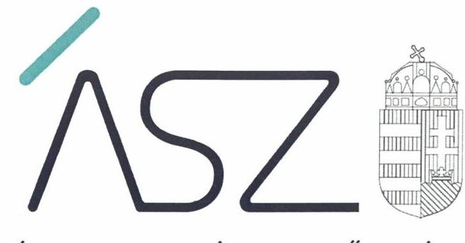
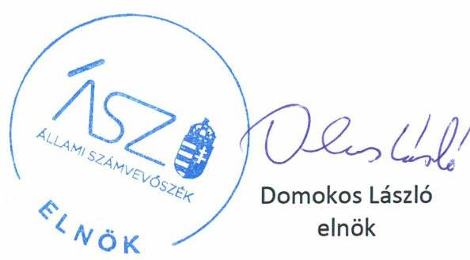
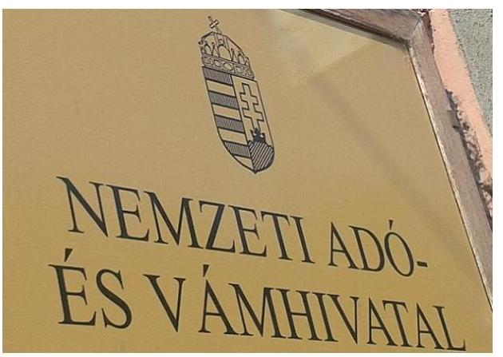
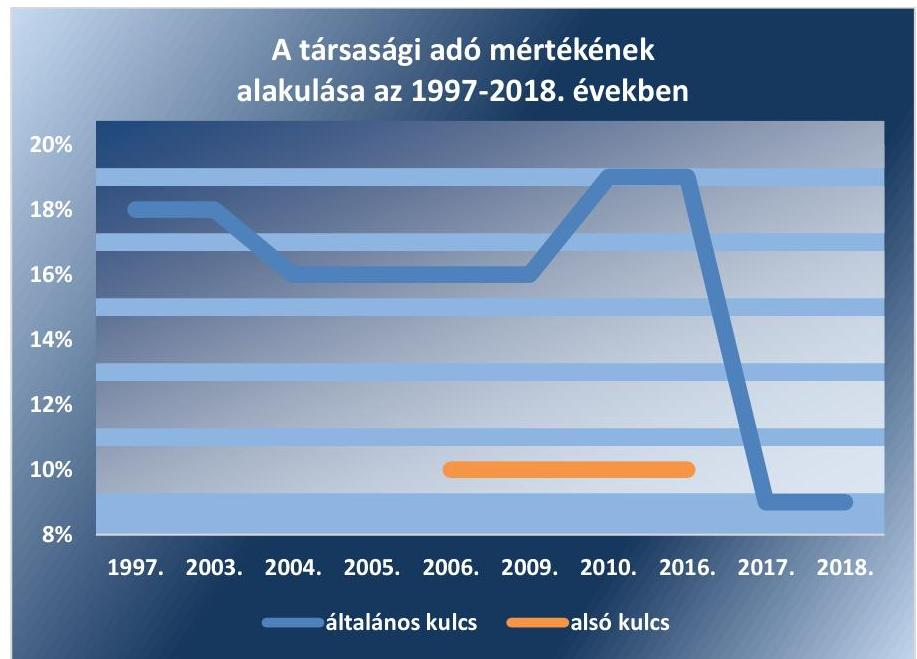

ÁLLAMI SZÁMVEVŐSZÉK

# JELENTÉS

A Nemzeti Adó- és Vámhivatal társasági adóval kapcsolatos feladatellátásának ellenőrzése

2020.

20073
www.asz.hu

---

ÁLLAMI SZÁMVEVŐSZÉK

# JELENTÉS 

A Nemzeti Adó- és Vámhivatal társasági adóval kapcsolatos feladatellátásának ellenőrzése
2020. 05. hó 06. nap

20073
www.asz.hu

---

|  | AZ ELLENŐRZÉST FELÜGYELTE: |
| :--: | :--: |
|  | PETŐ KRISZTINA felügyeleti vezető |
|  | AZ ELLENŐRZÉST VEZETTE ÉS A VÉGREHAJTÁSÁÉRT FELELŐS: |
|  | GÖRGÉNYI GÁBOR ellenőrzésvezető |
|  | A PROGRAM ÖSSZEÁLLÍTÁSÁÉRT FELELŐS: |
|  | TÓTPÁL SZABOLCS osztályvezető |
|  | A TÉMÁHOZ KAPCSOLÓDÓ KORÁBBI SZÁMVEVŐSZÉKI JELENTÉSEK: |
|  | - címe: $\quad$ Jelentés - Adóbeszedési eljárások ellenőrzése - Egyes adóbeszedési tevékenységekkel kapcsolatos feladatellátás szabályszerűségének ellenőrzése 2016. |
|  | - sorszáma: 16037 |
| Jelentéseink az Országgyúlés számítógépes hálózatán és az interneten a www.asz.hu címen is olvashatóak. | - címe: $\quad$ Jelentés a foglalkoztatási célú adó- és járulékkedvezmények igénybevételének szabályszerűségi ellenőrzéséről |
|  | - sorszáma: 15091 |
|  | - címe: $\quad$ Jelentés a NAV ellenőrzéséről - A Nemzeti Adó- és Vámhivatal hátralékkezelési és végrehajtás eljárási, valamint a kiemelt adózói körben gyakorolt tevékenysége szabályszerűségének, az EUROFISC rendszer működésének ellenőrzéséről |
|  | - sorszáma: 15044 |
|  | IKTATÓSZÁM: EL-0724-003/2020. |
|  | TÉMASZÁM: 2448 |
|  | ELLENŐRZÉS-AZONOSÍTÓ SZÁM: V0832 |

---

# TARTALOMJEGYZÉK 

■ ÖSSZEGZÉS ..... 5
■ AZ ELLENŐRZÉS CÉLJA ..... 7
■ AZ ELLENŐRZÉS TERÜLETE ..... 8
■ AZ ELLENŐRZÉS HÁTTERE, INDOKOLTSÁGA ..... 11
■ A JELENTÉS LÉNYEGES KÉRDÉSKÖREI ..... 12
■ AZ ELLENŐRZÉS HATÓKÖRE ÉS MÓDSZEREI ..... 13
■ MEGÁLLAPÍTÁSOK ..... 16
■ MELLÉKLETEK ..... 23
I. sz. melléklet: Értelmező szótár ..... 23
■ FÜGGELÉKEK ..... 25
I. sz. függelék a jelentéshez ..... 25
II. sz. függelék: Észrevételek ..... 27
■ RÖVIDÍTÉSEK JEGYZÉKE ..... 37

---

.

---

# ÖSSZEGZÉS 

A társasági adókedvezményekkel összefüggő adóhatósági feladatok végrehajtása szabályszerű és átlátható volt. Az előadó-művészeti szervezetek nem biztosították az adózók által részükre felajánlott közpénz felhasználásának átláthatóságát és elszámoltathatóságát. A visszaélések visszaszorítása érdekében indokolt volt az előadó-művészeti szervezeteket érintő támogatási rendszer átalakítása.

## Az ellenőrzés társadalmi indokoltsága

A gazdálkodó szervezetek költségvetési befizetései közül a társasági adó a legmagasabb összegű adónem, amely 2017-ben 624,9 Mrd Ft, így a központi költségvetés összes bevétele közül a negyedik legnagyobb összegű adóbevétel volt. A korábban nem ellenőrzött adónem tekintetében, annak nagyságára való tekintettel indokolt volt, hogy az Állami Számvevőszék ellenőrzés keretében értékelje az adóhatóság társasági adóval kapcsolatos feladatellátását.

2017-ben a társasági adót fizetők filmalkotás, előadó-művészeti szervezet, valamint látvány-csapatsport támogatására tehettek felajánlást. A 2017-ben 852 adózó ajánlotta fel társasági adójának meghatározott részét az előadóművészeti tevékenységet végző szervezetek támogatására. Az előadó-művészeti szervezetek részére nyújtott társasági adó támogatás közpénznek minősül, mert amennyiben ezt a gazdálkodó szervezetek nem ajánlják fel úgy közvetlenül a központi költségvetés adóbevételét képeznék. A társasági adó felajánlások 240 előadó-művészeti szervezetet érintettek, összege meghaladta a 26 Mrd Ft-ot. A társasági adó egy részét felajánló adófizetők és minden magyar állampolgár számára alapvető elvárás, hogy a közpénzt a szervezetek átlátható módon és a közélet tisztaságának elve szerint kezeljék. 2019. január 1-jétől megszűnt a társasági adóból az előadó-művészeti szervezetek támogatása. A támogatási rendszer átalakítását széles közérdeklődés kísérte. Mindezek alapján indokolt volt, hogy az Állami Számvevőszék jelen ellenőrzés keretében értékelje a társasági adóból származó felajánlások felhasználását az előadó-művészeti szervezeteknél.

## Főbb megállapítások, következtetések

A Nemzeti Adó- és Vámhivatal társasági adóval kapcsolatos feladatellátása szabályozott és szabályszerű volt. A feladatellátás kontrolljait a Nemzeti Adó- és Vámhivatal szabályszerűen kiépítette és működtette.

A Nemzeti Adó- és Vámhivatal integritás kontrollrendszere megfelelően működött.
Az előadó-művészeti szervezeteknek nyújtott társasági adó támogatás felhasználásának nyilvántartása és elszámolása az ellenőrzésre kockázati alapon kiválasztott 20 előadó-művészeti szervezet közül 10 szervezetnél nem volt szabályszerű. Ezeknél a szervezeteknél nem volt biztosított a társasági adóból származó támogatások felhasználásának ellenőrizhetősége, átláthatósága és elszámoltathatósága. Ezért nem volt igazolt, hogy a társasági adó támogatásokat a jogszabályi előírásokkal összhangban kizárólag az előadó-művészeti tevékenységgel összefüggő és az üzemeltetéshez kapcsolódó kiadásokra használták fel.

2009-től működő támogatási rendszeren belül az előadó-művészeti szervezetek részére folyósított közpénzek felhasználása nem volt szabályszerű, így nem voltak biztosítottak a hatékonyság és gazdaságosság feltételei sem. Nem volt biztosított ugyanis, hogy a társasági adót fizetők által nyújtott társasági adó támogatást visszaélésektől mentesen, kizárólag az adott célra használják fel. A támogatási rendszer által biztosított közpénzek szabályszerűen és átláthatóan történő felhasználását nem támogatta, hogy az 5 éven belül elvégzendő hatósági ellenőrzések - amelyek a szabálytalanságokat feltárhatták volna - nem évenkénti ütemezésben kerültek végrehajtásra. A számvevőszéki ellenőrzés megállapításai is megerősítik, hogy megalapozott és indokolt volt az előadó-művészeti szervezeteket érintő támogatási rendszer 2019-től történő átalakítása annak érdekében, hogy biztosított legyen az átlátható és a közélet

---

tisztaságának elve szerinti közpénzfelhasználás. Javasolt továbbá a társasági adó-kedvezményként adható egyéb támogatási formák felülvizsgálata, indokolt esetben szigorítása vagy visszaszorítása annak érdekében, hogy megvalósuljon az átlátható és szabályszerű közpénzfelhasználás.

---

# AZ ELLENŐRZÉS CÉLJA 

AZ ELLENŐRZÉS CÉLJA annak értékelése volt, hogy a NAV ${ }^{1}$ társasági adóval kapcsolatos feladatellátása megfelelő volt-e. Az ellenőrzés kiterjedt egyrészt a társasági adóval kapcsolatos egyes tevékenységek (bevallás-feldolgozás, ellenőrzések tervezése és végrehajtása, hátralékkezelés, behajtási tevékenység, adatszolgáltatások) szabályozottságának és szabályszerűségének értékelésére és ennek kapcsán a feladatok szabályszerű ellátását biztosító belső kontrollok kiépítése és működtetése megfelelőségének értékelésére, másrészt a társasági adóban érvényesíthető kedvezmények teljes köre kapcsán a NAV nyilvántartási, adatszolgáltatási, ellenőrzési tevékenysége értékelésére is.

Az ellenőrzés célja továbbá annak értékelése volt, hogy a Pest Megyei Kormányhivatal előadó-művészeti szervezeteknek nyújtott társasági adó támogatásokkal kapcsolatos feladatellátását szabályszerűen végezte-e, valamint a társasági adó támogatásban részesült előadó-művészeti szervezetek által igénybe vett társasági adó támogatás felhasználásának nyilvántartása és elszámolása szabályszerű volt-e.

---

# AZ ELLENŐRZÉS TERÜLETE 

## A NAV és a NAV társasági adóval kapcsolatos feladatellátása, a társasági adó támogatásban részesült előadó-művészeti szervezetek és a hatósági feladatokat ellátó Pest Megyei Kormányhivatal

A NAV 2011. január 1-től az APEH² és a VP³ általános jogutódjaként működik. A NAV az államháztartás központi alrendszerébe tartozó költségvetési szerv, amelynek felügyeletét az ellenőrzött időszakban a nemzetgazdasági miniszter látta el. A NAV vezetését 2015. év végéig az elnök látta el. A NAV vezetőjének feladat- és hatáskörét 2016. január 1-jétől a kijelölt miniszter irányítása alá tartozó, a Kormány rendeletében kijelölt államtitkár gyakorolja.

A NAV feladata többek között a központi költségvetés javára teljesítendő kötelező befizetés, a központi költségvetés terhére juttatott támogatás, adó-visszaigénylés vagy adó-visszatérítés megállapítása, beszedése, nyilvántartása, végrehajtása, visszatérítése, kiutalása és ellenőrzése, az adók módjára behajtandó köztartozások beszedése. A NAV végzi a közösségi és nemzeti jogszabályokban meghatározott nemzetközi adószakmai együttműködésből adódó feladatokat is.

A társasági adó a jövedelem- és nyereségadók egy fajtája, amelynek mértéke 2017-től a gazdálkodó szervezetek pozitív adóalapjának 9%-a. A társasági adó mértékének alakulását az 1. ábra szemlélteti:

1. ábra

Forrás: saját szerkesztés

---

A jövedelem- és vagyonszerzésre irányuló, vagy azt eredményező gazdasági tevékenység (vállalkozási tevékenység) alapján a Tao ${ }^{4}$ tv.-ben meghatározott előírások alapján a társasági adó kötelezettségnek a Tao tv. rendelkezései szerint kellett eleget tenni, figyelemmel az Art ${ }^{5}$. előírásaira is.

A 2017. évi adatok alapján a költségvetés összes bevétele közül az ÁFA ${ }^{6}$, az SZJA ${ }^{7}$ és a jövedéki adó után a társasági adó volt a negyedik legnagyobb adónem a mintegy 625 milliárd Ft-ot kitevő nagyságával. A társasági adó, valamint a NAV által végzett társasági adónem ellenőrzések főbb adatait az 1. táblázat tartalmazza.

1. táblázat

A TÁRSASÁGI ADÓ FŐBB ADATAI A 2015-2017. ÉVEKBEN

|   | 2015. | 2016. | 2017.  |
| --- | --- | --- | --- |
|  Társasági adó bevétel (M Ft) | 548843 | 683095 | 624945  |
|  Társasági adó bevallások száma (db) | 445763 | 431700 | 394516  |
|  NAV ellenőrzések száma (db) | 5189 | 3547 | 1083  |
|  ebből: megállapítással zárult (db) | 2411 | 1397 | 188  |
|  Megállapított adókülönbözet (M Ft) | 2557 | 1650 | 393  |
|  Jogerős ellenőrzési szankció (M Ft) | 12114 | 5032 | 749  |

A NAV adókkal, így a társasági adóval kapcsolatos elsődleges feladata a költségvetés bevételeinek biztosítása, a hátralékok beszedése és a hátralékállomány növekedésének megakadályozása.

Az előzőekkel összhangban az ellenőrzés területét képezték a társasági adóval kapcsolatos bevallás-feldolgozási, ellenőrzési, hátralékkezelési, valamint a kapcsolódó nyilvántartási és adatszolgáltatási tevékenységek, továbbá a szabályszerű feladatellátást biztosító belső kontrollrendszer és az integritás kontrollrendszer.

Az előadó-művészeti szervezetek működésével összefüggő közigazgatási hatósági és szolgáltatási feladatok ellátására a 378/2016. (XII. 2.) Korm. rendelet ${ }^{8}$ az Emtv. ${ }^{9}$ alapján a PMKH-t ${ }^{10}$ jelölte ki 2017. január 1-től. A PMKH ezeket a közfeladatokat a Nemzeti Kulturális Alap Igazgatóságától vette át. A 440/2015. (XII. 28.) Korm. rendelet ${ }^{11}$ alapján a PMKH az előadó-művészeti szervezetek támogatását követő 5 éven belül hatósági ellenőrzést folytat le, amelynek során egyebek mellett vizsgálja a Tao tv. szerint kapott támogatás, kiegészítő támogatás és adófelajánlás rendeltetésszerű felhasználását. A Pest Megyei Kormányhivatal előadó-művészeti egyesületeknél végrehajtott hatósági ellenőrzései azonban 2017-ben nem terjedtek ki a társasági adóból származó támogatások rendeltetésszerű felhasználásának ellenőrzésére.

A Tao tv. alapján 2017-ben bármely Magyarországon társasági adót fizető adózó élhetett azzal a lehetőséggel, hogy társasági adója bizonyos hányadával előadó-művészeti szervezetet támogat, és a Tao tv. 22. § (1) bekezdése szerinti közvetlenül nyújtott támogatás alapján adókedvezményt igényel, vagy a Tao tv. 24/A. §-a szerint rendelkező nyilatkozat útján, közvetett módon tesz adófelajánlást a kedvezményezett részére, amely alapján adójóváírást érvényesít.

A 2017. évben társasági adó támogatásban részesülő előadó-művészeti szervezetek közül 20 kockázatelemzés alapján kiválasztott szervezet ellen-

---

őrzésére került sor. A társasági adó támogatásban részesült előadó-művészeti szervezetek esetében az ellenőrzés területét a társasági adó támogatások felhasználásának nyilvántartása és elszámolása jelentette.

A 20 előadó-művészeti szervezet részére a NAV mintegy 8,4 Mrd Ft adófelajánlásból származó társasági adó támogatást utalt 2017-ben, míg az adókedvezményre jogosító közvetlen támogatások a 20-ból 15 szervezetnél együttesen meghaladták az 1,1 Mrd Ft-ot. További 5 szervezet nem szolgáltatott adatot a közvetlen támogatásokról. A szervezetek felsorolását és a részükre 2017-ben átutalt társasági adó támogatások összegét a 2. táblázat tartalmazza.
2. táblázat

A 2017. ÉVBEN KIUTALT TÁRSASÁGI ADÓ TÁMOGATÁSOK (FT)

|  | adókedvezményként kapott támogatás (Tao tv. 22. §) | adófelajánlás útján kapott támogatás (Tao tv. 24/A. §) |
| :--: | :--: | :--: |
| DNS-Dumaszínház ${ }^{12}$ | 0 | 445679000 |
| ICON Produkció ${ }^{13}$ | nincs adat | 593930000 |
| Táncművészetért Nkft. ${ }^{14}$ | nincs adat | 225929000 |
| Globe Production Nkft. ${ }^{15}$ | 198070000 | 1289645250 |
| Finálé Színház Nkft.
 ${ }^{16}$ | 139888000 | 300000000 |
| Eurotánc Alapítvány | 0 | 208825000 |
| Coincidance Nkft. ${ }^{17}$ | 50000000 | 75726000 |
| Esztrád Színház ${ }^{18}$ | nincs adat | 1172428500 |
| Art Anzix Színház ${ }^{19}$ | nincs adat | 568192973 |
| FREGOLI Színészegyllet ${ }^{20}$ | nincs adat | 136833500 |
| Rivalda Stúdió Nkft. ${ }^{21}$ | 309514000 | 1194869500 |
| CENTER LINE NKft. ${ }^{22}$ | 0 | 469829012 |
| Csimborasszó Nkft. ${ }^{23}$ | 113294000 | 340756800 |
| Szöveg Színház ${ }^{24}$ | 99387000 | 273701386 |
| ZIKKURAT Kft. ${ }^{25}$ | 0 | 241271000 |
| Függetlenül Egymással ${ }^{26}$ | 35421000 | 219450000 |
| Fogi Színháza ${ }^{27}$ | 26282504 | 202135000 |
| Angolnyelvű Színház ${ }^{28}$ | 0 | 153851500 |
| Hadart Nkft. ${ }^{29}$ | 0 | 140000000 |
| SOLSTICE Nkft. ${ }^{30}$ | 186466000 | 121894653 |
| összesen: | 1158322504 | 8374948074 |

Forrás: a NAV és az előadó-művészeti szervezetek adatszolgáltatásai

---

# AZ ELLENŐRZÉS HÁTTERE, INDOKOLTSÁGA 

A NAV feladatellátását érintő ellenőrzéseit az ÁSZ ${ }^{31}$ szisztematikus terv szerint, évente végzi, azokra a tevékenységi területekre fókuszálva, amelyek a korábbi ellenőrzési tapasztalatok alapján kockázatosnak bizonyultak. Az ÁSZ elmúlt időszakban végzett ellenőrzései nem fedték le sem az egyes adónemek, sem az érvényesíthető adókedvezmények, illetve az ezekkel kapcsolatos adóhatósági feladatellátás teljes körét. A korábbiakban nem ellenőrzött adónemek, így a társasági adó tekintetében is indokolt, hogy az ÁSZ ellenőrzés keretében értékelje a NAV adóbeszedéssel, -nyilvántartással, -ellenőrzéssel kapcsolatos feladatellátásának végrehajtását.

A Tao tv. alapján 2019. január 1-ig bármely Magyarországon társasági adót fizető adózó élhetett azzal a lehetőséggel, hogy társasági adója bizonyos hányadával előadó-művészeti szervezetet támogat, és a 22. § (1) bekezdésében meghatározottak szerint adókedvezményt vesz igénybe, vagy pedig a 24/A. §-ban részletezett módon, rendelkező nyilatkozat útján adófelajánlást tesz a kedvezményezett szervezet részére, amely alapján adójóváírást érvényesít. A 2017. évben ez utóbbi lehetőséggel élve 852 adózó ajánlotta fel társasági adójának meghatározott hányadát előadó-művészeti tevékenységet végző szervezetek támogatása céljából. A felajánlások összértéke meghaladta a 26 milliárd forintot, amelyen 240 előadó-művészeti szervezet osztozott. A Tao tv. 24/A. § (11) és (13) bekezdései a felajánlások teljesítését az állami adóhatóság ellenőrzési tevékenységéhez kötötték.

---

# A JELENTÉS LÉNYEGES KÉRDÉSKÖREI 

1.     - A NAV társasági adóval kapcsolatos feladatellátása szabályozott volt-e?
2.     - A feladatellátás kontrolljainak kiépítése és működtetése szabályszerű volt-e a NAV-nál?
3.     - A NAV társasági adóval kapcsolatos egyes tevékenységeinek végrehajtása szabályszerű volt-e?
4.     - Megfelelő volt-e a NAV integritás kontrollrendszere?
5.     - Az előadó-művészeti szervezetek által igénybe vett társasági adó támogatás felhasználásának nyilvántartása és elszámolása szabályszerű volt-e?

---

# AZ ELLENŐRZÉS HATÓKÖRE ÉS MÓDSZEREI 

## Az ellenőrzés típusa

Megfelelőségi ellenőrzés.

## Az ellenőrzött időszak

A NAV esetében 2015. január 1. - 2017. december 31., a PMKH és az előadó-művészeti szervezetek esetében a 2017. január 1. és 2017. december 31. közötti időszak.

## Az ellenőrzés tárgya

A NAV társasági adóval kapcsolatos feladatellátása, valamint az integritás kontrollrendszerének kiépítése, erősítése. Az adókedvezmények igénybevétele és a támogatási jogosultság ellenőrzése.

A PMKH előadó-művészeti szervezetek működésével összefüggő hatósági ellenőrzési tevékenysége. Az előadó-művészeti szervezeteknél a társasági adó támogatások felhasználásának nyilvántartása és elszámolása.

## Az ellenőrzött szervezet

A Nemzeti Adó- és Vámhivatal, a Pest Megyei Kormányhivatal, valamint a következő 20 előadó-művészeti szervezet:

1. Angolnyelvű Színház Közhasznú Alapítvány,
2. Art Anzix Színház Társadalmi, Kulturális és Művészeti Egyesület,
3. CENTER LINE SEVENTEEN BIG BAND MUSICAL Közhasznú Nonprofit Korlátolt Felelősségű Társaság,
4. Csimborasszó Művészeti Közhasznú Nonprofit Korlátolt Felelősségű Társaság,
5. DNS-Dumaszínház Kulturális Egyesület,
6. Esztrád Színház Közművelődési és Közhasznú Kulturális Egyesület,
7. Eurotánc Alapítvány,
8. Finálé Színház Közhasznú Nonprofit Korlátolt Felelősségű Társaság,
9. FREGOLI Színészegylet Kulturális Közhasznú Egyesület,
10. Függetlenül Egymással Közhasznú Egyesület,
11. Globe Production Közhasznú Nonprofit Korlátolt Felelősségű Társaság,

---

$\qquad$ 12. HAMARMŰ Hajós Magyar Művészeti Közhasznú Nonprofit Korlátolt Felelősségű Társaság (2019.02.05-ig Hadart Művészeti Közhasznú Nonprofit Korlátolt Felelősségű Társaság),
$\qquad$ 13. ICON Produkció Művészeti Oktatási és Színházi Közhasznú Egyesület (2017.02.14-ig Forrás Művészeti Oktatási és Színházi Közhasznú Egyesület),
$\qquad$ 14. Pesti Művész Színház Színházi Egyesület (2018.01.30-ig Fogi Színháza Egyesület),
$\qquad$ 15. Rivalda Stúdió Művészeti Iroda Közhasznú Nonprofit Korlátolt Felelősségű Társaság,
$\qquad$ 16. SOLSTICE Produkció Közhasznú Nonprofit Korlátolt Felelősségű Társaság (2017. április 20-ig SOLSTICE Közhasznú Nonprofit Korlátolt Felelősségű Társaság),
$\qquad$ 17. Spirit Dance Company Nonprofit Korlátolt Felelősségű Társaság (2018. április 26-ig Coincidance Nonprofit Korlátolt Felelősségű Társaság),
$\qquad$ 18. Szöveg Színház Színházi Egyesület,
$\qquad$ 19. Táncművészetért Közhasznú Nonprofit Korlátolt Felelősségű Társaság,
$\qquad$ 20. ZIKKURAT Színpadi Ügynökség Nonprofit Közhasznú Korlátolt Felelősségű Társaság

# Az ellenőrzés jogalapja 

Az ellenőrzés jogszabályi alapját az Állami Számvevőszékről szóló 2011. évi LXVI. törvény 5. § (2), (3), (5), (6) és (8) bekezdései képezték.

## Az ellenőrzés módszerei

Az ellenőrzés az ellenőrzött időszakban hatályos jogszabályok, az ellenőrzés szakmai szabályai, a jelen ellenőrzésre irányadó ÁSZ módszertanok alapján, az ÁSZ ellenőrzéseinek szakmai szabályai figyelembevételével, az ellenőrzési programban foglalt értékelési szempontok szerint történt.

Az ellenőrzés ideje alatt az ellenőrzött szervezetekkel történő kapcsolattartást az ÁSZ SZMSZ ${ }^{\text {sJ}}$-ének vonatkozó előírásai alapján biztosította az ÁSZ.

Az ellenőrzési kérdések megválaszolásához szükséges bizonyítékok megszerzése az ellenőrzöttek által rendelkezésre bocsátott dokumentumokra, adatokra alapozva megfigyelés, szemle (szemrevételezés), kérdésfeltevés (információkérés), mintavételezés, valamint elemző eljárás útján történt. Az ellenőrzési bizonyítékként felhasználható adatforrások közé tartoztak egyrészt az ellenőrzési program részletes szempontjainál felsorolt adatforrások, másrészt minden egyéb - az ellenőrzés folyamán feltárt, az ellenőrzés szempontjából információt tartalmazó - dokumentum.

Az ellenőrzés lefolytatásához az ellenőrzött szervezetek a tanúsítványok elektronikus kitöltésével, valamint az ÁSZ által kért dokumentumok

---

elektronikus megküldésével szolgáltatott adatokat, amelyek valódiságát és teljes körűségét az ellenőrzött szervezetek vezetője által tett teljességi és hitelességi nyilatkozat igazolta. Az így rendelkezésre bocsátott adatok, információk kontrollja az ellenőrzés keretében történt.

Mintavétellel ellenőrizte az ÁSZ a NAV esetében a 2015-2017. évekre vonatkozó társasági adóbevallásokkal kapcsolatos eljárási cselekmények, valamint a 2017. évre vonatkozó hátralékkezelési, fizetési könnyítési és végrehajtási tevékenységek szabályszerűségét, továbbá a NAV társasági adóval kapcsolatos adatszolgáltatási tevékenységének szabályszerűségét.

A NAV előadó-művészeti szervezetek részére történő adófelajánlásokkal, valamint társasági adó kedvezmény igénybevételére jogosító támogatásokkal kapcsolatos ellenőrzési tevékenységének ellenőrzésére a 2017. év vonatkozásában került sor.

A NAV előadó-művészeti szervezeteknek nyújtott társasági adó kedvezmény igénybevételére jogosító támogatásokkal kapcsolatos ellenőrzési tevékenységének esetében tételes ellenőrzést végzett az ÁSZ.

A NAV előadó-művészeti szervezetek részére történő adófelajánlásokkal kapcsolatos ellenőrzési tevékenységének ellenőrzését véletlen mintavétel alapján végezte az ÁSZ.

A mintavétellel ellenőrzött területek esetében minden egyes tétel vonatkozásában szabályszerűségre vonatkozó kérdéseket tett fel az ÁSZ. Szabályszerűnek értékelte az ellenőrzött területet, amennyiben 95%-os megbízhatósággal az ellenőrzött sokaságban az átlagos hibaarány legfeljebb 10% volt, nem szabályszerűnek, amennyiben 10%-nál magasabb volt.

---

# 1. A NAV társasági adóval kapcsolatos feladatellátása szabályozott volt-e? 

Összegző megállapítás

A NAV társasági adóval kapcsolatos feladatellátása szabályozott volt.

A BEVALLÁS-FELDOLGOZÁS folyamatára vonatkozó belső szabályzatokat a NAV a Bkr. ${ }^{33}$ és az Art. előírásaival összhangban kialakította. Az eljárási rendek meghatározták az elektronikusan és papír alapon érkezett bevallások érkeztetése, feldolgozása, valamint a bevallások javítása során követendő eljárás szabályait. Meghatározták továbbá a társasági adó bevallással kapcsolatos speciális szabályokat, így például a társasági adó bevallás benyújtásában akadályozott adózókra, vagy a határidőben be nem nyújtott bevallások pótlására vonatkozó szabályokat.

AZ ELLENŐRZÉSI TEVÉKENYSÉGRE vonatkozó belső szabályzatokban a Bkr. és az Art. előírásaival összhangban meghatározták az ellenőrzések tervezésére, az adózók ellenőrzésre történő kiválasztására vonatkozó folyamatokat, módszereket.

A NAV az Art. előírásai szerint tárgyév február 20-ig közzétette az ellenőrzési tevékenységről szóló tájékoztatásokat. Az ellenőrzések feldolgozására és nyilvántartására, valamint az ellenőrzést támogató ELLVITA ${ }^{34}$ rendszer használatára vonatkozó szabályokat eljárási rendek tartalmazták.

A társasági adóban érvényesíthető kedvezmények és az adóalap megállapításakor figyelembe vett jogcímek ellenőrzésére vonatkozó belső szabályozást az Art. és a Bkr. előírásaival összhangban kialakították. A társasági adóelőleg, illetve a társasági adó meghatározott részének felajánlása esetén követendő eljárást belső eljárási rendek szabályozták.

## A HÁTRALÉKKEZELÉSI, FIZETÉSI KÖNNYÍTÉSI

ÉS VÉGREHAJTÁSI TEVÉKENYSÉG szabályozását az Art. előírásaival összhangban készített eljárási rendek tartalmazták. Az eljárási rendek tartalmazták az adószámlára történő könyvelés, rendezés szabályait; a méltányossági jogkör gyakorlásának szabályait; az adómérséklés és a fizetési könnyítés engedélyezésére irányuló kérelmek elbírálása során követendő eljárásokat; valamint az elektronikus úton benyújtott fizetési kedvezményre irányuló kérelmek ügyintézésére vonatkozó eljárási rendet.

## A KÜLSŐ SZERVEK FELÉ TÖRTÉNŐ ADATSZOL-

GÁLTATÁS szabályait a NAV a Bkr. és az Art. előírásaival összhangban belső szabályzatban alakította ki. A szabályzat tartalmazta a külső szervezetek felé történő társasági adóval kapcsolatos adatszolgáltatások tartalmát, módját, gyakoriságát, határidejét és felelőseit.

---

# 2. A feladatellátás kontrolljainak kiépítése és működtetése szabályszerű volt-e a NAV-nál? 

Összegző megállapítás

A társasági adóval kapcsolatos feladatellátás kontrolljait a NAV szabályszerűen kiépítette és működtette.

A NAV az Art. és a Bkr. előírásaival összhangban belső kontroll szabályzatban ${ }^{35}$ határozta meg az egységes belső kontrollrendszerre vonatkozó szabályokat. Az ellenőrzési nyomvonalak ${ }^{36}$ teljes körűen lefedték a bevallásfeldolgozási, ellenőrzési, valamint a hátralékkezelési, fizetési könnyítési és végrehajtási tevékenységek folyamatát. Tartalmazták a hatásköri és felelősségi viszonyokat és határidőket, ezáltal biztosították, hogy utólagosan ellenőrizhető legyen a feladat végrehajtása, az esetleges felelősség megállapítása és az elszámoltathatóság.

A BEVALLÁS-FELDOLGOZÁS folyamatához kapcsolódó kontrollokat a NAV az Art. és a Bkr. előírásaival összhangban kialakította és működtette. A társasági adó bevallási űrlapok az Art. és a Tao tv. előírásaival összhangban készültek. A bevallások elektronikus kitöltését támogató kontrollok alkalmasak voltak arra, hogy kiszűrjék a számszaki hibákat és a logikai ellentmondásokat.

A költségvetés terhére nyújtott társasági adókedvezmények átláthatósága biztosított volt a NAV-nál. A bevallások feldolgozásának kontrolleljárásai biztosították az egyes társasági adókedvezményekhez kapcsolódó rendelkező nyilatkozatok meglétét. A nyilatkozatok iktatása automatikusan történt, az adókedvezmények nyilvántartása az Art.-vel összhangban zárt elektronikus szakrendszerekben történt.

AZ ELLENŐRZÉSEK folyamatával kapcsolatos tervezési, kockázatkezelési, kiválasztási kontrollok kialakítása és működtetése szabályszerű volt. A NAV az Art. és a Bkr. előírásaival összhangban kialakította és működtette a társasági adó bevallások ellenőrzésének tervezése és ellenőrzésre történő kiválasztás során alkalmazott kontrolleljárásokat, ennek keretében működtette a becslési adatbázist. Az Art. és a Bkr. előírásaival összhangban a kontrolleljárások biztosították az adózók társasági adó feltöltési kötelezettsége teljesítésének ellenőrzését.

Az ellenőrzési irányokat meghatározó tájékoztatókhoz kapcsolódóan a NAV ellenőrzés kiválasztási segédletet készített, amely a kiemelt kockázatok elemzését és az ellenőrzések tervezését támogatta. A jogelőd nélkül alakult gazdasági társaságok legalább 10%-ára vonatkozó, ellenőrzésre történő kiválasztást támogató kockázatelemzési rendszert a NAV az Art. előírásaival összhangban kialakította és működtette.

A HÁTRALÉKKEZELÉSI, FIZETÉSI KÖNNYÍTÉSI ÉS VÉGREHAJTÁSI TEVÉKENYSÉGRE vonatkozó belső kontrollok kialakítása és működtetése szabályszerű volt, a feladatok szabályszerű ellátását a részletesen kidolgozott eljárási rendek és ellenőrzési nyomvonalak támogatták. A tevékenység végrehajtását és nyomon követését elektronikus rendszerek
 támogatták.

---

# 3. A NAV társasági adóval kapcsolatos egyes tevékenységeinek végrehajtása szabályszerű volt-e? 

Összegző megállapítás

A NAV társasági adóval kapcsolatos egyes tevékenységeinek végrehajtása szabályszerű volt.

A bevallás-feldolgozási tevékenység szabályszerű volt. A társasági adó bevallásokat a NAV szabályszerűen nyilvántartásba vette. Ha a hibásan kitöltött bevallás az adózó közreműködése nélkül nem volt javítható, illetve a bevallásból, nyilatkozatokból olyan adatok hiányoztak, melyek az adóhatósági nyilvántartásban sem szerepeltek, az adózót az Art. előírásai szerint hiánypótlásra szólították fel. Az adózók társasági adó kötelezettségét, valamint az arra teljesített befizetéseket és kiutalásokat az Art. alapján az adózók adófolyószámláján tartották nyilván.

AZ ELLENŐRZÉSI TEVÉKENYSÉG szabályszerű volt. A társasági adóval kapcsolatos ellenőrzések megkezdése, lefolytatása, befejezése az Art. és a vonatkozó belső szabályozók előírásai szerint történt. Az ellenőrzésekről vezetett nyilvántartás az Art. szerint tartalmazta az ellenőrzésre történő kiválasztás módszerét és az ellenőrzés okait.

Az ellenőrzési határidőket a NAV betartotta, ellenőrzési határidő hosszabbítás esetén az Art-ban foglalt előírások szerint járt el. Az ellenőrzések alapján határozatban megállapított adókötelezettséget a határozat jogerőre emelkedését követően az adózó folyószámláján átvezették. Az ellenőrzések során tett megállapítások alapján a NAV indokolt esetben szankciókat (adóbírság, mulasztási bírság, illetve késedelmi pótlék) alkalmazott.

A társasági adókedvezmények és az adóalap-kedvezmények igénybevételéhez és elszámolásához kapcsolódó adóhatósági feladatokat a NAV szabályszerűen látta el. Az ellenőrzési irányelvek minden évben tartalmazták a társasági adókedvezmények és az adóalap megállapításakor figyelembe vehető kedvezmények igénybevételének és elszámolásának ellenőrzését. Az ellenőrzések tapasztalatait a társasági adó ellenőrzéséről készült beszámolók tartalmazták.

A NAV előadó-művészeti szervezetek részére történő adófelajánlásokkal, valamint az előadó-művészeti szervezeteknek nyújtott támogatások utáni társasági adókedvezmény igénybevételével kapcsolatos ellenőrzési tevékenysége szabályszerű volt:
$\longrightarrow$ Az adófelajánlások teljesítését megelőzően a NAV ellenőrizte a Tao tv.-ben rögzített jogszabályi feltételeket és azok betartása esetén a Tao tv.-ben meghatározott határidőben teljesítette a kifizetéseket.
$\longrightarrow$ A társasági adókedvezmények igénybevételének ellenőrzés során a NAV betartotta az Art. vonatkozó előírásait az ellenőrzések megindítására, a határidőkre, a megállapítások rögzítésére és az ellenőrzöttek tájékoztatására vonatkozóan, továbbá az adóhiány és a késedelmes megfizetés esetén kiszabható szankciók tekintetében.

---

# A HÁTRALÉKKEZELÉSI, FIZETÉSI KÖNNYÍTÉSI 

ÉS VÉGREHAJTÁSI TEVÉKENYSÉGEK végrehajtása szabályszerű volt. A behajthatatlanság vagy elévülés miatti társasági adó hátralékok törlése a jogszabályokban és a belső eljárási rendekben előírtak szerint történt. A fizetési könnyítésekre irányuló kérelmek elbírálása, a fizetési halasztás és részletfizetés engedélyezése szabályszerű volt.

A NAV a társasági adó hátralékok végrehajtása során a jogszabályokban és az eljárási rendekben foglaltak szerint járt el. Az adóhiány és a szankciók megfizetésének elmulasztása esetén a végrehajtási eljárást megindították, a végrehajtási cselekményeket dokumentálták az Art. előírásai szerint. A tartozás megfizetéséért helytállni köteles személyekkel, illetve a mögöttes felelősökkel kapcsolatban megtett intézkedések végrehajtása szabályszerűen történt.

A TÁRSASÁGI ADÓVAL KAPCSOLATOS ADATSZOLGÁLTATÁSOK szabályszerűek voltak. A NAV az Art. előírásaival összhangban határidőben és teljes körűen teljesítette a társasági adóval kapcsolatos rendszeres jellegű és eseti adatszolgáltatási kötelezettségeit a külső szervek felé.

## 4. Megfelelő volt-e a NAV integritás kontrollrendszere?

## Összegző megállapítás A NAV integritás kontrollrendszere megfelelő volt.

A NAV integritás elvű működését megfelelően támogatta a jogszabályok által előírt kontrollok kiépítettsége és működtetése. Az integritás erősítéseként a NAV stratégiai céljai között szerepelt a szervezeti kultúra javítása és a korrupció elleni fokozott fellépés. A rendszeres, korrupciós kockázatokra is kiterjedő kockázatelemzés és a jogszabályban kötelezően nem előírt kontrollok működtetése szintén hozzájárult a szervezet integritásához.

## 5. Az előadó-művészeti szervezetek által igénybe vett társasági adó támogatás felhasználásának nyilvántartása és elszámolása szabályszerű volt-e?

Összegző megállapítás A társasági adó támogatás felhasználásának nyilvántartása és elszámolása a kockázatelemzéssel kiválasztott 20 előadó-művészeti szervezet közül 10 szervezetnél nem volt szabályszerű, 10 szervezetnél szabályszerű volt.

A DNS-Dumaszínház, az ICON Produkció és a Táncművészetért Nkft. esetében a társasági adó támogatás felhasználásának nyilvántartása és elszámolása nem volt szabályszerű. A három szervezet a 440/2015. (XII. 28.) Korm. rendelet 7. § (1) bekezdésében foglaltak ellenére a társasági adó támogatások felhasználásáról nem számolt el a PMKH-nak és a 440/2015. (XII.28.) Korm. rendelet 10. § (6) bekezdésében foglaltak ellenére azokról nem vezetett elkülönített, naprakész nyilvántartást.

---

A Globe Production Nkft., a Finálé Színház Nkft., az Eurotánc Alapítvány és a Coincidance Nkft. esetében a társasági adó támogatás felhasználásának nyilvántartása és elszámolása nem volt szabályszerű. A négy szervezet a 440/2015. (XII.28.) Korm. rendelet 10. § (6) bekezdésében foglaltak ellenére a társasági adó támogatások felhasználásáról nem vezetett elkülönített, naprakész nyilvántartást.

A négy szervezet elkészítette a 440/2015. (XII. 28.) Korm. rendelet 7. § (1) bekezdés szerinti elszámolását és azt megküldte a PMKH részére. A négy szervezet az elszámolását a 440/2015. (XII. 28.) Korm. rendelet 3. melléklete alapján az összevont értékadatokról küldte meg, ugyanakkor annak alátámasztottsága és valódisága az elkülönített, naprakész nyilvántartás hiányában nem volt biztosított.

Az Esztrád Színház, az Art Anzix Színház és a FREGOLI Színészegylet az ÁSZ tv. 28. § (1)-(2) bekezdésében foglalt közreműködési kötelezettségét nem teljesítette, mivel a Ptk. ${ }^{37}$ 3:7. §-ában foglaltak ellenére a székhelyén a részére címzett jognyilatkozatok fogadását és a jogszabályban meghatározott iratainak elérhetőségét nem biztosította.

Az Esztrád Színház, az Art Anzix Színház és a FREGOLI Színészegylet a társasági adó támogatás felhasználásának a 440/2015. (XII. 28.) Korm. rendelet 7. § (1) és 10. § (6) bekezdése szerinti elszámolásáról és elkülönített, naprakész nyilvántartásáról nem bocsátott adatot az ellenőrzés rendelkezésére, ezáltal nem biztosította a támogatások felhasználásának átláthatóságát és elszámoltathatóságát. A három szervezet a társasági adóból származó támogatások szabályszerű felhasználását objektív módon, hiteles adatokkal, dokumentumokkal nem támasztotta alá, ezáltal a társasági adóból származó támogatások felhasználása nem volt szabályszerű.

A szabálytalanságok szervezetenkénti megoszlását a 2. táblázat tartalmazza:
2. táblázat

# A TÁRSASÁGI ADÓ TÁMOGATÁS FELHASZNÁLÁSÁNAK SZABÁLYTALANSÁGAI 

|  | elszámolás nem volt a 440/2015. (XII. 28.) Korm. rendelet 7. § (1) bekezdésében foglaltak ellenére | nyilvántartás nem volt a 440/2015. (XII.28.) Korm. rendelet 10. § (6) bekezdésében foglaltak ellenére | közreműködési kötelezettségének az ÁSZ tv. 28. § (1)-(8) bekezdésében foglaltak ellenére nem tett eleget |
| :--: | :--: | :--: | :--: |
| DNS-Dumaszínház | X | X |  |
| ICON Produkció | X | X |  |
| Táncművészetért Nkft. | X | X |  |
| Globe Production Nkft. |  | X |  |
| Finálé Színház Nkft. |  | X |  |
| Eurotánc Alapítvány |  | X |  |
| Coincidance Nkft. |  | X |  |
| Esztrád Színház | X | X | X |
| Art Anzix Színház | X | X | X |
| FREGOLI Színészegylet | X | X | X |

A társasági adó támogatás felhasználásának nyilvántartása és elszámolása szabályszerű volt a következő tíz előadó-művészeti szervezetnél:
— Rivalda Stúdió Nkft.
— CENTER LINE NKft.

---

$\longrightarrow$ Csimborasszó Nkft.
— Szöveg Színház
— ZIKKURAT Kft.
— Függetlenül Egymással
— Fogi Színháza
— Angolnyelvű Színház
— Hadart Nkft.
— SOLSTICE Nkft.
A felsorolt tíz szervezet a 440/2015. (XII. 28.) Korm. rendelet előírásaival összhangban elszámolt a társasági adó támogatások felhasználásáról a PMKH-nak, továbbá rendelkezett a 440/2015. (XII. 28.) Korm. rendelet szerinti elkülönített, naprakész nyilvántartással.

---

.

---

# MELLÉKLETEK 

## I. SZ. MELLÉKLET: ÉRTELMEZŐ SZÓTÁR

adóalap
adóalap csökkentő jogcímek
adókedvezmény

ÁSZ Integritás Projekt
belső kontrollrendszer
belső kontrollrendszer pillérei, kontrollterületei
integritás
integrált kockázatkezelési rendszer
társasági adó támogatás

A társasági adó alapja belföldi illetőségű adózó és külföldi vállalkozó esetében az adózás előtti eredmény, a Tao tv. által előírt korrekciós tételekkel módosított összege. (Forrás: Tao tv. 6. § (1) bekezdése)

Az adózás előtti eredményt csökkentő, a Tao tv. 7. §-ában felsorolt tényezők.
(Forrás: Tao tv. 7. § (1)-(32) bekezdések)
A számított adó, legfeljebb annak 80 százalékáig csökkenthető fejlesztési adókedvezmény címén, és az így csökkentett adóból - legfeljebb annak 70 százalékáig - érvényesíthető minden más adókedvezmény. (Nincs tehát 100 százalékos mértékű adókedvezmény; a számított adó nullára nem csökkenthető.) (Forrás: Tao tv. 23. § (2)-(3) bekezdések)
Az Állami Számvevőszék 2009-ben indította el a „Korrupciós kockázatok feltérképezése - Integritás alapú közigazgatási kultúra terjesztése" című, európai uniós forrásból megvalósított kiemelt projektjét (Integritás Projekt). Az Integritás Projekt célja, hogy felmérje a közszféra intézményei korrupciós kockázatoknak való kitettségét, illetőleg az azok mérséklésére hivatott kontrollok szintjét. Az Állami Számvevőszék a projekt révén az integritás szemlélet minél szélesebb körrel történő megismertetését, gyakorlatba ültetését kívánja elérni. Az integritás követelményeinek megfelelő szervezeti működést előnyben részesítő közigazgatási kultúra elterjesztését és a korrupció elleni fellépést az ÁSZ önmagára nézve is stratégiai jelentőségű célként fogalmazta meg. A projekt a felmérésben résztvevő intézmények számára helyzetükről egyfajta „tükörképet" mutat be, ami alapot teremt a jövőbeni pozitív irányú elmozduláshoz. (Forrás: a http://integritas.asz.hu honlapon közzétett, a 2013. évi Integritás felmérés eredményeiről készült összefoglaló tanulmány)
A belső kontrollrendszer a kockázatok kezelése és tárgyilagos bizonyosság megszerzése érdekében kialakított folyamatrendszer, amely azt a célt szolgálja, hogy a működés és gazdálkodás során a tevékenységeket szabályszerűen, gazdaságosan, hatékonyan, eredményesen hajtsák végre, az elszámolási kötelezettségeket teljesítsék, megvédjék az erőforrásokat a veszteségektől, károktól és nem rendeltetésszerű használattól. (Forrás: Áht. 69. § (1) bekezdése)
A kontrollkörnyezet, az integrált kockázatkezelési rendszer, a kontrolltevékenységek, az információs és kommunikációs rendszer, valamint a nyomon követési (monitoring) rendszer. (Forrás: Bkr. 3. §-a)
Az integritás elvek, értékek, cselekvések, módszerek, intézkedések konzisztenciáját jelenti: olyan magatartásmódot, amely meghatározott értékeknek felel meg. Az integritás a közszféra esetében a társadalom által elvárt nyilvánossági, átláthatósági, illetve jogi/etikai normáknak történő megfelelést jelenti.
Olyan folyamatalapú kockázatkezelési rendszer, amely a szervezet minden tevékenységére kiterjed, egységes módszertan és eljárások alkalmazásával, a szervezet célkitűzéseinek és értékeinek figyelembevételével biztosítja a szervezet kockázatainak teljes körű azonosítását, azok meghatározott kritériumok szerinti értékelését, valamint a kockázatok kezelésére vonatkozó intézkedési terv elkészítését és az abban foglaltak nyomon követését. (Forrás: Bkr. 2. § m) pontja)
A társasági adóról és az osztalékadóról szóló 1996. évi LXXXI. törvény 4. § 37. pontja szerinti előadó-művészeti szervezetek vonatkozásában a törvény 22. § (4) bekezdése szerinti társaságiadó-kedvezmény igénybevételére jogosító támogatás, valamint az ahhoz kapcsolódóan megfizetett kiegészítő támogatás, továbbá a törvény 24/A. §-a szerinti adófelajánlás.

---

.

---

# FÜGGELÉKEK 

## I. SZ. FÜGGELÉK A JELENTÉSHEZ

Az Állami Számvevőszék az ellenőrzések során feltárt tényekhez kapcsolódó további körülmények tisztázására eszközrendszerrel nem rendelkezik. Amennyiben az ellenőrzésen túlmutatóan indokoltnak látszik az ellenőrzés során feltárt körülmények további vizsgálata, az Állami Számvevőszék törvényi felhatalmazás alapján az ellenőrzés által feltárt körülményeket továbbítja a hatáskörről rendelkező szervnek a szükséges intézkedések megtétele, eljárások lefolytatása érdekében.

## 1.

A DNS-Dumaszínház, az ICON Produkció és a Táncművészetért Nkft. 2017. évben a 440/2015. (XII. 28.) Korm. rendelet 7. § (1) és 10. § (6) bekezdésében foglalt előírások ellenére az előadó-művészeti szervezeteknek nyújtható, a társasági adóból származó támogatások felhasználásáról nem számolt el a PMKH felé és azokról nem vezetett
 elkülönített, naprakész nyilvántartást.

Mindezek alapján a társaságoknál a 440/2015. (XII. 28.) Korm. rendelet 10. § (5) bekezdése a)-m) pontokban megjelölt jogcím szerinti költségek tekintetében a társasági adó támogatás felhasználás tilalmára vonatkozó rendelkezések érvényesülése nem igazolt.

A fentiekből következően nem biztosított a társasági adóból származó támogatások cél szerinti felhasználásának elszámoltathatósága

- DNS-Dumaszínház: 445679000 Ft
- ICON Produkció: 593930000 Ft
- Táncművészetért Nkft.: 225929000 Ft támogatás tekintetében.

Az ismertetett körülmények együttes értékelése felveti annak gyanúját, hogy a DNS-Dumaszínház, az ICON Produkció és a Táncművészetért Nkft. a társasági adó támogatást a jóváhagyott céltól eltérően használta fel és ezért a központi költségvetésnek vagyoni hátránya keletkezett.
2.

A Globe Production Nkft., a Finálé Színház, az Eurotánc Alapítvány és a Coincidance Nkft. 2017. évben a 440/2015. (XII. 28.) Korm. rendelet 10. § (6) bekezdésében foglalt előírások ellenére az előadó-művészeti szervezeteknek nyújtható, a társasági adóból származó támogatások felhasználásáról nem vezetett elkülönített, naprakész nyilvántartást.

A Globe Production Nkft., a Finálé Színház, az Eurotánc Alapítvány és a Coincidance Nkft. a 440/2015. (XII. 28.) Korm. rendelet 3. melléklete szerinti összevont értékadatokat tartalmazó elszámolását elkészítette és megküldte a PMKH részére, amelyben nyilatkozott a társasági adóból származó támogatások jogszabályban előírt módon történő felhasználásáról.

Az összevont értékadatokat tartalmazó elszámolás valódisága az elkülönített, naprakész nyilvántartás hiányában nem igazolt. A PMKH részére megküldött elszámolásban szereplő, a támogatás jogszabályban előírt módon történő felhasználására vonatkozó nyilatkozat tartalmi megfelelősége nem alátámasztott.

Mindezek alapján a társaságoknál a 440/2015. (XII. 28.) Korm. rendelet 10. § (5) bekezdése a)-m) pontokban megjelölt jogcím szerinti költségek tekintetében a társasági adó támogatás felhasználás tilalmára vonatkozó rendelkezések érvényesülése nem igazolt.

A fentiekből következően nem biztosított a társasági adóból származó támogatások cél szerinti felhasználásának elszámoltathatósága, a PMKH-nak megküldött, összevont értékadatokat tartalmazó elszámolás valódisága:

- Globe Production Nkft. 1487715250 Ft
- Finálé Színház 439888000 Ft

---

- Eurotánc Alapítvány 208825000 Ft
- Coincidance Nkft. 125726000 Ft társasági adó támogatás tekintetében.

Az ismertetett körülmények együttes értékelése felveti annak gyanúját a Globe Production Nkft., a Finálé Színház, az Eurotánc Alapítvány és a Coincidance Nkft. társaságoknál, hogy a társasági adó támogatást a jóváhagyott céltól eltérően használták fel és ezért a központi költségvetésnek vagyoni hátránya keletkezett.

A feltárt körülmények miatt az elszámolásuk és az ahhoz kapcsolódó nyilatkozatuk valódisága nem igazolt.
Az 1-2. pontban feltárt esetek további körülményeinek, a költségvetést ért vagyoni hátrány, annak mértéke felderítésére a nyomozóhatóság rendelkezik hatáskörrel.

---

A jelentéstervezetet a Számvevőszék 15 napos észrevételezésre megküldte az ellenőrzött szervezetek vezetőinek az ÁSZ tv. 29. § (1) bekezdése előírásának megfelelően.

A Nemzeti Adó- és Vámhivatal vezetője levélben jelezte, hogy a megállapításokra észrevételt nem kíván tenni. A Pest Megyei Kormányhivatal kormánybiztosa nem élt észrevételezési jogával. Az ellenőrzött 20 előadó-művészeti tevékenységet folytató szervezet vezetője közül az Art Anzix Színház Társadalmi, Kulturális és Művészeti Egyesület elnöke, a DNS-Dumaszínház Kulturális Egyesület elnöke, az Eurotánc Alapítvány elnöke, Spirit Dance Company Nonprofit Kft. ügyvezetője és a Táncművészetért Közhasznú Nonprofit Kft. ügyvezetője tett észrevételt a jelentéstervezet megállapításaira.
Az ÁSZ tv. 29. § (3) bekezdésével összhangban az Állami Számvevőszék a Függelékben feltünteti az ellenőrzés megállapításaival kapcsolatban tett, figyelembe nem vett észrevételeket, és megindokolja, hogy azokat miért nem fogadta el.

[^0]
[^0]:    * 29. § (1) Az Állami Számvevőszék az ellenőrzési megállapításait megküldi az ellenőrzött szervezet vezetőjének vagy az általa megbízott személynek, és annak, akinek személyes felelősségét állapította meg.
    (2) Az ellenőrzött szervezet vezetője és a felelősként megjelölt személy az ellenőrzés megállapításaira tizenöt napon belül írásban észrevételt tehet.
    (3) Az Állami Számvevőszék az észrevételre a beérkezésétől számított harminc napon belül írásban válaszol. A figyelembe nem vett észrevételeket köteles a jelentésben feltüntetni, és megindokolni, hogy azokat miért nem fogadta el.

---

# Az Art Anzix Színház Társadalmi, Kulturális és Művészeti Egyesület (továbbiakban: Art Anzix Színház) elnöke által 2020. március 30-án kelt levélben tett észrevétel és kezelésének indokolása 

Az Art Anzix Színház elnöke észrevételében jelezte, hogy az ÁSZ a 2019. szeptember 27. napján küldött levelében tájékoztatta az Art Anzix Színházat „A Nemzeti Adó- és Vámhivatal társasági adóval kapcsolatos feladatellátásának ellenőrzése" című ellenőrzés megkezdéséről és kérte az ellenőrzéshez szükséges támogatás megadását az Art Anzix Színház részéről. Az Art Anzix Színház elnöke észrevételében tájékoztatást adott, hogy az előbbi levélen kívül más megkeresést az ÁSZ részéről sem postai, sem elektronikus úton nem kapott a 2020. február 15-ei dátummal ellátott jelentéstervezet megérkezéséig. Az Art Anzix Színház elnöke észrevételében rögzítette, hogy az Art Anzix Színház hivatalos cégadatbázisban szereplő elérhetőségeként, az iratőrzési címként egy budapesti XIV. kerületi cím szerepel. A postával szerződésük van, hogy a székhelyükre érkező leveleket utánküldéssel a budapesti XIV. kerületi címre irányítsa át.

Az ÁSZ az észrevételt nem fogadta el a következőkre tekintettel. Az ÁSZ az EL-1014-231/2019. iktatószámon kiértesítő levelet küldött az ellenőrzött szervezet, azaz az Art Anzix Színház vezetője részére. Az ÁSZ az előbb hivatkozott levélben tájékoztatást adott arról, hogy megkezdi az Art Anzix Színháznál „A Nemzeti Adó- és Vámhivatal társasági adóval kapcsolatos feladatellátásának ellenőrzése" című ellenőrzését és egyben kérte, hogy a szükséges támogatást megadni szíveskedjen a levélben megjelölt ÁSZ munkatársak részére. Az ÁSZ a levelében egyben felhívta az Art Anzix Színház elnökének figyelmét arra is, hogy az ellenőrzés lefolytatása során az ÁSZ tv. 28. § (1)-(3) bekezdései szerinti közreműködési kötelezettség terheli. Az ÁSZ az EL-1014-231/2019. iktatószámon megküldött kiértesítő levelét a Civil szervezetek névjegyzékében megjelölt szervezet székhelye szerinti, 1044 Budapest, Üdülő sor 7. Előre állóhajó címre küldte meg. A névjegyzék a civil szervezetek bírósági nyilvántartásáról és az ezzel összefüggő eljárási szabályokról szóló 2011. évi CLXXXI. törvény 86. § (1) bekezdése szerint közhiteles. Az ÁSZ a 1044 Budapest, Üdülő sor 7. Előre állóhajó címre megküldött, EL-1014-231/2019. iktatószámú levelét a tértivevény tanúsága szerint az Art Anzix Színház elnöke 2019. október 03. napján átvette.

Az ÁSZ az ellenőrzés lefolytatásával kapcsolatban az EL-1014-098/2019. iktatószámú adatbekérő levelét megküldte az Art Anzix Színház elnöke részére, amelyet szintén a Civil szervezetek névjegyzékében megjelölt Art Anzix Színház székhelye szerinti, 1044 Budapest, Üdülő sor 7. Előre állóhajó címre postázott. Az ÁSZ adatbekérő levele azonban „nem kereste" jelzéssel postai úton visszaérkezett az ÁSZ címére. A küldemény sikertelen kézbesítését követően az ÁSZ munkatársai az Art Anzix Színház közhiteles adatbázisban szereplő székhelyén megkísérelték a helyszíni adatbetekintés lefolytatását. Az Art Anzix Színház azonban a Civil szervezetek névjegyzékében megjelölt 1044 Budapest, Üdülő sor 7. Előre állóhajó székhely szerinti címen nem volt megtalálható.

Az ÁSZ az EL-1014-306/2020. iktatószámú kísérőlevele mellékleteként az ellenőrzésről készült jelentéstervezetet megküldte észrevételezés céljából az Art Anzix Színház elnöke részére, amelyet ismételten a Civil szervezetek névjegyzékében megjelölt Art Anzix Színház székhelye szerinti, 1044 Budapest, Üdülő sor 7. Előre állóhajó címre postázott. Az ÁSZ a küldeményt első alkalommal 2020. március 05. napján adta fel, amely „nem kereste" jelzéssel visszaérkezett az ÁSZ címére. A második alkalommal a kézbesítés sikeres volt, az előbbieken hivatkozott levelet a tértivevény tanúsága az Art Anzix Színház elnöke 2020. március 30. napján átvette.

A fentiek alapján tehát az ÁSZ valamennyi levelét a közhiteles nyilvántartásban szereplő, az Art Anzix Színház székhelye szerinti, 1044 Budapest, Üdülő sor 7. Előre állóhajó címre küldte meg. Az Art Anzix Színház az ÁSZ által megküldött leveleket, az ÁSZ adatbekérő levele kivételével a hivatkozott címen átvette. A fent leírtak alapján megalapozott az a megállapítás, hogy az Art Anzix Színház közreműködési kötelezettségének az ÁSZ tv. 28. § (1)-(2) bekezdésében foglaltak ellenére nem tett eleget, mivel a Ptk. 3:7. §-ában foglaltak ellenére székhelyén a részére címzett jognyilatkozatok fogadását és a jogszabályban meghatározott iratainak elérhetőségét nem biztosította.

Az Art Anzix Színház elnöke észrevételében jelezte továbbá, hogy a PMKH részére a szükséges jelentéseket határidőben megküldte, amely alapja volt annak, hogy támogatást tudjanak befogadni. 2015. évi tevékenységüket a NAV ellenőrizte és szabálytalanságot nem tárt fel. Az Art Anzix Színház elnöke a 2017. évben beérkezett támogatások

---

listáját, és azok felhasználásáról készült jelentést, valamint a PMKH elfogadó határozatát az észrevétel mellékleteként becsatolta. Az Art Anzix Színház elnöke észrevételében kérte annak figyelembe vételét, hogy az Art Anzix Színház alkalmazottakat nem foglalkoztat, tevékenységét társadalmi munkában végzi.

Az ÁSZ az észrevételt nem fogadta el a következőkre tekintettel. Az ÁSZ az ellenőrzés során kizárólag az adatszolgáltatásra rendelkezésre álló - az ÁSZ tv. 28. § (2) bekezdés szerinti - határidőn belül beérkezett dokumentumokat veszi figyelembe, a határidőn túl megküldötteket nem értékeli. Az Art Anzix Színház az adatszolgáltatásra nyitva álló határidőben dokumentumokat nem bocsátott az ellenőrzés rendelkezésére, amelyet az észrevételben rögzítettek is megerősítenek. Az adatszolgáltatásra rendelkezésre álló törvényi határidő lejártát követően az észrevétel mellékleteként megküldött dokumentumokat az ÁSZ az ellenőrzési megállapításai megfogalmazása során nem veszi figyelembe. Az ÁSZ a jogszabályban, illetve belső szabályzatban foglaltak betartását ellenőrzi az ellenőrzött szervezet által az ellenőrzés rendelkezésére bocsátott dokumentumokra alapozva. Megállapításai megtételéhez az előbbieken kívül egyéb körülményeket, valamint más ellenőrző szerv ellenőrzési tevékenységét nem veszi figyelembe.

# A DNS-Dumaszínház Kulturális Egyesület (továbbiakban: DNS-Dumaszínház) elnöke által 2020. március 10-én kelt levélben tett észrevétel és kezelésének indokolása 

A DNS-Dumaszínház elnöke észrevételében jelezte, hogy az ellenőrzés rendelkezésére bocsátotta a DNS-Dumaszínház vonatkozásában a PMKH felé megküldött 2017. évi beszámolót az azt elfogadó határozatot. DNS-Dumaszínház elnöke szerint a hivatkozott dokumentumoknak az ÁSZ Elektronikus Adatbekérési Rendszerébe történő feltöltése során adminisztrációs hiba történhetett. Észrevételéhez mellékletként csatolta a társasági adó felhasználásának elszámolásával kapcsolatos dokumentumokat, továbbá az előadó-művészeti tevékenységből származó 2016. évi jegybevételek analitikáját, a 2017. évben hatályos számviteli politikát és számlarendet.

A DNS-Dumaszínház elnökének észrevételét az ÁSZ nem fogadta el. Az ÁSZ az ellenőrzési megállapításait az ellenőrzött időszakban hatályos jogszabályok és az ellenőrzött szervezet közreműködési kötelezettsége keretében, az ellenőrzött szervezet által rendelkezésre bocsátott, Teljességi és hitelességi nyilatkozattal alátámasztott dokumentumokra alapozva fogalmazza meg. A DNS-Dumaszínház elnöke által aláírt, 2019. augusztus 26-án kelt Teljességi és hitelességi nyilatkozatban foglaltak szerint az átadott dokumentumok, adatok megbízhatóak, az ÁSZ által bekért adatokra, dokumentumokra vonatkozóan teljes körű információt tartalmaznak. A DNS-Dumaszínház elnöke az átadott dokumentumok, adatok hitelességéért, valódiságáért, hiánytalanságáért teljes felelősséget vállalt. Az ÁSZ a megállapításainak megfogalmazásánál az adatszolgáltatáson kívül, így a 15 napos észrevételezés keretében megküldött dokumentumokat nem értékeli.

A 440/2015. (XII. 28.) Korm. rendelet 7. § (1) bekezdése értelmében a társasági adó támogatásban részesülő előadóművészeti szervezet a társasági adó támogatás rendeltetésszerű felhasználásáról a 3. mellékletben meghatározottak szerint számol el a kijelölt szervnek. A 440/2015. (XII. 28.) Korm. rendelet 10. § (6) bekezdése előírja, hogy a támogatott előadó-művészeti szervezet
 köteles a társasági adó támogatás felhasználásáról elkülönített, naprakész nyilvántartást vezetni.

Az észrevételben hivatkozott „PMKH-nak küldött beszámoló 2017. évben igénybevett TAO támogatás felhasználásáról" megnevezésű dokumentumhoz tartozó „Nyilatkozat_tamogatasiszerzodesek.pdf" nevű fájl az ÁSZ Elektronikus Adatbekérési Rendszerébe 2019. augusztus 23. 11:27:21 órakor került feltöltésre. A hivatkozott fájl azonban nem a beszámolót tartalmazta, hanem az elnökségi tag nyilatkozatát arra vonatkozóan, hogy a DNS-Dumaszínház a 2017. év folyamán nem részesült a 440/2015. (XII. 28.) Korm. rendelet 4. § (3) bekezdése szerinti társaságiadó-kedvezmény igénybevételére jogosító támogatásban, illetve, hogy a támogatások teljes egésze adófelajánlásként érkezett. A 2019. augusztus 26-án kelt Teljességi és hitelességi nyilatkozat szerint a DNS-Dumaszínház a fentebb hivatkozott dokumentumon kívül mindössze két dokumentumot bocsátott az ÁSZ rendelkezésére. A „Nyilatkozatok.pdf" elnevezésű fájl a DNS-Dumaszínház elnökének az európai uniós versenyjogi értelemben vett állami támogatásokkal kapcsolatos eljárásról és a regionális támogatási térképről szóló 37/2011. (III. 22.) Korm. rendelet 6. § (4a) bekezdés szerinti nyilatkozatát (hogy a társaság nem minősül a hivatkozott rendelet szerinti nehéz helyzetben lévő vállalkozásnak) és a 440/2015. (XII. 28.) Korm. rendelet 6. § (3) bekezdés e) pontja szerinti nyilatkozatát tartalmazta (arra vonatkozóan, hogy a társasággal szemben nincs teljesítetlen visszafizetési felszólítás olyan korábbi európai bizottsági határozat nyomán, amely valamely támogatás jogellenesnek, és a belső piaccal összeegyeztethetetlennek nyilvánította).

A „Színházi TAO jelentés - 20160101000000 - 20161231235959.pdf" elnevezésű fájl pedig a DNS-Dumaszínház előadó-művészeti tevékenységből származó 2016. évi jegybevételek analitikáját tartalmazta. A DNS-Dumaszínház az észrevételben hivatkozott, a PMKH felé elektronikusan megküldött beszámoló elfogadásáról szóló határozat dokumentumát nem küldte meg az ÁSZ részére, ilyen dokumentumot a 2019. augusztus 26-án kelt, DNS-Dumaszínház elnöke által aláírt Teljességi és hitelességi nyilatkozat sem tartalmazott.

Az ÁSZ 2019. augusztus 15-én kelt EL-1014-114/2019. ikt.sz. adatbekérő levél 3. sz. melléklet „Dokumentumjegyzék" szerint kérte továbbá a 2017. évi társasági adó támogatások felhasználásával kapcsolatos elkülönített nyilvántartás vezetését igazoló dokumentumok, valamint a 2017. január 1. és 2017. december 31. között hatályos, a számvitelről szóló 2000. évi C. törvény 161. § (1)-(2) bekezdéseinek megfelelő számlarend megküldését. A DNS-Dumaszínház a 2017. évi társasági adó támogatások felhasználásáról az elkülönített nyilvántartás vezetését dokumentumokkal nem támasztotta alá.

Az észrevételben hivatkozott, a PMKH felé megküldött elszámolás és az azt elfogadó közigazgatási hatósági határozat beküldésük esetén sem lennének alkalmasak a 440/2015. (XII. 28.) Korm. rendelet 10. § (6) bekezdése szerinti elkülönített nyilvántartás naprakész vezetésének alátámasztására.

Az előzőek alapján a DNS-Dumaszínház a 2017. évi társasági adóból származó támogatások cél szerinti felhasználásának jogszabályi előírások szerinti nyilvántartását és elszámolását dokumentumokkal nem igazolta, ezért a jelentés megállapításainak módosítása nem volt indokolt.

# Az Eurotánc Alapítvány elnöke által 2020. március 20-án kelt levélben tett észrevétel és kezelésének indokolása 

Az Eurotánc Alapítvány elnöke észrevételében jelezte, hogy az Eurotánc Alapítvány rendelkezik naprakész, átlátható, és a felhasználás valódiságát igazoló nyilvántartással a társasági adó felajánlások tekintetében. Nyilvántartják a költségek részletezését és a felhasználás eredményeként megvalósult kulturális célokhoz tartozó háttérdokumentumokat. Elismerte, hogy téves értelmezés miatt csak az összesített mérleget csatolták. Az Eurotánc Alapítvány elnöke észrevétele szerint a jelentéstervezet Függelékében tett súlyos negatív megállapítások további nyilatkoztatással, hiánypótlással elkerülhetők lettek volna. A támogatási összegek elszámolása a jogszabályi rendelkezéseknek megfelelően történt, az azokhoz kapcsolódó nyilatkozatok, dokumentumok alapján ellenőrizhető, a felhasználás valódisága alátámasztott. Visszautasítja, hogy a költségvetést bármilyen hátrány érte volna. Kérte a társasági adóból származó támogatások felhasználásáról vezetett nyilvántartás hiányára, az elszámolás valódiságára vonatkozó megállapítás törlését.

Az ÁSZ az észrevételt nem fogadta el a következőkre tekintettel. Az ÁSZ az ellenőrzés során kizárólag az adatszolgáltatásra rendelkezésre álló - az ÁSZ tv. 28. § (2) bekezdés szerinti - határidőn belül beérkezett dokumentumokat veszi figyelembe, a határidőn túl megküldötteket, így az észrevétele mellékleteként megküldött dokumentumokat nem értékeli. Az ÁSZ tv. 28. § (2) bekezdése szerint, a közreműködésre felhívott szervezet az ÁSZ részére - annak kérésére soron kívül, de legkésőbb öt munkanapon belül - az ellenőrzés tervezhetősége, meghatározása, illetve lefolytatása érdekében szükséges adatokat és dokumentumokat rendelkezésre bocsátja, illetve a kapcsolódó tájékoztatást köteles megadni.

Az Eurotánc Alapítvány elnöke észrevételében elismerte, hogy az adatszolgáltatás során az Eurotánc Alapítvány nem adta át az ÁSZ részére az EL-1014-106/2019. iktatószámú adatkérő levél 3. számú mellékletében kért, a támogatások felhasználásának elkülönített nyilvántartását igazoló dokumentumokat. Az ÁSZ a honlapján nyilvánosan elérhető Ellenőrzési alapelvek - A számvevőszéki ellenőrzés általános alapelvei módszertani útmutatójának 4.2 pontja szerint az ellenőrzési bizonyítékok azok a tények, adatok, információk és dokumentumok, amelyeken az ellenőrzési megállapítások, következtetések, vélemények alapulnak. Az ÁSZ honlapján szintén nyilvánosan elérhető az ÁSZ ellenőrzései során felhasználandó bizonyítékokról szóló módszertani útmutató, amely rögzíti, hogy az ellenőrzött szervezettől felhasznált bizonyíték az adatbekérés során bekért hiteles adatok és dokumentumok. Mindezek alapján az észrevételhez papír alapon megküldött dokumentumokat az ÁSZ nem veszi figyelembe.

# A Spirit Dance Company Nonprofit Kft. (továbbiakban: Spirit Dance Kft.) ügyvezetője által 2020. március 31-én kelt levélben tett észrevétel és kezelésének indokolása 

A Spirit Dance Kft. észrevételében jelezte, hogy a Spirit Dance Company Nonprofit Korlátolt Felelősségű Társaság, 2018. április 26-ig Coincidance Nonprofit Korlátolt Felelősségű Társaság a 440/2015. (XII. 28.) Korm. rendelet 7. § (1) bekezdésében előírtaknak megfelelően a támogatás rendeltetésszerű felhasználásáról a 3. mellékletben meghatározottak szerint beszámolt a kijelölt szervnek. A PMKH a beszámolót elfogadta, az ellen kifogással nem élt, a beszámolóval kapcsolatos további ellenőrzéseket nem végzett. Álláspontjuk szerint mivel a felügyeleti szerv nem állapított meg működési szabálytalanságot a Spirit Dance Kft.-nél, ezért az ÁSZ sem juthatott a jelentéstervezetben foglalt következtetésre. Az észrevétel rögzíti, hogy amennyiben a Spirit Dance Kft. a kapott támogatásokat nem a megengedett célokra használta volna fel akkor a PMKH a szükséges lépéseket megtette volna. Mivel azonban ilyen lépésekre nem került sor, ez a tény önmagában igazolja, hogy a támogatások felhasználása szabályszerűen történt. Az észrevételben jelezték továbbá, hogy a Spirit Dance Kft. a 440/2015. (XII. 28.) Korm. rendelet 10. § (6) bekezdésének megfelelően a társasági adó támogatás felhasználásáról elkülönített, naprakész nyilvántartást vezetett és a dokumentumokat megőrizte. A Spirit Dance Kft. rendelkezik valamennyi, a jogszabály által előírt nyilvántartással, kimutatással, továbbá a könyvelése is megfelelt a vonatkozó jogszabályi előírásoknak. A Spirit Dance Kft. rendelkezik olyan külön nyilvántartással is, amely tartalmazza az elszámolásban szereplő „összesen sorok" tételes alábontását is. Ezen nyilvántartást az ÁSZ nem kérte benyújtani. Az észrevételben megfogalmazottak szerint a 440/2015. (XII. 28.) Korm. rendelet nem fejti ki részletesen mit ért elkülönített nyilvántartáson és nem határozza meg, hogy az elkülönített nyilvántartásnak milyen tartalmi és formai követelményeknek kell eleget tennie. Az előbbiek miatt a Spirit Dance Kft. részéről az észrevétel mellékleteként megküldött dokumentumot megfelelőnek kell tekintetni. A Spirit Dance Kft. észrevételében kifogásolta, hogy a jelentéstervezet nem fejti ki, hogy mi alapján jutott az abban foglalt megállapításokra. Az észrevétel szerint a megállapítások között ok-okozati összefüggés nincs. Túlzónak tartja a nyilvántartási problémából annak a következtetésnek a levonását, amely a teljes támogatási összeg tekintetében megkérdőjelezi az elszámolás valódiságát.

Az ÁSZ a Spirit Dance Kft. észrevételét nem fogadta el a következőkre tekintettel. Az ÁSZ nem vitatta, hogy a Spirit Dance Kft. megküldte a 440/2015. (XII. 28.) Korm. rendelet 7. § (1) bekezdés szerinti elszámolását a PMKH részére, amelyet megállapításai között is rögzített. Ugyanakkor az ellenőrzés megállapította, hogy a 440/2015. (XII. 28.) Korm. rendelet 10. § (6) bekezdésében foglaltak ellenére a társasági adó támogatások felhasználásáról nem vezettek elkülönített, naprakész nyilvántartást. Elkülönített, naprakész nyilvántartás hiányában pedig nem volt biztosított a 440/2015. (XII. 28.) Korm. rendelet 3. melléklete alapján összeállított és az összevont értékadatokról megküldött elszámolás alátámasztottsága és valódisága. Az ÁSZ a jogszabályban, illetve belső szabályzatban foglaltak betartását ellenőrzi az ellenőrzött szervezet által az ellenőrzés rendelkezésére bocsátott dokumentumokra, valamint az ellenőrzött szervezet vezetőjének nyilatkozataira alapozva. Az ÁSZ a megállapítások megtételéhez az előbbieken kívül egyéb körülményeket, valamint más ellenőrző szerv ellenőrzési tevékenységét nem veszi figyelembe.

Az ÁSZ az EL-1014-110/2019. iktatószámú adatbekérő levelének 3. melléklet 6. pontja tartalmazza a társasági adó támogatások felhasználásával kapcsolatos elkülönített nyilvántartás vezetését igazoló dokumentumok bekérését. Az ÁSZ az ellenőrzési megállapításait az adatszolgáltatás során a részére törvényi határidőben rendelkezésre bocsátott dokumentumokra alapozva fogalmazza meg. Az adatbekéréshez kiállított vezetői teljességi és hitelességi nyilatkozatuk szerint az ÁSZ részére átadott dokumentumok, adatok megbízhatóak, és a bekért adatokra, dokumentumokra vonatkozóan teljes körű információt tartalmaznak. Az adatszolgáltatás során, valamint a teljességi és hitelességi nyilatkozatuk alapján a társasági adó támogatások felhasználásával kapcsolatos elkülönített nyilvántartás vezetését igazoló dokumentumokat nem bocsátottak az ÁSZ ellenőrzés rendelkezésére. Az ÁSZ az ellenőrzés során kizárólag az adatszolgáltatásra rendelkezésre álló - az ÁSZ tv. 28. § (2) bekezdés szerinti - határidőn belül beérkezett dokumentumokat veszi figyelembe, a határidőn túl megküldött, így az észrevételhez mellékelt dokumentumot nem értékeli.

Az ÁSZ adatbekérése során és a vezetői teljességi és hitelességi nyilatkozatuk alapján a társasági adó támogatások felhasználásával kapcsolatos elkülönített nyilvántartás vezetését igazoló dokumentumokat nem bocsátottak az ellenőrzés rendelkezésére. Az előbbiek alapján az ellenőrzés megállapította, hogy a 440/2015. (XII. 28.) Korm. rendelet 10. § (6) bekezdésében foglaltak ellenére a társasági adó támogatások felhasználásáról nem vezettek elkülönített, naprakész nyilvántartást. Elkülönített, naprakész nyilvántartás hiányában nem volt biztosított a 440/2015. (XII. 28.) Korm. rendelet 3. melléklete alapján összeállított és az összevont értékadatokról megküldött elszámolás alátámasztottsága és valódisága.

A Spirit Dance Kft. észrevételében jelezte, hogy a megállapítások konkrét tényekkel, példákkal nem kerültek alátámasztásra, ezáltal nem látják azokat megalapozottnak. A Spirit Dance Kft. számára nem egyértelmű, hogy milyen ellenőrzési eljárással ellenőrizte az ÁSZ a Spirit Dance Kft. nyilvántartásait és az sem, hogy történt-e mintavétel. A Spirit Dance Kft. észrevételében rögzítette, hogy az ÁSZ helyszíni ellenőrzés hiányában nem tudta ellenőrizni a Spirit Dance Kft. digitális és papír alapú nyilvántartásait. A Spirit Dance Kft. észrevételében rögzítette, hogy a jelentéstervezet nem felel meg az általános ellenőrzési alapelveknek.

Az ÁSZ a Spirit Dance Kft. észrevételét nem fogadta el a következőkre tekintettel. A jelentéstervezet a megállapítások formájában konkrét tényeket közöl, amelyek jogszabályi hivatkozással alátámasztottak. Az ÁSZ ellenőrzés módszereit a jelentéstervezet Ellenőrzés hatóköre és módszerei fejezete tartalmazzák. Az ellenőrzés módszerei fejezet többek közt tartalmazza, hogy az ellenőrzés milyen módszerek alapján került lefolytatásra, az ellenőrzési kérdések megválaszolásához szükséges bizonyítékok megszerzése hogyan történt, illetve a mintavételezés milyen módszertan alapján zajlott, mely területekre vonatkozott és milyen szempontok szerint került értékelésre. Az ÁSZ ellenőrzési megállapításait a részére megküldött dokumentumok (bizonyítékok) alapján fogalmazza meg. A papír alapú és a digitális nyilvántartások kinyomtatott verziójának adatszolgáltatás során történő feltöltése megoldható lett volna, hisz az észrevételeket
 tartalmazó levélhez is mellékelni tudtak digitális rendszerből előállított dokumentumot. A nyilvántartások ellenőrzéséhez helyszíni ellenőrzés lefolytatása nem szükséges. Az előbbieken túlmenően az ÁSZ az EL-1014110/2019. iktatószámú adatbekérő levelének 2. oldal 4. bekezdésében jelezte az ellenőrzött szervezet vezetője részére, hogy amennyiben az elektronikus úton történő adatszolgáltatás lehetőségével nem kíván, vagy nem tud élni, azt soron kívül jelezze a megadott elérhetőségek egyikén. Ezzel kapcsolatos jelzés a Spirit Dance Kft. részéről nem érkezett.

A jelentéstervezet az ÁSZ Ellenőrzési alapelvek - A számvevőszéki ellenőrzés általános alapelveiben rögzítettek figyelembe vételével és azok maradéktalan betartásával készült. A jelentéstervezet következtetései tárgyilagosak, jól érthetőek, bizonytalanságtól és kétértelműségtől mentesek. A jelentéstervezetben foglalt megállapítások és következtetések független és objektív értékelést, információt nyújtanak és a háttér-összefüggéseket is bemutatják. A jelentéstervezet közérthető, lényegre törő és informatív. Az előbbieket bizonyítja többek közt, hogy a jelentéstervezet a megállapítások formájában konkrét, az ellenőrzés rendelkezésére bocsátott dokumentumokon alapuló tényeket közöl, amelyek jogszabályi hivatkozásokkal alátámasztottak.

A Spirit Dance Kft. észrevételében jelezte továbbá, hogy a jelentéstervezet mindössze egyetlen megállapítást tartalmaz, hogy a Spirit Dance Kft. nem vezetett elkülönített, naprakész nyilvántartást, a megállapítás nincs alátámasztva. A további következtetések pedig téves megállapításból kerültek levezetésre, így azok nem helytállóak. A jelentéstervezet továbbá nem tartalmazza azt a logikai összefüggést, amely kifejtené, miből vonta le az ÁSZ azt a következtetést, hogy a Spirit Dance Kft. nem rendelkezett nyilvántartással. A Spirit Dance Kft. észrevételében rögzítette, hogy az ÁSZ, Spirit Dance Kft.-ra nézve leghátrányosabb megállapítása, a Spirit Dance Kft. részéről utólag okirati bizonyítékokkal alátámasztottan téves, megalapozatlan feltételezésen alapult. A Spirit Dance Kft. jelezte, hogy a Spirit Dance Kft. részéről megküldött nyilvántartások, kimutatások megfelelnek a jogszabályi előírásoknak. A társasági adó támogatás felhasználása a jóváhagyott célnak megfelelően történt, a központi költségvetésnek vagyoni hátránya nem keletkezett. A Spirit Dance Kft. elszámolása és az ahhoz kapcsolódó nyilatkozatok valódiak.

---

Az ÁSZ a Spirit Dance Kft. észrevételét nem fogadta el a következőkre tekintettel. A nyilvántartások hiányával és az abból következő további megállapítások megtételével kapcsolatos részletes indoklást a korábban leírtak részletesen tartalmazzák. Kiemelendő, hogy az ÁSZ részére az adatszolgáltatás során nem adtak át olyan dokumentumot (bizonyítékot), amely azt igazolja, hogy a társasági adó támogatások felhasználásáról elkülönített, naprakész nyilvántartást vezettek az ellenőrzött időszakban. Ennek következtében az összevont értékadatokat tartalmazó elszámolás valódisága az elkülönített, naprakész nyilvántartás hiányában nem igazolt. A PMKH részére megküldött elszámolásban szereplő, a támogatás jogszabályban előírt módon történő felhasználására vonatkozó nyilatkozat tartalmi megfelelősége nem alátámasztott.

# A Táncmúvészetért Közhasznú Nonprofit Kft. (továbbiakban: Táncmúvészetért Nkft.) ügyvezetője által 2020. március 13-án kelt levélben tett észrevétel és kezelésének indokolása 

A Táncművészetért Nkft. észrevételében jelezte, hogy a Táncművészetért Nkft. az ÁSZ adatszolgáltatásra vonatkozó felhívását a Táncművészetért Nkft. székhelyszolgáltatója vette át. A székhelyszolgáltató az adatszolgáltatásra nyitva álló öt munkanapos határidőt követően adta át az adatokat a Táncművészetért Nkft. részére, ezért a Táncművészetért Nkft. az adatszolgáltatási felhívásnak nem tudott eleget tenni. Az adatszolgáltatási határidő lejártát követően a Táncművészetért Nkft. eleget kívánt tenni adatszolgáltatási kötelezettségének, azonban azt a tájékoztatást kapta, hogy nincs mód a feltöltésre vonatkozó tárhely újra megnyitására. Ezt követően a Táncművészetért Nkft. elektronikus úton a kapcsolattartásra megadott e-mail címre megküldte a székhelyszolgáltató igazolását, illetve kérte az adatszolgáltatás teljesítésének biztosítását. A Táncművészetért Nkft. postai úton is megküldte a dokumentumokat az ellenőrzés lefolytatás érdekében.

Az ÁSZ az észrevételt nem fogadta el a következőkre tekintettel. Az ÁSZ tv. 28. § (2) bekezdése szerint a közreműködésre felhívott szervezet az ÁSZ részére - annak kérésére soron kívül, de legkésőbb öt munkanapon belül - az ellenőrzés tervezhetősége, meghatározása, illetve lefolytatása érdekében szükséges adatokat és dokumentumokat rendelkezésre bocsátja, illetve a kapcsolódó tájékoztatást köteles megadni. Az ÁSZ EL-1014-104/2019. iktatószámú adatbekérő levelét a tértivevény tanúsága szerint 2019. augusztus 21. napján vették át. Az ÁSZ tv. 28. § (2) bekezdésében előírt határidőt figyelembe véve az adatszolgáltatásra 2019. augusztus 28. napjáig volt lehetőség. A Táncművészetért Nkft. az adatszolgáltatásra nyitva álló határidőben dokumentumokat nem bocsátott az ÁSZ rendelkezésére.

A cégnyilvánosságról, a bírósági cégeljárásról és a végelszámolásról szóló 2006. évi V. törvény (továbbiakban: Ctv.) 7. § (1) bekezdése szerint a cég székhelye a cég bejegyzett irodája. A bejegyzett iroda a cég levelezési címe, az a hely, ahol a cég üzleti és hivatalos iratainak átvétele, érkeztetése, őrzése, rendelkezésre tartása, valamint ahol a külön jogszabályban meghatározott, a székhellyel összefüggő kötelezettségek teljesítése történik. Az előbbiekben hivatkozott jogszabályhely rögzíti továbbá, hogy amennyiben a cég székhelye nem azonos a központi ügyintézés helyével, a központi ügyintézés helyét a létesítő okiratában és a cégjegyzékben fel kell tüntetni. A cégkivonata szerint a Táncművészetért Nkft. székhelye 8000 Székesfehérvár, Budai út 14. A cégkivonat arra vonatkozó információt nem tartalmaz, hogy a cég székhelye nem azonos a központi ügyintézés helyével. Az ÁSZ az EL-1014-104/2019. iktatószámú adatbekérő levelét a Ctv. 7. § (1) bekezdése alapján a Táncművészetért Nkft. székhely szerinti címére küldte meg.

Az ÁSZ az ellenőrzés során kizárólag az adatszolgáltatásra rendelkezésre álló - az ÁSZ tv. 28. § (2) bekezdés szerinti határidőn belül beérkezett dokumentumokat veszi figyelembe, a határidőn túl megküldötteket nem értékeli. Az előbbiek szerint az adatszolgáltatásra rendelkezésre álló törvényi határidő lejártát követően elektronikusan a nav@asz.hu e-mail címre, illetve ezt követően papír alapon megküldött dokumentumokat az ÁSZ az ellenőrzési megállapításai megfogalmazása során nem vette figyelembe. Az ÁSZ a honlapján nyilvánosan elérhető Ellenőrzési alapelvek - A számvevőszéki ellenőrzés általános alapelvei módszertani útmutatójának 4.2. pontja szerint az ellenőrzési bizonyítékok azok a tények, adatok, információk és dokumentumok, amelyeken az ellenőrzési megállapítások, következtetések, vélemények alapulnak. Az ÁSZ honlapján szintén nyilvánosan elérhető az ÁSZ ellenőrzései során felhasználandó bizonyítékokról szóló módszertani útmutató, amely rögzíti, hogy az ellenőrzött szervezettől felhasznált bizonyíték az adatbekérés során bekért hiteles adatok és dokumentumok.

---

Az ÁSZ a Táncművészetért Nkft. részéről 2019. szeptember 16-án postára adott papír alapú dokumentumokkal kapcsolatban az EL-1014-226/2019. iktatószámú levelében tájékoztatta a Táncművészetért Nkft.-t, hogy a teljes küldeményt visszaküldi, mivel azok nem az adatszolgáltatási határidőn (2019. augusztus 22. - 2019. augusztus 28.) belül kerültek megküldésre.

A Táncművészetért Nkft. ügyvezetője észrevételében jelezte, hogy az ÁSZ a Táncművészetért Nkft. társasági adó támogatás felhasználásának nyilvántartásával és elszámolásával kapcsolatos megállapítását a Táncművészetért Nkft. részéről rendelkezésre bocsátott iratok mellőzésével és a PMKH támogatást elfogadó határozataival ellentétesen fogalmazta meg. A Táncművészetért Nkft. ügyvezetője észrevételében rögzítette, hogy a Táncművészetért Nkft. minden évben elszámolt a PMKH-val. A Táncművészetért Nkft. a társasági adó támogatás felhasználásáról szabályszerű nyilvántartással rendelkezett, arról a PMKH-nak jogszabály szerint beszámolt. A Táncművészetért Nkft. ügyvezetője tájékoztatott továbbá, hogy a határozatok és az észrevételhez mellékelt egyéb iratok a PMKH-nál elérhető dokumentumok. A Táncművészetért Nkft. ügyvezetője észrevételében hivatkozott az ÁSZ Ellenőrzési alapelvek - A számvevőszéki ellenőrzés általános alapelvei módszertani útmutatójának 4.2. pontjára és tájékoztatott, hogy a Táncművészetért Nkft. a szabályos működésére vonatkozóan megfelelő bizonyítékot szolgáltatott, ezért nem ért egyet a jelentéstervezetben rögzített megállapításokkal. A Táncművészetért Nkft. ügyvezetője ismételten csatolta a szabályszerű működést igazoló dokumentumokat az észrevétele mellékleteként.

Az ÁSZ az észrevételt nem fogadta el a következőkre tekintettel. Az ÁSZ az ellenőrzési megállapításait az adatszolgáltatás során a részére törvényi határidőben rendelkezésre bocsátott dokumentumokra alapozva fogalmazza meg. A Táncművészetért Nkft. az adatszolgáltatásra nyitva álló határidőben dokumentumokat nem bocsátott az ellenőrzés rendelkezésére, amelyet az észrevételben rögzítettek is megerősítenek.

Az ÁSZ a honlapján nyilvánosan elérhető Ellenőrzési alapelvek - A számvevőszéki ellenőrzés általános alapelvei módszertani útmutatójának 4.2. pontja szerint a számvevőszéki jelentésben foglalt megállapítások, következtetések, illetve a számvevőszéki vélemény vagy záradék alátámasztására az ellenőrzést végző személynek elegendő és megfelelő bizonyítékot kell szereznie. Az ÁSZ honlapján szintén nyilvánosan elérhető az ÁSZ ellenőrzései során felhasználandó bizonyítékokról szóló módszertani útmutató, amely rögzíti, hogy az ellenőrzött szervezettől felhasznált bizonyíték az adatbekérés során bekért hiteles adatok és dokumentumok. Az előzőekben leírtak alapján az ÁSZ az ellenőrzés során kizárólag az adatszolgáltatásra rendelkezésre álló - az ÁSZ tv. 28. § (2) bekezdés szerinti - határidőn belül beérkezett dokumentumokat veszi figyelembe, értékeli ki és a kiértékelés alapján teszi meg a megállapításait. A határidőn túl megküldött dokumentumokat nem értékeli.

A Táncművészetért Nkft. ügyvezetője észrevételében hivatkozott az ÁSZ tv. 28. § (4) bekezdésére és jelezte, hogy az ÁSZ gyakorlata, miszerint postai úton keresi meg az ellenőrzött szervezeteket, majd egy korlátozott ideig rendelkezésre álló elektronikus adatszolgáltatási rendszeren való kommunikációt ír elő, amely az elektronikus ügyintézés és a bizalmi szolgáltatások általános szabályairól szóló 2015. évi CCXXII. törvény (a továbbiakban: Eüsztv.) rendelkezéseinek nem felel meg. A Táncművészetért Nkft. ügyvezetője rögzítette továbbá, hogy a Táncművészetért Nkft. rendelkezik az Eüsztv. szerinti elektronikus kapcsolattartásra szolgáló hivatalos elérhetőséggel. A Táncművészetért Nkft. ügyvezetője észrevételében hivatkozott továbbá az ÁSZ Ellenőrzési alapelvek - A számvevőszéki ellenőrzés általános alapelvei módszertani útmutatójának 3.5.4. pontjára. Álláspontja szerint az ÁSZ eljárása, miszerint az ellenőrzött szervezet számára nem biztosított a kétoldalú, hatékony kommunikáció, illetve nem biztosított az ellenőrzési dokumentumok hiánypótlásának lehetősége, nem felel meg az Ellenőrzési alapelveknek. Az észrevételben jelezték továbbá, hogy az adatszolgáltatásra nyitva álló határidőt követően, postai úton megküldött ellenőrzési dokumentumokat az ÁSZ nem értékelte és az adatszolgáltatási kötelezettség nem teljesítése a Táncművészetért Nkft.-én kívül álló ok miatt nem történt meg. A késedelemről való tudomásszerzést követően haladéktalanul felvette a kapcsolatot az ÁSZ-szal és az ÁSZ rendelkezésére bocsátotta az adatszolgáltatás során bekért dokumentumokat.

Az ÁSZ az észrevételt nem fogadta el a következőkre tekintettel. Az Eüsztv. 1. § 17a. pontja rendelkezik arról, hogy mely szervezetek kötelesek elektronikus ügyintézést biztosítani. A törvény nem nevesíti az ÁSZ-t ezen szervezetek között. A központi államigazgatási szervekről, valamint a Kormány tagjai és az államtitkárok jogállásáról szóló 2010. évi XLIII. törvény 1. §-a értelmében az ÁSZ nem államigazgatási szerv. Továbbá az ÁSZ nem tartozik az Eüsztv. 1. § 17. pontjának b)-f), k) és l) alpontjai között felsorolt szervezetek közé sem. Az ÁSZ jogállását és hatáskörét az ÁSZ tv. 1-2. §-a rögzíti, amely alapján az ÁSZ nem hatóság.

Az ÁSZ azonban biztosítja az ÁSZ tv. 28. § (4) bekezdése szerinti elektronikus úton történő kapcsolattartást. Az elektronikus úton történő kapcsolattartás - amelyet az EL-1014-104/2019. iktatószámú adatbekérő levélben is jeleztünk a Táncművészetért Nkft. részére, illetve amelyre az észrevételben foglaltak is hivatkoznak - az adatszolgáltatás keretében, az Elektronikus Adatszolgáltatási Rendszer felületén keresztül valósul meg. Elektronikus kapcsolattartás lehetősége továbbá az adatbekérő levélben jelzett és a Táncművészetért Nkft. ügyvezetője által is hivatkozott nav@asz.hu e-mailcímen biztosított volt.

Az ÁSZ a kétirányú kommunikációt ÁSZ Ellenőrzési alapelvek - A számvevőszéki ellenőrzés
 általános alapelveinek megfelelően biztosította elektronikus és postai úton egyaránt, amelyről az EL-1014-104/2019. iktatószámú adatbekérő levélben e-mailcím és postacím feltüntetése mellett tájékoztattuk a Táncművészetért Nkft.-t. Az észrevételben jelzett ellenőrzési dokumentumok hiánypótlására sem a hivatkozott Ellenőrzési alapelvek, sem az ÁSZ tv. nem biztosít lehetőséget.

Az ÁSZ a Táncművészetért Nkft. részéről 2019. szeptember 16-án postára adott papír alapú dokumentumokkal kapcsolatban az EL-1014-226/2019. iktatószámú levelében tájékoztatta a Táncművészetért Nkft.-t, hogy a teljes küldeményt visszaküldi, mivel azok nem az adatszolgáltatási határidőn (2019. augusztus 22. - 2019. augusztus 28.) belül kerültek megküldésre. Az ÁSZ az ellenőrzés során kizárólag az adatszolgáltatásra rendelkezésre álló - az ÁSZ tv. 28. § (2) bekezdés szerinti - határidőn belül beérkezett dokumentumokat veszi figyelembe, a határidőn túl megküldötteket nem értékeli.

---

.

---

# RÖVIDÍTÉSEK JEGYZÉKE 

${ }^{1}$ NAV
${ }^{2}$ APEH
${ }^{3} \mathrm{VP}$
${ }^{4}$ Tao tv.
${ }^{5}$ Art
${ }^{6}$ ÁFA
${ }^{7}$ SZJA
${ }^{8}$ 378/2016. (XII. 2.) Korm. rendelet
${ }^{9}$ Emtv.
${ }^{10}$ PMKH
${ }^{11}$ 440/2015. (XII. 28.) Korm. rendelet
${ }^{12}$ DNS-Dumaszínház
${ }^{13}$ ICON Produkció
${ }^{14}$ Táncművészetért Nkft.
${ }^{15}$ Globe Production Nkft.
${ }^{16}$ Finálé Színház Nkft.
${ }^{17}$ Coincidance Nkft.
${ }^{18}$ Esztrád Színház
${ }^{19}$ Art Anzix Színház
${ }^{20}$ FREGOLI Színészegylet
${ }^{21}$ Rivalda Stúdió Nkft.
${ }^{22}$ CENTER LINE NKft.
${ }^{23}$ Csimborasszó Nkft.
${ }^{24}$ Szöveg Színház
${ }^{25}$ ZIKKURAT Kft.
${ }^{26}$ Függetlenül Egymással
${ }^{27}$ Fogi Színháza
${ }^{28}$ Angolnyelvű Színház

Nemzeti Adó- és Vámhivatal
Adó- és Pénzügyi Ellenőrzési Hivatal
Vám- és Pénzügyőrség
1996. évi LXXXI. törvény a társasági adóról és az osztalékadóról (hatályos: 1996. november 15-től)
2003. évi XCII. törvény az adózás rendjéről (hatályos: 2004. január 1-jétől) általános forgalmi adó
személyi jövedelemadó
378/2016. (XII. 2.) Korm. rendelet egyes központi hivatalok és költségvetési szervi formában működő minisztériumi háttérintézmények felülvizsgálatával összefüggő jogutódlásáról, valamint egyes közfeladatok átvételéről (hatályos: 2016. december 3-tól)
2008. évi XCIX. törvény - az előadó-művészeti szervezetek támogatásáról és sajátos foglalkoztatási szabályairól (hatályos: 2009. március 1-jétől)
Pest Megyei Kormányhivatal
440/2015. (XII. 28.) Korm. rendelet - az előadó-művészeti szervezetek támogatását biztosító igazolások kiállításáról, felhasználásáról, a támogatható szervezetek köréről, a támogatás elszámolásának és ellenőrzésének, valamint visszafizetésének szabályairól (hatályos: 2015. december 29-től)
DNS-Dumaszínház Kulturális Egyesület
ICON Produkció Művészeti Oktatási és Színházi Közhasznú Egyesület
Táncművészetért Közhasznú Nonprofit Korlátolt Felelősségű Társaság
Globe Production Közhasznú Nonprofit Korlátolt Felelősségű Társaság
Finálé Színház Közhasznú Nonprofit Korlátolt Felelősségű Társaság
Coincidance Nonprofit Korlátolt Felelősségű Társaság (2018. április 26-ig),
Spirit Dance Company Nonprofit Korlátolt Felelősségű Társaság (2018. április 26-tól)
Esztrád Színház Közművelődési és Közhasznú Kulturális Egyesület
Art Anzix Színház Társadalmi, Kulturális és Művészeti Egyesület
FREGOLI Színészegylet Kulturális Közhasznú Egyesület
Rivalda Stúdió Művészeti Iroda Közhasznú Nonprofit Korlátolt Felelősségű Társaság
CENTER LINE SEVENTEEN BIG BAND MUSICAL Közhasznú Nonprofit Korlátolt Felelősségű Társaság
Csimborasszó Művészeti Közhasznú Nonprofit Korlátolt Felelősségű Társaság
Szöveg Színház Színházi Egyesület
ZIKKURAT Színpadi Ügynökség Nonprofit Közhasznú Korlátolt Felelősségű Társaság
Függetlenül Egymással Közhasznú Egyesület
Fogi Színháza Egyesület (2018. január 30-ig),
Pesti Művész Színház Színházi Egyesület (2018. január 30-tól)
Angolnyelvű Színház Közhasznú Alapítvány

---

${ }^{29}$ Hadart Nkft.
${ }^{30}$ SOLSTICE Nkft.
${ }^{31}$ ÁSZ
${ }^{32}$ ÁSZ SZMSZ
${ }^{33} \mathrm{Bkr}$.
${ }^{34}$ ELLVITA
${ }^{35}$ belső kontroll szabályzat
${ }^{36}$ ellenőrzési nyomvonalak
${ }^{37}$ Ptk.

Hadart Művészeti Közhasznú Nonprofit Korlátolt Felelősségű Társaság (2019. február 5-ig);
HAMARMÚ Hajós Magyar Művészeti Közhasznú Nonprofit Korlátolt Felelősségű Társaság (2019. február 5-től)
SOLSTICE Produkció Közhasznú Nonprofit Korlátolt Felelősségű Társaság (2017. április 20-ig SOLSTICE Közhasznú Nonprofit Korlátolt Felelősségű Társaság) Állami Számvevőszék
Az Állami Számvevőszék elnökének 4/2017. (XII.29.) ÁSZ utasítása az Állami Számvevőszék Szervezeti és Működési Szabályzatáról (hatályos: 2018. december 31-ig)
Az Állami Számvevőszék elnökének 2/2018. (XII.28.) ÁSZ utasítása az Állami Számvevőszék Szervezeti és Működési Szabályzatáról (hatályos: 2019. január 1-jétől)
Az Állami Számvevőszék elnökének 3/2019. (XII. 23.) ÁSZ utasítása az Állami Számvevőszék Szervezeti és Működési Szabályzatáról (hatályos: 2020. január 1-jétől)
370/2011. (XII. 31.) Korm. rendelet a költségvetési szervek belső kontrollrendszeréről és belső ellenőrzéséről (hatályos: 2012. január 1-jétől)
Ellenőrzés és Vizsgálatszervezés Támogató rendszer
A Nemzeti Adó- és Vámhivatal elnöke által kiadott 2124/2014. szabályzat a Nemzeti Adó- és Vámhivatal egységes belső kontrollrendszeréről, A Nemzeti Adó- és Vámhivatal vezetője által kiadott 2160/2016/VEZ szabályzat a Nemzeti Adó- és Vámhivatal egységes belső kontrollrendszeréről, A Nemzeti Adó- és Vámhivatal vezetője által kiadott 2072/2017/VEZ szabályzat a Nemzeti Adó- és Vámhivatal egységes belső kontrollrendszeréről szóló 2160/2016/VEZ szabályzat módosításáról
A Nemzeti Adó- és Vámhivatal elnöke által kiadott 2140/2014. szabályzat a Nemzeti Adó- és Vámhivatal Központi Hivatalának ellenőrzési nyomvonaláról, szabálytalanság- és kockázatkezelési felelősének kijelöléséről (hatályos: 2014. november 27-től);
A Nemzeti Adó- és Vámhivatal vezetője által kiadott 2160/2016/VEZ szabályzat a Nemzeti Adó- és Vámhivatal egységes belső kontrollrendszeréről című szabályzat 1. melléklet - A NAV szervek ellenőrzési nyomvonala (hatályos: 2016. november 14-től);
A Nemzeti Adó- és Vámhivatal vezetője által kiadott 2072/2017/VEZ szabályzat a Nemzeti Adó- és Vámhivatal egységes belső kontrollrendszeréről szóló 2160/2016/VEZ szabályzat módosításáról címú szabályzat 1. melléklet - A Nemzeti Adó- és Vámhivatal Központi Irányításának ellenőrzési nyomvonala (hatályos: 2017. szeptember 19-től)
2013. évi V. törvény - a Polgári Törvénykönyvről (hatályos: 2014. március 15-től)

---

# ASZ 

ÁLLAMI SZÁMVEVŐSZÉK
1052 Budapest, Apáczai Cs. J. u. 10. I 1364 Budapest 4. Pf. 54 TEL: +36 14849100
email: szamvevoszek@asz.hu
web: www.asz.hu | www.aszhirportal.hu

