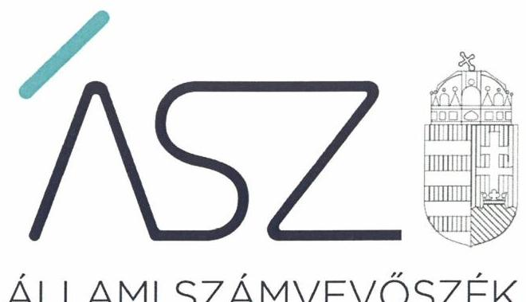
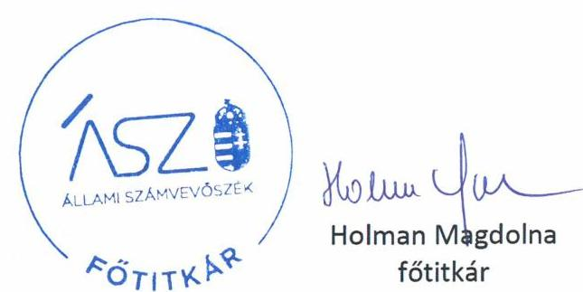

ÁLLAMI SZÁMVEVŐSZÉK

# JELENTÉS 

## Pártok gazdálkodása

A költségvetési támogatásban részesülő pártok 2017-2018. évi gazdálkodása törvényességének ellenőrzése az Együtt - a Korszakváltók Pártja "f.a."-nál

2020.

20074
www.asz.hu

---

ÁLLAMI SZÁMVEVŐSZÉK

# JELENTÉS 

Pártok gazdálkodása

A költségvetési támogatásban részesülő pártok 2017-2018. évi gazdálkodása törvényességének ellenőrzése az Együtt - a Korszakváltók Pártja "f.a."-nál
2020. 05. hó 21. nap

20074
www.asz.hu

---

# AZ ELLENŐRZÉST FELÜGYELTE: 

DR. BENEDEK MÁRIA felügyeleti vezető

## AZ ELLENŐRZÉST VEZETTE ÉS A VÉGREHAJTÁSÁÉRT FELELŐS:

DR. PELLEI TAMÁS ellenőrzésvezető

## A PROGRAM ÖSSZEÁLLÍTÁSÁÉRT FELELŐS:

BERTALAN RUDOLF ellenőrzési program készítéséért felelős vezető

IKTATÓSZÁM: EL-2593-001/2020.
TÉMASZÁM: 2520
ELLENŐRZÉS-AZONOSÍTÓ SZÁM: V086405
Jelentéseink az Országgyűlés számítógépes hálózatán és az interneten a www.asz.hu címen is olvashatóak.

---

# TARTALOMJEGYZÉK 

■ ÖSSZEGZÉS ..... 5
■ AZ ELLENŐRZÉS CÉLJA ..... 6
■ AZ ELLENŐRZÉS TERÜLETE ..... 7
■ AZ ELLENŐRZÉS HÁTTERE, INDOKOLTSÁGA ..... 8
■ A JELENTÉS LÉNYEGES KÉRDÉSKÖRE ..... 9
■ AZ ELLENŐRZÉS HATÓKÖRE ÉS MÓDSZEREI ..... 10
■ MEGÁLLAPÍTÁSOK ..... 12
■ JAVASLATOK ..... 13
■ MELLÉKLETEK ..... 15
I. sz. melléklet: Értelmező szótár ..... 15
■ FÜGGELÉKEK ..... 17
I. sz. függelék a jelentéshez ..... 17
II. sz. függelék: Észrevételek ..... 20
■ RÖVIDÍTÉSEK JEGYZÉKE ..... 21

---

.

---

# ÖSSZEGZÉS 

A felszámolás alatt álló Együtt - a Korszakváltók Pártja elszámolási kötelezettségét nem teljesítette, ezért a közpénzek felhasználása, valamint a céljaira rendelt vagyon jogszerű használata nem volt átlátható és elszámoltatható. Az elszámoltathatóság hiánya miatt nem álltak fenn a törvényes gazdálkodáshoz és a közpénzek törvényes felhasználásához szükséges feltételek, a közérdek védelme nem volt biztosított.

## Az ellenőrzés társadalmi indokoltsága

A pártok az állampolgárok egyesülési szabadsága alapján létrehozott olyan szervezetek, amelyek kereteket nyújtanak a népakarat kialakításához és kinyilvánításához, a politikai életben való állampolgári részvételhez.

A politikai élet tisztasága érdekében törvény állapítja meg a pártok vagyonára és gazdálkodására vonatkozó szabályokat. Az egyesülési jog alapján létrejövő más szervezetekhez képest szűkebb körben határozza meg azt a gazdasági tevékenységet, amelyet a párt végezhet, biztosítja azonban a pártok részére azt a jogosultságot, hogy az állami költségvetésből támogatásban részesüljenek. A pártok gazdálkodását a politikai élet tisztasága érdekében rendszeresen indokolt ellenőrizni, ezért törvényi előírás alapján az Állami Számvevőszék a költségvetési támogatást kapott pártok gazdálkodását kétévente ellenőrzi. A gazdálkodás szabályszerűségének, a felhasznált közpénzek nagyságának bemutatásával a társadalom objektív képet alkothat a pártok működéséről.

A pártokkal szembeni társadalmi elvárás a törvényt tisztelő, jogkövető magatartás, mivel a párt képviselői a jogállamiságot megtestesítő törvényhozó hatalom részei. Mindezekre tekintettel fokozott társadalmi veszélyességet hordoz egy párt elszámoltathatóságának hiánya, elszámolási kötelezettségének nem teljesítése.

## Főbb megállapítások, következtetések, javaslatok

Az Együtt - a Korszakváltók Pártja „felszámolás alatt" a 2017. évi pénzügyi kimutatását a Magyar Közlöny mellékletét képező Hivatalos Értesítőben úgy tette közzé, hogy azt az Országos Politikai Tanács, mint a párt erre jogosult döntéshozó testülete nem fogadta el. Az Együtt - a Korszakváltók Pártja „felszámolás alatt" a 2018. évre vonatkozó pénzügyi kimutatását nem tette közzé a Magyar Közlöny mellékletét képező Hivatalos Értesítőben.

Az Együtt - a Korszakváltók Pártja „felszámolás alatt" gazdálkodása nem volt törvényes, elszámoltatható és átlátható. A jogszabályokban rögzített elszámoltathatóság társadalmi relevancia, a közérdek kiszolgálásának alapvető eleme. Az elszámolási kötelezettség megsértése és az elszámoltathatóság hiánya miatt a párt nem igazolta, hogy a költségvetési támogatásokhoz kapcsolódó törvényi előírásokat betartotta és a közpénzekkel törvényesen, a nyilvánosság számára is átlátható módon gazdálkodott.

Az Állami Számvevőszék az intézkedések megtétele céljából az Együtt - a Korszakváltók Pártja „felszámolás alatt" képviselője részére egy javaslatot fogalmazott meg.

---

# AZ ELLENŐRZÉS CÉLJA 

AZ ELLENŐRZÉS CÉLJA annak értékelése, hogy az Együtt - a Korszakváltók Pártja „felszámolás alatt" által közzétett pénzügyi kimutatások a törvényi előírásoknak megfeleltek-e, a könyvvezetés és gazdálkodás során betartották-e a vonatkozó jogszabályi és belső előírásokat; az Együtt - a Korszakváltók Pártja „felszámolás alatt" a működéséhez szabályszerűen igénybe vehető forrásokat használt-e fel.

---

# AZ ELLENŐRZÉS TERÜLETE 

## Együtt - a Korszakváltók Pártja „felszámolás alatt"

Az Együtt - a Korszakváltók Pártja „felszámolás alatt" 2013. július 5-én létrejött olyan egyesület, amely nyilvántartott tagsággal rendelkezett, és a nyilvántartásba vételét végző bíróság előtt kinyilvánította, hogy a Párttörvény ${ }^{1}$ rendelkezéseit magára nézve kötelezőnek ismeri el a Párttörvény 1. §-ában foglaltak alapján.

Az Együtt - a Korszakváltók Pártja „felszámolás alatt" döntéshozó testületei a küldöttgyűlés, az országos politikai tanács és az elnökség. Az Együtt - a Korszakváltók Pártja „felszámolás alatt" az ellenőrzött időszakban nem módosította Alapszabályát², ezért a 2013. évi CLXXVII. törvény³ 11. § (1) bekezdésének előírásait figyelembe véve, a Ptk. ${ }^{4}$-val összefüggésben a létesítő okiratának tartalmi felülvizsgálatára nem volt kötelezett. Az Együtt - a Korszakváltók Pártja „felszámolás alatt" 2014. május 27-én alapította meg az Együtt Magyarországért Alapítványt, amely 2015-ben vette fel a Váradi András nevet.

Az Együtt - a Korszakváltók Pártja „felszámolás alatt" a 2017. évben 133,6 M Ft, a 2018. évben 45,9 M forint központi költségvetési támogatásban részesült.

Az Együtt - a Korszakváltók Pártja „felszámolás alatt" 2018. június 2-án megtartott küldöttgyűlésén döntött a saját feloszlatásáról, és 2018. szeptember 6-án a Fővárosi Törvényszéken ${ }^{5}$ felszámolási eljárás megindítása iránti kérelmet terjesztett elő. A Törvényszék felszámolást elrendelő végzése 2019. január 18-án jogerőre emelkedett, a felszámolási eljárás 2019. március 5-én kezdődött meg.

---

# AZ ELLENŐRZÉS HÁTTERE, INDOKOLTSÁGA 

Az ÁSZ tv. ${ }^{6}$ 5. § (11) bekezdés a) pontja, valamint a Párttörvény 10. § (1) bekezdése alapján a pártok gazdálkodása törvényességének ellenőrzésére az ÁSZ ${ }^{7}$ jogosult. Törvényi előírás szerint az ÁSZ kétévente ellenőrzi azoknak a pártoknak a gazdálkodását, amelyek rendszeres költségvetési támogatásban részesültek.

Az ÁSZ legutóbb az Együtt - a Korszakváltók Pártja 2015-2016. évi gazdálkodásának törvényességét ellenőrizte.

A gazdálkodás szabályszerűségének, a felhasznált közpénzek nagyságának bemutatásával a társadalom objektív képet alkothat a pártok működéséről. Az ellenőrzés megállapításai a gazdálkodás megfelelőségének bemutatásával elősegíthetik, hogy a törvényalkotók konkrét lépéseket tegyenek a pártok finanszírozására vonatkozó szabályozások megváltoztatása, átláthatóbbá, ellenőrizhetőbbé tétele irányába. Az ellenőrzés rámutat a pártok gazdálkodásával kapcsolatos jó gyakorlatokra és szabálytalanságokra. A hiányosságok, szabálytalanságok feltárása, az ennek kapcsán megfogalmazott megállapítások elősegíthetik a törvényi rendelkezések megsértésének szankcionálását.

---

# A JELENTÉS LÉNYEGES KÉRDÉSKÖRE 

Az Együtt - a Korszakváltók Pártja ,,felszámolás alatt" gazdálkodásának törvényessége biztosított volt-e?

---

# AZ ELLENŐRZÉS HATÓKÖRE ÉS MÓDSZEREI 

## Az ellenőrzés típusa

Szabályszerűségi ellenőrzés.

## Az ellenőrzött időszak

2017-2018. évek

## Az ellenőrzés tárgya

Az Együtt - a Korszakváltók Pártja „felszámolás alatt" ellenőrzése során az ellenőrzés tárgyát képezték a 2017. és a 2018. évre vonatkozó pénzügyi kimutatás elkészítésére, jóváhagyására, közzétételére, a párt könyvvezetésére, gazdálkodására, ennek keretében a számviteli szabályozás kialakítására, a bizonylati rend, bizonylati fegyelem betartására, egyéb gazdálkodási, ellenőrzési és pénzügyi-számviteli informatikai feladatok ellátására irányuló tevékenységek. Az ellenőrzés tárgya volt még a források elszámolása és felhasználása, valamint a vagyon jogszabályi előírásoknak megfelelő hasznosítása.

Az ellenőrzés kiterjedt minden olyan körülményre és adatra, amely az ÁSZ jogszabályban meghatározott feladatainak teljesítéséhez, valamint a program végrehajtása folyamán felmerült újabb összefüggések feltárásához szükséges.

## Az ellenőrzött szervezet

Együtt - a Korszakváltók Pártja „felszámolás alatt"

## Az ellenőrzés jogalapja

Az ellenőrzés jogalapját az ÁSZ tv. 5. § (11) bekezdés a) pontja, a Párttörvény 4. § (4)-(5) bekezdései, valamint 10. § (1), (3)-(4) bekezdései képezték.

## Az ellenőrzés módszerei

Az ÁSZ ellenőrzésre az ellenőrzési program szempontjai, az ellenőrzött időszakban hatályos jogszabályok, az ellenőrzés általános szakmai szabályai, az ellenőrzésre irányadó ÁSZ módszertanok figyelembevételével került sor.

---

Az ellenőrzés ideje alatt az Együtt - a Korszakváltók Pártja „felszámolás alatt" képviselőjével történő kapcsolattartást az ÁSZ SZMSZ ${ }^{\text {® }}$-ének vonatkozó előírásai alapján biztosította az ÁSZ.

Az ellenőrzés céljának eléréséhez szükséges bizonyítékok megszerzése az Együtt - a Korszakváltók Pártja „felszámolás alatt" képviselője által rendelkezésre bocsátott dokumentumokra, adatokra alapozva közvetlen, részletes elemzés, megfigyelés, szemrevételezés, információkérés, megerősítés, valamint elemző eljárás útján történt. Az ellenőrzési bizonyítékként felhasználható adatforrások közé tartoztak egyrészt az ellenőrzési program részletes szempontjainál felsorolt adatforrások, másrészt minden egyéb - az ellenőrzés folyamán feltárt, az ellenőrzés szempontjából információt tartalmazó - dokumentum.

Az ellenőrzés lefolytatásához az Együtt - a Korszakváltók Pártja „felszámolás alatt" képviselője az ÁSZ által kért dokumentumok megküldésével szolgáltatott adatokat, amelyek valódiságát és teljes körűségét az Együtt - a Korszakváltók Pártja „felszámolás alatt" képviselője által tett teljességi és hitelességi nyilatkozatnak kellett igazolnia. A rendelkezésre bocsátott adatok, információk kontrollja az ellenőrzés keretében történt.

Amennyiben az Együtt - a Korszakváltók Pártja „felszámolás alatt" működését és gazdálkodását alapvetően meghatározó dokumentum hiánya miatt, valamely lényeges kérdéskörre vonatkozóan az ÁSZ megállapítást tett, további ellenőrzési tevékenységek az adott kérdéskörrel és az azzal szoros logikai kapcsolatban lévő kérdéskörökkel - ráépülő jelleggel - nem kerültek végrehajtásra.

---

# MEGÁLLAPÍTÁSOK 

## Az Együtt - a Korszakváltók Pártja „felszámolás alatt" gazdálkodásának törvényessége biztosított volt-e?

Összegző megállapítás Az Együtt - a Korszakváltók Pártja „felszámolás alatt" gazdálkodásának törvényessége nem volt biztosított.

Az Együtt ${ }^{9}$ a Párttörvény rendelkezése alapján a 2017. évi pénzügyi kimutatását a Magyar Közlöny mellékletét képező Hivatalos Értesítőben 2018. május 31-én úgy tette közzé, hogy az Alapszabály 7.8. pontjának előírása ellenére a pénzügyi kimutatás tervezetét annak elfogadása előtt a Számvizsgáló bizottság nem véleményezte és a pénzügyi kimutatást az Alapszabály 5.1 pont b) és 10.12. pontjának előírása ellenére az Országos Politikai Tanács nem fogadta el.

Az Együtt a Párttörvény 9. § (1) bekezdésében foglaltak ellenére a 2018. évre vonatkozó pénzügyi kimutatását 2019. május 31-ig a Magyar Közlöny mellékletét képező Hivatalos Értesítőben és a saját honlapján nem tette közzé.

Mindezek alapján az Együtt a Párttörvény 4-6. §-aiban előírt elszámolási kötelezettségét sem a 2017. évben, sem a 2018. évben nem teljesítette, az elszámoltathatóságot nem biztosította.

---

# JAVASLATOK 

Az ÁSZ tv. 33. § (1) bekezdésében foglaltak értelmében az ellenőrzött szervezet vezetője köteles a jelentésben foglalt megállapításokhoz kapcsolódó intézkedési tervet összeállítani és azt a jelentés kézhezvételétől számított 30 napon belül az ÁSZ részére megküldeni. Amennyiben az ellenőrzött szervezet vezetője nem küldi meg határidőben az intézkedési tervet, vagy továbbra sem elfogadható intézkedési tervet küld, az Állami Számvevőszék elnöke az ÁSZ tv. 33. § (3) bekezdés a) és b) pontjaiban foglaltakat érvényesítheti.

## A felszámolóbiztos részére

1. Intézkedjen a jogszabályi előírásoknak megfelelően az elszámolási kötelezettség teljesítéséről.
(jelentéstervezet 12. oldal 1-3. bekezdései alapján)

---

.

---

# MELLÉKLETEK 

- I. SZ. MELLÉKLET: ÉRTELMEZŐ SZÓTÁR
pénzügyi kimutatás
költségvetési támogatás
nem pénzbeli támogatás

A Párttörvény 9. § (1) bekezdésében meghatározott, a törvény 1. számú melléklete szerinti pénzügyi kimutatás (hatályos 2014. május 6-ától), amelyet a pártok kötelesek minden év május 31-ig a Magyar Közlönyben, valamint saját honlappal rendelkező pártok a honlapjukon is közzétenni.
Az államháztartás alrendszerei terhére nyújtott pénzbeli vagy nem pénzbeli juttatás, amelyet a támogató nem elsősorban ellenszolgáltatás ellenében, de konkrét program megvalósítása vagy meghatározott időszakban a támogatott szervezet működtetése érdekében nyújt. (Civil tv. ${ }^{10}$ 2. § 15. pont)
Vagyoni értékkel rendelkező forgalomképes dolog, szellemi alkotás, illetve vagyoni értékű jog

 részben vagy egészében, véglegesen vagy ideiglenesen, teljesen vagy részben ingyenesen történő átruházása vagy átengedése, illetve szolgáltatás biztosítása. (Civil tv. 2. § 25. pont)

---

.

---

# FÜGGELÉKEK 

- I. SZ. FÜGGELÉK A JELENTÉSHEZ

Az Állami Számvevőszék az ellenőrzések során feltárt tényekhez kapcsolódó további körülmények tisztázására eszközrendszerrel nem rendelkezik. Amennyiben az ellenőrzésen túlmutatóan indokoltnak látszik az ellenőrzés során feltárt körülmények további vizsgálata, az Állami Számvevőszék törvényi felhatalmazás alapján az ellenőrzés által feltárt körülményeket továbbítja a hatáskörrel rendelkező szervnek a szükséges intézkedések megtétele, eljárások lefolytatása érdekében.
Az Együtt a 2014-2016. években vagyonát és gazdálkodását érintő jogszabályi rendelkezések érvényesülését sorozatosan nem biztosította. Több évben is tiltott támogatást fogadott el a törvényi tilalom ellenére. A gazdálkodásáról közzétett pénzügyi kimutatásai nem feleltek meg a törvényi előírásoknak.

Az Együtt a 2017. évi gazdálkodására vonatkozóan olyan pénzügyi kimutatást tett közzé a Magyar Közlöny mellékletét képező Hivatalos Értesítőben, amely adattartalmának valódiságát nem igazolta. Az Együtt a 2018. évi pénzügyi kimutatását nem tette közzé, ezért a gazdálkodásának, a közpénzek felhasználásának átláthatóságát nem biztosította. A központi költségvetésből kapott támogatás visszafizetési kötelezettségét nem teljesítette.

A közpénzek felhasználása átláthatóságának és elszámoltathatóságának érdekében, kiemelten fontos, hogy a pártok a gazdálkodásuk során betartsák a törvényi előírásokat.
Az Együtt a 2017. évben 133,6 M Ft, a 2018. évben 45,9 M Ft központi költségvetési támogatásban részesült.
I. Az Együtt a 2017. és 2018. évre vonatkozóan elszámolási kötelezettségének nem tett eleget, az elszámoltathatóságot nem biztosította, ezért nem igazolta, hogy betartotta:

1. a Számv. tv. ${ }^{11}$ 15. § (3) bekezdésében előírtakat, amely szerint a könyvvitelben rögzített és a beszámolóban (pénzügyi kimutatásban) szereplő tételeknek a valóságban is megtalálhatóknak, bizonyíthatóknak, kívülállók által is megállapíthatóknak kell lenniük (a valódiság elve);
2. a Számv. tv. 15. § (5) bekezdésében előírtakat, amely szerint a beszámoló tartalma és formája, valamint az azt alátámasztó könyvvezetés tekintetében az állandóságot és az összehasonlíthatóságot biztosítani kell (a következetesség elve);
3. a Számv. tv. 161/A. § (2) bekezdésében előírását, amely szerint a közpénzek felhasználásának és a köztulajdon használatának nyilvánossága és ellenőrizhetősége érdekében a gazdálkodó nyilvántartási (könyvvezetési) rendszerét köteles oly módon továbbrészletezni, hogy abból a vonatkozó külön jogszabályban meghatározott adatok rendelkezésre álljanak;

---

4. a Számv. tv. 169. § (1) bekezdésében előírtakat, amely szerint a gazdálkodó az üzleti évről készített beszámolót (annak megfelelő, a Párttörvény szerinti pénzügyi kimutatást), az üzleti jelentést, valamint az azokat alátámasztó leltárt, értékelést, főkönyvi kivonatot, továbbá a naplófőkönyvet, vagy más, a törvény követelményeinek megfelelő nyilvántartást olvasható formában legalább 8 évig köteles megőrizni.
II. Az Együtt a Párttörvény vonatkozásában nem igazolta továbbá, hogy a 2017. és 2018. években betartotta:
5. a Párttörvény 4. § (1) bekezdésében foglaltakat, amely szerint a párt vagyona a tagok által fizetett díjakból, a központi költségvetésből juttatott támogatásból, az állam által a Párttörvény 5. §-ában előírtak alapján ingyenesen átadott ingatlanokból, magyar állampolgár természetes személyek vagyoni hozzájárulásaiból, végintézkedés alapján természetes személyek hagyatékából, a pártnak a Párttörvény 6. §-ban meghatározott gazdasági-vállalkozási tevékenységéből, illetve a párt által alapított egyszemélyes korlátolt felelősségű társaság adózott nyereségéből képződik;
6. a Párttörvény 4. § (2) és (3) bekezdésében foglalt korlátozásokat, amelyek szerint a párt részére - a Párttörvény 4. § (1) bekezdésben foglalt kivételektől eltekintve - jogi személy, jogi személyiséggel nem rendelkező szervezet vagyoni hozzájárulást nem adhat. A párt jogi személytől, jogi személyiséggel nem rendelkező szervezettől, más államtól, külföldi szervezettől, nem magyar állampolgár természetes személytől vagyoni hozzájárulást, továbbá névtelen adományt nem fogadhat el.

Az I. és a II. pontban foglaltak felvetik, hogy az Együtt a központi költségvetési támogatását nem a költségei fedezésére és vagyonának gyarapítására fordította. Az elszámolási kötelezettség megsértése és az elszámoltathatóság hiánya miatt az Együtt nem tartotta be a költségvetési támogatásokhoz kapcsolódó törvényi előírásokat, nem igazolta, hogy kizárólag a jogszabályban engedélyezett forrásokból gazdálkodott, és nem vett igénybe tiltott támogatást.

A hiányosságok felvetik, hogy az Együtt a Párttörvényben előírtakat sértő pénzügyi-gazdálkodási tevékenysége folytán a párt működési finanszírozását nem megengedett módon és forrás(ok)ból biztosította.
Magyarország Alaptörvénye 39. cikk (1) bekezdése kimondja, hogy ,,A központi költségvetésből csak olyan szervezet részére nyújtható támogatás, vagy teljesíthető szerződés alapján kifizetés, amelynek tulajdonosi szerkezete, felépítése, valamint a támogatás felhasználására irányuló tevékenysége átlátható."
A 39. cikk (2) bekezdése továbbá rögzíti, hogy ,, A közpénzekkel gazdálkodó minden szervezet köteles a nyilvánosság előtt elszámolni a közpénzekre vonatkozó gazdálkodásával. A közpénzeket és a nemzeti vagyont az átláthatóság és a közélet tisztaságának elve szerint kell kezelni."

---

Az Együtt magatartása sérti Magyarország Alaptörvénye 39. cikk (1) és (2) bekezdésében szabályozott átláthatóság és közélet tisztaságának elve érvényesülését.

A Párttörvény hatályos rendelkezései szerint, a 2.§ (5) bekezdés kimondja „, Az ügyész törvényességi ellenőrzési jogkörét a pártok működése felett az e törvényben meghatározottak szerint gyakorolja. A párt törvénysértése esetén az ügyész keresetet indít a párt ellen."
Emellett az Útv. 27. § (5) bekezdés b) pontja szerint „, törvény perindításra jogosíthatja az ügyészt különösen a közpénzek jogszerűtlen felhasználásával összefüggésben." A 27. § (6) bekezdése pedig rögzíti, hogy „,ha törvény az ügyészt perindításra jogosítja, az eljárás közérdekűségét vélelmezni kell."
Tekintve, hogy a Párttörvény 2. § (5) bekezdése az ügyészi eljárás kifejezett keresetindítási jogkörét nevesíti, ezen esetek közérdekűsége a törvény erejénél fogva vélelmezett.
Az Együtt tekintetében, a közpénzvédelemre irányulóan, a hatályos törvényi előírások fent hivatkozott rendelkezései szerint a működésére és gazdálkodására vonatkozó kötelezettségei körében tapasztalt súlyos törvénysértések miatt az Együtt működése felett a közérdekvédelem jogi útját az Ügyészségen keresztül kell gyakorolni. Az Ügyészség az Alaptörvény szerint a közérdek alkotmányos védelmezője.

Az Együtt működésében, gazdálkodási kötelezettségében tapasztalt súlyos törvénysértések, a Párttörvényben előírt, a gazdálkodási tevékenységét érintően elvárt elszámolás és elszámoltathatóság megkerülése az Együtt gazdálkodásának törvényen kívülre helyezését jelenti.

---

# II. SZ. FÜGGELÉK: ÉSZREVÉTELEK 

A jelentéstervezetet a Számvevőszék 15 napos észrevételezésre megküldte az ellenőrzött szervezet vezetőjének az ÁSZ tv. 29. § (1) bekezdése előírásának megfelelően.

Az ellenőrzött szervezet képviselője a jelentéstervezet megállapításaira nem tett észrevételt.

* 29. § (1) Az Állami Számvevőszék az ellenőrzési megállapításait megküldi az ellenőrzött szervezet vezetőjének vagy az általa megbízott személynek, és annak, akinek személyes felelősségét állapította meg.
(2) Az ellenőrzött szervezet vezetője és a felelősként megjelölt személy az ellenőrzés megállapításaira tizenöt napon belül írásban észrevételt tehet.
(3) Az Állami Számvevőszék az észrevételre a beérkezésétől számított harminc napon belül írásban válaszol. A figyelembe nem vett észrevételeket köteles a jelentésben feltüntetni, és megindokolni, hogy azokat miért nem fogadta el.

---

# RÖVIDÍTÉSEK JEGYZÉKE 

${ }^{1}$ Párttörvény
${ }^{2}$ Alapszabály
${ }^{3}$ 2013. évi CLXXVII. törvény
${ }^{4}$ Ptk.
${ }^{5}$ Törvényszék
${ }^{6}$ ÁSZ tv.
${ }^{7}$ ÁSZ
${ }^{8}$ ÁSZ SZMSZ
${ }^{9}$ Együtt
${ }^{10}$ Civil tv.
${ }^{11}$ Számv. tv.

A pártok működéséről és gazdálkodásáról szóló 1989. évi XXXIII. törvény (hatályos: 1989. október 30-tól)
Együtt - a Korszakváltók Pártja, alapszabálya módosításokkal egységes szerkezetben (hatályos: 2016. szeptember 24-étől)
A Polgári Törvénykönyvről szóló 2013. évi V. törvény hatálybalépésével összefüggő átmeneti és felhatalmazó rendelkezésekről szóló 2013. évi CLXXVII. törvény (hatályos: 2014. március 15-től)
A Polgári Törvénykönyvről szóló 2013. évi V. törvény (hatályos: 2014. március 15-étől)
Fővárosi Törvényszék
Az Állami Számvevőszékről szóló 2011. évi LXVI. törvény (hatályos: 2011. július 1-jétől)
Állami Számvevőszék
Állami Számvevőszék Szervezeti és Működési Szabályzata
Együtt - a Korszakváltók Pártja „felszámolás alatt"
Az egyesülési jogról, a közhasznú jogállásról, valamint a civil szervezetek működéséről és támogatásáról szóló 2011. évi CLXXV. törvény (hatályos: 2011. december 22-étől)
a számvitelről szóló 2000. évi C. törvény (hatályos: 2001. január 1-jétől)

---

# ASZ 

ÁLLAMI SZÁMVEVŐSZÉK
1052 Budapest, Apáczai Cs. J. u. 10. I 1364 Budapest 4. Pf. 54 TEL: +36 14849100
email: szamvevoszek@asz.hu
web: www.asz.hu | www.aszhirportal.hu

