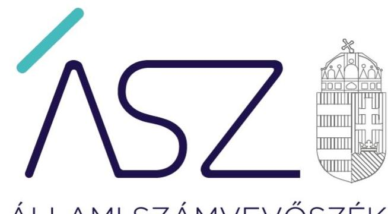
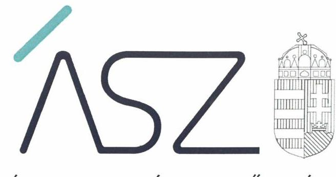

ÁLLAMI SZÁMVEVŐSZÉK

# JELENTÉS

## Központi költségvetési szervek ellenőrzése

Misszió Egészségügyi Központ

2020.

20075
www.asz.hu

---

ÁLLAMI SZÁMVEVŐSZÉK

# JELENTÉS 

## Központi költségvetési szervek ellenőrzése

Misszió Egészségügyi Központ
2020. 06. hó 10. nap

20075
www.asz.hu

---

# AZ ELLENŐRZÉST FELÜGYELTE: 

DR. NAGY IMRE felügyeleti vezető

## AZ ELLENŐRZÉST VEZETTE ÉS A VÉGREHAJTÁSÁÉRT FELELŐS:

DR. GYŐRI GABRIELLA ellenőrzésvezető
DR. GÁL NÓRA ellenőrzésvezető

A PROGRAM ÖSSZEÁLLÍTÁSÁÉRT FELELŐS:
TÓTPÁL SZABOLCS osztályvezető

IKTATÓSZÁM: EL-2615-001/2020.
TÉMASZÁM: 2450
ELLENŐRZÉS-AZONOSÍTÓ SZÁM: V079198

---

# TARTALOMJEGYZÉK 

■ ÖSSZEGZÉS ..... 5
■ AZ ELLENŐRZÉS CÉLJA ..... 6
■ AZ ELLENŐRZÉS TERÜLETE ..... 7
■ AZ ELLENŐRZÉS HÁTTERE, INDOKOLTSÁGA ..... 8
■ A JELENTÉS LÉNYEGES KÉRDÉSKÖREI ..... 10
■ AZ ELLENŐRZÉS HATÓKÖRE ÉS MÓDSZEREI ..... 11
■ MEGÁLLAPÍTÁSOK ..... 13
■ JAVASLATOK ..... 16
■ MELLÉKLETEK ..... 19
I. sz. melléklet: Értelmező szótár ..... 19
■ FÜGGELÉKEK ..... 23
I. sz. függelék a jelentéshez ..... 23
II. sz. függelék: Észrevételek ..... 24
■ RÖVIDÍTÉSEK JEGYZÉKE ..... 29

---

.

---

# ÖSSZEGZÉS 

A veresegyházi székhelyű Misszió Egészségügyi Központ belső kontrollrendszerének kialakítása és működtetése, továbbá pénzügyi és vagyongazdálkodása nem biztosította a felelős gazdálkodást, az átlátható és elszámoltatható közpénzfelhasználást és a vagyon megőrzését. A Misszió Egészségügyi Központnál a korrupció elleni védettség nem volt biztosított.

## Az ellenőrzés társadalmi indokoltsága

A központi alrendszer részét képező intézmények alapvető rendeltetése a közfeladatok ellátásának biztosítása. A közpénzek felhasználásában meghatározó, központi alrendszerbe tartozó intézmények pénzügyi és vagyongazdálkodási tevékenységük és/vagy feladatellátásuk súlya miatt jelentős hatást gyakorolhatnak a költségvetés egyensúlyának fenntartására. Hatással vannak továbbá az állami vagyonnal való gazdálkodás minőségére, a kormányzati (szak)politikák végrehajtására, illetve közfeladat ellátásuk vonatkozásában az állampolgárok életminőségére, jogaik és kötelezettségeik gyakorlására. Indokolt ezért, hogy az Állami Számvevőszék ezen intézmények pénzügyi és vagyongazdálkodását, az esetleges átalakulások szabályszerűségét rendszeresen ellenőrizze.

A Misszió Egészségügyi Központ közfeladatot lát el és jelentős mértékű állami vagyont kezel. Az egészségügyi ellátások közfeladat teljesítése folyamatosan a társadalmi érdeklődés középpontjában áll. A központi költségvetésből az egyik legjelentősebb kiadást az egészségügyi ellátásokra fordított kiadások jelentik, amelyekből a kórházak kapják a legtöbb támogatást.

## Főbb megállapítások, következtetések, javaslatok

A Misszió Egészségügyi Központ belső kontrollrendszere nem biztosította a közpénzekkel való átlátható, szabályszerű és felelős gazdálkodást. Nem gondoskodtak a szabályszerű kontrollkörnyezet kialakításáról, ezáltal nem teremtették meg a szabályszerű közpénzfelhasználás feltételeit. A gazdálkodási jogkörök gyakorlására jogosultak és aláírás mintájuk naprakészségének hiányában nem teremtette meg a kontrolltevékenységek szabályszerű gyakorlásának feltételeit. A 2015-2017. években nem határozták meg az egyes kockázatokkal kapcsolatban szükséges intézkedéseket, valamint azok teljesítésének folyamatos nyomon követésének módját. A belső ellenőrzés működtetése a 2015-2017. években nem volt szabályszerű. Az ellenőrzött időszakban elvégezett ellenőrzésekről nem készült jelentés. A Misszió Egészségügyi Központ főigazgatója az ellenőrzött időszakban nyilatkozatban értékelte a szervezet belső kontrollrendszerének minőségét, azonban az ellenőrzés megállapításai nem igazolták az abban foglaltakat.

A Misszió Egészségügyi Központnál a pénzügyi és vagyongazdálkodás, valamint a maradvány elszámolás nem volt szabályszerű, nem biztosították a beszámoló megbízhatóságát és a nemzeti vagyon védelmét.

Az integritást támogató kontrollokat nem építették ki és nem működtették a Misszió Egészségügyi Központnál.
Az Állami Számvevőszék a Misszió Egészségügyi Központ főigazgatójának 10 javaslatot fogalmazott meg.

---

# AZ ELLENŐRZÉS CÉLJA 

AZ ELLENŐRZÉS CÉLJA annak megállapítása volt, hogy az ellenőrzött intézményre vonatkozó irányító szervi feladatellátás a jogszabályi előírások betartásával történt-e; az intézménynél a belső kontrollrendszer kialakítása és működtetése szabályszerű volt-e, biztosította-e az átlátható, szabályszerű, gazdaságos, hatékony és eredményes gazdálkodás feltételeit; az intézmény pénzügyi és vagyongazdálkodása megfelelt-e a jogszabályi előírásoknak és belső szabályzatainak. Az ellenőrzés keretében az ÁSZ ${ }^{1}$ értékelte az intézmény korrupciós kockázatainak kezelését szolgáló integritás kontrollok kiépítettségét és az integritás szemlélet érvényesülését, továbbá, hogy megteremtették-e a teljesítményellenőrzés feltételeit.

Az ellenőrzés célja volt továbbá annak értékelése, hogy az államháztartás központi alrendszerébe tartozó intézmény megfelelt-e annak az Alaptörvényben² meghatározott alapvetésnek, hogy Magyarország a kiegyensúlyozott, átlátható és fenntartható költségvetési gazdálkodás elvét érvényesíti. Érvényesült-e a nemzeti vagyon kezelésének és védelmének célja, azaz a szervezet vagyona a közérdeket szolgálta, a közös szükségletek kielégítése és a természeti erőforrások megóvása, valamint a jövő nemzedékek szükségleteinek figyelembevétele mellett.

---

# AZ ELLENŐRZÉS TERÜLETE 

## Misszió Egészségügyi Központ

A veresegyházi székhelyű Központ ${ }^{3}$ 2013. március 29-e óta tartozik az Emberi Erőforrások Minisztériuma irányítása alá. Központi költségvetési intézményként működik és az ellenőrzött időszakban az Eütv. ${ }^{4}$ alapján közfeladatokat látott el. Közfeladata a működési engedélyében meghatározott ellátási területre kiterjedően a járó- és fekvőbetegek diagnosztikus és terápiás szakorvosi ellátása, rehabilitációja és követéses gondozása volt. A Központ az Nvtv. ${ }^{5}$, és a Vtvr. ${ }^{6}$ előírásai alapján vagyonkezelési szerződéssel ${ }^{7}$ rendelkezett.

A Központ irányító szerve az ellenőrzött időszakban az EMMI ${ }^{8}$, középirányító szerve a GYEMSZI ${ }^{9}$, majd 2015. március 1-jétől az ÁEEK ${ }^{10}$ volt. A Központ önálló jogi személy volt. Az Áht. ${ }^{11}$ szerinti átalakításra az ellenőrzött időszakban nem került sor. A Központ az ellenőrzött időszakban vállalkozási tevékenységet nem végzett.

A Központot főigazgató vezette, aki felett az irányító szervet vezető miniszter gyakorolta a kinevezési és munkáltatói jogokat. A főigazgató és a gazdasági igazgató személyében 2015. év és 2017. év között nem történt változás.
2017. évben a Központ által kimutatott teljesített összes bevétel meghaladta a 611 M Ft-ot, a teljesített összes kiadás meghaladta az 570 M Ft-ot, a vagyona pedig több, mint 622 M Ft volt. A Központ alkalmazásában álló személyek foglalkoztatása közalkalmazotti jogviszonyban, munkaviszonyban, illetve vállalkozási jogviszonyban történt. A Központ foglalkoztatottjai felett a munkáltatói jogokat a főigazgató gyakorolta.

---

# AZ ELLENŐRZÉS HÁTTERE, INDOKOLTSÁGA 

Az államháztartás központi alrendszerének közpénz felhasználása, az intézmények által ellátott közfeladatok sokrétűsége, valamint a feladatellátásához rendelt vagyon nagyságrendje indokolja, hogy az ÁSZ ellenőrzéseket folytasson a pénzügyi és vagyongazdálkodás területén. Az ÁSZ az ellenőrzései során feltárja a gazdálkodást, a központi alrendszer intézményei átalakulását, átszervezését érintő szabályozások esetleges hiányosságait, a szabályozással nem érintett gazdálkodási területeket, rámutathat a vagyongazdálkodási tevékenység - ezen belül a tulajdonosi joggyakorlás és vagyonkezelés - esetleges szabálytalanságaira, értékeli az állami vagyon nyilvántartására és elszámolására vonatkozó eljárásokat.

Az államháztartás központi alrendszerébe tartozó szervezet vagyona a nemzeti vagyon része és az Alaptörvény is rögzíti, hogy a vagyonnal való gazdálkodás célja a közérdek szolgálata. Az ÁSZ ellenőrzi az éves költségvetési törvény végrehajtását, az ellenőrzés során feltárt kockázatok és a terület folyamatos kockázatelemzésével beazonosított kockázatok kezelése érdekében ráépülő ellenőrzésekkel ellenőrzi a költségvetési szervek gazdálkodását, működését, hogy az ellenőrzések megállapításaival támogassa az ellenőrzött szervezetek szabályszerű gazdálkodását, javaslataival elősegítse az Alaptörvényben megfogalmazott alapvetések érvényesülését a mindennapi életben a szervezetek szintjén. A központi költségvetés rendszerében zajló folyamatok holisztikus elemzései, a kockázatok folyamatos figyelemmel kísérésének módszerével, az így kiválasztott szervezetek célzott, hatékony ellenőrzéseivel az ÁSZ betölti a legfőbb gazdasági ellenőrző szerv küldetését.

Az ellenőrzés várhatóan hozzájárul a központi intézmények pénzügyi helyzetének pontosabb megítéléséhez, és a jó gyakorlat kialakításán és terjesztésén keresztül az ellenőrzések elősegíthetik a gazdálkodás szabályszerűségének javítását.

A belső kontrollrendszer kialakítása és működtetése nélkül nem valósítható meg a közpénzek, a közvagyon átlátható, szabályos, gazdaságos, hatékony és eredményes felhasználása. A belső kontrollrendszer azt a célt szolgálja, hogy a költségvetési szervek működésük és gazdálkodásuk során a tevékenységeket szabályszerűen hajtsák végre, teljesítsék elszámolási kötelezettségeiket és megvédjék az erőforrásokat a veszteségektől, a károktól és a nem rendeltetésszerű használattól. A belső kontrollrendszer magában foglalja mindazon elveket, eljárásokat és belső szabályzatokat, melyek biztosítják, hogy a költségvetési szerv valamennyi tevékenysége és célja összhangban legyen a szabályszerűséggel, szabályozottsággal, valamint a gazdaságosság, hatékonyság és eredményesség követelményeivel, az eszközökkel és forrásokkal való gazdálkodásban ne kerüljön sor pazarlásra, visszaélésre, rendeltetésellenes felhasználásra. Megfelelő, pontos és naprakész információk álljanak rendelkezésre a költségvetési szerv működésével kapcsolatosan, és a belső kontrollrendszer harmonizációjára, összehangolására vonatkozó jogszabályok végrehajtásra kerüljenek. Az integritás kontrollok kiépítése, erősítése a szervezet korrupciós kockázatainak

---

kezelését szolgálja. A teljesítménykövetelmények meghatározása és működtetése megalapozhatja a központi költségvetési szervnél a teljesítményellenőrzés lefolytatását.

Az egyes ellenőrzések megállapításaival és egy időszak ellenőrzési eredményeinek elemzésével az ÁSZ ráirányíthatja a jogalkotók figyelmét a központi alrendszerben vagy annak egy ágazatában esetlegesen felmerülő pénzügyi, szabályozási feszültségekre. Az elvégzett ellenőrzések során az ÁSZ „jó gyakorlatokat" is azonosíthat, melyeket tanácsadó funkciója keretében szélesebb körben is megismertethet az érintettekkel, ezáltal is hozzájárulva a költségvetési rendszer szabályozott, átlátható, kiegyensúlyozott és fenntartható működéséhez.

Az ellenőrzés a szervezet kockázatértékelése alapján, az egyedi és lényeges jellemzők figyelembevételével történt.

---

# A JELENTÉS LÉNYEGES KÉRDÉSKÖREI 

1.     - Az irányító szerv ellenőrzött költségvetési szervre vonatkozó feladatellátása szabályszerű volt-e?
2.     - A belső kontrollrendszer kialakítása és működtetése biztosította-e a közpénzekkel és a nemzeti vagyonnal történő szabályszerű gazdálkodást?
3.     - A költségvetési szerv pénzügyi- és vagyongazdálkodása szabályszerű volt-e?
4.     - A költségvetési szervnél alakítottak-e ki a teljesítmény mérésére alkalmas követelményeket?

---

# AZ ELLENŐRZÉS HATÓKÖRE ÉS MÓDSZEREI 

## Az ellenőrzés típusa

Megfelelőségi ellenőrzés.

## Az ellenőrzött időszak

2015-2017. évek

## Az ellenőrzés tárgya

A Központra vonatkozó 2015-2016. évi irányító szervi feladatok ellátása. A Központ 2015-2017. évi belső kontrollrendszerének kialakítása és működtetése, valamint az integritás kontrollok kiépítettsége 2016-2017. években és a teljesítmény ellenőrzés feltételei 2017. évben. A maradvány megállapításának szabályszerűsége a 2015-2017. években.

A Központ pénzügyi és vagyongazdálkodása a 2015-2016. években. A 2017. évre vonatkozóan a Központ vagyongazdálkodási feltételeinek kialakítása, annak szabályszerűsége, az elszámoltathatóság biztosítása a szabályozás szintjén. A Központnál hozott vagyonváltozást eredményező döntések, a vagyonban bekövetkezett változások végrehajtásának, nyilvántartásba vételének, elszámolásának szabályszerűsége. A Központ könyveiben, mérlegében az állami vagyon kimutatásának szabályszerűsége, ennek keretében az állami vagyonnal történő rendelkezés, a vagyonmozgások, a vagyon nyilvántartásba vétele, értékelése és a mérleg alátámasztás szabályszerűsége.

Az ellenőrzés kiterjedt minden olyan körülményre és adatra, amely az ÁSZ jogszabályban meghatározott feladatainak teljesítéséhez, valamint a program végrehajtása folyamán felmerült újabb összefüggések feltárásához szükséges volt.

## Az ellenőrzött szervezet

Misszió Egészségügyi Központ, Emberi Erőforrások Minisztériuma (mint irányító szerv), Állami Egészségügyi Ellátó Központ (mint középirányító szerv).

---

# Az ellenőrzés jogalapja 

Az ellenőrzés jogszabályi alapját az ÁSZ tv. ${ }^{12}$ 1. § (3) bekezdés, 5. § (2)-(4) és (6) bekezdései, valamint az Áht. 61. § (2) bekezdésének előírásai képezték.

## Az ellenőrzés módszerei

Az ellenőrzésre a szakmai program szempontjai, az ellenőrzött időszakban hatályos jogszabályok, az ellenőrzés szakmai szabályai, a jelen ellenőrzésre irányadó ÁSZ módszertanok figyelembevételével került sor.

Az ellenőrzés ideje alatt az ellenőrzött szervezetekkel a kapcsolattartást az ÁSZ SZMSZ ${ }^{13}$-ének vonatkozó előírásai alapján biztosította az ÁSZ.

Az ellenőrzési kérdések megválaszolásához szükséges bizonyítékok megszerzése az ellenőrzött szervezetek által rendelkezésre bocsátott dokumentumokra, adatokra alapozva megfigyelés, szemle (szemrevételezés), kérdésfeltevés (információkérés), valamint elemző eljárás útján történt.

Az ellenőrzési bizonyítékként felhasználható adatforrások közé tartoztak egyrészt a szakmai program részletes szempontjainál felsorolt adatforrások, másrészt minden egyéb - az ellenőrzés folyamán feltárt, az ellenőrzés szempontjából információt tartalmazó - dokumentum.

Az ellenőrzés lefolytatásához
 az ellenőrzött szervezetek a tanúsítványok kitöltésével, valamint az ÁSZ által kért dokumentumok megküldésével szolgáltattak adatokat, amelyek valódiságát és teljes körűségét az ellenőrzött szervezet vezetője által tett teljességi és hitelességi nyilatkozat igazolta. Az így rendelkezésre bocsátott adatok, információk kontrollja az ellenőrzés keretében történt.

A központi költségvetési szerv belső kontrollrendszere egyes pilléreinek kialakítására és működtetésére vonatkozó értékelés:
$\longrightarrow$ „szabályszerű", amennyiben az értékelt területen az elért „igen" válaszok százalékban kifejezett, egész számra kerekített aránya legalább $85 \%$,
$\longrightarrow$ „nem szabályszerű", ha nem érte el a $85 \%$-ot,
A központi költségvetési szerv belső kontrollrendszerének összesített értékelése az egyes részterületek esetében kapott megfelelőségi arányok számtani átlaga alapján történt és megegyezett a pillérenként (kontrollterületenként) alkalmazott százalékos értékelésekkel, a következő eltérésekkel: a kontrollrendszer egésze esetében a „szabályszerű" értékelésnek a százalékos értéken felül további feltétele volt, hogy egyik kontrollterület sem kaphatott „nem szabályszerű" értékelést.

Amennyiben az ellenőrzött szervezet működését és gazdálkodását alapvetően meghatározó dokumentum tartalmi hiányossága miatt, valamely lényeges kérdéskörre vonatkozóan az ÁSZ megállapítást tett, további ellenőrzési tevékenységek az adott kérdéskörrel és az azzal szoros logikai kapcsolatban lévő kérdéskörökkel összefüggésben - ráépülő jelleggel - nem kerültek végrehajtásra.

---

# 1. Az irányító szerv ellenőrzött költségvetési szervre vonatkozó feladatellátása szabályszerű volt-e? 

Összegző megállapítás Az irányítószervi feladatellátás a 2015-2016. években szabályszerű volt.

Az irányító szerv ${ }^{14}$ a Központ alapító okiratát az Ávr. ${ }^{15}$-ben foglaltakkal összhangban adta ki. Az irányítási jogosultságok keretében az ellenőrzött időszakban meghatározta a költségvetés tervezése során érvényesítendő követelményeket, jóváhagyta a Központ elemi költségvetéseit. A középirányító szerv ${ }^{16}$ figyelemmel kísérte a bevételek és kiadások alakulását.

## 2. A belső kontrollrendszer kialakítása és működtetése biztosította-e a közpénzekkel és a nemzeti vagyonnal történő szabályszerű gazdálkodást?

## Összegző megállapítás

A Központ belső kontrollrendszerének kialakítása és működtetése nem biztosította a közpénzekkel és a nemzeti vagyonnal történő szabályszerű gazdálkodást.

A KONTROLLKÖRNYEZET kialakítása a 2015-2017. években nem volt szabályszerű. A Központ gazdasági szervezeti feladatok ellátására vonatkozó alapvető szabályozása ellentétes volt az Áht. 10.§ (4a) bekezdésében foglaltakkal, mivel az SZMSZ ${ }_{1}{ }^{17}$ szerint a gazdasági feladatokat a Központ gazdasági szervezete látta el, míg a hivatkozott rendelkezés szerint a Központ gazdasági szervezettel nem rendelkezhetett. A főigazgató nem biztosította a működés és gazdálkodás alapvető szabályozási kereteit.

A számviteli politika ${ }_{1,2}{ }^{18}$ a 2015-2017. években - a Számv. tv. ${ }^{19} 14 . \S$ (4) bekezdésében előírtak ellenére - nem tartalmazta azokat a szabályokat, előírásokat, amelyek meghatározzák, hogy a költségvetési szerv mit tekint a számviteli elszámolás, az értékelés szempontjából lényegesnek, nem lényegesnek, a törvényben biztosított választási, minősítési lehetőségek közül melyeket, milyen feltételek fennállása esetén alkalmaznak, valamint azt, hogy az alkalmazott gyakorlatot milyen okok miatt kell megváltoztatni.

A számlarend ${ }_{1,2}{ }^{20}$ a 2015-2017. években a Számv. tv. 161. § (2) bekezdés c) pontjában és az Áhsz. ${ }^{21}$ 51. § (2) bekezdésében előírtak ellenére nem tartalmazta a főkönyvi számla és az analitikus nyilvántartások kapcsolatát, továbbá az Áhsz. 51. § (3) bekezdésében foglaltak ellenére a részletező nyilvántartások vezetésének módját, a pénzügyi könyvvezetéshez készült összesítő bizonylatok (feladások) elkészítésének rendjét, az összesítő bizonylat tartalmi és formai követelményeit.

---

A leltárkészítési és leltározási szabályzat ${ }_{1,2}{ }^{22}$ a 2015-2017. években az Áhsz. 22. § (2) bekezdés b) pontjában előírtak ellenére nem tartalmazta a használt, de a mérlegben értékkel nem szereplő immateriális javak, tárgyi eszközök, készletek leltározási módját.

A KOCKÁZATKEZELÉSI RENDSZER működtetéséről a Központ főigazgatója 2016. szeptember 30-ig, az integrált kockázatkezelési rendszer működtetéséről 2016. október 1-jétől az ellenőrzött időszak végéig - a Bkr. 7. § (1)-(2) bekezdésében előírtak ellenére - nem gondoskodott.

A KONTROLLTEVÉKENYSÉG gyakorlása az ellenőrzött időszakban nem volt szabályszerű. Az Ávr. 60. § (3) bekezdésében foglaltak ellenére a gazdálkodási jogkörök gyakorlására jogosult személyekről és aláírás mintájukról az ellenőrzött időszakban vezetett nyilvántartás nem volt naprakész.

AZ INFORMÁCIÓS ÉS KOMMUNIKÁCIÓS folyamatok működtetése 2015-2017-ben nem volt szabályszerű. A Központ - az Ávr. 13. § (2) bekezdés h) pontjában foglaltak ellenére - belső szabályzatban nem rendezte 2015-2017-ben a kötelezően közzéteendő adatok nyilvánosságra hozatalának rendjét. A kialakított információs rendszer 2015-2017-ben a Bkr. 9. § (1) bekezdésében foglaltak ellenére nem biztosította, hogy a megfelelő információk a megfelelő időben eljussanak az illetékes szervezeti egységhez, személyhez.

A MONITORING RENDSZER működtetése a 2015-2017. években nem volt szabályszerű. A főigazgató az operatív tevékenységek keretében megvalósuló folyamatos és eseti nyomon követés tekintetében nem biztosította a monitoring rendszer működtetését a Bkr. 3. § e) pontjában foglaltak ellenére. A főigazgató az operatív tevékenységektől függetlenül működő belső ellenőrzést nem szabályszerűen működtette, a 2015-2017. években végrehajtott belső ellenőrzésekről a Bkr. 39. § (1) bekezdésében foglaltak ellenére nem készült jelentés. A Központ főigazgatója 2015-2016. években a Bkr. 14. § (2) bekezdésében előírt - külső ellenőrzések javaslatai alapján készült intézkedési tervek végrehajtására vonatkozó - beszámolási kötelezettségét nem teljesítette.

A Központ főigazgatója az ellenőrzött időszakban nyilatkozatban értékelte a Központ belső kontrollrendszerének minőségét, azonban az ellenőrzés megállapításai nem igazolták az abban foglaltakat. A Központ főigazgatója a 2015. és 2017. években a nyilatkozatot a Bkr. 11. § (2) bekezdésében foglaltak ellenére nem küldte meg az irányító szerv részére.

A Központnál az integritás kontrollokat nem építették ki és nem működtették.

---

# 3. A költségvetési szerv pénzügyi- és vagyongazdálkodása szabályszerű volt-e? 

## Összegző megállapítás

A Központ pénzügyi- és vagyongazdálkodása, valamint maradvány elszámolása nem volt szabályszerű.

A kontrollkörnyezet szabályszerű kialakításának hiányában, továbbá a kontrolltevékenység területén a gazdálkodási jogkörgyakorlásra vonatkozó hiányosságok miatt a 2015-2017. évekre vonatkozóan a Központ pénzügyi- és vagyongazdálkodása nem volt szabályszerű.

A Központ - az Áhsz. 39. § (3) bekezdésének előírása ellenére - a kötelezettségvállalásokról nem vezetett az Áhsz. 14. melléklet II. 4. pontjában foglaltakat tartalmazó nyilvántartást. Kötelezettségvállalás nyilvántartás hiányában a Központ maradvány elszámolása nem volt szabályszerű.

## 4. A költségvetési szervnél alakítottak-e ki a teljesítmény mérésére alkalmas követelményeket?

## Összegző megállapítás

A Központnál a teljesítmény mérésére követelményeket alakítottak ki.

A Központ főigazgatója a teljesítmény mérésére belső szabályzatban indikátorokat határozott meg.

---

# JAVASLATOK 

Az ÁSZ tv. 33. § (1) bekezdésében foglaltak értelmében az ellenőrzött szervezet vezetője köteles a jelentésben foglalt megállapításokhoz kapcsolódó intézkedési tervet összeállítani és azt a jelentés kézhezvételétől számított 30 napon belül az ÁSZ részére megküldeni. Amennyiben az ellenőrzött szervezet vezetője nem küldi meg határidőben az intézkedési tervet, vagy továbbra sem elfogadható intézkedési tervet küld, az Állami Számvevőszék elnöke az ÁSZ tv. 33. § (3) bekezdése a) és b) pontjaiban foglaltakat érvényesítheti.

## Misszió Egészségügyi Központ főigazgatójának

1. Intézkedjen, hogy a számviteli politika megfeleljen a jogszabályi előírásoknak.
(2. sz. megállapítás 2. bekezdés 1. mondata alapján)
2. Intézkedjen, hogy a számlarend megfeleljen a jogszabályi előírásoknak.
(2. sz. megállapítás 3. bekezdés alapján)
3. Intézkedjen, hogy az eszközök és források leltárkészítési és leltározási szabályzata megfeleljen a jogszabályi előírásoknak.
(2. sz. megállapítás 4. bekezdés alapján)
4. Intézkedjen az integrált kockázatkezelési rendszer működtetéséről a jogszabályi előírásnak megfelelően.
(2. sz. megállapítás 5. bekezdése alapján)
5. Intézkedjen a gazdálkodási jogkörök gyakorlására jogosult személyek és aláírás-mintájuk nyilvántartásának naprakész vezetéséről a jogszabályi előírásnak megfelelően.
(2. sz. megállapítás 6. bekezdés 2. mondata alapján)
6. Működtessen a jogszabályban foglalt követelményeknek megfelelő információs és kommunikációs rendszert.
(2. sz. megállapítás 7. bekezdés alapján)

---

7. Gondoskodjon az operatív tevékenységek keretében megvalósuló folyamatos és eseti nyomon követés tekintetében a monitoring rendszer működtetéséről a jogszabályi előírásnak megfelelően.
(2. sz. megállapítás 8. bekezdés 2. mondata alapján)
8. Gondoskodjon, hogy a belső ellenőr a jövőben a jogszabályi előírásnak megfelelően a megállapításait, következtetéseit és javaslatait tartalmazó ellenőrzési jelentést készítsen.
(2. sz. megállapítás 8. bekezdés 3. mondata alapján)
9. Intézkedjen a jövőben a belső kontrollrendszer minőségét értékelő nyilatkozat költségvetési beszámolóval egyidejű megküldéséről az irányító szerv részére.
(2. sz. megállapítás 9. bekezdés 2. mondata alapján)
10. Intézkedjen a kötelezettségvállalások nyilvántartásának vezetéséről a jogszabályi előírásoknak megfelelően.
(3. sz. megállapítás 2. bekezdés alapján)

---

.

---

# MELLÉKLETEK 

- I. SZ. MELLÉKLET: ÉRTELMEZŐ SZÓTÁR
állami vagyon
állami vagyonnak minősül:
a) az állam tulajdonában lévő dolog, valamint a dolog módjára hasznosítható természeti erő,
b) az a) pont hatálya alá nem tartozó mindazon vagyon, amely vonatkozásában törvény az állam kizárólagos tulajdonjogát nevesíti,
c) az állam tulajdonában lévő tagsági jogviszonyt megtestesítő értékpapír, illetve az államot megillető egyéb társasági részesedés,
d) az államot megillető olyan immateriális, vagyoni értékkel rendelkező jogosultság, amelyet jogszabály vagyoni értékű jogként nevesít. (Forrás: Vtv. 1. § (2) bekezdése)
állami vagyon használója Az a természetes vagy jogi személy, jogi személyiséggel nem rendelkező szervezet, aki, vagy amely törvény vagy szerződés alapján, bármely jogcímen (bérlet, haszonbérlet, használat stb.) állami vagyont birtokol, használ, szedi annak hasznait, hasznosít, ide nem értve a haszonélvezőt, a vagyonkezelőt és a tulajdonosi jogok gyakorlóját. (Forrás: Vtvr. 1. § (7) bekezdés a) pontja)
állami vagyon hasznosítása Az állami vagyont az MNV Zrt. maga kezeli, vagy szerződés - így különösen bérlet, haszonbérlet, megbízás - alapján központi költségvetési szervnek, természetes vagy jogi személynek, vagy jogi személyiséggel nem rendelkező gazdálkodó szervezetnek hasznosításra átengedi.
(Forrás: Vtv. 23. § (1) bekezdése, hatályos 2012. január 1-jétől)
Az állami vagyonnal a tulajdonosi joggyakorló maga gazdálkodik, vagy szerződés - így különösen bérlet, haszonbérlet, megbízás - alapján hasznosításra átengedi, illetőleg vagyonkezelésbe, haszonélvezetbe adja. (Forrás: Vtv. 23. § (1) bekezdése, hatályos 2013. június 28 -ától)
állami vagyon kezelője /vagyonkezelő
belső ellenőrzés
belső kontrollrendszer
belső kontrollrendszer területei

Az állami vagyont az MNV Zrt. maga kezeli, vagy szerződés - így különösen bérlet, haszonbérlet, megbízás - alapján központi költségvetési szervnek, természetes vagy jogi személynek, vagy jogi személyiséggel nem rendelkező gazdálkodó szervezetnek hasznosításra átengedi." Az állami vagyonra vonatkozóan az MNV Zrt. kizárólag az Nvtv.-ben meghatározott személyekkel köthet vagyonkezelési szerződést. (Forrás: Vtv. 27. § (1) bekezdése, hatályos 2012. január 1-jétől)
Független, tárgyilagos bizonyosságot adó és tanácsadó tevékenység, amelynek célja, hogy az ellenőrzött szervezet működését fejlessze és eredményességét növelje, az ellenőrzött szervezet céljai elérése érdekében rendszerszemléletű megközelítéssel és módszeresen értékeli, illetve fejleszti az ellenőrzött szervezet irányítási és belső kontrollrendszerének hatékonyságát. (Forrás: Bkr. 2. § b) pontja)
A belső kontrollrendszer a kockázatok kezelése és tárgyilagos bizonyosság megszerzése érdekében kialakított folyamatrendszer, amely azt a célt szolgálja, hogy a működés és gazdálkodás során a tevékenységeket szabályszerűen, gazdaságosan, hatékonyan, eredményesen hajtsák végre, az elszámolási kötelezettségeket teljesítsék, megvédjék az erőforrásokat a veszteségektől, károktól és nem rendeltetésszerű használattól. (Forrás: Áht. 69. § (1) bekezdése)
A kontrollkörnyezet, a kockázatkezelési rendszer, a kontrolltevékenységek, az információs és kommunikációs rendszer, valamint a nyomon követési (monitoring) rendszer. (Forrás: Bkr. 3. §-a)

---

információs és kommunikációs rendszer
integritás
integrált kockázatkezelési rendszer
irányító szerv/felügyeleti szerv
kockázat
kockázatkezelési rendszer
kontrollkörnyezet
kontrolltevékenységek
közfeladat
maradvány

A költségvetési szerv vezetője által kialakított és működtetett olyan rendszer, mely biztosítja, hogy a megfelelő információk a megfelelő időben eljutnak az illetékes szervezethez, szervezeti egységhez, illetve személyhez. (Forrás: Bkr. 9. §
 (1) bekezdés)
Az integritás - egyik gyakran használt jelentése szerint - az elvek, értékek, cselekvések, módszerek, intézkedések konzisztenciáját jelenti, vagyis olyan magatartásmódot, amely meghatározott értékeknek megfelel. Integritás-irányítási rendszer bevezetése a szervezetben a szervezethez rendelt közfeladatok integritás szempontú ellátását, az érték alapú működéssel (integritással) összefüggő szervezeti követelmények következetes érvényesítését jelenti. (Forrás: Nemzetgazdasági Minisztérium: Államháztartási Belső Kontroll Standardok és Gyakorlati Útmutató 1.6. Etikai értékek és integritás 46. oldal, 2017. szeptember)

Olyan folyamatalapú kockázatkezelési rendszer, amely a szervezet minden tevékenységére kiterjed, egységes módszertan és eljárások alkalmazásával, a szervezet célkitűzéseinek és értékeinek figyelembevételével biztosítja a szervezet kockázatainak teljes körű azonosítását, azok meghatározott kritériumok szerinti értékelését, valamint a kockázatok kezelésére vonatkozó intézkedési terv elkészítését és az abban foglaltak nyomon követését. (Forrás: Bkr. 2. § m) pontja, 2016. október 1-jétől)
A költségvetési szerv tekintetében az Áht.-ban meghatározott irányítási hatáskört gyakorló szerv. (Forrás: Áht. 1. § 9. pontja)
A kockázat annak a valószínűségét jelenti, hogy egy vagy több esemény vagy intézkedés nem kívánt módon befolyásolja a rendszer működését, céljainak megvalósulását. (Forrás: Javaslatok a korrupciós kockázatok kezelésére - Kockázatkezelési és ellenőrzési módszertan 35. oldal, ÁSZ)
Olyan irányítási eszközök és módszerek összessége, melynek elemei a szervezeti célok elérését veszélyeztető tényezők (kockázatok) azonosítása, elemzése, csoportosítása, nyomon követése, valamint szükség esetén a kockázati kitettség mérséklése. (Forrás: Bkr. 2. § m) pontja)
A költségvetési szerv vezetője által kialakított olyan elvek, eljárások, belső szabályzatok összessége, amelyben világos a szervezeti struktúra, a folyamatok átláthatók, egyértelműek a felelősségi, hatásköri viszonyok és feladatok, meghatározottak, ismertek és elfogadottak az etikai elvárások a szervezet minden szintjén, átlátható a humán-erőforrás-kezelés. (Forrás: Bkr. 6. § (1) bekezdés)
A költségvetési szerv vezetője által a szervezeten belül kialakított (kontroll) tevékenységek, melyek biztosítják a kockázatok kezelését, hozzájárulnak a szervezet céljainak eléréséhez és erősítik a szervezet integritását. (Forrás: Bkr. 8. § (1) bekezdés)
Jogszabályban meghatározott állami vagy önkormányzati feladat, amit az arra kötelezett közérdekből, a jogszabályban meghatározott követelményeknek és feltételeknek megfelelve végez, ideértve a lakosság közszolgáltatásokkal való ellátását, továbbá az állam nemzetközi szerződésekben vállalt kötelezettségeiből adódó közérdekű feladatokat, valamint e feladatok ellátásakor szükséges infrastruktúra biztosítását is. (Forrás: Nvtv. 3. § (1) bekezdés 7. pontja)
A költségvetési év során a bevételek és kiadások különbözete, amely az alaptevékenység bevételei és kiadásai tekintetében a költségvetési maradvány, a vállalkozási tevékenység bevételei és kiadásai tekintetében a vállalkozási maradvány. (Forrás: Áht. 1. § 17. pont)

---

nyomon követési rendszer (monitoring)
vagyongazdálkodás

A költségvetési szerv vezetője köteles kialakítani a szervezet tevékenységének a célok megvalósításának nyomon követését biztosító rendszert, amely az operatív tevékenységek keretében megvalósuló folyamatos és eseti nyomon követésből, valamint az operatív tevékenységektől függetlenül működő belső ellenőrzésből áll. (Forrás: Bkr. 10. §)
A nemzeti vagyongazdálkodás feladata a nemzeti vagyon rendeltetésének megfelelő, az állam, az önkormányzat mindenkori teherbíró képességéhez igazodó, elsődlegesen a közfeladatok ellátásához és a mindenkori társadalmi szükségletek kielégítéséhez szükséges, egységes elveken alapuló, átlátható, hatékony és költségtakarékos működtetése, értékének megőrzése, állagának védelme, értéknövelő használata, hasznosítása, gyarapítása, továbbá az állam vagy a helyi önkormányzat feladatának ellátása szempontjából feleslegessé váló vagyontárgyak elidegenítése. (Forrás: Nvtv. 7. § (2) bekezdése)

---

.

---

# FÜGGELÉKEK 

- I. SZ. FÜGGELÉK A JELENTÉSHEZ

Az Állami Számvevőszék az ellenőrzés során feltárt tényekhez kapcsolódó további körülmények tisztázására eszközrendszerrel nem rendelkezik. Amennyiben az ellenőrzésen túlmutatóan indokoltnak látszik az ellenőrzés során feltárt körülmények további vizsgálata, az Állami Számvevőszék törvényi felhatalmazás alapján az ellenőrzés által feltárt körülményeket továbbítja a hatáskörrel rendelkező szervnek a szükséges intézkedések megtétele, eljárások lefolytatása érdekében.
1.A Központ számviteli politikái a 2015-2017. években - a Számv. tv. 14. § (4) bekezdésében előírtak ellenére - nem tartalmazták azokat a szabályokat, előírásokat, amelyek meghatározzák, hogy a költségvetési szerv mit tekint a számviteli elszámolás, az értékelés szempontjából lényegesnek, nem lényegesnek, a törvényben biztosított választási, minősítési lehetőségek közül melyeket, milyen feltételek fennállása esetén alkalmaznak, valamint azt, hogy az alkalmazott gyakorlatot milyen okok miatt kell megváltoztatni.
2. A számlarendek a 2015-2017. években a Számv. tv. 161. § (2) bekezdés c) pontjában és az Áhsz. 51. § (2) bekezdésében előírtak ellenére nem tartalmazták a főkönyvi számla és az analitikus nyilvántartások kapcsolatát, továbbá az Áhsz. 51. § (3) bekezdésében foglaltak ellenére a részletező nyilvántartások vezetésének módját, a pénzügyi könyvvezetéshez készült összesítő bizonylatok (feladások) elkészítésének rendjét, az összesítő bizonylat tartalmi és formai követelményeit.
3. A Központnál a gazdálkodási jogkörök gyakorlására jogosult személyekről és aláírás mintájukról vezetett nyilvántartás nem volt naprakész az Ávr. 60. § (3) bekezdésében foglaltak ellenére.
A jogszabályok szerinti számviteli szabályzatok és számlarendek hiányában nem voltak biztosítottak a szabályszerű könyvvezetés és vagyongazdálkodás keretei, nem voltak biztosítottak továbbá a gazdálkodási jogkörgyakorlás jogszabályban előírt feltételei sem. Mindezeket összességében értékelve nem igazolt, hogy a 2015-2017. évi éves költségvetési beszámolók a Számv. tv. 4.§ (2) bekezdése, illetve az Áhsz. 3.§ (2)-(3) bekezdése szerinti megbízható, valós összképet mutatnak.
Az 1-3. pontokban foglalt esetek összes körülményének feltárására a Nemzeti Adó- és Vámhivatal rendelkezik hatáskörrel.

---

A jelentéstervezetet a Számvevőszék 15 napos észrevételezésre megküldte az ellenőrzött szervezetek vezetőinek az ÁSZ tv. 29. § (1) bekezdése előírásának megfelelően.

A Misszió Egészségügyi Központ főigazgatójától és az Emberi Erőforrások Minisztériumától a jelentéstervezet megállapításaira írásbeli észrevétel érkezett. Az Állami Egészségügyi Ellátó Központtól nemleges észrevétel érkezett.
Az ÁSZ tv. 29. § (3) bekezdésével összhangban az Állami Számvevőszék a Függelékben feltünteti az ellenőrzés megállapításaival kapcsolatban tett, figyelembe nem vett észrevételeket, és megindokolja, hogy azokat miért nem fogadta el.

[^0]
[^0]:    * 29. § (1) Az Állami Számvevőszék az ellenőrzési megállapításait megküldi az ellenőrzött szervezet vezetőjének vagy az általa megbízott személynek, és annak, akinek személyes felelősségét állapította meg.
    (2) Az ellenőrzött szervezet vezetője és a felelősként megjelölt személy az ellenőrzés megállapításaira tizenöt napon belül írásban észrevételt tehet.
    (3) Az Állami Számvevőszék az észrevételre a beérkezésétől számított harminc napon belül írásban válaszol. A figyelembe nem vett észrevételeket köteles a jelentésben feltüntetni, és megindokolni, hogy azokat miért nem fogadta el.

---

A „Központi Költségvetési szervek ellenőrzése - Misszió Egészségügyi Központ" címmel készített számvevőszéki jelentéstervezet megállapításaival kapcsolatban a Misszió Egészségügyi Központ főigazgatója által 2020. március 27-én kelt levélben tett észrevételek és azok kezelésének indokolása.

# 1. A jelentéstervezet 2. számú megállapítás 1. bekezdésével kapcsolatos észrevétel 

A Misszió Egészségügyi Központ főigazgatója észrevételében leírta, hogy a Központ 2015. április 1-ével alakult át gazdasági szervezettel nem rendelkező költségvetési szervvé. A módosított SZMSZ 2017. március 23-án vált hatályossá, mely az Áht. 10 § (4a) bekezdésben foglaltaknak megfelelő tartalmú.

Az észrevételre válaszolva tájékoztatást adtunk arról, hogy a Misszió Egészségügyi Központ az ÁSZ 2019. január 22-én kelt, EL-1466-001/2019. iktatószámú adatbekérő levél 2. melléklet I.1. pontjában bekért dokumentumokat a 2019. február 21-én kelt teljességi és hitelességi nyilatkozattal, illetve a 2019. március 13-án kelt, EL-1466-018/2019. iktatószámú adatbekérő levél 2. melléklet I.1.1. pontjában bekért dokumentumokat a 2019. március 26-án kelt teljességi és hitelességi nyilatkozattal küldte meg az ÁSZ részére.

Az ellenőrzéshez a Misszió Egészségügyi Központ által az adatbekérés során beküldött dokumentumok felülvizsgálata és a Misszió Egészségügyi Központ főigazgatójának észrevétele is megerősítette, hogy a Központ 2017. március 22-ig hatályos SZMSZ-e szerint a gazdasági feladatokat a Központ gazdasági szervezete látta el. Ez a szabályozás nincs összhangban az Áht. 10.§ (4a) bekezdésében foglalt rendelkezéssel, amely alapján a Központ gazdasági szervezettel nem rendelkezhetett.

Mindezek alapján az észrevételt nem fogadtuk el, a jelentéstervezet módosítása nem volt indokolt.

## 2. A jelentéstervezet 2. számú megállapítás 6. bekezdés 2. mondatával kapcsolatos észrevétel

A Misszió Egészségügyi Központ főigazgatója észrevételében jelezte, hogy a Misszió Egészségügyi Központ a gazdálkodási jogkör gyakorlására jogosult személyekről és aláírás mintájukról naprakész nyilvántartást vezetett és vezet is, azonban 2018. szeptemberig nem az Ávr.-ben előírt kifejezéseket használva kerültek a gazdálkodási jogkör gyakorlói felhatalmazásra és kijelölésre.

Az észrevételre válaszolva tájékoztatást adtunk arról, hogy az ellenőrzéshez a Misszió Egészségügyi Központ az ÁSZ 2019. január 22-én kelt, EL-1466-001/2019. iktatószámú adatbekérő levél 2. melléklet I.1. pontjában bekért dokumentumokat a 2019. február 21-én kelt teljességi és hitelességi nyilatkozattal küldte meg az ÁSZ részére. Az ellenőrzéshez a Központ által az adatbekérés során beküldött dokumentumok felülvizsgálata alapján az ellenőrzött időszakban a Központnál gazdasági vezető váltásra nem került sor, a gazdasági igazgató adatszolgáltatás során megküldött kinevezése 2013. április 1. óta hatályos.

Ezzel ellentétesen a 2015. április 1-jétől hatályos Kötelezettségvállalási szabályzat 3. számú mellékletében található nyilvántartás pénzügyi ellenjegyzői jogkör gyakorlására jogosultként nem a kinevezéssel rendelkező gazdasági igazgató aláírását tartalmazta. Emiatt az Ávr. 60. § (3) bekezdésében foglaltak ellenére a gazdálkodási jogkörök gyakorlására jogosult személyekről és aláírás mintájukról az ellenőrzött időszakban vezetett nyilvántartás nem volt naprakész.

Mindezek alapján az észrevételt nem fogadtuk el, a jelentéstervezet módosítása nem volt indokolt.

---

# 3. A jelentéstervezet 2. számú megállapítás 8. bekezdés 3. mondatával kapcsolatos észrevétel 

A Misszió Egészségügyi Központ főigazgatója észrevételében jelezte, hogy a Misszió Egészségügyi Központnál a belső ellenőrzés a jogszabályi előírásoknak megfelelően működik, a belső ellenőr az ellenőrzésről ellenőrzési jelentést készített 2015-2017. években. A Misszió Egészségügyi Központ a megküldött adatbekérésben helytelenül értelmezte a Belső ellenőrzési jelentésre irányuló adatbekérést és a beszámolókat csatolták, nem a három év belső ellenőrzési jelentéseit.

A Misszió Egészségügyi Központ főigazgatója észrevételében elismerte, hogy a belső ellenőrzésekről nem küldött jelentéseket az ÁSZ ellenőrzés részére. Tájékoztatom, hogy az ÁSZ az ellenőrzési megállapításait a szabályszerű adatszolgáltatás során rendelkezésére bocsátott dokumentumok alapján teszi meg.

Mindezek alapján az észrevételt nem fogadtuk el, a jelentéstervezet módosítása nem volt indokolt.

## 4. A jelentéstervezet 2. számú megállapítás 8. bekezdés 4. mondatával kapcsolatos észrevétel

A Misszió Egészségügyi Központ főigazgatója észrevételében jelezte, hogy a Misszió Egészségügyi Központnál a külső ellenőrzések javaslatai alapján készült intézkedések végrehajtásáról készítettek beszámolót vagy utóellenőrzés kontrollálta a megvalósulást. Az adatbekérés során a Misszió Egészségügyi Központ tévesen értelmezte a bekérést, mert úgy vélték, hogy a táblázat tartalmazza a beszámolót.

A Misszió Egészségügyi Központ főigazgatója észrevételében elismerte, hogy nem küldött a külső ellenőrzések javaslatai alapján készült intézkedési tervek végrehajtására vonatkozó beszámolási kötelezettség teljesítését igazoló dokumentumot az ÁSZ ellenőrzés részére. Tájékoztatom, hogy az ÁSZ az ellenőrzési megállapításait a szabályszerű adatszolgáltatás során rendelkezésére bocsátott dokumentumok alapján teszi meg.

Mindezek alapján az észrevételt nem fogadtuk el, a jelentéstervezet módosítása nem volt indokolt.

## 5. A jelentéstervezet 2. számú megállapítás 9. bekezdés 2. mondatával kapcsolatos észrevétel

A Misszió Egészségügyi Központ főigazgatója észrevételében jelezte, hogy a Misszió Egészségügyi Központ 2015. és 2017. években is megküldte a jelzett nyilatkozatot a fenntartó részére. A 2015. évi beszámolómellékletek megküldésének dokumentumát az EL 1466-008/2019 számú adatbekérő levél alapján ezen adatbekérés
 1.4.8 pontjához is feltöltötték. Ez a dokumentum az e-mailen történt megküldésről szól. Ebben az összes mellékletet zip mappában küldte meg a Központ, így annak tételes tartalma nem látszik. A 2017. évi beszámoló-mellékletek (köztük az 1. számú melléklet) megküldésének igazolására történő adatbekéréssel a vizsgálat során nem találkoztak. A vizsgált évekre vonatkozóan a beszámoló-mellékleteket papír alapon, aláírva is megküldte a Misszió Egészségügyi Központ a fenntartó részére.

Az észrevételre válaszolva tájékoztatást adtunk arról, hogy az ellenőrzéshez a Misszió Egészségügyi Központtól a 2019. március 13-án kelt, EL-1466-018/2019. iktatószámú adatbekérő levelünk 2. melléklet I.6.2. és II.5.15. pontjaiban bekért, az ÁSZ részére a 2019. március 26-án kelt teljességi és hitelességi nyilatkozattal megküldött dokumentumok felülvizsgálata megerősítette, hogy azok a Bkr. 1. számú melléklete szerinti vezetői nyilatkozatok, azonban a Bkr. 11. § (2) bekezdése előírásainak megfelelő, a nyilatkozatok irányító

---

szervnek való megküldését igazoló dokumentumot a Misszió Egészségügyi Központ nem bocsátott az ÁSZ rendelkezésére.

Ez alapján az észrevételt nem fogadtuk el, a jelentéstervezet módosítása nem volt indokolt.

A „Központi Költségvetési szervek ellenőrzése - Misszió Egészségügyi Központ" címmel készített számvevőszéki jelentéstervezet megállapításaival kapcsolatban az Emberi Erőforrások Minisztérium (továbbiakban: EMMI) egészségügyért felelős államtitkára által 2020. március 25-én kelt levélben tett észrevételek és azok kezelésének indokolása.

# 1. A jelentéstervezet „Az ellenőrzés területe" rész 3. bekezdés 2. mondatával kapcsolatos észrevétel 

Az EMMI egészségügyért felelős államtitkára észrevételében jelezte, hogy az Állami Egészségügyi Ellátó Központ, mint középirányító szerv 2015. április 1-jével a Pest Megyei Flór Ferenc Kórházat jelölte ki a Misszió Egészségügyi Központ, mint gazdasági szervezettel nem rendelkező, önállóan működő költségvetési szerv gazdasági feladatainak ellátására az Áht. 10 § (4a) bekezdésben foglaltaknak megfelelően. Észrevétele szerint erről munkamegosztási megállapodást kötött a két intézmény.

Az észrevételre válaszolva tájékoztatást adtunk arról, hogy az ellenőrzéshez a Misszió Egészségügyi Központtól a 2019. január 22-én kelt, EL-1466-001/2019. iktatószámú adatbekérő levele 2. melléklet Alapdokumentumok részében bekért, az Állami Számvevőszék (továbbiakban: ÁSZ) részére a 2019. február 21-én kelt teljességi és hitelességi nyilatkozattal megküldött dokumentum felülvizsgálata alapján megállapítottuk, hogy a munkamegosztási megállapodásként megküldött dokumentum az államháztartásról szóló törvény végrehajtásáról szóló 368/2011. (XII.31.) Korm. rendelet (Ávr.) 9. § (5a) bekezdésének előírása ellenére az irányító szerv (EMMI) által nem került jóváhagyásra.
Tekintettel arra, hogy a munkamegosztási megállapodás érvényességének feltétele az irányító szerv jóváhagyása, az észrevételt nem fogadtuk el, a jelentéstervezet módosítása nem volt indokolt.

## 2. A jelentéstervezet 2. számú megállapítás 9. bekezdés 2. mondatával és a Misszió Egészségügyi Központ főigazgatójának címzett 9. javaslattal kapcsolatos észrevétel

Az EMMI egészségügyért felelős államtitkára észrevételében jelezte, hogy a költségvetési szervek belső kontrollrendszeréről és belső ellenőrzéséről szóló 370/2011. (XII. 31.) Korm. rendelet (továbbiakban: Bkr.) 1. számú melléklete szerinti nyilatkozat a beszámoló mellékleteként a fejezet által bekérésre és a Misszió Egészségügyi Központ által megküldésre került a vizsgált évek mindegyikében.

Az észrevételre válaszolva tájékoztatást adtunk arról, hogy az ellenőrzéshez a Misszió Egészségügyi Központtól a 2019. március 13-án kelt, EL-1466-018/2019. iktatószámú adatbekérő levelünk 2. melléklet I.6.2. és II.5.15. pontjaiban bekért, az ÁSZ részére a 2019. március 26-án kelt teljességi és hitelességi nyilatkozattal megküldött dokumentumok felülvizsgálata alapján megállapítottuk, hogy azok a Bkr. 1. számú melléklete szerinti vezetői nyilatkozatok, azonban a Bkr. 11. § (2) bekezdése előírásainak megfelelő, a nyilatkozatok irányító szervnek való megküldését igazoló dokumentumot a Misszió Egészségügyi Központ nem bocsátott az ÁSZ rendelkezésére.

Ez alapján az észrevételt nem fogadtuk el, a jelentéstervezet módosítása nem volt indokolt.

---

.

---

# RÖVIDÍTÉSEK JEGYZÉKE 

${ }^{1}$ ÁSZ
${ }^{2}$ Alaptörvény
${ }^{3}$ Központ
${ }^{4}$ Eütv.
${ }^{5}$ Nvtv.
${ }^{6}$ Vtvr.
${ }^{7}$ vagyonkezelési szerződés
${ }^{8}$ EMMI
${ }^{9}$ GYEMSZI
${ }^{10}$ ÁEEK
${ }^{11}$ Áht.
${ }^{12}$ ÁSZ tv.
${ }^{13}$ ÁSZ SZMSZ
${ }^{14}$ irányító szerv
${ }^{15}$ Ávr.
${ }^{16}$ középirányító szerv
${ }^{17}$ SZMSZ ${ }_{1}$
${ }^{18}$ számviteli politika
számviteli politika ${ }_{2}$
${ }^{19}$ Számv. tv.
${ }^{20}$ számlarend
számlarend $_{2}$
${ }^{21}$ Áhsz.
${ }^{22}$ leltározási szabályzat
leltározási szabályzat ${ }_{2}$

Állami Számvevőszék
Magyarország Alaptörvénye
Misszió Egészségügyi Központ
az egészségügyről szóló 1997. évi CLIV. tv. (hatályos: 1998. július 1-jétől)
a nemzeti vagyonról szóló 2011. évi CXCVI. törvény
(hatályos: 2012. január 1-jétől)
az állami vagyonnal való gazdálkodásról szóló 254/2007. (X. 4.) Korm. rendelet (hatályos: 2007. október 4-től)
ÁEEK/007142-032/2016. számú vagyonkezelési szerződés a Misszió Egészségügyi Központ és az Állami Egészségügyi Ellátó Központ között
Emberi Erőforrások Minisztériuma
Gyógyszerészeti és Egészségügyi Minőség- és Szervezetfejlesztési Intézet
Állami Egészségügyi Ellátó Központ
az államháztartásról szóló 2011. évi CXCV. törvény
(hatályos: 2011. december 31-jétől)
az Állami Számvevőszékről szóló 2011. évi LXVI. törvény
(hatályos: 2011. július 1-jétől)
Állami Számvevőszék Szervezeti és Működési Szabályzata
Emberi Erőforrások Minisztériuma
az államháztartásról szóló törvény végrehajtásáról szóló 368/2011. (XII.31.)
Korm. rendelet (hatályos:2012. január 1-től)
Gyógyszerészeti és Egészségügyi Minőség- és Szervezetfejlesztési Intézet, 2015. március 1-től Állami Egészségügyi Ellátó Központ
Misszió Egészségügyi Központ Szervezeti és Működési Szabályzat (hatályos: 2014. október 8-tól 2017. március 22-ig)
Misszió Egészségügyi Központ Számviteli politika
(hatályos: 2015. április 1-jétől 2015. június 28-ig)
Misszió Egészségügyi Központ Számviteli politika (hatályos: 2015. június 29-től)
a számvitelről szóló 2000. évi C. törvény (hatályos: 2001. január 1-jétől)
Misszió Egészségügyi Központ Számlarend
(hatályos: 2015. január 1-jétől 2016. december 31-ig)
Misszió Egészségügyi Központ Számlarend (hatályos: 2017. január 1-jétől)
az államháztartás számviteléről szóló 4/2013. (I.11.) Korm. rendelet (hatályos: 2014. január 1-től)
Misszió Egészségügyi Központ Leltározási szabályzata (hatályos: 2014. október 30-tól 2017. november 26-ig)
Misszió Egészségügyi Központ Leltározási szabályzata (hatályos: 2017. november 27-től)

---

# ÁSZ 

ÁLLAMI SZÁMVEVŐSZÉK
1052 Budapest, Apáczai Cs. J. u. 10. I 1364 Budapest 4. Pf. 54 TEL: +36 14849100
email: szamvevoszek@asz.hu
web: www.asz.hu | www.aszhirportal.hu
