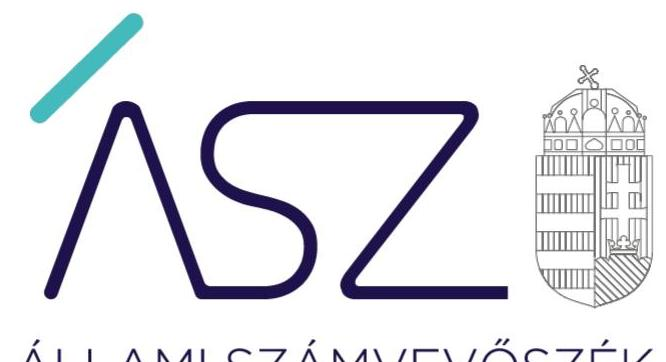
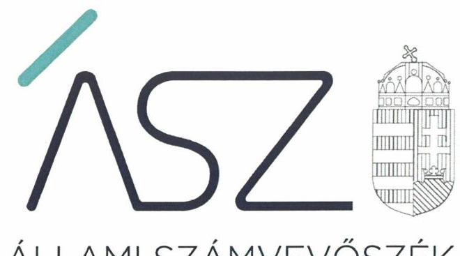
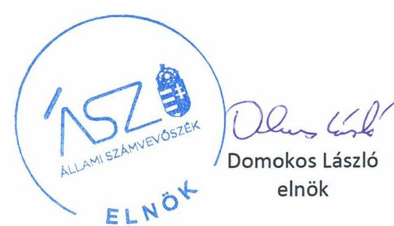
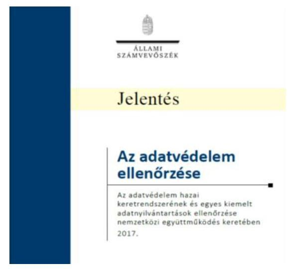

ÁLLAMI SZÁMVEVŐSZÉK

# JELENTÉS 

## Utóellenőrzések

Az adatvédelem ellenőrzése - Az adatvédelem hazai keretrendszerének és egyes kiemelt adatnyilvántartások ellenőrzése nemzetközi együttműködés keretében

2020
20077
www.asz.hu

---

ÁLLAMI SZÁMVEVŐSZÉK

# JELENTÉS 

## Utóellenőrzések

Az adatvédelem ellenőrzése - Az adatvédelem hazai keretrendszerének és egyes kiemelt adatnyilvántartások ellenőrzése nemzetközi együttműködés keretében
2020. 05. hó 22. nap

20077
www.asz.hu

---

# AZ ELLENŐRZÉST FELÜGYELTE: 

MAKKAI MÁRIA felügyeleti vezető

## AZ ELLENŐRZÉST VEZETTE ÉS A VÉGREHAJTÁSÁÉRT FELELŐS:

ÓDOR ZOLTÁN TAMÁS ellenőrzésvezető

## A PROGRAM ÖSSZEÁLLÍTÁSÁÉRT FELELŐS:

TÓTPÁL SZABOLCS osztályvezető

## A TÉMÁHOZ KAPCSOLÓDÓ KORÁBBI SZÁMVEVŐSZÉKI JELENTÉSEK:

- címe: Az Adatvédelem ellenőrzése - Az adatvédelem hazai keretrendszerének és egyes kiemelt adatnyilvántartások ellenőrzése nemzetközi együttműködés keretében
- sorszáma: 17061

IKTATÓSZÁM: EL-2535-002/2020
TÉMASZÁM: 2460
ELLENŐRZÉS-AZONOSÍTÓ SZÁM: V0804140, V0804143, V0804144, V0804145, V0804146, V0804148, V0804149, V0804150

---

# TARTALOMJEGYZÉK 

■ ÖSSZEGZÉS ..... 5
■ AZ ELLENŐRZÉS CÉLJA ..... 6
■ AZ ELLENŐRZÉS TERÜLETE ..... 7
■ AZ ELLENŐRZÉS HÁTTERE, INDOKOLTSÁGA ..... 8
■ A JELENTÉS LÉNYEGES KÉRDÉSKÖRE ..... 9
■ AZ ELLENŐRZÉS HATÓKÖRE ÉS MÓDSZEREI ..... 10
■ MEGÁLLAPÍTÁSOK ..... 12
■ MELLÉKLETEK ..... 15
I. sz. melléklet: A nemzeti adatvagyon körébe tartozó nyilvántartások kiemelt adatkezelői és az adatkezelők felett adatvédelmi és adatbiztonsági felügyeletet gyakorló hatóságok intézkedési terveinek végrehajtása ..... 15
■ FÜGGELÉK: ÉSZREVÉTELEK ..... 21
■ RÖVIDÍTÉSEK JEGYZÉKE ..... 23

---

.

---

# ÖSSZEGZÉS 

Javult az adatkezelés biztonsága mivel a Belügyminisztériumnál, a Nemzeti Adatvédelmi és Információszabadság Hatóságnál, a Nemzeti Adó-és Vámhivatalnál, a Nemzeti Egészségbiztosítási Alapkezelőnél valamint az Oktatási Hivatalnál a vállalt intézkedéseket végrehajtották. A Nemzeti Kibervédelmi Intézet adatvédelmi és adatbiztonsági felügyeleti feladatainak ellátásával kapcsolatos kockázatok egy része továbbra is fennmaradt.

## Az ellenőrzés társadalmi indokoltsága

Az Állami Számvevőszék stratégiájában célul tűzte ki a számvevőszéki munka hasznosulásának javítását. Ezzel összhangban ellenőrzi, hogy az ellenőrzött szervezetek megvalósították-e a korábbi ellenőrzései által feltárt hibák, hiányosságok és szabálytalanságok megszüntetése céljából elkészített intézkedési tervekben foglaltakat. A rendszeres utóellenőrzések hozzájárulnak a szükséges intézkedések tényleges végrehajtásához, ezáltal a közpénzügyek rendezettségének javulásához.

A digitalizáció - ami az egész világon és Magyarországon is átszövi a gazdaság és a társadalom működésének legtöbb területét - egyik kulcskérdése az adatok védelmének biztosítása. A közigazgatás is egyre inkább digitalizálódik, aminek hatása van a közigazgatás hatékonyságára. Ez egy komoly feladat, ami nagy kihívás elé állítja a közigazgatást. Alapvető biztonsági érdek az adatvagyon fokozott biztonságáról való gondoskodás, ami egyben a szolgáltatások biztonságát is jelenti és kulcsgaranciája az ügyfélbarát, hatékony ügyintézésnek, az állampolgárok államba vetett bizalmának megerősítésének. Ezzel összefüggésben kiemelten fontos az adatok védettsége érdekében vállalt intézkedések utóellenőrzése.

## Főbb megállapítások, következtetések

Öt adatkezelő szervezetnél az intézkedések végrehajtásával javult az adatkezelés biztonsága, az adatok védettsége szempontjából csökkent a sérülékenység kockázata.

A Belügyminisztérium és a Nemzeti Adó- és Vámhivatal elvégezte az adatkezeléshez használt elektronikus rendszerek biztonsági osztályba sorolását, valamint a Nemzeti Egészségbiztosítási Alapkezelő és a Nemzeti Adó- és Vámhivatal a törvényi előírásoknak megfelelően végrehajtotta a szervezet egészének biztonsági szintbe sorolását.

A Nemzeti Adatvédelmi és Információszabadság Hatóság intézkedett, hogy az adatvédelmi nyilvántartása tartalmazza a belső adatvédelmi felelősök nevét és elérhetőségét. Továbbá az Oktatási Hivatal az informatikai rendszerének üzemeltetését átvette a külső szolgáltatótól, így a logikai biztonsági szabályozást belső szabályrendszere biztosította.

A Nemzeti Kibervédelmi Intézetnél az információs rendszerek biztonságának felügyeletével kapcsolatos feladatok ellátása során továbbra is elmaradtak a biztonsági besorolásra vonatkozó hatósági ellenőrzések és azok eredményei alapján végrehajtandó intézkedések.

---

# AZ ELLENŐRZÉS CÉLJA 

Az ellenőrzés célja annak értékelése volt, hogy a számvevőszéki jelentésben ${ }^{1}$ foglalt intézkedést igénylő megállapításokkal összhangban készített intézkedési tervben meghatározott feladatokat az ellenőrzött szervezet végrehajtotta-e.

---

# AZ ELLENŐRZÉS TERÜLETE 

## A nemzeti adatvagyon körébe tartozó nyilvántartások kiemelt adatkezelői és az adatkezelők felett adatvédelmi és adatbiztonsági felügyeletet gyakorló hatóságok

A nemzeti adatvagyon az Nvtv². alapján a nemzeti vagyon részét képezi, így a nemzeti vagyonra vonatkozó alkotmányos követelmények vonatkoznak rá. A nemzeti adatvagyon fogalmát törvény a közfeladatot ellátó szervek által kezelt közérdekű adatok, személyes adatok és közérdekből nyilvános adatok összességeként határozza meg.

A nemzeti adatvagyon fokozottabb védelméért, az állampolgárok államba vetett bizalmának fenntartása, valamint a közigazgatás folyamatos és zavartalan működésének biztosítása érdekében külön törvényt alkotott az Országgyűlés (Ibtv. ${ }^{3}$ ).

Az adatvédelem ellenőrzése címmel készített 17061. számú számvevőszéki jelentését az ÁSZ 2017. március 14-én hozta nyilvánosságra. A jelentés az adatkezelést (feldolgozás, nyilvántartás, továbbítás) az adatvédelem hazai keretrendszerének és egyes kiemelt adatnyilvántartások ellenőrzése nemzetközi együttműködés keretében hat adatkezelő szervezet, a NAV ${ }^{4}$, az OEP ${ }^{5}$ (2017. január 1-től NEAK ${ }^{6}$ ), az ONYF ${ }^{7}$, a Kincstár ${ }^{8}$, az $\mathrm{OH}^{9}$, a KEKKH ${ }^{10}$ (2017. január 1-től $\mathrm{BM}^{11}$ ) tevékenységén keresztül értékelte. Az ellenőrzés kiterjedt a NAIH ${ }^{12}$ és a NEIH ${ }^{13}$ (2015. július 16-ai hatállyal az NBSZ ${ }^{14}$ Nemzeti Kibervédelmi Intézetének hatósági osztályaként folytatta feladatainak ellátását) által az adatkezelő szervezeteknél elvégzett hatósági tevékenység értékelésére is.

Az ellenőrzés megállapításaihoz kapcsolódóan az ÁSZ tv. 33. § (1) bekezdése alapján az ellenőrzött szervezetek vezetői intézkedési tervet készítettek.

Az ONYF és a Kincstár Intézkedési tervének végrehajtását az ÁSZ a 2019. február 7-én megjelent 19032 számú, A Magyar Államkincstár ellenőrzési tevékenységének ellenőrzése" című jelentésében értékelte.

---

# AZ ELLENŐRZÉS HÁTTERE, INDOKOLTSÁGA 

Az ÁSZ tv ${ }^{15}$. 33. § (1) bekezdése értelmében a számvevőszéki jelentések intézkedést igénylő megállapításaihoz és javaslataihoz kapcsolódóan az ellenőrzött szervezet vezetője intézkedési tervet köteles összeállítani, és az Állami Számvevőszék részére megküldeni.

Az ÁSZ által befogadott intézkedési tervben foglaltak megvalósítását az ÁSZ törvény 33. § (7) bekezdésében foglaltak alapján - az Állami Számvevőszék utóellenőrzés keretében ellenőrizheti. Az utóellenőrzések keretében - az intézkedések értékelése során - az Állami Számvevőszék figyelembe veszi az ellenőrzött szervezetek működési feltételeiben, valamint a jogszabályi előírásokban bekövetkezett változásokat.

Az intézkedések végrehajtásával az adott terület szabályszerű működése vonatkozásában a kockázatok csökkenhetnek, azonban hosszabb távon az intézkedési tervben foglaltak végrehajtásával önmagában nem szűnnek meg, csak akkor, ha beépülnek az ellenőrzött szervezet működésébe, azokat folyamatosan karban tartják, figyelembe véve, illetve kezelve a változásokat. Emellett az intézkedések végrehajtásáig újabb kockázatok merülhetnek fel a szabályszerű működés vonatkozásában, amelyek kezelése szintén kiemelten fontos az ellenőrzött szervezet számára.

Az ellenőrzött szervezet vezetője által készített intézkedési tervekben foglalt feladatok hiányos, illetve késedelmes végrehajtása, vagy annak elmaradása a szabályszerűség és a felelős vezetői magatartás vonatkozásában kockázatot hordoz, ami azt mutatja, hogy az ellenőrzések során feltárt hibák, hiányosságok és szabálytalanságok kezelése nem kapott kellő hangsúlyt. Az utóellenőrzés során is fennálló szabálytalanságok esetén a közpénz, közvagyon veszélyeztetettségi kockázat valószínűsített hatásának értékelése további intézkedéseket vonhat maga után.

Az ellenőrzött szervezet szintjén az utóellenőrzés feltárja, hogy a szervezet az intézkedések végrehajtásával hasznosította-e a korábbi ellenőrzési jelentésben a hiányosságok megszüntetése, illetve a kockázatok kezelése érdekében megfogalmazott javaslatokat, illetve az intézkedések végrehajtása elmaradásának következtében továbbra is fennálló szabálytalanság esetén értékeli a közpénzek, közvagyon veszélyeztetettségét. Az ÁSZ szintjén az utóellenőrzés visszacsatolást ad az ellenőrzési jelentések hasznosulásáról, az intézkedések elmaradásának, vagy részleges megvalósulásának a közpénzek, közvagyon veszélyeztetettségére gyakorolt valószínűsített hatásának értékelése, további intézkedéseket vonhat maga után.

---

# A JELENTÉS LÉNYEGES KÉRDÉSKÖRE 

Az ellenőrzött szervezetek az intézkedési tervekben foglaltakat az előírt határidőben végrehajtották-e?

---

# AZ ELLENŐRZÉS HATÓKÖRE ÉS MÓDSZEREI 

## Az ellenőrzés típusa

Megfelelőségi ellenőrzés.

## Az ellenőrzött időszak

Az utóellenőrzés alapját képező számvevőszéki jelentés közzétételének napjától (2017. március 14.) az ellenőrzésről szóló kiértesítő levél keltének napjáig (2019. december 16.) tartó időszak.

## Az ellenőrzés tárgya

A számvevőszéki jelentésben foglalt megállapításokkal összhangban az ellenőrzött szervezetek által készített intézkedési tervben foglaltak végrehajtásának ellenőrzése.

## Az ellenőrzött szervezet

A NAV, NEAK, OH, BM., valamint a NAIH és a Nemzeti Kibervédelmi Intézet.

## Az ellenőrzés jogalapja

Az utóellenőrzés jogszabályi alapját az ÁSZ tv. 33. § (7) bekezdésének előírásai képezik.

## Az ellenőrzés módszerei

Az ellenőrzést az ellenőrzött időszakban hatályos jogszabályok, az ellenőrzés szakmai szabályai, a jelen ellenőrzésre irányadó ÁSZ módszertanok, az ellenőrzési programban foglalt értékelési szempontok szerint, önállóan végezte az ÁSZ.

Az ÁSZ az ellenőrzés ideje alatt az ellenőrzött szervezetekkel történő kapcsolattartást az ÁSZ SZMSZ ${ }^{16}$-ének vonatkozó előírásai alapján biztosította.

Az ellenőrzési kérdések megválaszolásához szükséges bizonyítékok megszerzése az ellenőrzött által rendelkezésre bocsátott dokumentumokra, adatokra alapozva megfigyelés, szemle (szemrevételezés), kérdésfeltevés (információkérés), alkalmazásával történt. Az ellenőrzési bizonyítékként felhasználható adatforrások közé tartoztak egyrészt az ellenőrzési

---

program részletes szempontjainál felsorolt adatforrások, másrészt minden - az ellenőrzés folyamán feltárt, az ellenőrzés szempontjából információt tartalmazó - dokumentum.

Az intézkedési tervekben előírt feladatokat azok végrehajthatósága, illetve végrehajtása szempontjából az alábbiak szerint értékelte az ÁSZ:
$\longrightarrow$ „határidőben végrehajtott" a feladat, ha a teljesítés dokumentáltan, az intézkedési tervben előírt határidőben és tartalommal megtörtént;
$\longrightarrow$ „határidőn túl végrehajtott" a feladat, ha annak teljesítése az intézkedési tervben meghatározott módon, de az abban előírt határidőn túl történt meg;
$\longrightarrow$ „részben végrehajtott" a feladat, ha annak végrehajtása nem teljes körűen az intézkedési tervben előírt módon történt meg;
$\longrightarrow$ „nem végrehajtott" a feladat, ha a végrehajtás nem történt meg, dokumentumokkal nem igazolt annak teljesítése;
$\longrightarrow$ „okafogyottá vált" a feladat, ha végrehajtására - meghatározott esemény bekövetkezése, továbbá külső körülmény, a működést érintő feltétel változása miatt - már nincs szükség, illetve lehetőség, és egyértelműen megállapítható, hogy az intézkedést szükségessé tevő körülmény a jövőben nem fordulhat elő;
$\longrightarrow$ „nem időszerű" az a feladat, amelynek ellenőrzési időszakon belüli végrehajtására azért nem került (kerülhetett) sor, mert az intézkedés alapjául szolgáló esemény nem következett be, de annak jövőbeni előfordulása lehetséges, a végrehajtása nem volt esedékes, vagy a végrehajtás határideje még nem járt le.
Az ellenőrzés lefolytatásához az ellenőrzött szervezet a tanúsítványok elektronikus kitöltésével, valamint az ÁSZ által kért dokumentumok elektronikus megküldésével szolgáltatott adatokat, amelyek valódiságát és teljes körűségét az ellenőrzött szervezet vezetője által tett teljességi és hitelességi nyilatkozat igazolta. Az így rendelkezésre bocsátott adatok, információk kontrollja az ellenőrzés keretében történt.

---

# MEGÁLLAPÍTÁSOK

## Az ellenőrzött szervezetek az intézkedési tervekben foglaltakat az előírt határidőben végrehajtották-e?

Összegző megállapítás

A Nemzeti Adatvédelmi és Információszabadság Hatóság, a Nemzeti Egészségbiztosítási Alapkezelő és a Belügyminisztérium, az Oktatási Hivatal, valamint a Nemzeti Adó- és Vámhivatal adatvédelemmel és adatbiztonsággal kapcsolatos feladatait, valamint döntési és végrehajtási kötelezettségére irányuló intézkedéseit végrehajtotta. A Nemzeti Kibervédelmi Intézet intézkedési tervében szereplő felügyeleti tevékenységével kapcsolatos feladatait részben hajtotta végre.

Az ellenőrzött szervezetek intézkedési terveiben vállalt feladatok végrehajtásának értékelését az 1. táblázat tartalmazza.

1. táblázat

FELADATOK VÉGREHAJTÁSA ÉRTÉKELÉSI KATEGÓRIÁNKÉNT ÉS ELLENŐRZÖTT SZEVEZETEKKÉNT

|   | NAIH | BM | OH | NN | NEAK | NAV | Összesen  |
|---|---|---|---|---|---|---|---|
|  Határidőben végrehajtott feladatok | 3 | 1 | 1 |  | 1 |  | 6  |
|  Határidőn túl végrehajtott feladatok |  | 2 |  | 1 |  | 6 |
 9  |
|  Részben végrehajtott feladatok |  |  |  |  |  | 1 | 1  |
|  Okafogyottá vált feladatok |  |  |  |  |  | 1 | 1  |
|  Nem végrehajtott feladatok |  |  |  | 2 |  |  | 2  |
|  ÖSSZESEN | 3 | 3 | 1 | 3 | 1 | 8 | 19  |

Az ellenőrzött szervezetek intézkedési tervében meghatározott feladatokat, határidőket, a feladatok végrehajtásáért felelős személyeket, a feladatok végrehajtását az 1. melléklet mutatja be.

A Belügyminisztérium, az OH, a NAV és a NAIH intézkedési tervében meghatározott feladatok végrehajtásáról nyilvántartását a $\mathrm{Bkr}^{17}$ előírásai szerinti tartalommal vezette. A Nemzeti Kibervédelmi Intézet és a NEAK a Bkr. 14. § (1) bekezdésében előírt nyilvántartást nem vezette.

## AZ ELEKTRONIKUS ADATKEZELŐ RENDSZEREK ADMINISZTRATÍV ÉS FIZIKAI ÉS LOGIKAI BIZTONSÁGÁT az Oktatási Hivatal a NYAK-REX informatikai rendszerének külső szolgáltatótól a saját adatközpontjába történő telepítésével, a forráskód és az üzemeltetés teljes átvételével valósította meg. Így a logikai biztonsági szabályozást az Oktatási Hivatal belső szabályrendszere biztosította.

---

# AZ ADATKEZELÉSHEZ HASZNÁLT ELEKTRONIKUS RENDSZEREK BIZTONSÁGI OSZTÁLYBA SO-

ROLÁSÁT az adatok kockázatokkal arányos védelme érdekében a NAV elvégezte, azonban az Informatikai Biztonsági Szabályzatának ${ }^{18}$ felülvizsgálata és módosításakor az Ibtv. 7.§ (3) bekezdésében előírtak ellenére a szabályzatban nem módosították az egyes adatkezelésre használt rendszerek biztonsági osztályba sorolását.

A Belügyminisztérium elvégezte a hiányzó hatósági fegyvernyilvántartás biztonsági osztályba sorolását, továbbá az adatvédelemmel kapcsolatos kockázatok csökkentése érdekében új adatvédelmi szabályzatot ${ }^{19}$ adott ki, valamint teljes körűen elkészítette a nemzeti adatvagyon kezelésével és feldolgozásával kapcsolatos tevékenységekre vonatkozó ellenőrzési nyomvonalakat.

## AZ ADATKEZELŐ SZERVEZETEK EGÉSZÉNEK BIZTONSÁGI SZINT SZERINT BESOROLÁSÁT a kock

ázatokkal arányos, költséghatékony védelem kialakítása érdekében a NEAK és a NAV elvégezte, a besorolásokat a NEAK módosított Informatikai Biztonsági Szabályzata ${ }^{20}$, a NAV esetében a felülvizsgált Informatikai Biztonsági Szabályzata tartalmazza.

## AZ ADATKEZELŐ SZERVEZETEK ELLENŐRZÉSI, FELÜGYELETI FELADATAINAK ELLÁTÁSA érdekében

a NAIH módosította az adatvédelmi nyilvántartásba történő bejelentkezés kisalkalmazást, ezzel a törvényi előírásnak megfelelően lehetővé tette a belső adatvédelmi felelősök nevének és elérhetőségének rendelkezésre állását.

A Nemzeti Kibervédelmi Intézet az információs rendszerek felügyeletével kapcsolatos intézkedési tervében vállalt feladatait nem hajtotta végre teljes körűen, mert az Ibtv. 14.§ (2) bekezdés a) pontjában foglaltak ellenére, az adatkezelő szervezetek által megállapított biztonsági osztályba sorolást és a biztonsági szint megállapítást nem ellenőrizte. Ennek megfelelően az Ibtv. 14.§ (2) bekezdés c) pontjában rögzített, biztonsági hiányosságok elhárításának elrendelésére sem kerülhetett sor. Annak ellenére, hogy a Nemzeti Kibervédelmi Intézet kidolgozta kockázatelemzési módszertanát az elektronikus információs rendszerek sérülékenységével kapcsolatos kockázatok egy része fennmaradt, mivel az Ibtv. 14.§ (2) bekezdés d) pontjában előírtak ellenére az állapotfelmérések, cselekvési tervek felülvizsgálata nem történtek meg, az intézkedést lezáró határozatokat, valamint kockázatelemzésen alapuló éves ellenőrzési terveket nem készített.

---

.

---

# MELLÉKLETEK

- I. SZ. MELLÉKLET: A NEMZETI ADATVAGYON KÖRÉBE TARTOZÓ NYILVÁNTARTÁSOK KIEMELT ADATKEZELŐI ÉS AZ ADATKEZELŐK FELETT ADATVÉDELMI ÉS ADATBIZTONSÁGI FELÜGYELETET GYAKORLÓ HATÓSÁGOK INTÉZKEDÉSI TERVEINEK VÉGREHAJTÁSA

|  Sorszám | Intézkedési tervben meghatározott feladat | Az intézkedési tervben meghatározott határidő | Az intézkedési tervben meghatározott feladat felelőse | A feladat végrehajtása  |
| --- | --- | --- | --- | --- |
|  1. | Az állami és önkormányzati szervek elektronikus információbiztonságáról szóló 2013. évi L. törvény 7. § (1) bekezdésében foglaltaknak megfelelően biztosítani szükséges a hatósági fegyvernyilvántartás biztonsági osztályba sorolását. | 2017. március 31. | Bűnügyi Nyilvántartási Hatóság főosztályvezetője
Informatikai Főosztály vezetője | A hatósági fegyvernyilvántartás biztonsági osztályba (EIR osztályba) sorolása 2017. március 31-án megtörtént  |
|  2. | Ellenőrizni szükséges, hogy a nemzeti adatvagyon kezelésével és feldolgozásával kapcsolatos tevékenységekre vonatkozóan a Belügyminisztérium teljes körűen rendelkezik-e ellenőrzési nyomvonalai. | 2017. május 31. | BM NyHÁT főosztályvezetői Ellenőrzési Főosztály (tanácsadói tevékenység keretében) | Az ügyrendek mellékleteit képező a nyomvonalakat 2017. május 31-én elkészítették  |
|  3. | A volt KEKKH szervezeti beolvadásával az adatvédelemre és a közérdekű adat megismerésére vonatkozó együttes új belső szabályozást ki kell alakítani, új adatvédelmi szabályzatot kell kiadni. A NAIH irányába a szükséges bejelentéseket meg kell tenni. | 2017. március 31. | Határidőn túl végrehajtott feladatok
Iratkezelési és Adatvédelmi Főosztály vezetője
BM belső adatvédelmi felelős
N.SIS Hivatal főosztályvezetője | 9/2017. (IV. 28.) BM utasítás, a Belügyminisztérium adatvédelmi, adatbiztonsági és közérdekű adat megismerésére vonatkozó szabályzatáról 2017. május 3-án lépett hatályba.  |

---

|  4. | Az adatvédelmi nyilvántartásba történő bejelentkezést biztosító kisalkalmazásban, a kapcsolattartó jelölhesse, hogy belső adatvédelmi felelősökként kéri az adatkezelés nyilvántartásba vételét. | 2017. május 31. | Informatikai, Ügyviteli és Nyilvántartási főosztályvezető-helyettes | A NAIH 2017. április 25-én módosította a bejelentő alkalmazás felületét, így az alkalmas a feladatban szereplő funkció ellátására.  |
| --- | --- | --- | --- | --- |
|  5. | Az adatvédelmi nyilvántartásban szereplő adatkezelések kapcsolattartóinak e-mailben történő megkeresése, legalább azzal kapcsolatban, hogy belső adatvédelmi felelősökként nyújtották-e be az adatkezelés nyilvántartásba vételére vonatkozó beadványukat. | 2017. június 15. | Informatikai, Ügyviteli és Nyilvántartási főosztályvezető-helyettes | A NAIH 2017. június 9-ig több lépcsőben a kapcsolattartóknak levelet küldött a feladatban szereplő tartalommal.  |
|  6. | 3. Az adatvédelmi nyilvántartásba bejelentkezett adatkezelők nyilatkozatot tevő belső adatvédelmi felelősöknek és elérhetőségüknek a kereshetővé tétele és nyilvánosságra hozása. | 2017. július 12. | Informatikai, Ügyviteli és Nyilvántartási főosztályvezető | A NAIH 2017. június 27-én adatbázist hozott létre melyben kereshetőek az adatkezelők, nyilatkozatot tevő belső adatvédelmi felelősök és azok elérhetőségei.  |
|   |  |  |  | **NEMZETI ADÓ- ÉS VÁMHIVATAL**
**Határidőn túl végrehajtott feladatok**  |
|  7. | A 2013. évi L. törvény 11. § (1) bekezdés c, pontja szerint kijelölt elektronikus információs rendszerek biztonságáért felelős személy kijelölése (IT Biztonsági vezető) | 2017.03.31 | a NAV vezetője | Az elektronikus információs rendszerek biztonságáért felelős személy kijelölése (IT Biztonsági vezető) 2017. május 26-án megtörtént.  |
|  8. | Alkalmazások katalogizálásához (Alkalmazás Kataszter, AKA) és az Elektronikus Információs Rendszerek (EIR) meghatározásához kapcsolódó koncepció kidolgozása, a koncepció belső validálása. A feladat a nagyszámú (Kb. 600) alkalmazás ésszerű kezelhetősége érdekében szükséges. | 2017.04.30 | A kijelölt IT biztonsági vezető | A NAV a koncepciót elkészítette, "Nemzeti Adó- és Vámhivatal Elektronikus Információs Rendszereinek Meghatározása" címmel, 2017. május 31-én.  |

---

|  9. | AKA rendszer felülvizsgálata, esetleges tovább fejlesztése, Elektronikus Információs Rendszerek (EIR) meghatározása, ezt követően az AKA alkalmassá tétele az EIR besorolás szerinti statisztikák elkészítésére. | 2017.07.31 | A kijelölt IT biztonsági vezető | Az Elektronikus Információs Rendszerek (EIR) meghatározása, az AKA alkalmassá tétele az EIR besorolás szerinti statisztikák elkészítésére elkészült 2018. október 31-re  |
| --- | --- | --- | --- | --- |
|  10. | Elektronikus Információs Rendszerek biztonsági osztályba sorolása | 2017.10.31 | A kijelölt IT biztonsági vezető | Az elektronikus információs rendszerek biztonsági osztályba sorolása 2019. március 25. napon végrehajtásra került.  |
|  11. | A NAV érintett szervezeti egységeinek meghatározása és azok biztonsági szintbe sorolása. | 2017.11.01 | A kijelölt IT biztonsági vezető | A NAV Informatikai Biztonsági Szabályzatának felülvizsgálata és módosítása megtörtént, a módosított IBSZ 2018. 03.20-án lépett hatályba. A biztonsági szintbe sorolást az IBSZ 4. mellékletének 2. pontja tartalmazza.  |
|  12. | A NAV Informatikai Biztonsági Szabályzatának felülvizsgálata, módosítása | 2017.12.31 | A kijelölt IT biztonsági vezető | A NAV Informatikai Biztonsági Szabályzatának felülvizsgálata és módosítása megtörtént a módosított IBSZ 2018. 03.20-án lépett hatályba.  |

---

|  Sorszám | Intézkedési | Az intézkedési | Az intézkedési | A feladat végrehajtása  |
| --- | --- | --- | --- | --- |
|   |  | tervben | tervben |   |
|   | Intézkedési tervben meghatározott | meghatározott | meghatározott feladat |   |
|   | feladat | határidő | felelőse |   |
|   |  |  | Részben végrehajtott feladatok |   |
|  13. | Az Állami Számvevőszék vizsgálati jelentésének 21. oldal harmadik bekezdése szerint az adatkezeléshez használt elektronikus rendszerek biztonsági osztályba sorolásának eredménye, azaz az egyes rendszerek biztonsági osztálya- az Ibtv. 7. § (3) bekezdése ellenére-a NAV IBSZ-ébe nem került rögzítésre. a NAV Informatikai Biztonsági Szabályzatának a 2160578297 sz. intézkedési terv 6. pontja szerinti felülvizsgálata során intézkedni kell az iránt is, hogy az IBSZ-ben kerüljön rögzítésre- - az elektronikus információs rendszerek karbantartási rendje, - az elektronikus információs rendszerek biztonsági beállításaival kapcsolatos feladatokra, elvárásokra, jogokra vonatkozó szabályozás, - a hozzáférési szabályok betartásának ellenőrzésére vonatkozó szabályozás, - az adatkezeléshez használt elektronikus rendszerek biztonsági osztályba sorolásának eredménye, azaz az egyes rendszerek biztonsági osztálya. | 2017.12.31 | A kijelölt IT biztonsági vezető | Végrehajtott intézkedés:
A NAV 2018. 03.20-án hatályba lépett, módosított Informatikai Biztonsági Szabályzatának felülvizsgálata és módosítása tartalmazza:
- az elektronikus információs rendszerek karbantartási rendjét,
- az elektronikus információs rendszerek biztonsági beállításaival kapcsolatos feladatokra, elvárásokra, jogokra vonatkozó szabályozást,
- a hozzáférési szabályok betartásának ellenőrzésére vonatkozó szabályozást
Nem végrehajtott intézkedés:
Nem került rögzítésre a módosított IBSZ-ben:
- az adatkezeléshez használt elektronikus rendszerek biztonsági osztályba sorolásának eredménye, azaz az egyes rendszerek biztonsági osztálya.  |
|   |  |  |  | Okafogyottá vált feladatok  |
|  14. | A KOCKA2 és a Diszpécser modul 2015. végén kerültek bevezetésre, és bár az ÁSZ vizsgálat ellenőrzési időszakának végéig (2015. december 31.) a modulok biztonsági besorolása hiányzott, 2016. májusában a besorolásuk megtörtént; mindkét modul biztonsági osztályba sorolása: 4. | - | - | A KOCKA2 és a Diszpécser rendszerek biztonsági szintbe sorolása az ÁSZ jelentés közzétételének napjáig (2017. 03. 14) megtörtént.  |

---

|  14. | Intézkedési | Az intézkedési | Az intézkedési | A feladat végrehajtása  |
| --- | --- | --- | --- | --- |
|   |  | tervben | tervben |   |
|   | Intézkedési tervben meghatározott | meghatározott | meghatározott feladat |   |
|   | feladat | határidő | felelőse |   |
|   |  |  | NEMZETI EGÉSZSÉGRIZTOSÍTÁSI ALAPKEZELŐ |   |

   |  |  | Határidőben végrehajtott feladatok |   |
|  15. | Az Ibtv. előírásainak megfelelően a szervezet egészének biztonsági szintbe sorolása az Informatikai Biztonsági Szabályzatban. Az intézkedés teljesítésének indikátora: hatályba lép a 7/2016. IBSZ. Főigazgatói Szabályzat. | 2016. március 24. | Informatikai főigazgató-helyettes | A Nemzeti Egészségbiztosítási Alapkezelői Informatikai Biztonsági Szabályzata, 1. sz. melléklete, tartalmazza a szervezet egészének biztonsági szintbe sorolását. A 7/2016. IBSZ hatálybalépésének dátuma 2016. március 24.  |
|   |  |  | NEMZETI KIBERVÉDELMI INTÉZET |   |
|   |  |  | Határidőn túl végrehajtott feladatok |   |
|  16. | Kockázatelemzési módszertan kidolgozása. A kockázatelemzések eredményeinek figyelembe vétele az ellenőrzési tevékenység megtervezése során. | Kockázatelemzési módszertan kidolgozására 2017. november 1., azt követően folyamatos | Hatósági Főosztály vezetője | A Hatósági Főosztály vezetője, határidőn túl, 2017. december 13-ával kidolgozta a kockázatkezelési módszertant  |
|   |  |  | Nem végrehajtott feladatok |   |
|  17. | A Hatóság az Ibtv. 15. § (1) szerinti nyilvántartásba vétel során meggyőződik arról, hogy az aktuális állapot felmérése, az Ibtv. 8. § (5) szerinti cselekvési tervek és az Informatikai Biztonsági Szabályzat tartalma összhangban vannak-e egymással a biztonsági osztályba sorolás, valamint a biztonsági szintbe sorolás tekintetében, a biztonsági osztály és a biztonsági szint a nyilvántartás céljából megküldött adatokkal összhangban történt-e, és hogy a megküldött dokumentumok a formai követelményeknek megfelelnek-e. | 2017. június 30, azt követően folyamatos | Hatósági Főosztály vezetője | Az állapotfelmérés a cselekvési tervek felülvizsgálata nem történt meg, valamint az Ibtv. 14. § (2) bekezdés a) pontjában foglaltak ellenére a biztonsági osztályba sorolást és a biztonsági szint megállapítását a Nemzeti Kibervédelmi Intézet nem ellenőrizte az adatkezelő szervezeteknél. A Nemzeti Kibervédelmi Intézet az adatkezelő szervezetek által megállapított biztonsági osztályokat és biztonsági szinteket érdemi felülvizsgálat nélkül vette nyilvántartásba.  |
|  18. | A Hatóság az ellenőrzései során a feltárt hiányosságok kiküszöbölésére az Ibtv. 14. § (2) | 2017. június 30, azt követően folyamatos | Hatósági Főosztály vezetője | Az ellenőrzések elmaradása miatt a Nemzeti Kibervédelmi Intézet nem tárta fel az adatkezelő szervezetek által használt elektronikus információs rendszerek hiányosságait. Ebből eredően nem került sor az Ibtv. 14. § (2) bekezdés c) pontja alapján a biztonsági hiányosságok elhárításának elrendelésére, és annak eredményessége ellenőrzésére sem.  |

---

|  18 | Intézkedési | Az intézkedési | Az intézkedési | A feladat végrehajtása  |
| --- | --- | tervben | tervben |   |
|   |  | meghatározott | meghatározott feladat |   |
|   | bekezdés c) pontja alapján az ellenőrzést le- | határidő | felelőse |   |
|   | záró határozatban szólítja fel az adatkezelő |  |  |   |
|   | szervezeteket, és az intézkedések nyomon kö- |  |  |   |
|   | vetése érdekében az éves ellenőrzési tervében |  |  |   |
|   | a szervezetek kiválasztott mintáján utóellenő- |  |  |   |
|   | zéseket tervez, amelyeket terv szerint végre- |  |  |   |
|   | hajt. |  |  |   |
|   |  |  |  | szervezetek biztonsági osztályba sorolásának és biztonsági szint megállapításának hiányosságait.  |
|   |  |  |  |  |
|   |  |  |  | OKTATÁSI HIVATAL  |
|   |  |  |  | Határidőben végrehajtott feladatok  |
|  19. | A Hivatal 2017. március 31-én szolgáltatási | 2017. július 31. | Üzemeltetési főosztály vezetője | Az Üzemeltetési főosztály vezetője az előírt intézkedésnek határidőben eleget tett.  |
|   | szerződést kötött a NYAK-REX informatikai |  |  | Az OH 2017. március 31-én szolgáltatási szerződést kötött a NYAK-REX informatikai  |
|   | rendszer saját adatközpontjába történő költöztetésével kapcsolatban a rendszer forrás- |  |  | rendszer saját adatközpontjába történő költöztetésével kapcsolatban a rendszer forrás  |
|   | kódjának és üzemeltetésének teljes átvételével együttesen. Az átköltözés szerződés sze- |  |  | kódjának és üzemeltetésének teljes átvételével együttesen.  |
|   | rinti véghatárideje 2017. június 30. Ezzel a |  |  |   |
|   | NYAK-REX informatikai rendszer külső kiszer- |  |  |   |
|   | vezése megszűnik, és ezzel a belépési jogosults- |  |  |   |
|   | ság és az adathordozók hozzáférési korláto- |  |  |   |
|   | zása a Hivatal teljes fennhatósága alatt a Hiva- |  |  |   |
|   | tal belső szabályrendszere alapján tud mű- |  |  |   |
|   | kódni a jövőben. Tekintve, hogy a felsorolt ren- |  |  |   |
|   | deletek előírásait a Hivatal saját adatközpont- |  |  |   |
|   | jaira érvényesítve általánosan megfogalmazta, |  |  |   |
|   | az a NYAK-REX informatikai rendszer esetében |  |  |   |
|   | is érvényesítésre kerül |  |  |   |

---

# FÜGGELÉK: ÉSZREVÉTELEK 

A jelentéstervezetet a Számvevőszék 15 napos észrevételezésre megküldte az ellenőrzött szervezetek vezetőinek az ÁSZ tv. 29. § (1) bekezdése előírásának megfelelően.

Az ÁSZ a jelentéstervezetet észrevételezésre megküldte a Nemzeti Adó- és Vámhivatal vezető államtitkárnak, a Nemzeti Egészségbiztosítási Alapkezelő főigazgatójának, az Oktatási Hivatal elnökének, a Belügyminisztérium miniszterének, a Nemzeti Adatvédelmi és Információszabadság Hatóság elnökének, a Nemzetbiztonsági Szakszolgálat Nemzeti Kibervédelmi Intézet intézetvezetőjének.
Az Oktatási Hivatal vezetője és a Nemzetbiztonsági Szakszolgálat Nemzeti Kibervédelmi Intézet intézetvezetője észrevételezési jogával nem élt.
A Nemzeti Adó- és Vámhivatal vezető államtitkára, a Nemzeti Egészségbiztosítási Alapkezelő főigazgatója, a Belügyminisztérium minisztere, a Nemzeti Adatvédelmi és Információszabadság Hatóság elnöke nemleges észrevételt tett.

[^0]
[^0]:    * 29. § (1) Az Állami Számvevőszék az ellenőrzési megállapításait megküldi az ellenőrzött szervezet vezetőjének vagy az általa megbízott személynek, és annak, akinek személyes felelősségét állapította meg.
    (2) Az ellenőrzött szervezet vezetője és a felelősként megjelölt személy az ellenőrzés megállapításaira tizenöt napon belül írásban észrevételt tehet.
    (3) Az Állami Számvevőszék az észrevételre a beérkezésétől számított harminc napon belül írásban válaszol. A figyelembe nem vett észrevételeket köteles a jelentésben feltüntetni, és megindokolni, hogy azokat miért nem fogadta el.

---

.

---

# RÖVIDÍTÉSEK JEGYZÉKE 

${ }^{1}$ számvevőszéki jelentés
${ }^{2}$ Nvtv
${ }^{3}$ Ibtv.
${ }^{4}$ NAV
${ }^{5}$ OEP
${ }^{6}$ NEAK
${ }^{7}$ ONYF
${ }^{8}$ Kincstár
${ }^{9} \mathrm{OH}$
${ }^{10}$ KEKH
${ }^{11} \mathrm{BM}$
${ }^{12}$ NAIH
${ }^{13}$ NEIH
${ }^{14}$ NBSZ
${ }^{15}$ ÁSZ tv.
${ }^{16}$ ÁSZ SZMSZ
${ }^{17}$ Bkr.
${ }^{18}$ Informatikai Biztonsági Szabályzat
${ }^{19}$ Adatvédelmi szabályzat
${ }^{20}$ Informatikai Biztonsági Szabályzat
„Az adatvédelem hazai keretrendszerének és egyes kiemelt adatnyilvántartások ellenőrzése nemzetközi együttműködés keretében" című 17061. számú jelentés 2011. évi CXCVI. törvény a nemzeti vagyonról, hatályos 2011. december 30-tól 2013. évi L. törvény az állami és önkormányzati szervek elektronikus információbiztonságáról, hatályos 2013. július 1-jétől
Nemzeti Adó- és Vámhivatal
Országos Egészségbiztosítási Pénztár
Nemzeti Egészségbiztosítási Alapkezelő
Országos Nyugdíjbiztosítási Főigazgatóság
Magyar Államkincstár
Oktatási Hivatal
Közigazgatási és Elektronikus Közszolgáltatások Központi Hivatala
Belügyminisztérium
Nemzeti Adatvédelmi és Információszabadság Hatóság
Nemzeti Elektronikus Információbiztonsági Hatóság
Nemzetbiztonsági Szakszolgálat
Az Állami Számvevőszékről szóló 2011. évi LXVI. törvény
Az Állami Számvevőszék elnökének 2/2019. (XII. 23.) ÁSZ utasítása az Állami Számvevőszék Szervezeti és Működési Szabályzatáról. (hatályos 2020. január 01-től)
370/2011. (XII. 31.) Korm. rendelet a költségvetési szervek belső kontrollrendszeréről és belső ellenőrzéséről.
A Nemzeti Adó- és Vámhivatal Informatikai Biztonsági Szabályzata (Aláírás dátuma 2018. március 12.; Érvényes: a kiadmányozás napját követő 5. munkanaptól

9/2017. (IV. 28.) BM utasítás a Belügyminisztérium adatvédelmi, adatbiztonsági és közérdekű adat megismerésére vonatkozó szabályzatának kiadásáról.
7/2016. számú OEP főigazgatói szabályzat, Informatikai Biztonsági Szabályzat hatályos 2016. március 24.-től. (NEAK)

---

# ASZ 

ÁLLAMI SZÁMVEVŐSZÉK
1052 Budapest, Apáczai Cs. J. u. 10. I 1364 Budapest 4. Pf. 54 TEL: +36 14849100
email: szamvevoszek@asz.hu
web: www.asz.hu | www.aszhirportal.hu

