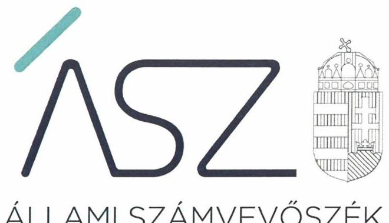
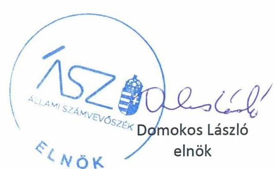
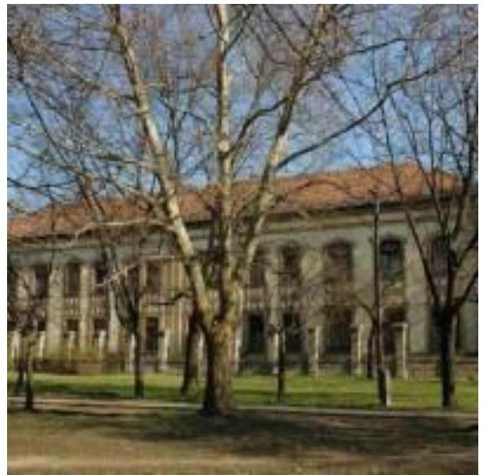
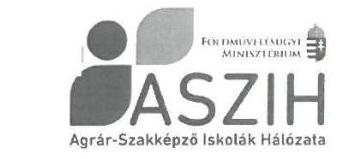
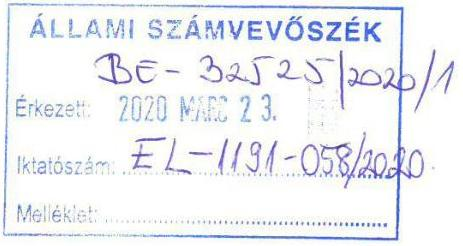
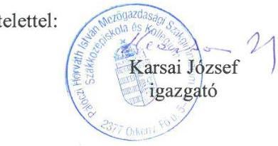
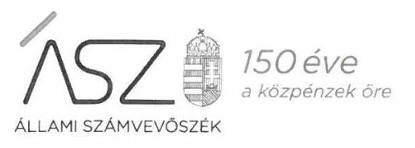
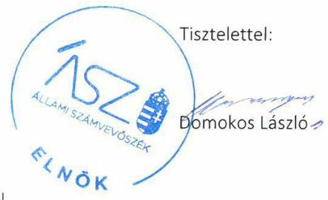
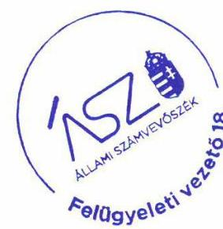

ÁLLAMI SZÁMVEVŐSZÉK

# JELENTÉS 

## Központi költségvetési szervek ellenőrzése

Pálóczi Horváth István Mezőgazdasági Szakgimnázium, Szakközépiskola és Kollégium
2020.

20078
www.asz.hu

---

ÁLLAMI SZÁMVEVŐSZÉK

# JELENTÉS 

## Központi költségvetési szervek ellenőrzése

Pálóczi Horváth István Mezőgazdasági Szakgimnázium, Szakközépiskola és Kollégium
2020. 05. hó 14. nap

20078
www.asz.hu

---

# AZ ELLENŐRZÉST FELÜGYELTE: 

KAKAS SÁNDOR felügyeleti vezető

## AZ ELLENŐRZÉST VEZETTE ÉS A VÉGREHAJTÁSÁÉRT FELELŐS:

DÉZSINÉ KIS HAJNALKA ellenőrzésvezető

## A PROGRAM ÖSSZEÁLLÍTÁSÁÉRT FELELŐS:

TÓTPÁL SZABOLCS osztályvezető

IKTATÓSZÁM: EL-2649-001/2020
TÉMASZÁM: 2450
ELLENŐRZÉS-AZONOSÍTÓ SZÁM: V079165

Jelentéseink az Országgyúlés számítógépes hálózatán és az interneten a www.asz.hu címen is olvashatóak.

---

# TARTALOMJEGYZÉK 

■ ÖSSZEGZÉS ..... 5
■ AZ ELLENŐRZÉS CÉLJA ..... 6
■ AZ ELLENŐRZÉS TERÜLETE ..... 7
■ AZ ELLENŐRZÉS HÁTTERE, INDOKOLTSÁGA ..... 8
■ A JELENTÉS LÉNYEGES KÉRDÉSKÖREI ..... 9
■ AZ ELLENŐRZÉS HATÓKÖRE ÉS MÓDSZEREI ..... 10
■ MEGÁLLAPÍTÁSOK ..... 12
■ JAVASLATOK ..... 15
■ MELLÉKLETEK ..... 17
I. sz. melléklet: Értelmező szótár ..... 17
■ FÜGGELÉK: ÉSZREVÉTELEK ..... 21
■ RÖVIDÍTÉSEK JEGYZÉKE ..... 27

---

.

---

# ÖSSZEGZÉS 

A Pálóczi Horváth István Mezőgazdasági Szakgimnázium, Szakközépiskola és Kollégium belső kontrollrendszere, pénzügyi és vagyongazdálkodása nem biztosította a közpénzek szabályos felhasználását, a nemzeti vagyonnal való átlátható és elszámoltatható gazdálkodást, nem érvényesült a felelős gazdálkodás. Az Intézmény nem volt védett a korrupcióval szemben.

## Az ellenőrzés társadalmi indokoltsága

Magyarország versenyképességének és a magyar gazdaság fejlődésének alapvető feltétele a magyar munkavállalók megfelelő szakmai képzettsége és felkészültsége, amelyben a szakképzési rendszernek döntő szerepe van. A mezőgazdaság vonatkozásában is kiemelten fontos ez, hiszen a magyar mezőgazdaság piaci versenyképességét és eredményességét nagymértékben befolyásolja az agrárszférában dolgozók képzettsége, felkészültsége. A szakképzés legjelentősebb színterei a szakképző iskolák. Az eredményes és célszerű szakképzés alapja és alapvető feltétele a szakképző intézmények közpénzekkel és a közvagyonnal való törvényes, átlátható és a korrupcióval szembeni védelmet biztosító múködése és gazdálkodása. Ezért ezen szervezetekkel szemben is alapvető társadalmi igény, hogy a rájuk bízott közpénzekkel, közvagyonnal szabályosan gazdálkodjanak. Emellett a szakképzésben részt vevő pedagógusok, tanulók és a szülők jogos elvárása, hogy a szakképző iskolák múködése átlátható és elszámoltatható legyen. Mindezen igényekkel összhangban, a közpénzügyek átláthatóságának előmozdítása, a közvagyon védelme érdekében került sor az agrár-szakképző iskolák belső kontrollrendszerének és gazdálkodásának ellenőrzésére.

## Főbb megállapítások, következtetések, javaslatok

A Pálóczi Horváth István Mezőgazdasági Szakgimnázium, Szakközépiskola és Kollégium belső kontrollrendszerének kialakítása és múködtetése nem volt szabályszerű a 2016-2017. években a szervezeti és múködési szabályzat hiánya, továbbá az integrált kockázatkezelési rendszer és a nyomon követési rendszer hiányosságai, valamint a szabálytalan gazdálkodási jogkörgyakorlás miatt. Nem biztosította a szabályszerű közpénzfelhasználás feltételeit.

A Pálóczi Horváth István Mezőgazdasági Szakgimnázium, Szakközépiskola és Kollégium pénzügyi gazdálkodása nem volt szabályszerű a 2016. évben, mert a kötelezettségvállalások nyilvántartása nem felelt meg a jogszabályi előírásoknak.

A Pálóczi Horváth István Mezőgazdasági Szakgimnázium, Szakközépiskola és Kollégium vagyongazdálkodása nem volt szabályszerű a 2016-2017. években, mert a költségvetési beszámolók mérleg tételei leltárral nem voltak alátámasztottak, ezáltal az Intézmény költségvetési beszámolója nem mutat megbízható, valós képet vagyoni helyzetéről.

A Pálóczi Horváth István Mezőgazdasági Szakgimnázium, Szakközépiskola és Kollégiumnál az integritás kontrollok kiépítettsége és múködtetése nem volt megfelelő a 2016-2017. években a szervezeti és múködési szabályzat hiánya, valamint a nem kötelezően előírt integritást erősítő kontrollok alacsony szintű működtetése miatt.

Az Állami Számvevőszék a jelentésben foglalt megállapítások alapján a Pálóczi Horváth István Mezőgazdasági Szakgimnázium, Szakközépiskola és Kollégium igazgatója részére hat javaslatot fogalmazott meg.

---

# AZ ELLENŐRZÉS CÉLJA 

AZ ELLENŐRZÉS CÉLJA annak megállapítása volt, hogy a központi költségvetési szervre vonatkozó irányító szervi feladatellátás a jogszabályi előírások betartásával történt-e; a központi költségvetési szerv belső kontrollrendszerének kialakítása és működtetése szabályszerű volt-e, biztosította-e az átlátható, szabályszerű, gazdaságos, hatékony és eredményes gazdálkodás feltételeit. Kiépítették és erősítették-e a korrupciós kockázatok kezelését szolgáló integritás kontrollokat; az intézményt érintő átszervezések lebonyolítása szabályszerűen törtét-e; megteremtették-e a teljesítményellenőrzés feltételeit. Továbbá annak megállapítása, hogy a szervezet gazdálkodása során elszámoltatható és megfelel-e annak az Alaptörvényben meghatározott alapvetésnek, hogy Magyarország a kiegyensúlyozott, átlátható és fenntartható költségvetési gazdálkodás elvét érvényesíti. Érvényesül-e a nemzeti vagyon kezelésének és védelmének célja, azaz a szervezet vagyona a közérdeket szolgálja, a közös szükségletek kielégítése és a természeti erőforrások megóvása, valamint a jövő nemzedékek szükségleteinek figyelembevétele mellett.

---

# **AZ ELLENŐRZÉS TERÜLETE**

## **Pálóczi Horváth István Mezőgazdasági Szakgimnázium, Szakközépiskola és Kollégium**

Az Örkényben található Pálóczi Horváth István Mezőgazdasági Szakgimnázium, Szakközépiskola és Kollégium köznevelési intézmény. Az Intézmény1 tevékenysége szakgimnáziumi, szakközépiskolai nevelés-oktatás és kollégiumi ellátás, valamint felnőttoktatás.

A képzések mezőgazdasági, vendéglátó ipari, valamint környezetvédelmi területen folynak.

Az Intézmény alapítója és irányító szerve a Földművelésügyi Minisztérium, jelenleg Agrárminisztérium. Az Igazgató2 személye az ellenőrzés időszakában nem változott.

Az Intézmény gazdasági szervezettel nem rendelkezett, a gazdasági szervezeti feladatokat az TM ÉSZIK3 látta el az ellenőrzött időszakban.

Az Intézmény költségvetési bevétele 2016-ban 243,6 millió Ft, 2017-ben 257,1 millió Ft volt, költségvetési kiadása 2016-ban 230,1 millió Ft, 2017-ben 248,9 millió Ft volt. Az átlagos statisztikai állományi létszám 42 fő volt a 2017. évben.

---

# AZ ELLENŐRZÉS HÁTTERE, INDOKOLTSÁGA 

Az ÁSZ ${ }^{4}$ ellenőrzi a költségvetési szervek gazdálkodását, működését, hogy megállapításaival támogassa az ellenőrzött szervezetek szabályszerű gazdálkodását, javaslataival elősegítse az Alaptörvényben ${ }^{5}$ megfogalmazott alapvetések érvényesülését a mindennapi életben a szervezetek szintjén.

Az egyes ellenőrzések megállapításaival és egy időszak ellenőrzési eredményeinek elemzésével az ÁSZ ráirányíthatja a jogalkotók figyelmét a központi alrendszerben vagy annak egy ágazatában esetlegesen felmerülő pénzügyi, szabályozási feszültségekre.

Az elvégzett ellenőrzések során az ÁSZ „jó gyakorlatokat" is azonosíthat, melyeket tanácsadó funkciója keretében szélesebb körben is megismertethet az érintettekkel, ezáltal is hozzájárulva a költségvetési rendszer szabályozott, átlátható, kiegyensúlyozott és fenntartható működéséhez.

Az ellenőrzés a szervezet kockázatértékelése alapján, az egyedi és lényeges jellemzők figyelembevételével, az ellenőrzésre kiválasztott modullal történik.

Az integritás- és belső kontroll modul a központi költségvetési szerv működésének irányítottságát, korrupció elleni védettségét értékeli.

A belső kontrollrendszer kialakítása és működtetése nélkül nem valósítható meg a közpénzek, a közvagyon átlátható, szabályos, gazdaságos, hatékony és eredményes felhasználása. A belső kontrollrendszer azt a célt szolgálja, hogy a költségvetési szervek működésük és gazdálkodásuk során a tevékenységeket szabályszerűen hajtsák végre, teljesítsék elszámolási kötelezettségeiket és megvédjék az erőforrásokat a veszteségektől, a károktól és a nem rendeltetésszerű használattól.

Az államháztartás központi alrendszerébe tartozó szervezet vagyona a nemzeti vagyon része, és az Alaptörvény is rögzíti, hogy a vagyonnal való gazdálkodás célja a közérdek szolgálata.

---

# A JELENTÉS LÉNYEGES KÉRDÉSKÖREI 

1. Az irányító szerv ellenőrzött költségvetési szervre vonatkozó feladatellátása szabályszerű volt-e?
2. A belső kontrollrendszer kialakítása és müködtetése szabályszerűen történt-e?
3. A költségvetési szerv pénzügyi gazdálkodása szabályszerű volt-e?
4. A költségvetési szerv vagyongazdálkodása szabályszerű volt-e?
5. A költségvetési szervnél alakítottak-e ki a teljesítmény mérésére alkalmas követelményeket?

---

# AZ ELLENŐRZÉS HATÓKÖRE ÉS MÓDSZEREI 

## Az ellenőrzés típusa

Megfelelőségi ellenőrzés.

## Az ellenőrzött időszak

A belső kontroll rendszer kialakítása és működtetése, a vagyongazdálkodás, továbbá az integritás kontrollok kiépítettsége tekintetében a 2016. és a 2017. év.

Az irányító szervi feladatellátás és a pénzügyi gazdálkodás tekintetében a 2016. év. A teljesítmény ellenőrzés feltételei tekintetében a 2017. év.

## Az ellenőrzés tárgya

Az ellenőrzött szervezetre vonatkozó irányító szervi feladatok ellátása. Az intézmény belső kontroll rendszerének kialakítása és múködtetése. Az intézmény pénzügyi és vagyongazdálkodása, átalakításának vagy átszervezésének lebonyolítása. Az intézménynél az integritáskontrollok kiépítettsége, az integritás szemlélet érvényesülése, a teljesítményellenőrzés feltételei.

## Az ellenőrzött szervezet

Pálóczi Horváth István Mezőgazdasági Szakgimnázium, Szakközépiskola és Kollégium és irányítószerve az Agrárminisztérium, valamint a gazdasági feladatokat ellátó Toldi Miklós Élelmiszeripari Szakképző Iskola és Kollégium.

## Az ellenőrzés jogalapja

Az ellenőrzés jogszabályi alapját az ÁSZ tv . 1. § (3) bekezdés, 5. § (2)-(3) és (6) bekezdései, (4) bekezdés a), pontja, valamint Áht. 61. § (2) bekezdésének előírásai képezik.

## Az ellenőrzés módszerei

Az ÁSZ az ellenőrzést az ellenőrzési program szempontjai, az ellenőrzött időszakban hatályos jogszabályok, az ellenőrzés szakmai szabályai, a jelen ellenőrzésre irányadó ÁSZ módszertanok figyelembevételével hajtotta végre.

---

Az ellenőrzési kérdések megválaszolásához szükséges bizonyítékok megszerzése az ellenőrzött által rendelkezésre bocsátott dokumentumokra, adatokra alapozva megfigyelés, szemle (szemrevételezés), mintavételezés, valamint elemző eljárás útján történt. Az ellenőrzési bizonyítékként felhasználható adatforrások közé tartoztak az ellenőrzési program részletes szempontjainál felsorolt adatforrások, valamint minden egyéb az ellenőrzés folyamán feltárt, az ellenőrzés szempontjából információt tartalmazó - dokumentum.

Az ellenőrzés lefolytatásához az ellenőrzött szervezet tanúsítványok kitöltésével, valamint az ÁSZ által kért dokumentumok megküldésével szolgáltatott adatokat, amelyek valódiságát és teljes körűségét az ellenőrzött szervezet vezetője által tett teljességi és hitelességi nyilatkozat igazolta. A rendelkezésre bocsátott adatok, információk kontrollja az ellenőrzés keretében történt.

A központi költségvetési szerv belső kontrollrendszere egyes pilléreinek kialakítására és működtetésére vonatkozó értékelés:
$\longrightarrow$ „szabályszerű", amennyiben az értékelt területen az elért „igen" válaszok százalékban kifejezett, egész számra kerekített aránya legalább $85 \%$,
$\longrightarrow$ „nem szabályszerű", ha nem éri el a $85 \%$-ot.
A kontrollrendszer egésze esetében a „szabályszerű" értékelésnek a százalékos értéken felül további feltétele, hogy egyik kontrollterület sem kaphat „nem szabályszerű" értékelést.

A kiadások ellenőrzésére a 2016-2017 év vonatkozásában került sor. A kiadások (külső személyi juttatások, felhalmozási kiadások, dologi kiadások) esetében az ellenőrzés azokra a legnagyobb értékű tételekre - a lényeges sokaságra - terjedt ki, melyek összértéke eléri a teljes sokaság összértékének 50\%-át.

A 2016-2017. évi kiadások elszámolásának szabályszerűséget a lényeges sokaságból véletlen mintavételi eljárással kiválasztott tételek alapján ellenőrizte az ÁSZ.

A 2017. évi pénzmozgáshoz nem kapcsolódó vagyonváltozások, valamint a feladatellátást szolgáló állami vagyontárgyak használatának és év végi értékelésének szabályszerűségét a teljes sokaságból véletlen mintavétellel kiválasztott tételek alapján ellenőrizte az ÁSZ.

A 2017. évi beruházások, felújítások végrehajtásának szabályszerűsége esetében tételes ellenőrzésre került sor.

A mintavétellel ellenőrzött területek esetében minden egyes tétel vonatkozásában a használat, elszámolás és értékelés szabályszerűségére vonatkozó kérdéseket tettünk fel. Szabályszerűnek értékeltünk egy ellenőrzött területet, amennyiben 95\%-os bizonyossággal az ellenőrzött sokaságban az átlagos hibaarány legfeljebb 10\%, nem szabályszerűnek, amennyiben 10\%-nál magasabb arányt képviselt.

Abban az esetben, ha az ellenőrzött sokaság tekintetében a 10\%-os hibaarányhoz való viszony megítélésnek megbízhatósága nem érte el a 95\%ot, annak elérése érdekében értékelésünket további szempontokkal egészítettük ki, és figyelembe vettük a feltárt hibák értékét.

Az ellenőrzés ideje alatt az ellenőrzött szervezettel történő kapcsolattartást az ÁSZ SZMSZ-ének vonatkozó előírásai alapján biztosította az ÁSZ.

---

# 1. Az irányító szerv ellenőrzött költségvetési szervre vonatkozó feladatellátása szabályszerű volt-e? 

Összegző megállapítás Az Irányító szerv ${ }^{6}$ Intézményre vonatkozó feladatellátása a 2016. évben szabályszerű volt.

Az Irányító szerv az Áht. ${ }^{7}$-ban foglalt jogkörében eljárva kiadmányozta az Intézmény alapító okiratának módosítását a szakképzés rendszerét érintő szabályozási környezet változása miatt.

Az Irányító szerv az Áht. és az Áhsz. ${ }^{8}$ előírása alapján jóváhagyta az Intézmény elemi költségvetését és éves költségvetési beszámolóját, beszámoltatta az Intézményt az éves szakmai feladatellátásról.

## 2. A belső kontrollrendszer kialakítása és múködtetése szabályszerűen történt-e?

## Összegző megállapítás

Az Intézmény belső kontroll rendszerének kialakítása és múködtetése nem volt szabályszerű a 2016-2017. években.

A BELSŐ KONTROLLRENDSZER kialakítása ás működtetése nem volt szabályszerű a 2016. évben, mert az Intézmény nem rendelkezett a szervezetét, feladatai ellátásának részletes belső rendjét és módját megállapító szervezeti és működési szabályzattal az Áht. 10. § (5) bekezdésében foglaltak ellenére.

A KONTROLLKÖRNYEZET kialakítása 2017. augusztus 31-ig nem volt szabályszerű, mert az Intézmény az Áht. 10. § (5) bekezdés előírása ellenére nem rendelkezett szervezeti és működési szabályzattal. A kontrollkörnyezet kialakítása 2017. szeptember 1-től szabályszerű volt.

AZ INTEGRÁLT KOCKÁZATKEZELÉSI RENDSZERT az Intézmény Igazgatója szabályszerűen kialakította a 2017. évben, azonban nem működtette szabályszerűen, mert a Bkr. ${ }^{9}$ 7. § (2) bekezdésében foglaltak ellenére nem határozta meg az egyes kockázatokkal kapcsolatban szükséges intézkedések teljesítésének folyamatos nyomon követési módját.

A KONTROLLTEVÉKENYSÉGEK keretein belül a gazdálkodási jogkörök gyakorlása a 2016-2017. években nem volt szabályszerű, mert az Intézmény az Áht. 37. § (1) bekezdésében foglaltak ellenére a kiadási előirányzatok felhasználását nem támasztotta alá írásbeli kötelezettségvállalással.

---

# AZ INFORMÁCIÓS ÉS KOMMUNIKÁCIÓS RENDSZER kialakítása és múködtetése szabályszerű volt a 2017. évben. Az Intézmény Igazgatója a Bkr. és az Info tv. ${ }^{10}$ előírásainak megfelelően szabályozta és múködtette az Intézmény információs és kommunikációs rendszerét, teljesítette adatszolgáltatási és közzétételi kötelezettségét. 

A NYOMON KÖVETÉSI RENDSZER kialakítása és múködtetése nem volt szabályszerű a 2017. évben. Az Intézmény Igazgatója a Bkr. 10. §-ában előírtak ellenére nem alakította ki az operatív tevékenységek keretében megvalósuló folyamatos és eseti nyomon követés rendszerét. A belső ellenőr a Bkr. 39. § (1) bekezdésében foglaltak ellenére nem készített a megállapításait, következtetéseit és javaslatait tartalmazó ellenőrzési jelentést és a belső ellenőrzési vezető a Bkr. 47. § (1) bekezdése ellenére nem vezetett éves bontásban nyilvántartást, amellyel a belső ellenőrzési jelentésekben tett megállapításokat, javaslatokat, a vonatkozó intézkedési terveket és azok végrehajtását nyomon követi.

Az Intézmény Igazgatója a 2016-2017. években eleget tett a Bkr. 11. § (1) bekezdésében előírt nyilatkozattételi kötelezettségének a belső kontrollrendszer minőségének értékelésére vonatkozóan. A nyilatkozat tartalmát az ÁSZ jelen ellenőrzése nem igazolta.

AZ INTEGRITÁS KONTROLLOK KIÉPÍTÉSE ÉS MÚKÖDTETÉSE nem volt megfelelő a 2016-2017. években. Az Intézménynél a jogszabályok által előírt kontrollok kiépítettsége nem támogatta a szervezet integritáselvű múködését, a nem kötelezően előírt integritást erősítő kontrollokat alacsony szinten múködtette.

## 3. A költségvetési szerv pénzügyi gazdálkodása szabályszerű volt-e?

Összegző megállapítás Az Intézmény pénzügyi gazdálkodása a 2016. évben nem volt szabályszerű.

A KÖTELEZETTSÉGVÁLLALÁSOK NYILVÁNTARTÁSA a 2016. évben nem volt szabályszerű, mert az Intézmény az Áhsz. 39.§ (3) bekezdésében foglaltak ellenére nem gondoskodott a kötelezettségvállalások jogszabálynak megfelelő nyilvántartásáról, a nyilvántartás az Áhsz. 14. melléklet II. 4. a) pontja ellenére nem tartalmazta a pénzügyi ellenjegyzésre vonatkozó adatokat, és a kötelezettségvállalást tanúsító dokumentum keltét.

## 4. A költségvetési szerv vagyongazdálkodása szabályszerű volt-e?

## Összegző megállapítás Az Intézmény vagyongazdálkodása nem volt szabályszerű a 2016-2017. években.

Az Intézmény a 2016-2017. években az Áhsz. 5. § (1) bekezdés és az Áhsz. 22. § (1)-(2) bekezdésében, valamint a Számv. tv. 69. § (1) bekezdésében

---

foglaltak ellenére nem támasztotta alá költségvetési beszámolója mérleg tételeit leltárral.

# 5. A költségvetési szervnél alakítottak-e ki a teljesítmény mérésére alkalmas követelményeket? 

| Összegző megállapítás | Az Intézmény nem alakította ki a teljesítmény mérésére alkal-   mas követelményeket a 2017. évben. |
| :-- | :-- |
|  | Az Intézmény nem képzett a szervezeti célok eléréséhez szükséges felada-   tok és folyamatok mérésére szolgáló indikátorokat, mérőszámokat, feladat   és teljesítménymutatókat, így nem biztosították a teljesítménymérés fel-   tételeit. |

---

# JAVASLATOK 

Az ÁSZ tv. 33. § (1) bekezdésében foglaltak értelmében az ellenőrzött szervezet vezetője köteles a jelentésben foglalt megállapításokhoz kapcsolódó intézkedési tervet összeállítani és azt a jelentés kézhezvételétől számított 30 napon belül az ÁSZ részére megküldeni. Amennyiben az ellenőrzött szervezet vezetője nem küldi meg határidőben az intézkedési tervet, vagy továbbra sem elfogadható intézkedési tervet küld, az Állami Számvevőszék elnöke az ÁSZ tv. 33. § (3) bekezdése a) és b) pontjaiban foglaltakat érvényesítheti.

## Pálóczi Horváth István Mezőgazdasági Szakgimnázium, Szakközépiskola és Kollégium igazgatójának

1. Gondoskodjon az integrált kockázatkezelési rendszer szabályszerű müködtetéséről a jogszabályi előirás szerint.
(2. megállapítás 3. bekezdés 2. tagmondata alapján)
2. Gondoskodjon arról, hogy a kötelezettségvállalásokra a jogszabályi előirásoknak megfelelően kerüljön sor.
(2. megállapítás 4. bekezdése alapján)
3. Gondoskodjon az operatív tevékenységek keretében megvalósuló folyamatos és eseti nyomon követésről a jogszabályi előirás szerint.
(2. megállapítás 6. bekezdés 2. mondata alapján)
4. Gondoskodjon a belső ellenőrzés jogszabályi előirás szerinti müködtetéséről.
(2. megállapítás 6. bekezdés 3. mondata alapján)
5. Intézkedjen a kötelezettségvállalások részletező nyilvántartásának jogszabályi előirásoknak megfelelő vezetéséről.
(3. megállapítás 1. bekezdése alapján)
6. Intézkedjen a jogszabályi előirásoknak megfelelően a mérleg tételeit alátámasztó leltár elkészítéséről, amely tételesen, ellenőrizhető módon tartalmazza a mérleg fordulónapján meglévő eszközöket és forrásokat mennyiségben és értékben.
(4. megállapítás 1. bekezdése alapján)

---

.

---

# MELLÉKLETEK 

- I. SZ. MELLÉKLET: ÉRTELMEZŐ SZÓTÁR
állami vagyon
állami vagyonnak minősül:
a) az állam tulajdonában lévő dolog, valamint a dolog módjára hasznosítható természeti erő,
b) az a) pont hatálya alá nem tartozó mindazon vagyon, amely vonatkozásában törvény az állam kizárólagos tulajdonjogát nevesíti,
c) az állam tulajdonában lévő tagsági jogviszonyt megtestesítő értékpapír, illetve az államot megillető egyéb társasági részesedés,
d) az államot megillető olyan immateriális, vagyoni értékkel rendelkező jogosultság, amelyet jogszabály vagyoni értékű jogként nevesít.
e) az állam tulajdonában lévő pénzügyi eszközök
(Forrás: Vtv. ${ }^{11}$ 1. § (2) bekezdése)
állami vagyon kezelője /vagyonkezelő
ázalakítás
belső ellenőrzés
belső kontrollrendszer
belső kontrollrendszer területei
fenntartó
hasznosítás
információs és kommunikációs rendszer

Az állami tulajdonában álló vagyon tekintetében - a nemzeti vagyonról szóló törvényben vagyonkezelőként meghatározott azon személy, amellyel az állami vagyon vagyonkezelésére a Magyar Nemzeti Vagyonkezelő Zrt. valamint annak jogelődje, vagy az állami tulajdonosi joggyakorlója vagyonkezelési szerződést kötött, továbbá akit törvény vagyonkezelőnek kijelölt. (Forrás: Vtvr. 1. § (7) bekezdés b) pontja)
A költségvetési szerv általános jogutódlással történő megszüntetése átalakítással történhet. Átalakítás az egyesítés, a szétválás, vagy ha az alapító szerv a költségvetési szervet megszünteti, és az átalakítás során a megszüntetett költségvetési szerv jogutódjaként új költségvetési szervet alapít. (Forrás Áht. 11.§(2) bekezdés)
Független, tárgyilagos bizonyosságot adó és tanácsadó tevékenység, amelynek célja, hogy az ellenőrzött szervezet működését fejlessze és eredményességét növelje, az ellenőrzött szervezet céljai elérése érdekében rendszerszemléletű megközelítéssel és módszeresen értékeli, illetve fejleszti az ellenőrzött szervezet irányítási és belső kontrollrendszerének hatékonyságát. (Forrás: Bkr. 2. § b) pontja)
A belső kontrollrendszer a kockázatok kezelése és tárgyilagos bizonyosság megszerzése érdekében kialakított folyamatrendszer, amely azt a célt szolgálja, hogy a múködés és gazdálkodás során a tevékenységeket szabályszerűen, gazdaságosan, hatékonyan, eredményesen hajtsák végre, az elszámolási kötelezettségeket teljesítsék, megvédjék az erőforrásokat a veszteségektől, károktól és nem rendeltetésszerű használattól. (Forrás: Áht. 69. § (1) bekezdése)
A kontrollkörnyezet, az integrált kockázatkezelési rendszer, a kontrolltevékenységek, az információs és kommunikációs rendszer, valamint a nyomon követési (monitoring) rendszer. (Forrás: Bkr. 3. §-a)
Az a természetes vagy jogi személy, aki vagy amely a köznevelési feladat ellátására való jogosultságot megszerezte vagy azzal rendelkezik, és a köznevelési intézmény müködéséhez szükséges feltételekről gondoskodik. (Forrás: Köznev. tv. ${ }^{12}$ 4. § 9. pont)
A nemzeti vagyon birtoklásának, használatának, hasznok szedése jogának bármely a tulajdonjog átruházását nem eredményező - jogcímen történő átengedése, ide nem értve a vagyonkezelésbe adást, valamint a haszonélvezeti jog alapítását. (Forrás: Nvtv. ${ }^{13}$ 3. § (1) bekezdés 4. pontja)
A költségvetési szerv vezetője által kialakított és működtetett olyan rendszer, mely biztosítja, hogy a megfelelő információk a megfelelő időben eljutnak az illetékes

---

| integritás | szervezethez, szervezeti egységhez, illetve személyhez. (Forrás: Bkr. 9. § (1) bekezdés) |
| :--: | :--: |
|  | Az integritás - egyik gyakran használt jelentése szerint - az elvek, értékek, cselekvé-   sek, módszerek, intézkedések konzisztenciáját jelenti, vagyis olyan magatartásmó-   dot, amely meghatározott értékeknek megfelel. Integritás-irányítási rendszer beve-   zetése a szervezetben a szervezethez rendelt közfeladatok integritás szempontú el-   látását, az érték alapú működéssel (integritással) összefüggő szervezeti követelmé-   nyek következetes érvényesítését jelenti. (Forrás: Nemzetgazdasági Minisztérium:   Államháztartási Belső Kontroll Standardok és Gyakorlati Útmutató 1.6. Etikai értékek   és integritás 46. oldal, 2017. szeptember) |
| irányító szerv/felügyeleti   szerv | A költségvetési szerv tekintetében az Áht.-ban meghatározott irányítási hatáskört   gyakorló szerv. (Forrás: Áht. 1. § 9. pontja) |
| kockázat | A kockázat annak a valószínűségét jelenti, hogy egy vagy több esemény vagy intéz-   kedés nem kívánt módon befolyásolja a rendszer müködését, céljainak megvalósulá-   sát. (Forrás: Javaslatok a korrupciós kockázatok kezelésére - Kockázatkezelési és el-   lenőrzési módszertan 35. oldal, ÁSZ) |
| integrált kockázatkezelési   rendszer | Olyan folyamatalapú kockázatkezelési rendszer, amely a szervezet minden tevékenységére kiterjed, egységes módszertan és eljárások alkalmazásával, a szervezet   célkitűzéseinek és értékeinek figyelembevételével biztosítja a szervezet kockázatai-   nak teljes körű azonosítását, azok meghatározott kritériumok szerinti értékelését,   valamint a kockázatok kezelésére vonatkozó intézkedési terv elkészítését és az ab-   ban foglaltak nyomon követését. (Forrás: Bkr. 2. § m) pontja, 2016. október 1-jétől) |
| kontrollkörnyezet | A költségvetési szerv vezetője által kialakított olyan elvek, eljárások, belső szabályza-   tok összessége, amelyben világos a szervezeti struktúra, a folyamatok átláthatók,   egyértelműek a felelősségi, hatásköri viszonyok és feladatok, meghatározottak, is-   mertek és elfogadottak az etikai elvárások a szervezet minden szintjén, átlátható a   humánerőforrás-kezelés, biztosított a szervezeti célok és értékek irányában való el-   kötelezettség fejlesztése és elősegítése. (Forrás: Bkr. 6. § (1) bekezdés) |
| kontrolltevékenységek | A költségvetési szerv vezetője által a szervezeten belül kialakított (kontroll) tevékenységek, melyek biztosítják a kockázatok kezelését, hozzájárulnak a szervezet cél-   jainak eléréséhez és erősítik a szervezet integritását. (Forrás: Bkr. 8. § (1) bekezdés) |
| nyomon követési rendszer   (monitoring) | A költségvetési szerv vezetője köteles kialakítani a szervezet tevékenységének a cél-   lok megvalósításának nyomon követését biztosító rendszert, amely az operatív tevékenységek keretében megvalósuló folyamatos és eseti nyomon követésből, valamint   az operatív tevékenységektől függetlenül müködő belső ellenőrzésből áll. (Forrás:   Bkr. 10. §) |
| vagyongazdálkodás | A nemzeti vagyongazdálkodás feladata a nemzeti vagyon rendeltetésének megfelelő, az állam, az önkormányzat mindenkori teherbíró képességéhez igazodó, elsőd-   legesen a közfeladatok ellátásához és a mindenkori társadalmi szükségletek kielégítééhez szükséges, egységes elveken alapuló, átlátható, hatékony és költségtakarékos müködtetése, értékének megőrzése, állagának védelme, értéknövelő használata, hasznosítása, gyarapítása, továbbá az állam vagy a helyi önkormányzat feladatának ellátása szempontjából feleslegessé váló vagyontárgyak elidegenítése. (Forrás:   Nvtv. 7. § (2) bekezdése) |
| nyomon követési rendszer   (monitoring) | A költségvetési szerv vezetője köteles kialakítani a szervezet tevékenységének a célok megvalósításának nyomon követését biztosító rendszert, amely az operatív tevékenységek keretében megvalósuló folyamatos és eseti nyomon követésből, valamint az operatív tevékenységektől függetlenül működő belső ellenőrzésből áll. (Forrás: Bkr. 10. §) |

---

vagyongazdálkodás

A nemzeti vagyongazdálkodás feladata a nemzeti vagyon rendeltetésének megfelelő, az állam, az önkormányzat mindenkori teherbíró képességéhez igazodó, elsődlegesen a közfeladatok ellátásához és a mindenkori társadalmi szükségletek kielégítéséhez szükséges, egységes elveken alapuló, átlátható, hatékony és költségtakarékos múködtetése, értékének megőrzése, állagának védelme, értéknövelő használata, hasznosítása, gyarapítása, továbbá az állam vagy a helyi önkormányzat feladatának ellátása szempontjából feleslegessé váló vagyontárgyak elidegenítése. (Forrás: Nvtv. 7. § (2) bekezdése)

---

.

---

# FÜGGELÉK: ÉSZREVÉTELEK 

A jelentéstervezetet a Számvevőszék 15 napos észrevételezésre megküldte az ellenőrzött szervezetek vezetőinek az ÁSZ tv. 29. §* (1) bekezdése előírásának megfelelően.

Az ÁSZ a jelentéstervezetet észrevételezésre megküldte a Pálóczi Horváth István Mezőgazdasági Szakgimnázium, Szakközépiskola és Kollégium igazgatója, a Toldi Miklós Élelmiszeripari Szakgimnázium, Szakközépiskola és Kollégium igazgatója és az Agrárminisztériumot vezető miniszter részére.
A Pálóczi Horváth István Mezőgazdasági Szakgimnázium, Szakközépiskola és Kollégium igazgatója élt az ÁSZ tv. 29. § (2) bekezdésében foglalt észrevételezési jogával, a jelentéstervezet megállapításaira a törvényes határidőn belül észrevételt tett. A Toldi Miklós Élelmiszeripari Szakgimnázium, Szakközépiskola és Kollégium igazgatója észrevételezési jogával nem élt. Az Agrárminisztériumot vezető miniszter a jelentéstervezet megállapításaira a törvényes határidőn belül nem tett észrevételt.
A Pálóczi Horváth István Mezőgazdasági Szakgimnázium, Szakközépiskola és Kollégium igazgatójának észrevételét és az arra adott választ a függelék tartalmazza.

[^0]
[^0]:    * 29. § (1) Az Állami Számvevőszék az ellenőrzési megállapításait megküldi az ellenőrzött szervezet vezetőjének vagy az általa megbízott személynek, és annak, akinek személyes felelősségét állapította meg.
    (2) Az ellenőrzött szervezet vezetője és a felelősként megjelölt személy az ellenőrzés megállapításaira tizenöt napon belül írásban észrevételt tehet.
    (3) Az Állami Számvevőszék az észrevételre a beérkezésétől számított harminc napon belül írásban válaszol. A figyelembe nem vett észrevételeket köteles a jelentésben feltüntetni, és megindokolni, hogy azokat miért nem fogadta el.

---

Iktatószám: paloczi/194-1/2020
Tárgy: jelentéstervezet észrevételezése

Domokos László úr
elnök
Állami Számvevőszék

1052 Budapest
Apáczai Csere János u. 10.

Tisztelt Elnök Úr!

Előadó:
Melléklet: 1 db

Az Állami Számvevőszék EL-1191-051/2020 iktató számmal megküldte intézményünknek az „A központi költségvetési szervek ellenőrzése - Pálóczi Horváth István Mezőgazdasági Szakgimnázium, Szakközépiskola és Kollégiumnál" lefolytatott ellenőrzésről készített számvevőszéki jelentéstervezetet.
Az Ász tv 29. § (2) bekezdése alapján az ellenőrzés megállapításaira tizenöt napon belül észrevételt kívánok tenni.

# 1. számú megállapítás észrevétele: 

Az intézmény vezetője gondoskodott az integrált kockázatkezelési rendszer müködtetéséről a Bkr. 7. § (1) bekezdése alapján. Az intézmény felmérte a tevékenységben rejlő és a szervezeti céljaival összefüggő kockázatokat, meghatározta az egyes kockázatokkal kapcsolatban szükséges intézkedéseket, valamint azok teljesítése folyamatos nyomon követésének módját. Az intézmény vezetője 2018. január 1-én gondoskodott az integrált kockázatkezelési rendszer koordinátorának kijelöléséről. A folyamatgazdák kijelölése megtörtént, akik folyamatosan együttműködnek a belső kontroll koordinátorral. Nem értelmezhető számunkra az Állami Számvevőszék azon megállapítása, hogy az intézmény vezetője a kockázatkezelési rendszer müködtetéséről nem gondoskodott.

## 2. számú megállapítás észrevétele:

Intézményi gyakorlat szerint a kötelezettségvállalásra minden esetben a pénzügyi ellenjegyző aláírását követően kerül sor az Áht 37. § (1) bekezdésében foglaltak szerint. Az írásbeli kötelezettségvállalás a tételek mellett minden esetben megtalálható.
Nem értelmezhető számunkra az Állami Számvevőszék azon megállapítása, hogy az intézmény vezetője a kötelezettségvállalások jogszabályoknak megfelelő működéséről nem gondoskodott.

## 3. számú megállapítás észrevétele:

Az intézmény nem csak a vizsgált években, de mindenkor rendelkezett érvényes szervezeti és müködési szabályzattal, melynek tartalmát a nevelési-oktatási intézmények müködéséről és a köznevelési intézmények névhasználatáról 20/2012. (VIII. 31.) EMMI rendelet 4. §-a határozza meg.

---

Az SZMSZ-t az intézmény nevelőtestülete fogadja el, mivel az a fenntartóra többletkötelezettséget nem hárít, így életbeléptetéséhez a nemzeti köznevelésről szóló 2011. évi CXC. törvény 25. § (4)-es és 26. § (1)-es bekezdése értelmében a fenntartó egyetértése nem szükséges. Mellékelem a fenntartó ehhez kapcsolódó 2016-ban megküldött levelét, amelyet az Állami Számvevőszék a vizsgálat során a fenti dokumentumhoz kapcsolódóan nem kért be.
Nem értelmezhető számunkra az Állami Számvevőszék azon megállapítása, hogy az intézmény nem rendelkezett szervezeti és működési szabályzattal.

Örkény, 2019. március 18.
Tisztelettel:

---

Ikt. szám: EL-1191-059/2020.

Karsai József úr
igazgató
Pálóczi Horváth István Mezőgazdasági Szakgimnázium, Szakközépiskola és Kollégium

Örkény

Tisztelt Igazgató Úr!

A „Központi költségvetési szervek ellenőrzése - Pálóczi Horváth István Mezőgazdasági Szakgimnázium, Szakközépiskola és Kollégium" címmel készített számvevőszéki jelentéstervezetre tett, 2020. március 18 -ai keltezésű, paloczi/194-1/2020 iktatószámú levelében megküldött észrevételeit köszönettel megkaptam.

Az Állami Számvevőszék észrevételekre vonatkozó álláspontjáról a felügyeleti vezető által készített részletes tájékoztatást csatoltan megküldöm.

Tájékoztatom Igazgató urat, hogy a számvevőszéki jelentésben - az Állami Számvevőszékről szóló 2011. évi LXVI. törvény 29. § (3) bekezdése alapján - a figyelembe nem vett észrevételeket szerepeltetjük az elutasítás indokának feltüntetésével.
Budapest, 2020. 8 hónap. nap

Melléklet: Tájékoztatás az észrevételek kezeléséről

---

# Tájékoztatás   az észrevételek kezeléséről 

A „Központi költségvetési szervek ellenőrzése - Pálóczi Horváth István Mezőgazdasági Szakgimnázium, Szakközépiskola és Kollégium" címú jelentéstervezetre (továbbiakban: jelentéstervezet) 2020. március 18-án kelt levelében megküldött észrevételeit áttekintettem. Az észrevételek kezeléséről az alábbi tájékoztatást adom.

1. A jelentéstervezet 2. számú megállapítás 3. bekezdésére, valamint az 1. számú javaslatra vonatkozó észrevétel:
Igazgató úr észrevételében leírta, hogy a Pálóczi Horváth István Mezőgazdasági Szakgimnázium, Szakközépiskola és Kollégium (továbbiakban: Intézmény) vezetője gondoskodott az integrált kockázatkezelési rendszer müködtetéséről a költségvetési szervek belső kontrollrendszeréről és belső ellenőrzéséről szóló 370/2011. (XII. 31.) Korm. rendelet (továbbiakban: Bkr.) 7. § (1) bekezdése alapján. Az észrevétel szerint az Intézmény felmérte a tevékenységben rejlő és a szervezeti céljaival összefüggő kockázatokat, meghatározta az egyes kockázatokkal kapcsolatban szükséges intézkedéseket, valamint azok teljesítése folyamatos nyomon követésének módját, a folyamatgazdák kijelölése megtörtént, akik folyamatosan együttműködnek a belső kontroll koordinátorral. Igazgató úr észrevételében leírta továbbá, hogy nem értelmezhető számukra az Állami Számvevőszék (továbbiakban: ÁSZ) azon megállapítása, hogy az Intézmény vezetője a kockázatkezelési rendszer működtetéséről nem gondoskodott.
Az észrevételt nem fogadjuk el. Az ÁSZ az ellenőrzési megállapításait az ellenőrzött időszakban hatályos jogszabályok és az ellenőrzött szervezet közreműködési kötelezettsége keretében, az ellenőrzött szervezet által rendelkezésre bocsátott, Teljességi és hitelességi nyilatkozattal alátámasztott dokumentumokra alapozva fogalmazta meg. Az ÁSZ az EL-1191-004/2018. iktatószámú adatbekérő levél II.2.1. e) pontjában az egyes kockázatokkal kapcsolatos intézkedések teljesítésének folyamatos nyomon követését alátámasztó dokumentumokat kérte a 2017. évre vonatkozóan. A 2018. november 28-án kelt Teljességi és hitelességi nyilatkozat 112. pontjában felsorolt „felülvizsgálat kockázatkezeléshez.pdf" megnevezésű dokumentum az Intézmény 2016. évi Integrált Kockázatkezelési Szabályzatához készített, 2017. szeptember 1-jén kelt felülvizsgálati dokumentumát tartalmazta, amelyben az Intézmény igazgatója nyilatkozott arról, hogy „a kockázatkezelési folyamat hatékonyságáról megbizonyosodtak, a bevezetett kontroll tevékenységek képesek csökkenteni a felmerülő kockázatok hatását, a bekövetkezésük valószínűségét". A dokumentum azonban konkrét intézkedéseket nem tartalmazott. A 2018. november 28-án kelt Teljességi és hitelességi nyilatkozat 207. pontjában felsorolt, 2017. január 1jétől hatályos „Az integrált kockázatkezelés eljárásrendje" IV. 7. pontjában foglaltak szerint az intézkedések megvalósulásáért az igazgató által jóváhagyott Integrált Kockázatkezelési Intézkedései tervben megjelölt vezetők a felelősek, az intézkedési tervben foglaltak megvalósulásáról szóló beszámolót október 31-ig kell elkészíteni. Az ellenőrzés rendelkezésére bocsátott dokumentumok azonban az intézkedések megvalósulásának nyomon követését nem

---

támasztották alá. Az előzőek alapján az Intézmény nem gondoskodott az integrált kockázatkezelési rendszernek a Bkr. 7. § (2) bekezdése szerinti müködtetéséről, az egyes kockázatokkal kapcsolatban szükséges intézkedések folyamatos nyomon követéséről. A jelentéstervezet megállapítása az integrált kockázatkezelési rendszer kialakítását és az azt koordináló szervezeti felelős kijelölését nem vitatta. Az észrevétel alapján a jelentéstervezet módosítása nem indokolt.

# 2. A jelentéstervezet 2. számú megállapítás 4. bekezdésére, valamint az 2. számú javaslatra vonatkozó észrevétel: 

Igazgató úr észrevételében leírta, hogy az intézményi gyakorlat szerint a kötelezettségvállalásra minden esetben a pénzügyi ellenjegyző aláírását követően kerül sor az államháztartásról szóló 2011. évi CXCV. törvény (Áht.) 37. § (1) bekezdésében foglaltak szerint. Az írásbeli kötelezettségvállalás a tételek mellett minden esetben megtalálható.
Az észrevételt nem fogadjuk el. Az ÁSZ az ellenőrzési megállapításait az adatszolgáltatás során a részére törvényi határidőben rendelkezésre bocsátott dokumentumokra alapozva fogalmazza meg. A teljességi és hitelességi nyilatkozatuk szerint az ÁSZ részére átadott dokumentumok, adatok megbízhatóak, és a bekért adatokra, dokumentumokra vonatkozóan teljes körű információt tartalmaznak. A beküldött dokumentumok szerint a dologi kiadási előirányzat felhasználása nem volt alátámasztva az Áht. 1. § 15. pontja szerinti írásbeli kötelezettségvállalással az Áht. 37. § (1) bekezdésében előírtak ellenére.
Az észrevétel alapján a jelentéstervezet módosítása nem indokolt.

## 3. A jelentéstervezet 2. számú megállapítás 1-2. bekezdésére észrevétel:

Igazgató úr észrevételében leírta, hogy az Intézmény nem csak a vizsgált években, de mindenkor rendelkezett érvényes szervezeti és müködési szabályzattal (továbbiakban: SZMSZ), valamint az SZMSZ-t az Intézmény nevelőtestülete fogadja el.
Az észrevételt nem fogadjuk el. Az ellenőrzés rendelkezésére bocsátott dokumentumok tartalmának felülvizsgálata alapján megállapítottuk, hogy az Intézmény SZMSZ-ét a költségvetési szerv vezetője 2015. augusztus 28-án írta alá, azzal, hogy a szabályzat 2015. szeptember 1-jétől hatályos. Ugyanezen dokumentum 5. oldalán feltüntetésre került a közel egy évvel későbbi keltezésű, 2016. augusztus 17-én kiadott Alapító okiratra vonatkozó hivatkozás (Alapító okirat kelte, Alapító okirat száma). Ezek alapján az SZMSZ nem készülhetett annak keltezésekor, ezért az ÁSZ úgy tekinti, hogy az Intézmény nem rendelkezett SZMSZ-szel az ellenőrzött időszakban 2017. augusztus 31-ig.
Az észrevétel alapján a jelentéstervezet módosítása nem indokolt.
Budapest, 2020. 04. hó 20. nap

Kakas Sándor sk.
felügyeleti vezető
A kiadmány hiteles.

---

# RÖVIDÍTÉSEK JEGYZÉKE 

${ }^{1}$ Intézmény
${ }^{2}$ Igazgató
${ }^{3}$ TM ÉSZIK
${ }^{4}$ ÁSZ
${ }^{5}$ Alaptörvény
${ }^{6}$ Irányító szerv
${ }^{7}$ Áht.
${ }^{8}$ Áhsz.
${ }^{9}$ Bkr.
${ }^{10}$ Info tv.
${ }^{11}$ Vtv.
${ }^{12}$ Köznev. tv.
${ }^{13} \mathrm{Nvtv}$.

---

# ASZ 

ALLAMI SZAMVEVOSZEK
1052 Budapest, Apáczai Cs. J. u. 10. I 1364 Budapest 4. Pf. 54
TEL: +36 14849100
email: szamvevoszek@asz.hu
web: www.asz.hu | www.aszhirportal.hu