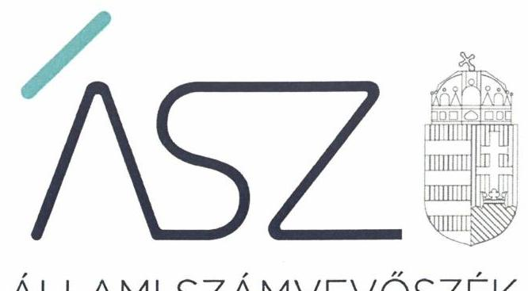
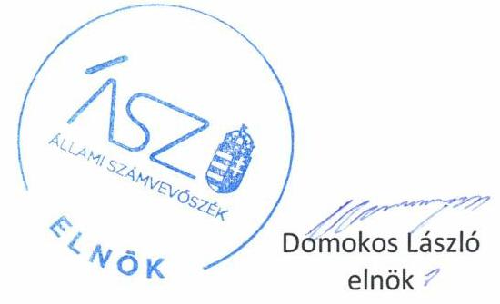

ÁLLAMI SZÁMVEVŐSZÉK

# JELENTÉS 

## Nem állami humánszolgáltatók ellenőrzése

A szociális humánszolgáltatást nyújtó intézmények, szolgáltatók államháztartáson kívüli fenntartói központi költségvetésből kapott támogatásai felhasználásának ellenőrzése Független Egyesület

2020
20079
www.asz.hu

---

ÁLLAMI SZÁMVEVŐSZÉK

# JELENTÉS 

## Nem állami humánszolgáltatók ellenőrzése

A szociális humánszolgáltatást nyújtó intézmények, szolgáltatók államháztartáson kívüli fenntartói központi költségvetésből kapott támogatásai felhasználásának ellenőrzése Független Egyesület
2020. 05. 28.

20079
www.asz.hu

---

# AZ ELLENŐRZÉST FELÜGYELTE: 

MAROZSÁN LÁSZLÓNÉ felügyeleti vezető

## AZ ELLENŐRZÉST VEZETTE ÉS A VÉGREHAJTÁSÁÉRT FELELŐS:

DORMÁN ISTVÁN ZOLTÁN ellenőrzésvezető

## A PROGRAM ÖSSZEÁLLÍTÁSÁÉRT FELELŐS:

FEKETE-NAGY ANDRÁS GÁBOR projektvezető
TÓTPÁL SZABOLCS osztályvezető

IKTATÓSZÁM: EL-2656-001/2020
TÉMASZÁM: 2491
ELLENŐRZÉS-AZONOSÍTÓ SZÁM: V083591, V0867071

---

# TARTALOMJEGYZÉK 

■ ÖSSZEGZÉS ..... 5
■ AZ ELLENŐRZÉS CÉLJA ..... 6
■ AZ ELLENŐRZÉS TERÜLETE ..... 7
■ AZ ELLENŐRZÉS HÁTTERE, INDOKOLTSÁGA ..... 8
■ A JELENTÉS LÉNYEGES KÉRDÉSKÖREI ..... 9
■ AZ ELLENŐRZÉS HATÓKÖRE ÉS MÓDSZEREI ..... 10
■ MEGÁLLAPÍTÁSOK ..... 12
■ JAVASLATOK ..... 14
■ MELLÉKLETEK ..... 15
I. sz. melléklet: Értelmező szótár ..... 15
■ FÜGGELÉK: ÉSZREVÉTELEK ..... 17
■ RÖVIDÍTÉSEK JEGYZÉKE ..... 19

---

.

---

# ÖSSZEGZÉS 

A gyulai székhelyű Független Egyesület szociális humánszolgáltatási közfeladat ellátására a 2015-2018. években kapott költségvetési támogatásokkal való gazdálkodása elszámoltatható és átlátható volt, a támogatásokat szabályszerűen az intézménye és szolgáltatói működtetésére fordította.

## Az ellenőrzés társadalmi indokoltsága

A szociális gondoskodást igénylők védelme, illetve a köznevelési feladatok ellátása az Alaptörvényben meghatározott, a társadalom szempontjából fontos tevékenységek. Jogszabályok teszik lehetővé, hogy államháztartáson kívüli szervezetek - így például az egyházi fenntartók, alapítványok, gazdasági társaságok, egyesületek - által fenntartott intézmények is végezzenek köznevelési, szociális és gyermekvédelmi feladatokat. Mindehhez a központi költségvetés évente jelentős összegű támogatással járul hozzá. Az államháztartáson kívüli, humánszolgáltatást végző intézmények az igényelt közpénzekből társadalmilag hasznos, közösségteremtő, közérdekű, illetve közhasznú tevékenységet végeznek, illetve közfeladatokat látnak el.

Az intézményfenntartók ellenőrzésével az Állami Számvevőszék hozzájárul ahhoz, hogy ezen közpénzeket az államháztartáson kívüli szervezetek is ellenőrizhető, átlátható és elszámoltatható módon használják fel a közfeladatok ellátása során. Az ellenőrzések célja továbbá, hogy a nyilvánosság és az igénybevevők megfelelő tájékoztatást kapjanak az államháztartáson kívüli közfeladatot ellátók működéséről.

Az ÁSZ ellenőrzései arra adnak választ, hogy az intézményfenntartók arra használták-e fel a közpénzeket, amire igényelték.

A szabályszerű gazdálkodás elengedhetetlen a közfeladat ellátás szakmai céljainak megvalósításához, valamint a társadalmi közbizalom fenntartásához.

## Főbb megállapítások, következtetések, javaslatok

A Független Egyesület szociális humánszolgáltatási közfeladat ellátásának megszervezése és belső szabályozottságának kialakítása a jogszabályi előírások betartásával történt.

A Független Egyesület a költségvetési támogatásokat a jogszabályi előírásoknak megfelelően használta fel az intézménye működtetésére. Gondoskodott a központi költségvetési támogatások támogatásonkénti és alapfeladatok szerinti elkülönített nyilvántartásáról.

A Független Egyesület a felhasznált közpénzekre vonatkozó gazdálkodásával a nyilvánosság előtti beszámolási kötelezettségének eleget tett.

A Független Egyesület számlarendje a 2015-2018. években nem felelt meg a Számv. tv. ${ }^{1}$ előírásainak. Az Állami Számvevőszék az ellenőrzés során felhívta a Független Egyesület elnökének a figyelmét a szabályszerű számlarend elkészítésére, azonban a Független Egyesület elnöke nem igazolta, hogy az ellenőrzött időszakot követően már rendelkeznek a jogszabályi előírásoknak megfelelő számlarenddel. Így az Állami Számvevőszék a Független Egyesület elnökének a jelentésben javaslatot fogalmazott meg. A javaslatot megalapozó megállapításra az elnöknek 30 napon belül intézkedési tervet kell készíteni.

---

# AZ ELLENŐRZÉS CÉLJA

**AZ ELLENŐRZÉS CÉLJA** annak értékelése volt, hogy a nem állami, nem önkormányzati szociális intézmények fenntartói központi költségvetésből kapott támogatásainak felhasználása szabályszerű volt-e.

---

# AZ ELLENŐRZÉS TERÜLETE 

## Független Egyesület

A gyulai székhelyű Fenntartót² 2005-ben alapították a drog-betegellátás feltételeinek javítása, a fiatalok ismeretanyagának bővítése, ifjúsági rendezvények szervezése, szabadidős programok lebonyolítása, a munkaerőpiacon hátrányos helyzetű rétegek képzésének, foglalkoztatásának elősegítése, valamint egyéb, elsősorban a hátrányos helyzetű csoportok társadalmi esélyegyenlőségének elősegítése érdekében végzett rehabilitációs tevékenység folytatására. A Fenntartó legfőbb döntéshozó szerve a Közgyűlés ${ }^{3}$ volt, ügyvezetését három tagú Elnökség ${ }^{4}$, képviseletét az Elnök látta el. Az alapító a Fenntartó működése és gazdálkodása törvényességének ellenőrzése érdekében háromtagú felügyelőbizottságot jelölt ki az alapító okiratban.

A Fenntartó az ellenőrzött időszakban közhasznú jogállású szervezet volt. A Fenntartó szervezeti egységeként működő - önálló jogi személyiséggel nem rendelkező - szociális (székhely) intézménye, a Független Egyesület Szenvedélybetegek Integrált Intézménye szenvedélybetegek részére nappali és alacsonyküszöbű ellátást nyújtott. A Fenntartó négy szociális szolgáltatót működtetett Hódmezővásárhely, Szentes, Zsadány és Orosháza településeken. Az ellenőrzött időszakban az intézmény gazdálkodási feladatait a Fenntartó látta el.

A Fenntartó részére a Kincstár által szociális közfeladat ellátásra folyósított költségvetési támogatások összege 2015. évben 61,9 M Ft, a 2016. évben 74,8 M Ft, a 2017. évben 82,2 M Ft, a 2018. évben 82,1 M Ft volt a beszámolók adatai alapján.

---

# AZ ELLENŐRZÉS HÁTTERE, INDOKOLTSÁGA 

A szociális feladatokat ellátó nem állami intézményfenntartók részére közfeladataik ellátására évente jelentős összegű pénzügyi támogatást biztosítottak a mindenkori költségvetési törvények a bennük megfogalmazott feltételek mellett. A felhasználható állami támogatások a Kvtv.-ben ${ }^{5}$ a 2015-2018. években a szociális ágazatra vonatkozóan 360 Mrd Ft előirányzatot határoztak meg.

Az ÁSZ ${ }^{6}$ a stratégiájában célul tűzte ki, hogy az államháztartáson kívülre nyújtott költségvetési támogatások ellenőrzésével hozzájárul ahhoz, hogy a közpénzeket az államháztartáson kívüli szervezetek is átlátható módon használják fel a közfeladatok ellátására kötött szerződésekben vállalt ellátása érdekében. Az ÁSZ stratégiájában foglaltak alapján is indokolt az ellenőrzés, amely a társadalom számára jelzi, hogy a közpénz államháztartáson kívüli felhasználása sem maradhat ellenőrizhetetlenül. Az államháztartáson kívülre nyújtott költségvetési támogatások ellenőrzésével az ÁSZ hozzájárul ahhoz, hogy a közpénzeket a nem állami humán fenntartók átlátható módon használják fel a közfeladatok ellátására kötött szerződésekben vállalt kötelezettségek teljesítése érdekében. Az ellenőrzés javaslataival hozzájárul az említett rendszerek szabályszerű támogatás felhasználásához, javítja a társadalmi-gazdasági döntések megalapozottságát, amely a „jól irányított állam működésének" feltétele.

---

# A JELENTÉS LÉNYEGES KÉRDÉSKÖREI 

1. A Fenntartó szabályszerű működési- és gazdálkodási környezet kialakításával megteremtette-e a költségvetési támogatások átlátható, elszámoltatható igénybevételének, felhasználásának feltételeit?
2. A Fenntartó az átvállalt szociális humánszolgáltatási közfeladathoz biztosított költségvetési támogatásokat szabályszerűen fordította-e a humánszolgáltató intézménye és szociális szolgáltatói működtetésére, továbbá a működtetéshez felhasznált közpénzekre vonatkozó gazdálkodásával a nyilvánosság előtt el-számolt-e?

---

# AZ ELLENŐRZÉS HATÓKÖRE ÉS MÓDSZEREI 

## Az ellenőrzés típusa

Megfelelőségi ellenőrzés.

## Az ellenőrzött időszak

A 2015. január 1. és 2018. december 31. közötti időszak.

## Az ellenőrzés tárgya

Az ellenőrzés a szociális humánszolgáltatási közfeladatokat ellátó államháztartáson kívüli fenntartók humánszolgáltatási közfeladatai ellátásához a központi költségvetésből kapott támogatásaik humánszolgáltatási közfeladatokra való fenntartó általi felhasználása szabályszerűségének értékelésére terjedt ki.

## Az ellenőrzött szervezet

Független Egyesület, mint intézményfenntartó.

## Az ellenőrzés jogalapja

Az ellenőrzés jogszabályi alapját az ÁSZ tv. ${ }^{7}$ 1. § (3) bekezdése, 5. § (3) bekezdésében foglalt előírások adták.

## Az ellenőrzés módszerei

Az ellenőrzést az ellenőrzési program szempontjai, kérdései, az ellenőrzött időszakban hatályos jogszabályok, a nemzetközi standardokat irányadónak tekintve, az ellenőrzés szakmai szabályok és módszertanok figyelembevételével végezte az ÁSZ.

Az ellenőrzés ideje alatt az ellenőrzött szervezettel történő kapcsolattartást az ÁSZ SZMSZ ${ }^{\circledR}$-ének vonatkozó előírásai alapján biztosította az ÁSZ.

Az ellenőrzési kérdések megválaszolásához szükséges bizonyítékok megszerzése az ellenőrzött által rendelkezésre bocsátott dokumentumokra, adatokra alapozva megfigyelés, szemle (szemrevételezés), kérdésfeltevés (információkérés), valamint elemző eljárással történt.

Az ellenőrzési bizonyítékként felhasználható adatforrások közé tartoztak egyrészt az ellenőrzési program részletes szempontjainál felsorolt

---

adatforrások, másrészt minden - az ellenőrzés folyamán feltárt, az ellenőrzés szempontjából információt tartalmazó - dokumentum.

Az ellenőrzés lefolytatásához az ellenőrzött szervezet a kitöltött tanúsítványok, valamint az ÁSZ által kért dokumentumok elektronikus úton való megküldésével szolgáltatott adatokat, információkat. Az így rendelkezésre bocsátott adatok, információk és a tanúsítványok adatai valódiságának kontrollja az ellenőrzés keretében történt.

Az ellenőrzést az ÁSZ alapvetően a szociális humánszolgáltatások esetében a központi költségvetési támogatások igénylésével, módosításával, felhasználásával, elszámolásával kapcsolatos feladatokat ellátó államháztartáson kívüli Fenntartónál végezte.

A szociális humánszolgáltatások központi költségvetési támogatásaival kapcsolatos, államháztartáson kívüli fenntartó jogszabályokban előírt feladatai betartását, továbbá a központi költségvetési támogatások szabályszerű nyilvántartását ellenőrizte az ÁSZ a Fenntartónál rendelkezésre álló nyilvántartások, beszámolók és egyéb dokumentumok alapján. Az ellenőrzés nem terjedt ki a szociális humánszolgáltatások központi költségvetési támogatásai igénylése, módosítása, elszámolása valódiságának, megalapozottságának, helyességének - sem a Fenntartónál, sem a székhely intézménynél való - értékelésére (mivel ennek felülvizsgálata, ellenőrzése a finanszírozó jogszabályban előírt feladata, határozatai kiadása előtt). Továbbá nem terjedt ki az ellenőrzés e források szociális intézmények általi szabályszerű felhasználásának értékelésére.

A szabályosság megítélésének alapját képezte, hogy a központi költségvetési támogatások Fenntartó általi elszámolása a Kincstár felé megtörtént.

---

# 1. A Fenntartó szabályszerű működési- és gazdálkodási környezet kialakításával megteremtette-e a költségvetési támogatások átlátható, elszámoltatható igénybevételének, felhasználásának feltételeit? 

Összegző megállapítás

A Fenntartó a költségvetési támogatások szabályszerű felhasználásához, elszámolásához megteremtette a működési és gazdálkodási környezetet.

A Fenntartó rendelkezett alapszabállyal ${ }^{9}$.
A jogszabályi előírásokkal összhangban a szervezeti és működési szabályait a Fenntartó SZMSZ ${ }^{10}$-ében megállapította.

A Fenntartó a humánszolgáltatást végző intézménye, valamint a szociális szolgáltatói alapfeladatait és működése kereteit SZMSZ ${ }^{11}$-ben határozta meg.

A Fenntartó gondoskodott az intézménye vonatkozásában a szakmai program és a házirend, a szociális szolgáltatót érintően a szakmai programok elkészítéséről.

A Fenntartó rendelkezett a jogszabályban foglaltak szerinti számviteli politikával, a számviteli politika keretében elkészítendő eszközök és a források leltárkészítési és leltározási szabályzatával, az eszközök és a források értékelési szabályzatával és pénzkezelési szabályzattal. A Fenntartó számlarendje nem felelt meg a Számv. tv. 161. § (2) bekezdés b, c), d) pontjai előírásainak, mert nem tartalmazta a számla értéke növekedésének, csökkenésének jogcímeit, a számlát érintő gazdasági eseményeket, azok más számlákkal való kapcsolatát. Nem tartalmazta továbbá a főkönyvi számla és az analitikus nyilvántartás kapcsolatát és a számlarendben foglaltakat alátámasztó bizonylati rendet.

---

# 2. A Fenntartó az átvállalt szociális humánszolgáltatási közfeladathoz biztosított költségvetési támogatásokat szabályszerűen fordította-e a humánszolgáltató intézménye és szociális szolgáltatói működtetésére, továbbá a működtetéshez felhasznált közpénzekre vonatkozó gazdálkodásával a nyilvánosság előtt elszá-molt-e? 

Összegző megállapítás A Fenntartó az átvállalt szociális humánszolgáltatási közfeladathoz biztosított költségvetési támogatásokat a humánszolgáltató intézménye és szociális szolgáltatói működtetésére fordította. A támogatással a nyilvánosság előtt elszámolt.

A Fenntartó a kapott költségvetési támogatásokról elkülönített számviteli nyilvántartást vezetett.

A Fenntartó biztosította a nem önállóan gazdálkodó humánszolgáltatást végző intézménye és szociális szolgáltatói működésének pénzügyi feltételeit. A jogszabály előírásaival összhangban a költségvetési támogatásokat a számviteli rendjében feladatonkénti bontásban, elkülönítetten kezelte.

A Fenntartó kettős könyvvitellel alátámasztott egyszerűsített éves beszámolót készített, a beszámolóit letétbe helyezte, közzétételi kötelezettségének eleget tett.

---

# JAVASLATOK 

Az ÁSZ tv. 33. § (1) bekezdésében foglaltak értelmében az ellenőrzött szervezet vezetője köteles a jelentésben foglalt megállapításokhoz kapcsolódó intézkedési tervet összeállítani és azt a jelentés kézhezvételétől számított 30 napon belül az ÁSZ részére megküldeni. Amennyiben az ellenőrzött szervezet vezetője nem küldi meg határidőben az intézkedési tervet, vagy továbbra sem elfogadható intézkedési tervet küld, az Állami Számvevőszék elnöke az ÁSZ tv. 33. § (3) bekezdés a) és b) pontjaiban foglaltakat érvényesítheti.

## A Független Egyesület elnökének

1. Gondoskodjon a Számv. tv. előírásainak megfelelő tartalmú számlarend elkészítéséről.
(1. sz. megállapítás

 5. bekezdés 2-3.mondatai alapján)

---

# MELLÉKLETEK 

## I. SZ. MELLÉKLET: ÉRTELMEZŐ SZÓTÁR

civil szervezet
humánszolgáltatás
költségvetési támogatás
nem állami, nem önkormányzati (államháztartáson kívüli) intézmény fenntartó
székhely intézmény
telephely

A Civil tv. 2. § 6. pontja szerint civil szervezet a civil társaság, a Magyarországon nyilvántartásba vett egyesület (a párt, a szakszervezet és a kölcsönös biztosító egyesület kivételével), a közalapítvány és a pártalapítvány kivételével az alapítvány.
Külön törvényben meghatározott szociális, gyermekjóléti, gyermekvédelmi, közoktatási, felsőoktatási, kulturális közfeladatok (2014. évi Kvtv. 34. § (1), (4) bekezdés, 1. számú melléklet XX/20/2. alcím, 19. alcím, 2015. évi Kvtv. 43. § (1), (4) bekezdés, 1. számú melléklet XX/20/2/3. jogcím csoport, 19. alcím, 2016. évi Kvtv. 41. § (1), (4) bekezdés, 1. számú melléklet XX/20/2/3. jogcím csoport, 19. alcím).
a társadalombiztosítás pénzügyi alapjai kivételével az államháztartás központi alrendszeréből ellenérték nélkül, pénzben nyújtott támogatások (Áht. ${ }^{12}$ 1. § 14. pont) A költségvetési törvényekben (2013. évi CCXXX. törvény 33-34. §, 2014. évi C. törvény 42-43. §, 2015. évi C. törvény 40-41. §) megállapított támogatás. A 2015. évi C. törvény 40-41. § szerint többek között: Az Országgyűlés a szociális, gyermekjóléti, gyermekvédelmi közfeladatot ellátó intézményt, szolgáltatást fenntartó egyházi jogi személy, civil szervezet, közalapítvány, országos nemzetiségi önkormányzat, települési vagy területi nemzetiségi önkormányzat, gazdasági társaság, és a humánszolgáltatást alaptevékenységként végző, az Szja tv. hatálya alá tartozó egyéni vállalkozó (a továbbiakban együtt: nem állami szociális fenntartó) részére támogatást állapít meg a következők szerint: a támogatás a nem állami szociális fenntartót a települési önkormányzatok 2. melléklet III. pont 3. alpont c)-k) pontjában és III. pont 5. alpont a) pontjában meghatározott támogatásaival azonos jogcímeken, összegben és feltételek mellett illeti meg.
A szociális közfeladatokat/humánszolgáltatásokat ellátó intézményt fenntartó egyházi jogi személy, társadalmi szervezet, alapítvány, közalapítvány, civil szervezet, országos nemzetiségi önkormányzat, nonprofit gazdasági társaság, gazdasági társaság és a humánszolgáltatást alaptevékenységként végző, Szja tv. hatálya alá tartozó egyéni vállalkozó. (2013. évi Kvtv. 35. § (1), (3) bekezdés, 2014. évi Kvtv. 33. §, 34. § (1), (4) bekezdés, 2015. évi Kvtv. 42. §, 43. § (1), (4) bekezdés, 2016. évi Kvtv. 40. §, 41. § (1), (4) bekezdés)
a szolgáltató székhelye, azaz a szolgáltató központi ügyintézésének helye, függetlenül attól, hogy használják-e szolgáltatás nyújtására (Sznyvhr. 1.§ k) pont) (hatályos: 2013. december 1-től)
a szolgáltató székhelyétől különböző, szolgáltató/intézmény használatában álló hely, a szociális humánszolgáltatáshoz használt, bejegyzett hely. (Sznyvhr. 1.§ l) pont) (hatályos: 2015. január 1-től)

---

.

---

# FÜGGELÉK: ÉSZREVÉTELEK 

A jelentéstervezetet a Számvevőszék 15 napos észrevételezésre megküldte az ellenőrzött szervezet vezetőjének az ÁSZ tv. 29. § (1) bekezdése előírásának megfelelően.

A Független Egyesület elnöke a jelentéstervezet megállapításaira nem tett észrevételt.

[^0]
[^0]:    * 29. § (1) Az Állami Számvevőszék az ellenőrzési megállapításait megküldi az ellenőrzött szervezet vezetőjének vagy az általa megbízott személynek, és annak, akinek személyes felelősségét állapította meg.
    (2) Az ellenőrzött szervezet vezetője és a felelősként megjelölt személy az ellenőrzés megállapításaira tizenöt napon belül írásban észrevételt tehet.
    (3) Az Állami Számvevőszék az észrevételre a beérkezésétől számított harminc napon belül írásban válaszol. A figyelembe nem vett észrevételeket köteles a jelentésben feltüntetni, és megindokolni, hogy azokat miért nem fogadta el.

---

.

---

# RÖVIDÍTÉSEK JEGYZÉKE 

${ }^{1}$ Számv. tv.
${ }^{2}$ Fenntartó
${ }^{3}$ Közgyűlés
${ }^{4}$ Elnökség
${ }^{5}$ Kvtv.

## ${ }^{6}$ ÁSZ

${ }^{7}$ ÁSZ tv.
${ }^{8}$ ÁSZ SZMSZ
${ }^{9}$ Alapszabály
${ }^{10}$ Fenntartó SZMSZ
${ }^{11}$ SZMSZ
${ }^{12}$ Áht.
a számvitelről szóló 2000. évi C. törvény (hatályos: 2001. január 1-től)
Független Egyesület
a Független Egyesület Közgyűlése
Független Egyesület Elnöksége, az Elnök és két Alelnök
Magyarország 2015. évi központi költségvetéséről szóló 2014. évi C. törvény (hatályos: 2015. január 1. és 2018. december 31. között)
Magyarország 2016. évi központi költségvetéséről szóló 2015. évi C. törvény (hatályos: 2016. január 1. és 2019. december 31. között)
Magyarország 2017. évi központi költségvetéséről szóló 2016. évi XC. törvény (hatályos: 2016. november 1. és 2020. december 31. között)
Állami Számvevőszék
az Állami Számvevőszékről szóló 2011. évi LXVI. törvény (hatályos: 2011. július 1-től)
az Állami Számvevőszék Szervezeti és Működési Szabályzata
Független Egyesület Alapszabálya (hatályos: 2014. május 23-tól)
Független Egyesület Alapszabálya (hatályos: 2015. december 11-től)
Független Egyesület Szervezeti és Működési Szabályzata (Gyula SZMSZ 2014. július 1.; Gyula SZMSZ 2015. szeptember 30., Gyula SZMSZ 2016. április 25., Gyula SZMSZ 2017. február 1., Gyula SZMSZ 2017. március 1., Gyula SZMSZ 2017. december 15., Gyula SZMSZ 2017. december 29.)
szervezeti és működési szabályzat
az államháztartásról szóló 2011. évi CXCV. törvény (hatályos: 2012. január 1-jétől)

---

# ASZ 

ÁLLAMI SZÁMVEVŐSZÉK
1052 Budapest, Apáczai Cs. J. u. 10. I 1364 Budapest 4. Pf. 54 TEL: +36 14849100
email: szamvevoszek@asz.hu
web: www.asz.hu | www.aszhirportal.hu

