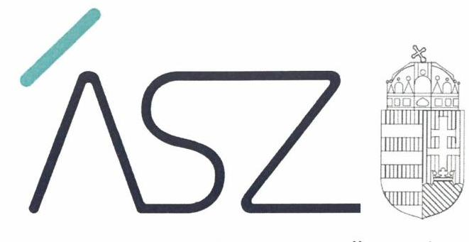
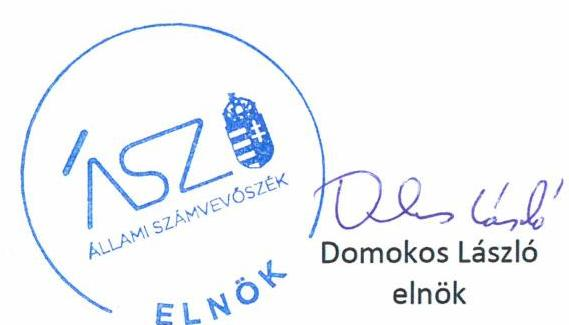
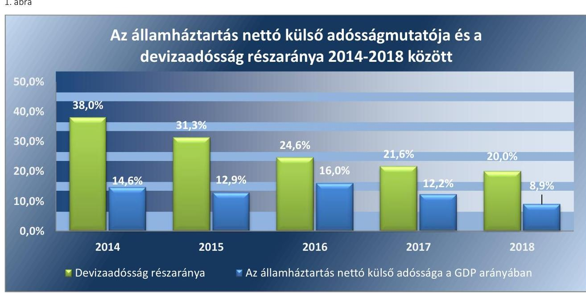
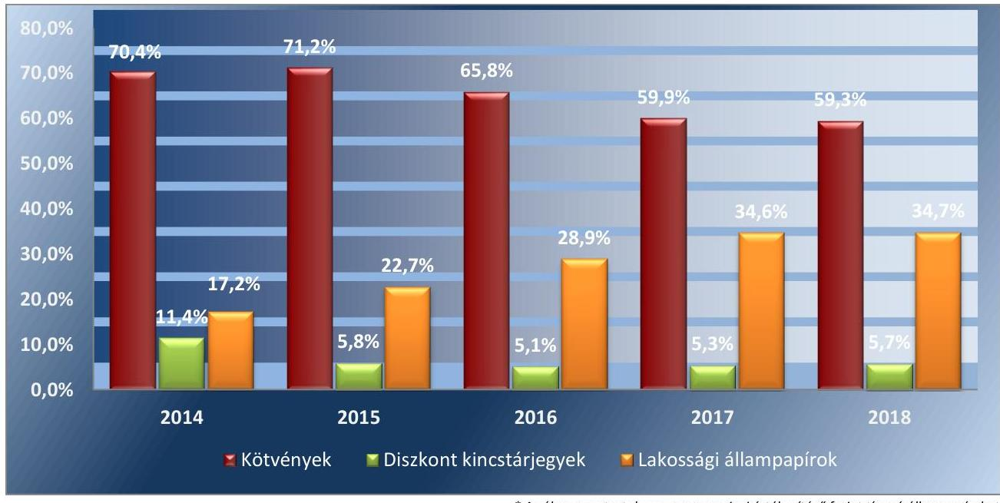

ÁLLAMI SZÁMVEVŐSZÉK

# JELENTÉS 

Az államadósság-kezelési tevékenység Magyarország bruttó külső eladósodottsága mérsékléséhez való hozzájárulásának ellenőrzése

2020.
20080
www.asz.hu

---

ÁLLAMI SZÁMVEVŐSZÉK

# JELENTÉS

Az államadósság-kezelési tevékenység Magyarország bruttó külső eladósodottsága mérsékléséhez való hozzájárulásának ellenőrzése

2020. 05. hó 19. nap

20080
www.asz.hu

---

# AZ ELLENŐRZÉST FELÜGYELTE: 

PETŐ KRISZTINA felügyeleti vezető

## AZ ELLENŐRZÉST VEZETTE ÉS A VÉGREHAJTÁSÁÉRT FELELŐS:

DR. SIMON JÓZSEF ellenőrzésvezető

## A PROGRAM ÖSSZEÁLLÍTÁSÁÉRT FELELŐS:

NÉMETH ANITA projektvezető

## A TÉMÁHOZ KAPCSOLÓDÓ KORÁBBI SZÁMVEVŐSZÉKI JELENTÉSEK:

- címe: Az államháztartás központi alrendszerének adósságát kezelő rendszer ellenőrzése
- sorszáma: 16104

Jelentéseink az Országgyúlés számítógépes hálózatán és az interneten a www.asz.hu címen is olvashatóak.

IKTATÓSZÁM: EL-1795-002/2020
TÉMASZÁM: 2529
ELLENŐRZÉS-AZONOSÍTÓ SZÁM: V0873

---

# TARTALOMJEGYZÉK 

■ ÖSSZEGZÉS ..... 5
■ AZ ELLENŐRZÉS CÉLJA ..... 7
■ AZ ELLENŐRZÉS TERÜLETE ..... 8
■ AZ ELLENŐRZÉS HÁTTERE, INDOKOLTSÁGA ..... 10
■ A JELENTÉS LÉNYEGES KÉRDÉSKÖREI ..... 11
■ AZ ELLENŐRZÉS HATÓKÖRE ÉS MÓDSZEREI ..... 12
■ MEGÁLLAPÍTÁSOK ..... 15
■ MELLÉKLETEK ..... 21
I. sz. melléklet: Értelmező szótár ..... 21
II. sz. melléklet: Az államadósság-kezelés teljesítménymutatói és a forintban denominált állampapírok összetétele ..... 24
■ FÜGGELÉK: ÉSZREVÉTELEK ..... 25
■ RÖVIDÍTÉSEK JEGYZÉKE ..... 29

---

.

---

# ÖSSZEGZÉS 

Az adósság-kezelési stratégia és az ehhez kapcsolódó finanszírozási intézkedések a bruttó devizaadósság folyamatos csökkenéséhez eredményesen járultak hozzá a 2014-2018. években. Az államadósság-kezelés elősegítette az államháztartás bruttó külső adósságának, ezáltal Magyarország külső sérülékenységének mérséklődését.

## Az ellenőrzés társadalmi indokoltsága

Magyarország Alaptörvényének hatálybalépése óta az államadósság-kezeléssel kapcsolatos feladatok jelentősége növekedett. Ennek indoka, hogy Magyarország Alaptörvénye rögzíti az államadósság bruttó hazai termékhez viszonyított maximális szintjét. Továbbá azt is meghatározza az „adósság-szabály" keretében, hogy az államadósság bruttó hazai termékhez viszonyított mutatójának folyamatos javítását szükséges biztosítani. E kötelezettség teljesítésében az Állami Számvevőszék, mint alkotmányos intézmény és az Országgyűlés legfőbb ellenőrző szerve részt vállal e terület ellenőrzése által.

Az államadósság-kezelés eredményessége, ezen belül a bruttó devizaadósság részarányának csökkenése társadalmi szempontból azért jelentős, mert a külső eladósodottság befolyásolja Magyarország és az államháztartás külső sérülékenységét. A külső sérülékenység növekedése által az államháztartás által teljesített kiadások növekednek, amely a társadalom részéről növekvő hozzájárulást eredményez. Továbbá akadályozza más, társadalmi szempontból fontos állami feladatok ellátását, valamint ezek fejlesztésének finanszírozását.

## Főbb megállapítások, következtetések

Az államadósság-kezelési stratégia az ellenőrzött időszakban a jogszabályi előírások szerint rendelkezésre állt. Ebben az államadósság-kezelésért felelős szereplők a devizaadósság csökkentéséhez szükséges célokat megfogalmazták. A célok között szerepelt a devizaadósság részarányának mérséklése, valamint a forint típusú finanszírozás részarányának növelése. Az államadósság-kezelési stratégiában kitűzött célok nyomon követése folyamatos volt.

A 2017. évig átfogó költség- és kockázatkezelési modell hiányában nem volt biztosított az államadósság-kezelést befolyásoló tényezők kockázatainak és az adósságkezelés költségeire gyakorolt hatásainak átfogó értékelése a stratégiai és egyéb célok kitűzése során. A 2018. évtől alkalmazott portfóliómodell elősegítette az államadósság-kezelési célok megalapozott meghatározását.

A bruttó devizaadósság részarányának csökkenésére vonatkozó célkitúzés teljesült. Mindehhez hozzájárult a devizaadósság árfolyamkockázatának mérséklése a fix kamatozású eszközök előtérbe helyezése által, valamint közvetett módon az egyéb célok között a lakossági értékesítés és a másodpiac fejlesztése. E folyamatok a bruttó devizaadósság részarányának csökkentése által támogatták az államháztartás bruttó külső adósságának bruttó hazai termékhez viszonyított arányának csökkenését.

A lakossági állampapírok tulajdonosi összetételének nyomon követésére vonatkozó eljárásrenddel az ellenőrzött időszakban az Államadósság Kezelő Központ Zrt. nem rendelkezett. Mindez akadályozta az államadósság-kezelési tevékenység stratégiai céljának, a bruttó devizaadósság részaránya csökkenésének az államháztartás bruttó külső adósságára gyakorolt hatásának pontos felmérését és értékelését. Emellett nem tette lehetővé annak kiszűrését, hogy a nem lakossági ügyfelek átmenetileg rendelkezzenek lakosság számára kibocsátott, kedvező kamatozású állampapírokkal.

Az éves finanszírozási tervek és ezek módosításai figyelembe vették a változó finanszírozási körülményeket és a terv szerint megvalósított tranzakciók támogatták az ellenőrzött időszakban az államháztartás bruttó devizaadósságának csökkenését.

---

1. ábra

*Forrás: Államadósság Kezelő Központ Zrt. éves jelentések és Magyar Nemzeti Bank fizetési mérleg jelentések adatai alapján Állami Számvevőszék szerkesztés*

Az államadósság-kezelési tevékenység a bruttó devizaadósság részarányának mérséklésén keresztül hozzájárult az államháztartás bruttó nemzeti termékhez viszonyított bruttó külső adósságának csökkenéséhez. Mindez - a közvetlen működő tőke befektetések alakulásával együtt - támogatta Magyarország nettó külső adósságmutatójának csökkenését, a külföld felé való eladósodottság mérséklődését.

---

# AZ ELLENŐRZÉS CÉLJA 

AZ ELLENŐRZÉS CÉLJA annak értékelése volt, hogy az államadósság-kezelés (az ebben felelősséggel bíró szervek tevékenysége) eredményesen járult-e hozzá a bruttó külső eladósodottság mérsékléséhez.

---

# **AZ ELLENŐRZÉS TERÜLETE**

## **Államadósság Kezelő Központ Zrt., Pénzügyminisztérium**

Az Áht.1 5. § (2) bekezdése szerint az államháztartás központi alrendszerében az államháztartásért felelős miniszter gondoskodik a költségvetési hiány finanszírozásáról és az államadósság-kezeléséről.

Az államadósság-kezelés jogi kereteit, az államadósság fogalmát, számítási módját, valamint a kapcsolódó feladatokat a Gst.2 határozza meg. E jogszabály az államháztartásért felelős minisztert hatalmazza fel arra, hogy gondoskodjon az állami költségvetés fizetőképességének folyamatos fenntartásáról, a központi költségvetés adósságának nyilvántartásáról, az adósságok törlesztéséről, valamint az állam átmeneti szabad pénzeszközeinek kezeléséről. Az államháztartásért felelős miniszter az államadósság-kezeléssel kapcsolatos feladatait az ÁKK Zrt.3 útján látja el.

Az ÁKK Zrt. kizárólagos állami tulajdonú gazdasági társaság, amelynek nevében a tulajdonosi jogokat az államháztartásért felelős miniszter gyakorolja.

Az ÁKK Zrt. ügyvezető szerve az Igazgatóság4. Az ÁKK Zrt. napi munkáját és munkaszervezetét az ÁKK Zrt.-vel munkaviszonyban álló Vezérigazgató5 irányítja és ellenőrzi a jogszabályokban és az alapító okirat6-ban, illetve az államháztartásért felelős miniszter és az Igazgatóság határozataiban rögzített rendelkezések alapján.

Az ÁKK Zrt. adósságkezeléshez kapcsolódó feladata kiemelten a költségvetés finanszírozási szükségletét hosszú távon minimális költséggel, elfogadható kockázatok vállalása melletti egységes szemléletben történő finanszírozása. A központi költségvetés éves finanszírozási szükségletét (bruttó finanszírozási igény) az adósságállomány tárgyévben esedékes törlesztő részletei és a nettó-finanszírozási igény (a központi alrendszer tárgyévi hiánya, valamint az EU transzferek egyenlege) határozza meg.

Az ÁKK Zrt. az államadósság-kezelési tevékenység keretében többek között az alábbi feladatokat látja el: kidolgozza az államadósság-kezelési stratégiáját, elkészíti a központi költségvetés éves és középtávú finanszírozási tervét, szervezi az állampapír-kibocsátásokat, hitelfelvételeket és hitelátvállalásokat, gondoskodik az államadósság terheinek pénzügyi teljesítéséről és szervezi a másodlagos állampapírpiacot.

Az államadósság-kezelési tevékenység meghatározó elemét jelenti az éves államadósság-kezelési stratégia, amely teljesítménymutatókat, ehhez kapcsolódóan benchmarkokat és egyéb célkitűzéseket tartalmaz. Az államadósság-kezelési stratégiát az Igazgatóság fogadja el, majd az államháztartásért felelős miniszter részvényesi határozatban hagyja jóvá.

Az államadósság-kezelési tevékenység Magyarország bruttó külső adósságmutatójának alakulását befolyásolja. A bruttó külső adósság folyamatos csökkenése által mérséklődik Magyarország külső sérülékenysége.

1. táblázat

**A KÖZPONTI KÖLTSÉGVETÉS ADÓSSÁGA (%)**

|  ÉV | GDP arányában (%)  |
| --- | --- |
|  2014.12.31. | 73,0  |
|  2015.12.31. | 71,0  |
|  2016.12.31. | 70,8  |
|  2017.12.31. | 68,9  |
|  2018.12.31. | 67,2  |

*Forrás: ÁKK Zrt. éves jelentések adatai alapján ÁSZ szerkesztés*

---

A bruttó külső adósságmutató egy olyan összetett, adott gazdasági állapotot tükröző mutató, amely valamennyi gazdasági szereplőcsoport együttes eladósodási helyzetét bemutatja. Ezen belül meghatározó részarányt képvisel az államháztartás bruttó külső adóssága. A bruttó külső adósságmutató értékét az államháztartás mellett befolyásolja az egyéb szereplők (pénzügyi intézmények, vállalkozások, háztartások) eladósodottsága.

Az államadósság finanszírozásának sajátos jellemzője, hogy külföldi befektetők is vásárolhatnak forintban denominált állampapírokat, illetve a hazai befektetők számára is rendelkezésre állnak különböző típusú devizában kibocsátott állampapírok. A tulajdonosi összetétel esetében a devizában denominált eszközöknél meghatározó részarányt képviselnek a külföldi befektetők. Emiatt a devizaadósság részarányának csökkenése közvetetten hatást gyakorol az államháztartás, és ezen keresztül Magyarország bruttó külső adósságának mérséklődésére.

---

# AZ ELLENŐRZÉS HÁTTERE, INDOKOLTSÁGA 

Az eredményes adósságkezeléshez szükség van a teljesítménymérés feltételeinek kialakítására, úgymint az egyértelmű és mérhető célokra, mutatószámokra és az ezekhez rendelt követelményekre/benchmarkokra.

Az ÁSZ ${ }^{7}$ az adósságkezelés gazdaságpolitikai jelentősége miatt tartotta indokoltnak az adósságkezelés tárgyában ellenőrzést lefolytatni. A megállapítások és az azok alapján tett javaslatok hozzájárulhatnak az ÁKK Zrt.-nél és a $\mathrm{PM}^{8}$-nél az eredményes adósságkezelés megvalósításához.

Az ÁSZ ellenőrzése a döntéshozók, az ellenőrzöttek, irányító szervek és a társadalom számára az adósságkezeléssel kapcsolatos célok teljesítésének értékelésével visszajelzést ad az államadósság-kezelés területén végrehajtott intézkedések hatásairól, a mérhető teljesítménymutatók (benchmarkok) teljesítéséről, a kitűzött adósságkezelési célok eléréséről a bruttó külső adósságmutató változása szempontjából.

Az ÁSZ ezt megelőzően a 2016. évben ellenőrizte az államadósság-kezelési tevékenység szabályszerűségét, eredményességét, valamint a 2018. évre vonatkozóan az ÁKK Zrt. gazdálkodását. Az államháztartás központi alrendszerének adósságát kezelő rendszer ellenőrzése című ellenőrzés keretében kiadott 16104-es számú jelentésben az ÁSZ megállapította, hogy az ÁKK Zrt. feladatellátása alapvetően az Alapító ${ }^{9}$ által jóváhagyott állam-adósság-kezelési stratégia megvalósítását szolgálta. Ugyanakkor az ellenőrzés számos olyan hiányosságot tárt fel a 2012-2014. évek közötti időszakra vonatkozóan, amelyek kockázatot jelentettek az államadósság-kezelési stratégia megalapozottsága és eredményes megvalósítása tekintetében.

Az előző ellenőrzés óta eltelt időszakban folyamatosan csökkent az ál-lamadósság-mutató értéke. Ezért is fontos értékelni, hogy e változás menynyiben járt együtt a bruttó külső adósságmutató csökkenésével és ehhez mennyiben járult hozzá az államadósság-kezelési tevékenység.

---

# A JELENTÉS LÉNYEGES KÉRDÉSKÖREI 

1. Az államadósság-kezelési stratégia meghatározta-e célként a deviza finanszírozás arányának mérséklését (a forint finanszírozás arányának növelését) az államadósság finanszírozásában, és ehhez megalapozott teljesítménykövetelményt ren-delt-e?
2. Az államadósság deviza finanszírozási arányának mérséklésére (a forint finanszírozás arányának növelésére) irányuló intézkedések végrehajtása során megvalósultak-e az államadósság-kezelési stratégia alapvető stratégiai és egyéb célkitüzései, azokat nyomon követték-e?
3. Az éves finanszírozási terv, azok évközi módosításai és végrehajtása hozzájárult-e az államadósság deviza finanszírozási arányának mérséklődéséhez (a forint finanszírozási arány növekedéséhez)?

---

# AZ ELLENŐRZÉS HATÓKÖRE ÉS MÓDSZEREI 

## Az ellenőrzés típusa

Megfelelőségi és teljesítmény-ellenőrzés.

## Az ellenőrzött időszak

A 2014. január 1. - 2018. december 31. közötti időszak.

## Az ellenőrzés tárgya

Az államháztartásért felelős miniszter és az ÁKK Zrt. vonatkozásában az adósságkezelés tervezési, irányítási és monitoring rendszerének múködtetése, az eredményességi követelmények érvényesítésének, az adósságkezelési célkitűzések elérésének eszközrendszere és az ÁKK Zrt. feladatellátása.

Az ellenőrzés kiterjedt minden olyan körülményre és adatra, amely az ÁSZ jogszabályban meghatározott feladatainak teljesítéséhez, valamint a program végrehajtása folyamán felmerült újabb összefüggések feltárásához szükséges.

## Az ellenőrzött szervezet

A Pénzügyminisztérium és az Államadósság Kezelő Központ Zártkörűen Múködő Részvénytársaság.

## Az ellenőrzés jogalapja

Az Állami Számvevőszékről szóló 2011. évi LXVI. törvény 1. § (3) bekezdése.

## Az ellenőrzés módszerei

Az ellenőrzést az ÁSZ az ellenőrzési program szempontjai, az ellenőrzött időszakban hatályos jogszabályok, a jelen ellenőrzésre irányadó ÁSZ módszertan figyelembe vételével és a nemzetközi standardokat irányadónak tekintve végezte.

Az ellenőrzés teljesítmény kategóriája az eredményesség volt. Az ellenőrzés a tényleges és a tervezett eredmények (hatások) összevetésével azt értékelte, hogy az államadósság-kezelési stratégiában, az éves finanszíro-

---

zási tervben kitűzött, vonatkozó célokat és a szándékolt eredményeket (hatásokat) a megvalósítás során elérték-e. Az elemzés módszerével azt tárta fel, hogy milyen mértékben valósították meg a célkitűzéseket. Az ellenőrzés megközelítése eredmény (kimenet-) alapú volt, amely szerint azt értékelte, hogy az eredményeket, a kimeneteket a tervezettek szerint elértéke, ezáltal az államadósság-kezelés (az abban felelősséggel bíró szervek) eredményesen járult-e hozzá a bruttó külső eladósodottság mérsékléséhez.

A megfelelőségi ellenőrzésen belül szabályszerűségi ellenőrzés tárgyát képezte az államadósság-kezelési stratégia elkészítése, továbbá az állam-adósság-kezelési stratégia célkitűzései megvalósulása nyomon követési rendszerének kialakítása, a megvalósítás nyomon követése.

Jogszabályi előírások hiányában helyénvalósági kritériumokat fogalmazott meg az ÁSZ arra vonatkozóan, hogy
$\longrightarrow$ az államadósság-kezelési stratégia tartalmazott-e a deviza finanszírozás arányának mérséklését célzó stratégiai célkitúzés(eke)t;
$\longrightarrow$ az államadósság deviza finanszírozási arányának csökkentésére készült-e megalapozott teljesítménykövetelmény;
$\longrightarrow$ az idegen devizában denominált államadósság mérséklése érdekében tett intézkedéseket felülvizsgálták és szükség esetén azokat módosították-e;
$\longrightarrow$ az éves finanszírozási terv és azok módosításai megfelelő keretet biztosítottak-e az államadósság deviza finanszírozási arányának mérséklődéséhez;
$\longrightarrow$ az éves finanszírozási tervtől való eltérések megfelelően dokumentáltak, és indokoltak voltak-e.
Teljesítmény-ellenőrzés keretében - az adatbekérés eredményeként rendelkezésre álló - dokumentumok elemzésével azt értékelte az ÁSZ, hogy
$\longrightarrow$ az államadósság deviza finanszírozási arányának mérséklésére irányuló intézkedések végrehajtása során megvalósultak-e az állam-adósság-kezelési stratégia célkitűzései, teljesültek-e a deviza finanszírozási arány mérséklését célzó teljesítménymutatók, azok javuló tendenciát mutattak-e;
$\longrightarrow$ az éves finanszírozási tervek végrehajtása során megtörténtek-e, és az előírt mértékben történtek-e meg az államadósság deviza finanszírozási arányának csökkentését eredményező tranzakciók.
A teljesítmény-ellenőrzési kérdések eredményességi szempontú értékelését az adott kérdéshez tartozó teljesítménykritériumokban határozta meg az ÁSZ.

Az ellenőrzési kérdések megválaszolásához szükséges bizonyítékok megszerzése az ellenőrzött szervezetek által rendelkezésre bocsátott dokumentumokra, adatokra alapozva a következő ellenőrzési eljárások alkalmazásával történt: megfigyelés, szemle (szemrevételezés), kérdésfeltevés (információkérés), összehasonlítás, elemző eljárás. Az ellenőrzési bizonyítékként felhasználható adatforrások közé tartoztak az ellenőrzési programban felsorolt adatforrások, továbbá minden - az ellenőrzés folyamán - feltárt, az ellenőrzés szempontjából információkat tartalmazó dokumentum.

---

Az ellenőrzést a kérdésekre adott válaszok kiértékelésével, valamint a megjelölt adatforrások, a csatolt tanúsítványok felhasználásával, továbbá az adott időszakban hatályos jogszabályok figyelembe vételével folytatta le az ÁSZ.

Az ellenőrzés során minden olyan körülményt és adatot is ellenőrzött az ÁSZ, amely a program végrehajtása kapcsán felmerült újabb összefüggéseknek az ellenőrzés céljaival összhangban lévő feltárásához szükséges volt.

Az ellenőrzés ideje alatt az ellenőrzött szervezetekkel történő kapcsolattartást az ÁSZ SZMSZ ${ }^{10}$-ének vonatkozó előírásai alapján biztosította az ÁSZ.

---

# MEGÁLLAPÍTÁSOK 

## 1. Az államadósság-kezelési stratégia meghatározta-e célként a deviza finanszírozás arányának mérséklését (a forint finanszírozás arányának növelését) az államadósság finanszírozásában, és ehhez megalapozott teljesítménykövetelményt ren-delt-e?

Összegző megállapítás

Az államadósság-kezelési stratégia célul tűzte ki a deviza finanszírozás arányának mérséklését. A 2018. évtől kezdődően e folyamatot támogatta az optimális portfóliómodell alkalmazása.

### 1.1. számú megállapítás

Az államadósság-kezelési stratégia az ellenőrzött időszakban célként fogalmazta meg a bruttó devizaadósság arányának csökkentését.

A Gst. 13. § (1) bekezdés b) pontjában szereplő rendelkezéssel összhangban az ellenőrzött időszakban a központi költségvetés hiányának finanszírozása érdekében az államháztartásért felelős miniszter az ÁKK Zrt. útján gondoskodott az államháztartás központi alrendszere adósságára vonatkozó finanszírozási stratégia kidolgozásáról.

Az Igazgatóság által elfogadott és az Alapító által jóváhagyott állam-adósság-kezelési stratégia minden évben tartalmazta az államadósság devizahányadának csökkentésére vonatkozó stratégiai célkitüzést. E stratégiai cél megvalósítása érdekében került meghatározásra a bruttó devizaadósság részaránya teljesítménymutató. A hozzá tartozó benchmark a 2014-2016. években az elfogadási tartomány előző évhez viszonyított szűkítését, a 2017. évben a 25,0\% alá csökkentését, a 2018. évben e szint alatti tartását tüzte ki célul. (Az államadósság-kezelési stratégia által alkalmazott teljesítménymutatókat részletesen az 1. melléklet 1. táblázat tartalmazza.)

Az államadósság-kezelési stratégia célul tűzte ki az ellenőrzött időszakban a forintadósság jellemzőinek kedvezőbbé tételét.

Az államadósság-kezelési stratégia az ellenőrzött időszakban az egyéb célkitüzések keretében megfogalmazta a másodpiac fejlesztését, a lakossági értékesítés növelését és a lakossági állampapírok átlagos futamidejének növelését. E célkitüzések a hazai befektetői kör forintban denominált állampapír befektetéseinek bővítését célozták, amely közvetetten támogatta a devizaadósság részarányának csökkentését.

---

1.3. számú megállapítás

Az optimális portfóliómodell a 2018. évtől kezdődően támogatta az adósságkezelés kockázatainak beazonosítását és számszerúsítését.

Az ÁKK Zrt. az ellenőrzött időszakban kifejlesztette az államadósság-kezelés költség és kockázatkezelési modelljét. A 2014-2015. évi államadósság-kezelési stratégiában megfogalmazott teljesítménymutatók értéke a korábban alkalmazott módszertan szerint történt, amely nem vette figyelembe a releváns kockázati tényezőket. A költség és kockázatkezelést szolgáló optimális portfóliómodell a 2016. évben a forint és devizaadósság részarányának, a 2017. évben a fix-változó kamatozással, a futamidővel, illetve az optimális hozam-kockázat meghatározására vonatkozó módszertannal bővült.

A 2018. évi államadósság-kezelési stratégiában szereplő teljesítménymutatókhoz tartozó célértékek meghatározása teljes körűen az optimális portfóliómodell alapján történt.
2. Az államadósság deviza finanszírozási arányának mérséklésére (a forint finanszírozás arányának növelésére) irányuló intézkedések végrehajtása során megvalósultak-e az államadósság-kezelési stratégia alapvető stratégiai és egyéb célkitűzései, azokat nyomon követték-e?

Összegző megállapítás

# 2.1. számú megállapítás 

A bruttó devizaadósság mérséklésére és a belső finanszírozás arányának növelésére irányuló stratégiai és egyéb célkitűzések megvalósultak, ezek alakulását nyomon követték.

A bruttó devizaadósság részaránya mérséklődött az ellenőrzött időszakban, valamint a támogató célkitűzések megvalósultak.

A bruttó devizaadósság részaránya az ellenőrzött időszakban folyamatosan csökkenő tendenciát követett, amely összhangban volt az adott évi állam-adósság-kezelési stratégiában meghatározott céllal, illetve benchmark értékkel. Ezt mutatja be a 3. táblázat.
3. táblázat

AZ ADÓSSÁGPORTFOLIÓ DEVIZA ÖSSZETÉTELE ÉV VÉGÉN A 2014-2018. ÉVEK KÖZÖTTI IDŐSZAKBAN (SZÁZALÉKBAN)

| Megnevezés | 2014 | 2015 | 2016 | 2017 | 2018 |
| :-- | :--: | :--: | :--: | :--: | :--: |
| Stratégiai célkitúzés* | 45,0 | 40,0 | 35,0 | 25,0 | 25,0 |
| Devizaadósság részaránya | 38,0 | 31,3 | 24,6 | 21,6 | 20,0 |

* A kitüzött elfogadási tartomány felső határa.

Forrás: ÁKK Zrt. adatszolgáltatása és éves jelentések alapján ÁSZ szerkesztés
A bruttó devizaadósság részarányának csökkenéséhez hozzájárult a devizaadósság kamatösszetételére vonatkozó célkitúzés teljesítése. Az ellenőrzött időszakon belül a fix kamatozású devizaadósság részaránya a 2014. évi átlagos $63,8 \%$-ról a 2018. évben $68,9 \%$-ra emelkedett, amely elősegítette az árfolyamkockázat mérséklődését.

---

A bruttó devizaadósság részarányának mérséklődését közvetetten támogatta a lakossági értékesítés bővítése. Ennek alakulását az ellenőrzött időszakban a 4. táblázat mutatja be.
4. táblázat

A FORINTBAN DENOMINÁLT LAKOSSÁGI ÁLLAMPAPÍROK ÁLLOMÁNYA ÉS RÉSZARÁNYA A 2014-2018. ÉVEK KÖZÖTTI IDŐSZAKBAN ÉV VÉGÉN

| Megnevezés | 2014. | 2015. | 2016. | 2017. | 2018. |
| :--: | :--: | :--: | :--: | :--: | :--: |
| Forintban denominált   lakossági állampapírok   állománya (Mrd Ft) | 2411,0 | 3517,0 | 5068,0 | 6803,0 | 7516,0 |
| Részaránya a teljes   államadósságon belül (\%) | 10,1 | 14,2 | 20,0 | 25,4 | 26,2 |

A lakossági forintban denominált állampapírok állományának növekedéséhez az ellenőrzött időszakban hozzájárult további új termékek bevezetése (2015. évtől a Féléves Kincstárjegy, a 2017. évtől a Kétéves Magyar Állampapír), a közép- és hosszú lejárattal rendelkező konstrukciók (Prémium Magyar Államkötvény és Bónusz Magyar Államkötvény) állományának növelése, valamint az értékesítési hálózat bővítése. A forintadósságon belül a főbb állampapír-típusok összetételét az 1. mellékletben szereplő 1. ábra tartalmazza.

A bruttó devizaadósság részarányának mérséklődéséhez közvetetten hozzájárult az egyéb, nem számszerűsített célok között a másodpiac fejlesztése az aukciós értékesítési lehetőségek kibővítése és csereaukciók biztosítása által.
2.2. számú megállapítás

## Az államadósság-kezelési stratégia célkitűzéseinek megvalósulását nyomon követték, a tulajdonosi összetétel nyomon követésére azonban nem alakítottak ki eljárásrendet.

Az ÁKK Zrt. az államadósság-kezelési stratégia megvalósulásával kapcsolatos nyomon követési eljárásokat a Bkr. ${ }^{11}$ előírásaival összhangban kialakította és múködtette. Az Igazgatóság részére negyedévente beszámolt az államadósság-kezelési stratégia célkitűzéseinek a megvalósulásáról. Az ÁKK Zrt. a teljesítménymutatók alakulását évente az Éves jelentés ${ }_{1-5}{ }^{12}$-ben és a Tájékoztató ${ }_{1-5}{ }^{13}$ keretében is bemutatta.

Az államadósság tulajdonosi összetételének nyomon követésére vonatkozó eljárásrenddel az ellenőrzött időszakban az ÁKK Zrt. nem rendelkezett. A lakossági állampapír állomány tulajdonosi összetételének alakulását az ellenőrzött időszakban az Igazgatóság négy alkalommal áttekintette. Az Igazgatóságnak szóló előterjesztések ${ }_{1-4}{ }^{14}$ az MNB ${ }^{15}$ tulajdonosi statisztikai adatain, valamint az elsődleges forgalmazók egyedi adatszolgáltatásain alapultak.

---

# 3. Az éves finanszírozási terv, azok évközi módosításai és végrehajtása hozzájárult-e az államadósság deviza finanszírozási arányának mérséklődéséhez (a forint finanszírozási arány növekedéséhez)? 

Összegző megállapítás

Az éves finanszírozási terv és ezek évközi változásai hozzájárultak a deviza finanszírozási arány mérséklődéséhez, valamint a forint finanszírozási arány növekedéséhez.
3.1. számú megállapítás Az éves finanszírozási tervek és ezek évközi változásai elősegítették a forint/deviza összetétel kedvező változását.

Az ÁKK Zrt. az ellenőrzött időszakban a belső előírások szerint előkészítette az éves finanszírozási tervet, amelyeket az Igazgatóság elfogadott és az Alapító határozattal jóváhagyta. Az éves finanszírozási terv az Alapító által jóváhagyott államadósság-kezelési stratégiával összhangban készült és összeállítása során figyelembe vették a kincstári kör várható nettó és a lejáró adósságból eredő finanszírozási igényt.

Az éves finanszírozási terv minden évben kiemelt szempontként kezelte a devizában történő kibocsátás csökkentését és a forintban denominált eszközök, elsősorban a lakossági értékesítés és az államkötvény állomány bővítését.

Év közben az ellenőrzött időszakban az ÁKK Zrt. az éves finanszírozási terv végrehajtását befolyásoló tényezőket nyomon követte és a változások alapján javaslatot tett az éves finanszírozási terv módosítására. Az éves finanszírozási tervek módosításának előkészítése az SZMSZ ${ }_{1: 7}{ }^{16}$ és a Tervezési szabályzat ${ }_{1: 5}{ }^{17}$ elöírásai szerint történt. Az Igazgatóság által történő elfogadást követően az Alapító minden esetben jóváhagyta az éves finanszírozási terv módosítását.

Az évközi módosítások során figyelembe vették az államadósság-kezelési stratégiában rögzített, a bruttó devizaadósság arányának csökkentésére vonatkozó célkitüzést. Az éves finanszírozási tervben és évközi módosításában a devizaadósság törlesztésének tervezett értéke meghaladta a bruttó devizaadósság kibocsátásának tervezett értékét.

Az éves finanszírozási terv végrehajtása során a végrehajtott tranzakciók elősegítették a forint/deviza összetétel változására vonatkozó célok teljesülését.

Az ellenőrzött időszakban a tranzakciókat az éves, illetve a módosított finanszírozási tervvel összhangban hajtották végre. A végrehajtás során figyelembe vették a bruttó finanszírozási igényt és ennek éven belüli változását.

A nettó deviza kibocsátás a 2014-2017. években a tervezett értékéhez képest alacsonyabb, a 2018. évben a tervezett szinten teljesült. A nettó forintadósság kibocsátás az ellenőrzött időszak minden évében meghaladta az éves finanszírozási tervben meghatározott értéket. Ezen adatokat az ellenőrzött időszakra vonatkozóan az 5. táblázat mutatja be.

---

| A NETTÓ FORINT ÉS DEVIZA KIBOCSÁTÁS ALAKULÁSA A 2014-2018. ÉVEKBEN |  |  |  |  |  |  |  |  |  |  |
| :--: | :--: | :--: | :--: | :--: | :--: | :--: | :--: | :--: | :--: | :--: |
|  | 2014. |  | 2015. |  | 2016. |  | 2017. |  | 2018. |  |
|  | Terv | Tény | Terv | Tény | Terv | Tény | Terv | Tény | Terv | Tény |
| Teljes nettó forint kibocsátás (Mrd Ft) | 1185,0 | 1527,2 | 1461,7 | 1468,2 | 1979,5 | 2248,7 | 1770,6 | 2312,7 | 1712,1 | 2042,8 |
| Teljes nettó deviza kibocsátás (Mrd Ft) | $-242,8$ | $-765,8$ | $-571,4$ | $-1186,5$ | $-971,2$ | $-1440,9$ | $-365,5$ | $-459,0$ | $-269,4$ | $-265,4$ |

A nettó deviza és forintadósság kibocsátás alakulása együttesen elősegítette a bruttó devizaadósság részarányának csökkenését.

A bruttó devizaadósság részarányának csökkenéséhez hozzájárult, hogy az államadósság nominális növekedése és a 2015-2018. években a kincstári kör a tervezettnél nagyobb összegű hiánya miatti többlet finanszírozási igényt az ÁKK Zrt. forintban denominált eszközökkel biztosította.

---

.

---

# MELLÉKLETEK 

- I. SZ. MELLÉKLET: ÉRTELMEZŐ SZÓTÁR
adósság szabály
aukció
államadósság
államkötvény
állampapír
benchmark
bruttó adósságállomány
bruttó deviza és forint kibocsátás
bruttó külső adósság
bruttó államadósság mutató
bruttó külső államadósság-mutató
denominált

Mindaddig, amíg az államadósság a teljes hazai össztermék felét meghaladja, az Országgyűlés csak olyan központi költségvetésről szóló törvényt fogadhat el, amely az államadósság a teljes hazai össztermékhez viszonyított arányának csökkentését tartalmazza. (Magyarország Alaptörvénye ${ }^{18}$ 36. cikk (5) bekezdés)

Az értékpapírok (részvény, kötvény, állampapír) forgalomba hozatalának egyik módja.
Az államháztartás központi alrendszerének, az államháztartás önkormányzati alrendszerének és a kormányzati szektorba sorolt egyéb szervezetek egymással szembeni kötelezettségek kiszűrésével számított (konszolidált) adóssága.
1 évnél hosszabb futamidejű, fix vagy változó kamatozású állampapír.
Az állam által kibocsátott tőke- és kamat-visszafizetési garanciával rendelkező értékpapír.
A benchmark olyan referenciaportfolió (szabályrendszer), mely az állam-adósság-kezelő stratégiai céljait tükrözi, figyelembe véve az adósságkezelés költség-kockázati szerkezetét. A benchmarkok így az adósságkezelő számára a stratégiai célok számszerűsítését, azaz a köztes célok megfogalmazását is jelentik.
Az államháztartás, a vállalatok, a hitelintézetek, a háztartások és a nonprofit intézmények összes, külföldi és belföldi hitelezők felé fennálló tartozása.
Az adott időszakban kibocsátott államadósság finanszírozást szolgáló devizában, illetve forintban denominált hitelek és állampapírok együttes értéke.
A bruttó külső adósság egy ország gazdasági szereplőcsoportjainak (a vállalatok, az államháztartás, a háztartások és a nonprofit intézmények) öszszes külföldi gazdasági szereplők felé fennálló tartozásai. A bruttó külső adósságban az ország bruttó adósságállományából csak azon adósságjellegú kötelezettségek szerepelnek, amelyek egy adott ország szempontjából külföldi szereplőkkel szemben állnak fenn.
A bruttó külső adósság szempontjából mindegy, hogy a hitelt milyen pénznemben nyújtják. A külföldiek hitelezhetik devizában és forintban is a magyar gazdaság valamely szereplőjét. Ez alapján nem része a bruttó külső adósságnak, ha az adott ország belföldi gazdasági szereplői egymás között devizában hiteleznek.
A bruttó adósságállományból az államháztartás konszolidált adósságát mutatja a piaci áron számított GDP százalékában. Az adott ország államadóssága minden olyan külföldi és belföldi hitelviszonyon alapuló fizetési kötelezettséget magában foglal, amely az államháztartás valamelyik alrendszeréhez kapcsolódik.
Az államháztartás adósságtételei közül mindössze a külföldi szereplők felé fennálló kötelezettségeket tartalmazza.
A kibocsátás pénznemének meghatározása.

---

devizakitettség
duráció
eredményesség

EU transzferek
éves finanszírozási terv
kincstári kör
kormányzati szektor
központi alrendszer
másodpiac
nettó-finanszírozási igény
nettó adósságállomány
optimális portfóliómodell

A külföldi devizában fennálló tartozások, illetve az ezekhez kapcsolódó (ár-folyam- és kamat) kockázatok összessége.
Az állampapírok súlyozott, átlagos futamideje, amely az adósság átárazódásához szükséges időt - és egyben az adósság portfolió kamatérzékenységét - fejezi ki.
Az eredményesség elve a kitűzött célok és a szándékolt eredmények (hatások) elérését jelenti. A feladatellátás eredményességét mutatja a tényleges és a tervezett eredmények (hatások) összevetése.(ÁSZ: A teljesít-mény-ellenőrzés alapelvei. 2015.)
Az államadósság-kezelési stratégia eredményes megvalósítása azt jelenti, hogy az aktuális (hatályos) adósságkezelési stratégiában meghatározott mennyiségi célokat, célértékeket, egyéb célkitűzéseket teljesítik.
Az Európai Uniótól érkező támogatások, amelyek különböző uniós programokon keresztül kerülnek felhasználásra a központi költségvetés által megelőlegezése által.
Az adott évre vonatkozó államadósság-kezelési stratégia alapján az államadósság finanszírozásra vonatkozó intézkedéseket tartalmazó dokumentum, amely magába foglalja a bruttó és a nettó finanszírozási igény, valamint a bruttó és a nettó kibocsátás összetevőinek számszaki és szöveges bemutatását.
Az államháztartás központi alrendszerébe tartozó jogi személyek és előirányzatok pénzforgalma. (Áht. 79. § (1) bekezdés)
Az európai uniós szabványok által meghatározott szervezeti kör, amely magában foglalja az államháztartás alrendszereit, valamint azokat a szervezeteket, amelyek tevékenységük során közjavakat állítanak elő, a nemzeti jövedelem és a nemzeti vagyon elosztásában vesznek részt, irányításukat kormányzati szervek végzik és tevékenységük ellenértékében 50\%nál kisebb arányt képviselnek a piaci árbevételek.
Az államháztartás egyik alrendszere, amely magában foglalja a központi költségvetést, a társadalombiztosítás pénzügyi alapjait és az elkülönített állami pénzalapokat.
A már forgalomban lévő értékpapírok (állampapírok) kereskedését lebonyolító piacok.
A központi alrendszer összesített hiányának fedezéséhez adott időszakban szükséges összeg (bruttó finanszírozási igény), amelyet módosítanak a privatizációs bevételek, az MNB tartalékfeltöltése, valamint az EU támogatások előfinanszírozása. Nem tartalmazza a központi alrendszer által átvállalt adósságokat, valamint a lejáró adósságok visszafizetéséhez szükséges összeget
Egy országnak a követelések és tartalékok összegével csökkentett adóssága. Ezen belül nemcsak az államháztartás, hanem a vállalatok belföldi és külföldi adósságait és követeléseit is tartalmazza.
Az államadósság-kezelési tevékenység optimalizálása érdekében használt matematikai-statisztikai modell, amely a befolyásoló tényezők és egyéb paraméterek alapján értékeli az államadósság-kezelés jövőbeli hatásait, figyelembe véve a hosszú távon minimális költséggel, elfogadható kockázatok vállalása melletti egységes szemléletben történő finanszírozásra vonatkozó célkitűzést.

---

teljesítmény-ellenőrzés

A teljesítmény-ellenőrzés fő célja támogatni a gazdaságos, hatékony, eredményes közpénz-felhasználást, a nemzeti vagyonnal való gazdálkodást, feladatellátást. (ÁSZ: A teljesítmény-ellenőrzés alapelvei. 2015.) A teljesítmény-ellenőrzés célja annak megállapítása, hogy az adott szervezet által végzett tevékenységek, programok egy jól körülhatárolható területén a múködés, illetve a forrásfelhasználás gazdaságosan, hatékonyan és eredményesen valósul-e meg. (Bkr. 21. § (3) bekezdés d) pontja) volatilitás

Az árfolyamok, hozamok mozgékonyságát, változékonyságát fejezi ki.

---

II. SZ. MELLÉKLET: AZ ÁLLAMADÓSSÁG-KEZELÉS TELJESÍTMÉNYMUTATÓI ÉS A FORINTBAN DENOMINÁLT ÁLLAMPAPÍROK ÖSSZETÉTELE

# 1. TÁBLÁZAT: AZ ÁLLAMADÓSSÁG-KEZELÉS SORÁN ÉRVÉNYESÍTENDŐ TELJESÍTMÉNYMUTATÓK ELFOGADÁSI TARTOMÁNYÁNAK ALAKULÁSA A 2014-2018. ÉVEKBEN 

|  | 2014. |  | 2015. |  | 2016. |  | 2017. |  | 2018. |  |
| :--: | :--: | :--: | :--: | :--: | :--: | :--: | :--: | :--: | :--: | :--: |
| Teljesítménymutató megnevezése | Elfogadási tartomány |  | Elfogadási tartomány |  | Elfogadási tartomány |  | Elfogadási tartomány |  | Elfogadási tartomány |  |
| A bruttó devizaadósság részaránya (\%) |  |  |  |  |  |  |  |  |  |  |
| euró | 25,0 | 45,0 | 25,0 | 40,0 | 25,0 | 35,0 | 15,0 | 25,0 | 15,0 | 25,0 |
| forint | 75,0 | 55,0 | 75,0 | 60,0 | 75,0 | 65,0 | 85,0 | 75,0 | 85,0 | 75,0 |
| A devizaadósság deviza-összetétele (\%) |  |  |  |  |  |  |  |  |  |  |
| euró | 95,0 | 105,0 | 95,0 | 105,0 | 95,0 | 105,0 | 95,0 | 105,0 | 95,0 | 105,0 |
| egyéb | 5,0 | $-5,0$ | 5,0 | $-5,0$ | 5,0 | $-5,0$ | 5,0 | $-5,0$ | 5,0 | $-5,0$ |
| A devizaadósság kamat-összetétele (\%) |  |  |  |  |  |  |  |  |  |  |
| fix | 62,7 | 67,7 | 62,7 | 67,7 | 62,7 | 67,7 | 62,7 | 67,7 | 60,0 | 70,0 |
| változó | 37,3 | 32,3 | 37,3 | 32,3 | 37,3 | 32,3 | 37,3 | 32,3 | 40,0 | 30,0 |
| A forintadósság kamat-összetétele (\%) |  |  |  |  |  |  |  |  |  |  |
| fix | 61,0 | 83,0 | 61,0 | 83,0 | 61,0 | 83,0 | 56,0 | 66,0 | 56,0 | 66,0 |
| változó | 39,0 | 17,0 | 39,0 | 17,0 | 39,0 | 17,0 | 44,0 | 34,0 | 44,0 | 34,0 |
| A forintadósság durációja (év) |  |  |  |  |  |  |  |  |  |  |
| Forintadósság | 2 | 3 | 2,5 | 3,5 | 2,5 | 3,5 | 2,5 | 3,5 | 2,5 | 3,5 |

Forrás: ÁKK Zrt. adatszolgáltatása és az államadósság-kezelési stratégiák alapján ÁSZ szerkesztés

## 1. ÁBRA: A FORINTADÓSSÁGON BELÜL AZ ÁLLAMPAPÍROK ÖSSZETÉTELE (2014-2018)*

* Az ábra nem tartalmazza a nem piaci értékesítésű forint típusú állampapírokat. Forrás: ÁKK Zrt. éves és havi jelentések adatai alapján ÁSZ szerkesztés

---

# FÜGGELÉK: ÉSZREVÉTELEK 

A jelentéstervezetet a Számvevőszék 15 napos észrevételezésre megküldte az ellenőrzött szervezetek vezetőinek az ÁSZ tv. 29. §* (1) bekezdése előírásának megfelelően.

Az Államadósság Kezelő Központ Zártkörüen Müködő Részvénytársaság vezérigazgatója a jelentéstervezet megállapításaira észrevételt tett. A Pénzügyminisztériumot vezető miniszer nem élt észrevételezési jogával.
Az ÁSZ tv. 29. § (3) bekezdésével összhangban az Állami Számvevőszék a Függelékben feltünteti az ellenőrzés megállapításaival kapcsolatban tett, figyelembe nem vett észrevételeket, és megindokolja, hogy azokat miért nem fogadta el.

[^0]
[^0]:    * 29. § (1) Az Állami Számvevőszék az ellenőrzési megállapításait megküldi az ellenőrzött szervezet vezetőjének vagy az általa megbízott személynek, és annak, akinek személyes felelősségét állapította meg.
    (2) Az ellenőrzött szervezet vezetője és a felelősként megjelölt személy az ellenőrzés megállapításaira tizenöt napon belül írásban észrevételt tehet.
    (3) Az Állami Számvevőszék az észrevételre a beérkezésétől számított harminc napon belül írásban válaszol. A figyelembe nem vett észrevételeket köteles a jelentésben feltüntetni, és megindokolni, hogy azokat miért nem fogadta el.

---

Az Államadósság Kezelő Központ Zártkörüen Müködő Részvénytársaság (továbbiakban: ÁKK Zrt.) vezérigazgatója által a 2020. április 2-án kelt levélben tett észrevételek és azok kezelésének indokolása

1. Az átfogó költség- és kockázatkezelési modellel kapcsolatban tett észrevétel (Jelentéstervezet Főbb megállapítások, következtetések 2. bekezdésének 1. mondata és 1.3. megállapítás 1. bekezdésének 2-3. mondata)

Az ÁKK Zrt. vezérigazgatója észrevételében vitatta a jelentéstervezet azon megállapítását, hogy 2017. évig átfogó költség- és kockázatkezelési modell hiányában nem volt biztosított az államadósság-kezelést befolyásoló tényezők kockázatainak és az adósságkezelés költségeire gyakorolt hatásainak átfogó értékelése. Észrevételének alátámasztására kifejtette, hogy az ÁKK Zrt. 2013-tól fejlesztette átfogó modelljét, ami valóban 2017-ben lett kész és 2018-tól történik meg a teljes rendszer alkalmazása, ugyanakkor a modell részleges eredményeit már 2015. decemberében bemutatta és alkalmazta az ÁKK Zrt. a stratégia bemutatásakor. Megjegyezte továbbá, hogy a modell fejlesztésének időszakában pedig az ÁKK Zrt. egyéb elemzésekkel támasztotta alá a követendő stratégiát.

Az ÁSZ az észrevételt nem fogadta el a következőkre tekintettel. Az ÁKK Zrt. vezérigazgatója észrevételében elismerte, hogy az ÁKK Zrt. által 2013-tól fejlesztett átfogó modell csak 2017-ben készült el és a teljes rendszert 2018tól alkalmazták. A modell kifejlesztésének észrevételben hivatkozott részeredményeire a jelentéstervezet is kitér, hiszen tartalmazza azon megállapítást, hogy „a költség és kockázatkezelést szolgáló optimális portfóliómodell a 2016. évben a forint és devizaadósság részarányának, a 2017. évben a fix-változó kamatozással, a futamidővel, illetve az optimális hozam-kockázat meghatározására vonatkozó módszertannal bővült."
2. A devizaadósság árfolyamkockázatának mérséklésével kapcsolatban tett megállapításra vonatkozó észrevétel (Jelentéstervezet Főbb megállapítások, következtetések 3. bekezdés 2. mondata és 2.1 megállapításának 2. bekezdés 2. mondata)

Az ÁKK Zrt. vezérigazgatója észrevételében kérte a jelentéstervezet arra vonatkozó részeinek pontosítását, amelyek a devizaadósság árfolyamkockázatának mérséklését elősegítő tényezőként nevesítik a fix kamatozású eszközök előtérbe helyezését, illetve a fix kamatozású devizaadósság részarányának növekedését. Álláspontja szerint a fix kamatozású (forint vagy deviza) eszközök nem a devizaárfolyam-kockázat, hanem a kamatkockázat csökkentésére alkalmasak, közvetve viszont múködhet az árfolyamkockázat csökkentés. Feltételezése szerint a megállapítás megfogalmazása során az Állami Számvevőszék arra gondolt, hogy csökkenthető volt a devizaadósság aránya, mivel a fix kamatozású forintkötvények kibocsájtásának növelésével csökkenthető volt a devizakibocsátás.

Az ÁSZ az észrevételt nem fogadta el a következőkre tekintettel. A vonatkozó megállapítás - ahogy az észrevételben is szerepel - arra vonatkozóan került megfogalmazásra, hogy a fix kamatozású forintkötvények kibocsátásának növelésére való tekintettel csökkent a devizaadósság részaránya. Az ÁKK Zrt. vezérigazgatója észrevételében maga is elismerte, hogy ugyan a devizaadósságon belül a fix kamatozású eszközök aránya elsősorban a kamatkockázat szintjét befolyásolja, de közvetve lehet hatása az árfolyamkockázatok alakulására is.
3. A lakossági állampapírok tulajdonosi összetételének nyomon követésére vonatkozó eljárásrenddel kapcsolatban tett megállapításra vonatkozó észrevétel (Jelentéstervezet Főbb megállapítások, következtetések 4. bekezdés és 2.2 megállapításának 2. bekezdése)

Az ÁKK Zrt. vezérigazgatója észrevételében vitatta a jelentéstervezet azon megállapítását, hogy az ÁKK Zrt. nem rendelkezett a lakossági állampapírok tulajdonosi összetételének nyomon követésére szolgáló eljárásrenddel. Hangsúlyozta, hogy az ÁKK Zrt. nem rendelkezik saját adattal az állampapírok tulajdonosi összetételéről és nincs jogszabályi felhatalmazása sem, hogy adatokat kérhessen be az állampapír tulajdonosoktól vagy letétkezelőktől, egyedül a forgalmazóktól (bankoktól) kér be és kap adatokat, ez az adatkör viszont nem teljes. Az ÁKK Zrt. a Magyar Nemzeti Bank által közzétett statisztikákkal dolgozhat. Álláspontja szerint az ÁKK Zrt. nem eljárásrenddel tudja korlátozni a nem lakossági befektetők lakossági állampapír tulajdonát, hanem az állampapírok befektetői körének korlátozásával a kibocsátási dokumentációban.

---

Az ÁSZ az észrevételt nem fogadta el a következőkre tekintettel. Az ÁKK Zrt. vezérigazgatója észrevételében nem azt a tényt vitatta, hogy az ÁKK Zrt. az ellenőrzött időszakban nem rendelkezett a lakossági állampapírok tulajdonosi összetételének nyomon követésére vonatkozó eljárásrenddel, hanem annak szükségességét, hasznosságát kérdőjelezte meg. A lakossági állampapírok tulajdonosi összetételének nyomon követésére vonatkozó eljárásrend hiánya akadályozta az államadósság-kezelési tevékenység stratégiai céljának, a bruttó devizaadósság részaránya csökkenésének az államháztartás bruttó külső adósságára gyakorolt hatásának pontos felmérését és értékelését. Emellett nem tette lehetővé annak kiszűrését, hogy a nem lakossági ügyfelek átmenetileg rendelkezzenek lakosság számára kibocsátott, kedvező kamatozású állampapírokkal.

---

.

---

# RÖVIDÍTÉSEK JEGYZÉKE 

${ }^{1}$ Áht.
${ }^{2}$ Gst.
${ }^{3}$ ÁKK Zrt.
${ }^{4}$ Igazgatóság
${ }^{5}$ Vezérigazgató
${ }^{6}$ Alapító okirat
${ }^{7}$ ÁSZ
${ }^{8}$ PM
${ }^{9}$ Alapító
${ }^{10}$ ÁSZ SZMSZ
${ }^{11}$ Bkr.
${ }^{12}$ Éves jelentés $1-5$
${ }^{13}$ Tájékoztató $1-5$
${ }^{14}$ Előterjesztések
${ }^{15}$ MNB
${ }^{16} \mathrm{SZMSZ}_{1-7}$
${ }^{17}$ Tervezési Szabályzat
${ }^{18}$ Alaptörvény
2011. évi CXCV. törvény az államháztartásról (hatályos: 2011. december 31-től)
2011. évi CXCIV. törvény Magyarország gazdasági stabilitásáról (hatályos: 2011. december 30-tól)
Államadósság Kezelő Központ Zrt.
Államadósság Kezelő Központ Zrt. Igazgatósága
Államadósság Kezelő Központ Zrt. Vezérigazgatója
Az Államadósság Kezelő Központ Zrt. Alapító okirata az Alapító 8/2013. (XI.4) számú határozata alapján (módosítva az Alapító által a 2014. február 1-jén, 2014. 2014. április 4-én, 2014. július 7-én, 2014. október 15-én, 2015. február 1-jén, 2015. május 5-én, 2016. április 14-én, 2016. május 24-én, 2016. december 22-én és 2017. május 1-jén) határozatokkal)
Állami Számvevőszék
Pénzügyminisztérium (2018. május 18. előtt Nemzetgazdasági Minisztérium)
Az államháztartásért felelős miniszter
Állami Számvevőszék Szervezeti és Működési Szabályzat
370/2011. (XII.31.) Korm. rendelet a költségvetési szervek belső kontrollrendszeréről és belső ellenőrzéséről (hatályos 2012. január 1-jétől)
Az Államadósság Kezelő Központ Zrt. éves jelentése az államadósság kezeléséről 2014-2018. években
Az Államadósság Kezelő Központ Zrt. által készített Tájékoztató a központi költségvetés 2014-2018. évi finanszírozási tervének teljesüléséről
Az Államadósság Kezelő Központ Zrt. Vezérigazgatója által az Igazgatóság 2015. június 30-i, 2017. július 6-i, 2017. október 20-i és 2018. március 5-i ülésére benyújtott előterjesztések
Magyar Nemzeti Bank
Az Államadósság Kezelő Központ Zrt. 14/2012. számú Vezérigazgatói utasítással kiadott (az 13/2014., 14/2014., 9/2015., 15/2015., 23/2015. és a 16/2016. számú Vezérigazgatói utasítással módosított) Szervezeti és Múködési Szabályzata
Az Államadósság Kezelő Központ Zrt. 18/2013. számú Vezérigazgatói utasítással kiadott és a 19/2015., a 31/2015., a 15/2016. és a 8/2017. számú Vezérigazgatói utasítással módosított és egységes szerkezetben kiadott Tervezési Szabályzata
Magyarország Alaptörvénye (hatályos 2011. április 25-től)

---

# ASZ 

ALLAMI SZAMVEVOSZEK
1052 Budapest, Apáczai Cs. J. u. 10. I 1364 Budapest 4. Pf. 54 TEL: +36 14849100
email: szamvevoszek@asz.hu
web: www.asz.hu | www.aszhirportal.hu