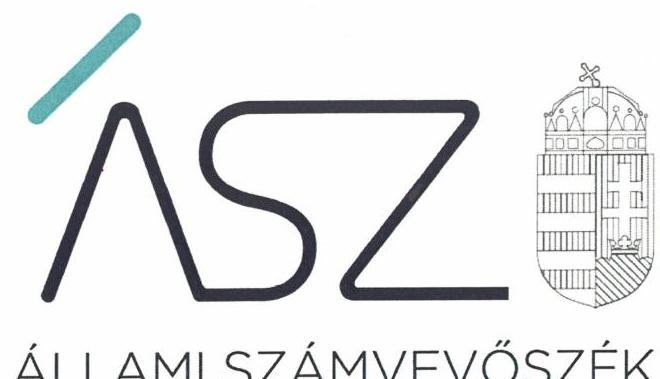
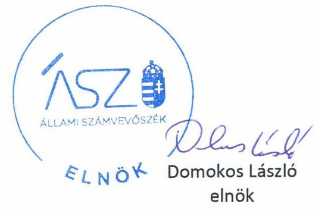

ÁLLAMI SZÁMVEVŐSZÉK

# JELENTÉS 

## Nem állami humánszolgáltatók ellenőrzése

A szociális humánszolgáltatást nyújtó intézmények, szolgáltatók államháztartáson kívüli fenntartói központi költségvetésből kapott támogatásai felhasználásának ellenőrzése Lórévi Szerb Ortodox Egyházközség
2020.

20082
www.asz.hu

---

ÁLLAMI SZÁMVEVŐSZÉK

# JELENTÉS 

## Nem állami humánszolgáltatók ellenőrzése

A szociális humánszolgáltatást nyújtó intézmények, szolgáltatók államháztartáson kívüli fenntartói központi költségvetésből kapott támogatásai felhasználásának ellenőrzése -

Lórévi Szerb Ortodox Egyházközség
2020.  október 30. nap

20082
www.asz.hu

---

# AZ ELLENŐRZÉST FELÜGYELTE: 

MAROZSÁN LÁSZLÓNÉ felügyeleti vezető

## AZ ELLENŐRZÉST VEZETTE ÉS A VÉGREHAJTÁSÁÉRT FELELŐS:

GÁL MAGDOLNA ellenőrzésvezető

## A PROGRAM ÖSSZEÁLLÍTÁSÁÉRT FELELŐS:

FEKETE-NAGY ANDRÁS GÁBOR ellenőrzési programért felelős vezető

TÓTPÁL SZABOLCS osztályvezető

## IKTATÓSZÁM: EL-2724-001/2020.

## TÉMASZÁM: 2491

ELLENŐRZÉS-AZONOSÍTÓ SZÁM: V083567; V0867092

---

# TARTALOMJEGYZÉK 

- ÖSSZEGZÉS ..... 5
- AZ ELLENŐRZÉS CÉLJA ..... 7
- AZ ELLENŐRZÉS TERÜLETE ..... 8
- AZ ELLENŐRZÉS HÁTTERE, INDOKOLTSÁGA ..... 9
- AZ ELLENŐRZÉS LÉNYEGES KÉRDÉSKÖREI ..... 10
- AZ ELLENŐRZÉS HATÓKÖRE ÉS MÓDSZEREI ..... 11
- JAVASLATOK ..... 13
- MELLÉKLETEK ..... 15
I. sz. melléklet: Értelmező szótár ..... 15
- FÜGGELÉK: ÉSZREVÉTELEK ..... 17
- RÖVIDÍTÉSEK JEGYZÉKE ..... 19

---

.

---

# ÖSSZEGZÉS 

A Lórévi Szerb Ortodox Egyházközség, mint intézményfenntartó a 2015-2018. években nem biztosította a szociális humánszolgáltatási közfeladatok ellátására kapott költségvetési támogatások felhasználásának elszámoltathatóságát, ellenőrizhetőségét.

## Az ellenőrzés társadalmi indokoltsága

A szociális gondoskodást igénylők védelme, illetve a köznevelési feladatok ellátása az Alaptörvényben meghatározott, a társadalom szempontjából fontos tevékenységek. Jogszabályok teszik lehetővé, hogy államháztartáson kívüli szervezetek - így például az egyházi fenntartók, alapítványok, gazdasági társaságok, egyesületek - által fenntartott intézmények is végezzenek köznevelési, szociális és gyermekvédelmi feladatokat. Mindehhez a központi költségvetés évente jelentős összegű támogatással járul hozzá. Az államháztartáson kívüli, humánszolgáltatást végző intézmények az igényelt közpénzekből társadalmilag hasznos, közösségteremtő, közérdekű, illetve közhasznú tevékenységet végeznek, illetve közfeladatokat látnak el.

Az intézményfenntartók ellenőrzésével az Állami Számvevőszék hozzájárul ahhoz, hogy ezen közpénzeket az államháztartáson kívüli szervezetek is ellenőrizhető, átlátható és elszámoltatható módon használják fel a közfeladatok ellátása során. Az ellenőrzések célja továbbá, hogy a nyilvánosság és az igénybevevők megfelelő tájékoztatást kapjanak az államháztartáson kívüli közfeladatot ellátók működéséről.

Az ÁSZ ellenőrzései arra adnak választ, hogy az intézményfenntartók arra használták-e fel a közpénzeket, amire igényelték.

A szabályszerű gazdálkodás elengedhetetlen a közfeladat ellátás szakmai céljainak megvalósításához, valamint a társadalmi közbizalom fenntartásához.

## Megállapítások, következtetések, javaslatok

A Lórévi Szerb Ortodox Egyházközség a Számv. tv. ${ }^{1}$ 14. § (3) és (5) bekezdéseiben előírtak ellenére a 2015-2018. években nem rendelkezett számviteli politikával és annak keretében elkészítendő számviteli szabályzatokkal. Ebből következően a költségvetési támogatások szabályszerű felhasználásának alapfeltételeit nem teremtette meg. A Fenntartó ${ }^{2}$ egy nem önállóan gazdálkodó, és két önállóan gazdálkodó intézmény fenntartásával látta el a szociális humánszolgáltatási feladatait: idősek otthona átlagos szintű ellátás, demens betegek ellátása. A Fenntartó a kapott támogatás felhasználását a jogszabályi előírások ellenére könyvviteli nyilvántartásában nem kezelte elkülönítetten a saját és a nem önállóan gazdálkodó humánszolgáltatást végző intézménye között, továbbá az általa ellátott feladatok között.

A Lórévi Szerb Ortodox Egyházközség a 2015-2018. években az egyszerűsített éves beszámoló készítési kötelezettségének a Számv. tv. 4. § (1) bekezdésében és az Eszámv. ${ }^{3}$ 5. §. (1) bekezdésében foglalt előírások ellenére nem tett eleget, ezáltal nem biztosította a költségvetési támogatások felhasználásának elszámoltathatóságát.

A számviteli szabályzatok, valamint az elkülönített nyilvántartás hiányában a Lórévi Szerb Ortodox Egyházközség a 2015-2018. években a szociális humánszolgáltatási közfeladat ellátására kapott költségvetési támogatás felhasználásának a Számv. tv. 161/A. § (2) bekezdésében előírt ellenőrizhetőségét nem biztosította. Mivel az Atr. ${ }^{4}$ 16. § (1) bekezdésében foglalt szabályozás ellenére nem gondoskodott arról, hogy a költségvetési támogatások felhasználásának, a Fenntartó és a nem önállóan gazdálkodó intézménye gazdálkodásának elkülönített, feladatonkénti bontásban történő elszámolására az adatok rendelkezésre álljanak. Ezáltal a Fenntartó nem igazolta, hogy a közpénzt a szociális humánszolgáltatási közfeladatra fordította.

A Fenntartó képviselője az ellenőrzés ideje alatt intézkedést rendelt el a költségvetési támogatások elkülönítésére vonatkozóan. Ezenkívül a hatályos számviteli politika, valamint a leltárkészítési és leltározási szabályzat megküldésével igazolta a szabályozási hiányosság egy részének az ellenőrzött időszakot követő megszűnését. Ugyanakkor azt

---

nem igazolta, hogy az ellenőrzött időszakot követően a Fenntartó már rendelkezik eszközök és források értékelési szabályzatával és pénzkezelési szabályzattal. Így az Állami Számvevőszék a Lórévi Szerb Ortodox Egyházközség vezetőjének a jelentésben két javaslatot fogalmazott meg, akinek a javaslatokat megalapozó megállapításokra 30 napon belül intézkedési tervet kell készíteni.

---

# AZ ELLENŐRZÉS CÉLJA

**AZ ELLENŐRZÉS CÉLJA** annak értékelése volt, hogy a nem állami, nem önkormányzati szociális intézmények fenntartói központi költségvetésből kapott támogatásainak felhasználása szabályszerű volt-e.

---

# **AZ ELLENŐRZÉS TERÜLETE**

## **Lórévi Szerb Ortodox Egyházközség**

### **A LÓRÉVI SZERB ORTODOX EGYHÁZKÖZ-

SÉG** a Szerb Ortodox Egyház Budai Egyházmegyéjének önálló szervezeti egysége. Az Egyházmegye5 az Országgyűlés által elismert, bevett egyház.

A Lórévi Szerb Ortodox Egyházközség, mint Fenntartó az Egyházmegye szerves részét képező belső egyházi jogi személy.

A lórévi székhelyű, Pest megyében működő Fenntartó a 2015-2018. években három szociális intézmény útján biztosított az idősek számára bentlakásos ápoló-gondozó otthoni ellátást. A ráckevei Fidelio Időskorúak Otthona nem önálló jogi személyként működött, a dabasi Átrium Idősek Otthona és a tápiógyörgyei Szivárvány Idősek Otthona önállóan gazdálkodó volt.

A Fenntartó a 2015-2018. években Magyarország éves költségvetéséből szakosított szociális ellátásokra a Magyar Államkincstár elszámoló határozatai alapján 2015. évben 293,6 millió Ft, 2016. évben 308,3 millió Ft, 2017. évben 348,1 millió Ft, 2018. évben 386,5 millió Ft összegű támogatásban részesült.

---

# AZ ELLENŐRZÉS HÁTTERE, INDOKOLTSÁGA 

A szociális feladatokat ellátó nem állami intézményfenntartók részére közfeladataik ellátására évente jelentős összegű pénzügyi támogatást biztosítottak a mindenkori költségvetési törvények a bennük megfogalmazott feltételek mellett. A felhasználható állami támogatások a Kvtv. ${ }^{6}$-ekben a 2015-2018. években a szociális ágazatra vonatkozóan 360 Mrd Ft előirányzatot határoztak meg.

Az ÁSZ ${ }^{7}$ stratégiájában foglaltak alapján is indokolt az ellenőrzés, amely a társadalom számára jelzi, hogy a közpénz államháztartáson kívüli felhasználása sem maradhat ellenőrizetlenül. Az államháztartáson kívülre nyújtott költségvetési támogatások ellenőrzésével az ÁSZ hozzájárul ahhoz, hogy a közpénzeket a nem állami humán fenntartók átlátható módon használják fel a közfeladatok ellátására kötött szerződésekben vállalt kötelezettségek teljesítése érdekében. Az ellenőrzés javaslataival hozzájárulhat az említett rendszerek szabályszerű támogatás felhasználásához, javíthatja a társadalmi-gazdasági döntések megalapozottságát, amely a „jól irányított állam működésének" feltétele.

---

# AZ ELLENŐRZÉS LÉNYEGES KÉRDÉSKÖREI 

1.     - A szociális humánszolgáltató közfeladatot ellátó fenntartó szabályszerű működési - és gazdálkodási környezet kialakításával megteremtette-e a költségvetési támogatások átlátható, elszámoltatható igénybevételének, felhasználásának feltételeit?
2.     - Az államháztartáson kívüli fenntartó az átvállalt szociális humánszolgáltatási közfeladathoz biztosított költségvetési támogatásokat szabályszerűen fordította-e a humánszolgáltató intézményei működtetésére?
3.     - Az államháztartáson kívüli fenntartó szociális humánszolgáltató intézményei működtetéséhez felhasznált közpénzekre vonatkozó gazdálkodásával a nyilvánosság előtt elszámolt-e, ennek érdekében ellenőrzési, értékelési és a külső ellenőrzésekkel kapcsolatos intézkedési feladatait szabályszerűen látta-e el?

---

# AZ ELLENŐRZÉS HATÓKÖRE ÉS MÓDSZEREI 

## Az ellenőrzés típusa

Megfelelőségi ellenőrzés.

## Az ellenőrzött időszak

A 2015. január 1-je és 2018. december 31-e közötti időszak

## Az ellenőrzés tárgya

Az ellenőrzés a szociális humánszolgáltatási közfeladatokat ellátó államháztartáson kívüli fenntartók humánszolgáltatási közfeladatai ellátásához a központi költségvetésből kapott támogatásaik humánszolgáltatási közfeladatokra való fenntartó általi felhasználása szabályszerűségének értékelésére terjedt ki.

## Az ellenőrzött szervezet

Lórévi Szerb Ortodox Egyházközség

## Az ellenőrzés jogalapja

Az ellenőrzés jogszabályi alapját az ÁSZ tv. ${ }^{8} 1 . \S$ (3) bekezdése, valamint az 5. § (11) bekezdés c) pontjában foglalt előírások adják.

## Az ellenőrzés módszerei

Az ellenőrzést az ellenőrzési program annak szempontjai, kérdései, az ellenőrzött időszakban hatályos jogszabályok, a nemzetközi standardokat irányadónak tekintve, az ellenőrzés szakmai szabályok és módszertanok figyelembe vételével rendelte elvégezni. A közpénzekkel való felelős gazdálkodás segítésére irányuló javaslatok kidolgozásakor a hatályos jogszabályok az irányadók.

Az ellenőrzés ideje alatt az ÁSZ az ellenőrzött szervezettel történő kapcsolattartást az ÁSZ SZMSZ²-ének vonatkozó előírásai alapján biztosította.

Az ellenőrzési kérdések megválaszolásához szükséges bizonyítékok megszerzése az ellenőrzött által rendelkezésre bocsátott dokumentumokra, adatokra alapozva történt.

---

Az ellenőrzési bizonyítékként felhasználható adatforrások közé tartoztak egyrészt a szakmai program részletes szempontjainál felsorolt adatforrások, másrészt minden - az ellenőrzés folyamán feltárt, az ellenőrzés szempontjából információt tartalmazó - dokumentum.

Az ellenőrzés lefolytatásához az ellenőrzött szervezet a kitöltött tanúsítványok, valamint az ÁSZ által kért dokumentumok elektronikus úton való megküldésével szolgáltatott adatokat, információkat. Az így rendelkezésre bocsátott adatok, információk és a tanúsítványok adatai valódiságának kontrollja az ellenőrzés keretében megtörtént.

Az egységes értelmezést támogatta a program mellékletét képező fogalomtár és rövidítésjegyzék.

Az ellenőrzést alapvetően a szociális humánszolgáltatások esetében a központi költségvetési támogatások igénylésével, módosításával, felhasználásával, elszámolásával kapcsolatos feladatokat ellátó fenntartónál végezte az ÁSZ.

Az ÁSZ a szociális humánszolgáltatások központi költségvetési támogatásaival kapcsolatos, államháztartáson kívüli fenntartó jogszabályokban előírt feladatai betartását, továbbá a központi költségvetési támogatások szabályszerű nyilvántartását ellenőrizte a fenntartónál rendelkezésre álló nyilvántartások, beszámolók és egyéb dokumentumok alapján. Az ellenőrzés nem terjedt ki a szociális humánszolgáltatások központi költségvetési támogatásai igénylése, módosítása, elszámolása valódiságának, megalapozottságának, helyességének - sem a fenntartónál, sem a székhely intézményeinél való - értékelésére. Továbbá nem terjedt ki az ellenőrzés e források szabályszerű felhasználásának értékelésére.

---

# JAVASLATOK 

Az ÁSZ tv. 33. § (1) bekezdésében foglaltak értelmében az ellenőrzött szervezet vezetője köteles a jelentésben foglalt megállapításokhoz kapcsolódó intézkedési tervet összeállítani és azt a jelentés kézhezvételétől számított 30 napon belül az ÁSZ részére megküldeni. Amennyiben az ellenőrzött szervezet vezetője nem küldi meg határidőben az intézkedési tervet, vagy továbbra sem elfogadható intézkedési tervet küld, az Állami Számvevőszék elnöke az ÁSZ tv. 33. § (3) bekezdés a) és b) pontjaiban foglaltakat érvényesítheti.

## Lórévi Szerb Ortodox Egyházközség vezetőjének

1. Gondoskodjon a Számv. tv. előírásai szerint az egyházközség
a) eszközök és források értékelési szabályzata és
b) pénzkezelési szabályzata elkészítéséről.
(5. oldal Megállapítások, következtetések, javaslatok 1. bekezdés 1. mondata és a 4. bekezdés 3. mondata alapján )

---

.

---

# MELLÉKLETEK 

## I. SZ. MELLÉKLET: ÉRTELMEZŐ SZÓTÁR

bevett egyház
humánszolgáltatás
költségvetési támogatás
nem állami, nem önkormányzati (államháztartáson kívüli) intézmény fenntartó
vallási tevékenység
vallási tevékenységet végző szervezet

Az Ehtv. ${ }^{10}$ 6. § (1-2) bekezdései szerint az Országgyűlés által elismert egyház bevett egyház. Vallási közösség az Országgyűlés által elismert egyház és a vallási tevékenységet végző szervezet lehet. A vallási közösség elsődlegesen vallási tevékenység céljából jön létre és működik. Az Ehtv. 7. §-a szerint a vallási közösség az egyház megjelölést elnevezésében és tevékenységére való utalás során önmeghatározása céljából - a saját hitelvei szerinti tartalommal - használhatja.
Külön törvényben meghatározott szociális, gyermekjóléti, gyermekvédelmi, közoktatási, felsőoktatási, kulturális közfeladatok (2014. évi Kvtv. 34. § (1), (4) bekezdés, 1. számú melléklet XX/20/2. alcím, 19. alcím, 2015. évi Kvtv. 43. § (1), (4) bekezdés, 1. számú melléklet XX/20/2/3. jogcím csoport, 19. alcím, 2016. évi Kvtv. 41. § (1), (4) bekezdés, 1. számú melléklet XX/20/2/3. jogcím csoport, 19. alcím, 2017. évi Kvtv. 41. § (1), (4) bekezdés,
 1. számú melléklet XX/20/2/3. jogcím csoport, 19. alcím).
a társadalombiztosítás pénzügyi alapjai kivételével az államháztartás központi alrendszeréből ellenérték nélkül, pénzben nyújtott támogatások (Áht. ${ }^{11}$ 1. § 14. pont)
A költségvetési törvényekben (2014. évi C. törvény 42-43. §, 2015. évi C. törvény 40-41. §, 2016. évi XC. törvény 40-41. §, 2017. évi C. törvény 40-41. §) megállapított támogatás. Például a 2015. évi C. törvény 40-41. § szerint többek között: Az Országgyűlés a szociális, gyermekjóléti, gyermekvédelmi közfeladatot ellátó intézményt, szolgáltatást fenntartó egyházi jogi személy, civil szervezet, közalapítvány, országos nemzetiségi önkormányzat, települési vagy területi nemzetiségi önkormányzat, gazdasági társaság, és a humánszolgáltatást alaptevékenységként végző, az Szja tv. ${ }^{12}$ hatálya alá tartozó egyéni vállalkozó (a továbbiakban együtt: nem állami szociális fenntartó) részére támogatást állapít meg a következők szerint: a támogatás a nem állami szociális fenntartót a települési önkormányzatok 2. melléklet III. pont 3. alpont c)-k) pontjában és III. pont 5. alpont a) pontjában meghatározott támogatásaival azonos jogcímeken, összegben és feltételek mellett illeti meg.
A szociális, gyermekjóléti és gyermekvédelmi közfeladatokat/humánszolgáltatásokat ellátó intézményt fenntartó egyházi jogi személy, társadalmi szervezet, alapítvány, közalapítvány, civil szervezet, országos nemzetiségi önkormányzat, nonprofit gazdasági társaság, gazdasági társaság és a humánszolgáltatást alaptevékenységként végző, Szja tv. hatálya alá tartozó egyéni vállalkozó. (2014. évi Kvtv. 33. §, 34. § (1), (4) bekezdés, 2015. évi Kvtv. 42. §, 43. § (1), (4) bekezdés, 2016. évi Kvtv. 40. §, 41. § (1), (4) bekezdés, 2017. évi Kvtv. 41. § (1), (4), 2018. évi Kvtv. 41. § (1))
Az Ehtv. 6. § (3) bekezdés szerint a vallási tevékenység olyan világnézethez kapcsolódó tevékenység, amely természetfelettire irányul, rendszerbe foglalt hitelvekkel rendelkezik, tanai a valóság egészére irányulnak, valamint sajátos magatartáskövetelményekkel az emberi személyiség egészét átfogja. Az Ehtv. 6. § (4) bekezdés (e, f, j, o) pontjai szerint önmagában nem tekinthető vallási tevékenységnek a nevelési, az oktatási, a család-, gyermek- és ifjúságvédelmi és a szociális tevékenység.
Az Ehtv. 9/A. § (1) bekezdései szerint a vallási tevékenységet végző szervezet olyan egyesület, amelynek tagjai azonos hitelveket valló természetes személyek, és amelynek alapszabályában meghatározott célja vallási tevékenység végzése.

---

.

---

# FÜGGELÉK: ÉSZREVÉTELEK 

A jelentéstervezetet a Számvevőszék 15 napos észrevételezésre megküldte az ellenőrzött szervezet vezetőjének az ÁSZ tv. 29. § (1) bekezdése előírásának megfelelően.

A Lórévi Szerb Ortodox Egyházközség vezetője a jelentéstervezet megállapításaira nem tett észrevételt.

[^0]
[^0]:    * 29. § (1) Az Állami Számvevőszék az ellenőrzési megállapításait megküldi az ellenőrzött szervezet vezetőjének vagy az általa megbízott személynek, és annak, akinek személyes felelősségét állapította meg.
    (2) Az ellenőrzött szervezet vezetője és a felelősként megjelölt személy az ellenőrzés megállapításaira tizenöt napon belül írásban észrevételt tehet.
    (3) Az Állami Számvevőszék az észrevételre a beérkezésétől számított harminc napon belül írásban válaszol. A figyelembe nem vett észrevételeket köteles a jelentésben feltüntetni, és megindokolni, hogy azokat miért nem fogadta el.

---

.

---

# RÖVIDÍTÉSEK JEGYZÉKE 

${ }^{1}$ Számv. tv.
${ }^{2}$ Fenntartó
${ }^{3}$ Eszámv.
${ }^{4}$ Atr.
${ }^{5}$ Egyházmegye
${ }^{6}$ Kvtv.-ek
${ }^{7}$ ÁSZ
${ }^{8}$ ÁSZ tv.
${ }^{9}$ ÁSZ SZMSZ
${ }^{10}$ Ehtv.
${ }^{11}$ Áht.
${ }^{12}$ Szja tv.
2000. évi C. törvény a számvitelről

Lórévi Szerb Ortodox Egyházközség
296/2013. (VII. 29.) Korm. rendelet az egyházi jogi személyek beszámolókészítési és könyvvezetési kötelezettségének sajátosságairól
489/2013. (XII. 18.) Korm. rendelet az egyházi és nem állami fenntartású szociális, gyermekjóléti és gyermekvédelmi szolgáltatók, intézmények és hálózatok állami támogatásáról (hatályos 2014. január 1-jétől)
Budai Szerb Ortodox Egyházmegye
2014. évi C. törvény Magyarország 2015. évi központi költségvetéséről
2015. évi C. törvény Magyarország 2016. évi központi költségvetéséről
2016. évi XC. törvény Magyarország 2017. évi központi költségvetéséről
2017. évi C. törvény Magyarország 2018. évi központi költségvetéséről

Állami Számvevőszék
2011. évi LXVI. törvény az Állami Számvevőszékről

Állami Számvevőszék Szervezeti és Működési Szabályzata
2011. évi CCVI. törvény a lelkiismereti és vallásszabadság jogáról, valamint az egyházak, vallásfelekezetek és vallási közösségek jogállásáról
2011. évi CXCV. törvény az államháztartásról
1995. évi CXVII. törvény a személyi jövedelemadóról

---

# ASZ 

ÁLLAMI SZÁMVEVŐSZÉK
1052 Budapest, Apáczai Cs. J. u. 10. I 1364 Budapest 4. Pf. 54 TEL: +36 14849100
email: szamvevoszek@asz.hu
web: www.asz.hu | www.aszhirportal.hu
