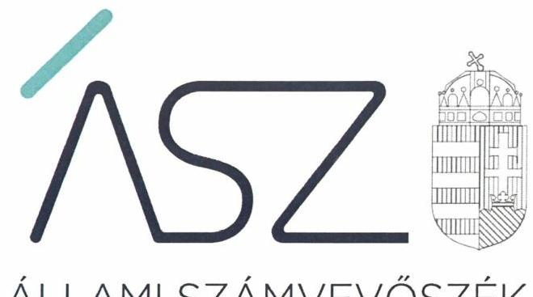
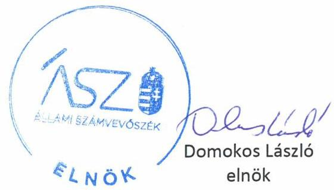

ÁLLAMI SZÁMVEVŐSZÉK

# JELENTÉS 

## Nem állami humánszolgáltatók ellenőrzése

A szociális humánszolgáltatást nyújtó intézmények, szolgáltatók államháztartáson kívüli fenntartói központi költségvetésből kapott támogatásai felhasználásának ellenőrzése -

ILONA-ARANYKOR SZOCIÁLIS GONDOZÓ
Nonprofit Közhasznú Korlátolt Felelősségű Társaság
2020.

20083
www.asz.hu

---

ÁLLAMI SZÁMVEVŐSZÉK

# JELENTÉS

Nem állami humánszolgáltatók ellenőrzése

A szociális humánszolgáltatást nyújtó intézmények, szolgáltatók államháztartáson kívüli fenntartói központi költségvetésből kapott támogatásai felhasználásának ellenőrzése – ILONA-ARANYKOR SZOCIÁLIS GONDOZÓ Nonprofit Közhasznú Korlátolt Felelősségű Társaság

2020. OG hó 30 nap

20083
www.asz.hu

---

# AZ ELLENŐRZÉST FELÜGYELTE: 

MAROZSÁN LÁSZLÓNÉ felügyeleti vezető

## AZ ELLENŐRZÉST VEZETTE ÉS A VÉGREHAJTÁSÁÉRT FELELŐS:

SIPOSNÉ DÓCZI KLÁRA IBOLYA ellenőrzésvezető

## A PROGRAM ÖSSZEÁLLÍTÁSÁÉRT FELELŐS:

FEKETE-NAGY ANDRÁS GÁBOR ellenőrzési program elkészítéséért felelős vezető

TÓTPÁL SZABOLCS osztályvezető

IKTATÓSZÁM: EL-2654-001/2020.
TÉMASZÁM: 2491
ELLENŐRZÉS-AZONOSÍTÓ SZÁM: V083548 ÉS V0867064

---

# TARTALOMJEGYZÉK 

■ ÖSSZEGZÉS ..... 5
■ AZ ELLENŐRZÉS CÉLJA ..... 7
■ AZ ELLENŐRZÉS TERÜLETE ..... 8
■ AZ ELLENŐRZÉS HÁTTERE, INDOKOLTSÁGA ..... 9
■ A JELENTÉS LÉNYEGES KÉRDÉSKÖREI ..... 10
■ AZ ELLENŐRZÉS HATÓKÖRE ÉS MÓDSZEREI ..... 11
■ MEGÁLLAPÍTÁSOK ..... 13
■ MELLÉKLETEK ..... 15
I. sz. melléklet: Értelmező szótár ..... 15
■ FÜGGELÉK: ÉSZREVÉTELEK ..... 17
■ RÖVIDÍTÉSEK JEGYZÉKE ..... 19

---

.

---

# ÖSSZEGZÉS 

A budapesti székhelyű ILONA-ARANYKOR SZOCIÁLIS GONDOZÓ Nonprofit Közhasznú Korlátolt Felelősségű Társaság a 2015-2017. években nem biztosította a szociális humánszolgáltatási közfeladatok ellátására kapott költségvetési támogatások felhasználásának ellenőrizhetőségét. 2018-ban a támogatások felhasználásának elszámoltathatóságát, átláthatóságát biztosította.

## Az ellenőrzés társadalmi indokoltsága

A szociális gondoskodást igénylők védelme, illetve a köznevelési feladatok ellátása az Alaptörvényben meghatározott, a társadalom szempontjából fontos tevékenységek. Jogszabályok teszik lehetővé, hogy államháztartáson kívüli szervezetek - így például az egyházi fenntartók, alapítványok, gazdasági társaságok, egyesületek - által fenntartott intézmények is végezzenek köznevelési, szociális és gyermekvédelmi feladatokat. Mindehhez a központi költségvetés évente jelentős összegű támogatással járul hozzá. Az államháztartáson kívüli, humánszolgáltatást végző intézmények az igényelt közpénzekből társadalmilag hasznos, közösségteremtő, közérdekű, illetve közhasznú tevékenységet végeznek, illetve közfeladatokat látnak el.

Az intézményfenntartók ellenőrzésével az Állami Számvevőszék hozzájárul ahhoz, hogy ezen közpénzeket az államháztartáson kívüli szervezetek is ellenőrizhető, átlátható és elszámoltatható módon használják fel a közfeladatok ellátása során. Az ellenőrzések célja továbbá, hogy a nyilvánosság és az igénybevevők megfelelő tájékoztatást kapjanak az államháztartáson kívüli közfeladatot ellátók müködéséről.

Az ÁSZ ellenőrzései arra adnak választ, hogy az intézményfenntartók arra használták-e fel a közpénzeket, amire igényelték.

A szabályszerű gazdálkodás elengedhetetlen a közfeladat ellátás szakmai céljainak megvalósításához, valamint a társadalmi közbizalom fenntartásához.

## Főbb megállapítások, következtetések

A budapesti székhelyű ILONA-ARANYKOR SZOCIÁLIS GONDOZÓ Nonprofit Közhasznú Korlátolt Felelősségű Társaság a 2015-2017. években szociális humánszolgáltatási közfeladatait egy nem önállóan gazdálkodó intézményében ${ }^{1}$ látta el. Az idősek otthonában emelt szintű ellátást végzett, valamint időskorúak gondozóházának és pszichiátriai betegek átmeneti otthonának a működtetését látta el. A Fenntartó² az ellenőrzött időszakban könyvviteli nyilvántartásait nem vezette szabályszerűen, mivel azokban nem különítette el a gazdálkodását az intézménye gazdálkodásától, valamint nem vezette a költségvetési támogatás felhasználását feladatok szerinti bontásban.

A fentiek alapján az ILONA-ARANYKOR SZOCIÁLIS GONDOZÓ Nonprofit Közhasznú Korlátolt Felelősségű Társaság, mint szociális humánszolgáltató közfeladatot ellátó intézmény fenntartója a 2015-2017 években a szociális humánszolgáltatási közfeladat ellátására kapott költségvetési támogatás felhasználásának a Számv. tv. ${ }^{3}$ 161/A § (2) bekezdésében előírt ellenőrizhetőségét nem biztosította. Mivel az Atr. ${ }^{4}$ 16. § (1) bekezdésében foglalt szabályozás ellenére nem gondoskodott arról, hogy a költségvetési támogatások felhasználásának, a Fenntartó és a nem önállóan gazdálkodó intézménye gazdálkodásának elkülönített, feladatonkénti bontásban történő elszámolására az adatok rendelkezésre álljanak.

A Fenntartó mindezek alapján az Alaptörvény 39. cikk (2) bekezdésében foglaltak ellenére a 2015-2017 években a felhasznált közpénzekre vonatkozó gazdálkodása átláthatóságát nem biztosította, ezáltal a Fenntartó nem igazolta, hogy a közpénzt a szociális humánszolgáltatási közfeladatra fordította.

---

A Fenntartó 2018-ban kialakította a költségvetési támogatások elszámolásának, nyilvántartásának szabályszerű feltételeit, biztosította a támogatások felhasználásának a jogszabályi előírásoknak megfelelő, elkülönített nyilvántartási keretrendszerét. A felhasznált közpénzekkel való gazdálkodásáról a jogszabályi előírásoknak megfelelően a nyilvánosság előtt elszámolt.

---

# AZ ELLENŐRZÉS CÉLJA 

AZ ELLENŐRZÉS CÉLJA annak értékelése volt, hogy a nem állami, nem önkormányzati szociális intézmények fenntartói központi költségvetésből kapott támogatásainak felhasználása szabályszerű volt-e.

---

# **AZ ELLENŐRZÉS TERÜLETE**

## **ILONA-ARANYKOR SZOCIÁLIS GONDOZÓ Nonprofit Közhasznú Korlátolt Felelősségű Társaság mint intézményfenntartó**

A budapesti székhelyű ILONA-ARANYKOR SZOCIÁLIS GONDOZÓ Nonprofit Közhasznú Korlátolt Felelősségű Társaság a 2003-ban magánszemélyek által alapított jogelőd közhasznú társaságból 2009. április 25-i átalakulással jött létre.

A Társaságnál a 2015-2018 években az átlagosan foglalkoztatottak száma rendre 30, 20, 22 illetve 20 fő volt.

A Társaság közhasznú feladatellátásához kapcsolódóan Ócsa Város Önkormányzatával Ellátási szerződést kötött.

Feladatait a nem önállóan gazdálkodó intézménye, az Ilona Aranykor Szociális Gondozó Otthon útján látta el. A szolgáltatási helyre vonatkozóan az ellenőrzött időszakban az engedélyezett és befogadott férőhelyszám az időskorúak gondozóháza szolgáltatás esetében 2016. november 30-ig 62 férőhely volt, majd azt követően 72 fő, az idősek otthona emelt szintű szolgáltatás esetében 10 férőhely, a pszichiátriai betegek átmeneti otthona szolgáltatás esetében pedig 32 férőhely volt. A Fenntartó részére a szociális humánszolgáltatási feladat ellátásához a központi költségvetésből biztosított támogatás a Magyar Államkincstár adatai szerint a 2015-2018. időszakban 315 M Ft volt.

---

# AZ ELLENŐRZÉS HÁTTERE, INDOKOLTSÁGA 

A szociális feladatokat ellátó nem állami intézményfenntartók részére közfeladataik ellátására évente jelentős összegű pénzügyi támogatást biztosítottak a mindenkori költségvetési törvények a bennük megfogalmazott feltételek mellett. A felhasználható állami támogatások a Költségvetési törvényekben ${ }^{6}$ a 2015-2018. években a szociális ágazatra vonatkozóan 360 milliárd forint előirányzatot határoztak meg.

Az ÁSZ ${ }^{7}$ a stratégiájában célul tűzte ki, hogy az államháztartáson kívülre nyújtott költségvetési támogatások ellenőrzésével hozzájárul ahhoz, hogy a közpénzeket az államháztartáson kívüli szervezetek is átlátható módon használják fel a közfeladatok szerződésben vállalt ellátása érdekében. Az ÁSZ stratégiájában foglaltak alapján is indokolt az ellenőrzés, amely a társadalom számára jelzi, hogy a közpénz államháztartáson kívüli felhasználása sem maradhat ellenőrizetlenül. Az államháztartáson kívülre nyújtott költségvetési támogatások ellenőrzésével az ÁSZ hozzájárul ahhoz, hogy a közpénzeket a nem állami humán fenntartók átlátható módon használják fel a közfeladatok ellátására kötött szerződésekben vállalt kötelezettségek teljesítése érdekében. Az ellenőrzés javaslataival hozzájárulhat az említett rendszerek szabályszerű támogatás felhasználásához, javíthatja a társa-dalmi-gazdasági döntések megalapozottságát, amely a „jól irányított állam müködésének" feltétele.

---

# A JELENTÉS LÉNYEGES KÉRDÉSKÖREI 

1.- A Fenntartó szabályszerű müködési - és gazdálkodási környezet kialakításával megteremtette-e a költségvetési támogatások átlátható, elszámoltatható igénybevételének, felhasználásának feltételeit?
2.- A Fenntartó az átvállalt szociális humánszolgáltatási közfeladathoz biztositott költségvetési támogatásokat szabályszerűen fordította-e a humánszolgáltató intézménye müködtetésére, a felhasznált közpénzekre vonatkozó gazdálkodásával a nyilvánosság előtt elszámolt-e?

---

# AZ ELLENŐRZÉS HATÓKÖRE ÉS MÓDSZEREI 

## Az ellenőrzés típusa

Megfelelőségi ellenőrzés.

## Az ellenőrzött időszak

A 2015. január 1-je és 2018. december 31-e közötti időszak. A helyszíni szemle tekintetében 2018. január 1-jétől a helyszíni szemle időpontjáig, 2019. június 19-ig tartó időszak.

## Az ellenőrzés tárgya

Az ellenőrzés a szociális humánszolgáltatási közfeladatokat ellátó államháztartáson kívüli fenntartók humánszolgáltatási közfeladatai ellátásához a központi költségvetésből kapott támogatásaik humánszolgáltatási közfeladatokra való fenntartó általi felhasználása szabályszerűségének értékelésére terjedt ki.

## Az ellenőrzött szervezet

ILONA-ARANYKOR SZOCIÁLIS GONDOZÓ Nonprofit Közhasznú Korlátolt Felelősségű Társaság mint intézményfenntartó

## Az ellenőrzés jogalapja

Az ellenőrzés jogszabályi alapját az ÁSZ tv. ${ }^{8} 1 . \S$ (3) bekezdésében és az ÁSZ tv. 5. § (3) bekezdésében foglalt előírások adták.

## Az ellenőrzés módszerei

Az ellenőrzést az ellenőrzési program annak szempontjai, kérdései, az ellenőrzött időszakban hatályos jogszabályok, a nemzetközi standardokat irányadónak tekintve, az ellenőrzés szakmai szabályok és módszertanok figyelembe vételével rendelte elvégezni. A közpénzekkel való felelős gazdálkodás segítésére irányuló javaslatok kidolgozásakor a hatályos jogszabályok az irányadók.

Az ellenőrzés ideje alatt az ellenőrzött szervezettel történő kapcsolattartást az ÁSZ SZMSZ ${ }^{9}$-ének vonatkozó előírásai alapján biztosította az ÁSZ.

---

Az ellenőrzési kérdések megválaszolásához szükséges bizonyítékok megszerzése az ellenőrzött által rendelkezésre bocsátott dokumentumokra, adatokra alapozva elemző eljárással történt.

Az ellenőrzési bizonyítékként felhasználható adatforrások közé tartoztak egyrészt az ellenőrzési program részletes szempontjainál felsorolt adatforrások, másrészt minden - az ellenőrzés folyamán feltárt, az ellenőrzés szempontjából információt tartalmazó - dokumentum.

Az ellenőrzés lefolytatásához az ellenőrzött szervezet a kitöltött tanúsítványok, valamint az ÁSZ által kért dokumentumok elektronikus úton való megküldésével szolgáltatott adatokat, információkat. Az így rendelkezésre bocsátott adatok, információk és a tanúsítványok adatai valódiságának kontrollja az ellenőrzés keretében történt.

A fenntartott intézménynél helyszíni szemle keretében győződött meg az ÁSZ a tényleges feladatellátásról (verifikáció).

A szociális humánszolgáltatások központi költségvetési támogatásaival kapcsolatos, államháztartáson kívüli fenntartó jogszabályokban előírt feladatai betartását, továbbá a központi költségvetési támogatások szabályszerű nyilvántartását ellenőrizte az ÁSZ a Fenntartónál rendelkezésre álló nyilvántartások, beszámolók és egyéb dokumentumok alapján. Az ellenőrzés nem terjedt ki a szociális humánszolgáltatások központi költségvetési támogatásai igénylése, módosítása, elszámolása valódiságának, megalapozottságának, helyességének értékelésére (mivel ennek felülvizsgálata, ellenőrzése a finanszírozó jogszabályban előírt feladata, határozatai kiadása előtt). Továbbá nem terjedt ki az ellenőrzés e források szabályszerű felhasználásának értékelésére.

---

# MEGÁLLAPÍTÁSOK 

## 1. A Fenntartó szabályszerű múködési - és gazdálkodási környezet kialakításával megteremtette-e a költségvetési támogatások átlátható, elszámoltatható igénybevételének, felhasználásának feltételeit?

Összegző megállapítás

A Fenntartó 2018-ban a költségvetési támogatások jogszabályi előírásoknak megfelelő igénybevételéhez és felhasználásához szabályszerű múködési- és gazdálkodási környezetet alakított ki.

A Fenntartó szervezeti és múködési szabályait a társasági szerződése tartalmazta.

A Fenntartó a Számv. tv. előírásai szerint rendelkezett számviteli politikával, valamint az annak keretében elkészítendő értékelési-, leltározási és leltárkészítési, valamint pénzkezelési szabályzatokkal, továbbá számlarenddel.

A Fenntartó biztosította az intézménye szervezeti kereteit és múködtetésének feltételeit, a Szoc.tv. ${ }^{10}$ előírásaival összhangban gondoskodott arról, hogy az Intézmény rendelkezett szervezeti és múködési szabályzattal, szakmai programmal és az 1/2000. SzCsM ${ }^{11}$ rendeletben meghatározott szabályzatokkal.

## 2. A Fenntartó az átvállalt szociális humánszolgáltatási közfeladathoz biztosított költségvetési támogatásokat szabályszerűen fordította-e a humánszolgáltató intézménye múködtetésére, a felhasznált közpénzekre vonatkozó gazdálkodásával a nyilvánosság előtt elszámolt-e?

Összegző megállapítás

A Fenntartó 2018-ra vonatkozóan igazolta, hogy a közfeladathoz biztosított támogatásokat intézménye múködtetésére fordította, gazdálkodásával a nyilvánosság előtt elszámolt.

A Fenntartó 2018-ban a Számv. tv. előírásainak megfelelően gondoskodott a szociális feladat ellátáshoz biztosított költségvetési támogatások szabályszerű, támogatásonkénti elkülönített nyilvántartásáról. A támogatások felhasználását a Számv. tv. és az Atr. előírásainak megfelelően, számviteli rendjében fenntartó és intézménye, valamint feladatonkénti bontásban elkülönítetten kezelte, ezáltal igazolta, hogy a költségvetési támogatásokat 2018. évben az intézménye múködtetésére fordította. A Számv. tv. és a

---

Civil tv. ${ }^{12}$ előírásai szerint tett eleget beszámoló készítési és közzétételi kötelezettségének, 2018. évre vonatkozóan a felhasznált közpénzekkel való gazdálkodásáról a nyilvánosságot tájékoztatta.

---

# MELLÉKLETEK 

- I. SZ. MELLÉKLET: ÉRTELMEZŐ SZÓTÁR
humánszolgáltatás
külön törvényben meghatározott szociális, gyermekjóléti, gyermekvédelmi, közoktatási, felsőoktatási, kulturális közfeladatok (2014. évi Kvtv. 34. § (1), (4) bekezdés, 1. számú melléklet XX/20/2. alcím, 19. alcím, 2015. évi Kvtv. 43. § (1), (4) bekezdés, 1. számú melléklet XX/20/2/3. jogcím csoport, 19. alcím, 2016. évi Kvtv. 41. § (1), (4) bekezdés, 1. számú melléklet XX/20/2/3. jogcím csoport, 19. alcím).
költségvetési támogatás a társadalombiztosítás pénzügyi alapjai kivételével az államháztartás központi alrendszeréből ellenérték nélkül, pénzben nyújtott támogatások (Áht. ${ }^{13}$ 1. § 14. pont)
A költségvetési törvényekben (2014. évi C. törvény 42-43. §, 2015. évi C. törvény 40-41. §) megállapított támogatás. Például a 2015. évi C. törvény 40-41. § szerint többek között: Az Országgyűlés a szociális, gyermekjóléti, gyermekvédelmi közfeladatot ellátó intézményt, szolgáltatást fenntartó egyházi jogi személy, civil szervezet, közalapítvány, országos nemzetiségi önkormányzat, települési vagy területi nemzetiségi önkormányzat, gazdasági társaság, és a humánszolgáltatást alaptevékenységként végző, az Szja tv. hatálya alá tartozó egyéni vállalkozó (a továbbiakban együtt: nem állami szociális fenntartó) részére támogatást állapít meg a következők szerint: a támogatás a nem állami szociális fenntartót a települési önkormányzatok 2. melléklet III. pont 3. alpont c)-k) pontjában és III. pont 5. alpont a) pontjában meghatározott támogatásaival azonos jogcímeken, öszszegben és feltételek mellett illeti meg.
nem állami, nem önkormányzati (államháztartáson kívüli) intézmény fenntartó
székhely intézmény
telephely
A szociális, gyermekjóléti és gyermekvédelmi közfeladatokat/humánszolgáltatásokat el-
látó intézményt fenntartó egyházi jogi személy, társadalmi szervezet, alapítvány, közalapítvány, civil szervezet, országos nemzetiségi önkormányzat, nonprofit gazdasági társaság, gazdasági társaság és a humánszolgáltatást alaptevékenységként végző, Szja tv. ${ }^{14}$ hatálya alá tartozó egyéni vállalkozó. (2014. évi Kvtv. 33. §, 34. § (1), (4) bekezdés, 2015. évi Kvtv. 42. §, 43. § (1), (4) bekezdés, 2016. évi Kvtv. 40. §, 41. § (1), (4) bekezdés, 2017. évi Kvtv. 41. § (1), (4))
a szolgáltató székhelye, azaz a szolgáltató központi ügyintézésének helye, függetlenül attól, hogy használják-e szolgáltatás nyújtására (Sznyvhr. ${ }^{15}$ 1.§ k) pont) (hatályos: 2013. december 1-től)
a szolgáltató székhelyétől különböző, szolgáltató/intézmény használatában álló hely, a szociális humánszolgáltatáshoz használt, bejegyzett hely. (Sznyvhr. 1.§ I) pont) (hatályos: 2015. január 1-től)

---

.

---

# FÜGGELÉK: ÉSZREVÉTELEK 

A jelentéstervezetet a Számvevőszék 15 napos észrevételezésre megküldte az ellenőrzött szervezet vezetőjének az ÁSZ tv. 29. §* (1) bekezdése előírásának megfelelően.

Az ILONA-ARANYKOR SZOCIÁLIS GONDOZÓ Nonprofit Közhasznú Korlátolt Felelősségú Társaság ügyvezetője a jelentéstervezetre nem tett észrevételt.

[^0]
[^0]:    * 29. § (1) Az Állami Számvevőszék az ellenőrzési megállapításait megküldi az ellenőrzött szervezet vezetőjének vagy az általa megbízott személynek, és annak, akinek személyes felelősségét állapította meg.
    (2) Az ellenőrzött szervezet vezetője és a felelősként megjelölt személy az ellenőrzés megállapításaira tizenöt napon belül írásban észrevételt tehet.
    (3) Az Állami Számvevőszék az észrevételre a beérkezésétől számított harminc napon belül írásban válaszol. A figyelembe nem vett észrevételeket köteles a jelentésben feltüntetni, és megindokolni, hogy azokat miért nem fogadta el.

---

.

---

# RÖVIDÍTÉSEK JEGYZÉKE 

${ }^{1}$ intézmény
${ }^{2}$ Fenntartó
${ }^{3}$ Számv. tv.
${ }^{4}$ Atr.
${ }^{5}$ Ellátási szerződés
${ }^{6}$ Költségvetési törvények
${ }^{7}$ ÁSZ
${ }^{8}$ ÁSZ tv.
${ }^{9}$ ÁSZ SZMSZ
${ }^{10}$ Szoc. tv.
${ }^{11}$ 1/2000. SzCSM rendelet
${ }^{12}$ Civil tv.
${ }^{13}$ Áht.
${ }^{14}$ Szja. tv.
${ }^{15}$ Sznyvhr.

Ilona Aranykor Szociális Gondozó Otthon
ILONA-ARANYKOR SZOCIÁLIS GONDOZÓ Nonprofit Közhasznú Kft.
2000. évi C törvény a számvitelről (hatályos 2001. január 1-től)
489/2013. (XII. 18.) Korm. rendelet az egyházi és nem állami fenntartású szociális, gyermekjóléti és gyermekvédelmi szolgáltatók, intézmények és hálózatok állami támogatásáról
ILONA-ARANYKOR SZOCIÁLIS GONDOZÓ Nonprofit Közhasznú Kft. és Ócsa Város Önkormányzata között 2006. november 15-én létrejött Ellátási szerződés 2014. évi C. törvény Magyarország 2015. évi központi költségvetéséről, 2015. évi C. törvény Magyarország 2016. évi központi költségvetéséről, 2016. évi XC. törvény Magyarország 2017. évi központi költségvetéséről 2017. évi C. törvény Magyarország 2018. évi központi költségvetéséről Állami Számvevőszék
2011. évi LXVI. törvény az Állami Számvevőszékről (hatályos: 2011 július 1-től) az Állami Számvevőszék Szervezeti és Múködési Szabályzata
1993. évi III. törvény a szociális igazgatásról és szociális ellátásokról (hatályos 1993. február 26-tól)
1/2000. (I. 7.) SzCsM rendelet a személyes gondoskodást nyújtó szociális intézmények szakmai feladatairól és múködésük feltételeiről
2011. évi CLXXV. törvény az egyesülési jogról, a közhasznú jogállásról, valamint a civil szerveztek múködéséről és támogatásáról (hatályos 2011. december 22-től) 2011. évi CXCV. törvény az államháztartásról (hatályos: 2011. december 31-től) 1995. évi CXVII. törvény a személyi jövedelemadóról (hatályos 1996. január 1-től) 369/2013. (X. 24.) Korm. rendelet a szociális, gyermekjóléti és gyermekvédelmi szolgáltatók, intézmények és hálózatok hatósági nyilvántartásáról és ellenőrzéséről (hatályos 2013. december 1-jétől)

---

# ASZ 

ALLAMI SZAMVEVOSZEK
1052 Budapest, Apáczai Cs. J. u. 10. I 1364 Budapest 4. Pf. 54 TEL: +36 14849100
email: szamvevoszek@asz.hu
web: www.asz.hu | www.aszhirportal.hu