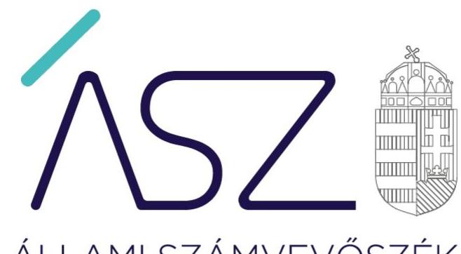
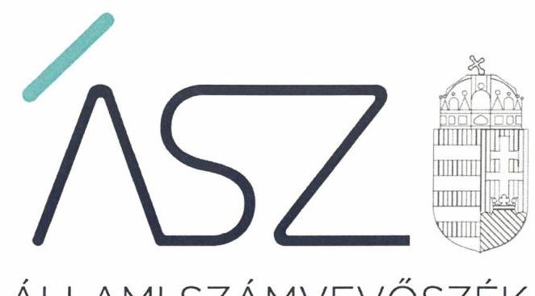
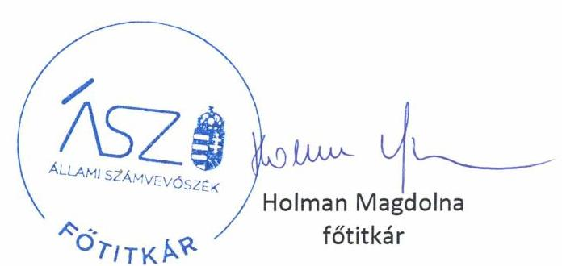

ÁLLAMI SZÁMVEVŐSZÉK

# JELENTÉS 

Pártok gazdálkodása

A költségvetési támogatásban részesülő pártok 2017-2018. évi gazdálkodása törvényességének ellenőrzése a Demokratikus Koalíciónál

2020.
20085
www.asz.hu

---

ÁLLAMI SZÁMVEVŐSZÉK

# JELENTÉS 

## Pártok gazdálkodása

A költségvetési támogatásban részesülő pártok 2017-2018. évi gazdálkodása törvényességének ellenőrzése a Demokratikus Koalíciónál
2020. 05. hó 21. nap

20085
www.asz.hu

---

# AZ ELLENŐRZÉST FELÜGYELTE: 

DR. BENEDEK MÁRIA felügyeleti vezető

## AZ ELLENŐRZÉST VEZETTE ÉS A VÉGREHAJTÁSÁÉRT FELELŐS:

DR. PELLEI TAMÁS ellenőrzésvezető

## A PROGRAM ÖSSZEÁLLÍTÁSÁÉRT FELELŐS:

BERTALAN RUDOLF ellenőrzési program készítéséért felelős vezető

IKTATÓSZÁM: EL-2700-001/2020.
TÉMASZÁM: 2520
ELLENŐRZÉS-AZONOSÍTÓ SZÁM: V086404
Jelentéseink az Országgyúlés számítógépes hálózatán és az interneten a www.asz.hu címen is olvashatóak.

---

# TARTALOMJEGYZÉK 

■ ÖSSZEGZÉS ..... 5
■ AZ ELLENŐRZÉS CÉLJA ..... 6
■ AZ ELLENŐRZÉS TERÜLETE ..... 7
■ AZ ELLENŐRZÉS HÁTTERE, INDOKOLTSÁGA ..... 8
■ A JELENTÉS LÉNYEGES KÉRDÉSKÖRE ..... 9
■ AZ ELLENŐRZÉS HATÓKÖRE ÉS MÓDSZEREI ..... 10
■ MEGÁLLAPÍTÁSOK ..... 12
■ JAVASLATOK ..... 13
■ MELLÉKLETEK ..... 15
I. sz. melléklet: Értelmező szótár ..... 15
■ FÜGGELÉKEK ..... 17
I. sz. függelék a jelentéshez ..... 17
II. sz. függelék: Észrevételek ..... 20
■ RÖVIDÍTÉSEK JEGYZÉKE ..... 23

---

.

---

# ÖSSZEGZÉS 

A Demokratikus Koalíció nem igazolta a 2017-2018. évi gazdálkodásáról közzétett adatok valódiságát. A Demokratikus Koalíció pénzügyi kimutatásai nem mutatnak megbízható és valós képet a párt bevételeiről és kiadásairól, ezeknek a pénzügyi kimutatásoknak a közzétételével a párt a saját tagságát is megtévesztette. A Demokratikus Koalíció a központi költségvetésből kapott támogatások felhasználásának átláthatóságát és elszámoltathatóságát nem biztosította, a közpénzekkel és egyéb támogatásokkal nem számolt el szabályszerűen.

## Az ellenőrzés társadalmi indokoltsága

A pártok az állampolgárok egyesülési szabadsága alapján létrehozott olyan szervezetek, amelyek kereteket nyújtanak a népakarat kialakításához és kinyilvánításához, a politikai életben való állampolgári részvételhez.

A politikai élet tisztasága érdekében törvény állapítja meg a pártok vagyonára és gazdálkodására vonatkozó szabályokat. Az egyesülési jog alapján létrejövő más szervezetekhez képest szűkebb körben határozza meg azt a gazdasági tevékenységet, amelyet a párt végezhet, biztosítja azonban a pártok részére azt a jogosultságot, hogy az állami költségvetésből támogatásban részesüljenek. A pártok gazdálkodását a politikai élet tisztasága érdekében rendszeresen indokolt ellenőrizni, ezért törvényi előírás alapján az Állami Számvevőszék a költségvetési támogatást kapott pártok gazdálkodását kétévente ellenőrzi. A gazdálkodás szabályszerűségének, a felhasznált közpénzek nagyságának bemutatásával a társadalom objektív képet alkothat a pártok működéséről.

A pártokkal szembeni társadalmi elvárás a törvényt tisztelő, jogkövető magatartás, mivel a párt képviselői a jogállamiságot megtestesítő törvényhozó hatalom részei. Mindezekre tekintettel fokozott társadalmi veszélyességet hordoz egy párt elszámoltathatóságának hiánya, elszámolási kötelezettségének nem teljesítése.

## Főbb megállapítások, következtetések, javaslatok

A Demokratikus Koalíció a 2017. és 2018. évekre vonatkozóan közzétett pénzügyi kimutatásaiban közölt adatok valódiságát nem igazolta, így azok nem adtak valós képet a párt vagyoni helyzetéről. Ebből adódóan a Demokratikus Koalíció a közpénzek felhasználásával kapcsolatos elszámolási kötelezettségének nem tett eleget, a közpénzekkel és az egyéb támogatásokkal nem gazdálkodott a nyilvánosság számára is átlátható módon.

Ezáltal a Demokratikus Koalíciónál nem álltak fenn a törvényes gazdálkodáshoz és a közpénzek törvényes felhasználásához szükséges feltételek, így indokolt a gazdálkodás törvényességének helyreállítása, a közpénzek, a közérdek és a társadalom védelme érdekében.

Az Állami Számvevőszék az intézkedések megtétele céljából a Demokratikus Koalíció elnöke részére egy javaslatot fogalmazott meg.

---

# AZ ELLENŐRZÉS CÉLJA 

AZ ELLENŐRZÉS CÉLJA annak értékelése, hogy a Demokratikus Koalíció által közzétett pénzügyi kimutatások a törvényi előírásoknak megfeleltek-e, a könyvvezetés és gazdálkodás során betartották-e a vonatkozó jogszabályi és belső előírásokat; a Demokratikus Koalíció a működéséhez szabályszerűen igénybe vehető forrásokat használt-e fel.

---

# AZ ELLENŐRZÉS TERÜLETE 

## Demokratikus Koalíció

A Demokratikus Koalíció 2011. november 06-án létrejött olyan egyesület, amely nyilvántartott tagsággal rendelkezik és a nyilvántartásba vételét végző bíróság előtt kinyilvánította, hogy a Párttörvény ${ }^{1}$ rendelkezéseit magára nézve kötelezőnek ismeri el a Párttörvény 1. §-a előírása alapján.

Az Alapszabály ${ }_{1-2}{ }^{2}$ alapján a Demokratikus Koalíció legfőbb szerve a Kongresszus ${ }^{3}$, a párt vezetésével kapcsolatos feladatokat az Elnökség ${ }^{4}$ látja el. Az Elnökség mellett az Országos Tanács ${ }^{5}$ tanácsadó, véleményező testületként működik. A Demokratikus Koalíció a 2013. évi CLXXVII. törvény ${ }^{6}$ 11. § (1) bekezdésének előírásait figyelembe véve eleget tett az Alapszabály ${ }_{2}$ Ptk. ${ }^{7}$ által meghatározott tartalmi elemekkel történő kiegészítési kötelezettségnek. A Demokratikus Koalíció jelenlegi elnöke ${ }^{8}$ a párt alakulása óta tölti be tisztségét. A Demokratikus Koalíció kizárólagos tulajdonosa a DÉKÁ Rendezvény Kft-nek, 2014-ben létrehozta az Új Köztársaságért Alapítványt.

A Demokratikus Koalíció által készített és a Magyar Közlöny mellékletét képező, Hivatalos Értesítő ${ }^{9}$ 2018. évi 21. számában, illetve a 2019. évi 33. számában közzétett pénzügyi kimutatások szerint a Demokratikus Koalíció a 2017. évben 132,0 M Ft, a 2018. évben 367,7 M Ft központi költségvetési támogatásban részesült. A 2018. évre vonatkozó központi költségvetési támogatás, a 2018. évben történő országgyűlési választásokhoz kapcsolódó többlettámogatást is tartalmazta. A Demokratikus Koalíció által közzétett 2017. évi pénzügyi kimutatásában 269,4 M Ft bevételt, valamint 251,1 M Ft kiadást számolt el. A 2018. évre vonatkozóan közzétett pénzügyi kimutatása szerint az összes bevétele 507,9 M Ft, a teljesített kiadások összege 510,1 M Ft volt.

---

# AZ ELLENŐRZÉS HÁTTERE, INDOKOLTSÁGA 

Az ÁSZ tv. ${ }^{10}$ 5. § (11) bekezdés a) pontja, valamint a Párttörvény 10. § (1) bekezdése alapján a pártok gazdálkodása törvényességének ellenőrzésére az ÁSZ ${ }^{11}$ jogosult. Törvényi előírás alapján az ÁSZ kétévente ellenőrzi azoknak a pártoknak a gazdálkodását, amelyek rendszeres költségvetési támogatásban részesültek.

Az ÁSZ legutóbb a Demokratikus Koalíció 2015-2016. évi gazdálkodásának törvényességét ellenőrizte.

A gazdálkodás szabályszerűségének, a felhasznált közpénzek nagyságának bemutatásával a társadalom objektív képet alkothat a pártok működéséről. Az ellenőrzés megállapításai a gazdálkodás megfelelőségének bemutatásával elősegíthetik, hogy a törvényalkotók konkrét lépéseket tegyenek a pártok finanszírozására vonatkozó szabályozások megváltoztatása, átláthatóbbá, ellenőrizhetőbbé tétele irányába. Az ellenőrzés rámutat a pártok gazdálkodásával kapcsolatos jó gyakorlatokra és szabálytalanságokra. A hiányosságok, szabálytalanságok feltárása, az ennek kapcsán megfogalmazott megállapítások elősegíthetik a törvényi rendelkezések megsértésének szankcionálását.

---

# A JELENTÉS LÉNYEGES KÉRDÉSKÖRE 

A Demokratikus Koalíció gazdálkodásának törvényessége biztosított volt-e?

---

# AZ ELLENŐRZÉS HATÓKÖRE ÉS MÓDSZEREI 

## Az ellenőrzés típusa

Szabályszerűségi ellenőrzés.

## Az ellenőrzött időszak

2017-2018. évek

## Az ellenőrzés tárgya

A Demokratikus Koalíció ellenőrzése során az ellenőrzés tárgyát képezték a 2017. és a 2018. évre vonatkozó pénzügyi kimutatás elkészítésére, jóváhagyására, közzétételére, a párt könyvvezetésére, gazdálkodására, ennek keretében a számviteli szabályozás kialakítására, a bizonylati rend, bizonylati fegyelem betartására, egyéb gazdálkodási, ellenőrzési és pénzügyiszámviteli informatikai feladatok ellátására irányuló tevékenységek. Az ellenőrzés tárgya még a források elszámolása és felhasználása, valamint a vagyon jogszabályi előírásoknak megfelelő hasznosítása.

Az ellenőrzés kiterjedt minden olyan körülményre és adatra, amely az ÁSZ jogszabályban meghatározott feladatainak teljesítéséhez, valamint a program végrehajtása folyamán felmerült újabb összefüggések feltárásához szükséges.

## Az ellenőrzött szervezet

Demokratikus Koalíció

## Az ellenőrzés jogalapja

Az ellenőrzés jogalapját az ÁSZ tv. 5. § (11) bekezdés a) pontja, a Párttörvény 4. § (4)-(5) bekezdései, valamint 10. § (1), (3)-(4) bekezdései képezték.

## Az ellenőrzés módszerei

Az ÁSZ ellenőrzésére az ellenőrzési program szempontjai, az ellenőrzött időszakban hatályos jogszabályok, az ellenőrzés általános szakmai szabályai, az ellenőrzésre irányadó ÁSZ módszertanok figyelembevételével került sor.

---

Az ellenőrzés ideje alatt a Demokratikus Koalícióval történő kapcsolattartást az ÁSZ SZMSZ ${ }^{12}$-ének vonatkozó előírásai alapján biztosította az ÁSZ.

Az ellenőrzés céljának eléréséhez szükséges bizonyítékok megszerzése a Demokratikus Koalíció által rendelkezésre bocsátott dokumentumokra, adatokra alapozva közvetlen, részletes elemzés, megfigyelés, szemrevételezés, információkérés, megerősítés, valamint elemző eljárás útján történt. Az ellenőrzési bizonyítékként felhasználható adatforrások közé tartoztak egyrészt az ellenőrzési program részletes szempontjainál felsorolt adatforrások, másrészt minden egyéb - az ellenőrzés folyamán feltárt, az ellenőrzés szempontjából információt tartalmazó - dokumentum.

Az ellenőrzés lefolytatásához a Demokratikus Koalíció az ÁSZ által kért dokumentumok megküldésével szolgáltatott adatokat, amelyek valódiságát és teljeskörűségét a Demokratikus Koalíció vezetője által tett teljességi és hitelességi nyilatkozatnak kellett igazolnia. A rendelkezésre bocsátott adatok, információk kontrollja az ellenőrzés keretében történt.

Amennyiben a Demokratikus Koalíció működését és gazdálkodását alapvetően meghatározó dokumentum hiánya miatt, valamely lényeges kérdéskörre vonatkozóan az ÁSZ megállapítást tett, további ellenőrzési tevékenységek az adott kérdéskörrel és az azzal szoros logikai kapcsolatban lévő kérdéskörökkel - ráépülő jelleggel - nem kerültek végrehajtásra.

---

# A Demokratikus Koalíció gazdálkodásának törvényessége biztosított volt-e? 

## Összegző megállapítás

A Demokratikus Koalíció gazdálkodásának törvényessége nem volt biztosított.

A Demokratikus Koalíció a Párttörvény 1. §-a előírása szerint, a nyilvántartásba vételét végző bíróság előtt kinyilvánította, hogy a Párttörvény rendelkezéseit magára nézve kötelezőnek ismeri el. Ezzel a Demokratikus Koalíció magára nézve kötelezőnek ismerte el azt is, hogy gazdálkodásával kapcsolatban a Párttörvény 4-6. §-ai szerint elszámolási kötelezettség terheli és a 10. § (1) és (3) bekezdése szerinti ellenőrzésnek aláveti magát.

A Demokratikus Koalíció a 2017. és 2018. évekre vonatkozóan elkészített és a Magyar Közlöny mellékletét képező Hivatalos Értesítőben nyilvánosságra hozott pénzügyi kimutatásai esetében nem igazolta a gazdálkodásáról közzétett adatok valódiságát, ezáltal a központi költségvetési és az egyéb támogatások felhasználásával kapcsolatos - a Párttörvény fent nevesített előírása szerinti - elszámolási kötelezettségének nem tett eleget.

Így a közpénzek felhasználásának átláthatóságát és elszámoltathatóságát nem biztosította.

---

# JAVASLATOK 

Az ÁSZ tv. 33. § (1) bekezdésében foglaltak értelmében az ellenőrzött szervezet vezetője köteles a jelentésben foglalt megállapításokhoz kapcsolódó intézkedési tervet összeállítani és azt a jelentés kézhezvételétől számított 30 napon belül az ÁSZ részére megküldeni. Amennyiben az ellenőrzött szervezet vezetője nem küldi meg határidőben az intézkedési tervet, vagy továbbra sem elfogadható intézkedési tervet küld, az Állami Számvevőszék elnöke az ÁSZ tv. 33. § (3) bekezdés a) és b) pontjaiban foglaltakat érvényesítheti.

## Demokratikus Koalíció Elnökének

1. Intézkedjen a jogellenesség megszüntetése mellett a törvényesség helyreállítására.
(Megállapítások 2. bekezdése alapján)

---

.

---

# MELLÉKLETEK 

- I. SZ. MELLÉKLET: ÉRTELMEZŐ SZÓTÁR
pénzügyi kimutatás
költségvetési támogatás

A Párttörvény 9. § (1) bekezdésében meghatározott, a törvény 1. számú melléklete szerinti pénzügyi kimutatás (hatályos 2014. május 6-ától), amelyet a pártok kötelesek minden év május 31-ig a Magyar Közlönyben, valamint saját honlappal rendelkező pártok a honlapjukon is közzétenni.
Az államháztartás alrendszerei terhére nyújtott pénzbeli vagy nem pénzbeli juttatás, amelyet a támogató nem elsősorban ellenszolgáltatás ellenében, de konkrét program megvalósítása vagy meghatározott időszakban a támogatott szervezet működtetése érdekében nyújt. (Civil tv. ${ }^{13}$ 2. § 15. pont)

---

.

---

# FÜGGELÉKEK 

- I. SZ. FÜGGELÉK A JELENTÉSHEZ

Az Állami Számvevőszék az ellenőrzések során feltárt tényekhez kapcsolódó további körülmények tisztázására eszközrendszerrel nem rendelkezik. Amennyiben az ellenőrzésen túlmutatóan indokoltnak látszik az ellenőrzés során feltárt körülmények további vizsgálata, az Állami Számvevőszék törvényi felhatalmazás alapján az ellenőrzés által feltárt körülményeket továbbítja a hatáskörrel rendelkező szervnek a szükséges intézkedések megtétele, eljárások lefolytatása érdekében.
A közpénzek felhasználásának átláthatósága és elszámoltathatósága érdekében kiemelten fontos, hogy a rendszeres költségvetési támogatással gazdálkodó szervezetek - pártok - betartsák a törvényi előírásokat.

A Demokratikus Koalíció

 a 2013-2016. években vagyonát és gazdálkodását érintő jogszabályi rendelkezések érvényesülését nem biztosította. Több évben is tiltott támogatást fogadott el a törvényi tilalom ellenére. A gazdálkodásáról közzétett pénzügyi kimutatásai megtévesztő adattartalmúak voltak. A Demokratikus Koalíció a gazdálkodása során a jogszabályi előírásokat sorozatosan megsértette.

A Demokratikus Koalíció a 2017-2018. évi gazdálkodására vonatkozó pénzügyi kimutatásait a Magyar Közlöny mellékletét képező Hivatalos Értesítőben közzétette. Az ellenőrzéshez megküldött teljességi és hitelességi nyilatkozatában azt közölte, hogy gazdálkodására vonatkozó adatainak teljes körűségét nem tudja igazolni.

Ezért a pénzügyi kimutatásai nem mutatnak valós képet a bevételeiről és kiadásairól. A közzétett pénzügyi kimutatásaival megtévesztette saját tagságát és az állampolgárokat.

A Demokratikus Koalíció a 2017. évben 132,0 M Ft, a 2018. évben 367,7 M Ft központi költségvetési támogatásban részesült.

A Demokratikus Koalíciónál a 2017-2018. évi gazdálkodás törvényessége és a központi költségvetési támogatások felhasználása nem volt átlátható és elszámoltatható.
I. A Demokratikus Koalíció a Számv. tv. ${ }^{14}$ vonatkozásában az ellenőrzött időszakban nem igazolta, hogy betartotta:

1. a Számv.tv. 15. § (3) bekezdésében előírtakat, amely szerint a könyvvitelben rögzített és a beszámolóban (pénzügyi kimutatásban) szereplő tételeknek a valóságban is megtalálhatóknak, bizonyíthatóknak, kívülállók által is megállapíthatóknak kell lenniük (a valódiság elve);
2. a Számv. tv. 15. § (5) bekezdésében előírtakat, amely szerint a beszámoló tartalma és formája, valamint az azt alátámasztó könyvvezetés tekintetében az állandóságot és az összehasonlíthatóságot biztosítani kell (a következetesség elve);

---

3. a Számv.tv. 165. § (1) bekezdésében előírtakat, amely szerint minden gazdasági műveletről, eseményről bizonylatot kell kiállítani (készíteni) és a gazdasági műveletek (események) folyamatát tükröző összes bizonylat adatait a könyvviteli nyilvántartásokban rögzíteni kell;
4. a Számv. tv. 161/A. § (2) bekezdés előírását, amely szerint a közpénzek felhasználásának és a köztulajdon használatának nyilvánossága és ellenőrizhetősége érdekében a gazdálkodó nyilvántartási (könyvvezetési) rendszerét köteles oly módon továbbrészletezni, hogy abból a vonatkozó külön jogszabályban meghatározott adatok rendelkezésre álljanak.

Mindezek alapján a Demokratikus Koalíció nem igazolta, hogy a könyvviteli nyilvántartásának adatai alátámasztják a Párttörvény 9. § (1) bekezdésében előírt, a Magyar Közlöny mellékletét képező Hivatalos Értesítőben közzétett 2017. és 2018. évi pénzügyi kimutatásainak adatait. Az elszámoltathatóság hiánya miatt nem igazolt továbbá, hogy a Demokratikus Koalíció betartotta a költségvetési támogatásokhoz kapcsolódó törvényi előírásokat.
Ez felveti, hogy a közzétett pénzügyi kimutatások a jogszabályi előírások ellenére nem valós adatokat tartalmaznak, nem mutatnak megbízható és valós összképet a párt bevételeiről és kiadásairól, továbbá törvényellenesen nincsenek valós számlák és pénzügyi teljesítések a közzétett pénzügyi kimutatások adatai mögött.
II. A Demokratikus Koalíció a Párttörvény vonatkozásában nem igazolta, hogy az ellenőrzött időszakban betartotta:

1. a Párttörvény 4. § (1) bekezdésében foglaltakat, amely szerint a párt vagyona a tagok által fizetett díjakból, a központi költségvetésből juttatott támogatásból, az állam által a Párttörvény 5. §-ában előírtak alapján ingyenesen átadott ingatlanokból, magyar állampolgár természetes személyek vagyoni hozzájárulásaiból, végintézkedés alapján természetes személyek hagyatékából, a pártnak a Párttörvény 6. §-ában meghatározott gazdasági-vállalkozási tevékenységéből, illetve a párt által alapított egyszemélyes korlátolt felelősségű társaság adózott nyereségéből képződik;
2. a Párttörvény 4. § (2) és (3) bekezdésében foglalt korlátozásokat, amelyek szerint a párt részére - a Párttörvény 4. § (1) bekezdésben foglalt kivételektől eltekintve - jogi személy, jogi személyiséggel nem rendelkező szervezet vagyoni hozzájárulást nem adhat. A párt jogi személytől, jogi személyiséggel nem rendelkező szervezettől, más államtól, külföldi szervezettől, nem magyar állampolgár természetes személytől vagyoni hozzájárulást, továbbá névtelen adományt nem fogadhat el.
Mindezek alapján a Demokratikus Koalíció nem igazolta, hogy kizárólag a jogszabályban engedélyezett forrásokból gazdálkodott, és nem vett igénybe tiltott támogatást.
A hiányosságok felvetik, hogy a Demokratikus Koalíció a Párttörvényben előírtakat sértő pénzügyi-gazdálkodási tevékenysége folytán a párt működési finanszirozását nem megengedett módon és forrásokból biztosította.

---

Magyarország Alaptörvénye 39. cikk (1) bekezdése kimondja, hogy „A központi költségvetésből csak olyan szervezet részére nyújtható támogatás, vagy teljesíthető szerződés alapján kifizetés, amelynek tulajdonosi szerkezete, felépítése, valamint a támogatás felhasználására irányuló tevékenysége átlátható." A 39. cikk (2) bekezdése továbbá rögzíti, hogy „A közpénzekkel gazdálkodó minden szervezet köteles a nyilvánosság előtt elszámolni a közpénzekre vonatkozó gazdálkodásával. A közpénzeket és a nemzeti vagyont az átláthatóság és a közélet tisztaságának elve szerint kell kezelni."

A Demokratikus Koalíció magatartása sérti Magyarország Alaptörvénye 39. cikk (1) és (2) bekezdésében szabályozott átláthatóság és közélet tisztaságának elve érvényesülését.

A Párttörvény hatályos rendelkezései szerint, a 2.§ (5) bekezdés kimondja „Az ügyész törvényességi ellenőrzési jogkörét a pártok működése felett az e törvényben meghatározottak szerint gyakorolja. A párt törvénysértése esetén az ügyész keresetet indít a párt ellen."

Emellett az Ütv ${ }^{15}$. 27. § (5) bekezdés b) pontja szerint „törvény perindításra jogosíthatja az ügyészt különösen a közpénzek jogszerűtlen felhasználásával összefüggésben." A 27. § (6) bekezdése pedig rögzíti, hogy „ha törvény az ügyészt perindításra jogosítja, az eljárás közérdekűségét vélelmezni kell."

Tekintve, hogy a Párttörvény 2. § (5) bekezdése az ügyészi eljárás kifejezett keresetindítási jogkörét nevesíti, ezen esetek közérdekűsége a törvény erejénél fogva vélelmezett.

A fentiekhez hozzájárul az a tény, hogy a Demokratikus Koalíciótól a jelentéstervezet 15 napos észrevételezése keretében a jelentéstervezet 13. oldalán megfogalmazott javaslathoz az alábbi kijelentést kapta az Állami Számvevőszék:
„Nem tudjuk elfogadni éppen a fent leírtak miatt az ÁSZ azon javaslatát sem, amelyet végkövetkeztetésképpen a számvevőszéki jelentéstervezetben tesz a párt elnökének, - miszerint „Intézkedjen a jogellenesség megszüntetése mellett a törvényesség helyreállítására.", amelyet egyértelműen nem is tudunk értelmezni.

---

# II. SZ. FÜGGELÉK: ÉSZREVÉTELEK 

A jelentéstervezetet a Számvevőszék 15 napos észrevételezésre megküldte az ellenőrzött szervezet vezetőjének az ÁSZ tv. 29. § (1) bekezdése előírásának megfelelően.

A Demokratikus Koalíció elnöke a jelentéstervezet megállapításaira észrevételt tett. Az ÁSZ tv. 29. § (3) bekezdésével összhangban az ÁSZ a Függelékben feltünteti a jelentéstervezet megállapításaival kapcsolatban tett, figyelembe nem vett észrevételeket, és megindokolja, hogy azokat miért nem fogadta el.

A Demokratikus Koalíció elnöke 2020. április 17-i keltezésű levelében többek között a 2018. évi országgyűlési képviselőválasztásra felhasznált kampánypénzek korábbi ÁSZ ellenőrzéséről, továbbá a Demokratikus Koalíció által bérelt budapesti ingatlanban lévő tűzeset körülményeiről, a tűzesetet követő helyreállítási és pótlási folyamatról, valamint a Nemzeti Adó- és Vámhivatal és a Magyar Államkincstár Demokratikus Koalíciónál történt ellenőrzéséről ad tájékoztatást. Ezeket az ÁSZ nem tekinti észrevételnek.

1. A Demokratikus Koalíció elnöke észrevételt tett a jelentéstervezet összegző megállapításaira, az ÁSZ ellenőrzései során felhasználandó bizonyítékokról szóló, az ÁSZ honlapján nyilvánosan elérhető módszertani útmutatóra, az ÁSZ ellenőrzési módszereire, az ellenőrzési programra, valamint a mintavételes ellenőrzésre vonatkozóan.
Az Állami Számvevőszékről szóló 2011. évi LXVI. törvény (továbbiakban: ÁSZ tv.) 5. § (11) bekezdés a) pontja, a pártok működéséről és gazdálkodásáról szóló 1989. évi XXXIII. törvény (a továbbiakban: Párttörvény) 4. § (4)-(5) bekezdései és 10. § (1), (3)-(4) bekezdései alapján az ÁSZ kétévente ellenőrzi azoknak a pártoknak a gazdálkodását, amelyek a központi költségvetési támogatásban részesültek. Az ÁSZ ellenőrzésére az ellenőrzési program szempontjai, az ellenőrzött időszakban hatályos jogszabályok, az ellenőrzés általános szakmai szabályai, az ellenőrzésre irányadó ÁSZ módszertanok figyelembevételével került sor. Ezen szempontokat, valamint az ellenőrzés során felhasználható bizonyítékok körét és azok értékelésének módszereit mind a Demokratikus Koalíció Elnöke részére a 2019. szeptember 17-i keltezésű EL-1646-005/2019. iktatószámú kiértesítő levél mellékleteként megküldött EL-1668-001/2019. iktatószámú ellenőrzési program (a továbbiakban: ellenőrzési program), mind az EL-1646-056/2020. iktatószámú, 2020. március 20-i keltezésű, „A költségvetési támogatásban részesülő pártok 2017-2018. évi gazdálkodása törvényességének ellenőrzése a Demokratikus Koalíciónál" című számvevőszéki jelentéstervezet (a továbbiakban: jelentéstervezet) tartalmazza.
Az ÁSZ az ellenőrzés végrehajtása során ÁSZ tv. 24. §-ában előírtaknak megfelelően, a jogszabályok, az ellenőrzési program, az ellenőrzési szakmai szabályok és azok nyilvános elnöki normái, valamint az adott ellenőrzési programban meghatározott módszerek szerint járt el. Így megállapításai alátámasztottak, a következtetések okszerűek és megalapozottak.
A 2017. augusztus 29-én kelt, az Állami Számvevőszék ellenőrzései során felhasználandó bizonyítékokról szóló, az ÁSZ honlapján nyilvánosan elérhető módszertani útmutató értelmében az ellenőrzési bizonyítékoknak megbízhatónak
* 29. § (1) Az Állami Számvevőszék az ellenőrzési megállapításait megküldi az ellenőrzött szervezet vezetőjének vagy az általa megbízott személynek, és annak, akinek személyes felelősségét állapította meg.
(2) Az ellenőrzött szervezet vezetője és a felelősként megjelölt személy az ellenőrzés megállapításaira tizenöt napon belül írásban észrevételt tehet.
(3) Az Állami Számvevőszék az észrevételre a beérkezésétől számított harminc napon belül írásban válaszol. A figyelembe nem vett észrevételeket köteles a jelentésben feltüntetni, és megindokolni, hogy azokat miért nem fogadta el.

---

kell lenniük. Megbízhatónak tekinti az ÁSZ ellenőrzése szempontjából azon bizonyítékokat, amely kétséget kizáróan bizonyítja a benne foglaltakat. Az ellenőrzött szervezettől beszerzett adatok és dokumentumok hitelességét az ÁSZ kellő szakmai gondosság és szakmai szkepticizmusának fenntartása mellett ellenőrzi és validálja. A Demokratikus Koalíció által rendelkezésre bocsátott adatok, információk kontrollja - a módszertani útmutatóban foglaltak alapján az ellenőrzés keretében történt.
A Párttörvény 9. § (1) bekezdése alapján a pártok gazdálkodásukkal kötelesek minden év május 31-ig a pénzügyi kimutatásuk közzétételével a nyilvánosság előtt elszámolni. Az elszámoltathatóság egyik alapvető feltétele, hogy a pártnál rendelkezésre kell állnia mindazoknak a dokumentumoknak, amelyek a számvitelről szóló 2000. évi C. törvény és a Párttörvény előírásai szerinti szabályok betartásának ellenőrizhetőségét biztosítják.
Az Ász tv. és a Párttörvény előírásai alapján a Demokratikus Koalíciónak kellett bizonyítania a pénzügyi kimutatásokban közölt adatok megbízhatóságát, valódiságát, valamint biztosítania a pénzügyi kimutatás összeállításához felhasznált, azt alátámasztó dokumentumok rendelkezésre állását és hitelességét, amely kötelezettségének a Demokratikus Koalíció nem tett eleget. A Demokratikus Koalíció által tett nyilatkozat szerint a pénzügyi kimutatás adatai nem teljes körűek. Így a Számv. tv. által előírt zártság és alapelvek érvényesülésének hiánya, a Demokratikus Koalíció működését és gazdálkodását alapvetően meghatározó dokumentumok hiánya, valamint a módszertani előírások miatt nem kerülhetett sor a mintavételes ellenőrzés lefolytatására. A Demokratikus Koalíció azt nem igazolta, hogy kizárólag a jogszabályban engedélyezett forrásokból gazdálkodott, és nem vett igénybe tiltott támogatást. A fentiekben kifejtettek felvetik, hogy a közzétett pénzügyi kimutatások a jogszabályi előírások ellenére nem valós adatokat tartalmaznak, nem mutatnak megbízható és valós összképet a párt bevételeiről és kiadásairól, továbbá törvényellenesen nincsenek valós számlák és pénzügyi teljesítések a közzétett pénzügyi kimutatások adatai mögött. Így a közpénzek felhasználásának átláthatóságát és elszámoltathatóságát a Demokratikus Koalíció nem biztosította.
A fent leírtak alapján a Demokratikus Koalíció az ÁSZ rendelkezésére bocsátott - a 2017. és 2018. évekre vonatkozóan elkészített és a Magyar Közlöny mellékletét képező Hivatalos Értesítőben nyilvánosságra hozott pénzügyi kimutatásokban szereplő adatok esetében nem igazolta azok valódiságát, ezáltal a központi költségvetési és az egyéb támogatások felhasználásával kapcsolatos elszámolási kötelezettségének nem tett eleget.
2. A Demokratikus Koalíció elnöke észrevételt tett az adatok, a dokumentumok ÁSZ rendelkezésére bocsátására, a teljességi és hitelességi nyilatkozatokra
 vonatkozóan.
Az ÁSZ tv. 28. § (1) bekezdése alapján az ÁSZ ellenőrzéseinek lefolytatása érdekében az ellenőrzött szervezet közreműködésre köteles. Az ellenőrzött szervezet közreműködési kötelezettsége magában foglalja az ÁSZ tv. 28. § (2) bekezdés szerinti kötelezettséget, amely szerint a közreműködésre felhívott szervezet az ÁSZ részére az ellenőrzés lefolytatása érdekében szükséges adatokat és dokumentumokat a törvényi határidőben rendelkezésre bocsátja, illetve a szükséges tájékoztatást megadja.
A Demokratikus Koalíció, az általa a 2017. és 2018. évekre vonatkozóan elkészített és a Magyar Közlöny mellékletét képező hivatalos értesítőben nyilvánosságra hozott pénzügyi kimutatásokban szereplő adatokat alátámasztó alapvető dokumentumok ÁSZ általi bekérésére a 2019. szeptember 5-én kelt, EL-1646-008/2019. iktatószámú adatbekérő levél (a továbbiakban: adatbekérő levél) keretében került sor. Az adatbekérő levelet a Demokratikus Koalíció 2019. szeptember 6-án vette át. Az ÁSZ a hivatkozott adatbekérő levelének 3. számú mellékletében tájékoztatta a Demokratikus Koalíció Elnökét, hogy a kért dokumentumokat teljességi és hitelességi nyilatkozattal kell az ÁSZ rendelkezésére bocsátani, illetve az adatbekérő levelében felhívta a figyelmét arra, hogy „... a teljességi és hitelességi nyilatkozat az ellenőrzött szervezet első számú vezetőjének nyilatkozata az ÁSZ részére átadott dokumentumok teljeskörűségéről.
Az ÁSZ az adatbekérő levélben felhívta a Demokratikus Koalíció Elnökének figyelmét továbbá arra, hogy amennyiben az adatbekérő levél 2. számú mellékletét képező dokumentumjegyzékben szereplő valamely dokumentumot az ÁSZ egy korábbi, vagy folyamatban lévő ellenőrzéséhez már megküldte, úgy arról lehetősége van nyilatkozatot tenni. Ez esetben az ÁSZ kérte, hogy a nyilatkozatban Elnök Úr szíveskedjen feltüntetni, hogy a már korábban megküldött dokumentumok milyen néven, mely ellenőrzés keretében kerültek megküldésre, e dokumentumok hitelesek, jelen ellenőrzés keretében felhasználhatóak, továbbá a jelen ellenőrzés által érintett időszakra is vonatkoznak.
A Demokratikus Koalíció, mint közreműködésre felhívott szervezet első számú vezetője sem elektronikus úton, sem postai úton nem adott az ÁSZ részére - az ÁSZ által az EL-1646-008/2019. iktatószámú adatbekérő levélben az ellenőrzés lefolytatása érdekében az ellenőrzés során kért - olyan teljességi és hitelességi nyilatkozatot és a korábban

---

bekért adatok felhasználhatóságáról szóló nyilatkozatot, amelyben az ÁSZ részére átadott dokumentumok teljeskörűségéről nyilatkozott volna.
A Demokratikus Koalíció nem adott nyilatkozatot arról, hogy a korábbi ÁSZ ellenőrzés során rendelkezésre bocsátott dokumentumok felhasználhatóak, továbbá nem biztosította az ellenőrzés részére átadott dokumentumok, adatok teljes körűségét, hitelességét, megbízhatóságát és valódiságát, így azoknak az ÁSZ ellenőrzése során bizonyítékként történő felhasználását.
3. A Demokratikus Koalíció elnöke észrevételt tett a számvevőszéki jelentéstervezet függelékében leírtakra, valamint a számvevőszéki jelentéstervezet javaslatára vonatkozóan.
A számvevőszéki jelentéstervezet Függelékének rendeltetése a megkeresett hatóság, jelen esetben az ügyészség teljes körű tájékoztatása az ellenőrzések során feltárt tények alapján a Demokratikus Koalíció törvényes működésének rendjét sértő sorozatos, a párt gazdálkodási tevékenységében tanúsított törvénysértő magatartás bemutatása. A jelentéstervezet Függelékében a 2013-2016. évek vonatkozásban a Demokratikus Koalíció eddigi működésének, gazdálkodási-pénzügyi tevékenységének jellemzőit összefoglalóan rögzítő tárgyilagos ténymegállapítás szerepel az ÁSZ által nyilvánosságra hozott jelentésekben rögzített ellenőrzési megállapítások alapján. A 2018. január 9-én nyilvánosságra hozott 18014 számú jelentésben az ÁSZ megállapította, hogy a Demokratikus Koalíció a 2015-2016. években tiltott támogatást fogadott el.
A Függelék az ügyészség felé bemutatja, hogy a Demokratikus Koalíció folyamatos és sorozatos jogszabálysértő magatartásával a 2017-2018. éveket érintően a főbb, a gazdálkodás törvényességének alapját jelentő jogszabályi előírásokat nem tartotta be.
Az 1-3. pontban kifejtettek alapján az ÁSZ számvevőszéki ellenőrzését a vonatkozó törvényi előírások, eljárási szabályok, az ellenőrzésre irányadó ÁSZ módszertani előírások együttesének keretei között teljes körűen lefolytatta.

---

# RÖVIDÍTÉSEK JEGYZÉKE 

${ }^{1}$ Párttörvény
${ }^{2}$ Alapszabály $2_{2}$
${ }^{3}$ Kongresszus
${ }^{4}$ Elnöksége
${ }^{5}$ Országos Tanács
${ }^{6}$ 2013. évi CLXXVII. törvény
${ }^{7}$ Ptk
${ }^{8}$ Elnök
${ }^{9}$ Hivatalos Értesítő
${ }^{10}$ ÁSZ tv.
${ }^{11}$ ÁSZ
${ }^{12}$ ÁSZ SZMSZ
${ }^{13}$ Civil tv.
${ }^{14}$ Számv. tv.
${ }^{15}$ Ütv

A pártok működéséről és gazdálkodásáról szóló 1989. évi XXXIII. törvény (hatályos: 1989. október 30-ától)
Demokratikus Koalíció Alapszabálya1 (hatályos: 2016. február 13. - március 03-ig) Demokratikus Koalíció Alapszabálya2 (hatályos: 2017. március 04-étől)
Demokratikus Koalíció Kongresszusa
Demokratikus Koalíció Elnöksége
Demokratikus Koalíció Országos Tanácsa
A Polgári Törvénykönyvről szóló 2013. évi V. törvény hatálybalépésével összefüggő átmeneti és felhatalmazó rendelkezésekről szóló 2013. évi CLXXVII. törvény (hatályos: 2014. március 15-étől)
A Polgári Törvénykönyvről szóló 2013. évi V. törvény (hatályos: 2014. március 15-étől)
Demokratikus Koalíció Elnöke
A Magyar Közlöny melléklete
Az Állami Számvevőszékről szóló 2011. évi LXVI. törvény (hatályos: 2011. július 1-jétől)
Állami Számvevőszék
Állami Számvevőszék Szervezeti és Működési Szabályzata
Az egyesülési jogról, a közhasznú jogállásról, valamint a civil szervezetek működéséről és támogatásáról szóló 2011. évi CLXXV. törvény (hatályos: 2011. december 22-étől)
a számvitelről szóló 2000. évi C. törvény (hatályos 2001. január 1-jétől)
az ügyészségről szóló 2011. évi CLXIII. törvény

---

# ASZ 

ÁLLAMI SZÁMVEVŐSZÉK
1052 Budapest, Apáczai Cs. J. u. 10. I 1364 Budapest 4. Pf. 54 TEL: +36 14849100
email: szamvevoszek@asz.hu
web: www.asz.hu | www.aszhirportal.hu
