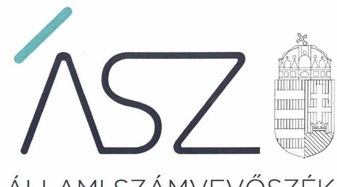
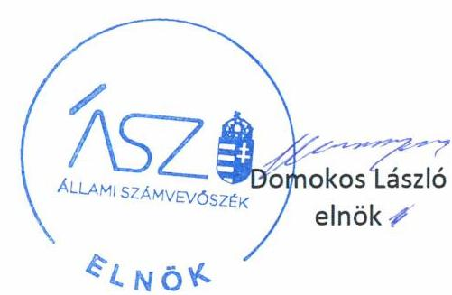
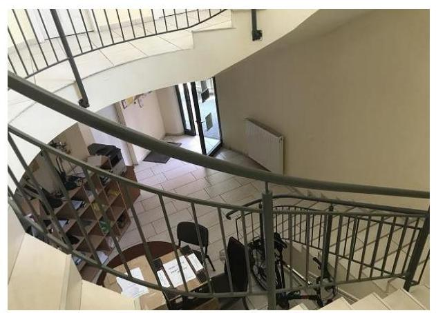
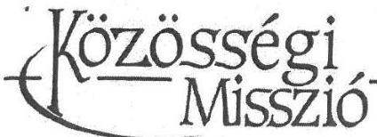
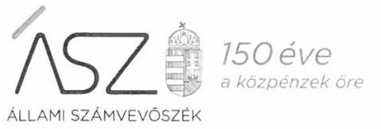
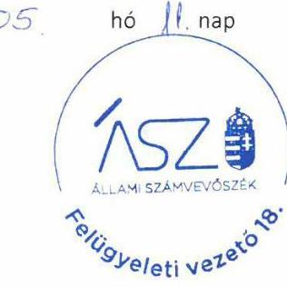

ÁLLAMI SZÁMVEVŐSZÉK

# JELENTÉS 

## Nem állami humánszolgáltatók ellenőrzése

A szociális humánszolgáltatást nyújtó intézmények, szolgáltatók államháztartáson kívüli fenntartói központi költségvetésből kapott támogatásai felhasználásának ellenőrzése Közösségi Misszió
2020.

20086
www.asz.hu

---

ÁLLAMI SZÁMVEVŐSZÉK

# JELENTÉS 

## Nem állami humánszolgáltatók ellenőrzése

A szociális humánszolgáltatást nyújtó intézmények, szolgáltatók államháztartáson kívüli fenntartói központi költségvetésből kapott támogatásai felhasználásának ellenőrzése Közösségi Misszió
2020. 

O6. hó 25. nap
20086
www.asz.hu

---

# AZ ELLENŐRZÉST FELÜGYELTE: 

KLINGA LÁSZLÓ felügyeleti vezető

## AZ ELLENŐRZÉST VEZETTE ÉS A VÉGREHAJTÁSÁÉRT FELELŐS:

MOLNÁR ZSUZSANNA ellenőrzésvezető

## A PROGRAM ÖSSZEÁLLÍTÁSÁÉRT FELELŐS:

FEKETE-NAGY ANDRÁS GÁBOR ellenőrzési programért felelős vezető

TÓTPÁL SZABOLCS osztályvezető

IKTATÓSZÁM: EL-2707-001/2020.
TÉMASZÁM: 2491
ELLENŐRZÉS-AZONOSÍTÓ SZÁM: V083556; V0867098

---

# TARTALOMJEGYZÉK 

■ ÖSSZEGZÉS ..... 5
■ AZ ELLENŐRZÉS CÉLJA ..... 6
■ AZ ELLENŐRZÉS TERÜLETE ..... 7
■ AZ ELLENŐRZÉS HÁTTERE, INDOKOLTSÁGA ..... 8
■ AZ ELLENŐRZÉS LÉNYEGES KÉRDÉSKÖREI. ..... 9
■ AZ ELLENŐRZÉS HATÓKÖRE ÉS MÓDSZEREI ..... 10
■ MEGÁLLAPÍTÁSOK ..... 12
■ MELLÉKLETEK ..... 15
I. sz. melléklet: Értelmező szótár ..... 15
■ FÜGGELÉK: ÉSZREVÉTELEK ..... 17
■ RÖVIDÍTÉSEK JEGYZÉKE ..... 23

---

.

---

# ÖSSZEGZÉS 

A békéscsabai székhelyű Közösségi Misszió a 2017. évben nem biztositotta a szociális humánszolgáltatási közfeladat ellátására kapott költségvetési támogatások felhasználásának ellenőrizhetőségét. A 2015-2016. években és 2018-ban a központi költségvetésből kapott támogatások felhasználásának elszámoltathatóságát, átláthatóságát biztositotta.

## Az ellenőrzés társadalmi indokoltsága

A szociális gondoskodást igénylők védelme, illetve a köznevelési feladatok ellátása az Alaptörvényben meghatározott, a társadalom szempontjából fontos tevékenységek. Jogszabályok teszik lehetővé, hogy államháztartáson kívüli szervezetek - így például az egyházi fenntartók, alapítványok, gazdasági társaságok, egyesületek - által fenntartott intézmények is végezzenek köznevelési, szociális és gyermekvédelmi feladatokat. Mindehhez a központi költségvetés évente jelentős összegű támogatással járul hozzá. Az államháztartáson kívüli, humánszolgáltatást végző intézmények az igényelt közpénzekből társadalmilag hasznos, közösségteremtő, közérdekű, illetve közhasznú tevékenységet végeznek, illetve közfeladatokat látnak el.

Az intézményfenntartók ellenőrzésével az Állami Számvevőszék hozzájárul ahhoz, hogy ezen közpénzeket az államháztartáson kívüli szervezetek is ellenőrizhető, átlátható és elszámoltatható módon használják fel a közfeladatok ellátása során. Az ellenőrzések célja továbbá, hogy a nyilvánosság és az igénybevevők megfelelő tájékoztatást kapjanak az államháztartáson kívüli közfeladatot ellátók múködéséről.

Az ÁSZ ellenőrzései arra adnak választ, hogy az intézményfenntartók arra használták-e fel a közpénzeket, amire igényelték.

A szabályszerű gazdálkodás elengedhetetlen a közfeladat ellátás szakmai céljainak megvalósításához, valamint a társadalmi közbizalom fenntartásához.

## Megállapítások, következtetések

A Közösségi Misszió, mint szociális humánszolgáltató közfeladatot ellátó intézmények fenntartója 2015-2016. években és 2018-ban kialakította a költségvetési támogatások elszámolásának, nyilvántartásának szabályszerű feltételeit. A költségvetési támogatásokat és intézményei gazdálkodását a jogszabályi előírások szerint, elkülönítetten kezelte számviteli nyilvántartásában, biztosítva ezzel a támogatás felhasználás elszámoltathatóságát. A felhasznált közpénzekkel való gazdálkodásával a jogszabályi előírásoknak megfelelően a nyilvánosság előtt elszámolt.

A Fenntartó ${ }^{1}$ a 2017-ben a szociális humánszolgáltatási közfeladat ellátására kapott költségvetési támogatás felhasználásának a Számv. tv. ${ }^{2}$ 161/A § (2) bekezdésében előírt ellenőrizhetőségét nem biztosította. Mivel az Atr. ${ }^{3}$ 16. § (1) bekezdésében foglalt szabályozás ellenére nem gondoskodott arról, hogy önállóan gazdálkodó három intézménye működtetésére felhasznált költségvetési támogatások elszámolására vonatkozó adatok feladatonkénti bontásban elkülönítetten rendelkezésre álljanak.

A Közösségi Misszió szociális humánszolgáltatási közfeladatait 2017-ben négy önállóan gazdálkodó és három nem önállóan gazdálkodó intézményében látta el. Önállóan gazdálkodó intézményei közül az eleki és a kondorosi intézmény három szociális feladatot, a békéscsabai két feladatot látott el. A Fenntartó 2017-ben könyvvezetésében a kapott költségvetési támogatás felhasználását három önállóan gazdálkodó intézménye által ellátott feladatok vonatkozásában nem bontotta meg.

Ezáltal a Fenntartó nem igazolta, hogy a 2017-ben kapott közpénzt a szociális humánszolgáltatási közfeladatra fordította.

---

# AZ ELLENŐRZÉS CÉLJA

**AZ ELLENŐRZÉS CÉLJA** annak értékelése volt, hogy a nem állami, nem önkormányzati szociális intézmények fenntartói központi költségvetésből kapott támogatásainak felhasználása szabályszerű volt-e.

---

# **AZ ELLENŐRZÉS TERÜLETE**

## **Közösségi Misszió, mint intézményfenntartó**

A Közösségi Missziót 2011. évben alapította a Magyar Pünkösdi Egyház belső egyházi jogi személyeként, melynek székhelye Békéscsaba.

A Közösségi Misszió, mint fenntartó képviseleti és végrehajtó tisztségviselője az ügyvezető jegyző, akinek személyében az ellenőrzött időszakban nem volt változás.

A Fenntartó 2015-ben öt, 2016-ban hat, 2017-ben hét, 2018-ban három szociális intézmény4, illetve szociális szolgáltatás5 (továbbiakban: intézmény) fenntartójaként vett részt a szociális közfeladatok ellátásában. Intézményeiben szociális alapszolgáltatásokat – szociális étkeztetést, házi segítésnyújtást, fogyatékos személyek, pszichiátriai betegek és idősek számára nappali ellátást – nyújtott, valamint pszichiátriai betegek számára biztosított ápolást, gondozást nyújtó intézményi ellátást a pszichiátriai betegek otthonában. Intézményei Békéscsabán, Eleken, Kondorosan, Nagybánhegyesen, Kevermesen, Szegeden és Budapesten működtek.

A 2015-ben és 2016-ban fenntartott intézményei – köztük egy 2016-ban létrehozott új intézmény – nem önálló jogi személyként működtek.

2017-től három intézménye önálló jogi személyként működött tovább és létrehozott a Fenntartó egy új önálló jogi személyiséggel rendelkező intézményt7 is. 2018-ban intézményeinek száma csökkent, mindösszesen három önálló jogi személyiséggel nem rendelkező intézmény4-6 fenntartói feladatait látta el.

A Fenntartó részére a szociális humánszolgáltatási feladat ellátásához a Magyar Államkincstár részéről a központi költségvetésből biztosított támogatások összege 2015. évben 2454,1 millió Ft, 2016. évben 2426,1 millió Ft, 2017. évben 3237,3 millió Ft, 2018-ban 296,8 millió Ft volt.

---

# **AZ ELLENŐRZÉS HÁTTERE, INDOKOLTSÁGA**

A szociális feladatokat ellátó nem állami intézményfenntartók részére közfeladataik ellátására évente jelentős összegű pénzügyi támogatást biztosítottak a mindenkori költségvetési törvények a bennük megfogalmazott feltételek mellett. A felhasználható állami támogatásokra a mindenkori költségvetési törvények a 2015-2018. években a szociális ágazatra vonatkozóan 360 Mrd Ft előirányzatot határoztak meg.

Az ÁSZ6 stratégiájában foglaltak alapján is indokolt az ellenőrzés, amely a társadalom számára jelzi, hogy a közpénz államháztartáson kívüli felhasználása sem maradhat ellenőrizetlenül. Az államháztartáson kívülre nyújtott költségvetési támogatások ellenőrzésével az ÁSZ hozzájárul ahhoz, hogy a közpénzeket a nem állami humán fenntartók átlátható módon használják fel a közfeladatok ellátására kötött szerződésekben vállalt kötelezettségek teljesítése érdekében. Az ellenőrzés javaslataival hozzájárulhat az említett rendszerek szabályszerű támogatás felhasználásához, javíthatja a társadalmi-gazdasági döntések megalapozottságát, amely a *„jól irányított állam”* működéséhez járul hozzá.

---

# AZ ELLENŐRZÉS LÉNYEGES KÉRDÉSKÖREI 

1. A Fenntartó szabályszerű müködési - és gazdálkodási környezet kialakításával megteremtette-e a költségvetési támogatások átlátható, elszámoltatható igénybevételének, felhasználásának feltételeit?
2. A Fenntartó az átvállalt szociális humánszolgáltatási közfeladathoz biztositott költségvetési támogatásokat szabályszerüen fordította-e a humánszolgáltató intézményei müködtetésére? A felhasznált közpénzekre vonatkozó gazdálkodásával a nyilvánosság előtt elszámolt-e, ennek érdekében ellenőrzési, értékelési és a külső ellenőrzésekkel kapcsolatos intézkedési feladatait szabályszerüen látta-e el?

---

# AZ ELLENŐRZÉS HATÓKÖRE ÉS MÓDSZEREI 

## Az ellenőrzés típusa

Megfelelőségi ellenőrzés.

## Az ellenőrzött időszak

A 2015. január 1-je és 2018. december 31-e közötti időszak. A helyszíni szemle tekintetében 2019. január 1-jétől az utolsó helyszíni szemle időpontjáig (2019. szeptember 11-ig) tartó időszak.

## Az ellenőrzés tárgya

Az ellenőrzés a szociális humánszolgáltatási közfeladatokat ellátó államháztartáson kívüli fenntartók humánszolgáltatási közfeladatai ellátásához a központi költségvetésből kapott támogatásaik humánszolgáltatási közfeladatokra való fenntartó általi felhasználása szabályszerűségének értékelésére terjed ki.

## Az ellenőrzött szervezet

A Közösségi Misszió, mint intézményfenntartó.

## Az ellenőrzés jogalapja

Az ellenőrzés jogszabályi alapját az ÁSZ tv. 1. § (3) bekezdésében, az 5. § (3) bekezdésében, valamint az 5 §. (11) bekezdés c) pontjában foglalt előírások adták.

## Az ellenőrzés módszerei

Az ellenőrzést az ellenőrzési program annak szempontjai, kérdései, az ellenőrzött időszakban hatályos jogszabályok, a nemzetközi standardokat irányadónak tekintve, az ellenőrzés szakmai szabályok és módszertanok figyelembevételével rendelte elvégezni.

Az ellenőrzés ideje alatt az ellenőrzött szervezettel történő kapcsolattartás az ÁSZ SZMSZ²-ének vonatkozó előírásai alapján történt.

---

Az ellenőrzési kérdések megválaszolásához szükséges bizonyítékok megszerzése az ellenőrzött által rendelkezésre bocsátott dokumentumokra, adatokra alapozva megfigyelés, szemle (szemrevételezés), kérdésfeltevés (információkérés), valamint elemző eljárással történt.

Az ellenőrzési bizonyítékként felhasználható adatforrások közé tartoztak egyrészt az ellenőrzési program részletes szempontjainál felsorolt adatforrások, másrészt minden - az ellenőrzés folyamán feltárt, az ellenőrzés szempontjából információt tartalmazó - dokumentum.

Az ellenőrzés lefolytatásához az ellenőrzött szervezet a kitöltött tanúsítványok, valamint az ÁSZ által kért dokumentumok elektronikus úton való megküldésével szolgáltatott adatokat, információkat. Az így rendelkezésre bocsátott adatok, információk és a tanúsítványok adatai valódiságának kontrollja az ellenőrzés keretében történt.

Az ellenőrzést alapvetően a szociális humánszolgáltatások esetében a központi költségvetési támogatások igénylésével, módosításával, felhasználásával, elszámolásával kapcsolatos feladatokat ellátó államháztartáson kívüli fenntartóknál végezte az ÁSZ.

Az ellenőrzés nem terjedt ki a szociális humánszolgáltatások központi költségvetési támogatásai igénylése, módosítása, elszámolása valódiságának, megalapozottságának, helyességének - sem a fenntartónál, sem a székhely intézményeinél való - értékelésére (mivel ennek felülvizsgálata, ellenőrzése a finanszírozó jogszabályban előírt feladata, határozatai kiadása előtt). Továbbá nem terjedt ki az ellenőrzés e források, intézmények általi szabályszerű felhasználásának értékelésére.

---

# MEGÁLLAPÍTÁSOK 

## 1. A Fenntartó szabályszerű múködési - és gazdálkodási környezet kialakításával megteremtette-e a költségvetési támogatások átlátható, elszámoltatható igénybevételének, felhasználásának feltételeit?

Összegző megállapítás

A Fenntartó 2015-2016. években és 2018-ban a költségvetési támogatások jogszabályi előírások szerinti igénybevételéhez és felhasználásához szabályszerű működési- és gazdálkodási környezetet alakított ki.

A Fenntartó működési kereteit 2015-2016. években és 2018-ban szabályszerűen kialakította, jogállásáról, tevékenységéről és gazdálkodásáról alapító okiratában ${ }^{8}$ rendelkezett, szervezeti és működési szabályait SZMSZében ${ }^{9}$ és gazdálkodási szabályzatában ${ }^{10}$ határozta meg. Az engedélyezési, jóváhagyási és kontrolleljárásokat gazdálkodási szabályzata tartalmazta.

Elkészítette 2015-2016. években és 2018-ban a jogszabályi előírások szerinti számviteli politikáját ${ }_{1-4}{ }^{11}$ annak részeként az eszközök és a források leltárkészítési és leltározási szabályzatát, az eszközök és a források értékelési szabályzatát, valamint a pénzkezelési szabályzatot ${ }_{1-3}{ }^{12}$. A Fenntartó rendelkezett a törvényben előírt számlarenddel. A költségvetési támogatások nyilvántartásának és elszámolásának rendjéről szabályzatban ${ }^{13}$ rendelkezett.

A Fenntartó intézményei szervezetének, működési szabályainak kialakításáról 2015-2016. években és 2018-ban az intézmények SZMSZ-ében gondoskodott. Önállóan gazdálkodó intézményei jogállását, tevékenységét az intézmények alapító okiratában ${ }^{14}$ határozta meg.

---

# 2. A Fenntartó az átvállalt szociális humánszolgáltatási közfeladathoz biztosított költségvetési támogatásokat szabályszerűen fordította-e a humánszolgáltató intézményei működtetésére? A felhasznált közpénzekre vonatkozó gazdálkodásával a nyilvánosság előtt elszámolt-e, ennek érdekében ellenőrzési, értékelési és a külső ellenőrzésekkel kapcsolatos intézkedési feladatait szabályszerűen látta-e el? 

Összegző megállapítás

A Fenntartó a szociális humánszolgáltatási közfeladat ellátására biztosított támogatásokat 2015-2016. években és 2018ban szabályszerűen fordította intézményei működtetésére, közpénzekre vonatkozó gazdálkodásával a 2015. évi, 2016. évi és 2018. évi számviteli beszámolóiban elszámolt.

2015-2016. években és 2018-ban a Fenntartó a szociális közfeladat ellátására kapott támogatásokat, az egyházi kiegészítő támogatást, továbbá nem ónállóan gazdálkodó intézményei gazdálkodását a jogszabályi előírások szerint, elkülönítetten kezelte számviteli rendjében.

A Fenntartó a 2015-2016. években és 2018-ban a jogszabályban előírt beszámoló készítési kötelezettségének teljesítésével elszámolt a felhasznált közpénzekre vonatkozó gazdálkodásával.

Gazdálkodási szabályzata alapján a 2015-2016. években és 2018-ban saját belső ellenőrzési rendszert működtetett. A törvényben előírt, az intézmények gazdálkodásának és múködésének törvényessége biztosítására irányuló feladatai körében a Fenntartó negyedévente ellenőrizte intézményeinél a feladatellátással kapcsolatos mutatószámok meghatározását és független szakértőt bízott meg az önálló jogi személyiséggel rendelkező négy intézménye ${ }_{1,2,3,7}$ éves beszámolójának ellenőrzésével.

A Fenntartó eleget tett az NRSZH ${ }^{15}$ által 2015-ben és 2016-ban, illetve 2018-ban végzett ellenőrzésekhez kapcsolódó intézkedési kötelezettségének.

---

.

---

# MELLÉKLETEK 

- I. SZ. MELLÉKLET: ÉRTELMEZŐ SZÓTÁR
befogadás
költségvetési támogatás
nem állami, nem önkormányzati (államháztartáson kívüli) intézmény fenntartó
székhely intézmény
telephely

A Szoctv. illetve a Gyvt. szerinti, a szociális szolgáltatások és a gyermekjóléti szolgáltató tevékenységek területi lefedettségét figyelembe vevő finanszírozási rendszerbe történő befogadás.
a társadalombiztosítás pénzügyi alapjai kivételével az államháztartás központi alrendszeréből ellenérték nélkül, pénzben nyújtott támogatások (Áht. 1. § 14. pont)
A költségvetési törvényekben (2014. évi C. törvény 42-43. §, 2015. évi C. törvény 40-41. §, 2016. évi XC. törvény 41. §) megállapított támogatás. Például a 2015. évi C. törvény 40-41. § szerint többek között: Az Országgyűlés a szociális, gyermekjóléti, gyermekvédelmi közfeladatot ellátó intézményt, szolgáltatást fenntartó egyházi jogi személy, civil szervezet, közalapítvány, országos nemzetiségi önkormányzat, települési vagy területi nemzetiségi önkormányzat, gazdasági társaság, és a humánszolgáltatást alaptevékenységként végző, az Szja tv. hatálya alá tartozó egyéni vállalkozó (a továbbiakban együtt: nem állami szociális fenntartó) részére támogatást állapít meg a következők szerint: a támogatás a nem állami szociális fenntartót a települési önkormányzatok 2. melléklet III. pont 3. alpont c)-k) pontjában és III. pont 5. alpont a) pontjában meghatározott támogatásaival azonos jogcímeken, összegben és feltételek mellett illeti meg.
A szociális, gyermekjóléti és gyermekvédelmi közfeladatokat /humánszolgáltatásokat ellátó intézményt fenntartó egyházi jogi személy, társadalmi szervezet, alapítvány, közalapítvány, civil szervezet, országos nemzetiségi önkormányzat, nonprofit gazdasági társaság, gazdasági társaság és a humánszolgáltatást alaptevékenységként végző, Szja tv. hatálya alá tartozó egyéni vállalkozó. (2013. évi Kvtv. 35. § (1), (3) bekezdés, 2014. évi Kvtv. 33. §, 34. § (1), (4) bekezdés, 2015. évi Kvtv. 42. §, 43. § (1), (4) bekezdés, 2016. évi Kvtv. 40. §, 41. § (1), (4) bekezdés, 2017. évi Kvtv. 41. § (1), (4))
A szolgáltató székhelye, azaz a szolgáltató központi ügyintézésének helye, függetlenül attól, hogy használják-e szolgáltatás nyújtására (Sznyvhr. ${ }^{16} 1 . \S$ k) pont) (hatályos: 2013. december 1-től)
A szolgáltató székhelyétől különböző, szolgáltató/intézmény használatában álló hely, a szociális humánszolgáltatáshoz használt, bejegyzett hely. (Sznyvhr. 1.§ I) pont) (hatályos: 2015. január 1-től)

---

.

---

# FÜGGELÉK: ÉSZREVÉTELEK 

A jelentéstervezetet a Számvevőszék 15 napos észrevételezésre megküldte az ellenőrzött szervezet vezetőjének az ÁSZ tv. 29. §* (1) bekezdése előírásának megfelelően.

A Közösségi Misszió ügyvezető jegyzői a jelentéstervezet megállapításaira írásban észrevételt tettek.
Az ÁSZ tv. 29. § (3) bekezdésével összhangban az ÁSZ a Függelékben feltünteti az ellenőrzés megállapításaival kapcsolatban tett, figyelembe nem vett észrevételeket, és megindokolja, hogy azokat miért nem fogadta el.

[^0]
[^0]:    * 29. § (1) Az Állami Számvevőszék az ellenőrzési megállapításait megküldi az ellenőrzött szervezet vezetőjének vagy az általa megbízott személynek, és annak, akinek személyes felelősségét állapította meg.
    (2) Az ellenőrzött szervezet vezetője és a felelősként megjelölt személy az ellenőrzés megállapításaira tizenöt napon belül írásban észrevételt tehet.
    (3) Az Állami Számvevőszék az észrevételre a beérkezésétől számított harminc napon belül írásban válaszol. A figyelembe nem vett észrevételeket köteles a jelentésben feltüntetni, és megindokolni, hogy azokat miért nem fogadta el.

---

#  

Székhely: 5600 Békéscsaba, Luther u. 20 fsz. 2. | Tel/fax: 66/633-011

Ikt.szám: 1/2020/ÁSZ ellenőrzés

## Domokos László

## Elnök Úr részére

Állami Számvevőszék
1052 Budapest, Apáczai Csere János u. 10.

Tisztelt Elnök Úr!

Tárgy: Észrevétel számvevőszéki jelentéstervezetre
Hivatkozási szám: EL-1306-110/2020. Melléklet: 15 db irat

$$
\begin{aligned}
& \text { 11. 1. 1. 1. 1. 1. 1. 1. 1. 1. 1. 1. }
\end{aligned}
$$

$$
\begin{aligned}
& \text { 11. 1. 1. 1. 1. 1. 1. 1. 1. }
\end{aligned}
$$

$$
\begin{aligned}
& \text { E- } 1306-110 / 2020
\end{aligned}
$$

A Közösségi Misszió, mint szociális humán szolgáltató közfeladatot ellátó intézmények egyházi fenntartója részéről köszönettel vettük, hogy munkatársaik ellenőrzésének eredményeképpen elkészült számvevői jelentéstervezetet megismerhettük.

Az EL-1306-110/2020. iktatószámú, 2020. április 14. napján érkezett ,,Nem állami humánszolgáltatók ellenőrzése - A szociális humánszolgáltatást nyújtó intézmények, szolgáltatók államháztartáson kívüli fenntartói központi költségvetésből kapott támogatásai felhasználásának ellenőrzése - Közösségi Misszió" címủ számvevőszéki jelentéstervezetre az észrevételünk az alábbiak szerinti:

A jelentéstervezet 5. oldalán található, a Megállapítások, következtetések fejezet alatti kifejtettek kapcsán a 2017. évre vonatkozóan kérjük, szíveskedjenek figyelembe venni, hogy a Tisztelt Állami Számvevőszék EL-1306-006/2018. iktatószámú adatbekérési projektjének 6. pontja alatti Elektronikus Adatszolgáltatási rendszerébe, a 12-13-14. számú mappába 2019. 01. 16-án feltöltött, a „KM szabályzat támogatások nyilvántart. elszám. melléklete. pdf" elnevezésű dokumentum (amelyet mellékelünk) igazolja, hogy a fenntartó szociális humánszolgáltatási közfeladat ellátására kapott költségvetési támogatásokat minden intézményében a müködésre felhasznált költségvetési támogatások elszámolására vonatkozó adatok feladatonkénti bontásban elkülönítetten lettek kezelve és a könyvelésünkbe feltüntetve. Ezek a $01,02,03,06$ és 21 munkaszámokon kerültek feltüntetésre a feltöltött anyagban.

A Közösségi Misszió könyveléséből csak a nem önállóan gazdálkodó szociális intézmények fökönyvi kivonatai, valamint fökönyvi kartonjai kerültek feltöltésre, mivel abban a hiszemben voltunk, hogy az önállóan gazdálkodó és a $01,02,03,06,21$ munkaszámon feltüntetett Humán Szolgáltató Központok gazdálkodására külön, önálló feltöltési előírás keretében kell adatot szolgáltatnia a Közösségi Misszió fenntartónak, amelyet a csatolt iratok megküldésével pótolunk, illetve kérésük esetén elektronikus formában is feltöltjük arra a felületre, amelyet megjelölnek számunkra.
2017. évben a Közösségi Misszió igényelte a normatív támogatásokat. A fenntartóhoz érkező és a szociális szolgáltatóknak a jogszabály által előírt időben és módon átadott támogatások felhasználásával a Közösségi Misszió számolt el, ezért 2017. évre a Közösségi Misszió teljesítésátvállalási megállapodást kötött mind a négy önállóan gazdálkodó intézményével, amely szerint a Humán Szolgáltató Központok nevében és helyett eljárva szükség szerint teljesíti az önállóan gazdálkodó intézményeknek szociális feladatok ellátásával kapcsolatban keletkezett fizetési kötelezettségeit. A megállapodásokat csatoljuk.

---

# Közösségi Misszió

Székhely: 5600 Békéscsaba, Luther u. 20 fsz. 2. | Tel/fax: 66/633-011

Mindezek alapján a 2017. évben a Humán Szolgáltató Központok által ellátott feladatokból adódóan felmerült költségek és bevételek a Közösségi Misszió fenntartó könyvelésében lettek tételesen rögzítve, a számviteli rendjében feladatonkénti bontásban, elkülönítetten, intézményenként és azon belül szakfeladatonként.

A 2017. év zárását követően a fentiek szerinti megállapodás alapján készült az önállóan gazdálkodó Humán Szolgáltató Központok közötti elszámolás a normatíva támogatás felhasználásáról. A felmerült bevételek és költségek a Közösségi Misszió fenntartó könyveléséből kerültek kivezetésre, míg a Humán Szolgáltató Központok könyvelésébe egyösszegben, a számviteli rend szerinti feladatonkénti bontásban elkülönítetten kerültek be a könyvekbe.

A Közösségi Misszió fenntartó 2017. évi könyveléséből a csatolt 01, 02, 03, 06, 21 munkaszámos főkönyvi kivonatok, kartonok támasztják alá a Humán Szolgáltató Központok által elvégzett szociális humánszolgáltatási közfeladatok ellátására kapott költségvetési támogatások felhasználásának részletes elszámolását.

Csatolt dokumentumok:

- „KM szabályzat támogatások nyilvántart. elszám. melléklete. pdf” néven feltöltött dokumentum (Munkaszám törzs listája – Közösségi Misszió – 2017)
- Közösségi Misszió Kondoros 2017. évi főkönyvi kivonat (01 munkaszám)
- Közösségi Misszió Kondoros 2017. évi főkönyvi karton (01 munkaszám)
- Közösségi Misszió Békéscsaba 2017. évi főkönyvi kivonat (02 munkaszám)
- Közösségi Misszió Békéscsaba 2017. évi főkönyvi karton (02 munkaszám)
- Közösségi Misszió Elek 2017. évi főkönyvi kivonat (03 munkaszám)
- Közösségi Misszió Elek 2017. évi főkönyvi karton (03 munkaszám)
- Közösségi Misszió Kétegyháza 2017. évi főkönyvi kivonat (06 munkaszám)
- Közösségi Misszió Kétegyháza 2017. évi főkönyvi karton (06 munkaszám)
- Közösségi Misszió Budapest 2017. évi főkönyvi kivonat (21 munkaszám)
- Közösségi Misszió Budapest 2017. évi főkönyvi karton (21 munkaszám)
- Megállapodás Közösségi Misszió – Humán Szolgáltató Központ Elek
- Megállapodás Közösségi Misszió – Humán Szolgáltató Központ Békéscsaba
- Megállapodás Közösségi Misszió – Humán Szolgáltató Központ Kondoros
- Megállapodás Közösségi Misszió – Humán Szolgáltató Központ Budapest

Kérjük, szíveskedjenek észrevételünket elfogadva a 2017. évi szociális humánszolgáltatási közfeladatra vonatkozó megállapításukat mindezek alapján módosítani.

A számvevői jelentéstervezet egyéb megállapításait megköszönjük és azokat tisztelettel elfogadjuk.

Békéscsaba, 2020. április 15.

Munkájukra Isten áldását kívánva tisztelettel:

dr. Vándor György
ügyvezető jegyző

Közösségi Misszió
5600 Békéscsaba, Luther u. 20. fsz. 2. Adószám: 18205994-2-04

dr. Vign Károly
ügyvezető jegyző

---

ELNÖK

Ikt. szám: EL-1306-112/2020.

Dr. Vándor György úr
ügyvezető jegyző

Dr. Vígh Károly úr
ügyvezető jegyző

Közösségi Misszió

Békéscsaba

Tisztelt Ügyvezető Jegyző Urak!

A „Nem állami humánszolgáltatók ellenőrzése - A szociális humánszolgáltatást nyújtó
intézmények, szolgáltatók államháztartáson kívüli fenntartói központi költségvetésből kapott
támogatásai felhasználásának ellenőrzése – Közösségi Misszió” címmel készített számvevőszéki
jelentéstervezetre tett, 1/2020/ÁSZ ellenőrzés iktatószámú levelében megküldött észrevételét
köszönettel megkaptam.

Az Állami Számvevőszék észrevételekre vonatkozó álláspontjáról a felügyeleti vezető által készített
részletes tájékoztatást csatoltan megküldöm.

Tájékoztatom Ügyvezető Jegyző urakat, hogy a számvevőszéki jelentésben – az Állami
Számvevőszékről szóló 2011. évi LXVI. törvény 29. § (3) bekezdése alapján – a figyelembe nem vett
észrevételeket szerepeltetjük az elutasítás indokának feltüntetésével.

Budapest, 2020. 28. hónap 47 nap

Tisztelettel:

Dómokos László

Melléklet: Tájékoztatás az észrevételek kezeléséről

1052 BUDAPEST, APÁCZAI CSERE JÁNOS UTCA 10. 1364 Budapest 4. Pf. 54. telefont +36 1 484 9101, fax: +36 1 484 9201

---

Melléklet az EL-1306-112/2020. iktatószámú levélhez

# Tájékoztatás   az észrevételek kezeléséről 

A „Nem állami humánszolgáltatók ellenőrzése - A szociális humánszolgáltatást nyújtó intézmények, szolgáltatók államháztartáson kívüli fenntartói központi költségvetésből kapott támogatásai felhasználásának ellenőrzése - Közösségi Misszió" című jelentéstervezetre (továbbiakban: jelentéstervezet) a Közösségi Misszió ügyvezető jegyzőinek 1/2020/ÁSZ ellenőrzés iktatószámú levélben megküldött észrevételét áttekintettem. Az észrevétel kezeléséről az alábbi tájékoztatást adom.

Ügyvezető jegyző urak a jelentéstervezet „Megállapítások, következtetések" részben rögzített, 2017. évre vonatkozó megállapításra tettek észrevételt. A megállapítás szerint a Közösségi Misszió a 2017. évi költségvetési támogatások felhasználásának ellenőrizhetőségét nem biztosította, mivel nem gondoskodott arról, hogy önállóan gazdálkodó intézményei működtetésére felhasznált költségvetési támogatások elszámolására vonatkozó adatok feladatonkénti bontásban rendelkezésre álljanak. Az észrevételben rögzítettek szerint a humánszolgáltatási közfeladat ellátására kapott 2017. évi költségvetési támogatás elszámolásának hiányosságai az adatszolgáltatási határidőn belül fel nem csatolt bizonylatok miatt merültek fel. Az érintett dokumentumok az észrevétel mellékletét képezték.

Az észrevételt nem fogadjuk el. Az Állami Számvevőszék az ellenőrzési megállapításait az adatszolgáltatás során a részére törvényi határidőben rendelkezésre bocsátott dokumentumokra alapozva fogalmazza meg. Ügyvezető jegyző úr által aláírt teljességi és hitelességi nyilatkozatok szerint az Állami Számvevőszék részére átadott dokumentumok, adatok megbízhatóak, a bekért adatokra, dokumentumokra vonatkozóan teljes körű információt tartalmaznak. A jelentéstervezet módosítása az észrevétel alapján nem indokolt.

Budapest, 2020.

Klinga László sk. Alandh
felügyeleti vezető A kiadmány hiteles

---

.

---

# RÖVIDÍTÉSEK JEGYZÉKE 

${ }^{1}$ Fenntartó
${ }^{2}$ Számv. tv.
${ }^{3}$ Atr.
${ }^{4}$ szociális intézmények ${ }_{1-4}$
${ }^{5}$ szociális szolgáltatók ${ }_{5-7}$
${ }^{6}$ ÁSZ
${ }^{7}$ SZMSZ
${ }^{8}$ alapító okirat
${ }^{9}$ SZMSZ
${ }^{10}$ gazdálkodási szabályzat
${ }^{11}$ számviteli politika $_{1-4}$
${ }^{12}$ pénzkezelési szabályzat ${ }_{1-3}$
${ }^{13}$ szabályzat

Közösségi Misszió
2000. évi C törvény a számvitelről (hatályos: 2000. január 1-jétől)

489/2013. (XII. 18.) Korm. rendelet az egyházi és nem állami fenntartású szociális, gyermekjóléti és gyermekvédelmi szolgáltatók, intézmények és hálózatok állami támogatásáról (hatályos: 2014. január 1-jétől)
1: Humán Szolgáltató Központ, Elek Gyulai út 18. (2017-től önálló jogi személyként működött)
2: Humán Szolgáltató Központ. 5553 Kondoros, Deák F. u. 12. (2017-től önálló jogi személyként működött)
3: Humán Szolgáltató Központ, 5668 Nagybánhegyes, Kossuth u. 30. (nem önálló jogi személy a 2015-2018. években)
4: Támasz Ház, Kevermes, Jókai u. 71. (nem önálló jogi személy a 2015-2018. években)
5: Humán Szolgáltató Központ, Békéscsaba, Csaba köz 1. (2017-től önálló jogi személyként működött)
6: Szolgáltató Centrum, Szeged, Zárda u. 1. (nem önálló jogi személyként jött létre 2016. június 24-től)
7: Humán Szolgáltató Központ, Budapest, Gizella u. 37. (2017. június 30-tól önálló jogi személyként jött létre.)
Állami Számvevőszék
Szervezeti és Működési Szabályzat
Közösségi Misszió alapító okirata módosításokkal egységes szerkezetbe foglaltan (hatályos: 2013. január 1-jétől.)
Közösségi Misszió szervezeti- és működési szabályzata módosításokkal egységes szerkezetbe foglaltan (hatályos: 2013. január 1.)
Gazdálkodási Szabályzat módosításokkal egységes szerkezetbe foglaltan (hatályos: 2012. január 1.)
1: Közösségi Misszió számviteli politika 2015.
(hatályos: 2015. január 1-jétől 2015. december 31-ig)
2: Közösségi Misszió számviteli politika 2016.
(hatályos: 2016. január 1-jétől 2016. december 31-ig)
3: Közösségi Misszió számviteli politika 2017.
(hatályos: 2017. január 1-jétől 2017. december 31-ig)
4: Közösségi Misszió számviteli politika 2017.
(hatályos: 2018. január 1-jétől)
1: Közösségi Misszió Pénzkezelési szabályzat 2015. év
(hatályos: 2015. január 1.-jétől)
2: Közösségi Misszió Pénzkezelési szabályzat 2016. év
(hatályos: 2016. január 1-jétől)
3: Közösségi Misszió Pénzkezelési szabályzat 2017. év
(hatályos: 2017. január 1-jétől)
Szabályzat a Közösségi Misszió egyházi fenntartó által ellátott közfeladatokhoz rendelt költségvetési támogatások nyilvántartására, elszámolására (hatályos: 2011. július 1.)

---

${ }^{14}$ intézményi alapító okiratok ${ }_{1-4}$

1: Humánszolgáltató Központ (Elek, Gyulai út 18.) Alapító Okirata módosításokkal egységes szerkezetben (hatályos: 2016. július 7-tól)
2: Humánszolgáltató Központ (Békéscsaba, Csaba köz 1.) Alapító Okirata módosításokkal egységes szerkezetben (hatályos: 2016. november 30-tól)
3: Humánszolgáltató Központ (Budapest, Gizella út 37.) Alapító Okirata módosításokkal egységes szerkezete foglaltan (hatályos: 2016. október 16-tól)
4: Humánszolgáltató Központ (Kondoros, Deák F. u. 12.) Alapító Okirata módosításokkal egységes szerkezetben (hatályos: 2016. november 30-tól)
${ }^{15}$ NRSZH
${ }^{16}$ Sznyvhr.

Nemzeti Rehabilitációs és Szociális Hivatal
369/2013. (X.24.) Korm. rendelet a szociális, gyermekjóléti és gyermekvédelmi szolgáltatók, intézmények és hálózatok hatósági nyilvántartásáról és ellenőrzéséről (hatályos: 2013. december 1-jétől)

---

# ASZ 

ALLAMI SZAMVEVOSZEK
1052 Budapest, Apáczai Cs. J. u. 10. I 1364 Budapest 4. Pf. 54 TEL: +36 14849100
email: szamvevoszek@asz.hu
web: www.asz.hu | www.aszhirportal.hu