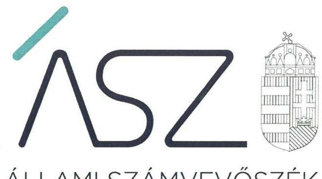
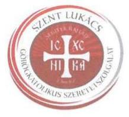
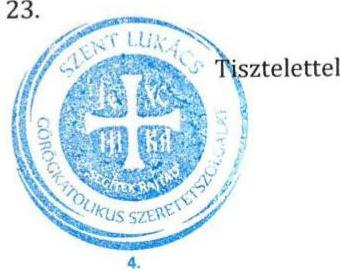
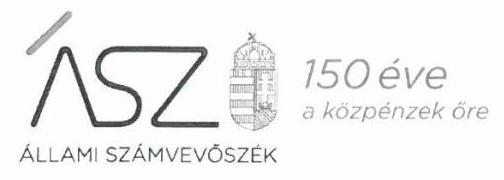
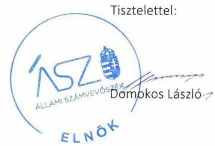

ÁLLAMI SZÁMVEVŐSZÉK

# JELENTÉS 

## Nem állami humánszolgáltatók ellenőrzése

A szociális humánszolgáltatást nyújtó intézmények, szolgáltatók államháztartáson kívüli fenntartói központi költségvetésből kapott támogatásai felhasználásának ellenőrzése Szent Lukács Görögkatolikus Szeretetszolgálat

2020
20087
www.asz.hu

---

ÁLLAMI SZÁMVEVŐSZÉK

# JELENTÉS 

## Nem állami humánszolgáltatók ellenőrzése

A szociális humánszolgáltatást nyújtó intézmények, szolgáltatók államháztartáson kívüli fenntartói központi költségvetésből kapott támogatásai felhasználásának ellenőrzése Szent Lukács Görögkatolikus Szeretetszolgálat
2020. 06. 25.

20087
www.asz.hu

---

# AZ ELLENŐRZÉST FELÜGYELTE: 

MAROZSÁN LÁSZLÓNÉ felügyeleti vezető

## AZ ELLENŐRZÉST VEZETTE ÉS A VÉGREHAJTÁSÁÉRT FELELŐS:

GÁL MAGDOLNA ellenőrzésvezető

## A PROGRAM ÖSSZEÁLLÍTÁSÁÉRT FELELŐS:

FEKETE-NAGY ANDRÁS GÁBOR ellenőrzési program készítéséért felelős vezető

TÓTPÁL SZABOLCS osztályvezető

IKTATÓSZÁM: EL-2699-001/2020.
TÉMASZÁM: 2491
ELLENŐRZÉS-AZONOSÍTÓ SZÁM: V083557, V086710

---

# TARTALOMJEGYZÉK 

■ ÖSSZEGZÉS ..... 5
■ AZ ELLENŐRZÉS CÉLJA ..... 6
■ AZ ELLENŐRZÉS TERÜLETE ..... 7
■ AZ ELLENŐRZÉS HÁTTERE, INDOKOLTSÁGA ..... 8
■ A JELENTÉS LÉNYEGES KÉRDÉSKÖREI ..... 9
■ AZ ELLENŐRZÉS HATÓKÖRE ÉS MÓDSZEREI ..... 10
■ MEGÁLLAPÍTÁSOK ..... 12
■ MELLÉKLETEK ..... 15
I. sz. melléklet: Értelmező szótár ..... 15
■ FÜGGELÉK: ÉSZREVÉTELEK ..... 17
■ RÖVIDÍTÉSEK JEGYZÉKE ..... 23

---

.

---

# ÖSSZEGZÉS 

A nyíregyházi székhelyű Szent Lukács Görögkatolikus Szeretetszolgálat, mint intézményfenntartó a 2015-2017. években a nem önállóan gazdálkodó intézményei esetében a szociális humánszolgáltatási közfeladatok ellátására kapott költségvetési támogatás felhasználásának ellenőrizhetőségét nem biztosította. A 2018. évben a költségvetési támogatás felhasználása ellenőrizhető és elszámoltatható volt, azt szabályszerűen használta fel.

## Az ellenőrzés társadalmi indokoltsága

A szociális gondoskodást igénylők védelme, illetve a köznevelési feladatok ellátása az Alaptörvényben meghatározott, a társadalom szempontjából fontos tevékenységek. Jogszabályok teszik lehetővé, hogy államháztartáson kívüli szervezetek - így például az egyházi fenntartók, alapítványok, gazdasági társaságok, egyesületek - által fenntartott intézmények is végezzenek köznevelési, szociális és gyermekvédelmi feladatokat. Mindehhez a központi költségvetés évente jelentős összegű támogatással járul hozzá. Az államháztartáson kívüli, humánszolgáltatást végző intézmények az igényelt közpénzekből társadalmilag hasznos, közösségteremtő, közérdekű, illetve közhasznú tevékenységet végeznek, illetve közfeladatokat látnak el.

Az intézményfenntartók ellenőrzésével az Állami Számvevőszék hozzájárul ahhoz, hogy ezen közpénzeket az államháztartáson kívüli szervezetek is ellenőrizhető, átlátható és elszámoltatható módon használják fel a közfeladatok ellátása során. Az ellenőrzések célja továbbá, hogy a nyilvánosság és az igénybevevők megfelelő tájékoztatást kapjanak az államháztartáson kívüli közfeladatot ellátók működéséről.

Az ÁSZ ellenőrzései arra adnak választ, hogy az intézményfenntartók arra használták-e fel a közpénzeket, amire igényelték.

A szabályszerű gazdálkodás elengedhetetlen a közfeladat ellátás szakmai céljainak megvalósításához, valamint a társadalmi közbizalom fenntartásához.

## Főbb megállapítások, következtetések

A Szent Lukács Görögkatolikus Szeretetszolgálat a 2015-2017. években a szociális és gyermekvédelmi humánszolgáltatási közfeladatokat látott el. A Fenntartó ${ }^{1}$ szociális és gyermekvédelmi feladatai ellátására kapott költségvetési támogatás felhasználását a számviteli rendjében - a nem önállóan gazdálkodó intézményei tekintetében - nem kezelte szabályszerűen, mivel a Fenntartó a nem önállóan gazdálkodó intézményei gazdálkodását a saját gazdálkodásától nem különítette el, továbbá a támogatás felhasználását a nem önálló intézményekre vonatkozóan nem különítette el feladatonként.

Az elkülönített nyilvántartás hiányában a Szent Lukács Görögkatolikus Szeretetszolgálat a 2015-2017. években a szociális közfeladat ellátására kapott költségvetési támogatás felhasználásának a Számv. tv. ${ }^{2}$ 161/A. § (2) bekezdésben előírt ellenőrizhetőségét a nem önállóan gazdálkodó intézményei tekintetében nem biztosította. Mivel az Atr. 16. § (1) bekezdésében foglalt szabályozás ellenére nem gondoskodott arról, hogy a költségvetési támogatások felhasználásának, a Fenntartó és a nem önállóan gazdálkodó intézményei gazdálkodásának elkülönített, feladatonkénti bontásban történő elszámolására az adatok rendelkezésre álljanak.

Ezáltal a Fenntartó a 2015-2017. évben nem igazolta, hogy a közpénzt a szociális humánszolgáltatási közfeladatra fordította.

A Szent Lukács Görögkatolikus Szeretetszolgálat a 2018. évben szabályszerű működési- és gazdálkodási környezet kialakításával megteremtette a költségvetési támogatások szabályszerű felhasználásának feltételeit. A 2018. évben a költségvetési támogatásokat szabályszerűen fordította a humánszolgáltató intézményei működtetésére.

---

# AZ ELLENŐRZÉS CÉLJA

**AZ ELLENŐRZÉS CÉLJA** annak értékelése volt, hogy a nem állami, nem önkormányzati szociális intézmények fenntartói központi költségvetésből kapott támogatásainak felhasználása szabályszerű volt-e.

---

# AZ ELLENŐRZÉS TERÜLETE 

## Szent Lukács Görögkatolikus Szeretetszolgálat

A nyíregyházi székhelyű Szent Lukács Görögkatolikus Szeretetszolgálatot a Magyar Katolikus Egyház, mint az Országgyűlés által elismert, bevett magyarországi történelmi egyház Hajdúdorogi Egyházmegyéje ${ }^{3}$ 2010-ben alapította. A Fenntartó önállóan gazdálkodó belső egyházi jogi személy. Vezetését az igazgató látja el, személye az ellenőrzött időszakban nem változott.

A Fenntartó a 2015-2018. években Hajdú-Bihar és Szabolcs-Szatmár-Bereg megyében a szociális és gyermekvédelmi közfeladatok ellátására öt önállóan gazdálkodó ${ }^{4}$ és négy nem önállóan gazdálkodó ${ }^{5}$ intézményt tartott fenn, összesen 38 feladat-ellátási helyen.

A Fenntartó intézményei személyes gondoskodást nyújtó alapellátást és szakellátást biztosítottak szociális és gyermekvédelmi területen.

A Fenntartó közfeladatai ellátására a Magyar Államkincstár adatai szerint 2015. évben 2 450,7 M Ft, 2016. évben 2 559,1 M Ft, 2017. évben 2 830,2 M Ft és 2018. évben 3072,1 M Ft összegű költségvetési támogatást kapott.

---

# AZ ELLENŐRZÉS HÁTTERE, INDOKOLTSÁGA 

A szociális feladatokat ellátó nem állami intézményfenntartók részére közfeladataik ellátására évente jelentős összegű pénzügyi támogatást biztosítottak a mindenkori költségvetési törvények a bennük megfogalmazott feltételek mellett. A felhasználható állami támogatások a Kvtv. ${ }^{6}$-ekben a 2015-2018. években a szociális ágazatra vonatkozóan 360 Mrd Ft előirányzatot határoztak meg.

Az ÁSZ a stratégiájában célul tűzte ki, hogy az államháztartáson kívülre nyújtott költségvetési támogatások ellenőrzésével hozzájárul ahhoz, hogy a közpénzeket az államháztartáson kívüli szervezetek is átlátható módon használják fel a közfeladatok szerződésben vállalt ellátása érdekében. Az ÁSZ stratégiájában foglaltak alapján is indokolt az ellenőrzés, amely a társadalom számára jelzi, hogy a közpénz államháztartáson kívüli felhasználása sem maradhat ellenőrizetlenül. Az ellenőrzés javaslataival hozzájárulhat az említett rendszerek szabályszerű támogatás felhasználásához, javíthatja a társadalmi-gazdasági döntések megalapozottságát, amely a „jól irányított állam működésének" feltétele.

---

# A JELENTÉS LÉNYEGES KÉRDÉSKÖREI 

1. A szociális humánszolgáltató közfeladatot ellátó államháztartáson kívüli fenntartó a 2018. évben szabályszerű működési - és gazdálkodási környezet kialakításával megteremtette-e a költségvetési támogatások átlátható, elszámoltatható igénybevételének, felhasználásának feltételeit?
2. Az államháztartáson kívüli fenntartó az átvállalt szociális humánszolgáltató közfeladathoz biztosított költségvetési támogatásokat a 2018. évben szabályszerűen fordította-e humánszolgáltató intézményei működtetésére, ellenőrzési, értékelési és a külső ellenőrzésekkel kapcsolatos intézkedési feladatait szabályszerűen látta-e el?

---

# AZ ELLENŐRZÉS HATÓKÖRE ÉS MÓDSZEREI 

## Az ellenőrzés típusa

Megfelelőségi ellenőrzés.

## Az ellenőrzött időszak

A 2015. január 1-je és 2018. december 31-e közötti időszak. A helyszíni szemle tekintetében 2019. január 1-jétől 2019. szeptember 4-ig terjedő időszak.

## Az ellenőrzés tárgya

Az ellenőrzés a szociális humánszolgáltatási közfeladatokat ellátó államháztartáson kívüli fenntartók humánszolgáltatási közfeladatai ellátásához a központi költségvetésből kapott támogatásaik humánszolgáltatási közfeladatokra való fenntartó általi felhasználása szabályszerűségének értékelésére terjedt ki.

## Az ellenőrzött szervezet

Szent Lukács Görögkatolikus Szeretetszolgálat

## Az ellenőrzés jogalapja

Az ellenőrzés jogszabályi alapját az ÁSZ tv. 1. § (3) bekezdése, 5. § (3) bekezdés, valamint az 5. § (11) bekezdés c) pontjában foglalt előírások adják.

## Az ellenőrzés módszerei

Az ellenőrzést az ellenőrzési program annak szempontjai, kérdései, az ellenőrzött időszakban hatályos jogszabályok, a nemzetközi standardokat irányadónak tekintve, az ellenőrzés szakmai szabályok és módszertanok figyelembe vételével rendelte elvégezni. A közpénzekkel való felelős gazdálkodás segítésére irányuló javaslatok kidolgozásakor a hatályos jogszabályok az irányadók.

Az ellenőrzés ideje alatt az ÁSZ az ellenőrzött szervezettel történő kapcsolattartást az ÁSZ SZMSZ ${ }^{1}$-ének vonatkozó előírásai alapján biztosította.

---

Az ellenőrzési kérdések megválaszolásához szükséges bizonyítékok megszerzése az ellenőrzött által rendelkezésre bocsátott dokumentumokra, adatokra alapozva, megfigyelés, szemrevételezés útján történt. Az ÁSZ a fenntartott intézményeknél helyszíni szemle keretében győződött meg a tényleges feladatellátásról. Helyszíni szemlékre a fenntartott intézmények egyes feladat-ellátási helyein került sor.

Az ellenőrzési bizonyítékként felhasználható adatforrások közé tartoztak egyrészt a szakmai program részletes szempontjainál felsorolt adatforrások, másrészt minden - az ellenőrzés folyamán feltárt, az ellenőrzés szempontjából információt tartalmazó - dokumentum.

Az ellenőrzés lefolytatásához az ellenőrzött szervezet a kitöltött tanúsítványok, valamint az ÁSZ által kért dokumentumok elektronikus úton való megküldésével szolgáltatott adatokat, információkat. Az így rendelkezésre bocsátott adatok, információk és a tanúsítványok adatai valódiságának kontrollja az ellenőrzés keretében megtörtént.

Az egységes értelmezést támogatta a program mellékletét képező fogalomtár és rövidítésjegyzék.

Az ellenőrzést alapvetően a szociális humánszolgáltatások esetében a központi költségvetési támogatások igénylésével, módosításával, felhasználásával, elszámolásával kapcsolatos feladatokat ellátó fenntartónál végezte az ÁSZ.

Az ÁSZ a szociális humánszolgáltatások központi költségvetési támogatásaival kapcsolatos, államháztartáson kívüli fenntartó jogszabályokban előírt feladatai betartását, továbbá a központi költségvetési támogatások szabályszerű nyilvántartását ellenőrizte a fenntartónál rendelkezésre álló nyilvántartások, beszámolók és egyéb dokumentumok alapján. Az ellenőrzés nem terjedt ki a szociális humánszolgáltatások központi költségvetési támogatásai igénylése, módosítása, elszámolása valódiságának, megalapozottságának, helyességének - sem a fenntartónál, sem a székhely intézményeinél való - értékelésére. Továbbá nem terjedt ki az ellenőrzés e források szabályszerű felhasználásának értékelésére.

---

# MEGÁLLAPÍTÁSOK 

## 1. A szociális humánszolgáltató közfeladatot ellátó államháztartáson kívüli fenntartó a 2018. évben szabályszerű működési és gazdálkodási környezet kialakításával megteremtette-e a költségvetési támogatások átlátható, elszámoltatható igénybevételének, felhasználásának feltételeit?

Összegző megállapítás

A Fenntartó a 2018. évben szabályszerű működési- és gazdálkodási környezet kialakításával megteremtette a költségvetési támogatások szabályszerű igénybevételének, felhasználásának feltételeit.

A Fenntartó SZMSZ ${ }^{8}$-e meghatározta a szervezeti felépítését, működési rendjét, az ellátott feladatokat, a felelősségi- és hatásköröket, gyakorlásuk módját és a helyettesítés rendjét, szabályozta az engedélyezési- jóváhagyási és kontrolleljárásokat, a dokumentumokhoz való hozzáférést.

A Fenntartó a törvényi előírás szerint kialakította a Számviteli politikáját ${ }^{9}$, annak keretében elkészítette a Leltározási szabályzatot ${ }^{10}$, az Értékelési szabályzatot ${ }^{11}$ és a Pénzkezelési szabályzatot ${ }^{12}$, valamint megalkotta a Számlarendet ${ }^{13}$. A Számlarendben a támogatás felhasználás elkülönített nyilvántartásának szabályait meghatározta.

A Fenntartó a közfeladatait a törvényi előírások szerint megkötött ellátási szerződések alapján végezte.

A 2018. évben a Fenntartó a jogszabályi előírást betartva egyszerűsített éves beszámolót készített.

---

# 2. Az államháztartáson kívüli fenntartó az átvállalt szociális humánszolgáltató közfeladathoz biztosított költségvetési támogatásokat a 2018. évben szabályszerűen fordította-e humánszolgáltató intézményei működtetésére, ellenőrzési, értékelési és a külső ellenőrzésekkel kapcsolatos intézkedési feladatait szabályszerűen látta-e el? 

Összegző megállapítás

A Fenntartó a 2018. évben a költségvetési támogatásokat szabályszerűen fordította a humánszolgáltató intézményei működtetésére. A 2018. évben az ellenőrzési feladatait ellátta, külső ellenőrzésekkel kapcsolatos intézkedési kötelezettségének eleget tett.

A Fenntartó 2018. évben a költségvetési támogatásokat szabályszerűen fordította az intézményei működtetésére. A támogatás felhasználását a nem önállóan gazdálkodó intézményei tekintetében a számviteli rendjében feladatonkénti bontásban szabályszerűen elkülönítette, a költségvetési támogatásokat az önállóan gazdálkodó intézményei részére átadta.

A Fenntartó az intézményei gazdálkodásának törvényessége feletti kontrollt biztosította, ellenőrzési feladatait az SZMSZ-ben előírtakkal összhangban intézményfenntartó csoport működtetésével látta el. A Fenntartó az intézmények feladatellátását havi rendszerességgel ellenőrizte.

A Fenntartó 2018. évben a kormányhivatalok ${ }^{14}$ ellenőrzéseivel kapcsolatban megállapított intézkedési kötelezettségeinek eleget tett.

---

.

---

# MELLÉKLETEK 

- I. SZ. MELLÉKLET: ÉRTELMEZŐ SZÓTÁR
bevett egyház
humánszolgáltatás
költségvetési támogatás
nem állami, nem önkormányzati (államháztartáson kívüli) intézmény fenntartó
vallási tevékenység
vallási tevékenységet végző szervezet

Az Ehtv. ${ }^{15}$ 6. § (1-2) bekezdései szerint az Országgyűlés által elismert egyház bevett egyház. Vallási közösség az Országgyűlés által elismert egyház és a vallási tevékenységet végző szervezet lehet. A vallási közösség
 elsődlegesen vallási tevékenység céljából jön létre és működik. Az Ehtv. 7. §-a szerint a vallási közösség az egyház megjelölést elnevezésében és tevékenységére való utalás során önmeghatározása céljából - a saját hitelvei szerinti tartalommal - használhatja.

Külön törvényben meghatározott szociális, gyermekjóléti, gyermekvédelmi, közoktatási, felsőoktatási, kulturális közfeladatok (2014. évi Kvtv. 34. § (1), (4) bekezdés, 1. számú melléklet XX/20/2. alcím, 19. alcím, 2015. évi Kvtv. 43. § (1), (4) bekezdés, 1. számú melléklet XX/20/2/3. jogcím csoport, 19. alcím, 2016. évi Kvtv. 41. § (1), (4) bekezdés, 1. számú melléklet XX/20/2/3. jogcím csoport, 19. alcím, 2017. évi Kvtv. 41. § (1), (4) bekezdés, 1. számú melléklet XX/20/2/3. jogcím csoport, 19. alcím).
a társadalombiztosítás pénzügyi alapjai kivételével az államháztartás központi alrendszeréből ellenérték nélkül, pénzben nyújtott támogatások (Áht. ${ }^{16}$ 1. § 14. pont) A költségvetési törvényekben (2014. évi C. törvény 42-43. §, 2015. évi C. törvény 40-41. §, 2016. évi XC. törvény 40-41. §, 2017. évi C. törvény 40-41. §) megállapított támogatás. Például a 2015. évi C. törvény 40-41. § szerint többek között: Az Országgyűlés a szociális, gyermekjóléti, gyermekvédelmi közfeladatot ellátó intézményt, szolgáltatást fenntartó egyházi jogi személy, civil szervezet, közalapítvány, országos nemzetiségi önkormányzat, települési vagy területi nemzetiségi önkormányzat, gazdasági társaság, és a humánszolgáltatást alaptevékenységként végző, az Szja tv. ${ }^{17}$ hatálya alá tartozó egyéni vállalkozó (a továbbiakban együtt: nem állami szociális fenntartó) részére támogatást állapít meg a következők szerint: a támogatás a nem állami szociális fenntartót a települési önkormányzatok 2. melléklet III. pont 3. alpont c)-k) pontjában és III. pont 5. alpont a) pontjában meghatározott támogatásaival azonos jogcímeken, összegben és feltételek mellett illeti meg.
A szociális, gyermekjóléti és gyermekvédelmi közfeladatokat/humánszolgáltatásokat ellátó intézményt fenntartó egyházi jogi személy, társadalmi szervezet, alapítvány, közalapítvány, civil szervezet, országos nemzetiségi önkormányzat, nonprofit gazdasági társaság, gazdasági társaság és a humánszolgáltatást alaptevékenységként végző, Szja tv. hatálya alá tartozó egyéni vállalkozó. (2014. évi Kvtv. 33. §, 34. § (1), (4) bekezdés, 2015. évi Kvtv. 42. §, 43. § (1), (4) bekezdés, 2016. évi Kvtv. 40. §, 41. § (1), (4) bekezdés, 2017. évi Kvtv. 41. § (1), (4), 2018. évi Kvtv. 41. § (1))
Az Ehtv. 6. § (3) bekezdés szerint a vallási tevékenység olyan világnézethez kapcsolódó tevékenység, amely természetfelettire irányul, rendszerbe foglalt hitelvekkel rendelkezik, tanai a valóság egészére irányulnak, valamint sajátos magatartáskövetelményekkel az emberi személyiség egészét átfogja. Az Ehtv. 6. § (4) bekezdés (e, f, j, o) pontjai szerint önmagában nem tekinthető vallási tevékenységnek a nevelési, az oktatási, a család-, gyermek- és ifjúságvédelmi és a szociális tevékenység.
Az Ehtv. 9/A. § (1) bekezdései szerint a vallási tevékenységet végző szervezet olyan egyesület, amelynek tagjai azonos hitelveket valló természetes személyek, és amelynek alapszabályában meghatározott célja vallási tevékenység végzése.

---

.

---

# FÜGGELÉK: ÉSZREVÉTELEK 

A jelentéstervezetet a Számvevőszék 15 napos észrevételezésre megküldte az ellenőrzött szervezet vezetőjének az ÁSZ tv. 29. § (1) bekezdése előírásának megfelelően.

A Szent Lukács Görögkatolikus Szeretetszolgálat igazgatója élt az ÁSZ tv. 29. § (2) bekezdésében foglalt észrevételezési jogával, a jelentéstervezet megállapításaira a törvényes határidőn belül észrevételt tett.
A Szent Lukács Görögkatolikus Szeretetszolgálat igazgatójának észrevételét és az arra adott választ a függelék tartalmazza.

[^0]
[^0]:    * 29. § (1) Az Állami Számvevőszék az ellenőrzési megállapításait megküldi az ellenőrzött szervezet vezetőjének vagy az általa megbízott személynek, és annak, akinek személyes felelősségét állapította meg.
    (2) Az ellenőrzött szervezet vezetője és a felelősként megjelölt személy az ellenőrzés megállapításaira tizenöt napon belül írásban észrevételt tehet.
    (3) Az Állami Számvevőszék az észrevételre a beérkezésétől számított harminc napon belül írásban válaszol. A figyelembe nem vett észrevételeket köteles a jelentésben feltüntetni, és megindokolni, hogy azokat miért nem fogadta el.

---

# SZENT LUKÁCS GÖRÖGKATOLIKUS SZERETETSZOLGÁLAT 

Cím: 4400 Nyíregyháza, Bocskai u. 26. Postacím: 4401 Nyíregyháza, Pf.: 97. Tel.: 42/415-907
E-mail: kozpont@szlgsz.hu

## Állami Számvevőszék

## Domokos László

## Elnök

részére

## Budapest 4.

Pf. 54.
1364

## Tisztelt Elnök Úr!

Iktatószám:29-4/2020.
Tárgy: jelentéstervezet észrevételezése
Melléklet: főkönyvi kivonat Ügyintéző: Sitku Mihály

## ÁLLAMI SZÁMVEVŐSZÉK

$\mathrm{BE}-47955 / 2020 / 1$
Eriazett: 2020. ÁPR. 21.

Iktatószám:
Melléklet:

Az EL-1307-157/2020. iktatószámú levelével megküldte a „Nem állami humánszolgáltatók ellenőrzése - A szociális humánszolgáltatást nyújtó intézmények, szolgáltatók államháztartáson kívüli fenntartói központi költségvetésből kapott támogatásai felhasználásának ellenőrzése - Szent Lukács Görögkatolikus Szeretetszolgálat" című számvevőszéki jelentéstervezetüket, melyben jelezte, hogy a megállapításra írásban észrevételt tehetek.

## A jelentéstervezetre az alábbi észrevételt kívánom tenni.

A Szent Lukács Görögkatolikus Szeretetszolgálatnál, mint intézményfenntartónál 2015-2017. években is elkülönült könyvelésében a nem önállóan gazdálkodó intézmények gazdálkodása, melyet szervezeti egység kódolásával valósítottuk meg.

A 2015-2017. évek adatszolgáltatásához viszont főkönyvi kivonatot csatoltunk a szervezeti egységkódos főkönyvi kivonat helyett, melyből egyértelműen látszott volna, hogy nem csak 2018. évben, hanem a korábbi években is elkülönült a fenntartó és a nem önállóan gazdálkodó intézmények könyvelése, gazdálkodása. Tájékoztatásul csatolok egy 2017. évi szervezeti egységkódos főkönyvi kivonatot az 5-9 számlaosztályról.

A normatív állami támogatások elszámolásának ellenőrzései során a Magyar Államkincstár részére intézményenkénti bontásban szolgáltattunk adatot, függetlenül attól, hogy azok gazdálkodása önálló vagy nem önálló volt. Az Önök felé teljesített adatszolgáltatásunkban szereplő MÁK ellenőrzési jegyzőkönyv - S0835_NÁH2/ Adatbekérés_2/ 27-es mappa/ 2016. évi MÁK hatósági ellenőrzési jegyzőkönyv/ 32,38 old. - ezt a tényt is tartalmazza. Ezt az adatszolgáltatást CD-n küldtük meg az ÁSZ részére, mivel az adat nagysága miatt nem tudtuk feltölteni az adatszolgáltatási felületre.

Mindezek alapján kérjük, vizsgálják felül jelentéstervezetük 5. oldalán Összegzés címszó és Főbb megállapítások, következtetések cím alatt tett megállapításukat, mert fentiek alapján bizonyított és korábban is igazolt, hogy a Szent Lukács Görögkatolikus Szeretetszolgálat 2015-2017. években is oly módon vezette számviteli nyilvántartását, melyből egyértelműen megállapítható és kitűnik, hogy a nem önállóan gazdálkodó szociális intézmények milyen összegben használták fel feladatonkénti bontásban a támogatást és a térítési díjat.

---

Álláspontunk szerint a Szent Lukács Görögkatolikus Szeretetszolgálat 2015-2017. években is számviteli nyilvántartásának vezetése során betartotta az Számv. tv. 161/A. § (2) bekezdésében és a 489/2013. (XII. 18.) Korm. rendelet 16. § (1) bekezdésében foglalt előírásokat.

Az adatszolgáltatás lezárását követően már nincs mód újabb dokumentációkat pótolni, azonban a jelentés véglegesítésénél, kérem figyelembe venni ezen észrevételeket.

Egyúttal megköszönöm Elnök Úrnak és a munkatársainak a segítő és preventív ellenőrzés lefolytatását.

Nyíregyháza, 2020. április 23.

Ungvári Sándor igazgató

---

Ikt. szám: EL-1307-161/2020.

Ungvári Sándor úr
igazgató
Szent Lukács Görögkatolikus Szeretetszolgálat

# Nyíregyháza 

Tisztelt Igazgató Úr!

A „Nem állami humánszolgáltatók ellenőrzése - A szociális humánszolgáltatást nyújtó intézmények, szolgáltatók államháztartáson kívüli fenntartói központi költségvetésből kapott támogatásai felhasználásának ellenőrzése - Szent Lukács Görögkatolikus Szeretetszolgálat" címmel készített számvevőszéki jelentéstervezetre a 2020. április 23-án kelt észrevételét megkaptam.
Az Állami Számvevőszék észrevételekre vonatkozó álláspontjáról a felügyeleti vezető által készített részletes tájékoztatást csatoltan megküldöm.

Tájékoztatom Igazgató urat, hogy a számvevőszéki jelentésben - az Állami Számvevőszékről szóló 2011. évi LXVI. törvény 29. § (3) bekezdése alapján - a figyelembe nem vett észrevételeket szerepeltetjük az elutasítás indokának feltüntetésével.
Budapest, 2020. 04. 23.

Melléklet: Tájékoztatás az észrevételek kezeléséről

---

# Tájékoztatás az észrevételek kezeléséről 

A „Nem állami humánszolgáltatók ellenőrzése - A szociális humánszolgáltatást nyújtó intézmények, szolgáltatók államháztartáson kívüli fenntartói központi költségvetésből kapott támogatásai felhasználásának ellenőrzése - Szent Lukács Görögkatolikus Szeretetszolgálat" címú jelentéstervezettel (továbbiakban: jelentéstervezet) kapcsolatosan a 2020. április 23-án kelt, 294/2020. iktatószámú levelében tett észrevételét áttekintettem. Az észrevétel kezeléséről az alábbi tájékoztatást adom.

## A jelentéstervezet Főbb megállapítások, következtetések rész 1-3. bekezdéseivel kapcsolatos észrevétel

Igazgató úr észrevételében leírta, hogy a Szent Lukács Görögkatolikus Szeretetszolgálatnál, mint intézményfenntartónál (továbbiakban: Fenntartó) a 2015-2017. években is elkülönült a nem önállóan gazdálkodó intézményei gazdálkodása a könyvelésükben, mely elkülönítést szervezeti egység kódolással valósították meg. Elismerte ugyanakkor, hogy 2015-2017. évekre vonatkozóan az adatszolgáltatás során az ellenőrzéshez a hivatkozott szervezeti egységkódos főkönyvi kivonatot nem küldték meg. Tájékoztatásul észrevételéhez csatolta a szervezeti egységkódos főkönyvi kivonatot 2017. december 31-ére vonatkozóan. Tájékoztatott továbbá arról, hogy a Magyar Államkincstár (Kincstár) részére a normatív támogatások elszámolásának ellenőrzései során intézményenkénti bontásban szolgáltattak adatot, mely tényt a Kincstár ellenőrzési jegyzőkönyve is tartalmazta és ezen dokumentumot, a kincstári adatszolgáltatással együtt - ez utóbbit terjedelmére tekintettel adathordozón - megküldték az Állami Számvevőszék (továbbiakban: ÁSZ) részére is. Észrevételében kérte a jelentéstervezet 5. oldalán, a Főbb megállapítások, következtetések cím alatti megállapítások felülvizsgálatát, mivel véleményük szerint a Fenntartó által a 2015-2017. években vezetett számviteli nyilvántartásból megállapítható, hogy a nem önállóan gazdálkodó szociális intézmények milyen összegben használták fel feladatonkénti bontásban a támogatást. Leírta továbbá, hogy álláspontjuk szerint a Szent Lukács Görögkatolikus Szeretetszolgálat a 2015-2017. években is betartotta számviteli nyilvántartásának vezetése során a jogszabályi előírásokat.
Az ÁSZ a jelentéstervezet megállapításait felülvizsgálta. Tájékoztatom Igazgató urat, hogy az ÁSZ az ellenőrzési megállapításait az adatszolgáltatás során számára a törvényi határidőben rendelkezésre bocsátott dokumentumokra alapozva fogalmazza meg. Igazgató úr a 2019. január 16-án kelt teljességi és hitelességi nyilatkozatában az átadott dokumentumok, adatok hitelességéért, valódiságáért, hiánytalanságáért teljes felelősséget vállalt. Az adatszolgáltatásra nyitva álló törvényi határidőn kívül, utólag rendelkezésre bocsátott dokumentumokat - így a levele mellékleteként megküldött dokumentumot - az ÁSZ nem értékeli.
Az ÁSZ az EL-1307-008/2018. iktatószámú adatbekérő levél 2. melléklet 34. pontjában a költségvetési támogatások elkülönített nyilvántartását igazoló dokumentumokat, főkönyvi és analitikus nyilvántartásokat a fenntartónál, illetve az önálló költségvetéssel rendelkező székhely intézmény/eknél kérte a 2015-2017. évekre vonatkozóan megküldeni.
Az adatszolgáltatás során az adatbekérő levél 34. pontjához a támogatás felhasználásáról a saját (Fenntartó) 8681-8685 számú (ezenkívül bevételi) főkönyvi számlák kartonjait bocsátották az ellenőrzés rendelkezésére, továbbá a 10. ponthoz a 2015-2017. évekre vonatkozó, a CT-EcoSTAT programból nyomtatott 3.1.1. Főkönyvi kivonatokat. Az ÁSZ részére beküldött főkönyvi kivonatok és a főkönyvi számlák nem tartalmaztak olyan alábontást, amely alapján igazolt lett volna, hogy a

---

Fenntartó az egyházi és nem állami fenntartású szociális, gyermekjóléti és gyermekvédelmi szolgáltatók, intézmények és hálózatok állami támogatásáról szóló 489/2013. (XII. 18.) Korm. rendelet 16. § (1) bekezdésében előírtak szerint a nem önállóan gazdálkodó intézményei gazdálkodását saját gazdálkodásától, továbbá a nem önálló intézményeire vonatkozóan a kapott költségvetési támogatás felhasználását feladatonként bontva számviteli rendjében elkülönítetten kezelte.

Az észrevételében hivatkozott kincstári adatszolgáltatás dokumentumai nem a költségvetési támogatás felhasználásának a jogszabály által előírt elkülönített kezelését igazolták, hanem a Kincstár felé történt adatszolgáltatásuk teljesítését.

A fentiekre tekintettel az észrevételt nem fogadjuk el, a jelentéstervezet megállapítása helytálló, módosítása nem indokolt.

Budapest, 2020. 05. 19.
Marozsán Lászlóné s.k. felügyeleti vezető "A kiadmány hiteles"

---

# RÖVIDÍTÉSEK JEGYZÉKE 

${ }^{1}$ Fenntartó
${ }^{2}$ Számv. tv.
${ }^{3}$ Hajdúdorogi Egyházmegye
${ }^{4}$ önállóan gazdálkodó intézmények
${ }^{5}$ nem önállóan gazdálkodó intézmények
${ }^{6}$ Kvtv.-ek
${ }^{7}$ ÁSZ SZMSZ
${ }^{8}$ SZMSZ
${ }^{9}$ Számviteli Politika
${ }^{10}$ Leltározási Szabályzat
${ }^{11}$ Értékelési Szabályzat
${ }^{12}$ Pénzkezelési Szabályzat
${ }^{13}$ Számlarend
${ }^{14}$

 Kormányhivatalok
${ }^{15}$ Ehtv.
${ }^{16}$ Áht.
${ }^{17}$ Szja tv.

Szent Lukács Görögkatolikus Szeretetszolgálat
2000. évi C. törvény a számvitelről
névváltozást követően Hajdúdorogi Metropolita Egyház, rövid neve Hajdúdorogi Főegyházmegye
Hajdúsági Görögkatolikus Gyermekvédelmi Központ
Debreceni és Nyírségi Görögkatolikus Gyermekvédelmi Központ
II. János Pál Pápa Idősek Otthona

Szent Lukács Görögkatolikus Gyermekvédelmi Központ
Szent Lukács Görögkatolikus Integrált Szolgáltató Központ
Sója Miklós Szociális Intézmény és Családok Átmeneti Otthona
Szent Anna Idősek Otthona
Szent Simeon és Anna Szeretetotthon
Szent Lukács Görögkatolikus Szociális Szolgáltató Központ
2014. évi C. törvény Magyarország 2015. évi központi költségvetéséről
2015. évi C. törvény Magyarország 2016. évi központi költségvetéséről
2016. évi XC. törvény Magyarország 2017. évi központi költségvetéséről
2017. évi C. törvény Magyarország 2018. évi központi költségvetéséről

Állami Számvevőszék Szervezeti és Működési Szabályzata
Szent Lukács Görögkatolikus Szeretetszolgálat Szervezeti és Működési
Szabályzata, hatályos: 2015. október 1-től
Szent Lukács Görögkatolikus Szeretetszolgálat Számviteli Politikája
(hatályos: 2014. december 01-től)
Szent Lukács Görögkatolikus Szeretetszolgálat Eszközök és Források Leltáro-
zási Szabályzata (Hatályos: 2014. december 01-től)
Szent Lukács Görögkatolikus Szeretetszolgálat Eszközök és Források Értékelési
Szabályzata (Hatályos: 2014. december 01-től)
Szent Lukács Görögkatolikus Szeretetszolgálat Pénzkezelési Szabályzata (Hatályos: 2014. november 01-től)
Szent Lukács Görögkatolikus Szeretetszolgálat Számlarend
(hatályos: 2014. december 01-től)
Szent Lukács Görögkatolikus Szeretetszolgálat Számlarend
(hatályos: 2016. január 01-től)
Szabolcs-Szatmár-Bereg megyei Kormányhivatal
Hajdú-Bihar megyei Kormányhivatal
2011. évi CCVI. törvény a lelkiismereti és vallásszabadság jogáról, valamint az
egyházak, vallásfelekezetek és vallási közösségek jogállásáról
2011. évi CXCV. törvény az államháztartásról
1995. évi CXVII. törvény a személyi jövedelemadóról

---

# ASZ 

ÁLLAMI SZÁMVEVŐSZÉK
1052 Budapest, Apáczai Cs. J. u. 10. I 1364 Budapest 4. Pf. 54 TEL: +36 14849100
email: szamvevoszek@asz.hu
web: www.asz.hu | www.aszhirportal.hu

