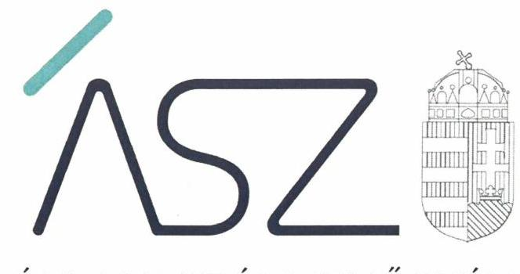
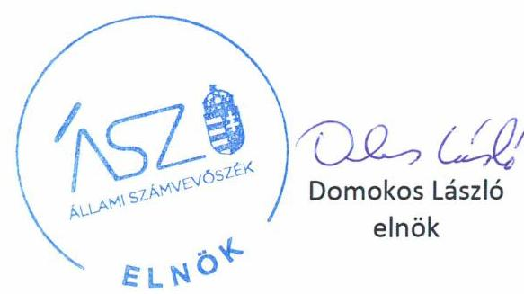

ÁLLAMI SZÁMVEVŐSZÉK

# JELENTÉS 

## Nem állami humánszolgáltatók ellenőrzése

A szociális humánszolgáltatást nyújtó intézmények, szolgáltatók államháztartáson kívüli fenntartói központi költségvetésből kapott támogatásai felhasználásának ellenőrzése Hajléktalanokért Közalapítvány

2020
20088
www.asz.hu

---

ÁLLAMI SZÁMVEVŐSZÉK

# JELENTÉS 

## Nem állami humánszolgáltatók ellenőrzése

A szociális humánszolgáltatást nyújtó intézmények, szolgáltatók államháztartáson kívüli fenntartói központi költségvetésből kapott támogatásai felhasználásának ellenőrzése Hajléktalanokért Közalapítvány

2020. 05. 28.

20088
www.asz.hu

---

# AZ ELLENŐRZÉST FELÜGYELTE: 

SALAMON ILDIKÓ felügyeleti vezető

## AZ ELLENŐRZÉST VEZETTE ÉS A VÉGREHAJTÁSÁÉRT FELELŐS:

DR. GYŐRI GABRIELLA ellenőrzésvezető

## A PROGRAM ÖSSZEÁLLÍTÁSÁÉRT FELELŐS:

TÓTPÁL SZABOLCS osztályvezető
FEKETE-NAGY ANDRÁS GÁBOR projektvezető

IKTATÓSZÁM: EL-2702-001/2020.
TÉMASZÁM: 2491
ELLENŐRZÉS-AZONOSÍTÓ SZÁM: V083508, V0867161

---

# TARTALOMJEGYZÉK 

■ ÖSSZEGZÉS ..... 5
■ AZ ELLENŐRZÉS CÉLJA ..... 6
■ AZ ELLENŐRZÉS TERÜLETE ..... 7
■ AZ ELLENŐRZÉS HÁTTERE, INDOKOLTSÁGA ..... 8
■ A JELENTÉS LÉNYEGES KÉRDÉSKÖREI ..... 9
■ AZ ELLENŐRZÉS HATÓKÖRE ÉS MÓDSZEREI ..... 10
■ MEGÁLLAPÍTÁSOK ..... 12
■ MELLÉKLETEK ..... 13
I. sz. melléklet: Értelmező szótár ..... 13
■ FÜGGELÉK: ÉSZREVÉTELEK ..... 15
■ RÖVIDÍTÉSEK JEGYZÉKE ..... 17

---

.

---

# ÖSSZEGZÉS 

A budapesti székhelyű Hajléktalanokért Közalapítvány a 2015-2017. években nem biztosította a szociális humánszolgáltatási közfeladatok ellátására kapott költségvetési támogatások felhasználásának ellenőrizhetőségét. A Hajléktalanokért Közalapítvány szociális humánszolgáltatási közfeladatok ellátására kapott költségvetési támogatásokkal való gazdálkodása 2018. évben elszámoltatható és átlátható volt, a támogatásokat szabályszerűen az intézményei működtetésére fordította.

## Az ellenőrzés társadalmi indokoltsága

A szociális gondoskodást igénylők védelme, illetve a köznevelési feladatok ellátása az Alaptörvényben meghatározott, a társadalom szempontjából fontos tevékenységek. Jogszabályok teszik lehetővé, hogy államháztartáson kívüli szervezetek - így például az egyházi fenntartók, alapítványok, gazdasági társaságok, egyesületek - által fenntartott intézmények is végezzenek köznevelési, szociális és gyermekvédelmi feladatokat, amelyhez a központi költségvetés évente jelentős összegű támogatással járul hozzá. Az államháztartáson kívüli, humánszolgáltatást végző intézmények az igényelt közpénzekből társadalmilag hasznos, közösségteremtő, közérdekű, illetve közhasznú tevékenységet végeznek, illetve közfeladatokat látnak el.

Az intézményfenntartók ellenőrzésével az Állami Számvevőszék hozzájárul ahhoz, hogy ezen közpénzeket az államháztartáson kívüli szervezetek is ellenőrizhető, átlátható és elszámoltatható módon használják fel a közfeladatok ellátása során. Az ellenőrzések célja továbbá, hogy a nyilvánosság és az igénybevevők megfelelő tájékoztatást kapjanak az államháztartáson kívüli közfeladatot ellátók működéséről. Az ÁSZ ellenőrzései arra is választ adnak, hogy az intézményfenntartók arra használták-e fel a közpénzeket, amire igényelték.

A szabályszerű gazdálkodás elengedhetetlen a közfeladat ellátás szakmai céljainak megvalósításához, valamint a társadalmi közbizalom fenntartásához.

## Főbb megállapítások, következtetések

A Hajléktalanokért Közalapítvány, mint Fenntartó ${ }^{1}$ a 2015-2017. években szociális humánszolgáltatási közfeladatait önálló jogi személyiséggel nem rendelkező intézményeiben ${ }^{2}$ látta el. Az intézmények által ellátott közfeladatok az éjjeli menedékhely, éjjeli menedékhely időszakos férőhely, hajléktalan személyek átmeneti szállása, hajléktalan személyek rehabilitációs intézménye, hajléktalanok nappali intézményi ellátása, valamint 2015-2016-ban szociális étkeztetés, 2017-ben népkonyha voltak. A Fenntartó számviteli rendjében nem különítette el a saját és intézményei gazdálkodását, valamint a költségvetési támogatások felhasználását a főkönyvi és az analitikus nyilvántartásában nem kezelte elkülönítetten, azt szociális szolgáltatónként és az intézmények által ellátott közfeladatonkénti bontásban nem mutatta ki.

A Fenntartó a 2015-2017. években a szociális humánszolgáltatási közfeladat ellátására kapott költségvetési támogatás felhasználásának a Számv. tv. 161/A. § (2) bekezdésében előírt ellenőrizhetőségét nem biztosította. Mivel az Atr. 16. § (1) bekezdésében foglalt szabályozás ellenére nem gondoskodott arról, hogy a költségvetési támogatások felhasználásának, a Fenntartó és a nem önállóan gazdálkodó intézményei gazdálkodásának elkülönített, feladatonkénti bontásban történő elszámolására az adatok rendelkezésre álljanak.

A Hajléktalanokért Közalapítvány a számviteli szabályozás kialakításával 2018. évben megteremtette a szabályszerű gazdálkodás feltételeit. A Hajléktalanokért Közalapítvány Atr. szerinti elkülönítési kötelezettségének 2018. évben eleget tett és az intézményei működtetéséhez felhasznált közpénzekre vonatkozó gazdálkodásával elszámolt.

---

# AZ ELLENŐRZÉS CÉLJA

**AZ ELLENŐRZÉS CÉLJA** annak értékelése volt, hogy a nem állami, nem önkormányzati szociális intézmények fenntartói központi költségvetésből kapott támogatásainak felhasználása szabályszerű volt-e.

---

# AZ ELLENŐRZÉS TERÜLETE 

## Hajléktalanokért Közalapítvány

A budapesti székhelyű Hajléktalanokért Közalapítványt 2004-ben hozta létre a Magyar Köztársaság Kormánya és az Egészségügyi, Szociális és Családügyi Minisztérium. A Fenntartó közhasznú tevékenysége körében hajléktalan emberek szociális és egészségügyi ellátását végző intézmények és szolgáltatások működtetését; rehabilitációs intézmény működtetését; hazai és külföldi szakmai tanácskozások, tapasztalatcserék támogatását és szervezését; foglalkoztatási, illetve közfoglalkoztatási programok szervezését és bonyolítását; az európai uniós források feltárását, hazai és nemzetközi pályázatok készítését és koordinációját; jog és érdekvédelmi feladatok ellátását, költségvetési támogatásokkal kapcsolatos egyes lebonyolító feladatok ellátását végezte, valamint részt vett a hajléktalan-ellátás fejlesztését célzó pályázatok, szakmai programok előkészítésében.

A Fenntartó legfőbb döntéshozó szerve a Kuratórium³, amely tagjainak személyében az ellenőrzött időszakban változás nem történt. A Fenntartót az illetékes Törvényszék ${ }^{4}$ nyilvántartásba vette. A Fenntartó humánszolgáltatási feladatait az általa fenntartott önálló jogi személyiséggel nem rendelkező három helyszínen működő humánszolgáltatást végző intézményein keresztül látta el, amelyeket az SzCsM. rendeletben ${ }^{5}$ foglaltak szerint bejegyeztek.

A Magyar Államkincstár adatai alapján a Fenntartó 2015. évben 223,3 M Ft, 2016. évben 242,9 M Ft, 2017. évben 254,8 M Ft, 2018-ban 264,8 M Ft központi költségvetési támogatásban részesült.

---

# AZ ELLENŐRZÉS HÁTTERE, INDOKOLTSÁGA 

A szociális feladatokat ellátó nem állami intézményfenntartók részére közfeladataik ellátására 2015-2018. években jelentős összegű pénzügyi támogatást biztosítottak a mindenkori költségvetési törvények a bennük megfogalmazott feltételek mellett.

Az ÁSZ ${ }^{6}$ a stratégiájában célul tűzte ki, hogy az államháztartáson kívülre nyújtott költségvetési támogatások ellenőrzésével hozzájárul ahhoz, hogy a közpénzeket az államháztartáson kívüli szervezetek is átlátható módon használják fel a közfeladatok szerződésben vállalt ellátása érdekében. Az ÁSZ stratégiájában foglaltak alapján is indokolt az ellenőrzés, amely a társadalom számára jelzi, hogy a közpénz államháztartáson kívüli felhasználása sem maradhat ellenőrizetlenül. Az államháztartáson kívülre nyújtott költségvetési támogatások ellenőrzésével az ÁSZ hozzájárul ahhoz, hogy a közpénzeket a nem állami fenntartók átlátható módon használják fel a közfeladatok ellátására kötött szerződésekben vállalt kötelezettségek teljesítése érdekében. Az ÁSZ az ellenőrzés javaslataival hozzájárulhat az említett rendszerek szabályszerű támogatás-felhasználásához, javíthatja a társadalmi-gazdasági döntések megalapozottságát, amely a „jól irányított állam" feltétele.

---

# A JELENTÉS LÉNYEGES KÉRDÉSKÖREI 

1. A szociális humánszolgáltató közfeladatot ellátó fenntartó szabályszerű működési - és gazdálkodási környezet kialakításával megteremtette-e a költségvetési támogatások átlátható, elszámoltatható igénybevételének, felhasználásának feltételeit?
2. Az államháztartáson kívüli fenntartó az átvállalt szociális humánszolgáltatási közfeladathoz biztosított költségvetési támogatásokat szabályszerűen fordította-e a humánszolgáltató intézményei működtetésére? Az intézményei működtetéséhez felhasznált közpénzekre vonatkozó gazdálkodásával elszámolt-e?

---

# AZ ELLENŐRZÉS HATÓKÖRE ÉS MÓDSZEREI 

## Az ellenőrzés típusa

Megfelelőségi ellenőrzés.

## Az ellenőrzött időszak

A 2015. január 1-je és 2018. december 31-e közötti időszak. A helyszíni szemle tekintetében 2019. január 1-jétől az utolsó helyszíni szemle időpontjáig 2019. január 22-ig tartó időszak.

## Az ellenőrzés tárgya

Az ellenőrzés a szociális humánszolgáltatási közfeladatokat ellátó államháztartáson kívüli fenntartók, humánszolgáltatási közfeladatai ellátásához a központi költségvetésből kapott támogatásaik humánszolgáltatási közfeladatokra való fenntartó általi felhasználása szabályszerűségének értékelésére terjedt ki.

## Az ellenőrzött szervezet

Hajléktalanokért Közalapítvány

## Az ellenőrzés jogalapja

Az ellenőrzés jogszabályi alapját az ÁSZ tv7. 1. § (3) bekezdése, 5. § (3) bekezdésben foglalt előírások adják.

## Az ellenőrzés módszerei

Az ellenőrzést az ellenőrzési program annak szempontjai, kérdései, az ellenőrzött időszakban hatályos jogszabályok, a nemzetközi standardokat irányadónak tekintve, az ellenőrzés szakmai szabályok és módszertanok figyelembevételével rendelte elvégezni. A közpénzekkel való felelős gazdálkodás segítésére irányuló javaslatok kidolgozásakor a hatályos jogszabályok voltak az irányadóak.

Az ellenőrzés ideje alatt az ellenőrzött szervezettel történő kapcsolattartást az ÁSZ, SZMSZ ${ }^{8}$-ének vonatkozó előírásai alapján biztosította.

---

Az ellenőrzési kérdések megválaszolásához szükséges bizonyítékok megszerzése az ellenőrzött által rendelkezésre bocsátott dokumentumokra, adatokra alapozva megfigyelés, szemle (szemrevételezés), kérdésfeltevés (információkérés), valamint elemző eljárással történt.

Az ellenőrzési bizonyítékként felhasználható adatforrások közé tartoztak egyrészt az ellenőrzési program részletes szempontjainál felsorolt adatforrások, másrészt minden - az ellenőrzés folyamán feltárt, az ellenőrzés szempontjából információt tartalmazó - dokumentum.

Az ellenőrzés lefolytatásához az ellenőrzött szervezet a kitöltött tanúsítványok, valamint az ÁSZ által kért dokumentumok elektronikus úton való megküldésével szolgáltatott adatokat, információkat. Az így rendelkezésre bocsátott adatok, információk és a tanúsítványok adatai valódiságának kontrollja az ellenőrzés keretében történt.

Az egységes értelmezést támogatta a jelentés mellékletét képező fogalomtár és rövidítésjegyzék.

Az ÁSZ az ellenőrzést alapvetően a szociális humánszolgáltatások esetében a központi költségvetési támogatások igénylésével, módosításával, felhasználásával, elszámolásával kapcsolatos feladatokat ellátó államháztartáson kívüli fenntartónál végezte. Az ÁSZ a fenntartott intézményeknél helyszíni szemle keretében győződött meg a tényleges feladatellátásról (verifikáció).

Az ÁSZ a szociális humánszolgáltatások központi költségvetési támogatásai igénylésével, módosításával, elszámolásával kapcsolatos, államháztartáson kívüli fenntartó jogszabályokban előírt feladatai betartását, továbbá a központi költségvetési támogatások szabályszerű kezelését, nyilvántartását ellenőrizte a fenntartónál, az ott rendelkezésre álló határozatok, nyilvántartások, beszámolók és egyéb dokumentumok alapján. Az ellenőrzés nem terjedt ki a szociális humánszolgáltatások központi költségvetési támogatásai igénylése, módosítása, elszámolása valódiságának, megalapozottságának, helyességének - sem a fenntartónál, sem a székhely intézményeinél való - értékelésére (mivel ennek felülvizsgálata, ellenőrzése a finanszírozó jogszabályban előírt feladata, határozatai kiadása előtt). Továbbá nem terjedt ki az ellenőrzés e források, intézmények általi szabályszerű felhasználásának értékelésére.

---

# MEGÁLLAPÍTÁSOK 

## 1. A szociális humánszolgáltató közfeladatot ellátó fenntartó szabályszerű működési - és gazdálkodási környezet kialakításával megteremtette-e a költségvetési támogatások átlátható, elszámoltatható igénybevételének, felhasználásának feltételeit?

Összegző megállapítás A Fenntartó 2018. évben a működési környezet szabályszerű kialakításával megteremtette a költségvetési támogatások átlátható, elszámoltatható felhasználásának feltételeit.

A Fenntartó a Ptk. ${ }^{9}$ előírásai szerint rendelkezett alapító okirattal ${ }^{10}$. A Fenntartó szervezeti és működési szabályzatában a Szoc. tv. ${ }^{11}$ előírásaival összhangban gondoskodott a szociális ellátást nyújtó intézményei feladatainak, működési kereteinek meghatározásáról. A költségvetési támogatások igénylése, módosítása és a Kincstár ${ }^{12}$ felé történő elszámolása az Atr.ben ${ }^{13}$ meghatározottak alapján szabályszerűen történt.

A Fenntartó elkészítette a Számv. tv. ${ }^{14}$ szerinti számviteli politikát ${ }^{15}$, a leltárkészítési és leltározási szabályzatot ${ }^{16}$ és a pénzkezelési szabályzatot ${ }^{17}$.
2. Az államháztartáson kívüli fenntartó az átvállalt szociális humánszolgáltatási közfeladathoz biztosított költségvetési támogatásokat szabályszerűen fordította-e a humánszolgáltató intézményei működtetésére? Az intézményei működtetéséhez felhasznált közpénzekre vonatkozó gazdálkodásával elszámolt-e?

## Összegző megállapítás

A Fenntartó 2018. évben az átvállalt szociális humánszolgáltatási közfeladathoz biztosított költségvetési támogatásokat szabályszerűen fordította az intézményei működtetésére.

A Fenntartó a Számv. tv. alapján 2018. évben gondoskodott könyvvezetési rendszerének oly módon való továbbrészletezéséről, hogy abból az Atr.ben, mint vonatkozó külön jogszabályban meghatározott adatok rendelkezésre álljanak. A Fenntartó 2018. évben az Atr. szerinti elkülönítési kötelezettségének eleget tett, a humánszolgáltatást végző intézményei működtetéséhez felhasznált közpénzekre vonatkozó gazdálkodásával elszámolt.

---

# MELLÉKLETEK 

- I. SZ. MELLÉKLET: ÉRTELMEZŐ SZÓTÁR
civil szervezet
humánszolgáltatás
költségvetési támogatás
nem állami, nem önkormányzati (államháztartáson kívüli) intézmény fenntartó
székhely intézmény

A Civil tv*.2. § 6. pontja szerint civil szervezet a civil társaság, a Magyarországon nyilvántartásba vett egyesület (a párt, a szakszervezet és a kölcsönös biztosító egyesület kivételével), a közalapítvány és a pártalapítvány kivételével az alapítvány.
Külön törvényben meghatározott szociális, gyermekjóléti, gyermekvédelmi, közoktatási, felsőoktatási, kulturális közfeladatok (2014. évi Kvtv. ${ }^{18} 34 .$ § (1), (4) bekezdés, 1. számú melléklet XX/20/2. alcím, 19. alcím, 2015.

 évi Kvtv. ${ }^{19} 43 . \S$ (1), (4) bekezdés, 1. számú melléklet XX/20/2/3. jogcím csoport, 19. alcím, 2016. évi Kvtv. 41. § (1), (4) bekezdés, 1. számú melléklet XX/20/2/3. jogcím csoport, 19. alcím).
a társadalombiztosítás pénzügyi alapjai kivételével az államháztartás központi alrendszeréből ellenérték nélkül, pénzben nyújtott támogatások (Áht. ${ }^{20} 1 . \S 14$. pont)
A költségvetési törvényekben (2013. évi CCXXX. törvény 33-34. §, 2014. évi C. törvény 42-43. §, 2015. évi C. törvény 40-41. §) megállapított támogatás. Például a 2015. évi C. törvény 40-41. § szerint többek között: Az Országgyűlés a szociális, gyermekjóléti, gyermekvédelmi közfeladatot ellátó intézményt, szolgáltatást fenntartó egyházi jogi személy, civil szervezet, közalapítvány, országos nemzetiségi önkormányzat, települési vagy területi nemzetiségi önkormányzat, gazdasági társaság, és a humánszolgáltatást alaptevékenységként végző, az Szja tv. hatálya alá tartozó egyéni vállalkozó (a továbbiakban együtt: nem állami szociális fenntartó) részére támogatást állapít meg a következők szerint: a támogatás a nem állami szociális fenntartót a települési önkormányzatok 2. melléklet III. pont 3. alpont c)-k) pontjában és III. pont 5. alpont a) pontjában meghatározott támogatásaival azonos jogcímeken, összegben és feltételek mellett illeti meg.
A szociális, gyermekjóléti és gyermekvédelmi közfeladatokat/humánszolgáltatásokat ellátó intézményt fenntartó egyházi jogi személy, társadalmi szervezet, alapítvány, közalapítvány, civil szervezet, országos nemzetiségi önkormányzat, nonprofit gazdasági társaság, gazdasági társaság és a humánszolgáltatást alaptevékenységként végző, Szja tv. hatálya alá tartozó egyéni vállalkozó. (2013. évi Kvtv. ${ }^{21} 35 .$ § (1), (3) bekezdés 2014. évi Kvtv. 33. §, 34. § (1), (4) bekezdés, 2015. évi Kvtv. 42. §, 43. § (1), (4) bekezdés, 2016. évi Kvtv. ${ }^{22} 40 . \S, 41 . \S$ (1), (4) bekezdés, 2017. évi Kvtv. ${ }^{23} 41 . \S$ (1), (4))
a szolgáltató székhelye, azaz a szolgáltató központi ügyintézésének helye, függetlenül attól, hogy használják-e szolgáltatás nyújtására (Sznyvhr. ${ }^{24} 1 . \S$ k) pont) (hatályos: 2013. december 1-től)

[^0]
[^0]:    * Előzmény törvények, amelyeket az ellenőrzött időszak miatt figyelembe kell venni: egyesülési jogról szóló 1989. évi II. tv., a közhasznú szervezetekről szóló 1997. évi CLVI. tv.

---

.

---

# FÜGGELÉK: ÉSZREVÉTELEK 

A jelentéstervezetet a Számvevőszék 15 napos észrevételezésre megküldte az ellenőrzött szervezet vezetőjének az ÁSZ tv. 29. § ${ }^{+}$(1) bekezdése előírásának megfelelően.

A Hajléktalanokért Közalapítvány kuratóriumi elnöke észrevételezési jogával nem élt.

[^0]
[^0]:    ${ }^{+} 29 . \S$ (1) Az Állami Számvevőszék az ellenőrzési megállapításait megküldi az ellenőrzött szervezet vezetőjének vagy az általa megbízott személynek, és annak, akinek személyes felelősségét állapította meg.
    (2) Az ellenőrzött szervezet vezetője és a felelősként megjelölt személy az ellenőrzés megállapításaira tizenöt napon belül írásban észrevételt tehet.
    (3) Az Állami Számvevőszék az észrevételre a beérkezésétől számított harminc napon belül írásban válaszol. A figyelembe nem vett észrevételeket köteles a jelentésben feltüntetni, és megindokolni, hogy azokat miért nem fogadta el.

---

.

---

# RÖVIDÍTÉSEK JEGYZÉKE 

${ }^{1}$ Fenntartó
${ }^{2}$ intézmény
${ }^{3}$ Kuratórium
${ }^{4}$ Törvényszék
${ }^{5}$ SzCsM. rendelet
${ }^{6}$ ÁSZ
${ }^{7}$ ÁSZ tv.
${ }^{8}$ ÁSZ SZMSZ
${ }^{9}$ Ptk.
${ }^{10}$ alapító okirat
${ }^{11}$ Szoc. tv.
${ }^{12}$ Kincstár
${ }^{13}$ Atr.
${ }^{14}$ Számv. tv.
${ }^{15}$ számviteli politika
${ }^{16}$ leltárkészítési és leltározási szabályzat
${ }^{17}$ pénzkezelési szabályzat
${ }^{18}$ 2014. évi Kvtv.
${ }^{19}$ 2015. évi Kvtv.
${ }^{20}$ Áht.
${ }^{21}$ 2013. évi Kvtv.
${ }^{22}$ 2016. évi Kvtv.
${ }^{23}$ 2017. évi Kvtv.
${ }^{24}$ Sznyvhr.

Hajléktalanokért Közalapítvány
Hajléktalanokért Közalapítvány Segítőház (1106 Bp. Jászberényi út 47/e.), Hajléktalanokért Közalapítvány Speciális Menedékhelye, Nappali Melegedő és Utcai Gondozó Szolgálat (1067 Bp. Szobi u. 3.),
Pro Domo Éjjeli Menedékhely (1106 Bp. Gránátos u. 2.)
Hajléktalanokért Közalapítvány Kuratóriuma
Fővárosi Törvényszék
1/2000. (I. 7.) SzCsM rendelet a személyes gondoskodást nyújtó szociális intézmények szakmai feladatairól és működésük feltételeiről
Állami Számvevőszék
2011. évi LXVI. törvény az Állami Számvevőszékről

Az Állami Számvevőszék elnökének 2/2018. (XII. 28.) ÁSZ utasítása az Állami Számvevőszék Szervezeti és Működési Szabályzatáról (hatályos: 2019. január 1-jétől)
2013. évi V. törvény a Polgári Törvénykönyvről

Hajléktalanokért Közalapítvány Alapító Okirata (hatályos: 2016. március 10-től)
1993. évi III. törvény a szociális igazgatásról és szociális ellátásokról

Magyar Államkincstár
489/2013. (XII.18.) Korm. rendelet az egyházi és nem állami fenntartású szociális, gyermekjóléti és gyermekvédelmi szolgáltatók, intézmények és hálózatok állami támogatásáról
2000. évi C törvény a számvitelről

Hajléktalanokért Közalapítvány Számviteli politika (hatályos: 2016. január 1-jétől)
A Hajléktalanokért Közalapítvány leltárkészítési és leltározási szabályzata (hatályos: 2016. január 1-jétől)
Hajléktalanokért Közalapítvány Pénzkezelési Szabályzata (hatályos: 2016. január 1-jétől)
2013. évi CCXXX. törvény Magyarország 2014. évi központi költségvetéséről
2014. évi C. törvény Magyarország 2015. évi központi költségvetéséről
2011. évi CXCV. törvény az államháztartásról
2012. évi CCIV. törvény Magyarország 2013. évi központi költségvetéséről
2015. évi C. törvény Magyarország 2016. évi központi költségvetéséről
2016. évi XC. törvény Magyarország 2017. évi központi költségvetéséről

369/2013. (X. 24.) Korm. rendelet a szociális, gyermekjóléti és gyermekvédelmi szolgáltatók, intézmények és hálózatok hatósági nyilvántartásáról és ellenőrzéséről

---

# ASZ 

ÁLLAMI SZÁMVEVŐSZÉK
1052 Budapest, Apáczai Cs. J. u. 10. I 1364 Budapest 4. Pf. 54 TEL: +36 14849100
email: szamvevoszek@asz.hu
web: www.asz.hu | www.aszhirportal.hu

