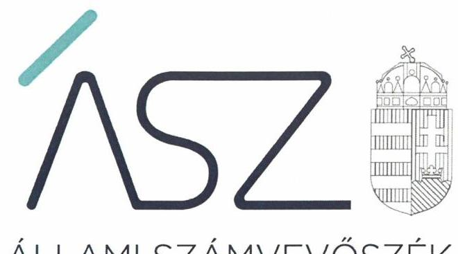
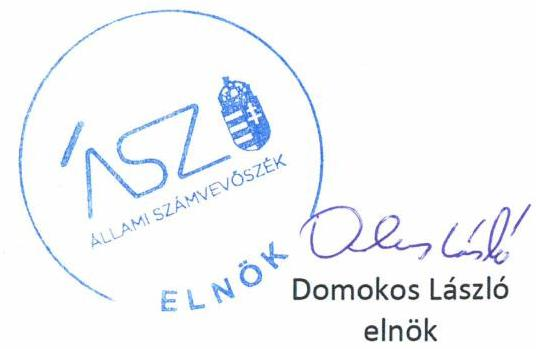
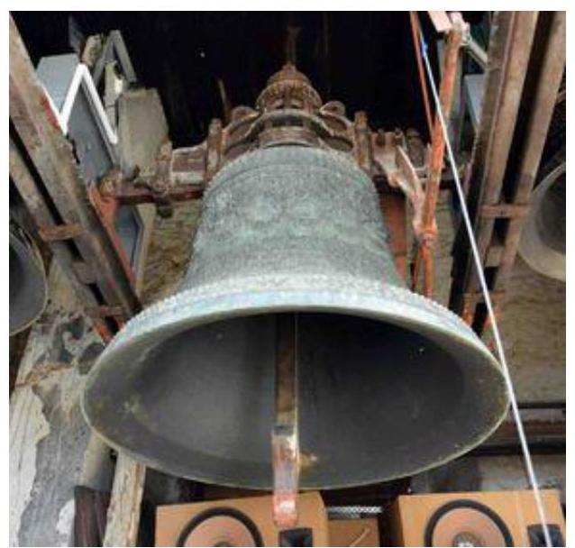

ÁLLAMI SZÁMVEVŐSZÉK

# JELENTÉS 

## Nem állami humánszolgáltatók ellenőrzése

A köznevelési és szociális humánszolgáltatást nyújtó intézmények, szolgáltatók államháztartáson kívüli fenntartói központi költségvetésből kapott támogatásai felhasználásának ellenőrzése - Tornyospálcai Református Egyházközség
2020.

20090
www.asz.hu

---

ÁLLAMI SZÁMVEVŐSZÉK

# JELENTÉS 

## Nem állami humánszolgáltatók ellenőrzése

A köznevelési és szociális humánszolgáltatást nyújtó intézmények, szolgáltatók államháztartáson kívüli fenntartói központi költségvetésből kapott támogatásai felhasználásának ellenőrzése - Tornyospálcai Református Egyházközség
2020. 05. hó 28. nap

20090
www.asz.hu

---

# AZ ELLENŐRZÉST FELÜGYELTE: 

KLINGA LÁSZLÓ felügyeleti vezető

## AZ ELLENŐRZÉST VEZETTE ÉS A VÉGREHAJTÁSÁÉRT FELELŐS:

DR. DOMOKOS MAGDOLNA ellenőrzésvezető

## A PROGRAM ÖSSZEÁLLÍTÁSÁÉRT FELELŐS:

FEKETE-NAGY ANDRÁS GÁBOR ellenőrzési program elkészítéséért felelős vezető

TÓTPÁL SZABOLCS osztályvezető

IKTATÓSZÁM: EL-2704-001/2020
Jelentéseink az Országgyűlés számítógépes hálózatán és az interneten a www.asz.hu címen is olvashatóak.

TÉMASZÁM: 2491
ELLENŐRZÉS-AZONOSÍTÓ SZÁM: V083565, V0867075

---

# TARTALOMJEGYZÉK 

■ ÖSSZEGZÉS ..... 5
■ AZ ELLENŐRZÉS CÉLJA ..... 6
■ AZ ELLENŐRZÉS TERÜLETE ..... 7
■ AZ ELLENŐRZÉS HÁTTERE, INDOKOLTSÁGA ..... 8
■ A JELENTÉS LÉNYEGES KÉRDÉSKÖRE ..... 9
■ AZ ELLENŐRZÉS HATÓKÖRE ÉS MÓDSZEREI ..... 10
■ MEGÁLLAPÍTÁSOK ..... 12
■ MELLÉKLETEK ..... 13
I. sz. melléklet: Értelmező szótár ..... 13
■ FÜGGELÉK: ÉSZREVÉTELEK ..... 15
■ RÖVIDÍTÉSEK JEGYZÉKE ..... 17

---

.

---

# ÖSSZEGZÉS 

A Tornyospálcai Református Egyházközség a 2015-2018. években nem biztosította a szociális humánszolgáltatási közfeladatok ellátására kapott költségvetési támogatások felhasználásának ellenőrizhetőségét. 2018-ban a köznevelési közfeladat ellátására kapott támogatást szabályszerűen átadta a feladatot ellátó intézmény részére.

## Az ellenőrzés társadalmi indokoltsága

A szociális gondoskodást igénylők védelme, illetve a köznevelési feladatok ellátása az Alaptörvényben meghatározott, a társadalom szempontjából fontos tevékenységek. Jogszabályok teszik lehetővé, hogy államháztartáson kívüli szervezetek - így például az egyházi fenntartók, alapítványok, gazdasági társaságok, egyesületek - által fenntartott intézmények is végezzenek köznevelési, szociális és gyermekvédelmi feladatokat. Mindehhez a központi költségvetés évente jelentős összegű támogatással járul hozzá. Az államháztartáson kívüli, humánszolgáltatást végző intézmények az igényelt közpénzekből társadalmilag hasznos, közösségteremtő, közérdekű, illetve közhasznú tevékenységet végeznek, illetve közfeladatokat látnak el.

Az intézményfenntartók ellenőrzésével az Állami Számvevőszék hozzájárul ahhoz, hogy ezen a közpénzeket az államháztartáson kívüli szervezetek is ellenőrizhető, átlátható és elszámoltatható módon használják fel a közfeladatok ellátása során. Az ellenőrzések célja továbbá, hogy a nyilvánosság és az igénybevevők megfelelő tájékoztatást kapjanak az államháztartáson kívüli közfeladatot ellátók működéséről.

Az ÁSZ ellenőrzései arra adnak választ, hogy az intézményfenntartók arra használták-e fel a közpénzeket, amire igényelték.

A szabályszerű gazdálkodás elengedhetetlen a közfeladat ellátás szakmai céljainak megvalósításához, valamint a társadalmi közbizalom fenntartásához.

## Főbb megállapítások, következtetések

A Fenntartó 2018-ban a köznevelési közfeladatok működési- és gazdálkodási környezetét szabályszerűen alakította ki, a köznevelési közfeladat ellátására kapott támogatást szabályszerűen átadta a feladatot ellátó intézmény részére.

A Fenntartó számviteli rendjében nem kezelte elkülönítetten a szociális humánszolgáltatási feladatával összefüggésben a saját és a nem önállóan gazdálkodó egyes intézményei gazdálkodását, továbbá a Fenntartó nem gondoskodott feladatonkénti bontású nyilvántartás vezetéséről az intézményei által végzett, időskorúak nappali ellátása, házi segítségnyújtás, szociális étkeztetés, családi napközi, valamint bölcsődei ellátás közfeladatokra kapott támogatás felhasználásáról.

A Fenntartó a 2015-2018. években a szociális humánszolgáltatási közfeladat ellátására kapott költségvetési támogatás felhasználásának a Számv. tv. ${ }^{1} 161/A$ § (2) bekezdésében előírt ellenőrizhetőségét nem biztosította. Mivel az Atr. ${ }^{2}$ 16. § (1) bekezdésben foglalt szabályozás ellenére nem gondoskodott arról, hogy az állami támogatások felhasználásának a Fenntartó és a nem önállóan gazdálkodó intézményei gazdálkodásának elkülönített, feladatonkénti bontásban történő elszámolására az adatok rendelkezésre álljanak.

Ezáltal a Fenntartó nem igazolta, hogy a közpénzt a szociális humánszolgáltatási közfeladatra fordította.
A Tornyospálcai Református Egyházközség lelkésze az ellenőrzés ideje alatt intézkedett a szociális humánszolgáltatási közfeladatok ellátására kapott költségvetési támogatások tekintetében a saját és a nem önállóan gazdálkodó intézményei gazdálkodásának elkülönített kezelésére, valamint a Fenntartó általi feladatonkénti nyilvántartás vezetésére.

---

# AZ ELLENŐRZÉS CÉLJA 

AZ ELLENŐRZÉS CÉLJA annak értékelése volt, hogy a nem állami, nem önkormányzati köznevelési és szociális intézmények fenntartói központi költségvetésből kapott támogatásainak felhasználása szabályszerű volt-e.

---

# AZ ELLENŐRZÉS TERÜLETE 

## Tornyospálcai Református Egyházközség

A Tornyospálcai Református Egyházközség a Magyarországi Református Egyház Tiszántúli Egyházkerületének Szabolcs-Beregi Egyházmegyéjéhez tartozik.

A Fenntartó ${ }^{3}$ a Magyar Köztársaság Kormánya és a Magyarországi Református Egyház által 1998. december 8-án kötött, 1057/1999. (V. 26.) Korm. határozatban kihirdetett, továbbá a 2017. október 4-én létrejött, az 1821/2017. (XI. 9.) Korm. határozatban közzétett megállapodás keretében látott el szociális humánszolgáltatási és köznevelési feladatot.

A Fenntartó az Ehtv. ${ }^{4}$ és a belső egyházi alkotmány ${ }^{5}$ alapján a Magyarországi Református Egyházon belül működő önálló jogi személy, képviseletét a lelkész és a gondnok látja el.

A Fenntartó az ellenőrzött időszakban egy - időskorúak napközbeni ellátását, szociális étkeztetést, népkonyhát, házi segítségnyújtást végző - szociális szolgáltató ${ }^{6}$, valamint gyermekjóléti szolgáltatók ${ }^{7}$, valamint egy köznevelési székhely intézmény ${ }^{8}$ működtetésével vett részt az önkormányzati és állami közfeladatok ellátásában. A Fenntartó gazdasági, vállalkozási tevékenységet nem folytatott. A Fenntartó által alapított szociális szolgáltató és a gyermekjóléti szolgáltatók nem rendelkeztek önálló jogi személyiséggel. A Fenntartó 2018-ban köznevelési feladatait önálló jogi személyiséggel rendelkező intézménye által látta el.

A köznevelési és szociális humánszolgáltatási feladatok ellátásával kapcsolatos szakmai irányító szervi feladatokat az ellenőrzött időszakban az EMMI ${ }^{9}$ látta el, törvényességi ellenőrzési feladatokat a területileg illetékes kormányhivatalok végezték.

A Fenntartó részére a szociális alapszolgáltatási feladatokra és a gyermekjóléti alapellátási közfeladatokhoz a Magyar Államkincstár által biztosított költségvetési támogatás összege a 2015. évben 319,0 millió Ft, a 2016. évben 310,2 millió Ft, a 2017. évben 453,9 millió Ft, 2018. évben 511,7 millió Ft, a köznevelési feladatra 42,4 millió Ft volt.

---

# AZ ELLENŐRZÉS HÁTTERE, INDOKOLTSÁGA 

A köznevelési és szociális feladatokat ellátó nem állami intézményfenntartók részére közfeladataik ellátására évente jelentős összegű pénzügyi támogatást biztosítottak a mindenkori költségvetési törvények a bennük megfogalmazott feltételek mellett. A felhasználható állami támogatások Kvtv.-ek ${ }^{18}$ szerinti előirányzata szociális területen a 2015-2018. együtt 360 Mrd Ft, 2018-ban a köznevelési területen 203 Mrd Ft volt.

Az Állami Számvevőszék stratégiájában célul tűzte ki, hogy az államháztartáson kívülre nyújtott költségvetési támogatások ellenőrzésével hozzájárul ahhoz, hogy a közpénzeket az államháztartáson kívüli szervezetek is átlátható módon használják fel a közfeladatok szerződésben vállalt ellátása érdekében.

Az Állami Számvevőszék stratégiájában foglaltak alapján is indokolt az ellenőrzés, amely a társadalom számára jelzi, hogy a közpénz államháztartáson kívüli felhasználása sem maradhat ellenőrizetlenül. Az ellenőrzés javaslataival hozzájárulhat az államháztartáson kívüli szervezetek szabályszerű támogatás felhasználásához, javíthatja a társadalmi-gazdasági döntések megalapozottságát, amely a „jól irányított állam" feltétele.

A holisztikus megközelítés jegyében az ellenőrzés keretében egyedi kockázatelemzés alapján kiválasztott fenntartóknál értékelte az Állami Számvevőszék az államháztartáson kívüli köznevelési és szociális tevékenységhez kapcsolódó támogatások felhasználásának megfelelőségét.

---

# A JELENTÉS LÉNYEGES KÉRDÉSKÖRE 

A köznevelési és szociális humánszolgáltató közfeladatot ellátó államháztartáson kívüli fenntartó szabályszerű működési - és gazdálkodási környezet kialakításával megteremtette-e a költségvetési támogatások átlátható, elszámoltatható igénybevételének, felhasználásának feltételeit?

---

# AZ ELLENŐRZÉS HATÓKÖRE ÉS MÓDSZEREI 

## Az ellenőrzés típusa

Megfelelőségi ellenőrzés

## Az ellenőrzött időszak

A 2015. január 1-je és 2018. december 31-e közötti időszak a szociális humánszolgáltatási közfeladatok, 2018. január 1-je és 2018. december 31-e közötti időszakban a köznevelési közfeladatok tekintetében

## Az ellenőrzés tárgya

Az ellenőrzés a köznevelési és szociális humánszolgáltatási közfeladatokat ellátó államháztartáson kívüli fenntartók humánszolgáltatási közfeladatai ellátásához a központi költségvetésből kapott támogatásaik humánszolgáltatási közfeladatokra való fenntartó általi felhasználása szabályszerűségének értékelésére terjedt ki.

## Az ellenőrzött szervezet

Tornyospálcai Református Egyházközség

## Az ellenőrzés jogalapja

Az ellenőrzés jogszabályi alapját az ÁSZ tv. ${ }^{11} 1$. § (3) bekezdésében, az 5. § (3) bekezdésében, valamint az 5. § (11) bekezdés c) pontjában foglalt előírások adják.

## Az ellenőrzés módszerei

Az ellenőrzést az ellenőrzési program annak szempontjai, kérdései, az ellenőrzött időszakban hatályos jogszabályok, a nemzetközi standardokat irányadónak tekintve, az ellenőrzés szakmai szabályok és módszertanok figyelembevételével rendelte elvégezni. A közpénzekkel való felelős gazdálkodás segítésére irányuló javaslatok kidolgozásakor a hatályos jogszabályok voltak az irányadók.

Az ellenőrzés ideje alatt az ellenőrzött szervezettel történő kapcsolattartást az ÁSZ SZMSZ ${ }^{12}$-ének vonatkozó előírásai alapján biztosítottuk.

---

Az ellenőrzési kérdések megválaszolásához szükséges bizonyítékok megszerzése az ellenőrzött által rendelkezésre bocsátott dokumentumokra, adatokra alapozva megfigyelés, szemle (szemrevételezés), kérdésfeltevés (információkérés), valamint elemző eljárással történt.

Az ellenőrzési bizonyítékként felhasználható adatforrások közé tartoztak egyrészt az ellenőrzési program részletes szempontjainál felsorolt adatforrások, másrészt minden - az ellenőrzés folyamán feltárt, az ellenőrzés szempontjából információt tartalmazó - dokumentum.

Az ellenőrzés lefolytatásához az ellenőrzött szervezet a kitöltött tanúsítványok, valamint az ÁSZ ${ }^{13}$ által kért dokumentumok elektronikus úton való megküldésével szolgáltatott adatokat, információkat. Az így rendelkezésre bocsátott adatok, információk és a tanúsítványok adatai valódiságának kontrollja az ellenőrzés keretében történt.

Az ellenőrzést alapvetően a köznevelési és szociális humánszolgáltatások esetében a központi költségvetési támogatások igénylésével, módosításával, felhasználásával, elszámolásával kapcsolatos feladatokat ellátó államháztartáson kívüli fenntartóknál/szervezeteinél végeztük.

A köznevelési és szociális humánszolgáltatások központi költségvetési támogatásai igénylésével, módosításával, elszámolásával kapcsolatos, államháztartáson kívüli fenntartó jogszabályokban előírt feladatai betartását, továbbá a központi költségvetési támogatások szabályszerű kezelését, nyilvántartását ellenőriztük a fenntartónál, az ott rendelkezésre álló határozatok, nyilvántartások, beszámolók és egyéb dokumentumok alapján. Az ellenőrzés nem terjedt ki a köznevelési és szociális humánszolgáltatások központi költségvetési támogatásai igénylése, módosítása, elszámolása valódiságának, megalapozottságának, helyességének - sem a fenntartónál, sem a székhely intézményeinél való - értékelésére (mivel ennek felülvizsgálata, ellenőrzése a finanszírozó jogszabályban előírt feladata, határozatai kiadása előtt). Továbbá nem terjedt ki az ellenőrzés e források, intézmények általi szabályszerű felhasználásának értékelésére.

---

# MEGÁLLAPÍTÁSOK 

## A köznevelési és szociális humánszolgáltató közfeladatot ellátó államháztartáson kívüli fenntartó szabályszerű működési - és gazdálkodási környezet kialakításával megteremtette-e a költségvetési támogatások átlátható, elszámoltatható igénybevételének, felhasználásának feltételeit?

Összegző megállapítás A Fenntartó 2018-ban a köznevelési közfeladatok működési és gazdálkodási környezetét szabályszerűen alakította ki.

A Fenntartó köznevelési közfeladatai ellátásának szervezeti keretei, irányítási rendszere belső egyházi alkotmányban kerültek meghatározásra.

A Fenntartó rendelkezett a számviteli előírások szerint számviteli politikával ${ }^{14}$ és annak keretében előírt szabályzatokkal, az eszközök és a források értékelési szabályzatával, az eszközök és a források leltárkészítési és leltározási szabályzatával, valamint pénzkezelési szabályzattal. A Fenntartó a jogszabályban meghatározottak alapján elkészítette számlarendjét ${ }^{15}$.

---

# MELLÉKLETEK 

- I. SZ. MELLÉKLET: ÉRTELMEZŐ SZÓTÁR
civil szervezet
ellátási terület
feladatfinanszírozás
humánszolgáltatás
költségvetési támogatás
nem állami, nem önkormányzati (államháztartáson kívüli) intézmény fenntartó
székhely intézmény
telephely

A Civil tv. ${ }^{*}$ 2. § 6. pontja szerint civil szervezet a civil társaság, a Magyarországon nyilvántartásba vett egyesület (a párt, a szakszervezet és a kölcsönös biztosító egyesület kivételével), a közalapítvány és a pártalapítvány kivételével az alapítvány.
Az a terület, ahonnan az engedélyes gyermekeket, illetve más ellátottakat fogad.
A közfeladat államháztartáson kívüli szervezet által történő ellátásához közvetlenül kapcsolódó, arányos működési költségeket finanszírozó költségvetési támogatás.
Külön törvényben meghatározott szociális, gyermekjóléti, gyermekvédelmi, közoktatási, felsőoktatási, kulturális közfeladatok (2014. évi Kvtv. ${ }^{16} 34 . \S$ (1), (4) bekezdés, 1. számú melléklet XX/20/2. alcím, 19. alcím, 2015. évi Kvtv. 43. § (1), (4) bekezdés, 1. számú melléklet XX/20/2/3.

 jogcím csoport, 19. alcím, 2016. évi Kvtv. 41. § (1), (4) bekezdés, 1. számú melléklet XX/20/2/3. jogcím csoport, 19. alcím).
a társadalombiztosítás pénzügyi alapjai kivételével az államháztartás központi alrendszeréből ellenérték nélkül, pénzben nyújtott támogatások (Áht. 1. § 14. pont)
A költségvetési törvényekben (2013. évi CCXXX. törvény 33-34. §, 2014. évi C. törvény 42-43. §, 2015. évi C. törvény 40-41. §) megállapított támogatás. Például a 2015. évi C. törvény 40-41. § szerint többek között: Az Országgyűlés a szociális, gyermekjóléti, gyermekvédelmi közfeladatot ellátó intézményt, szolgáltatást fenntartó egyházi jogi személy, civil szervezet, közalapítvány, országos nemzetiségi önkormányzat, települési vagy területi nemzetiségi önkormányzat, gazdasági társaság, és a humánszolgáltatást alaptevékenységként végző, az Szja tv ${ }^{17}$. hatálya alá tartozó egyéni vállalkozó (a továbbiakban együtt: nem állami szociális fenntartó) részére támogatást állapít meg a következők szerint: a támogatás a nem állami szociális fenntartót a települési önkormányzatok 2. melléklet III. pont 3. alpont c)-k) pontjában és III. pont 5. alpont a) pontjában meghatározott támogatásaival azonos jogcímeken, összegben és feltételek mellett illeti meg.
A szociális, gyermekjóléti és gyermekvédelmi közfeladatokat/humánszolgáltatásokat ellátó intézményt fenntartó egyházi jogi személy, társadalmi szervezet, alapítvány, közalapítvány, civil szervezet, országos nemzetiségi önkormányzat, nonprofit gazdasági társaság, gazdasági társaság és a humánszolgáltatást alaptevékenységként végző, Szja tv. hatálya alá tartozó egyéni vállalkozó. (2013. évi Kvtv. 35. § (1), (3) bekezdés, 2014. évi Kvtv. 33. §, 34. § (1), (4) bekezdés, 2015. évi Kvtv. 42. §, 43. § (1), (4) bekezdés, 2016. évi Kvtv. 40. §, 41. § (1), (4) bekezdés, 2017. évi Kvtv. 41. § (1), (4))
a szolgáltató székhelye, azaz a szolgáltató központi ügyintézésének helye, függetlenül attól, hogy használják-e szolgáltatás nyújtására (Sznyvhr. ${ }^{18} 1 . \S$ k) pont) (hatályos: 2013. december 1-től)
a szolgáltató székhelyétől különböző, szolgáltató/intézmény használatában álló hely, a szociális humánszolgáltatáshoz használt, bejegyzett hely. (Sznyvhr. 1. § l) pont) (hatályos: 2015. január 1-től)

[^0]
[^0]:    * Előzmény törvények, amelyeket az ellenőrzött időszak miatt figyelembe kell venni: egyesülési jogról szóló 1989. évi II. tv, a közhasznú szervezetekről szóló 1997. évi CLVI. tv.

---

.

---

# FÜGGELÉK: ÉSZREVÉTELEK 

A jelentéstervezetet a Számvevőszék 15 napos észrevételezésre megküldte az ellenőrzött szervezet vezetőjének az ÁSZ tv. 29. § ${ }^{+}$(1) bekezdése előírásának megfelelően.

A Tornyospálcai Református Egyházközség vezetője a jelentéstervezetre nem tett észrevételt.

[^0]
[^0]:    ${ }^{+} 29 . \S$ (1) Az Állami Számvevőszék az ellenőrzési megállapításait megküldi az ellenőrzött szervezet vezetőjének vagy az általa megbízott személynek, és annak, akinek személyes felelősségét állapította meg.
    (2) Az ellenőrzött szervezet vezetője és a felelősként megjelölt személy az ellenőrzés megállapításaira tizenöt napon belül írásban észrevételt tehet.
    (3) Az Állami Számvevőszék az észrevételre a beérkezésétől számított harminc napon belül írásban válaszol. A figyelembe nem vett észrevételeket köteles a jelentésben feltüntetni, és megindokolni, hogy azokat miért nem fogadta el.

---

.

---

# RÖVIDÍTÉSEK JEGYZÉKE 

${ }^{1}$ Számv. tv.
${ }^{2}$ Atr.
${ }^{3}$ Fenntartó
${ }^{4}$ Ehtv.
${ }^{5}$ belső egyházi alkotmány
${ }^{6}$ szociális szolgáltató
${ }^{7}$ gyermekjóléti szolgáltatók
${ }^{8}$ köznevelési intézmény
${ }^{9}$ EMMI
${ }^{10}$ Kvtv.-ek
${ }^{11}$ ÁSZ tv.
${ }^{12}$ ÁSZ SZMSZ
${ }^{13}$ ÁSZ
${ }^{14}$ Számviteli politika
${ }^{15}$ Számlarend
${ }^{16}$ Kvtv.
${ }^{17}$ Szja tv.
${ }^{18}$ Sznyvhr.
2000. évi C. törvény a számvitelről (hatályos: 2001. január 1-jétől)

489/2013 (XII. 18.) Korm. rendelet az egyházi és nem állami fenntartású szociális, gyerekjóléti és gyermekvédelmi szolgáltatók, intézmények és hálózatok állami támogatásáról (hatályos: 2014. január 1-jétől)
Tornyospálcai Református Egyházközség
A lelkiismereti és vallásszabadság jogáról, valamint az egyházak, vallásfelekezetek és vallási közösségek jogállásáról szóló 2011. évi CCVI. törvény (hatályos: 2012. január 1-jétől)
Magyarországi Református Egyház Alkotmányáról és Kormányzatáról szóló 1994. évi II. törvény (A Magyarországi Református Egyház belső törvénye, hatályos: 1995. január 1-jétől)
Áldás Református Diakóniai Központ
2016. december 31-ig a Tornyospálcai Családi Napközi hálózata, 2017. évben három Mini Bölcsőde és egy Családi Bölcsőde, 2018. évben öt Mini Bölcsőde és egy Családi Bölcsőde
Áldás Református Óvoda
Emberi Erőforrások Minisztériuma
2014. évi C. törvény Magyarország 2015. évi központi költségvetéséről
2015. évi C. törvény Magyarország 2016. évi központi költségvetéséről,
2016. évi CX. törvény Magyarország 2017. évi központi költségvetéséről,
2017. évi C. törvény Magyarország 2018. évi központi költségvetéséről
2011. évi LXVI. törvény az Állami Számvevőszékről

Állami Számvevőszék Szervezeti és Működési Szabályzata
Állami Számvevőszék
Tornyospálcai Református Egyházközség Számviteli politikája (hatályos: 2018. január 1-jétől)
Tornyospálca Református Egyházközség Számlarendje (hatályos: 2017. január 1-jétől)
költségvetési törvény
1995. évi CXVII. törvény a személyi jövedelemadóról

369/2013. (X. 24.) Korm. rendelet a szociális, gyermekjóléti és gyermekvédelmi szolgáltatók, intézmények és hálózatok hatósági nyilvántartásáról és ellenőrzéséről

---

# ÁSZ 

ÁLLAMI SZÁMVEVŐSZÉK
1052 Budapest, Apáczai Cs. J. u. 10. I 1364 Budapest 4. Pf. 54 TEL: +36 14849100
email: szamvevoszek@asz.hu
web: www.asz.hu | www.aszhirportal.hu
