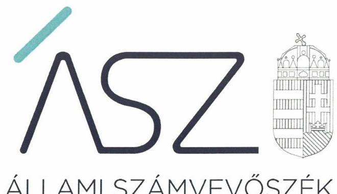
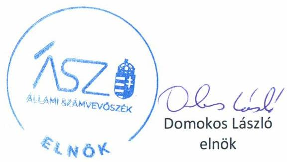
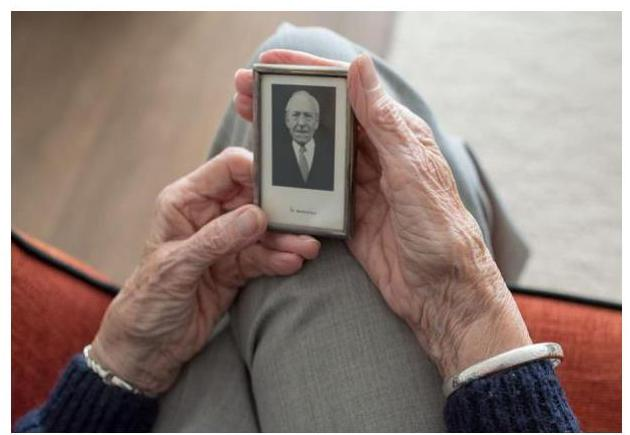

ÁLLAMI SZÁMVEVŐSZÉK

# JELENTÉS 

## Nem állami humánszolgáltatók ellenőrzése

A szociális humánszolgáltatást nyújtó intézmények, szolgáltatók államháztartáson kívüli fenntartói központi költségvetésből kapott támogatásai felhasználásának ellenőrzése Szépkorúak Háza Szociális Szolgáltató Közhasznú Nonprofit Korlátolt Felelősségű Társaság
2020.

20091
www.asz.hu

---

ÁLLAMI SZÁMVEVŐSZÉK

# JELENTÉS 

## Nem állami humánszolgáltatók ellenőrzése

A szociális humánszolgáltatást nyújtó intézmények, szolgáltatók államháztartáson kívüli fenntartói központi költségvetésből kapott támogatásai felhasználásának ellenőrzése Szépkorúak Háza Szociális Szolgáltató Közhasznú Nonprofit Korlátolt Felelősségű Társaság
2020. 05. hó 28. nap

20091
www.asz.hu

---

# AZ ELLENŐRZÉST FELÜGYELTE: 

MAROZSÁN LÁSZLÓNÉ felügyeleti vezető

## AZ ELLENŐRZÉST VEZETTE ÉS A VÉGREHAJTÁSÁÉRT FELELŐS:

KISS ISTVÁN GYÖRGY ellenőrzésvezető

## A PROGRAM ÖSSZEÁLLÍTÁSÁÉRT FELELŐS:

FEKETE-NAGY ANDRÁS ellenőrzési program készítéséért felelős vezető

TÓTPÁL SZABOLCS osztályvezető

IKTATÓSZÁM: EL-2705-001/2020.
TÉMASZÁM: 2491
ELLENŐRZÉS-AZONOSÍTÓ SZÁM: V083594, V0867126

---

# TARTALOMJEGYZÉK 

■ ÖSSZEGZÉS ..... 5
■ AZ ELLENŐRZÉS CÉLJA ..... 6
■ AZ ELLENŐRZÉS TERÜLETE ..... 7
■ AZ ELLENŐRZÉS HÁTTERE, INDOKOLTSÁGA ..... 8
■ A JELENTÉS LÉNYEGES KÉRDÉSKÖREI ..... 9
■ AZ ELLENŐRZÉS HATÓKÖRE ÉS MÓDSZEREI ..... 10
■ MEGÁLLAPÍTÁSOK ..... 12
■ MELLÉKLETEK ..... 13
I. sz. melléklet: Értelmező szótár ..... 13
■ FÜGGELÉK: ÉSZREVÉTELEK ..... 15
■ RÖVIDÍTÉSEK JEGYZÉKE ..... 17

---

.

---

# ÖSSZEGZÉS 

A miskolci székhelyű Szépkorúak Háza Szociális Szolgáltató Közhasznú Nonprofit Kft. szociális humánszolgáltatási közfeladat ellátására kapott költségvetési támogatásokkal való gazdálkodása a 2015-2018. években elszámoltatható volt, a támogatásokat szabályszerűen intézménye müködtetésére fordította. Az általa kapott közpénzek felhasználásának átláthatóságát azonban nem biztositotta.

## Az ellenőrzés társadalmi indokoltsága

A szociális gondoskodást igénylők védelme, illetve a köznevelési feladatok ellátása az Alaptörvényben meghatározott, a társadalom szempontjából fontos tevékenységek. Jogszabályok teszik lehetővé, hogy államháztartáson kívüli szervezetek - így például az egyházi fenntartók, alapítványok, gazdasági társaságok, egyesületek - által fenntartott intézmények is végezzenek köznevelési, szociális és gyermekvédelmi feladatokat. Mindehhez a központi költségvetés évente jelentős összegű támogatással járul hozzá. Az államháztartáson kívüli, humánszolgáltatást végző intézmények az igényelt közpénzekből társadalmilag hasznos, közösségteremtő, közérdekű, illetve közhasznú tevékenységet végeznek, illetve közfeladatokat látnak el.

Az intézményfenntartók ellenőrzésével az Állami Számvevőszék hozzájárul ahhoz, hogy ezen közpénzeket az államháztartáson kívüli szervezetek is ellenőrizhető, átlátható és elszámoltatható módon használják fel a közfeladatok ellátása során. Az ellenőrzések célja továbbá, hogy a nyilvánosság és az igénybevevők megfelelő tájékoztatást kapjanak az államháztartáson kívüli közfeladatot ellátók múködéséről.

Az ÁSZ ellenőrzései arra adnak választ, hogy az intézményfenntartók arra használták-e fel a közpénzeket, amire igényelték.

A szabályszerű gazdálkodás elengedhetetlen a közfeladat ellátás szakmai céljainak megvalósításához, valamint a társadalmi közbizalom fenntartásához.

## Főbb megállapítások, következtetések

A Szépkorúak Háza Szociális Szolgáltató Közhasznú Nonprofit Kft. a költségvetési támogatások célszerinti felhasználásáról a jogszabályok által előírt nyilvántartást vezette. A Szépkorúak Háza Szociális Szolgáltató Közhasznú Nonprofit Kft. éves számviteli beszámolóiban a kapott közpénzek cél szerint felhasználását nem mutatta be, így a nyilvánosság előtti elszámolási kötelezettségének nem tett eleget.

A Szépkorúak Háza Szociális Szolgáltató Közhasznú Nonprofit Kft. ügyvezetője az ellenőrzés idején intézkedést tett arra, hogy a 2019. évi számviteli beszámoló elkészítése során a jogszabályi előírások maradéktalanul érvényesüljenek.

---

# AZ ELLENŐRZÉS CÉLJA

**AZ ELLENŐRZÉS CÉLJA** annak értékelése volt, hogy a nem állami, nem önkormányzati szociális intézmények fenntartói központi költségvetésből kapott támogatásainak felhasználása szabályszerű volt-e.

---

# AZ ELLENŐRZÉS TERÜLETE 

## Szépkorúak Háza Szociális Szolgáltató Közhasznú Nonprofit Kft.

A Szépkorúak Háza Szociális Szolgáltató Közhasznú Nonprofit Kft.-t a Dr. Hilscher Rezső Szociális Közalapítvány a Miskolci Családokért alapította. A miskolci székhelyű Fenntartó ${ }^{1}$ átalakulással jött létre 2009. január 22-én.

A Fenntartó és Intézménye ${ }^{2}$ a múködés és gazdálkodás tekintetében nem különül el egymástól. A Fenntartó közhasznú fő tevékenysége az idősek, fogyatékosok bentlakásos ellátása mellett idős és demens személyek ellátása. További egyéb közhasznú tevékenysége az egészségmegőrzés, betegségmegelőzés, gyógyító-, egészségügyi rehabilitációs tevékenység, valamint a szociális tevékenység, családsegítés, időskorúak gondozása.

A Fenntartó az alaptevékenységen kívül vállalkozási tevékenységet az ellenőrzött időszakban a közhasznú céljainak megvalósítása érdekében folytatott, mint pl. étkeztetést, személyszállítást, oktatást, továbbképzést.

A Fenntartó legfőbb döntéshozó szerve az ellenőrzött időszakban a Taggyúlés ${ }^{3}$ volt. A Fenntartó képviseletére az ügyvezető volt jogosult, akinek személye az ellenőrzött időszakban nem változott.

Az Alapító okirat ${ }^{4}$ szerint a Fenntartó három tagból álló Felügyelő Bizottság létrehozásáról döntött, melynek feladata a Fenntartó múködésének ellenőrzése volt.

A Fenntartó a 2015-2018. években egy humánszolgáltatást végző intézményt múködtetett, melynek múködési engedélye ${ }^{5}$ alapján a férőhelyszáma 100 fő volt.

A Fenntartó részére a Kincstár ${ }^{6}$ adatai alapján a szociális közfeladat ellátásra folyósított költségvetési támogatások összege 2015. évben 75,6 M Ft, 2016. évben 90,4 M Ft, 2017. évben 95,0 M Ft és 2018. évben 102,1 M Ft volt.

---

# AZ ELLENŐRZÉS HÁTTERE, INDOKOLTSÁGA 

A szociális feladatokat ellátó nem állami intézményfenntartók részére közfeladataik ellátására évente jelentős összegű pénzügyi támogatást biztosítottak a mindenkori költségvetési törvények a bennük megfogalmazott feltételek mellett. A felhasználható állami támogatások a Kvtv.-ek7- szerint a 2015-2018. években a szociális ágazatra vonatkozóan 360 Mrd Ft előirányzatot határoztak meg.

Az ÁSZ ${ }^{8}$ a stratégiájában célul tűzte ki, hogy az államháztartáson kívülre nyújtott költségvetési támogatások ellenőrzésével hozzájárul ahhoz, hogy a közpénzeket az államháztartáson kívüli szervezetek is átlátható módon használják fel a közfeladatok szerződésben vállalt ellátása érdekében. Az ÁSZ stratégiájában foglaltak alapján is indokolt az ellenőrzés, amely a társadalom számára jelzi, hogy a közpénz államháztartáson kívüli felhasználása sem maradhat ellenőrizetlenül. Az államháztartáson kívülre nyújtott költségvetési támogatások ellenőrzésével az ÁSZ hozzájárul ahhoz, hogy a közpénzeket a nem állami humán fenntartók átlátható módon használják fel a közfeladatok ellátására kötött szerződésekben vállalt kötelezettségek teljesítése érdekében. Az ellenőrzés javaslataival hozzájárulhat az említett rendszerek szabályszerű támogatás felhasználásához, javíthatja a társa-dalmi-gazdasági döntések megalapozottságát, amely a „jól irányított állam múködésének" feltétele.

---

# A JELENTÉS LÉNYEGES KÉRDÉSKÖREI 

1. Az államháztartáson kívüli Fenntartó szabályszerű müködési és gazdálkodási környezet kialakításával megteremtette-e a költségvetési támogatások átlátható, elszámoltatható igénybevételének, felhasználásának feltételeit?
2. Az államháztartáson kívüli Fenntartó a szociális humánszolgáltató intézményei müködtetéséhez felhasznált közpénzeket szabályosan fordította-e intézményei müködtetésére, gazdálkodásával a nyilvánosság előtt elszámolt-e?

---

# AZ ELLENŐRZÉS HATÓKÖRE ÉS MÓDSZEREI 

## Az ellenőrzés típusa

Megfelelőségi ellenőrzés.

## Az ellenőrzött időszak

A 2015. január 1. és 2018. december 31. közötti időszak.

## Az ellenőrzés tárgya

Az ellenőrzés a szociális humánszolgáltatási közfeladatokat ellátó államháztartáson kívüli fenntartók humánszolgáltatási közfeladatai ellátásához a központi költségvetésből kapott támogatásaik humánszolgáltatási közfeladatokra való fenntartó általi felhasználása szabályszerűségének értékelésére terjedt ki.

## Az ellenőrzött szervezet

Szépkorúak Háza Szociális Szolgáltató Közhasznú Nonprofit Kft., mint intézményfenntartó.

## Az ellenőrzés jogalapja

Az ellenőrzés jogszabályi alapját az ÁSZ tv. ${ }^{9}$ 1. § (3) bekezdése, 5. § (3) bekezdésben foglalt előírások adják.

## Az ellenőrzés módszerei

Az ellenőrzést az ellenőrzési program annak szempontjai, kérdései, az ellenőrzött időszakban hatályos jogszabályok, a nemzetközi standardokat irányadónak tekintve, az ellenőrzés szakmai szabályok és módszertanok figyelembe vételével rendelte elvégezni. A közpénzekkel való felelős gazdálkodás segítésére irányuló javaslatok kidolgozásakor a hatályos jogszabályok az irányadóak.

Az ellenőrzés ideje alatt az ellenőrzött szervezettel történő kapcsolattartást az ÁSZ SZMSZ ${ }^{10}$-ének vonatkozó előírásai alapján biztosította az ÁSZ.

---

Az ellenőrzési kérdések megválaszolásához szükséges bizonyítékok megszerzése az ellenőrzött által rendelkezésre bocsátott dokumentumokra, adatokra alapozva megfigyelés, szemle (szemrevételezés), valamint elemző eljárással történt.

Az ellenőrzési bizonyítékként felhasználható adatforrások közé tartoztak egyrészt az ellenőrzési program részletes szempontjainál felsorolt adatforrások, másrészt minden - az ellenőrzés folyamán feltárt, az ellenőrzés szempontjából információt tartalmazó - dokumentum.

Az ellenőrzés lefolytatásához az ellenőrzött szervezet a kitöltött tanúsítványok, valamint az ÁSZ által kért dokumentumok elektronikus úton való megküldésével szolgáltatott adatokat, információkat. Az így rendelkezésre bocsátott adatok, információk és a tanúsítványok adatai valódiságának kontrollja az ellenőrzés keretében történt.

Az egységes értelmezést támogatja a program mellékletét képező fogalomtár és rövidítésjegyzék.

A szociális humánszolgáltatások központi költségvetési támogatásaival kapcsolatos, államháztartáson kívüli fenntartó jogszabályokban előírt feladatai betartását, továbbá a központi költségvetési támogatások szabályszerű nyilvántartását ellenőrizte az ÁSZ a Fenntartónál rendelkezésre álló nyilvántartások, beszámolók és egyéb dokumentumok alapján. Az ellenőrzés nem terjedt ki a szociális humánszolgáltatások központi költségvetési támogatásai igénylése, módosítása, elszámolása valódiságának, megalapozottságának, helyességének - sem a Fenntartónál, sem a székhely intézményeinél való - értékelésére (mivel ennek felülvizsgálata, ellenőrzése a finanszírozó jogszabályban előírt feladata határozatai kiadása előtt). Továbbá nem terjedt ki az ellenőrzés e források, intézmények általi szabályszerű felhasználásának értékelésére.

---

# MEGÁLLAPÍTÁSOK 

## 1. Az államháztartáson kívüli Fenntartó szabályszerű múködési és gazdálkodási környezet kialakításával megteremtette-e a költségvetési támogatások átlátható, elszámoltatható igénybevételének, felhasználásának feltételeit?

Összegző megállapítás A Fenntartó 2016. évtől alakította ki a szabályszerű múködési és gazdálkodási környezetet, amely a költségvetési támogatás igénybevételéhez és felhasználásához szükséges.

A Fenntartó az ellenőrzött időszakban rendelkezett Szervezeti és múködési szabályzattal ${ }^{11}$, az Intézmény Szakmai programmal ${ }^{12}$ és Házirenddel ${ }^{13}$.

A Fenntartó az ellenőrzött időszakban rendelkezett Eszközök és források értékelési szabályzatával ${ }^{14}$, az Eszközök és források leltárkészítési és leltározási szabályzatával ${ }^{15}$, valamint Számlarenddel ${ }^{16}$. A Fenntartó számlarendjében szabályozta az intézménye és feladatai jogszabályban előírt elkülönítésének végrehajtási módját. A Fenntartó nem rendelkezett Számviteli politikával ${ }^{17}$ 2015. évben és Pénzkezelési szabályzattal ${ }^{18}$ 2015-2016. években.

## 2. Az államháztartáson kívüli Fenntartó a szociális humánszolgáltató intézményei múködtetéséhez felhasznált közpénzeket szabályosan fordította-e intézményei múködtetésére, gazdálkodásával a nyilvánosság előtt elszámolt-e?

## Összegző megállapítás

A Fenntartó szociális feladathoz biztosított közpénzeket az intézménye múködtetésére fordította. A költségvetési támogatással a nyilvánosság előtt nem számolt el.

A Fenntartó a számviteli rendjében a szociális közfeladatokra kapott támogatásokat és azok Intézményen belüli egyes feladatai közötti felhasználását jogszabályok szerint elkülönítetten tartotta nyilván. A szabályszerű nyilvántartás alapján megállapítható volt, hogy a támogatást intézménye múködtetésére használta fel.

A Fenntartó képviseletére jogosult által aláírt számviteli beszámolók nem feleltek meg a jogszabályi előírásoknak, mivel kiegészítő mellékletei nem tartalmazták a költségvetési támogatások és azok felhasználásának jogcím szerinti kötelezően előírt bemutatását.

---

# MELLÉKLETEK 

- I. SZ. MELLÉKLET: ÉRTELMEZŐ SZÓTÁR
civil szervezet
ellátási terület
humánszolgáltatás
költségvetési támogatás
székhely intézmény
telephely
nem állami, nem önkormányzati (államháztartáson kívüli) intézmény fenntartó

A Civil tv*. 2. § 6. pontja szerint civil szervezet a civil társaság, a Magyarországon nyilvántartásba vett egyesület (a párt, a szakszervezet és a kölcsönös biztosító egyesület kivételével), a közalapítvány és a pártalapítvány kivételével az alapítvány.
Az a terület, ahonnan az engedélyes gyermekeket, illetve más ellátottakat fogad. (Szoctv ${ }^{19}$. Gyvt. ${ }^{20}$ )
Külön törvényben meghatározott szociális, gyermekjóléti, gyermekvédelmi, közoktatási, felsőoktatási, kulturális közfeladatok (2015. évi Kvtv. 43. § (1), (4) bekezdés, 1. számú melléklet XX/20/2/3. jogcím csoport, 19. alcím, 2016. évi Kvtv. 41. § (1), (4) bekezdés, 1. számú melléklet XX/20/2/3. jogcím csoport, 19. alcím, 2017. évi Kvtv. 41. § (1), (4) bekezdés, 1. számú melléklet XX/20/2/3. jogcím csoport, 19. alcím)
a társadalombiztosítás pénzügyi alapjai kivételével az államháztartás központi alrendszeréből ellenérték nélkül, pénzben nyújtott támogatások, ide nem értve
f) a szociális igazgatásról és szociális ellátásokról szóló törvény, valamint a gyermekek védelméről és a gyámügyi igazgatásról szóló törvény szerinti pénzbeli és természetbeni szociális és gyermekvédelmi ellátásokat (Áht. ${ }^{21}$ 1. § 14. pont)
A költségvetési törvényben (2016. évi XC. törvény 40. §) megállapított támogatás többek között: Átlagbéralapú támogatást állapít meg a nevelési-oktatási, valamint pedagógiai szakszolgálati intézményt fenntartó nemzetiségi önkormányzat, az egyházi és magán köznevelési intézmény fenntartója részére az általuk fenntartott nevelési-oktatási intézményben, továbbá pedagógiai szakszolgálati intézményben pedagógus és - a (3) bekezdés kivételével - a nevelő-oktató munkát közvetlenül segítő munkakörben foglalkoztatottak után a 7. melléklet I. pontjában meghatározott jogosultak után, az őket ott megillető mértékek szerint. Múködési támogatást állapít meg a nemzetiségi önkormányzat vagy az egyházi jogi személy által fenntartott nevelési-oktatási intézményekben ellátott, továbbá a pedagógiai szakszolgálati intézményekben gyógypedagógiai tanácsadásban, korai fejlesztésben, oktatásban és gondozásban, valamint a fejlesztő nevelésben részt vevő gyermekekre, tanulókra tekintettel a nemzetiségi önkormányzat és a bevett egyház részére a 7. melléklet II. pontja szerint.
a szolgáltató székhelye, azaz a szolgáltató központi ügyintézésének helye, függetlenül attól, hogy használják-e szolgáltatás nyújtására (Sznyvhr. ${ }^{22}$ 1.§ k) pont) (hatályos: 2013. december 1-től)
a szolgáltató székhelyétől különböző, szolgáltató/intézmény használatában álló hely, a szociális humánszolgáltatáshoz használt, bejegyzett hely. (Sznyvhr. 1.§ I) pont) (hatályos: 2015. január 1-től)

A köznevelési közfeladatokat/humánszolgáltatásokat ellátó intézményt fenntartó egyházi jogi személy, társadalmi szervezet, alapítvány, közalapítvány, civil szervezet, országos nemzetiségi önkormányzat, nonprofit gazdasági társaság, gazdasági társaság és a humánszolgáltatást alaptevékenységként végző, Szja tv. ${ }^{23}$ hatálya alá tartozó egyéni vállalkozó.
(2015. évi Kvtv. 43. § (1) bekezdés, 2016. évi Kvtv. 41. § (1), bekezdés, 2017. évi Kvtv. 41. § (1) bekezdés)

[^0]
[^0]:    * Előzmény törvények, amelyeket az ellenőrzött időszak miatt figyelembe kell venni: egyesülési jogról szóló 1989. évi II. tv, a közhasznú szervezetekről szóló 1997. évi CLVI. tv.

---

.

---

# FÜGGELÉK: ÉSZREVÉTELEK 

A jelentéstervezetet a Számvevőszék 15 napos észrevételezésre megküldte az ellenőrzött szervezet vezetőjének az ÁSZ tv. 29. § ${ }^{\dagger}$ (1) bekezdése előírásának megfelelően.

A Szépkorúak Háza Szociális Szolgáltató Közhasznú Nonprofit Kft. ügyvezetője a jelentéstervezet megállapításaira írásban észrevételt tett.
Az ÁSZ tv. 29. § (3) bekezdésével összhangban az ÁSZ a Függelékben feltünteti az ellenőrzés megállapításaival kapcsolatban tett, figyelembe nem vett észrevételeket, és megindokolja, hogy azokat miért nem fogadta el.

A „Nem állami humánszolgáltatók ellenőrzése - A szociális humánszolgáltatást nyújtó intézmények, szolgáltatók államháztartáson kívüli fenntartói központi költségvetésből kapott támogatásai felhasználásnak ellenőrzése Szépkorúak Háza Szociális Szolgáltató Közhasznú Nonprofit Korlátolt Felelősségű Társaság" címmel készített számvevőszéki jelentéstervezet megállapításaival kapcsolatban az ügyvezető által tett 2020.április 16-i keltezésű észrevétel és kezelésének indokolása.

## A jelentéstervezet 1. számú megállapítás 2. bekezdés 3. mondatára vonatkozó észrevétel:

Az ügyvezető észrevétele szerint az ellenőrzött évekre vonatkozóan a 2015. évi Számviteli politika és a 2015-2016. évi Pénzkezelési Szabályzat rendelkezésükre áll, másolatukat az észrevételhez csatoltan megküldte. A szabályzatok eredeti példányai szükség esetén irattárukban megtekinthetők.
Az ÁSZ tájékoztatta az ügyvezetőt, hogy az ellenőrzés során az ÁSZ kizárólag az adatszolgáltatásra rendelkezésre álló - az ÁSZ tv. 28. § (2) bekezdés szerinti - határidőn belül beérkezett dokumentumokat veszi figyelembe. A törvényes határidőn túl megküldött dokumentumokat - így az ügyvezető levele mellékleteként megküldött dokumentumokat - az ÁSZ nem értékeli.

Az ÁSZ tv. 28. § (2) bekezdése szerint, a közreműködésre felhívott szervezet az ÁSZ részére - annak kérésére soron kívül, de legkésőbb öt munkanapon belül - az ellenőrzés tervezhetősége, meghatározása, illetve lefolytatása érdekében szükséges adatokat és dokumentumokat rendelkezésre bocsátja, illetve a kapcsolódó tájékoztatást köteles megadni. Az ügyvezető a 2015-2017. évekre vonatkozó, EL-1215-001/2018. iktatószámú adatbekérő levélre 2019. január 21-én kelt teljességi és hitelességi nyilatkozattal alátámasztottan a 2016. január 1-jétől hatályos számviteli politikát, illetve 2017. január 1-jétől hatályos pénzkezelési szabályzatot bocsátotta az ellenőrzés rendelkezésére. Az ÁSZ 2019. október 15-ei helyszíni adatbetekintése során - a felvett jegyzőkönyv és annak mellékletét képező nemleges teljességi és hitelességi nyilatkozata szerint - az ügyvezető arról tájékoztatta a jelenlevő számvevőket, hogy a 2015. évben hatályos számviteli politikával és a 2015-2016. évben hatályos pénzkezelési szabályzattal nem rendelkeznek. Az észrevételt a leírt indokokra tekintettel az ÁSZ nem fogadta el, a jelentéstervezet módosítása nem indokolt.

[^0]
[^0]:    ${ }^{+}$29. § (1) Az Állami Számvevőszék az ellenőrzési megállapításait megküldi az ellenőrzött szervezet vezetőjének vagy az általa megbízott személynek, és annak, akinek személyes felelősségét állapította meg.
    (2) Az ellenőrzött szervezet vezetője és a felelősként megjelölt személy az ellenőrzés megállapításaira tizenöt napon belül írásban észrevételt tehet.
    (3) Az Állami Számvevőszék az észrevételre a beérkezésétől számított harminc napon belül írásban válaszol. A figyelembe nem vett észrevételeket köteles a jelentésben feltüntetni, és megindokolni, hogy azokat miért nem fogadta el.

---

.

---

# RÖVIDÍTÉSEK JEGYZÉKE 

${ }^{1}$ Fenntartó
${ }^{2}$ Intézmény
${ }^{3}$ Taggyúlés
${ }^{4}$ Alapító okirat
${ }^{5}$ Működési engedély
${ }^{6}$ Kincstár
${ }^{7}$ Kvtv.-ek
${ }^{8}$ ÁSZ
${ }^{9}$ ÁSZ tv.
${ }^{10}$ ÁSZ SZMSZ
${ }^{11}$ Szervezeti és múködési szabályzat
${ }^{12}$ Szakmai program
${ }^{13}$ Házirend
${ }^{14}$ Értékelési szabályzat
${ }^{15}$ Leltárkészítési és leltározási szabályzat
${ }^{16}$ Számlarend
${ }^{17}$ Számviteli politika

Szépkorúak Háza Szociális Szolgáltató Közhasznú Nonprofit Kft.
Szépkorúak Háza Idősek Otthona nevű intézmény (székhely és az Intézmény feladat ellátási helye: Miskolc Eperjesi u.5.)
Szépkorúak Háza Szociális Szolgáltató Közhasznú Nonprofit Kft. Taggyúlése
Szépkorúak Háza Szociális Szolgáltató Közhasznú Nonprofit Kft. Alapító okirata egységes szerkezetben a 2014. június 23. napi módosítással bezárólag.
BOC/01/227-11/2014. határozat a Szépkorúak Háza Idősek Otthona és Támogató szolgálat adatmódosítási ügye.
Magyar Államkincstár
Magyarország 2015. évi központi költségvetéséről szóló 2014. évi C. törvény (hatályos: 2015. január 1. és 2018. december 31. között)
Magyarország 2016. évi központi költségvetéséről szóló 2015. évi C. törvény (hatályos: 2016. január 1. és 2019. december 31. között)
Magyarország 2017. évi központi költségvetéséről szóló 2016. évi XC. törvény (hatályos: 2016. november 1-től.)
Magyarország 2018. évi központi költségvetéséről szóló 2017. évi C. törvény (hatályos 2017.november 1.-től)
Állami Számvevőszék
az Állami Számvevőszékről szóló 2011. évi LXVI. törvény (hatályos: 2011. július 1-től)
Állami Számvevőszék Szervezeti és Működési Szabályzata
Szépkorúak Háza Szociális Szolgáltató Közhasznú Nonprofit Kft. Szervezeti és Múködési Szabályzat (Hatályos 2013. október 1-től-2017. január 31-ig)
Szépkorúak Háza Szociális Szolgáltató Közhasznú Nonprofit Kft. Szervezeti és Múködési Szabályzat (hatályos: 2017. február 1-től)
Szociális Szolgáltató Közhasznú Nonprofit Kft. Szépkorúak Háza Idősek Otthona Szakmai program (hatályos 2012.július 11-től, (és módosításai) 2017. január 23-ig)
Szociális Szolgáltató Közhasznú Nonprofit Kft. Szépkorúak Háza Idősek Otthona Szakmai program (hatályos 2017.január 24-től)
Szociális Szolgáltató Közhasznú Nonprofit Kft. Szépkorúak Háza Idősek Otthona Házirend (hatályos 2012. július 11-től- 2017 január 23-áig)
Szociális Szolgáltató Közhasznú Nonprofit Kft. Szépkorúak Háza Idősek Otthona Házirend (hatályos 2017. január 24-től)
Szépkorúak Háza Szociális Szolgáltató Közhasznú Nonprofit Kft. Eszközök és források értékelési szabályzata (hatályos 2012. augusztus 1-től)
Szépkorúak Háza Szociális Szolgáltató Közhasznú Nonprofit Kft. Leltározási és leltárkészítési szabályzat (hatályos 2012. augusztus 1-től)
Szépkorúak Háza Szociális Szolgáltató Közhasznú Nonprofit Kft. Számlarend (hatályos 2015. január 1-től)
Szépkorúak Háza Szociális Szolgáltató Közhasznú Nonprofit Kft Számviteli politika (hatályos 2016. január 1-től)

---

${ }^{18}$ Pénzkezelési szabályzat
${ }^{19}$ Szoctv.
${ }^{20}$ Gyvt.
${ }^{21}$ Áht.
${ }^{22}$ Sznyvhr.
${ }^{23}$ Szja tv.

Szépkorúak Háza Szociális Szolgáltató Közhasznú Nonprofit Kft. Pénzkezelési szabályzat (hatályos 2017. január 1-től)
1993. évi III. törvény a szociális igazgatásról és szociális ellátásokról (hatályos 1993. február 26-ától)
1997. évi XXXI. törvény a gyermekek védelméről és a gyámügyi igazgatásról (hatályos: 1997. november 1-jétől)
2011. évi CXCV. törvény az államháztartásról (hatályos: 2011. december 31-étől) 369/2013. (X. 24.) Korm. rendelet a szociális, gyermekjóléti és gyermekvédelmi szolgáltatók, intézmények és hálózatok hatósági nyilvántartásáról és ellenőrzéséről (hatályos: 2013. december 1-jétől)
1995. évi CXVII. törvény a személyi jövedelemadóról (hatályos: 1996. január 1-jétől)

---

# ASZ 

ALLAMI SZAMVEVOSZEK
1052 Budapest, Apáczai Cs. J. u. 10. I 1364 Budapest 4. Pf. 54 TEL: +36 14849100
email: szamvevoszek@asz.hu
web: www.asz.hu | www.aszhirportal.hu