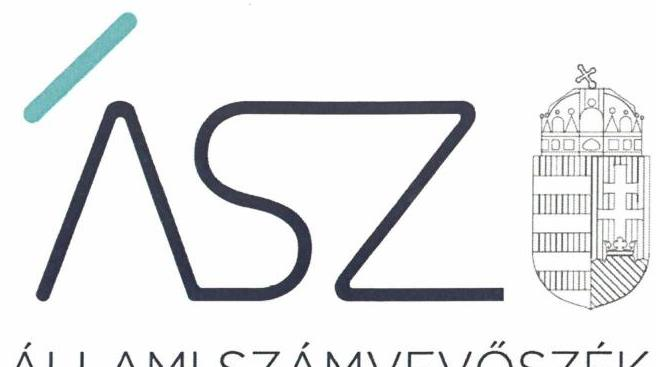
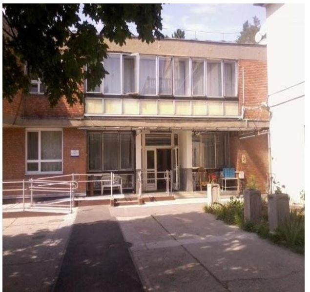

ÁLLAMI SZÁMVEVŐSZÉK

# JELENTÉS 

## Nem állami humánszolgáltatók ellenőrzése

A szociális humánszolgáltatást nyújtó intézmények, szolgáltatók államháztartáson kívüli fenntartói központi költségvetésből kapott támogatásai felhasználásának ellenőrzése -

CAT-OTTHON Szociális Gondozó és Ellátó Nonprofit Korlátolt Felelősségű Társaság
2020.

20092
www.asz.hu

---

ÁLLAMI SZÁMVEVŐSZÉK

# JELENTÉS 

## Nem állami humánszolgáltatók ellenőrzése

A szociális humánszolgáltatást nyújtó intézmények, szolgáltatók államháztartáson kívüli fenntartói központi költségvetésből kapott támogatásai felhasználásának ellenőrzése -CAT-OTTHON Szociális Gondozó és Ellátó Nonprofit Korlátolt Felelősségű Társaság
2020. OC hó 25 nap

20092
www.asz.hu

---

# AZ ELLENŐRZÉST FELÜGYELTE: 

KAKAS SÁNDOR felügyeleti vezető

## AZ ELLENŐRZÉST VEZETTE ÉS A VÉGREHAJTÁSÁÉRT FELELŐS:

GALBÁTS KATALIN ellenőrzésvezető
HUDÁK KATALIN ellenőrzésvezető
SZUDI FERENCNÉ ellenőrzésvezető

## A PROGRAM ÖSSZEÁLLÍTÁSÁÉRT FELELŐS:

FEKETE-NAGY ANDRÁS GÁBOR ellenőrzési programért felelős vezető

TÓTPÁL SZABOLCS osztályvezető

Jelentéseink az Országgyúlés számítógépes hálózatán és az interneten a www.asz.hu címen is olvashatóak.

IKTATÓSZÁM: EL-2706-001/2020.
TÉMASZÁM: 2491
ELLENŐRZÉS-AZONOSÍTÓ SZÁM: V083545; V0867077

---

# TARTALOMJEGYZÉK 

■ ÖSSZEGZÉS ..... 5
■ AZ ELLENŐRZÉS CÉLJA ..... 7
■ AZ ELLENŐRZÉS TERÜLETE ..... 8
■ AZ ELLENŐRZÉS HÁTTERE, INDOKOLTSÁGA ..... 9
■ A JELENTÉS LÉNYEGES KÉRDÉSKÖREI ..... 10
■ AZ ELLENŐRZÉS HATÓKÖRE ÉS MÓDSZEREI ..... 11
■ MEGÁLLAPÍTÁSOK ..... 13
■ JAVASLATOK ..... 15
■ MELLÉKLETEK ..... 17
I. sz. melléklet: Értelmező szótár ..... 17
■ FÜGGELÉK: ÉSZREVÉTELEK ..... 19
■ RÖVIDÍTÉSEK JEGYZÉKE ..... 21

---

.

---

# ÖSSZEGZÉS 

A telki székhelyű CAT-OTTHON Szociális Gondozó és Ellátó Nonprofit Korlátolt Felelősségű Társaság, mint intézményfenntartó nem biztosította a 2015-2017. években a humánszolgáltatási közfeladathoz a központi költségvetésből kapott támogatások ellenőrizhetőségét. A 2018. évben a közfeladatra kapott központi költségvetési támogatások felhasználásának elszámoltathatóságát és átláthatóságát biztosította.

## Az ellenőrzés társadalmi indokoltsága

A szociális gondoskodást igénylők védelme, illetve a köznevelési feladatok ellátása az Alaptörvényben meghatározott, a társadalom szempontjából fontos tevékenységek. Jogszabályok teszik lehetővé, hogy államháztartáson kívüli szervezetek - így például az egyházi fenntartók, alapítványok, gazdasági társaságok, egyesületek - által fenntartott intézmények is végezzenek köznevelési, szociális és gyermekvédelmi feladatokat. Mindehhez a központi költségvetés évente jelentős összegű támogatással járul hozzá. Az államháztartáson kívüli, humánszolgáltatást végző intézmények az igényelt közpénzekből társadalmilag hasznos, közösségteremtő, közérdekű, illetve közhasznú tevékenységet végeznek, illetve közfeladatokat látnak el.

Az intézményfenntartók ellenőrzésével az Állami Számvevőszék hozzájárul ahhoz, hogy ezen közpénzeket az államháztartáson kívüli szervezetek is ellenőrizhető, átlátható és elszámoltatható módon használják fel a közfeladatok ellátása során. Az ellenőrzések célja továbbá, hogy a nyilvánosság és az igénybevevők megfelelő tájékoztatást kapjanak az államháztartáson kívüli közfeladatot ellátók múködéséről.

Az ÁSZ ellenőrzései arra adnak választ, hogy az intézményfenntartók arra használták-e fel a közpénzeket, amire igényelték. A szabályszerű gazdálkodás elengedhetetlen a közfeladat ellátás szakmai céljainak megvalósításához, valamint a társadalmi közbizalom fenntartásához.

## Főbb megállapítások, következtetések, javaslatok

A CAT-OTTHON Szociális Gondozó és Ellátó Nonprofit Korlátolt Felelősségű Társaság a 2015-2017. években teljesített bevételeit és kiadásait számviteli nyilvántartásaiban - átlagos szintű, demens, gondozóház feladatonként - megbontotta, azonban a nyilvántartás a saját és a nem önállóan gazdálkodó egy szociális intézménye gazdálkodásának elkülönített kezelését nem biztosította. A CAT-OTTHON Szociális Gondozó és Ellátó Nonprofit Korlátolt Felelősségű Társaság, mint szociális humánszolgáltató közfeladatot ellátó intézmény fenntartója a 2015-2017. években a szociális humánszolgáltatási közfeladat ellátására kapott költségvetési támogatás felhasználásának a Számv. tv. ${ }^{1} 161 / A$ § (2) bekezdésében előírt ellenőrizhetőségét nem biztosította. Mivel az Atr. ${ }^{2} 16 . \S$ (1) bekezdésében foglalt szabályozás ellenére nem gondoskodott arról, hogy a költségvetési támogatások felhasználásának, a Fenntartó és a nem önállóan gazdálkodó intézménye gazdálkodásának elkülönített, ezen belül feladatonkénti bontásban történő elszámolására az adatok rendelkezésre álljanak.

A Fenntartó mindezek alapján az Alaptörvény 39. cikk (2) bekezdésében foglaltak ellenére a 2015-2017. években felhasznált közpénzekre vonatkozó gazdálkodása átláthatóságát nem biztosította. Ezáltal a Fenntartó nem igazolta, hogy a közpénzt a szociális humánszolgáltatási közfeladatra fordította.

A CAT-OTTHON Szociális Gondozó és Ellátó Nonprofit Kft. a 2018. évben múködési- és gazdálkodási környezetét szabályszerűen alakította ki, ezáltal megteremtette a közfeladathoz biztosított költségvetési támogatások elszámoltatható felhasználásának feltételeit.

A CAT-OTTHON Szociális Gondozó és Ellátó Nonprofit Kft. a 2018. évi számviteli nyilvántartásában feladatonkénti bontásban elkülönítette a saját és Intézménye gazdálkodásával és a költségvetési támogatás felhasználásával összefüggő tételeket. A 2018. évi egyszerűsített éves beszámoló és közhasznúsági jelentés nyilvánosságát biztosította.

---

Az Állami Számvevőszék a CAT-OTTHON Szociális Gondozó és Ellátó Nonprofit Korlátolt Felelősségű Társaság ügyvezetőjének egy javaslatot fogalmazott meg. A javaslatot megalapozó megállapításra az érintettnek 30 napon belül intézkedési tervet kell készítenie.

---

# AZ ELLENŐRZÉS CÉLJA

**AZ ELLENŐRZÉS CÉLJA** annak értékelése volt, hogy a nem állami, nem önkormányzati szociális intézmények fenntartói központi költségvetésből kapott támogatásainak felhasználása szabályszerű volt-e.

---

# **AZ ELLENŐRZÉS TERÜLETE**

## **CAT-OTTHON Szociális Gondozó és Ellátó Nonprofit Korlátolt Felelősségű Társaság**

A telki székhelyű CAT-OTTHON Szociális Gondozó és Ellátó Nonprofit Korlátolt Felelősségű Társaságot (továbbiakban: Fenntartó³) a Cégbíróság 2009. június 3-án jegyezte be, amelynek legfőbb szerve a taggyűlés volt és a működés és gazdálkodás ellenőrzésére három tagból álló Felügyelő Bizottságot hoztak létre. A Fenntartó képviseletét az ügyvezető látta el, akinek a személyében nem történt változás az ellenőrzött időszakban.

A Fenntartó a 2015-2018. években közhasznú jogállású volt, közhasznú tevékenységet a szociális ellátáshoz, az időskorúakról való gondoskodáshoz kapcsolódóan Idősek Otthona Intézményén⁴ keresztül látta el, melyet a Fenntartó székhelyétől elkülönült telephelyen, Budapest III. kerületében működtetett. Az Intézmény nem önállóan gazdálkodó volt.

Az Intézményben ellátási szerződés alapján az ápoló-gondozó otthoni ellátás keretében 92 fő, az átmeneti elhelyezést biztosító ellátások keretében 8 fő számára biztosítottak férőhelyet. A Fenntartó a 2015-2018. években vállalkozási tevékenységet nem folytatott.

A Fenntartó az átvállalt szociális közfeladatra a központi költségvetésből a Magyar Államkincstár adatszolgáltatása alapján a 2015. évben 72,9 millió Ft, a 2016. évben 77,3 millió Ft, a 2017. évben 90,6 millió Ft, a 2018. évben 108,5 millió Ft támogatásban részesült.

---

# AZ ELLENŐRZÉS HÁTTERE, INDOKOLTSÁGA 

A szociális feladatokat ellátó nem állami intézményfenntartók részére közfeladataik ellátására évente jelentős összegű pénzügyi támogatást biztosítottak a mindenkori költségvetési törvények a bennük megfogalmazott feltételek mellett. A felhasználható állami támogatások a Kvtv. ${ }_{1-4}{ }^{5}$-ekben a 2015-2018. években a szociális ágazatra vonatkozóan 360 Mrd Ft előirányzatot határoztak meg.

Az ÁSZ ${ }^{6}$ a stratégiájában célul tűzte ki, hogy az államháztartáson kívülre nyújtott költségvetési támogatások ellenőrzésével hozzájárul ahhoz, hogy a közpénzeket az államháztartáson kívüli szervezetek is átlátható módon használják fel a közfeladatok szerződésben vállalt ellátása érdekében. Az ÁSZ stratégiájában foglaltak alapján is indokolt az ellenőrzés, amely a társadalom számára jelzi, hogy a közpénz államháztartáson kívüli felhasználása sem maradhat ellenőrizetlenül. Az államháztartáson kívülre nyújtott költségvetési támogatások ellenőrzésével az ÁSZ hozzájárul ahhoz, hogy a közpénzeket a nem állami humán fenntartók átlátható módon használják fel a közfeladatok ellátására kötött szerződésekben vállalt kötelezettségek teljesítése érdekében. Az ellenőrzés javaslataival hozzájárulhat az említett rendszerek szabályszerű támogatás felhasználásához, javíthatja a társa-dalmi-gazdasági döntések megalapozottságát, amely a „jól irányított állam" múködéséhez járul hozzá.

---

# A JELENTÉS LÉNYEGES KÉRDÉSKÖREI 

1.     - A szociális humánszolgáltatási közfeladatot ellátó államháztartáson kívüli fenntartó szabályszerű müködési - és gazdálkodási környezet kialakításával megteremtette-e a költségvetési támogatások átlátható, elszámoltatható igénybevételének, felhasználásának feltételeit?
2.     - Az államháztartáson kívüli fenntartó az átvállalt szociális humánszolgáltatási közfeladathoz biztosított költségvetési támogatásokat szabályszerűen fordította-e a humánszolgáltató intézménye müködtetésére?
3.     - Az államháztartáson kívüli fenntartó a szociális humánszolgáltató intézménye müködtetéséhez felhasznált közpénzekre vonatkozó gazdálkodásával a nyilvánosság előtt elszámolt-e, ennek érdekében ellenőrzési, értékelési és a külső ellenőrzésekkel kapcsolatos intézkedési feladatait szabályszerűen látta-e el?

---

# AZ ELLENŐRZÉS HATÓKÖRE ÉS MÓDSZEREI 

## Az ellenőrzés típusa

Megfelelőségi ellenőrzés.

## Az ellenőrzött időszak

A 2015. január 1-je és 2018. december 31-e közötti időszak. A helyszíni szemle tekintetében 2019. január 1-jétől az utolsó helyszíni szemle időpontjáig, 2019. május 22-éig tartó időszak.

## Az ellenőrzés tárgya

Az ellenőrzés a szociális humánszolgáltatási közfeladatokat ellátó államháztartáson kívüli fenntartók humánszolgáltatási közfeladatai ellátásához a központi költségvetésből kapott támogatásaik humánszolgáltatási közfeladatokra való fenntartó általi felhasználása szabályszerűségének értékelésére terjedt ki.

## Az ellenőrzött szervezet

CAT-OTTHON Szociális Gondozó és Ellátó Nonprofit Korlátolt Felelősségű Társaság

## Az ellenőrzés jogalapja

Az ellenőrzés jogszabályi alapját az ÁSZ tv. 1. § (3) bekezdése, 5. § (3) bekezdésben foglalt előírások adták.

## Az ellenőrzés módszerei

Az ellenőrzést az ellenőrzési program annak szempontjai, kérdései, az ellenőrzött időszakban hatályos jogszabályok, a nemzetközi standardokat irányadónak tekintve, az ellenőrzés szakmai szabályok és módszertanok figyelembe vételével rendelte elvégezni. A közpénzekkel való felelős gazdálkodás segítésére irányuló javaslatok kidolgozásakor a hatályos jogszabályok az irányadóak.

Az ellenőrzés ideje alatt az ellenőrzött szervezettel történő kapcsolattartást az ÁSZ SZMSZ ${ }^{7}$-ének vonatkozó előírásai alapján biztosította az ÁSZ.

---

Az ellenőrzési kérdések megválaszolásához szükséges bizonyítékok megszerzése az ellenőrzött által rendelkezésre bocsátott dokumentumokra, adatokra alapozva megfigyelés, szemle (szemrevételezés), kérdésfeltevés (információkérés), valamint elemző eljárással történt.

Az ellenőrzési bizonyítékként felhasználható adatforrások közé tartoznak egyrészt az ellenőrzési program részletes szempontjainál felsorolt adatforrások, másrészt minden - az ellenőrzés folyamán feltárt, az ellenőrzés szempontjából információt tartalmazó - dokumentum.

Az ellenőrzés lefolytatásához az ellenőrzött szervezet a kitöltött tanúsítványok, valamint az ÁSZ által kért dokumentumok elektronikus úton való megküldésével szolgáltatott adatokat, információkat. Az így rendelkezésre bocsátott adatok, információk és a tanúsítványok adatai valódiságának kontrollja az ellenőrzés keretében történt. A fenntartott intézménynél helyszíni szemle keretében győződött meg az ÁSZ a tényleges feladatellátásról (verifikáció).

A szociális humánszolgáltatások központi költségvetési támogatásai igénylésével, módosításával, elszámolásával kapcsolatos, államháztartáson kívüli fenntartó jogszabályokban előírt feladatai betartását, továbbá a központi költségvetési támogatások szabályszerű kezelését, nyilvántartását ellenőrizte az ÁSZ a fenntartónál, az ott rendelkezésre álló határozatok, nyilvántartások, beszámolók és egyéb dokumentumok alapján. Az ellenőrzés nem terjedt ki a szociális humánszolgáltatások központi költségvetési támogatásai igénylése, módosítása, elszámolása valódiságának, megalapozottságának, helyességének-sem a fenntartónál, sem a székhely intézményeinél való - értékelésére (mivel ennek felülvizsgálata, ellenőrzése a finanszírozó jogszabályban előírt feladata, határozatai kiadása előtt). Továbbá nem terjedt ki az ellenőrzés e források, intézmények általi szabályszerű felhasználásának értékelésére.

---

# MEGÁLLAPÍTÁSOK 

## 1. A szociális humánszolgáltatási közfeladatot ellátó államháztartáson kívüli fenntartó szabályszerű múködési - és gazdálkodási környezet kialakításával megteremtette-e a költségvetési támogatások átlátható, elszámoltatható igénybevételének, felhasználásának feltételeit?

Összegző megállapítás A Fenntartó a 2018. évben kialakította a szabályszerű múködési és gazdálkodási környezetet.

A FENNTARTÓ ALAPÍTÁSÁRÓL a Ptk.-ban ${ }^{8}$ előírtaknak megfelelően Társasági szerződés ${ }^{9}$-ben rendelkeztek, mely tartalmazta szervezetét és múködési szabályait, a felelősségi köröket, valamint a közhasznú jogálláshoz szükséges rendelkezéseket. A Fenntartó a 2018. évben a közfeladat ellátására vonatkozó ellátási szerződéssel rendelkezett.

A Fenntartó a 2018. évben Számviteli politikáját ${ }^{10}$ és az annak keretében elkészítendő szabályzatokat a jogszabályi előírásnak megfelelően elkészítette, számlarendet a Számv. tv. 161. § (1) bekezdés előírása ellenére nem állított össze. A Számviteli politikában az Atr. előírásának megfelelően meghatározta feladatonkénti (átlagos szintű, demens, gondozóház) bontásban a költségvetési támogatás, a térítési díj bevétel és az egyéb bevétel felhasználásának, továbbá a gazdálkodás - fenntartói cél, illetve feladat-ellátási célok szerinti - elkülönített nyilvántartásának szabályait.

A Fenntartó a 2018. évben gondoskodott az Intézmény SZMSZ ${ }^{11}$-ének, Szakmai programjának ${ }_{1,2}{ }^{12}$, Házirendjének ${ }_{1,2}{ }^{13}$ elkészítéséről, valamint meghatározta a kérhető térítési és gondozási díj megállapításának szabályait és a térítési díjak összegeit, megfelelve a Szoc. tv. ${ }^{14}$-ben foglaltaknak.

## 2. Az államháztartáson kívüli fenntartó az átvállalt szociális humánszolgáltatási közfeladathoz biztosított költségvetési támogatásokat szabályszerűen fordította-e a humánszolgáltató intézménye múködtetésére?

Összegző megállapítás A Fenntartó a szociális humánszolgáltatási közfeladat ellátására biztosított költségvetési támogatásokat a 2018. évben az Intézménye múködtetésére fordította.

A TÁMOGATÁSOK FELHASZNÁLÁSÁNAK átláthatóságát a 2018. évben a Fenntartó az Atr.-ben előírtak szerint biztosította, mivel a saját és Intézménye gazdálkodását és a támogatás felhasználását a

---

számviteli nyilvántartásában feladatonkénti bontásban, elkülönítetten kezelte.

# 3. Az államháztartáson kívüli fenntartó a szociális humánszolgáltató intézménye múködtetéséhez felhasznált közpénzekre vonatkozó gazdálkodásával a nyilvánosság előtt elszámolt-e, ennek érdekében ellenőrzési, értékelési és a külső ellenőrzésekkel kapcsolatos intézkedési feladatait szabályszerűen látta-e el? 

Összegző megállapítás A Fenntartó a 2018. évben felhasznált közpénzekre vonatkozó gazdálkodásával elszámolt.

A TAGGYŰLÉS ÁLTAL JÓVÁHAGYOTT 2018. évi egyszerűsített éves beszámolót a Fenntartó a közhasznúsági melléklettel és könyvvizsgálói jelentéssel együtt a Számv. tv. és a Civil tv. előírásai szerint letétbe helyezte és közzétette.

2018-ban a Kormányhivatal ${ }^{15}$ közegészség- és járványügyi ellenőrzést végzett az Intézménynél, amellyel kapcsolatban a Fenntartónak intézkedési feladata nem merült fel.

---

# JAVASLATOK 

Az ÁSZ tv. 33. § (1) bekezdésében foglaltak értelmében az ellenőrzött szervezet vezetője köteles a jelentésben foglalt megállapításokhoz kapcsolódó intézkedési tervet összeállítani és azt a jelentés kézhezvételétől számított 30 napon belül az ÁSZ részére megküldeni. Amennyiben az ellenőrzött szervezet vezetője nem küldi meg határidőben az intézkedési tervet, vagy továbbra sem elfogadható intézkedési tervet küld, az Állami Számvevőszék elnöke az ÁSZ tv. 33. § (3) bekezdése a) és b) pontjaiban foglaltakat érvényesítheti.

## a CAT-OTTHON Szociális Gondozó és Ellátó Nonprofit Korlátolt Felelősségű Társaság ügyvezetőjének

1. Gondoskodjon a számlarend elkészitéséről a jogszabályi előirás szerint.
(1. megállapítás 2. bekezdés 1. mondat 2. tagmondata alapján)

---

.

---

# MELLÉKLETEK 

- I. SZ. MELLÉKLET: ÉRTELMEZŐ SZÓTÁR
költségvetési támogatás
a társadalombiztosítás pénzügyi alapjai kivételével az államháztartás központi alrendszeréből ellenérték nélkül, pénzben nyújtott támogatások (Áht. 1. § 14. pont) A költségvetési törvényekben (2014. évi C. törvény 42-43.§, 2015. évi C. törvény 40-41.§, 2016. évi XC. törvény 40-41.§) megállapított támogatás. Például a 2015. évi C. törvény 40-41. § szerint többek között: Az Országgyűlés a szociális, gyermekjóléti, gyermekvédelmi közfeladatot ellátó intézményt, szolgáltatást fenntartó egyházi jogi személy, civil szervezet, közalapítvány, országos nemzetiségi önkormányzat, települési vagy területi nemzetiségi önkormányzat, gazdasági társaság, és a humánszolgáltatást alaptevékenységként végző, az Szja tv. hatálya alá tartozó egyéni vállalkozó (a továbbiakban együtt: nem állami szociális fenntartó) részére támogatást állapít meg a következők szerint: a támogatás a nem állami szociális fenntartót a települési önkormányzatok 2. melléklet III. pont 3. alpont c)-k) pontjában és III. pont 5. alpont a) pontjában meghatározott támogatásaival azonos jogcímeken, összegben és feltételek mellett illeti meg.
nem állami, nem önkormányzati (államháztartáson kívüli) intézmény fenntartó
székhely intézmény
telephely
A szociális, gyermekjóléti és gyermekvédelmi közfeladatokat/humánszolgáltatáso-
kat ellátó intézményt fenntartó egyházi jogi személy, társadalmi szervezet, alapítvány, közalapítvány, civil szervezet, országos nemzetiségi önkormányzat, nonprofit gazdasági társaság, gazdasági társaság és a humánszolgáltatást alaptevékenységként végző, Szja tv. hatálya alá tartozó egyéni vállalkozó. (2014. évi Kvtv. 33. §, 34. § (1), (4) bekezdés, 2015. évi Kvtv. 42. §, 43. § (1), (4) bekezdés, 2016. évi Kvtv. 40. §, 41. § (1), (4) bekezdés, 2017. évi Kvtv. 41. § (1), (4))
a szolgáltató székhelye, azaz a szolgáltató központi ügyintézésének helye, függetlenül attól, hogy használják-e szolgáltatás nyújtására (Sznyvhr. 1.§ k) pont) (hatályos: 2013. december 1-től)
a szolgáltató székhelyétől különböző, szolgáltató/intézmény használatában álló hely, a szociális humánszolgáltatáshoz használt, bejegyzett hely. (Sznyvhr. 1.§ I) pont) (hatályos: 2015. január 1-től)

---

.

---

# FÜGGELÉK: ÉSZREVÉTELEK 

A jelentéstervezetet a Számvevőszék 15 napos észrevételezésre megküldte az ellenőrzött szervezet vezetőjének az ÁSZ tv. 29. §* (1) bekezdése előírásának megfelelően.

A jelentéstervezet megállapításaira a CAT-OTTHON Szociális Gondozó és Ellátó Nonprofit Korlátolt Felelősségü Társaság ügyvezetője nem tett észrevételt.

[^0]
[^0]:    * 29. § (1) Az Állami Számvevőszék az ellenőrzési megállapításait megküldi az ellenőrzött szervezet vezetőjének vagy az általa megbízott személynek, és annak, akinek személyes felelősségét állapította meg.
    (2) Az ellenőrzött szervezet vezetője és a felelősként megjelölt személy az ellenőrzés megállapításaira tizenöt napon belül írásban észrevételt tehet.
    (3) Az Állami Számvevőszék az észrevételre a beérkezésétől számított harminc napon belül írásban válaszol. A figyelembe nem vett észrevételeket köteles a jelentésben feltüntetni, és megindokolni, hogy azokat miért nem fogadta el.

---

.

---

# RÖVIDÍTÉSEK JEGYZÉKE 

${ }^{1}$ Számv. tv.
${ }^{2}$ Atr.
${ }^{3}$ Fenntartó
${ }^{4}$ Intézmény
${ }^{5}$ Kvtv.1-4
${ }^{6}$ ÁSZ
${ }^{7}$ ÁSZ SZMSZ
${ }^{8}$ Ptk.
${ }^{9}$ Társasági szerződés
${ }^{10}$ Számviteli politika
${ }^{11}$ SZMSZ
${ }^{12}$ Szakmai program ${ }_{1,2}$
${ }^{13}$ Házirend $_{1,2}$
${ }^{14}$ Szoc. tv.
${ }^{15}$ Kormányhivatal
2000. évi C törvény a számvitelről (hatályos 2001. január 1-től)

489/2013. (XII. 18.) Korm. rendelet az egyházi és nem állami fenntartású szociális, gyermekjóléti és gyermekvédelmi szolgáltatók, intézmények és hálózatok állami támogatásáról
CAT-OTTHON Szociális Gondozó és Ellátó Nonprofit Korlátolt Felelősségű Társaság CAT OTTHON Nonprofit Kft. Idősek Otthona
Kvtv.1: Magyarország 2015. évi központi költségvetéséről szóló 2014. évi
C. törvény (hatályos: 2015. január 1-jétől 2018. december 31-éig),

Kvtv.2: Magyarország 2016. évi központi költségvetéséről szóló 2015. évi
C. törvény (hatályos: 2015. július 4-étől),

Kvtv.3: Magyarország 2017. évi központi költségvetéséről szóló 2016. évi
XC. törvény (hatályos: 2016. november 1-jétől),
Kvtv.4: Magyarország 2018. évi központi költségvetéséről szóló 2017. évi
C. törvény (hatályos: 2017. november 1-jétől),

Állami Számvevőszék
az Állami Számvevőszék Szervezeti és Működési Szabályzata
2013. évi V. törvény a Polgári Törvénykönyvről (hatályos 2014. március 15-étől)

CAT-OTTHON Szociális Gondozó és Ellátó Nonprofit Korlátolt Felelősségű Társaság Társasági szerződése (hatályos 2014. május 5-étől)
CAT-OTTHON Nonprofit Kft. Számviteli politika, hatályos 2018. január 1-jétől
CAT-OTTHON Szociális Gondozó és Ellátó Nonprofit Korlátolt Felelősségű Társaság Idősek Otthona Szervezeti és Működési Szabályzat, hatályos 2014. december 19-től
CAT-OTTHON Szociális Gondozó és Ellátó Nonprofit Korlátolt Felelősségű Társaság Idősek Otthona Szakmai program, hatályos 2014. szeptember 15-től 2018. január 9-ig,
CAT-OTTHON Szociális Gondozó és Ellátó Nonprofit Korlátolt Felelősségű Társaság Szakmai program, hatályos 2018. január 10-től
CAT-OTTHON Szociális Gondozó és Ellátó Nonprofit Korlátolt Felelősségű Társaság Idősek Otthona Házirend, hatályos 2015. január 26-tól 2018. január 14-ig,
CAT-OTTHON Szociális Gondozó és Ellátó Nonprofit Korlátolt Felelősségű Társaság Házirend, hatályos 2018. január 15-től
1993. évi III. törvény a szociális igazgatásról és szociális ellátásokról Budapest Főváros Kormányhivatala

---

# ASZ 

ALLAMI SZAMVEVOSZEK
1052 Budapest, Apáczai Cs. J. u. 10. I 1364 Budapest 4. Pf. 54 TEL: +36 14849100
email: szamvevoszek@asz.hu
web: www.asz.hu | www.aszhirportal.hu