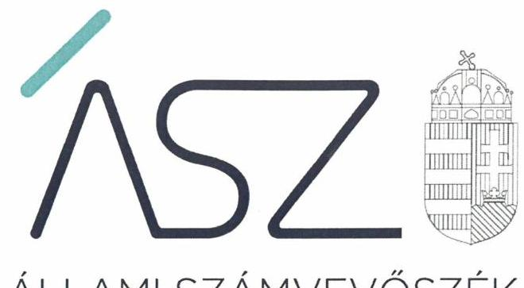
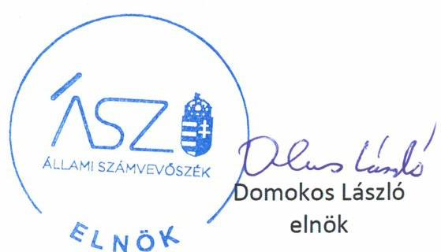
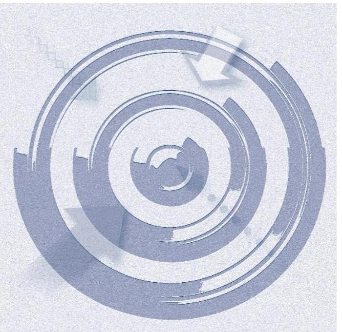
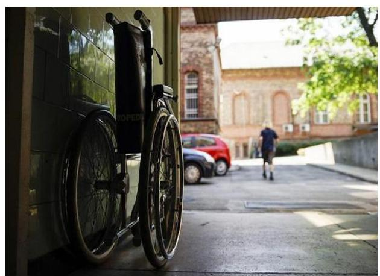

ÁLLAMI SZÁMVEVŐSZÉK

# JELENTÉS 

## Nem állami humánszolgáltatók ellenőrzése

A szociális humánszolgáltatást nyújtó intézmények, szolgáltatók államháztartáson kívüli fenntartói központi költségvetésből kapott támogatásai felhasználásának ellenőrzése -Élet-Hossz Alapítvány

2020
20094
www.asz.hu

---

ÁLLAMI SZÁMVEVŐSZÉK

# JELENTÉS

## Nem állami humánszolgáltatók ellenőrzése

A szociális humánszolgáltatást nyújtó intézmények, szolgáltatók államháztartáson kívüli fenntartói központi költségvetésből kapott támogatásai felhasználásának ellenőrzése – Élet-Hossz Alapítvány

2020. 06. hó 25. nap

20094
www.asz.hu

---

# AZ ELLENŐRZÉST FELÜGYELTE: 

KLINGA LÁSZLÓ felügyeleti vezető
TÓTH MARIANNA felügyeleti vezető

AZ ELLENŐRZÉST VEZETTE ÉS A VÉGREHAJTÁSÁÉRT FELELŐS:
KUSZINGER ANDREA ellenőrzésvezető
VERTKOVCZI MÁRIA ellenőrzésvezető

A PROGRAM ÖSSZEÁLLÍTÁSÁÉRT FELELŐS:
FEKETE-NAGY ANDRÁS GÁBOR ellenőrzési programért felelős vezető

TÓTPÁL SZABOLCS osztályvezető

Jelentéseink az Országgyúlés számítógépes hálózatán és az interneten a www.asz.hu címen is olvashatóak.

IKTATÓSZÁM: EL-2710-001/2020.
TÉMASZÁM: 2491
ELLENŐRZÉS-AZONOSÍTÓ SZÁM: V083587; V0867095

---

# TARTALOMJEGYZÉK 

- ÖSSZEGZÉS ..... 5
- AZ ELLENŐRZÉS CÉLJA ..... 6
- AZ ELLENŐRZÉS TERÜLETE ..... 7
- AZ ELLENŐRZÉS HÁTTERE, INDOKOLTSÁGA ..... 8
- A JELENTÉS LÉNYEGES KÉRDÉSKÖREI ..... 9
- AZ ELLENŐRZÉS HATÓKÖRE ÉS MÓDSZEREI ..... 10
- MEGÁLLAPÍTÁSOK ..... 12
- JAVASLATOK ..... 14
- MELLÉKLETEK ..... 15
I. sz. melléklet: Értelmező szótár ..... 15
- FÜGGELÉKEK ..... 17
I. sz. függelék a jelentéshez ..... 17
II. sz. függelék: Észrevételek ..... 18
- RÖVIDÍTÉSEK JEGYZÉKE ..... 19

---

.

---

# ÖSSZEGZÉS 

A budaörsi székhelyű Élet-Hossz Alapítvány a 2015-2016. években nem biztosította a közfeladat ellátására kapott költségvetési támogatások elszámoltathatóságát. A 2017-2018. években a költségvetési támogatások felhasználása elszámoltatható volt, a támogatásokat szabályszerűen az intézménye müködtetésre fordította.

## Az ellenőrzés társadalmi indokoltsága

A szociális gondoskodást igénylők védelme, illetve a köznevelési feladatok ellátása az Alaptörvényben meghatározott, a társadalom szempontjából fontos tevékenységek. Jogszabályok teszik lehetővé, hogy államháztartáson kívüli szervezetek - így például az egyházi fenntartók, alapítványok, gazdasági társaságok, egyesületek - által fenntartott intézmények is végezzenek köznevelési, szociális és gyermekvédelmi feladatokat. Mindehhez a központi költségvetés évente jelentős összegű támogatással járul hozzá. Az államháztartáson kívüli, humánszolgáltatást végző intézmények az igényelt közpénzekből társadalmilag hasznos, közösségteremtő, közérdekű, illetve közhasznú tevékenységet végeznek, illetve közfeladatokat látnak el.

Az intézményfenntartók ellenőrzésével az Állami Számvevőszék hozzájárul ahhoz, hogy ezen közpénzeket az államháztartáson kívüli szervezetek is ellenőrizhető, átlátható és elszámoltatható módon használják fel a közfeladatok ellátása során. Az ellenőrzések célja továbbá, hogy a nyilvánosság és az igénybevevők megfelelő tájékoztatást kapjanak az államháztartáson kívüli közfeladatot ellátók müködéséről.

Az ÁSZ ellenőrzései arra adnak választ, hogy az intézményfenntartók arra használták-e fel a közpénzeket, amire igényelték.

A szabályszerű gazdálkodás elengedhetetlen a közfeladat ellátás szakmai céljainak megvalósításához, valamint a társadalmi közbizalom fenntartásához.

## Főbb megállapítások, következtetések, javaslatok

Az Élet-Hossz Alapítvány a 2015-2016. években nem rendelkezett a Számv. tv. ${ }^{1}$ által előírt számviteli politikával és annak keretében elkészítendő szabályzatokkal, ezáltal Számv. tv. 161/A. § (1) bekezdésében előírtak szerint alátámasztott, megbízható egyszerűsített éves beszámolókkal. Megbízható egyszerűsített éves beszámolók hiányában a Fenntartó nem biztosította a szociális humánszolgáltatási közfeladatok ellátására kapott költségvetési támogatás felhasználásának elszámoltathatóságát. Mindezek alapján az Élet-Hossz Alapítvány az Alaptörvény² 39. cikk (2) bekezdésében foglaltak ellenére a 2015-2016. években nem biztosította a felhasznált közpénzekre vonatkozó gazdálkodása átláthatóságát, így nem igazolta, hogy a közpénzt a szociális humánszolgáltatási közfeladatra fordította.

Az Élet-Hossz Alapítvány a 2017-2018. években kialakította a szabályszerű gazdálkodás kereteit, ez alapján a támogatások felhasználása elszámoltatható volt. A 2017-2018. években a közfeladatot ellátó Intézménye működtetéséhez kapott költségvetési támogatásokat idősek otthona átlagos szintű, továbbá idősek otthona demens betegek ellátása tekintetében feladatonkénti bontásban elkülönítve tartotta nyilván, ezáltal gondoskodott a támogatások elszámoltathatóságáról.

Az Állami Számvevőszék a jelentésben foglalt megállapítások alapján az Élet-Hossz Alapítvány kuratóriumi elnökének két javaslatot fogalmazott meg. A javaslatot megalapozó megállapításra az érintettnek 30 napon belül intézkedési tervet kell készítenie.

---

# AZ ELLENŐRZÉS CÉLJA

**AZ ELLENŐRZÉS CÉLJA** annak értékelése volt, hogy a nem állami, nem önkormányzati szociális intézmények fenntartói központi költségvetésből kapott támogatásainak felhasználása szabályszerű volt-e.

---

# **AZ ELLENŐRZÉS TERÜLETE**

## **Élet-Hossz Alapítvány**

A budaörsi székhelyű Élet-Hossz Alapítványt egy magánszemély alapította a 2006. évben. Az Alapítvány célja, hogy szociálisan rászorultak részére személyes gondoskodást nyújtó ellátást biztosítson, szociális alapszolgáltatások és szakosított ellátás nyújtásával, tartós bentlakásos intézmény keretében. A Fenntartó³ a 2015-2018. évek között közhasznú jogállású szervezet volt.

A Fenntartó Budaörsön egy nem önálló jogi személy Intézmény⁴ működtetésével látott el humánszolgáltatási szociális közfeladat keretében idősek otthona szolgáltatást.

A Fenntartó képviseletét három tagú Kuratórium, felügyeletét három tagú Felügyelőbizottság látta el. A Fenntartó képviseletében aláírásra a Kuratórium elnöke volt jogosult, melynek személyében az ellenőrzött időszakban nem történt változás.

A Fenntartó a szociális humánszolgáltatásra Magyarország éves költségvetéséből a Magyar Államkincstár adatai alapján a 2015. évben 57,3 millió Ft, a 2016. évben 58,1 millió Ft, a 2017. évben 66,2 millió Ft, a 2018. évben 77,1 millió Ft összegű támogatást kapott.

---

# AZ ELLENŐRZÉS HÁTTERE, INDOKOLTSÁGA 

A szociális feladatokat ellátó nem állami intézményfenntartók részére közfeladataik ellátására évente jelentős összegű pénzügyi támogatást biztosítottak a mindenkori költségvetési törvények a bennük megfogalmazott feltételek mellett. A felhasználható állami támogatások a Kvtv. ${ }^{5}$-ben a 2015-2018. években a szociális ágazatra vonatkozóan 360 Mrd Ft előirányzatot határoztak meg. 2013. évben jelentős változások következtek be a normatív finanszírozás rendszerében. Új feladatfinanszírozási forma (átlagbéralapú támogatás) jelent meg, amely az államháztartáson kívüli intézményfenntartókra is vonatkozik. Az ellenőrzés a finanszírozási rendszerben 2011-2015 között bekövetkezett változásokra, azok közfeladat ellátásra gyakorolt hatására fókuszál a költségvetési támogatásokat felhasználó államháztartáson kívüli szervezetek körében. Az ellenőrzések indokoltságát az is alátámasztja, hogy az ÁSZ ${ }^{6}$ számos szervezetet még nem ellenőrzött ezen a területen.

Az ÁSZ stratégiájában foglaltak alapján is indokolt az ellenőrzés, amely a társadalom számára jelzi, hogy a közpénz államháztartáson kívüli felhasználása sem maradhat ellenőrizetlenül. Az államháztartáson kívülre nyújtott költségvetési támogatások ellenőrzésével az ÁSZ hozzájárul ahhoz, hogy a közpénzeket a nem állami humán fenntartók átlátható módon használják fel a közfeladatok ellátására kötött szerződésekben vállalt kötelezettségek teljesítése érdekében. Az ellenőrzés javaslataival hozzájárulhat az említett rendszerek szabályszerű támogatás felhasználásához, javíthatja a társadalmi-gazdasági döntések megalapozottságát, amely a „jól irányított állam működésének" feltétele.

A holisztikus megközelítés jegyében az ellenőrzés keretében egyedi kockázatelemzés alapján kiválasztott fenntartóknál és intézményeiknél értékeljük az államháztartáson kívüli szociális tevékenységhez kapcsolódó támogatások felhasználásának megfelelőségét.

---

# A JELENTÉS LÉNYEGES KÉRDÉSKÖREI 

1. A szociális humánszolgáltató közfeladatot ellátó államháztartáson kívüli fenntartó szabályszerű müködési- és gazdálkodási környezet kialakításával megteremtette-e a költségvetési támogatások átlátható, elszámoltatható igénybevételének, felhasználásának feltételeit?
2. Az államháztartáson kívüli fenntartó az átvállalt szociális humánszolgáltatási közfeladathoz biztositott költségvetési támogatásokat szabályszerűen fordította-e a humánszolgáltató intézménye müködtetésére, a felhasznált közpénzekre vonatkozó gazdálkodásával a nyilvánosság előtt elszámolt-e?

---

# AZ ELLENŐRZÉS HATÓKÖRE ÉS MÓDSZEREI 

## Az ellenőrzés típusa

Megfelelőségi ellenőrzés.

## Az ellenőrzött időszak

A 2015. január 1-je és 2018. december 31-e közötti időszak.

## Az ellenőrzés tárgya

Az ellenőrzés a szociális humánszolgáltatási közfeladatokat ellátó államháztartáson kívüli fenntartók humánszolgáltatási közfeladatai ellátásához a központi költségvetésből kapott támogatásaik humánszolgáltatási közfeladatokra való fenntartó általi felhasználása szabályszerűségének értékelésére terjedt ki.

## Az ellenőrzött szervezet

Élet-Hossz Alapítvány

## Az ellenőrzés jogalapja

Az ellenőrzés jogszabályi alapját az ÁSZ tv. ${ }^{7}$ 1. § (3) bekezdése, 5. § (3) bekezdésében foglalt előírások adják.

## Az ellenőrzés módszerei

Az ellenőrzést az ellenőrzési program, annak szempontjai, kérdései, az ellenőrzött időszakban hatályos jogszabályok, a nemzetközi standardokat irányadónak tekintve, az ellenőrzés szakmai szabályok és módszertanok figyelembe vételét rendelte elvégezni az ÁSZ. A közpénzekkel való felelős gazdálkodás segítésére irányuló javaslatok kidolgozásakor a hatályos jogszabályok voltak irányadóak.

Az ellenőrzés ideje alatt az ellenőrzött szervezettel történő kapcsolattartást az ÁSZ SZMSZ ${ }^{8}$-ének vonatkozó előírásai alapján biztosította az ÁSZ.

Az ellenőrzési kérdések megválaszolásához szükséges bizonyítékok megszerzése az ellenőrzött által rendelkezésre bocsátott dokumentumokra, adatokra alapozva megfigyelés, szemle

---

(szemrevételezés), kérdésfeltevés (információkérés), valamint elemző eljárással történt.

Az ellenőrzési bizonyítékként felhasználható adatforrások közé tartoztak egyrészt a szakmai program részletes szempontjainál felsorolt adatforrások, másrészt minden - az ellenőrzés folyamán feltárt, az ellenőrzés szempontjából információt tartalmazó - dokumentum.

Az ellenőrzés lefolytatásához az ellenőrzött szervezet a kitöltött tanúsítványok, valamint az ÁSZ által kért dokumentumok elektronikus úton való megküldésével szolgáltatott adatokat, információkat. Az így rendelkezésre bocsátott adatok, információk és a tanúsítványok adatai valódiságának kontrollja az ellenőrzés keretében történt.

Az egységes értelmezést támogatja a program mellékletét képező fogalomtár és rövidítésjegyzék.

Az ellenőrzést alapvetően a szociális humánszolgáltatások esetében a központi költségvetési támogatások igénylésével, módosításával, felhasználásával, elszámolásával kapcsolatos feladatokat ellátó államháztartáson kívüli fenntartóknál/szervezeteinél végeztük.

A szociális humánszolgáltatások központi költségvetési támogatásaival kapcsolatos, államháztartáson kívüli fenntartó jogszabályokban előírt feladatai betartását, továbbá a központi költségvetési támogatások szabályszerű nyilvántartását ellenőrizte az ÁSZ a fenntartónál rendelkezésre álló nyilvántartások, beszámolók és egyéb dokumentumok alapján. Az ellenőrzés nem terjedt ki a szociális humánszolgáltatások központi költségvetési támogatásai igénylése, módosítása, elszámolása valódiságának, megalapozottságának, helyességének - sem a fenntartónál, sem a székhely intézményeinél való - értékelésére (mivel ennek felülvizsgálata, ellenőrzése a finanszírozó jogszabályban előírt feladata, határozatai kiadása előtt). Továbbá nem terjedt ki az ellenőrzés e források szabályszerű felhasználásának értékelésére.

Az ÁSZ az ellenőrzést a szociális humánszolgáltatások esetében a központi költségvetési támogatások igénylésével, módosításával, felhasználásával, elszámolásával kapcsolatos feladatokat ellátó államháztartáson kívüli fenntartóknál végezte.

A szociális humánszolgáltatások központi költségvetési támogatásai igénylésével, módosításával, elszámolásával kapcsolatos, államháztartáson kívüli fenntartó jogszabályokban előírt feladatai betartását, továbbá a központi költségvetési támogatások szabályszerű kezelését, nyilvántartását ellenőrizte az ÁSZ a fenntartónál, az ott rendelkezésre álló határozatok, nyilvántartások, beszámolók és egyéb dokumentumok alapján. Az ellenőrzés nem terjedt ki a szociális humánszolgáltatások központi költségvetési támogatásai igénylése, módosítása, elszámolása valódiságának, megalapozottságának, helyességének - sem a fenntartónál, sem a székhely intézményeinél való értékelésére (mivel ennek felülvizsgálata, ellenőrzése a finanszírozó jogszabályban előírt feladata, határozatai kiadása előtt). Továbbá nem terjedt ki az ellenőrzés e források, intézmények általi szabályszerű felhasználásának értékelésére.

---

# MEGÁLLAPÍTÁSOK 

## 1. A szociális humánszolgáltató közfeladatot ellátó államháztartáson kívüli fenntartó szabályszerű müködési- és gazdálkodási környezet kialakításával megteremtette-e a költségvetési támogatások átlátható, elszámoltatható igénybevételének, felhasználásának feltételeit?

Összegző megállapítás

A Fenntartó a 2015-2016. években nem biztosította a szabályszerű gazdálkodás feltételeit. A 2017-2018. évben kialakította müködési és gazdálkodási környezetét.

A Fenntartó a 2015-2016. években nem rendelkezett a Számv. tv. ${ }^{9}$ 14. § (3) bekezdésében előírt számviteli politikával és a Számv. tv. 14. § (5) bekezdés a)-b) és d) pontjaiban előírt eszközök és források leltárkészítési és leltározási szabályzatával, az eszközök és források értékelési szabályzatával, valamint pénzkezelési szabályzattal.

A Fenntartó a jogszabályoknak megfelelően a 2017-2018. években elkészítette Számviteli Politikáját ${ }^{10}$, annak keretében az eszközök és a források értékelési szabályzatát, számlarendjét, valamint a 2018. évben a Pénzkezelési szabályzatát. A Fenntartó a 2017-2018. években a Számv. tv. 14. § (5) bekezdés a) pontjának előírása ellenére nem rendelkezett az eszközök és források leltárkészítési és leltározási szabályzatával. A számlarend Számv. tv. 161. § (2) bekezdés a) pontjában előírtak ellenére nem tartalmazta az összes alkalmazásra kijelölt számla számlajelét és megnevezését.

A Fenntartó a jogszabályi előírással összhangban rendelkezett Alapító okirattal ${ }^{11}$, az SZMSZ ${ }^{12}$-ében meghatározta az Intézménye szervezeti és müködési rendjét, valamint gondoskodott a szakmai program és a házirend elkészítéséről.

---

# 2. Az államháztartáson kívüli fenntartó az átvállalt szociális humánszolgáltatási közfeladathoz biztosított költségvetési támogatásokat szabályszerűen fordította-e a humánszolgáltató intézménye müködtetésére, a felhasznált közpénzekre vonatkozó gazdálkodásával a nyilvánosság előtt elszámolt-e? 

Összegző megállapítás

A Fenntartó az átvállalt szociális humánszolgáltatási közfeladathoz biztosított költségvetési támogatásokkal a 2015-2016. években a nyilvánosság előtt nem szabályszerűen számolt el. A 2017-2018. években a támogatásokat szabályszerűen fordította a humánszolgáltató intézménye müködtetésére.

A Fenntartó számviteli éves beszámolói a 2015-2016. években a számviteli politika és annak keretében elkészítendő szabályzatok hiányában nem volt alátámasztott, ezáltal megbízható.

A Fenntartó a 2017-2018. években a szociális humánszolgáltatási közfeladathoz biztosított költségvetési támogatásokat a jogszabályokban foglaltak alapján, a nem önállóan gazdálkodó intézménye gazdálkodását a saját gazdálkodásától feladatonkénti bontásban elkülönítetten tartotta nyilván. A Fenntartó a 2017-2018. években a jogszabállyal összhangban elkészítette számviteli éves beszámolóit, a külső ellenőrzésekhez kapcsolódó intézkedési kötelezettségeinek eleget tett.

A Fenntartó a 2015-2018. években a szociális közfeladatokat ellátó intézményei alapfeladatait, múködési kereteit meghatározta, rendelkezett adatvédelmi szabályzattal.

---

# JAVASLATOK 

Az ÁSZ tv. 33. § (1) bekezdésében foglaltak értelmében az ellenőrzött szervezet vezetője köteles a jelentésben foglalt megállapításokhoz kapcsolódó intézkedési tervet összeállítani és azt a jelentés kézhezvételétől számított 30 napon belül az ÁSZ részére megküldeni. Amennyiben az ellenőrzött szervezet vezetője nem küldi meg határidőben az intézkedési tervet, vagy továbbra sem elfogadható intézkedési tervet küld, az Állami Számvevőszék elnöke az ÁSZ tv. 33. § (3) bekezdése a) és b) pontjaiban foglaltakat érvényesítheti.

## Élet-Hossz Alapítvány kuratóriumi elnökének

1. Gondoskodjon a Számv. tv.-ben foglaltak szerint az eszközök és források leltárkészítési és leltározási szabályzatának elkészitéséről.
(1. sz. megállapítás 2. bekezdés 2. mondata alapján)
2. Gondoskodjon a számlarend Számv. tv. előírásainak megfelelő elkészítéséről.
(1. sz. megállapítás 2. bekezdés 3. mondata alapján)

---

# MELLÉKLETEK 

- I. SZ. MELLÉKLET: ÉRTELMEZŐ SZÓTÁR
humánszolgáltatás
külön törvényben meghatározott szociális, gyermekjóléti, gyermekvédelmi, közoktatási, felsőoktatási, kulturális közfeladatok (2015. évi Kvtv. 43. § (1), (4) bekezdés, 1. számú melléklet XX/20/2/3. jogcím csoport, 19. alcím, 2016. évi Kvtv. 41. § (1), (4) bekezdés, 1. számú melléklet XX/20/2/3. jogcím csoport, 19. alcím, 2017. évi Kvtv. 41. § (1), (4) bekezdés, 1. számú melléklet XX/20/2/3. jogcím csoport, 19. alcím)
költségvetési támogatás a társadalombiztosítás pénzügyi alapjai kivételével az államháztartás központi alrendszeréből ellenérték nélkül, pénzben nyújtott támogatások, ide nem értve
f) a szociális igazgatásról és szociális ellátásokról szóló törvény, valamint a gyermekek védelméről és a gyámügyi igazgatásról szóló törvény szerinti pénzbeli és természetbeni szociális és gyermekvédelmi ellátásokat (Áht. ${ }^{13}$ 1. § 14. pont)
A költségvetési törvényben (2016. évi XC. törvény 40. §) megállapított támogatás többek között: Átlagbéralapú támogatást állapít meg a nevelési-oktatási, valamint pedagógiai szakszolgálati intézményt fenntartó nemzetiségi önkormányzat, az egyházi és magán köznevelési intézmény fenntartója részére az általuk fenntartott nevelési-oktatási intézményben, továbbá pedagógiai szakszolgálati intézményben pedagógus és - a (3) bekezdés kivételével - a nevelő-oktató munkát közvetlenül segítő munkakörben foglalkoztatottak után a 7. melléklet I. pontjában meghatározott jogosultak után, az őket ott megillető mértékek szerint. Múködési támogatást állapít meg a nemzetiségi önkormányzat vagy az egyházi jogi személy által fenntartott nevelési-oktatási intézményekben ellátott, továbbá a pedagógiai szakszolgálati intézményekben gyógypedagógiai tanácsadásban, korai fejlesztésben, oktatásban és gondozásban, valamint a fejlesztő nevelésben részt vevő gyermekekre, tanulókra tekintettel a nemzetiségi önkormányzat és a bevett egyház részére a 7. melléklet II. pontja szerint.
székhely intézmény a szolgáltató székhelye, azaz a szolgáltató központi ügyintézésének helye, függetlenül attól, hogy használják-e szolgáltatás nyújtására (Sznyvhr. ${ }^{14}$ 1.§ k) pont) (hatályos: 2013. december 1-től)
telephely a szolgáltató székhelyétől különböző, szolgáltató/intézmény használatában álló hely, a szociális humánszolgáltatáshoz használt, bejegyzett hely. (Sznyvhr. 1.§ I) pont) (hatályos: 2015. január 1-től)

nem állami, nem
önkormányzati
(államháztartáson kívüli)
intézmény fenntartó

A humánszolgáltatásokat ellátó intézményt fenntartó egyházi jogi személy, társadalmi szervezet, alapítvány, közalapítvány, civil szervezet, országos nemzetiségi önkormányzat, nonprofit gazdasági társaság, gazdasági társaság és a humánszolgáltatást alaptevékenységként végző, Szja tv. hatálya alá tartozó egyéni vállalkozó.
(2015. évi Kvtv. 43. § (1) bekezdés, 2016. évi Kvtv. 41. § (1), bekezdés, 2017. évi Kvtv. 41. § (1) bekezdés)

---

.

---

# FÜGGELÉKEK 

- I. SZ. FÜGGELÉK A JELENTÉSHEZ

Az Állami Számvevőszék az ellenőrzések során feltárt tényekhez kapcsolódó további körülmények tisztázására eszközrendszerrel nem rendelkezik. Amennyiben az ellenőrzésen túlmutatóan indokoltnak látszik az ellenőrzés során feltárt körülmények további vizsgálata, az Állami Számvevőszék törvényi felhatalmazás alapján az ellenőrzés által feltárt körülményeket továbbítja a hatáskörrel rendelkező szervnek a szükséges intézkedések megtétele, eljárások lefolytatása érdekében.

Az Élet-Hossz Alapítvány (továbbiakban Fenntartó) részére szociális közfeladat ellátására a Magyar Államkincstár által biztosított költségvetési támogatások összege a 2015. évben 57,3 millió Ft, a 2016. évben 58,1 millió Ft volt.
A Fenntartó a 2015-2016. években nem rendelkezett a Számv. tv. 14. § (3) bekezdésében előírt számviteli politikával, a Számv. tv. 14. § (5) bekezdés a)-b) és d) pontjaiban előírt eszközök és források leltárkészítési és leltározási szabályzatával, az eszközök és források értékelési szabályzatával, valamint pénzkezelési szabályzattal.
A fentiek miatt a Fenntartó 2015-2016. évi egyszerüsített éves számviteli beszámoló adatai megbizhatósága kétséges.
Az eset konkrét körülményeinek feltárására a Nemzeti Adó- és Vámhivatal rendelkezik hatáskörrel.

---

A jelentéstervezetet a Számvevőszék 15 napos észrevételezésre megküldte az ellenőrzött szervezet vezetőjének az ÁSZ tv. 29. §* (1) bekezdése előírásának megfelelően.

Az Élet-Hossz Alapítvány kuratóriumi elnöke a jelentéstervezet megállapításaira írásban észrevételt tett.
Az ÁSZ tv. 29. § (3) bekezdésével összhangban az ÁSZ a Függelékben feltünteti az ellenőrzés megállapításaival kapcsolatban tett, figyelembe nem vett észrevételeket, és megindokolja, hogy azokat miért nem fogadta el

# A jelentéstervezet 1. számú megállapításának 1. és 2. bekezdésével kapcsolatos észrevétel: 

Elnök úrhölgy észrevételében leírta, hogy a Fenntartó a 2017-2018. években rendelkezett eszközök és források leltárkészítési és leltározási szabályzatával, azonban az nem volt része a számviteli politikának és - figyelmetlenség miatt - nem küldték meg az Állami Számvevőszék (továbbiakban: ÁSZ) részére. Észrevételéhez csatolta a 2017-2018. években hatályos eszközök és források leltárkészítési és leltározási szabályzatát. Az észrevétel mellékleteként megküldte továbbá a 2015-2016. évi számviteli politikát és a 2015-ben hatályos pénzkezelési szabályzatot.

Az ÁSZ az ellenőrzései során az adatbekérési időszak alatt bekért, teljességi és hitelességi nyilatkozattal megküldött dokumentumok alapján teszi meg megállapításait. Az utólag - észrevétel mellékleteként - megküldött számviteli szabályzatok figyelembe vételére nincs lehetőség. A számviteli politika, az eszközök és források leltárkészítési leltározási szabályzata, és a pénzkezelési szabályzat hiányára vonatkozó észrevételét nem fogadom el, a jelentéstervezet módosítása nem indokolt.

[^0]
[^0]:    * 29. § (1) Az Állami Számvevőszék az ellenőrzési megállapításait megküldi az ellenőrzött szervezet vezetőjének vagy az általa megbízott személynek, és annak, akinek személyes felelősségét állapította meg.
    (2) Az ellenőrzött szervezet vezetője és a felelősként megjelölt személy az ellenőrzés megállapításaira tizenöt napon belül írásban észrevételt tehet.
    (3) Az Állami Számvevőszék az észrevételre a beérkezésétől számított harminc napon belül írásban válaszol. A figyelembe nem vett észrevételeket köteles a jelentésben feltüntetni, és megindokolni, hogy azokat miért nem fogadta el.

---

# RÖVIDÍTÉSEK JEGYZÉKE 

${ }^{1}$ Számv.tv.
${ }^{2}$ Alatörvény
${ }^{3}$ Fenntartó
${ }^{4}$ Intézmény
${ }^{5}$ Kvtv.-ek
${ }^{6}$ ÁSZ
${ }^{7}$ Ász tv.
${ }^{8}$ ÁSZ SZMSZ
${ }^{9}$ Számv.tv.
${ }^{10}$ Számviteli Politika
${ }^{11}$ Alapító okirat
${ }^{12}$ SZMSZ
${ }^{13}$ Áht.
${ }^{14}$ Sznyvhr
a számvitelről szóló 2000. évi C. törvény (hatályos: 2001. január 1-jétől)
Magyarország alaptörvénye (hatályos: 2012. január 1-jétől)
Élet-Hossz Alapítvány
Élet-Hossz Idősek Otthona, Budaörs
2014. évi C. törvény Magyarország 2015. évi központi költségvetéséről, 2015. évi C. törvény Magyarország 2016. évi központi költségvetéséről, 2016. évi CX. törvény Magyarország 2017. évi központi költségvetéséről, 2017. évi C. törvény Magyarország 2018. évi központi költségvetéséről Állami Számvevőszék
az Állami Számvevőszékről szóló 2011. évi LXVI. törvény
Állami Számvevőszék Szervezeti és Múködési Szabályzata
a számvitelről szóló 2000. évi C. törvény (hatályos: 2001. január 1-jétől)
Élet-Hossz Alapítvány számviteli politikája, értékelési szabályzata és számlarendje (hatályos 2017. január 1-jétől, 2018. január 1-jétől), eszközök és források értékelési szabályzata (hatályos: 2018. január 1-jétől) pénzkezelési szabályzata (hatályos 2018. január 1-jétől)
Élet-Hossz Alapítvány alapító okirata módosításokkal egységes szerkezetben (kelt: 2015. május 26.)
Élet-Hossz Alapítvány Szervezeti és Múködési Szabályzata (hatályos: 2015. január 01-jétől)
2011. évi CXCV. törvény az államháztartásról

369/2013. (X. 24.) Korm. rendelet a szociális, gyermekjóléti és gyermekvédelmi szolgáltatók, intézmények és hálózatok hatósági nyilvántartásáról és ellenőrzéséről (hatályos 2013. december 1-jétől)

---

# ASZ 

ALLAMI SZAMVEVOSZEK
1052 Budapest, Apáczai Cs. J. u. 10. I 1364 Budapest 4. Pf. 54 TEL: +36 14849100
email: szamvevoszek@asz.hu
web: www.asz.hu | www.aszhirportal.hu