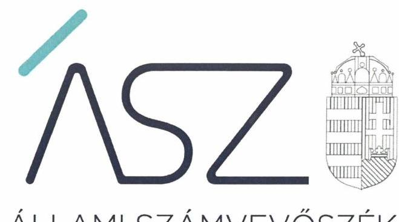
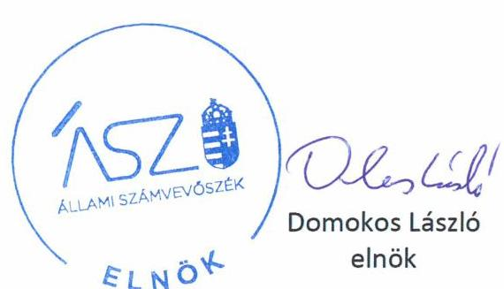
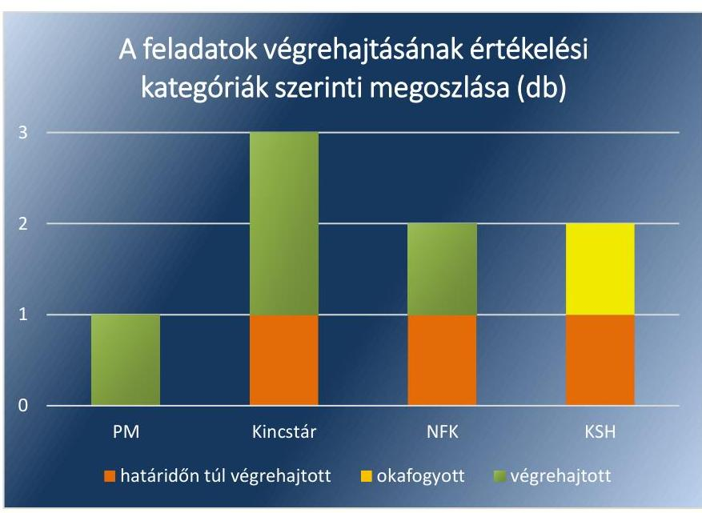

ÁLLAMI SZÁMVEVŐSZÉK

# JELENTÉS 

## Utóellenőrzések

Az államháztartás információs rendszere, valamint a hivatalos statisztikai szolgálat működésének utóellenőrzése
2020.

20097
www.asz.hu

---

ÁLLAMI SZÁMVEVŐSZÉK

# JELENTÉS 

## Utóellenőrzések

Az államháztartás információs rendszere, valamint a hivatalos statisztikai szolgálat működésének utóellenőrzése
2020. 06. hó 12. nap

20097
www.asz.hu

---

AZ ELLENŐRZÉST FELÜGYELTE:
PETŐ KRISZTINA felügyeleti vezető

AZ ELLENŐRZÉST VEZETTE ÉS A VÉGREHAJTÁSÁÉRT FELELŐS:
KISTÓTH KRISZTINA ellenőrzésvezető

A PROGRAM ÖSSZEÁLLÍTÁSÁÉRT FELELŐS:
TÓTPÁL SZABOLCS osztályvezető

A TÉMÁHOZ KAPCSOLÓDÓ KORÁBBI SZÁMVEVŐSZÉKI JELENTÉSEK:
- címe: Az államháztartás információs rendszere, valamint a
hivatalos statisztikai szolgálat működésének
ellenőrzése
- sorszáma: 17017

Jelentéseink az Országgyűlés
számítógépes
hálózatán és az interneten a
www.asz.hu címen is
olvashatóak.
- címe: A Magyar Államkincstár ellenőrzési tevékenységének
ellenőrzése
- sorszáma: 19032

IKTATÓSZÁM: EL-2723-001/2020

TÉMASZÁM: 2460

ELLENŐRZÉS-AZONOSÍTÓ SZÁM: V-0804141

---

# TARTALOMJEGYZÉK 

■ ÖSSZEGZÉS ..... 5
■ AZ ELLENŐRZÉS CÉLJA ..... 6
■ AZ ELLENŐRZÉS TERÜLETE ..... 7
■ AZ ELLENŐRZÉS HÁTTERE, INDOKOLTSÁGA ..... 8
■ A JELENTÉS LÉNYEGES KÉRDÉSKÖRE ..... 9
■ ELLENŐRZÉS HATÓKÖRE ÉS MÓDSZEREI ..... 10
■ MEGÁLLAPÍTÁSOK ..... 12
■ MELLÉKLETEK ..... 15
I. sz. melléklet: Értelmező szótár ..... 15
II. sz. melléklet: Pénzügyminisztérium, Magyar Államkincstár, Nemzeti Földügyi Központ és a Központi Statisztikai Hivatal intézkedési terve végrehajtásának értékelése* ..... 16
■ FÜGGELÉK: ÉSZREVÉTELEK ..... 19
■ RÖVIDÍTÉSEK JEGYZÉKE ..... 21

---

.

---

# ÖSSZEGZÉS 

Az államháztartás információs rendszerének, valamint a hivatalos statisztikai szolgálat működése során megtett, a korábbi szabálytalanságok kijavítását célzó intézkedések támogatták a szabályszerű és elszámoltatható feladatellátást.

## Az ellenőrzés társadalmi indokoltsága

Az Állami Számvevőszék stratégiájában célul tűzte ki a számvevőszéki munka hasznosulásának javítását. Ezzel összhangban ellenőrzi, hogy az ellenőrzött szervezet megvalósította-e a korábbi ellenőrzései által feltárt hibák, hiányosságok és szabálytalanságok megszüntetése céljából elkészített intézkedési tervében foglaltakat. A rendszeres utóellenőrzések hozzájárulnak a szükséges intézkedések tényleges végrehajtásához, ezáltal a közpénzügyek rendezettségének javulásához.

Az utóellenőrzés alapjául szolgáló ellenőrzés az államháztartás információs rendszerét és a statisztikai szolgálatot vizsgálta, melyek megbízható, jó működésének alapvető szerepe van abban, hogy a kormányzat és szélesebb körben a gazdasági, társadalmi szereplők valós és hiteles információk alapján hozhassák meg döntéseiket. A pontos és hiteles információ mind hazai, mind nemzetközi színtéren erősíti a bizalmat, növeli a költségvetés átláthatóságát, hozzájárul a „jó kormányzáshoz”.

## Főbb megállapítások, következtetések

Az Állami Számvevőszék a Pénzügyminisztériumnál, a Magyar Államkincstárnál, a Nemzeti Földügyi Központnál és a Központi Statisztikai Hivatalnál értékelte az államháztartás információs rendszerével, valamint a hivatalos statisztikai szolgálattal kapcsolatban feltárt szabálytalanságok megszüntetése érdekében vállalt feladatok végrehajtását.

Az államháztartás információs rendszer szabályozási környezete javult az ügyrendek aktualizálásával. Az ellenőrzési nyomvonalak felülvizsgálata és aktualizálása keretében a munkafolyamatok leírása, a hatásköri és felelősségi viszonyok egyértelmű meghatározása támogatta az elszámoltatható feladatellátást.

A hivatalos statisztikai szolgálat szabályszerű feladatellátását támogatta az adatszolgáltatási kötelezettségek teljesítésének módja, az adatfeldolgozás és az adatok ellenőrzési rendje szabályozása.

---

# AZ ELLENŐRZÉS CÉLJA 

Az ellenőrzés célja annak értékelése volt, hogy a számvevőszéki jelentésben foglalt javaslatokat megalapozó megállapításokkal összhangban készített intézkedési tervben meghatározott feladatokat az ellenőrzött szervezet végrehajtotta-e.

---

# AZ ELLENŐRZÉS TERÜLETE

## Pénzügyminisztérium, Magyar Államkincstár, Nemzeti Földügyi Központ, Központi Statisztikai Hivatal

Az ÁSZ¹ az államháztartás információs rendszere, valamint a hivatalos statisztikai szolgálat 2014-2015. évek közötti működését ellenőrizte, amelyről jelentését 17017. számon 2017. január 05-én hozta nyilvánosságra. Ellenőrzött szervezet volt az államháztartás információs rendszer működtetéséért és fejlesztéséért felelős PM² és a feladatellátásért felelős Kincstár³. Továbbá a hivatalos statisztikai szolgálat adatgyűjtésben (OSAP⁴-ban) résztvevők közül a KSH⁵, az ME⁶, a BM⁷, az FM⁸, az AKI⁹ az NGM¹⁰ és a NÉBIH¹¹.

A 17017. számú jelentés¹² megállapította, hogy az államháztartás információs rendszer részletes feladat leírását, a hatásköri és felelősségi viszonyok egyértelmű szabályozását nem biztosították, ezért a működés belső szabályozottsága és az elszámoltatható feladatellátás érdekében javaslatot fogalmazott meg a pénzügyminiszternek és a Kincstár elnökének. A hivatalos statisztikai szolgálat szervei között a KSH elnöke részére a határidők betartása és közigazgatási bírság kiszabása miatt, míg a NÉBIH elnöke részére az adatátadás folyamatában feltárt hiányosságok alapján készült javaslat.

Jelen utóellenőrzés értékelte a 17017. számú jelentésben foglalt javaslatokat megalapozó megállapításokhoz kapcsolódó intézkedési tervekben vállalt feladatok végrehajtását. A Kincstár által készített intézkedési tervben vállalt feladatok teljesülését az ÁSZ a Kincstár 2017. évi ellenőrzési tevékenységének ellenőrzése keretében már ellenőrizte. A feladatok teljesülésének értékelését és a megállapításokat a 2019. február 7-én nyilvánosságra hozott 19032. számú számvevőszéki jelentés¹³ tartalmazza.

Az ellenőrzött időszakban szervezeti változásra került sor. A NÉBIH az ellenőrzés tekintetében releváns erdészeti szakterületet érintő teljes feladatellátást, humánerőforrás- és adatállományt 2019. július 1-jével átadta a NFK¹⁴ részére, így az utóellenőrzésre már az NFK-nál került sor.

1. táblázat

### AZ ÁSZ 2017. ÉVBEN VÉGREHAJTOTT ELLENŐRZÉSE ALAPJÁN KÉSZÜLT INTÉZKEDÉSI TERVEKBEN VÁLLALT FELADATOK SZÁMA ELLENŐRZÖTTENKÉNT (DB)

|  Ellenőrzött szervezet | Intézkedési tervben vállalt feladatok száma  |
| --- | --- |
|  Pénzügyminisztérium | 1  |
|  Magyar Államkincstár | 3  |
|  Nemzeti Élelmiszerlánc-biztonsági Hivatal (Nemzeti Földügyi Központ) | 2  |
|  Központi Statisztikai Hivatal | 2  |
|  Összesen | 8  |

*Forrás: Ellenőrzött szervezetek ÁSZ részére megküldött intézkedési tervei*

---

# AZ ELLENŐRZÉS HÁTTERE, INDOKOLTSÁGA 

Az ÁSZ tv. ${ }^{15}$ 33. § (1) bekezdése értelmében a számvevőszéki jelentések javaslatokat megalapozó megállapításaihoz és javaslataihoz kapcsolódóan az ellenőrzött szervezet vezetője intézkedési tervet köteles összeállítani, és az ÁSZ részére megküldeni.

Az ÁSZ ${ }^{16}$ által befogadott intézkedési tervben foglaltak megvalósítását - az ÁSZ tv. 33. § (7) bekezdésében foglaltak alapján - az ÁSZ utóellenőrzés keretében ellenőrizheti. Az utóellenőrzések keretében - az intézkedések értékelése során - az ÁSZ figyelembe veszi az ellenőrzött szervezetek működési feltételeiben, valamint a jogszabályi előírásokban bekövetkezett változásokat.

Az utóellenőrzés során az ÁSZ értékeli, hogy az érintett számvevőszéki jelentésben foglalt javaslatokat megalapozó megállapításokkal és javaslatokkal összhangban, az ellenőrzött szervezet által készített intézkedési tervben meghatározott feladatokat a feladatra kijelöltek végrehajtották-e.

Az intézkedések végrehajtásával az adott terület szabályszerű működése vonatkozásában a kockázatok csökkenhetnek, azonban hosszabb távon az intézkedési tervben foglaltak végrehajtásával önmagában nem szűnnek meg, csak akkor, ha beépülnek az ellenőrzött szervezet működésébe, azokat folyamatosan karban tartják, figyelembe véve, illetve kezelve a változásokat. Emellett az intézkedések végrehajtásáig újabb kockázatok merülhetnek fel a szabályszerű működés vonatkozásában, amelyek kezelése szintén kiemelten fontos az ellenőrzött szervezet számára.

Az ellenőrzött szervezet vezetője által készített intézkedési tervekben foglalt feladatok hiányos, illetve késedelmes végrehajtása, vagy annak elmaradása a szabályszerűség és a felelős vezetői magatartás vonatkozásában kockázatot hordoz, ami azt mutatja, hogy az ellenőrzések során feltárt hibák, hiányosságok és szabálytalanságok kezelése nem kapott kellő hangsúlyt. Az utóellenőrzés során is fennálló szabálytalanságok esetén a közpénz, közvagyon veszélyeztetettségi kockázat valószínűsített hatásának értékelése további intézkedéseket vonhat maga után.

Az ellenőrzött szervezet szintjén az utóellenőrzés feltárja, hogy a szervezet az intézkedések végrehajtásával hasznosította-e a korábbi ellenőrzési jelentésben a hiányosságok megszüntetése, illetve a kockázatok kezelése érdekében megfogalmazott javaslatokat, illetve az intézkedések végrehajtása elmaradásának következtében továbbra is fennálló szabálytalanság esetén értékeli a közpénzek, közvagyon veszélyeztetettségét.

Az ÁSZ szintjén az utóellenőrzés visszacsatolást ad az ellenőrzési jelentések hasznosulásáról, az intézkedések elmaradásának, vagy részleges megvalósulásának a közpénzek, közvagyon veszélyeztetettségére gyakorolt valószínűsített hatásának értékelése, további intézkedéseket vonhat maga után.

---

# A JELENTÉS LÉNYEGES KÉRDÉSKÖRE 

Az ellenőrzött szervezetek az intézkedési tervekben foglaltakat az előírt határidőben végrehajtották-e?

---

# ELLENŐRZÉS HATÓKÖRE ÉS MÓDSZEREI 

## Az ellenőrzés típusa

Megfelelőségi ellenőrzés.

## Az ellenőrzött időszak

Az utóellenőrzés alapját képező számvevőszéki jelentés közzétételének napjától az ellenőrzésről szóló kiértesítő levél keltének napjáig, azaz 2017. január 5-től 2019. december 10-ig tartó időszak.

## Az ellenőrzés tárgya

A számvevőszéki jelentésben foglalt javaslatokat megalapozó megállapításokkal és javaslatokkal összhangban készített intézkedési tervekben foglaltak végrehajtásának ellenőrzése.

## Az ellenőrzött szervezet

A PM, a Kincstár, az NFK és a KSH.

## Az ellenőrzés jogalapja

Az ellenőrzés jogszabályi alapját az ÁSZ tv. 33. § (7) bekezdésének előírásai képezik.

## Az ellenőrzés módszerei

Az ellenőrzést az ellenőrzött időszakban hatályos jogszabályok, az ellenőrzés szakmai szabályai, a jelen ellenőrzésre irányadó ÁSZ módszertanok, az ellenőrzési programban foglalt értékelési szempontok szerint végeztük.

Az ellenőrzés ideje alatt az ellenőrzött szervezettekkel történő kapcsolattartást az ÁSZ SZMSZ ${ }^{17}$-ének vonatkozó előírásai alapján biztosítottuk.

Az utóellenőrzés megállapításait az ÁSZ rendelkezésére álló, valamint az ÁSZ adatbekérése szerint, az ellenőrzött szervezetek által rendelkezésre bocsátott dokumentumok alapozták meg.

Az ellenőrzési bizonyítékként felhasználható adatforrások közé tartoztak egyrészt az ellenőrzési program részletes szempontjainál felsorolt adatforrások, másrészt minden - az ellenőrzés folyamán feltárt, az ellenőrzés szempontjából információt tartalmazó - dokumentum.

---

Az intézkedési tervekben előírt feladatokat azok végrehajthatósága, illetve végrehajtása szempontjából az alábbiak szerint értékeltük:
$\longrightarrow$ „határidőben végrehajtott" a feladat, ha a teljesítés dokumentáltan, az intézkedési tervben előírt határidőben és tartalommal megtörtént;
$\longrightarrow$ „határidőn túl végrehajtott" a feladat, ha annak teljesítése az intézkedési tervben meghatározott módon, de az előírt határidőn túl történt meg;
$\longrightarrow$ „nem végrehajtott" a feladat, ha a végrehajtás nem történt meg, vagy amennyiben a teljesítést nem dokumentálták;
$\longrightarrow$ „okafogyottá vált" a feladat, ha végrehajtására - meghatározott esemény bekövetkezése, továbbá külső körülmény, a működést érintő feltétel változása miatt - már nincs szükség, illetve lehetőség, és egyértelműen megállapítható, hogy az intézkedést szükségessé tevő körülmény a jövőben nem fordulhat elő;
$\longrightarrow$ „nem időszerű" az a feladat, amelynek ellenőrzési időszakon belüli végrehajtására azért nem került (kerülhetett) sor, mert az intézkedés alapjául szolgáló esemény nem következett be, de annak jövőbeni előfordulása lehetséges, a végrehajtása nem volt esedékes, vagy a végrehajtás határideje még nem járt le.
Az ellenőrzés lefolytatásához az ellenőrzött szervezetek a tanúsítványok elektronikus kitöltésével, valamint az ÁSZ által kért dokumentumok elektronikus megküldésével szolgáltattak adatokat, amelyek valódiságát és teljes körűségét az ellenőrzött szervezetek vezetője által tett teljességi és hitelességi nyilatkozat igazolja. Az így rendelkezésre bocsátott adatok, információk kontrollja az ellenőrzés keretében megtörtént.

---

# MEGÁLLAPÍTÁSOK 

## Az ellenőrzött szervezetek az intézkedési tervekben foglaltakat az előírt határidőben végrehajtották-e?

Összegző megállapítás

Az államháztartás információs rendszere és a hivatalos statisztikai szolgálat területén javult a működés szabályozottsága és az elszámoltathatóság.

A PM, a Kincstár, az NFK és a KSH az intézkedési tervekben szereplő feladatokat végrehajtották.

A működés belső szabályozottsága javult, a Kincstár, az NFK és a KSH szabályozottsághoz kapcsolódó kockázata csökkent.

A 19032. számú számvevőszéki jelentésben az ÁSZ megállapította, hogy a Kincstár elnöke intézkedett az államháztartás információs rendszerével kapcsolatos feladatok ellátásában érintett két főosztálya ügyrendjének aktualizálásáról és kialakította az elektronikus adatszolgáltató rendszerben teljesítendő adatszolgáltatás kezelés eljárásrendjének szabályait.

A NÉBIH elnöke biztosította, hogy a nemzetközi szervezetek részére történő adatátadás folyamatában az erdészeti témájú statisztikai adatfelvételeket megállapodás alapján végezzék (2.). Továbbá az erdészeti statisztikai tevékenységet szolgáló belső eljárásrendben rögzítették az OSAP $1257^{18}$ adatgyűjtés módszereit és az Info tv. ${ }^{19} 7$. § bekezdésében foglaltak szerinti eljárási szabályokat (3.). Az erdészeti szakterületet érintő teljes feladatellátás NFK általi átvételét követően mind a megállapodás, mind a belső eljárásrend megújításra került.

A KSH illetékes szervezeteinek ${ }^{20}$ ügyrendjében és a munkavállalók munkaköri leírásában rögzítésre kerültek az OSAP rendeletben ${ }^{21}$ előírt határidők monitorozására, illetve annak alapján

 a szükséges intézkedések kezdeményezésére vonatkozó feladatok (4.).

## A BELSŐ KONTROLL SZERINTI ELSZÁMOLTATHATÓSÁG biztosítása érdekében a pénzügyminiszter gondoskodott

az államháztartás információs rendszere kialakításában és működtetésében érintett főosztálya ellenőrzési nyomvonalának aktualizálásáról. Ebben meghatározta a hatásköri és felelősségi viszonyokat, a feladatellátásra vonatkozó határidőket, és azok végrehajtásáért felelős személyeket (1.). A 19032. számú számvevőszéki jelentésben az ÁSZ megállapította, hogy Kincstár az államháztartás információs rendszere működtetésével kapcsolatban az ellenőrzési nyomvonalakat felülvizsgálta és aktualizálta.

AZ INTÉZKEDÉSI TERVEKBEN szereplő összesen nyolc feladatból az ellenőrzött szervezetek négyet határidőben, hármat határidőn túl hajtottak végre, egy feladat pedig okafogyottá vált.

---

A PM, a Kincstár, az NFK és a KSH intézkedési terveiben vállalt feladatok végrehajtásának értékelési kategóriák szerinti megoszlását az 1. ábra szemlélteti.

1. ábra

Forrás: ÁSZ, a Kincstár vonatkozásában a 19032. számú számvevőszéki jelentés
A feladatokat, a határidőket, a megjelölt felelősöket és a feladatok végrehajtásának értékelését az I. sz. melléklet mutatja be.

A PM és az NFK az intézkedési terveikben meghatározott feladatok végrehajtásáról vezette a Bkr. ${ }^{22}$ 14. § (1) bekezdésben előírt nyilvántartást. A KSH a külső ellenőrzésekről nem rendelkezett a Bkr. 47. § (2) bekezdésében foglaltaknak megfelelő nyilvántartással, ezzel nem gondoskodott az intézkedések, a kapcsolódó kockázatok nyomon követéséről.

---

.

---

# MELLÉKLETEK 

## I. SZ. MELLÉKLET: ÉRTELMEZŐ SZÓTÁR

adat
államháztartás információs rendszere
figyelemfelhívó levél

Hivatalos statisztikai szolgálat
intézkedési terv
statisztikai adatfelvétel

Az információ formalizált módon való megjelenítése, amely alkalmas feldolgozásra, továbbításra, közlésre, értelmezésre. (Forrás: KSH honlapja) Az ellenőrzés az államháztartás információs rendszerében továbbított költségvetési, pénzügyi és vagyoni, illetve a statisztikai adatgyűjtések során a statisztikai adatok körére terjedt ki.
Az államháztartás egészére, a kormányzati szektorba sorolt egyéb szervezetekre, és az államháztartással kapcsolatba kerülő természetes személyek, jogi személyek és jogi személyiséggel nem rendelkező egyéb szervezetek e kapcsolatára kiterjedő
a) azonosító adatokat,
b) költségvetési, pénzügyi, számviteli adatokat, és
c) a költségvetési adatokhoz és információkhoz kapcsolódó naturális mutatószámokat gyűjtő, nyilvántartó, feldolgozó és szolgáltató információs rendszer.
(Forrás: Áht. 103. § (2) bekezdése)
Az Állami Számvevőszék elnöke az ellenőrzés során feltárt jogszabálysértő gyakorlat, illetve a vagyon rendeltetésellenes vagy pazarló felhasználásának megszüntetése érdekében - ha jogszabály súlyosabb jogkövetkezmény alkalmazását nem írja elő - figyelemfelhívó levéllel fordulhat az ellenőrzött szerv vezetőjéhez. A szerv vezetője a figyelemfelhívó levélben foglaltakat tizenöt napon belül - testületi szerv a soron következő ülésén - köteles elbírálni, a megfelelő intézkedést megtenni és erről az Állami Számvevőszék elnökét értesíteni. (ÁSZ tv. 33. § (6) bek.)
A 2016. évi CLV. törvény - a hivatalos statisztikáról 4. § (1.) bekezdése szerint feladata a hivatalos statisztikai tevékenység ellátása
Az ellenőrzési javaslatok alapján az ellenőrzött szervezet, szervezeti egység által készített intézkedések végrehajtásának ütemezése a végrehajtásáért felelős személyek és a vonatkozó határidők megjelölésével. (Bkr. 2. § k) pont)
egy adott sokaság adott időszakra vagy időpontra vonatkozó ismérveinek gyűjtése egy társadalmi, gazdasági vagy környezeti jelenség statisztikai megfigyelése céljából, különböző adatforrások felhasználásával (2016. évi CLV. törvény - a hivatalos statisztikáról 2. § (15) bek.)

---

# *Mellékletek*

## II. SZ. MELLÉKLET: PÉNZÜGYMINISZTÉRIUM, MAGYAR ÁLLAMKINCSTÁR, NEMZETI FÖLDÜGYI KÖZPONT ÉS A KÖZPONTI STATISZTIKAI HIVATAL INTÉZKEDÉSI TERVE VÉGREHAJTÁSÁNAK ÉRTÉKELÉSE*

|  Sorszám | Az intézkedési tervben rögzített feladat | Az intézkedési tervben meghatározott határidő | Az intézkedési tervben meghatározott felelős | A feladat végrehajtása  |
| --- | --- | --- | --- | --- |
|  1. | 2. | 3. Határidőben végrehajtott feladatok | 4. | 5.  |
|  1. | Az érintett önálló szervezeti egység ellenőrzési nyomvonalában a hatásköri és felelősségi viszonyok egyértelműen lehatárolásra, a feladatellátásra vonatkozó határidők, valamint a feladatok ellenőrzésének módszerei és azok végrehajtásáért felelős személyei pedig feltüntetésre kerülnek. | 2017. március 31. | NGM Költségvetési Összefoglaló Főosztály, főosztályvezető | A NGM Költségvetési Összefoglaló Főosztály az ellenőrzési nyomvonalában a hatásköri és felelősségi viszonyokat egyértelműen lehatárolta. Az ellenőrzési nyomvonalban a feladatellátásra vonatkozó határidők, valamint a feladatok ellenőrzésének módszerei és azok végrehajtásáért felelős személyek feltüntetésre kerültek.  |
|  2. | A NÉBIH egyeztetést kezdeményez a KSH-val a nemzetközi erdészeti adatszolgáltatások szerinti kötelezettségek ellátásának témájában az intézmények közt korábban létező megállapodások megújítására. | 2017. december 31. | NÉBIH Erdészeti Igazgatóság, igazgató | A 2017. január 1-jétől hatályos jogszabályi változás szerint adatátadásról szóló megállapodást az Stt.^{23} 23. § (6) bekezdésében foglaltakkal összhangban a Statisztikai Szolgálat érintett tagjai kötnek. Az Stt. 28. § (7) bekezdése szerint az adminisztratív adatok kezelője a Hivatalos Statisztikai Szolgálat adatot átvevő tagjával köt megállapodást, aki az erdészeti témákban az FM volt. A jogszabályi változásra tekintettel, mind a NÉBIH, mind az erdészeti szakterület átvételét követően az NFK rendelkezett megállapodással az erdészeti témájú statisztikai adatfelvételek vonatkozásában.  |
|   |  | Határidőn túl végrehajtott feladatok |  |   |
|  3. | Az OSAP 1257-es adatgyűjtés tekintetében az eljárásrendben rögzítjük az adatgyűjtés módszereit és az adatkezelés szabályait, biztosítva az Info tv. előírásainak érvényesülését. | 2017. december 31. | NÉBIH Erdészeti Igazgatóság, igazgató | A NÉBIH – a vállalt határidőn túl – 2018. április 10-én belső eljárásrendben rögzítette az OSAP 1257-es adatgyűjtés módszereit és az adatkezelés szabályait az Info tv. 7. § (2) bekezdésében foglaltaknak megfelelően.  |
|  4. | Az OSAP rendeletben előírt határidők monitorozására, illetve annak alapján a szükséges intézkedések kezdeményezésére vonatkozó feladatok külön rögzítése a KSH Szervezeti és Működési Szabályzat alapján illetékes szervezeti egységek ügyrendjeiben, illetve az érintett munkatársak munkaköri leírásaiban. | 2017. április 30. | a KSH SZMSZ^{24}-e alapján az illetékes szervezeti egységek vezetői, KSH elnöke | A KSH érintett munkatársak – 2017. március 1-jétől hatályos – munkaköri leírásaiban az OSAP rendeletben előírt határidők monitorozására, illetve annak alapján a szükséges intézkedések megtételére vonatkozó feladatok szerepeltek. A KSH elnöke az illetékes szervezeti egységek ügyrendjeit eltérő időpontokban – a vállalt határidőt követően – 2018. március 12-én, majd 2019. április 1-án, 2-án, utolsóként április 05-én adta ki, léptette hatályba. A KSH elnökhelyettese által jóváhagyott illetékes szervezeti egység ügyrendek a monitorozott határidők alapján szükséges feladatok vonatkozásában tartalmazták az "adatszolgáltatók"  |

---

|  1. | Az intézkedési tervben rögzített feladat | Az intézkedési tervben meghatározott határidő | Az intézkedési tervben meghatározott felelős | A feladat végrehajtása  |
| --- | --- | --- | --- | --- |
|   | 2. | 3. | 4. | 5.  |
|   |  |  |  | sürgetése, statisztikai tevékenységének figyelemmel kísérése, a statisztikai fegyelem elősegítése* feladatokat.  |
|   |  |  | Okafogyott feladat |   |
|  5. | A hivatalos statisztikáról szóló 2016. évi CLV. törvény (a továbbiakban: Stt.) által előírt feladatellátás során az Országos Statisztikai Adatgyűjtési Program adatgyűjtéseiről és adatátvételeiről szóló 288/2009. (XII. 15.) Korm. rendelet (a továbbiakban: OSAP rendelet) szerint a Központi Statisztikai Hivatal (a továbbiakban: KSH) által végzett adatgyűjtések végrehajtása során az adatszolgáltatói oldalon tapasztalt, Stt.-ben rögzített szabálytalanságok vonatkozásában belső eljárásrend kidolgozása, amely biztosítja, hogy a jogszabályi előírásokban foglalt feltételek teljesülése esetén a KSH kezdeményezze a fővárosi, megyei kormányhivataloknál közigazgatási bírság kiszabását. | 2017. április 30. | KSH elnöke | A 2017. június 2-tól hatályos az Stt. szerint a KSH nem kötelezett közigazgatási bírság kiszabás kezdeményezésére a hivatalos statisztikai adatszolgáltatást nem vagy nem az előírt határidőre történt teljesítése, illetve az adatátvételre, adatátadásra vonatkozó kötelezettségszegés esetén.
Ezen időponttól az Stt. 32. § (3) bekezdése szerint a Hivatalos Statisztikai Szolgálat minden statisztikai adatfelvételt végrehajtó tagja adatszolgáltatói kötelezettségszegés esetén a hatósági eljárás során ügyfélként az Ákr. ${ }^{25}$-ben előírtak szerint kérelemmel kezdeményezheti a bírság kiszabását. A közigazgatási bírság kezdeményezés szükségességének megítélése az adatfelvételt végrehajtó mérlegelési jogköre.  |

- A Kincstár intézkedési tervében rögzített feladatok értékelését a 19032. számú számvevőszéki jelentés 1. számú melléklete tartalmazza

---

.

---

# FÜGGELÉK: ÉSZREVÉTELEK 

A jelentéstervezetet a Számvevőszék 15 napos észrevételezésre megküldte az ellenőrzött szervezetek vezetőinek az ÁSZ tv. 29. § (1) bekezdése előírásának megfelelően.

A Központi Statisztikai Hivatal elnöke a jelentéstervezet megállapításaira észrevételt tett. A Pénzügyminisztériumot vezető miniszter, a Magyar Államkincstár elnöke és a Nemzeti Földügyi Központ elnöke nem élt észrevételezési jogával.
Az ÁSZ tv. 29. § (3) bekezdésével összhangban az Állami Számvevőszék a Függelékben feltünteti az ellenőrzés megállapításaival kapcsolatban tett, figyelembe nem vett észrevételeket, és megindokolja, hogy azokat miért nem fogadta el.

[^0]
[^0]:    * 29. § (1) Az Állami Számvevőszék az ellenőrzési megállapításait megküldi az ellenőrzött szervezet vezetőjének vagy az általa megbízott személynek, és annak, akinek személyes felelősségét állapította meg.
    (2) Az ellenőrzött szervezet vezetője és a felelősként megjelölt személy az ellenőrzés megállapításaira tizenöt napon belül írásban észrevételt tehet.
    (3) Az Állami Számvevőszék az észrevételre a beérkezésétől számított harminc napon belül írásban válaszol. A figyelembe nem vett észrevételeket köteles a jelentésben feltüntetni, és megindokolni, hogy azokat miért nem fogadta el.

---

# A Központi Statisztikai Hivatal (továbbiakban: KSH) elnök által a KSH/1185-2/2020 iktatószámú, 2020. május 5-én kelt levélben tett észrevételek és azok kezelésének indokolása 

A KSH elnöke észrevételében jelezte, hogy a Központi Statisztikai Hivatal a külső ellenőrzések javaslatai alapján készült intézkedési terveket a költségvetési szervek belső kontrollrendszeréről és belső ellenőrzéséről szóló 370/2011. (XII. 31.) Korm. rendelet (továbbiakban: Bkr.) 14. § (1) bekezdése, valamint a KSH belső szabályzatában foglaltak alapján tartja nyilván. Kifejtette továbbá, hogy a KSH az Állami Számvevőszék (továbbiakban: ÁSZ) ellenőrzéssel érintett időszakában az előbbi előírások alapján vezette a nyilvántartást, azonban az ÁSZ utóellenőrzés keretében vizsgált intézkedési terv nyilvántartásba vétele adminisztratív okok miatt elmaradt. Elnök úr/hölgy álláspontja szerint az előbbi körülménytől eltekintve ugyanakkor nem jelenthető ki általános megállapításként, hogy a KSH a külső ellenőrzésekről nem rendelkezett a Bkr. 47. § (2) bekezdésében foglaltaknak megfelelő nyilvántartással, ezzel nem gondoskodott az intézkedések, a kapcsolódó kockázatok nyomon követéséről.
A KSH elnökét tájékoztattuk, hogy az ÁSZ az ellenőrzési megállapításait az adatszolgáltatás során a részére törvényi határidőben rendelkezésre bocsátott dokumentumokra alapozva fogalmazza meg. Az ÁSZ az EL-2081-001/2019. iktatószámú adatbekérő levelének 3. melléklet 4. pontjában az ÁSZ ellenőrzési megállapításaihoz kapcsolódó intézkedési tervben foglaltak végrehajtásáról vezetett nyilvántartást kérte megküldeni. Az előbbiek alátámasztására az ellenőrzés rendelkezésére bocsátották a „Nyilvántartás a 2016. évi ellenőrzésekről" és „A külső ellenőrzésekhez kapcsolódó intézkedések nyilvántartása 2016." című dokumentumokat.
A „Nyilvántartás a 2016. évi ellenőrzésekről" című nyilvántartás a tárgyhoz tartozó dokumentumnak értékelte az ÁSZ, mivel az kapcsolódik „Az államháztartás információs rendszere és a hivatalon statisztikai szolgálat működésének ellenőrzése" című ÁSZ ellenőrzés megállapításaihoz. Ez a
 nyilvántartás azonban nem felel meg a Bkr. 47. § (2) bekezdésében meghatározott előírásoknak, mivel nem tartalmazza az ellenőrzési jelentésben szereplő javaslatot, az elfogadott intézkedési tervet, az intézkedési terv alapján végrehajtott intézkedések rövid leírását, és a végre nem hajtott intézkedések okát. Az előbbiek miatt nem gondoskodtak az intézkedések, és a kapcsolódó kockázatok nyomon követéséről.
„A külső ellenőrzésekhez kapcsolódó intézkedések nyilvántartása 2016." című dokumentum adattartalma szerint nem „Az államháztartás információs rendszere és a hivatalon statisztikai szolgálat működésének ellenőrzése" című ÁSZ ellenőrzés megállapításaihoz kapcsolódik, mert arra vonatkozó információt nem tartalmaz. A dokumentumban nem szerepel annak az ÁSZ ellenőrzésnek a megállapítása, amelyre az ÁSZ adatbekérése irányult, így nem tekinthető az ÁSZ ellenőrzési módszertana szerint tárgyhoz tartozó dokumentumnak.

Mindezek mellett a KSH elnöke észrevételében megerősítette, hogy az ÁSZ utóellenőrzés keretében vizsgált intézkedési terv nyilvántartásba vétele adminisztratív okok miatt elmaradt, ami megerősíti az ÁSZ által megtett megállapítást, hogy az intézkedések és a kapcsolódó kockázatok nyomon követése elmaradt.

Az előzőekre való tekintettel az észrevételt nem fogadtuk el, az ellenőrzési megállapítás módosítása nem volt indokolt.

---

# RÖVIDÍTÉSEK JEGYZÉKE 

${ }^{1}$ ÁSZ
${ }^{2}$ PM
${ }^{3}$ Kincstár
${ }^{4}$ OSAP
${ }^{5} \mathrm{KSH}$
${ }^{6} \mathrm{ME}$
${ }^{7} \mathrm{BM}$
${ }^{8} \mathrm{FM}$
${ }^{9} \mathrm{AKI}$
${ }^{10} \mathrm{NGM}$
${ }^{11}$ NÉBIH
${ }^{12} 17017$. számú jelentés
${ }^{13}$ 19032. számú számvevőszéki jelentés
${ }^{14}$ NFK
${ }^{15}$ ÁSZ tv.
${ }^{16}$ ÁSZ
${ }^{17}$ ÁSZ SZMSZ
${ }^{18}$ OSAP 1257
${ }^{19}$ Info tv.
${ }^{20}$ KSH illetékes szervezetei
${ }^{21}$ OSAP rendelet
${ }^{22}$ Bkr.
${ }^{23} \mathrm{Stt}$.
${ }^{24}$ KSH SZMSZ
${ }^{25}$ Ákr.

Állami Számvevőszék
Pénzügyminisztérium, a Magyarország minisztériumainak felsorolásáról, valamint egyes kapcsolódó törvények módosításáról szóló 2018. évi V. törvény (hatályos 2018. május 18-tól) hatálybelépése előtt Nemzetgazdasági Minisztérium Magyar Államkincstár
Országos Statisztikai Adatgyűjtési Program
Központi Statisztikai Hivatal
Miniszterelnökség
Belügyminisztérium
Földművelésügyi Minisztérium, 2019. március 1-jétől Agrárminisztérium
Agrárgazdasági Kutató Intézet
Nemzetgazdasági Minisztérium, a Magyarország minisztériumainak
felsorolásáról, valamint egyes kapcsolódó törvények módosításáról szóló 2018. évi V. törvény szerint 2018. május 18-tól Pénzügyminisztérium
Nemzeti Élelmiszerlánc-biztonsági Hivatal
Jelentés - Az államháztartás információs rendszere, valamint a hivatalos statisztikai szolgálat működésének ellenőrzése
Jelentés - A Magyar Államkincstár ellenőrzési tevékenységének ellenőrzése
Nemzeti Földügyi Központ
az Állami Számvevőszékről szóló 2011. évi LXVI. törvény
Állami Számvevőszék
Állami Számvevőszék Szervezeti és Működési Szabályzata
Nettó fakitermelés adatgyűjtés
az információs önrendelkezési jogról és az információszabadságról szóló 2011. évi CXII. törvény
a KSH-ELEKTRA, az Adatgyűjtési Igazgatóság Elnökhelyettesi koordinációs osztálya, az Általános gazdaságstatisztikai adatgyűjtések főosztálya, a Lakossági adatfelvételek főosztálya, a Lakossági szolgáltatások adatgyűjtési főosztálya, a Mezőgazdasági adatgyűjtések főosztálya és az Üzleti szolgáltatások adatgyűjtési főosztálya
az Országos Statisztikai Adatgyűjtési Program adatgyűjtéseiről és adatátvételeiről szóló 288/2009. (XII. 15.) Korm. rendelet
a költségvetési szervek belső kontrollrendszeréről és belső ellenőrzéséről szóló 370/2011. (XII. 31.) Korm. rendelet
a hivatalos statisztikáról szóló 2016. évi CLV. törvény (hatályos 2017. január 1-jétől)
Központi Statisztikai Hivatal Szervezeti és Működési Szabályzata
az általános közigazgatási rendtartásról szóló 2016. CL. törvény (hatályos 2018. január 1-jétől), azt megelőzően a közigazgatási hatósági eljárás és szolgáltatás általános szabályairól szóló 2004. évi CXL. törvény (hatályos 2005. november 1-jétől 2017. december 31-ig)

---

# ASZ 

ÁLLAMI SZÁMVEVŐSZÉK
1052 Budapest, Apáczai Cs. J. u. 10. I 1364 Budapest 4. Pf. 54 TEL: +36 14849100
email: szamvevoszek@asz.hu
web: www.asz.hu | www.aszhirportal.hu

