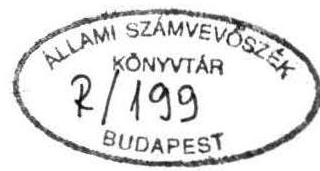
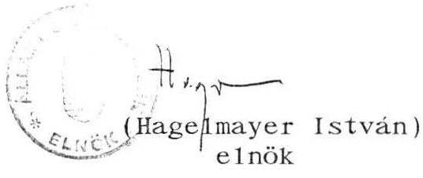
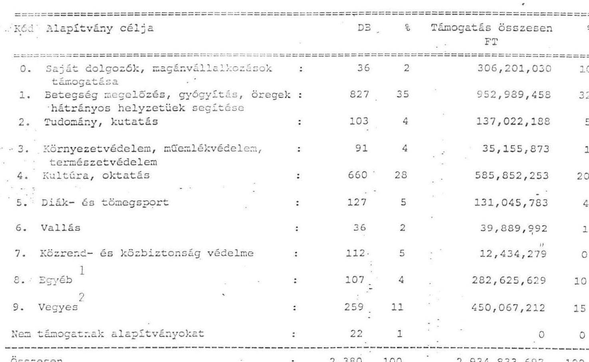

# TÁJÉKOZTATÓ 

az állami tulajdonú vállalatok, gazdasági társaságok és az önkormányzatok alapítványi hozzájárulásairól

---

A vizsgálatot vezette: Halász Géza számvevő igazgatóhelyettes IV. Vagyonellenőrzési Igazgatóságról a vizsgálatban részt vettek:

|  Harsányi Sándor | osztályvezető főtanácsos  |
| --- | --- |
|  Rundle János | számvevő tanácsos  |
|  dr. Szöllősi Géza | számvevő tanácsos  |
|  Szücs Ivánné | számvevő  |

V. Önkormányzati és Területi Ellenőrzési Igazgatóságról a vizsgálatban részt vett:

Nagy József számvevő igazgatóhelyettes, valamint a 18 kirendeltség valamennyi munkatársa

---

# TARTALOMJEGYZÉK 

## oldal

I . BEVEZETÉS ..... 1 .
II. A TÖRVÉNYESSÉG SZEMPONTJAI AZ ÁLLAMI VÁLLALATOK ÉS GAZDASÁGI TÁRSASÁGOK ESETÉBEN ..... 3.
III. AZ ÁLLAMI VÁLLALATOK, GAZDASÁGI TÁRSASÁGOK KÖRÉBEN FELDOLGOZOTT TANÚSÍTVÁNYOK ÉRTÉKELÉSE ..... 7.
IV. AZ ÖNKORMÁNYZATOK ÁLTAL AZ ALAPÍTVÁNYOKNAK NYÚJTOTT TÁMOGATÁSOK FELMÉRÉSÉRŐL ..... 11 .
V. ÖSSZEFOGLALÓ KÖVETKEZTETÉSEK ..... 14.

---

# TÁJÉKOZTATÓ 

az állami tulajdonú vállalatok, gazdasági társaságok és a helyi önkormányzatok alapítványi hozzájárulásairól

## I.

## BEVEZETÉS

Az Országgyűlés Számvevőszéki Bizottsága 1993. április 22-i ülésén felkérte az Állami Számvevőszéket, hogy lehetőségei szerint adjon tájékoztatást az állami költségvetési szervek, az állami tulajdonú vállalatok, gazdasági társaságok, valamint a helyi önkormányzatok által az alapítványoknak nyújtott támogatásáról. E tájékoztatóban az állami költségvetésből gazdálkodó szervezetek alapítványi hozzájárulásairól nem történik említés, mivel e témakörben az Állami Számvevőszék külön vizsgálatot végez.

A feladatot az Állami Számvevőszék értelmezte és megállapította, hogy az alapítványoknak nyújtott támogatások ellenőrzése területek az állam vállalkozói vagyona körében csak törvényességi szempontú ellenőrzés folytatható, amit a vizsgálatra kijelölt időszakban, 1989. január 1. - 1993. június 30. között célszerűtlen lett volna elvégezni. A hatályos jogszabályok szerint mind a vállalatok, mind az alapítványok a működést illetően a gazdálkodás szabályainak betartásával teljes szabadságot élveztek.

---

Hasonló a helyzet a helyi önkormányzatoknál is, mivel a döntés joga kizárólagosan a képviselő-testület jogkörébe tartozik. Mindenféle adminisztrációs jellegű megkötöttség nélkül a helyi önkormányzat támogathat alapítványokat.

Mindezek alapján az Állami Számvevőszék egy olyan tájékozódást, felmérést végzett, amelynek célja az volt, hogy a számvevőszéki jogosítványok adta kereteken belül az Állami Vagyonügynökség, az Állami Vagyonkezelő Rt., a minisztériumok felügyelete alatt álló közszolgáltató tevékenységet ellátó vállalatok, gazdasági társaságok, valamint a helyi önkormányzatok által az alapítványoknak adott hozzájárulásairól olyan információkat kapjon, amelyeknek a feldolgozása, elemzése révén megfelelő tájékoztatás adható.

A tájékozódás alapinformációinak gyűjtése tanúsítvány (1. sz. melléklet) formában kért kérdőíves módszerrel történt, amit a kapott adatok számítógépes feldolgozása, illetve kiértékelése követett. Az információgyűjtés a teljes, ún. állami tulajdonú vállalati kört célozta meg. Az önkormányzatoknál az Állami Számvevőszék aktuális vizsgálataihoz kapcsolódva történt a felmérés.

A módosított válaszadási határidőig, 1993. október 25-ig, 975 vállalat 8343 tanúsítványa érkezett meg. Az önkormányzatok körében végzett felmérés 1993. október 30-ig 1523 tételre terjedt ki 241 polgármesteri hivatalnál.

Az értékelést e sokaság adatai alapján végeztük el. Az adatszolgáltatás teljeskörűsége nem volt elérhető, mert sem a nemleges választ küldők ellenőrzésének, sem az esetleg hibás adatokat szolgáltatók kiszűrésének a gyakorlati lehetősége nem állt fenn. Mindezen túlmenően az Állami Vagyonügynökséghez tartozó mintegy 400 vállalat egyáltalán nem küldött tanúsítványt olyan időszakban, amikor az ÁVÜ sem tudta pontosan, hogy az 1993. július 1-ei határidővel hozzá került gazdálkodó szervezeteknek mi a pontos száma, következésképpen számos esetben megnevezni sem tudták azokat. (Ezen vállalati körből vélelmezhetően számosan meg is szüntek.)

---

Az Állami Számvevőszéknek ezt az összegzését az ismertetett indokok és okok miatt nem előzte meg helyszíni ellenőrzés.

A bekért tanúsítványok formailag nem titkosítottak, azonban több pénzintézet bejelentette, hogy az egyedi adataik banktitkot képeznek.

# II. 

## A TÖRVÉNYESSÉG SZEMPONTJAI AZ ÁLLAMI VÁLLALATOK ÉS GAZDASÁGI TÁRSASÁGOK ESETÉBEN

Megvizsgáltuk az állami vállalatokra és a gazdasági társaságokra vonatkozó jogszabályokat, abból a szempontból, hogy alapítványlétesítési, illetve támogatási tevékenységüket milyen jogi keretek között végezhetik.
Állami Számvevőszék lehetséges ellenőrzési szempontjaira az alábbi törvényi előírások adnak eligazítást:

1. A Magyar Köztársaság Polgári törvénykönyvéről szóló 1959. évi IV. törvény (Ptk.) 74/A. §-a (ezt a §-t az 1990.: I. törvény 1. §-a léptette hatályba.) "Magánszemély és jogi személy (a továbbiakban együtt: alapító) tartós közérdekű célra alapító okiratban alapítványt hozhat létre". 1987-1990. január 31-ig az alapítvány létrejöttéhez az illetékes állami felügyelő szerv jóváhagyására volt szükség; 1990. február 1-től a bíróságokra, illetve az ügyészségekre tartoznak az alapítványi ügyek úgy mint a nyilvántartásba vétel, illetve törvényességi felügyelet.
2. Az állami vállalatokról szóló 1977. évi VI. törvény és a végrehajtására kiadott 33/1984. (X.31.) MT rendelet. Törv. 22 § (3) bek. "A vállalatot a gazdálkodás, a rábízott vagyon kezelése körében minden olyan jog megilleti, amelyet tőle jogszabály kifejezetten nem von el."

---

3. Az 1988. évi VI. törvény a gazdasági társaságokról 1 § (2) bekezdése szerint "A gazdasági társaságok saját cégnevük alatt jogokat szerezhetnek és kötelezettségeket vállalhatnak, így különösen tulajdont szerezhetnek, szerződést köthetnek, pert indíthatnak és perelhetők."
4. Az 1988. évi IX. törvény a vállalkozási nyereségadóról (hatályon kívül 1992. január 1-től), illetve az 1991. évi LXXXVI. törvény a társasági adóról elismeri és támogatja - a jogszabályban meghatározott célra alakult - alapítványoknak juttatott összegeket (adóalap csökkentő tényező).

A két jogszabály közötti különbség, hogy az első csak az "alapítványt" jelöli meg, míg a második tételesen felsorolja az állam által elismert és támogatott társadalmi célokat, melyek elérésére alapítványok hozhatók létre.
5. Az állam vállalatokra bízott vagyonának védelméről rendelkező 1990. évi VIII. törvény (hatályon kívül helyezte az 1992. évi LV. törvény 1992. augusztus 30-án), illetve az időlegesen állami tulajdonban lévő vagyon értékesítéséről, hasznosításáról és védelméről szóló 1992. évi LIV. törvény előírásai nem vonatkoznak vállalati alapítvány létrehozására, illetve alapítványok támogatására.

Mindezen túl az első jogszabály indokolásában szerepel a törvényhozó azon akarata, hogy "Indokolatlan lenne és nem kívánatos eredményre vezetne a vállalati összvagyonhoz képest csekély értékű ügyleteknek állami ellenőrzés alá vonása."

Ezen előírások szerint az állami vállalatok és gazdasági társaságok a kérdéses időszakban jogi korlátozás nélkül hozhattak létre, illetve támogathattak (az állami célnak megfelelően alakított és bejegyzett) alapítványokat. Azt pedig, hogy az alapítvány a törvényi kritériumoknak megfelel-e, azt a bíróság a bejegyzéssel eldöntötte.

Több jogszabály lehetőséget biztosít az alapítói jogokat gyakorló szerv, az állam tulajdonosi jogosítványainak gyakorlója és a kormány részére, hogy az állami vállalatok, illetve társaságok vagyonából alapítványt hozzanak létre, illetve támogassanak. Ezek az alábbiak:

1. A 72/1992. (IV.28.) Kormányrendelet 1. §-a "az alapítói jogokat gyakorló szerv az államigazgatási felügyelet alatt álló vállalat egyes vagyontárgyait elvonhatja és az ágazat tevékenységi körébe tartozó alapítványi célra fordíthatja.".
2. Az 1992. évi Vagyonpolitikai Irányelvekről szóló 71/1992. (XI.6.) OGY. határozat 3.2 pontja: " Az időlegesen állami tulajdonban maradó társasági részesedéseket az állam tulajdonosi jogosítványainak gyakorlója - a törvényi előírásoknak megfelelően - ingyenesen átadhatja az irányelvek 6. pontjában szereplő szervezeteknek, az ott rögzített módon;"

Az állami vagyon ingyenes átadására akkor kerül sor, ha az,

- olyan alapítvány részére történő vagyonátadást jelent, amely költségvetési tehervállalást vált ki, illetve helyettesít;
- az átalakuló, illetve privatizálandó állami vállalatok jóléti - szociális vagyon tárgyait az állam tulajdonosi jogosítványait gyakorló szervezete, amennyiben a vállalat munkavállalói igénylik, foglalkoztatási, jóléti és a szociális alapítványok részére ingyenesen átadhatja, ha az a szolgáltatási feladatok végleges átvállalását jelenti, és a költségeket a kedvezményezettek munkáltatói és a szolgáltatást igénybe vevők viselik.

---

3. A tartósan állami tulajdonban maradó vállalkozói vagyon kezeléséről és hasznosításáról szóló 1992. LIII. törvény 31. § (4) bek. "a Kormány külön rendeletben határozza meg azokat az állami közfeladatokat ellátó vállalatokat, amelyek helyett, vagy vagyonának egy részéből - a vállalat gazdasági társasággá történő átalakítása során, a kormány által meghatározott feltételek szerint - e törvény hatályba lépését követő hat hónapon belül költségvetési szerveket, vagy alapítványt kell létrehozni."

Az állami vállalatok, illetve állami tulajdonú társaságok vagyonának ily módon történő alapítványba vitele törvényességi szempontból vizsgálható lenne, azonban figyelembe kell venni az pénzügyi és időbeli korlátokat, illetve a csekély gyakoriságot.

Ezek a vizsgálati lehetőségek néhány kisebb jelentőségű tényállásra vonatkozhatnak:

- az 1992. évi Vagyonpolitikai Irányelvek 1992. november 6-án léptek hatályba; az ellenőrzésünk végső határa 1993. június 30. (nyolc hónap esik a vizsgálat idejére);- nincs tudomásunk olyan kormányrendeletről, mely 1992. augusztus 30. és 1993. június 30-a között vállalatból alapítványt hozott volna létre;
- az alapítói jogokat gyakorló szerv "egyes vagyontárgyakat" vonhat el és fordíthatja alapítványi célra. (Vizsgálható időtartam: 1992. április 28-tól 1993. június 30-ig.)

Mindezek alapján szabályossági, törvényességi vizsgálat lefolytatása nem volt célszerű, hiszen ellentétben a költségvetési szerveket érintő szabályozással az alapítványoknak juttatott pénzügyi eszközök alapítványi célú adományozása jogi szabályozási akadályokba nem ütközött. A nem pénzügyi eszközökként megjelenő vagyontárgyak és szolgáltatások köre szűk, a jogi szabályozási korlátok a vizsgálható időszakot rendkívül lerövidítik. A rendelkezésre álló tanúsítványok a szűk speciális terület áttekintésére egyébként sem adnak módot. Új adatszolgáltatás bekérésére lenne szükség és ismét csak azok feldolgozása után lenne esetleg lehetőség további vizsgálat céljainak meghatározására. A feldolgozott tanúsítványok szerint tárgyi vagyonjuttatásra a most áttekintett 4,5 éves időszakban összesen 1277 millió Ft-ot fordítottak. Több mint 400 tanúsítvány tételes átvizsgálásakor tárgyi vagyonjuttatásként egyetlen ingatlan sem szerepelt, bár ez nem zárható ki. Ugyanakkor a törvényességi szempontból vizsgálható időszak meg sem közelíti azt a 4,5 évnyi időtartamot, amelyre vonatkozóan a tárgyi vagyonjuttatás értékét bemutattuk.

# III. 

## AZ ÁLLAMI VÁLLALATOK, GAZDASÁGI TÁRSASÁGOK KÖRÉBEN FELDOLGOZOTT TANÚSÍTVÁNYOK ÉRTÉKELÉSE

Az Állami Vagyonügynökséghez és az Állami Vagyonkezelő Részvénytársasághoz továbbá a minisztériumhoz tartozó közszolgáltató tevékenységet ellátó 975 vállalatból 259 nem támogatott alapítványokat. (2. sz. melléklet)

A 716 támogató vállalat 11.675 millió Ft összes hozzájárulásából tárgyi vagyonjuttatásra összesen 1277 millió Ft-ot (11 %), fordított. Ebből alapításhoz 569 millió Ft-tal, működéshez 708 millió Ft-tal járultak. A pénzátadás összesen 10.398 millió Ft volt, melyből alapításhoz 3338 millió Ft-ot, működéshez pedig 7060 millió Ft-ot juttattak.

Az alapítványi támogatás 1989 és 1992 között folyamatosan emelkedett és várhatóan 1993-ban is emelkedni fog, hiszen fél év alatt majdnem 2 milliárd Ft-ot ért el.

---

A tanúsítványok teljes köréből véletlenszerűen kiválasztott 219 vállalat 2380 tanúsítványát feldolgoztuk az alapítvány céljának megjelölése szerint. A mintaként megjelölt vállalatok összesen 2935 millió Ft-al támogattak alapítványokat. Ebből az alapítványok részére 493 millió Ft tárgyi vagyonjuttatás, 2442 millió Ft pedig pénzátadás volt. (3. sz. melléklet)

Ezzel a reprezentáció a darabszámot illetően 28,5 %-os, az értéket illetően pedig 25 %-os az összes tanúsítványra vetítve. Az alapítvány célja szerint mintaként megjelölt és értékeit tanúsítványok jelzik, hogy a legmagasabb (35 %) a hozzájárulás mértéke a betegségmegelőzés, gyógyítás, öregek, hátrányos helyzetűek segítésének területére irányult. Jelentős (28 %) a kultúra, oktatás támogatása is. Magas az aránya (11 %) azoknak a vállalatoknak, amelyek egy tanúsítványon több célt
 jelöltek meg hozzájárulásként. A saját dolgozók, a magánvállalkozások támogatása, a dolgozói érdekeltség biztosítása 2%-al támogatott. (4. sz. melléklet)

Az egy tanúsítványra jutó fajlagos hozzájárulás mértéke a legmagasabb - 8505 ezer Ft - a saját dolgozó, magánvállalkozású támogatása, a dolgozói érdekeltség biztosítása esetén. Jelentős, 2641 ezer Ft (az egyéb) és 1738 ezer Ft (a vegyes) azoknak a vállalatoknak a fajlagos támogatása, amelyek egy tanúsítványon több célt jelöltek meg. Legalacsonyabb fajlagos támogatottságú cél 111 ezer Ft-tal, a közrend és a közbiztonság védelme.

Az alapítványok évenkénti támogatási összegének az alapítványi támogatási célokhoz funkcióban közelálló tárcák költségvetési kiadásaival való összehasonlítás bár durva megfelelés, de az arányok érzékeltetésére még is alkalmas. (Számításba vett tárcák: Belügyminisztérium, Népjóléti Minisztérium, Munkaügyi Minisztérium, Művelődési és Oktatási Minisztérium, Környezetvédelmi és Területfejlesztési Minisztérium, valamint a Magyar Tudomá-

---

nyos Akadémia.) Eszerint 1989-ben az alapítványoknak juttatott támogatás a vázolt konglomerátum költségvetési kiadásainak 1,7%-át, 1990-ben 1,8%-át, 1991. és 1992-ben 0,5%-át jelentette. Nyilvánvaló, hogy a vizsgálati körben tartozó vállalatok és társaságok alapítványi támogatásának jelentősége nem elsősorban a költségvetési tehervállalás csökkentésében van.

Rendkívül tanulságos az alapítványonként 10 millió Ft feletti hozzájárulás belső struktúrájának alakulása. Megállapítható, hogy a nagyösszegű egyszeri alapítványoknak juttatott támogatás fő hordozói a bankok. Arányuk a támogatásban 50-55% közötti, kivéve 1991-et, ahol 30%. Kitüntetett szerepet vállalt az alapítványok támogatásában a MATÁV, amely 1990. évi 13%-os arányát 1991-ben 30,3%-ra, 1992-ben 32,4%-ra emelte. Ezzel párhuzamosan az összes többi vállalat részesedése az 1989. évi kereken 39%-ról 1991-1992-re 19, illetve 16%-ra csökkent. A Magyar Posta Vállalat Rt. e körbeni támogatási részesedése évenként 4-6,5% között alakult.

Az alapítványoknak juttatott támogatások jellemző nagyságrendje 10.000-500.000 Ft közötti tartományba esik. 1989-ben az összes adományozó vállalat 75%-a, 1990-ben 68%-a, 1991-ben 56%-a, 1992-ben 65%-a esett ebbe az értékintervallumba. 5 millió Ft alatt 1989-1990-ben az adományozó vállalatok 91%-a, 1991-ben 85%-a és 1992-ben 90%-a nyújtott támogatást. (5. sz. melléklet).

Mivel az alapítványoknak adott és különböző forrásból származó juttatásoknak meghatározó hányadát a vállalkozói szféra adja, ezen belül is jelentős az állam vállalkozói vagyonának a szerepe, a közvéleményben túlzottnak tekinthető vélemények terjedtek el ezek nagyságrendjét illetően.

Az aktuális éves állami költségvetések kiadási főösszegeinek teljesítéséhez viszonyítva az állami tulajdonú (részben vagy

---

egészben) vállalkozói vagyon köréből az alapítványoknak juttatott támogatások csekély arányúak: az 1990-1992. évek átlagában egyharmad %-ot tesznek ki:

|  | Az állami költségvetés | Az alapítványoknak | A juttatás |
| :--: | :--: | :--: | :--: |
| Év | kiadási főösszege   (teljesítés) | juttatott "állami"   vállalati támogatás | aránya a ki-   adási fő-   összeghez |
|  | millió forint |  | % |
| 1989 | 589092 | 1098,7 | 0,18 |
| 1990 | 642266 | 2328,6 | 0,36 |
| 1991 | 830645 | 2664,9 | 0,32 |
| 1992 | 990424 | 3499,5 | 0,35 |

Megjegyzés: Az 1. sz mellékletben közölt "év nélkül" megadott összeggel az adott évi értékek arányosan helyesbítettek.

Még kisebb viszonyszámokat kapunk, ha ugyanezeket a vállalati támogatásokat a bruttó hazai termékhez (GDP) viszonyítjuk. 1989-ben ezen alapítványi támogatások a GDP 0,06%-át, 1990-ben 0,11 és 1991-ben 0,12%-át tették ki. (A bruttó hazai termék 1989-ben 1710,8 milliárd, 1990-ben 2079,5 milliárd és 1991-ben 2301,5 milliárd Ft volt a Központi Statisztikai Hivatal számításai szerint.)

Ebben a megközelítésben a tercier szektorba áramló alapítványi támogatások nem túl magasak. Valódi képet viszont a vállalkozói szféra alapítványi támogatásairól akkor lehetne kapni, ha a magánszektor e célra juttatott támogatásait is figyelembe vehetnénk.

---

# IV. 

## AZ ÖNKORMÁNYZATOK ÁLTAL AZ ALAPÍTVÁNYOKNAK NYÚJTOTT TÁMOGATÁSOK FELMÉRÉSÉRŐL

Az Államháztartásról szóló 1992. évi XXXVIII. törvény 94. paragrafus (1.) bekezdése szerint a helyi önkormányzatok polgármesteri hivatalai, illetve az intézményei akkor támogathatják az alapítványokat, ha azt előzetesen a képviselőtestület engedélyezi.

Az adatfelmérés tanúsága szerint 72 (4,7%) esetben a képviselőtestület jóváhagyása nélkül történt az alapítványi támogatás. Ez a gyakorlat ellentétes az Államháztartásról szóló 1992. évi XXXVIII. törvényben foglaltakkal. Az önkormányzatok polgármesteri hivatalai alapítványi támogatási gyakorlatának a vizsgálata az önkormányzat pénzügyi ellenőrzési bizottságának a feladata. A bizottság általános ellenőrzési funkciót gyakorol, a képviselőtestület felügyelete alatt működő végrehajtó szervezeteknél. Az alapítványi támogatások ilyen módon történő ellenőrzéséről információval nem rendelkezünk, tekintettel arra, hogy a számvevőszék nem ellenőrzést végzett, csupán adatfelmérés alá vont 241 önkormányzatot.

Az önkormányzatok által az alapítványoknak nyújtott
támogatások felmérésének eredményei

A helyi önkormányzatok polgármesteri hivatalai 1992-ben országosan összesen: 1,37 milliárd, az intézményeik 83 millió, együttesen 1,43 milliárd Ft összegű támogatást nyújtottak a különböző társadalompolitikai célzattal működő alapítványokat. Ez a támogatási volumen az össz költségvetési kiadási összegnek a 0,2%-át tette ki. Felmérésünk 1993. június 20. - október 30-a között 241 önkormányzatra (az önkormányzatok 7,6%-ára), 1523 támogatási tételre terjedt ki.

---

A felmérés szerint a pénzben és tárgyi eszközökben - 1990-1993. június 30-a között - 1.344.693 Ft-ot fordítottak alapítványi támogatási célokra a felmérési körbe tartozó önkormányzatok (6. sz. melléklet).

A támogatások fele-fele arányban oszlanak meg alapításhoz és működéshez, 21%-át tárgyi és 79%-át pénz formájában adományozták.

A célok szerinti adományok nagyobb hányada kulturális és településfejlesztési célokat szolgált (7. sz. melléklet).

A felmérésből megállapítható, hogy a támogatások döntő részét a nagyobb tőkeerővel rendelkező megyei közgyűlések és városok nyújtották (8-9. sz melléklet). Az előzetes engedély nélkül nyújtott támogatás 6.936 Ft volt, melynek döntő része, 88%-a a megyei és a városi önkormányzatoknál fordult elő.

Például:

Veszprém, Nógrád, Komárom-Esztergom megyékből érkeztek jelzések arra, hogy a képviselőtestület engedélyezése nélkül támogattak alapítványokat. Salgótarján városban az önkormányzat és intézményei összesen 19 alapítványhoz járultak hozzá pénzátadással, illetve tárgyi vagyon juttatással. Hiányosság, hogy ezek közül 13 esetben az önkormányzat képviselőtestülete a helyi önkormányzatokról szóló 1990. évi LXV. tv. 10. §. d. pontjában, illetve az államháztartásról szóló 1992. évi XXXVIII. tv. 94.§ (1) bekezdésében foglalt előírás ellenére a pénzeszközök átadása előtt nem hozott nevesített engedélyező döntést az alapítványokhoz történő hozzájárulásról. Ezen támogatások 20.000-1.000.000 Ft között szóródtak. Ugyancsak a Nógrád megyei Szécsény városban az önkormányzat és intézményei összesen 8 alapítványhoz járultak hozzá pénzátadással. A hiányosság az volt, hogy ezek közül 5

---

esetben a pénzátadás előtt az önkormányzat nem hozott döntést a támogatásról; az egyes tételek 1.000-1.000.000 Ft között szóródtak. Esztergom városban a 29 alapítványi támogatás közül 19 esetben testületi döntés nem született a támogatásokról. Meglehetősen kis összegekben is támogattak alapítványokat, 1.000-500.000 Ft között, a támogatás átlagos összege 100.000 Ft-ra tehető. A rendelkezésre álló információk szerint az alapítványok egy része nyitott. Így ezek a helyi feladatok alapítványi formában történő ellátásához a jogi és természetes személyek adományait is szélesebb körben gyűjthetik, ezáltal többlet forrást teremthetnek.

A magánszemélyek alapítványhoz történő hozzájárulása (adománya) az adóalapból leírható. Előzőek következtében az önkormányzatok az érintett feladatok alapítványi formában történő megoldásában érdekeltek.

Az adatgyűjtést és az elemzést nehezítette, hogy az önkormányzatok alapítványi célú támogatásait a költségvetési beszámoló adataival elvileg egyeztetni lehetett volna, azonban ezt nem minden esetben tudtuk végrehajtani, mert az ilyen célú pénzfelhasználások többségét - főképpen ezt Veszprém megyében tapasztaltuk - nem az alapítványoknak nyújtott támogatások jogcímén, hanem egyéb folyó kiadásként, például felújítási pénzeszköz felhasználásként számolták el.

Az adatlapok begyűjtése és annak felülvizsgálata során a helytelen gyakorlatra a figyelmet felhívtuk.

Az önkormányzatok a legnagyobb összegű támogatásokat a kulturális, településfejlesztési célra, oktatásra, szociális és egészségügyi célokra fordították.

Összegszerűségében lényegesen szerényebb, 57,5 millióval támogatták a sport célokat, illetve 33,8 millió Ft-tal a rendőrséget.

---

# V. 

## ÖSSZEFOGLALÓ KÖVETKEZTETÉSEK

A vizsgált időszakban az Ávü-höz, az Áv Rt-hez és a tárcákhoz tartozó közszolgáltató jellegű vállalatoknál az alapítványhoz való hozzájárulást jogszabály semmilyen módon nem korlátozta, sőt az adórendszer előnyben részesítette.

Az alapítványokhoz való hozzájárulás tételes ellenőrzését az APEH az éves adóbevalláshoz kapcsolódóan elvégzi, hiszen csak így állapítható meg az alapítványi hozzájáruláshoz fűződő adókedvezmény mértéke és valódisága.

Az Állami Számvevőszékhez - a tulajdonosi funkciókat gyakorlók közvetítésével - az állam vállalkozói vagyonát meghatározó vállalatoktól, társaságoktól az alapítványokhoz való hozzájárulásokról szóló információk tanúsítványok formájában megérkeztek.

Az alapítványi hozzájárulások struktúrája azt jelzi, hogy nagyságrendjük jellemzően 10.000 - 500.000 Ft közötti. A 10 millió Ft feletti alapítványi hozzájárulás döntő részét az ÁVÜ, ÁV Rt. portfóliójába tartozó bankok, illetve a MATÁV adták.

Az alapítványok céljai szerinti adatösszesítésből kitűnik, hogy a hozzájárulás döntően a társadalmilag szükségesnek ítélt területekre irányult, ugyanakkor az is megállapítható, hogy a négy

---

és fél év alatt mintegy 11,7 milliárd forintot kitevő vállalati és az önkormányzati mintából felszorzással becsülhető 18,8 milliárd Ft nagyságrendű támogatások (ami éves átlagban 6,78 milliárd Ft-nak felel meg) az állami költségvetés ezirányú tehervállalásának csak kis hányadához mérhetők.

Budapest, 1994. április 7.

Mellékletek: 1-9. sz.

---

# M E L L É K L E T E K 

a V-27-946/1993-94. sz. Tájékoztatóhoz
1994. április

---

a hozzájáruló szerv neve, címe

T A N Ú S Í T V Á N Y
alapítványhoz való hozzájárulásról
megalakulástól 1993. június 30-ig

1. A kedvezményezett alapítvány
neve, székhelye:
2. Az alapítvány célja:
3. Az alapító neve, címe:
4. Az alapítvány kezelő szerve /kuratórium/
és annak vezetője:
5. Az alapítvány részére /az átadás
pontos időbeli megjelölésével/
5.1. Tárgyi vagyon juttatás /Ft/
5.1.1. alapításhoz:
5.1.2. működés során:
5.2. pénzátadás /Ft/:
5.2.1. alapításhoz:
5.2.2. működés során:
6. Az alapítványhoz való hozzájárulás jellege:
6.1. alapítóként:
6.2. csatlakozóként:
6.3. adományozóként:
7. Az alapítványhoz való hozzájárulás
jogszabályi alapja, illetve a Kormány engedélyének kelte, száma:

Kelt:
Készítette:
Ellenőrizte:
A hozzájáruló szerv vezetője:

---

# 2. sz. melléklet

## Vállalatok alapítványi támogatásai MINDÖSSZESEN

A feldolgozott vállalatok száma : 975 db

|  1989 | 1990 | 1991 | 1992 | 1993 | Év nélkül | Összesen | %  |
| --- | --- | --- | --- | --- | --- | --- | --- |
|  5.1.1. TÁRGYI VAGYON ALAPÍTÁSHOZ: |  |  |  |  |  |  |   |
|  793,000 | 119,949,574 | 268,353,345 | 94,153,551 | 550,000 | 85,200,153 | 568,906,623 | 45  |
|  5.1.2. TÁRGYI VAGYON MŰKÖDÉS SORÁN: |  |  |  |  |  |  |   |
|  116,153,346 | 11,627,610 | 211,658,621 | 262,105,382 | 37,512,658 | 66,570,912 | 707,638,529 | 55  |
|  5.1. TÁRGYI VAGYON ÖSSZESEN: |  |  |  |  |  |  |   |
|  119,853,346 | 131,587,184 | 480,011,966 | 356,258,933 | 38,062,658 | 151,771,065 | 1,276,545,152 | 100  |
|  5.2.1. PÉNZÁTADÁS ALAPÍTÁSHOZ: |  |  |  |  |

 |  |   |
|  532,703,334 | 1,342,168,314 | 506,891,749 | 545,339,742 | 139,718,700 | 271,650,811 | 3,338,472,650 | 32  |
|  5.2.2. PÉNZÁTADÁS MÜKÖDÉS SORÁN: |  |  |  |  |  |  |   |
|  379,305,435 | 711,062,435 | 1,513,527,047 | 2,381,638,884 | 1,776,925,756 | 297,447,795 | 7,059,907,352 | 68  |
|  5.2.3. PÉNZÁTADÁS ÖSSZESEN: |  |  |  |  |  |  |   |
|  912,008,769 | 2,053,230,749 | 2,020,418,796 | 2,926,978,626 | 1,916,644,456 | 569,098,606 | 10,398,380,002 | 100  |
|  5.3. MINDÖSSZESEN: |  |  |  |  |  |  |   |
|  1,690,842,115 | 2,184,817,933 | 2,500,430,762 | 3,283,237,559 | 1,954,707,114 | 720,869,671 | 11,674,925,154 | 100  |

---

Vállalatok alapítványi támogatásai összesen: ÁVÜ

A feldolgozott vállalatok száma : 714 db . FT - ban

|  1989 | 1990 | 1991 | 1992 | 1993 | Év nélkül | ÖSSZESEN | %  |
| --- | --- | --- | --- | --- | --- | --- | --- |
|  5.1.1. TÁRGYI VAGYON ALAPÍTÁSHOZ: |  |  |  |  |  |  |   |
|  700,000 | 54,252,574 | 218,971,422 | 28,266,214 | 0 | 48,311,140 | 350,501,350 | 52  |
|  5.1.2. TÁRGYI VAGYON MÜKÖDÉS SORÁN: |  |  |  |  |  |  |   |
|  109,510,524 | 10,137,897 | 91,873,787 | 64,180,334 | 16,426,719 | 34,999,199 | 327,128,460 | 48  |
|  5.1. TÁRGYI VAGYON ÖSSZESEN: |  |  |  |  |  |  |   |
|  110,210,524 | 64,390,471 | 310,845,209 | 92,446,548 | 16,426,719 | 83,310,339 | 677,629,810 | 100  |
|  5.2.1. PÉNZÁTADÁS ALAPÍTÁSHOZ: |  |  |  |  |  |  |   |
|  36,183,334 | 352,173,014 | 134,259,683 | 19,892,800 | 4,409,700 | 36,452,265 | 583,370,796 | 39  |
|  5.2.2. PÉNZÁTADÁS MÜKÖDÉS SORÁN: |  |  |  |  |  |  |   |
|  71,023,885 | 146,298,230 | 267,417,098 | 254,272,572 | 85,368,316 | 103,784,655 | 928,164,756 | 61  |
|  5.2. PÉNZÁTADÁS ÖSSZESEN: |  |  |  |  |  |  |   |
|  107,207,219 | 498,471,244 | 401,676,781 | 274,165,372 | 89,778,016 | 140,236,920 | 1,511,535,552 | 100  |
|  5. MINDÖSSZESEN: |  |  |  |  |  |  |   |
|  217,417,743 | 562,861,715 | 712,521,990 | 366,611,920 | 106,204,735 | 223,547,259 | 2,189,165,362 | 100  |

---

Megoszlási viszonyszámok, Ávü

|  1989 | 1990 | 1991 | 1992 | 1993 | Év nélekü | Összesen  |
| --- | --- | --- | --- | --- | --- | --- |
|  5.1.1. |  |  |  |  |  |   |
|  1 | 84 | 70 | 31 | 0 | 58 | 52  |
|  5.1.2. |  |  |  |  |  |   |
|  99 | 16 | 30 | 69 | 100 | 42 | 48  |
|  5.1. |  |  |  |  |  |   |
|  100 | 100 | 100 | 100 | 100 | 100 | 100  |
|  5.2.1. |  |  |  |  |  |   |
|  34 | 70 | 33 | 7 | 5 | 26 | 38  |
|  5.2.2. |  |  |  |  |  |   |
|  66 | 30 | 67 | 93 | 95 | 74 | 62  |
|  5.2. |  |  |  |  |  |   |
|  100 | 100 | 100 | 100 | 100 | 100 | 100  |
|  5.1. |  |  |  |  |  |   |
|  51 | 12 | 44 | 25 | 16 | 37 | 31  |
|  5.2. |  |  |  |  |  |   |
|  49 | 88 | 56 | 75 | 84 | 63 | 69  |
|  5.1. |  |  |  |  |  |   |
|  100 | 100 | 100 | 100 | 100 | 100 | 100  |

---

Vállalatok alapítványi támogatásai összesen: ÁV RT

A feldolgozott vállalatok száma : 162 db . FT - ban

|  1989 | 1990 | 1991 | 1992 | 1993 | Év nélkül | Összesen | %  |
| --- | --- | --- | --- | --- | --- | --- | --- |
|  5.1.1. TÁRGYI VAGYON ALAPÍTÁSHOZ: |  |  |  |  |  |  |   |
|  0 | 57,074,000 | 28,946,361 | 54,515,289 | 0 | 35,724,166 | 176,259,816 | 38  |
|  5.1.2. TÁRGYI VAGYON MÜKÖDÉS SORÁN: |  |  |  |  |  |  |   |
|  8,603,934 | 1,374,834 | 51,682,851 | 172,755,038 | 16,526,921 | 30,619,181 | 281,562,759 | 62  |
|  5.1. TÁRGYI VAGYON ÖSSZESEN: |  |  |  |  |  |  |   |
|  8,603,934 | 58,448,834 | 80,629,212 | 227,270,327 | 16,526,921 | 66,343,347 | 457,822,575 | 100  |
|  5.2.1. PÉNZÁTADÁS ALAPÍTÁSHOZ: |  |  |  |  |  |  |   |
|  434,840,000 | 981,537,000 | 360,572,066 | 515,181,942 | 129,670,000 | 227,398,546 | 2,649,199,554 | 32  |
|  5.2.2. PÉNZÁTADÁS MÜKÖDÉS SORÁN: |  |  |  |  |  |  |   |
|  304,891,000 | 465,097,405 | 1,129,863,197 | 2,020,795,264 | 1,615,779,795 | 191,687,540 | 5,728,114,201 | 68  |
|  5.3. PÉNZÁTADÁS ÖSSZESEN: |  |  |  |  |  |  |   |
|  739,731,000 | 1,446,634,405 | 1,490,435,263 | 2,535,977,206 | 1,745,449,795 | 419,086,086 | 8,377,313,755 | 100  |
|  5. MINDÖSSZESEN: |  |  |  |  |  |  |   |
|  748,334,934 | 1,446,634,405 | 1,571,064,475 | 2,763,247,533 | 1,761,976,716 | 485,429,433 | 8,835,136,330 | 100  |

---

Megoszlási viszonyszámok, Av RT

|  1989 | 1990 | 1991 | 1992 | 1993 | Av nélkül | ÖsszeSZN  |
| --- | --- | --- | --- | --- | --- | --- |
|  5.1.1. |  |  |  |  |  |   |
|  5.1.2. |  |  |  |  | 54 | 38  |
|  5.1. |  |  |  |  |  |   |
|  5.1. |  |  |  |  |  |   |
|  5.2.1. |  |  |  |  |  |   |
|  5.2.2. |  |  |  |  |  |   |
|  5.2. |  |  |  |  |  |   |
|  5.2. |  |  |  |  |  |   |
|  5.1. |  |  |  |  |  |   |
|  5.2. |  |  |  |  |  |   |
|  5.2. |  |  |  |  |  |   |
|  5.2. |  |  |  |  |  |   |
|  5.1. |  |  |  |  |  |   |
|  5.2. |  |  |  |  |  |   |
|  5.2. |  |  |  |  |  |   |
|  5.2. |  |  |  |  |  |   |
|  5.2. |  |  |  |  |  |   |
|  5.2. |  |  |  |  |  |   |
|  5.2. |  |  |  |  |  |   |
|  5.2. |  |  |  |  |  |   |
|  5.2. |  |  |  |  |  |   |
|  5.2. |  |  |  |  |  |   |
|  5.2. |  |  |  |  |  |   |
|  5.2. |  |  |  |  |  |   |
|  5.2. |  |  |  |  |  |   |
|  5.2. |  |  |  |  |  |   |
|  5.2. |  |  |  |  |  |   |
|  5.2. |  |  |  |  |  |   |
|  5.2. | 

 |  |  |  |  |   |
|  5.2. |  |  |  |  |  |   |
|  5.2. |  |  |  |  |  |   |
|  5.2. |  |  |  |  |  |   |
|  5.2. |  |  |  |  |  |   |
|  5.2. |  |  |  |  |  |   |
|  5.2. |  |  |  |  |  |   |
|  5.2. |  |  |  |  |  |   |
|  5.2. |  |  |  |  |  |   |
|  5.2. |  |  |  |  |  |   |
|  5.2. |  |  |  |  |  |   |
|  5.2. |  |  |  |  |  |   |
|  5.2. |  |  |  |  |  |   |
|  5.2. |  |  |  |  |  |   |
|  5.2. |  |  |  |  |  |   |

---

Vállalatok alapítványi támogatásai összesen: MIN

A feldolgozott vállalatok száma : 99 db . FT - ban

|  1989 | 1990 | 1991 | 1992 | 1993 | Év nélkül | Összesen | %  |
| --- | --- | --- | --- | --- | --- | --- | --- |
|  5.1.1. TÁRGYI VAGYON ALAPÍTÁSHOZ: |  |  |  |  |  |  |   |
|  0 | 8,623,000 | 20,435,562 | 11,372,048 | 550,000 | 1,164,847 | 42,145,457 | 30  |
|  5.1.2. TÁRGYI VAGYON MŰKÖDÉS SORÁN: |  |  |  |  |  |  |   |
|  38,888 | 124,879 | 68,101,983 | 25,170,010 | 4,559,018 | 952,532 | 98,947,310 | 70  |
|  5.1. TÁRGYI VAGYON ÖSSZESEN: |  |  |  |  |  |  |   |
|  38,888 | 8,747,879 | 88,537,545 | 36,542,058 | 5,109,018 | 2,117,379 | 141,092,767 | 100  |
|  5.1.1. PÉNZÁTADÁS ALAPÍTÁSHOZ: |  |  |  |  |  |  |   |
|  61,650,000 | 8,458,300 | 12,060,000 | 10,265,000 | 5,639,000 | 7,800,000 | 105,872,300 | 21  |
|  5.1.2. PÉNZÁTADÁS MŰKÖDÉS SORÁN: |  |  |  |  |  |  |   |
|  3,330,550 | 99,666,800 | 116,246,752 | 106,571,048 | 75,777,645 | 1,975,600 | 403,548,395 | 79  |
|  5.1. PÉNZÁTADÁS ÖSSZESEN: |  |  |  |  |  |  |   |
|  65,070,550 | 108,125,100 | 128,306,752 | 116,836,048 | 81,416,645 | 9,775,600 | 509,420,695 | 100  |
|  5.1. MINDÖSSZESEN: |  |  |  |  |  |  |   |
|  65,107,438 | 116,872,979 | 216,844,297 | 153,378,106 | 86,525,663 | 11,892,979 | 650,623,462 | 100  |

---

Megoszlási viszonyszámok, MIN

|  1989 | 1990 | 1991 | 1992 | 1993 | Év nélkül | Összesen |
| :--: | :--: | :--: | :--: | :--: | :--: | :--: |
| 5.1.1. |  |  |  |  |  |  |
| 0 | 99 | 23 | 31 | 11 | 55 | 30 |
| 5.1.2. |  |  |  |  |  |  |
| 100 | 1 | 77 | 69 | 89 | 45 | 70 |
| 5.1. |  |  |  |  |  |  |
| 100 | 100 | 100 | 100 | 100 | 100 | 100 |
| 5.2.1. |  |  |  |  |  |  |
| 95 | 8 | 9 | 9 | 7 | 80 | 21 |
| 5.2.2. |  |  |  |  |  |  |
| 5 | 92 | 91 | 91 | 93 | 20 | 79 |
| 5.2. | 100 | 100 | 100 | 100 | 100 | 100 |
| 5.1. |  |  |  |  |  |  |
| 0 | 7 | 41 | 24 | 6 | 18 | 22 |
| 5.2. |  |  |  |  |  |  |
| 100 | 93 | 59 | 76 | 94 | 82 | 78 |
| 5. |  |  |  |  |  |  |
| 100 | 100 | 100 | 100 | 100 | 100 | 100 |

---

A feldolgozott vállalatok száma összesen : 219 db

|  1989 | 1990 | 1991 | 1992 | 1993 | Év nélkül | Összesen  |
| --- | --- | --- | --- | --- | --- | --- |
|  5.1.1. TÁRGYI VAGYON ALAPÍTÁSHOZ: |  |  |  |  |  |   |
|  0 | 107,681,834 | 111,434,438 | 23,655,254 | 550,000 | 59,926,932 | 303,248,458  |
|  5.1.2. TÁRGYI VAGYON MŰKÖDÉS SORÁN: |  |  |  |  |  |   |
|  85,208 | 5,659,904 | 73,230,208 | 70,099,957 | 8,848,257 | 32,097,781 | 190,021,315  |
|  5.1. TÁRGYI VAGYON ÖSSZESEN: |  |  |  |  |  |   |
|  85,208 | 113,341,738 | 184,664,646 | 93,755,211 | 9,398,257 | 92,024,713 | 493,269,773  |
|  5.2. PÉNZÁTADÁS ALAPÍTÁSHOZ: |  |  |  |  |  |   |
|  167,520,000 | 325,959,314 | 89,753,000 | 41,305,000 | 8,765,000 | 171,488,450 | 804,790,764  |
|  5.2.2. PÉNZÁTADÁS MŰKÖDÉS SORÁN: |  |  |  |  |  |   |
|  20,014,570 | 139,471,726 | 413,436,532 | 579,834,410 | 408,331,567 | 75,684,355 | 1,636,773,160  |
|  5.2. PÉNZÁTADÁS ÖSSZESEN: |  |  |  |  |  |   |
|  187,534,570 | 465,431,040 | 503,189,532 | 621,139,410 | 417,096,567 | 247,172,805 | 2,441,563,924  |
|  5. MINDÖSSZESEN: |  |  |  |  |  |   |
|  187,619,778 | 578,772,778 | 687,854,178 | 714,894,621 | 426,494,824 | 339,197,518 | 2,934,833,697  |

---

A mintaként megjelölt vállalatok alapítványi támogatásai összesen, Ávü.

|   | A feldolgozott vállalatok száma: | 101 db |  |  |  |  |   |
| --- | --- | --- | --- | --- | --- | --- | --- |
|   |  |  |  |  |  | FT - ban |   |
|  1989 | 1990 | 1991 | 1992 | 1993 | Év nélkül | ÖSSZESEN |   |
|  5.1.1. TÁRGYI VAGYON ALAPÍTÁSHOZ: |  |  |  |  |  |  |   |
|  0 | 48,858,834 | 86,386,217 | 11,670,206 | 0 | 40,228,550 | 187,143,807 |   |
|  5.1.2. TÁRGYI VAGYON MŰKÖDÉS SORÁN: |  |  |  |  |  |  |   |
|  46,320 | 5,449,070 | 62,402,641 | 52,345,347 | 7,012,132 | 29,401,591 | 156,657,101 |   |
|  5.1. TÁRGYI VAGYON ÖSSZESEN: |  |  |  |  |  |  |   |
|  46,320 | 54,307,904 | 148,788,858 | 64,015,553 | 7,012,132 | 69,630,141 | 343,800,908 |   |
|  5.2.1. PÉNZÁTADÁS ALAPÍTÁSHOZ: |  |  |  |  |  |  |   |
|  24,085,000 | 290,431,014 | 49,440,000 | 11,605,000 | 465,000 | 21,188,450 | 397,214,464 |   |
|  5.2.2. PÉNZÁTADÁS MŰKÖDÉS SORÁN: |  |  |  |  |  |  |   |
|  10,779,020 | 24,390,030 | 181,494,601 | 142,545,300 | 49,688,351 | 23,004,500 | 431,901,802 |   |
|  5.2. PÉNZÁTADÁS ÖSSZESEN: |  |  |  |  |  |  |   |
|  34,864,020 | 314,821,044 | 230,934,601 | 154,150,300 | 50,153,351 | 44,192,950 | 829,116,266 |   |
|  5. MINDÖSSZESEN: |  |  |  |  |  |  |   |
|  34,910,340 | 369,128,948 | 379,723,459 | 218,165,853 | 57,165,483 | 113,823,091 | 1,172,917,174 |   |

---

Megoszlási viszonyszámok, ÁvÚ

|  1989 | 1990 | 1991 | 1992 | 1993 | Év nélkül | Összesen  |
| --- | --- | --- | --- | --- | --- | --- |
|  5.1.1. |  |  |  |  |  |   |
|  0 | 90 | 58 | 18 | 0 | 58 | 54  |
|  5.1.2. |  |  |  |  |  |   |
|  100 | 10 | 42 | 82 | 100 | 42 | 46  |
|  5.1. |  |  |  |  |  |   |
|  100 | 100 | 100 | 100 | 100 | 100 | 100  |
|  5.2.1. |  |  |  |  |

 |   |
|  69 | 92 | 21 | 8 | 1 | 48 | 48  |
|  5.2.2. |  |  |  |  |  |   |
|  31 | 8 | 79 | 92 | 99 | 52 | 52  |
|  5.2. |  |  |  |  |  |   |
|  100 | 100 | 100 | 100 | 100 | 100 | 100  |
|  5.1. |  |  |  |  |  |   |
|  0 | 15 | 39 | 29 | 12 | 61 | 29  |
|  5.2. |  |  |  |  |  |   |
|  100 | 85 | 61 | 71 | 88 | 39 | 71  |
|  5. |  |  |  |  |  |   |
|  100 | 100 | 100 | 100 | 100 | 100 | 100  |

---

A mintként megjelölt vállalatok alapítványi támogatásai összesen, ÁV RT.

|   | A feldolgozott vállalatok száma: |  |  |  |  |  |  |  |  |  |  |  |   |
| --- | --- | --- | --- | --- | --- | --- | --- | --- | --- | --- | --- | --- | --- |
|   |  |  |  |  |  |  |  |  |  |  |  |  | FT - ban  |
|  1989 | 1990 | 1991 | 1992 | 1993 | Év nélkül | ÖSSZESEN |  |  |  |  |  |  |   |
|  5.1.1. | TÁRGYI VAGYON ALAPÍTÁSHOZ: |  |  |  |  |  |  |  |  |  |  |  |   |
|   | 0 | 50,200,000 | 24,363,029 | 613,000 | 0 | 18,543,525 | 93,719,554 |  |  |  |  |  |   |
|  5.1.2. | TÁRGYI VAGYON MÜKÖDÉS SORÁN: |  |  |  |  |  |  |  |  |  |  |  |   |
|   | 0 | 85,955 | 7,899,342 | 16,987,269 | 1,751,125 | 2,654,000 | 29,377,691 |  |  |  |  |  |   |
|  5.1. | TÁRGYI VAGYON ÖSSZESEN: |  |  |  |  |  |  |  |  |  |  |  |   |
|   | 0 | 50,285,955 | 32,262,371 | 17,600,269 | 1,751,125 | 21,197,525 | 123,097,245 |  |  |  |  |  |   |
|  5.2.1. | PÉNZÁTADÁS ALAPÍTÁSHOZ: |  |  |  |  |  |  |  |  |  |  |  |   |
|  93,205,000 | 20,500,000 | 29,753,000 | 20,390,000 | 3,010,000 | 143,540,000 | 310,398,000 |  |  |  |  |  |  |   |
|  5.2.2. | PÉNZÁTADÁS MÜKÖDÉS SORÁN: |  |  |  |  |  |  |  |  |  |  |  |   |
|  6,225,000 | 26,232,896 | 127,282,179 | 339,699,537 | 283,290,571 | 51,784,255 | 834,514,438 |  |  |  |  |  |  |   |
|  5.2. | PÉNZÁTADÁS ÖSSZESEN: |  |  |  |  |  |  |  |  |  |  |  |   |
|  99,430,000 | 46,732,896 | 157,035,179 | 360,089,537 | 286,300,571 | 195,324,255 | 1,144,912,438 |  |  |  |  |  |  |   |
|  5. | MINDÖSSZESEN: |  |  |  |  |  |  |  |  |  |  |  |   |
|  99,430,000 | 97,018,851 | 189,297,550 | 377,689,806 | 288,051,696 | 216,521,780 | 1,268,009,683 |  |  |  |  |  |  |   |

---

Megoszlási viszonyszámok, ÁV RT

|  1989 | 1990 | 1991 | 1992 | 1993 | Év nélkül | ÖSSZESEN  |
| --- | --- | --- | --- | --- | --- | --- |
|  5.1.1. |  |  |  |  |  |   |
|  5.1.2. | 0 | 100 | 76 | 3 | 0 | 87  |
|  5.1. | 0 | 0 | 24 | 97 | 100 | 13  |
|  5.1. | 100 | 100 | 100 | 100 | 100 | 100  |
|  5.2.1. |  |  |  |  |  |   |
|  5.2.2. | 94 | 44 | 19 | 6 | 1 | 73  |
|  5.2. | 6 | 56 | 81 | 94 | 99 | 27  |
|  5.2. | 100 | 100 | 100 | 100 | 100 | 100  |
|  5.1. |  |  |  |  |  |   |
|  5.2. | 0 | 52 | 17 | 5 | 1 | 10  |
|  5.2. | 100 | 48 | 83 | 95 | 99 | 90  |
|  5. | 100 | 100 | 100 | 100 | 100 | 100  |

---

A mintként megjelölt vállalatok alapítványi támogatásai összesen, MIN.

|   | A feldolgozott vállalatok száma: | 70 db |  |  |  |   |
| --- | --- | --- | --- | --- | --- | --- |
|   |  |  |  |  | FT - ban |   |
|  1989 | 1990 | 1991 | 1992 | 1993 | Év nélkül | Összesen  |
|  5.1.1. TÁRGYI VAGYON ALAPÍTÁSHOZ: |  |  |  |  |  |   |
|  0 | 8,623,000 | 685,192 | 11,372,048 | 550,000 | 1,154,857 | 22,385,097  |
|  5.1.2. TÁRGYI VAGYON MÜKÖDÉS SORÁN: |  |  |  |  |  |   |
|  38,888 | 124,879 | 2,928,225 | 767,341 | 85,000 | 42,190 | 3,986,523  |
|  5.1. TÁRGYI VAGYON ÖSSZESEN: |  |  |  |  |  |   |
|  38,888 | 8,747,879 | 3,613,417 | 12,139,389 | 635,000 | 1,197,047 | 26,371,620  |
|  5.2.1. PÉNZÁTADÁS ALAPÍTÁSHOZ: |  |  |  |  |  |   |
|  50,230,000 | 5,028,300 | 10,560,000 | 9,310,000 | 5,290,000 | 6,760,000 | 87,178,300  |
|  5.2.2. PÉNZÁTADÁS MÜKÖDÉS SORÁN: |  |  |  |  |  |   |
|  3,010,550 | 88,848,800 | 104,659,752 | 97,589,573 | 73,852,645 | 895,600 | 368,856,920  |
|  5.2. PÉNZÁTADÁS ÖSSZESEN: |  |  |  |  |  |   |
|  53,240,550 | 93,877,100 | 115,219,752 | 106,899,573 | 79,142,645 | 7,655,600 | 456,035,220  |
|  5. MINDÖSSZESEN: |  |  |  |  |  |   |
|  53,279,438 | 102,624,979 | 118,833,169 | 119,038,962 | 79,777,645 | 8,852,647 | 482,406,840  |

---

Megoszlási viszonyszámok, MIN

|  1989 | 1990 | 1991 | 1992 | 1993 | Év nélkül | Összesen  |
| --- | --- | --- | --- | --- | --- | --- |
|  5.1.1. |  |  |  |  |  |   |
|  5.1.2. | 99 | 19 | 94 | 87 | 96 | 85  |
|  5.1.2.1 |  |  |  |  |  |   |
|  5.1.2.2 | 100 | 1 | 81 | 6 | 13 | 4  |
|  5.1.2.3 | 100 | 100 | 100 | 100 | 100 | 100  |
|  5.2.1. |  |  |  |  |  |   |
|  5.2.2. | 94 | 5 | 9 | 9 | 7 | 88  |
|  5.2.2.1 | 6 | 95 | 91 | 91 | 93 | 12  |
|  5.2.2.2 | 100 | 100 | 100 | 100 | 100 | 100  |
|  5.1. |  |  |  |  |  |   |
|  5.1.2. | 0 | 9 | 3 | 10 | 1 | 14  |
|  5.2.2. | 100 | 91 | 97 | 90 | 99 | 86  |
|  5.2.2.3 | 100 | 100 | 100 | 100 | 100 | 100  |

---

# ÁSZ EMI 

Dátum: 1993/11/04
Vállalati tanúsítványok alapítványi cél szerinti megoszlása,
a mintként megjelölt, és ellenőrzött tanúsítványokra, összesen

1/ magyarországi nemzeti és etnikai kisebbség, határon túli magyarsággal kapcsolatos (1-7) célok megvalósítása, menekültek megsegítése, sth.

2/ 1-8 célok szerepelnek különböző arányban

---

5. sz. melléklet

|  ÁSZ EKI | Összesen | Dátum: 1993/10/27  |
| --- | --- | --- |
|  |   |   |

Hány vállalat támogatott alapítványokat tárgyi vagyonban vagy pénzben

|  |  
 |   |   |   |   |   |   |
| --- | --- | --- | --- | --- | --- | --- | --- |
|  Intervallum (FT) | 1989 | 1990 | 1991 | 1992 | 1993 | ÉV NÉLKÜL |   |
|  1. | 10 000 - | 500 000 | 138 | 241 | 249 | 294 | 221  |
|  2. | 500 001 - | 1 000 000 | 11 | 44 | 60 | 45 | 29  |
|  3. | 1 000 001 - | 5 000 000 | 17 | 38 | 74 | 63 | 37  |
|  4. | 5 000 001 - | 10 000 000 | 4 | 8 | 29 | 15 | 7  |
|  5. | 10 000 001 - | 20 000 000 | 7 | 9 | 20 | 13 | 5  |
|  6. | 20 000 001 - | 50 000 000 | 1 | 10 | 7 | 7 | 1  |
|  7. | 50 000 000 felett |  | 5 | 6 | 10 | 10 | 10  |
|  Összesen: | 183 | 356 | 449 | 447 | 310 | 135 |   |

ÁVÜ.

Hány vállalat támogatott alapítványokat tárgyi vagyonban vagy pénzben

|  |   |   |   |   |   |   |   |   |
| --- | --- | --- | --- | --- | --- | --- | --- | --- |
|  Intervallum (FT) | 1989 | 1990 | 1991 | 1992 | 1993 | ÉV NÉLKÜL |  |   |
|  1. | 10 000 - | 500 000 | 95 | 165 | 172 | 201 | 144 | 45  |
|  2. | 500 001 - | 1 000 000 | 6 | 34 | 45 | 29 | 20 | 10  |
|  3. | 1 000 001 - | 5 000 000 | 9 | 23 | 49 | 41 | 19 | 19  |
|  4. | 5 000 001 - | 10 000 000 | 2 | 4 | 21 | 9 | 2 | 1  |
|  5. | 10 000 001 - | 20 000 000 | 1 | 3 | 14 | 7 | 2 | 3  |
|  6. | 20 000 001 - | 50 000 000 | 0 | 6 | 2 | 2 | 0 | 2  |
|  7. | 50 000 000 felett |  | 1 | 2 | 2 | 0 | 0 | 1  |
|  Összesen: | 114 | 237 | 305 | 289 | 187 | 81 |  |   |

---

# ÁV RT.

Hány vállalat támogatott alapítványokat tárgyi vagyonban vagy pénzben

|  |   |   |   |   |   |   |   |
| --- | --- | --- | --- | --- | --- | --- | --- |
|  |   |   |   |   |   |   |   |
|  1. | 10000 - | 500000 | 33 | 47 | 44 | 49 | 40  |
|  2. | 500001 - | 1000000 | 4 | 9 | 12 | 9 | 6  |
|  3. | 1000001 - | 5000000 | 8 | 15 | 21 | 17 | 11  |
|  4. | 5000001 - | 10000000 | 2 | 2 | 7 | 5 | 5  |
|  5. | 10000001 - | 20000000 | 5 | 5 | 6 | 5 | 3  |
|  6. | 20000001 - | 50000000 | 1 | 4 | 4 | 4 | 1  |
|  7. | 50000000 felett |  | 3 | 3 | 6 | 9 | 9  |
|  |   |   |   |   |   |   |   |
|   |  | Összesen: | 56 | 85 | 100 | 98 | 75  |

MIN. Hány vállalat támogatott alapítványokat tárgyi vagyonban vagy pénzben

|  |   |   |   |   |   |   |   |   |
| --- | --- | --- | --- | --- | --- | --- | --- | --- |
|  |   |   |   |   |   |   |   |   |
|  1. | 10000 - | 500000 | 9 | 28 | 33 | 44 | 37 | 16  |
|  2. | 500001 - | 1000000 | 1 | 1 | 2 | 6 | 3 | 3  |
|  3. | 1000001 - | 5000000 | 0 | 0 | 4 | 5 | 6 | 3  |
|  4. | 5000001 - | 10000000 | 0 | 1 | 1 | 1 | 0 | 0  |
|  5. | 10000001 - | 20000000 | 1 | 1 | 0 | 1 | 0 | 0  |
|  6. | 20000001 - | 50000000 | 0 | 0 | 1 | 1 | 0 | 0  |
|  7. | 50000000 felett |  | 1 | 1 | 2 | 1 | 1 | 0  |
|  |   |   |   |   |   |   |   |   |
|   |  | Összesen: | 12 | 32 | 43 | 59 | 47 | 22  |

---

# Az önkormányzatok alapítványi támogatásai összesen (241 önkormányzat, 1523 alapítvány alapján)

|   | 1990. | 1991. | 1992. | 1993. | 1994. | 1995. | 1996.  |
| --- | --- | --- | --- | --- | --- | --- | --- |
|  Alapítványhoz |  | 85.4 | 59.7 | 40.1 |  | 36.2 | 50.9  |
|  - tárgyi eszköz | 76.548,3 | 39.779,2 | 67.427,0 | 72.930,0 |  | 256.684,5 |   |
|  - pénz eszköz | 91.227,0 | 170.060,1 | 122.875,9 | 43.645,0 |  | 427.806,0 |   |
|  Működéshez |  | 14.6 | 40.3 | 59.9 |  | 63.8 | 49.1  |
|  - tárgyi eszköz | - | 9.701,0 | 15.539,2 | 4.820,0 |  | 30.060,2 |   |
|  - pénz eszköz | 28.682,0 | 132.136,6 | 268.715,6 | 200.695,8 |  | 630.140,0 |   |
|  Mindösszesen: | 196.457,3 | 100,0 | 351.676,9 | 100,0 | 474.557,7 | 100,0 | 322.000,8  |
|  - tárgyi eszköz | 76.548,3 | 49.480,2 | 82.966,2 |  | 77.750,0 |  | 286.744,7  |
|  - pénz eszköz | 119.909,0 | 302.196,7 | 391.591,5 |  | 244.250,8 |  | 1057.948,0  |
|  % | 14,6 | 26,2 | 35,3 |  | 23,9 |  | 100,0  |

---

# 7. sz. melléklet 

Az önkormányzatok alapítványi támogatásai célonként
cFt-ban

|  | 1990. | 1991. | 1992. | 1993. | Összesen | $\%$ |
| :--: | :--: | :--: | :--: | :--: | :--: | :--: |
| Oktatásra | 30.082,8 | 85.603,0 | 128.903,3 | 16.832,6 | 261.421,7 | 19,4 |
| Egészségügyre | 25.137,5 | 76.522,2 | 96.787,7 | 141.802,5 | 340.249,8 | 25,3 |
| Egészségügyre | 20.325,0 | 56.567,5 | 49.676,6 | 35.938,0 | 162.507,1 | 12,1 |
| Szoc.politikára | 95.978,0 | 30.791,0 | 45.799,6 | 26.063,0 | 198.631,6 | 14,8 |
| Sportra | 6.257,0 | 18.247,0 | 19.438,0 | 13.647,5 | 57.589,5 | 4,3 |
| Hordónégre | 560,0 | 9.974,2 | 13.353,9 | 9.965,7 | 33.853,8 | 2,5 |
| Településfejl.-re | 18.117,0 | 73.972,0 | 120.548,6 | 77.751,5 | 290.389,1 | 21,6 |
| Honvédelemre | - | - | 50,0 | - | 50,0 | - |
| Mindösszesen: | 196.457,3 | 351.676,9 | 474.557,7 | 322.000,8 | 1344.682,7 | 100,0 |
|  | 14,6 | 26,2 | 35,3 | 23,9 | 100,0 |  |

---

# 8. sz. melléklet 

Az önkormányzatok alapítványi támogatásai településenként összesen
eFt-ban

|  | 1990. | 1991. | 1992. | 1993. | Összesen | $\%$ |
| :--: | :--: | :--: | :--: | :--: | :--: | :--: |
| 1. Megyei közgyűlések | 160.121,8 | 149.643,0 | 119.724,2 | 69.068,0 | 498.757,0 | 37,1 |
| 2. Megyei jogú városok | 11.361,5 | 87.988,0 | 169.689,1 | 178.634,6 | 447.653,2 | 33,3 |
| 3. Városok | 6.745,0 | 57.332,6 | 77.751,8 | 34.649,0 | 176.678,4 | 13,1 |
| 4. Kistelepülések | 25,0 | 17.147,0 | 58.408,3 | 4.934,2 | 80.514,5 | 6,0 |
| 5. Kisközségek | 18.204,0 | 39.368,3 | 49.004,3 | 34.515,0 | 141.089,6 | 10,5 |

| Mindösszesen: | 196.457,3 | 351.676,9 | 474.557,7 | 322.000,8 | 1344.692,7 | 100,0 |
| :-- | --: | --: | --: | --: | --: | --: |
| $\%$ | 14,6 | 26,2 | 35,6 | 23,9 | 100,0 |  |

---

# Az önkormányzatok alapítványi hozzájárulásai megyénként

|  Megye | Tárgyi eszköz | $\%$ | Pénzeszköz | $\%$ | Mindösszesen | $\%$  |
| --- | --- | --- | --- | --- | --- | --- |

 | --- | --- | --- | --- | --- | --- |
|  Budapest | 0 |  | 31.295 |  | 31.295 | 2,3  |
|  Baranya | 9.520 |  | 106.793,2 |  | 116.313,2 | 8,7  |
|  Bács-Kiskun | 0 |  | 6.978 |  | 6.978 | 0,5  |
|  Békés | 500 |  | 28.164,8 |  | 28.664,8 | 2,1  |
|  Borsod-Abaúj-Zemplén | 34.269 |  | 42.966 |  | 77.235 | 5,7  |
|  Csongrád | 0 |  | 32.894 |  | 32.894 | 2,5  |
|  Fejér | 72.362,5 |  | 48.186 |  | 120.548,5 | 9  |
|  Győr-Moson-Sopron | 6.652,2 |  | 63.867,6 |  | 70.519,8 | 5,2  |
|  Hajdú-Bihar | 1.500 |  | 52.775,5 |  | 54.275,5 | 4  |
|  Heves | 0 |  | 575,6 |  | 575,6 | 0  |
|  Jász-Nagykun-Szolnok | 4.388 |  | 82.606 |  | 86.994 | 6,5  |
|  Komárom-Esztergom | 58.593 |  | 125.252,4 |  | 163.845,4 | 13,7  |
|  Nógrád | 0 |  | 66.835 |  | 66.835 | 5  |
|  Pest | 3.800 |  | 97.995,3 |  | 101.795,3 | 7,6  |
|  Somogy | 0 |  | 2.073,5 |  | 2.073,5 | 0,2  |
|  Szabolcs-Szatmár-Bereg | 10.233,6 |  | 16.650,7 |  | 26.884,3 | 2  |
|  Tolna | 0 |  | 6.791 |  | 6.791 | 0,5  |
|  Vas | 1.802 |  | 37.263,2 |  | 39.065,2 | 2,9  |
|  Veszprém | 82.764,2 |  | 174.458,2 |  | 257.222,4 | 19,1  |
|  Zala | 380 |  | 33.527 |  | 33.907 | 2,5  |
|  Összesen: | 286.744,7 | 21,3 | 1.057.948 | 76,7 | 1.344.692,7 | 100,0  |

