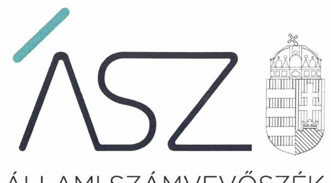
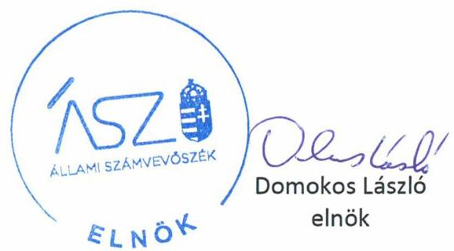
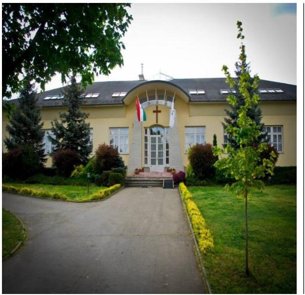

ÁLLAMI SZÁMVEVŐSZÉK

# JELENTÉS 

## Nem állami humánszolgáltatók ellenőrzése

A köznevelési és szociális humánszolgáltatást nyújtó intézmények, szolgáltatók államháztartáson kívüli fenntartói központi költségvetésből kapott támogatásai felhasználásának ellenőrzése
Hetednapi Adventista Egyház
2020.

20101
www.asz.hu

---

ÁLLAMI SZÁMVEVŐSZÉK

# JELENTÉS 

## Nem állami humánszolgáltatók ellenőrzése

A köznevelési és szociális humánszolgáltatást nyújtó intézmények, szolgáltatók államháztartáson kívüli fenntartói központi költségvetésből kapott támogatásai felhasználásának ellenőrzése
Hetednapi Adventista Egyház
2020. 06. 25.

20101
www.asz.hu

---

# AZ ELLENŐRZÉST FELÜGYELTE: 

KLINGA LÁSZLÓ felügyeleti vezető

## AZ ELLENŐRZÉST VEZETTE ÉS A VÉGREHAJTÁSÁÉRT FELELŐS:

DR. GÁL NÓRA ellenőrzésvezető

## A PROGRAM ÖSSZEÁLLÍTÁSÁÉRT FELELŐS:

TÓTPÁL SZABOLCS osztályvezető
FEKETE-NAGY ANDRÁS GÁBOR ellenőrzési program készítéséért felelős vezető

IKTATÓSZÁM: EL-2727-001/2020.
Jelentéseink az Országgyúlés számítógépes hálózatán és az interneten a www.asz.hu címen is olvashatóak.

TÉMASZÁM: 2491
ELLENŐRZÉS-AZONOSÍTÓ SZÁM: V083563, V0867096

---

# TARTALOMJEGYZÉK 

■ ÖSSZEGZÉS ..... 5
■ AZ ELLENŐRZÉS CÉLJA ..... 6
■ AZ ELLENŐRZÉS TERÜLETE ..... 7
■ AZ ELLENŐRZÉS HÁTTERE, INDOKOLTSÁGA ..... 8
■ AZ ELLENŐRZÉS LÉNYEGES KÉRDÉSKÖREI ..... 9
■ AZ ELLENŐRZÉS HATÓKÖRE ÉS MÓDSZEREI ..... 10
■ MELLÉKLETEK ..... 13
I. sz. melléklet: Értelmező szótár ..... 13
■ FÜGGELÉKEK ..... 15
I. sz. függelék a jelentéshez ..... 15
II. sz. függelék: Észrevételek ..... 16
■ RÖVIDÍTÉSEK JEGYZÉKE ..... 19

---

.

---

# ÖSSZEGZÉS 

A péceli székhelyű Hetednapi Adventista Egyház, mint Fenntartó a 2015-2018. években nem biztosította a köznevelési és szociális humánszolgáltatási közfeladat ellátására kapott költségvetési támogatások felhasználásának elszámoltathatóságát.

## Az ellenőrzés társadalmi indokoltsága

A szociális gondoskodást igénylők védelme, illetve a köznevelési feladatok ellátása az Alaptörvényben meghatározott, a társadalom szempontjából fontos tevékenységek. Jogszabályok teszik lehetővé, hogy államháztartáson kívüli szervezetek - így például az egyházi fenntartók, alapítványok, gazdasági társaságok, egyesületek - által fenntartott intézmények is végezzenek köznevelési, szociális és gyermekvédelmi feladatokat. Mindehhez a központi költségvetés évente jelentős összegű támogatással járul hozzá. Az államháztartáson kívüli, humánszolgáltatást végző intézmények az igényelt közpénzekből társadalmilag hasznos, közösségteremtő, közérdekű, illetve közhasznú tevékenységet végeznek, illetve közfeladatokat látnak el.

Az intézményfenntartók ellenőrzésével az Állami Számvevőszék hozzájárul ahhoz, hogy ezen közpénzeket az államháztartáson kívüli szervezetek is ellenőrizhető, átlátható és elszámoltatható módon használják fel a közfeladatok ellátása során. Az ellenőrzések célja továbbá, hogy a nyilvánosság és az igénybevevők megfelelő tájékoztatást kapjanak az államháztartáson kívüli közfeladatot ellátók működéséről.

Az ÁSZ ellenőrzései arra adnak választ, hogy az intézményfenntartók arra használták-e fel a közpénzeket, amire igényelték.

A szabályszerű gazdálkodás elengedhetetlen a közfeladat ellátás szakmai céljainak megvalósításához, valamint a társadalmi közbizalom fenntartásához.

## Megállapítások, következtetések

A Hetednapi Adventista Egyház, mint Fenntartó által az ÁSZ ${ }^{1}$ részére megküldött dokumentumok és az azok teljeskörűségére vonatkozó nyilatkozatok alapján a Fenntartó a 2015-2018. években nem rendelkezett beszámolóval.

A Fenntartó a 2015-2018. években a köznevelési és szociális humánszolgáltatási közfeladat ellátására kapott költségvetési támogatások felhasználásának a Számv. tv. ${ }^{2} 161 /$ A. § (2) bekezdésében előírt ellenőrizhetőségét nem biztosította. A Számv. tv-ben az ellenőrizhetőség érdekében kötelezően előírt, könyvvezetési rendszer továbbrészletezéséről nem gondoskodott oly módon, hogy az Eszámv. ${ }^{3} 7 . \S$ (1)-(4) bekezdésének és az Atr. ${ }^{4} 16 . \S$ (1) bekezdésének szabályozása szerint a továbbutalási céllal kapott támogatások adatai rendelkezésre álljanak.

Ezáltal a Fenntartó nem igazolta, hogy a közpénzt a humánszolgáltatási közfeladatra fordította.
A Hetednapi Adventista Egyház egyházelnöke az ellenőrzés ideje alatt intézkedett a köznevelési és szociális humánszolgáltatási közfeladatok ellátására kapott költségvetési támogatások tekintetében a saját és a nem önállóan gazdálkodó intézményei gazdálkodásának elkülönített kezelésére, valamint a Fenntartó általi feladatonkénti nyilvántartás vezetésére.

---

# AZ ELLENŐRZÉS CÉLJA 

AZ ELLENŐRZÉS CÉLJA annak értékelése volt, hogy a nem állami, nem önkormányzati köznevelési és szociális intézmények fenntartói központi költségvetésből kapott támogatásainak felhasználása szabályszerű volt-e.

---

# **AZ ELLENŐRZÉS TERÜLETE**

## **Hetednapi Adventista Egyház**

A péceli székhelyű Hetednapi Adventista Egyház az Ehtv.5 értelmében bevett egyház6.

A Fenntartó7 a 2015. évben tíz, a 2016. és a 2017. évben kilenc-kilenc, a 2018. évben nyolc intézményben látott el szociális és gyermekvédelmi, valamint a 2015-2018. években két intézményben látott el köznevelési feladatokat.

A Fenntartó a köznevelési és szociális humánszolgáltatási feladatok ellátásához a Magyar Államkincstár adatai szerint a 2015. évben 433,7 M Ft, 2016. évben 460,4 M Ft, 2017. évben 524,3 M Ft, 2018. évben pedig 583,8 M Ft költségvetési támogatást kapott.

---

# **AZ ELLENŐRZÉS HÁTTERE, INDOKOLTSÁGA**

A köznevelési és szociális feladatokat ellátó nem állami intézményfenntartók részére közfeladataik ellátására évente jelentős összegű pénzügyi támogatást biztosítottak a mindenkori költségvetési törvények a bennük megfogalmazott feltételek mellett. A felhasználható állami támogatások Kvtv.®-ek szerinti együttes előirányzata 2016-2018. években 846 Mrd Ft volt.

Az ÁSZ stratégiájában foglaltak alapján is indokolt az ellenőrzés, amely a társadalom számára jelzi, hogy a közpénz államháztartáson kívüli felhasználása sem maradhat ellenőrizetlenül. Az államháztartáson kívülre nyújtott költségvetési támogatások ellenőrzésével az ÁSZ hozzájárul ahhoz, hogy a közpénzeket a nem állami humán fenntartók átlátható módon használják fel a közfeladatok ellátására kötött szerződésekben vállalt kötelezettségek teljesítése érdekében. Az ellenőrzés javaslataival hozzájárulhat az említett rendszerek szabályszerű támogatás felhasználásához, javíthatja a társadalmi-gazdasági döntések megalapozottságát, amely a *„jól irányított állam működésének”* feltétele.

---

# AZ ELLENŐRZÉS LÉNYEGES KÉRDÉSKÖREI 

1. A köznevelési és szociális humánszolgáltató közfeladatot ellátó államháztartáson kívüli fenntartó szabályszerű működési - és gazdálkodási környezet kialakításával megteremtette-e a költségvetési támogatások átlátható, elszámoltatható igénybevételének, felhasználásának feltételeit?
2. Az államháztartáson kívüli fenntartó az átvállalt köznevelési és szociális humánszolgáltatási közfeladathoz biztosított költségvetési támogatásokat szabályszerűen fordította-e a humánszolgáltató intézménye/i működtetésére?
3. Az államháztartáson kívüli fenntartó a köznevelési és szociális humánszolgáltató intézménye/i működtetéséhez felhasznált közpénzekre vonatkozó gazdálkodásával a nyilvánosság előtt el-számolt-e, ennek érdekében ellenőrzési, értékelési és a külső ellenőrzésekkel kapcsolatos intézkedési feladatait szabályszerűen látta-e el?

---

# AZ ELLENŐRZÉS HATÓKÖRE ÉS MÓDSZEREI 

## Az ellenőrzés típusa

Megfelelőségi ellenőrzés.

## Az ellenőrzött időszak

A 2015. január 1-je és 2018. december 31-e közötti időszak.

## Az ellenőrzés tárgya

Az ellenőrzés a köznevelési és szociális humánszolgáltatási közfeladatokat ellátó államháztartáson kívüli fenntartók, humánszolgáltatási közfeladatai ellátásához a központi költségvetésből kapott támogatásaik humánszolgáltatási közfeladatokra való fenntartó általi felhasználása szabályszerűségének értékelésére terjedt ki.

## Az ellenőrzött szervezet

Hetednapi Adventista Egyház

## Az ellenőrzés jogalapja

Az ellenőrzés jogszabályi alapját az ÁSZ tv. ${ }^{9}$ 1. § (3) bekezdésében és 5. § (3) és (11) bekezdésében foglalt előírások adják.

## Az ellenőrzés módszerei

Az ellenőrzést az ellenőrzési program annak szempontjai, kérdései, az ellenőrzött időszakban hatályos jogszabályok, a nemzetközi standardokat irányadónak tekintve, az ellenőrzés szakmai szabályok és módszertanok figyelembevételével rendelte elvégezni.

Az ellenőrzés ideje alatt az ellenőrzött szervezettel történő kapcsolattartást az ÁSZ SZMSZ ${ }^{\text {III }}$-ének vonatkozó előírásai alapján biztosítottuk.

Az ellenőrzési kérdések megválaszolásához szükséges bizonyítékok megszerzése az ellenőrzött által rendelkezésre bocsátott dokumentumokra, adatokra alapozva megfigyelés, szemle (szemrevételezés), kérdésfeltevés (információkérés), mintavétel, valamint elemző eljárással történt.

---

Az ellenőrzési bizonyítékként felhasználható adatforrások közé tartoznak egyrészt a szakmai program részletes szempontjainál felsorolt adatforrások, másrészt minden - az ellenőrzés folyamán feltárt, az ellenőrzés szempontjából információt tartalmazó - dokumentum.

Az ellenőrzés lefolytatásához az ellenőrzött szervezet a kitöltött tanúsítványok, valamint az ÁSZ által kért dokumentumok elektronikus úton való megküldésével szolgáltatott adatokat, információkat. Az így rendelkezésre bocsátott adatok, információk és a tanúsítványok adatai valódiságának kontrollja az ellenőrzés keretében történt.

Az egységes értelmezést támogatja a program mellékletét képező fogalomtár és rövidítésjegyzék.

Az ellenőrzést alapvetően a köznevelési és szociális humánszolgáltatások esetében a központi költségvetési támogatások igénylésével, módosításával, felhasználásával, elszámolásával kapcsolatos feladatokat ellátó államháztartáson kívüli fenntartóknál/szervezeteinél végeztük.

A köznevelési, szociális humánszolgáltatások központi költségvetési támogatásaival kapcsolatos, államháztartáson kívüli fenntartó jogszabályokban előírt feladatai betartását, továbbá a központi költségvetési támogatások szabályszerű nyilvántartását ellenőriztük a fenntartónál rendelkezésre álló nyilvántartások, beszámolók és egyéb dokumentumok alapján. Az ellenőrzés nem terjedt ki a köznevelési és szociális humánszolgáltatások központi költségvetési támogatásai igénylése, módosítása, elszámolása valódiságának, megalapozottságának, helyességének - sem a fenntartónál, sem a székhely intézményeinél való - értékelésére (mivel ennek felülvizsgálata, ellenőrzése a finanszírozó jogszabályban előírt feladata, határozatai kiadása előtt). Továbbá nem terjedt ki az ellenőrzés e források szabályszerű felhasználásának értékelésére.

---

.

---

# MELLÉKLETEK 

- I. SZ. MELLÉKLET: ÉRTELMEZŐ SZÓTÁR
humánszolgáltatás
költségvetési támogatás
közfeladat
nem állami, nem önkormányzati (államháztartáson kívüli) intézmény fenntartó

Külön törvényekben meghatározott szociális, gyermekjóléti, gyermekvédelmi, közoktatási, felsőoktatási, kulturális közfeladatok.
A társadalombiztosítás pénzügyi alapjai kivételével az államháztartás központi alrendszeréből ellenérték nélkül, pénzben nyújtott támogatások (Áht. ${ }^{11}$ 1. § 14. pont) A költségvetési törvényekben (2014. évi C. törvény 42-43. §, 2015. évi C. törvény 40-41. §, 2016. évi XC. törvény 40-41. §) megállapított támogatás.
„Közfeladat a jogszabályokban meghatározott állami vagy önkormányzati feladat. ... A közfeladatok ellátásában államháztartáson kívüli szervezet jogszabályban meghatározott rendben közreműködhet." A közfeladatok meghatározó jogszabályban meg kell határozni a közfeladat ellátásának módját és egyidejűleg rendezni kell annak az ellátásához
szükséges pénzügyi fedezet biztosításáról. (Az államháztartásról szóló 2011. évi CXCV. törvény 3/A. § (1)-(3) bekezdés)
A szociális, gyermekjóléti és gyermekvédelmi közfeladatokat/humánszolgáltatásokat ellátó intézményt/szolgáltatót fenntartó egyházi jogi személy, társadalmi szervezet, alapítvány, közalapítvány, civil szervezet, országos nemzetiségi önkormányzat, nonprofit gazdasági társaság, gazdasági társaság és a humánszolgáltatást alaptevékenységként végző, Szja tv. ${ }^{12}$ hatálya alá tartozó egyéni vállalkozó. (2015. évi Kvtv. 42. §, 43. § (1) bekezdés, 2016. évi Kvtv. ${ }^{13} 40 . \S, 41 . \S$ (1) bekezdés, 2017. évi Kvtv. ${ }^{14} 40 . \S, 41 . \S$ (1) bekezdés)

---

.

---

# FÜGGELÉKEK 

- I. SZ. FÜGGELÉK A JELENTÉSHEZ

Az Állami Számvevőszék az ellenőrzések során feltárt tényekhez kapcsolódó további körülmények tisztázására eszközrendszerrel nem rendelkezik. Amennyiben az ellenőrzésen túlmutatóan indokoltnak látszik az ellenőrzés során feltárt körülmények további vizsgálata, az Állami Számvevőszék törvényi felhatalmazás alapján az ellenőrzés által feltárt körülményeket továbbítja a hatáskörrel rendelkező szervnek a szükséges intézkedések megtétele, eljárások lefolytatása érdekében.

A Hetednapi Adventista Egyház (a továbbiakban: Fenntartó) részére a köznevelési és szociális humánszolgáltatási közfeladat ellátásra a Magyar Államkincstár által biztosított költségvetési támogatások összege 2015. évben 433,7 M Ft, 2016. évben 460,4 M Ft, 2017. évben 524,3 M Ft, 2018. évben pedig 583,8 M Ft volt.

A Fenntartó az ÁSZ részére megküldött dokumentumok és az azok teljeskörűségére vonatkozó nyilatkozatok alapján a 2015-2018. évek vonatkozásában a Számv. tv. 161/A. § (2) bekezdésének előírása ellenére nem gondoskodott a közpénzek felhasználásának ellenőrizhetősége érdekében a könyvvezetési rendszerének oly módon való továbbrészletezéséről, hogy abból az Atr. 16.§ (1) bekezdése és az Eszámv. 7.§ (1)-(4) bekezdése szerinti kötelezettségnek eleget téve a továbbutalási céllal kapott támogatások adatai rendelkezésre álljanak.

A Fenntartónál az elkülönített nyilvántartás vezetésének elmaradása miatt felmerült a támogatások nem rendeltetésszerű felhasználásának gyanúja. Ezáltal nem zárható ki, hogy a költségvetésből származó pénzeszközöket a jóváhagyott céltól eltérően használta fel.
Az eset konkrét körülményeinek feltárására a Magyar Államkincstár rendelkezik hatáskörrel.

---

A jelentéstervezetet a Számvevőszék 15 napos észrevételezésre megküldte az ellenőrzött szervezet vezetőjének az ÁSZ tv. 29. § (1) bekezdése előírásának megfelelően.

A Hetednapi Adventista Egyház egyházelnöke a jelentéstervezet megállapításaira írásban észrevételt tett.
Az ÁSZ tv. 29. § (3) bekezdésével összhangban az ÁSZ a Függelékben feltünteti az ellenőrzés megállapításaival kapcsolatban tett, figyelembe nem vett észrevételeket, és
 megindokolja, hogy azokat miért nem fogadta el.

[^0]
[^0]:    * 29. § (1) Az Állami Számvevőszék az ellenőrzési megállapításait megküldi az ellenőrzött szervezet vezetőjének vagy az általa megbízott személynek, és annak, akinek személyes felelősségét állapította meg.
    (2) Az ellenőrzött szervezet vezetője és a felelősként megjelölt személy az ellenőrzés megállapításaira tizenöt napon belül írásban észrevételt tehet.
    (3) Az Állami Számvevőszék az észrevételre a beérkezésétől számított harminc napon belül írásban válaszol. A figyelembe nem vett észrevételeket köteles a jelentésben feltüntetni, és megindokolni, hogy azokat miért nem fogadta el.

---

A Hetednapi Adventista Egyház egyházelnökének az ellenőrzés megállapításaival kapcsolatban, írásban tett, figyelembe nem vett észrevételei és azok indoklása.
Az észrevétel szerint a Hetednapi Adventista Egyház (továbbiakban: Fenntartó) nemzetközi könyvelési rendszert használ, amelyből elkészítik a magyar nyelvű éves beszámolót.
A Fenntartó a fenntartói feladatok ellátására létrehozta az Adventista Diakóniai és Humán Szolgáltató Központot (továbbiakban: Szolgáltató Központ), amely a Fenntartó belső, önálló jogi személyiséggel nem rendelkező szervezeti egysége.
A Fenntartó a humánszolgáltatást végző intézményeire kapott állami támogatásokat egy önálló bankszámlán kezeli, ami biztosítja az állami támogatások elkülönített kezelését. A számla tulajdonosa a Fenntartó. A számlára érkező állami támogatásokat a Szolgáltató Központ utalja tovább az egyes intézményeknek, azok bankszámláira.
Az előző évek során a Magyar Államkincstár rendszeresen ellenőrizte az állami támogatások felhasználását. Az ellenőrzések során a bankszámlakivonatok minden esetben egyértelműen bizonyították, hogy a Fenntartó a jogszabályoknak megfelelően átadta az állami támogatást az intézményeknek.
2018 óta a Szolgáltató Központ számlája lekönyvelésre kerül, év végén főkönyvi kivonat, mérleg és eredménykimutatás készül. Az állami támogatások tekintetében ezt tekintik a Fenntartó beszámolójának és ezt a dokumentumot az ÁSZ ellenőrzése részére át is adták.
Az egyházelnök észrevételéhez dokumentumokat csatolt, úgymint a Szolgáltató Központ 2018. és 2019. évi főkönyvi kivonatát, mérlegét és eredménykimutatását, a Fenntartó 2015-2019. évekre vonatkozó pénzügyi beszámolóját, valamint a 2019. és 2020. évre vonatkozó Fenntartói bankszámlakivonatokat.
Az ellenőrzéshez a Fenntartó az ÁSZ 2018. december 11-én kelt, EL-1314-002/2018. iktatószámú adatbekérő levelünk 2. számú melléklet Dokumentumok jegyzéke részében bekért, az ÁSZ részére a 2018. december 21-én kelt teljességi és hitelességi nyilatkozattal megküldött, valamint az ÁSZ 2019. október 7-én kelt, EL-1314-053/2018. iktatószámú adatbekérő levelünk 2. számú melléklet Dokumentumok jegyzéke részében bekért, az ÁSZ részére a 2019. október 18-án kelt teljességi és hitelességi nyilatkozattal megküldött dokumentumok felülvizsgálata alapján megállapítottuk, hogy a Fenntartó a számvitelről szóló 2000. évi C. törvény 3. § (1) bekezdés 1. és 4. j) pontjában, valamint 4. § (1) bekezdésében, illetve az egyházi jogi személyek beszámolókészítési és könyvvezetési kötelezettségének sajátosságairól szóló 296/2013. (VII. 29.) Korm. rendelet 1. §-ában, valamint 5. § (1)-(2) bekezdésében foglalt előírások ellenére a Fenntartó 2015-2018. évekre vonatkozó kettős könyvvitellel alátámasztott egyszerűsített éves beszámolóval nem rendelkezett. A Fenntartó által az adatbekérés során az ÁSZ részére beküldött dokumentumok az Adventista Diakóniai és Humán Szolgáltató Központ beszámolói voltak, a Fenntartó éves beszámolóit nem bocsátotta az ÁSZ rendelkezésére.
Tekintettel arra, hogy az adatbekérés a Fenntartó éves beszámolójának megküldésére vonatkozott, az észrevételt nem fogadtuk el, a jelentéstervezet módosítása nem indokolt.

---

.

---

# RÖVIDÍTÉSEK JEGYZÉKE 

${ }^{1}$ ÁSZ
${ }^{2}$ Számv. tv.
${ }^{3}$ Eszámv.
${ }^{4}$ Atr.
${ }^{5}$ Ehtv.
${ }^{6}$ bevett egyház
${ }^{7}$ Fenntartó
${ }^{8}$ Kvtv.
${ }^{9}$ Ász tv.
${ }^{10}$ ÁSZ SZMSZ
${ }^{11}$ Áht.
${ }^{12}$ Szja tv.
${ }^{13}$ 2016. évi Kvtv.
${ }^{14}$ 2017. évi Kvtv.

Állami Számvevőszék
2000. évi C. törvény a számvitelről

296/2013. (VII. 29.) Korm. rendelet az egyházi jogi személyek beszámoló készítési és könyvvezetési kötelezettségének sajátosságairól
489/2013. (XII. 18.) Korm. rendelet az egyházi és nem állami fenntartású szociális, gyermekjóléti és gyermekvédelmi szolgáltatók, intézmények és hálózatok támogatásáról
A lelkiismereti és vallásszabadság jogáról, valamint az egyházak, vallásfelekezetek és vallási közösségek jogállásáról szóló 2011. évi CCVI. törvény
az Országgyűlés által elismert egyház (Ehtv. 6. \$(1)), illetve 2019.04.15-től a bevett egyház az olyan bejegyzett egyház, amellyel az állam a közösségi célok érdekében történő együttműködésről átfogó megállapodást kötött. (Ehtv. 9/G. \$(1))
Hetednapi Adventista Egyház
Magyarország 2016. évi központi költségvetéséről szóló 2015. évi C. törvény (hatályos: 2015. július 4-étől)
Magyarország 2017. évi központi költségvetéséről szóló 2016. évi XC. törvény (hatályos: 2016. november 1-jétől)
Magyarország 2018. évi központi költségvetéséről szóló 2017. évi C. törvény (hatályos: 2017. november 1-jétől)
2011. évi LXVI. törvény az Állami Számvevőszékről
az Állami Számvevőszék Szervezeti és Működési Szabályzata
2011. évi CXCV. törvény az államháztartásról (hatályos: 2011. december 31-től)
1995. évi CXVII. törvény a személyi jövedelemadóról
2015. évi C. törvény Magyarország 2016. évi központi költségvetéséről
2016. évi XC. törvény Magyarország 2017. évi központi költségvetéséről

---

# ASZ 

ÁLLAMI SZÁMVEVŐSZÉK
1052 Budapest, Apáczai Cs. J. u. 10. I 1364 Budapest 4. Pf. 54 TEL: +36 14849100
email: szamvevoszek@asz.hu
web: www.asz.hu | www.aszhirportal.hu

