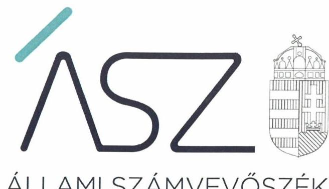

ÁLLAMI SZÁMVEVŐSZÉK

# JELENTÉS 

## Vélemény a 2021. évi költségvetésről

Vélemény Magyarország 2021. évi központi költségvetéséről szóló törvényjavaslatról
2020.

$$
T / 10710 / 1
$$

20102
www.asz.hu

---

ÁLLAMI SZÁMVEVŐSZÉK

# JELENTÉS 

## Vélemény a 2021. évi költségvetésről

Vélemény Magyarország 2021. évi központi költségvetéséről szóló törvényjavaslatról
2020. 06. hó 05. nap

$$
\begin{gathered}
\text { T/10710/1 } \\
20102 \\
\text { www.asz.hu }
\end{gathered}
$$

---

# AZ ELLENŐRZÉST FELÜGYELTE: 

DR. PULAY GYULA ZOLTÁN felügyeleti vezető

## AZ ELLENŐRZÉST VEZETTE ÉS A VÉGREHAJTÁSÁÉRT FELELŐS:

BERTALAN RUDOLF GYULA ellenőrzésvezető

## A PROGRAM ÖSSZEÁLLÍTÁSÁÉRT FELELŐS:

GÖRGÉNYI GÁBOR osztályvezető

## A TÉMÁHOZ KAPCSOLÓDÓ KORÁBBI SZÁMVEVŐSZÉKI JELENTÉSEK:

- címe: Vélemény Magyarország 2020. évi központi költségvetéséről szóló törvényjavaslatról
- sorszáma: 19097
- címe: Vélemény Magyarország 2019. évi központi költségvetéséről szóló törvényjavaslatról
- sorszáma: 18177

IKTATÓSZÁM: EL-2511-536/2020
TÉMASZÁM: 2536
ELLENŐRZÉS-AZONOSÍTÓ SZÁM: V0880

---

# TARTALOMJEGYZÉK 

■ ÖSSZEGZÉS ..... 5
■ A VÉLEMÉNYADÁS CÉLJA ..... 8
■ A VÉLEMÉNYADÁS TERÜLETE ..... 9
■ A VÉLEMÉNYADÁS HÁTTERE, INDOKOLTSÁGA ..... 10
■ A VÉLEMÉNYADÁS LÉNYEGES KÉRDÉSKÖREI ..... 11
■ A VÉLEMÉNYADÁS HATÓKÖRE ÉS MÓDSZEREI ..... 12
■ ÁSZ VÉLEMÉNYEK ..... 14
■ MELLÉKLETEK ..... 35
I. sz. melléklet: Értelmező szótár ..... 35
II. sz. melléklet: A 2021. évi központi költségvetésről szóló törvényjavaslat részben megalapozott, nem megalapozott és kockázatos bevételi, valamint kiadási előirányzatai. ..... 37
III. sz. melléklet: A központi költségvetésről szóló törvényjavaslat 1. számú melléklete és az Indoklás mellékletei között bemutatott, a Központi alrendszer mérlege közötti eltérésekről ..... 38
IV. sz. melléklet: A központi alrendszer azon előirányzatai, melyek teljesülése módosítás nélkül eltérhet az előirányzattól ..... 38
■ RÖVIDÍTÉSEK JEGYZÉKE ..... 39

---

.

---

# ÖSSZEGZÉS 

A 2021. évi központi költségvetésről szóló törvényjavaslat tervezése a vonatkozó szabályok betartásával történt. Az államadósság-mutató csökkentésének alkotmányos kötelezettsége akkor is teljesül, ha a gazdasági folyamatok az előre jelzettnél lényegesen kedvezőtlenebbül alakulnak. A törvényjavaslat bevételi előirányzatai - a társasági adó kivételével - megalapozottak és teljesíthetőek, a kiadási előirányzatai megalapozottak, illetve megfelelő alátámasztás hiján részben megalapozottnak, és néhány esetben kockázatosnak minősülnek. A központi tartalékok - a központi béremelési intézkedések fedezetét biztositó céltartalék mellett - a kiadási kockázatok kezeléséhez elegendő összeget irányoznak elő rendkívüli intézkedésekre, valamint gazdaságvédelmi, beruházás előkészitési és járvány elleni védekezési feladatokra.

## A véleményadás társadalmi indokoltsága

A véleményadás keretében az Állami Számvevőszékről szóló 2011. évi LXVI. törvény 5. § (1) bekezdése alapján az Állami Számvevőszék támogatja az Országgyűlést a költségvetési törvényjavaslatról való megalapozott döntéshozatalban. Ezáltal hozzájárul ahhoz, hogy az Országgyűlés a jogszabályok által előírt követelményeket teljesítő költségvetési törvényt fogadhasson el.

A véleményadás keretében az Állami Számvevőszék rámutat a 2021. évi költségvetésről szóló törvényjavaslatban azonosított kockázatokra, amelyek kezelése hatékonyan és időben megtörténhet az Országgyűlés által. A véleményadás megállapításai támogatják a költségvetés tervezéséért felelős intézményeket és szervezeteket, illetve a költségvetési szerveket is a megalapozott jövőbeli költségvetési tervek elkészítésében.

## Főbb megállapítások, következtetések

A 2021. évi központi költségvetésről szóló törvényjavaslat elkészítése során a tervezést végző szervezetek a jogszabályi előírásokat betartották. A 2021. évi központi költségvetésről szóló törvényjavaslat szerkezete összhangban van a jogszabályi előírásokkal.

A költségvetési hiány és az államadósság alakulására vonatkozó előírások, a strukturális hiány kivételével a törvényjavaslat indokolásában rögzített gazdasági prognózisok megvalósulása esetén teljesülnek.

A költségvetési törvényjavaslat alapját képező makrogazdasági prognózis azzal számol, hogy a magyar gazdaság a 2020. évi átmeneti visszaesés után - visszatér a növekedési pályára, amelyhez a beruházások, a fogyasztás és az export növekedés egyaránt hozzájárul. A fogyasztás bővülését segíti, hogy a keresetek ismét dinamikusan emelkednek majd és a foglalkoztatás visszaáll a járvány előtti szintre, maga után vonva a munkanélküliség csökkenését. Az államháztartás az adóbevételek egy részéről való lemondással, és a bevételeit közel három százalékkal meghaladó kiadásokkal járul hozzá az újrainduló gazdaság dinamizálásához. Az ÁSZ értékelése megállapította, hogy az előterjesztő a költségvetési törvényjavaslatnak a makrogazdasági folyamatoktól közvetlenül és jelentősen függő bevételi és kiadási előirányzatait a gazdasági prognózissal összhangban határozta meg. A prognózis alapulvételével a kormányzati szektor uniós módszertan szerint számított hiánya a törvényi maximumot nem haladja meg, valamint az államadósság-mutató tervezett alakulása teljesíti az Alaptörvényben rögzített államadósság-szabályt. Ugyanakkor a makrogazdasági prognózis megvalósulását, és a költségvetési célok elérését több kockázat is övezi. Ezért az ÁSZ véleményének kialakításakor előtérbe került a tartalékok megfelelőségének értékelése.

A központi tartalékok - a bérpolitikai intézkedések fedezetét biztosító céltartalék mellett - a GDP fél százalékának megfelelő összeget irányoznak elő rendkívüli intézkedésekre, valamint gazdaságvédelmi, beruházás előkészítési és

---

járvány elleni védekezési feladatokra. Az ellenőrzés értékelése szerint e tartalékok mértéke elegendő azon kockázatok kezelésére, amelyek a költségvetési kiadások növelését teszik szükségessé. Az ÁSZ további tartalékként vette számításba, hogy az Európai Unióból Érkező Járvány Elleni Támogatások Alapja nulla forint előirányzattal lett megtervezve, azaz az Európai Unióból ilyen címen 2021-ben érkező bevételek a gazdaság élénkítését, illetve a munkahelyek megőrzését és bővítését szolgáló pótlólagos kiadások forrása lehet anélkül, hogy az államháztartás hiányát növelné.

Ugyanakkor a 2021. évi költségvetés nem tartalmaz olyan tartalékot, amelynek elsődleges rendeltetése a költségvetési hiánycél betartásának és közvetetten az államadósság-szabály teljesítésének biztosítása. (Az elmúlt években ilyen célt szolgált az Országvédelmi Alap.) Az ÁSZ megállapította, hogy e tartalék hiánya nem teszi kockázatossá az államadósság-szabály teljesítését, mivel a törvényjavaslatban rögzítettek szerint az államadósság-mutató 2021. végére tervezett értéke 3,3 százalékponttal kisebb a 2020. év végére várható értéknél, azaz a GDP több mint 3 százalékának megfelelő mozgásteret biztosít arra az esetre, ha a GDP a prognosztizáltnál kisebb mértékben nő, vagy az államadósság növekedése a tervezett mértéket meghaladja. A számítások szerint 2021. évben az államadósság-szabály akkor nem teljesülne, ha a tervezett GDP növekedés mellett az államadósság további 1632,3 Mrd Ft-tal növekedne, illetve a nominális GDP növekedési üteme - a tervezett államadósság mellett - nem érné el a 3,4\%-ot.

A hiánycél teljesítése esetében azonban ilyen mozgástér nem áll rendelkezésre, a magasabb hiány vagy a GDP kisebb mértékű növekedése esetén a hiány meghaladja az uniós előírás szerinti 3 százalékos mértéket, amelyet hazai törvény is rögzít. Az uniós előírás betartásának kötelezettségét azonban az Európai Unió Tanácsa felfüggesztette, amely felfüggesztés - az EU gazdaságélénkítési törekvéseinek ismeretében - nagy valószínűséggel 2021-ben is fennmarad. Következésképpen önmagában a hiánycél betartása érdekében nem célszerű olyan tartalékot beépíteni a költségvetésbe, amely erőforrásokat von el a gazdaság élénkítését szolgáló intézkedésektől. Természetesen ez nem jelenti azt, hogy a törvényben előírt hiánycélt nem kell betartani, azaz 2021-ben is fegyelmezett költségvetési gazdálkodást kell folytatni, és elejét kell venni a kiadási előirányzatok túllépésének.

A fentiek figyelembevételével az ÁSZ a törvényjavaslatot megalapozó makrogazdasági prognózist megfelelő alapnak tekintette a 2021. évi költségvetés tervezéséhez, és az előirányzatok megalapozottságát azon feltételezés mellett értékelte, hogy a gazdasági folyamatok tényleges alakulása a prognózisban előre jelzetthez közeli lesz.

A Magyarország 2021. évi központi költségvetéséről szóló törvényjavaslat bevételi előirányzatainak 97,5\%-a megalapozott, 2,5\%-a részben megalapozott. A kiadási előirányzatok 95,7\%-a megalapozott, 4,0\%-a részben megalapozott, 0,3\%-a nem megalapozott. Az ellenőrzés során kockázatosnak minősített bevételi előirányzatok összege 538,5 Mrd Ft, kockázat összege 36,0 Mrd Ft, míg a kockázatosnak minősített kiadási előirányzatok összege 579,0 Mrd Ft, melyből kockázatos 31,6 Mrd Ft. A kiadási előirányzatok megalapozottságának növelése a korábbi kormányhatározatok, fejlesztési programok módosítását igényli azokban az esetekben, amikor az azokban tervezett támogatásokhoz képest az előirányzat kisebb.

A kiadások tekintetében kockázatot hordoz, hogy a 2021. évi kiadási előirányzatok főösszegéhez viszonyítva 43\%os az aránya azon előirányzatoknak, amelyek teljesülése módosítás nélkül eltérhet az előirányzattól. Ebből a részben megalapozott előirányzatok összege 559,0 Mrd Ft, a nem megalapozott előirányzatok összege 3,5 Mrd Ft, melyek együtt a kiadási főösszeg 2,5\%-át teszik ki. Ezen előirányzatok betarthatóságát további intézkedésekkel kell megalapozni.

A törvényjavaslat a gazdaság élénkítési célokhoz kapcsolható, a korábbi években más fejezetekben meglévő programok folytatására, kiemelt fejlesztésekre, beruházásokra, továbbá a foglalkoztatás elősegítését célzó intézkedésekre jelentős forrásokat különítettek el az újonnan létrehozott Gazdaságvédelmi Alapban. Az Alapban a gazdaság fellendítése érdekében tervezett jellemzően beruházási kiadások előirányzatai több esetben csak részben megalapozottnak minősülnek, mert a korábbiakhoz képest összevont előirányzatok tervezett összegei nem elégségesek a fejlesztések eredeti ütemezés szerinti megvalósításához, ami azonban nem jelent költségvetési kockázatot, mivel az előirányzatok nem léphetők túl.

Az Egészségbiztosítási és Járvány Elleni Védekezési Alap a 2020. évhez képest megújult szerkezetben, egy alapban tartalmazza a járvány elleni védekezéshez, illetve az egészségügyi ellátórendszer működtetéséhez szükséges az Egészségbiztosítási Alapban, valamint a Járvány Elleni Védekezési Alapban összefogott forrásokat és kiadásokat. Az alap bevételi és kiadási előirányzatai megalapozottak.

A 2021. évre tervezett uniós támogatások tekintetében a 2014-2020. évi programozási időszak kifutó programjainak a 2021. évet terhelő kifizetései, valamint a 2021-2027. évi költségvetési ciklus alatt felhasználható uniós és hazai

---

források 2021. évre jutó része beruházási és vidékfejlesztési célokra hívhatók le. A rendelkezésre álló forrás felhasználása során elsődleges szempont a gazdaságfejlesztési célú támogatások biztosítása, valamint a vállalkozások versenyképességének javítása. Az uniós támogatások kiadási előirányzatai az EGT és Norvég Finanszírozási Mechanizmusok 2014-2020, a Svájci - Magyar Együttmüködési Program II., valamint a Kohéziós politikai operatív programok 2021-2027 kiadási előirányzatai kivételével megalapozottak.

---

# A VÉLEMÉNYADÁS CÉLJA 

A VÉLEMÉNYADÁS CÉLJA annak értékelése volt, hogy a központi költségvetési törvényjavaslat összeállítása megfelel-e a jogszabályi előírásoknak, a törvényjavaslat bevételi és kiadási előirányzatait a makrogazdasági előrejelzéseket is figyelembe véve tervezték-e meg; biztosították-e a tervezésnél alkalmazott módszerek, háttérszámítások, hatástanulmányok, valamint az állami szabályozó eszközök javasolt módosításai a törvényjavaslat megalapozottságát. A véleményadás kiterjedt továbbá arra is, hogy teljesültek-e a Tervezési Tájékoztatóban megfogalmazott követelmények, az Alaptörvényben ${ }^{1}$ és a Magyarország gazdasági stabilitásáról szóló törvényben foglaltak alapján érvényesül-e az államadósság-szabály, biz-tosított-e az összhang a törvényjavaslat és a kormányzati programnak részét képező tervek között; a tervezett kiadási előirányzatok elégségesek-e a közfeladatok ellátásához, számításba vették-e az EU² tagság pénzügyi, gazdasági hatásait.

---

# A VÉLEMÉNYADÁS TERÜLETE 

A VÉLEMÉNYADÁS során az Állami Számvevőszék azt értékelte, hogy a központi költségvetésről szóló törvényjavaslat összeállítása szabályszerűen történt-e; Magyarország 2021. évi központi költségvetéséről szóló törvényjavaslat bevételi és kiadási előirányzatainak keretszámainak megtervezése szabályszerű volt-e, a tervezett előirányzatok megalapozottak-e, illetve a bevételi előirányzatok teljesíthetőek-e.

Az Állami Számvevőszék azt is értékelte, hogy az Alaptörvényben és a Magyarország gazdasági stabilitásáról szóló törvényben foglalt államadósság-szabály érvényesül-e.

---

# A VÉLEMÉNYADÁS HÁTTERE, INDOKOLTSÁGA 

Az Állami Számvevőszék törvényi kötelezettségének teljesítve véleményezi a központi költségvetésről szóló törvényjavaslatot rámutatva annak kockázataira. Ezáltal támogatja az országgyűlési képviselőket a jogszabályi követelményeket teljesítő, megalapozott költségvetési törvény elfogadásában.

Az Állami Számvevőszék a 2021. évi központi költségvetés véleményezéséhez kapcsolódó elemzésekben véleményt nyilvánít a 2021. évi költségvetésről szóló törvényjavaslatról, az államadósság-mutató kidolgozására vonatkozó eljárásokról, a tervezett államadósság összegét megalapozó számításokról, azok alátámasztottságáról, valamint a 2021. évi költségvetésről szóló törvényjavaslat parlamenti zárószavazását megelőzően az Alaptörvényben és a Magyarország gazdasági stabilitásról szóló törvényben rögzített államadósság-szabály érvényesüléséről, vagyis arról, hogy a törvényjavaslat elfogadásához szükséges feltételek teljesültek-e.

A 2021. évi költségvetési tervezés szempontjából meghatározó körülmény a koronavírus-járvány, melynek következményei megváltoztatták a globális és a magyar gazdaság 2020. évi kilátásait. A makrogazdaság bizonytalansági felértékeli az Állami Számvevőszék véleményalkotását.

---

# A VÉLEMÉNYADÁS LÉNYEGES KÉRDÉSKÖREI 

1. A központi költségvetésről szóló törvényjavaslat összeállítása a jogszabályi előírásoknak megfelelően történt-e?
2. A Magyarország 2021. évi központi költségvetéséről szóló törvényjavaslatban foglalt bevételi és kiadási előirányzatok meg-alapozottak-e és a bevételi előirányzatok teljesíthetőek-e?

---

# A VÉLEMÉNYADÁS HATÓKÖRE ÉS MÓDSZEREI 

## A véleményadás típusa

Értékelés.

## A véleményadással érintett időszak

A 2021. év.

## A véleményadás tárgya

A 2021. évi központi költségvetésről szóló törvényjavaslat összeállításának szabályszerűsége, a tervezés megalapozottsága, az előirányzatok megalapozottsága, alátámasztottsága, a bevételi előirányzatok teljesíthetősége, a hiányra vonatkozó törvényi előírások és az államadósság-szabály érvényesülése.

## A véleményadásban érintett szervezetek

Pénzügyminisztérium, Belügyminisztérium, Emberi Erőforrások Minisztériuma, Agrárminisztérium, Honvédelmi Minisztérium, Külgazdasági és Külügyminisztérium, Miniszterelnökség, Innovációs és Technológiai Minisztérium, nemzeti vagyon kezeléséért felelős tárca nélküli miniszter, Miniszterelnöki Kabinetiroda, Miniszterelnöki Kormányiroda, Nemzeti Adó- és Vámhivatal, Nemzeti Egészségbiztosítási Alapkezelő, Államadósság Kezelő Központ Zrt., Magyar Államkincstár.

## A véleményadás jogalapja

Az ÁSZ tv. ${ }^{3} 1 . \S$ (3), 5. § (1) bekezdéseiben foglaltak.

## A véleményadás módszerei

Az ÁSZ a törvényjavaslatot megalapozó makrogazdasági prognózist megfelelő alapnak tekinti a 2021. évi költségvetés tervezéséhez. Következésképpen a bevételi előirányzatok teljesülését azon feltételezés mellett értékeli, hogy a gazdasági folyamatok tényleges alakulása a prognózisban előre jelzetthez közeli lesz. Az értékeléskor az ÁSZ nem számolt a járvány újabb súlyos fellángolásával.

---

A véleményadást a program kérdései, a véleményadással érintett időszakban hatályos jogszabályok és az irányadó ÁSZ ${ }^{4}$ módszertan (Módszertani útmutató ${ }^{5}$ ) figyelembevételével végeztük.

A véleményadási kérdések megválaszolásához szükséges bizonyítékok megszerzése az adatszolgáltatásra kötelezett szervezetek által rendelkezésre bocsátott dokumentumokra, adatokra alapozva megfigyelés, szemle (szemrevételezés), kérdésfeltevés (információkérés), valamint elemző eljárás útján történt. A bizonyítékként felhasználható adatforrások közé tartoztak egyrészt a szakmai program részletes szempontjainál felsorolt adatforrások, másrészt minden egyéb - a vélemény kialakítása folyamán feltárt, a véleményadás szempontjából információt tartalmazó - dokumentum.

A központi költségvetésről szóló törvényjavaslatban szereplő előirányzatok esetében a véleményadás a bevételi főösszeg 88,56 \%-ra, illetve a kiadási főösszeg 85,97 \%-ára terjedt ki.

A véleményadáshoz az adatszolgáltatásra kötelezett szervezetek a tanúsítványok és monitoring táblázatok kitöltésével, valamint az Állami Számvevőszék által kért dokumentumok megküldésével szolgáltattak adatokat.

A véleményadás lefolytatása során figyelembe vettük az Európai Bizottság részére a Kormány által benyújtott Magyarország 2020-2024. évekre vonatkozó Konvergencia Programot.

---

# 1. A központi költségvetésről szóló törvényjavaslat összeállítása a jogszabályi előírásoknak megfelelően történt-e? 

Összegző vélemény

1.1. számú vélemény

A 2021. évi Kvtv. javaslat ${ }^{6}$ összeállítása a jogszabályi előírásoknak megfelelően történt, az államadósság alakulásával kapcsolatos jogszabályi előírások teljesülnek.

A 2021. évi Kvtv. javaslat előkészítésének és összeállításának folyamata szabályszerű volt, a fejezetet irányító szervek szabályszerűen hajtották végre a tervezési feladatokat, a törvényjavaslat összeállítása megfelel a jogszabályi előírásoknak.

A 2021. évi Kvtv. javaslat szerkezeti felépítése az Áht. ${ }^{7}$ előírásai szerint került kialakításra.

A 2021. évi Kvtv. javaslat 1. számú melléklete és az Indoklás mellékletei között bemutatott, a „Központi alrendszer mérlege pénzforgalmi szemlé-let"-ben melléklet adatai között nem áll fenn egyezőség, így a Központi alrendszer mérlegében a Központi költségvetés egyenlege 94,2 Mrd Ft-tal, az Elkülönített állami pénzalapok egyenlege 16,8 Mrd Ft-tal kisebb összegben, míg az Egészségbiztosítási alap egyenlege 111,0 Mrd Ft-tal nagyobb összegben jelenik meg.

A 2021. évi Kvtv. javaslat összeállításához szükséges Tájékoztató ${ }^{8}$ öszszeállításáról és nyilvánosságra hozataláról az államháztartásért felelős miniszter gondoskodott.

A 2021. évi Kvtv. javaslatban az előirányzatok összege hazai működési, felhalmozási és uniós fejlesztési kiadások és bevételek szerinti bontásban is rendelkezésre állnak.

A 2021. évi Kvtv. javaslat általános, illetve részletes indoklása tartalmazza a Kormány gazdaságpolitikáját, az államháztartás céljait és kereteit, a központi költségvetés uniós forrásokkal való kapcsolatát, a kormányzati szektor egyenlegére és a strukturális egyenlegre vonatkozó tervezett mértékeket és azok indokait, valamint a hazai és uniós módszertan szerinti hiány és államadóssággal kapcsolatos mutatók alakulását.

Magyarország 2020-2024. évekre vonatkozó Konvergencia Programját a Kormány az Európai Bizottság részére 2020. április 30-ig benyújtotta.

A fejezetet irányító szervezetek a 2021. évi költségvetés tervezése során az Áht., az Ávr., ${ }^{9}$ valamint egyes fejezetek esetében az ágazati jogszabályok vonatkozó rendelkezései, továbbá az államháztartásért felelős miniszter által közzétett Tájékoztató figyelembevételével jártak el. A tervezési feladatok végrehajtása szabályszerű volt.

A tervezési folyamat egységes lefolytatása érdekében a fejezetet irányító szervezetek gondoskodtak a feladatok végrehajtásában résztvevők megfelelő tájékoztatásáról.

---

A fejezetet irányító szervezetek meghatározták a fejezetbe sorolt költségvetési szervek, központi kezelésű előirányzatok, fejezeti kezelésű előirányzatok tervezett bevételi és kiadási előirányzatainak összegeit a lebontott tervszámok szerkezeti változásokkal és szintrehozásokkal módosított összegeként. Felülvizsgálták, hogy a követelmények, szempontok érvényesítése megtörtént-e a bevételek és kiadások tervszámainak kidolgozásáért a felelősök által.

Az államháztartásért felelős miniszterrel a tervezett bevételeket és kiadásokat, valamint az azokhoz kapcsolódó javaslatokat egyeztették. Az egyeztetési folyamatot követően a tervezett bevételeket és kiadásokat a fejezetet irányító szervek véglegezték, az előirányzatokat rögzítették a KAR-ban.

A 2021. évi Kvtv. javaslat a Vélemény elkészítéséig a fejezeti indoklásokat még nem tartalmazta.

# 1.2. számú vélemény 

A 2021. évi központi költségvetésről szóló törvényjavaslatban tervezett hiány (ESA egyenleg) teljesíti a Gst. ${ }^{10}$-ben szereplő előírást, a strukturális egyenleg nincs összhangban a középtávú költségvetési hiánycéllal.

A 2021. évi Kvtv. javaslatban szereplő makrogazdasági mutatószámok összhangban vannak a 2020-2024. évekre kiterjedő Konvergencia Programban meghatározottakkal. A 2021. évi Kvtv. javaslat tervezésénél - a Konvergencia Programban foglaltakkal azonosan $-4,8 \%$-os GDP-bővülést és 3,0\%-os inflációt vettek figyelembe. A Konvergencia Programban a 2020. évre $3,8 \%$-os, a 2021. évre már a kritériumérték alatti, 2,7\%-os hiánycélt határoztak meg.

A 2021. évi Kvtv. javaslatban a Kormány az államháztartás egészének pénzforgalmi egyenlegére 3,3\%-os GDP arányos hiányt (1689,3 Mrd Ft) tervezett, melyből 1491,2 Mrd Ft-ot (88,3\%-ot) tesz ki a központi alrendszer és 198,1 Mrd Ft-ot (11,7\%-ot) az önkormányzati alrendszer hiánya.

A 2021. évi Kvtv. javaslat szerint a központi alrendszer tervezett pénzforgalmi hiánya a hazai felhalmozási költségvetés 1019,4 Mrd Ft-os hiányából és az európai uniós fejlesztési költségvetés 471,8 Mrd Ft-os hiányából tevődik össze. A múködési költségvetés egyenlege a korábbi évekhez hasonlóan a 2021. évi költségvetésben is nulla.

A 2021. évi Kvtv. javaslatban a kormányzati szektor uniós módszertan szerint számított hiánya (ESA egyenleg) 1476,2 Mrd Ft, amely a 2021. évre tervezett nominális GDP 2,9\%-a. A 2021. évre tervezett uniós módszertan szerinti hiány összege kisebb, mint a Gst. 3/A § (2) bekezdés b) pontjában meghatározott 3,0\%-os érték, ezáltal a hiány tervezett összege teljesíti a Gst.-ben szereplő előírást.

A Kormány az Áht. 22. § (3) bekezdés d) pontja előírását betartva a 2021. évi Kvtv. javaslat indokolásában ismertette a kormányzati szektornak a Gst. 1. § e) pontja szerinti strukturális egyenlegét. A 2021. évre tervezett strukturális egyenleg 2,2\%-os mértéke a Gst. 3/A § (2) bekezdés a) pontjában előírtak ellenére nincs összhangban a 2019-2023 évi Konvergencia Programban meghatározott 1,0\%-os középtávú költségvetési hiánycéllal.

---

### 1.3. számú vélemény

A 2021. évi központi költségvetésről szóló törvényjavaslat alapján az államadósság alakulásával kapcsolatos jogszabályi előírások teljesülnek. A 2021. évi Kvtv. javaslat az államadósság-mutató 2020. év végihez viszonyított 3,3 százalékpontos csökkenését tartalmazza.

A 2020. január 1-jével módosított Gst. értelmében a költségvetés tervezésekor és végrehajtásakor figyelembe vett államadósság mutató megegyezik az Európai Unió által meghatározott módszer szerinti adóssággal. A 2021. évi Kvtv. javaslat - a Konvergencia Programmal összhangban - a 2021. év végére 69,3\%-os, a 2020. év végére 72,6\%-os adósságmutatót prognosztizál.

A 2021. évi Kvtv. javaslatban - a Gst. 4. § (1) bekezdése alapján - meghatározták a költségvetési év utolsó napjára tervezett államadósság-mutató értékét (69,3\%). A mutató számításakor a Gst. 2. § a) pontja szerinti államadósságot a Gst. 1. § f) pontjában meghatározott módon számították ki, annak 2021. év végére tervezett összege 35 272,9 Mrd Ft. A 2020. január 1-jétől bevezetett új szabályok szerint számított konszolidált államadósság 2020. december 31-ére várható összege 34 147,2 Mrd Ft. A tervezett államadósság-mutató alapján a 2021. évben - a GDP arányos államadósság csökkenése mellett - a nominális államadósság 3,3\%-os növekedésével számol a Kormány.

A 2021. évi Kvtv. javaslat az államadósság-mutató 2020. év végihez viszonyított 3,3 százalékpontos csökkenését tartalmazza, mely megfelel az Alaptörvény 36. cikk (5) bekezdésében és a Gst. 4. § (2a) bekezdésében foglalt követelménynek. A Gst. 4. § (2a) bekezdése alapján a költségvetési törvényben az államadósság-mutató értékét oly módon kell meghatározni, hogy annak a viszonyítási évhez (2020. év) figyelembe vett csökkenése az államadósság csökkentésre vonatkozó európai uniós szabályok érvényesítése mellett - legalább 0,1 százalékpontot érjen el.

A 2021. évi Kvtv. javaslatban foglaltak szerint a 2021. év végére várható 35 272,9 Mrd Ft államadósságból a központi költségvetés adóssága 33 634,4 Mrd Ft-ot ( $95,4 \%$-ot), a központi alrendszeren kívüli egyéb tételek összege 1638,5 Mrd Ft-ot (4,6\%-ot) tesz ki. A Gst. 2. § a) pontja szerinti államadósság számításánál figyelembe vett központi alrendszeren kívüli egyéb tételeket a 2021. évi Kvtv. javaslat nem részletezi. A központi költségvetés 2021. évre tervezett adósságát alátámasztó részletező kimutatásokat és indoklást az ÁKK ${ }^{11}$ a véleményadáshoz az ÁSZ rendelkezésére bocsátotta. A $\mathrm{PM}^{12}$ adatszolgáltatása szerint az önkormányzati alrendszer 2021. december 31-re tervezett adóssága 330,0 Mrd Ft, az államadósság számításánál figyelembe vett konszolidált önkormányzati adósság 290,0 Mrd Ft.

A makrogazdasági prognózistól eltérő változásokat ellensúlyozza az implicit tartalék, amely azt mutatja meg, hogy mekkora mozgásteret tartalmaz az államadósság-mutató összetevőire vonatkozóan a prognózis az államadósság-szabály teljesülése mellett.

---

| AZ ÁLLAMADÓSSÁG-KEZELÉS IMPLICIT TARTALÉKA A 2021. ÉVBEN (MRD FT) |  |  |  |  |  |
| :--: | :--: | :--: | :--: | :--: | :--: |
|  | 2020. év várható | 2021. év tervezett | Maximális államadósság | Minimális nominális GDP | Minimális nominális GDP növekedés | Maximális állam-adósság-tervezett államadósság |
| Nominális GDP | 47036,1 | 50903,8 | 36905,2 | 48652,3 | $3,4 \%$ | 1632,3 |
| Államadósság | 34147,2 | 35272,9 |  |  |  |  |

Forrás: ÁSZ számítás Magyarország 2021. évi központi költségvetéséről szóló törvényjavaslat adatai alapján

A számítás és a táblázat alapján az államadósság-szabály (az államadósság-mutató 0,1\%-os csökkenése) akkor nem teljesülne, ha az államadósság - a tervezett GDP növekedés mellett - további 1632,3 Mrd Ft-ot meghaladó mértékben növekedne, vagy a nominális GDP növekedési üteme - a tervezett államadósság mellett - nem érné el a 3,4\%-ot.

# 2. A Magyarország 2021. évi központi költségvetéséről szóló törvényjavaslatban foglalt bevételi és kiadási előirányzatok megalapozottak-e és a bevételi előirányzatok teljesíthetőek-e? 

Összegző vélemény

A Magyarország 2021. évi központi költségvetéséről szóló törvényjavaslat bevételi előirányzatainak 97,5\%-a megalapozott, 2,5\%-a részben megalapozott. A kiadási előirányzatok 95,7\%a megalapozott, $4 \%$-a részben megalapozott, $0,3 \%$-a nem megalapozott.
2.1. számú vélemény

A közvetlen bevételi előirányzatok megalapozottak és teljesíthetőek a társasági adó kivételével. A Társasági adó előirányzat részben megalapozott, alulteljesülése várható, így kockázatos.

A 2021. évi Kvtv. javaslatban a gazdasági- és pénzügypolitika fő irányainak figyelembe vételével kerültek meghatározásra a bevételi előirányzatok. Az ellenőrzött bevételi előirányzatok tervezett összegeit jellemzően a 2020. évi előirányzatnak megfelelő mértékben határozták meg. A XLII. Költségvetés közvetlen bevételei és kiadásai fejezet összes eredeti bevételi előirányzata a 2019. évben 11 529,2 Mrd Ft, a 2020. évben 12 897,5 Mrd Ft volt, a 2021. évre a tervezett bevételi előirányzat összege 12 671,5 Mrd Ft, mely az előző évi előirányzat 98,2\%-a.

A 2021. évi központi költségvetésről szóló törvényjavaslat keretében a PM az adó- és adójellegú bevételek tervezése során figyelembe vette a tervezett előirányzatok bázisát képező 2019. évi bevételek előzetes és a 2020. év végén várható teljesítési adatait.

A 2021. évi Társasági adó tervezett bevételi összege 538,5 Mrd Ft, amely a 2019. évi előzetes teljesítési adatokat 77,5\%-kal, a 2020. évre tervezett összeget 7,5\%-kal haladja meg. A 2021. évi társasági adó emelkedése a PM számításai alapján a makrogazdasági pálya növekedési előrejelzésén, illetve az adóelőleg-kiegészítés megszűnéséből adódó 2021. évi többletbevételen alapszik. Ugyanakkor az előirányzat teljesülése során

---

kockázatot hordoz, hogy a fejlesztési tartalékot a jövőben az adózási előtti nyereség teljes összegéig lehet igénybe venni, figyelemmel a 10 milliárd forintos felső határra. A COVID-19 ${ }^{13}$ hatásait is figyelembe vevő prognózis ezen előirányzatra vonatkozóan bevétel kieséssel számol. A társasági adó előirányzat a tervezés során figyelembe vett tényezők alapján részben megalapozott, teljesülése kockázatot hordoz, mivel az előző évi tendenciák, a várható 2020. évi összegek és a szabályozók változása alapján alulteljesülés valószínűsíthető. A tervezett teljesítési összegtől való elmaradás miatt a kockázat nagyságrendje 36,0 Mrd Ft.

A 2021. évi Rehabilitációs hozzájárulás tervezett bevételi összege 116,2 Mrd Ft, amely a 2019. évi előzetes teljesítést 13,8 Mrd Ft-tal, a 2020. évi eredeti előirányzat összegét 3,1 Mrd Ft-tal haladja meg. Az előirányzat 2021. évi tervezése során a makro pályán szereplő „Bruttó átlagkereset" növekedésének indexálásával és az óvatosság elvét követve a 2020-ra kötelező foglalkoztatási szintből hiányzó létszám adataival számolva került meghatározásra. Az előirányzat tervezése során biztosították a bevételek közgazdasági megalapozottságát, teljesítése nem hordoz kockázatot.

A 2021. évi Kisadózók tételes adója tervezett bevételi összege 197,4 Mrd Ft, amely a 2019. évi előzetes teljesítést 38,9 Mrd Ft-tal, a 2020. évi eredeti előirányzat összegét 4,8 Mrd Ft-tal haladja meg. Az előirányzat tervezett összege az előző évi tendenciák és a várható összegekkel összhangban került megtervezésre, teljesíthető, nem hordoz kockázatot.

A 2021. évi Általános forgalmi adó tervezett bevételi összege 4982,2 Mrd Ft, amely a 2019. évi előzetes teljesítést 449,8 Mrd Ft-tal a 2020. évi eredeti előirányzat összegét 12,5 Mrd Ft-tal haladja meg. A 2021. évi tervezés során figyelembe vették a gazdaság fehérítése érdekében korábban bevezetésre kerülő intézkedések bevételre gyakorolt áthúzódó pozitív hatását. A tervezés során azzal is számoltak, hogy koronavírus járvány miatt éves bevallóvá váló önkormányzatok 2021-ben ismét a korábbi bevallási gyakoriságuknak megfelelően rendezik ÁFA ${ }^{14}$ kötelezettségeiket. A bevételek növekedését elsősorban a folyóáras lakossági fogyasztás emelkedése indokolja, melyben a volumen és az inflációs komponens is szerepet kapott. A tervezés a NAV ${ }^{15}$-tól kapott információkon, a lakossági fogyasztás és beruházások várható alakulásán, valamint az államháztartási szektor vásárlási adatain alapul, megalapozott és teljesíthető. Nem minősül kockázatosnak.

A 2021. évi Jövedéki adó tervezett bevételi összege 1263,1 Mrd Ft, amely a 2019. évi előzetes teljesítést 104,8 Mrd Ft-tal, a 2020. évi eredeti előirányzat összegét 36,7 Mrd Ft-tal haladja meg. A makrogazdasági paraméterek közül a tervezés a reál GDP, valamint a változatlan áras lakossági fogyasztási kiadás változásával számol. A jövedéki adó bevétel teljesülését az üzemanyagok esetében magasabb adómértékek alkalmazása, a dohánytermékek esetében az uniós jogharmonizációhoz köthető többlépcsős adómérték emelés befolyásolhatja. Az előirányzat nem hordoz kockázatot, megalapozott.

A 2021. évi Pénzügyi tranzakciós illeték tervezett bevételi összege 218,8 Mrd Ft, amely elmarad a 2019. évi előzetes teljesítéstől 24,6 Mrd Fttal, és a 2020. évi eredeti előirányzat összegétől 7,5 Mrd Ft-tal. A Pénzügyi tranzakciós illeték 2021. évi teljesülését a készpénzfelvételhez kötődő bankfióki és bankkártyás kifizetések számának emelkedése befolyásolja, míg a Magyar Államkincstár esetében nem számolnak sem az illetékalap,

---

sem az illeték növekedésével. A pénzügyi tranzakciós illeték tervezése megalapozott és teljesíthető. Az előirányzat nem hordoz kockázatot.

A 2021. évi Személyi jövedelemadó tervezett bevételi összege 2683,5 Mrd Ft, amely a 2019. évi előzetes teljesítést 258,9 Mrd Ft-tal, a 2020. évi eredeti előirányzat összegét 74,6 Mrd Ft-tal haladja meg. A 2021. évi tervezéskor számolnak a bruttó bér és keresettömeg összevont adóalapra gyakorolt hatásával, az elkülönülten adózó jövedelmeken belül az osztalék növekedésével, és további KATA ${ }^{16}$-s átjelentkezésekkel. Figyelembe vették továbbá, az állampapírok szja ${ }^{17}$ mentességét érintő szabályozásváltozást is. A tervezés során biztosították az előirányzat közgazdasági megalapozottságát, teljesíthető, nem hordoz kockázatot.

A 2021. évi Lakossági illetékek tervezett bevételi összege 218,7 Mrd Ft, amely a 2019. évi előzetes teljesítés összegétől magasabb 3,1 Mrd Ft-tal, és a 2020. évi eredeti előirányzat összegétől 10,8 Mrd Ft-tal elmarad. A 2021. évre tervezett előirányzat 4,7\%-os csökkenését a visszterhes ingatlan átruházási illeték várható csökkenése indokolja. Az előirányzat megalapozott, teljesíthető, nem minősül kockázatosnak.

A 2021. évi Megtett úttal arányos útdíj tervezett bevételi összege 225,0 Mrd Ft, amely a 2019. évi előzetes teljesítéstől 9,3 Mrd Ft-tal magasabb, és a 2020. évi eredeti előirányzat összegéhez képest 10,2 Mrd Ft-tal alacsonyabb. A COVID-19 hatásait is figyelembe vevő előrejelzés szerint annak hatása érezhető lesz még a 2021. évben is. A bevételek várható teljesülése nagymértékben függ a közúti személy- és teherforgalom helyreállásának idejétől, mivel az jelentősen befolyásolja a költségvetés Megtett úttal arányos útdíj 2021. évi bevételének mértékét. A bevétel teljesíthető, a tervezés megalapozottan történt, nem hordoz kockázatot.

A Tárgyévet megelőző években teljesített kiadások uniós bevétele (KOP) 2021. évi tervezett összege 852,9 Mrd Ft, mely 157,3 Mrd Ft-tal kevesebb, mint a 2019. évi előzetes teljesítés és 418,9 Mrd Ft-tal kevesebb, mint a 2020. évi eredeti előirányzat. A Vidékfejlesztési Program (VP) 2021. évi tervezett előirányzata 162,8 Mrd Ft, mely 2,6\%-kal haladja meg a 2019. évi előzetes teljesítést és 21,2\%-kal a 2020. évi eredeti előirányzatot. A források rendelkezésre állnak és lehívásra várnak. A Magyar Halgazdálkodási Operatív Program (MAHOP) 2021. évi eredeti előirányzata 1,3 Mrd Ft, a 2019. évi előzetes teljesítéstől alacsonyabb 1,5 Mrd Ft-tal, és a 2020. évi eredeti előirányzatnál magasabb 0,2 Mrd Ft-tal. Az Európai Hálózatfinanszírozási Eszköz (CEF) projektek 2021. évi bevétele 80,8 Mrd Ft, mely a 2019. évi előzetes teljesítésnél 40,4 Mrd Ft-tal, a 2020. évi eredeti előirányzatnál 29,7\%-kal magasabb. Az Egyéb programok 2021. évi eredeti előirányzata 12,3 Mrd Ft, a 2019. évi előzetes teljesítéstől 6,6 Mrd Ft-tal, a 2020. évinél 150,2 millió Ft-tal magasabb. Ezen alcím alatt több, az európai strukturális és beruházási alapokra nem tartozó támogatás tartozik, ide tartoznak a Belügyi Alapok, az Európai Gazdasági Térség és a Norvég Finanszírozási Mechanizmusok. Az Egyéb programok 2021-2027 előirányzat 2020. évre vonatkozó előirányzata nem új előirányzat, 2021. évre tervezett előirányzata 6,0 Mrd Ft. A bevételi előirányzatok közgazdasági megalapozottságát biztosították. Az előirányzatok nem minősülnek kockázatosnak.

---

### 2.2. számú vélemény

## A fejezetek által tervezett meghatározó kiadási előirányzatok - az AM ${ }^{18}$ fejezet Állat-, növény- és GMO ${ }^{19}$-kártalanítás előirányzata kivételével - alátámasztottak és megalapozottak

A 2021. évi Kvtv. javaslatban a Helyi önkormányzatok támogatásai, az IM ${ }^{20}$, a PM, az $\mathrm{ITM}^{21}$ a $\mathrm{ME}^{22}$, a $\mathrm{HM}^{23}$, a $\mathrm{BM}^{24}$, az $\mathrm{EMMI}^{25}$ a $\mathrm{MIKA}^{26}$ és a $\mathrm{MIKO}^{27}$ fejezetek kiadási előirányzatai alátámasztottak és megalapozottak.

Az AM fejezet meghatározó előirányzatai - Állat, növény- és GMO-kártalanítás kivételével - megalapozottak, nem hordoznak kockázatot. Az Állat-, növény- és GMO kártalanítás előirányzat felhasználásának célja az élelmiszerláncról és hatósági felügyeletről szóló törvényben ${ }^{28}$ foglalt feladatok végrehajtásához szükséges források biztosítása. Az előirányzat felülről nyitott, a 2021. évre tervezett kiadási összeg 3,5 Mrd Ft annak ellenére, hogy a 2020. évi várható teljesítés 25,0 Mrd Ft. Az előirányzat nem megalapozott, alultervezett, a megelőző három évben is túlteljesült, így kockázatosnak minősül.

A PM fejezeten belül a NAV és a MÁK ${ }^{29}$ intézmények költségvetésének megalapozottságát ellenőriztük, mivel a fejezeten belül e két intézmény kiadási előirányzatai minősültek az ellenőrzésre történő kiválasztás szempontjából meghatározó előirányzatnak.

A PM fejezeten belül a NAV előirányzat a 2021. évi tervezett 181,9 Mrd Ft kiadási előirányzat a 2020. évi eredeti kiadási előirányzathoz képest 7,7 \%-kal csökkent. A csökkenés alapvetően a KEF ${ }^{30}$ részére őrzésvédési, takarítási, üzemeltetési feladatokra történt átcsoportosításból, a járvány elleni védekezés és a gazdaság újraindítása miatti forrás elvonásából, valamint a szociális hozzájárulási adó csökkenéséből adódik, mely forráscsökkenések kigazdálkodása szükséges.

A MÁK kiadási előirányzat 61,0 Mrd Ft, amely a 2020. évi eredeti kiadási előirányzathoz képest 4,1\%-os csökkenést jelent. A csökkenését többek között a KEF részére őrzés-védési, takarítási feladatok ellátásához forrás átadása, a szociális hozzájárulási adó csökkentése, egyszeri feladatok kivétele, valamint a járvány elleni védekezés és a gazdaság újraindítása miatti forrás elvonás okozta, mely forráscsökkenések kigazdálkodása szükséges.

Az ITM fejezethez tartozó Egyetemek, Főiskolák előirányzat 2021. évre tervezett kiadási összege 473,0 Mrd Ft, amely a fejezet részletes tervezéssel alátámasztott forrásigényéhez - 533,3 Mrd Ft - képest a 2021. évi Kvtv. javaslatban 60,3 Mrd Ft-tal kisebb előirányzat összeget tartalmaz. A csökkenést a felsőoktatást érintő modellváltás, nyolc állami egyetemnél bekövetkező jogállásváltozás és alapítványi formában történő továbbmúködés indokolja, mely feladatokra - a felsőoktatási feladatok támogatására - a 2021. évi Kvtv. javaslat az ITM fejezeten belül, a 20/67 új alcímen tartalmaz 61,4 Mrd Ft összegű kiadási előirányzatot.

Közlekedési ágazati programok kiadás előirányzat 138,3, Mrd Ft-os öszszege, a Vasúti személyszállítási közszolgáltatások költségtérítése kiadási előirányzat 193,5 Mrd Ft összege és az Autóbusszal végzett személyszállítási közszolgáltatások költségtérítése kiadási előirányzat 98,4 Mrd Ft-os összege alátámasztott. Az előirányzatok a szolgáltatók és az állam között létrejött közszolgáltatási szerződésekben meghatározott közszolgáltatással kapcsolatban felmerülő, bevételekkel nem fedezett, - a szociálpolitikai menetdíj támogatás alapján, (a helyközi személyszállítás kivételével) mely

---

a GVA ${ }^{31}$ fejezetben került megtervezésre - költségekhez nyújtandó költségtérítés forrását tartalmazza, nem hordoznak kockázatot.

Az EMMI fejezet 2021. évre tervezett előirányzatai megalapozottak, nem hordoznak kockázatot.

A Szociális és gyermekvédelmi intézményrendszer (SZGYF) kiadási előirányzatra a 2021. évre 147,7 Mrd Ft előirányzatot terveztek, amely - a személyi jellegű kiadási előirányzatok 9,2 Mrd Ft összegű növekedéséből eredően meghaladta a 2020. évi eredeti előirányzatot (137,6 Mrd Ft).

A Gyógyító-megelőző ellátás intézeteire 732,6 Mrd Ft kiadási előirányzatot terveztek, amely meghaladta a 2020. évi eredeti előirányzatot (645,1 Mrd Ft), és 13,6\%-kal maradt el a 2019. évi előzetes teljesítés 758,9 Mrd Ft kiadási összegétől. Az előirányzat tervezése során a jogszabályi feltételek változását figyelembe vették, és beépítették a garantált bérminimum miatti korrekciókat, valamint a szociális hozzájárulási adó csökkenéséből adódó megtakarítást.

A Klebelsberg Központra 589,9 Mrd Ft kiadási előirányzatot terveztek, amely a 2020. évi eredeti előirányzattól mindössze 3,4 Mrd Ft-tal marad el. A változást a személyi jellegű kiadások 5,1 Mrd Ft-os növekedése mellett a dologi kiadások 7,9 Mrd Ft-os, és a felhalmozási kiadások 0,6 Mrd Ftos csökkenése eredményezi.

A Nagycsaládosok személygépkocsi-szerzési támogatása előirányzatra 15,0 Mrd Ft kiadási előirányzatot terveztek, amely 6,9 Mrd Ft-tal haladta meg a 2019. évi előzetes teljesítést, és 4,5 Mrd Ft-tal a 2020. évi eredeti előirányzatot. A tervezés során figyelembe vették a PM által tervezett keretszámokat, továbbá beépítésre kerültek a szakterület által jelzett többlet igények.

Az EMMI fejezeten belül a központi kezelésű előirányzatok (Családtámogatások, Korhatár alatti ellátások, Jövedelempótló és jövedelemkiegészítő szociális támogatások, Közgyógyellátás) felülről nyitott előirányzatok, így a teljesülés külön szabályozás nélkül is eltérhet az előirányzattól. Az előirányzatok tervezése a PM által meghatározott keretszámok figyelembevételével történt.

A Családtámogatások előirányzatra 398,7 Mrd Ft kiadási előirányzatot terveztek, amely 0,2\%-kal haladta meg a 2020. évi előirányzatot. A családtámogatások összegét alapvetően a jogosultak létszáma határozza meg. Az alcímen belül a meghatározó előirányzat a Családi pótlék, mely esetben a figyelembe vett létszámnövekedés mindössze 0,1\%.

A Korhatár alatti ellátások előirányzatra 92,3 Mrd Ft kiadási előirányzatot terveztek, amely 7,9\%-kal haladta meg a 2020. évi előirányzatot. Az előirányzat tervezésénél figyelembe vették a nyugdíjemelés és a nyugdíjprémium tervezett mértékét.

A Jövedelempótló és jövedelemkiegészítő szociális támogatások előirányzatra 156,0 Mrd Ft kiadási előirányzatot terveztek, amely 2,3\%-kal haladta meg a 2020.évi előirányzatot. Az előirányzaton belül a Jövedelempótló és jövedelemkiegészítő ellátások (64,6 Mrd Ft) olyan ellátások kifizetését szolgálják, amelyek kifutó jellegűek, így a nyugdíjemelés és a nyugdíjprémium hatása mellett létszámcsökkenéssel számoltak. A Járási szociális feladatok ellátása előirányzaton - 91,4 Mrd Ft, mely a 2020. évi előirányzathoz 3,0 Mrd Ft összegű, 3,3\%-os növekedést mutat - tervezték a foglal-

---

### 2.3. számú vélemény

koztatást helyettesítő támogatást, az egészségkárosodási és gyermekfelügyeleti támogatást, az időskorúak járadékát, a gyermekek otthongondozási diját és az ápolási díjat. Az ápolási díjak esetében 5,0\%-os díj emelkedéssel, a gyermekek otthongondozási diját a 2021. évi minimálbér 88,0\%ában tervezték. A foglalkoztatást helyettesítő támogatás esetében 10 ezer fős havi átlagos létszám emelkedéssel terveztek. Az időskorúak járadéka esetében a nyugdíjemelés mértékének megfelelő emelkedéssel számoltak.

A Közgyógyellátás előirányzatra 17,4 Mrd Ft kiadási előirányzatot terveztek, amely 2,0\%-kal haladta meg a 2020. évi előirányzatot.

A Gazdaságvédelmi Alap bevételi előirányzatainak tervezése alátámasztott. Az Állami vagyongazdálkodás gazdaságvédelmi központi kezelésű előirányzata, valamint a Közúti fejlesztések, a Vasúti fejlesztések, a Gazdaságfejlesztési feladatok, az Egyedi magasépítési beruházások, az EU-s elő- és társfinanszírozás kiadási előirányzatai részben megalapozottak. Az Eximbank Zrt. kamatkiegyenlítése és a Kötött segélyhitelezés kiadási előirányzatai kockázatosak.

A XLVII. Gazdaságvédelmi Alapot a Kormány a 92/2020. (IV. 6.) Korm. rendelettel ${ }^{32}$ hozta létre a gazdaság védelme és újraindítása érdekében. A 2021. évben a költségvetés korábbi szerkezeti felépítését megváltoztatva, az ezekhez a célokhoz kapcsolható, a 2020. évi költségvetésben más fejezetekben korábban már tervezett programok folytatására, kiemelt fejlesztésekre, beruházásokra, továbbá a foglalkoztatás elősegítését célzó intézkedésekre vonatkozó kiadási előirányzatokat itt tervezi a központi költségvetés, 2555,0 Mrd Ft összegben. A más fejezetektől átvett előirányzatokon kívül a GVA új, először tervezett jogcímcsoportként tartalmazza a tizenharmadik havi nyugdíj támogatását 77,0 Mrd Ft összegben. A 2021. évre kialakított új címrend a korábban részletezett előirányzatokat a feladatokhoz illeszkedő aggregált előirányzatokon részletezés nélkül tartalmazza.

A 2021. évi Kvtv. javaslatban a GVA bevételi előirányzatai a GFA ${ }^{33}$ címen tervezettek. A 2021. évi költségvetésben tervezett bevételi előirányzat 423,5 Mrd Ft, amely 9,3\%-kal (43,4 Mrd Ft-tal) marad el a 2019. évi előzetes teljesítésről és közel azonos a 2020. évi költségvetési előirányzattal (423,1 Mrd Ft). A források meghatározó része továbbra is a társadalombiztosítási járulék GFA-t megillető része, amelynek 249,6 Mrd Ft-os előirányzata az alap bevételeinek 58,9\%-át teszi ki. A szakképzési hozzájárulás 100,5 Mrd Ft-os előirányzata a GFA 2021. évi forrásainak 23,7\%-át adja. A Konvergencia Programban prognosztizált bevételekhez képest a 2021. évi Kvtv. javaslatban a Társadalombiztosítási járulék GFA-t megillető része 22,5 Mrd Ft-tal, a szakképzési hozzájárulásból tervezett bevétel előirányzata 6,0 Mrd Ft-tal mérséklődött.

A GFA bevételi előirányzatai megalapozó és részletes számításokkal alátámasztottak, teljesíthetők.

A GVA kiadási főösszegéből - a 2021. évi Kvtv. javaslat szerint - azok az előirányzatok, amelyek teljesülése külön szabályozás nélkül eltérhet az előirányzattól (a Filmszakmai közvetett támogatások mozgókép törvény szerinti kiegészítő finanszírozása, a Tizenharmadik havi nyugdíj visszaépítésének támogatása, a Nyugdíjprémium céltartalék támogatása, a Passzív kiadások, álláskeresési támogatások, Bérgarancia kifizetések) 269,9 Mrd Ft összeget jelentenek. A Kormány jóváhagyásával túlléphető előirányzatok

---

(az Eximbank Zrt. kamatkiegyenlítése, az Állami szakképző intézmények iskolarendszerű szakmai képzésének kiegészítő finanszírozása, a Kötött segélyhitelezés és a Start-munkaprogram) további 207,8 Mrd Ft-ot tesznek ki. Azon előirányzatok összege, melyek teljesülése módosítás nélkül eltérhet az előirányzattól, így 477,8 Mrd Ft, ami a GVA kiadási főösszegének $18,7 \%-a$.

Az GVA 1/4 alcíme alatt tervezett Az állami vagyongazdálkodás gazdaságvédelmi központi kezelésű előirányzata 92,3 Mrd Ft összegben több központi kezelésű beruházási feladatot tartalmaz. A tervezett aggregált kiadás ( $1 / 4$ alcím alatt) részben megalapozott, mert az előirányzatba tartozó részfeladatok számszaki alátámasztása hiányos 29,4 Mrd Ft összegben (az Ipari parkok kialakítása, fejlesztése, a Hungexpo fejlesztése, a Magyar Nemzeti Filmintézet Nonprofit Zrt. feladatainak és múködésének finanszírozása, az Eiffel Műhelyház és Próbacentrum beruházása, valamint a Magyar Állami Operaház Andrássy úti épületének beruházása).

A Kormány a gazdaság újraindítására, az exportpiacokon elért sikerek megőrzése, valamint munkahelyteremtés érdekében új exporttámogatási és beruházás ösztönzési program elindításáról döntött. Ehhez - az 1185/2020. (IV. 27.) Korm. határozatban ${ }^{34}$ - a 2021. évre 30,1 Mrd Ft fedezet biztosításáról rendelkezett. Ennek ellenére az Eximbank Zrt. kamatkiegyenlítése előirányzaton a 2021. évre tervezett kiadás 25,0 Mrd Ft. A magyar exportőrök számára hatékony finanszírozási és biztosítási konstrukciók rendelkezésre állását, a nyújtott hitelek kamatának, valamint az e célt szolgáló finanszírozási költségek különbözetének forrását az Eximbank Zrt. részére a tervezés során végzett megalapozó számításoknak megfelelő mértékben a központi költségvetés nem biztosítja. A Kormány jóváhagyásával túlléphető kiadási előirányzat 2021. évi tervezett összege a közfeladat ellátásához várhatóan nem lesz elegendő, az előirányzat nem alátámasztott, 5,1 Mrd Ft kockázatot hordoz.

A hazai forrásból megvalósítandó programok között a 2021. évben tovább folytatódik a Modern Városok Program (50,0 Mrd Ft), valamint Magyar Falu Program (90,0 Mrd Ft). A 2021. évre tervezett előirányzatok lényegesen elmaradnak a korábbi ütemezéstől, ami nem teszi lehetővé a tervezett beruházások eredeti ütemezés szerinti megvalósítását. A Modern Városok Program - a Miniszterelnökség többletigényével nem számoló -előirányzatának összege a 250/2016. (VIII. 24.) Korm. rendelet ${ }^{35}$ B/E § b-c) pontjában meghatározott 2022. évi befejezési határidő tarthatóságát veszélyezteti. A Miniszterelnökség az éves forráskeretek csökkenése miatt a program várható lezárását 2025. évre prognosztizálta a Kormány felé adott jelentésében. A hazai forrásokon túl a program projektjeinek megvalósítása érdekében bevonásra kerülhetnek a korábbihoz képest magasabb öszszegben uniós források is, amelyek hozzájárulhatnak a beruházások mielőbbi sikeres befejezéséhez.

A 2020-ban az ITM költségvetésében Kiemelt közúti projektek néven szereplő előirányzat a Közúti fejlesztések részfeladataként került megtervezésre a GVA-ban. Az Útprogram finanszírozására vonatkozó 1181/2019. (IV. 4.) Korm. határozatban ${ }^{36}$ megjelölt forrásnál az előirányzatot 119,7 Mrd Ft-tal alacsonyabb összegben állapították meg. A 2021. évre tervezett 203,9 Mrd Ft kiadási előirányzatnak a közfeladat ellátáshoz igazodó, meghatározott mértéke nem biztosított, ezért késlelteti vagy meghiúsítja a tervezett beruházásokat, de költségvetési kockázatot nem hordoz. A

---

tervezett aggregált kiadási előirányzat részben megalapozott, mert az aggregált előirányzatban lévő egyéb beruházások (Városi közúti projektek, Gazdaságfejlesztési célokhoz kapcsolódó közútfejlesztések) számszaki alátámasztása 3,9 Mrd Ft összegben hiányos.

A Vasúti fejlesztések összevont kiadási előirányzata (188,0 Mrd Ft) tartalmazza többek között a Vasúthálózat fejlesztése, Budapest-Belgrád vasútvonal magyarországi szakaszának felújítása megvalósításának előirányzatait. A Vasúthálózat fejlesztése részfeladat tervjavaslata a 2020. évi bázis előirányzatához (36,4 Mrd Ft) képest 2021. évre 2,1 Mrd Ft-tal magasabb összegben (38,5 Mrd Ft) került meghatározásra a 1592/2018. (XI. 22.) ${ }^{37}$ és az 1332/2019. (VI. 5.) Korm. határozatok ${ }^{38}$ determinációi alapján. A Budapest-Belgrád vasútvonal magyarországi szakaszának felújítása részfeladat esetében a 2021. évi tervezési keretszám (132,3 Mrd Ft) megfelel a Soroksár - Kelebia országhatár vasútvonal újjáépítése tárgyú projekt megvalósításával összefüggő, valamint a projekthez szorosan kapcsolódó, a MÁV Zrt. hatáskörébe utalt szakmai feladatokról és azok ellátásához szükséges forrás biztosításáról készített előterjesztésben szereplő 2021. évi forrásigénynek. A tervezett aggregált kiadás részben megalapozott, mert az egyéb beruházások (Keskeny nyomtávú vasúti fejlesztések, Vasúti személyszállítási gördülő-állomány fejlesztése) 17,2 Mrd Ft összege számításokkal nem alátámasztott.

A Gazdaságfejlesztési feladatok aggregált jogcímcsoport (84,2 Mrd Ft) tartalmazza többek között az Irinyi Terv iparstratégiai támogatásai részfeladatot. Az Irinyi terv végrehajtása részfeladat a 2021. évi tervezés során a 2020. évi bázis előirányzat (2,2 Mrd Ft) figyelembevételével került a 2021. évi Kvtv. javaslatban megtervezésre 2,4 Mrd Ft összegben. A tervezett aggregált kiadás részben megalapozott, mert az egyéb beruházások (Hungaroring Sport Zrt. támogatása, Motorsporthoz kapcsolódó feladatok, Gazdaságfejlesztést szolgáló célelőirányzat, Intézményi kezességi díjtámogatások, Hazai fejlesztési programok célelőirányzat, Balaton fejlesztési feladatok támogatása, Beszállítói-fejlesztési Program, Nemzetközi szabványosítási feladatok) 81,8 Mrd Ft összegben számításokkal nem alátámasztottak.

Beruházás ösztönzési célelőirányzaton a magyarországi székhellyel, fióktelephellyel rendelkező, kiemelt ágazatok beruházását preferáló támogatásokra 80,0 Mrd Ft, az előző évivel azonos nagyságú forrást terveztek a 2021. évi Kvtv. javaslatban. Az előirányzat a korábbi évekkel ellentétben nem minősül felülről nyitott előirányzatnak és kockázatot sem hordoz. A kiadási előirányzat alátámasztott és várhatóan elegendő a közfeladat ellátásához. Az előirányzatból jelenleg 143 érvényes támogatási szerződést finanszíroznak. A 2020-2021 évekre vállalt kötelezettség az érvényes szerződések alapján 142,5 Mrd Ft, amelyből a 2021. évre vállalt kötelezettség 81 db szerződést érintően 29,0 Mrd Ft. A rendelkezésre álló szabad előirányzat a 2021. évben várhatóan elegendő lesz a várt 40-50 új szerződés fedezetére.

A kötött segélyhitelezés előirányzat 2021. évre tervezett értéke 12,0 Mrd Ft. Az előirányzat az Eximbank Zrt. által folyósítható kötött segélyhitelek feltételeiről és a segélyhitelnyújtás részletes szabályairól szóló 232/2003. (XII. 16.) Korm. rendelet ${ }^{39}$ 13. §-ában foglaltak szerint egyedi kormánydöntések alapján vállalt nemzetközi kötelezettségekhez kapcso-

---

#### Abstract

lódó állami támogatás finanszírozására szolgál. A 2021. évre tervezett kiadási előirányzat nem éri el a megalapozó számítások szerinti forrásigényt, amelyet a már folyósított ügyletek, az aláírt kormányközi megállapodások alapján indítandó projektek, valamint az előrehaladott előkészületi tárgyalások alapján az Eximbank Zrt. 17,0 Mrd Ft-ban mutatott ki. A Kormány jóváhagyásával túlléphető kiadási előirányzat 2021. évi tervezett összege a közfeladat ellátásához várhatóan nem lesz elegendő, az előirányzat 5,0 Mrd Ft kockázatot hordoz.

Az Egyedi magasépítési beruházások előirányzat (92,0 Mrd Ft) részfeladatát képezi a törvényjavaslat szerint - a 63/2019. (III. 27.) Korm. rendelettel ${ }^{40}$ kiemelten közérdekűnek minősített - Új budapesti multifunkcionális sport- és rendezvénycsarnok előkészítése és megvalósítása 2021. évi előirányzata 44,9 Mrd Ft összegben. A tervezett aggregált kiadás részben megalapozott, mert az egyéb beruházások 47,1 Mrd Ft összegben számításokkal nem alátámasztottak. A költségvetés szempontjából nem hordoz kockázatot, de késleltetheti a beruházások megvalósítását.

A GVA-n belül megtervezett GFA-n belül a Passzív kiadások, álláskeresési támogatások előirányzata nyújt fedezetet a 90 napig igénybe vehető álláskeresési járadékra. A kiadási szükséglet tervezésekor azzal számoltak, hogy a 2021-ben munkanélküli ellátásokban részesülők havi átlagos száma 78 ezer főre csökken, a járványhelyzetet már figyelembe vevő 2020. évi tervezett havi átlagos 152 ezer föről. A 108,5 Mrd Ft összegű kiadási szükséglet 30,7\%-kal haladja meg a 2020. évi eredeti, a járvány helyzet előtti kalkuláción alapuló 83,0 Mrd Ft-os előirányzatot. A felülről nyitott előirányzat megalapozott, nem kockázatos.

A Kormány jóváhagyásával túlléphető előirányzatok körébe tartozó Start-munkaprogram az elsődleges munkaerőpiacon elhelyezkedni nem tudók közfoglalkoztatásának fedezetét biztosítja. A kiadási előirányzat számszaki meghatározásakor a 2021. évre tervezett makrogazdasági prognózist figyelembe vették (foglalkoztatottság változás 1,6\%, munkanélküliség 4,3\%). A számításoknál úgy kalkuláltak, hogy a foglalkoztatási helyzet 2021 tavaszára visszaáll. Az előirányzat alátámasztott és megalapozott.

Az EU-s elő- és társfinanszírozás az EU 2014-2020-as időszak munkaerőpiaci programjainak előfinanszírozását biztosítja, amivel a Kormány célja az uniós források felhasználásának gyorsítása, illetve magas szinten tartása. A tervezett 85,0 Mrd Ft előirányzat ezzel összhangban van. Az előirányzat összege várhatóan elegendő a közfeladat végrehajtásához, azonban részben megalapozott, mert számításokkal nem alátámasztott.

### 2.4. számú vélemény

A központi tartalékok közül a Rendkívüli kormányzati intézkedések és a Beruházás Előkészítési Alap összege és a Járvány Elleni Védekezés Központi Tartaléka megalapozott. A Gazdaságvédelmi programok összege részben megalapozott, míg a Céltartalékok kötött felhasználásúak, ezért nem vesznek részt a költségvetés végrehajtása során jelentkező kockázatok kezelésében. A tervezett tartalékok a felmerülő kockázatok kezelésére csak a prognózisok teljesülése esetén elegendőek.

A 2021. évi Kvtv. javaslatban a központi tartalék előirányzatok összege együttesen 475,0 Mrd Ft.

---

Kötött célú felhasználásra került megtervezésre - a PM fejezeten belül - a Céltartalékok 195,0 Mrd Ft-os előirányzata. A közszférában foglalkoztatottak bérkompenzációjára, különféle kifizetésekre, valamint az ágazati életpályák és bérintézkedésekre képzett tartaléknak nincs szerepe a gazdálkodásban év közben jelentkező kockázatok kezelésében. A céltartalék előirányzatának tervezésekor a vonatkozó jogyszabályváltozásokat figyelembe vették, így annak előirányzata megalapozott.

A központi tartalékok összege - a céltartalékokkal együtt - az előző évihez képest 71,6\%-ra csökkent. Ez a biztonságos gazdálkodás szempontjából kedvezőtlenebb költségvetési potenciált jelent az előző évinél.

A RKI ${ }^{41}$-re a 2021. évi Kvtv. javaslat 120,0 Mrd Ft előirányzatot tartalmaz, amely a 2020. évi előirányzathoz képest 9,0\%-kal magasabb összegben tervezett. Az előirányzat megtervezése szabályszerű, mert az Áht. 21. § (1)-(2) bekezdésében előírtak szerint az előirányzat összege a 2021. évi költségvetés kiadási főösszegének 0,5\%-át meghaladja.

A GVA fejezet kiadási oldalán két központi tartalék tervezése történt meg, a Gazdaságvédelmi programok jogcímcsoporton 120,0 Mrd Ft, továbbá a Beruházás Előkészítési Alapban az előző évvel azonos összegben 10,0 Mrd Ft. A Gazdaságvédelmi programok részben megalapozott, mert a központi tartalék nagyságrendjének, felhasználása módjának és feltételeinek meghatározása nem történt meg. A Beruházás Előkészítési Alap célja a központi költségvetési forrásokból finanszírozott beruházások megalapozottságának elősegítése az előkészítési folyamatok finanszírozásával. A tervezett kiadás összege alátámasztott, várhatóan elegendő a beruházásokra tervezett előirányzatok teljesíthetőségéből adódó nem várt kiadások kezelésére. Az előirányzat megalapozott.

Az Egészségbiztosítási és járvány elleni védekezési alap fejezeten belül tervezett Járvány Elleni Védekezés Központi Tartaléka előirányzat összege 30,0 Mrd Ft. Az előirányzat összege a járványhelyzettől függően az Operatív Törzs döntésének végrehajtásához szükséges mértékben az államháztartásért felelős miniszter engedélyével túlléphető. Az előirányzat megalapozott.

A tervezett tartalékok összege a prognosztizált gazdasági fellendülés, valamint az egyéb makrogazdasági feltételek teljesülése esetén megfelelő fedezetet biztosít további rendkívüli kiadásokra, azonban ennél kedvezőtlenebb gazdasági helyzet ellensúlyozását nem teszi lehetővé. A tartalékok mértéke elegendő azon kockázatok kezelésre, amelyek a költségvetési kiadások növelését teszik szükségessé.

Az unióból esetlegesen érkező járvány elleni támogatások fogadását szolgáló XLVIII. Európai Unióból Érkező Járvány Elleni Támogatások Alapja a 2021. évi Kvtv. javaslat szerint jelenleg nulla forint bevétellel és kiadással számol. A 2021. évben realizálódó uniós források akár a gazdaság újraindításával, élénkítésével, a munkahelyek bővítésével kapcsolatosan jelentkező pótlólagos kiadásokra is fedezetet nyújthatnak, így tartalékot jelenthetnek a 2021. évi költségvetés végrehajtása során.

# 2.5. számú vélemény 

A Társadalombiztosítás pénzügyi alapjainak bevételi és kiadási előirányzatai alátámasztottak és megalapozottak.

A TB Alapok 2021. évi tervezett bevételi és kiadási főösszege 6850,3 Mrd Ft összegben került megtervezésre, amely magasabb 13,9\%-kal, mint a 2019.

---

évi, és 9,3\%-kal, mint a 2020. évi előirányzat. Ezen belül az Ny. Alap ${ }^{42}$ 2021. évi tervezett bevételi és kiadási előirányzata 3915,3 Mrd Ft, míg az EJEVA ${ }^{43}$ esetében a főösszeg 2935,0 Mrd Ft.

A TB Alapok bevételeinek tervezése során figyelembe vették a makrogazdasági paramétereken belül a bruttó bér- és keresettömeg 8,5\%-os tervezett növekedését. A TB Alapok bevételeinek 76,8\%-os arányát a szociális hozzájárulási adó, és a társadalombiztosítási járulék, amely a Tbj. ${ }^{44}$ szerint tartalmazza a 2020. évi tervben szereplő munkavállalói egyéni járulékokat, valamint az egészségbiztosítási járulék adja. A bevételi előirányzatok teljesülését befolyásolja a foglalkoztatottság tervezett 1,6\%-os növekedése (a 2020. évi 1,8\%-os várható csökkenés után), illetve a 2021 évben is - főként a szociális hozzájárulási adó vonatkozásában - fennálló kedvezmények, valamint a csökkenő adókulcs. A jelenlegi makrogazdasági prognózisok és a törvényi változások alapján tervezett TB Alapok bevételi előirányzatai megalapozottak.

A Ny. Alapból a nyugellátásokra fordított kiadások tervezése során figyelembe vették a tervezett 3,0\%-os infláció, valamint a bruttó bérnövekedésből származó cserélődési hatás 1,4\%-os kiadásnövelő hatását. A nyugdíjasok átlagos összlétszáma nem változik érdemben a 2021. évben, azonban az összetétel-változás miatt 0,2\%-os kiadáscsökkenéssel számoltak. A 2021. évtől kezdődően fokozatosan visszavezetésre kerülő 13. havi nyugdíj, amelyet 77,0 Mrd Ft összegben terveztek meg a bevételek és a kiadások között egyaránt, valamint a GVA fejezet kiadási oldalán. A MÁK a gazdasági növekedés 4,8\%-os tervezett összege alapján határozta meg a nyugdíjprémium céltartalék tervezett értékét. Mindezek alapján a Ny. Alap kiadási előirányzatai megalapozottak és összegük elegendő a feladatellátáshoz.

A 2021. évi Kvtv. javaslatban az EJEVA fejezetben összevonásra került a korábbi E. Alap ${ }^{45}$ és a JEV Alap ${ }^{46}$.

Az E. Alap kiadásai között a pénzbeli ellátásokra fordított kiadások 5,1\%kal, a természetbeni ellátásokra fordított kiadások 9,4\%-kal nagyobb öszszegben kerültek megtervezésre a 2021. évi Kvtv. javaslatban a 2020. évi tervhez képest.

Az E. Alap 2021. évi kiadási előirányzatainak tervezése a 2020. évi kiadási előirányzatok tervezésekor figyelembe vették a bruttó átlagkereset növekedésére, az inflációs ráta alakulására, és a foglalkoztatottsági adatokra vonatkozó előrejelzéseket, valamint beépítették a jogszabályi változások hatásait. Számításba vették a tervezhető eszközbeszerzések igényét és a nagy értékű gyógyszerek kiadásainak várható összegét. Az E. Alap tervezése megalapozott, összege elegendő a feladatellátáshoz.

A JEV Alap bevételi előirányzatai között új előirányzatként jelentkezik a 2021. évben is megmaradó kiskereskedelmi adó, valamint a gépjármúadó teljes összege együttesen 141,0 Mrd Ft összegben. Az EJEVA kiadási oldalán egy alcím, a Járvány Elleni Védekezés Központi Tartaléka szerepel.

---

### 2.6. számú vélemény

Az Uniós források tervezése megalapozott, az EGT és Norvég Finanszírozási Mechanizmusok 2014-2020, a Svájci-Magyar Együtt-működési Program II., valamint a Kohéziós politikai operatív programok 2021-2027 kiadási előirányzatai kivételével, amelyek részben megalapozottak.

Az Európai Unió a 2014 és 2020 közötti hétéves költségvetési keretéből 21,9 Mrd EUR (6 900 Mrd Ft) fejlesztési, 3,45 Mrd EUR (1 087 Mrd Ft) vidékfejlesztési és 39 millió EUR (12,3 Mrd Ft) halászati támogatást hívhat le Magyarország. A rendelkezésre álló forrás felhasználása során elsődleges cél a gazdaságfejlesztési célú támogatások nyújtása, valamint a vállalkozások versenyképességének javítása.

A 2021. évi központi költségvetés tervezése során az érintett fejezetek a 2014-2020. évi költségvetési ciklus lejártát követően - az n+3 szabály értelmében - a kötelezettségvállalással terhelt tárgyévre jutó felhasználható, valamint a 2021-2027. évi költségvetési ciklus uniós és a kapcsolódó hazai források bevételeit, illetve kiadásait megtervezték. Az uniós bevételek 2021. évi tervezett összege 1132,5, Mrd Ft, a kiadások tervezett összege 1600,9 Mrd Ft.

Az Európai uniós fejlesztési költségvetés bevételeit és kiadásait négynégy fejezetben tervezték meg. A bevételeket a BM, a PM , az Uniós fejlesztések és A költségvetés közvetlen bevételei és kiadásai fejezetben, a kiadásokat az AM, a BM, a PM és az Uniós fejlesztések fejezetben tervezték.

A XIX. Uniós fejlesztések fejezethez tartozó, a támogatások felhasználása érdekében a törvényi kiadási előirányzat 30,0\%-áig az államháztartásért felelős miniszter, e fölött a Kormány döntése alapján túlléphető EGT és Norvég Finanszírozási Mechanizmusok 2014-2020 19,9 Mrd Ft összegű előirányzat, valamint a Svájci-Magyar Együtt-működési Program II. 7,4 Mrd Ft összegű előirányzat részben megalapozott, mivel az előirányzatok felhasználását szabályozó nemzetközi együttműködési megállapodások aláírására nem került sor. Az előirányzatok nem minősülnek kockázatosnak, mivel felhasználásuk várhatóan nem fogja meghaladni a tervezett összeget.

A Kohéziós politikai operatív programok 2021-2027 alcím 250,0 Mrd Ft összegben új - a támogatások felhasználása érdekében a törvényi kiadási előirányzat 30,0\%-áig az államháztartásért felelős miniszter, e fölött a Kormány döntése alapján túlléphető - előirányzatként jelenik meg. Ezen belül kerültek lebontásra a Gazdaságfejlesztés, a Közlekedésfejlesztés, a Humánerőforrás-fejlesztés, a Területfejlesztés, a Környezetvédelem és energetika, valamint a Közigazgatás-fejlesztés előirányzatok. A 2021-2027 programozási időszak EU-s támogatási megállapodásai még nem születtek meg. Az előirányzat számításokkal nem alátámasztott, ezért részben megalapozott. Az előirányzat nem minősülnek kockázatosnak.
2.7. számú vélemény

Az adósságszolgálattal kapcsolatos bevételek és kiadások 2021. évre tervezett összege alátámasztott és megalapozott.

Az Adósságszolgálattal kapcsolatos bevételi előirányzatok 2021. évi tervezett összege 93,5 Mrd Ft, amely 164,9 Mrd Ft-tal alacsonyabb a 2019. évi előzetes teljesítésnél, a 2020. évi eredeti előirányzat összegét 61,1 Mrd Ft-

---

tal haladja meg. A bevételi előirányzatok 2021. évre tervezett összege megalapozott.

A nettó pénzforgalmi kamatkiadások csökkennek, a 2021-re várható 933,5 Mrd Ft-os kiadás 111,8 Mrd Ft-tal alacsonyabb a megelőző évinél, és a GDP 1,8\%-át teszik ki. A nettó eredményszemléletű kamatkiadások öszszege 1004,1 Mrd Ft lesz, amely 3,5\%-kal meghaladja az előző évi összeget és várhatóan a GDP 1,95\%-át érik el.

Az Adósságszolgálattal kapcsolatos kiadási előirányzatok 2021. évi tervezett összege 1068,3 Mrd Ft, amely a 2021. évre várható GDP 2,1\%-át jelenti. Az adósságszolgálattal kapcsolatos kiadási előirányzatok összege a 2019. évi előzetes teljesítésnél 70,9 Mrd Ft-tal (6,2\%-kal), a 2020. évi előirányzatnál 42,6 Mrd Ft-tal (3,8\%-kal) volt alacsonyabb. A kiadási előirányzatok 2021. évre tervezett összege megalapozott.

A makrogazdasági stabilizációt hosszú távon a növekvő hazai megtakarítások és az államadósság belföldi finanszírozása biztosítják, ezért az adósságkezelés célja az államadósság hazai befektetői körének bővítése, elsősorban a lakosság tulajdonában lévő állampapír állományának növekedésével. A közvetlen lakossági értékesítés továbbra is kiemelt jelentőségű. A csökkenő adósságráta és a hazai finanszírozás növelésével cél az államadósság devizahányadának alacsony szinten tartása.

A 2021. évi Kvtv. javaslatban az adósságszolgálattal kapcsolatos bevételek és a kiadások tervezett összegeinek egyenlege -974,8 Mrd Ft, amely a 2020. évi -1078,5 Mrd Ft egyenleghez képest kedvező irányba változott.

Az adósság finanszírozásával kapcsolatos kiadások szempontjából meghatározó tényezőt jelent a folyamatosan fennálló adósságállomány, amelynek nagysága befolyással van az Adósságszolgálattal kapcsolatos kiadások változására. A 2021. évre tervezett Adósságszolgálattal kapcsolatos kiadások döntő részét, 96,5\%-át a kamatkiadások teszik ki, amelynek 14,1\%-a devizában, 82,4\%-a forintban fennálló kamatelszámolás. Az adósság és követeléskezelés egyéb kiadásai 3,5\%-os arányt képviselnek.

A Devizában fennálló adósság és követelések kamatelszámolásainak elő irányzata az adósságszolgálattal kapcsolatos bruttó pénzforgalmi kiadásokon belül 150,0 Mrd Ft a 2021. évre vonatkozóan, amely a 2019. évi előzetes teljesítésnél 36,0 Mrd Ft-tal, a 2020. évi eredeti előirányzatnál 4,9 Mrd Ft-tal volt alacsonyabb. A csökkenést a magasabb nominális állomány ellenére, a lejárt magas kamatozású devizaadósság alacsonyabb kamatozású refinanszírozása okozza.

Az előirányzaton belül a Devizahitelek kamatelszámolásai alcím előirányzat alatt szerepelnek az állam által nemzetközi pénzügyi szervezetektől felvett hosszú lejáratú devizahitelek külföld felé történő kamatfizetései. A 2021. évben ezen a címen 27,2 Mrd Ft kamatkifizetés várható, ami 4,4 Mrd Ft növekedést jelent. A növekedést a magasabb összegű hitelállomány, a gyengébb tervezett árfolyam és az emelkedő piaci kamatok eredményezik.

A Devizakötvények kamatelszámolása alcím alatt szerepelnek a Magyar Állam által kibocsátott devizakötvények után fizetendő kamatok, ami a devizaadósság döntő többségét képezi. Az ezután várható 2021. évi kamatkiadás 122,8 Mrd Ft. 2015-től a devizalejáratok megújítása nagyobb részben forint kibocsátással történt, ezért a devizakötvények állománya csökkent. 2020-ban azonban, a koronavírus járvány miatt jelentős deviza forrásbevo-

---

násra volt szükség, aminek következtében várhatóan emelkedik a devizakötvények állománya. Az új devizakötvény kibocsátások alacsony kamatozása, és a korábbiakban végrehajtott devizakötvény visszavásárlások miatt 2021-ben a nagyobb állomány és a gyengébb árfolyam ellenére is 12,1 Mrd Ft-tal alacsonyabb lesz a kamat-kiadás.

A devizában fennálló adósság és követelések kamatelszámolásainak csökkenése kedvező, azonban pénzügyi kockázatot hordoz a devizában fennálló adósság és követelések kamatelszámolásai tekintetében a devizaárfolyamok folyamatos változása (emelkedése).

A forintban fennálló adósság és követelések kamatelszámolásainak kiadási előirányzata 880,4 Mrd Ft a 2021. évi Kvtv. javaslatban, amely a 2019. évi előzetes teljesítésnél 34,1 Mrd Ft-tal, a 2020. évi eredeti előirányzatnál 42,4 Mrd Ft-tal volt alacsonyabb.

A Forinthitelek kamatelszámolásai alcím 25,2 Mrd Ft kiadással számol a 2021.évben, amely az infrastruktúra fejlesztésére felvett forint hitelek kamatát jelenti. A 2020. évi tervezetthez képest 5,0 Mrd Ft-os kamatkiadás csökkenés a forinthitel állomány emelkedése ellenére a csökkenő kamatszint eredménye.

Az Államkötvények kamatelszámolásai alcím az államötvények utáni kamatelszámolásokat tartalmazzák és a 2021. évben 819,0 Mrd Ft-ot tesznek ki. Az állampapírok után fizetendő kamatok 2021-ben pénzforgalmilag a 2020. évhez képest 5,2\%-kal növekednek, melynek oka, hogy a hosszabb futamidejű lakossági állampapírok kerültek előtérbe. A lakossági kötvények kamata emiatt 57,2 Mrd Ft-tal magasabb, mint a 2020. évi előirányzat, míg a hiányt finanszírozó államkötvények kamata az alacsonyabb hozam-előrejelzés és a visszavásárlások, valamint a csereaukciók következtében 17,0 Mrd Ft-tal csökken a 2020. évi előirányzathoz képest.

A Kincstárjegyek kamatelszámolásai alcímben a kincstárjegyek utáni kamatkiadásokra 34,9 Mrd Ft-ot terveznek a 2021. évre, amely a lakossági kincstárjegyek állományának jelentős mértékű csökkenése miatt 78,1 Mrd Ft-tal fog csökkenni 2021-ben.

Az adósság és követeléskezelés egyéb kiadásai címben a nem kamatjellegű kiadásokat és a költségvetés jutalék jellegű kifizetéseit, valamint az adósságkezeléssel kapcsolatos egyéb költségeket tervezik meg. A cím 2020. évi előirányzata 37,9 Mrd Ft, amely a 2019. évi előzetes teljesítésnél 0,8 Mrd Ft-tal alacsonyabb, a 2020. évi előirányzatnál 4,7 Mrd Ft-tal magasabb.

A főbb állampapírok befektetői hozamainak alakulását a 2. táblázat mutatja:
2. táblázat

# A FŐBB ÁLLAMPAPÍROK AUKCIÓS BEFEKTETŐI HOZAMAINAK ALAKULÁSA 

| Állampapír megnevezése | 2019.   szeptember | 2019.   december | 2020.   március | 2020.   április |
| :-- | :--: | :--: | :--: | :--: |
| 3 hónapos diszkontkincstárjegy | 0,04 | $-0,01$ | 0,77 | 0,95 |
| 3 éves futamidejű államkötvény | 0,39 | 0,28 | 1,21 | 1,44 |
| 5 éves futamidejű államkötvény | 1,01 | 1,17 | 1,69 | 1,45 |
| 10 éves futamidejű államkötvény | 1,97 | 2,01 | 2,65 | 1,95 |

Forrás: ÁKK havi monitoring jelentések alapján ÁSZ szerkesztés

---

A 2. táblázat alapján megállapítható, hogy a három év alatti futamidejű állampapírok aukciós hozamai eltérő mértékben változtak, csökkentek, majd emelkedtek. Az öt és tíz éves futamidejű állampapírok hozamai 2020. márciusig folyamatosan emelkedtek, majd 2020. áprilisában csökkentek, ami az állampapírok kamat környezeti feltételeinek javulását jelzi.

# 2.8. számú vélemény 

A költségvetés közvetlen kiadási előirányzatai megalapozottak, a Babaváró támogatások, a Szociálpolitikai menetdíj-támogatás, az Egyéb vegyes kiadások, az Állam által vállalt kezesség és a Garancia érvényesítése felülről nyitott előirányzatok kivételével, amelyek részben megalapozottak.

A költségvetés közvetlen kiadásainak 2021. évre tervezett összege 1 866,7 Mrd Ft, amely 253,3 Mrd Ft-tal haladja meg a 2020. évre vonatkozó kiadási főösszeget.

Jelentősen, 41,4 Mrd Ft-tal, 67,7 Mrd Ft-ra nőtt a 2020. évi előirányzathoz (26,3 Mrd Ft) képest a felülről nyitott Babaváró támogatások előirányzata. A 2021. évi Kvtv. javaslatban a korábbi 2020. évi Babaváró támogatás banki költségtérítés, Babaváró támogatás kamattámogatása és Babaváró támogatás tartozások elengedése összevonásra került, amelyek a 2020. évben 4,0 Mrd Ft, 20,1 Mrd Ft és 2,2 Mrd Ft összegben kerültek megtervezésre. Ez utóbbi tétel előzetesen csak becsléssel állapítható meg, mivel nem ismeretes előre a vállalt gyermekek tényleges megszületési aránya. A 2021. évi Kvtv. javaslat a Babaváró támogatás kamattámogatására 40,7 Mrd Ft-ot tervezett. A növekedés, a várható igénybevétel alapján prognosztizálható. Az előirányzat meglapozó számításokkal részben alátámasztott, ezért az előirányzat részben megalapozott, nem kockázatos.

A Szociálpolitikai menetdíj támogatás nagymértékben, mintegy 47,2 Mrd Ft-tal haladja meg a 2020. évi kiadási előirányzatot (90,5 Mrd Ft). 2020-ban az előirányzat forrását a SZMT ${ }^{47}$ és a személyszállítási közszolgáltatások költségtérítési előirányzatai biztosítják. Az előirányzat 2021. évi tervezésekor cél volt, hogy a 121/2012. (VI. 26.) Korm. rendeletben ${ }^{48}$ foglaltak szerint a helyközi közlekedésben felmerülő SZMT térítési kulcsainak megemelésével az előírt kedvezmények miatti bevételkiesés teljes mértékben az SZMT előirányzatról kerüljön megtérítésre. Ennek végrehajtásához a 2021. évi költségvetés tervezetén a költségtérítési előirányzat összegét átcsoportosították az SZMT előirányzatára. A kapcsolódó jogszabályi keretek rendezése várhatóan az év során megtörténik. Az előirányzat megalapozó számításokkal részben alátámasztott, ezért részben megalapozott, nem kockázatos.

Az Egyéb költségvetési kiadások címen belül az Egyéb vegyes kiadások jogcímcsoport, amelyen a kincstári átutalásokhoz kapcsolódó díjak, jutalékok, bankközvetítői, postai szolgáltatási, és értékpapír számlavezetési díjak kerülnek elszámolásra 40,0 Mrd Ft-tal haladja meg a 2020. évi 6,4 Mrd Ft összegű előirányzatot. Az előirányzat megalapozó számításokkal részben alátámasztott, ezért részben megalapozott, nem kockázatos.

Az Állam által vállalt kezesség és viszontgarancia érvényesítése címen belül a Garantiqa Hitelgarancia Zrt. garanciaügyleteiből eredő fizetési kötelezettség kiadási előirányzata 13,1 Mrd Ft-tal növekedett a 2020. évi eredeti előirányzat 16,9 Mrd Ft-os összegéhez képest. Az alcím kiadási előirányzatát megemelték, a kis- és középvállalati szektor hitelhez jutásának

---

# 2.9. számú vélemény 

elősegítése és a gazdaság élénkítésének céljából. 2020-ban indulhat az Európai Bizottság által a járványhelyzet gazdasági hatásaira figyelemmel meghirdetett Garantiqa Krízis Garanciaprogram, amelynek keretében a 2020. év végéig - legfeljebb hat évre - nyújtott hitelekhez vállalható kezesség, így e program állománya is megjelenik 2021-ben. Az előirányzat megalapozó számításokkal részben alátámasztott, ezért részben megalapozott nem kockázatos.

## Az állami vagyonnal kapcsolatos bevételi és kiadási előirányzatok megalapozottak. A Nemzeti Földalap bevételi és kiadási előirányzatai megalapozottak.

A fejezet bevételeinek előirányzata 57,0 Mrd Ft-ot, a kiadások előirányzata 152,2 Mrd Ft-ot tesz ki. A tervezett előirányzatok megalapozottak.

Az MNV Zrt. ${ }^{49}$ rábízott vagyonával kapcsolatos bevételek és kiadások tervezése az előző időszak és az állami vagyongazdálkodás tendenciáinak figyelembevételével történt. A bevételeken belül az ingatlanokkal és ingóságokkal kapcsolatos bevételeknél a 2021. év előirányzatában 14,9\%-os csökkenés, míg a társaságokkal kapcsolatos bevételeknél jelentős mértékű, 89,9\%-os csökkenés jelentkezett a 2020. évi eredeti előirányzathoz képest.

Az ingatlanokkal és ingóságokkal kapcsolatos bevételek 2,6 Mrd Ft-os csökkenése elsősorban az ingatlan értékesítésből származó bevételek és a bérleti díjak várható bevételeinek csökkenése okozza. Az előirányzatok tervezése a 2020. évi gazdasági folyamatoknak megfelelő, azonban az ingatlanértékesítések bevételei, a kormányzati szándéknak megfelelően még növekedhetnek a 2021. évben.

A társaságokkal kapcsolatos bevételek csökkenését 12,5 Mrd Ft összegben az osztalékbevételek tervezett csökkenése, azon belül a MOL Nyrt. osztalék kifizetésének elmaradása okozza, így a tervezett előirányzott öszszeg, tekintettel a MOL Nyrt. 2020. évi kedvezőtlenebb eredményességére megalapozott.

Az ingatlanokkal és ingóságokkal kapcsolatos kiadások tervezete alapján 2021-ben 6,0 Mrd Ft-tal kevesebb forrás áll az MNV Zrt. rendelkezésére ingatlanok vásárlására a 2020. évi előirányzathoz képest.

Az NVTNM ${ }^{50}$ a tulajdonosi joggyakorlásával kapcsolatos bevételeket és kiadásokat megfelelően tervezte meg. A bevételek tervezése az előző időszak és a bevételek várható befolyásának figyelembevételével, a kiadások tervezése az indokoltan szükséges költségek mértékének figyelembevételével történt. A 2020. évi előirányzattal nagyságrendileg megegyező bevételek a szerencsejáték, dohánytermékek kiskereskedelmével kapcsolatos, valamint az infrastruktúra koncessziókból származó bevételeket, továbbá a gazdasági társaságok által fizetendő osztalékbevételeket tartalmazzák. A kiadások tervezetének nagyságrendje is megegyezik a 2020. évi előirányzat összegével, figyelembe véve, hogy a Liget Budapest projekttel kapcsolatos kiadások előirányzata átkerült a XLVII. Gazdaságvédelmi alapba.

Az NFA ${ }^{51}$ a 2021. évre tervezett kiadási és bevételi előirányzatai, amelyek 15,0 Mrd Ft-ot, illetve 16,8 Mrd Ft-ot tesznek ki, alátámasztottsága és megalapozottsága biztosított. Az NFA fejezet tervezett 1,8 Mrd Ft-os hiánya a 2020. évi eredeti előirányzatok szerinti 3,0 Mrd Ft-hoz képest az életjáradék termőföldért alcím esetében várható csökkenéssel összhangban van.

---

# 2.10. számú vélemény 

## A helyi önkormányzatok központi költségvetési támogatásának előirányzatai megalapozottak.

A 2021. évi Kvtv. javaslat a helyi önkormányzatok támogatására 857,8 Mrd Ft kiadási előirányzatot határozott meg, amely a 2020. évi 739,0 Mrd Ft előirányzathoz viszonyítva 16,1\%-os növekedést mutat.

A 2021. évi Kvtv. javaslat szerint A helyi önkormányzatok általános múködésének és ágazati feladatainak támogatására összesen 760,8 Mrd Ft - a teljes előirányzat 88,7\%-a - fordítható (1. cím). Ezen belül A helyi önkormányzatok múködésének általános támogatására tervezett előirányzat 264,7 Mrd Ft, amely a 2020. évi előirányzathoz képest 52,5\%-os emelkedést jelent (1. cím, 1. alcím). A települési önkormányzatok egyes köznevelési feladatainak támogatására tervezett kiadás 213,6 Mrd Ft, amely a 2020. évi előirányzathoz viszonyítva 11,5\%-kal magasabb (1. cím, 2. alcím). A települési önkormányzatok egyes szociális és gyermekjóléti feladatainak támogatására tervezett előirányzat 174,0 Mrd Ft, amely az előző évben tervezett előirányzatot 6,3\%-kal haladja meg (1. cím, 3. alcím). Az előirányzatok növekményét a feladatmutatók számának és a támogatási jogcímek fajlagos összegének emelkedése határozta meg.

A helyi önkormányzatok általános múködésének és ágazati feladatainak támogatása címen belül - 1. cím 1-3. alcímeken - ellenőrzött előirányzatokat a 2021. évi Kvtv. javaslatban meghatározott feladatmutatók és a hozzárendelt fajlagos támogatások alapján állapították meg. A kiadási előirányzatok megalapozottak, várhatóan elégségesek a közfeladat ellátásához.

---

.

---

# MELLÉKLETEK 

- I. SZ. MELLÉKLET: ÉRTELMEZŐ SZÓTÁR
államadósság-mutató
államadósság-szabály
cserélődési hatás
előirányzatok alátámasztottsága
előirányzatok megalapozottsága
előirányzatok teljesíthetősége
felülről nyitott előirányzatok
infláció
kockázatos előirányzat
konszolidált adósság

Konvergencia Program

Az államadósság-mutató olyan százalékban kifejezett, egy tizedesig kerekített hányados, amely számlálójában az államadósságnak, nevezőjében a Közösségben a nemzeti és regionális számlák európai rendszeréről szóló tanácsi rendeletben meghatározottak szerint számított bruttó hazai terméknek a Gst. szerinti értéke szerepel. (Gst. 2.§)
Az Országgyűlés nem fogadhat el olyan központi költségvetésről szóló törvényt, amelynek eredményeképpen az államadósság meghaladná a teljes hazai össztermék felét. Mindaddig, amíg az államadósság a teljes hazai össztermék felét meghaladja, az Országgyűlés csak olyan központi költségvetésről szóló törvényt fogadhat el, amely az államadósság a teljes hazai össztermékhez viszonyított arányának csökkentését tartalmazza. (Forrás: Alaptörvény, Az állam fejezet 36. cikk (4) és (5) bekezdése)
A bruttó bérnövekedés eredményeként az újonnan ellátotti körbe kerülők nyugellátására fordított kiadások meghaladják az ellátotti körből kikerülő állampolgárok nyugellátására felhasznált kiadások összegét.
Egy előirányzat alátámasztott, amennyiben az irányító szerv, vagy az előirányzatot kezelő szerv felmérte a várható teljesítéseket és előirányzat-maradványokat; az előirányzat kialakítását dokumentáló módszertan, modellek, számítások, hatástanulmányok, stratégia rendelkezésre állnak, a számítások alátámasztják a kialakított költségvetési előirányzatot; a jogszabályi háttere biztosított, valamint a szervezeti és szerkezeti változásokat figyelembe véve alakították ki az előirányzatot; megfelel a makrogazdasági előrejelzéseknek, a gazdaságpolitikai céloknak. (Forrás: Módszertani útmutató a Magyarország központi költségvetéséről szóló törvényjavaslat véleményezését megalapozó ellenőrzéshez.)
Egy kiadási előirányzat megalapozottsága azt jelenti, hogy a tervezett kiadás összege alátámasztott és elegendő a közfeladat ellátásához. A bevételi előirányzat akkor megalapozott, ha összege alátámasztott és teljesíthető. (Forrás: Módszertani útmutató a Magyarország központi költségvetéséről szóló törvényjavaslat véleményezését megalapozó ellenőrzéshez.)
A bevételi előirányzat teljesíthető, ha az előirányzat az előző évi tendenciákkal és a várható összegekkel összhangban van, vagy túlteljesülés várható. (Forrás: Módszertani útmutató a Magyarország központi költségvetéséről szóló törvényjavaslat véleményezését megalapozó ellenőrzéshez.)
A központi alrendszer azon - a költségvetési törvény mellékletében felsorolt - előirányzatai, amelyek teljesülése külön szabályozás nélkül eltérhet (felfelé) az előirányzattól. (2021. évi Kvtv. javaslat 4. sz. melléklet 1. pontja szerint)
Az árszínvonal tartós emelkedése, a pénz vásárlóerejének romlása mellett.
Azon előirányzat, amelynek nincs szabályozási, illetve számítási háttere, stratégiája, hatástanulmánya és nem teljesíthető a tervezett összege.
A Gst. 2. § (1) bekezdésének a) pontja értelmében az államháztartás központi alrendszerének, az államháztartás önkormányzati alrendszerének, és a kormányzati szektorba sorolt egyéb szervezetek egymással szembeni kötelezettségek kiszűrésével számított adóssága.
Az 1997. június 16-án és június 17-én elfogadott Stabilitási és Növekedési Paktum egyik fő célja a Gazdasági és Monetáris Unió megteremtésének további lépéseihez szükséges költségvetési fegyelem biztosítása. Az euró-övezeti tagállamok által készített stabilitási, illetve az egyéb tagállamok által beterjesztett konvergencia program a

---

tagállamok középtávú költségvetési stratégiáját ismerteti, azaz azt, hogy az egyes tagállamok a Paktummal összhangban miként kívánnak középtávon rendezett költségvetési egyenleget elérni, vagy megőrizni.
kormányzati szektor Az uniós statisztika szerinti „kormányzati szektor" magában foglalja a „központi kormányzatot", a „tartományi kormányzatot", a „helyi önkormányzatot" és a „társadalombiztosítási alapokat". A magyar terminológia szerinti költségvetési szerveken kívül egyéb, meghatározott feltételeknek eleget tevő szervezetek is a kormányzati szektorhoz, azon belül meghatározott alszektorokba tartoznak.
makrogazdasági előrejelzések
A Kormány által készített makrogazdasági előrejelzések.
meghatározó előirányzat A költségvetési egyenlegcél betartására meghatározó hatást gyakorló, a központi alrendszer bevételi, illetve kiadási főösszegének 0,5\%-át elérő, vagy meghaladó összegű előirányzatok, amelyek körének kialakítását további szűrők támogatják.
részben megalapozott előirányzat
strukturális egyenleg
teljesíthető előirányzat
Tervezési Tájékoztató

Azon előirányzat, amelye teljesíthető és részben alátámasztott minősítéssel rendelkezik.
A kormányzati szektornak a gazdaság ciklikus hatásaitól és egyedi tételektől megtisztított egyenlege.
Azon előirányzat, amelynek tervezett összege az előző évi tendenciákkal és várható összeggel összhangban van.
Az államháztartásért felelős miniszter által kidolgozott, a központi költségvetési tervezés részletes ütemtervét, kereteit, tartalmi követelményeit, így különösen a tervezés során érvényesítendő számszerű és szabályozási követelményeket, a tervezéshez használt dokumentumokat, módszertani elveket, feltevéseket és paramétereket, továbbá az előírt adatszolgáltatások teljesítésének módját meghatározó dokumentum. (Forrás: Áht. 13. § (1) bekezdése)

---

II. SZ. MELLÉKLET: A 2021. ÉVI KÖZPONTI KÖLTSÉGVETÉSRŐL SZÓLÓ TÖRVÉNYJAVASLAT RÉSZBEN MEGALAPOZOTT, NEM MEGALAPOZOTT ÉS KOCKÁZATOS BEVÉTELI, VALAMINT KIADÁSI ELŐIRÁNYZATAI

|  |   |   |   |   |
| --- | --- | --- | --- | --- |
|  |   |   |   |   |
|  |   |   |   |   |
|  |   |   |   |   |
|  |   |   |   |   |
|  |   |   |   |   |
|  |   |   |   |   |
|  |   |   |   |   |
|  |   |   |   |   |
|  |   |   |   |   |
|  |   |   |   |   |
|  |   |   |   |   |
|  |   |   |   |   |
|  |   |   |   |   |
|  |   |   |   |   |
|  |   |   |   |   |
|  |   |   |   |   |
|  |   |   |   |   |
|  |   |   |   |   |
|  |   |   |   |   |
|  |   |   |   |   |
|  |   |   |   |   |
|  |   |   |   |   |
|  |   |   |   |   |
|  |   |   |   |   |
|  |   |   |   |   |
|  |   |   |   |   |
|  |   |   |   |   |
|  |   |   |   |   |
|  |   |   |   |   |
|  |   |   |   |   |
|  |   |   |   |   |

---

| Egyedi magasépítési beruházások | 92,1 | 47,1 |  |  |
| :-- | --: | --: | --: | --: |
| EU-s elő- és társfinanszírozás | 85,0 | 85,0 |  |  |
| LXXII. EGÉSZSÉGBIZTOSÍTÁSI ALAP |  |  |  |  |
| Járvány Elleni Védekezés Központi |  |  |  |  |
| Tartaléka | 30,0 |  | 30,0 |  |
| Összesen | 1494,9 | 943,4 | 70,5 | 31,6 |

III. SZ. MELLÉKLET: A KÖZPONTI KÖLTSÉGVETÉSRŐL SZÓLÓ TÖRVÉNYJAVASLAT 1. SZÁMÚ MELLÉKLETE ÉS AZ INDOKLÁS MELLÉKLETEI KÖZÖTTI BEMUTATOTT, A KÖZPONTI ALRENDSZER MÉRLEGE KÖZÖTTI ELTÉRÉSEKRŐL

| Megnevezés | a 2021. évi költségvetési törvényjavaslat |  |  |  |  |  |
| :--: | :--: | :--: | :--: | :--: | :--: | :--: |
|  | 1. számú melléklete |  |  |  | Központi alrendszer mérlege pénzforgalmi szemléletben |  |
|  | Kiadási | Bevételi |  | Egyenleg |  | Elitérés |
|  | előirányzatok |  |  |  |  |  |
| Központi költségvetés | 16322,7 | 14834,8 | - | 1488,0 | $-1393,8$ | $-94,2$ |
| Elkülönített Állami Pénzalapok | 200,6 | 197,3 | - | 3,3 | 13,5 | $-16,8$ |
| Társadalombiztosítás Pénzügyi Alapjai kiadásai/ bevételei összesen: | 6850,3 | 6850,3 |  | - | $-111,0$ | 111,0 |
| Központi alrendszer összesen: | 23373,6 | 21882,4 | - | 1491,2 | $-1491,2$ | 0,0 |

■ IV. SZ. MELLÉKLET: A KÖZPONTI ALRENDSZER AZON ELŐIRÁNYZATAI, MELYEK TELJESÜLÉSE MÓDOSÍTÁS NÉLKÜL ELTÉRHET AZ ELŐIRÁNYZATTÓL

| Megnevezés | Előirányzat összege |  |
| :--: | :--: | :--: |
|  | Kiadási | Bevételi |
| A teljesülés külön szabályozás nélkül is eltérhet az előirányzattól: | 7719,7 | 93,5 |
| Az előirányzat a Kormány jóváhagyásával 2. túlléphető: | 782,5 | 0,0 |
| Az európai uniós tagsághoz kapcsolódó támogatások felhasználása érdekében a törvényi kiadási előirányzat 30\%-ig az államháztartásért felelős miniszter, e fölött a Kormány döntése alapján túlléphető: | 1587,9 | 12,4 |
| Amennyiben az Operatív Törzs döntésének végrehajtásához szükséges, az államháztartásért felelős miniszter engedélyével túlléphető | 30,0 | 0,0 |
| A gyógyszertári tulajdoni hányad állami elővásárlásával összefüggésben az egészségbiztosításért felelős miniszter engedélyével, az államháztartásért felelős miniszter egyetértése mellett túlléphető: | 0,3 | 0,0 |
| A nyugdíjszerű ellátásban részesülő személyek évközi ellátás-emelése végrehajtásával összefüggésben tételes elszámolás alapján a szociál- és nyugdíjpolitikáért felelős miniszter engedélyével túlléphető | 7,4 | 0,0 |
| Összesen | 10127,7 | 105,9 |
| Kiadási/ bevételi főösszeg összesen | 23 373,6 | 21882,4 |
| Felülről nyitott előirányzatok aránya: | $43 \%$ | $0 \%$ |

---

# RÖVIDÍTÉSEK JEGYZÉKE 

${ }^{1}$ Alaptörvény
${ }^{2}$ EU
${ }^{3}$ ÁSZ tv.
${ }^{4}$ ÁSZ
${ }^{5}$ Módszertani Útmutató
${ }^{6}$ 2021. évi Kvtv. javaslat
${ }^{7}$ Áht
${ }^{8}$ Tájékoztató
${ }^{9}$ Ávr.
${ }^{10}$ Gst.
${ }^{11}$ ÁKK
${ }^{12}$ PM
${ }^{13}$ COVID-19
${ }^{14}$ ÁFA
${ }^{15}$ NAV
${ }^{16}$ KATA
${ }^{17}$ szja
${ }^{18}$ AM
${ }^{19}$ GMO
${ }^{20}$ IM
${ }^{21}$ ITM
${ }^{22}$ ME
${ }^{23}$ HM
${ }^{24}$ BM
${ }^{25}$ EMMI
${ }^{26}$ MIKA
${ }^{27}$ MIKO
${ }^{28}$ élelmiszerláncról és hatósági felügyeletről szóló törvény
${ }^{29}$ MÁK
${ }^{30}$ KEF
${ }^{31}$ GVA
${ }^{32}$ 92/2020. (IV. 6.) Korm. rendelet
${ }^{33}$ GFA
${ }^{34}$ 1185/2020. (IV. 27.) Korm. határozat

Magyarország Alaptörvénye
Európai Unió
2011. évi LXVI. törvény az Állami Számvevőszékről

Állami Számvevőszék
A Magyarország Központi költségvetéséről szóló törvényjavaslat Véleményezését megalapozó ellenőrzéshez (ÁSZ honlapja)
T/10710. számú törvényjavaslat Magyarország 2021. évi központi költségvetéséről 2011. évi CXCV. törvény az államháztartásról

A Pénzügyminisztérium által kiadott Tájékoztató a 2021. évi költségvetési törvényjavaslat összeállításához szükséges feltételekről és az érvényesítendő követelményekről
68/2011. (XII. 31.) Korm. rendelet az államháztartásról szóló törvény végrehajtásáról
2011. évi CXCIV. törvény Magyarország gazdasági stabilitásáról

Államadósság Kezelő Központ Zártkörűen Müködő Részvénytársaság
Pénzügyminisztérium
Koronavírus-betegség 2019. (Coronavirus Disease 2019.)
Általános Forgalmi Adó
Nemzeti Adó- és Vámhivatal
Kisadózók tételes adója
személyi jövedelemadó
Agrárminisztérium
Genetikailag Módosított Organizmusok
Igazságügyi Minisztérium
Innovációs és Technológiai Minisztérium
Miniszterelnökség
Honvédelmi Minisztérium
Belügyminisztérium
Emberi Erőforrások Minisztériuma
Miniszterelnöki Kabinetiroda
Miniszterelnöki Kormányiroda
2008. évi XLVI. törvény az élelmiszerláncról és hatósági felügyeletről

Magyar Államkincstár
Közbeszerzési és Ellátási Főigazgatóság
Gazdaságvédelmi Alap
92/2020. (IV. 6.) Korm. rendelet a Magyarország 2020. évi központi költségvetésének a veszélyhelyzettel összefüggő eltérő szabályairól
Gazdaságvédelmi Foglalkoztatási Alap
1185/2020. (IV. 27.) Korm. határozat a Gazdaságvédelmi Akcióterv keretében a koronavírus világjárvány mikro-, kis- és középvállalkozásokra, valamint nagyvállalatokra gyakorolt gazdasági hatásainak mérséklése érdekében a Magyar

---

${ }^{35}$ 250/2016. (VIII. 24.) Korm. rendelet
${ }^{36}$ 1181/2019. (IV. 4.) Korm. határozat
${ }^{37}$ 1592/2018. (XI. 22.) Korm. határozat
${ }^{38} 1332 / 2019$. (VI. 5.) Korm. határozat
${ }^{39} 232 / 2003$. (XII. 16.) Kormány rendelet
${ }^{40}$ 63/2019. (III. 27.) Korm. rendelet
${ }^{41}$ RKI
${ }^{42}$ Ny. Alap
${ }^{43}$ EJEVA
${ }^{44}$ Tbj.
${ }^{45}$ E. Alap
${ }^{46}$ JEV Alap
${ }^{47}$ SZMT
${ }^{48} 121 / 2012$. (VI. 26.) Korm. rendelet
${ }^{49}$ MNV Zrt.
${ }^{50}$ NVTNM
${ }^{51}$ NFA

Export- Import Bank Zártkörűen Működő Részvénytársaság és a Magyar Exporthitel Biztosító Zártkörűen Működő Részvénytársaság által megvalósításra kerülő hitel-, garancia- és biztosítási konstrukciókkal kapcsolatos intézkedésekről
250/2016. (VIII. 24.) Korm. rendelet a Modern Városok Program megvalósításáról 1181/2019. (IV. 4.) Korm. határozat Magyarország rövid és középtávú közúti infrastruktúra fejlesztéseinek végrehajtásához szükséges államháztartási intézkedésekről
1592/2018. (XI. 22.) Korm. határozat a debreceni Észak-Nyugati Gazdasági Övezet kialakításával összefüggő közúti, vasúti és közmű infrastruktúra fejlesztések megvalósításáról, valamint a fejlesztésekkel összefüggő kormányhatározatok módosításáról
1332/2019. (VI. 5.) Korm. határozat egyes nagysebességű vasútvonali előkészítési projektek határidejének módosításáról
232/2003. (XII. 16.) Korm. rendelet az Eximbank által folyósítható kötött segélyhitelek feltételeiről és a segélyhitelnyújtás részletes szabályairól
63/2019. (III. 27.) Korm. rendelet a 2019. évben Budapesten zajló World Urban Games sportesemény és a 2022. évi magyar-szlovák közös rendezésű férfi kézilabda Európa-bajnokság megrendezéséhez szükséges egyes létesítmények megvalósítását szolgáló kiemelten közérdekű beruházások helyszínének meghatározásáról
Rendkívüli kormányzati intézkedések
Nyugdíjbiztosítási Alap
Egészségbiztosítási és Járvány Elleni Védekezési Alap
2019. évi CXXII. törvény a társadalombiztosítás ellátásaira jogosultakról, valamint ezen ellátások fedezetéről
Egészségbiztosítási Alap
Járvány elleni védekezési alap
Szociálpolitikai menetdíj támogatás
121/2012. (VI. 26.) Korm. rendelet a szociálpolitikai menetdíj-támogatás megállapításának és igénybevételének szabályairól
Magyar Nemzeti Vagyonkezelő Zrt.
nemzeti vagyon kezeléséért felelős tárca nélküli miniszter
Nemzeti Földalap

---

# ASZ 

ALLAMI SZAMVEVOSZEK
1052 Budapest, Apáczai Cs. J. u. 10. I 1364 Budapest 4. Pf. 54 TEL: +36 14849100
email: szamvevoszek@asz.hu
web: www.asz.hu | www.aszhirportal.hu