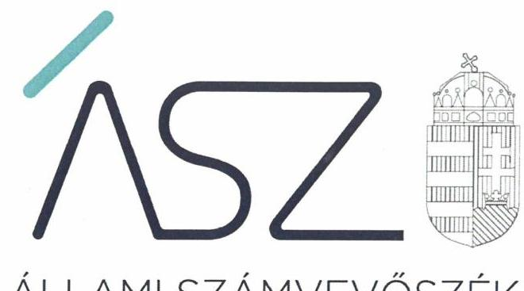

ÁLLAMI SZÁMVEVŐSZÉK

# JELENTÉS 

A költségvetési támogatásban részesülő pártalapítványok 2017-2018. évi gazdálkodása törvényességének ellenőrzése

Jobbik Magyarországért Alapítvány
2020.

20103
www.asz.hu

---

ÁLLAMI SZÁMVEVŐSZÉK

# JELENTÉS 

A költségvetési támogatásban részesülő pártalapítványok 2017-2018. évi gazdálkodása törvényességének ellenőrzése

Jobbik Magyarországért Alapítvány
2020. 07. hó 02. nap

20103
www.asz.hu

---

# AZ ELLENŐRZÉST FELÜGYELTE: 

KAKAS SÁNDOR felügyeleti vezető

## AZ ELLENŐRZÉST VEZETTE ÉS A VÉGREHAJTÁSÁÉRT FELELŐS:

GÁL MAGDOLNA ellenőrzésvezető

## A PROGRAM ÖSSZEÁLLÍTÁSÁÉRT FELELŐS:

BERTALAN RUDOLF GYULA projektvezető

## A TÉMÁHOZ KAPCSOLÓDÓ KORÁBBI SZÁMVEVŐSZÉKI JELENTÉSEK:

- címe: Jelentés - A költségvetési támogatásban részesülő pártalapítványok 2015-2016. évi gazdálkodása törvényességének ellenőrzése - Jobbik Magyarországért Alapítvány
- sorszáma: $\quad 18185$

IKTATÓSZÁM: EL-2729-001/2020.
TÉMASZÁM: 2521
ELLENŐRZÉS-AZONOSÍTÓ SZÁM: V086502

---

# TARTALOMJEGYZÉK 

■ ÖSSZEGZÉS ..... 5
■ AZ ELLENŐRZÉS CÉLJA ..... 6
■ AZ ELLENŐRZÉS TERÜLETE ..... 7
■ AZ ELLENŐRZÉS HÁTTERE, INDOKOLTSÁGA ..... 8
■ A JELENTÉS LÉNYEGES KÉRDÉSKÖREI ..... 9
■ AZ ELLENŐRZÉS HATÓKÖRE ÉS MÓDSZEREI ..... 10
■ MEGÁLLAPÍTÁSOK ..... 13
■ MELLÉKLETEK ..... 15
I. sz. melléklet: Értelmező szótár ..... 15
II. sz. melléklet: Az ÁSZ 18185. számú jelentéséhez kapcsolódó intézkedési terv végrehajtásáról ..... 16
■ FÜGGELÉK: ÉSZREVÉTELEK ..... 19
■ RÖVIDÍTÉSEK JEGYZÉKE ..... 21

---

.

---

# ÖSSZEGZÉS 

A Jobbik Magyarországért Alapítvány a szabályszerű gazdálkodás feltételeit kialakította, a 2017-2018. években a könyvvezetése és gazdálkodása során a jogszabályi előírásokat betartotta. A tevékenységéről szóló 2017-2018. évi jelentéseket a jogszabályi előírások szerint elkészítette. A 2018. évben a Jobbik Magyarországért Alapítványnál végrehajtott intézkedések eredményeként a szabályozottság javult.

## Az ellenőrzés társadalmi indokoltsága

A Párt tv. ${ }^{1}$ 9/A § (1) bekezdése alapján a politikai kultúra fejlesztése érdekében tudományos, ismeretterjesztő, kutatási, oktatási tevékenység folytatása céljából létrehozott pártalapítványok gazdálkodása törvényességének ellenőrzése - Pártalapítványi tv. ${ }^{2}$ 4. § (2) bekezdése értelmében - az ÁSZ ${ }^{3}$ feladata. E törvény 4. § (4) bekezdése alapján az ÁSZ kétévente - kötelező jelleggel - ellenőrzi azoknak a pártalapítványoknak a gazdálkodását, amelyek állami költségvetési támogatásban részesültek.

Az ÁSZ, mint az Országgyűlés ellenőrző szerve a pártalapítványok gazdálkodása törvényességének/szabályszerűségének értékelésével hozzájárul ahhoz, hogy a társadalom objektív képet alkothasson a pártalapítványok működéséről. A jelentésben foglalt megállapítások, következtetések és javaslatok alapján a törvényalkotók konkrét lépéseket tehetnek a pártalapítványokra vonatkozó szabályozások megváltoztatása, átláthatóbbá, ellenőrizhetőbbé tétele irányába. Az ellenőrzött szervezetek szintjén a hiányosságok, szabálytalanságok feltárása, az ennek kapcsán megfogalmazott megállapítások elősegíthetik a pártalapítványok szabályszerű gazdálkodását.

Az ÁSZ stratégiájában megfogalmazta, hogy az államháztartáson kívülre nyújtott költségvetési támogatások és az ingyenes vagyonjuttatás ellenőrzésével hozzájárul ahhoz, hogy a közpénzeket a civil szervezetek is átlátható módon használják fel. A pártalapítványok gazdálkodása szabályszerűségének bemutatásával az ellenőrzés értékteremtő módon járul hozzá az ÁSZ stratégiai céljainak megvalósításához, a nyilvánosság megfelelő tájékoztatásához.

Az ÁSZ 2018. évben ellenőrizte a Pártalapítvány ${ }^{4}$ 2015-2016. évi gazdálkodását.

## Főbb megállapítások, következtetések

A Jobbik Magyarországért Alapítvány a szabályszerű gazdálkodás feltételeit kialakította. Az alapító okirata és a gazdálkodással összefüggő szabályzatai a jogszabályi előírásokkal összhangban voltak, amely megteremtette a közpénzekkel való átlátható és elszámoltatható gazdálkodás alapjait.

A 2017-2018. években a kapott költségvetési támogatások számviteli nyilvántartása, elszámolása szabályszerű volt. A Jobbik Magyarországért Alapítvány által nyújtott támogatások, valamint a ráfordítások elszámolása az ellenőrzött időszakban szabályszerű volt.

A Jobbik Magyarországért Alapítvány a 2017-2018. években a tevékenységéről szóló éves jelentéseket és az éves számviteli beszámolóit a jogszabályi előírások szerint elkészítette, a beszámolók letétbe helyezési kötelezettségének eleget tett. A Jobbik Magyarországért Alapítvány a 2017-2018. évi éves jelentéseit közzétette.

A 2015-2016. évi gazdálkodás ellenőrzéséről szóló 18185. számú számvevőszéki jelentésben foglalt megállapításokhoz kapcsolódó intézkedéseket a Jobbik Magyarországért Alapítvány végrehajtotta, melynek eredményeként a 2018. évben a szabályozottsága, továbbá az elszámolt ráfordítások bizonylati alátámasztottsága javult.

---

# AZ ELLENŐRZÉS CÉLJA 

Az ellenőrzés célja annak megállapítása volt, hogy a pártalapítvány törvényesen gazdálkodott-e, az éves számviteli beszámolók és a pártalapítvány tevékenységéről szóló éves jelentések a jogszabályi előírásoknak megfeleltek-e, a könyvvezetés és gazdálkodás során a vonatkozó jogszabályi rendelkezéseket és belső előírásokat betartották-e. Az ellenőrzés célja továbbá annak értékelése volt, hogy az előző számvevőszéki jelentésben foglalt megállapításokkal összhangban készített intézkedési tervben meghatározott feladatokat az ellenőrzött szervezet végrehaj-totta-e.

---

# AZ ELLENŐRZÉS TERÜLETE 

## Jobbik Magyarországért Alapítvány

Az ellenőrzés a Párt tv. alapján a politikai kultúra fejlesztése érdekében tudományos, ismeretterjesztő, kutatási, oktatási tevékenység folytatása céljából, a Ptk. ${ }^{5}$ szerinti létesítő/alapító okiraton alapuló bírósági nyilvántartásba vétellel létrejött pártalapítványok gazdálkodására terjedt ki.

A pártalapítványok törvényes gazdálkodásának (könyvvezetése, beszámolása, jelentéstétele) szabályait alapvetően a Pártalapítványi tv-en túl, a Számv. tv. ${ }^{6}$ és annak a végrehajtási rendelete a Számviteli vhr. ${ }^{7}$ határozzák meg.

Az utóellenőrzés az ÁSZ tv. ${ }^{8}$-nek megfelelően a pártalapítványnál 2018. évben végzett ellenőrzés alapján készített 18185. számú jelentésben foglalt megállapításokra készített intézkedési tervben foglaltak végrehajtásának ellenőrzésére terjedt ki.

A Jobbik Magyarországért Mozgalom - a Párt tv-ben és a Pártalapítványi tv-ben biztosított lehetőséggel élve - 2011-ben megalapította a Gyarapodó Magyarországért Alapítványt, amelyet a Fővárosi Törvényszék 2011. március 29-én vett nyilvántartásba 14.Pk.60.040/2011/5. számon. Az alapítvány neve a 2015. június 2-i alapító okirat módosítása óta Jobbik Magyarországért Alapítvány.

Az ellenőrzött időszakban hatályos Alapító okirat ${ }^{9}$ szerint a Pártalapítvány célja a politikai kultúra fejlesztése a magyar nemzettudat, a nemzeti elkötelezettség és a keresztény identitás jegyében. A Pártalapítvány legfőbb döntést hozó és kezelő szerve az elnökkel és három taggal működő Kuratórium ${ }^{10}$ volt. A Pártalapítvány a 2017. évben 266,2 millió Ft, míg a 2018. évben 270,2 millió Ft költségvetési támogatásból gazdálkodott, az ellenőrzött években vállalkozási tevékenységet nem folytatott.

A Pártalapítvány a Ptk. ${ }^{11}$ és a Civil tv. ${ }^{12}$ előírásai alapján, a 2013. évben alapította a Kiegyensúlyozott Médiáért Alapítványt, melyet a Fővárosi Törvényszék 2014. január 17-i végzéssel vett nyilvántartásba. A Pártalapítvány az ellenőrzött időszakban nem alapított más jogalanyt, nem volt tagja más jogalanynak, illetve nem csatlakozott más jogalanyhoz, megfelelve a Ptk. ${ }_{1}$ 3:379. § (3) bekezdésében foglaltaknak.

---

# AZ ELLENŐRZÉS HÁTTERE, INDOKOLTSÁGA 

Társadalmi elvárás a közpénzek értékelvű, rendeltetésszerű felhasználása, a közpénzekből nyújtott támogatások átláthatóságának megteremtése, amelyhez az ÁSZ az államháztartásból nyújtott támogatások ellenőrzésével kíván hozzájárulni. A Párt tv. 9/A § (1) bekezdése alapján a politikai kultúra fejlesztése érdekében tudományos, ismeretterjesztő, kutatási, oktatási tevékenység folytatása céljából létrehozott pártalapítványok gazdálkodása törvényességének ellenőrzése - Pártalapítványi tv. 4. § (2) bekezdése értelmében - az ÁSZ feladata. E törvény 4. § (4) bekezdése alapján az ÁSZ kétévente - kötelező jelleggel - ellenőrzi azoknak a pártalapítványoknak a gazdálkodását, amelyek állami költségvetési támogatásban részesültek.

Az ÁSZ, mint az Országgyűlés ellenőrző szerve a pártalapítványok gazdálkodása törvényességének/szabályszerűségének értékelésével hozzájárul ahhoz, hogy a társadalom objektív képet alkothasson a pártalapítványok működéséről. Az ellenőrzés eredményeinek célzott felhasználói a nyilvánosság, a jogalkotó, továbbá a pártalapítványok esetén azok alapítója és szervei. A jelentésben foglalt megállapítások, következtetések és javaslatok alapján a törvényalkotók konkrét lépéseket tehetnek a pártalapítványokra vonatkozó szabályozások megváltoztatása, átláthatóbbá, ellenőrizhetőbbé tétele irányába. Az ellenőrzött szervezetek szintjén a hiányosságok, szabálytalanságok feltárása, az ennek kapcsán megfogalmazott megállapítások elősegíthetik a pártalapítványok szabályszerű gazdálkodását.

Az ÁSZ tv. 33. § (1) bekezdése értelmében az ellenőrzött szervezet vezetője köteles a jelentésben foglalt megállapításokhoz kapcsolódó intézkedési tervet összeállítani, és azt a jelentés kézhezvételétől számított harminc napon belül az ÁSZ részére megküldeni.

Az ÁSZ tv. 33. § (6) bekezdése értelmében, amennyiben az ÁSZ elnöke az ellenőrzés során feltárt jogszabálysértő gyakorlat, illetve a vagyon rendeltetésellenes vagy pazarló felhasználásának megszüntetése érdekében figyelemfelhívó levéllel fordult az ellenőrzött szerv vezetőjéhez, az abban foglaltakat az ellenőrzött szerv vezetője köteles elbírálni, a megfelelő intézkedést megtenni és erről az ÁSZ elnökét értesíteni.

Az ÁSZ által befogadott intézkedési tervben foglaltak megvalósítását az ÁSZ tv. 33. § (7) bekezdésében foglaltak alapján - az ÁSZ utóellenőrzés keretében ellenőrizheti. Az utóellenőrzések keretében - az intézkedések értékelése során - az ÁSZ figyelembe veszi az ellenőrzött szervezetek müködési feltételeiben, valamint a jogszabályi előírásokban bekövetkezett változásokat.

---

# A JELENTÉS LÉNYEGES KÉRDÉSKÖREI 

1.     - A Jobbik Magyarországért Alapítvány gazdálkodásának törvényessége biztositott volt-e?
2.     - A Jobbik Magyarországért Alapítvány könyvvezetése és gazdálkodása során a vonatkozó jogszabályi rendelkezéseket és belső elöírásokat betartották-e?
3.     - A Jobbik Magyarországért Alapítvány tevékenységéről szóló éves jelentések, az éves számviteli beszámolók a jogszabályi elöírásoknak megfeleltek-e?
4. A Jobbik Magyarországért Alapítvány az intézkedési tervben meghatározott feladatokat végrehajtotta-e?

---

# AZ ELLENŐRZÉS HATÓKÖRE ÉS MÓDSZEREI 

## Az ellenőrzés típusa

Szabályszerúségi ellenőrzés.

## Az ellenőrzött időszak

2017-2018. évek.
Az utóellenőrzés tekintetében a 18185. számú számvevőszéki jelentés közzétételének napjától (2018. július 30.) a kiértesítő levél keltéig (2019. október 24.) tartó időszak.

## Az ellenőrzés tárgya

Az ellenőrzés tárgyát képezi a pártalapítvány gazdálkodása, a könyvvezetés szabályozása és gyakorlata szabályszerűsége, az éves számviteli beszámolókra és az alapítvány tevékenységéről szóló éves jelentésekre vonatkozó kötelezettség teljesítése, valamint a gazdálkodáshoz kapcsolódó ellenőrzések javaslatainak hasznosítására irányuló tevékenység.

Az ellenőrzés kiterjedt minden olyan körülményre és adatra, amely az ÁSZ jogszabályban meghatározott feladatainak teljesítéséhez, valamint a program végrehajtása folyamán felmerült újabb összefüggések feltárásához szükséges.

## Az ellenőrzött szervezet

Jobbik Magyarországért Alapítvány

## Az ellenőrzés jogalapja

Az ÁSZ tv. 1. § (3) bekezdése, 5. § (3) bekezdése, 33. § (7) bekezdése, a Pártalapítványi tv. 4. § (2) és (4) bekezdései.

## Az ellenőrzés módszerei

Az ellenőrzést az ÁSZ az Ellenőrzési program szempontjai, az ellenőrzött időszakban hatályos jogszabályok, a jelen ellenőrzésre irányadó ÁSZ módszertan figyelembe vételével végezte el.

Az ellenőrzés ideje alatt az ellenőrzött szervezettel történő kapcsolattartás az ÁSZ SZMSZ ${ }^{13}$-ének vonatkozó előírásai alapján történt.

---

Az ellenőrzést az ÁSZ az ellenőrzött szervezet által rendelkezésre bocsátott dokumentumokra, adatokra alapozta. A rendelkezésre bocsátott adatok, információk kontrollja az ellenőrzés keretében történt. Az ellenőrzés céljának eléréséhez szükséges bizonyítékok megszerzése az egyes adatok közvetlen, részletes elemzésével történt a következő ellenőrzési eljárások alkalmazásával: szemrevételezés, mintavétel, valamint elemző eljárás.

Mintavétellel ellenőrizte az ÁSZ a pártalapítvány 2017-2018. évi kiadásai, ráfordításai elszámolásának szabályszerűségét.

A 2017-2018. évi az alapítvány által nyújtott támogatások elszámolásának, és az alapítvány beszámolóinál a mérlegtételek besorolása, év végi értékelése, azok leltárral való alátámasztottsága szabályszerűsége esetében tételes ellenőrzésre került sor.

A mintavétellel ellenőrzött területek esetében minden egyes tétel vonatkozásában a szabályszerűségre vonatkozó kérdéseket tett fel az ÁSZ. Szabályszerűnek minősült egy ellenőrzött területet, amennyiben 95\%-os bizonyossággal az ellenőrzött sokaságban az átlagos hibaarány legfeljebb 10\%, nem szabályszerűnek, amennyiben 10\%-nál magasabb arányt képviselt.

Abban az esetben, ha az ellenőrzött sokaság tekintetében a 10\%-os hibaarányhoz való viszony megítélésnek megbízhatósága nem érte el a 95\%ot, annak elérése érdekében az értékelést további szempontokkal egészítette ki az ÁSZ, és figyelembe vette a feltárt hibák értékét.

Az ellenőrzési bizonyítékként felhasználható adatforrások közé tartoztak egyrészt az Ellenőrzési program részletes szempontjainál felsorolt adatforrások, másrészt minden egyéb -az ellenőrzés folyamán - feltárt, az ellenőrzés szempontjából információt tartalmazó dokumentum.

Az ellenőrzés lefolytatásához az ellenőrzött a tanúsítványok kitöltésével, valamint az ÁSZ által kért dokumentumok elektronikus megküldésével szolgáltatott adatokat. Az így rendelkezésre bocsátott adatok, információk, a tanúsítványok adatai valódiságának kontrollja az ellenőrzés keretében történt.

Az utóellenőrzés megállapításait az ÁSZ rendelkezésére álló dokumentumok, valamint az ÁSZ adatbekérése szerint, az ellenőrzött szervezetek által elektronikusan rendelkezésre bocsátott dokumentumok, adatok alapján értékelte. Az ÁSZ az ellenőrzés során az intézkedési tervekben előírt feladatokat, azok végrehajthatósága, illetve végrehajtása szempontjából az alábbiak szerint értékelte:
„határidőben végrehajtott" a feladat, ha a teljesítés dokumentáltan, az intézkedési tervben előírt határidőben és tartalommal megtörtént;
„határidőn túl végrehajtott" a feladat, ha annak teljesítése az intézkedési tervben meghatározott módon, de az abban előírt határidőn túl történt meg;
„nem végrehajtott" a feladat, ha a végrehajtás nem történt meg, vagy amennyiben a teljesítést/végrehajtást nem dokumentálták, dokumentumokkal nem tudták igazolni annak teljesítését;
„okafogyottá vált" a feladat, ha végrehajtására - meghatározott esemény bekövetkezése, továbbá külső körülmény, a működést

---

érintő feltétel változása miatt - már nem volt szükség, illetve lehetőség, és egyértelműen megállapítható, hogy az intézkedést szükségessé tevő körülmény a jövőben nem fordulhat elő;
„nem időszerű" az a feladat, amelynek ellenőrzési időszakon belüli végrehajtására azért nem került (kerülhetett) sor, mert az intézkedés alapjául szolgáló esemény nem következett be, de annak jövőbeni előfordulása lehetséges, a végrehajtása nem volt esedékes, vagy a végrehajtás határideje még nem járt le.

---

# 1. A Jobbik Magyarországért Alapítvány gazdálkodásának törvényessége biztosított volt-e? 

## Összegző megállapítás

A Pártalapítvány a szabályszerű gazdálkodás feltételeit kialakította.

A Pártalapítvány Alapító okirata a Ptk. 2 és a Pártalapítványi tv. előírásaival összhangban rögzítette a Pártalapítvány célját, tevékenységét, az induló vagyont, a vagyon felhasználási módját, a kezelésének szabályait, valamint a Pártalapítvány kezelő szervének (Kuratórium) hatáskörét és eljárási szabályait, a Pártalapítvány képviseletére jogosult személyt, továbbá szabályozta a képviseleti jog terjedelmét és gyakorlásának a módját.

A Pártalapítvány gazdálkodásával kapcsolatos folyamatokat, feladat és hatásköröket az Alapító okirat, az SZMSZ ${ }^{14}$, és a Kuratórium Ügyrendje ${ }^{15}$ határozta meg.

A Pártalapítvány a Számv. tv. előírása szerint kialakította számviteli politikáját ${ }^{16}$, annak keretében a Leltározási szabályzatát ${ }^{17}$, Értékelési szabályzatát ${ }^{18}$, Pénzkezelési szabályzatát ${ }^{19}$, Házipénztár kezelési szabályzatát ${ }^{20}$, továbbá elkészítette Számlarendjét ${ }^{21}$.

A Pártalapítvány könyvvezetési és beszámolási rendszerét a Számv. tv. és a Számviteli vhr. előírásai alapján alakította ki, beszámolási kötelezettségét egyszerűsített éves beszámoló készítésével teljesítette.

## 2. A Jobbik Magyarországért Alapítvány könyvvezetése és gazdálkodása során a vonatkozó jogszabályi rendelkezéseket és belső előírásokat betartották-e?

## Összegző megállapítás

A Pártalapítvány a könyvvezetése és gazdálkodása során a jogszabályi rendelkezéseket betartotta.

A Pártalapítványnál a költségvetési támogatások elfogadása, számviteli nyilvántartása és elszámolása szabályszerű volt.

A Pártalapítvány a 2017. évben 204,6 millió Ft, 2018. évben 193,6 millió Ft cél szerinti támogatást nyújtott támogatási szerződések alapján alapítványoknak, magánszemélyeknek és társaságnak. A Pártalapítvány által nyújtott támogatásokra fordított összegek elszámolása a 2017-2018. években szabályszerű volt.

A Pártalapítvány a 2017-2018. években a ráfordításainak elszámolása során betartotta a jogszabályi előírásokat.

Az ellenőrzött időszakban a Pártalapítvány az alapító párt részére vagyoni hozzájárulást nem nyújtott.

---

# 3. A Jobbik Magyarországért Alapítvány tevékenységéről szóló éves jelentések, az éves számviteli beszámolók a jogszabályi előírásoknak megfeleltek-e? 

## Összegző megállapítás

A Pártalapítvány tevékenységéről szóló éves jelentések, az éves számviteli beszámolók a jogszabályi előírásoknak megfeleltek.

A Pártalapítvány a tevékenységéről szóló 2017. és 2018. évi jelentéseket a Pártalapítványi tv. előírásai szerint elkészítette, a Kuratórium által jóváhagyott jelentéseket a Magyar Közlöny Hivatalos Értesítőjében és honlapján is közzétette.

A Pártalapítvány a Számv. tv. és a Számv. vhr. előírásainak megfelelően készítette el a 2017. és 2018. évi egyszerűsített éves beszámolóit, a Kuratórium által elfogadott egyszerűsített éves beszámolók letétbe helyezését szabályszerűen végezte.

Az éves beszámolók mérlegtételeinek besorolása, év végi értékelése szabályszerűen történt. Az éves beszámolók elkészítéséhez a leltározást elvégezték, a mérlegtételeket tételes leltárral alátámasztották.

## 4. A Jobbik Magyarországért Alapítvány az intézkedési tervben meghatározott feladatokat végrehajtotta-e?

## Összegző megállapítás

A Pártalapítvány a korábbi számvevőszéki jelentésben foglalt megállapításokkal összhangban készített intézkedési tervben meghatározott feladatokat határidőben végrehajtotta.

A 18185. számú számvevőszéki jelentésben megfogalmazott intézkedést igénylő megállapításokkal összhangban a Pártalapítvány - az ÁSZ tv-ben rögzített határidőben - két pontból álló intézkedési tervet készített. A Pártalapítvány a feladatok végrehajtásáról az előírt határidőben gondoskodott.

- A Kuratórium elfogadta az Info. tv. ${ }^{22}$ előírásainak megfelelő Adatvédelmi szabályzatot ${ }^{23}$.
- A Gazdasági igazgató és a Kuratórium elnöke intézkedett arról, hogy a számviteli nyilvántartásokba a jövőben a Számv. tv-nek megfelelő bizonylat alapján kerüljenek az adatok rögzítésre.

---

# MELLÉKLETEK 

- I. SZ. MELLÉKLET: ÉRTELMEZŐ SZÓTÁR
alapítvány
gazdasági-vállalkozási tevékenység
költségvetésből juttatott/nyújtott forrás/támogatás
pártalapítvány

Az alapítvány az alapító által az alapító okiratban meghatározott tartós cél folyamatos megvalósítására létrehozott jogi személy. Az alapító az alapító okiratban meghatározza az alapítványnak juttatott vagyont és az alapítvány szervezetét. Alapítvány nem alapítható gaz-dasági-vállalkozási tevékenység folytatására. Az alapítvány az alapítványi cél megvalósításával közvetlenül összefüggő gazdasági tevékenység végzésére jogosult. Alapítvány nem lehet korlátlan felelősségű tagja más jogalanynak, nem létesíthet alapítványt és nem csatlakozhat alapítványhoz. (Forrás: Ptk. 3:378. §, 3:379. § (1) - (3) bekezdés)
A jövedelem- és vagyonszerzésre irányuló vagy azt eredményező, üzletszerűen végzett gazdasági tevékenység, kivéve az adomány (ajándék) elfogadását, a létesítő okiratban meghatározott cél szerinti tevékenységet (ideértve a közhasznú tevékenységet is), - 2015. november 28 -tól - a pénzeszközök betétbe, értékpapírba, társasági részesedésbe történő elhelyezését és az ingatlan megszerzését, használatának átengedését és átruházását. (Forrás: Ectv. 2. § 11. pont.)
a pártalapítványoknak a Párt tv. 9/A. § (1) bekezdése és a Pártalapítványi tv. 1. § előírásainak értelmében, az éves költségvetési törvények szerint - jellemzően az 1. számú melléklet I. Országgyűlés fejezet 9. Pártalapítványok támogatás címen - az állami költségvetésből juttatott forrás/támogatás.
az államháztartás központi alrendszeréből - a Tb alap kivételével - ellenérték nélkül, pénzben nyújtott költségvetési támogatás (Forrás: Áht ${ }^{24}$. 1. § 14. pont)
a politikai kultúra fejlesztése érdekében, tudományos, ismeretterjesztő, kutatási és oktatási tevékenység folytatása céljából pártok által létrehozott, külön jogszabályban - a Pártalapítványi tv. 1. § és 3. § (1) bekezdése - meghatározott, jogi személynek minősülő egyéb szervezet, speciális jogállású alapítvány (Forrás: Párt tv. 9/A. § (1) bekezdés, Pártalapítványi tv. 1. §, Ectv. 1. § (2) bekezdés, 2. § 6. c) pont, Számv. tv. 3. § (1) bekezdése 4. pont, Számviteli vhr. 2. § (1) bekezdés I) pont)

---

|  1. | Az illat |  |  |   |
| --- | --- | --- | --- | --- |
|  1. | Az Alapítvány igazgatója intézkedik az Alapítvány adatvédelmi szabályzatának előkészítéséről, majd a kuratórium elő terjeszti azt. Az adatvédelmi szabályzat az Info. tv. 7 §-ban foglaltakkal összhangban meghatározza, hogy az Alapítvány adatkezelőként, illetve tevékenységi körében adatfeldolgozóként hogyan gondoskodik az adatok biztonságáról, valamint azokat a technikai és szervezési intézkedéseket és eljárási szabályokat, amelyek a törvényileg előírt adat- és titokvédelmi szabályok érvényre juttatásához szükségesek. A kuratórium dönt annak elfogadásáról. | 2018. október 31. | alapítvány igazgatója | A Kuratórium 2018. október 25-én, a 47/2018. (10.25.) számú határozatával fogadta el a Pártalapítvány 2018. október 25-től hatályos Adatvédelmi szabályzatát, amely az Info. tv. 7. §-ában előírtakkal összhangban tartalmazta az adatok biztonságáról való gondoskodást, valamint azokat a technikai és szervezési intézkedéseket és eljárási szabályokat, amelyek a törvényileg előírt adat- és titokvédelmi szabályok érvényre juttatásához szükségesek.  |
|  2/a. | Az Alapítvány kuratóriuma 2018. augusztus 27-i ülésén a fellelt pontatlanságok kijavítását rendelte el. | 2018. október 15. | gazdasági igazgató | A Kuratórium 2018. augusztus 27-én, a 37/2018. (08.27.) számú határozatával döntött az intézkedési terv elfogadásáról.
A gazdasági igazgató 2018. október 15-én kelt levelében - a Kuratórium 37/2018. (08.27.) számú határozatának értelmében - tájékoztatta a kuratóriumi elnököt arról, hogy a fellelt hiba kijavításának elvégzésére felhívta a számviteli szolgáltatást végző egyéni vállalkozó figyelmét. A számviteli szolgáltatást végző egyéni vállalkozóval, valamint a könyvvizsgálóval konzultálva intézkedett, hogy adatok csak bizonylat alapján kerüljenek be a könyvelésbe (előlegszámlát rögzítették), valamint az alapítványi igazgatóval egyeztetett, hogy a korábbi szolgáltató végszámla kiállításával zárja le a folyamatot.  |
|  2/b. | A kuratórium elnöke külön levélben hívja fel a számviteli szolgáltatást végző vállalkozó figyelmét arra, hogy a számviteli nyilvántartásokba a jövőben csak a Számv. tv-nek megfelelő bizonylat alapján legyenek adatok rögzítve. | 2018. szeptember 30. | kuratórium elnöke | A Kuratórium elnöke 2018. szeptember 10-én kelt levelében hívta fel a számviteli szolgáltatást végző vállalkozó figyelmét arra, hogy a számviteli nyilvántartásokba a jövőben csak a Számv. tv-nek megfelelő bizonylat alapján legyenek adatok rögzítve. A számviteli szolgáltatást végző vállalkozó a levelet 2019. szeptember 12-én átvette, annak tartalmát tudomásul vette.  |

---

|  2/2 | Intézkedési tervben meghatározott feladat | Az intézkedési tervben meghatározott határidő | Az intézkedési tervben meghatározott feladat felelőse | A feladat végrehajtása  |
| --- | --- | --- | --- | --- |
|   |  | Határidőben végrehajtott feladatok |  |   |
|  2/c. | A könyvvizsgáló észrevételei alapján a kuratórium módosítsa, pontosítsa az Alapítvány szabályzatait, az elszámolási kötelezettségek egyértelműbb szabályozása érdekében. | 2018. december 31. | kuratórium elnöke | A Kuratórium az 54/2018. (12.18.) számú határozatával elfogadta a szabályzatok ÁSZ Intézkedési terv szerinti módosítását, melyek 2019. január 01-től hatályosak. A határozat elfogadásához kapcsolódóan rögzítésre került, hogy a szabályzatok módosítása kapcsán - az ÁSZ Intézkedési tervében foglaltak szerint - az elszámolások vonatkozásában pontosítások történtek. A 2019. január 1-től hatályos „"Eszközök és források értékelési szabályzat" kiegészítése, módosítása, pontosítása megtörtént.  |

---

.

---

# FÜGGELÉK: ÉSZREVÉTELEK 

A jelentéstervezetet a Számvevőszék 15 napos észrevételezésre megküldte az ellenőrzött szervezet vezetőjének az ÁSZ tv. 29. §* (1) bekezdése előírásának megfelelően.

A Jobbik Magyarországért Alapítvány kuratóriumi elnöke a jelentéstervezet megállapításaira nem tett észrevételt.

[^0]
[^0]:    * 29. § (1) Az Állami Számvevőszék az ellenőrzési megállapításait megküldi az ellenőrzött szervezet vezetőjének vagy az általa megbízott személynek, és annak, akinek személyes felelősségét állapította meg.
    (2) Az ellenőrzött szervezet vezetője és a felelősként megjelölt személy az ellenőrzés megállapításaira tizenöt napon belül írásban észrevételt tehet.
    (3) Az Állami Számvevőszék az észrevételre a beérkezésétől számított harminc napon belül írásban válaszol. A figyelembe nem vett észrevételeket köteles a jelentésben feltüntetni, és megindokolni, hogy azokat miért nem fogadta el.

---

.

---

# RÖVIDÍTÉSEK JEGYZÉKE 

${ }^{1}$ Párt tv. ${ }^{2}$ Pártalapítványi tv. ${ }^{3}$ ÁSZ ${ }^{4}$ Pártalapítvány ${ }^{5}$ Ptk. 2 ${ }^{6}$ Számv. tv ${ }^{7}$ Számviteli vhr. ${ }^{8}$ ÁSZ tv. ${ }^{9}$ Alapító okirat

[^0]1989. évi XXXIII. törvény a pártok működéséről és gazdálkodásáról 2003. évi XLVII. törvény a pártok múködését segítő tudományos, ismeretterjesztő, kutatási, oktatási tevékenységet végző alapítványokról Állami Számvevőszék
Jobbik Magyarországért Alapítvány
a 2013. évi V. törvény a Polgári Törvénykönyvről (hatályos: 2014. március 15-től) 2000. évi C. törvény a számvitelről

479/2016. (XII.28.) Korm. rendelet a számviteli törvény szerinti egyes egyéb szervezetek beszámoló készítési és könyvvezetési kötelezettségének sajátosságairól (hatályos: 2017. január 1-jétől)
2011. évi LXVI. törvény az Állami Számvevőszékről

Alapító okirat: Jobbik Magyarországért Alapítvány 2015. június 30-án kelt módosításokkal egységes szerkezetbe foglalt alapító okirata,
Alapító okirat: Jobbik Magyarországért Alapítvány 2018. július 31-én kelt módosításokkal egységes szerkezetbe foglalt alapító okirata
Jobbik Magyarországért Alapítvány Kuratóriuma
1959. évi IV. törvény a Polgári törvénykönyvről (hatálytalan: 2014 március 15-től)
2011. évi CLXXV. törvény az egyesülési jogról, a közhasznú jogállásról, valamint a civil szervezetek múködéséről és támogatásáról
Állami Számvevőszék Szervezeti és Működési Szabályzata
A Jobbik Magyarországért Alapítvány Szervezeti és Múködési Szabályzata (hatályos: 2016. december 29-től)
A Gyarapodó Magyarországért Alapítvány Kuratóriumának Úgyrendje és Múködési Szabályzata (hatályos: 2012. december 17-től)
Számviteli Politika a Jobbik Magyarországért Alapítvány Könyvvezetési és elszámolási módszereinek előírásához (hatályos: 2017. január 01-től)
Leltározási szabályzat Gyarapodó Magyarországért Alapítvány (hatályos: 2011. április 01-től.)
Leltározási szabályzat Jobbik Magyarországért Alapítvány I. sz. módosítása (hatályos: 2016. december 29-től.)
Eszközök és Források Értékelési szabályzata Jobbik Magyarországért Alapítvány (hatályos: 2017. január 01-től.)
A Gyarapodó Magyarországért Alapítvány Pénzkezelési szabályzata (hatályos: 2011. április 01-től.)

A Gyarapodó Magyarországért Alapítvány Házipénztár kezelési szabályzata (hatályos: 2011. április 01-től.)
Jobbik Magyarországért Alapítvány Számlarend (hatályos: 2017. január 01-től.)
2011. évi CXII. törvény az információs önrendelkezési jogról és az információszabadságról
Jobbik Magyarországért Alapítvány Adatkezelési Szabályzata (hatályos: 2018. október 25-től)
2011. évi CXCV. törvény az államháztartásról

[^0]:    ${ }^{1}$ Párt tv.
    ${ }^{2}$ Pártalapítványi tv.
    ${ }^{3}$ ÁSZ
    ${ }^{4}$ Pártalapítvány
    ${ }^{5}$ Ptk. 2
    ${ }^{6}$ Számv. tv
    ${ }^{7}$ Számviteli vhr.

---

# ASZ 

ALLAMI SZAMVEVOSZEK
1052 Budapest, Apáczai Cs. J. u. 10. I 1364 Budapest 4. Pf. 54 TEL: +36 14849100
email: szamvevoszek@asz.hu
web: www.asz.hu | www.aszhirportal.hu