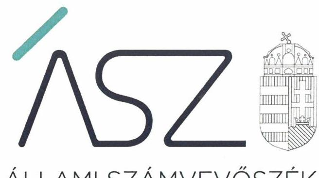
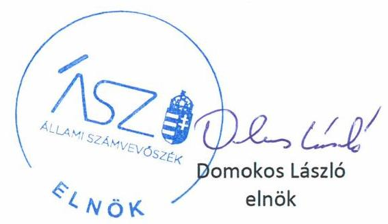
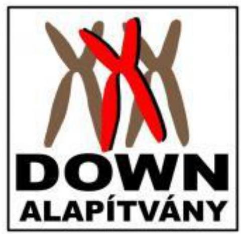
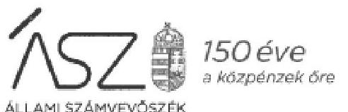
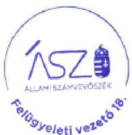

ÁLLAMI SZÁMVEVŐSZÉK

# JELENTÉS 

## Nem állami humánszolgáltatók ellenőrzése

A köznevelési és szociális humánszolgáltatást nyújtó intézmények, szolgáltatók államháztartáson kívüli fenntartói központi költségvetésből kapott támogatásai felhasználásának ellenőrzése - Az Értelmi Fogyatékosok Fejlődését Szolgáló Magyar Down Alapítvány

2020. 

20104
www.asz.hu

---

ÁLLAMI SZÁMVEVŐSZÉK

# JELENTÉS 

## Nem állami humánszolgáltatók ellenőrzése

A köznevelési és szociális humánszolgáltatást nyújtó intézmények, szolgáltatók államháztartáson kívüli fenntartói központi költségvetésből kapott támogatásai felhasználásának ellenőrzése - Az Értelmi Fogyatékosok Fejlődését Szolgáló Magyar Down Alapítvány
2020. 06. hó 26. nap

20104
www.asz.hu

---

# AZ ELLENŐRZÉST FELÜGYELTE: 

KLINGA LÁSZLÓ felügyeleti vezető

## AZ ELLENŐRZÉST VEZETTE ÉS A VÉGREHAJTÁSÁÉRT FELELŐS:

DR. DOMOKOS MAGDOLNA ellenőrzésvezető

## A PROGRAM ÖSSZEÁLLÍTÁSÁÉRT FELELŐS:

TÓTPÁL SZABOLCS osztályvezető

FEKETE-NAGY ANDRÁS GÁBOR ellenőrzési programért felelős vezető

## IKTATÓSZÁM: EL-2731-001/2020.

Jelentéseink az Országgyúlés számítógépes
hálózatán és az interneten a www.asz.hu címen is olvashatóak.

TÉMASZÁM: 2491
ELLENŐRZÉS-AZONOSÍTÓ SZÁM: V083530, V0867086

---

# TARTALOMJEGYZÉK 

■ ÖSSZEGZÉS ..... 5
■ AZ ELLENŐRZÉS CÉLJA ..... 6
■ AZ ELLENŐRZÉS TERÜLETE ..... 7
■ AZ ELLENŐRZÉS HÁTTERE, INDOKOLTSÁGA ..... 8
■ A JELENTÉS LÉNYEGES KÉRDÉSKÖREI ..... 9
■ AZ ELLENŐRZÉS HATÓKÖRE ÉS MÓDSZEREI ..... 10
■ MEGÁLLAPÍTÁSOK ..... 12
■ JAVASLATOK ..... 13
■ MELLÉKLETEK ..... 15
I. sz. melléklet: Értelmező szótár ..... 15
■ FÜGGELÉK: ÉSZREVÉTELEK ..... 17
■ RÖVIDÍTÉSEK JEGYZÉKE ..... 25

---

.

---

# ÖSSZEGZÉS 

A budapesti székhelyű Az Értelmi Fogyatékosok Fejlődését Szolgáló Magyar Down Alapítvány nem biztosította a 2015. évben a szociális humánszolgáltatási közfeladatokra kapott támogatás elszámoltathatóságát, 2016-2017. években a költségvetési támogatások felhasználásának ellenőrizhetőségét. A 2018. évben biztosította a költségvetési támogatások felhasználásának átláthatóságát és elszámoltathatóságát.

## Az ellenőrzés társadalmi indokoltsága

A szociális gondoskodást igénylők védelme, illetve a köznevelési feladatok ellátása az Alaptörvényben meghatározott, a társadalom szempontjából fontos tevékenységek. Jogszabályok teszik lehetővé, hogy államháztartáson kívüli szervezetek - így például az egyházi fenntartók, alapítványok, gazdasági társaságok, egyesületek - által fenntartott intézmények is végezzenek köznevelési, szociális és gyermekvédelmi feladatokat. Mindehhez a központi költségvetés évente jelentős összegű támogatással járul hozzá. Az államháztartáson kívüli, humánszolgáltatást végző intézmények az igényelt közpénzekből társadalmilag hasznos, közösségteremtő, közérdekű, illetve közhasznú tevékenységet végeznek, illetve közfeladatokat látnak el.

Az intézményfenntartók ellenőrzésével az Állami Számvevőszék hozzájárul ahhoz, hogy ezen a közpénzeket az államháztartáson kívüli szervezetek is ellenőrizhető, átlátható és elszámoltatható módon használják fel a közfeladatok ellátása során. Az ellenőrzések célja továbbá, hogy a nyilvánosság és az igénybevevők megfelelő tájékoztatást kapjanak az államháztartáson kívüli közfeladatot ellátók működéséről.

Az ÁSZ ellenőrzései arra adnak választ, hogy az intézményfenntartók arra használták-e fel a közpénzeket, amire igényelték.

A szabályszerű gazdálkodás elengedhetetlen a közfeladat ellátás szakmai céljainak megvalósításához, valamint a társadalmi közbizalom fenntartásához.

## Főbb megállapítások, következtetések, javaslatok

Az Értelmi Fogyatékosok Fejlődését Szolgáló Magyar Down Alapítvány a 2015. évben nem rendelkezett a Számv. tv. ${ }^{1}$ előírása ellenére Számviteli politikával, ezáltal nem biztosította az elszámoltathatóságot.
Az Értelmi Fogyatékosok Fejlődését Szolgáló Magyar Down Alapítvány a 2016-2017. években a szociális humánszolgáltatási közfeladat ellátására kapott költségvetési támogatás felhasználásának a Számv. tv. 161/A § (2) bekezdésében előírt ellenőrizhetőségét nem biztosította. Mivel az Atr. ${ }^{2}$ 16. § (1) bekezdésben foglalt szabályozás ellenére nem gondoskodott számviteli rendszerében a Fenntartó és a nem önállóan gazdálkodó intézménye gazdálkodásának elkülönítéséről, valamint arról, hogy az átmeneti otthon, napközi otthon, lakóotthon múködtetése, valamint támogatott lakhatás ellátása közfeladatokra kapott költségvetési támogatás felhasználásának feladatonkénti bontásban történő elszámolására az adatok rendelkezésre álljanak.

A Fenntartó mindezek alapján az Alaptörvény ${ }^{3}$ 39. cikk (2) bekezdésében foglaltak ellenére a 2015-2017. években a felhasznált közpénzekre vonatkozó gazdálkodása átláthatóságát nem biztosította. Ezáltal a Fenntartó nem igazolta, hogy a közpénzt a szociális humánszolgáltatási közfeladatra fordította.
2018-ban a Fenntartó a szociális humánszolgáltatási és köznevelési közfeladathoz kapcsolódó támogatást szabályszerűen kezelte.

Az Állami Számvevőszék a jelentésben foglalt megállapítások alapján Az Értelmi Fogyatékosok Fejlődését Szolgáló Magyar Down Alapítvány kuratóriumi elnökének egy javaslatot fogalmazott meg. A javaslatot megalapozó megállapításra az érintettnek 30 napon belül intézkedési tervet kell készítenie.

---

# AZ ELLENŐRZÉS CÉLJA

**AZ ELLENŐRZÉS CÉLJA** annak értékelése volt, hogy a nem állami, nem önkormányzati köznevelési és szociális intézmények fenntartói központi költségvetésből kapott támogatásainak felhasználása szabályszerű volt-e.

---

# AZ ELLENŐRZÉS TERÜLETE 

## Az Értelmi Fogyatékosok Fejlődését Szolgáló Magyar Down Alapítvány

A Down Alapítványt ${ }^{4}$ a Bíróság ${ }^{5}$ 1992. július 8-án vette nyilvántartásba az értelmi fogyatékosok, különösen a down szindrómában szenvedő emberek életvitelének segítése céljából. A Down Alapítványt a Fővárosi Törvényszék 2015. május 5-én kelt végzése szerint közhasznú jogállású szervezetnek minősül, vállalkozási tevékenységet nem folytat. A Down Alapítvány ügyvezető szerve a kuratórium ${ }^{6}$, képviselője a kuratórium elnöke, akinek személye az ellenőrzött időszakban nem változott.

A Down Alapítványnál a 2015-2018. években az alapító érdekeinek megóvása, tulajdonosi ellenőrzési feladata ellátásának biztosítása érdekében, a Civil tv ${ }^{7} .40 . \S$ (1) bekezdésben foglalt előírások szerint 3 tagú felügyelő bizottság múködött, összetétele az ellenőrzött időszakban nem változott.

A Down Alapítvány az alapfeladatait 2015-2018. években a szociális szakosított ellátást nyújtó 10 önálló ágazati besorolású, önálló jogi személyiséggel nem rendelkező intézménye ${ }_{1}$. ${ }_{10}{ }^{8}$, továbbá a 2018. évben egy, önálló jogi személyiséggel rendelkező köznevelési székhely intézménye ${ }^{9}$ működtetésével látta el.

A Down Alapítvány részére a szociális feladatellátásra a Magyar Államkincstár adatai alapján biztosított költségvetési támogatás összege a 2015. évben 123,6 M Ft, 2016. évben 148,3 M Ft, 2017. évben 179,2 M Ft illetve 2018-ban 192,3 M Ft, köznevelési feladatra 28, 7 M Ft volt.

---

# AZ ELLENŐRZÉS HÁTTERE, INDOKOLTSÁGA 

A köznevelési és szociális feladatokat ellátó nem állami intézményfenntartók részére közfeladataik ellátására évente jelentős összegű pénzügyi támogatást biztosítottak a mindenkori költségvetési törvények a bennük megfogalmazott feltételek mellett. A felhasználható állami támogatások Kvtv.-ek ${ }^{10}$ szerinti előirányzata szociális területen a 2015-2018. együtt 360 Mrd Ft, 2018-ban a köznevelési területen 203 Mrd Ft volt.

Az Állami Számvevőszék stratégiájában célul tűzte ki, hogy az államháztartáson kívülre nyújtott költségvetési támogatások ellenőrzésével hozzájárul ahhoz, hogy a közpénzeket az államháztartáson kívüli szervezetek is átlátható módon használják fel a közfeladatok szerződésben vállalt ellátása érdekében.

Az Állami Számvevőszék stratégiájában foglaltak alapján is indokolt az ellenőrzés, amely a társadalom számára jelzi, hogy a közpénz államháztartáson kívüli felhasználása sem maradhat ellenőrizetlenül. Az ellenőrzés javaslataival hozzájárulhat az államháztartáson kívüli szervezetek szabályszerű támogatás felhasználásához, javíthatja a társadalmi-gazdasági döntések megalapozottságát, amely a „jól irányított állam" feltétele.

A holisztikus megközelítés jegyében az ellenőrzés keretében egyedi kockázatelemzés alapján kiválasztott fenntartóknál értékelte az Állami Számvevőszék az államháztartáson kívüli köznevelési és szociális tevékenységhez kapcsolódó támogatások felhasználásának megfelelőségét.

---

# A JELENTÉS LÉNYEGES KÉRDÉSKÖREI 

1. A köznevelési és szociális humánszolgáltató közfeladatot ellátó államháztartáson kívüli fenntartó szabályszerű müködési - és gazdálkodási környezet kialakításával megteremtette-e a költségvetési támogatások átlátható, elszámoltatható igénybevételének, felhasználásának feltételeit?
2. Az államháztartáson kívüli fenntartó az átvállalt köznevelési és szociális humánszolgáltatási közfeladathoz biztositott költségvetési támogatásokat szabályszerűen fordította-e a köznevelési és humánszolgáltató intézményei müködtetésére? Az intézményei müködtetéséhez felhasznált közpénzekre vonatkozó gazdálkodásával a nyilvánosság előtt elszámolt-e?

---

# AZ ELLENŐRZÉS HATÓKÖRE ÉS MÓDSZEREI 

## Az ellenőrzés típusa

Megfelelőségi ellenőrzés.

## Az ellenőrzött időszak

A 2015. január 1-je és 2018. december 31-e közötti időszak a szociális humánszolgáltatási közfeladatok, 2018. január 1-je és 2018. december 31-e közötti időszakban a köznevelési közfeladatok tekintetében.

## Az ellenőrzés tárgya

Az ellenőrzés a köznevelési és szociális humánszolgáltatási közfeladatokat ellátó államháztartáson kívüli fenntartók humánszolgáltatási közfeladatai ellátásához a központi költségvetésből kapott támogatásaik humánszolgáltatási közfeladatokra való fenntartó általi felhasználása szabályszerűségének értékelésére terjedt ki.

## Az ellenőrzött szervezet

Az Értelmi Fogyatékosok Fejlődését szolgáló Magyar Down Alapítvány

## Az ellenőrzés jogalapja

Az ellenőrzés jogszabályi alapját az ÁSZ tv ${ }^{11}$. 1. § (3) bekezdésében, valamint az 5. § (3) bekezdésben foglalt előírások adják.

## Az ellenőrzés módszerei

Az ellenőrzést az ellenőrzési program annak szempontjai, kérdései, az ellenőrzött időszakban hatályos jogszabályok, a nemzetközi standardokat irányadónak tekintve, az ellenőrzés szakmai szabályok és módszertanok figyelembevételével rendelte elvégezni.
A közpénzekkel való felelős gazdálkodás segítésére irányuló javaslatok kidolgozásakor a hatályos jogszabályokat tekintettük irányadónak.

Az ellenőrzés ideje alatt az ellenőrzött szervezettel történő kapcsolattartást az ÁSZ SZMSZ ${ }^{12}$-ének vonatkozó előírásai alapján biztosítottuk.

---

Az ellenőrzési kérdések megválaszolásához szükséges bizonyítékok megszerzése az ellenőrzött által rendelkezésre bocsátott dokumentumokra, adatokra alapozva megfigyelés, szemle (szemrevételezés), kérdésfeltevés (információkérés), valamint elemző eljárással történt.

Az ellenőrzési bizonyítékként felhasználható adatforrások közé tartoztak egyrészt az ellenőrzési program részletes szempontjainál felsorolt adatforrások, másrészt minden - az ellenőrzés folyamán feltárt, az ellenőrzés szempontjából információt tartalmazó - dokumentum.

Az ellenőrzés lefolytatásához az ellenőrzött szervezet a kitöltött tanúsítványok, valamint az ÁSZ ${ }^{13}$ által kért dokumentumok elektronikus úton való megküldésével szolgáltatott adatokat, információkat. Az így rendelkezésre bocsátott adatok, információk és a tanúsítványok adatai valódiságának kontrollja az ellenőrzés keretében történt.

Az ellenőrzést alapvetően a köznevelési és szociális humánszolgáltatások esetében a központi költségvetési támogatások igénylésével, módosításával, felhasználásával, elszámolásával kapcsolatos feladatokat ellátó államháztartáson kívüli fenntartónál végeztük.

A köznevelési és szociális humánszolgáltatások központi költségvetési támogatásaival kapcsolatos, államháztartáson kívüli fenntartó jogszabályokban előírt feladatai betartása, továbbá a központi költségvetési támogatások szabályszerű nyilvántartása került ellenőrzésre a fenntartónál rendelkezésre álló nyilvántartások, beszámolók és egyéb dokumentumok alapján. Az ellenőrzés nem terjedt ki a köznevelési és szociális humánszolgáltatások központi költségvetési támogatásai igénylése, módosítása, elszámolása valódiságának, megalapozottságának, helyességének - sem a fenntartónál, sem a székhely intézményeinél való - értékelésére (mivel ennek felülvizsgálata, ellenőrzése a finanszírozó jogszabályban előírt feladata, határozatai kiadása előtt). Továbbá nem terjedt ki az ellenőrzés e források, intézmények általi szabályszerű felhasználásának értékelésére.

---

# MEGÁLLAPÍTÁSOK 

## 1. A köznevelési és szociális humánszolgáltató közfeladatot ellátó államháztartáson kívüli fenntartó szabályszerű müködési - és gazdálkodási környezet kialakításával megteremtette-e a költségvetési támogatások átlátható, elszámoltatható igénybevételének, felhasználásának feltételeit?

Összegző megállapítás A Fenntartó a 2018. évben szabályszerű gazdálkodási környezet kialakításával megteremtette a költségvetési támogatások átlátható, elszámoltatható igénybevételének, felhasználásának feltételeit.

A Fenntartó 2016.08.25-től rendelkezett a jogszabályban meghatározottak szerint számviteli politikával ${ }^{14}$, illetve a számviteli politika részeként elkészítendő eszközök és források leltárkészítési és leltározási szabályzatával és pénzkezelési szabályzattal.

A Fenntartó számlarendje nem felelt meg a Számv. tv. 161. § (2) bekezdés b), c) és d) pontjában foglaltaknak, nem tartalmazta a számla értéke növekedésének, csökkenésének jogcímeit, a számlát érintő gazdasági eseményeket, azok más számlákkal való kapcsolatát, a főkönyvi számla és az analitikus nyilvántartás kapcsolatát, valamint a számlarendben foglaltakat alátámasztó bizonylati rendet.
2. Az államháztartáson kívüli fenntartó az átvállalt köznevelési és szociális humánszolgáltatási közfeladathoz biztosított költségvetési támogatásokat szabályszerűen fordította-e a köznevelési és humánszolgáltató intézményei működtetésére? Az intézményei működtetéséhez felhasznált közpénzekre vonatkozó gazdálkodásával a nyilvánosság előtt elszámolt-e?

Összegző megállapítás A Fenntartó 2018-ban a szociális humánszolgáltatási és köznevelési közfeladathoz kapcsolódó költségvetési támogatást szabályszerűen kezelte, a közpénzekre vonatkozó gazdálkodásával a nyilvánosság előtt elszámolt.

A Fenntartó a szociális humánszolgáltatási és köznevelési feladatai ellátásához kapott költségvetési támogatást bevételei között elkülönítetten kezelte, annak felhasználását feladatonkénti bontásban, elkülönítetten mutatta ki.

A Fenntartó elkészítette egyszerűsített éves beszámolóját, a közpénzekre vonatkozó gazdálkodásával elszámolt.

---

# JAVASLATOK 

Az ÁSZ tv. 33. § (1) bekezdésében foglaltak értelmében az ellenőrzött szervezet vezetője köteles a jelentésben foglalt megállapításokhoz kapcsolódó intézkedési tervet összeállítani és azt a jelentés kézhezvételétől számított 30 napon belül az ÁSZ részére megküldeni. Amennyiben az ellenőrzött szervezet vezetője nem küldi meg határidőben az intézkedési tervet, vagy továbbra sem elfogadható intézkedési tervet küld, az Állami Számvevőszék elnöke az ÁSZ tv. 33. § (3) bekezdése a) és b) pontjaiban foglaltakat érvényesítheti.

## Az Értelmi Fogyatékosok Fejlődését Szolgáló Magyar Down Alapítvány kuratóriumi elnökének

1. Intézkedjen a Számv. tv.-ben elöirt követelményeknek megfelelő számlarend elkészitéséről.
(1. sz. megállapítás 2. bekezdése alapján)

---

.

---

# MELLÉKLETEK 

- I. SZ. MELLÉKLET: ÉRTELMEZŐ SZÓTÁR
befogadás
civil szervezet
ellátási terület
feladatfinanszírozás
humánszolgáltatás
költségvetési támogatás

A Szoctv. illetve a Gyvt ${ }^{15}$. szerinti, a szociális szolgáltatások és a gyermekjóléti szolgáltató tevékenységek területi lefedettségét figyelembe vevő finanszírozási rendszerbe történő befogadás.
A Civil tv*. 2. § 6. pontja szerint civil szervezet a civil társaság, a Magyarországon nyilvántartásba vett egyesület (a párt, a szakszervezet és a kölcsönös biztosító egyesület kivételével), a közalapítvány és a pártalapítvány kivételével az alapítvány.
Az a terület, ahonnan az engedélyes gyermekeket, illetve más ellátottakat fogad.
A közfeladat államháztartáson kívüli szervezet által történő ellátásához közvetlenül kapcsolódó, arányos múködési költségeket finanszírozó költségvetési támogatás.
Külön törvényben meghatározott szociális, gyermekjóléti, gyermekvédelmi, közoktatási, felsőoktatási, kulturális közfeladatok (2014. évi Kvtv ${ }^{16}$. 34. § (1), (4) bekezdés, 1. számú melléklet XX/20/2. alcím, 19. alcím, 2015. évi Kvtv. 43. § (1), (4) bekezdés, 1. számú melléklet XX/20/2/3. jogcím csoport, 19. alcím, 2016. évi Kvtv. 41. § (1), (4) bekezdés, 1. számú melléklet XX/20/2/3. jogcím csoport, 19. alcím).
a társadalombiztosítás pénzügyi alapjai kivételével az államháztartás központi alrendszeréből ellenérték nélkül, pénzben nyújtott támogatások (Áht. 1. § 14. pont)
A költségvetési törvényekben (2013. évi CCXXX. törvény 33-34. §, 2014. évi C. törvény 42-43. §, 2015. évi C. törvény 40-41. §) megállapított támogatás. Például a 2015. évi C. törvény 40-41. § szerint többek között: Az Országgyűlés a szociális, gyermekjóléti, gyermekvédelmi közfeladatot ellátó intézményt, szolgáltatást fenntartó egyházi jogi személy, civil szervezet, közalapítvány, országos nemzetiségi önkormányzat, települési vagy területi nemzetiségi önkormányzat, gazdasági társaság, és a humánszolgáltatást alaptevékenységként végző, az Szja tv ${ }^{17}$. hatálya alá tartozó egyéni vállalkozó (a továbbiakban együtt: nem állami szociális fenntartó) részére támogatást állapít meg a következők szerint: a támogatás a nem állami szociális fenntartót a települési önkormányzatok 2. melléklet III. pont 3. alpont c)-k) pontjában és III. pont 5. alpont a) pontjában meghatározott támogatásaival azonos jogcímeken, összegben és feltételek mellett illeti meg.

[^0]
[^0]:    * Előzmény törvények, amelyeket az ellenőrzött időszak miatt figyelembe kell venni: egyesülési jogról szóló 1989. évi II. tv, a közhasznú szervezetekről szóló 1997. évi CLVI. tv.

---

nem állami, nem önkormányzati (államháztartáson kívüli) intézmény fenntartó
székhely intézmény
telephely

A szociális, gyermekjóléti és gyermekvédelmi közfeladatokat/humánszolgáltatásokat ellátó intézményt fenntartó egyházi jogi személy, társadalmi szervezet, alapítvány, közalapítvány, civil szervezet, országos nemzetiségi önkormányzat, nonprofit gazdasági társaság, gazdasági társaság és a humánszolgáltatást alaptevékenységként végző, Szja tv. hatálya alá tartozó egyéni vállalkozó. (2013. évi Kvtv. 35. § (1), (3) bekezdés, 2014. évi Kvtv. 33. §, 34. § (1), (4) bekezdés, 2015. évi Kvtv. 42. §, 43. § (1), (4) bekezdés, 2016. évi Kvtv. 40. §, 41. § (1), (4) bekezdés, 2017. évi Kvtv. 41. § (1), (4))
a szolgáltató székhelye, azaz a szolgáltató központi ügyintézésének helye, függetlenül attól, hogy használják-e szolgáltatás nyújtására (Sznyvhr ${ }^{18}$. 1.§ k) pont) (hatályos: 2013. december 1-től)
a szolgáltató székhelyétől különböző, szolgáltató/intézmény használatában álló hely, a szociális humánszolgáltatáshoz használt, bejegyzett hely. (Sznyvhr. 1.§ I) pont) (hatályos: 2015. január 1-től)

---

# FÜGGELÉK: ÉSZREVÉTELEK 

A jelentéstervezetet a Számvevőszék 15 napos észrevételezésre megküldte az ellenőrzött szervezet vezetőjének az ÁSZ tv. 29. $\xi^{7}$ (1) bekezdése előírásának megfelelően.

Az Értelmi Fogyatékosok Fejlődését Szolgáló Magyar Down Alapítvány kuratóriumi elnöke élt az ÁSZ tv. 29. § (2) bekezdésében foglalt észrevételezési jogával, a jelentéstervezet megállapításaira a törvényes határidőn belül észrevételt tett.
Az Értelmi Fogyatékosok Fejlődését Szolgáló Magyar Down Alapítvány kuratóriumi elnökének észrevételét és az arra adott választ a függelék tartalmazza.

[^0]
[^0]:    ${ }^{7}$ 29. § (1) Az Állami Számvevőszék az ellenőrzési megállapításait megküldi az ellenőrzött szervezet vezetőjének vagy az általa megbízott személynek, és annak, akinek személyes felelősségét állapította meg.
    (2) Az ellenőrzött szervezet vezetője és a felelősként megjelölt személy az ellenőrzés megállapításaira tizenöt napon belül írásban észrevételt tehet.
    (3) Az Állami Számvevőszék az észrevételre a beérkezésétől számított harminc napon belül írásban válaszol. A figyelembe nem vett észrevételeket köteles a jelentésben feltüntetni, és megindokolni, hogy azokat miért nem fogadta el.

---

# Az Értelmi Fogyatékosok Fejlődését Szolgáló Magyar DOWN ALAPÍTVÁNY 

1145 Budapest, Amerikai út 14. e-mail: down@dowmalapitvany.hu Tel.: 06-1-363-6353 Adószám: 18005282-1-42
Bankszámlaszám: Unicredit Bank 10918001-00000013-38730007

## Domokos László, elnök

Állami Számvevőszék
1052 Budapest, Apáczai Csere János utca 10.
1364 Budapest 4. Pf. 54.
Tárgy: Down Alapítvány ÁSZ ellenőrzés

Tisztelt Domokos László elnök úr!

Köszönjük az ÁSZ vizsgálat észrevételeit, javaslatait.
Az ÁSZ jelentéstervezetének kézhezvételét követően a Down Alapítvány kuratóriuma áttekintette az ellenőrzés tárgyát képező 2015-18 évekre több fázisban ÁSZ-nak beküldött dokumentumokat és ezeket összevetette az ÁSZ jelentéstervezetében kifogásolt tételekkel és az alábbi észrevételeket tette.

## 1. Számviteli politika

1996. óta rendelkezünk számviteli politikával és a szükséges kapcsolódó gazdasági szabályzatokkal.

Félreértésből adódhatott, hogy egyetlen változatot töltöttünk fel az ellenőrzés céljából online elérhető felületre, ez pedig a 2016. augusztus 25-i frissítés. Ebben a 2016. augusztus változatban ugyan szerepel az eredeti (első) dokumentum és az összes későbbi frissítés dátuma, és ezekből megállapítható, hogy a gazdasági szabályzat-csomag 1996. óta létezik, és folyamatos módosítva, frissítve van. A frissítések dátuma is szerepel a beküldött verzióban. Jelen levelemhez pótlólag mellékelve küldöm a 2016. augusztus verziót megelőző azon módosításokat, melyek 2015-16-ban voltak érvényben:

1. sz. melléklet: Általános gazdasági és pénzügyi szabályzat 2013.04.10-én kelt;
2. sz. melléklet: Számviteli Szabályzat 2013.04.10-én kelt;
3. sz. melléklet: Gazdálkodási rend nevű szabályzat 2013.02.20-án kelt;
4. sz. melléklet: Házipénztár szabályzat 2013.01.01-én kelt, valamint
5. sz. melléklet: Leltározási és selejtezési szabályzat 2008.05.24-én kelt módosításait.
6. sz. melléklet: Belső eljárásrendek, szabályzatok

Fentiek értelmében alátámasztott, hogy a szabályzatok érvényes változatai 2015-2017. években is rendelkezésre álltak a Down Alapítvány gazdálkodásának irányítására, illetve felügyeletére. Sajnálatos, hogy a rengeteg bekért irat áttekintése és feltöltése ezek szerint részünkről nem volt teljes körű, kérem ezen szabályzatok pótlólagos elfogadását, igyekszünk, hogy a jövőben a nyilvántartásaink átadása hiánytalanuk történjenek.

## 2. Számlarend és normatívával támogatott projektek elkülönített nyilvántartása

Megértettük a 1170-091/2020 iktatószámon kibocsátott figyelemfelhívásukat a számlarendre, főkönyvi számlák növekedésre, és csökkenés jogcímeire, a gazdasági számlák, valamint a főkönyvi

---

számlák és az analitikus nyilvántartások kapcsolataira vonatkozóan. Mind a 2015-177 között használt RLB 60 rendszer mind pedig a 2018 óta használt CompConto rendszer eleget tesz ezeknek a feltételeknek, képes az adatszolgáltatási igények széleskörű kiszolgálására, tetszőleges adatszürésre és a számlákon felmerülő speciális mozgások és követésére. Az Alapítvány 2018-tól alkalmazott könyvelése zárt rendszerben történik, amelyben a nyilvántartások a támogatást finanszírozók igényei szerinti részletes analitikák megvalósítására optimalizáltak, és eddigi tapasztalataink szerint a múltban alkalmazott főkönyvi törzsek és munkaszám törzsek is megfelelő alapot nyújtottak az ellenőrzési - többek között a kapott támogatás elkülönítésére vonatkozó szempontok teljesítésére.
A költséghelyenkénti, különös tekintettel az állami normatívával is támogatott szolgáltatásaink elkülönített nyilvántartása, a kuratóriumi felülvizsgálat szerint 2006. óta biztosan létezik. Már a 2015. előtt használt könyvelőrendszerben is meg volt oldva a költséghelyek szerinti adatszürés. 2015-től könyvelői szoftverváltásra kényszerültünk (RLB 60). Az áttéréskor megtartottuk a korábbi rendszerben használt analitikákat / munkaszámos rendszert. A belső felülvizsgálatkor azt láttuk, hogy a 2015-18 közötti számlarend feltöltése szintén nem teljes Ugyanakkor több erre az időszakra vonatkozó és az ellenőrzéshez feltöltött kimutatásban szerepelnek ezek a "6os" kontír-számok (ez az RLB 60-as könyvelőrendszer munkaszám néven említi), például a normatíva és a bérek munkaszámos nyilvántartása, melyeket most ismételten csatolok (7. és 8. számú mellékletek).
7. sz. melléklet: 2015 Szociális normatíva elkülönített nyilvántartása
8. sz. melléklet: 2015 Bérek elkülönített nyilvántartása

Ez ugyan csak áttételesen bizonyítja a szükséges analitika létezését, sajnálatos, hogy maga a számlarend/számlatükör nem volt minden időszakra feltöltve. A 2015-2018 évek számlarendjét és az elkülönítés alapjául szolgáló "munkaszám-törzset", illetve 2018-as "analitikát" (a könyvelő szoftver kifejezéseivel élve) pótlólag csatolom:
9. sz. melléklet: 2015 Fökönyvi törzs
10. sz. melléklet: 2015 munkaszám-törzs
11. sz. melléklet: 2016 Fökönyvi törzs
12. sz. melléklet: 2016 munkaszám-törzs
13. sz. melléklet: 2017 Fökönyvi törzs
14. sz. melléklet: 2017 munkaszám-törzs

Az egyes intézmények és projektek gazdálkodását elkülönítetten is követtük annak ellenére, hogy a szociális normatívát megosztás nélkül az összes intézményre egy összegben kaptuk meg, így komoly kutatómunkát igényelt részünkről az elkülönítés. mai napig így kapjuk, de újabban lekérdezhető az intézmények közti felosztás.
A MÁK ellenőrzések alkalmával (évente 1-2 alkalommal) nem észrevételezték a főkönyv adatait, a számlarendet vagy az elkülönítéseket, megfelelőnek tartották az átmeneti- és napközi-otthonok, lakóotthonok és támogatott lakhatások gazdálkodását jellemző kimutatások koncepcióját és számait.
A 2018. óta használt CompConto számlázási és könyvelőrendszerből bármilyen szempontú szűrés elvégezhető, így a fejlesztéssel párhuzamosan az analitikák rendszerén is változtattunk, hogy még jobban illeszkedjenek a legyüjtések a normatíva elszámolások és az állami pályázatok követelményeihez. A 2018 óta alkalmazott könyvelési rendszerben használt főkönyvi törzs és analitika a 15. és 16. számú mellékletekben található meg.
15. sz. melléklet: 2018 Fökönyvi törzs
16. sz. melléklet: 2018 analitika

---

Alapítványunk folyamatosan fejleszti szervezetirányítási és gazdasági menedzsmentrendszerét, hogy olyan eszközökkel dolgozzon, melyek eleget tesznek a vonatkozó rendeleteknek, tükrözik az alapítványi gazdálkodási rendet és számvitelt és megfeleljen az állami támogatások követelményeinek.

Magam, mint a kuratórium képviselője és az alapítvány felelős vezetője és a velem együttműködő kuratóriumi tagok és az alapítványi felelős vezetők mind amellett állunk, hogy szervezetünk a lehető legátláthatóbb módon müködjék, hogy a nem önállóan gazdálkodó, de mégis részleges önállóságot élvező intézményeink a lehető legkisebb kockázat mellett müködhessenek és vállalhassák át az értelmi fogyatékosokat érintő állami feladatokat, hogy azok nálunk minőségi szakmai szolgáltatások formájában realizálódjanak.
Szeretném, ha az átláthatóság révén közismertté válna az a tény is, hogy a NGO-knak megszabott normatív állami támogatás átlagban a közösségi szociális szolgáltatásaink önköltségének $1 / 3$ részét teszik ki, amely még a béreket sem fedezi. A többi a foglalkoztatásuk révén fizetőképessé tett fogyatékos ügyfelek (régi nomenklatúra szerint ellátottak) és az alapítvány szponzorai, támogatói, önkéntesei révén és fejlesztési pályázatok útján pótlódik.
A gazdasági ügyekért, a szabályzatok meglétéért és a dokumentumtár karbantartásáért felelős munkatársaink az ÁSZ- ellenőrzéssel kapcsolatban elmondták, hogy a hatalmas mennyiségű bekért anyag alapos áttekintésére, a dokumentumtárból történő kigyűjtésére szkennelésére, aláíratására és beküldésére igen rövid idő állt rendelkezésre, emiatt kapkodva dolgoztak, tehát hibák csúszhattak be, amelyért elnézést kérek. A beküldött dokumentumok hiányosságának kockázatát az is növelte, hogy hiánypótlásra nem kaptunk módot, és hogy az ÁSZ az esetleg hiányzó dokumentumokat úgy tekinti, mintha nem léteznének.
Kérjük, hogy jelen válaszunkhoz csatolt dokumentumokkal szíveskedjenek kiegészíteni az ellenőrzéskor beküldött anyagjainkat, alátámasztva ezáltal müködésünk és gazdálkodásunk átláthatóságát.
A Down Alapítvány az alapításától kezdve az egyes ellenőrzések tapasztalatainak ismeretében folyamatosan fejlesztésekkel élt számviteli rendszerében és a beszámolási kötelezettségek teljesítésében. Az ÁSZ ellenőrzésből is tanultunk, a jövőben megpróbáljuk jobban értelmezni a kéréseiket és még jobban átvenni azt az ellenőrzési gondolkodásmódot, amellyel teljesebben felelhetünk meg a velünk szembeni elvárásoknak.

Tisztelettel:

DOWN Alapítvány 1145 tbr., Amerika út 14. 363-6353
Tél/Fax: 273-1170
(4) 18. Fax: 18005282-1-42

Dr. Gruiz Katalin
Down Alapítvány
Kuratóriumi elnök

---

Ikt. szám: EL-1170-093/2020.

Dr. Gruiz Katalin úrhölgy
kuratórium elnöke

Az Értelmi Fogyatékosok Fejlődését Szolgáló Magyar Down Alapítvány

Budapest

Tisztelt Elnök Úrhölgy!

A „Nem állami humánszolgáltatók ellenőrzése – A köznevelési és szociális humánszolgáltatást nyújtó intézmények, szolgáltatók államháztartáson kívüli fenntartói központi költségvetésből kapott támogatásai felhasználásának ellenőrzése – Az Értelmi Fogyatékosok Fejlődését Szolgáló Magyar Down Alapítvány” címmel készített számvevőszéki jelentéstervezetre tett, 2020. május 04-én kelt észrevételét megkaptam.

Az Állami Számvevőszék észrevételre vonatkozó álláspontjáról a felügyeleti vezető által készített részletes tájékoztatást csatoltan megküldöm.

Tájékoztatom Elnök Úrhölgyet, hogy a számvevőszéki jelentésben – az Állami Számvevőszékről szóló 2011. évi LXVI. törvény 29. § (3) bekezdése alapján – a figyelembe nem vett észrevételt szerepeltetjük az elutasítás indokának feltüntetésével.

Budapest, 2020. 06 hónap 27 nap

Tisztelettel:

Domokos László

Melléklet: Tájékoztatás az észrevétel kezeléséről

1052 BLOAPEST, APÁCZIN CSEREJÁNOS UTCA 10. 1364 Budapest 4. Pf. 54 telefon: +36 1 484 9301 fax: +36 1 484 9301

---

# Tájékoztatás az észrevétel kezeléséről 

A „Nem állami humánszolgáltatók ellenőrzése - A köznevelési és szociális humánszolgáltatást nyújtó intézmények, szolgáltatók államháztartáson kívüli fenntartói központi költségvetésből kapott támogatásai felhasználásának ellenőrzése - Az Értelmi Fogyatékosok Fejlődését Szolgáló Magyar Down Alapítvány" című számvevőszéki jelentéstervezetre (továbbiakban: jelentéstervezet) a 2020. május 4-én kelt levelében megküldött észrevételt áttekintettem. Az észrevétel kezeléséről az alábbi tájékoztatást adom.

A jelentéstervezet „Főbb megállapítások, következtetések" résszel kapcsolatos észrevételek:

Elnök úrhölgy észrevételében jelezte, hogy Az Értelmi Fogyatékosok Fejlődését Szolgáló Magyar Down Alapítvány (továbbiakban: Fenntartó) 1996 óta rendelkezett számviteli politikával, azonban az adatszolgáltatás során a 2016. augusztus 25-étől hatályos szabályzatot bocsátották az Állami Számvevőszék (továbbiakban:ÁSZ) rendelkezésére. Észrevételéhez csatolta a 2016. augusztus 25 előtt érvényben lévő számviteli szabályzatokat és kérte a szabályzatok pótlólagos elfogadását.

Az ÁSZ ellenőrzései során az adatbekérési időszak alatt bekért, teljességi és hitelességi nyilatkozattal megküldött dokumentumok alapján teszi meg megállapításait. Az utólag - észrevétel mellékleteként - megküldött számviteli szabályzatok figyelembe vételére nincs lehetőség. A 2015. évi számviteli politika hiányára vonatkozóan tett észrevételt nem fogadom el, a jelentéstervezet módosítása nem indokolt.

Elnök Úrhölgy levelében leírta, hogy a 2015-2017 években használt RLB rendszer képes az adatszolgáltatási igények széleskörű kiszolgálására, tetszőleges adatszűrésre és a számlákon felmerülő speciális mozgások követésére. Elismeri, hogy az ÁSZ ellenőrzés rendelkezésére bocsátott számlarend nem volt teljeskörű, az elkülönítés alapjául szolgáló szabályozást ("munkaszám-törzs", "főkönyvi-törzs") az észrevétel mellékleteként megküldte.

Az ÁSZ ellenőrzés rendelkezésére bocsátott dokumentumok alapján a 2016-2017. években nem volt igazolható a Fenntartó és intézményei gazdálkodásának elkülönítésére, a kapott költségvetési

---

támogatások felhasználásának feladatonkénti bontásban történő elszámolására vonatkozó jogszabályi előírások betartása. Az utólag, észrevétel mellékleteként megküldött szabályzatok ("munkaszám-törzs", "főkönyvi-törzs") figyelembevételére nincs lehetőség. A Fenntartó és a nem önállóan gazdálkodó intézményei gazdálkodása 2016.-2017. évi elkülönítésének hiányára vonatkozóan tett észrevételt nem fogadom el, a jelentéstervezet módosítása nem indokolt.

Elnök Úrhölgy tájékoztatását a Fenntartónál folytatott MÁK ellenőrzések tapasztalatairól, az alapítvány működéséről, valamint az ÁSZ ellenőrzés tapasztalatainak hasznosításáról köszönettel vettem.

Budapest, 2020. 05. hó 7 nap

Klinga László ok.

felügyeleti vezető

A kiadmány hiteles

---

.

---

# RÖVIDÍTÉSEK JEGYZÉKE 

${ }^{1}$ Számv. tv.
${ }^{2}$ Atr.
${ }^{3}$ Alaptörvény
${ }^{4}$ Down Alapítvány
${ }^{5}$ Bíróság
${ }^{6}$ Kuratórium
${ }^{7}$ Civil tv.
${ }^{8}$ szociális intézmény ${ }_{1}$ szociális intézmény ${ }_{2}$ szociális intézmény ${ }_{3}$ szociális intézmény ${ }_{4}$ szociális intézmény ${ }_{5}$ szociális intézmény ${ }_{6}$ szociális intézmény ${ }_{7}$ szociális intézmény ${ }_{8}$ szociális intézmény ${ }_{9}$ szociális intézmény ${ }_{10}$
${ }^{9}$ köznevelési intézmény ${ }_{1}$
${ }^{10}$ Kvtv.-ek
${ }^{11}$ Ász tv.
${ }^{12}$ Ász SZMSZ
${ }^{13}$ ÁSZ
${ }^{14}$ Számviteli szabályzat
${ }^{15}$ Gyvt.
${ }^{16}$ Kvtv.
${ }^{17}$ Szja tv.
${ }^{18}$ Sznyvhr.
2000. évi C. törvény a számvitelről (hatályos 2001. január 1-jétől) 489/2013 (XII.18.) Korm. rendelet az egyházi és nem állami fenntartású szociális, gyerekjóléti és gyermekvédelmi szolgáltatók, intézmények és hálózatok állami támogatásáról. (Hatályos: 2014. január 01-jétől)
Magyarország Alaptörvénye
Az Értelmi Fogyatékosok Fejlődését Szolgáló Magyar Down Alapítvány Fővárosi Bíróság
Értelmi Fogyatékosok Fejlődését Szolgáló Magyar Down Alapítvány Kuratóriuma
az egyesülési jogról, a közhasznú jogállásról, valamint a civil szervezetek működéséről és támogatásáról szóló 2011. évi CLXXV. törvény (Hatályos: 2011. december 21-től)

Down Alapítvány 1. sz. átmeneti és napközi otthona (Szalóki u.)
Down Alapítvány gondozóháza (Zágrábi u.)
Down Alapítvány kiscsoportos lakó-otthon (Csengeri u.)
Down Alapítvány kiscsoportos lakó-otthon (Andor u.)
Down Town Sarok-ház lakóotthon (Petőfi u.)
Felcsúti utcai támogatott lakhatási szolgáltatás
Márga utcai támogatott lakhatási szolgáltatás
Oroszlán utcai támogatott lakhatási szolgáltatás
Somfa közi támogatott lakhatási szolgáltatás
Üllői úti támogatott lakhatási szolgáltatás
Down Alapítvány korai fejlesztő központja (Ilka u.)
2014. évi C. törvény Magyarország 2015. évi központi költségvetéséről
2015. évi C. törvény - Magyarország 2016. évi központi költségvetéséről, 2016. évi CX. törvény - Magyarország 2017. évi központi költségvetéséről, 2017. évi C. törvény - Magyarország 2018. évi központi költségvetéséről 2011. évi LXVI. törvény az Állami Számvevőszékről

Állami Számvevőszék Szervezeti és Működési Szabályzata
Állami Számvevőszék
a Down Alapítvány 2016. augusztus 25-től hatályos számviteli szabályzata 1997. évi XXXI. törvény a gyermekek védelméről és a gyámügyi igazgatásról
költségvetési törvény
1995. évi CXVII. törvény a személyi jövedelemadóról 369/2013. (X. 24.) Korm. rendelet a szociális, gyermekjóléti és gyermekvédelmi szolgáltatók, intézmények és hálózatok hatósági nyilvántartásáról és ellenőrzéséről

---

# ASZ 

ALLAMI SZAMVEVOSZEK
1052 Budapest, Apáczai Cs. J. u. 10. I 1364 Budapest 4. Pf. 54 TEL: +36 14849100
email: szamvevoszek@asz.hu
web: www.asz.hu | www.aszhirportal.hu