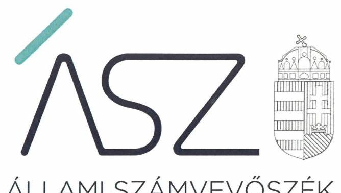
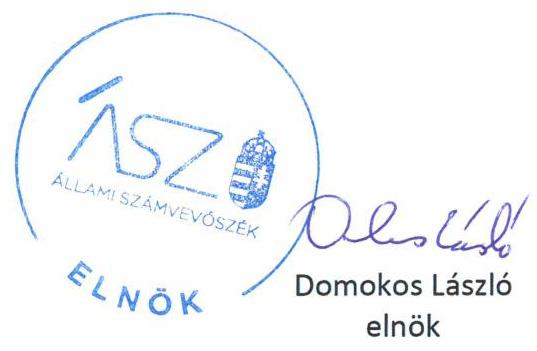

ÁLLAMI SZÁMVEVŐSZÉK

# JELENTÉS 

## Nem állami humánszolgáltatók ellenőrzése

A szociális humánszolgáltatást nyújtó intézmények, szolgáltatók államháztartáson kívüli fenntartói központi költségvetésből kapott támogatásai felhasználásának ellenőrzése "RÉS" Szociális és Kulturális Alapítvány

2020
20105
www.asz.hu

---

ÁLLAMI SZÁMVEVŐSZÉK

# JELENTÉS 

## Nem állami humánszolgáltatók ellenőrzése

A szociális humánszolgáltatást nyújtó intézmények, szolgáltatók államháztartáson kívüli fenntartói központi költségvetésből kapott támogatásai felhasználásának ellenőrzése "RÉS" Szociális és Kulturális Alapítvány
2020. 06 hó 25 nap

20105
www.asz.hu

---

# AZ ELLENŐRZÉST FELÜGYELTE: 

MAROZSÁN LÁSZLÓNÉ felügyeleti vezető

## AZ ELLENŐRZÉST VEZETTE ÉS A VÉGREHAJTÁSÁÉRT FELELŐS:

DR. DOMOKOS MAGDOLNA ellenőrzésvezető

## A PROGRAM ÖSSZEÁLLÍTÁSÁÉRT FELELŐS:

TÓTPÁL SZABOLCS osztályvezető
FEKETE-NAGY ANDRÁS GÁBOR ellenőrzési program készítéséért felelős vezető

IKTATÓSZÁM: EL-2733-001/2020.
Jelentéseink az Országgyúlés számítógépes hálózatán és az interneten a www.asz.hu címen is olvashatóak.

TÉMASZÁM: 2491
ELLENŐRZÉS-AZONOSÍTÓ SZÁM: V0835100, V0867123

---

# TARTALOMJEGYZÉK 

- ÖSSZEGZÉS ..... 5
- AZ ELLENŐRZÉS CÉLJA ..... 6
- AZ ELLENŐRZÉS TERÜLETE ..... 7
- AZ ELLENŐRZÉS HÁTTERE, INDOKOLTSÁGA ..... 8
- A JELENTÉS LÉNYEGES KÉRDÉSKÖREI ..... 9
- AZ ELLENŐRZÉS HATÓKÖRE ÉS MÓDSZEREI ..... 10
- MEGÁLLAPÍTÁSOK ..... 12
- MELLÉKLETEK ..... 15
I. sz. melléklet: Értelmező szótár ..... 15
- FÜGGELÉK: ÉSZREVÉTELEK ..... 17
- RÖVIDÍTÉSEK JEGYZÉKE ..... 19

---

.

---

# ÖSSZEGZÉS 

A budapesti székhelyű „RÉS" Szociális és Kulturális Alapítvány a 2015., 2016. és 2017. években nem biztosította a szociális humánszolgáltatási közfeladatok ellátására kapott költségvetési támogatások felhasználásának ellenőrizhetőségét. A 2018. évben biztosította a költségvetési támogatások felhasználásának átláthatóságát és elszámoltathatóságát.

## Az ellenőrzés társadalmi indokoltsága

A szociális gondoskodást igénylők védelme, illetve a köznevelési feladatok ellátása az Alaptörvényben meghatározott, a társadalom szempontjából fontos tevékenységek. Jogszabályok teszik lehetővé, hogy államháztartáson kívüli szervezetek - így például az egyházi fenntartók, alapítványok, gazdasági társaságok, egyesületek - által fenntartott intézmények is végezzenek köznevelési, szociális és gyermekvédelmi feladatokat. Mindehhez a központi költségvetés évente jelentős összegű támogatással járul hozzá. Az államháztartáson kívüli, humánszolgáltatást végző intézmények az igényelt közpénzekből társadalmilag hasznos, közösségteremtő, közérdekű, illetve közhasznú tevékenységet végeznek, illetve közfeladatokat látnak el.

Az intézményfenntartók ellenőrzésével az Állami Számvevőszék hozzájárul ahhoz, hogy ezen a közpénzeket az államháztartáson kívüli szervezetek is ellenőrizhető, átlátható és elszámoltatható módon használják fel a közfeladatok ellátása során. Az ellenőrzések célja továbbá, hogy a nyilvánosság és az igénybevevők megfelelő tájékoztatást kapjanak az államháztartáson kívüli közfeladatot ellátók múködéséről.

Az ÁSZ ${ }^{1}$ ellenőrzései arra adnak választ, hogy az intézményfenntartók arra használták-e fel a közpénzeket, amire igényelték.

A szabályszerű gazdálkodás elengedhetetlen a közfeladat ellátás szakmai céljainak megvalósításához, valamint a társadalmi közbizalom fenntartásához.

## Főbb megállapítások, következtetések

A „RÉS" Szociális és Kulturális Alapítvány a 2015-2017. években két nem önállóan gazdálkodó intézmény² fenntartásával biztosította a szociális és gyermekvédelmi feladatai - családok átmeneti otthona és éjjeli menedékhely - ellátását. A Fenntartó³ könyvvezetésében nem volt elkülönítve a Fenntartó és az Intézmények gazdálkodása. A központi költségvetésből a két ellátott közfeladatra kapott támogatás felhasználását sem különítette el könyvviteli nyilvántartásában az ellátott szociális feladatok között, ezáltal a kapott támogatás felhasználásának a nyilvántartása nem volt szabályszerű.

A „RÉS" Szociális és Kulturális Alapítvány a 2015-2017. években a szociális humánszolgáltatási közfeladat ellátására kapott költségvetési támogatás felhasználásának a Számviteli tv. 161/A § (2) bekezdésében előírt ellenőrizhetőségét nem biztosította. Mivel az Atr. 16. § (1) bekezdésben foglalt szabályozás ellenére nem gondoskodott arról, hogy a költségvetési támogatások felhasználásának a Fenntartó és a nem önállóan gazdálkodó intézményei gazdálkodásának elkülönített, feladatonkénti bontásban történő elszámolására az adatok rendelkezésre álljanak.

A Fenntartó mindezek alapján az Alaptörvény 39. cikk (2) bekezdésében foglaltak ellenére nem biztosította a felhasznált közpénzekre vonatkozó gazdálkodása átláthatóságát. Ezáltal a 2015-2017. években a Fenntartó nem igazolta, hogy a közpénzt a szociális humánszolgáltatási közfeladatra fordította.

A „RÉS" Szociális és Kulturális Alapítvány 2018-ban biztosította a szociális és gyermekvédelmi közfeladathoz kapcsolódó költségvetési támogatások felhasználásának feladatonkénti bontásban, elkülönítetten történő kezelését. Beszámolójának elkészítésével és közzétételével az általa felhasznált közpénzek nyilvánosságát biztosította.

---

# AZ ELLENŐRZÉS CÉLJA

**AZ ELLENŐRZÉS CÉLJA** annak értékelése volt, hogy a nem állami, nem önkormányzati szociális intézmények fenntartói központi költségvetésből kapott támogatásainak felhasználása szabályszerű volt-e.

---

# **AZ ELLENŐRZÉS TERÜLETE**

## **"RÉS" Szociális és Kulturális Alapítvány**

A "RÉS" Szociális és Kulturális Alapítványt 1995-ben hozták létre a szociális és kulturális szempontból átmenetileg vagy tartósan nehéz helyzetbe került személyek segítése, rehabilitációja céljából.

A Fenntartó, mint nem állami intézményfenntartó, két intézmény működtetésével látott el szociális és gyermekvédelmi közfeladatot.

A Családok átmeneti otthona 40 férőhellyel, a Női éjjeli menedékhely nyáron 35, télen 50 férőhellyel nyújtott szolgáltatást.

A Fenntartó 2015-2018. években közhasznú szervezetként működött.

Az Intézmények nem voltak önállóan gazdálkodóak, gazdálkodási feladataikat az ellenőrzött időszakban a Fenntartó látta el.

A Fenntartó képviseleti szerve az öt tagból álló Kuratórium volt, a Kuratórium elnökének, mint az alapítvány képviselőjének személye az ellenőrzött időszakban nem változott.

A Fenntartó részére a szociális feladatellátásra biztosított költségvetési támogatás összege a Magyar Államkincstár adatai szerint a 2015. évben 48,0 millió Ft, a 2016. évben 50,3 millió Ft, a 2017. évben 54,8 millió Ft, 2018-ban 59,9 millió Ft volt.

---

# AZ ELLENŐRZÉS HÁTTERE, INDOKOLTSÁGA 

A szociális feladatokat ellátó nem állami intézményfenntartók részére közfeladataik ellátására évente jelentős összegű pénzügyi támogatást biztosítottak a mindenkori költségvetési törvények a bennük megfogalmazott feltételek mellett. A felhasználható állami támogatások a Kvtv.-ek ${ }^{4}$ szerinti előirányzata a 2015-2018. években a szociális ágazatra vonatkozóan 360 Mrd Ft volt.

Az Állami Számvevőszék stratégiájában célul tűzte ki, hogy az államháztartáson kívülre nyújtott költségvetési támogatások ellenőrzésével hozzájárul ahhoz, hogy a közpénzeket az államháztartáson kívüli szervezetek is átlátható módon használják fel a közfeladatok szerződésben vállalt ellátása érdekében.

Az Állami Számvevőszék stratégiájában foglaltak alapján is indokolt az ellenőrzés, amely a társadalom számára jelzi, hogy a közpénz államháztartáson kívüli felhasználása sem maradhat ellenőrizetlenül. Az ellenőrzés javaslataival hozzájárulhat az államháztartáson kívüli szervezetek szabályszerű támogatás felhasználásához, javíthatja a társadalmi-gazdasági döntések megalapozottságát, amely a „jól irányított állam" feltétele.

A holisztikus megközelítés jegyében az ellenőrzés keretében egyedi kockázatelemzés alapján kiválasztott fenntartóknál értékelte az Állami Számvevőszék az államháztartáson kívüli szociális tevékenységhez kapcsolódó támogatások felhasználásának megfelelőségét.

---

# A JELENTÉS LÉNYEGES KÉRDÉSKÖREI 

1. A szociális humánszolgáltató közfeladatot ellátó államháztartáson kívüli fenntartó szabályszerű müködési - és gazdálkodási környezet kialakításával megteremtette-e a költségvetési támogatások átlátható, elszámoltatható igénybevételének, felhasználásának feltételeit?
2. Az államháztartáson kívüli fenntartó az átvállalt szociális humánszolgáltatási közfeladathoz biztositott költségvetési támogatásokat szabályszerűen fordította-e a humánszolgáltató intézményei müködtetésére? Az intézményei müködtetéséhez felhasznált közpénzekre vonatkozó gazdálkodásával elszámolt-e?

---

# AZ ELLENŐRZÉS HATÓKÖRE ÉS MÓDSZEREI 

## Az ellenőrzés típusa

Megfelelőségi ellenőrzés.

## Az ellenőrzött időszak

A 2015. január 1-je és 2018. december 31-e közötti időszak.

## Az ellenőrzés tárgya

Az ellenőrzés a szociális humánszolgáltatási közfeladatokat ellátó államháztartáson kívüli fenntartók humánszolgáltatási közfeladatai ellátásához a központi költségvetésből kapott támogatásaik humánszolgáltatási közfeladatokra való fenntartó általi felhasználása szabályszerűségének értékelésére terjedt ki.

## Az ellenőrzött szervezet

„RÉS" Szociális és Kulturális Alapítvány

## Az ellenőrzés jogalapja

Az ellenőrzés jogszabályi alapját az ÁSZ tv ${ }^{5}$. 1. § (3) bekezdésében, valamint az 5. § (3) bekezdésben foglalt előírások adják.

## Az ellenőrzés módszerei

Az ellenőrzést az ellenőrzési program, annak szempontjai, kérdései, az ellenőrzött időszakban hatályos jogszabályok, a nemzetközi standardokat irányadónak tekintve, az ellenőrzés szakmai szabályok és módszertanok figyelembe vételével rendelte elvégezni. A közpénzekkel való felelős gazdálkodás segítésére irányuló javaslatok kidolgozásakor a hatályos jogszabályok voltak irányadóak.

Az ellenőrzés ideje alatt az ellenőrzött szervezettel történő kapcsolattartást az ÁSZ SZMSZ ${ }^{6}$-ének vonatkozó előírása biztosította.

Az ellenőrzési kérdések megválaszolásához szükséges bizonyítékok megszerzése az ellenőrzött által rendelkezésre bocsátott dokumentumokra, adatokra alapozva megfigyelés, szemle (szemrevételezés), kérdésfeltevés (információkérés), valamint elemző eljárással történt.

---

Az ellenőrzési bizonyítékként felhasználható adatforrások közé tartoztak egyrészt az ellenőrzési program részletes szempontjainál felsorolt adatforrások, másrészt minden - az ellenőrzés folyamán feltárt, az ellenőrzés szempontjából információt tartalmazó - dokumentum.

Az ellenőrzés lefolytatásához az ellenőrzött szervezet a kitöltött tanúsítványok, valamint az ÁSZ által kért dokumentumok elektronikus úton való megküldésével szolgáltatott adatokat, információkat. Az így rendelkezésre bocsátott adatok, információk és a tanúsítványok adatai valódiságának kontrollja az ellenőrzés keretében történt.

Az egységes értelmezést támogatta a jelentés mellékletét képező fogalomtár és rövidítésjegyzék.

Az ÁSZ az ellenőrzést alapvetően a szociális humánszolgáltatások esetében a központi költségvetési támogatások felhasználásával, elszámolásával kapcsolatos feladatokat ellátó államháztartáson kívüli fenntartónál végezte.

A szociális humánszolgáltatások központi költségvetési támogatásaival kapcsolatos, államháztartáson kívüli fenntartó jogszabályokban előírt feladatai betartása, továbbá a központi költségvetési támogatások szabályszerű nyilvántartása került ellenőrzésre a fenntartónál rendelkezésre álló nyilvántartások, beszámolók és egyéb dokumentumok alapján. Az ellenőrzés nem terjedt ki a szociális humánszolgáltatások központi költségvetési támogatásai igénylése, módosítása, elszámolása valódiságának, megalapozottságának, helyességének - sem a fenntartónál, sem a székhely intézményeinél való - értékelésére (mivel ennek felülvizsgálata, ellenőrzése a finanszírozó jogszabályban előírt feladata, határozatai kiadása előtt). Továbbá nem terjedt ki az ellenőrzés e források, intézmények általi szabályszerű felhasználásának értékelésére.

---

# MEGÁLLAPÍTÁSOK 

## 1. A szociális humánszolgáltató közfeladatot ellátó államháztartáson kívüli fenntartó szabályszerű múködési - és gazdálkodási környezet kialakításával megteremtette-e a költségvetési támogatások átlátható, elszámoltatható igénybevételének, felhasználásának feltételeit?

Összegző megállapítás A Fenntartó 2018-ban a múködési környezetet szabályszerűen kialakította, gazdálkodási környezete a szabályszerű számlarend hiánya miatt nem volt szabályszerű.

A Fenntartó a szociális és gyermekvédelmi közfeladat ellátásnak múködési kereteit szabályszerűen kialakította. A Fenntartó rendelkezett a jogszabályi előírások szerint SZMSZ ${ }^{7}$-szel, abban meghatározta szervezeti felépítését, múködési rendjét, a felelősségi és hatásköröket, azok gyakorlásának módját.

A Fenntartó a jogszabályi előírások szerint rendelkezett számviteli politikával ${ }^{8}$, illetve a számviteli politika részeként elkészítendő eszközök és források leltárkészítési és leltározási szabályzatával ${ }^{9}$, az eszközök és források értékelési szabályzatával ${ }^{10}$ és pénzkezelési szabályzattal ${ }^{11}$.

A Fenntartó számlarendje nem felelt meg a Számv. tv előírásainak, mivel az nem tartalmazta a számla értéke növekedésének, csökkenésének jogcímeit, a számlát érintő gazdasági eseményeket, azok más számlákkal való kapcsolatát, a főkönyvi számla és az analitikus nyilvántartás kapcsolatát, valamint a számlarendben foglaltakat alátámasztó bizonylati rendet.
2. Az államháztartáson kívüli fenntartó az átvállalt szociális humánszolgáltatási közfeladathoz biztosított költségvetési támogatásokat szabályszerűen fordította-e a humánszolgáltató intézményei múködtetésére? Az intézményei múködtetéséhez felhasznált közpénzekre vonatkozó gazdálkodásával elszámolt-e?

Összegző megállapítás A Fenntartó 2018-ban az átvállalt szociális humánszolgáltatási közfeladathoz biztosított költségvetési támogatásokat az intézményei múködtetésére fordította, a közpénzekre vonatkozó gazdálkodásával a nyilvánosság előtt elszámolt.

A Fenntartó 2018-ban a humánszolgáltatási közfeladataihoz kapott támogatást bevételei között elkülönítetten kezelte.

---

A Fenntartó 2018-ban a jogszabályok szerint a számviteli rendjében a szociális humánszolgáltatások támogatásainak felhasználását feladatonkénti bontásban, elkülönítetten mutatta ki, valamint elkészítette beszámolóját, közzétételi kötelezettségének eleget tett.

---

.

---

# MELLÉKLETEK 

- I. SZ. MELLÉKLET: ÉRTELMEZŐ SZÓTÁR
civil szervezet
humánszolgáltatás
költségvetési támogatás
nem állami, nem önkormányzati (államháztartáson kívüli) intézmény fenntartó
székhely intézmény
telephely

A Civil tv ${ }^{12^{*}}$. 2. § 6. pontja szerint civil szervezet a civil társaság, a Magyarországon nyilvántartásba vett egyesület (a párt, a szakszervezet és a kölcsönös biztosító egyesület kivételével), a közalapítvány és a pártalapítvány kivételével az alapítvány.
Külön törvényben meghatározott szociális, gyermekjóléti, gyermekvédelmi, közoktatási, felsőoktatási, kulturális közfeladatok (2014. évi Kvtv ${ }^{13}$. 34. § (1), (4) bekezdés, 1. számú melléklet XX/20/2. alcím, 19. alcím, 2015. évi Kvtv. 43. § (1), (4) bekezdés, 1. számú melléklet XX/20/2/3. jogcím csoport, 19. alcím, 2016. évi Kvtv. 41. § (1), (4) bekezdés, 1. számú melléklet XX/20/2/3. jogcím csoport, 19. alcím).
a társadalombiztosítás pénzügyi alapjai kivételével az államháztartás központi alrendszeréből ellenérték nélkül, pénzben nyújtott támogatások (Áht. ${ }^{14}$ 1. § 14. pont)
A költségvetési törvényekben (2014. évi C. törvény 42-43. §, 2015. évi C. törvény 40-41. §) megállapított támogatás. Például a 2015. évi C. törvény 40-41. § szerint többek között: Az Országgyűlés a szociális, gyermekjóléti, gyermekvédelmi közfeladatot ellátó intézményt, szolgáltatást fenntartó egyházi jogi személy, civil szervezet, közalapítvány, országos nemzetiségi önkormányzat, települési vagy területi nemzetiségi önkormányzat, gazdasági társaság, és a humánszolgáltatást alaptevékenységként végző, az Szja tv ${ }^{15}$. hatálya alá tartozó egyéni vállalkozó (a továbbiakban együtt: nem állami szociális fenntartó) részére támogatást állapít meg a következők szerint: a támogatás a nem állami szociális fenntartót a települési önkormányzatok 2. melléklet III. pont 3. alpont $c$ )-k) pontjában és III. pont 5. alpont a) pontjában meghatározott támogatásaival azonos jogcímeken, öszszegben és feltételek mellett illeti meg.
A szociális, gyermekjóléti és gyermekvédelmi közfeladatokat/humánszolgáltatásokat ellátó intézményt fenntartó egyházi jogi személy, társadalmi szervezet, alapítvány, közalapítvány, civil szervezet, országos nemzetiségi önkormányzat, nonprofit gazdasági társaság, gazdasági társaság és a humánszolgáltatást alaptevékenységként végző, Szja tv. hatálya alá tartozó egyéni vállalkozó. (2014. évi Kvtv. 33. §, 34. § (1), (4) bekezdés, 2015. évi Kvtv. 42. §, 43. § (1), (4) bekezdés, 2016. évi Kvtv. 40. §, 41. § (1), (4) bekezdés, 2017. évi Kvtv. 41. § (1), (4))
a szolgáltató székhelye, azaz a szolgáltató központi ügyintézésének helye, függetlenül attól, hogy használják-e szolgáltatás nyújtására (Sznyvhr ${ }^{16}$. 1.§ k) pont) (hatályos: 2013. december 1-től)
a szolgáltató székhelyétől különböző, szolgáltató/intézmény használatában álló hely, a szociális humánszolgáltatáshoz használt, bejegyzett hely. (Sznyvhr. 1.§ I) pont) (hatályos: 2015. január 1-től)

[^0]
[^0]:    * Előzmény törvények, amelyeket az ellenőrzött időszak miatt figyelembe kell venni: egyesülési jogról szóló 1989. évi II. tv, a közhasznú szervezetekről szóló 1997. évi CLVI. tv.

---

.

---

# FÜGGELÉK: ÉSZREVÉTELEK 

A jelentéstervezetet a Számvevőszék 15 napos észrevételezésre megküldte az ellenőrzött szervezet vezetőjének az ÁSZ tv. 29. § ${ }^{\dagger}$ (1) bekezdése előírásának megfelelően.

A „RÉS" Szociális és Kulturális Alapítvány kuratóriumi elnöke a jelentéstervezet megállapításaira írásban észrevételt tett.
Az ÁSZ tv. 29. § (3) bekezdésével összhangban az ÁSZ a Függelékben feltünteti az ellenőrzés megállapításaival kapcsolatban tett, figyelembe nem vett észrevételeket, és megindokolja, hogy azokat miért nem fogadta el.

A „Nem állami humánszolgáltatók ellenőrzése - A szociális humánszolgáltatást nyújtó intézmények, szolgáltatók államháztartáson kívüli fenntartói központi költségvetésből kapott támogatásai felhasználásnak ellenőrzése - „RÉS" Szociális és Kulturális Alapítvány" címmel készített számvevőszéki jelentéstervezet megállapításaival kapcsolatban a „RÉS" Szociális és Kulturális Alapítvány (továbbiakban: Fenntartó) kuratóriumi elnök (továbbiakban: elnök) által tett 2020.május 5-i keltezésú észrevétel és kezelésének indokolása.

## A jelentéstervezet Főbb megállapítások részének 1-3. bekezdésével kapcsolatban tett észrevétel:

A Fenntartó elnöke észrevételében leírta, hogy a fenntartott intézményekkel kapcsolatos pénzügyi nyilvántartások rendje szerint - bár intézményeik nem önálló gazdálkodásúak - a Fenntartó folyamatosan napi nyilvántartást vezet a közfeladatokhoz rendelt költségvetési támogatásokról jogcímenként, külön főkönyvi számon, továbbá bevételeiket címkézik, s a havi költséghelyezés során ezt teszik a kiadásaikkal is. Jelezte, hogy ezt a metódust a Magyar Államkincstár támogatások felhasználásával kapcsolatos ellenőrzései megfelelőnek tartották, továbbá a Fenntartó könyvvizsgálója sem kifogásolta a kialakított gyakorlatot. A Fenntartó elnöke észrevételében tájékoztatta az ÁSZ elnökét arról, hogy az intézmények működtetése során keletkező számlák a Fenntartó székhelyére érkeznek, s kiegyenlítésük központilag, folyamatosan történik, továbbá mindkét intézmény esetében külön-külön szerződésekkel rendelkeznek a működés feltételeit biztosító szolgáltatókkal, ezek kiegyenlítése bár központilag történik, de intézményi szinten jól elkülöníthetően. A Fenntartó elnöke észrevételében tájékoztatást adott arról is, hogy a Fenntartó minden évben teljesítette a beszámolóinak határidőben történő beküldését és honlapjukon történő közzétételét, így a közpénzek nyilvánosságát az ellenőrzés teljes időszaka tekintetében biztosították. A Fenntartó elnöke észrevételében leírta továbbá, hogy az ellenőrzéshez az első adatbekérésre való felhívás 2018. karácsonya előtt, nagyon rövid adatszolgáltatási határidővel érkezett, és az adott időszak az ellátandó szakmai feladataik miatt alapvetően túlterhelt, humán erőforrás hiányos volt és lehetséges, hogy nem küldtek be minden információt maradéktalanul, de könyvvezetésükben elkülöníthetően nyomon követhetőek ezek az információk a teljes ellenőrzési időszak alatt.

[^0]
[^0]:    ${ }^{+}$29. § (1) Az Állami Számvevőszék az ellenőrzési megállapításait megküldi az ellenőrzött szervezet vezetőjének vagy az általa megbízott személynek, és annak, akinek személyes felelősségét állapította meg.
    (2) Az ellenőrzött szervezet vezetője és a felelősként megjelölt személy az ellenőrzés megállapításaira tizenöt napon belül írásban észrevételt tehet.
    (3) Az Állami Számvevőszék az észrevételre a beérkezésétől számított harminc napon belül írásban válaszol. A figyelembe nem vett észrevételeket köteles a jelentésben feltüntetni, és megindokolni, hogy azokat miért nem fogadta el.

---

Az ÁSZ tájékoztatta a Fenntartó elnökét, hogy a 2015-2017. évek viszonylatában a költségvetési támogatások elkülönített nyilvántartását igazoló dokumentumokat („a költségvetési támogatások elkülönített nyilvántartását igazoló dokumentumok, főkönyvi és analitikus nyilvántartások a fenntartónál, illetve az önálló költségvetéssel rendelkező székhely intézmény/eknél") az EL-1420-004/2018. iktatószámú, 2019. január 4-én kelt adatbekérő levél 34. pontjában kérte be, amely levelet az észrevételében foglaltaktól eltérően - a kapcsolódó tértivevény szerint - 2019. január 23án vettek át, így nem az év végi időszakban kellett azokat az ÁSZ részére átadniuk. A 2019. január 31-én kelt teljességi és hitelességi nyilatkozattal alátámasztott módon az adatbekérő levél érintett pontjához a 2015., 2016. és 2017. évi „költségvetési támogatások elkülönített nyilvántartása" elnevezésű dokumentumok és a 10. ponthoz csatolva a 2015., 2016. és 2017. évi zárás utáni főkönyvi kivonatok átadására került sor.

A beküldött dokumentumok felülvizsgálata alapján megállapítható volt, hogy a Fenntartó által 2015-2017. évek vonatkozásában benyújtott „költségvetési támogatások elkülönített nyilvántartása" elnevezésű dokumentum kizárólag a kapott bevételeket bontotta meg a két intézmény között, a támogatások felhasználásának feladatonkénti bontásban történő elkülönített bemutatását azok nem tartalmazták. A megküldött 2015-2017. évi főkönyvi kivonatok sem igazolták, hogy a Fenntartó az egyházi és nem állami fenntartású szociális, gyermekjóléti és gyermekvédelmi szolgáltatók, intézmények és hálózatok állami támogatásáról szóló 489/2013. (XII. 18.) Korm. rendelet (továbbiakban: Atr.) 16. § (1) bekezdésében előírtaknak megfelelően számviteli rendjében a saját és nem önállóan gazdálkodó intézményei gazdálkodását, valamint a támogatás felhasználását feladatonként megbontva, elkülönítetten kezelte. A Fenntartó elnökének észrevételében leírtakat, miszerint a kiadásaikat a havi költséghelyezés során külön főkönyvi számon „címkézik", az adatszolgáltatás során a 2015-2017. évekre vonatkozóan beküldött dokumentumok nem támasztották alá.
Az ellenőrzés rendelkezésére bocsátott dokumentumok szerint a számvitelről szóló 2000. évi C. törvény 161/A. § (2) bekezdésében foglaltak ellenére a Fenntartó nyilvántartási (könyvvezetési) rendszerét nem részletezte tovább oly módon, hogy a közpénzek felhasználásának a nyilvánosságát és ellenőrizhetőségét biztosítsa és abból a vonatkozó külön jogszabályban - jelen esetben az Atr.-ben - meghatározott adatok rendelkezésre álljanak.
Az ÁSZ tájékoztatta a Fenntartó elnökét, hogy ellenőrzési megállapításait az ÁSZ, az egyéb ellenőrzést végző szervek ellenőrzési megállapításaitól függetlenül, az ellenőrzési adatszolgáltatás során a részére törvényi határidőben rendelkezésre bocsátott hiteles dokumentumokra alapozva fogalmazza meg. A 2019. január 31-én kelt teljességi és hitelességi nyilatkozatban az átadott dokumentumok, adatok hitelességéért, valódiságáért, hiánytalanságáért és hatályosságáért teljes felelősséget vállaltak.
A Fenntartó és az intézmény működésére vonatkozó tájékoztatást az ÁSZ köszönettel vette, azonban azok a jelentéstervezet tényszerű megállapításait nem befolyásolják.
Fentiekre tekintettel a Fenntartó elnökének észrevételeit az ÁSZ nem fogadta el, a jelentéstervezet kapcsolódó megállapítása helytálló, a jelentéstervezet módosítása nem indokolt.

---

# RÖVIDÍTÉSEK JEGYZÉKE 

${ }^{1}$ ÁSZ
${ }^{2}$ Intézmény
${ }^{3}$ Fenntartó
${ }^{4}$ Kvtv.-ek
${ }^{5}$ Ász tv.
${ }^{6}$ Ász SZMSZ
${ }^{7}$ SZMSZ
${ }^{8}$ Számviteli Politika
${ }^{9}$ Eszközök és Források Leltározási és Leltárkészítési szabályzat
${ }^{10}$ Eszközök és Források Értékelési Szabályzata
${ }^{11}$ Pénzkezelési Szabályzat
${ }^{12}$ Civil.tv.
${ }^{13}$ Kvtv.
${ }^{14}$ Áht.
${ }^{15}$ Szja tv.
${ }^{16}$ Sznyvhr.

Állami Számvevőszék
„RÉS" Szociális és Kulturális Alapítvány Családok átmeneti otthona, 1173 Budapest, Összekötő u. 3., és Női Éjjeli Menedékhelye, 1067 Budapest, Podmaniczky utca 33.
„RÉS" Szociális és Kulturális Alapítvány
2014. évi C. törvény Magyarország 2015. évi központi költségvetéséről 2015. évi C. törvény - Magyarország 2016. évi központi költségvetéséről, 2016. évi CX. törvény - Magyarország 2017. évi központi költségvetéséről, 2017. évi C. törvény - Magyarország 2018. évi központi költségvetéséről 2011. évi LXVI. törvény az Állami Számvevőszékről

Állami Számvevőszék Szervezeti és Működési Szabályzata
„RÉS" Szociális és Kulturális Alapítvány Szervezeti és Müködési Szabályzata, (hatályos 2014. december 17-től)
„RÉS" Szociális és Kulturális Alapítvány; Számviteli politika, hatályos 2013. szeptember 01-től.
„RÉS" Szociális és Kulturális Alapítvány; Leltározási szabályzat, hatályos „2013. augusztus 01-től.
„RÉS" Szociális és Kulturális Alapítvány; Értékelési szabályzat, hatályos 2013. augusztus 01-től.
„RÉS" Szociális és Kulturális Alapítvány; Pénzkezelési szabályzat, hatályos 2013. szeptember 01-től.
2011. évi CLXXV. törvény az egyesülési jogról, a közhasznú jogállásról, valamint a civil szervezetek müködéséről és támogatásáról, (Hatályos 2011. december 22-étől)
költségvetési törvény
2011. évi CXC. törvény az államháztartásról (hatályos 2012. január 1-étől) 1995. évi CXVII. törvény a személyi jövedelemadóról 369/2013. (X. 24.) Korm. rendelet a szociális, gyermekjóléti és gyermekvédelmi szolgáltatók, intézmények és hálózatok hatósági nyilvántartásáról és ellenőrzéséről

---

# ASZ 

ALLAMI SZAMVEVOSZEK
1052 Budapest, Apáczai Cs. J. u. 10. I 1364 Budapest 4. Pf. 54 TEL: +36 14849100
email: szamvevoszek@asz.hu
web: www.asz.hu | www.aszhirportal.hu