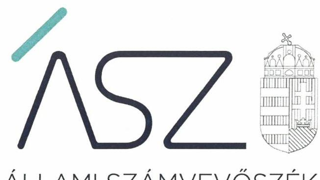
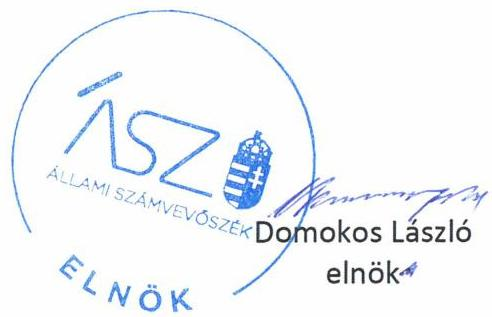

ÁLLAMI SZÁMVEVŐSZÉK

# JELENTÉS 

## Nem állami humánszolgáltatók ellenőrzése

A szociális humánszolgáltatást nyújtó intézmények, szolgáltatók államháztartáson kívüli fenntartói központi költségvetésből kapott támogatásainak felhasználásának ellenőrzése – Otthonközeli Szociális Támogató Közhasznú Egyesület
2020.

20107
www.asz.hu

---

ÁLLAMI SZÁMVEVŐSZÉK

# JELENTÉS

## Nem állami humánszolgáltatók ellenőrzése

A szociális humánszolgáltatást nyújtó intézmények, szolgáltatók államháztartáson kívüli fenntartói központi költségvetésből kapott támogatásainak felhasználásának ellenőrzése – Otthonközeli Szociális Támogató Közhasznú Egyesület

2020. 06. hó 25. nap

20107
www.asz.hu

---

# AZ ELLENŐRZÉST FELÜGYELTE: 

VARGA EDIT felügyeleti vezető

## AZ ELLENŐRZÉST VEZETTE ÉS A VÉGREHAJTÁSÁÉRT FELELŐS:

VALASTYÁNNÉ DR. VÍZHÁNYÓ JÚLIA ellenőrzésvezető
KUSZINGER ANDREA ellenőrzésvezető

## A PROGRAM ÖSSZEÁLLÍTÁSÁÉRT FELELŐS:

TÓTPÁL SZABOLCS osztályvezető
FEKETE-NAGY ANDRÁS GÁBOR ellenőrzési program készítéséért felelős vezető

Jelentéseink az Országgyülés számítógépes hálózatán és az interneten a www.asz.hu címen is olvashatóak.

IKTATÓSZÁM: EL-2735-001/2020
TÉMASZÁM: 2491
ELLENŐRZÉS-AZONOSÍTÓ SZÁM: V083513, V0867080

---

# TARTALOMJEGYZÉK 

■ ÖSSZEGZÉS ..... 5
■ AZ ELLENŐRZÉS CÉLJA ..... 6
■ AZ ELLENŐRZÉS TERÜLETE ..... 7
■ AZ ELLENŐRZÉS HÁTTERE, INDOKOLTSÁGA ..... 8
■ A JELENTÉS LÉNYEGES KÉRDÉSKÖREI ..... 9
■ AZ ELLENŐRZÉS HATÓKÖRE ÉS MÓDSZEREI ..... 10
■ MEGÁLLAPÍTÁSOK ..... 12
■ MELLÉKLETEK ..... 13
I. sz. melléklet: Értelmező szótár ..... 13
■ FÜGGELÉKEK ..... 15
I. sz. függelék a jelentéshez ..... 15
II. sz. függelék: Észrevételek ..... 16
■ RÖVIDÍTÉSEK JEGYZÉKE ..... 17

---

.

---

# ÖSSZEGZÉS 

A gyulai székhelyű Otthonközeli Szociális Támogató Közhasznú Egyesület a 2015-2017. években megteremtette a költségvetési támogatások szabályszerű felhasználásának feltételeit, a közfeladat ellátására biztosított költségvetési támogatásokat a humánszolgáltatási tevékenységre fordította. A 2018. évben gazdálkodásának elszámoltathatóságát és átláthatóságát nem biztosította.

## Az ellenőrzés társadalmi indokoltsága

A szociális gondoskodást igénylők védelme, illetve a köznevelési feladatok ellátása az Alaptörvényben meghatározott, a társadalom szempontjából fontos tevékenységek. Jogszabályok teszik lehetővé, hogy államháztartáson kívüli szervezetek - így például az egyházi fenntartók, alapítványok, gazdasági társaságok, egyesületek - által fenntartott intézmények is végezzenek köznevelési, szociális és gyermekvédelmi feladatokat. Mindehhez a központi költségvetés évente jelentős összegű támogatással járul hozzá. Az államháztartáson kívüli, humánszolgáltatást végző intézmények az igényelt közpénzekből társadalmilag hasznos, közösségteremtő, közérdekű, illetve közhasznú tevékenységet végeznek, illetve közfeladatokat látnak el.

Az intézményfenntartók ellenőrzésével az Állami Számvevőszék hozzájárul ahhoz, hogy ezen közpénzeket az államháztartáson kívüli szervezetek is ellenőrizhető, átlátható és elszámoltatható módon használják fel a közfeladatok ellátása során. Az ellenőrzések célja továbbá, hogy a nyilvánosság és az igénybevevők megfelelő tájékoztatást kapjanak az államháztartáson kívüli közfeladatot ellátók működéséről.

Az ÁSZ ellenőrzései arra adnak választ, hogy az intézményfenntartók arra használták-e fel a közpénzeket, amire igényelték.

A szabályszerű gazdálkodás elengedhetetlen a közfeladat ellátás szakmai céljainak megvalósításához, valamint a társadalmi közbizalom fenntartásához.

## Főbb megállapítások, következtetések

A gyulai székhelyű Otthonközeli Szociális Támogató Közhasznú Egyesület a 2015-2017. években a működési- és gazdálkodási környezet kialakításával megteremtette a költségvetési támogatások szabályszerű felhasználásának, valamint a költségvetési támogatások ellenőrizhetőségének feltételeit.

A szociális humánszolgáltatási közfeladathoz biztosított költségvetési támogatásokat a 2015-2017. években szabályszerűen fordította a humánszolgáltatási tevékenység működtetésére.

Az Otthonközeli Szociális Támogató Közhasznú Egyesület a 2018. évre vonatkozóan a Civil tv. 28. § (1) bekezdésében és a Számv. tv. 4. § (1) bekezdésében foglalt beszámoló-készítési kötelezettségének nem tett eleget, így a közfeladat ellátásához felhasznált közpénzekre vonatkozóan gazdálkodásával a nyilvánosság előtt nem számolt el.

---

# AZ ELLENŐRZÉS CÉLJA

**AZ ELLENŐRZÉS CÉLJA** annak értékelése volt, hogy a nem állami, nem önkormányzati szociális intézmények fenntartói központi költségvetésből kapott támogatásainak felhasználása szabályszerű volt-e.

---

# **AZ ELLENŐRZÉS TERÜLETE**

## **Otthonközeli Szociális Támogató Közhasznú Egyesület**

A Fenntartót a 2011. évben Gyulán tíz magánszemély alapította.

A Fenntartó az ellenőrzött időszakban, mint államháztartáson kívüli szervezet, intézmény létrehozása nélkül közvetlenül nyújtott szolgáltatást - szociális étkeztetés és házi segítségnyújtás feladatellátással – az ellátottak részére. A Fenntartó 2014. évtől közhasznú jogállású szervezet volt.

Az ellenőrzött időszakban a Fenntartó legfőbb szerve a Közgyűlés, ügyvezető szerve az Elnökség volt. A Fenntartó képviseletét elnök gyakorolta, akinek személyében az ellenőrzött időszakban nem történt változás. A Fenntartó működésének és gazdálkodásának ellenőrzésére háromtagú felügyelőbizottságot hoztak létre. A Fenntartó közhasznú szervezetként kettős könyvvitellel alátámasztott egyszerűsített éves beszámolót készített.

A Fenntartó részére a Kincstár által a szociális közfeladat ellátásra biztosított költségvetési támogatások összege 2015. évben 146,8 M Ft, 2016. évben 144,0 M Ft, 2017. évben 134,6 M Ft, 2018. évben pedig 143,7 M Ft volt.

---

# AZ ELLENŐRZÉS HÁTTERE, INDOKOLTSÁGA 

A szociális feladatokat ellátó nem állami intézményfenntartók részére közfeladataik ellátására 2015-2018. években jelentős összegű pénzügyi támogatást biztosítottak a mindenkori költségvetési törvények a bennük megfogalmazott feltételek mellett. A felhasználható állami támogatások a Kvtv.-ek² szerinti előirányzata 2015-2018. években együtt 360 Mrd Ft volt. Módosították a szociális igazgatásról és szociális ellátásokról szóló 1993. évi III. törvényt, amely - többek között - 2012. január 1-jei hatállyal megfogalmazta a finanszírozási rendszerbe történő befogadással összefüggő szabályokat. Az ellenőrzések indokoltságát az is alátámasztja, hogy az ÁSZ ${ }^{4}$ számos szervezetet még nem ellenőrzött ezen a területen.

Az ÁSZ stratégiájában foglaltak alapján is indokolt az ellenőrzés, amely a társadalom számára jelzi, hogy a közpénz államháztartáson kívüli felhasználása sem maradhat ellenőrizetlenül. Az államháztartáson kívülre nyújtott költségvetési támogatások ellenőrzésével az ÁSZ hozzájárul ahhoz, hogy a közpénzeket a nem állami fenntartók átlátható módon használják fel a közfeladatok ellátására kötött szerződésekben vállalt kötelezettségek teljesítése érdekében. Az ÁSZ az ellenőrzés javaslataival hozzájárulhat az említett rendszerek szabályszerű támogatás-felhasználásához, javíthatja a társadalmi-gazdasági döntések megalapozottságát, amely a „jól irányított állam működésének" feltétele.

---

# A JELENTÉS LÉNYEGES KÉRDÉSKÖREI 

1. A szociális humánszolgáltató közfeladatot ellátó államháztartáson kívüli fenntartó szabályszerű működési - és gazdálkodási környezet kialakításával megteremtette-e a költségvetési támogatások átlátható, elszámoltatható igénybevételének, felhasználásának feltételeit?
2. Az államháztartáson kívüli fenntartó az átvállalt szociális humánszolgáltatási közfeladathoz biztosított költségvetési támogatásokat szabályszerűen fordította-e a humánszolgáltató intézménye működtetésére? A gazdálkodásával elszámolt-e?

---

# AZ ELLENŐRZÉS HATÓKÖRE ÉS MÓDSZEREI 

## Az ellenőrzés típusa

Megfelelőségi ellenőrzés.

## Az ellenőrzött időszak

A 2015. január 1-je és 2018. december 31-e közötti időszak.

## Az ellenőrzés tárgya

Az ellenőrzés a szociális humánszolgáltatási közfeladatokat ellátó államháztartáson kívüli fenntartók humánszolgáltatási közfeladatai ellátásához a központi költségvetésből kapott támogatásaik humánszolgáltatási közfeladatokra való fenntartó általi felhasználása szabályszerűségének értékelésére terjedt ki.

## Az ellenőrzött szervezet

Otthonközeli Szociális Támogató Közhasznú Egyesület

## Az ellenőrzés jogalapja

Az ellenőrzés jogszabályi alapját az ÁSZ tv . 1. § (3) bekezdése, 5. § (3) bekezdésben foglalt előírások adják.

## Az ellenőrzés módszerei

Az ellenőrzést az ellenőrzési program annak szempontjai, kérdései, az ellenőrzött időszakban hatályos jogszabályok, a nemzetközi standardokat irányadónak tekintve, az ellenőrzés szakmai szabályok és módszertanok figyelembevételével rendelte elvégezni. A közpénzekkel való felelős gazdálkodás segítésére irányuló javaslatok kidolgozásakor a hatályos jogszabályok voltak irányadóak.

Az ellenőrzés ideje alatt az ellenőrzött szervezettel történő kapcsolattartást az ÁSZ SZMSZ ${ }^{\text {I}}$-ének vonatkozó előírása biztosította az ÁSZ.

Az ellenőrzési kérdések megválaszolásához szükséges bizonyítékok megszerzése az ellenőrzött által rendelkezésre bocsátott dokumentumokra, adatokra alapozva megfigyelés, szemle (szemrevételezés), kérdésfeltevés (információkérés), valamint elemző eljárással történt.

---

Az ellenőrzési bizonyítékként felhasználható adatforrások közé tartoztak egyrészt a szakmai program részletes szempontjainál felsorolt adatforrások, másrészt minden - az ellenőrzés folyamán feltárt, az ellenőrzés szempontjából információt tartalmazó - dokumentum.

Az ellenőrzés lefolytatásához az ellenőrzött szervezet a kitöltött tanúsítványok, valamint az ÁSZ által kért dokumentumok elektronikus úton való megküldésével szolgáltatott adatokat, információkat. Az így rendelkezésre bocsátott adatok, információk és a tanúsítványok adatai valódiságának kontrollja az ellenőrzés keretében történt.

Az egységes értelmezést az ellenőrzési program mellékletét képező fogalomtár és rövidítésjegyzék támogatta.

Az ellenőrzést alapvetően a köznevelési és szociális humánszolgáltatások esetében a központi költségvetési támogatások igénylésével, módosításával, felhasználásával, elszámolásával kapcsolatos feladatokat ellátó államháztartáson kívüli fenntartóknál/szervezeteinél végezte az ÁSZ.

A szociális humánszolgáltatások központi költségvetési támogatásaival kapcsolatos, államháztartáson kívüli fenntartó jogszabályokban előírt feladatai betartását, továbbá a központi költségvetési támogatások szabályszerű nyilvántartását ellenőrizte az ÁSZ a fenntartónál rendelkezésre álló nyilvántartások, beszámolók és egyéb dokumentumok alapján. Az ellenőrzés nem terjedt ki a szociális humánszolgáltatások központi költségvetési támogatásai igénylése, módosítása, elszámolása valódiságának, megalapozottságának, helyességének - sem a fenntartónál, sem a székhely intézményeinél való - értékelésére (mivel ennek felülvizsgálata, ellenőrzése a finanszírozó jogszabályban előírt feladata, határozatai kiadása előtt). Továbbá nem terjedt ki az ellenőrzés e források, intézmények általi szabályszerű felhasználásának értékelésére.

---

# MEGÁLLAPÍTÁSOK 

## 1. A szociális humánszolgáltató közfeladatot ellátó államháztartáson kívüli fenntartó szabályszerű működési - és gazdálkodási környezet kialakításával megteremtette-e a költségvetési támogatások átlátható, elszámoltatható igénybevételének, felhasználásának feltételeit?

Összegző megállapítás A Fenntartó a 2015-2017. években a működési - és gazdálkodási környezet kialakításával megteremtette a költségvetési támogatások szabályszerű felhasználásának feltételeit.

A Fenntartó a jogszabályi előírások szerint Alapszabállyal ${ }^{6}$ rendelkezett.
A Fenntartó az ellenőrzött időszakban a Számv. tv. ${ }^{7}$-ben előírtakkal összhangban rendelkezett Számviteli politikával ${ }^{8}$ és az annak keretében kötelezően elkészítendő szabályzatokkal.
2. Az államháztartáson kívüli fenntartó az átvállalt szociális humánszolgáltatási közfeladathoz biztosított költségvetési támogatásokat szabályszerűen fordította-e a humánszolgáltató intézménye működtetésére? A gazdálkodásával elszámolt-e?

Összegző megállapítás A Fenntartó a 2015-2017. években a szociális humánszolgáltatási közfeladathoz biztosított költségvetési támogatásokat szabályszerűen fordította a humánszolgáltatási tevékenység működtetésére. A Fenntartó a 2018. évi gazdálkodásával a nyilvánosság előtt nem számolt el.

A Fenntartó a 2015-2017. években az Atr. ${ }^{9}$ előírásai szerint a költségvetési támogatások felhasználását számviteli rendjében feladatonkénti bontásban, elkülönítetten kezelte.

A Fenntartó a jogszabályi előírásoknak megfelelően a 2015-2017. évi beszámoló készítési kötelezettségét teljesítette.

A Fenntartó a 2018. évre vonatkozóan a Civil tv. ${ }^{10}$-ben és a Számv. tvben előírt beszámoló készítési kötelezettségének nem tett eleget, így a Fenntartó a közfeladat ellátásához felhasznált közpénzekre vonatkozó gazdálkodásával a nyilvánosság előtt nem számolt el.

---

# MELLÉKLETEK 

- I. SZ. MELLÉKLET: ÉRTELMEZŐ SZÓTÁR
befogadás
civil szervezet
ellátási terület
feladatfinanszírozás
humánszolgáltatás
költségvetési támogatás
nem állami, nem önkormányzati (államháztartáson kívüli) intézmény fenntartó
székhely intézmény
telephely

A Szoctv. ${ }^{11}$, illetve a Gyvt. ${ }^{12}$ szerinti, a szociális szolgáltatások és a gyermekjóléti szolgáltató tevékenységek területi lefedettségét figyelembe vevő finanszírozási rendszerbe történő befogadás.
A Civil tv*.2. § 6. pontja szerint civil szervezet a civil társaság, a Magyarországon nyilvántartásba vett egyesület (a párt, a szakszervezet és a kölcsönös biztosító egyesület kivételével), a közalapítvány és a pártalapítvány kivételével az alapítvány.
Az a terület, ahonnan az engedélyes gyermekeket, illetve más ellátottakat fogad.
A közfeladat államháztartáson kívüli szervezet által történő ellátásához közvetlenül kapcsolódó, arányos működési költségeket finanszírozó költségvetési támogatás. Külön törvényben meghatározott szociális, gyermekjóléti, gyermekvédelmi, közoktatási, felsőoktatási, kulturális közfeladatok (2014. évi Kvtv. ${ }^{13}$ 34. § (1), (4) bekezdés, 1 számú melléklet XX/20/2. alcím, 19. alcím, 2015. évi Kvtv. 43. § (1), (4) bekezdés, 1. számú melléklet XX/20/2/3. jogcím csoport, 19. alcím, 2016. évi Kvtv. 41. § (1), (4) bekezdés, 1. számú melléklet XX/20/2/3. jogcím csoport, 19. alcím).
A társadalombiztosítás pénzügyi alapjai kivételével az államháztartás központi alrendszeréből ellenérték nélkül, pénzben nyújtott támogatások (Áht. ${ }^{14}$ 1. § 14. pont).
A költségvetési törvényekben (2013. évi CCXXX. törvény 33-34. §, 2014. évi C. törvény 42-43. §, 2015. évi C. törvény 40-41. §) megállapított támogatás. Például a 2015. évi C. törvény 40-41. § szerint többek között: Az Országgyűlés a szociális, gyermekjóléti, gyermekvédelmi közfeladatot

 ellátó intézményt, szolgáltatást fenntartó egyházi jogi személy, civil szervezet, közalapítvány, országos nemzetiségi önkormányzat, települési vagy területi nemzetiségi önkormányzat, gazdasági társaság, és a humánszolgáltatást alaptevékenységként végző, az Szja tv. hatálya alá tartozó egyéni vállalkozó (a továbbiakban együtt: nem állami szociális fenntartó) részére támogatást állapít meg a következők szerint: a támogatás a nem állami szociális fenntartót a települési önkormányzatok 2. melléklet III. pont 3. alpont c)-k) pontjában és III. pont 5. alpont a) pontjában meghatározott támogatásaival azonos jogcímeken, összegben és feltételek mellett illeti meg.
A szociális, gyermekjóléti és gyermekvédelmi közfeladatokat/humánszolgáltatásokat ellátó intézményt fenntartó egyházi jogi személy, társadalmi szervezet, alapítvány, közalapítvány, civil szervezet, országos nemzetiségi önkormányzat, nonprofit gazdasági társaság, gazdasági társaság és a humánszolgáltatást alaptevékenységként végző, Szja tv. hatálya alá tartozó egyéni vállalkozó. (2013. évi Kvtv. ${ }^{15}$ 35. § (1), (3) bekezdés 2014. évi Kvtv. 33. §, 34. § (1), (4) bekezdés, 2015. évi Kvtv. 42. §, 43. § (1), (4) bekezdés, 2016. évi Kvtv. 40. §, 41. § (1), (4) bekezdés, 2017. évi Kvtv. 41. § (1), (4))
A szolgáltató székhelye, azaz a szolgáltató központi ügyintézésének helye, függetlenül attól, hogy használják-e szolgáltatás nyújtására (Sznyvhr. 1.§ k) pont) (hatályos: 2013. december 1-től)
A szolgáltató székhelyétől különböző, szolgáltató/intézmény használatában álló hely, a szociális humánszolgáltatáshoz használt, bejegyzett hely. (Sznyvhr. 1.§ l) pont) (hatályos: 2015. január 1-től)

[^0]
[^0]:    * Előzmény törvények, amelyeket az ellenőrzött időszak miatt figyelembe kell venni: egyesülési jogról szóló 1989. évi II. tv, a közhasznú szervezetekről szóló 1997. évi CLVI. tv.

---

.

---

# FÜGGELÉKEK 

- I. SZ. FÜGGELÉK A JELENTÉSHEZ

Az Állami Számvevőszék az ellenőrzések során feltárt tényekhez kapcsolódó további körülmények tisztázásra eszközrendszerrel nem rendelkezik. Amennyiben az ellenőrzésen túlmutatóan indokoltnak látszik az ellenőrzés során feltárt körülmények további vizsgálata, az Állami Számvevőszék törvényi felhatalmazás alapján az ellenőrzés által feltárt körülményeket továbbítja a hatáskörrel rendelkező szervnek a szükséges intézkedések megtétele, eljárások lefolytatása érdekében.
Az Otthonközeli Szociális Támogató Közhasznú Egyesület (továbbiakban: Fenntartó) részére a 2018. évben szociális közfeladat ellátásra a Kincstár által biztosított költségvetési támogatás összege 143,7 M Ft volt.
A Fenntartó a 2018. évben a Civil tv. 28. § (1) bekezdésében és a Számv. tv. 4. § (1) bekezdésében előírt éves beszámoló készítési kötelezettségének - figyelemmel a Számv. tv. 20. § (6) bekezdésében foglaltakra - nem tett eleget.

Ennek hiányában a Fenntartó beszámolóként közzétett adatai a működéséről, vagyoni, pénzügyi és jövedelmi helyzetéről nem adhatnak megbízható és valós összképet. A közfeladatra kapott költségvetési támogatások elszámolásának hitelessége nem volt biztosított.
Az eset konkrét körülményeinek feltárására az illetékes Törvényszék rendelkezik hatáskörrel.

---

A jelentéstervezetet a Számvevőszék 15 napos észrevételezésre megküldte az ellenőrzött szervezet vezetőjének az ÁSZ tv. 29. § ${ }^{\dagger}$ (1) bekezdése előírásának megfelelően.

Az Otthonközeli Szociális Támogató Közhasznú Egyesület elnöke az ÁSZ tv. 29. § (2) bekezdésében foglalt észrevételezési jogával nem élt, a jelentéstervezet megállapításaira a törvényes határidőn belül nem tett észrevételt.

[^0]
[^0]:    * 29. § (1) Az Állami Számvevőszék az ellenőrzési megállapításait megküldi az ellenőrzött szervezet vezetőjének vagy az általa megbízott személynek, és annak, akinek személyes felelősségét állapította meg.
    (2) Az ellenőrzött szervezet vezetője és a felelősként megjelölt személy az ellenőrzés megállapításaira tizenöt napon belül írásban észrevételt tehet.
    (3) Az Állami Számvevőszék az észrevételre a beérkezésétől számított harminc napon belül írásban válaszol. A figyelembe nem vett észrevételeket köteles a jelentésben feltüntetni, és megindokolni, hogy azokat miért nem fogadta el.

---

# RÖVIDÍTÉSEK JEGYZÉKE 

${ }^{1}$ Fenntartó
${ }^{2}$ Kincstár
${ }^{3}$ Kvtv.
${ }^{4}$ ÁSZ
${ }^{5}$ ÁSZ SZMSZ
${ }^{6}$ Alapszabály
${ }^{7}$ Számv. tv.
${ }^{8}$ Számviteli politika
${ }^{9}$ Atr.
${ }^{10}$ Civil tv.
${ }^{11}$ Szoctv.
${ }^{12}$ Gyvt.
${ }^{13}$ 2014. évi Kvtv.
${ }^{14}$ Áht.
${ }^{15}$ 2013. évi Kvtv.

Otthonközeli Szociális Támogató Közhasznú Egyesület (5700 Gyula, Szent István u. 15.)
Magyar Államkincstár
Kvtv.1: 2014. évi C. törvény Magyarország 2015. évi központi költségvetéséről (hatályos: 2015. január 1-jétől 2018. december 30-ig)
Kvtv.2: 2015. évi C. törvény Magyarország 2016. évi központi költségvetéséről (hatályos: 2015. július 4-től)
Kvtv.3: 2016. évi XC. törvény Magyarország 2017. évi központi költségvetéséről (hatályos: 2016. november 1-jétől)
Kvtv.4: 2017. évi C. törvény Magyarország 2018. évi központi költségvetéséről (hatályos: 2017. november 1-jétől)
Állami Számvevőszék
Az Állami Számvevőszék elnökének 2/2018. (XII. 28.) ÁSZ utasítása az Állami Számvevőszék Szervezeti és Működési Szabályzatáról (hatályos 2019. január 1-jétől)
Otthonközeli Szociális Támogató Közhasznú Egyesület Alapszabálya (hatályos 2014. szeptember 9-étől)
2000. évi C törvény a számvitelről (hatályos: 2001. január 1-jétől)

Otthonközeli Szociális Támogató Közhasznú Egyesület Számviteli politika (hatályos: 2012. január 1-jétől)
489/2013. (XII. 18.) Korm. rendelet - az egyházi és nem állami fenntartású szociális, gyermekjóléti és gyermekvédelmi szolgáltatók, intézmények és hálózatok állami támogatásáról (hatályos: 2014. január 1-jétől)
2011. évi CLXXV. törvény az egyesülési jogról, a közhasznú jogállásról, valamint a civil szervezetek működéséről és támogatásáról (hatályos: 2011. december 22-től) 1993. évi III. törvény a szociális igazgatásról és szociális ellátásokról (hatályos: 1993. február 26-ától)
1997. évi XXXI. törvény a gyermekek védelméről és a gyámügyi igazgatásról (hatályos: 1997. november 1-jétől)
2013. évi CCXXX. törvény Magyarország 2014. évi központi költségvetéséről (hatályos: 2014. január 1-jétől)
2011. évi CXCV. törvény az államháztartásról (hatályos: 2011. december 31-étől)
2012. évi CCIV. törvény Magyarország 2013. évi központi költségvetéséről (hatályos: 2013. január 1-jétől)

---

# ÁSZ 

ÁLLAMI SZÁMVEVŐSZÉK
1052 Budapest, Apáczai Cs. J. u. 10. I 1364 Budapest 4. Pf. 54 TEL: +36 14849100
email: szamvevoszek@asz.hu
web: www.asz.hu | www.aszhirportal.hu
