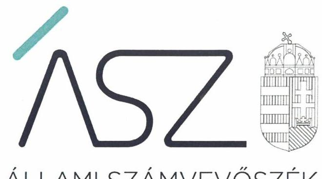
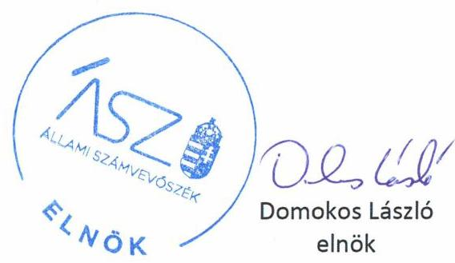
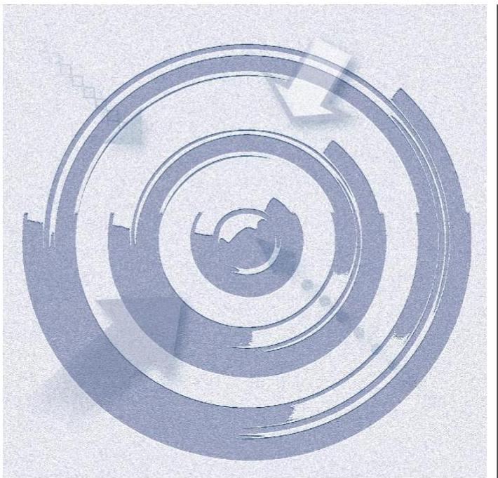

ÁLLAMI SZÁMVEVŐSZÉK

# JELENTÉS 

## Nem állami humánszolgáltatók ellenőrzése

A köznevelési humánszolgáltatást nyújtó intézmények, szolgáltatók államháztartáson kívüli fenntartói központi költségvetésből kapott támogatásai felhasználásának ellenőrzése ARTIFEX Oktatási és Kulturális Közhasznú Nonprofit Korlátolt Felelősségű Társaság
2020.

20110
www.asz.hu

---

ÁLLAMI SZÁMVEVŐSZÉK

# JELENTÉS 

## Nem állami humánszolgáltatók ellenőrzése

A köznevelési humánszolgáltatást nyújtó intézmények, szolgáltatók államháztartáson kívüli fenntartói központi költségvetésből kapott támogatásai felhasználásának ellenőrzése ARTIFEX Oktatási és Kulturális Közhasznú Nonprofit Korlátolt Felelősségű Társaság
2020. 07 hó 08 nap

20110
www.asz.hu

---

# AZ ELLENŐRZÉST FELÜGYELTE: 

KAKAS SÁNDOR felügyeleti vezető

## AZ ELLENŐRZÉST VEZETTE ÉS A VÉGREHAJTÁSÁÉRT FELELŐS:

RÁCZKEVI KATALIN ellenőrzésvezető

## A PROGRAM ÖSSZEÁLLÍTÁSÁÉRT FELELŐS:

FEKETE-NAGY ANDRÁS GÁBOR ellenőrzési program készítéséért felelős vezető

IKTATÓSZÁM: EL-2739-001/2020.
TÉMASZÁM: 2523
ELLENŐRZÉS-AZONOSÍTÓ SZÁM: V086702

---

# TARTALOMJEGYZÉK 

- ÖSSZEGZÉS ..... 5
- AZ ELLENŐRZÉS CÉLJA ..... 6
- AZ ELLENŐRZÉS TERÜLETE ..... 7
- AZ ELLENŐRZÉS HÁTTERE, INDOKOLTSÁGA ..... 8
- A JELENTÉS LÉNYEGES KÉRDÉSKÖREI ..... 9
- AZ ELLENŐRZÉS HATÓKÖRE ÉS MÓDSZEREI ..... 10
- MEGÁLLAPÍTÁSOK ..... 12
- MELLÉKLETEK ..... 15
I. sz. melléklet: Értelmező szótár ..... 15
- FÜGGELÉK: ÉSZREVÉTELEK ..... 17
- RÖVIDÍTÉSEK JEGYZÉKE ..... 19

---

.

---

# ÖSSZEGZÉS 

A miskolci székhelyű ARTIFEX Oktatási és Kulturális Közhasznú Nonprofit Korlátolt Felelősségű Társaság, mint intézményfenntartó a szabályszerű közpénzfelhasználás feltételeit megteremtette. A köznevelési közfeladathoz biztosított központi támogatások felhasználásánál biztosította az elszámoltathatóságot. Beszámolási kötelezettségének 2016-2018. évben eleget tett, ezáltal az átláthatóságát biztosította.

## Az ellenőrzés társadalmi indokoltsága

A szociális gondoskodást igénylők védelme, illetve a köznevelési feladatok ellátása az Alaptörvényben meghatározott, a társadalom szempontjából fontos tevékenységek. Jogszabályok teszik lehetővé, hogy államháztartáson kívüli szervezetek - így például az egyházi fenntartók, alapítványok, gazdasági társaságok, egyesületek - által fenntartott intézmények is végezzenek köznevelési, szociális és gyermekvédelmi feladatokat. Mindehhez a központi költségvetés évente jelentős összegű támogatással járul hozzá. Az államháztartáson kívüli, humánszolgáltatást végző intézmények az igényelt közpénzekből társadalmilag hasznos, közösségteremtő, közérdekű, illetve közhasznú tevékenységet végeznek, illetve közfeladatokat látnak el.

Az intézményfenntartók ellenőrzésével az Állami Számvevőszék hozzájárul ahhoz, hogy ezen közpénzeket az államháztartáson kívüli szervezetek is ellenőrizhető, átlátható és elszámoltatható módon használják fel a közfeladatok ellátása során. Az ellenőrzések célja továbbá, hogy a nyilvánosság és az igénybevevők megfelelő tájékoztatást kapjanak az államháztartáson kívüli közfeladatot ellátók múködéséről.

Az ÁSZ ellenőrzései arra adnak választ, hogy az intézményfenntartók arra használták-e fel a közpénzeket, amire igényelték.

A szabályszerű gazdálkodás elengedhetetlen a közfeladat ellátás szakmai céljainak megvalósításához, valamint a társadalmi közbizalom fenntartásához.

## Főbb megállapítások, következtetések

Az ARTIFEX Oktatási és Kulturális Közhasznú Nonprofit Korlátolt Felelősségű Társaság a köznevelési közfeladatok ellátásának szervezeti feltételeit kialakította, a gazdálkodás rendjét az előírásoknak megfelelően szabályozta. Ezáltal a költségvetési támogatások átlátható felhasználásának feltételeit biztosította.

A Fenntartó a költségvetési támogatások felhasználását intézménye részére szabályozta, a köznevelési közfeladattal kapcsolatban kérhető térítési díj és tandíj megállapításának szabályait, a szociális alapon adható kedvezmények feltételeit meghatározta.

A Fenntartó eleget tett a jogszabályban előírt elkülönítési kötelezettségének, a támogatásokat intézménye múködtetésére fordította.

A Fenntartó az ellenőrzött időszakban egyszerűsített éves beszámolóit elkészítette.

---

# AZ ELLENŐRZÉS CÉLJA 

AZ ELLENŐRZÉS CÉLJA annak értékelése volt, hogy az ARTIFEX Oktatási és Kulturális Közhasznú Nonprofit Korlátolt Felelősségű Társaság, mint nem állami, nem önkormányzati köznevelési intézményfenntartó központi költségvetésből kapott támogatásainak felhasználása szabályszerű volt-e.

---

# **AZ ELLENŐRZÉS TERÜLETE**

## **ARTIFEX Oktatási és Kulturális Közhasznú Nonprofit Korlátolt Felelősségű Társaság, mint intézményfenntartó**

A miskolci székhelyű ARTIFEX Oktatási és Kulturális Közhasznú Nonprofit Korlátolt Felelősségű Társaságot két magánszemély alapította oktatási közfeladat ellátására 2006. május 20-án.

A Fenntartó1 társasági szerződésben rögzített fő tevékenysége alapfokú oktatás volt. A Fenntartó az oktatási feladatait az önálló jogi személyiséggel rendelkező Intézményében2 a 2016-2017. évben 27, a 2018. évben 33 telephelyen látta el. Az Intézmény Nktv.3 szerinti alapfeladata alapfokú művészeti oktatás volt. Az intézmény négy művészeti ág, táncművészet, zeneművészet, színművészet, képzőművészet oktatását végezte az ellenőrzött időszakban.

A Társaság közhasznú jogállású szervezet volt az ellenőrzött időszakban.

A Fenntartó kettős könyvvitellel alátámasztott egyszerűsített éves beszámolót készített az ellenőrzött időszakban, a számviteli beszámolók tekintetében a Fenntartónak könyvvizsgálati kötelezettsége nem volt.

A Fenntartó képviseletét az ügyvezető látta el, akinek a személyében nem történt változás az ellenőrzött időszakban. A Társaság legfőbb szerve a taggyűlés4 volt.

A Fenntartó részére köznevelési közfeladat ellátásra a Magyar Államkincstár által biztosított költségvetési támogatások összege 2016. évben 216,0 M Ft, a 2017. évben 278,0 M Ft, a 2018. évben 305,2 M Ft volt.

---

# AZ ELLENŐRZÉS HÁTTERE, INDOKOLTSÁGA 

A köznevelési feladatokat ellátó nem állami intézményfenntartók részére közfeladataik ellátására évente jelentős összegű pénzügyi támogatást biztosítottak a mindenkori költségvetési törvények a bennük megfogalmazott feltételek mellett.

Az ÁSZ ${ }^{5}$ stratégiájában foglaltak alapján is indokolt az ellenőrzés, amely a társadalom számára jelzi, hogy a közpénz államháztartáson kívüli felhasználása sem maradhat ellenőrizetlenül. Az államháztartáson kívülre nyújtott költségvetési támogatások ellenőrzésével az ÁSZ hozzájárul ahhoz, hogy a közpénzeket a nem állami humán fenntartók átlátható módon használják fel a közfeladatok ellátására kötött szerződésekben vállalt kötelezettségek teljesítése érdekében. Az ellenőrzés javaslataival hozzájárulhat az említett rendszerek szabályszerű támogatás felhasználásához, javíthatja a társadalmi-gazdasági döntések megalapozottságát, amely a „jól irányított állam" múködéséhez járul hozzá.

---

# A JELENTÉS LÉNYEGES KÉRDÉSKÖREI 

1. A köznevelési humánszolgáltató közfeladatot ellátó államháztartáson kívüli fenntartó szabályszerű müködési - és gazdálkodási környezet kialakításával megteremtette-e a költségvetési támogatások átlátható, elszámoltatható igénybevételének, felhasználásának feltételeit?
2. Az államháztartáson kívüli fenntartó az átvállalt köznevelési humánszolgáltatási közfeladathoz biztositott költségvetési támogatásokat szabályszerűen fordította-e a humánszolgáltató intézménye müködtetésére?
3. Az államháztartáson kívüli fenntartó a köznevelési humánszolgáltató intézménye müködtetéséhez felhasznált közpénzekre vonatkozó gazdálkodásával a nyilvánosság előtt elszámolt-e, ennek érdekében ellenőrzési, értékelési és a külső ellenőrzésekkel kapcsolatos intézkedési feladatait szabályszerűen látta-e el?

---

# AZ ELLENŐRZÉS HATÓKÖRE ÉS MÓDSZEREI 

## Az ellenőrzés típusa

Megfelelőségi ellenőrzés.

## Az ellenőrzött időszak

A 2016. január 1-je és 2018. december 31-e közötti időszak azon évei, amelyben nem állami, nem önkormányzati fenntartó - köznevelési közfeladat-ellátásra az államháztartásból támogatást kapott és/vagy használt fel.

## Az ellenőrzés tárgya

Az ellenőrzés a köznevelési humánszolgáltatási közfeladatokat ellátó államháztartáson kívüli fenntartók humánszolgáltatási közfeladatai ellátásához a központi költségvetésből kapott támogatásaik humánszolgáltatási közfeladatokra való fenntartó általi felhasználása szabályszerűségének értékelésére terjedt ki.

## Az ellenőrzött szervezet

ARTIFEX Oktatási és Kulturális Közhasznú Nonprofit Korlátolt Felelősségű Társaság

## Az ellenőrzés jogalapja

Az ellenőrzés jogszabályi alapját az ÁSZ tv. ${ }^{6}$ 1. § (3) bekezdésében, valamintaz 5. § (3) bekezdésében foglalt előírások adják.

## Az ellenőrzés módszerei

Az ellenőrzést az ellenőrzési program annak szempontjai, kérdései, az ellenőrzött időszakban hatályos jogszabályok, a nemzetközi standardokat irányadónak tekintve, az ellenőrzés szakmai szabályok és módszertanok figyelembe vételével rendelte elvégezni. A közpénzekkel való felelős gazdálkodás segítésére irányuló javaslatok kidolgozásakor a hatályos jogszabályok voltak az irányadóak.

---

Az ellenőrzés ideje alatt az ellenőrzött szervezettel történő kapcsolattartás az ÁSZ SZMSZ²-ének vonatkozó előírásai alapján biztosította az ÁSZ.

Az ellenőrzési kérdések megválaszolásához szükséges bizonyítékok megszerzése az ellenőrzött által rendelkezésre bocsátott dokumentumokra, adatokra alapozva megfigyelés, szemle (szemrevételezés), kérdésfeltevés (információkérés), valamint elemző eljárással történt.

Az ellenőrzési bizonyítékként felhasználható adatforrások közé tartoztak egyrészt az ellenőrzési program részletes szempontjainál felsorolt adatforrások, másrészt minden - az ellenőrzés folyamán feltárt, az ellenőrzés szempontjából információt tartalmazó - dokumentum.

Az ellenőrzés lefolytatásához az ellenőrzött szervezet a kitöltött tanúsítványok, valamint az ÁSZ által kért dokumentumok elektronikus úton való megküldésével szolgáltatott adatokat, információkat. Az így rendelkezésre bocsátott adatok, információk és a tanúsítványok adatai valódiságának kontrollja az ellenőrzés keretében történt.

Az egységes értelmezést az ellenőrzési program mellékletét képező fogalomtár és rövidítésjegyzék támogatta.

Az ellenőrzést alapvetően a köznevelési humánszolgáltatások esetében a központi költségvetési támogatások igénylésével, módosításával, felhasználásával, elszámolásával kapcsolatos feladatokat ellátó államháztartáson kívüli fenntartóknál/szervezeteinél végezte az ÁSZ.

A köznevelési humánszolgáltatások központi költségvetési támogatásaival kapcsolatos, államháztartáson kívüli fenntartó jogszabályokban előírt feladatai betartását, továbbá a központi költségvetési támogatások szabályszerű nyilvántartását ellenőrizte az ÁSZ a Fenntartónál rendelkezésre álló nyilvántartások, beszámolók és egyéb dokumentumok alapján.

Az ellenőrzés nem terjedt ki a köznevelési humánszolgáltatások központi költségvetési támogatásai igénylése, módosítása, elszámolása valódiságának, megalapozottságának, helyességének - sem a fenntartónál, sem a székhely intézményeinél való - értékelésére (mivel ennek felülvizsgálata, ellenőrzése a finanszírozó jogszabályban előírt feladata, határozatai kiadása előtt). Továbbá nem terjedt ki az ellenőrzés e források intézmények általi szabályszerű felhasználásának értékelésére.

---

# MEGÁLLAPÍTÁSOK 

## 1. A köznevelési humánszolgáltató közfeladatot ellátó államháztartáson kívüli fenntartó szabályszerű múködési - és gazdálkodási környezet kialakításával megteremtette-e a költségvetési támogatások átlátható, elszámoltatható igénybevételének, felhasználásának feltételeit?

Összegző megállapítás

A Fenntartó a szabályszerű múködés kereteit kialakította, a szabályszerű gazdálkodás feltételeinek kialakításával a költségvetési támogatások átlátható, elszámoltatható igénybevételének, felhasználásának feltételeit megteremtette.

A Fenntartó a Társasági szerződést az előírásoknak megfelelően elkészítette, a Ptk. ${ }^{8}$ előírásának megfelelően rendelkezett hatályos SZMSZ ${ }^{9}$-szel az ellenőrzött időszakban.

A Fenntartó az Intézményt a jogszabályi előírásoknak megfelelően Alapító Okirat kiadásával létrehozta, melyben meghatározta az Intézmény alapfeladatát és múködésének kereteit, előírta az Intézmény könyvvezetési kötelezettségét.

A Fenntartó a Nktv. előírásainak megfelelően fenntartói utasításban meghatározta az Intézmény által kérhető térítési díj és tandíj megállapításának szabályait, a szociális alapon adható kedvezmények feltételeit.

A Fenntartó az ellenőrzött időszakban a jogszabályi előírásoknak megfelelően elkészítette a Számviteli politikát ${ }^{10}$, továbbá ennek részeként az Eszközök és források leltározási és leltárkészítési szabályzatot ${ }^{11}$, az Eszközök és források értékelési szabályzatot ${ }^{12}$, valamint a Pénzkezelési szabályzatot ${ }^{13}$

A Fenntartó a Számv. tv. ${ }^{14}$ előírása alapján rendelkezett Számlarenddel ${ }^{15}$, amelyben meghatározta a továbbutalási céllal kapott költségvetési támogatás elkülönített főkönyvi számlán való könyvelését.

---

# 2. Az államháztartáson kívüli fenntartó az átvállalt köznevelési humánszolgáltatási közfeladathoz biztosított költségvetési támogatásokat szabályszerűen fordította-e a humánszolgáltató intézménye múködtetésére? 

Összegző megállapítás A Fenntartó az köznevelési közfeladathoz biztosított költségvetési támogatásokat a 2016-2018. években szabályszerűen fordította intézménye múködtetésére.

A Fenntartó a központi költségvetési támogatásokat 2016. január hónapban, továbbá 2016. október hónap és 2018. december hónap között önálló jogi személyiséggel rendelkező intézményének a jogszabályi előírások szerint 15 napon belül teljes összegben átadta.

A Fenntartó a részére folyósított központi költségvetési támogatást 2016. évben február, március, április, május, június, július, augusztus és szeptember hónapokban a Kvtv. ${ }^{16} 7$. melléklet VI. 2. pontjában előírtak ellenére nem 15 napon belül adta át az Intézménynek.

Az ellenőrzött időszakban a Fenntartó a költségvetési támogatás felhasználását könyvvezetésében a Nkt. vhr. ${ }^{17}$ előírásainak megfelelően alapfeladatonkénti bontásban elkülönítetten tartotta nyilván.
3. Az államháztartáson kívüli fenntartó a köznevelési humánszolgáltató intézménye múködtetéséhez felhasznált közpénzekre vonatkozó gazdálkodásával a nyilvánosság előtt elszámolt-e, ennek érdekében ellenőrzési, értékelési és a külső ellenőrzésekkel kapcsolatos intézkedési feladatait szabályszerűen látta-e el?

Összegző megállapítás A Fenntartó a közfeladatot ellátó intézménye múködtetéséhez felhasznált közpénzekre vonatkozó gazdálkodásával a nyilvánosság előtt 2016-2018. években elszámolt.

A Fenntartó 2016-2018. évre vonatkozóan a Számv. tv. szerinti egyszerűsített éves beszámolókat elkészítette, a számviteli beszámolókat letétbe helyezte.

A Fenntartónál 2016. és 2018. évben kormányhivatal ${ }^{18}$ folytatott törvényességi ellenőrzést, szabálytalanságot nem állapított meg.

---

.

---

# MELLÉKLETEK 

- I. SZ. MELLÉKLET: ÉRTELMEZŐ SZÓTÁR
humánszolgáltatás
költségvetési támogatás
nem állami, nem önkormányzati (államháztartáson kívüli) intézmény fenntartó

Külön törvényben meghatározott szociális, gyermekjóléti, gyermekvédelmi, közoktatási, felsőoktatási, kulturális közfeladatok (2014. évi Kvtv. 34. § (1), (4) bekezdés, 1. számú melléklet XX/20/2. alcím, 19. alcím, 2015. évi Kvtv. 43. § (1), (4) bekezdés, 1. számú melléklet XX/20/2/3. jogcím csoport, 19. alcím, 2016. évi Kvtv. 41. § (1), (4) bekezdés, 1. számú melléklet XX/20/2/3. jogcím csoport, 19. alcím.
A társadalombiztosítás pénzügyi alapjai kivételével az államháztartás központi alrendszeréből ellenérték nélkül, pénzben nyújtott támogatások (Áht. ${ }^{19} 1 . \S 14$. pont). A költségvetési törvényekben (2013. évi CCXXX. törvény 33-34. §, 2014. évi C. törvény 42-43. §, 2015. évi C. törvény 40-41. §) megállapított támogatás. Például a 2015. évi C. törvény 40-41. § szerint többek között: Az Országgyűlés a szociális, gyermekjóléti, gyermekvédelmi közfeladatot ellátó intézményt, szolgáltatást fenntartó egyházi jogi személy, civil szervezet, közalapítvány, országos nemzetiségi önkormányzat, települési vagy területi nemzetiségi önkormányzat, gazdasági társaság, és a humánszolgáltatást alaptevékenységként végző, az Szja tv. hatálya alá tartozó egyéni vállalkozó (a továbbiakban együtt: nem állami szociális fenntartó) részére támogatást állapít meg a következők szerint: a támogatás a nem állami szociális fenntartót a települési önkormányzatok 2. melléklet III. pont 3. alpont c)-k) pontjában és III. pont 5. alpont a) pontjában meghatározott támogatásaival azonos jogcímeken, összegben és feltételek mellett illeti meg.
A szociális, gyermekjóléti és gyermekvédelmi közfeladatokat /humánszolgáltatásokat ellátó intézményt fenntartó egyházi jogi személy, társadalmi szervezet, alapítvány, közalapítvány, civil szervezet, országos nemzetiségi önkormányzat, nonprofit gazdasági társaság, gazdasági társaság és a humánszolgáltatást alaptevékenységként végző, Szja tv. hatálya alá tartozó egyéni vállalkozó. (2013. évi Kvtv. 35. § (1), (3) bekezdés, 2014. évi Kvtv. 33. §, 34. § (1), (4) bekezdés, 2015. évi Kvtv. 42. §, 43. § (1), (4) bekezdés, 2016. évi Kvtv. 40. §, 41. § (1), (4) bekezdés, 2017. évi Kvtv. 41. § (1), (4))

---

.

---

# FÜGGELÉK: ÉSZREVÉTELEK 

A jelentéstervezetet a Számvevőszék 15 napos észrevételezésre megküldte az ellenőrzött szervezet vezetőjének az ÁSZ tv. 29. §* (1) bekezdése előírásának megfelelően.

Az ARTIFEX Oktatási és Kulturális Közhasznú Nonprofit Korlátolt Felelősségű Társaság ügyvezetője a jelentéstervezetre nem tett észrevételt.

[^0]
[^0]:    * 29. § (1) Az Állami Számvevőszék az ellenőrzési megállapításait megküldi az ellenőrzött szervezet vezetőjének vagy az általa megbízott személynek, és annak, akinek személyes felelősségét állapította meg.
    (2) Az ellenőrzött szervezet vezetője és a felelősként megjelölt személy az ellenőrzés megállapításaira tizenöt napon belül írásban észrevételt tehet.
    (3) Az Állami Számvevőszék az észrevételre a beérkezésétől számított harminc napon belül írásban válaszol. A figyelembe nem vett észrevételeket köteles a jelentésben feltüntetni, és megindokolni, hogy azokat miért nem fogadta el.

---

.

---

# RÖVIDÍTÉSEK JEGYZÉKE 

${ }^{1}$ Fenntartó
${ }^{2}$ Intézmény
${ }^{3}$ Nktv.
${ }^{4}$ taggyűlés
${ }^{5}$ ÁSZ
${ }^{6}$ ÁSZ tv.
${ }^{7}$ ÁSZ SZMSZ
${ }^{8}$ Ptk.
${ }^{9}$ SZMSZ
${ }^{10}$ Számviteli politika
${ }^{11}$ Eszközök és források leltározási és leltárkészítési szabályzata
${ }^{12}$ Eszközök és források értékelési szabályzata
${ }^{13}$ Pénzkezelési szabályzat
${ }^{14}$ Számv.tv.
${ }^{15}$ Számlarend
${ }^{16}$ Kvtv.
${ }^{17}$ Nkt.vhr.
${ }^{18}$ kormányhivatal
${ }^{19}$ Áht.

ARTIFEX Oktatási és Kulturális Közhasznú Nonprofit Korlátolt Felelősségű Társaság
PREMIER Alapfokú Művészeti Iskola
2011. évi CXC. törvény a nemzeti köznevelésről

ARTIFEX Oktatási és Kulturális Közhasznú Nkft. taggyűlése
Állami Számvevőszék
az Állami Számvevőszékről szóló LXVI. törvény
az Állami Számvevőszék Szervezeti és Működési Szabályzata
2013. évi V. törvény a Polgári Törvénykönyvről (hatályos 2014. március 15-től)

ARTIFEX Oktatási és Kulturális Közhasznú Nonprofit Korlátolt Felelősségű Társaság Szervezi és működési szabályzata (hatályos 2014.06.16-tól)
ARTIFEX Oktatási és Kulturális Közhasznú Nonprofit Korlátolt Felelősségű Társaság Számviteli politika
ARTIFEX Oktatási és Kulturális Közhasznú Nonprofit Korlátolt Felelősségű Társaság Eszközök és források leltározási és leltárkészítési szabályzata
ARTIFEX Oktatási és Kulturális Közhasznú Nonprofit Korlátolt Felelősségű Társaság Eszközök és források értékelési szabályzata
ARTIFEX Oktatási és Kulturális Közhasznú Nonprofit Korlátolt Felelősségű Társaság Pénzkezelési szabályzat
2000. évi C. törvény a számvitelről

ARTIFEX Oktatási és Kulturális Közhasznú Nonprofit Korlátolt Felelősségű Társaság Számlarendje
2015. évi C. törvény Magyarország 2016. évi költségvetéséről
229/2012. (VIII. 28.) Korm. rendelet a nemzeti köznevelésről szóló törvény végrehajtásáról
Szabolcs-Szatmár-Bereg megyei Kormányhivatal
2011. évi CXCV. törvény az államháztartásról (hatályos 2011. december 31-étől)

---

# ASZ 

ALLAMI SZAMVEVOSZEK
1052 Budapest, Apáczai Cs. J. u. 10. I 1364 Budapest 4. Pf. 54 TEL: +36 14849100
email: szamvevoszek@asz.hu
web: www.asz.hu | www.aszhirportal.hu