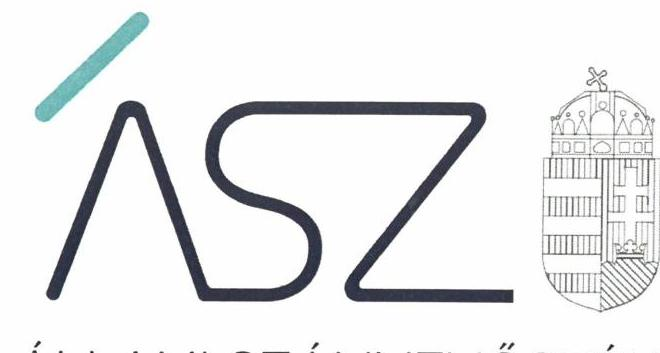
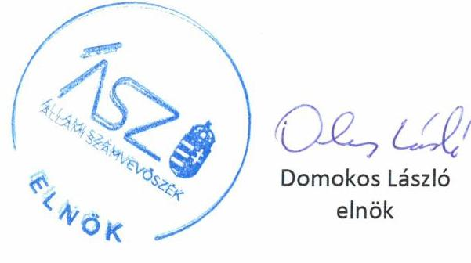
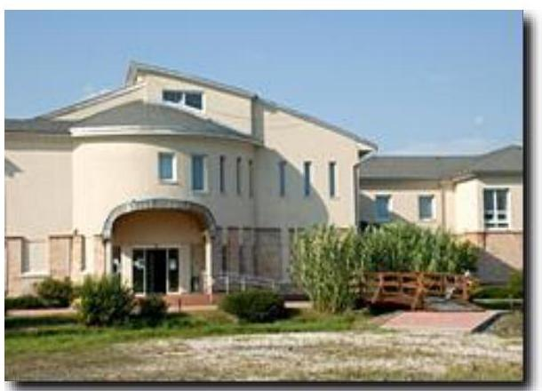

ÁLLAMI SZÁMVEVŐSZÉK

# JELENTÉS 

## Nem állami humánszolgáltatók ellenőrzése

A szociális humánszolgáltatást nyújtó intézmények, szolgáltatók államháztartáson kívüli fenntartói központi költségvetésből kapott támogatásai felhasználásának ellenőrzése DERŰ Háza Idősek Otthona Nonprofit Korlátolt Felelősségű Társaság
2020.

20111
www.asz.hu

---

ÁLLAMI SZÁMVEVŐSZÉK

# JELENTÉS 

## Nem állami humánszolgáltatók ellenőrzése

A szociális humánszolgáltatást nyújtó intézmények, szolgáltatók államháztartáson kívüli fenntartói központi költségvetésből kapott támogatásai felhasználásának ellenőrzése DERŰ Háza Idősek Otthona Nonprofit Korlátolt Felelősségű Társaság
2020. 07. hó 24 .nap

20111
www.asz.hu

---

# AZ ELLENŐRZÉST FELÜGYELTE: 

MAROZSÁN LÁSZLÓNÉ felügyeleti vezető

## AZ ELLENŐRZÉST VEZETTE ÉS A VÉGREHAJTÁSÁÉRT FELELŐS:

RÁCZKEVI KATALIN ellenőrzésvezető

## A PROGRAM ÖSSZEÁLLÍTÁSÁÉRT FELELŐS:

TÓTPÁL SZABOLCS osztályvezető
FEKETE-NAGY ANDRÁS GÁBOR ellenőrzési program készítéséért felelős vezető

## IKTATÓSZÁM: EL-2740-001/2020.

Jelentéseink az Országgyúlés számítógépes hálózatán és az interneten a www.asz.hu címen is olvashatóak.

TÉMASZÁM: 2491
ELLENŐRZÉS-AZONOSÍTÓ SZÁM: V083589, V0867091

---

# TARTALOMJEGYZÉK 

■ ÖSSZEGZÉS ..... 5
■ AZ ELLENŐRZÉS CÉLJA ..... 6
■ AZ ELLENŐRZÉS TERÜLETE ..... 7
■ AZ ELLENŐRZÉS HÁTTERE, INDOKOLTSÁGA ..... 8
■ AZ ELLENŐRZÉS LÉNYEGES KÉRDÉSKÖREI. ..... 9
■ AZ ELLENŐRZÉS HATÓKÖRE ÉS MÓDSZEREI ..... 10
■ MELLÉKLETEK ..... 13
I. sz. melléklet: Értelmező szótár ..... 13
■ FÜGGELÉKEK ..... 15
I. sz. függelék a jelentéshez ..... 15
II. sz. függelék: Észrevételek ..... 16
■ RÖVIDÍTÉSEK JEGYZÉKE ..... 19

---

.

---

# ÖSSZEGZÉS 

A bábolnai székhelyű DERŰ Háza Idősek Otthona Nonprofit Korlátolt Felelősségű Társaság a 2015-2018. években nem biztositotta a szociális humánszolgáltatási közfeladatok ellátására kapott költségvetési támogatások felhasználásának ellenőrizhetőségét.

## Az ellenőrzés társadalmi indokoltsága

A szociális gondoskodást igénylők védelme, illetve a köznevelési feladatok ellátása az Alaptörvényben meghatározott, a társadalom szempontjából fontos tevékenységek. Jogszabályok teszik lehetővé, hogy államháztartáson kívüli szervezetek - így például az egyházi fenntartók, alapítványok, gazdasági társaságok, egyesületek - által fenntartott intézmények is végezzenek köznevelési, szociális és gyermekvédelmi feladatokat. Mindehhez a központi költségvetés évente jelentős összegű támogatással járul hozzá. Az államháztartáson kívüli, humánszolgáltatást végző intézmények az igényelt közpénzekből társadalmilag hasznos, közösségteremtő, közérdekű, illetve közhasznú tevékenységet végeznek, illetve közfeladatokat látnak el.

Az intézményfenntartók ellenőrzésével az Állami Számvevőszék hozzájárul ahhoz, hogy ezen közpénzeket az államháztartáson kívüli szervezetek is ellenőrizhető, átlátható és elszámoltatható módon használják fel a közfeladatok ellátása során. Az ellenőrzések célja továbbá, hogy a nyilvánosság és az igénybevevők megfelelő tájékoztatást kapjanak az államháztartáson kívüli közfeladatot ellátók múködéséről.

Az ÁSZ ellenőrzései arra adnak választ, hogy az intézményfenntartók arra használták-e fel a közpénzeket, amire igényelték.

A szabályszerű gazdálkodás elengedhetetlen a közfeladat ellátás szakmai céljainak megvalósításához, valamint a társadalmi közbizalom fenntartásához.

## Megállapítások, következtetések

A DERŰ Háza Idősek Otthona Nonprofit Korlátolt felelősségű Társaság 2015-2017. években a jogszabályban előírtak ellenére könyvvezetési rendszerét nem oly módon részletezte, hogy abból a Fenntartó ${ }^{1}$ és a humán szolgáltatást végző intézményének gazdálkodása elkülöníthető legyen, továbbá a Fenntartó könyvvezetésében a kapott költségvetési támogatás felhasználását az intézménye által ellátott három feladat szerint nem bontotta meg. A Fenntartó a 2018. évre vonatkozóan a költségvetési támogatás felhasználásáról nyilvántartást nem vezetett.

Fentiek alapján a Fenntartó a 2015-2018. években a szociális humánszolgáltatási közfeladat ellátására kapott költségvetési támogatás felhasználásának a Számv.tv. ${ }^{2}$ 161/A. § (2) bekezdésében előírt ellenőrizhetőségét nem biztosította. Mivel az Atr. ${ }^{3} 16 . \S$ (1) bekezdésében foglalt szabályozás ellenére nem gondoskodott arról, hogy az költségvetési támogatások felhasználásának, a Fenntartó és a nem önállóan gazdálkodó intézménye gazdálkodásának elkülönített, feladatonkénti bontásban történő elszámolására az adatok rendelkezésre álljanak.

A Fenntartó mindezek alapján az Alaptörvény ${ }^{4}$ 39. cikk (2) bekezdésében foglaltak ellenére a felhasznált közpénzekre vonatkozó gazdálkodása átláthatóságát nem biztosította. Ezáltal a Fenntartó nem igazolta, hogy a központi költségvetési támogatást humánszolgáltatás közfeladat ellátására fordította.

---

# AZ ELLENŐRZÉS CÉLJA

**AZ ELLENŐRZÉS CÉLJA** annak értékelése volt, hogy a nem állami, nem önkormányzati szociális intézmények fenntartói központi költségvetésből kapott támogatásainak felhasználása szabályszerű volt-e.

---

# **AZ ELLENŐRZÉS TERÜLETE**

## **DERŰ Háza Idősek Otthona Nonprofit Korlátolt Felelősségű Társaság, mint intézményfenntartó**

A bábannaia széthelyű DERŰ Háza Idősek Otthona Nonprofit Kft. 2006. június 5-én kezdte meg működését DERŰ HÁZA Idősek Otthona Közhasznú Társaságként, majd a 2008. évben átalakult nonprofit társasággá.

A Fenntartó képviseletét az ügyvezető önállóan gyakorolta. Az ügyvezető személyében nem volt változás az ellenőrzött időszakban.

A Fenntartó egy intézményt tartott fenn időskorúak gondozóháza, idősek otthona átlagos szintű ellátás, idősek otthona emelt szintű ellátás feladatok ellátására, az intézmény az ellenőrzött időszakban nem volt önálló jogi személy.

A Fenntartó részére szociális közfeladat ellátásra biztosított költségvetési támogatások összege a Magyar Államkincstár adatai szerint 2015. évben 55,5 M Ft, 2016. évben 58,1 M Ft, 2017. évben 67,4 M Ft, 2018. évben pedig 73,8 M Ft volt.

---

# **AZ ELLENŐRZÉS HÁTTERE, INDOKOLTSÁGA**

A szociális feladatokat ellátó nem állami intézményfenntartók részére közfeladataik ellátására évente jelentős összegű pénzügyi támogatást biztosítottak a mindenkori költségvetési törvények a bennük megfogalmazott feltételek mellett. A felhasználható állami támogatások a Kvtv.6-ekben a 2015–2018. években a szociális ágazatra vonatkozóan 360 Mrd Ft előirányzatot határoztak meg.

Az ÁSZ7 stratégiájában foglaltak alapján is indokolt az ellenőrzés, amely a társadalom számára jelzi, hogy a közpénz államháztartáson kívüli felhasználása sem maradhat ellenőrizetlenül. Az államháztartáson kívülre nyújtott költségvetési támogatások ellenőrzésével az ÁSZ hozzájárul ahhoz, hogy a közpénzeket a nem állami humán fenntartók átlátható módon használják fel a közfeladatok ellátására kötött szerződésekben vállalt kötelezettségek teljesítése érdekében. Az ellenőrzés javaslataival hozzájárulhat az említett rendszerek szabályszerű támogatás felhasználásához, javíthatja a társadalmi-gazdasági döntések megalapozottságát, amely a *„jól irányított állam”* működéséhez járul hozzá.

---

# AZ ELLENŐRZÉS LÉNYEGES KÉRDÉSKÖREI 

1. A szociális humánszolgáltató közfeladatot ellátó államháztartáson kívüli fenntartó szabályszerű müködési - és gazdálkodási környezet kialakításával megteremtette-e a költségvetési támogatások átlátható, elszámoltatható igénybevételének, felhasználásának feltételeit?
2. Az államháztartáson kívüli fenntartó az átvállalt szociális humánszolgáltatási közfeladathoz biztositott költségvetési támogatásokat szabályszerűen fordította-e a humánszolgáltató intézménye müködtetésére?
3. Az államháztartáson kívüli fenntartó a szociális humánszolgáltató intézménye müködtetéséhez felhasznált közpénzekre vonatkozó gazdálkodásával a nyilvánosság előtt elszámolt-e, ennek érdekében ellenőrzési, értékelési és a külső ellenőrzésekkel kapcsolatos intézkedési feladatait szabályszerűen látta-e el?

---

# AZ ELLENŐRZÉS HATÓKÖRE ÉS MÓDSZEREI 

## Az ellenőrzés típusa

Megfelelőségi ellenőrzés.

## Az ellenőrzött időszak

A 2015. január 1-je és 2018. december 31-e közötti időszak.

## Az ellenőrzés tárgya

Az ellenőrzés a szociális humánszolgáltatási közfeladatokat ellátó államháztartáson kívüli fenntartók humánszolgáltatási közfeladatai ellátásához a központi költségvetésből kapott támogatásaik humánszolgáltatási közfeladatokra való fenntartó általi felhasználása szabályszerűségének értékelésére terjedt ki.

## Az ellenőrzött szervezet

DERŰ Háza Idősek Otthona Közhasznú Nonprofit Korlátolt Felelősségű Társaság, mint intézményfenntartó

## Az ellenőrzés jogalapja

Az ellenőrzés jogszabályi alapját az ÁSZ tv. ${ }^{8}$ 1. § (3) bekezdésében, valamint 5. § (3) bekezdésében foglalt előírások adják.

## Az ellenőrzés módszerei

Az ellenőrzést az ellenőrzési program annak szempontjai, kérdései, az ellenőrzött időszakban hatályos jogszabályok, a nemzetközi standardokat irányadónak tekintve, az ellenőrzés szakmai szabályok és módszertanok figyelembe vételével rendelte elvégezni. A közpénzekkel való felelős gazdálkodás segítésére irányuló javaslatok kidolgozásakor a hatályos jogszabályok voltak az irányadóak.

Az ellenőrzés ideje alatt az ellenőrzött szervezettel történő kapcsolattartás az ÁSZ SZMSZ ${ }^{9}$-ének vonatkozó előírásai alapján történt.

---

Az ellenőrzési kérdések megválaszolásához szükséges bizonyítékok megszerzése az ellenőrzött által rendelkezésre bocsátott dokumentumokra, adatokra alapozva megfigyelés, szemle (szemrevételezés), kérdésfeltevés (információkérés), valamint elemző eljárással történt.

Az ellenőrzési bizonyítékként felhasználható adatforrások közé tartoztak egyrészt az ellenőrzési program részletes szempontjainál felsorolt adatforrások, másrészt minden - az ellenőrzés folyamán feltárt, az ellenőrzés szempontjából információt tartalmazó - dokumentum.

Az ellenőrzés lefolytatásához az ellenőrzött szervezet a kitöltött tanúsítványok, valamint az ÁSZ által kért dokumentumok elektronikus úton való megküldésével szolgáltatott adatokat, információkat. Az így rendelkezésre bocsátott adatok, információk és a tanúsítványok adatai valódiságának kontrollja az ellenőrzés keretében történt.

Az egységes értelmezést támogatta a jelentés mellékletét képező fogalomtár és rövidítésjegyzék.

Az ellenőrzést az ÁSZ alapvetően a szociális humánszolgáltatások esetében a központi költségvetési támogatások igénylésével, módosításával, felhasználásával, elszámolásával kapcsolatos feladatokat ellátó államháztartáson kívüli fenntartóknál végezte.

A szociális humánszolgáltatások központi költségvetési támogatásaival kapcsolatos, államháztartáson kívüli fenntartó jogszabályokban előírt feladatai betartása, továbbá a központi költségvetési támogatások szabályszerű nyilvántartása került ellenőrzésre a fenntartónál rendelkezésre álló nyilvántartások, beszámolók és egyéb dokumentumok alapján.

Az ellenőrzés nem terjedt ki a szociális humánszolgáltatások központi költségvetési támogatásai igénylése, módosítása, elszámolása valódiságának, megalapozottságának, helyességének - sem a fenntartónál, sem a székhely intézményeinél való - értékelésére (mivel ennek felülvizsgálata, ellenőrzése a finanszírozó jogszabályban előírt feladata, határozatai kiadása előtt). Továbbá nem terjedt ki az ellenőrzés e források, intézmények általi szabályszerű felhasználásának értékelésére.

---

.

---

# MELLÉKLETEK 

- I. SZ. MELLÉKLET: ÉRTELMEZŐ SZÓTÁR
humánszolgáltatás
költségvetési támogatás
nem állami, nem önkormányzati (államháztartáson kívüli) intézmény fenntartó

Külön törvényben meghatározott szociális, gyermekjóléti, gyermekvédelmi, közoktatási, felsőoktatási, kulturális közfeladatok (2014. évi Kvtv. 34. § (1), (4) bekezdés, 1. számú melléklet XX/20/2. alcím, 19. alcím, 2015. évi Kvtv. 43. § (1), (4) bekezdés, 1. számú melléklet XX/20/2/3. jogcím csoport, 19. alcím, 2016. évi Kvtv. 41. § (1), (4) bekezdés, 1. számú melléklet XX/20/2/3. jogcím csoport, 19. alcím, 2017. évi Kvtv. 41. § (1) bekezdés, 1. számú melléklet XX/20/2/3. jogcím csoport, 19. alcím)

A társadalombiztosítás pénzügyi alapjai kivételével az államháztartás központi alrendszeréből ellenérték nélkül, pénzben nyújtott támogatások (Áht. ${ }^{10}$ 1. § 14. pont) A költségvetési törvényekben (2014. évi C. törvény 42-43. §, 2015. évi C. törvény 4041. §, 2016. évi XC. törvény 40-41. §), 2017. évi C. törvény.) megállapított támogatás. A köznevelési közfeladatokat/humánszolgáltatásokat ellátó intézményt fenntartó egyházi jogi személy, társadalmi szervezet, alapítvány, közalapítvány, civil szervezet, országos nemzetiségi önkormányzat, nonprofit gazdasági társaság, gazdasági társaság és a humánszolgáltatást alaptevékenységként végző, Szja tv. hatálya alá tartozó egyéni vállalkozó.
(2015. évi Kvtv. 43. § (1) bekezdés, 2016. évi Kvtv. 41. § (1), bekezdés, 2017. évi Kvtv. 41. § (1) bekezdés)

---

.

---

# FÜGGELÉKEK 

- I. SZ. FÜGGELÉK A JELENTÉSHEZ

Az Állami Számvevőszék az ellenőrzések során feltárt tényekhez kapcsolódó további körülmények tisztázására eszközrendszerrel nem rendelkezik. Amennyiben az ellenőrzésen túlmutatóan indokoltnak látszik az ellenőrzés során feltárt körülmények további vizsgálata, az Állami Számvevőszék törvényi felhatalmazás alapján az ellenőrzés által feltárt körülményeket továbbítja a hatáskörrel rendelkező szervnek a szükséges intézkedések megtétele, eljárások lefolytatása érdekében.

A Derű Háza Idősek Otthona Nonprofit Korlátolt Felelősségű Társaság (továbbiakban Fenntartó) részére szociális közfeladat ellátására a Magyar Államkincstár által biztosított költségvetési támogatások összege 2018. évben 73,8 M Ft volt.

A Fenntartó Teljességi és hitelességi nyilatkozata és a rendelkezésre adott dokumentumok szerint a 2018. év vonatkozásában a Számv.tv. 161/A. § (2) bekezdésének előírása ellenére nem gondoskodott a közpénzek felhasználásának ellenőrizhetősége érdekében a könyvvezetési rendszerének oly módon való továbbrészletezéséről, hogy abból az Atr. 16. § (1) bekezdése szerinti kötelezettségnek eleget téve, a külön jogszabályban meghatározott a fenntartó és az intézménye gazdálkodásának elkülönített elszámolására, valamint feladatonkénti bontásban a támogatás-felhasználásra vonatkozó - adatok rendelkezésre álljanak.

A Fenntartónál 2018. évi gazdálkodásra vonatkozó elkülönített nyilvántartás vezetésének elmaradása miatt felmerült a támogatások nem rendeltetésszerü felhasználásának gyanúja.
Ezáltal nem zárható ki, hogy a költségvetésből származó pénzeszközöket a jóváhagyott céltól eltérően használta fel.

Az eset konkrét körülményeinek feltárására a Magyar Államkincstár rendelkezik hatáskörrel.

---

A jelentéstervezetet a Számvevőszék 15 napos észrevételezésre megküldte az ellenőrzött szervezet vezetőjének az ÁSZ tv. 29. §* (1) bekezdése előírásának megfelelően.

A DERŰ Háza Idősek Otthona Nonprofit Korlátolt Felelősségű Társaság ügyvezetője élt az ÁSZ tv. 29. § (2) bekezdésében foglalt észrevételezési jogával, a jelentéstervezet megállapításaira a törvényes határidőn belül észrevételt tett.
Az ÁSZ tv. 29. § (3) bekezdésével összhangban az ÁSZ a Függelékben feltünteti az ellenőrzés megállapításaival kapcsolatban tett, figyelembe nem vett észrevételeket, és megindokolja, hogy azokat miért nem fogadta el.

[^0]
[^0]:    * 29. § (1) Az Állami Számvevőszék az ellenőrzési megállapításait megküldi az ellenőrzött szervezet vezetőjének vagy az általa megbízott személynek, és annak, akinek személyes felelősségét állapította meg.
    (2) Az ellenőrzött szervezet vezetője és a felelősként megjelölt személy az ellenőrzés megállapításaira tizenöt napon belül írásban észrevételt tehet.
    (3) Az Állami Számvevőszék az észrevételre a beérkezésétől számított harminc napon belül írásban válaszol. A figyelembe nem vett észrevételeket köteles a jelentésben feltüntetni, és megindokolni, hogy azokat miért nem fogadta el.

---

# A DERŰ Háza Idősek Otthona Nonprofit Korlátolt Felelősségű Társaság (továbbiakban: 

Fenntartó) ügyvezetője által 2020. május 11-én kelt levelében tett észrevétel és kezelésének indokolása.

A DERŰ Háza Idősek Otthona Nonprofit Korlátolt Felelősségű Társaság ügyvezetője észrevételében jelezte, hogy a lefolytatott ellenőrzés során rendelkezésre bocsátották a kért szabályzatokat, elszámolásokat, mérlegeket, főkönyveket, amelyeket a Magyar Államkincstár is minden évben vizsgált. Leírta továbbá, hogy minden évben 2015-2016-2017-2018 évre vetítve megtörtént a feladatok szerinti költségek bontása. Analitikus kimutatásban feladatonkénti bontásban kimutatták, hogy melyik feladatra mennyi bér használtak fel. Tájékoztatott arról is, hogy a további bért, amelyet nem fedezett az állami támogatás a térítési dijból fedezte az Intézmény. Észrevétele szerint a főkönyvi kivonatban is soronkénti bontásban megtalálhatók azok az összegek, amelyet a három elkülönített feladatra költöttek, továbbá leírja, hogy a táblázatokat és a főkönyvi kivonatot, illetve a főkönyvi kartonokat is mellékelték az ellenőrzés során bekért anyaghoz. Az ügyvezető véleménye szerint a kimutatásokból kiderül, hogy felelősségteljesen használták fel az állami támogatást és csak a cél szerinti feladatra költötték. Észrevételében tájékoztatást adott arról is, hogy a Magyar Államkincstár évente ellenőrizte és folyamatosan figyelemmel kísérte müködésüket és egyetlen esetben sem kaptak hiánypótlást, vagy észrevételt a tekintetben, hogy a felhasználás dokumentálása nem jogszabálynak megfelelő lenne.
Az ÁSZ válaszlevelében tájékoztatást adott arról, hogy megállapításait a törvényes határidőn belül az ellenőrzött szervezet által megküldött és az aláírt teljességi és hitelességi nyilatkozatban szereplő dokumentumok alapján teszi. Az utólag beküldött dokumentumokat az ÁSZ nem értékeli (így az ügyvezető által az észrevétellel egyidejűleg küldött 2015-2018. évi dokumentumokat sem). Az ÁSZ a támogatás elkülönített nyilvántartásával kapcsolatosan a 20152017. évekre vonatkozóan az EL-1407-004/2018. iktatószámú adatbekérő levél 2. számú mellékletének 34. sorában bekérte a költségvetési támogatások elkülönített nyilvántartását igazoló dokumentumokat, főkönyvi és analitikus nyilvántartásokat a fenntartónál, illetve az önálló költségvetéssel rendelkező székhely intézmény/eknél. Az EL-1407042/2019. iktatószámú adatbekérő levél 2. számú mellékletének 1.1. sorában került bekérésre a kapott támogatás 2018. évre vonatkozó elkülönített nyilvántartását alátámasztó dokumentum, 1.3. sorában pedig 2018. évre vonatkozóan a kapott támogatás felhasználásának 2018. évre vonatkozó elkülönített nyilvántartását alátámasztó dokumentum.

Az adatszolgáltatás során az ügyvezető az érintett, bekért dokumentum-körhöz 2015-2017. évek vonatkozásában a fenntartói főkönyvi kivonatokat, a munkabért részletező táblázatokat és a normatív támogatás bére vetített analitikáját bocsátotta az ÁSZ rendelkezésére. A 2018. évre vonatkozóan pedig a 2018 évi számviteli beszámoló kiegészítő mellékletét és közhasznúsági jelentését küldte meg a kapott támogatás 2018. évre vonatkozó elkülönített nyilvántartását alátámasztó dokumentumként. A Fenntartó 2018. évre vonatkozóan a kapott támogatás felhasználására vonatkozó elkülönített nyilvántartást nem bocsátott az ÁSZ rendelkezésére. Az ügyvezető 2019. február 21-én és 2019. október 18-án kelt teljességi és hitelességi nyilatkozataiban kijelentette, hogy az ÁSZ részére átadott dokumentumok, adatok megbízhatóak, és a bekért adatokra, dokumentumokra vonatkozóan teljes körű információt tartalmaznak.
Az ellenőrzés során az ÁSZ rendelkezésére bocsátott dokumentumok felülvizsgálata alapján megállapítható volt, hogy az ügyvezető észrevételében hivatkozott, táblázatok, főkönyvi kartonok nem szerepelnek az aláírt 2019. október 18án kelt teljességi és hitelességi nyilatkozatban, azokat az adatszolgáltatás során a 2018. év vonatkozásában nem adták át az ellenőrzés részére.

A 2018. évi főkönyvi kivonat az ÁSZ elektronikus adatszolgáltató rendszerébe nem megfelelő formában került feltöltésre, abban az egyes főkönyvi számok és a kapcsolódó összegek nem voltak ellenőrizhetőek. Fenti okból a Fenntartó által az elektronikus adatszolgáltató rendszerbe feltöltött 2018. évi főkönyvi kivonatot az ÁSZ nem vette figyelembe ellenőrzési bizonyítékként.

A fentiek alapján - az ügyvezető észrevételében leírtakkal ellentétben - a 2018. évre vonatkozóan a támogatás felhasználásának feladatonkénti bontásban való elkülönítését igazoló dokumentumokat nem bocsátottak az adatszolgáltatás során az ÁSZ rendelkezésére.

A Fenntartó ügyvezetőjének észrevétele szerint, a táblázatos analitikus kimutatásukban feladatonként kimutatták, hogy melyik feladatra mennyi bért használtak fel. Az ÁSZ számára a 2015-2017. évre beküldött érintett táblázatok a

---

támogatás bérre felhasznált összegeit azonban nem feladatok szerinti bontásban mutatták be, hanem a feladat ellátási hely típusa szerint (székhely/telephely normál/telephely gondozás). Így abból nem állapítható meg, hogy a Fenntartó az általa ellátott feladatokra (idősek otthona: átlagos és emelt szintű ellátás; valamint időskorúak gondozóháza) mekkora összegű támogatást használt fel a vonatkozó években.

A főkönyvi kivonatokban bérköltségként az ügyvezető által kiemelt 3 sor adata sem támasztja alá az észrevételében leírtakat, miszerint a főkönyvi kivonatban soronként megtalálhatók azok az összegek, amelyet a három elkülönített feladatra költöttek. A főkönyvi kivonatokban megjelölt három sor számlaszámából és megnevezéseiből nem állapítható meg, hogy az ott könyvelt összegnek a forrása a költségvetési támogatás, továbbá az ott szereplő összegeket a kivonat mögött lévő két kimutatás nem támasztotta alá, a „normatív támogatás bérre vetített analitika" nevű dokumentum nem biztosította sem a sorok megnevezésében, sem az összegekben a főkönyvvel való kapcsolatot, annak alátámasztását. A főkönyvi kivonat megjelölt számláinak megnevezése nem egyezett meg az ellátott feladatokkal, így nem igazolta az ellátott feladatok szerinti megbontást. Az ellenőrzés rendelkezésére bocsátott számlatükör („főkönyvi számok listája" elnevezésű dokumentum) sem tartalmazott a költségvetési támogatás felhasználásának elkülönített nyilvántartására vonatkozó számlaszámokat, alszámlákat.

A fentiek alapján az ellenőrzés rendelkezésére bocsátott dokumentumok az ügyvezető észrevételében leírtakat nem támasztották alá, a dokumentumok azt igazolták, hogy a 2015-2017. évre vonatkozóan a Fenntartó az általa kapott költségvetési támogatás felhasználását számviteli rendjében az egyházi és nem állami fenntartású szociális, gyermekjóléti és gyermekvédelmi szolgáltatók, intézmények és hálózatok állami támogatásáról szóló 489/2013. (XII. 18.) Korm. rendelet 16. § (1) bekezdésében előírtak ellenére feladatonkénti bontásban nem kezelte elkülönítve.

Az ügyvezetőt tájékoztatatta továbbá az Állami Számvevőszék arról, hogy ellenőrzési megállapításait az egyéb ellenőrzést végző szervek (beleértve a Magyar Államkincstárat is) ellenőrzési megállapításaitól függetlenül teszi.

A fent leírtakra tekintettel az ügyvezető észrevételét az ÁSZ nem fogadta el, a jelentéstervezet megállapítása helytálló, módosítása nem volt indokolt.

---

# RÖVIDÍTÉSEK JEGYZÉKE 

${ }^{1}$ Fenntartó
${ }^{2}$ Számv.tv.
${ }^{3}$ Atr.
${ }^{4}$ Alaptörvény
${ }^{5}$ intézmény
${ }^{6}$ Kvtv.-ek
${ }^{7}$ ÁSZ
${ }^{8}$ Ász tv.
${ }^{9}$ SZMSZ
${ }^{10}$ Áht.

DERŰ Háza Idősek Otthona Nonprofit Korlátolt Felelősségű Társaság 2000. évi C törvény a számvitelről

489/2013. (XII. 18.) Korm. rendelet az egyházi és nem állami fenntartású szociális, gyermekjóléti és gyermekvédelmi szolgáltatók, intézmények és hálózatok állami támogatásáról
Magyarország Alaptörvénye
Derű Háza Idősek Otthona
Kvtv.1: Magyarország 2015. évi központi költségvetéséről szóló 2014. évi C. törvény (hatályos: 2015. január 1-jétől 2018. december 31-éig)

Kvtv.2: Magyarország 2016. évi központi költségvetéséről szóló 2015. évi C. törvény (hatályos: 2015. július 4-étől)

Kvtv.3: Magyarország 2017. évi központi költségvetéséről szóló 2016. évi XC. törvény (hatályos: 2016. november 1-jétől)

Kvtv.4: Magyarország 2018. évi központi költségvetéséről szóló 2017. évi C. törvény (hatályos: 2017. november 1-jétől)

Állami Számvevőszék
2011. évi LXVI. törvény az Állami Számvevőszékről

Szervezeti és Működési Szabályzat
2011. évi CXCV. törvény az államháztartásról (hatályos: 2011. december 31-től)

---

# ASZ 

ALLAMI SZAMVEVOSZEK
1052 Budapest, Apáczai Cs. J. u. 10. I 1364 Budapest 4. Pf. 54 TEL: +36 14849100
email: szamvevoszek@asz.hu
web: www.asz.hu | www.aszhirportal.hu