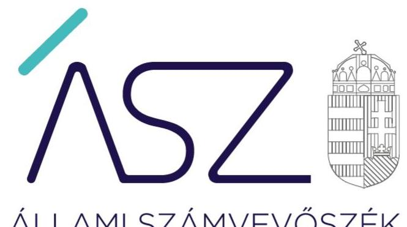
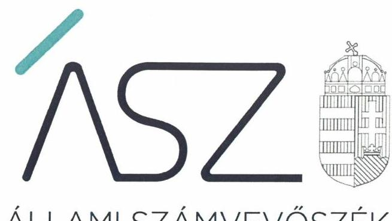
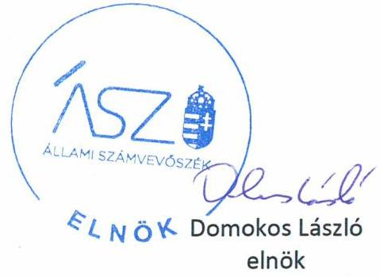
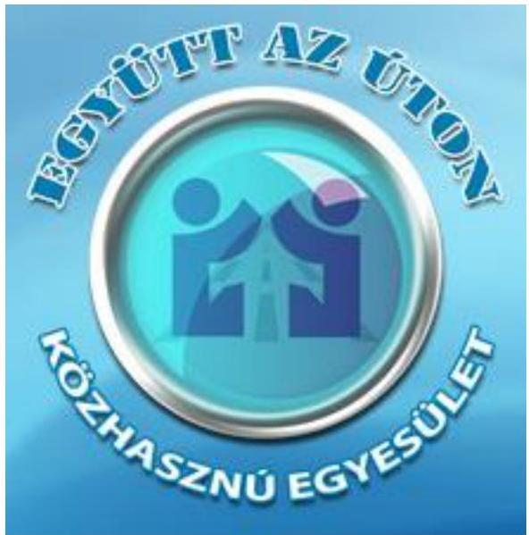

ÁLLAMI SZÁMVEVŐSZÉK

# JELENTÉS 

## Nem állami humánszolgáltatók ellenőrzése

A szociális humánszolgáltatást nyújtó intézmények, szolgáltatók államháztartáson kívüli fenntartói központi költségvetésből kapott támogatásai felhasználásának ellenőrzése Együtt az úton Közhasznú Egyesület
2020.

20112
www.asz.hu

---

ÁLLAMI SZÁMVEVŐSZÉK

# JELENTÉS 

## Nem állami humánszolgáltatók ellenőrzése

A szociális humánszolgáltatást nyújtó intézmények, szolgáltatók államháztartáson kívüli fenntartói központi költségvetésből kapott támogatásai felhasználásának ellenőrzése Együtt az úton Közhasznú Egyesület
2020. 06. 30.

20112
www.asz.hu

---

# AZ ELLENŐRZÉST FELÜGYELTE: 

MAROZSÁN LÁSZLÓNÉ felügyeleti vezető

## AZ ELLENŐRZÉST VEZETTE ÉS A VÉGREHAJTÁSÁÉRT FELELŐS:

RÁCZKEVI KATALIN ellenőrzésvezető

## A PROGRAM ÖSSZEÁLLÍTÁSÁÉRT FELELŐS:

TÓTPÁL SZABOLCS osztályvezető
FEKETE-NAGY ANDRÁS GÁBOR ellenőrzési program készítéséért felelős vezető

## IKTATÓSZÁM: EL-2741-001/2020.

Jelentéseink az Országgyülés számítógépes hálózatán és az interneten a www.asz.hu címen is olvashatóak.

TÉMASZÁM: 2491
ELLENŐRZÉS-AZONOSÍTÓ SZÁM: V083598, V0867093

---

# TARTALOMJEGYZÉK 

- ÖSSZEGZÉS ..... 5
- AZ ELLENŐRZÉS CÉLJA ..... 6
- AZ ELLENŐRZÉS TERÜLETE ..... 7
- AZ ELLENŐRZÉS HÁTTERE, INDOKOLTSÁGA ..... 8
- AZ ELLENŐRZÉS LÉNYEGES KÉRDÉSKÖREI ..... 9
- AZ ELLENŐRZÉS HATÓKÖRE ÉS MÓDSZEREI ..... 10
- MELLÉKLETEK ..... 13
I. sz. melléklet: Értelmező szótár ..... 13
- FÜGGELÉK: ÉSZREVÉTELEK ..... 15
- RÖVIDÍTÉSEK JEGYZÉKE ..... 19

---

.

---

# ÖSSZEGZÉS 

A nyíregyházi székhelyű Együtt az úton Közhasznú Egyesület a 2015-2018. években nem biztosította a szociális humánszolgáltatási közfeladatok ellátására kapott költségvetési támogatások felhasználásának ellenőrizhetőségét.

## Az ellenőrzés társadalmi indokoltsága

A szociális gondoskodást igénylők védelme, illetve a köznevelési feladatok ellátása az Alaptörvényben meghatározott, a társadalom szempontjából fontos tevékenységek. Jogszabályok teszik lehetővé, hogy államháztartáson kívüli szervezetek - így például az egyházi fenntartók, alapítványok, gazdasági társaságok, egyesületek - által fenntartott intézmények is végezzenek köznevelési, szociális és gyermekvédelmi feladatokat. Mindehhez a központi költségvetés évente jelentős összegű támogatással járul hozzá. Az államháztartáson kívüli, humánszolgáltatást végző intézmények az igényelt közpénzekből társadalmilag hasznos, közösségteremtő, közérdekű, illetve közhasznú tevékenységet végeznek, illetve közfeladatokat látnak el.

Az intézményfenntartók ellenőrzésével az Állami Számvevőszék hozzájárul ahhoz, hogy ezen közpénzeket az államháztartáson kívüli szervezetek is ellenőrizhető, átlátható és elszámoltatható módon használják fel a közfeladatok ellátása során. Az ellenőrzések célja továbbá, hogy a nyilvánosság és az igénybevevők megfelelő tájékoztatást kapjanak az államháztartáson kívüli közfeladatot ellátók működéséről.

Az ÁSZ ellenőrzései arra adnak választ, hogy az intézményfenntartók arra használták-e fel a közpénzeket, amire igényelték.

A szabályszerű gazdálkodás elengedhetetlen a közfeladat ellátás szakmai céljainak megvalósításához, valamint a társadalmi közbizalom fenntartásához.

## Megállapítások, következtetések

Az Együtt az úton Közhasznú Egyesület a 2015-2018. években a jogszabályban előírtak ellenére könyvvezetési rendszerét nem oly módon részletezte, hogy abból a Fenntartó ${ }^{1}$ és a humán szolgáltatást végző intézményének gazdálkodása elkülöníthető legyen. A Fenntartó az ellenőrzött időszakban könyvvezetésében a kapott költségvetési támogatás felhasználását az intézménye által ellátott három feladat szerint nem bontotta meg.

A fentiek alapján a Fenntartó a 2015-2018. években a szociális humánszolgáltatási közfeladat ellátására kapott költségvetési támogatás felhasználásának a Számv.tv. ${ }^{2}$ 161/A. § (2) bekezdésében előírt ellenőrizhetőségét nem biztosította. Mivel az Atr. ${ }^{3}$ 16. § (1) bekezdésében foglalt szabályozás ellenére nem gondoskodott arról, hogy a költségvetési támogatások felhasználásának, a Fenntartó és a nem önállóan gazdálkodó intézménye gazdálkodásának elkülönített, feladatonkénti bontásban történő elszámolására az adatok rendelkezésre álljanak.

A Fenntartó mindezek alapján az Alaptörvény ${ }^{4}$ 39. cikk (2) bekezdésében foglaltak ellenére a felhasznált közpénzekre vonatkozó gazdálkodása átláthatóságát nem biztosította. Ezáltal a Fenntartó nem igazolta, hogy a közpénzt a szociális humánszolgáltatási közfeladatra fordította.

---

# AZ ELLENŐRZÉS CÉLJA

**AZ ELLENŐRZÉS CÉLJA** annak értékelése volt, hogy a nem állami, nem önkormányzati szociális intézmények fenntartói központi költségvetésből kapott támogatásainak felhasználása szabályszerű volt-e.

---

# **AZ ELLENŐRZÉS TERÜLETE**

## **Együtt az úton Közhasznú Egyesület, mint intézményfenntartó**

Az Együtt az úton Közhasznú Egyesületet 2006. évben magánszemélyek alapították, az ellenőrzött időszakban nyíregyházi székhellyel működött.

Az Egyesület közhasznú jogállású szervezet volt az ellenőrzött időszakban.

Az Egyesület egy szociális szolgáltatót és egy szociális intézményt tartott fenn fogyatékos személyek nappali intézményi ellátása, időskorúak nappali intézményi ellátása és támogató szolgáltatás feladatok ellátására.

Az Együtt az úton Közhasznú Egyesület a 2015-2018. években szociális humánszolgáltatási közfeladatait nem önállóan gazdálkodó intézményében látta el.

A Fenntartó részére szociális közfeladat ellátásra biztosított költségvetési támogatás összege a Magyar Államkincstár adatai szerint 2015. évben 28,8 M Ft, 2016. évben 62,2 M Ft, 2017. évben 64,8 M Ft, 2018. évben pedig 72,3 M Ft volt.

---

# **AZ ELLENŐRZÉS HÁTTERE, INDOKOLTSÁGA**

A szociális feladatokat ellátó nem állami intézményfenntartók részére közfeladataik ellátására évente jelentős összegű pénzügyi támogatást biztosítottak a mindenkori költségvetési törvények a bennük megfogalmazott feltételek mellett. A felhasználható állami támogatások a Kvtv.6-ekben a 2015–2018. években a szociális ágazatra vonatkozóan 360 Mrd Ft előirányzatot határoztak meg.

Az ÁSZ7 stratégiájában foglaltak alapján is indokolt az ellenőrzés, amely a társadalom számára jelzi, hogy a közpénz államháztartáson kívüli felhasználása sem maradhat ellenőrizetlenül. Az államháztartáson kívülre nyújtott költségvetési támogatások ellenőrzésével az ÁSZ hozzájárul ahhoz, hogy a közpénzeket a nem állami humán fenntartók átlátható módon használják fel a közfeladatok ellátására kötött szerződésekben vállalt kötelezettségek teljesítése érdekében. Az ellenőrzés javaslataival hozzájárulhat az említett rendszerek szabályszerű támogatás felhasználásához, javíthatja a társadalmi-gazdasági döntések megalapozottságát, amely a *„jól irányított állam”* működéséhez járul hozzá.

---

# AZ ELLENŐRZÉS LÉNYEGES KÉRDÉSKÖREI 

1. A szociális humánszolgáltató közfeladatot ellátó államháztartáson kívüli fenntartó szabályszerű működési - és gazdálkodási környezet kialakításával megteremtette-e a költségvetési támogatások átlátható, elszámoltatható igénybevételének, felhasználásának feltételeit?
2. Az államháztartáson kívüli fenntartó az átvállalt szociális humánszolgáltatási közfeladathoz biztosított költségvetési támogatásokat szabályszerűen fordította-e a humánszolgáltató intézménye működtetésére?
3. Az államháztartáson kívüli fenntartó a szociális humánszolgáltató intézménye működtetéséhez felhasznált közpénzekre vonatkozó gazdálkodásával a nyilvánosság előtt elszámolt-e, ennek érdekében ellenőrzési, értékelési és a külső ellenőrzésekkel kapcsolatos intézkedési feladatait szabályszerűen látta-e el?

---

# AZ ELLENŐRZÉS HATÓKÖRE ÉS MÓDSZEREI 

## Az ellenőrzés típusa

Megfelelőségi ellenőrzés.

## Az ellenőrzött időszak

A 2015. január 1-je és 2018. december 31-e közötti időszak.

## Az ellenőrzés tárgya

Az ellenőrzés a szociális humánszolgáltatási közfeladatokat ellátó államháztartáson kívüli fenntartók humánszolgáltatási közfeladatai ellátásához a központi költségvetésből kapott támogatásaik humánszolgáltatási közfeladatokra való fenntartó általi felhasználása szabályszerűségének értékelésére terjedt ki.

## Az ellenőrzött szervezet

Együtt az úton Közhasznú Egyesület, mint intézményfenntartó

## Az ellenőrzés jogalapja

Az ellenőrzés jogszabályi alapját az ÁSZ tv. ${ }^{8}$ 1. § (3) bekezdésében, valamint 5. § (3) bekezdésében foglalt előírások adják.

## Az ellenőrzés módszerei

Az ellenőrzést az ellenőrzési program annak szempontjai, kérdései, az ellenőrzött időszakban hatályos jogszabályok, a nemzetközi standardokat irányadónak tekintve, az ellenőrzés szakmai szabályok és módszertanok figyelembevételével rendelte elvégezni. A közpénzekkel való felelős gazdálkodás segítésére irányuló javaslatok kidolgozásakor a hatályos jogszabályok voltak az irányadóak.

Az ellenőrzés ideje alatt az ellenőrzött szervezettel történő kapcsolattartás az ÁSZ SZMSZ²-ének vonatkozó előírásai alapján történt.

Az ellenőrzési kérdések megválaszolásához szükséges bizonyítékok megszerzése az ellenőrzött által rendelkezésre bocsátott dokumentumokra, adatokra alapozva megfigyelés, szemle (szemrevételezés), kérdésfeltevés (információkérés), valamint elemző eljárással történt.

---

Az ellenőrzési bizonyítékként felhasználható adatforrások közé tartoztak egyrészt az ellenőrzési program részletes szempontjainál felsorolt adatforrások, másrészt minden - az ellenőrzés folyamán feltárt, az ellenőrzés szempontjából információt tartalmazó - dokumentum.

Az ellenőrzés lefolytatásához az ellenőrzött szervezet a kitöltött tanúsítványok, valamint az ÁSZ által kért dokumentumok elektronikus úton való megküldésével szolgáltatott adatokat, információkat. Az így rendelkezésre bocsátott adatok, információk és a tanúsítványok adatai valódiságának kontrollja az ellenőrzés keretében történt.

Az egységes értelmezést támogatta a jelentés mellékletét képező fogalomtár és rövidítésjegyzék.

Az ellenőrzést az ÁSZ alapvetően a szociális humánszolgáltatások esetében a központi költségvetési támogatások igénylésével, módosításával, felhasználásával, elszámolásával kapcsolatos feladatokat ellátó államháztartáson kívüli fenntartóknál végezte.

A szociális humánszolgáltatások központi költségvetési támogatásaival kapcsolatos, államháztartáson kívüli fenntartó jogszabályokban előírt feladatai betartása, továbbá a központi költségvetési támogatások szabályszerű nyilvántartása került ellenőrzésre a fenntartónál rendelkezésre álló nyilvántartások, beszámolók és egyéb dokumentumok alapján.

Az ellenőrzés nem terjedt ki a szociális humánszolgáltatások központi költségvetési támogatásai igénylése, módosítása, elszámolása valódiságának, megalapozottságának, helyességének - sem a fenntartónál, sem a székhely intézményeinél való - értékelésére (mivel ennek felülvizsgálata, ellenőrzése a finanszírozó jogszabályban előírt feladata, határozatai kiadása előtt). Továbbá nem terjedt ki az ellenőrzés e források, intézmények általi szabályszerű felhasználásának értékelésére.

---

.

---

# MELLÉKLETEK 

- I. SZ. MELLÉKLET: ÉRTELMEZŐ SZÓTÁR
humánszolgáltatás
költségvetési támogatás
nem állami, nem önkormányzati (államháztartáson kívüli) intézmény fenntartó

Külön törvényben meghatározott szociális, gyermekjóléti, gyermekvédelmi, közoktatási, felsőoktatási, kulturális közfeladatok (2014. évi Kvtv. 34. § (1), (4) bekezdés, 1. számú melléklet XX/20/2. alcím, 19. alcím, 2015. évi Kvtv. 43. § (1), (4) bekezdés, 1. számú melléklet XX/20/2/3. jogcím csoport, 19. alcím, 2016. évi Kvtv. 41. § (1), (4) bekezdés, 1. számú melléklet XX/20/2/3. jogcím csoport, 19. alcím, 2017. évi Kvtv. 41. § (1) bekezdés, 1. számú melléklet XX/20/2/3. jogcím csoport, 19. alcím)

A társadalombiztosítás pénzügyi alapjai kivételével az államháztartás központi alrendszeréből ellenérték nélkül, pénzben nyújtott támogatások (Áht. ${ }^{10}$ 1. § 14. pont) A költségvetési törvényekben (2014. évi C. törvény 42-43. §, 2015. évi C. törvény 40-41. §, 2016. évi XC. törvény 40-41. §) megállapított támogatás.

A köznevelési közfeladatokat/humánszolgáltatásokat ellátó intézményt fenntartó egyházi jogi személy, társadalmi szervezet, alapítvány, közalapítvány, civil szervezet, országos nemzetiségi önkormányzat, nonprofit gazdasági társaság, gazdasági társaság és a humánszolgáltatást alaptevékenységként végző, Szja tv. hatálya alá tartozó egyéni vállalkozó.
(2014. évi Kvtv. 43. § (1) bekezdés, 2015. évi Kvtv. 43. § (1) bekezdés, 2016. évi Kvtv. 41. § (1), bekezdés, 2017. évi Kvtv. 41. § (1) bekezdés)

---

.

---

# FÜGGELÉK: ÉSZREVÉTELEK 

A jelentéstervezetet a Számvevőszék 15 napos észrevételezésre megküldte az ellenőrzött szervezet vezetőjének az ÁSZ tv. 29. § (1) bekezdése előírásának megfelelően.

Az Együtt az úton Közhasznú Egyesület elnöke élt az ÁSZ tv. 29. § (2) bekezdésében foglalt észrevételezési jogával, a jelentéstervezet megállapításaira a törvényes határidőn belül észrevételt tett.
Az ÁSZ tv. 29. § (3) bekezdésével összhangban az ÁSZ a Függelékben feltünteti az ellenőrzés megállapításaival kapcsolatban tett, figyelembe nem vett észrevételeket, és megindokolja, hogy azokat miért nem fogadta el.

[^0]
[^0]:    * 29. § (1) Az Állami Számvevőszék az ellenőrzési megállapításait megküldi az ellenőrzött szervezet vezetőjének vagy az általa megbízott személynek, és annak, akinek személyes felelősségét állapította meg.
    (2) Az ellenőrzött szervezet vezetője és a felelősként megjelölt személy az ellenőrzés megállapításaira tizenöt napon belül írásban észrevételt tehet.
    (3) Az Állami Számvevőszék az észrevételre a beérkezésétől számított harminc napon belül írásban válaszol. A figyelembe nem vett észrevételeket köteles a jelentésben feltüntetni, és megindokolni, hogy azokat miért nem fogadta el.

---

# Az Együtt az úton Közhasznú Egyesület (továbbiakban: Fenntartó) elnöke által 2020. május 19-i kelt levelében tett észrevétel és kezelésének indokolása. 

Az Együtt az úton Közhasznú Egyesület elnöke észrevételében jelezte, hogy az ÁSZ megállapítását nem vitatja. Elismerte, hogy a nagy mennyiségű dokumentáció feltöltése során elmaradt azon dokumentumok csatolása (munkaszámonként vezetett főkönyvi kivonatok), melyek egyértelműen bizonyították volna, hogy az egyesület (a számviteli és a civil törvényben meghatározottak szerint) a kapott költségvetési támogatás felhasználását az intézmény
 által ellátott feladatok szerinti bontásban, egymástól elkülönítetten használja fel és tartja nyilván, mivel a három alapfeladatra kapott összes támogatás felhasználását tartalmazó dokumentumot töltötték fel az ÁSZ részére. Észrevételében leírta, hogy az egyesület 3 alapszolgáltatási feladatot lát el, 2 támogató szolgáltatást, fogyatékos személyek nappali ellátását és idős személyek nappali ellátását. Az ellátási formák (feladatok) gazdálkodását a főkönyvben külön munkaszámokon rögzíti a könyvelőiroda, ezért nem kapcsolódik hozzá külön analitikus nyilvántartás.

A Fenntartó elnökének észrevétele szerint a pályázati forrásokból kapott bevételeit és azok ráfordításait (kiadásait, költségeit) is külön munkaszámokon, elkülönítetten könyveli, melyet a támogatási szerződések is előírnak (projektszámok megjelölésével). A Fenntartó gazdálkodására vonatkozó (a szociális szolgáltatás és szociális intézményének gazdálkodásának kivételével) bevételek és kiadások elkülönítetten kerülnek könyvelésre. Tájékoztatott továbbá arról, hogy a Magyar Államkincstár helyszíni ellenőrzésein, minden évre vonatkozóan bemutatásra és ellenőrzésre kerültek a főkönyvi kivonatok munkaszámonként, melyből megállapítható volt, hogy az adott évekre kapott központi költségvetési támogatások a három alapszolgáltatási feladatnak megfelelően, elkülönítve kerültek felhasználásra, így biztosítva az átláthatóságot és törvényi szabályozás betartását.

Az ÁSZ tv. 28. § (2) bekezdése szerint, a közreműködésre felhívott szervezet az ÁSZ részére - annak kérésére soron kívül, de legkésőbb öt munkanapon belül - az ellenőrzés tervezhetősége, meghatározása, illetve lefolytatása érdekében szükséges adatokat és dokumentumokat rendelkezésre bocsátja, illetve a kapcsolódó tájékoztatást köteles megadni.

Az ÁSZ az EL-1417-003/2018. iktatószámú adatbekérő levél 2. melléklet 34. pontjában a 2015-2017. évekre vonatkozóan a költségvetési támogatások elkülönített nyilvántartását igazoló dokumentumokat, főkönyvi és analitikus nyilvántartásokat a Fenntartónál, illetve az önálló költségvetéssel rendelkező székhely intézmény/eknél kérte megküldeni.

Az ÁSZ az EL-1417-023/2019. iktatószámú adatbekérő levél 2. melléklet 1.1. pontjában a 2018. évre vonatkozóan a szociális közfeladat ellátására kapott a költségvetési támogatások elkülönített nyilvántartását alátámasztó dokumentumokat, 1.3. pontjában a kapott támogatás felhasználásának 2018. évre vonatkozó elkülönített nyilvántartását alátámasztó dokumentumokat a fenntartóra, illetve az önálló költségvetéssel rendelkező székhely intézmény/ekre vonatkozóan kérte megküldeni.

A Fenntartó elnöke a 2015-2017. évekre vonatkozóan a 2019. január 16-án kelt teljességi és hitelességi nyilatkozattal alátámasztott dokumentumokat küldött be, valamint a 2019. október 18-án kelt teljességi és hitelességi nyilatkozattal alátámasztottan a 2018. évre küldött be dokumentumokat. Az adatszolgáltatás során beküldött 2015-2018. évekre vonatkozó főkönyvi kivonatok az észrevételében leírt munkaszámonkénti elkülönítést nem tartalmazták. A költségvetési támogatás felhasználása feladatonként abban nem került alábontásra, továbbá nem különült el az egyesület és a nem önálló intézmény gazdálkodása sem. Ezáltal az Atr. 16. § (1) bekezdésében foglalt előírásai nem érvényesültek a Fenntartónál.

Az ellenőrzés rendelkezésére bocsátott dokumentumok szerint a Számv.tv. 161/A. § (2) bekezdésében foglaltak ellenére a Fenntartó nyilvántartási (könyvvezetési) rendszerét nem részletezte tovább oly módon, hogy a közpénzek felhasználásának a nyilvánosságát és ellenőrizhetőségét biztosítsa és abból a vonatkozó külön jogszabályban - jelen esetben az Atr.-ben - meghatározott adatok rendelkezésre álljanak.

A Magyar Államkincstár ellenőrzéséről, a Fenntartó elnöke által adott tájékoztatásra válaszában az ÁSZ leírta, hogy ellenőrzési megállapításait az egyéb ellenőrzést végző szervek ellenőrzési megállapításaitól függetlenül, kizárólag az

---

adatszolgáltatásra rendelkezésre álló, ÁSZ tv. 28. § (2) bekezdés szerinti határidőn belül beérkezett hiteles dokumentumokra alapozva fogalmazza meg. A 2019. január 16-án és a 2019. október 18-án kelt teljességi és hitelességi nyilatkozatokban az átadott dokumentumok, adatok hitelességéért, valódiságáért, hiánytalanságáért és hatályosságáért a Fenntartó elnöke teljes felelősséget vállalt. A törvényes határidőn túl, így a Fenntartó elnöke észrevételének mellékleteként megküldött dokumentumokat az ÁSZ nem értékeli.

A fentiekre tekintettel a Fenntartó elnökének észrevételeit az ÁSZ nem fogadta el, a jelentéstervezet megállapítása helytálló, módosítása nem indokolt.

---

.

---

# RÖVIDÍTÉSEK JEGYZÉKE 

${ }^{1}$ Fenntartó
${ }^{2}$ Számv.tv.
${ }^{3}$ Atr.
${ }^{4}$ Alaptörvény
${ }^{5}$ Egyesület
${ }^{6}$ Kvtv.-ek
${ }^{7}$ ÁSZ
${ }^{8}$ Ász tv.
${ }^{9}$ SZMSZ
${ }^{10}$ Áht.

Együtt az úton Közhasznú Egyesület
2000. évi C törvény a számvitelről (hatályos: 2001. január 1-jétől)

489/2013. (XII. 18.) Korm. rendelet az egyházi és nem állami fenntartású szociális, gyermekjóléti és gyermekvédelmi szolgáltatók, intézmények és hálózatok állami támogatásáról
Magyarország Alaptörvénye
Együtt az úton Közhasznú Egyesület
Kvtv.1: Magyarország 2015. évi központi költségvetéséről szóló 2014. évi C. törvény (hatályos: 2015. január 1-jétől 2018. december 31-éig)

Kvtv.2: Magyarország 2016. évi központi költségvetéséről szóló 2015. évi C. törvény (hatályos: 2015. július 4-étől)

Kvtv.3: Magyarország 2017. évi központi költségvetéséről szóló 2016. évi XC. törvény (hatályos: 2016. november 1-jétől)

Kvtv.4: Magyarország 2018. évi központi költségvetéséről szóló 2017. évi C. törvény (hatályos: 2017. november 1-jétől)

Állami Számvevőszék
2011. évi LXVI. törvény az Állami Számvevőszékről

Szervezeti és Működési Szabályzat
2011. évi CXCV. törvény az államháztartásról (hatályos: 2011. december 31-től)

---

# ASZ 

ÁLLAMI SZÁMVEVŐSZÉK
1052 Budapest, Apáczai Cs. J. u. 10. I 1364 Budapest 4. Pf. 54 TEL: +36 14849100
email: szamvevoszek@asz.hu
web: www.asz.hu | www.aszhirportal.hu
