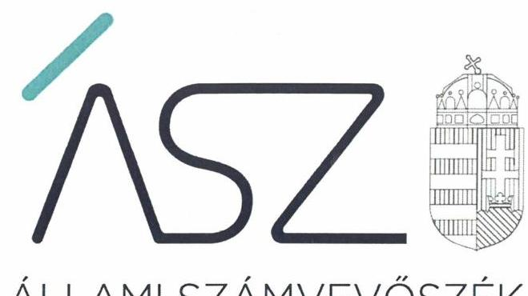
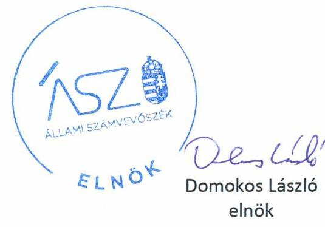
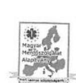
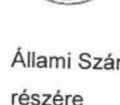
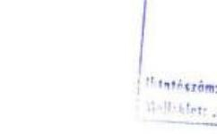
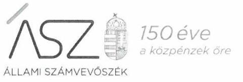
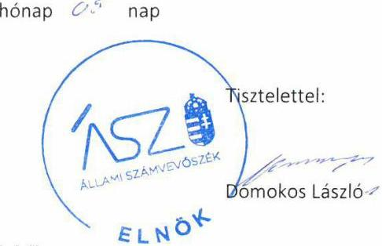
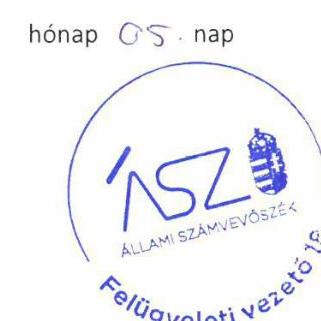

ÁLLAMI SZÁMVEVŐSZÉK

# JELENTÉS 

## Nem állami humánszolgáltatók ellenőrzése

A szociális humánszolgáltatást nyújtó intézmények, szolgáltatók államháztartáson kívüli fenntartói központi költségvetésből kapott támogatásai felhasználásának ellenőrzése Magyar Mentőszolgálat Alapítvány

2020
20113
www.asz.hu

---

ÁLLAMI SZÁMVEVŐSZÉK

# JELENTÉS 

## Nem állami humánszolgáltatók ellenőrzése

A szociális humánszolgáltatást nyújtó intézmények, szolgáltatók államháztartáson kívüli fenntartói központi költségvetésből kapott támogatásai felhasználásának ellenőrzése Magyar Mentőszolgálat Alapítvány
2020. október 30.

20113
www.asz.hu

---

# AZ ELLENŐRZÉST FELÜGYELTE: 

VARGA EDIT felügyeleti vezető
TÓTH MARIANNA felügyeleti vezető

AZ ELLENŐRZÉST VEZETTE ÉS A VÉGREHAJTÁSÁÉRT FELELŐS:
HOFMEISTER LÁSZLÓ ellenőrzésvezető

A PROGRAM ÖSSZEÁLLÍTÁSÁÉRT FELELŐS:
FEKETE-NAGY ANDRÁS GÁBOR ellenőrzési program készítéséért felelős vezető

TÓTPÁL SZABOLCS osztályvezető

Jelentéseink az Országgyúlés számítógépes hálózatán és az interneten a www.asz.hu címen is olvashatóak.

IKTATÓSZÁM: EL-2742-001/2020.
TÉMASZÁM: 2491
ELLENŐRZÉS-AZONOSÍTÓ SZÁM: V0867070, V083529

---

# TARTALOMJEGYZÉK 

■ ÖSSZEGZÉS ..... 5
— AZ ELLENŐRZÉS CÉLJA ..... 6
— AZ ELLENŐRZÉS TERÜLETE ..... 7
— AZ ELLENŐRZÉS HÁTTERE, INDOKOLTSÁGA ..... 8
— A JELENTÉS LÉNYEGES KÉRDÉSKÖREI ..... 9
— AZ ELLENŐRZÉS HATÓKÖRE ÉS MÓDSZEREI ..... 10
— MEGÁLLAPÍTÁSOK ..... 12
— MELLÉKLETEK ..... 13
I. sz. melléklet: Értelmező szótár ..... 13
— FÜGGELÉKEK ..... 15
I. sz. függelék a jelentéshez ..... 15
II. sz. függelék: Észrevételek ..... 16
— RÖVIDÍTÉSEK JEGYZÉKE ..... 21

---

.

---

# ÖSSZEGZÉS 

A dunaújvárosi székhelyű Magyar Mentőszolgálat Alapítvány nem biztosította a 2015. és a 2018. évben a szociális humánszolgáltatási közfeladatok ellátására kapott költségvetési támogatások felhasználásának ellenőrizhetőségét, a 2017. évben nem biztosította a költségvetési támogatások elszámoltathatóságát. A 2016. évben a költségvetési támogatások felhasználásának átláthatóságát és elszámoltathatóságát biztosította.

## Az ellenőrzés társadalmi indokoltsága

A szociális gondoskodást igénylők védelme, illetve a köznevelési feladatok ellátása az Alaptörvényben meghatározott, a társadalom szempontjából fontos tevékenységek. Jogszabályok teszik lehetővé, hogy államháztartáson kívüli szervezetek - így például az egyházi fenntartók, alapítványok, gazdasági társaságok, egyesületek - által fenntartott intézmények is végezzenek köznevelési, szociális és gyermekvédelmi feladatokat. Mindehhez a központi költségvetés évente jelentős összegű támogatással járul hozzá. Az államháztartáson kívüli, humánszolgáltatást végző intézmények az igényelt közpénzekből társadalmilag hasznos, közösségteremtő, közérdekű, illetve közhasznú tevékenységet végeznek, illetve közfeladatokat látnak el.

Az intézményfenntartók ellenőrzésével az Állami Számvevőszék hozzájárul ahhoz, hogy ezen közpénzeket az államháztartáson kívüli szervezetek is ellenőrizhető, átlátható és elszámoltatható módon használják fel a közfeladatok ellátása során. Az ellenőrzések célja továbbá, hogy a nyilvánosság és az igénybevevők megfelelő tájékoztatást kapjanak az államháztartáson kívüli közfeladatot ellátók működéséről.

Az ÁSZ ellenőrzései arra adnak választ, hogy az intézményfenntartók arra használták-e fel a közpénzeket, amire igényelték.

A szabályszerű gazdálkodás elengedhetetlen a közfeladat ellátás szakmai céljainak megvalósításához, valamint a társadalmi közbizalom fenntartásához.

## Megállapítások, következtetések

A Magyar Mentőszolgálat Alapítvány a 2015. és a 2018. évben a szociális humánszolgáltatási közfeladatok ellátására kapott költségvetési támogatás felhasználásának a Számv. tv. ${ }^{1}$ 161/A. § (2) bekezdésében előírt ellenőrizhetőségét nem biztosította. Mivel az Atr. ${ }^{2}$ 16. § (1) bekezdésben foglalt szabályozás ellenére nem gondoskodott arról, hogy a költségvetési támogatások felhasználásának, a Fenntartó ${ }^{3}$ és a nem önállóan gazdálkodó intézménye gazdálkodásának elkülönített, feladatonkénti és támogatásonkénti bontásban történő elszámolásához az adatok rendelkezésre álljanak.

A Fenntartó 2018. évre vonatkozóan nem készített éves számviteli beszámolót, ezáltal közpénz felhasználása nem volt elszámoltatható.

A Fenntartó mindezek alapján az Alaptörvény 39. cikk (2) bekezdésében foglaltak ellenére nem biztosította a felhasznált közpénzekre vonatkozó gazdálkodása átláthatóságát a 2015. és a 2018. években.

Ezáltal a Fenntartó nem igazolta, hogy a közpénzt a szociális humánszolgáltatási közfeladat ellátására fordította.
A Fenntartó a 2017. évi kapott támogatásaival nem számolt el a MÁK felé, ezért gazdálkodása nem volt elszámoltatható.

A 2016. évben a Fenntartó számviteli nyilvántartásában szabályszerűen elkülönítette a költségvetési támogatások felhasználását feladatonkénti bontásban.

---

# AZ ELLENŐRZÉS CÉLJA

**AZ ELLENŐRZÉS CÉLJA** annak értékelése volt, hogy a nem állami, nem önkormányzati szociális intézmények fenntartói központi költségvetésből kapott támogatásainak felhasználása szabályszerű volt-e.

---

# **AZ ELLENŐRZÉS TERÜLETE**

## **Magyar Mentőszolgálat Alapítvány**

A Magyar Mentőszolgálat Alapítvány magánszemély által alapított, 2004-ben nyilvántartásba vett, dunaújvárosi székhellyel rendelkező közhasznú alapítvány. Fő célja hajléktalan szállás működtetése.

A Magyar Mentőszolgálat Alapítvány ügyvezető szerve a háromtagú Kuratórium4.

A Magyar Mentőszolgálat Alapítvány egy Intézmény5, a Magyar Mentőszolgálat Alapítvány Hajléktalanok Átmeneti Szállása és Éjjeli Menedékhelye fenntartásával, működtetésével látta el közfeladatát. Az Intézmény nem volt önálló jogi személy, nem gazdálkodott önállóan.

2015-2018. években a hajléktalan személyek nappali ellátása 100 férőhellyel, a hajléktalan személyek átmeneti szállása 70 férőhellyel, valamint az éjjeli menedékhely 80 férőhellyel működött.

A Fenntartó kettős könyvvitelt vezetett, egyszerűsített éves beszámolót készített.

A Fenntartó a szociális feladatellátáshoz a MÁK adatai alapján a 2015. évben 263,0 M Ft, a 2016. évben 99,5 M Ft, a 2017. évben 106,4 M Ft, a 2018. évben 157,2 M Ft költségvetési támogatásban részesült.

---

# AZ ELLENŐRZÉS HÁTTERE, INDOKOLTSÁGA 

A szociális feladatokat ellátó nem állami intézményfenntartók részére közfeladataik ellátására évente jelentős összegű pénzügyi támogatást biztosítottak a mindenkori költségvetési törvények a bennük megfogalmazott feltételek mellett. A felhasználható állami támogatások Kvtv. 1,2,3,4 ${ }^{6}$-ek szerinti előirányzata 2015-2018. években együtt 360 Mrd Ft volt. A 2013. évben jelentős változások következtek be a normatív finanszírozás rendszerben. Módosították a szociális igazgatásról és szociális ellátásokról szóló 1993. évi III. törvényt, amely - többek között - 2012. január 1-jei hatállyal megfogalmazta a finanszírozási rendszerbe történő befogadással összefüggő szabályokat. Az ellenőrzések indokoltságát az is alátámasztja, hogy az ÁSZ ${ }^{7}$ számos szervezetet még nem ellenőrzött ezen a területen.

Az ÁSZ stratégiájában foglaltak alapján is indokolt az ellenőrzés, amely a társadalom számára jelzi, hogy a közpénz államháztartáson kívüli felhasználása sem maradhat ellenőrizetlenül. Az államháztartáson kívülre nyújtott költségvetési támogatások ellenőrzésével az ÁSZ hozzájárul ahhoz, hogy a közpénzeket a nem állami humán fenntartók átlátható módon használják fel a közfeladatok ellátására kötött szerződésekben vállalt kötelezettségek teljesítése érdekében. Az ellenőrzés javaslataival hozzájárulhat az említett rendszerek szabályszerű támogatás felhasználásához, javíthatja a társadalmi-gazdasági döntések megalapozottságát, amely a „jól irányított állam működésének" feltétele.

---

# A JELENTÉS LÉNYEGES KÉRDÉSKÖREI 

1. A szociális humánszolgáltató közfeladatot ellátó államháztartáson kívüli fenntartó szabályszerű működési - és gazdálkodási környezet kialakításával megteremtette-e a költségvetési támogatások átlátható, elszámoltatható igénybevételének, felhasználásának feltételeit?
2. Az államháztartáson kívüli fenntartó az átvállalt szociális humánszolgáltatási közfeladathoz biztosított költségvetési támogatásokat szabályszerűen fordította-e a humánszolgáltató intézménye működtetésére? Az intézménye működtetéséhez felhasznált közpénzekre vonatkozó gazdálkodásával a nyilvánosság előtt el-számolt-e?

---

# AZ ELLENŐRZÉS HATÓKÖRE ÉS MÓDSZEREI 

## Az ellenőrzés típusa

Megfelelőségi ellenőrzés.

## Az ellenőrzött időszak

A 2015. január 1-je és 2018. december 31-e közötti időszak.

## Az ellenőrzés tárgya

Az ellenőrzés a szociális humánszolgáltatási közfeladatokat ellátó államháztartáson kívüli fenntartók humánszolgáltatási közfeladatai ellátásához a központi költségvetésből kapott támogatásaik humánszolgáltatási közfeladatokra való fenntartó általi felhasználása szabályszerűségének értékelésére terjedt ki.

## Az ellenőrzött szervezet

Magyar Mentőszolgálat Alapítvány

## Az ellenőrzés jogalapja

Az ellenőrzés jogszabályi alapját az ÁSZ tv. ${ }^{8}$ 1. § (3) bekezdése, 5. § (3) bekezdésében foglalt előírások adták.

## Az ellenőrzés módszerei

Az ellenőrzést az ellenőrzési program annak szempontjai, kérdései, az ellenőrzött időszakban hatályos jogszabályok, a nemzetközi standardokat irányadónak tekintve, az ellenőrzés szakmai szabályok és módszertanok figyelembevételével rendelte elvégezni. A közpénzekkel való felelős gazdálkodás segítésére irányuló javaslatok kidolgozásakor a hatályos jogszabályok voltak irányadóak.

Az ellenőrzés ideje alatt az ellenőrzött szervezettel történő kapcsolattartást az ÁSZ SZMSZ ${ }^{9}$-ének vonatkozó előírásai alapján biztosította az ÁSZ.

Az ellenőrzési kérdések megválaszolásához szükséges bizonyítékok megszerzése az ellenőrzött által rendelkezésre bocsátott dokumentumokra, adatokra alapozva elemző eljárással történt.

---

Az ellenőrzési bizonyítékként felhasználható adatforrások közé tartoztak egyrészt a szakmai program részletes szempontjainál felsorolt adatforrások, másrészt minden - az ellenőrzés folyamán feltárt, az ellenőrzés szempontjából információt tartalmazó - dokumentum.

Az ellenőrzés lefolytatásához az ellenőrzött szervezet a kitöltött tanúsítványok, valamint az ÁSZ által kért dokumentumok elektronikus úton való megküldésével szolgáltatott adatokat, információkat. Az így rendelkezésre bocsátott adatok, információk és a tanúsítványok adatai valódiságának kontrollja az ellenőrzés keretében történt.

Az egységes értelmezést az ellenőrzési program mellékletét képező fogalomtár és rövidítésjegyzék támogatta.

Az ellenőrzést alapvetően szociális humánszolgáltatások esetében a központi költségvetési támogatások igénylésével, módosításával, felhasználásával, elszámolásával kapcsolatos feladatokat ellátó államháztartáson kívüli fenntartóknál/szervezeteinél végezte az ÁSZ.

A szociális humánszolgáltatások központi költségvetési támogatásaival kapcsolatos, államháztartáson kívüli fenntartó jogszabályokban előírt feladatai betartását, továbbá a központi költségvetési támogatások szabályszerű nyilvántartását ellenőrizte az ÁSZ a fenntartónál rendelkezésre álló nyilvántartások, beszámolók és egyéb dokumentumok alapján. Az ellenőrzés nem terjedt ki a szociális humánszolgáltatások központi költségvetési támogatásai igénylése, módosítása, elszámolása valódiságának, megalapozottságának, helyességének - sem a fenntartónál, sem a székhely intézményeinél való - értékelésére (mivel ennek felülvizsgálata, ellenőrzése a finanszírozó jogszabályban előírt feladata, határozatai kiadása előtt). Továbbá nem terjedt ki az ellenőrzés e források, intézmények általi szabályszerű felhasználásának értékelésére.

---

# MEGÁLLAPÍTÁSOK 

## 1. A szociális humánszolgáltató közfeladatot ellátó államháztartáson kívüli fenntartó szabályszerű működési - és gazdálkodási környezet kialakításával megteremtette-e a költségvetési támogatások átlátható, elszámoltatható igénybevételének, felhasználásának feltételeit?

Összegző megállapítás A Fenntartó szociális közfeladat ellátásának megszervezése és belső szabályozottságának kialakítása szabályszerű volt.

A Fenntartó rendelkezett Alapító okirattal, mely tartalmazta a Fenntartó cél szerinti tevékenységét.

Számviteli politikával ${ }^{10}$ és annak részeként elkészítendő szabályzatokkal, valamint számlarenddel a Fenntartó rendelkezett. A Fenntartó a számlarendjében alakított ki belső szabályozást a közfeladatokhoz rendelt költségvetési támogatások felhasználásának elkülönített nyilvántartása biztosítása érdekében.
2. Az államháztartáson kívüli fenntartó az átvállalt szociális humánszolgáltatási közfeladathoz biztosított költségvetési támogatásokat szabályszerűen fordította-e a humánszolgáltató intézménye működtetésére? Az intézménye működtetéséhez felhasznált közpénzekre vonatkozó gazdálkodásával a nyilvánosság előtt elszámolt-e?

Összegző megállapítás A Fenntartó az átvállalt szociális humánszolgáltatási közfeladathoz biztosított költségvetési támogatásokat a 2016. évben szabályszerűen fordította intézménye működtetésére, a 2017. évben a gazdálkodása nem volt elszámoltatható.

A 2016. évben számviteli nyilvántartásában a Fenntartó szabályszerűen elkülönítette a saját és humánszolgáltatást végző intézménye gazdálkodását, valamint a költségvetési támogatások felhasználását feladatonkénti - éjjeli menedékhely, hajléktalan személyek átmeneti szállása, hajléktalanok nappali intézményi ellátása - bontásban.

A Fenntartó a 2017. évi kapott támogatásaival nem számolt el a MÁK ${ }^{11}$ felé az Atr. 17. § (1) bekezdés előírása ellenére.

---

# MELLÉKLETEK 

- I. SZ. MELLÉKLET: ÉRTELMEZŐ SZÓTÁR
humánszolgáltatás
költségvetési támogatás
nem állami, nem önkormányzati (államháztartáson kívüli) intézmény fenntartó

Külön törvényben meghatározott szociális, gyermekjóléti, gyermekvédelmi, közoktatási, felsőoktatási, kulturális közfeladatok (2014. évi Kvtv. 34. § (1), (4) bekezdés, 1. számú melléklet XX/20/2. alcím, 19. alcím, 2015. évi Kvtv. 43. § (1), (4) bekezdés, 1. számú melléklet XX/20/2/3. jogcím csoport, 19. alcím, 2016. évi Kvtv. 41. § (1), (4) bekezdés, 1. számú melléklet XX/20/2/3. jogcím csoport, 19. alcím, 2017. évi Kvtv. 41. § (1), (4) bekezdés, 1. számú melléklet XX/20/2/3. jogcím csoport, 19. alcím).
A társadalombiztosítás pénzügyi alapjai kivételével az államháztartás központi alrendszeréből ellenérték nélkül, pénzben nyújtott támogatások (Áht. 1. § 14. pont)
A költségvetési törvényben (2016. évi XC. törvény 40. §) megállapított támogatás többek között: Átlagbéralapú támogatást állapít meg a nevelési-oktatási, valamint pedagógiai szakszolgálati intézményt fenntartó nemzetiségi önkormányzat, az egyházi és magán köznevelési intézmény fenntartója részére az általuk fenntartott nevelési-oktatási intézményben, továbbá pedagógiai szakszolgálati intézményben pedagógus és - a (3)
 bekezdés kivételével - a nevelő-oktató munkát közvetlenül segítő munkakörben foglalkoztatottak után a 7. melléklet I. pontjában meghatározott jogosultak után, az őket ott megillető mértékek szerint. Működési támogatást állapít meg a nemzetiségi önkormányzat vagy az egyházi jogi személy által fenntartott nevelési-oktatási intézményekben ellátott, továbbá a pedagógiai szakszolgálati intézményekben gyógypedagógiai tanácsadásban, korai fejlesztésben, oktatásban és gondozásban, valamint a fejlesztő nevelésben részt vevő gyermekekre, tanulókra tekintettel a nemzetiségi önkormányzat és a bevett egyház részére a 7. melléklet II. pontja szerint.
A szociális, gyermekjóléti és gyermekvédelmi közfeladatokat/humánszolgáltatásokat ellátó intézményt fenntartó egyházi jogi személy, társadalmi szervezet, alapítvány, közalapítvány, civil szervezet, országos nemzetiségi önkormányzat, nonprofit gazdasági társaság, gazdasági társaság és a humánszolgáltatást alaptevékenységként végző, Szja tv. hatálya alá tartozó egyéni vállalkozó. (2017. évi Kvtv. 41. § (1), (4) bekezdés

---

.

---

# FÜGGELÉKEK 

- I. SZ. FÜGGELÉK A JELENTÉSHEZ

Az Állami Számvevőszék az ellenőrzések során feltárt tényekhez kapcsolódó további körülmények tisztázására eszközrendszerrel nem rendelkezik. Amennyiben az ellenőrzésen túlmutatóan indokoltnak látszik az ellenőrzés során feltárt körülmények további vizsgálata, az Állami Számvevőszék törvényi felhatalmazás alapján az ellenőrzés által feltárt körülményeket továbbítja a hatáskörrel rendelkező szervnek a szükséges intézkedések megtétele, eljárások lefolytatása érdekében.

A Fenntartó részére szociális közfeladat ellátásra biztosított költségvetési támogatások összege a MÁK adatai alapján 2015. évben 263,0 M Ft, 2016. évben 99,5 M Ft, 2017. évben 106,1 M Ft, 2018. évben pedig 157,2 M Ft volt.
I.

A Fenntartó a 2018. évben a Civil tv. ${ }^{12}$ 28. § (1) bekezdésében és a Számv. tv. 4. § (1) bekezdésében előírt éves beszámoló készítési kötelezettségének - figyelemmel a Számv. tv. 20. § (6) bekezdésében foglaltakra - nem tett eleget.

Ennek hiányában nem számolt be, a közfeladatra kapott költségvetési támogatások elszámolásának hitelessége nem volt biztosított.
Az eset konkrét körülményeinek feltárására az illetékes törvényszék rendelkezik hatáskörrel.
II.

A Fenntartó a teljességi és hitelességi nyilatkozata és az ellenőrzés rendelkezésére adott iratai szerint a 2015. és a 2018. év vonatkozásában a Számv. tv. 161/A. § (2) bekezdésének előírása ellenére nem gondoskodott a közpénzek felhasználásának ellenőrizhetősége érdekében a könyvvezetési rendszerének oly módon való továbbrészletezéséről, hogy abból az Atr. 16. § (1) bekezdése szerinti kötelezettségnek eleget téve, a külön jogszabályban meghatározott - a fenntartó és az intézménye gazdálkodásának elkülönített elszámolására, valamint feladatonként bontásban a támogatás-felhasználásra vonatkozó - adatok rendelkezésre álljanak.
A Fenntartónál az elkülönített nyilvántartás vezetésének elmaradása miatt felmerült a támogatások nem rendeltetésszerű felhasználásának gyanúja. Ezáltal nem zárható ki, hogy a költségvetésből származó pénzeszközöket a jóváhagyott céltól eltérően használta fel.
Az eset konkrét körülményeinek feltárására a Magyar Államkincstár rendelkezik hatáskörrel.

---

A jelentéstervezetet a Számvevőszék 15 napos észrevételezésre megküldte az ellenőrzött szervezet vezetőjének az ÁSZ tv. 29. § (1) bekezdése előírásának megfelelően.

A Magyar Mentőszolgálat Alapítvány kuratóriumi elnöke élt az ÁSZ tv. 29. § (2) bekezdésében foglalt észrevételezési jogával, a jelentéstervezet megállapításaira a törvényes határidőn belül észrevételt tett.
A Magyar Mentőszolgálat Alapítvány kuratóriumi elnökének észrevételét és az arra adott választ a függelék tartalmazza.

[^0]
[^0]:    * 29. § (1) Az Állami Számvevőszék az ellenőrzési megállapításait megküldi az ellenőrzött szervezet vezetőjének vagy az általa megbízott személynek, és annak, akinek személyes felelősségét állapította meg.
    (2) Az ellenőrzött szervezet vezetője és a felelősként megjelölt személy az ellenőrzés megállapításaira tizenöt napon belül írásban észrevételt tehet.
    (3) Az Állami Számvevőszék az észrevételre a beérkezésétől számított harminc napon belül írásban válaszol. A figyelembe nem vett észrevételeket köteles a jelentésben feltüntetni, és megindokolni, hogy azokat miért nem fogadta el.

---

# 12.5.5 

MAGYAR MENTŐSZOLGÁLAT ALAPÍTVÁNY - KURATÓRIUM ELNÖKE
232400 Dunaújváros, Papirgyári út 11.
Tel.: 06/20/ 227-8676
E-mail: pribilsandor@gmail.com
Állami Számvevőszék elnöke
részére

Tisztelt Elnök Úr!

ASZ0000001080

EL-1169-064/2020. Ikt. számú levelük mellékletében küldött, „A humánszolgáltatást nyújtó államháztartáson kívüli szociális intézmények, szolgáltatók fenntartói központi költségvetésből kapott támogatásai felhasználásának ellenőrzése - Magyar Mentőszolgálat Alapítvány" című számvevőszéki jelentéstervezetükre az alábbi észrevételt teszem.
Az jelentéstervezetben foglaltakkal nem értek egyet.

- A Magyar Mentőszolgálat Alapítvány minden évben eleget tesz a szociális humánszolgáltatási közfeladatok ellátására kapott költségvetési támogatás felhasználásának elszámolásáról a Magyar Államkincstár felé.
- A Magyar Mentőszolgálat Alapítvány minden évben elkészíti éves számviteli beszámolóját és azt a jogszabályban előírt módon határidőben közzé is teszi.
- A Magyar Mentőszolgálat Alapítvány könyvelését évek óta külső könyvelő irodával végezteti. A könyvelő iroda a Magyar Államkincstár által 2018-ban feltárt hiányosságokat könyvvezetési gyakorlatában megszüntette, így a költségvetési támogatások felhasználásának, a Fenntartó és a nem önállóan gazdálkodó intézménye gazdálkodásának elkülönített, feladatonkénti és támogatáskénti bontásra történő elszámoláshoz az adatok rendelkezésre állnak. Ennek megfelelően a Magyar Mentőszolgálat Alapítvány a szociális humánszolgáltatási közfeladatok ellátására kapott költségvetési támogatás felhasználásának előírt ellenőrizhetőségét biztosítja.

Dunaújváros, 2020. 05. 18.

Magyar Mentőszolgálat Alapítvány
A. 1169-064/2020. Ikt. számú levelük mellékletében küldött, „A humánszolgáltatást nyújtó államháztartáson kívüli szociális intézmények, szolgáltatók fenntartói központi költségvetésből kapott támogatásai felhasználásának ellenőrzése - Magyar Mentőszolgálat Alapítvány" című számvevőszéki jelentéstervezetükre az alábbi észrevételt teszem.
Az jelentéstervezetben foglaltakkal nem értek egyet.

- A Magyar Mentőszolgálat Alapítvány minden évben eleget tesz a szociális humánszolgáltatási közfeladatok ellátására kapott költségvetési támogatás felhasználásának elszámolásáról a Magyar Államkincstár felé.
- A Magyar Mentőszolgálat Alapítvány minden évben elkészíti éves számviteli beszámolóját és azt a jogszabályban előírt módon határidőben közzé is teszi.
- A Magyar Mentőszolgálat Alapítvány könyvelését évek óta külső könyvelő irodával végezteti. A könyvelő iroda a Magyar Államkincstár által 2018-ban feltárt hiányosságokat könyvvezetési gyakorlatában megszüntette, így a költségvetési támogatások felhasználásának, a Fenntartó és a nem önállóan gazdálkodó intézménye gazdálkodásának elkülönített, feladatonkénti és támogatáskénti bontásra történő elszámoláshoz az adatok rendelkezésre állnak. Ennek megfelelően a Magyar Mentőszolgálat Alapítvány a szociális humánszolgáltatási közfeladatok ellátására kapott költségvetési támogatás felhasználásának előírt ellenőrizhetőségét biztosítja.

Dunaújváros, 2020. 05. 18.

Magyar Mentőszolgálat Alapítvány
A. 1169-064/2020. Ikt. számú levelük mellékletében küldött, „A humánszolgáltatást nyújtó államháztartáson kívüli szociális intézmények, szolgáltatók fenntartói központi költségvetésből kapott támogatásai felhasználásának ellenőrzése - Magyar Mentőszolgálat Alapítvány" című számvevőszéki jelentéstervezetükre az alábbi észrevételt teszem.
Az jelentéstervezetben foglaltakkal nem értek egyet.

- A Magyar Mentőszolgálat Alapítvány minden évben eleget tesz a szociális humánszolgáltatási közfeladatok ellátására kapott költségvetési támogatás felhasználásának elszámolásáról a Magyar Államkincstár felé.
- A Magyar Mentőszolgálat Alapítvány minden évben elkészíti éves számviteli beszámolóját és azt a jogszabályban előírt módon határidőben közzé is teszi.
- A Magyar Mentőszolgálat Alapítvány könyvelését évek óta külső könyvelő irodával végezteti. A könyvelő iroda a Magyar Államkincstár által 2018-ban feltárt hiányosságokat könyvvezetési gyakorlatában megszüntette, így a költségvetési támogatások felhasználásának, a Fenntartó és a nem önállóan gazdálkodó intézménye gazdálkodásának elkülönített, feladatonkénti és támogatáskénti bontásra történő elszámoláshoz az adatok rendelkezésre állnak. Ennek megfelelően a Magyar Mentőszolgálat Alapítvány a szociális humánszolgáltatási közfeladatok ellátására kapott költségvetési támogatás felhasználásának elszámolásáról a Magyar Államkincstár felé.
- A Magyar Mentőszolgálat Alapítvány minden évben elkészíti éves számviteli beszámolóját és azt a jogszabályban előírt módon határidőben közzé is teszi.
- A Magyar Mentőszolgálat Alapítvány könyvelését évek óta külső könyvelő irodával végezteti. A könyvelő iroda a Magyar Államkincstár által 2018-ban feltárt hiányosságokat könyvvezetési gyakorlatában megszüntette, így a költségvetési támogatások felhasználásának, a Fenntartó és a nem önállóan gazdálkodó intézménye gazdálkodásának elkülönített, feladatonkénti és támogatáskénti bontásra történő elszámoláshoz az adatok rendelkezésre állnak. Ennek megfelelően a Magyar Mentőszolgálat Alapítvány a szociális humánszolgáltatási közfeladatok ellátására kapott költségvetési támogatás felhasználásának elszámolásáról a Magyar Államkincstár felé.
- A Magyar Mentőszolgálat Alapítvány minden évben elkészíti éves számviteli beszámolóját és azt a jogszabályban előírt módon határidőben közzé is teszi.
- A Magyar Mentőszolgálat Alapítvány könyvelését évek óta külső könyvelő irodával

---

Ikt. szám: EL-1169-070/2020.

Pribil Sándor úr
kuratóriumi elnök

Magyar Mentőszolgálat Alapítvány

# Dunaújváros 

Tisztelt Elnök Úr!
A. Nem állami humánszolgáltatók ellenőrzése - A szociális humánszolgáltatást nyújtó intézmények, szolgáltatók államháztartáson kívüli fenntartói központi költségvetésből kapott támogatásai felhasználásának ellenőrzése - Magyar Mentőszolgálat Alapítvány" címmel készített számvevőszéki jelentéstervezetre tett, 2020. május 18-i keltezésű levelében megküldött észrevételeit köszönettel megkaptam.

Az Állami Számvevőszék észrevételekre vonatkozó álláspontjáról a felügyeleti vezető által készített részletes tájékoztatást csatoltan megküldöm.

Tájékoztatom Elnök urat, hogy a számvevőszéki jelentésben - az Állami Számvevőszékről szóló 2011. évi LXVI. törvény 29. § (3) bekezdése alapján - a figyelembe nem vett észrevételeket szerepeltetjük az elutasítás indokának feltüntetésével.

Budapest, 2020.

Melléklet: Tájékoztatás az észrevételek kezeléséről

---

# Tájékoztatás   az észrevételek kezeléséről 

A „Nem állami humánszolgáltatók ellenőrzése - A szociális humánszolgáltatást nyújtó intézmények, szolgáltatók államháztartáson kívüli fenntartói központi költségvetésből kapott támogatásai felhasználásának ellenőrzése - Magyar Mentőszolgálat Alapítvány" címú jelentéstervezetre (továbbiakban: jelentéstervezet) a Magyar Mentőszolgálat Alapítvány (továbbiakban: Fenntartó) kuratóriuma elnökének a 2020. május 18-i keltezésű levelében megküldött észrevételeit áttekintettem. Az észrevételek kezeléséről az alábbi tájékoztatást adom.

## 1. A jelentéstervezet Összegzés - Megállapítások, Következtetések rész 5. bekezdéséhez és a 2. sz. megállapítás 2. bekezdéséhez tett észrevétel

Elnök úr észrevételében leírta, hogy a Magyar Mentőszolgálat Alapítvány minden évben eleget tesz a szociális humánszolgáltatási közfeladatok ellátására kapott költségvetési támogatások felhasználásának elszámolásáról a Magyar Államkincstár felé.
Az Állami Számvevőszék (továbbiakban: ÁSZ) az ellenőrzési megállapításait az adatszolgáltatás során a részére törvényi határidőben rendelkezésre bocsátott dokumentumokra alapozva fogalmazza meg.
Az ÁSZ az EL-1169-009/2018. iktatószámú adatbekérő levél 2. sz. mellékletének 24-26. pontjaiban a 2015-2017. évekre vonatkozóan a költségvetési támogatások elszámolását megalapozó dokumentumokat és az elszámolás elfogadásáról szóló kincstári határozatokat kérte beküldeni. A Fenntartó az egyházi és nem állami fenntartású szociális, gyermekjóléti és gyermekvédelmi szolgáltatók, intézmények és hálózatok állami támogatásáról szóló 489/2013. (XII. 18.) Korm. rendelet (továbbiakban: Atr.) 17. § (1) bekezdése előírásai ellenére a 2017. évi központi költségvetési támogatás elszámolására vonatkozó dokumentumokat, az ellenőrzés részére nem küldte meg. A kuratórium elnöke által aláírt 2019. február 18-i keltezésű "Teljességi és hitelességi nyilatkozat" sem tartalmazza a 2017. évi központi költségvetési támogatás elszámolására vonatkozó dokumentumot.

A fentiekre tekintettel az észrevételt nem fogadom el, a jelentéstervezet megállapításának módosítása nem indokolt.

## 2. A jelentéstervezet Összegzés - Megállapítások, Következtetések rész 2. bekezdésére és az I. sz. függelék 1. bekezdésére vonatkozó észrevétel

Elnök úr észrevételében tájékoztatott arról, hogy a Magyar Mentőszolgálat Alapítvány minden évben elkészíti éves számviteli beszámolóját és azt a jogszabályban előírt módon határidőben közzé is teszi.

---

Az ÁSZ az EL-1169-040/2019. iktatószámú adatbekérő levél 2. sz. mellékletének 1.5. pontjában az államháztartáson kívüli fenntartó képviseletre jogosult személy által aláírt 2018. évi számviteli beszámolóját kérte beküldeni. A Fenntartó postai úton küldte be a 2018. évi számviteli beszámolóját, amelynek 2. oldalán a „Képviselő aláírása" sor nem tartalmaz aláírást.
A fentiekre tekintettel az észrevételt nem fogadom el, a jelentéstervezet megállapításának módosítása nem indokolt.

# 3. A jelentéstervezet Összegzés - Megállapítások, Következtetések rész 1. bekezdésére vonatkozó észrevétel 

Elnök úr észrevételében leírta, hogy a Fenntartó könyvelését évek óta külső könyvelő irodával végezteti. A könyvelő iroda a Magyar Államkincstár által 2018-ban feltárt hiányosságokat könyvvezetési
 gyakorlatában megszüntette, így a költségvetési támogatások felhasználásának, a Fenntartó és a nem önállóan gazdálkodó intézménye gazdálkodásának elkülönített, feladatonkénti és támogatásonkénti bontásra történő elszámolásához az adatok rendelkezésre állnak. Ennek megfelelően a Fenntartó a szociális humánszolgáltatási közfeladatok ellátására kapott költségvetési támogatás felhasználásának előírt ellenőrizhetőségét biztosítja.
Az ÁSZ az EL-1169-009/2018. iktatószámú adatbekérő levél 2. sz. mellékletének 34. pontjában a 2015-2017. évekre vonatkozóan, az EL-1169-040/2019. iktatószámú adatbekérő levél 2. sz. mellékletének 1.1. pontjában pedig a 2018. évre vonatkozóan a szociális közfeladat ellátására kapott támogatás elkülönített nyilvántartását alátámasztó dokumentumokat kérte beküldeni.
A Fenntartó a 2015. évre vonatkozóan a közfeladat ellátására kapott támogatás felhasználásának elkülönített nyilvántartását, továbbá a támogatások felhasználásának feladatonkénti elkülönítését dokumentummal nem igazolta. A Fenntartó által a 2018. év vonatkozásában megküldött főkönyvi kivonat alapján a támogatások feladatonkénti elkülönítése nem igazolt, továbbá a főkönyvi kivonat a támogatások felhasználására vonatkozó feladatonkénti megbontását sem tartalmazza.
A fentiekre tekintettel az észrevételt nem fogadom el, a jelentéstervezet megállapításának módosítása nem indokolt.

Budapest, 2020.

Varga Edit s.k.
felügyeleti vezető
A kiadmány hiteles

---

# RÖVIDÍTÉSEK JEGYZÉKE 

${ }^{1}$ Számv. tv.
${ }^{2}$ Atr.
${ }^{3}$ Fenntartó
${ }^{4}$ Kuratórium
${ }^{5}$ Intézmény
${ }^{6}$ Kvtv. $1,2,3,4$
${ }^{7}$ ÁSZ
${ }^{8}$ ÁSZ tv.
${ }^{9}$ ÁSZ SZMSZ
${ }^{10}$ Számviteli politika
${ }^{11}$ MÁK
${ }^{12}$ Civil tv.
2000. évi C. törvény a számvitelről (hatályos 2001. január 1-jétől)

489/2013. (XII. 18.) Korm. rendelet az egyházi és nem állami fenntartású szociális, gyermekjóléti és gyermekvédelmi szolgáltatók, intézmények és hálózatok állami támogatásáról (hatályos 2014. január 1-jétől)
Magyar Mentőszolgálat Alapítvány
Magyar Mentőszolgálat Alapítvány kuratóriuma
Magyar Mentőszolgálat Alapítvány Hajléktalanok Átmeneti Szállása és Éjjeli Menedékhelye
Kvtv.1: Magyarország 2015. évi központi költségvetéséről szóló 2014. évi C. törvény (hatályos: 2015. január 1-jétől 2018. december 31-éig)
Kvtv.2: Magyarország 2016. évi központi költségvetéséről szóló 2015. évi C. törvény (hatályos: 2015. július 4-étől)
Kvtv.3: Magyarország 2017. évi központi költségvetéséről szóló 2016. évi XC. törvény (hatályos: 2016. november 1-jétől)
Kvtv.4: Magyarország 2018. évi központi költségvetéséről szóló 2017. évi C. törvény (hatályos: 2017. november 1-jétől)
Állami Számvevőszék
2011. évi LXVI. törvény az Állami Számvevőszékről
az Állami Számvevőszék Szervezeti és Működési Szabályzata
Számviteli politika1: Magyar Mentőszolgálat Alapítvány Számviteli Politika 2015 (hatályos: 2015. január 1-jétől)
Számviteli politika2: Magyar Mentőszolgálat Alapítvány Számviteli Politika 2016 (hatályos: 2016. január 1-jétől)
Számviteli politika3: Magyar Mentőszolgálat Alapítvány Számviteli Politika 2017 (hatályos: 2017. január 1-jétől)
Számviteli politika4: Magyar Mentőszolgálat Alapítvány Számviteli Politika 2018 (hatályos: 2018. január 1-jétől)
Magyar Államkincstár
Az egyesülési jogról, a közhasznú jogállásról, valamint a civil szervezetek működéséről és támogatásáról szóló 2011. évi CLXXV. törvény (hatályos 2011. december 22-étől)

---

# ASZ 

ÁLLAMI SZÁMVEVŐSZÉK
1052 Budapest, Apáczai Cs. J. u. 10. I 1364 Budapest 4. Pf. 54 TEL: +36 14849100
email: szamvevoszek@asz.hu
web: www.asz.hu | www.aszhirportal.hu

